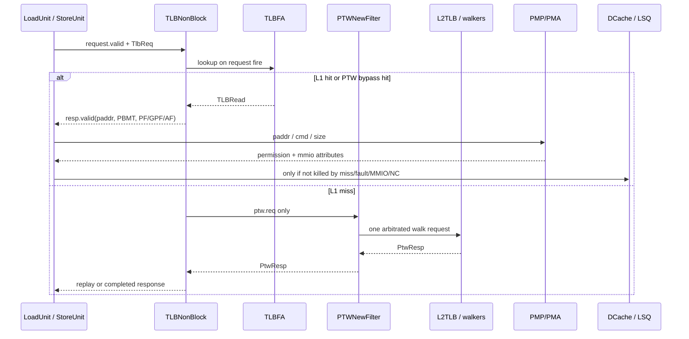
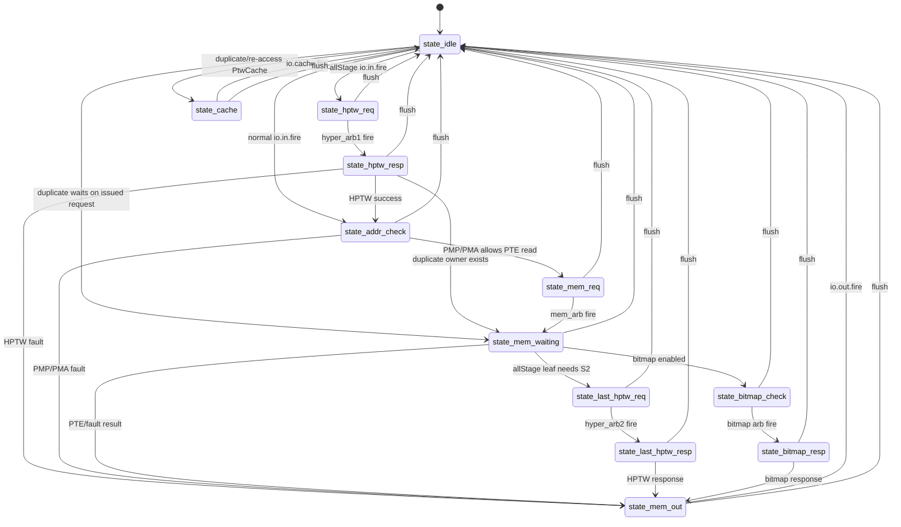

# LoadStore-MMU：Kunminghu V2 访存单元 MMU 源码分析

> 本文严格以用户指定的 Kunminghu V2 本地源码为行为证据。课程材料只用于解释术语和组织章节，不能替代 RTL/Chisel 连线。
>
> 结论先行：昆明湖 V2 的数据侧 MMU 不是一个只做 VPN 到 PPN 查表的孤立模块。`MemBlock` 将 load、store 与预取 requestor 接到三组非阻塞 L1 DTLB；L1 hit 回送 `paddr/gpaddr/PBMT/页表异常`，独立 PMP/PMA checker 随后以物理地址作属性与访问许可判断。L1 miss 被 `PTWNewFilter` 按请求类别合并，经共享 L2TLB、页表缓存与 PTW/LLPTW/HPTW 访问 TileLink，再以 refill、同拍 bypass 或 `tlbreplay` 重放收束。DCache 的虚拟地址 S0 与 TLB 并行，但 TLB miss、页故障、访问故障、MMIO/NC 会在后续阶段 kill 该 cache 路径；最终 load/store 的提交、MMIO 时序和异常写回属于 LSQ/ROB 边界，而非 TLB 本体。

## 1. 范围、版本与证据边界

### 1.1. 本文覆盖的闭环

本文分析数据侧地址翻译与其访存接入，覆盖：

```text
issue / replay / prefetch request
  -> LoadUnit 或 StoreUnit S0 的 TLB request
  -> L1 DTLB lookup / PMP-PMA response
  -> L1 miss filter -> shared L2TLB -> PtwCache / walkers -> TileLink
  -> refill / bypass / tlbreplay
  -> LoadUnit、StoreUnit、LSQ 的异常、MMIO/NC 与 replay 分流
```

范围不包括前端 ITLB 的内部流水、DCache/LSQ 的全部实现、以及某次仿真的真实时序。ITLB 与 DTLB 共用 L2TLB 输入仲裁这一事实会说明，但不会把前端行为混入数据侧结论。

| 项目 | 固定基线 / 处理方式 |
|---|---|
| 源码 checkout | `/home/yanyusong/xs-memory-env/XiangShan` |
| 分支与提交 | `kunminghu-v2` @ `e12436c7cba86b195deec24981976d78bc263661` |
| 主要源码 | [MemBlock.scala](/home/yanyusong/xs-memory-env/XiangShan/src/main/scala/xiangshan/mem/MemBlock.scala:262)、[TLB.scala](/home/yanyusong/xs-memory-env/XiangShan/src/main/scala/xiangshan/cache/mmu/TLB.scala:48)、[TLBStorage.scala](/home/yanyusong/xs-memory-env/XiangShan/src/main/scala/xiangshan/cache/mmu/TLBStorage.scala:86)、[Repeater.scala](/home/yanyusong/xs-memory-env/XiangShan/src/main/scala/xiangshan/cache/mmu/Repeater.scala:163)、[L2TLB.scala](/home/yanyusong/xs-memory-env/XiangShan/src/main/scala/xiangshan/cache/mmu/L2TLB.scala:35)、[PageTableWalker.scala](/home/yanyusong/xs-memory-env/XiangShan/src/main/scala/xiangshan/cache/mmu/PageTableWalker.scala:99) |
| 工作树说明 | checkout 原本已有 `difftest` 修改和 `src/main/resources/aia/` 未跟踪内容；本文未触碰它们。所引 Scala 主树在检查时没有该路径上的 tracked diff。 |
| 官方 Design Doc | 本机未发现 skill 约定的 `XiangShan-Design-Doc` checkout。因此 **Design Doc baseline: not consulted (local checkout unavailable)**；不能虚构 MMU 设计文档映射。 |
| skill 同步 | 已按当前 `xiangshan-code-analyzer` skill 做保守周同步检查；状态距上次同步不足 7 天，因此未 pull、reset 或 clean。 |

## 2. 关键源码证据

| ID | 来源 | 本文中的用途 | 结论状态 |
|---|---|---|---|
| D0 | 官方 Design Doc | 本机缺失，未读取 | 不可用 |
| C0 | 课程总览，如 [14_LoadStore.md](/home/yanyusong/XiangShanLab/xiangshan-course/docs/xiangshan-microarchitecture/Beginner_Implementation_and_Principles_of_the_High_Performance_Xiangshan_Processor/14_LoadStore.md:269) | 解释 LSU、TLB、PMP、PTW 的课堂语境 | 仅背景 |
| S0 | 上述 pinned checkout 的 Chisel 源码 | 端口、状态、仲裁、异常与地址路径 | 本文唯一行为证据 |

下文的“已验证”均可回链到 S0；“推导”会注明参数前提；“待波形验证”表示仅靠源码无法确认具体事务、周期或某个触发序列。不能把代码中的结构性一拍寄存器，扩大表述成软件可见的固定 load latency。

## 3. 理论、设计意图与有效代码映射

课程材料中的“TLB 命中、PTW miss、PMP 检查、MMIO 强序”是理解术语的理论层；本文件的有效行为只来自下表所列的已实例化源码。由于正式 Design Doc checkout 缺失，本章不把任何课程叙述升级为 design intent 证据。

| 层次 | 本文使用方式 | 有效代码映射 | 状态 |
|---|---|---|---|
| 理论 | 课程说明 TLB、PMP、PTW、LSQ/ROB 的职责边界 | 仅帮助读者定位术语 | 背景，不作行为证据 |
| Design intent | 本机无正式 Design Doc checkout | 无可引用的 Design Doc 行级映射 | D0：not consulted |
| 有效实现 | `MemBlock -> TLBNonBlock -> PTWNewFilter -> L2TLB -> PtwCache/walkers -> TileLink` | [MemBlock.scala:686](/home/yanyusong/xs-memory-env/XiangShan/src/main/scala/xiangshan/mem/MemBlock.scala:686)、[Repeater.scala:338](/home/yanyusong/xs-memory-env/XiangShan/src/main/scala/xiangshan/cache/mmu/Repeater.scala:338)、[L2TLB.scala:125](/home/yanyusong/xs-memory-env/XiangShan/src/main/scala/xiangshan/cache/mmu/L2TLB.scala:125) | S0：已验证 |

| 主题 | 关键证据 | 已验证事实 |
|---|---|---|
| 参数与模式 | [Parameters.scala:214](/home/yanyusong/xs-memory-env/XiangShan/src/main/scala/xiangshan/Parameters.scala:214)、[Parameters.scala:252](/home/yanyusong/xs-memory-env/XiangShan/src/main/scala/xiangshan/Parameters.scala:252)、[Parameters.scala:266](/home/yanyusong/xs-memory-env/XiangShan/src/main/scala/xiangshan/Parameters.scala:266) | 默认定义 load/store 流水宽度、ASID/VMID 宽度及各 L1 TLB 参数。 |
| DTLB 组装 | [MemBlock.scala:686](/home/yanyusong/xs-memory-env/XiangShan/src/main/scala/xiangshan/mem/MemBlock.scala:686)、[MemBlock.scala:742](/home/yanyusong/xs-memory-env/XiangShan/src/main/scala/xiangshan/mem/MemBlock.scala:742) | 三组 L1 DTLB、PTW 返回路由、filter 与 L2 接口的真实连线。 |
| 请求/响应 bundle | [MMUBundle.scala:563](/home/yanyusong/xs-memory-env/XiangShan/src/main/scala/xiangshan/cache/mmu/MMUBundle.scala:563)、[MMUBundle.scala:669](/home/yanyusong/xs-memory-env/XiangShan/src/main/scala/xiangshan/cache/mmu/MMUBundle.scala:669) | `TlbReq/TlbResp` 字段及 `TlbIO` 边界。 |
| L1 lookup/refill | [TLB.scala](/home/yanyusong/xs-memory-env/XiangShan/src/main/scala/xiangshan/cache/mmu/TLB.scala:250)、[TLBStorage.scala](/home/yanyusong/xs-memory-env/XiangShan/src/main/scala/xiangshan/cache/mmu/TLBStorage.scala:97) | storage lookup、PTW bypass、refill 和 replacement。 |
| miss 合并与 L2 | [Repeater.scala](/home/yanyusong/xs-memory-env/XiangShan/src/main/scala/xiangshan/cache/mmu/Repeater.scala:338)、[L2TLB.scala](/home/yanyusong/xs-memory-env/XiangShan/src/main/scala/xiangshan/cache/mmu/L2TLB.scala:125) | load/store/prefetch filter、L2 request counter、PtwCache 和 walkers。 |
| LSU 消费翻译结果 | [LoadUnit.scala](/home/yanyusong/xs-memory-env/XiangShan/src/main/scala/xiangshan/mem/pipeline/LoadUnit.scala:383)、[StoreUnit.scala](/home/yanyusong/xs-memory-env/XiangShan/src/main/scala/xiangshan/mem/pipeline/StoreUnit.scala:215) | Load/Store S0 并行发出 DTLB 与 DCache 请求，S1/S2 处理结果。 |
| 异常与非缓存路径 | [LoadQueueUncache.scala](/home/yanyusong/xs-memory-env/XiangShan/src/main/scala/xiangshan/mem/lsqueue/LoadQueueUncache.scala:122)、[StoreQueue.scala](/home/yanyusong/xs-memory-env/XiangShan/src/main/scala/xiangshan/mem/lsqueue/StoreQueue.scala:824) | MMIO/NC 最终由 LSQ/ROB 约束，不是 TLB 内部提交。 |

## 4. 理论与有效实现

### 4.1. Who / Why / How / From / To

| 模块 | Who（谁拥有） | Why（为什么存在） | How（如何工作） | From / To |
|---|---|---|---|---|
| `TLBNonBlock` | `MemBlock` 的 load/store/prefetch DTLB | 并发处理 L1 翻译与 miss replay | 捕获 request，查 L1 storage；miss 时向 PTW 发 request 或 replay | LSU requestor ↔ PTW/filter；PMP request/mode 独立输出 |
| `TLBFA` | L1 TLB storage | 保存可匹配的页表项 | 寄存器阵列并行比较、寄存 hit 向量、按 replacement 写入 | From `TLB` lookup/refill；To `TLBRead` |
| `PTWNewFilter` | data-side DTLB miss 汇聚层 | 抑制同页重复 walk，复用一个 L2 data 端口 | load/store/prefetch 三类 entry，重复请求合并，RR 发出 | From 各 DTLB `ptw.req`；To `ptw.io.tlb(1)` |
| `L2TLBWrapper/L2TLB` | MemBlock 的共享 PTW | 将 ITLB/DTLB request 接入页表缓存和 walkers | arbiter、miss queue、PtwCache、PTW/LLPTW/HPTW，TileLink master | From `tlb(0/1)`；To L2 TileLink node |
| `PMPChecker` | MemBlock / walkers | 用已形成的物理地址给访问许可和 PMA 属性 | 每个 DTLB requestor 一组 checker；walker 也有独立 checker | From TLB `paddr`、CSR/PMP/PMA；To Load/Store/Walker |
| `LoadUnit/StoreUnit` | LSU | 把翻译、DCache、LSQ、异常和 replay 汇合 | S0 并行发 request；S1 取得 TLB response；S2 合并 PMP/PBMT | issue/replay ↔ TLB/PMP/DCache/LSQ |

### 4.2. 有效模块连接

```mermaid
flowchart LR
  I[issue / replay / prefetch] --> LU[LoadUnit S0]
  I --> SU[StoreUnit S0]
  LU -->|TlbReq| LDTLB[load TLBNonBlock]
  SU -->|TlbReq| STTLB[store TLBNonBlock]
  PF[stream / L2-to-L1 prefetch] --> PFTLB[prefetch TLBNonBlock]
  LDTLB -->|hit: paddr, exception, PBMT| LU
  STTLB -->|hit: paddr, exception, PBMT| SU
  LDTLB -->|miss| F[PTWNewFilter]
  STTLB -->|miss| F
  PFTLB -->|miss| F
  F -->|PTW req, RR arbitration| L2[L2TLB tlb(1)]
  ITLB[front-end ITLB] --> L2I[L2TLB tlb(0)]
  L2 --> PC[PtwCache / MissQueue]
  L2I --> PC
  PC --> W[PTW / LLPTW / HPTW]
  W -->|TileLink PTE access| MEM[Memory system]
  W -->|refill / resp| L2
  L2 -->|PtwResp| F
  F -->|PtwResp| LDTLB
  F -->|PtwResp| STTLB
  LDTLB -->|tlbreplay| LU
  STTLB -->|tlbreplay| SU
  LDTLB -->|paddr| PMP[PMP/PMA checker]
  STTLB -->|paddr| PMP
  PMP --> LU
  PMP --> SU
  LU --> DC[DCache / LSQ / Uncache]
  SU --> DC
```

图中 `tlb(0)` 是 ITLB 输入、`tlb(1)` 是 data-side filter 输入；这是 L2TLB 的两个上游槽位，不表示数据侧有两条独立 PTW。[L2TLB.scala:183](/home/yanyusong/xs-memory-env/XiangShan/src/main/scala/xiangshan/cache/mmu/L2TLB.scala:183)  `MemBlock` 通过 `L2TLBWrapper` 的 TileLink node 接到 L2 一侧，见 [MemBlock.scala:262](/home/yanyusong/xs-memory-env/XiangShan/src/main/scala/xiangshan/mem/MemBlock.scala:262) 与 [L2TLB.scala:1044](/home/yanyusong/xs-memory-env/XiangShan/src/main/scala/xiangshan/cache/mmu/L2TLB.scala:1044)。

### 4.3. DTLB 实例、端口划分和静态数量

`MemBlock` 实例化三组数据 L1 TLB：

```scala
val dtlb_ld_tlb_ld = Module(new TLBNonBlock(LduCnt + HyuCnt + 1, 2, ldtlbParams))
val dtlb_st_tlb_st = Module(new TLBNonBlock(StaCnt, 1, sttlbParams))
val dtlb_prefetch  = Module(new TLBNonBlock(2, 2, pftlbParams))
```

代码见 [MemBlock.scala:686](/home/yanyusong/xs-memory-env/XiangShan/src/main/scala/xiangshan/mem/MemBlock.scala:686)。load 组的末一端口用于流预取，store 组按 `StaCnt`，prefetch 组有两个 requestor；因此“DTLB 端口数”应写为参数表达式，而不能只凭默认 scalar load 数猜成常数。源码默认 `LoadPipelineWidth = 3`、`StorePipelineWidth = 2`，见 [Parameters.scala:214](/home/yanyusong/xs-memory-env/XiangShan/src/main/scala/xiangshan/Parameters.scala:214)；Hybrid/vector 等是否启用还会改变表达式。

每组都收到 hartId、sfence、TLB CSR、redirect 和 ROB pending pointer。[MemBlock.scala:704](/home/yanyusong/xs-memory-env/XiangShan/src/main/scala/xiangshan/mem/MemBlock.scala:704) 这表明 flush、特权/虚拟化上下文变化和 GPA 恢复不是外围软件约定，而是已经接进 TLB 的硬件控制输入。

### 4.4. 已实现的翻译路径概览



此图的 `alt` 只描述控制分支，不承诺一个 L1 hit 必定在某个软件可见 cycle 完成。请求被寄存、storage hit 向量被 `RegNext`，且 Load/Store 还有各自的流水和 DCache 侧旁路，见 [TLB.scala:68](/home/yanyusong/xs-memory-env/XiangShan/src/main/scala/xiangshan/cache/mmu/TLB.scala:68) 和 [TLBStorage.scala:128](/home/yanyusong/xs-memory-env/XiangShan/src/main/scala/xiangshan/cache/mmu/TLBStorage.scala:128)。

## 5. 参数、容量与资源边界

### 5.1. 默认参数：代码可见值与边界

`KunminghuV2Config` 由默认配置路径组合而成，没有在该定义中重写 TLB 参数；因此下表的“默认”是该源码配置路径的静态事实，实际生成命令仍可能叠加其他 Config 覆盖。[Configs.scala:460](/home/yanyusong/xs-memory-env/XiangShan/src/main/scala/top/Configs.scala:460)

| 参数 / 派生量 | 源码可见值 | 含义与限制 |
|---|---:|---|
| `LoadPipelineWidth / StorePipelineWidth` | 3 / 2 | 默认 scalar LSU 宽度；可由配置覆盖。[Parameters.scala:214](/home/yanyusong/xs-memory-env/XiangShan/src/main/scala/xiangshan/Parameters.scala:214) |
| ASID / VMID bits | 16 / 14 | CSR、TLB tag 相关 bundle 宽度。[Parameters.scala:252](/home/yanyusong/xs-memory-env/XiangShan/src/main/scala/xiangshan/Parameters.scala:252) |
| L1 ITLB/LDTLB/STTLB/HYTLB/PFTLB `NWays` | 默认 48 | 默认 sector-TLB 参数；不是某次 elaboration 的容量报告。[Parameters.scala:266](/home/yanyusong/xs-memory-env/XiangShan/src/main/scala/xiangshan/Parameters.scala:266) |
| L1 sector 粒度 | 8 个连续 4 KiB 子页 | `sectortlbwidth = 3`，一个 entry 不等于只保存一个 4 KiB 页。[MMUConst.scala:102](/home/yanyusong/xs-memory-env/XiangShan/src/main/scala/xiangshan/cache/mmu/MMUConst.scala:102) |
| `PtwWidth` | 2 | L2TLB 的 ITLB、DTLB 两个上游通道。[MMUConst.scala:237](/home/yanyusong/xs-memory-env/XiangShan/src/main/scala/xiangshan/cache/mmu/MMUConst.scala:237) |
| L2 MissQueueSize | `ifilterSize + dfilterSize = 8 + 32 = 40` | 这是 L2 ingress outstanding 上限，不是 data-side filter 的统一深度。[MMUConst.scala:81](/home/yanyusong/xs-memory-env/XiangShan/src/main/scala/xiangshan/cache/mmu/MMUConst.scala:81)、[MMUConst.scala:274](/home/yanyusong/xs-memory-env/XiangShan/src/main/scala/xiangshan/cache/mmu/MMUConst.scala:274) |
| DTLB filter 容量 | load 16；store 8（若 store pipeline 小于 3；否则 16）；prefetch 8 | 三类是独立分组，不应把 `dfilterSize=32` 错写为 filter 有 32 项。[MMUConst.scala:133](/home/yanyusong/xs-memory-env/XiangShan/src/main/scala/xiangshan/cache/mmu/MMUConst.scala:133)、[Repeater.scala:338](/home/yanyusong/xs-memory-env/XiangShan/src/main/scala/xiangshan/cache/mmu/Repeater.scala:338) |
| H extension / Sv48 | 默认启用 | 地址宽度、两阶段翻译和 `s2xlate` 的可达条件仍取决于运行时 CSR/特权状态。[Parameters.scala:63](/home/yanyusong/xs-memory-env/XiangShan/src/main/scala/xiangshan/Parameters.scala:63)、[Parameters.scala:614](/home/yanyusong/xs-memory-env/XiangShan/src/main/scala/xiangshan/Parameters.scala:614) |

两个刻意排除的误解：

1. `partialStaticPMP` 虽是参数，当前 Scala 主树未见将其变为 L1 entry 的缓存 PMP 结果的有效消费；不能据此声称“TLB 命中自带静态 PMP”。[MMUConst.scala:42](/home/yanyusong/xs-memory-env/XiangShan/src/main/scala/xiangshan/cache/mmu/MMUConst.scala:42)
2. `missqueueExtendSize` 只是参数声明；实际 `MissQueueSize` 仍由 `ifilterSize + dfilterSize` 定义。[MMUConst.scala:81](/home/yanyusong/xs-memory-env/XiangShan/src/main/scala/xiangshan/cache/mmu/MMUConst.scala:81)、[MMUConst.scala:274](/home/yanyusong/xs-memory-env/XiangShan/src/main/scala/xiangshan/cache/mmu/MMUConst.scala:274)

## 6. 模块边界、接口与 handshake

### 6.1. `TlbReq`、`TlbResp` 与 TLB/PMP 边界

`TlbReq` 不只是 VA：它携带 `vaddr/fullva/checkfullva`、访问 `cmd`、`hyperinst/hlvx`、`size`、`kill`、`memidx`、预取与 `no_translate`、PMP 地址、FRM 和 debug 信息。`TlbResp` 回送 `paddr/gpaddr/pbmt`、`miss/fastMiss`、VS non-leaf 标记、PF/GPF/AF 向量、`ptwBack` 和 `memidx`。[MMUBundle.scala:563](/home/yanyusong/xs-memory-env/XiangShan/src/main/scala/xiangshan/cache/mmu/MMUBundle.scala:563)

| 通道 / 字段组 | 语义 |
|---|---|
| `requestor.req` | `Decoupled[TlbReq]`；仅 `req.fire` 表示 TLB 已接受 payload。 |
| `requestor.resp` | `Decoupled[TlbResp]`；仅 `resp.fire` 表示 consumer 已接收结果。 |
| `io.ptw` | L1 miss request、PtwResp、replay 的 PTW 边界。 |
| `io.pmp / io.pmpMode` | **TLB 发出的 PMP/PMA 检查请求/特权模式**，不是 TLB 内部已得到的 PMP response。 |
| `sfence、redirect、robPendingPtr` | 影响 flush、取消与 GPF/GPA 相关控制。 |

接口组合见 [MMUBundle.scala:669](/home/yanyusong/xs-memory-env/XiangShan/src/main/scala/xiangshan/cache/mmu/MMUBundle.scala:669)。TLB 在 `req.fire` 时把 request 捕获到 `req_out`，并用 `ValidHold` 保持其有效性；`ValidHold` 在输入 fire 置位、输出 fire 或 flush 清除。[TLB.scala:68](/home/yanyusong/xs-memory-env/XiangShan/src/main/scala/xiangshan/cache/mmu/TLB.scala:68)、[Hold.scala:38](/home/yanyusong/xs-memory-env/XiangShan/utility/src/main/scala/utility/Hold.scala:38)

L1 TLB 本体没有 PMP response 输入。它输出由翻译结果组成的 PMP request 与 mode；`MemBlock` 再对每个 data requestor 实例化 `PMPChecker(4, leaveHitMux = true)`，将 checker response 接给执行单元。[TLB.scala:274](/home/yanyusong/xs-memory-env/XiangShan/src/main/scala/xiangshan/cache/mmu/TLB.scala:274)、[MemBlock.scala:789](/home/yanyusong/xs-memory-env/XiangShan/src/main/scala/xiangshan/mem/MemBlock.scala:789)

### 6.2. handshake 波形：L1 hit 的结构示意

```waveform-draw
{
  "signal": [
    { "name": "clk", "wave": "p....." },
    { "name": "requestor.req.valid", "wave": "010000" },
    { "name": "requestor.req.ready", "wave": "1....." },
    { "name": "req.fire (= valid && ready)", "wave": "010000" },
    { "name": "storage lookup / registered hit", "wave": "001000" },
    { "name": "requestor.resp.valid", "wave": "000100" },
    { "name": "requestor.resp.ready", "wave": "1....." },
    { "name": "resp.fire", "wave": "000100" }
  ]
}
```

这是依据 `req.fire` 捕获、`ValidHold` 与 storage 的寄存 hit 路径画出的**结构示意**，不是波形实测，也不是“每个 L1 hit 固定三拍”的承诺。storage 读端本身 `ready := true`、response 为 `RegNext(req.valid)`，而完整端到端还受 flush、PTW bypass、Load/Store 流水影响。[TLBStorage.scala:97](/home/yanyusong/xs-memory-env/XiangShan/src/main/scala/xiangshan/cache/mmu/TLBStorage.scala:97)

### 6.3. 地址、虚拟化与 PBMT 字段语义

| 字段 / 概念 | 在本实现中的可验证用途 |
|---|---|
| `vaddr` | 正常翻译输入；Load/Store S0 同时用于 DCache 的虚拟地址侧请求。 |
| `fullva` 与 `checkfullva` | 用于未对齐/跨页时的完整 VA 检查和异常语义；TLB 的 cross-page 分支在相应条件下选择完整 VA。[TLB.scala:391](/home/yanyusong/xs-memory-env/XiangShan/src/main/scala/xiangshan/cache/mmu/TLB.scala:391) |
| `paddr` | TLB 翻译结果；后续 PMP/PMA、DCache tag 与 LSQ 消费它。 |
| `gpaddr` | 两阶段/guest 场景下的 guest physical 地址；TLB 有 `need_gpa` 与 ROB pending 的恢复逻辑。[TLB.scala:108](/home/yanyusong/xs-memory-env/XiangShan/src/main/scala/xiangshan/cache/mmu/TLB.scala:108) |
| `s2xlate` | 由虚拟化、指令属性和 CSR 模式共同选择，不能只以 `hyperinst` 单字段判断。[TLB.scala:96](/home/yanyusong/xs-memory-env/XiangShan/src/main/scala/xiangshan/cache/mmu/TLB.scala:96) |
| PBMT | `PMA=00, NC=01, IO=10`；`NC/IO` 均属 uncache 类，但最终 load/store 提交策略不同。[MMUBundle.scala:434](/home/yanyusong/xs-memory-env/XiangShan/src/main/scala/xiangshan/cache/mmu/MMUBundle.scala:434) |

## 7. 为什么该 MMU 结构存在

### 7.1. 它解决的四类硬件问题

| 问题 | 实现选择 | 为什么需要它 | 下游受益者 |
|---|---|---|---|
| 多 LSU requestor 同时翻译 | load/store/prefetch 三组 `TLBNonBlock` | 不把每个 load/store 绑在单一 blocking walk 上 | LoadUnit、StoreUnit、预取端口 |
| 同 VPN 的重复 miss | `PTWNewFilter` 合并同 VPN/`s2xlate` | 降低重复 page-table walk 和共享 L2TLB 压力 | L2TLB、TileLink PTE 请求 |
| 物理属性与页表属性需分层 | TLB 输出 paddr/PBMT/PMP request；`MemBlock` checker 输出 PMP/PMA 结果 | PTE permission 与物理地址 region 属性不是同一张表 | Load/Store S2、walker |
| context change 与在途 walk | L1/L2 flush、filter clear、`flush_latch` | 防止旧 ASID/VMID/页表上下文的结果污染新上下文 | TLB storage、PtwCache、ROB exception path |

前三项分别由 [MemBlock.scala:686](/home/yanyusong/xs-memory-env/XiangShan/src/main/scala/xiangshan/mem/MemBlock.scala:686)、[Repeater.scala:338](/home/yanyusong/xs-memory-env/XiangShan/src/main/scala/xiangshan/cache/mmu/Repeater.scala:338)、[MemBlock.scala:789](/home/yanyusong/xs-memory-env/XiangShan/src/main/scala/xiangshan/mem/MemBlock.scala:789) 落地；最后一项由 [TLB.scala:60](/home/yanyusong/xs-memory-env/XiangShan/src/main/scala/xiangshan/cache/mmu/TLB.scala:60) 与 [L2TLB.scala:687](/home/yanyusong/xs-memory-env/XiangShan/src/main/scala/xiangshan/cache/mmu/L2TLB.scala:687) 保护。

## 8. 动态操作：普通与阻塞恢复路径

### 8.1. 普通 L1 hit

`req.fire` 先捕获 request；storage 对 sector entry 进行寄存查找，TLB 组合 PPN/PBMT/permission，给 LSU response 及 PMP request；LoadUnit/StoreUnit 随后以 paddr 结果决定 DCache 是否继续。该路径的 start event 是 `requestor.req.fire`，而不是仅 `req.valid`；end event 是 `requestor.resp.fire` 和 LSU 后续阶段消费，而不是 TLB 内的 `e_hit`。[TLB.scala:68](/home/yanyusong/xs-memory-env/XiangShan/src/main/scala/xiangshan/cache/mmu/TLB.scala:68)、[TLBStorage.scala:97](/home/yanyusong/xs-memory-env/XiangShan/src/main/scala/xiangshan/cache/mmu/TLBStorage.scala:97)

### 8.2. miss、回包与 replay

L1 miss 时，`TLB.handle_nonblock` 在“发 `ptw.req`”和“发 `tlbreplay`”间选择；filter 仅处理前者。filter 产生的 `PtwResp` 经 `MemBlock` 回送同组 TLB，TLB 再按匹配/kill/GPA 条件决定 response 或 `tlbreplay`。所以受阻恢复的前进条件至少包括：filter 有可用/可合并 entry、L2TLB 能接受 request、walker/PtwCache 得到结果、以及 requestor 接受一次且仅一次的 replay/response。[TLB.scala:565](/home/yanyusong/xs-memory-env/XiangShan/src/main/scala/xiangshan/cache/mmu/TLB.scala:565)、[Repeater.scala:425](/home/yanyusong/xs-memory-env/XiangShan/src/main/scala/xiangshan/cache/mmu/Repeater.scala:425)、[MemBlock.scala:746](/home/yanyusong/xs-memory-env/XiangShan/src/main/scala/xiangshan/mem/MemBlock.scala:746)

## 9. 地址、索引与 sector entry

### 9.1. request 捕获、翻译模式和 canonical 检查

TLB 在入口对 sfence/CSR 做参数化延迟，然后产生 MMU flush 相关控制；它以 `req.fire` 捕获 `req_out`，而不是直接拿组合 `req.bits` 穿越整个翻译路径。[TLB.scala:60](/home/yanyusong/xs-memory-env/XiangShan/src/main/scala/xiangshan/cache/mmu/TLB.scala:60)

翻译模式根据 `virt`、`hyperinst`、`vsatp.mode`、`hgatp.mode` 和特权状态选择：

| `s2xlate` 编码 | 意义 |
|---:|---|
| 0 | `noS2xlate` |
| 1 | `onlyStage1` |
| 2 | `onlyStage2` |
| 3 | `allStage` |

编码定义见 [MMUConst.scala:141](/home/yanyusong/xs-memory-env/XiangShan/src/main/scala/xiangshan/cache/mmu/MMUConst.scala:141)，选择逻辑见 [TLB.scala:96](/home/yanyusong/xs-memory-env/XiangShan/src/main/scala/xiangshan/cache/mmu/TLB.scala:96)。普通 `satp` 翻译是否启用还受 M-mode 条件约束；H 场景的 `vsatp/hgatp` 模式也并非仅由指令名决定。

`EffectiveVa` 处理 PMLEN7/PMLEN16 的地址扩展/掩码，并在 `checkfullva` 下检查 Sv39/Sv48 canonical address、GPA 高位和未翻译物理地址异常。[TLB.scala:180](/home/yanyusong/xs-memory-env/XiangShan/src/main/scala/xiangshan/cache/mmu/TLB.scala:180) 这说明：

- `fullva` 不是纯调试复制；跨页和完整地址 fault 都可能依赖它；
- `no_translate` 不意味着跳过所有后续访问许可，PMP/PMA 仍在翻译之后的独立路径；
- H extension 编译启用不代表每个 request 都一定做 S2。

### 9.2. `TlbSectorEntry`：一个 entry 覆盖多页

L1 entry 是 sector 结构，不是简单的一页一行。`TlbSectorEntry` 保存 VPN tag、ASID、VMID、`s2xlate`、页级别、公共 PPN 高位、子页 PPN 低位、`valididx[8]`、`pteidx[8]`，以及 stage-1/stage-2 的 PBMT 与权限信息。[MMUBundle.scala:181](/home/yanyusong/xs-memory-env/XiangShan/src/main/scala/xiangshan/cache/mmu/MMUBundle.scala:181)

| lookup 要素 | 命中时的作用 |
|---|---|
| ASID / global bit | global PTE 可放宽 ASID 匹配；否则与 entry tag 比较。 |
| VMID / `s2xlate` | 避免将不同 guest 或不同翻译阶段的 entry 混用。 |
| 页级别掩码 VPN tag | 大页用对应低位掩码，不把 VPN 全位都当 4 KiB 页 tag。 |
| `valididx[vpn[2:0]]` | 普通 4 KiB 子页需该 sector slot 有效。 |
| `pteidx` | 两阶段普通页还需匹配对应 stage 信息。 |

这些比较与页级别恢复的代码见 [MMUBundle.scala:217](/home/yanyusong/xs-memory-env/XiangShan/src/main/scala/xiangshan/cache/mmu/MMUBundle.scala:217)、[MMUBundle.scala:390](/home/yanyusong/xs-memory-env/XiangShan/src/main/scala/xiangshan/cache/mmu/MMUBundle.scala:390)。命中后 `genPPN` 按页级别拼回 VPN 的低段，NAPOT 亦在该对象中处理；所以“命中即拿 entry 里固定 PPN”是不完整的描述。

回填时 stage-1/stage-2 的 PPN、PBMT、权限和页大小会组合；两阶段一般取较小页粒度，并有异常页面大小修正以避免 fence 失效漏匹配。[MMUBundle.scala:289](/home/yanyusong/xs-memory-env/XiangShan/src/main/scala/xiangshan/cache/mmu/MMUBundle.scala:289) 这是 sector/TLB entry 的编码事实，不等于所有 software page mapping 都一定以 8 页为单位被生成。

## 10. 核心翻译与 miss 算法

### 10.1. L1 hit、PTW bypass 和响应形成

TLB lookup 同时考虑：

```scala
// 概念摘录；完整实现含 flush、getGpa 和 permission guard
e_hit = storage lookup result
p_hit = matching PTW response bypass
hit   = e_hit || p_hit
resp  = paddr + gpaddr + pbmt + PF/GPF/AF + miss state
```

refill 只在 PTW response 满足“非 `getGpa`、非 `need_gpa`、未 flush”等保护条件时进入 storage。[TLB.scala:250](/home/yanyusong/xs-memory-env/XiangShan/src/main/scala/xiangshan/cache/mmu/TLB.scala:250)  与此同时，matching PTW response 可构成 `p_hit_fast` 或随后保持的 `p_hit`，保存 PPN、PBMT、permission 等字段，从而避免已返回的结果无谓多等一次 storage 写入/读取。[TLB.scala:300](/home/yanyusong/xs-memory-env/XiangShan/src/main/scala/xiangshan/cache/mmu/TLB.scala:300)、[TLB.scala:684](/home/yanyusong/xs-memory-env/XiangShan/src/main/scala/xiangshan/cache/mmu/TLB.scala:684)

`paddr` 用命中 PPN 与 page offset 组合；跨页 guest-page-fault 情况会在 `fullva` 与当前子访问 VA 间选择正确偏移。[TLB.scala:363](/home/yanyusong/xs-memory-env/XiangShan/src/main/scala/xiangshan/cache/mmu/TLB.scala:363)、[TLB.scala:391](/home/yanyusong/xs-memory-env/XiangShan/src/main/scala/xiangshan/cache/mmu/TLB.scala:391)

因此，不应使用“PTW response 先写 L1，下一次 request 才可能命中”的僵化模型；该实现已经有 return-bypass。也不应把 bypass 表述成每种 response 都绕过，`getGpa`、flush、permission 和匹配条件仍在控制范围内。

## 11. 状态、存储与生命周期

### 11.1. `TLBFA` storage 的状态和读写冲突

在正常、非 `softTLB` 路径中，wrapper 使用 `TLBFA`。它以 `Reg(Vec(nWays, ...))` 保存 entries，valid 位 reset 为 false；默认参数下 `nWays=48`。普通存储路径不应被误画成 direct-mapped/banked helper。[TLBStorage.scala:86](/home/yanyusong/xs-memory-env/XiangShan/src/main/scala/xiangshan/cache/mmu/TLBStorage.scala:86)、[TLBStorage.scala:352](/home/yanyusong/xs-memory-env/XiangShan/src/main/scala/xiangshan/cache/mmu/TLBStorage.scala:352)

| 事件 | 已验证的 storage 行为 | 不应误读为 |
|---|---|---|
| reset | valid 位为 false；entry 本体可不初始化但不会命中 | 所有 PTE 字段被软件可见地清零 |
| lookup | `r.req.ready := true`；按所有 way 并行比对；hit 向量在 request fire 时寄存 | 外部 `req.valid` 一来就组合完成翻译 |
| read response | `r.resp.valid := RegNext(r.req.valid)` | 整个 Load/Store 指令固定一拍完成 |
| refill | write valid 时写 replacement way 并置 valid | L1 可以在同拍接受无限多个 refill |
| lookup/refill 同拍 | refill target 通过 `refill_mask` 从比较中屏蔽 | 新 entry 自动对同拍 lookup 透明 bypass |
| duplicate refill | 实现有 `XSError` 检查 | duplicate 情形有无害的隐式覆盖语义 |

上述 lookup、hit vector 寄存、write 和 mask 位于 [TLBStorage.scala:97](/home/yanyusong/xs-memory-env/XiangShan/src/main/scala/xiangshan/cache/mmu/TLBStorage.scala:97) 至 [TLBStorage.scala:185](/home/yanyusong/xs-memory-env/XiangShan/src/main/scala/xiangshan/cache/mmu/TLBStorage.scala:185)。`Associative` 参数影响 replacement 等策略选择；它不应被误写成“当前正常路径另选一种非 `TLBFA` storage”。

### 11.2. replacement、访问触碰和 capacity

当 `outReplace = false`（默认）时，storage wrapper 在内部以 `ReplacementPolicy` 接收 access/touch，选择 refill way。[TLBStorage.scala:379](/home/yanyusong/xs-memory-env/XiangShan/src/main/scala/xiangshan/cache/mmu/TLBStorage.scala:379)、[MemBlock.scala:720](/home/yanyusong/xs-memory-env/XiangShan/src/main/scala/xiangshan/mem/MemBlock.scala:720)

这给出可证实的容量/性能边界：

- default L1 DTLB 是有界的 48-way sector-entry 存储；
- hit 会触碰 replacement state，refill 要选一个有效/替换 way；
- 单个 storage 写接口和 `refill_mask` 代表竞争点；
- 但源码不能单独证明某 workload 的 capacity miss rate、替换分布或 software 可见 latency。

### 11.3. filter、counter 与在途 response 的隐式生命周期

| 状态 / 位 | reset / 初始化 | set / 进入 | hold | clear / 退出 | 消费者与原因 |
|---|---|---|---|---|---|
| `TLBFA.valid(way)` | false | refill 写入 selected way | 未被对应 fence 命中时保持 | SFENCE/HFENCE 匹配失效 | lookup 比较只看 valid way，避免未初始化 entry 命中。[TLBStorage.scala:97](/home/yanyusong/xs-memory-env/XiangShan/src/main/scala/xiangshan/cache/mmu/TLBStorage.scala:97)、[TLBStorage.scala:187](/home/yanyusong/xs-memory-env/XiangShan/src/main/scala/xiangshan/cache/mmu/TLBStorage.scala:187) |
| `PTWFilterEntry.v` | false | 请求分配或 merge 到 entry | `sent` 后仍保持，等待 PtwResp | 匹配 PtwResp 或 flush | 表示此 entry 有一个/多个等待 translation 的 requestor。[Repeater.scala:163](/home/yanyusong/xs-memory-env/XiangShan/src/main/scala/xiangshan/cache/mmu/Repeater.scala:163) |
| `PTWFilterEntry.sent` | false | 向下游 `ptw.req.fire` 后 | 等 PtwResp | response 释放 entry 或 flush | 防止同一 entry 重复发 walk；`v && !sent` 是 candidate。[Repeater.scala:238](/home/yanyusong/xs-memory-env/XiangShan/src/main/scala/xiangshan/cache/mmu/Repeater.scala:238) |
| `tlbCounter` | flush/reset 归零 | L2 上游 request fire 增加 | 表示未完成 L2 translation 数 | 最终 response fire 减少；flush 清零 | ingress ready 受 `< MissQueueSize` 限制，避免超出 L2 处理资源。[L2TLB.scala:183](/home/yanyusong/xs-memory-env/XiangShan/src/main/scala/xiangshan/cache/mmu/L2TLB.scala:183) |
| `waiting_resp(source)` / `flush_latch(source)` | 无在途 source | TileLink page-table request 发出；flush 会对等待 source 置 latch | 等待 D beat | D beat 排空后清除；latch 阻止 refill | 让旧 response 被消费但不重污染 PtwCache。[L2TLB.scala:382](/home/yanyusong/xs-memory-env/XiangShan/src/main/scala/xiangshan/cache/mmu/L2TLB.scala:382)、[L2TLB.scala:687](/home/yanyusong/xs-memory-env/XiangShan/src/main/scala/xiangshan/cache/mmu/L2TLB.scala:687) |

首次 request 的关键区别是：`TLBFA.valid` 仍全零、filter 的 `v/sent` 仍全零、`tlbCounter` 为零。第一个 `req.fire` 必须只建立一次 storage lookup 或 filter allocation；第一个 PTE return 必须只形成一次 L1 refill/bypass/replay。这个“first request”情景在第 21 章的 `F_FIRST_REQUEST` 明确检查。

### 11.4. LLPTW 六 entry、十二状态的完整生命周期

`LLPTW` 的 state 向量在 reset 时将每个 entry 设为 `state_idle`；默认 `llptwsize=6`。`io.in.ready := !full`，所以所有 slot 非 idle 时对新请求 backpressure。该状态机不是“一个简单等待 PTE 的 boolean”。[PageTableWalker.scala:711](/home/yanyusong/xs-memory-env/XiangShan/src/main/scala/xiangshan/cache/mmu/PageTableWalker.scala:711)、[PageTableWalker.scala:1098](/home/yanyusong/xs-memory-env/XiangShan/src/main/scala/xiangshan/cache/mmu/PageTableWalker.scala:1098)

| LLPTW state | 代表的交易阶段 | 典型 entry 条件 | 主要动作 / 竞争 | 正常退出 |
|---|---|---|---|---|
| `state_idle` | 空闲可分配 slot | reset、`io.out.fire` 或 `io.cache.fire` 后 | `enq_ptr` 取优先空 slot | `io.in.fire` 选定初始后继状态 |
| `state_hptw_req` | 首次 S2 walk 请求等待仲裁 | all-stage 需要 G-stage 地址转换 | `hyper_arb1` RR；同一周期已有 HPTW response 时抑制 | granted fire 后 `state_hptw_resp` |
| `state_hptw_resp` | 等首次 HPTW response | 首次 HPTW 已发 | 检查 GPA->HPA 结果和 G-stage fault | `state_addr_check`、`state_mem_waiting` 或 `state_mem_out` |
| `state_addr_check` | 对将要读的 PTE 地址做 PMP/PMA | 普通新 entry 或 HPTW 成功后 | same-cycle PMP checker；AF/MMIO 标入 entry | AF 到 `state_mem_out`，否则 `state_mem_req` |
| `state_mem_req` | 可对 64B PTE line 发请求 | 地址检查通过 | `mem_arb` RR；同 VPN/stage duplicate 一起转 waiting | request fire 后 `state_mem_waiting` |
| `state_mem_waiting` | 已发 memory read，等待 response | `mem_arb.io.out.fire` 后 | 持有 `wait_id`；duplicate 等同一个 D beat | D beat 到 `state_last_hptw_req`、`state_bitmap_check` 或 `state_mem_out` |
| `state_mem_out` | 可向 L2 merge/output 返回 PTE 结果 | AF、PTE response、末级 HPTW/bitmap 完成 | `mem_ptr` 选出一个输出；`io.out.valid` 可背压 | `io.out.fire` 后回 `state_idle` |
| `state_last_hptw_req` | 最末级 PTE 仍需 S2 | all-stage PTE 返回且无前级 fault | `hyper_arb2` RR，并与首次 HPTW response 互斥 | granted fire 后 `state_last_hptw_resp` |
| `state_last_hptw_resp` | 等末级 HPTW response | `hyper_arb2` 已发 | 消费 HPTW result | response 后 `state_mem_out` |
| `state_cache` | 重查 PtwCache 的合并/旁路路径 | duplicate 与刚返回/已有结果关联 | `io.cache.valid`；不是直接 memory request | `io.cache.fire` 后 `state_idle` |
| `state_bitmap_check` | Bitmap 检查请求 | bitmap enabled 且 PTE 无 fault | `bitmap_arb` RR | granted fire 后 `state_bitmap_resp` |
| `state_bitmap_resp` | 等 Bitmap response | bitmap request 已发 | 保存 cf/cfs | response 后 `state_mem_out` |

所有 entry 的 flush 优先将 state 写回 `state_idle`。同拍 `io.out.fire` 与 `io.cache.fire` 指向同一 entry 被 `XSError` 显式禁止；这既给出冲突优先级，也提供了 storage-conflict assertion 目标。[PageTableWalker.scala:892](/home/yanyusong/xs-memory-env/XiangShan/src/main/scala/xiangshan/cache/mmu/PageTableWalker.scala:892)、[PageTableWalker.scala:933](/home/yanyusong/xs-memory-env/XiangShan/src/main/scala/xiangshan/cache/mmu/PageTableWalker.scala:933)、[PageTableWalker.scala:1040](/home/yanyusong/xs-memory-env/XiangShan/src/main/scala/xiangshan/cache/mmu/PageTableWalker.scala:1040)

## 12. 翻译流水阶段、权限与 flush 控制

### 12.1. 页表合法性、权限与 fault 输出

`PteBundle` 对 PTE 的合法性检查区分页故障、guest-page-fault 与访问故障：保留位、非法 PBMT、非叶字段、无效 PTE、`R=0/W=1`、NAPOT、superpage 对齐等进入 PF/GPF 判定；超出物理地址宽度的 PPN 等进入 AF 相关路径。可否进入 page-table cache 的 `canRefill` 也受这些结果约束。[MMUBundle.scala:729](/home/yanyusong/xs-memory-env/XiangShan/src/main/scala/xiangshan/cache/mmu/MMUBundle.scala:729)

L1 `perm_check` 再结合：

- stage-1 的 U/S、SUM、MXR、R/W/X、HLVX 和 A/D；
- stage-2 的 R/W/X、A/D；
- `EffectiveVa` 及请求命令；
- 页表访问本身可能带回的 access-fault。

最终将 PF、GPF、AF 写进 `TlbResp`。[TLB.scala:449](/home/yanyusong/xs-memory-env/XiangShan/src/main/scala/xiangshan/cache/mmu/TLB.scala:449)  普通情形 page fault 在 fault 优先级中靠前，但源码注释明确保留“PTW 已返回 AF 而翻译无效”时 AF 压过 PF 的例外。[TLB.scala:523](/home/yanyusong/xs-memory-env/XiangShan/src/main/scala/xiangshan/cache/mmu/TLB.scala:523)  因而“PF 永远覆盖 AF”是错误的简化。

PBMT 的最终选择也取决于翻译阶段：only-stage1/no-S2 使用 stage-1，only-stage2 使用 stage-2，all-stage 优先用非零 stage-1 PBMT，否则使用 stage-2。[TLB.scala:436](/home/yanyusong/xs-memory-env/XiangShan/src/main/scala/xiangshan/cache/mmu/TLB.scala:436)

### 12.2. GPF、`need_gpa` 与 replay

GPF 并不总是直接形成一个普通 replay。TLB 有单一 `need_gpa` 状态保存 VPN、翻译类型和 ROB 相关信息；当请求对应 ROB pending、取指或 MABUF 等可恢复情况时，它会发带 `getGpa` 的 PTW 请求，等 response 补足 GPA。无法取得 GPA 或特定条件不满足时则走 `tlbreplay`。[TLB.scala:108](/home/yanyusong/xs-memory-env/XiangShan/src/main/scala/xiangshan/cache/mmu/TLB.scala:108)、[TLB.scala:300](/home/yanyusong/xs-memory-env/XiangShan/src/main/scala/xiangshan/cache/mmu/TLB.scala:300)、[TLB.scala:544](/home/yanyusong/xs-memory-env/XiangShan/src/main/scala/xiangshan/cache/mmu/TLB.scala:544)

`need_gpa` 会受 redirect、ITLB flush、显式清除或计数限制释放。[TLB.scala:311](/home/yanyusong/xs-memory-env/XiangShan/src/main/scala/xiangshan/cache/mmu/TLB.scala:311)  这条状态机是两阶段异常信息完整性的实现细节；不要将所有 GPF 描述成“立刻得到完整 `gpaddr`”。

### 12.3. PMP/PMA：L1 TLB 发请求，MemBlock checker 完成检查

数据侧路径的顺序是：

```text
execution unit S0 virtual request
  -> L1 DTLB produces paddr, PBMT, page exceptions and PMP request/mode
  -> MemBlock PMPChecker combines PMP/PMA attributes on that paddr
  -> LoadUnit / StoreUnit S2 combines checker result with TLB/PBMT outcome
```

TLB 本体只输出 PMP request/mode，不接收 PMP response。[TLB.scala:274](/home/yanyusong/xs-memory-env/XiangShan/src/main/scala/xiangshan/cache/mmu/TLB.scala:274)、[MMUBundle.scala:693](/home/yanyusong/xs-memory-env/XiangShan/src/main/scala/xiangshan/cache/mmu/MMUBundle.scala:693)  `MemBlock` 把各 DTLB 的这些输出汇集，按 data requestor 建立 `PMPChecker(4, leaveHitMux = true)`，连入 CSR、PMP/PMA 信息和执行单元 response。[MemBlock.scala:704](/home/yanyusong/xs-memory-env/XiangShan/src/main/scala/xiangshan/mem/MemBlock.scala:704)、[MemBlock.scala:789](/home/yanyusong/xs-memory-env/XiangShan/src/main/scala/xiangshan/mem/MemBlock.scala:789)

PMPChecker 的 `ld/st/instr/mmio/atomic` 结果包含 PMP、PMA 及相关检查组合；PMA 的 cacheability/AMO 属性参与其中。[PMP.scala:386](/home/yanyusong/xs-memory-env/XiangShan/src/main/scala/xiangshan/backend/fu/PMP.scala:386)、[PMA.scala](/home/yanyusong/xs-memory-env/XiangShan/src/main/scala/xiangshan/backend/fu/PMA.scala:211)  所以写作时应使用“PMP/PMA checker response”，不能把 `pmp.mmio` 错称为纯 PMP 权限位。

L2 page-table walk 有另一套内部 checker：L2TLB 创建 same-cycle PMPChecker，分别服务 PTW、LLPTW、HPTW 等 PTE 访存。[L2TLB.scala:93](/home/yanyusong/xs-memory-env/XiangShan/src/main/scala/xiangshan/cache/mmu/L2TLB.scala:93)、[L2TLB.scala:592](/home/yanyusong/xs-memory-env/XiangShan/src/main/scala/xiangshan/cache/mmu/L2TLB.scala:592)  这与数据指令 paddr 的 checker 是两个边界，不能混为同一个权限查询。

### 12.4. SFENCE/HFENCE、CSR 变化与 L1 invalidation

| 触发源 | L1 可验证动作 | 设计原因 / 限制 |
|---|---|---|
| `sfence` / SATP、VSATP、HGATP / `virt_changed` | 经 `fenceDelay` 延迟后形成 MMU flush 条件，禁止不应保存的 request/refill | 输入 pin 变化不等于 storage 同拍清空。[TLB.scala:60](/home/yanyusong/xs-memory-env/XiangShan/src/main/scala/xiangshan/cache/mmu/TLB.scala:60) |
| `flushPipe` | Svinval 和 SFENCE 的“丢弃流水 request”控制与 entry invalidation 分开 | 不能仅因“有 sfence”便断言所有在途 request 被相同条件杀死。 |
| SFENCE.VMA / HFENCE.GVMA | storage 按 VA、ASID、VMID、global、stage 条件失效 | 匹配分支见 [TLBStorage.scala:187](/home/yanyusong/xs-memory-env/XiangShan/src/main/scala/xiangshan/cache/mmu/TLBStorage.scala:187)。 |
| HFENCE.VVMA | 相关两阶段 entry 采取保守失效 | L1 组合 S1/S2 entry 不能可靠按 VS 大页地址匹配；源码明确选择全地址 invalidate 来避免漏失效。[TLBStorage.scala:216](/home/yanyusong/xs-memory-env/XiangShan/src/main/scala/xiangshan/cache/mmu/TLBStorage.scala:216) |
| PTW return 与 context change 竞争 | `MemBlock` 先寄存 PTW response，再以 sfence/CSR/virt 变化抑制旧返回 | 是 stale-refill 防护；精确同拍竞争仍应波形验证。[MemBlock.scala:742](/home/yanyusong/xs-memory-env/XiangShan/src/main/scala/xiangshan/mem/MemBlock.scala:742) |

### 12.5. L2/PtwCache/walker 的 flush 行为

L2TLB 同样先延迟 sfence/CSR，再使用 `flush_latch` 处理已发出的 TileLink page-table read：flush 时停止新 memory request；旧 response 仍被排空并清对应 waiting state，但 `refill_valid` 明确要求没有 flush/flush-latch 才能污染 PtwCache。[L2TLB.scala:382](/home/yanyusong/xs-memory-env/XiangShan/src/main/scala/xiangshan/cache/mmu/L2TLB.scala:382)、[L2TLB.scala:534](/home/yanyusong/xs-memory-env/XiangShan/src/main/scala/xiangshan/cache/mmu/L2TLB.scala:534)、[L2TLB.scala:687](/home/yanyusong/xs-memory-env/XiangShan/src/main/scala/xiangshan/cache/mmu/L2TLB.scala:687)

PtwCache 对 L0/L1 也有 SFENCE invalidation，PTW、LLPTW、HPTW 都会在 flush 时回到初始/idle 状态。[PageTableCache.scala:1098](/home/yanyusong/xs-memory-env/XiangShan/src/main/scala/xiangshan/cache/mmu/PageTableCache.scala:1098)、[PageTableWalker.scala:578](/home/yanyusong/xs-memory-env/XiangShan/src/main/scala/xiangshan/cache/mmu/PageTableWalker.scala:578)、[PageTableWalker.scala:1036](/home/yanyusong/xs-memory-env/XiangShan/src/main/scala/xiangshan/cache/mmu/PageTableWalker.scala:1036)

由此可证实的是“旧 PTE response 会被排空但不应 refill”。是否某个指定 transaction 正好落在 fence 前/后，必须通过 trace 验证，不可从本节概括为固定顺序承诺。

## 13. 控制路径理由：miss、过滤、仲裁与 walker

### 13.1. `TLBNonBlock` 的 miss/replay 分支

LSU 使用的是 `TLBNonBlock`，而非 blocking TLB。[MemBlock.scala:686](/home/yanyusong/xs-memory-env/XiangShan/src/main/scala/xiangshan/mem/MemBlock.scala:686)  在 non-blocking 路径中，miss 不会让 L1 把一个 request 一直阻塞在内部：

```scala
// 结构摘要；实际源码含 kill、GPA、flush 和匹配条件
if (matching PTW response || getGpa recovery) {
  tlbreplay := true
} else if (miss) {
  ptw.req := VPN + s2xlate + getGpa + memidx
}
```

该分支位于 [TLB.scala:544](/home/yanyusong/xs-memory-env/XiangShan/src/main/scala/xiangshan/cache/mmu/TLB.scala:544)。non-block 端的 `resp.valid` 来自保留 request，`req.ready` 依 response ready 建立，源码还断言 response 端在此使用场景应 ready。因此“miss”是 requestor 控制的 replay/filter 事件，不是一个可以忽略 ready 的组合标志。

要区分：

- **发出 walk request**：没有可直接匹配的 return，filter/L2 需要处理 VPN。
- **`tlbreplay`**：已有 response、GPA 状态、kill 或等待者关联使 requestor 重走控制路径；它不等价于一定重新发起物理内存读。

### 13.2. `PTWNewFilter` 的状态与合并

`PTWFilterEntry` 保存 `v`、`sent`、VPN、`s2xlate`、`getGpa`、`memidx` 等状态。其去重条件以同 VPN + `s2xlate` 为核心：既有相同请求和同拍 duplicate 可收束到一个 entry；未发送的有效 entry 才成为下游 PTW candidate；matching response 清除匹配 entry，并作为 `PtwResp` 回送 TLB。[Repeater.scala:163](/home/yanyusong/xs-memory-env/XiangShan/src/main/scala/xiangshan/cache/mmu/Repeater.scala:163)、[Repeater.scala:368](/home/yanyusong/xs-memory-env/XiangShan/src/main/scala/xiangshan/cache/mmu/Repeater.scala:368)

```text
request accepted
  -> existing same VPN/s2xlate ? merge waiter : allocate partitioned entry
  -> valid && !sent ? eligible for one downstream request
  -> matching PtwResp ? release entries and generate replay information
  -> flush ? clear valid state
```

filter 对上游 request 的 `ready` 置为真；`hint.full` 表示本轮不能安全 enqueue，既可能是没有可分配 entry，也可能是正在返回的 PTW response 与该 port 命中，不能将它缩写成“纯空间已满”。[Repeater.scala:198](/home/yanyusong/xs-memory-env/XiangShan/src/main/scala/xiangshan/cache/mmu/Repeater.scala:198)、[Repeater.scala:291](/home/yanyusong/xs-memory-env/XiangShan/src/main/scala/xiangshan/cache/mmu/Repeater.scala:291)  所以不能写“filter 满时 request ready 为低”；上游如何使用 hint 来提前节流，须继续沿 LSU 发射路径验证。

`PTWNewFilter` 有三组 entry：load、store、prefetch。它们的请求由 `RRArbiterInit` 显式轮转到一个 data-side PTW 输出。[Repeater.scala:338](/home/yanyusong/xs-memory-env/XiangShan/src/main/scala/xiangshan/cache/mmu/Repeater.scala:338)、[Repeater.scala:425](/home/yanyusong/xs-memory-env/XiangShan/src/main/scala/xiangshan/cache/mmu/Repeater.scala:425)  这是本节唯一已经由源码确认的三路 RR；不要扩展成“L2 内所有 arbiter 都是 round-robin”。

### 13.3. L2TLB 入口、backpressure 和 miss queue

`L2TLB` 创建 `arb1`、`arb2`、`L2TLBMissQueue`、`PtwCache`、`PTW`、`LLPTW`、`HPTW` 等部件。[L2TLB.scala:125](/home/yanyusong/xs-memory-env/XiangShan/src/main/scala/xiangshan/cache/mmu/L2TLB.scala:125)

| 部件 | 真实连接 / 行为 | 写作边界 |
|---|---|---|
| `arb1` | 接入 `io.tlb(0)` 与 `io.tlb(1)` | 源码为常规 arbiter；未看到足以称为 RR 的自定义证明。[L2TLB.scala:183](/home/yanyusong/xs-memory-env/XiangShan/src/main/scala/xiangshan/cache/mmu/L2TLB.scala:183) |
| `tlbCounter` | 在上游 request fire 时加、最终 response fire 时减；只有 `< MissQueueSize` 才继续 ready | L2 有容量反压，不能假定无限吸收在途翻译。 |
| `L2TLBMissQueue` | `Queue(io.in, MissQueueSize, flush = Some(...))` | 这是 queue 的容量上限，不代表每项必为发往外部的独立 TileLink transaction。[L2TLBMissQueue.scala:40](/home/yanyusong/xs-memory-env/XiangShan/src/main/scala/xiangshan/cache/mmu/L2TLBMissQueue.scala:40) |
| `arb2` | 汇合 cache/walker/miss 相关路径 | 不将其优先级或公平性推断为数据侧 filter 的 RR。 |

`softPTW = false` 的默认分支中，`L2TLBWrapper` 连接真实 `L2TLB`，而非 `FakePTW`。[L2TLB.scala:1044](/home/yanyusong/xs-memory-env/XiangShan/src/main/scala/xiangshan/cache/mmu/L2TLB.scala:1044)、[Parameters.scala:614](/home/yanyusong/xs-memory-env/XiangShan/src/main/scala/xiangshan/Parameters.scala:614)

### 13.4. PtwCache：流水、层次和单端口风险

PtwCache request 经过 `stageReq -> stageDelay -> stageCheck -> stageResp`。SRAM 单端口时 refill 或 bitmap wakeup 会形成读写 hazard，因而可能阻塞新 lookup。[PageTableCache.scala:204](/home/yanyusong/xs-memory-env/XiangShan/src/main/scala/xiangshan/cache/mmu/PageTableCache.scala:204)

默认参数下的 page-table-cache 结构如下：

| 层 | 默认实现/规模 | 作用 |
|---|---|---|
| L3 | 16 entry full associative reg | 保存可用的高层非叶 PTE 信息 |
| L2 | 16 entry full associative reg | 同上，低一层缓存 |
| L1 | 4 set × 2 way `SplittedSRAM` | 页表 cache 的 set/way 层 |
| L0 | 64 set × 4 way `SplittedSRAM` | 末端查询/leaf 相关层 |
| SP | 16 entry | superpage/NAPOT 相关保存 |

这些默认参数和 PTE sector 行宽由 [MMUConst.scala:48](/home/yanyusong/xs-memory-env/XiangShan/src/main/scala/xiangshan/cache/mmu/MMUConst.scala:48) 至 [MMUConst.scala:97](/home/yanyusong/xs-memory-env/XiangShan/src/main/scala/xiangshan/cache/mmu/MMUConst.scala:97) 定义；64 B line 对应 8 个 64-bit PTE。[MMUConst.scala:242](/home/yanyusong/xs-memory-env/XiangShan/src/main/scala/xiangshan/cache/mmu/MMUConst.scala:242)

L3/L2 使用 reg array，L1/L0 使用 split SRAM，SP 也为寄存器结构。[PageTableCache.scala:249](/home/yanyusong/xs-memory-env/XiangShan/src/main/scala/xiangshan/cache/mmu/PageTableCache.scala:249)  L0/SP 命中可直接满足普通翻译；高层 non-leaf hit 则向 walker 提供已知 PPN/level，减少上层 PTE memory access。[PageTableCache.scala:714](/home/yanyusong/xs-memory-env/XiangShan/src/main/scala/xiangshan/cache/mmu/PageTableCache.scala:714)

refill 策略可验证为：L3/L2 仅缓存合法 non-leaf，L1/L0 缓存 64 B PTE sector，普通 4 KiB NAPOT、superpage 或 only-PF 类路径使用 SP 结构，并优先 invalid way 后再按 replacement policy 选位。[PageTableCache.scala:849](/home/yanyusong/xs-memory-env/XiangShan/src/main/scala/xiangshan/cache/mmu/PageTableCache.scala:849)

### 13.5. PTW、LLPTW、HPTW 和 TileLink PTE 访问

| walker | 代码中的职责 | 关键约束 |
|---|---|---|
| `PTW` | 普通上层页表遍历；当 level 1 仍为 non-leaf 时把末级 4 KiB 查询交给 LLPTW | 可在上层发现 superpage leaf 后完成。[PageTableWalker.scala:99](/home/yanyusong/xs-memory-env/XiangShan/src/main/scala/xiangshan/cache/mmu/PageTableWalker.scala:99) |
| `LLPTW` | 默认 6 entry、多个状态；可合并同页表 cache line/`s2xlate` 的请求，memory request 可 RR 发射 | flush 时 entry 回到 idle。[PageTableWalker.scala:711](/home/yanyusong/xs-memory-env/XiangShan/src/main/scala/xiangshan/cache/mmu/PageTableWalker.scala:711)、[PageTableWalker.scala:920](/home/yanyusong/xs-memory-env/XiangShan/src/main/scala/xiangshan/cache/mmu/PageTableWalker.scala:920) |
| `HPTW` | GPA 到 HPA 的页表遍历 | 其 fault 构造有 access fault、guest page fault、PPN AF 的明确优先级。[PageTableWalker.scala:1136](/home/yanyusong/xs-memory-env/XiangShan/src/main/scala/xiangshan/cache/mmu/PageTableWalker.scala:1136) |

L2TLB 将 PTE memory access 作为 TileLink client transaction：`edge.Get` 按 64 B 对齐发起，多 beat response 收集到 `refill_data`，最后 beat 才形成 walker response/cache refill。[L2TLB.scala:403](/home/yanyusong/xs-memory-env/XiangShan/src/main/scala/xiangshan/cache/mmu/L2TLB.scala:403)、[L2TLB.scala:524](/home/yanyusong/xs-memory-env/XiangShan/src/main/scala/xiangshan/cache/mmu/L2TLB.scala:524)  本文因此称它为 TileLink PTE 读，不把它错误标成 AXI，亦不把所有 walk 简化为同一层页表访问。

### 13.6. response 回收、L1 refill 和最终 replay

PTW response 在 `MemBlock` 先寄存，然后按 TLB group 路由给各 TLB 的 `ptw.resp`；若该 response 与当前 non-blocking request 匹配，`TLB.handle_nonblock` 自己产生 `tlbreplay`，否则由 L1 refill/bypass 路径处理。filter 不直接产生 `tlbreplay`。[MemBlock.scala:742](/home/yanyusong/xs-memory-env/XiangShan/src/main/scala/xiangshan/mem/MemBlock.scala:742)、[TLB.scala:565](/home/yanyusong/xs-memory-env/XiangShan/src/main/scala/xiangshan/cache/mmu/TLB.scala:565)

完整 miss 动态流程可表述为：

1. LSU `req.fire` 后，L1 sector lookup 判断 miss；
2. `TLBNonBlock` 产生 `ptw.req` 或针对已有 return/特殊状态产生 `tlbreplay`；
3. filter 对 duplicate 合并，RR 选择一路到 `L2TLB.tlb(1)`；
4. PtwCache hit 直接响应，或 PTW/LLPTW/HPTW 经 TileLink 获得 PTE；
5. L2 response 经 flush guard 回到 filter/TLB；
6. L1 refill 或 bypass 后，等待 requestor 接收 response/replay；
7. Load/Store 依其 S1/S2 kill/replay 规则重新收束 DCache/LSQ 路径。

步骤 1 到 6 是连线/状态归纳；步骤 7 的实际延迟、是否重发 DCache request、是否形成 redirect 必须由 LoadUnit/StoreUnit 的具体 replay cause 决定。

## 14. 数据路径与跨边界行为

### 14.1. 标量 Load：S0 到写回的翻译消费

LoadUnit S0 有明确来源优先级，包含 LoadMisalignBuffer、super/fast/LSQ replay、预取、vector/scalar issue、MMIO/NC return 和 forwarding 等来源。[LoadUnit.scala:290](/home/yanyusong/xs-memory-env/XiangShan/src/main/scala/xiangshan/mem/pipeline/LoadUnit.scala:290)  选定来源后，S0 **并行**做两件事：

```scala
// 结构语义：同一 S0 payload 并行交给 DTLB 和 DCache
io.tlb.req.valid    := s0_tlb_valid
io.dcache.req.valid := s0_dcache_valid
// TlbReq 包含 vaddr/fullva/checkfullva、cmd、size、memidx、kill 等
```

真实 `TlbReq` 建立与 DCache S0 发起见 [LoadUnit.scala:383](/home/yanyusong/xs-memory-env/XiangShan/src/main/scala/xiangshan/mem/pipeline/LoadUnit.scala:383) 至 [LoadUnit.scala:423](/home/yanyusong/xs-memory-env/XiangShan/src/main/scala/xiangshan/mem/pipeline/LoadUnit.scala:423)。普通 scalar load 的有效地址来自 `src0 + SignExt(imm[11:0])`。[LoadUnit.scala:625](/home/yanyusong/xs-memory-env/XiangShan/src/main/scala/xiangshan/mem/pipeline/LoadUnit.scala:625)

| 阶段 | TLB/PMP 侧 | DCache / LSQ 侧 | 关键边界 |
|---|---|---|---|
| S0 | 生成 VA、fullVA、checkfullVA、read cmd、size、LQ memidx、debug 和 kill | 同拍发虚拟地址侧 DCache request | 不是“先 DTLB hit，后访问 DCache”。 |
| S1 | 接收 paddr/gpaddr/PBMT、TLB miss、PF/AF/GPF | paddr duplicate 回给 DCache 后续 compare；miss/错误/redirect 会 kill DCache S1 | forwarding 只有无 miss、无错误、无 kill 才继续。[LoadUnit.scala:929](/home/yanyusong/xs-memory-env/XiangShan/src/main/scala/xiangshan/mem/pipeline/LoadUnit.scala:929) |
| S2 | paddr 已产生后，使用可信 PMP/PMA response；合并 PBMT、PMP deny、HLVX/vector 等 | 汇合 DCache hit/miss、forward、nuke/replay；决定 actual MMIO/uncache | PBMT 不是最终 transaction 类型的唯一输入。[LoadUnit.scala:1206](/home/yanyusong/xs-memory-env/XiangShan/src/main/scala/xiangshan/mem/pipeline/LoadUnit.scala:1206) |
| S3 | 形成最终数据/异常/replay cause | 更新 LQ、产生 rollback，数据与 MMIO/NC/forward 返回汇合 | 退休和最终 writeback 不属于 TLB state。[LoadUnit.scala:1582](/home/yanyusong/xs-memory-env/XiangShan/src/main/scala/xiangshan/mem/pipeline/LoadUnit.scala:1582)、[LoadUnit.scala:1718](/home/yanyusong/xs-memory-env/XiangShan/src/main/scala/xiangshan/mem/pipeline/LoadUnit.scala:1718) |

S1 将 `Pbmt.isNC` 写入 `nc`、`Pbmt.isIO` 写入 `mmio`。[LoadUnit.scala:1009](/home/yanyusong/xs-memory-env/XiangShan/src/main/scala/xiangshan/mem/pipeline/LoadUnit.scala:1009)  S2 源码注释特别说明：PMP/PMA response 只有物理地址真实产生后才可信；若 DTLB 已有 page/access fault，不可再把 checker 值当成有效许可结论。[LoadUnit.scala:1206](/home/yanyusong/xs-memory-env/XiangShan/src/main/scala/xiangshan/mem/pipeline/LoadUnit.scala:1206)

TLB miss 只是 replay 来源之一。LoadUnit 还会考虑 forward 失败、DCache miss、MissQueue nack、bank/WPU conflict、RAR/RAW nack、nuke 等。[LoadUnit.scala:1254](/home/yanyusong/xs-memory-env/XiangShan/src/main/scala/xiangshan/mem/pipeline/LoadUnit.scala:1254)  所以不能把 “Load replay” 全部归因到 MMU。

`MemBlock` 将 scalar `LoadUnit(i).io.tlb` 接到 load DTLB requestor；port 0 和 VSegment 共享，segment 活动时由 VSegment 优先。[MemBlock.scala:935](/home/yanyusong/xs-memory-env/XiangShan/src/main/scala/xiangshan/mem/MemBlock.scala:935)

### 14.2. 标量 Store：翻译结果进入 SQ，提交另有时序

StoreUnit 同样把 DTLB 翻译与 DCache 的 meta/tag intent 并行启动。普通 store 使用 `TlbCmd.write`；CBO 走 read 类 TLB 检查。[StoreUnit.scala:215](/home/yanyusong/xs-memory-env/XiangShan/src/main/scala/xiangshan/mem/pipeline/StoreUnit.scala:215)

| 阶段 | 已验证动作 | 必须保留的边界 |
|---|---|---|
| S0 | 在 scalar store、预取、vector、misalign-buffer 等来源仲裁，发 DTLB request 与 DCache intent | DCache S0 intent 不代表真实 store 已对内存可见。 |
| S1 | 得到 paddr/gpaddr/fullva/PBMT/TLB miss；PBMT NC/IO 导出 `nc/mmio`；miss、TLB 异常、MMIO/NC、redirect kill DCache S1 | 翻译成功并不等于 StoreQueue 已接受/提交。[StoreUnit.scala:288](/home/yanyusong/xs-memory-env/XiangShan/src/main/scala/xiangshan/mem/pipeline/StoreUnit.scala:288) |
| S2 | `s2_mmio = PBMT IO || (PBMT PMA && pmp.mmio)`；PMP store deny、CBO 所需 load deny、vector/失配条件合入 AF | actual uncache、异常、redirect 也 kill DCache S2。[StoreUnit.scala:462](/home/yanyusong/xs-memory-env/XiangShan/src/main/scala/xiangshan/mem/pipeline/StoreUnit.scala:462) |
| SQ | 回报 `mmio/updateAddrValid/hasException/miss` 并保存地址/属性；PMP/PMA mmio 晚一拍由 SQ 重新补充 | 真正外部写在 ROB commit 后经 SBuffer/Uncache 完成。[StoreUnit.scala:535](/home/yanyusong/xs-memory-env/XiangShan/src/main/scala/xiangshan/mem/pipeline/StoreUnit.scala:535)、[StoreQueue.scala:565](/home/yanyusong/xs-memory-env/XiangShan/src/main/scala/xiangshan/mem/lsqueue/StoreQueue.scala:565) |

`MemBlock` 将 StoreUnit 接到 store-DTLB requestor 与对应 PMP checker，索引偏移避开 load/Hybrid/stream 端口。[MemBlock.scala:1247](/home/yanyusong/xs-memory-env/XiangShan/src/main/scala/xiangshan/mem/MemBlock.scala:1247)

### 14.3. MMIO/NC：从 PBMT/PMA 到 ROB 提交的责任分层

| 请求类型 | 进入何处 | 提交/发送约束 | 结果异常 |
|---|---|---|---|
| load MMIO | `LoadQueueUncache` | 必须到 ROB head | denied -> AccessFault；corrupt 且非 denied -> hardwareError。[LoadQueueUncache.scala:122](/home/yanyusong/xs-memory-env/XiangShan/src/main/scala/xiangshan/mem/lsqueue/LoadQueueUncache.scala:122)、[LoadQueueUncache.scala:205](/home/yanyusong/xs-memory-env/XiangShan/src/main/scala/xiangshan/mem/lsqueue/LoadQueueUncache.scala:205) |
| load NC | `LoadQueueUncache` | 不使用同一 ROB-head 门控 | 仅无 redirect、无异常、无 replay 的请求可进入。[LoadQueueUncache.scala:353](/home/yanyusong/xs-memory-env/XiangShan/src/main/scala/xiangshan/mem/lsqueue/LoadQueueUncache.scala:353) |
| store MMIO | StoreQueue uncache path | pending/地址数据齐备且到 ROB head 才向外发；response 后写回 | 异常 store 在 ROB head 触发而不下发。[StoreQueue.scala:493](/home/yanyusong/xs-memory-env/XiangShan/src/main/scala/xiangshan/mem/lsqueue/StoreQueue.scala:493)、[StoreQueue.scala:824](/home/yanyusong/xs-memory-env/XiangShan/src/main/scala/xiangshan/mem/lsqueue/StoreQueue.scala:824) |
| store NC | StoreQueue uncache path | committed 后发，response 后 dequeue | 不能将 DTLB success 当成外部写已完成。[StoreQueue.scala:917](/home/yanyusong/xs-memory-env/XiangShan/src/main/scala/xiangshan/mem/lsqueue/StoreQueue.scala:917) |

LSQWrapper 按最老 ROB 对 LQ/SQ uncache 请求仲裁，并用 `is2lq` 将 response/id-response 回送对应一侧。[LSQWrapper.scala:265](/home/yanyusong/xs-memory-env/XiangShan/src/main/scala/xiangshan/mem/lsqueue/LSQWrapper.scala:265)  这是“强序 MMIO”最终成立的 LSU/ROB 证据，不能归到 TLB 的命中逻辑上。

### 14.4. 预取、Hybrid、VSegment 和 AMO 的非普通边界

| 路径 | 代码事实 | 不能泛化的结论 |
|---|---|---|
| 预取 | 预取有独立两 requestor L1 TLB，与 load/store filter 竞争一个 data-side L2 PTW 输出。[MemBlock.scala:686](/home/yanyusong/xs-memory-env/XiangShan/src/main/scala/xiangshan/mem/MemBlock.scala:686)、[Repeater.scala:338](/home/yanyusong/xs-memory-env/XiangShan/src/main/scala/xiangshan/cache/mmu/Repeater.scala:338) | 不要算成普通 load filter 的独占容量。 |
| HybridUnit | 接 load DTLB、PMP、DCache load/store 和 LSQ，但 PBMT latch/classification 不与普通 LoadUnit/StoreUnit 完全对称。[MemBlock.scala:1046](/home/yanyusong/xs-memory-env/XiangShan/src/main/scala/xiangshan/mem/MemBlock.scala:1046)、[HybridUnit.scala](/home/yanyusong/xs-memory-env/XiangShan/src/main/scala/xiangshan/mem/pipeline/HybridUnit.scala:832) | 不能简单宣称 Hybrid 的 NC/IO 语义完全等价于普通标量路径。 |
| VSegment | 与 LDU0 共享 DTLB/PMP/DCache；活动时封锁普通 LDU 对该 DCache port；PBMT NC/IO 直接导致 AF，注释声明不支持 vector MMIO。[MemBlock.scala:2058](/home/yanyusong/xs-memory-env/XiangShan/src/main/scala/xiangshan/mem/MemBlock.scala:2058)、[VSegmentUnit.scala:450](/home/yanyusong/xs-memory-env/XiangShan/src/main/scala/xiangshan/mem/vector/VSegmentUnit.scala:450) | 不适用标量 uncache transaction 模型。 |
| AMO/LR/SC | AMO 借 LDU0 的 DTLB/DCache/PMP response，并等待必要资源 | 源码明确有 `TODO: complete amo's pmp support`；不能称 AMO PMP 已完整覆盖。[MemBlock.scala:1781](/home/yanyusong/xs-memory-env/XiangShan/src/main/scala/xiangshan/mem/MemBlock.scala:1781) |

### 14.5. 跨边界代码解析

| Boundary | First fragment | Second fragment | Independent checks | Merge/ordering state | Failure and recovery |
|---|---|---|---|---|---|
| Virtual page | 初始 `vaddr/fullva` 由 LoadUnit S0 发给 DTLB | 跨 16B/页时 LoadMisalignBuffer 重新经固定 LDU 发片段 request | 每片有独立 `TlbReq`、TLB page/guest/access fault 与 PMP/PMA；`fullva/checkfullva` 保留跨页合法性 | LoadMisalignBuffer 的 split/request/response/combine 路径持有分片，再将结果交回 LSU | 某片 PF/AF/GPF 或 uncache 即转 exception/replay，而不是把两页当一条 paddr。[LoadUnit.scala:711](/home/yanyusong/xs-memory-env/XiangShan/src/main/scala/xiangshan/mem/pipeline/LoadUnit.scala:711)、[LoadMisalignBuffer.scala:143](/home/yanyusong/xs-memory-env/XiangShan/src/main/scala/xiangshan/mem/lsqueue/LoadMisalignBuffer.scala:143)、[LoadMisalignBuffer.scala:510](/home/yanyusong/xs-memory-env/XiangShan/src/main/scala/xiangshan/mem/lsqueue/LoadMisalignBuffer.scala:510) |
| Cache line | DCache S0 以 `get_idx(vaddr)` 发 tag/meta read；S2 对物理地址产生 `get_block_addr(s2_paddr)` 的 MissReq | 只有上游实际生成后续 fragment 时才会有第二条 DCache request；MMU 中未找到“将一个请求原子拆成两条 64B line”的专用 FSM | 每条实际 DCache request 独立 tag/meta/data、bank mask、hit/miss 与 TLB/PMP 结果 | MissQueue 对每个 block 只会 alloc、merge 或 reject；当前 MMU 源码不证明跨两 line 的独立 assembler/固定响应次序 | no MSHR、WBQ conflict、cancel 或 bank conflict 使 DCache replay；上层/失配 buffer 重试，而非 MMU 自行合并。[L1Cache.scala:83](/home/yanyusong/xs-memory-env/XiangShan/src/main/scala/xiangshan/cache/L1Cache.scala:83)、[LoadPipe.scala:137](/home/yanyusong/xs-memory-env/XiangShan/src/main/scala/xiangshan/cache/dcache/loadpipe/LoadPipe.scala:137)、[LoadPipe.scala:439](/home/yanyusong/xs-memory-env/XiangShan/src/main/scala/xiangshan/cache/dcache/loadpipe/LoadPipe.scala:439)、[MissQueue.scala:1076](/home/yanyusong/xs-memory-env/XiangShan/src/main/scala/xiangshan/cache/dcache/mainpipe/MissQueue.scala:1076) |
| MMIO/uncache | LSU S1/S2 由 PBMT、PMP/PMA 判定 `mmio/nc` 后进入 uncache 入口，而非 DCache MSHR | “第二片”是 uncache response，不假定有 cache-line 级拆分；redirect 前的 candidate 必须还满足 ingress 条件 | PBMT NC/IO、PMA/PMP、TLB fault、redirect、replay 与 ROB pointer 分开检查 | LoadQueueUncache/StoreQueue 保存 request；LQ/SQ uncache arbiter 按最老 ROB 仲裁 | MMIO load 等 ROB head；MMIO store 到 head 才发。denied/corrupt 形成 fault；redirect/异常/replay 不可让 request 入队。[LoadUnit.scala:1206](/home/yanyusong/xs-memory-env/XiangShan/src/main/scala/xiangshan/mem/pipeline/LoadUnit.scala:1206)、[LoadQueueUncache.scala:122](/home/yanyusong/xs-memory-env/XiangShan/src/main/scala/xiangshan/mem/lsqueue/LoadQueueUncache.scala:122)、[LoadQueueUncache.scala:353](/home/yanyusong/xs-memory-env/XiangShan/src/main/scala/xiangshan/mem/lsqueue/LoadQueueUncache.scala:353)、[LSQWrapper.scala:265](/home/yanyusong/xs-memory-env/XiangShan/src/main/scala/xiangshan/mem/lsqueue/LSQWrapper.scala:265) |

**边界与 redirect/fault 并发场景。** 设一条跨页 load 的首片已进入 misalign buffer，次片在重新发给 LDU/DTLB 后命中 PBMT IO，且同周期来自错误路径的 redirect 到达。次片仍必须先被 LoadUnit 的 TLB/PMP/exception/redirect kill 条件拦截；即使其分类为 MMIO，也只有无 redirect、无异常、无 replay 的请求才可进入 `LoadQueueUncache`，并且真正 MMIO read 要等 ROB head。此场景的 progress 不是“把首片数据提交”，而是使 killed work 不进入 uncache side effect，然后由 redirect/exception 或 replay 选择唯一恢复路径。[LoadUnit.scala:953](/home/yanyusong/xs-memory-env/XiangShan/src/main/scala/xiangshan/mem/pipeline/LoadUnit.scala:953)、[LoadQueueUncache.scala:353](/home/yanyusong/xs-memory-env/XiangShan/src/main/scala/xiangshan/mem/lsqueue/LoadQueueUncache.scala:353)

## 15. 异常、特权、跨边界与恢复

### 15.1. 虚拟页、16B 对齐与失配 buffer

LoadUnit 区分同一 16B 块内的未对齐和跨 16B 请求；跨 16B 进入 `LoadMisalignBuffer` 做分片。[LoadUnit.scala:711](/home/yanyusong/xs-memory-env/XiangShan/src/main/scala/xiangshan/mem/pipeline/LoadUnit.scala:711)  该 buffer 通过固定 LoadUnit 端口再次发起请求，因此每片重新经历 DTLB/PMP 路径，而不是由一个 paddr 自动覆盖两页。[LoadMisalignBuffer.scala:143](/home/yanyusong/xs-memory-env/XiangShan/src/main/scala/xiangshan/mem/lsqueue/LoadMisalignBuffer.scala:143)、[LoadMisalignBuffer.scala:510](/home/yanyusong/xs-memory-env/XiangShan/src/main/scala/xiangshan/mem/lsqueue/LoadMisalignBuffer.scala:510)、[MemBlock.scala:1020](/home/yanyusong/xs-memory-env/XiangShan/src/main/scala/xiangshan/mem/MemBlock.scala:1020)

Store 对应 `StoreMisalignBuffer`，跨页时先等待相应 ROB pending 条件，再执行 split、request、response、writeback/block；任一分片出现异常/MMIO/NC 会停止正常双分片流程，uncache 分支转为软件 `storeAddrMisaligned`。[StoreMisalignBuffer.scala:233](/home/yanyusong/xs-memory-env/XiangShan/src/main/scala/xiangshan/mem/lsqueue/StoreMisalignBuffer.scala:233)、[StoreMisalignBuffer.scala:542](/home/yanyusong/xs-memory-env/XiangShan/src/main/scala/xiangshan/mem/lsqueue/StoreMisalignBuffer.scala:542)

| 可写结论 | 证据强度 |
|---|---|
| `fullva/checkfullva` 参与跨页/完整地址的 TLB 判定 | 已验证 |
| 跨页的每个实际子访问会走可见的 TLB/PMP 路径 | 已验证 |
| 高半页 fault 一定把高页地址写入 `xtval` | **未验证，且当前 buffer 的该 override 输出 valid 硬为 false** |

最后一项的代码在 [LoadMisalignBuffer.scala:625](/home/yanyusong/xs-memory-env/XiangShan/src/main/scala/xiangshan/mem/lsqueue/LoadMisalignBuffer.scala:625) 与 [StoreMisalignBuffer.scala:658](/home/yanyusong/xs-memory-env/XiangShan/src/main/scala/xiangshan/mem/lsqueue/StoreMisalignBuffer.scala:658)。`MemBlock` 虽有这一 exception-VA override 优先级，但按当前源码不能将其当作有效功能。[MemBlock.scala:1861](/home/yanyusong/xs-memory-env/XiangShan/src/main/scala/xiangshan/mem/MemBlock.scala:1861)

### 15.2. cache-line/bank 边界：MMU 的责任与 DCache 的责任

MMU 的职责是对**每个实际访问片段**产生物理地址、PBMT 和权限结果。LoadUnit/DCache 接口可以承载 128-bit 对齐/相邻 bank 请求，但在本文分析的 MMU 源码中没有发现一个“跨整条 cache line 的 MMU 合并状态机”。因此应保留如下边界：

1. 可以确认：跨页/跨 16B 分片会回到 TLB/PMP 路径；
2. 可以确认：DCache 根据从 LoadUnit 回送的 paddr 进行 tag/data/bank/miss 控制；
3. 不能由 MMU 代码确认：跨 cache line 的最终 merge、MSHR 占用、data-bank conflict 与 retirement cycle。

后两项应在 [LoadStore-DCache.md](/home/yanyusong/XiangShanLab/xiangshan-course/docs/4-xiangshan-microarchitecture-analysis/3-xiangshan-source-code-analysis/memory/LoadStore-DCache.md:1) 以及对应波形中继续追踪，不能把地址切片推导成已证实的 cache 行为。

### 15.3. 三层取消：request、translation 与 cache pipeline

| 层次 | 触发 / 行为 | 不能代替的层次 |
|---|---|---|
| request `kill` / `flushPipe` | 取消或抑制 TLB 中保留 request 的正常响应 | 不自动清 L2/filter/page-cache 在途状态 |
| TLB/filter/L2 flush | 失效 entry、清 filter 或抑制 stale refill | 不自动说明 DCache S1/S2 已 kill |
| DCache S1/S2 kill | Load/Store 在 TLB miss、fault、MMIO/NC、redirect 时取消并行 DCache 路径 | 不自动代表软件 fence 已完成 |

LoadUnit 的 S1 kill 和最终 S2 DCache kill 分别可见于 [LoadUnit.scala:953](/home/yanyusong/xs-memory-env/XiangShan/src/main/scala/xiangshan/mem/pipeline/LoadUnit.scala:953)、[LoadUnit.scala:1520](/home/yanyusong/xs-memory-env/XiangShan/src/main/scala/xiangshan/mem/pipeline/LoadUnit.scala:1520)；Store 对应路径在 [StoreUnit.scala:412](/home/yanyusong/xs-memory-env/XiangShan/src/main/scala/xiangshan/mem/pipeline/StoreUnit.scala:412) 与 [StoreUnit.scala:462](/home/yanyusong/xs-memory-env/XiangShan/src/main/scala/xiangshan/mem/pipeline/StoreUnit.scala:462)。

### 15.4. 异常地址与 memory redirect 的汇合

LSQWrapper 根据 `isStoreException` 在 StoreQueue/LoadQueue 的异常地址间选择，并因 commit/pointer 更新时序做寄存。[LSQWrapper.scala:245](/home/yanyusong/xs-memory-env/XiangShan/src/main/scala/xiangshan/mem/lsqueue/LSQWrapper.scala:245)  `MemBlock` 的异常地址优先级是：

```text
Atomic exception
  > MisalignBuffer overwrite (current source does not assert valid)
  > VSegment exception
  > LSQ exceptionAddr
```

同时 `GenExceptionVa` 按 Bare、Sv39、Sv48、Sv39x4、Sv48x4 与虚拟化状态扩展/选择地址。[MemBlock.scala:1861](/home/yanyusong/xs-memory-env/XiangShan/src/main/scala/xiangshan/mem/MemBlock.scala:1861)

内存顺序 redirect 也不只由 TLB miss 引起。`MemBlock` 从 LoadUnit、HybridUnit、LSQ nack 与 LSQ nuke 的候选中选择最老 ROB 项，形成 `memoryViolation`。[MemBlock.scala:1424](/home/yanyusong/xs-memory-env/XiangShan/src/main/scala/xiangshan/mem/MemBlock.scala:1424)  文档和波形都应区分：

- TLB miss：translation replay/filter 相关；
- DCache/forward/nuke/RAW/RAR：可能是 LSU replay 或最老项 redirect；
- 翻译/PMP/PMA fault：抑制后续实际访问，并走 exception address/ROB 通路。

## 16. CSR 控制

### 16.1. 数据侧实际 CSR 控制链

本模块不是 Frontend BPU，故 `sbpctl` 到预测器 enable 的控制链不适用；本节只记录实际接入 DTLB/L2TLB 的 CSR/PMP 控制，避免把前端 CSR 模板虚构成 MMU 行为。

| Producer / 字段 | 传递链 | Consumer | 代码可见效果 |
|---|---|---|---|
| `sfence.valid` | `MemBlock` 延迟后广播到三组 DTLB 和 `L2TLBWrapper` | L1 storage、filter、L2TLB、walkers | invalidation、停止/排空旧 translation/refill。[MemBlock.scala:666](/home/yanyusong/xs-memory-env/XiangShan/src/main/scala/xiangshan/mem/MemBlock.scala:666)、[TLB.scala:60](/home/yanyusong/xs-memory-env/XiangShan/src/main/scala/xiangshan/cache/mmu/TLB.scala:60) |
| `satp/vsatp/hgatp.changed` 与 `priv.virt_changed` | `tlbcsr` 送入 DTLB/L2TLB/filter | mode selection、flush、PtwCache/walker | 防上下文切换后旧 ASID/VMID/virt result 继续生效。[MemBlock.scala:704](/home/yanyusong/xs-memory-env/XiangShan/src/main/scala/xiangshan/mem/MemBlock.scala:704)、[L2TLB.scala:60](/home/yanyusong/xs-memory-env/XiangShan/src/main/scala/xiangshan/cache/mmu/L2TLB.scala:60) |
| PMP CSR / PMA configuration | `MemBlock` 分发给每个 `PMPChecker`；L2 walker 另有 checker | LoadUnit、StoreUnit、PTW/LLPTW/HPTW | 对 paddr/PTE address 形成 `ld/st/mmio/atomic` 或 access-fault 结论。[MemBlock.scala:789](/home/yanyusong/xs-memory-env/XiangShan/src/main/scala/xiangshan/mem/MemBlock.scala:789)、[L2TLB.scala:93](/home/yanyusong/xs-memory-env/XiangShan/src/main/scala/xiangshan/cache/mmu/L2TLB.scala:93) |
| `mPBMTE/hPBMTE` 和 virtualization mode | TLB/PteBundle PBMT 与 S1/S2 mode 判断 | TLB permission/PBMT selection | 决定 PTE PBMT 的合法性及 all-stage 时的 PBMT 选择。[TLB.scala:436](/home/yanyusong/xs-memory-env/XiangShan/src/main/scala/xiangshan/cache/mmu/TLB.scala:436)、[MMUBundle.scala:729](/home/yanyusong/xs-memory-env/XiangShan/src/main/scala/xiangshan/cache/mmu/MMUBundle.scala:729) |

### 16.2. CSR change 与 first/in-flight request 的隔离

`req_out`、filter entry、PtwCache/walker 和 `waiting_resp/flush_latch` 分别保存不同阶段的在途信息。CSR change 不能只失效 L1 valid bit；它还需要抑制/排空 in-flight response。L1 的 `ptw_resp_v` guard 与 L2 的 `flush_latch` 正是为此存在。[MemBlock.scala:742](/home/yanyusong/xs-memory-env/XiangShan/src/main/scala/xiangshan/mem/MemBlock.scala:742)、[L2TLB.scala:687](/home/yanyusong/xs-memory-env/XiangShan/src/main/scala/xiangshan/cache/mmu/L2TLB.scala:687)

## 17. 图表

### 17.1. Module-interface connectivity

```mermaid
flowchart LR
  LDU[LoadUnit ports] -->|requestor.req / tlbreplay| LDTLB[load TLBNonBlock]
  STU[StoreUnit ports] -->|requestor.req / tlbreplay| STTLB[store TLBNonBlock]
  LDTLB -->|pmp request/mode| MB[MemBlock PMPChecker fanout]
  STTLB -->|pmp request/mode| MB
  MB -->|PMP/PMA response| LDU
  MB -->|PMP/PMA response| STU
  LDTLB -->|ptw.req| FILTER[PTWNewFilter]
  STTLB -->|ptw.req| FILTER
  FILTER -->|PtwResp| LDTLB
  FILTER -->|PtwResp| STTLB
  FILTER -->|one RR PTW request| L2[L2TLB tlb(1)]
  L2 -->|PtwResp| FILTER
  L2 -->|TileLink Get/D| TL[Memory system]
  CSR[sfence + TLB CSR] -->|flush/context| LDTLB
  CSR -->|flush/context| STTLB
  CSR -->|flush/context| L2
```

这里区分了 `ptw.req/PtwResp` 与 `tlbreplay`：filter 不产出 replay；`TLB.handle_nonblock` 依据其 PtwResp、kill 和 GPA 状态回送 replay 给 requestor。[TLB.scala:565](/home/yanyusong/xs-memory-env/XiangShan/src/main/scala/xiangshan/cache/mmu/TLB.scala:565)、[Repeater.scala:368](/home/yanyusong/xs-memory-env/XiangShan/src/main/scala/xiangshan/cache/mmu/Repeater.scala:368)

### 17.2. LLPTW entry 状态图



状态枚举、entry 分配、PMP 分叉、RR grant、response/flush release 分别在 [PageTableWalker.scala:720](/home/yanyusong/xs-memory-env/XiangShan/src/main/scala/xiangshan/cache/mmu/PageTableWalker.scala:720)、[PageTableWalker.scala:892](/home/yanyusong/xs-memory-env/XiangShan/src/main/scala/xiangshan/cache/mmu/PageTableWalker.scala:892)、[PageTableWalker.scala:933](/home/yanyusong/xs-memory-env/XiangShan/src/main/scala/xiangshan/cache/mmu/PageTableWalker.scala:933)、[PageTableWalker.scala:1040](/home/yanyusong/xs-memory-env/XiangShan/src/main/scala/xiangshan/cache/mmu/PageTableWalker.scala:1040)。

### 17.3. non-blocking TLB 的 stall、response 与 replay 时序

```waveform-draw
{
  "signal": [
    { "name": "clk", "wave": "p........" },
    { "name": "requestor.req.valid", "wave": "011000000" },
    { "name": "requestor.req.ready", "wave": "001111111" },
    { "name": "requestor.req.fire", "wave": "001000000" },
    { "name": "requestor.req.bits.vaddr", "wave": "x3.......", "data": ["VA0 held while ready=0"] },
    { "name": "req_out_v", "wave": "000100000" },
    { "name": "io.ptw.req.valid", "wave": "000010000" },
    { "name": "io.ptw.req.ready", "wave": "111111111" },
    { "name": "io.ptw.req.fire", "wave": "000010000" },
    { "name": "ptw.resp.valid", "wave": "000000100" },
    { "name": "io.tlbreplay", "wave": "000000010" },
    { "name": "flushPipe", "wave": "000000001" }
  ]
}
```

这是带 stall、payload hold、PtwResp/replay 与最后 flush 的结构性时序例，不是固定 cycle 承诺。`requestor.req.bits.vaddr` 在 `valid=1 && ready=0` 时必须保持；requestor 只在 fire 后被 TLB 接受，`tlbreplay` 由 TLB 而非 filter 产生。[TLB.scala:68](/home/yanyusong/xs-memory-env/XiangShan/src/main/scala/xiangshan/cache/mmu/TLB.scala:68)、[TLB.scala:565](/home/yanyusong/xs-memory-env/XiangShan/src/main/scala/xiangshan/cache/mmu/TLB.scala:565)

## 18. Design Doc 与源码差异

| ID | Design Doc / 课程来源 | 原子主张 | 有效源码映射 | 状态 |
|---|---|---|---|---|
| D0 | 本机 Design Doc checkout | 任何正式 MMU 设计意图 | 无 | **not consulted**：本机不存在约定 checkout，不能引用或推测。 |
| C0 | 课程 [14_LoadStore.md](/home/yanyusong/XiangShanLab/xiangshan-course/docs/xiangshan-microarchitecture/Beginner_Implementation_and_Principles_of_the_High_Performance_Xiangshan_Processor/14_LoadStore.md:269) | LSU/DTLB/PMP/PTW 的教学性分层 | `MemBlock` 的有效接线见 [MemBlock.scala:686](/home/yanyusong/xs-memory-env/XiangShan/src/main/scala/xiangshan/mem/MemBlock.scala:686)、[MemBlock.scala:789](/home/yanyusong/xs-memory-env/XiangShan/src/main/scala/xiangshan/mem/MemBlock.scala:789) | 背景；不是 Design Doc 证明。 |
| S0 | pinned Kunminghu V2 source | 端口、状态、算法、exception/replay、flush | 本文每项 source link | **有效行为证据**。 |

Design Doc discrepancy 结论：没有可做 line-by-line 映射的本地正式 Design Doc，因此不存在“已验证的 Design Doc 行为”条目；所有实现结论均以 S0 为准。课程材料与代码不一致或未覆盖时，本文保留代码证据和未验证边界，不用课程措辞覆盖它。

## 19. 动态场景、并发、吞吐与 Difftest

### 19.1. 四条可追踪的动态路径

| 场景 | 源码级事件序列 | 关键观察点 |
|---|---|---|
| 普通 4 KiB L1 hit | `req.fire -> TLBFA registered read -> sector hit/PPN reconstruct -> TLB resp + PMP request -> checker result -> LSU S1/S2` | 观察 `valididx[vpn[2:0]]`、paddr、PBMT、PMP response 与 DCache kill 是否一致。 |
| L1 miss、PtwCache 命中 | `miss -> filter merge/RR -> L2 PtwCache L0/SP hit -> response -> L1 bypass/refill/replay` | 看上游是否只发一个 filter request，L2 是否无需 TileLink access。 |
| 完整 page-table walk | `L1 miss -> filter -> L2 miss queue/PTW -> upper PTE -> LLPTW/HPTW if needed -> 64B TileLink PTE read -> PtwCache/L1 refill` | 关联 source ID、walker 状态、PMP for PTE access、flush latch。 |
| all-stage + GPF | `VS-stage translation -> GPA recovery or replay -> HPTW GPA-to-HPA -> final PF/GPF/AF response` | 观察 `need_gpa`、`getGpa`、ROB pending 和 stage translation type。 |

这四条是按可见模块/状态归纳的追踪起点，不构成实测时序。特别是第二条中的“PtwCache 命中”仍会经过 L2 内部流水，不能写成零周期返回。

### 19.2. 并发/资源冲突矩阵

| 场景 | 代码中的仲裁/合并 | 可得结论 | 尚需波形验证 |
|---|---|---|---|
| 多个 data request 同 VPN、同 `s2xlate` | PTW filter duplicate 合并 | 应避免为相同 translation 盲目发所有 walk | `getGpa`、flush、请求时序下实际 waiter/replay 数 |
| load、store、prefetch 同时 miss | 三组 filter 后接显式 RR | data-side PTW 输出是共享资源 | 长序列公平性/饥饿界限 |
| ITLB 与 DTLB 同时到 L2 | `PtwWidth=2`、arb1 | 共用 L2TLB/PtwCache/walker 资源 | arb1 具体动态优先级与 QoS |
| L2 outstanding 达上限 | `tlbCounter < MissQueueSize` 才接收 | L2 能对上游 backpressure | filter/LSU 上游如何把容量压力体现为最终发射控制 |
| PtwCache lookup 与 refill 同拍 | single-port `rwHazard` | 新 lookup 可被 stall | 对某 workload 的 hit latency |
| SFENCE 与 PTE response 竞争 | L1 PTW-response guard + L2 `flush_latch` | stale response 不应正常 refill | 边沿同拍是否有额外 replay |

### 19.3. 容量/时延的正确表述

| 资源 | 源码默认/结构 | 可以说什么 | 不可以说什么 |
|---|---|---|---|
| L1 DTLB | default 48-way sector-entry parameter | 每类 L1 TLB 有有界 entry storage | 所有 configuration 都恰好 48 项、所有查询一拍完成 |
| data filter | load 16、store 8/16、prefetch 8 的分区 | miss 合并资源是分区的 | 三类共享一个 32-entry FIFO |
| L2 MissQueue | default `8 + 32 = 40` 参数推导 | L2 ingress 有 outstanding 限制 | 40 项一定是 40 个已发 TileLink read |
| L1 lookup | request capture 后寄存 hit vector | 有存储 read 的寄存边界 | instruction 到 retirement 固定 N cycle |
| PTW | PtwCache + 多 walker + TileLink | latency 取决于 cache hit、页级、PMP、memory、flush | 所有 page walk 固定 cycle 数 |

### 19.4. Difftest / 调试可观察点

L1 `DiffL1TLBEvent` 在启用 difftest 时记录 ITLB/LDTLB/STTLB 的翻译信息。其 valid 需要满足前一 request fire、response fire、无 miss、无 fault 且 translation enabled 等条件。[TLB.scala:750](/home/yanyusong/xs-memory-env/XiangShan/src/main/scala/xiangshan/cache/mmu/TLB.scala:750)

L2 有 `DiffRefillEvent` 与 `DiffL2TLBEvent`，包含 PPN、permission、level、satp/vsatp/hgatp 与 `s2xlate` 等；L2 event 同样过滤特定 stage access-fault 情形。[L2TLB.scala:548](/home/yanyusong/xs-memory-env/XiangShan/src/main/scala/xiangshan/cache/mmu/L2TLB.scala:548)

这些都是验证/对拍信号，不是 RISC-V 软件可读的架构状态。调试时应按 ROB/LSQ identity 关联 requestor fire、L1 hit/miss、filter entry、L2 request、walker response、PMP response、DCache kill 和 LSQ outcome，不能只以 PC 对齐一次翻译。

## 20. 结论

### 20.1. 已证实结论

1. 数据侧有 load、store、prefetch 三组 `TLBNonBlock`，requestor 数由参数表达式确定。TLB 输出 PMP request/mode；MemBlock 的 checker 执行 PMP/PMA。
2. L1 default storage 是有界的 sector-`TLBFA`：valid/entry 寄存器、寄存 hit 向量、replacement 和 `refill_mask` 都有可见实现；PTW response 可 bypass，不能只按“refill 后下次才 hit”理解。
3. L1 miss 经分组 filter 合并，load/store/prefetch 明确 RR 到一个 data-side L2TLB 输入。L2 有 counter、MissQueue、PtwCache、PTW/LLPTW/HPTW，并以 TileLink 读 PTE。
4. Load/Store S0 同时发 DTLB 与 DCache 虚拟地址侧 request；S1/S2 根据 TLB/PMP/PBMT kill、replay 或转 uncache。DCache 不拥有页表异常或 MMIO 提交语义。
5. HFENCE.VVMA 对组合两阶段 L1 entry 采用保守 invalidation；L1/L2 均有防 stale refill 的 flush 保护。

### 20.2. 不能由本文源码单独保证的内容

- 某次 workload 的 TLB hit rate、PTW traffic、filter occupancy、精确 cycle latency；
- 某个 external configuration 的最终 TLB 容量、地址位宽和 LSU unit 数；
- fence 与外部 TileLink response 同拍的完整时序；
- 当前 `valid := false.B` 的跨页高半 `tval` 输出是否由其他路径补救；
- AMO PMP 的完整覆盖，因源码仍保留明确 TODO。

若后续提供匹配 FST，应从 `LoadUnit/StoreUnit TlbReq fire -> L1 hit/miss/PMP request -> PTWNewFilter entry -> L2/walker/TileLink response -> refill/bypass/tlbreplay -> DCache kill -> LSQ exception/replay/commit` 追踪，并以 ROB/LSQ identity 而非 PC 单独关联。

## 21. 验证特别注意

| Verification ID | Risk / invariant | Directed stimulus | Expected observation | Required checker / coverage | Effective source evidence |
|---|---|---|---|---|---|
| F_RESET_IDLE | reset 后没有 stale translation、LLPTW entry 或 L2 outstanding | assert/deassert reset，再观察第一条合法 load TLB request | `TLBFA.valid` 全 0；LLPTW 全 `state_idle`；`tlbCounter=0`；第一条 `req.fire` 只接受一次 | Occupancy checker + FSM checker；cover reset->first-hit 和 reset->first-miss | [TLBStorage.scala:97](/home/yanyusong/xs-memory-env/XiangShan/src/main/scala/xiangshan/cache/mmu/TLBStorage.scala:97)、[PageTableWalker.scala:720](/home/yanyusong/xs-memory-env/XiangShan/src/main/scala/xiangshan/cache/mmu/PageTableWalker.scala:720)、[L2TLB.scala:183](/home/yanyusong/xs-memory-env/XiangShan/src/main/scala/xiangshan/cache/mmu/L2TLB.scala:183) |
| F_FIRST_REQUEST | first request 不读取旧 payload、不双分配 filter entry | reset 后发一个 L1 hit 和一个 L1 miss case | `req_out` 在 fire 后保存；hit 只出一次 response；miss 只产生一条 `ptw.req` 或一条 `tlbreplay` | Handshake checker + filter-entry scoreboard | [TLB.scala:68](/home/yanyusong/xs-memory-env/XiangShan/src/main/scala/xiangshan/cache/mmu/TLB.scala:68)、[TLB.scala:565](/home/yanyusong/xs-memory-env/XiangShan/src/main/scala/xiangshan/cache/mmu/TLB.scala:565) |
| F_HOLD_BACKPRESSURE | valid payload 在 ready=0 时稳定，不能 double accept | 让 requestor valid 持续两拍且 first ready=0；另让 L2 PTW sink ready=0 | `req.fire` 恰一次；`req.bits` stable；filter/arbiter 的有效项不被重复发送 | Handshake checker + payload-stability assertion + arbiter loser-persistence cover | [TLB.scala:68](/home/yanyusong/xs-memory-env/XiangShan/src/main/scala/xiangshan/cache/mmu/TLB.scala:68)、[Repeater.scala:425](/home/yanyusong/xs-memory-env/XiangShan/src/main/scala/xiangshan/cache/mmu/Repeater.scala:425) |
| F_REQ_AND_FLUSH | fence/CSR change 不允许 killed translation refill/commit | 在 L1 miss 或 TileLink PTE read 在途时同时断言 sfence 或 satp/vsatp/hgatp change | filter clear；旧 PTE D beat 可排空但 `refill_valid` 为 0；没有 stale L1 response | Flush/replay checker + context-isolation checker; cover request-fire x flush same cycle | [TLB.scala:60](/home/yanyusong/xs-memory-env/XiangShan/src/main/scala/xiangshan/cache/mmu/TLB.scala:60)、[MemBlock.scala:742](/home/yanyusong/xs-memory-env/XiangShan/src/main/scala/xiangshan/mem/MemBlock.scala:742)、[L2TLB.scala:687](/home/yanyusong/xs-memory-env/XiangShan/src/main/scala/xiangshan/cache/mmu/L2TLB.scala:687) |
| F_RESP_AND_REPLAY | PtwResp 与 current miss/replay 只完成一个合法结果 | 安排 matching PtwResp 与 current non-blocking miss、kill 或 `need_gpa` 条件重叠 | filter 只送 PtwResp；TLB 产生一次 response 或 `tlbreplay`；无 duplicate ptw request | Flush/replay checker + response-once scoreboard | [TLB.scala:544](/home/yanyusong/xs-memory-env/XiangShan/src/main/scala/xiangshan/cache/mmu/TLB.scala:544)、[Repeater.scala:368](/home/yanyusong/xs-memory-env/XiangShan/src/main/scala/xiangshan/cache/mmu/Repeater.scala:368) |
| C_SAME_ENTRY_RW | lookup/refill 同 way 时不把半写 entry 当 hit | 对 chosen replacement way 同拍 lookup/refill，并覆盖同 VPN/不同 VPN | `refill_mask` 屏蔽该 way；PTW bypass/后续 request 给正确结果 | Storage-conflict checker + same-way RAW cover | [TLBStorage.scala:128](/home/yanyusong/xs-memory-env/XiangShan/src/main/scala/xiangshan/cache/mmu/TLBStorage.scala:128)、[TLBStorage.scala:150](/home/yanyusong/xs-memory-env/XiangShan/src/main/scala/xiangshan/cache/mmu/TLBStorage.scala:150) |
| C_MULTI_WRITE_SAME_ENTRY | duplicate refill 不能静默覆盖 | 构造重复 PTW refill 到相同 entry/way 的非法同类情况 | `XSError`/assert 触发，或环境禁止形成该 multiwrite | Storage conflict checker + assertion coverage | [TLBStorage.scala:150](/home/yanyusong/xs-memory-env/XiangShan/src/main/scala/xiangshan/cache/mmu/TLBStorage.scala:150) |
| RESOURCE_CONTENTION | LLPTW 全满、L2 counter 满、filter hint 条件下不丢 request | 填满六个 LLPTW entry、占满 L2 counter，并同时发 load/store/prefetch miss | `io.in.ready=!full`；L2 backpressure 生效；filter `hint.full` 的“无 entry 或 response match”语义正确 | Occupancy checker + arbiter checker + full-to-drain coverage | [PageTableWalker.scala:738](/home/yanyusong/xs-memory-env/XiangShan/src/main/scala/xiangshan/cache/mmu/PageTableWalker.scala:738)、[L2TLB.scala:183](/home/yanyusong/xs-memory-env/XiangShan/src/main/scala/xiangshan/cache/mmu/L2TLB.scala:183)、[Repeater.scala:291](/home/yanyusong/xs-memory-env/XiangShan/src/main/scala/xiangshan/cache/mmu/Repeater.scala:291) |
| P_DEADLOCK_ALL_STALL | 暂停所有下游后再释放一个 sink 必须最终 drain | 令 L2 TileLink D 或 PtwResp sink 停顿，再逐一恢复 ready | `sent` entry、`state_mem_waiting`、`waiting_resp` 保持；恢复后有合法 req/resp fire 并释放 slot | Forward-progress checker + FSM legal-transition coverage | [Repeater.scala:238](/home/yanyusong/xs-memory-env/XiangShan/src/main/scala/xiangshan/cache/mmu/Repeater.scala:238)、[PageTableWalker.scala:933](/home/yanyusong/xs-memory-env/XiangShan/src/main/scala/xiangshan/cache/mmu/PageTableWalker.scala:933) |
| P_LIVELOCK_REPLAY_LOOP | 重复 replay 不应永久占住 entry 或重复同一 walk | 同 VPN 多 requestor、反复 PtwResp/kill/replay，穿插 filter RR 竞争 | 每次 PtwResp 清 matching entry；TLB replay 后最终接受一次 response 或明确 flush；old request 在公平 ready 下前进 | Forward-progress checker + replay-count scoreboard + RR grant coverage | [TLB.scala:565](/home/yanyusong/xs-memory-env/XiangShan/src/main/scala/xiangshan/cache/mmu/TLB.scala:565)、[Repeater.scala:163](/home/yanyusong/xs-memory-env/XiangShan/src/main/scala/xiangshan/cache/mmu/Repeater.scala:163)、[Repeater.scala:425](/home/yanyusong/xs-memory-env/XiangShan/src/main/scala/xiangshan/cache/mmu/Repeater.scala:425) |
| E_CROSS_PAGE_REDIRECT | 跨页次片、fault/redirect 和 exception address 不泄漏到错误路径 | 首片进入 LoadMisalignBuffer，次片同时 PBMT IO/PF 与 redirect | 每片独立 TLB/PMP；redirect work 不进入 uncache；高页 tval override 的已知 valid=false 不被误判 | Architecture-exception scoreboard + context-isolation checker + cross `page x redirect x fault` cover | [LoadMisalignBuffer.scala:510](/home/yanyusong/xs-memory-env/XiangShan/src/main/scala/xiangshan/mem/lsqueue/LoadMisalignBuffer.scala:510)、[LoadQueueUncache.scala:353](/home/yanyusong/xs-memory-env/XiangShan/src/main/scala/xiangshan/mem/lsqueue/LoadQueueUncache.scala:353)、[LoadMisalignBuffer.scala:625](/home/yanyusong/xs-memory-env/XiangShan/src/main/scala/xiangshan/mem/lsqueue/LoadMisalignBuffer.scala:625) |
| E_MMIO_COMMIT | side-effect MMIO 不在 wrong path 或未到 head 时发出 | 分别制造 load/store MMIO、NC、denied/corrupt 和 redirect | MMIO load/store 受 ROB-head gate；NC 时序不同；denied/corrupt 映射正确 exception | Architecture-exception scoreboard + commit-order checker + uncache req/resp coverage | [LoadQueueUncache.scala:122](/home/yanyusong/xs-memory-env/XiangShan/src/main/scala/xiangshan/mem/lsqueue/LoadQueueUncache.scala:122)、[StoreQueue.scala:824](/home/yanyusong/xs-memory-env/XiangShan/src/main/scala/xiangshan/mem/lsqueue/StoreQueue.scala:824) |

没有与此 pinned commit 匹配的 FST 被用于本文，因此本表是验证计划而不是“已观测波形”。任何后续 WaveKit 分析都应记录 source commit、FST 路径与 ROB/LSQ identity，再将观察升级为动态证据。
