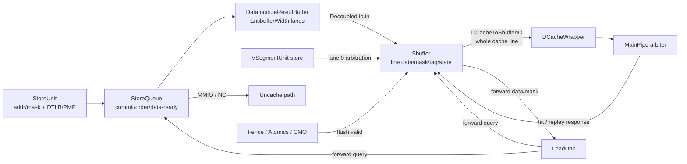
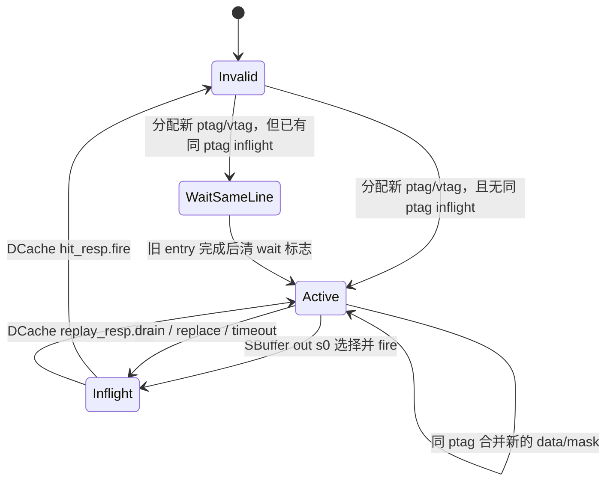
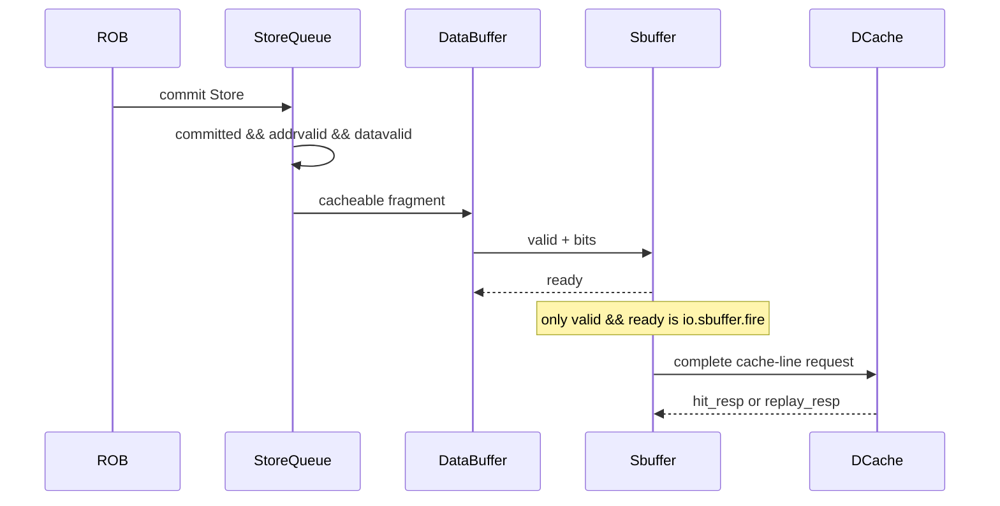

# 香山 Kunminghu-v2 Load/Store StoreBuffer（SBuffer）源码分析

> 本文分析对象是用户指定工作树 `/home/yanyusong/xs-memory-env/XiangShan` 中实际生效的 `Sbuffer`（源码文件名采用小写 `Sbuffer.scala`）。它是已提交、可缓存 Store 的按 Cache-line 合并缓冲，而不是按程序顺序简单出队的 FIFO。

## 1. 范围、版本与证据边界

### 1.1 本次源码基线

| 项目 | 取值 | 说明 |
| --- | --- | --- |
| 代码仓库 | [XiangShan](/home/yanyusong/xs-memory-env/XiangShan) | 用户指定的本地工作树 |
| 分支 / 提交 | `kunminghu-v2@e12436c7cba86b195deec24981976d78bc263661` | 以下“源码已验证”均以此为准 |
| 工作树状态 | `difftest` 已修改；`src/main/resources/aia/` 未跟踪 | 既有改动，本分析未改动源码 |
| 被分析有效模块 | `MemBlock -> LsqWrapper/StoreQueue -> Sbuffer -> DCache MainPipe` | `FakeSbuffer` 已注释且自身标为过时，不能作为行为依据 |
| 文档落点 | `memory/LoadStore-StoreBuffer.md` | 对应源码 `src/main/scala/xiangshan/mem/` |

本周同步脚本已执行：`/home/yanyusong/XiangShanLab` 因工作树非干净而仅完成 `fetch`，没有 `pull`；本地 `XiangShan-Design-Doc` 检出不存在。因此本文不把未同步的本地课程或设计材料当作当前 RTL 的证明。

### 1.2 设计文档基线与可追溯性

可访问的公开 SBuffer/LSU 设计说明是 Kunminghu-v3 页面，而本次源码是 Kunminghu-v2；页面没有可与本地提交一一对应的 commit 标识。它们只用于解释意图，结论必须回到本节列出的 v2 源码行号。

| 设计意图 | 设计材料 | v2 源码追踪 | 状态 |
| --- | --- | --- | --- |
| 已提交 Store 进入 SBuffer，按行收集后写 DCache | [课程 LoadStore（旧基线）](/home/yanyusong/XiangShanLab/xiangshan-course/docs/xiangshan-microarchitecture/Beginner_Implementation_and_Principles_of_the_High_Performance_Xiangshan_Processor/14_LoadStore.md:459) | [StoreQueue.scala:1122](/home/yanyusong/xs-memory-env/XiangShan/src/main/scala/xiangshan/mem/lsqueue/StoreQueue.scala:1122)、[StoreQueue.scala:1200](/home/yanyusong/xs-memory-env/XiangShan/src/main/scala/xiangshan/mem/lsqueue/StoreQueue.scala:1200)、[Sbuffer.scala:314](/home/yanyusong/xs-memory-env/XiangShan/src/main/scala/xiangshan/mem/sbuffer/Sbuffer.scala:314) | 已由当前源码复核 |
| 以 64 B line、多个 vword 汇聚，支持同行合并 | [公开 SBuffer 设计说明（v3）](https://docs.xiangshan.cc/projects/design/zh-cn/kunminghu-v3/memblock/LSU/SBuffer/) | [Sbuffer.scala:38](/home/yanyusong/xs-memory-env/XiangShan/src/main/scala/xiangshan/mem/sbuffer/Sbuffer.scala:38)、[Sbuffer.scala:240](/home/yanyusong/xs-memory-env/XiangShan/src/main/scala/xiangshan/mem/sbuffer/Sbuffer.scala:240)、[Sbuffer.scala:425](/home/yanyusong/xs-memory-env/XiangShan/src/main/scala/xiangshan/mem/sbuffer/Sbuffer.scala:425) | 部分版本差异，但机制已复核 |
| Store 地址/数据分离、Load 可从 Store 侧转发 | [公开 LSU 设计说明（v3）](https://docs.xiangshan.cc/projects/design/zh-cn/kunminghu-v3/memblock/LSU/) | [StoreUnit.scala:90](/home/yanyusong/xs-memory-env/XiangShan/src/main/scala/xiangshan/mem/pipeline/StoreUnit.scala:90)、[LoadUnit.scala:1356](/home/yanyusong/xs-memory-env/XiangShan/src/main/scala/xiangshan/mem/pipeline/LoadUnit.scala:1356)、[Sbuffer.scala:780](/home/yanyusong/xs-memory-env/XiangShan/src/main/scala/xiangshan/mem/sbuffer/Sbuffer.scala:780) | 已由当前源码复核 |
| 后台排空会受 Cache / 一致性资源影响 | 公开 LSU/SBuffer 说明 | [Sbuffer.scala:607](/home/yanyusong/xs-memory-env/XiangShan/src/main/scala/xiangshan/mem/sbuffer/Sbuffer.scala:607)、[MainPipe.scala:235](/home/yanyusong/xs-memory-env/XiangShan/src/main/scala/xiangshan/cache/dcache/mainpipe/MainPipe.scala:235) | 已由当前源码复核 |

课程中 [Simple_Analysis_Process_of_a_STORE_Instruction.md:518](/home/yanyusong/XiangShanLab/xiangshan-course/docs/5-xiangshan-scenarios-analysis/scenarios-analysis/instructions-lifecycle/scalar-store/Simple_Analysis_Process_of_a_STORE_Instruction.md:518) 明确承认当时没有找到触发排空的条件，故本文不沿用其中“可能因满而排空”的表述。

### 1.3 阅读口径

* `valid && ready`（或 `.fire`）才表示 Decoupled 传输发生；仅有 `valid` 不代表入队、出队或写 Cache。
* `state_valid && !state_inflight` 称为 **active**；`state_inflight` 表示该行已发往 DCache、尚未收到 SBuffer 响应。两者不是单独的 Chisel `Enum` 状态。
* “完成”须区分三层：ROB 提交、StoreQueue 经 `io.sbuffer.fire` 交给 SBuffer、SBuffer 收到 DCache hit/miss 接收响应。后两者均不等同于架构提交。

## 2. 先给结论：SBuffer 在有效路径中的职责

1. StoreUnit 在 s0 生成虚地址、mask 并发起 DTLB / DCache meta-tag 查询；该 DCache 请求**不是**真实写入。[StoreUnit.scala:236](/home/yanyusong/xs-memory-env/XiangShan/src/main/scala/xiangshan/mem/pipeline/StoreUnit.scala:236)
2. StoreQueue 保存地址、数据和提交状态；只有提交后、地址/数据准备完毕、并且不是 MMIO/NC/异常的可缓存 Store 才写入其 `DatamoduleResultBuffer`，随后通过 `io.sbuffer` 的 Decoupled 接口进入 SBuffer。[StoreQueue.scala:1122](/home/yanyusong/xs-memory-env/XiangShan/src/main/scala/xiangshan/mem/lsqueue/StoreQueue.scala:1122) [StoreQueue.scala:1175](/home/yanyusong/xs-memory-env/XiangShan/src/main/scala/xiangshan/mem/lsqueue/StoreQueue.scala:1175)
3. SBuffer 用物理 line tag 搜索；同行写入合并到同一条目的 data/mask，不同行用偶/奇条目选择、PLRU 替换和全局 FSM 管理。它允许最多 `EnsbufferWidth` 个前缀端口同周期交付，但当前配置默认是 2。
4. 排空时只把一个完整 Cache-line 请求交给 `DCacheToSbufferIO`；DCache MainPipe 对 probe/refill/atomic/store 仲裁，Store 可能被回压、被 replay，或以 hit/miss 接收响应释放条目。
5. Load 侧可查询 active/inflight SBuffer 行并按字节取得数据和 mask；物理/虚拟 tag 匹配关系异常会触发微架构排空/rollback，而非静默转发错误数据。

## 3. 有效连接与模块契约

### 3.1 谁、为什么、如何、从哪里到哪里

| 模块 | Who / 为什么存在 | From | To | 当前源码行为 |
| --- | --- | --- | --- | --- |
| `StoreUnit` | 计算 Store 地址、mask，完成 DTLB/PMP 前段分类 | Issue / 向量 / misalign 输入 | `StoreQueue` 的 LSQ 更新，DCache 仅作 meta/tag 查询 | s0 产生地址；s1 取得 paddr；s2 对 MMIO/NC/异常 kill DCache 写意图 |
| `StoreQueue` | 保证 Store 在 ROB 提交后才对内存系统可见，并保留对更年轻 Load 的转发源 | StoreUnit 地址/数据与 ROB commit | `DatamoduleResultBuffer`，再到 SBuffer；MMIO/NC 另走 Uncache | `committed && addrvalid && datavalid` 等门控决定可送数据 |
| `DatamoduleResultBuffer` | 把 SQ 读出结果变成深度为 `EnsbufferWidth` 的短 Decoupled 缓冲 | StoreQueue 多读口 | `Sbuffer.io.in` | 支持连续的前缀 lane；不是主 SBuffer 的 line storage |
| `Sbuffer` | 以物理 Cache line 聚合、转发和后台排空 | `StoreQueue.sbuffer` / 向量 lane | DCache MainPipe、Load 转发口、Difftest | 活动条目同行合并；inflight 同行等待；可被 flush/drain 驱动 |
| `DCache MainPipe` | 接受整行 Store 请求，并与 probe/refill/atomic 争用 Cache 资源 | `DCacheWrapper.store` | Cache array / MissQueue | 可能接受为 hit/miss，也可能 replay；SBuffer 依据结果改变条目状态 |

有效实例化见 [MemBlock.scala:615](/home/yanyusong/xs-memory-env/XiangShan/src/main/scala/xiangshan/mem/MemBlock.scala:615)。StoreQueue 到 SBuffer 的标量/向量仲裁见 [MemBlock.scala:1516](/home/yanyusong/xs-memory-env/XiangShan/src/main/scala/xiangshan/mem/MemBlock.scala:1516)，SBuffer 与 DCache / flush 的总连线见 [MemBlock.scala:1763](/home/yanyusong/xs-memory-env/XiangShan/src/main/scala/xiangshan/mem/MemBlock.scala:1763)。

### 3.2 端到端数据与控制图



图中 `StoreUnit -> DCache` 不是存储数据写入路径。源码用注释明确它只读 meta/tag 来判断 Store hit/miss；真正写 Cache 的数据在 `StoreQueue -> Sbuffer -> DCache MainPipe` 上流动。

### 3.3 关键接口与握手

| 边界 | 接口 / 宽度 | `fire` 含义 | 回压 / 保持要求 |
| --- | --- | --- | --- |
| SQ -> SB | `Vec(EnsbufferWidth, Decoupled(DCacheWordReqWithVaddrAndPfFlag))` | 对应 lane 的已提交 cacheable fragment 被 SBuffer 接收 | lane 1 必须跟随 lane 0；SBuffer 的 `ready` 以可用偶/奇条目控制 |
| SB -> DCache | `DCacheToSbufferIO.req` | 一个已选 line 在 SBuffer 输出 s0/s1 后被 DCache 接收 | SBuffer 在 `dcache.ready` 低或同条目 data 写入尚未完成时保持 s1 请求 |
| DCache -> SB | `hit_resp` / `replay_resp`（`ValidIO`） | 源码的 `hit_resp.fire` 事件释放条目；`replay_resp.fire` 保留条目并标记 timeout | 此响应没有 `ready`，SBuffer 不能回压；`id` 低位还原 SBuffer index |
| Load -> SB | `LoadForwardQueryIO` | Load 给出地址、mask、uop 等查询信息 | 响应中 `forwardMask/data` 仅对命中字节有效，`matchInvalid` 触发恢复逻辑 |
| Fence/Atomics/CMO -> SB | `SbufferFlushBundle` | `flush.valid` 要求排空而不是丢弃 | `flush.empty` 要等 SBuffer、当前输入与 `io.sqempty` 都空，供上游屏障 FSM 等待 |

SBuffer IO 定义见 [Sbuffer.scala:190](/home/yanyusong/xs-memory-env/XiangShan/src/main/scala/xiangshan/mem/sbuffer/Sbuffer.scala:190)，StoreQueue 输出契约见 [StoreQueue.scala:150](/home/yanyusong/xs-memory-env/XiangShan/src/main/scala/xiangshan/mem/lsqueue/StoreQueue.scala:150)。

## 4. 参数、地址分解与容量语义

### 4.1 默认参数不是硬编码的微架构常数

| 参数 | 默认值 | 代码证据 | 影响 |
| --- | ---: | --- | --- |
| `StorePipelineWidth` | 2 | [Parameters.scala:214](/home/yanyusong/xs-memory-env/XiangShan/src/main/scala/xiangshan/Parameters.scala:214) | Store 执行侧宽度 |
| `StoreBufferSize` | 16 | [Parameters.scala:214](/home/yanyusong/xs-memory-env/XiangShan/src/main/scala/xiangshan/Parameters.scala:214) | SBuffer 条目数、PLRU 路数、index 位数 |
| `StoreBufferThreshold` | 7 | [Parameters.scala:214](/home/yanyusong/xs-memory-env/XiangShan/src/main/scala/xiangshan/Parameters.scala:214) | 默认后台排空阈值 |
| `EnsbufferWidth` | 2 | [Parameters.scala:214](/home/yanyusong/xs-memory-env/XiangShan/src/main/scala/xiangshan/Parameters.scala:214) | SQ->SB 与 data-buffer 并行 lane 数 |
| `CacheLineBytes` | `CacheLineSize / 8` | [Sbuffer.scala:38](/home/yanyusong/xs-memory-env/XiangShan/src/main/scala/xiangshan/mem/sbuffer/Sbuffer.scala:38) | 一条 SBuffer entry 覆盖的行大小 |
| `CacheLineVWords` | `CacheLineBytes / VDataBytes` | [Sbuffer.scala:38](/home/yanyusong/xs-memory-env/XiangShan/src/main/scala/xiangshan/mem/sbuffer/Sbuffer.scala:38) | 一个 line 内 data/mask 的 vword 数 |

所以“16 项、两路输入、64 B line”是当前配置下的常见读法；其中 16 和 2 由参数提供，line 大小仍须随配置核对，不能脱离 elaboration 宣称永久固定。

本次没有提供实际 elaboration 所用 `Config`。标准 `KunminghuV2Config` 继承默认参数，而 `KunminghuV2MinimalConfig` 会将 SBuffer 改为 4 项、阈值 3；性能或容量结论必须以最终生成参数而非本表默认值为准。[Configs.scala:40](/home/yanyusong/xs-memory-env/XiangShan/src/main/scala/top/Configs.scala:40) [Configs.scala:487](/home/yanyusong/xs-memory-env/XiangShan/src/main/scala/top/Configs.scala:487)

### 4.2 地址、tag 与索引

| 名称 | 形成方式 | 用途 |
| --- | --- | --- |
| `ptag` | 物理地址去除 line offset 后的高位 | 相同行判定、DCache 整行物理地址 |
| `vtag` | 虚地址去除 line offset 后的高位 | forward 中与 ptag 关系复核；不一致时触发微架构处理 |
| `vwordOffset` | line 内按 `VDataBytes` 划分的 offset | 选择 `data/mask` 的一段 vword |
| `SbufferIndexWidth` | `log2Up(StoreBufferSize)` | entry index、DCache response ID 低位 |
| `replaceIdx` | `ValidPseudoLRU.way(candidateVec.reverse)` | 满足候选条件时的替换条目 |
| `drainIdx` | `PriorityEncoder(activeMask)` | drain 状态下优先排空的 active entry |

这些计算位于 [Sbuffer.scala:240](/home/yanyusong/xs-memory-env/XiangShan/src/main/scala/xiangshan/mem/sbuffer/Sbuffer.scala:240) 到 [Sbuffer.scala:282](/home/yanyusong/xs-memory-env/XiangShan/src/main/scala/xiangshan/mem/sbuffer/Sbuffer.scala:282)。SBuffer 的“同行”是 `ptag` 相等，而不是仅虚地址相等。

## 5. 存储组织、条目生命周期与全局 FSM

### 5.1 一个 entry 存什么，何时更新、释放、复用

| 结构 | 初始化 / 有效性 | 写入与更新 | 释放 / 复用 | 搜索 / 冲突作用 |
| --- | --- | --- | --- | --- |
| `SbufferData.data` | `Reg`；由 mask / valid 决定语义 | 输入写入经 s1 暂存、s2 逐 byte 更新 | DCache hit response 后通过 mask flush 清空关联 byte mask | forward / DCache 整行数据源 |
| `SbufferData.mask` | `RegInit(false)` | s2 置位写入 byte mask | hit response `fire` 产生 one-hot `maskFlushReq` 清除 | 决定哪些字节有效 |
| `ptagArray/vtagArray` | entry 变 valid 时写入 | 分配新行时写 ptag/vtag；合并不重写 ptag | `state_valid=false` 后可被替换 | 同行判定、forward 地址一致性检查 |
| `stateVec` | `RegInit(0)` | 新行设 valid；发送 DCache 时设 inflight | hit response 清 valid/inflight；replay 清 inflight 但保留 valid | active/inflight/candidate 的真源 |
| `cohCount/missqReplayCount` | `RegInit(0)` | active / inflight 时计数 | 合并、replay、释放等路径复位或重置 | coherence / replay timeout 优先级 |
| `waitInflightMask` | 与新分配动作关联 | 新 entry 若命中同 ptag inflight entry 则置 wait | 老 entry 完成一拍后清 dependent 的 `w_sameblock_inflight` | 防止同行 inflight 与后续 entry并发写 DCache |
| `plru` | `ValidPseudoLRU(StoreBufferSize)` | 入队访问 index 更新 | 仅挑选可替换 candidate | 控制替换而不是数据存储 |

`SbufferData` 的两级写入和 response mask clear 可见于 [Sbuffer.scala:96](/home/yanyusong/xs-memory-env/XiangShan/src/main/scala/xiangshan/mem/sbuffer/Sbuffer.scala:96)，元数据和计数器定义见 [Sbuffer.scala:210](/home/yanyusong/xs-memory-env/XiangShan/src/main/scala/xiangshan/mem/sbuffer/Sbuffer.scala:210)。

### 5.2 entry 状态语义

```scala
// Sbuffer.scala 的派生状态，省略类型细节
isInvalid             = !state_valid
isActive              = state_valid && !state_inflight
isDcacheReqCandidate  = state_valid && !state_inflight && !w_sameblock_inflight
```

来源：[Sbuffer.scala:66](/home/yanyusong/xs-memory-env/XiangShan/src/main/scala/xiangshan/mem/sbuffer/Sbuffer.scala:66)。这带来如下生命周期：



图中的 `WaitSameLine` 是 `w_sameblock_inflight` 派生的阅读状态，不是源码 `Enum`。当前 entry 的状态并不是“写入 Cache 已完成”：`Inflight` 代表请求已经从 SBuffer 发出、尚在等 DCache 返回。

### 5.3 全局排空 FSM

`SbufferState` 有 `x_idle`、`x_replace`、`x_drain_all`、`x_drain_sbuffer` 四个状态。[Sbuffer.scala:227](/home/yanyusong/xs-memory-env/XiangShan/src/main/scala/xiangshan/mem/sbuffer/Sbuffer.scala:227)

| 全局状态 | 进入条件 | 选择 / 退出条件 | 作用 |
| --- | --- | --- | --- |
| `x_idle` | reset 后默认 | `flush` 优先进入 `x_drain_all`；微架构 drain 进入 `x_drain_sbuffer`；阈值/满触发替换 | 正常接收、合并和条件性后台排空 |
| `x_replace` | 达到 `do_eviction` | flush / uarch drain 有更高优先级；否则条件消失回 idle | 通过 `replaceIdx` 选取候选排出 |
| `x_drain_all` | fence/atomics/CMO flush | 本地 `empty` 后回 idle | 本地 entry 与当前 `io.in` 均空；外部 flush 完成还须 `io.sqempty` |
| `x_drain_sbuffer` | forward tag mismatch 等 uarch drain | SBuffer 空后回 idle；flush 可升级为 all | 禁止新入队；不要求 SQ 入口一并空 |

状态转移见 [Sbuffer.scala:554](/home/yanyusong/xs-memory-env/XiangShan/src/main/scala/xiangshan/mem/sbuffer/Sbuffer.scala:554)。

`x_drain_sbuffer` 在入口 `ready` 公式中禁止新入队；`x_drain_all` 本身没有同样的本地禁止条件，需依赖上游 StoreQueue 与 flush 协议停止供给，才能最终满足更强的 `flush.empty`。这是阅读全局 FSM 时必须连同接口环境看的差异。[Sbuffer.scala:379](/home/yanyusong/xs-memory-env/XiangShan/src/main/scala/xiangshan/mem/sbuffer/Sbuffer.scala:379)

### 5.4 不同“空”信号的语义不能替换

| 信号 | 代码定义 | 适合回答的问题 |
| --- | --- | --- |
| `sbuffer_empty` | 全部 `stateVec` 无 valid entry | SBuffer 主 line storage 是否已无待处理数据 |
| `sq_empty` | 所有 `io.in.valid` 为低 | SBuffer 输入端当前是否无待接收数据 |
| `empty` / `io.sbempty` | `sbuffer_empty && sq_empty`，后一项再经寄存 | SBuffer 本体及其直接 ingress 是否空 |
| `io.flush.empty` | `empty && io.sqempty`，再经寄存 | 外部 flush 是否还能看到整个 SQ 也空 |

定义见 [Sbuffer.scala:535](/home/yanyusong/xs-memory-env/XiangShan/src/main/scala/xiangshan/mem/sbuffer/Sbuffer.scala:535)。因此 `flush.empty` 比 `sbempty` 更强；MemBlock 给 CMO/LSQ 回接的是 `sbuffer.sbempty`，而 Fence 等待的 `stIsEmpty` 则使用 `sbuffer.flush.empty && uncache.flush.empty`。分析 flush 场景时不得拿其中一个替代另一个。[MemBlock.scala:1763](/home/yanyusong/xs-memory-env/XiangShan/src/main/scala/xiangshan/mem/MemBlock.scala:1763) [MemBlock.scala:1846](/home/yanyusong/xs-memory-env/XiangShan/src/main/scala/xiangshan/mem/MemBlock.scala:1846)

## 6. 入队：从提交 Store 到按行合并

### 6.1 Store 先提交、后进入 SBuffer

ROB commit 并不直接写 DCache。StoreQueue 将 `committed` 状态置位；其读出路径再同时检查 address/data 就绪、异常和 NC/MMIO 条件。[StoreQueue.scala:1122](/home/yanyusong/xs-memory-env/XiangShan/src/main/scala/xiangshan/mem/lsqueue/StoreQueue.scala:1122) [StoreQueue.scala:1175](/home/yanyusong/xs-memory-env/XiangShan/src/main/scala/xiangshan/mem/lsqueue/StoreQueue.scala:1175)



`io.sbuffer.fire && sqNeedDeq && !wline` 才将对应 SQ entry 标为 `completed`。注释解释这一延迟是为了在 SBuffer data 还未实际写好前，仍让 Load 能从 SQ 转发；不能把 `committed`、`io.sbuffer.fire` 和 line drain 混成一个时刻。[StoreQueue.scala:1330](/home/yanyusong/xs-memory-env/XiangShan/src/main/scala/xiangshan/mem/lsqueue/StoreQueue.scala:1330)

### 6.2 合并、分配与 ready

输入逻辑先计算两 lane 的 `sameTag`，对 active entry 用 `ptag` 匹配形成 `mergeMask`；每个输入最多命中一个 active entry，并有断言防止多重命中。[Sbuffer.scala:314](/home/yanyusong/xs-memory-env/XiangShan/src/main/scala/xiangshan/mem/sbuffer/Sbuffer.scala:314) [Sbuffer.scala:335](/home/yanyusong/xs-memory-env/XiangShan/src/main/scala/xiangshan/mem/sbuffer/Sbuffer.scala:335)

* 新行分配在偶/奇空闲集合间交替选择，降低同周期双写的结构冲突；`io.in(0).ready` 只由第一个可分配槽决定。
* 第二 lane 以第一 lane 的可接收性为前提，形成 prefix 协议：lane 1 不能独自 `fire`。
* **反直觉但重要：同行合并也需要当前分配集合有空槽。** `ready` 不因 `canMerge` 放宽；SBuffer 全满时，即使该 Store 本可并入现有 active line，也会回压。该结论来自 [Sbuffer.scala:361](/home/yanyusong/xs-memory-env/XiangShan/src/main/scala/xiangshan/mem/sbuffer/Sbuffer.scala:361) 到 [Sbuffer.scala:383](/home/yanyusong/xs-memory-env/XiangShan/src/main/scala/xiangshan/mem/sbuffer/Sbuffer.scala:383)。

写入时，若可以 merge，就将 `wvec` 指向已有 entry；否则写新 entry 的 tag/state。新 entry 若与一个 inflight entry 同 ptag，会标记 `w_sameblock_inflight`，直到前者应答后再允许后者写 DCache。[Sbuffer.scala:425](/home/yanyusong/xs-memory-env/XiangShan/src/main/scala/xiangshan/mem/sbuffer/Sbuffer.scala:425)

### 6.3 data/mask 为什么还要两阶段

SBuffer 的 data storage 使用 s1 暂存 write request、s2 才逐 byte 更新 data 与 mask；这使元数据决策、entry data 写入和 DCache line read 不在同一个组合阶段完成。[Sbuffer.scala:131](/home/yanyusong/xs-memory-env/XiangShan/src/main/scala/xiangshan/mem/sbuffer/Sbuffer.scala:131)

因此从 `io.in.fire` 到相应 byte mask 真正可被整行读到，至少经过该写入寄存器边界。不要在本文或波形中把它写成固定的“总是两周期完成”：`GatedValidRegNext`、上游 buffer 和 DCache backpressure 都会影响可观测周期。

### 6.4 一条普通 cacheable Store 的阶段表

| 逻辑阶段 | 起始条件 | 核心状态 / 接口 | 结束条件 | 不能跨越的边界 |
| --- | --- | --- | --- | --- |
| StoreUnit s0 | issue 有效且未 redirect kill | 生成 VA/mask，DTLB req，SQ mask 写入 | `s0_fire` | DCache req 仅 meta/tag 查询，不是写入 |
| StoreUnit s1/s2 | TLB 返回 | paddr/PBMT/PMP、异常和 NC/MMIO 分类送 SQ | 地址/结果可用 | TLB miss、exception、redirect、NC/MMIO kill cache 写意图 |
| SQ 等待提交 | allocated、地址/数据逐步写入 | `committed`、`addrvalid`、`datavalid` | ROB 允许提交且满足读出资格 | 未提交 redirect 可取消；不能先对 SBuffer 可见 |
| DataBuffer -> SB 输入 | cacheable fragment 可读 | `io.sbuffer.valid/bits` | `io.sbuffer.fire` | `ready=0` 时保持数据；lane 1 依赖 lane 0 |
| SB 写入 / 合并 | input fire | `mergeMask` 或新 index；s1/s2 data/mask 写入 | 条目成为 active | 同行 inflight 需等待；新写与排空互锁 |
| SB -> DCache | candidate 被选择 | out s0/s1、整行 `M_XWR` | DCache request fire | MainPipe 资源、data-write hazard、flush/drain 优先级 |
| DCache response | entry inflight | hit/replay `ValidIO` event 回指 entry | hit 释放或 replay 重试 | 不是固定总时延，也不等于外存最终持久化 |

StoreUnit 三段的源码锚点为 [StoreUnit.scala:88](/home/yanyusong/xs-memory-env/XiangShan/src/main/scala/xiangshan/mem/pipeline/StoreUnit.scala:88)、[StoreUnit.scala:300](/home/yanyusong/xs-memory-env/XiangShan/src/main/scala/xiangshan/mem/pipeline/StoreUnit.scala:300) 和 [StoreUnit.scala:439](/home/yanyusong/xs-memory-env/XiangShan/src/main/scala/xiangshan/mem/pipeline/StoreUnit.scala:439)。

## 7. 排空：候选、DCache 请求、回压与应答

### 7.1 什么时候挑一行排空

每个 entry 的 candidate 要求 valid、非 inflight、且不等待同 ptag 的 inflight entry。输出选择优先级为：MissQueue replay timeout、drain entry、coherence timeout、PLRU replace entry。[Sbuffer.scala:588](/home/yanyusong/xs-memory-env/XiangShan/src/main/scala/xiangshan/mem/sbuffer/Sbuffer.scala:588) [Sbuffer.scala:607](/home/yanyusong/xs-memory-env/XiangShan/src/main/scala/xiangshan/mem/sbuffer/Sbuffer.scala:607)

后台触发并非只有“满”：`do_eviction` 在 active count 达到 `Constantin.createRecord` 建立的 threshold、接近满，或 valid count 到达容量时成立；`force_write` 会把 threshold 减去内部 base 值。虽然 IO 中有 `csrCtrl`，当前这一阈值的 CSR 用法在代码中被注释，不能写成“软件 CSR 必然直接控制排空阈值”。[Sbuffer.scala:535](/home/yanyusong/xs-memory-env/XiangShan/src/main/scala/xiangshan/mem/sbuffer/Sbuffer.scala:535)

### 7.2 输出两阶段与 data-write hazard

SBuffer out s0 选择 entry、读出完整 data/mask，并在握手时把 entry 置为 inflight；out s1 产生 `M_XWR` 的 line request。若同一 entry 的 data write 尚未完成，`shouldWaitWriteFinish` 会阻止向 DCache 发请求，避免旧 data/mask 被读出。[Sbuffer.scala:607](/home/yanyusong/xs-memory-env/XiangShan/src/main/scala/xiangshan/mem/sbuffer/Sbuffer.scala:607) [Sbuffer.scala:642](/home/yanyusong/xs-memory-env/XiangShan/src/main/scala/xiangshan/mem/sbuffer/Sbuffer.scala:642)

```wavedrom
{ "signal": [
  { "name": "clk", "wave": "p....." },
  { "name": "io.in[0].valid", "wave": "01...." },
  { "name": "io.in[0].ready", "wave": "01...." },
  { "name": "io.in[0].fire", "wave": "01...." },
  { "name": "data/mask write", "wave": "0.1..." },
  { "name": "sbuffer_out_s1_valid", "wave": "0..1.." },
  { "name": "io.dcache.req.ready", "wave": "1....." },
  { "name": "io.dcache.req.fire", "wave": "0..1.." },
  { "name": "io.dcache.hit_resp.fire", "wave": "0....1" }
] }
```

这是基于 s1/s2 write 和 out s0/s1 寄存器关系的**时序示意**，不是仿真测得的固定 latency。真实 MainPipe hit/miss/replay 的响应时间可变：请求侧以 `valid && ready` 为准，response 侧是不可回压的 `ValidIO` 事件。

### 7.3 DCache MainPipe 对 Store 的真实仲裁

`DCacheWrapper` 将 SBuffer 请求接到 MainPipe 的 store 口，并把 MainPipe hit/replay response 回送 SBuffer。[DCacheWrapper.scala:1582](/home/yanyusong/xs-memory-env/XiangShan/src/main/scala/xiangshan/cache/dcache/DCacheWrapper.scala:1582)

MainPipe 不是无条件每周期接 Store：probe、refill、store、atomic 进入仲裁，Store 被 `storeCanAccept`、meta/tag readiness、set conflict 和其他请求约束；连续等候计数与 `force_write` 是防饥饿手段的一部分。[MainPipe.scala:235](/home/yanyusong/xs-memory-env/XiangShan/src/main/scala/xiangshan/cache/dcache/mainpipe/MainPipe.scala:235)

* `hit_resp.fire`：对应 entry 的 `state_inflight` 和 `state_valid` 均清除，同时清 data mask。
* `replay_resp.fire`：entry 不释放，`state_inflight` 清除、`w_timeout` 置位并重置 replay 计数，使其以后以更高优先级重新尝试。
* 在 MainPipe hit 路径，Store 会进入实际的 Cache data/meta 写阶段；在 miss 路径，整行 data/mask 交给 MissQueue 与 refill 数据合并。无论哪一类 SBuffer response，均不是对外部 DRAM 最终持久化完成的普遍证明。请以 MainPipe/MissQueue 的具体路径进一步追踪任何需要的持久化语义。

响应状态更新见 [Sbuffer.scala:708](/home/yanyusong/xs-memory-env/XiangShan/src/main/scala/xiangshan/mem/sbuffer/Sbuffer.scala:708)，MainPipe response 产生点见 [MainPipe.scala:864](/home/yanyusong/xs-memory-env/XiangShan/src/main/scala/xiangshan/cache/dcache/mainpipe/MainPipe.scala:864)。

## 8. Load 转发与顺序含义

### 8.1 SBuffer 内转发

每条 Load pipeline 都给 SBuffer 一条 `LoadForwardQueryIO`。SBuffer 比较虚拟 tag、寄存后的物理 tag，取得命中的 vword data/mask；inflight 与 active 都可参与查询，按字节优先选择 active 覆盖 inflight，以表达较新的尚未发出 Store 覆盖较旧已发出 Store。[Sbuffer.scala:780](/home/yanyusong/xs-memory-env/XiangShan/src/main/scala/xiangshan/mem/sbuffer/Sbuffer.scala:780)

当虚拟/物理匹配关系不一致时，`matchInvalid` 不是普通“未命中”，而会引出 `forward_need_uarch_drain`；LoadUnit 还会将该类 mismatch 汇入 rollback/flush 路径。[Bundles.scala:185](/home/yanyusong/xs-memory-env/XiangShan/src/main/scala/xiangshan/mem/Bundles.scala:185) [LoadUnit.scala:1606](/home/yanyusong/xs-memory-env/XiangShan/src/main/scala/xiangshan/mem/pipeline/LoadUnit.scala:1606)

### 8.2 不把简化优先级当成真实 mux

常见口头说法是“Load 先看 SQ、再看 SBuffer、最后看 DCache”。当前代码更细：LoadUnit 先以 SQ mask 覆盖；在非缓存（`s2_nc_with_data`）条件下使用 UBuffer，否则使用 SBuffer 的 byte data。因此可概括为 **SQ 覆盖优先；cacheable 情况使用 SBuffer；NC 情况使用 UBuffer**，不能无条件写成三者固定线性优先级。[LoadUnit.scala:1356](/home/yanyusong/xs-memory-env/XiangShan/src/main/scala/xiangshan/mem/pipeline/LoadUnit.scala:1356)

## 9. Store 类型与跨边界行为

### 9.1 哪些会进入 SBuffer

| 类型 / 场景 | 是否经 SBuffer | 当前源码依据 | 备注 |
| --- | --- | --- | --- |
| 已提交、地址和数据就绪的普通 cacheable Store | 是 | [StoreQueue.scala:1175](/home/yanyusong/xs-memory-env/XiangShan/src/main/scala/xiangshan/mem/lsqueue/StoreQueue.scala:1175) | 先经 DataBuffer，再 `io.sbuffer.fire` |
| CBO write-line | 是，但 `wline` 影响 SQ completed 条件 | [StoreUnit.scala:122](/home/yanyusong/xs-memory-env/XiangShan/src/main/scala/xiangshan/mem/pipeline/StoreUnit.scala:122)、[StoreQueue.scala:1338](/home/yanyusong/xs-memory-env/XiangShan/src/main/scala/xiangshan/mem/lsqueue/StoreQueue.scala:1338) | 不应将普通 Store 的 `!wline` 完成规则机械外推 |
| 向量 Store | 可通过 `VSegmentUnit` 与 SQ lane 0 仲裁进入 | [MemBlock.scala:1520](/home/yanyusong/xs-memory-env/XiangShan/src/main/scala/xiangshan/mem/MemBlock.scala:1520) | 需要结合向量 split / exception 路径看 |
| MMIO / NC / Uncache | 否，走 Uncache | [StoreUnit.scala:469](/home/yanyusong/xs-memory-env/XiangShan/src/main/scala/xiangshan/mem/pipeline/StoreUnit.scala:469)、[StoreQueue.scala:824](/home/yanyusong/xs-memory-env/XiangShan/src/main/scala/xiangshan/mem/lsqueue/StoreQueue.scala:824) | StoreUnit s1/s2 也 kill DCache 写意图 |
| AMO / LR/SC | 先要求排空 SBuffer，再走 AtomicUnit | [AtomicsUnit.scala:467](/home/yanyusong/xs-memory-env/XiangShan/src/main/scala/xiangshan/mem/pipeline/AtomicsUnit.scala:467) | 不是普通 SBuffer line write |
| 异常 Store | 否 | [StoreQueue.scala:1200](/home/yanyusong/xs-memory-env/XiangShan/src/main/scala/xiangshan/mem/lsqueue/StoreQueue.scala:1200) | `toSbufferVecValid` 排除 exception |

### 9.2 虚拟页、Cache line、MMIO/uncache 三条边界

**虚拟页边界。** 地址翻译在 StoreUnit s0/s1 完成，PMP/PMA/MMIO 分类在后续阶段完成；SBuffer 本身并不发 DTLB/PMP 请求。[StoreUnit.scala:215](/home/yanyusong/xs-memory-env/XiangShan/src/main/scala/xiangshan/mem/pipeline/StoreUnit.scala:215) [StoreUnit.scala:469](/home/yanyusong/xs-memory-env/XiangShan/src/main/scala/xiangshan/mem/pipeline/StoreUnit.scala:469) StoreQueue 对跨 4 KiB 页、16 B 边界的 Store 生成低/高 fragment，并在需要时从 `StoreMisalignBuffer` 取得高段物理地址；SBuffer 接收的是已经被上游切分/翻译的条目。[StoreQueue.scala:1200](/home/yanyusong/xs-memory-env/XiangShan/src/main/scala/xiangshan/mem/lsqueue/StoreQueue.scala:1200)

**Cache-line 边界。** SBuffer 以 `ptag` 的 line 粒度分配和合并，所以不同物理 line 必然不是同一 entry。[Sbuffer.scala:240](/home/yanyusong/xs-memory-env/XiangShan/src/main/scala/xiangshan/mem/sbuffer/Sbuffer.scala:240) 但本轮尚未从 `Sbuffer.scala` 单独证明“任意跨 Cache-line 标量 Store 的所有 split 细节”；已证明的是上游 16 B/跨页 split 及 SBuffer 的 line tag 分离。对该特例应再结合目标配置和波形验证，不能自行补全。

**MMIO / uncache 边界。** s1 的 `nc/mmio` 或 s2 的实际 uncache 分类会 kill DCache 写意图，SQ 另走 NC/MMIO 请求与回写状态机。因此 SBuffer 的 line 合并、DCache replay 和 cacheable load-forward 结论都不应外推到设备访问。[StoreUnit.scala:420](/home/yanyusong/xs-memory-env/XiangShan/src/main/scala/xiangshan/mem/pipeline/StoreUnit.scala:420) [StoreUnit.scala:504](/home/yanyusong/xs-memory-env/XiangShan/src/main/scala/xiangshan/mem/pipeline/StoreUnit.scala:504)

### 9.3 redirect、Fence、Atomics 的控制边界

* redirect 时，StoreQueue 取消 `allocated && !committed` 的条目；已经提交并已进入 SBuffer 的数据不会被这种取消路径直接丢弃。[StoreQueue.scala:1482](/home/yanyusong/xs-memory-env/XiangShan/src/main/scala/xiangshan/mem/lsqueue/StoreQueue.scala:1482)
* Fence 的 `s_wait` 依赖 `sbIsEmpty`，而 MemBlock 给出的 `sbIsEmpty` 是 `sbuffer.flush.empty && uncache.flush.empty`；也就是说屏障等待两个子系统排空。[Fence.scala:47](/home/yanyusong/xs-memory-env/XiangShan/src/main/scala/xiangshan/backend/fu/Fence.scala:47) [MemBlock.scala:1763](/home/yanyusong/xs-memory-env/XiangShan/src/main/scala/xiangshan/mem/MemBlock.scala:1763)
* AtomicsUnit 在开始原子 Cache 访问前，若 SBuffer 非空持续请求 `flush_sbuffer`，等待排空。[AtomicsUnit.scala:467](/home/yanyusong/xs-memory-env/XiangShan/src/main/scala/xiangshan/mem/pipeline/AtomicsUnit.scala:467)
* MemBlock 对三类 flush source 的断言只禁止 `fence && atomics && cmo` 三者同时为真；该表达式没有禁止任意两者同真。源码注释与谓词的覆盖范围不同，集成验证应专门覆盖两源并发。[MemBlock.scala:1773](/home/yanyusong/xs-memory-env/XiangShan/src/main/scala/xiangshan/mem/MemBlock.scala:1773)

## 10. 资源冲突与优先级场景

| 场景 | 当前处理 | 容易误读之处 | 验证观察点 |
| --- | --- | --- | --- |
| 两个相同 ptag 同时输入 | `sameTag` / `mergeMask` 合并或跟随第一输入决定 index | `SbufferData` 的双端口写循环没有显式同-byte 仲裁/assert；port 1 连接后出现，静态阅读提示后连接覆盖，但必须由 elaborated RTL/定向测试确认 | 两 lane 同 line、重叠 / 不重叠 byte mask |
| 两个不同 ptag 同时输入 | 偶/奇选槽、prefix `ready` | lane 1 不能脱离 lane 0 接受 | `io.in(1).fire -> io.in(0).fire` 断言 |
| 满时又来同 line Store | 仍可能回压，因为 ready 依赖可分配槽 | 不存在“满时总能 merge”的旁路 | `sbFull`、`canMerge` 与 `io.in.ready` 同时抓取 |
| 新写同一 entry 而排空已选中 | `shouldWaitWriteFinish` 阻塞 DCache request | 不应让 DCache 读到旧 data/mask | entry index、writeReq、`blockDcacheWrite` |
| 同 ptag 旧 entry 已 inflight | 新 entry `w_sameblock_inflight` 等待 | 不可并发向 DCache 发两个同 line 请求 | `waitInflightMask`、旧 hit/replay 与新 candidate |
| DCache 被 probe/refill/atomic 占用 | MainPipe 可能不给 Store ready | SBuffer out valid 不等于 DCache 已接收 | `io.dcache.req.valid/ready`、MainPipe source arbitration |
| replay response | entry 保留并进入 timeout 优先级 | replay 不等于释放，也不等于丢弃 | `state_valid`、`state_inflight`、`w_timeout` |
| forward 虚实 tag 不一致 | SBuffer drain / Load rollback | 不是普通 load miss | `matchInvalid`、`forward_need_uarch_drain`、Load rollback |

## 11. Difftest、性能钩子与验证特别注意

### 11.1 两类 Difftest 事件不能混淆

| 事件 | 产生时刻 | 数据含义 | 不应误读为 |
| --- | --- | --- | --- |
| `DiffStoreEvent` | StoreQueue 的 `dataBuffer.io.enq.fire`，或 NC/MMIO 请求 fire | 已提交 Store 进入 DataBuffer / UBuffer 的记录 | SBuffer line 已从 DCache 排空 |
| `DiffSbufferEvent` | `io.dcache.hit_resp.fire` | SBuffer line 的 addr/data/mask 排空事件，送 GoldenMem 相关检查 | ROB 退休或外部 DRAM 已最终持久化 |

前者的源码注释直接说明发生在 `rdataPtr` 移动时。[StoreQueue.scala:1420](/home/yanyusong/xs-memory-env/XiangShan/src/main/scala/xiangshan/mem/lsqueue/StoreQueue.scala:1420) 后者由 `env.EnableDifftest` 门控，绑定 DCache hit response handshake。[Sbuffer.scala:766](/home/yanyusong/xs-memory-env/XiangShan/src/main/scala/xiangshan/mem/sbuffer/Sbuffer.scala:766)

### 11.2 建议的特定验证矩阵

| 编号 | 属性 / 场景 | 预期与源码锚点 | 推荐观测 / 断言 |
| --- | --- | --- | --- |
| SB-01 | reset 后空 | `stateVec` / mask 均不应形成可排空条目 | `sbempty`、`flush.empty`、所有 `state_valid` |
| SB-02 | 首个 Store | `io.in.fire` 后仅目标 entry 的 tag/state/data/mask 生效 | input bits、`wvec`、`accessIdx`、mask |
| SB-03 | Decoupled 回压 | `valid=1, ready=0` 时 bits 必须稳定、不得推进 SQ complete | `io.sbuffer.bits`、`completed`、DataBuffer head |
| SB-04 | 双 lane prefix | lane 1 fire 必须蕴含 lane 0 fire | [StoreQueue.scala:1436](/home/yanyusong/xs-memory-env/XiangShan/src/main/scala/xiangshan/mem/lsqueue/StoreQueue.scala:1436) 的断言 |
| SB-05 | 同行 merge | 一条 active entry 被选中，未产生多重 `mergeMask` | [Sbuffer.scala:335](/home/yanyusong/xs-memory-env/XiangShan/src/main/scala/xiangshan/mem/sbuffer/Sbuffer.scala:335) 断言与 data byte 覆盖 |
| SB-06 | 写/排空竞争 | 同 entry data update 未完成时不能发出旧 line | `shouldWaitWriteFinish`、DCache req data/mask |
| SB-07 | 同行 inflight | 后项等旧项 response 后才变 candidate | `w_sameblock_inflight`、`waitInflightMask` |
| SB-08 | replay | replay 后 valid 保留、inflight 清除、后续重试 | `w_timeout`、replay counter、DCache retry |
| SB-09 | redirect | 未提交 SQ 条目取消；已提交/SBuffer 数据不被误删 | `needCancel`、SB `state_valid`、DiffStoreEvent |
| SB-10 | fence/atomic/CMO | flush 最终等到 SB 和 Uncache 都空 | `flush.valid/empty`、Fence state、Atomic state |
| SB-11 | 4 KiB / 16 B 边界 | split 后每个 fragment 的 paddr、mask、sqNeedDeq 正确 | StoreMisalignBuffer、DataBuffer entries、SBuffer ptag |
| SB-12 | MMIO/NC | 不得进入 SBuffer / DCache cacheable line path | `ncStall/mmioStall`、Uncache req、SBuffer input fire |
| SB-13 | forward mismatch | 不转发错误 bytes；触发恢复/排空 | `matchInvalid`、rollback、uarch drain |
| SB-14 | 多 flush 源并发 | 覆盖任意两源同真，以及三源同真断言 | `fenceFlush/atomicsFlush/cmoFlush` |

当前源码中未找到专用 SBuffer 单元测试。`debug/perf_sbuffer.sh` 可辅助统计接受/排空/阻塞日志，但其检索的 “entry cnt:15/16” 没有在当前 SBuffer 源码中找到对应 producer，不能当作已验证性能指标。

## 12. 时延、吞吐与不能下的结论

| 段 | 可由源码确认的吞吐 / 寄存器边界 | 不能由本轮静态阅读确认的量 |
| --- | --- | --- |
| SQ -> SBuffer | 最多 `EnsbufferWidth` 个前缀 lane；当前参数默认 2 | 每条 Store 从 issue 到 commit 的总周期 |
| SBuffer data 写入 | input 后经 s1 暂存与 s2 byte update | 任意情况下固定“2 周期可转发/可排空” |
| SBuffer -> DCache | 一次选择一个 line，out s0/s1 后依赖 `ready` | MainPipe / MissQueue 造成的确定响应 latency |
| DCache 仲裁 | Store 会受 probe/refill/atomic、set conflict、force-write 等影响 | 所有负载下每周期稳定排空一行 |
| DCache response | hit 可释放；replay 保留并重试 | 外部内存最终写入 / 持久化时刻 |

若需要把这些表中的“不能确认”变成数字，应在具体测试程序中以 `io.sbuffer[*].fire`、`sbuffer_out_s1_valid`、`io.dcache.req.fire`、`hit_resp/replay_resp.fire`、entry ID 和稳定 ROB ID 联合跟踪；不能只用 Store PC 或一个 `valid` 波形推断。

## 13. 阅读顺序与待验证问题

推荐按以下顺序回到源码：

1. [MemBlock.scala:1516](/home/yanyusong/xs-memory-env/XiangShan/src/main/scala/xiangshan/mem/MemBlock.scala:1516)：先确认顶层 SQ/向量/SBuffer/DCache 连线。
2. [StoreQueue.scala:1122](/home/yanyusong/xs-memory-env/XiangShan/src/main/scala/xiangshan/mem/lsqueue/StoreQueue.scala:1122) 和 [StoreQueue.scala:1200](/home/yanyusong/xs-memory-env/XiangShan/src/main/scala/xiangshan/mem/lsqueue/StoreQueue.scala:1200)：确认“已提交、可缓存、无异常”到 DataBuffer 的资格。
3. [Sbuffer.scala:314](/home/yanyusong/xs-memory-env/XiangShan/src/main/scala/xiangshan/mem/sbuffer/Sbuffer.scala:314)：看 merge/alloc/ready；再读 [Sbuffer.scala:607](/home/yanyusong/xs-memory-env/XiangShan/src/main/scala/xiangshan/mem/sbuffer/Sbuffer.scala:607) 的排空和应答。
4. [MainPipe.scala:235](/home/yanyusong/xs-memory-env/XiangShan/src/main/scala/xiangshan/cache/dcache/mainpipe/MainPipe.scala:235)：确认 SBuffer 外部回压来自哪里。
5. [LoadUnit.scala:1356](/home/yanyusong/xs-memory-env/XiangShan/src/main/scala/xiangshan/mem/pipeline/LoadUnit.scala:1356)：把 SBuffer forward 放回 Load 的真实 mux 中理解。

仍需通过 RTL / FST 专门验证的点：两个 ingress 同行且同 byte 的最终覆盖优先级；任意跨 Cache-line 标量 Store 的全套 split 行为；向量 lane 与 SQ lane 0 在同周期出现时的互斥前提；以及本配置下 DCache hit response 与最终 MissQueue/外存完成的精确边界。这些是当前源码阅读明确保留的未知项，而不是可安全补写的结论。

## 14. 小结

Kunminghu-v2 的 `Sbuffer` 是处在 **ROB 已提交 StoreQueue** 与 **DCache MainPipe** 之间的、按物理 Cache line 组织的合并/转发/排空结构。它的正确性核心不只是容量：还包括 SQ 延后释放以维持转发、active/inflight 同行顺序、data-write 与 line-read 的互锁、DCache replay、虚实 tag mismatch 恢复，以及 fence/atomic/CMO 与 Uncache 的共同排空。分析和调试时应始终以 `fire`、entry state、DCache response ID 和 ROB/SQ 身份共同判定事件，不要把单个 `valid` 或 Store PC 当作生命周期证据。

在 VS Code 中可用 Markdown Preview 查看 Mermaid 与 WaveDrom 渲染；波形验证应将本文的静态推导与实际 elaboration/FST 交叉核对。
