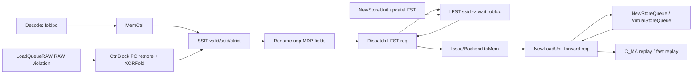
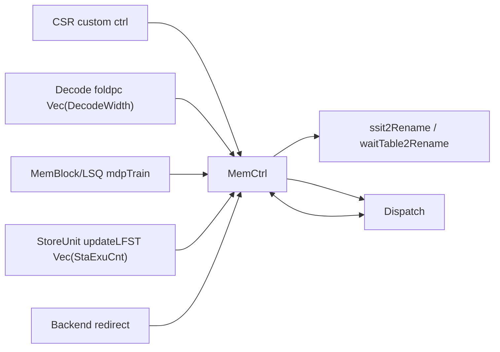
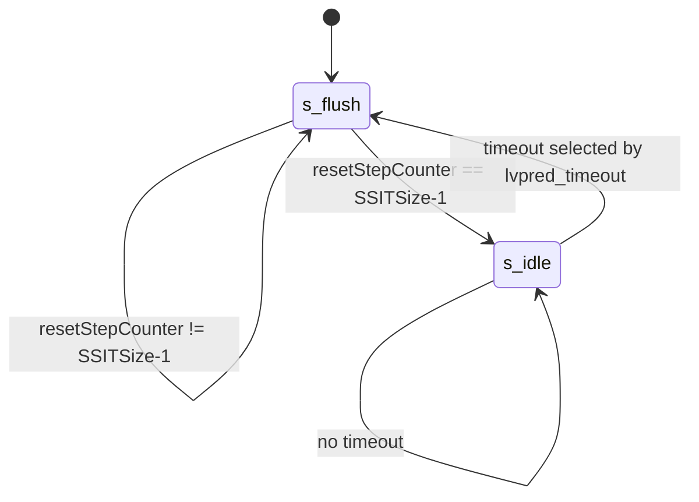

# XiangShan KunMingHu v3 MDP 代码分析

## 1. Scope

- 使用的 skill：`tools/analyze-xiangshan-kunminghu`
- 分析对象：`/nfs/home/yanyusong/mdp-kmhv3/XiangShan`
- 分析源码 commit：`055d8ad9e56b0b618f2d549a97f3a028986b4849`
- 主要源码根：`src/main/scala/xiangshan`
- 主要模块：`SSIT`、`LFST`、`WaitTable`、`MemCtrl`、`DispatchLFSTIO`、`LoadQueueRAW`、`VirtualStoreQueue`、`NewStoreQueue`、`NewLoadUnit`
- 子系统上下文：backend decode/rename/dispatch、mem LSQ、load/store pipeline、CSR custom control
- weekly sync 状态：已按 skill 执行 `tools/analyze-xiangshan-kunminghu/scripts/weekly_sync.py`。结果显示 `/nfs/home/yuanmiaomiao/XiangShanLab` 存在但不是 git 仓库，`XiangShan-Design-Doc` 缺失，课程深度解析目录存在但 git status 受 dubious ownership 限制。因此本文的设计文档上下文只使用 skill references，所有行为结论以 KunMingHu v3 本地源码为准。
- paper context：源码在 `StoreSet.scala` 中直接引用 Chrysos/Emer 的 Store Sets 论文；`WaitTable.scala` 引用 Alpha 21264。当前环境未暴露 `paper-search-agent-mcp` 工具，因此没有额外 MCP 检索结果，本文明确区分“论文原则”和“源码实际行为”。

结论先行：KunMingHu v3 的有效 MDP 路径是 Store Set 风格的 load violation predictor，由 `SSIT + LFST` 组成。`WaitTable` 源码仍存在，但 `MemCtrl` 中没有实例化，`waitTable2Rename` 被接成 `DontCare`，因此当前有效路径不是 Alpha 21264-like Load Wait Table。

## 2. 关键源码证据

| 主题 | 文件:行号 | 核心代码 | 证明 |
| --- | --- | --- | --- |
| MDP 参数 | `Parameters.scala:818-831` | `WaitTableSize = 1024`，`LFSTSize = 64`，`StoreSetEnable = true` | Store Set 表大小、SSID 宽度和启用状态 |
| uop MDP 字段 | `Bundle.scala:105-113` | `storeSetHit`、`waitForRobIdx`、`loadWaitBit`、`loadWaitStrict`、`ssid` | MDP 预测结果随 uop 流动 |
| MemCtrl 实例化 | `MemCtrl.scala:14-30` | `private val ssit = Module(new SSIT)`，`private val lfst = Module(new LFST)`，`waitTable2Rename := DontCare` | SSIT/LFST 有效，WaitTable 无效 |
| Decode 到 SSIT | `CtrlBlock.scala:640-646`，`MemCtrl.scala:19-22` | `mdpFlodPcVec(i) := decode.io.out(i).bits.foldpc`，`ssit.io.raddr(i) := io.mdpFlodPcVec(i)` | folded PC 是 SSIT lookup index |
| Rename 写入 uop | `Rename.scala:453-459` | `storeSetHit := io.ssit(i).valid`，`loadWaitStrict := io.ssit(i).strict`，`ssid := io.ssit(i).ssid` | SSIT 结果进入 uop |
| Dispatch 查 LFST | `Dispatch.scala:759-769` | `io.lfst.req(i).valid := ... storeSetHit`，`loadWaitBit := io.lfst.resp(i).bits.shouldWait` | LFST 覆盖最终 wait 信息 |
| LFST 查找规则 | `StoreSet.scala:383-412` | `shouldWait := (valid(ssid) || hitInDispatchBundle) ...` | store set 当前有未发射 store 时让 load 等待 |
| SSIT 训练 | `StoreSet.scala:170-306` | 读取 load/store PC 的 SSIT 项，再按四种情况更新 | RAW violation 训练 Store Set |
| RAW 违例训练源 | `LoadQueueRAW.scala:377-396` | `io.mdpTrain := Mux1H(oldestOH, allRedirect)` | 违例 redirect 同时训练 MDP |
| PC 还原和 fold | `CtrlBlock.scala:217-238` | `XORFold((pcMem.io.rdata(...) + offset)(VAddrBits - 1, 1), MemPredPCWidth)` | 训练端 load/store PC 变成 SSIT index |
| StoreUnit 释放 LFST | `NewStoreUnit.scala:415`，`NewStoreUnit.scala:515-518` | `updateLFST.valid`，`bits.robIdx/ssid/storeSetHit` | store 地址发射后清除 LFST 依赖 |
| StoreQueue 消费 MDP | `VirtualStoreQueue.scala:229-245`，`NewStoreQueue.scala:509-543`，`NewStoreQueue.scala:620-621` | 非 strict 查 `waitForRobIdx`，strict 查所有更老 store 地址 | load 是否 replay/等待的直接条件 |
| Load replay cause | `NewLoadUnit.scala:1077-1084` | `cause(C_MA) := troubleMaker && uop.storeSetHit && sqAddrInvalid` | MDP 等待未满足时触发 memory address replay |
| CSR 控制 | `CSRCustom.scala:99-104`，`NewCSR.scala:1437-1441` | `LVPRED_DISABLE`、`NO_SPEC_LOAD`、`STORESET_WAIT_STORE`、`LVPRED_TIMEOUT` | CSR 控制 MDP 开关、保守模式和清空周期 |

## 3. Theory-to-Code Mapping

| 理论概念 | 课程/理论语义 | 代码实体 | 具体信号/状态 | KunMingHu v3 实现方式 | 与教科书模型差异 |
| --- | --- | --- | --- | --- | --- |
| RAW memory dependence | younger load 可能越过 older store 错误执行 | `LoadQueueRAW`、`SSIT`、`LFST` | `mdpTrain`、`storeSetHit`、`waitForRobIdx` | 先允许 load 推测执行，违例后训练 predictor，下次通过 LFST 等待相关 store | 不是静态阻塞所有 load，而是按 PC 历史学习 |
| Scoreboard-like readiness | 动态调度需要判断依赖是否 ready | `NewStoreQueue` forward path | `addrInvalid.valid`、`loadWaitStrict` | load 查询 SQ 时，如果预测依赖 store 地址未 ready，则 replay | 依赖不是寄存器 ready bit，而是 store address readiness |
| ROB precise recovery | 乱序执行需精确回滚 | `Redirect`、`RobPtr` | `rollbackLqWb.bits.robIdx`、`needFlush` | RAW 违例产生 redirect，flush 错误 load 及更年轻指令 | MDP training 绑定在 redirect 元数据上 |
| Speculation | 为性能允许 load 越过 store | `loadWaitBit`、`no_spec_load` | `StoreSetEnable`、`LVPRED_DISABLE`、`NO_SPEC_LOAD` | 默认只对预测危险的 load 加等待；CSR 可关闭推测 load | 预测器是性能/正确性折中，不是架构可见状态 |
| Superscalar multi-width | 多条指令并行 decode/rename/dispatch | `DecodeWidth`、`RenameWidth` | `Vec(RenameWidth, ...)` | SSIT 和 LFST 读请求都是按宽度向量化 | 同一 dispatch bundle 内的 store-load 也要处理 |

## 4. 论文原则和有效代码

`StoreSet.scala:19-22` 写明实现受 Store Sets 论文启发。Store Sets 的原则是：当某个 load 和 store 曾经发生 memory order violation，把它们归入同一个 store set；后续 load 只等待该 set 中最近的 store，而不是保守等待所有 store。

KunMingHu v3 的对应实现：

- `SSIT` 负责 PC 到 `ssid` 的映射和 strict 位。
- `LFST` 负责 `ssid` 到当前 inflight store ROB index 的映射。
- `LoadQueueRAW` 发现真实 RAW 违例后训练 `SSIT`。

`WaitTable.scala:19-21` 引用 Alpha 21264，代码实现了 2-bit counter wait table。但由于 `MemCtrl.scala:28-30` 没有实例化并连接 WaitTable，本文把它归类为非有效路径。

## 5. Microarchitecture Parameters

| 参数 | 定义位置 | 值/表达式 | 影响 |
| --- | --- | --- | --- |
| `LoadDependencyWidth` | `Parameters.scala:181` | `2` | issue/wakeup 侧 load dependency metadata 宽度 |
| `ResetTimeMax2Pow` | `Parameters.scala:819` | `20` | predictor reset counter 最大位宽 |
| `ResetTimeMin2Pow` | `Parameters.scala:820` | `14` | CSR timeout 选择窗口低位 |
| `WaitTableSize` | `Parameters.scala:822` | `1024` | WaitTable/SSIT index 空间 |
| `MemPredPCWidth` | `Parameters.scala:823` | `log2Up(WaitTableSize)` | folded PC 宽度 |
| `LWTUse2BitCounter` | `Parameters.scala:824` | `true` | WaitTable 读 counter 高位；当前非有效路径 |
| `SSITSize` | `Parameters.scala:826` | `WaitTableSize` | SSIT 表项数 |
| `LFSTSize` | `Parameters.scala:827` | `64` | store set 数量 |
| `SSIDWidth` | `Parameters.scala:828` | `log2Up(LFSTSize)` | `ssid` 字段宽度 |
| `LFSTWidth` | `Parameters.scala:829` | `2` | 每个 store set 可记录的 inflight store 数 |
| `StoreSetEnable` | `Parameters.scala:830` | `true` | Dispatch 使用 LFST 覆盖 `loadWaitBit` |
| `LFSTEnable` | `Parameters.scala:831` | `true` | LFST 路径保留参数 |

## 6. 模块边界和接口

### 6.1 `MemCtrl`

`MemCtrl` 是 backend 控制块内的 MDP 容器。它拥有 `SSIT` 和 `LFST`，并把来自 decode/redirect/store issue/CSR/RAW training 的信号组织起来：

```scala
private val ssit = Module(new SSIT)
private val lfst = Module(new LFST)
ssit.io.update <> RegNext(io.memPredUpdate)
...
lfst.io.redirect <> RegNext(io.redirect)
lfst.io.storeIssue <> RegNext(io.stIn)
```

证据：`MemCtrl.scala:14-25`。

它没有实例化 WaitTable：

```scala
//  io.waitTable2Rename := waittable.io.rdata
io.waitTable2Rename := DontCare
io.ssit2Rename := ssit.io.rdata
```

证据：`MemCtrl.scala:28-30`。

### 6.2 `SSIT`

`SSIT` 的输入包括 decode 读端口、训练更新、CSR 控制；输出给 rename：

```scala
val ren = Vec(DecodeWidth, Input(Bool()))
val raddr = Vec(DecodeWidth, Input(UInt(MemPredPCWidth.W)))
val rdata = Vec(RenameWidth, Output(new SSITEntry))
val update = Input(new MemPredUpdateReq)
val csrCtrl = Input(new CustomCSRCtrlIO)
```

证据：`StoreSet.scala:54-63`。

### 6.3 `LFST`

`LFST` 接收 dispatch 查询、store issue 释放、redirect 恢复和 CSR 控制：

```scala
val redirect = Input(Valid(new Redirect))
val dispatch = Flipped(new DispatchLFSTIO)
val storeIssue = Vec(backendParams.StaExuCnt, Flipped(Valid(new StoreUnitToLFST)))
val csrCtrl = Input(new CustomCSRCtrlIO)
```

证据：`StoreSet.scala:366-373`。

### 6.4 Load/Store queue 侧接口

Load pipeline 发出的 store forward request 携带 MDP 字段：

```scala
storeForwardReq.loadWaitBit := uop.loadWaitBit
storeForwardReq.loadWaitStrict := uop.loadWaitStrict
storeForwardReq.ssid := uop.ssid
storeForwardReq.storeSetHit := uop.storeSetHit
storeForwardReq.waitForRobIdx := uop.waitForRobIdx
```

证据：`NewLoadUnit.scala:355-363`。

## 7. 为什么 MDP 存在

没有 MDP 时，处理器有两个极端选择：

1. 允许所有 load 越过更老 store：性能好，但一旦 store 地址后来证明与 load 地址冲突，就要 redirect/replay。
2. 让所有 load 等待所有更老 store 地址：正确但过度保守，损害乱序执行吞吐。

KunMingHu v3 的 MDP 走中间路线：默认推测，遇到 RAW 违例后通过 Store Set 记录“哪些 PC 组合曾经冲突”。后续只让相关 load 等待预测相关的 store；如果同一 set 反复冲突，则升级到 strict wait，等待所有更老 store 地址。

## 8. 有效动态路径

### 8.1 Lookup path

1. Decode 输出 folded PC：`CtrlBlock.scala:640-646`。
2. `MemCtrl` 使用 folded PC 读 SSIT：`MemCtrl.scala:19-22`。
3. Rename 把 SSIT 的 `valid/ssid/strict` 写入 uop：`Rename.scala:453-456`。
4. Dispatch 对 `storeSetHit` 的 uop 查询 LFST：`Dispatch.scala:759-762`。
5. LFST 输出 `shouldWait` 和 `robIdx`：`StoreSet.scala:399-408`。
6. Dispatch 覆盖 uop 的 `loadWaitBit/waitForRobIdx/loadWaitStrict`：`Dispatch.scala:764-769`。
7. Backend 将 MDP 字段送入 memory exu：`Backend.scala:483-492`。
8. LoadUnit 转发给 StoreQueue：`NewLoadUnit.scala:355-363`。
9. StoreQueue 返回 `addrInvalid`，LoadUnit 生成 `C_MA` replay cause：`NewStoreQueue.scala:620-621`、`NewLoadUnit.scala:1083`。

### 8.2 Training path

1. `LoadQueueRAW` 发现 store-load RAW 违例，生成 redirect：`LoadQueueRAW.scala:377-391`。
2. 最老 redirect 同时作为 `mdpTrain`：`LoadQueueRAW.scala:395-396`。
3. `MemBlock` 和 `XSCore` 把 `mdpTrain` 接到 backend：`MemBlock.scala:1071`、`XSCore.scala:147-148`。
4. `CtrlBlock` 读取 FTQ PC memory，加 offset 还原 load/store PC，再 XOR fold：`CtrlBlock.scala:217-238`。
5. `MemCtrl` 将 `memPredUpdate` 打一拍后送入 SSIT：`MemCtrl.scala:16`。
6. `SSIT` 根据 load/store 两端旧状态更新 `ssid` 和 strict 位：`StoreSet.scala:170-306`。

### 8.3 Release/recovery path

1. StoreUnit 地址发射成功后产生 `updateLFST`：`NewStoreUnit.scala:415`、`NewStoreUnit.scala:515-518`。
2. `MemBlock` 传到 `backend.io.mem.stIn`：`MemBlock.scala:1016-1018`、`XSCore.scala:143-145`。
3. LFST 清除匹配 `ssid/robIdx` 的有效项：`StoreSet.scala:414-422`。
4. redirect 时 LFST 清除被 flush 的 store 项并恢复 `allocPtr`：`StoreSet.scala:439-459`。

## 9. Index 和地址计算

| index/address | 定义位置 | 输入 | 计算 | 宽度/范围 | 消费者 |
| --- | --- | --- | --- | --- | --- |
| SSIT lookup index | `CtrlBlock.scala:640-646`、`MemCtrl.scala:19-22` | `decode.io.out(i).bits.foldpc` | 前端/译码侧已形成的 folded PC | `MemPredPCWidth`，默认 10 bit | SSIT `raddr` |
| SSIT train load PC | `CtrlBlock.scala:217-228` | load `ftqIdx` + `ftqOffset` | `(pcMem.rdata + offset)(VAddrBits-1,1)` 后 `XORFold(..., MemPredPCWidth)` | 默认 10 bit | `MemPredUpdateReq.ldpc/waddr` |
| SSIT train store PC | `CtrlBlock.scala:230-236` | store `stFtqIdx` + `stFtqOffset` | 同 load 训练路径 | 默认 10 bit | `MemPredUpdateReq.stpc` |
| SSID allocation | `StoreSet.scala:211-215` | `ldpc/stpc` | `XORFold(pc, SSIDWidth)` 后取较小者 | `SSIDWidth = log2Up(64)` | SSIT data entry |
| LFST lookup index | `StoreSet.scala:399-404` | dispatch req `ssid` | 直接用 `ssid` 索引 `validVec/robIdxVec/allocPtr` | 0 到 63 | LFST response |
| LFST alloc slot | `StoreSet.scala:424-437` | dispatch store `ssid` | `wptr = allocPtr(waddr)`，写后 `allocPtr(waddr) + 1.U` | `LFSTWidth = 2` 的环形槽 | `validVec(ssid)(wptr)` |
| precise MDP store ptr | `VirtualStoreQueue.scala:234-245` | `waitForRobIdx` | 在 virtual SQ 中按 ROB index 匹配，再 `ParallelPriorityEncoder` | StoreQueue entry range | physical SQ forward |

重要冲突点：

- SSIT update 复用 decode read port。源码注释说明 `io.update.valid` 时会 redirect frontend，因此 decode 不需要同周期读 SSIT（`StoreSet.scala:69-77`、`StoreSet.scala:176-187`）。
- SSIT 两个写端口若同地址，store write port 被关闭，避免同表项双写（`StoreSet.scala:308-315`）。
- LFST 每个 `ssid` 只有 `LFSTWidth = 2` 个槽。新 store dispatch 覆盖仍有效槽时，`LFST_Overflow_Count` 累加（`StoreSet.scala:424-437`、`StoreSet.scala:461`）。

## 10. 核心算法

### 10.1 SSIT update algorithm

Owner：`SSIT`

源码：`StoreSet.scala:170-306`

原则：当 RAW violation 发生，读取 load PC 和 store PC 的旧 SSIT 状态，再合并或分配 store set。

核心伪代码：

```text
if !loadAssigned && !storeAssigned:
  ssid = min(hash(ldpc), hash(stpc))
  SSIT[ldpc] = {valid, ssid, strict=false}
  SSIT[stpc] = {valid, ssid, strict=false}
else if loadAssigned && !storeAssigned:
  SSIT[stpc] = {valid, hash(ldpc), strict=false}
else if !loadAssigned && storeAssigned:
  SSIT[ldpc] = {valid, hash(stpc), strict=false}
else:
  winner = min(loadOldSSID, storeOldSSID)
  SSIT[ldpc] = {valid, winner, strict=false}
  SSIT[stpc] = {valid, winner, strict=false}
  if loadOldSSID == storeOldSSID:
    SSIT[ldpc].strict = true
```

注意：源码在 `b10` 和 `b01` 分支里使用 `s2_ldSsidAllocate` / `s2_stSsidAllocate`，而不是直接复用 `s2_loadOldSSID` / `s2_storeOldSSID`（`StoreSet.scala:264-283`）。因此本文只描述代码实际行为，不把它强行解释成论文原文的理想版本。

同时请求场景：一次 update 同时需要读 load/store 两个 PC；SSIT 为此保留两个 read ports（`SSIT_UPDATE_LOAD_READ_PORT = 0`、`SSIT_UPDATE_STORE_READ_PORT = 1`）。若 load/store PC 折叠后同地址，后面的 store write 被 mask 掉，load 侧写入胜出（`StoreSet.scala:308-315`）。

### 10.2 LFST lookup/update algorithm

Owner：`LFST`

源码：`StoreSet.scala:383-461`

查找规则：

```scala
shouldWait :=
  ((valid(ssid) || hitInDispatchBundle) &&
   req.valid &&
   (!isstore || csrCtrl.storeset_wait_store)) &&
  !csrCtrl.lvpred_disable ||
  csrCtrl.no_spec_load
```

行为：

- 如果同一 `ssid` 已有未发射 store，后续 load 等待该 store。
- 如果同一 dispatch bundle 内前面 slot 有相同 `ssid` 的 store，即使 LFST 还没写，也让后面的 load 等待。
- 默认 store 本身不等待，除非 CSR `storeset_wait_store` 置位。
- `no_spec_load` 强制保守等待。

更新/释放：

- store dispatch 时写入 `validVec(ssid)(allocPtr)` 和 `robIdxVec`，`allocPtr` 自增。
- store 地址发射后，按 `ssid/robIdx` 清除对应 valid。
- redirect 时，所有 `robIdx.needFlush(io.redirect)` 的项清除。

### 10.3 StoreQueue MDP wait algorithm

Owner：`VirtualStoreQueue` + `NewStoreQueue` forward module

源码：`VirtualStoreQueue.scala:229-245`、`NewStoreQueue.scala:489-543`、`NewStoreQueue.scala:620-621`

非 strict：

- 用 `waitForRobIdx` 在 virtual store queue 中找对应 store。
- 如果对应 physical SQ entry 地址仍 invalid，返回 `addrInvalid.valid`。
- load replay，等待 store 地址产生。

Strict：

- `s1StrictMdpWait = s1LoadWaitStrict && (s1HasAddrInvalidVec.orR || s1LoadOutOfRange)`。
- 只要任意更老 store 地址未 ready，load 就等待。

这正是 Store Set 的二级保护：普通情况下只等一个预测 store；同一 set 反复违例后改为等待所有 older store 地址。

## 11. 状态和存储结构

| 结构 | owner | reset/初始值 | search/read | update | release/clear | 冲突行为 |
| --- | --- | --- | --- | --- | --- | --- |
| SSIT `valid_array` | `SSIT` | flush 状态逐项写 false | decode 读 folded PC；update 复用读端口 | RAW violation 后写 load/store PC 项 | timeout flush 清 valid | update 同地址时 store write port 被关闭 |
| SSIT `data_array` | `SSIT` | data 默认 0，valid 决定有效性 | 同 valid array | 写 `ssid/strict` | valid false 后语义无效 | 同地址双写时 store write port 被关闭 |
| SSIT reset FSM | `SSIT` | `state = s_flush` | 无 | `s_idle` 等 timeout | `s_flush` 逐项清 valid | flush 期间占用 misc write port |
| LFST `validVec` | `LFST` | 全 false | dispatch 按 `ssid` 查询 | store dispatch set true | store issue 或 redirect clear | 同 `ssid` 超过 2 个 store 会覆盖并计 overflow |
| LFST `robIdxVec` | `LFST` | 未显式 reset，valid 控制语义 | dispatch 返回 last store robIdx | store dispatch 写 robIdx | valid clear 后语义无效 | `allocPtr-1` 返回最近写入槽 |
| LFST `allocPtr` | `LFST` | 全 0 | dispatch response 读取 `allocPtr-1` | store dispatch 自增 | redirect 后行为模型式恢复 | 多 dispatch store 同一 ssid 时按 loop 生成逻辑，需注意写冲突综合语义 |
| Virtual SQ MDP hit vec | `VirtualStoreQueue` | 无持久状态，s1/s2 寄存 | 按 `waitForRobIdx` CAM | 无 | request valid 控制寄存 | 多 entry 命中时 `ParallelPriorityEncoder` 选一个 |

## 12. Pipeline stage 分析

| 阶段 | 主要代码 | 工作 | 关键 payload/control | stall/flush/replay 行为 | 输出 |
| --- | --- | --- | --- | --- | --- |
| Decode/SSIT read | `CtrlBlock.scala:640-646`、`MemCtrl.scala:19-22` | 发送 folded PC 到 SSIT | `mdpFlodPcVecVld`、`mdpFlodPcVec` | decode fire 才读 | SSIT rdata 下一阶段给 rename |
| Rename | `Rename.scala:453-459` | 将 SSIT 结果写入 uop | `storeSetHit`、`ssid`、`loadWaitStrict` | redirect 由 rename/ctrl block 主路径处理 | uop 到 dispatch |
| Dispatch/LFST read+update | `Dispatch.scala:759-769`、`StoreSet.scala:383-437` | 查当前 store set 是否有 older store；store dispatch 写 LFST | `LFSTReq`、`LFSTResp` | bundle 内 store-load 同 cycle 特判 | `loadWaitBit/waitForRobIdx` |
| Issue to Mem | `Backend.scala:483-492` | 将 MDP 字段送入 mem exu | `EnableMdp` gate | 可用 Constantin 关 MDP | `ExuInput` |
| Load s0 forward request | `NewLoadUnit.scala:355-363` | load 发 StoreQueue forward 请求时携带 MDP | `StoreForwardReqS0` | load pipeline kill/redirect 由 LoadUnit 控制 | SQ forward query |
| StoreQueue s1/s2 | `NewStoreQueue.scala:390-543` | 计算 strict/non-strict MDP wait 和 forward 命中 | `s1LoadWaitStrict`、`s2MdpQueryResp` | 地址未 ready 形成 `addrInvalid` | forward resp |
| Load replay decision | `NewLoadUnit.scala:1077-1084` | 根据 `sqAddrInvalid` 设置 replay cause | `cause(C_MA)` | replay/fast replay | replay queue / writeback control |
| RAW train | `LoadQueueRAW.scala:377-396`、`CtrlBlock.scala:217-238` | 违例 redirect 训练 SSIT | `mdpTrain`、`MemPredUpdateReq` | redirect flush wrong-path load | SSIT update |

## 13. Control path rationale

| 控制信号 | producer | consumer | 为什么存在 | 场景 |
| --- | --- | --- | --- | --- |
| `storeSetHit` | Rename from SSIT | Dispatch、LoadUnit、StoreUnit | 标记 uop 是否属于已学习 store set | 某 load PC 曾违例，后续 rename 后需要查 LFST |
| `loadWaitBit` | Dispatch from LFST | StoreQueue/NewLoadUnit | 表示当前 load 需要等待预测 store 地址 | LFST 中同 ssid 有 older store 未 issue |
| `waitForRobIdx` | LFST | VirtualStoreQueue | 精确指出非 strict 要等哪个 store | younger load 只等历史相关 older store |
| `loadWaitStrict` | SSIT + LFST | StoreQueue | 多次同 set 违例后保守等待所有 older stores | 同一 load/store set 再次违例，单点等待不够 |
| `mdpTrain.valid` | LoadQueueRAW | CtrlBlock/SSIT | 真实 RAW 违例后训练预测器 | store 地址发现 younger load 已错误执行 |
| `updateLFST.valid` | StoreUnit | LFST | store 地址已算出，可释放等待它的 load | store TLB hit 且合法 issue |
| `lvpred_disable` | CSR | SSIT/LFST/WaitTable | 调试或性能实验时关闭 predictor | 怀疑 MDP 导致错误 replay 行为 |
| `no_spec_load` | CSR | LFST/WaitTable | 强制无推测 load | 需要验证 memory ordering 正确性 |

## 14. Data path

MDP data path 可分为三个闭环：

1. 预测信息随 uop 前进：`foldpc -> SSIT(valid, ssid, strict) -> uop.storeSetHit/ssid/loadWaitStrict -> LFST(waitForRobIdx/loadWaitBit) -> LoadUnit -> StoreQueue`。
2. store 生命周期反馈：`dispatch store -> LFST validVec/robIdxVec set -> StoreUnit address issue -> updateLFST -> LFST clear`。
3. 违例训练反馈：`LoadQueueRAW violation -> Redirect(ftq/offset + stFtq/offset) -> CtrlBlock PC restore and XORFold -> SSIT update`。

这些 data path 都是微架构状态，不改变架构寄存器或内存可见结果；错误预测只导致 replay/redirect。

## 15. 异常、debug、privilege

MDP 本身不产生架构异常；它产生 replay/redirect 条件。真实 RAW violation 使用 `Redirect` 让 backend/frontend 回滚，而不是提交异常。LoadUnit 中 `cause(C_MA)` 是 replay cause，不是 page fault/access fault。TLB page fault/access fault/guest page fault 等异常仍由 LoadUnit/TLB 路径处理，优先级在 LoadUnit replay/exception 逻辑中统一决策；本文仅覆盖 MDP 相关 memory-address replay。

## 16. CSR 控制

`Slvpredctl` 地址为 `0x5C2`（`CSRConst.scala:22-27`）。新 CSR 框架字段：

```scala
val LVPRED_TIMEOUT          = SlvpredCtlTimeOut(8, 4)
val STORESET_NO_FAST_WAKEUP = RW(3)
val STORESET_WAIT_STORE     = RW(2)
val NO_SPEC_LOAD            = RW(1)
val LVPRED_DISABLE          = RW(0)
```

证据：`CSRCustom.scala:99-104`。

CSR 输出连接到 custom control：

```scala
io.status.custom.lvpred_disable          := slvpredctl.regOut.LVPRED_DISABLE.asBool
io.status.custom.no_spec_load            := slvpredctl.regOut.NO_SPEC_LOAD.asBool
io.status.custom.storeset_wait_store     := slvpredctl.regOut.STORESET_WAIT_STORE.asBool
io.status.custom.storeset_no_fast_wakeup := slvpredctl.regOut.STORESET_NO_FAST_WAKEUP.asBool
io.status.custom.lvpred_timeout          := slvpredctl.regOut.LVPRED_TIMEOUT.asUInt
```

证据：`NewCSR.scala:1437-1441`。

## 17. Diagrams

### 17.1 Data-path diagram



### 17.2 Module-interface diagram



### 17.3 SSIT reset FSM



### 17.4 Timing: SSIT lookup to LFST wait

```waveform-draw
{
  "signal": [
    { "name": "clk", "wave": "p......" },
    { "name": "decode.fire", "wave": "010...." },
    { "name": "ssit.ren", "wave": "010...." },
    { "name": "ssit.raddr", "wave": "x=xxxxx", "data": ["foldpc"] },
    { "name": "rename.ssit.valid", "wave": "0010..." },
    { "name": "dispatch.lfst.req.valid", "wave": "00010.." },
    { "name": "lfst.resp.shouldWait", "wave": "00010.." },
    { "name": "uop.loadWaitBit", "wave": "00010.." }
  ],
  "config": { "hscale": 1 }
}
```

### 17.5 Timing: RAW violation training

```waveform-draw
{
  "signal": [
    { "name": "clk", "wave": "p......." },
    { "name": "raw.rollback.valid", "wave": "010....." },
    { "name": "mdpTrain.valid", "wave": "010....." },
    { "name": "pcMem.ren", "wave": "010....." },
    { "name": "memPredUpdate.valid", "wave": "0010...." },
    { "name": "ssit.update.valid", "wave": "00010..." },
    { "name": "ssit.wen", "wave": "000010.." }
  ],
  "config": { "hscale": 1 }
}
```

## 18. 有效行为和非有效代码的差异

- 有效：`SSIT + LFST` Store Set 路径。
- 非有效：`WaitTable`。它实现了 2-bit counter LWT，并有 timeout reset，但 `MemCtrl` 没有实例化。
- 保留接口：`Rename` 仍有 `waittable` 输入，`MemCtrlIO` 仍有 `waitTable2Rename` 输出，但当前为 `DontCare`。
- 风险点：`WaitTable` 相关性能计数或 debug 语义不能代表当前 MDP 行为；调试 v3 MDP 时应看 `ssit_pred_dependence`、`storeset_load_wait`、`LFST_Overflow_Count` 等 Store Set 相关路径。

## 19. 动态场景示例

### 正常无冲突 load

load PC 未命中 SSIT，`storeSetHit=false`。Dispatch 不产生有效 LFST wait，LoadUnit 正常访问 StoreQueue/DCache。若没有 SQ forward miss、TLB miss、DCache miss等原因，load 正常写回。

### 首次 RAW 违例

store 地址晚于 younger load 产生，`LoadQueueRAW` 发现地址和 mask 冲突，选择最老错误 load 生成 redirect，同时 `mdpTrain` 送回 backend。`CtrlBlock` 还原 load/store PC 并折叠成 `ldpc/stpc`，SSIT 为这对 PC 分配 `ssid`。下一次相同 PC 模式出现时，load 会命中 SSIT。

### 后续预测等待

store dispatch 时写 LFST；同 `ssid` 的 younger load dispatch 时查 LFST，拿到 `waitForRobIdx` 并置 `loadWaitBit`。LoadUnit 查询 StoreQueue，如果目标 store 地址还 invalid，`NewStoreQueue` 返回 `addrInvalid`，LoadUnit 触发 `C_MA` replay，避免再次发生真实 RAW violation。

### strict wait

如果 load/store 已属于同一个 `ssid` 仍再次发生违例，SSIT 把 load 项标记 strict。后续该 load 不只等 `waitForRobIdx`，而是等待所有更老 store 地址准备好。性能更保守，但减少复杂别名或多 store 场景下的反复违例。

## 20. 结论

KunMingHu v3 的 MDP 是一个有效连接在 backend 和 mem 之间的 Store Set predictor：

- `SSIT` 学习“PC -> store set”的历史依赖关系。
- `LFST` 追踪“store set -> 当前最近 store ROB index”的动态窗口状态。
- `LoadQueueRAW` 用真实 RAW violation 训练 `SSIT`。
- `StoreQueue` 和 `LoadUnit` 把预测结果落实为 load replay/等待。
- CSR 可关闭 predictor 或进入无 speculative load 的保守模式。

从当前 commit 看，`WaitTable` 只是保留代码，不是 KunMingHu v3 MDP 的有效执行路径。

## 验证特别注意

> 本节依据 `tools/verification-driver/skills` 中的 FSM、冲突、前向进展、索引/哈希、缓存结构、异常/虚拟化和性能瓶颈规则生成。每个期望必须以当前 `kunminghu-v2` 有效 Chisel 为准。

| Verification ID | 风险 / 不变量 | 定向激励 | 期望观察 | Checker / Coverage |
| --- | --- | --- | --- | --- |
| `H_SAME_INDEX_DIFF_TAG` | 不同 PC 的 SSIT/hash alias 形成错误依赖 | 构造 load/store PC 映射同 index、不同 tag/上下文 | alias 行为只产生可恢复的保守等待，不能破坏表端口；证据 [mem/mdp/StoreSet.scala:280-320](https://github.com/OpenXiangShan/XiangShan/blob/kunminghu-v2/src/main/scala/xiangshan/mem/mdp/StoreSet.scala#L280-L320) | Index/hash checker；false-positive/negative cross |
| `C_SAME_ENTRY_RW` | SSIT 查询与 violation 训练同拍同 entry | dispatch lookup 同拍提交 store-load violation update | 读旧/读新/更新优先级与源码一致；证据 [mem/mdp/StoreSet.scala:300-320](https://github.com/OpenXiangShan/XiangShan/blob/kunminghu-v2/src/main/scala/xiangshan/mem/mdp/StoreSet.scala#L300-L320) | Storage conflict checker；training scoreboard |
| `MDP_SET_MERGE` | 两个 store set 合并丢失成员或产生环形依赖 | 让已属不同 set 的 load/store 重复违例 | SSIT 统一到合法 set id，后续 lookup 得到一致依赖 | Store-set scoreboard；merge coverage |
| `RESOURCE_CONTENTION` | LFST 有效项/分配槽耗尽仍覆盖活跃 store | 填满 LFST 后持续 dispatch 新 store | 分配、valid、latest-store 指针和 full 行为一致；证据 [mem/mdp/StoreSet.scala:328-390](https://github.com/OpenXiangShan/XiangShan/blob/kunminghu-v2/src/main/scala/xiangshan/mem/mdp/StoreSet.scala#L328-L390) | Occupancy/pointer checker；full/almost-full cover |
| `I_WRAP_PTR` | LFST 环形 store 指针回绕破坏新旧关系 | 推进 store SQ/ROB 标识跨最大值并查询依赖 | 回绕后只等待真实未完成的最新 store，无 stale dependency | Pointer-age checker；wrap cross |
| `F_REQ_AND_FLUSH` | redirect 后 LFST/WaitTable 保留错误路径依赖 | 训练或 dispatch store/load 同拍 redirect，随后复用相同 PC | 错误路径状态被清除或不可见；WaitTable 更新与查询符合源码；证据 [mem/mdp/WaitTable.scala:25-71](https://github.com/OpenXiangShan/XiangShan/blob/kunminghu-v2/src/main/scala/xiangshan/mem/mdp/WaitTable.scala#L25-L71) | Flush/replay checker；stale-dependency scoreboard |
| `P_LIVELOCK_REPLAY_LOOP` | 重复 violation/等待预测导致 replay 活锁 | 同一 load-store 对连续违例并周期性释放 store | 训练最终稳定且 load 可完成，不形成永久不必要串行化 | Forward-progress checker；violation/replay-rate cover |
| `PB_RECOVERY_THROUGHPUT` | 过度保守预测长期降低内存并行度 | 训练热点后切换到无冲突访存阶段 | 陈旧依赖逐步消退，load 吞吐恢复并记录假阳性率 | Performance checker；serialization latency |

### 通用判定原则

- `valid && !ready` 期间 payload 必须稳定；只有 `fire` 才能推进指针、状态或训练一次。
- flush/redirect/replay 的胜负关系必须按代码优先级检查；错误路径不得提交、写表、训练预测器或暴露异常/数据。
- 资源填满后必须验证可排空；重复冲突、retry 或 redirect 不得形成 deadlock/livelock，并检查低优先级旧请求是否饥饿。
- 环形指针必须覆盖最大值到零的 wrap；表索引必须构造 same-index/different-tag 和同拍 read/write 冲突组。
- 性能覆盖至少记录占用率、反压周期、redirect 恢复延迟、重试次数和恢复后的持续吞吐。


## 21. Frontend 文档补充：访存依赖检测与 Replay