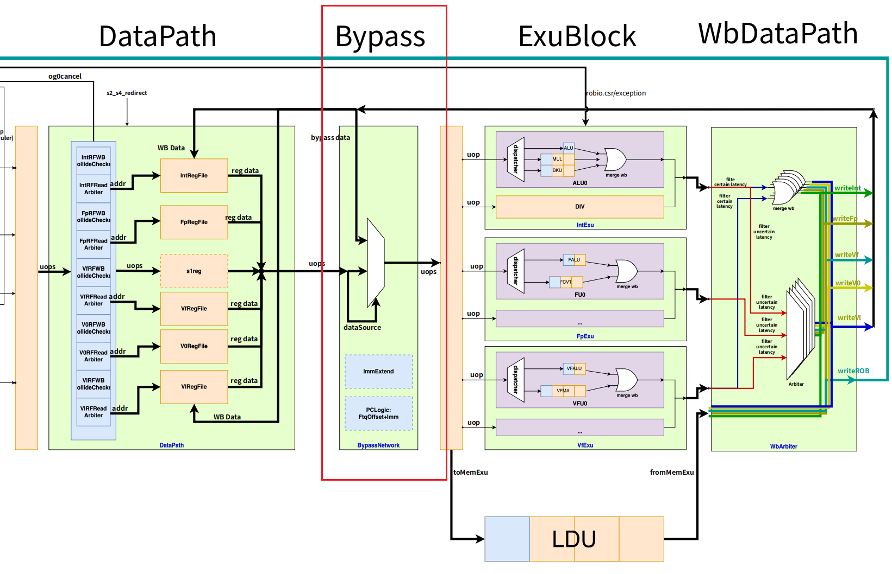
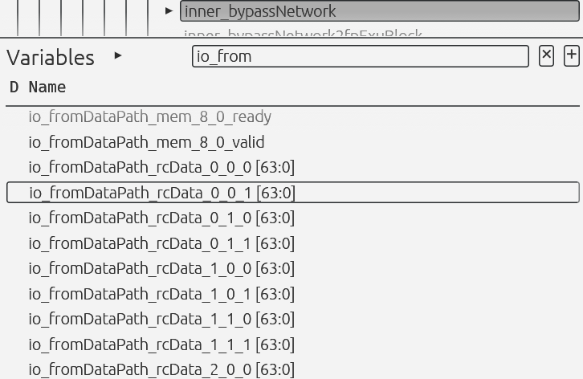
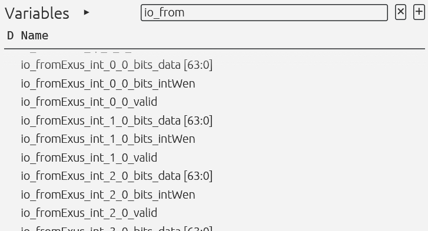
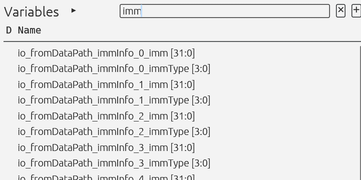
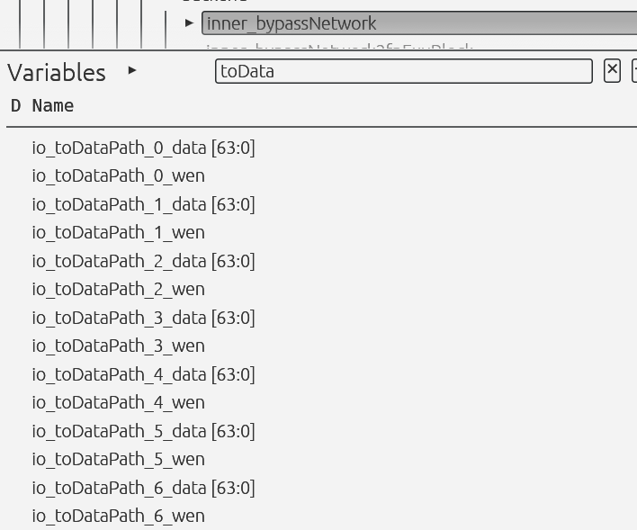
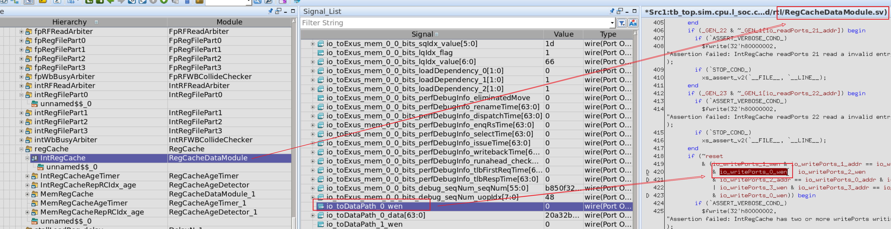

# Bypass 与 RegCache 网络

以下内容按原始资料分段整理，原句与原图均保留，只在章节边界处加入必要的导语。

如果你还没有先看过单条乘法 / 除法的基本执行过程，建议先阅读：

* `../../instructions-lifecycle/mul-div/mul-div-execution-process.md`

如果你已经看到了“乘法背靠背会被提前唤醒、除法背靠背要靠回写唤醒”的现象，但还想继续追问“值到底是怎么在最后一拍被送到执行单元里的”，那么当前这一篇就是顺着那个问题继续往下看的。

对应的唤醒专题文稿在这里：

* `../wakeup-mechanism/wakeup-mechanism-of-mul-div.md`

在香山的执行过程中，有着非常强大的Bypass网络，而与之对应的还有RegCache这个重要的组件。

拿我们看乘法背靠背这个情况的那个段波形的加法来举例子：

在加法进入datapath的并且要往执行模块发起请求信号的时候：

当这条加法正要往执行模块发去信号的时候，可以看到此时的源操作数是没有准备好的，都是0。但是，他会把数据发给bypass网络，可以看到发出的都是0x1。这个数据实际上就是在指示给bypass网络，这个加法要用的数据是来自于哪里，总结下来就是这样：

| **编码** | **名称** | **含义** |
| --- | --- | --- |
| <code>**0000**</code> | **zero** | 读零 |
| <code>**0001**</code> | **forward** | 本拍EXU输出 |
| <code>**0010**</code> | **bypass** | 上一拍EXU输出 |
| <code>**0011**</code> | **bypass2** | 上上拍EXU输出 |
| <code>**0100**</code> | **imm** | 立即数 |
| <code>**0101**</code> | **v0** | V0寄存器 |
| <code>**0110**</code> | **regcache** | 寄存器缓存 |
| <code>**1000**</code> | **reg** | 物理寄存器堆 |

发的是0x1，说明这个加法要来的数据就是当前拍的执行阶段产生的数据。这和我们的分析也是恰好吻合，因为这个加法是被乘法利用wakeupQueues延迟唤醒的。那么当加法到达datapath的时候，乘法正好算好，所以说也是正确的。

再看上面的波形图，可以看到此时本周期内bypass网络就已经再往执行模块发出正确的值了。两个源操作数都是0xfd，已经把数据发给了执行单元，所以你才会看见在下一个周期的执行单元的源操作数就变成正确的了。

实际上，在前面的理解上一直有个误区，我们一直忽略了bypass的存在，好像一直在默默地认为，datapath的输出，然后下一级就是执行阶段。但实际上，他们中间还存在着一个bypass网络的，这跟架构图中的也是很契合的：

而且bypass网络的运算也是和datapath同周期计算的，他们之间还是不存在任何寄存器的。所以说，执行模块真正接收的数据是来自于bypass而不是datapath。

所说，通过上面的加法例子大概感受到了bypass的作用，所以现在来真正探索一下bypass的作用和相关的RegCache。首先看看bypass的输入，除了与datapath以及和exu之间的常规交互数据之外，还有哪些数据是怎么样的：

有一系列的RegCache的数据的输入。

有来自于执行的回写数据？

还有各种的立即数信息

其实这样看来，这个模块大概的意思就是，一个规模超级大的数据选择器，根据来自于datapath的数据source类型，从各种各样的输出中，选择出那个正确的数据来，然后传到执行模块中去。

所以还是回到刚刚看到的那个加法的例子，那个正确的0xfd的这个数据，也是从众多输入数据中选择出来的：

这个数据也正是从执行的当前周期的回写数据选择出来的。

我们再来看看输出，除了常规的输出给执行模块的数据包，还会输出什么：

他还会再输出一些列的写信号，trace一下就会发现，这些写信号最后的目的地是：

没错，正是这一节的另外一个主角。RegCache。

所以说，经过这一系列的探究后，我们最终基本上可以确认，bypass网络承担的职责大概就是：

汇集不同的数据，然后根据来自于datapath的需要选择出那个正在正确的数据，然后再传给执行模块。

数据的来源有：

| **编码** | **名称** | **含义** |
| --- | --- | --- |
| <code>**0000**</code> | **zero** | 读零 |
| <code>**0001**</code> | **forward** | 本拍EXU输出 |
| <code>**0010**</code> | **bypass** | 上一拍EXU输出 |
| <code>**0011**</code> | **bypass2** | 上上拍EXU输出 |
| <code>**0100**</code> | **imm** | 立即数 |
| <code>**0101**</code> | **v0** | V0寄存器 |
| <code>**0110**</code> | **regcache** | 寄存器缓存 |
| <code>**1000**</code> | **reg** | 物理寄存器堆 |

当然，bypass同时还承担着更新RegCache的任务。

所以现在重点就是探究RegCache的机制到底是怎么样的。因为现在已经清楚了写他的时间点、读他的时间点，现在再去探究他的机制已经不是一件难事了。

注意区分一下exusource和datasource，前者指示是来自哪个执行单元，后者指示数据具体来源

（RegCache、同周期执行结果、上周期执行结果等）

如果读到这里，你想重新回到“整条乘法 / 除法执行链到底是怎么走的”这个总流程视角，再把 Bypass 放回完整生命周期中理解，可以回看：

* `../../instructions-lifecycle/mul-div/mul-div-execution-process.md`

> 更新: 2026-07-17 17:59:54  
> 原文: <https://bosc.yuque.com/staff-xmw8rg/fb7qy3/iyihrmmwlsdi5nap>
