# 1. ADD 指令中的 Rename 读 bypass 路径

以下文稿聚焦于原始资料中关于 Rename 阶段、RAT 读取、旁路修正、目标物理寄存器分配与 ROB 分配的内容。下面开始进入原始内容。

## （1）重命名模块（Rename）

至此，对译码模块的探索可以暂时告一段落。在学习初期，我们只需要了解香山架构是如何对简单指令进行译码的。即在下图中：

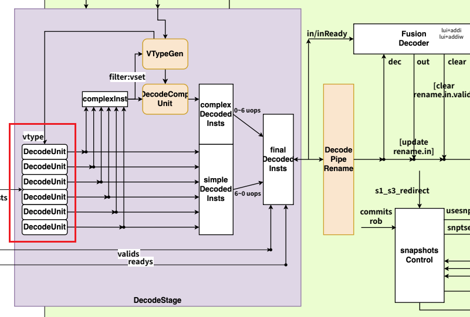

在紫色板块（DecodeStage）中，我们只需理解被红色方框框出的部分。因为其他部分主要服务于向量指令，而学习初期我们暂不关注此类复杂指令。因此，可以认为译码模块的探究已经完成，接下来应转向对重命名（Rename）阶段的探究。

在探究重命名的实现之前，强烈建议先熟悉其理论基础，这将帮助你更好地理解此处的架构设计。理论学习可参考《香山源代码剖析 第二册》P1011，或直接阅读下方图片：

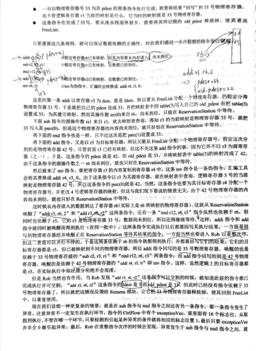

熟悉了上述理论知识后，接下来需要查看架构图：

可以发现，在 DecodeStage 译码结束后，会大致将两类信号向外传递，即上图中标红的数字 1 和 2。接下来，我们将主要从这两类信号开始，分析指令进入后续流水级的具体行为。

在查看此架构图时，需要注意一个关键点：图中所有用橙色标示的区域，通常都可以认为内部包含寄存器。例如下图框出的这些部分：

而其他部分通常只包含组合逻辑。

下面对这两组信号作简要说明：

1. **第1组信号**：传入名为 `DecodePipeRename`的模块。顾名思义，这是连接译码（Decode）模块和重命名（Rename）模块之间的流水级寄存器。这组信号负责将译码产生的信息传递到后续流水级。
2. **第2组信号**：这组信号**没有经过任何寄存器**，直接进入了 RAT（重命名地址表）中。因此，这组信号是利用逻辑源地址（`lsrc`）直接读取 RAT 表项的信号。具体作用将在后续结合波形进行解释。

### （1.1）译码信号如何进入下一流水级

首先观察第一组信号的波形，需要找到 `DecodePipeRename`这个模块。

提取该模块的主要输出信号，并结合之前译码阶段的部分信号，以观察其行为：

从 Decode 模块的输入和输出信号波形可以看出，其输入与输出之间是直接组合逻辑相连的，中间没有寄存器。Decode 模块的输出信号会直接传入 `DecodePipeRename`模块。

只有当 `valid`信号和 `ready`信号同时有效时，数据才能通过这个寄存器被锁存，并打入下一个流水级。这两个信号是非常关键的控制信号。例如，在图中所示的情况下：

`valid`信号一直保持为高电平，这表明当前位于译码阶段的这条加法指令已准备好进入下一流水级。

在**周期a**，`ready`信号为低电平，表示后续流水线尚未准备好接收这条加法指令，因此它需要停留在译码阶段等待。

在**周期b**，检测到 `ready`信号变为高电平，表明后续流水级已准备就绪。因此，在下一个时钟周期，译码产生的所有信号被成功锁存到 `DecodePipeRename`模块的输出端，也就是进入了重命名（Rename）流水级。

当然，我们可以再检查一下这些进入重命名（Rename）阶段的必要信号是否正确：

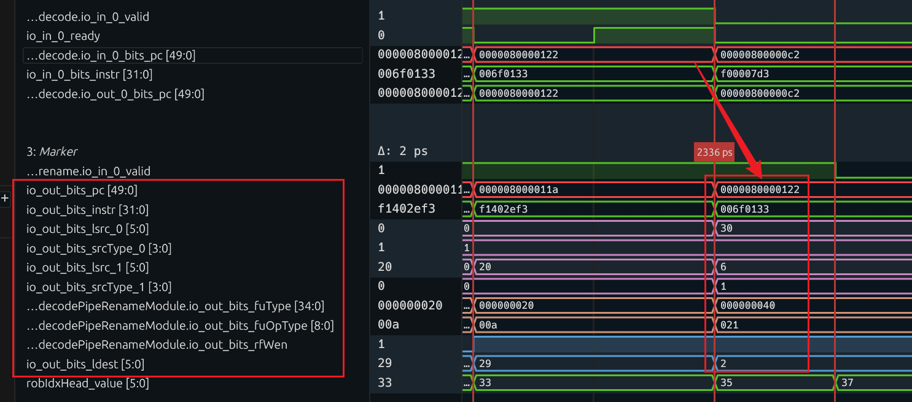

| 波形信号名 | 位宽 | 核心含义 | 对应 Chisel 源码位置 | 补充说明 |
| --- | --- | --- | --- | --- |
| `decode.io_in_0_valid` | 1-bit | 译码模块第 0 路输入有效信号（表示有指令送入译码模块） | `src/main/scala/xiangshan/backend/decode/DecodeUnit.scala` → `io.in(0).valid` | Chisel 中`DecoupledIO` 的标准信号：`valid=1` 表示输入指令有效 |
| `io_in_0_ready` | 1-bit | 译码模块第 0 路输入就绪信号（表示译码模块可接收新指令） | 同上 → `io.in(0).ready` | `valid & ready` 表示指令成功送入译码模块（握手成功） |
| `decode.io_in_0_bits_pc[49:0]` | 50bit | 送入译码模块的指令 PC（程序计数器） | `src/main/scala/xiangshan/utils/bundles/CtrlFlow.scala` → `CtrlFlow.pc` （译码模块输入`in.bits` 为`CtrlFlow`  Bundle） | 50 位对应香山物理地址位宽（`PAddrBits=50` ），记录指令内存地址 |
| `io_in_0_bits_instr[31:0]` | 32bit | 送入译码模块的原始 32 位 RISC-V 指令机器码 | 同上 → `CtrlFlow.instr` | 未译码的二进制指令，如波形中`006f0133` 是 ADD 指令机器码 |
| `decode.io_out_0_bits_pc[49:0]` | 50bit | 译码模块输出的指令 PC（与输入 PC 一致） | `src/main/scala/xiangshan/backend/decode/DecodeBundle.scala` → `DecodedInst.pc` | 译码后保留 PC，用于后续异常处理、流水线追踪 |
| `rename.io_in_0_valid` | 1bit | 重命名模块第 0 路输入有效信号（表示译码后的指令送入重命名模块） | `src/main/scala/xiangshan/backend/rename/RenameUnit.scala` → `io.in(0).valid` | 译码→重命名阶段的握手有效信号 |
| `io_out_bits_pc[49:0]` | 50bit | 重命名模块输出的指令 PC | 同上 → `io.out(0).bits.pc` | 重命名阶段不修改 PC，仅透传 |
| `io_out_bits_instr[31:0]` | 32bit | 重命名模块输出的原始指令机器码 | 同上 → `io.out(0).bits.instr` | 重命名阶段保留原始指令，用于调试 / 校验 |
| `io_out_bits_lsrc_0[5:0]` | 6bit | 第 0 个源操作数的**逻辑寄存器号** | `DecodeBundle.scala`  → `DecodedInst.lsrc(0)` | 波形中值为`30` （十进制），对应 RISC-V 寄存器`x30` |
| `io_out_bits_srcType_0[3:0]` | 4bit | 第 0 个源操作数的**类型标识** | `DecodeBundle.scala`  → `DecodedInst.srcType(0)` | 波形中值为`1` ，表示该操作数是**通用寄存器类型**（其他值：0 = 立即数、2=PC 等） |
| `io_out_bits_lsrc_1[5:0]` | 6bit | 第 1 个源操作数的逻辑寄存器号 | `DecodeBundle.scala`  → `DecodedInst.lsrc(1)` | 波形中值为`6` ，对应寄存器`x6` |
| `io_out_bits_srcType_1[3:0]` | 4bit | 第 1 个源操作数的类型标识 | `DecodeBundle.scala`  → `DecodedInst.srcType(1)` | 波形中值为`1` ，同样表示通用寄存器类型 |
| `decodePipeRenameModule.io_out_bits_fuType[34:0]` | 35bit | 指令所属的**功能单元（FU）类型** | `src/main/scala/xiangshan/backend/decoder/InstEnum.scala` → `FUType` 枚举 | 波形中值为`000000040` （十六进制），对应`ALU` 功能单元（整数运算） |
| `decodePipeRenameModule.io_out_bits_fuOpType[8:0]` | 9bit | 功能单元内的**具体操作类型** | 同上 → `FUOpType` 枚举 | 波形中值为`021` （十六进制），对应 ALU 的`ADD` 操作（加法） |
| `decodePipeRenameModule.io_out_bits_rfWen` | 1bit | 寄存器堆写使能信号 | `DecodeBundle.scala`  → `DecodedInst.rfWen` | 波形中值为`1` ，表示该指令执行后需要写回目标寄存器 |
| `io_out_bits_ldest[5:0]` | 6bit | 目标操作数的逻辑寄存器号 | `DecodeBundle.scala`  → `DecodedInst.ldest` | 波形中值为`2` ，对应寄存器`x2` （栈指针 sp） |

这些都是我们从译码模块的输出中已熟悉的信号，这里不再赘述。经核对，这些信号均是准确的。

### （1.2）RAT表的读取操作

在前面我们还提到，存在第2组信号，用于读取RAT表。接下来我们继续分析这组信号：

很明显，这组信号在译码阶段就直接传入了RAT表，中间没有经过任何寄存器。

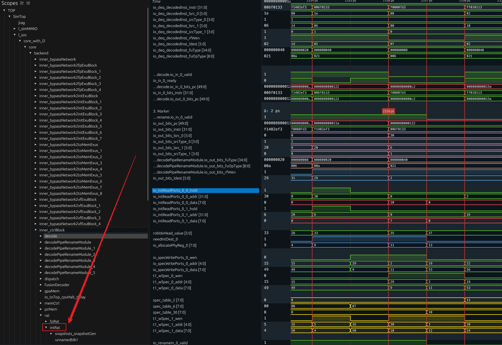

那么，我们直接查看 RAT 表的输入。在熟悉重命名理论知识的前提下，我们知道此处的读取操作必然以两个逻辑源寄存器地址（`lsrc`）作为索引，即：

* 对应 `srcType = 0x1, lsrc_0 = 0x1e`表示第一个操作数来自 30 号寄存器。
* 对应 `srcType = 0x1, lsrc_1 = 0x06`表示第二个操作数来自 6 号寄存器。

系统会以 `30`和 `6` 这两个数值进行读取。找到对应的波形图：

无论是从架构图推断，还是通过波形图确认，我们都能看出RAT在指令仍处于译码阶段时，就已经接收到了两个需要读取的地址，即上图中红框标记的30和6。这个行为是正确的。

另外，可以观察到`hold`信号与`valid`和`ready`信号紧密关联。只有当这两个信号允许时，才“不hold”，即不进行保持，允许执行读取操作。

那么，读取出的内容是在当前周期就得到，还是需要延迟几个周期呢？换句话说，上图中`io_intReadPorts_*_data`信号在哪个时刻对应的是地址30和6的数据？要确认这一点，需要从代码中找到答案。

这里就是读端口在代码中所处的位置：

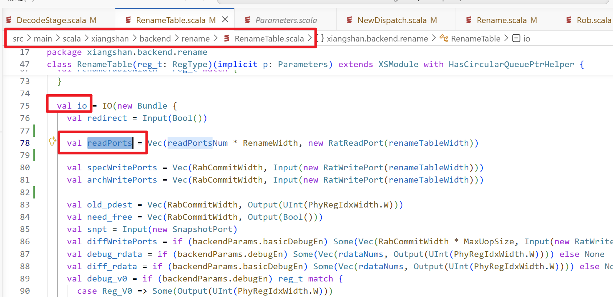

在代码中，我们可以看到这样的一些代码片段，它们清楚地说明了这组信号之间的时序关系。

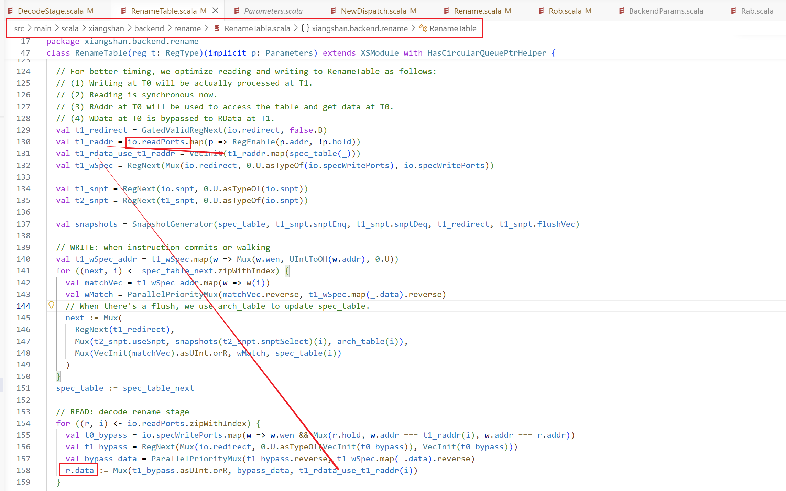

上图代码提供了以下关键信息：

`readPorts`信号进入 RAT 后，在满足条件时（`!hold`）会经过一拍寄存，变成 `t1_raddr`信号。随后，在同一周期内，即可通过 `spec_table(_)`读出对应的数据，存入 `t1_rdata_use_t1_raddr`信号，这就是需要读取的原始数据。

之后，`t1_rdata_use_t1_raddr`会经过下方一系列的“旁路（bypass）处理”，最终成为最终输出的读数据 `r.data`。

至于“旁路的一堆处理”具体指什么，这需要后续进行探究。但通过阅读此处的代码，我们至少可以明确：**读取的数据将会在下一个时钟周期产生**。

虽然读取地址会在指令处于译码周期时就被送入 RAT 表，但实际读取到的数据要到下一个周期才会产生。与此同时，`DecodePipeRename`也会在下一个周期将译码完成的数据锁存并送入下一流水级。因此，我们可以认为，**实际读取到的数据将与指令相关的译码数据一同进入 Rename 模块**。

接下来，我们再查看波形进行验证：

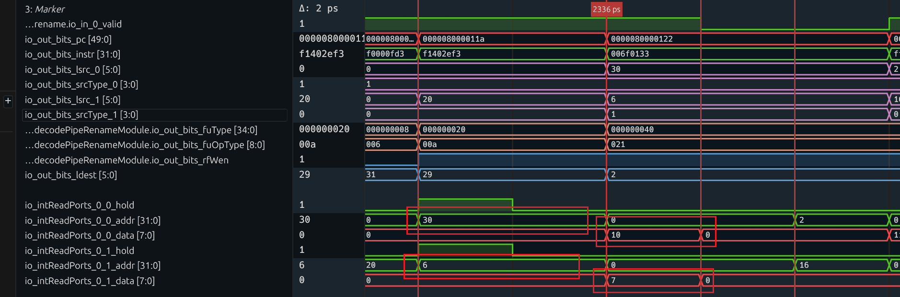

| 波形信号名 | 位宽 | 核心功能 | 对应 Chisel 源码位置 | 波形补充说明 |
| --- | --- | --- | --- | --- |
| `...rename.io_in_0_valid` | 1bit | 重命名模块第 0 路输入的握手有效信号，`=1` 表示译码后的指令有效，可送入重命名模块处理 | `src/main/scala/xiangshan/backend/rename/RenameUnit.scala` 对应 `io.in(0).valid` （DecoupledIO 标准握手信号） | 波形中持续为高，说明流水线持续有有效指令输入 |
| `io_out_bits_pc[49:0]` | 50bit | 重命名模块输出的指令 PC（程序计数器），与取指、译码阶段的 PC 完全透传，用于异常处理、指令流追踪、分支预测校验 | 1. 字段定义：`src/main/scala/xiangshan/backend/decode/DecodeBundle.scala`  → `DecodedInst.pc` 2. 模块透传：`RenameUnit.scala`  → `io.out(0).bits.pc` | 2336ps 时值为`0000080000122` ，是 RISC-V 处理器标准启动地址空间的指令 |
| `io_out_bits_instr[31:0]` | 32bit | 重命名模块输出的原始 32 位 RISC-V 指令机器码，重命名阶段不修改，保留用于调试、异常回溯、指令合法性校验 | 1. 字段定义：`DecodeBundle.scala`  → `DecodedInst.instr` 2. 模块透传：`RenameUnit.scala`  → `io.out(0).bits.instr` | 2336ps 时值为`006f0133` ，对应 RISC-V 的`add` 整数加法指令 |
| `io_out_bits_lsrc_0[5:0]` | 6bit | 指令第 0 个源操作数的**逻辑寄存器号**（架构寄存器号），对应 RISC-V 指令的`rs1` 字段 | 1. 字段定义：`DecodeBundle.scala`  → `DecodedInst.lsrc(0)` 2. 模块透传：`RenameUnit.scala`  中直接透传该字段 | 2336ps 时值为`30` （十进制），对应 RISC-V 通用寄存器`x30` |
| `io_out_bits_srcType_0[3:0]` | 4bit | 指令第 0 个源操作数的**类型标识**，用于区分操作数是通用寄存器、立即数、PC 值等类型 | 1. 枚举定义：`src/main/scala/xiangshan/backend/decoder/InstType.scala`  → `SrcType` 2. 字段定义：`DecodeBundle.scala`  → `DecodedInst.srcType(0)` | 2336ps 时值为`1` ，对应「通用寄存器类型」 |
| `io_out_bits_lsrc_1[5:0]` | 6bit | 指令第 1 个源操作数的**逻辑寄存器号**，对应 RISC-V 指令的`rs2` 字段 | 1. 字段定义：`DecodeBundle.scala`  → `DecodedInst.lsrc(1)` 2. 模块透传：`RenameUnit.scala`  中直接透传该字段 | 2336ps 时值为`6` （十进制），对应 RISC-V 通用寄存器`x6` |
| `io_out_bits_srcType_1[3:0]` | 4bit | 指令第 1 个源操作数的**类型标识**，定义与`srcType_0` 完全一致 | 1. 枚举定义：`InstType.scala`  → `SrcType` 2. 字段定义：`DecodeBundle.scala`  → `DecodedInst.srcType(1)` | 2336ps 时值为`1` ，对应「通用寄存器类型」 |
| `...decodePipeRenameModule.io_out_bits_fuType[34:0]` | 35bit | 指令所属的**功能单元（FU）类型**，决定该指令要分发到哪个执行单元（ALU / 乘除法 / 访存 / 分支等） | 1. 枚举定义：`src/main/scala/xiangshan/backend/decoder/InstEnum.scala`  → `FUType` 2. 字段定义：`DecodeBundle.scala`  → `DecodedInst.fuType` | 2336ps 时值为`000000040` （十六进制），对应「ALU 整数运算单元」 |
| `...decodePipeRenameModule.io_out_bits_fuOpType[8:0]` | 9bit | 功能单元内的**具体操作类型**，在`fuType` 基础上，指定执行单元要完成的具体运算 | 1. 枚举定义：`InstEnum.scala`  → `FUOpType` 2. 字段定义：`DecodeBundle.scala`  → `DecodedInst.fuOpType` | 2336ps 时值为`021` （十六进制），对应 ALU 的「ADD 加法操作」 |
| `...decodePipeRenameModule.io_out_bits_rfWen` | 1bit | 寄存器堆写使能信号，`=1` 表示该指令执行完成后，需要将结果写回目标寄存器 | 字段定义：`DecodeBundle.scala`  → `DecodedInst.rfWen` | 波形中持续为高，说明该指令需要写回寄存器 |
| `io_out_bits_ldest[5:0]` | 6bit | 指令目标操作数的**逻辑寄存器号**，对应 RISC-V 指令的`rd` 字段 | 字段定义：`DecodeBundle.scala`  → `DecodedInst.ldest` | 2336ps 时值为`2` （十进制），对应 RISC-V 通用寄存器`x2` （栈指针 sp） |

由此可以确认，以 30 和 6 作为地址传入 RAT 表进行读取，数据会在下一个时钟周期读出，其值分别为 10 和 7。

现在我们可以明确：

* `lsrc_0 = 0x1e`表示第一个操作数来自**逻辑 30 号寄存器**，它之前被映射到了**物理寄存器 10**。
* `lsrc_1 = 0x06`表示第二个操作数来自**逻辑 6 号寄存器**，它之前被映射到了**物理寄存器 7**。

理解了吗？现在，我们可以进一步核对 `spec_table`中第 30 号和第 6 号位置的数据是否确实为 10 和 7：

| 波形信号名 | 位宽 | 核心功能 | 对应 Chisel 源码位置 | 波形补充说明 |
| --- | --- | --- | --- | --- |
| `...rename.io_in_0_valid` | 1bit | 重命名模块第 0 路输入的握手有效信号，`=1` 表示译码后的指令有效，可送入重命名模块处理 | `src/main/scala/xiangshan/backend/rename/RenameUnit.scala` 对应 `io.in(0).valid` （DecoupledIO 标准握手信号） | 波形中持续为高，说明流水线持续有有效指令输入 |
| `io_out_bits_pc[49:0]` | 50bit | 重命名模块输出的指令 PC（程序计数器），与取指、译码阶段的 PC 完全透传，用于异常处理、指令流追踪、分支预测校验 | 1. 字段定义：`src/main/scala/xiangshan/backend/decode/DecodeBundle.scala`  → `DecodedInst.pc` 2. 模块透传：`RenameUnit.scala`  → `io.out(0).bits.pc` | 2336ps 时值为`0000080000122` ，是 RISC-V 处理器标准启动地址空间的指令 |
| `io_out_bits_instr[31:0]` | 32bit | 重命名模块输出的原始 32 位 RISC-V 指令机器码，重命名阶段不修改，保留用于调试、异常回溯、指令合法性校验 | 1. 字段定义：`DecodeBundle.scala`  → `DecodedInst.instr` 2. 模块透传：`RenameUnit.scala`  → `io.out(0).bits.instr` | 2336ps 时值为`006f0133` ，对应 RISC-V 的`add` 整数加法指令 |
| `io_out_bits_lsrc_0[5:0]` | 6bit | 指令第 0 个源操作数的**逻辑寄存器号**（架构寄存器号），对应 RISC-V 指令的`rs1` 字段 | 1. 字段定义：`DecodeBundle.scala`  → `DecodedInst.lsrc(0)` 2. 模块透传：`RenameUnit.scala`  中直接透传该字段 | 2336ps 时值为`30` （十进制），对应 RISC-V 通用寄存器`x30` |
| `io_out_bits_srcType_0[3:0]` | 4bit | 指令第 0 个源操作数的**类型标识**，用于区分操作数是通用寄存器、立即数、PC 值等类型 | 1. 枚举定义：`src/main/scala/xiangshan/backend/decoder/InstType.scala`  → `SrcType` 2. 字段定义：`DecodeBundle.scala`  → `DecodedInst.srcType(0)` | 2336ps 时值为`1` ，对应「通用寄存器类型」 |
| `io_out_bits_lsrc_1[5:0]` | 6bit | 指令第 1 个源操作数的**逻辑寄存器号**，对应 RISC-V 指令的`rs2` 字段 | 1. 字段定义：`DecodeBundle.scala`  → `DecodedInst.lsrc(1)` 2. 模块透传：`RenameUnit.scala`  中直接透传该字段 | 2336ps 时值为`6` （十进制），对应 RISC-V 通用寄存器`x6` |
| `io_out_bits_srcType_1[3:0]` | 4bit | 指令第 1 个源操作数的**类型标识**，定义与`srcType_0` 完全一致 | 1. 枚举定义：`InstType.scala`  → `SrcType` 2. 字段定义：`DecodeBundle.scala`  → `DecodedInst.srcType(1)` | 2336ps 时值为`1` ，对应「通用寄存器类型」 |
| `...decodePipeRenameModule.io_out_bits_fuType[34:0]` | 35bit | 指令所属的**功能单元（FU）类型**，决定该指令要分发到哪个执行单元（ALU / 乘除法 / 访存 / 分支等） | 1. 枚举定义：`src/main/scala/xiangshan/backend/decoder/InstEnum.scala`  → `FUType` 2. 字段定义：`DecodeBundle.scala`  → `DecodedInst.fuType` | 2336ps 时值为`000000040` （十六进制），对应「ALU 整数运算单元」 |
| `...decodePipeRenameModule.io_out_bits_fuOpType[8:0]` | 9bit | 功能单元内的**具体操作类型**，在`fuType` 基础上，指定执行单元要完成的具体运算 | 1. 枚举定义：`InstEnum.scala`  → `FUOpType` 2. 字段定义：`DecodeBundle.scala`  → `DecodedInst.fuOpType` | 2336ps 时值为`021` （十六进制），对应 ALU 的「ADD 加法操作」 |
| `...decodePipeRenameModule.io_out_bits_rfWen` | 1bit | 寄存器堆写使能信号，`=1` 表示该指令执行完成后，需要将结果写回目标寄存器 | 字段定义：`DecodeBundle.scala`  → `DecodedInst.rfWen` | 波形中持续为高，说明该指令需要写回寄存器 |
| `io_out_bits_ldest[5:0]` | 6bit | 指令目标操作数的**逻辑寄存器号**，对应 RISC-V 指令的`rd` 字段 | 字段定义：`DecodeBundle.scala`  → `DecodedInst.ldest` | 2336ps 时值为`2` （十进制），对应 RISC-V 通用寄存器`x2` （栈指针 sp） |

寄存器堆读端口信号

| 波形信号名 | 位宽 | 核心功能 | 对应 Chisel 源码位置 | 波形补充说明 |
| --- | --- | --- | --- | --- |
| `io_intReadPorts_0_0_hold` | 1bit | 整数寄存器堆第 0 路读端口的保持信号，`=1` 时会锁存当前读端口的地址和数据，避免流水线气泡导致的读数据丢失 | `src/main/scala/xiangshan/backend/regfile/IntRegFile.scala` 对应 `io.readPorts(0).hold` | 波形中持续为高，说明读端口持续保持有效输出 |
| `io_intReadPorts_0_0_addr[31:0]` | 32bit（实际有效位 6bit） | 整数寄存器堆第 0 路读端口的地址，即要读取的寄存器号 | `IntRegFile.scala`  → `io.readPorts(0).addr` | 2336ps 前地址为`30` ，对应前面指令的`lsrc_0=30` ，要读取`x30` 寄存器 |
| `io_intReadPorts_0_0_data[7:0]` | 8bit（波形仅展示低 8 位，实际为 64bit RV64 位宽） | 整数寄存器堆第 0 路读端口读出的寄存器数据 | `IntRegFile.scala`  → `io.readPorts(0).data` | 对应地址`30` 时，读出数据为`10` （十六进制），即`x30` 寄存器的值为`0x10` |
| `io_intReadPorts_0_1_hold` | 1bit | 整数寄存器堆第 1 路读端口的保持信号，功能与第 0 路完全一致 | `IntRegFile.scala`  → `io.readPorts(1).hold` | 波形中持续为高，与第 0 路同步保持 |
| `io_intReadPorts_0_1_addr[31:0]` | 32bit（实际有效位 6bit） | 整数寄存器堆第 1 路读端口的地址，即要读取的寄存器号 | `IntRegFile.scala`  → `io.readPorts(1).addr` | 2336ps 前地址为`6` ，对应前面指令的`lsrc_1=6` ，要读取`x6` 寄存器 |
| `io_intReadPorts_0_1_data[7:0]` | 8bit（波形仅展示低 8 位，实际为 64bit） | 整数寄存器堆第 1 路读端口读出的寄存器数据 | `IntRegFile.scala`  → `io.readPorts(1).data` | 对应地址`6` 时，读出数据为`7` （十六进制），即`x6` 寄存器的值为`0x7` |

此时我们会观察到，`spec_table_6`的值确实是 7，读取出来的也是 7，行为正确。但查看 `spec_table_30`时就会发现问题：读取这个位置时的值不是 0 吗，为什么读出来是 10？

发现问题了吧。这时候你应该能猜到，原因就在于前面提到过的：

> `t1_rdata_use_t1_raddr`会经过下方一系列的“旁路（bypass）处理”，最终成为最终输出的读数据 `r.data`，

没错，正是 `bypass`中的处理导致了这一结果。我们再来仔细阅读 `bypass`部分的代码：

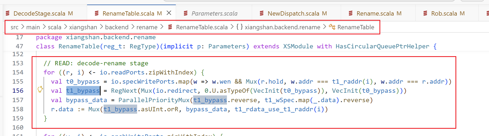

发现了吗？之所以需要这些处理，是因为**读取操作和写入操作可能同时发生**。为了保证逻辑上的正确性，必须设置这样的旁路路径来检测：当前正在写入的值，是否恰好是本次读取所期望的值。如果是，**那么这个尚未真正写入的值，才是我们真正想要读取的正确数据**。

下图清晰地展示了这条旁路路径以及读数据的时序关系。请你结合代码来理解，一定能彻底弄清楚。实际上，下图已经把写数据的时序逻辑也清楚地标明了。写信号在进入重命名（Rename）阶段后，还会再打一拍，变成 `t1_wspec`信号，之后才能真正访问到 `spec_table`。明确这一点，将有助于我们后续的理解。

清楚了读时序逻辑、旁路机制以及写操作的时序逻辑后，再来看波形就非常简单了。回顾一下前面尚未解决的问题：

> 查看 `spec_table_30`时就会发现问题：读取这个位置时的值不是 0 吗，为什么读出来是 10？

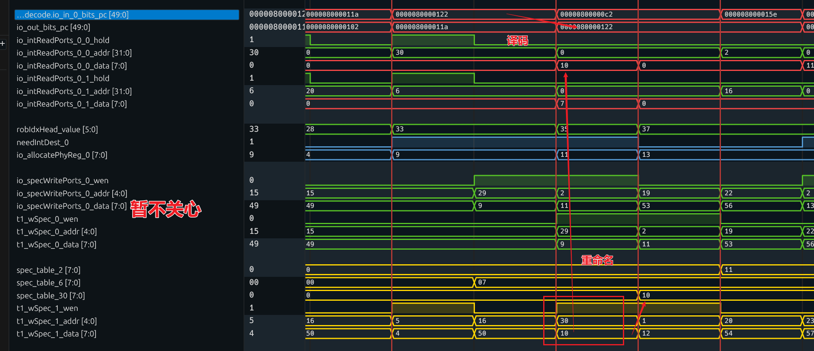

可以清楚地发现，当我们的加法指令进入重命名阶段后，在同一个周期内，`t1_wSpec`信号正在对 SpecTable\_30 表进行写入操作，写入的值恰好是 10。

因此，我们应该直接采用这里正要写入的 10 作为正确数据，而不是表中当前存储的旧值 0。

通过以上探究，我们可以总结如下：

我们已经确认以下信息：

* `lsrc_0 = 0x1e`表示第一个操作数来自**逻辑 30 号寄存器**，此时它被映射到了**物理寄存器 10**。
* `lsrc_1 = 0x06`表示第二个操作数来自**逻辑 6 号寄存器**，此时它被映射到了**物理寄存器 7**。

也就是说：

* 源操作数0 来自逻辑寄存器 30 号，我们需要在**物理寄存器 10 号**中获取其数据。
* 源操作数1 来自逻辑寄存器 6 号，我们需要在**物理寄存器 7 号**中获取其数据。

此外，我们还理清了其中简单的旁路路径，以及读写操作的时序逻辑。

### （1.3）RAT表的写操作

对于这条加法指令，根据前面的译码信号，我们已知以下信息：

> 运算结果会进行回写（`rfWen`为高），写入的寄存器位置是 2 号寄存器（`ldest = 0x2`）

这条指令肯定要对寄存器进行回写。因此，在重命名阶段，我们需要完成两件重要的事情：

1. **从 Freelist 获取一个空闲的物理寄存器**，指示这条指令的回写结果应该存入哪个物理寄存器。
2. **更新 RAT 表**。由于我们刚刚获得了一个物理寄存器，意味着这条指令将要回写的**逻辑寄存器 2 号**，从此刻起被映射到这个新分配的物理寄存器上。因此，需要将这一映射关系写入 RAT 表，告知后续的指令：逻辑寄存器 2 号现在映射到了一个新的物理寄存器。

首先，来看第一个任务的行为。我们直接推测，指令在有效（`valid`）且需要回写（`rfWen`）时，才会触发 Freelist 分配物理寄存器。在代码中，`needIntDest`信号用于指示是否需要分配物理寄存器。我们直接查看它的实现方式：

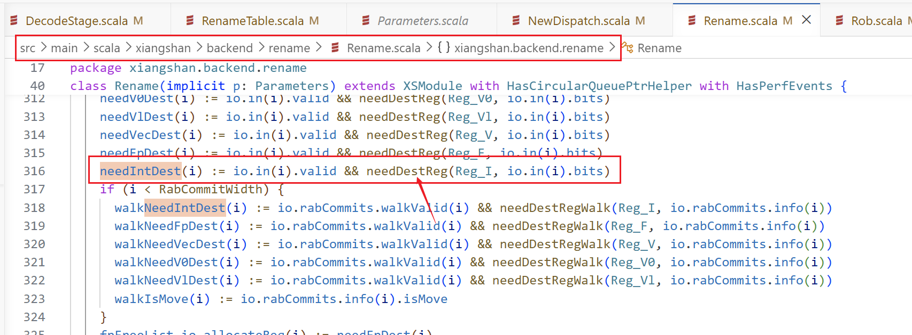

这完美印证了我们的猜想：当 `valid`信号和 `rfWen`信号均为高电平时，请求新物理寄存器的信号（`needIntDest`）就会被拉高。

之后，Freelist 模块会根据这个请求信号，返回一个“当前空闲的”物理寄存器。

获得这个物理寄存器后，接下来应该就是执行写入 RAT 表的操作了。

我们接着看波形：

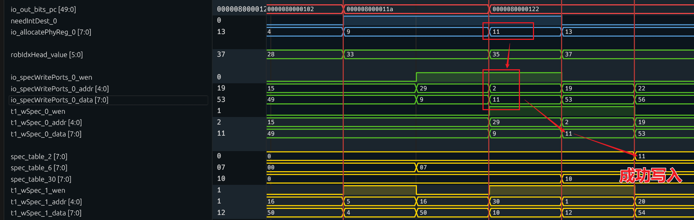

重命名控制和分配信号

| 信号名 | 位宽 | 核心功能 | 对应 Chisel 源码位置 | 波形关键说明 |
| --- | --- | --- | --- | --- |
| `io_out_bits_pc[49:0]` | 50bit | 重命名模块输出的指令 PC，与取指、译码阶段的 PC 完全透传，用于指令流追踪、异常回溯，是跟踪单条指令全生命周期的核心标识 | 1. 字段定义：`src/main/scala/xiangshan/backend/decode/DecodeBundle.scala`  → `DecodedInst.pc` 2. 模块透传：`src/main/scala/xiangshan/backend/rename/RenameUnit.scala`  → `io.out.bits.pc` | 红框周期值为`0000080000122` ，与之前译码波形的 ADD 指令 PC 一致，是同一条指令的重命名阶段 |
| `needIntDest_0` | 1bit | 第 0 路指令的整数目标寄存器需求标记：`=1` 表示该指令有整数目标寄存器，需要从空闲列表分配物理寄存器；`=0` 表示无需分配 | 1. 字段定义：`DecodeBundle.scala`  → `DecodedInst.needIntDest` 2. 控制逻辑：`RenameUnit.scala`  中用于触发 FreeList 分配 | 该信号为前级译码输出，提前 1 个周期触发物理寄存器分配，是重命名的前置控制信号 |
| `io_allocatePhyReg_0[7:0]` | 8bit | 重命名模块为第 0 路指令**从 FreeList 空闲列表分配的整数物理寄存器号**，是寄存器重命名的核心输出，用于后续重命名表更新、忙表标记 | 1. 分配逻辑：`src/main/scala/xiangshan/backend/rename/FreeList.scala` 2. 端口定义：`RenameUnit.scala`  → `io.allocatePhyReg(0)` | 红框周期值为`11` （十进制），即为这条 ADD 指令的目标逻辑寄存器`x2` 分配的物理寄存器号 |
| `robIdxHead_value[5:0]` | 6bit | ROB（重排序缓冲）的**分配头指针**，即新指令分配到的 ROB 表项索引，严格按程序原始顺序递增，是乱序流水线中指令「程序顺序」的唯一标识 | `src/main/scala/xiangshan/backend/rob/Rob.scala`  → ROB 模块的`allocPtr` /`io.head` | 红框周期值为`35` ，即这条指令被分配到 ROB 的第 35 号表项，后续将按 ROB 索引顺序提交 |

RAT 写端口信号

| 信号名 | 位宽 | 核心功能 | 对应 Chisel 源码位置 | 波形关键说明 |
| --- | --- | --- | --- | --- |
| `io_specWritePorts_0_wen` | 1bit | 推测重命名表（Speculative Rename Map）**写端口 0 的写使能**，`=1` 表示当前周期要更新重命名表，写入新的「逻辑→物理寄存器」映射关系 | 1. 端口定义：`src/main/scala/xiangshan/backend/rename/RenameMap.scala`  → `SpecRenameMap` 的`io.write` 端口2. 控制逻辑：`RenameUnit.scala`  中重命名表写控制 | 红框周期值为`1` ，表示当前周期发起重命名表写入请求 |
| `io_specWritePorts_0_addr[4:0]` | 5bit | 重命名表写端口 0 的**写入地址**，即要更新的**逻辑寄存器号（架构寄存器号）**，对应指令的`rd` 目标寄存器字段 | 同上，`RenameMap.scala`  写端口的`addr` 字段 | 红框周期值为`2` ，对应要更新的逻辑寄存器`x2` ，与之前译码波形的`ldest=2` 完全匹配 |
| `io_specWritePorts_0_data[7:0]` | 8bit | 重命名表写端口 0 的**写入数据**，即逻辑寄存器新映射的**物理寄存器号**，与`io_allocatePhyReg_0` 的值完全一致 | 同上，`RenameMap.scala`  写端口的`data` 字段 | 红框周期值为`11` ，即要把`x2` 的映射关系更新为物理寄存器`11` |
| `t1_wSpec_0_wen` | 1bit | 重命名表写操作的**打拍后写使能**，与`io_specWritePorts_0_wen` 是同一写操作的流水线打拍信号，用于同步寄存器写入时序 | `RenameMap.scala`  内部写逻辑的打拍寄存器 | 红框周期值为`1` ，与前级写使能同步，触发最终的寄存器写入 |
| `t1_wSpec_0_addr[4:0]` | 5bit | 打拍后的重命名表写地址，与`io_specWritePorts_0_addr` 的值完全一致，用于时序同步 | 同上 | 红框周期值为`2` ，对应逻辑寄存器`x2` |
| `t1_wSpec_0_data[7:0]` | 8bit | 打拍后的重命名表写数据，与`io_specWritePorts_0_data` 的值完全一致，用于时序同步 | 同上 | 红框周期值为`11` ，对应新的物理寄存器号 |

RAT 存储和多发射辅助信号

| 信号名 | 位宽 | 核心功能 | 对应 Chisel 源码位置 | 波形关键说明 |
| --- | --- | --- | --- | --- |
| `spec_table_2[7:0]` | 8bit | 推测重命名表中**逻辑寄存器 x2 对应的表项**，存储当前`x2` 映射的物理寄存器号，是重命名映射关系的实际存储单元 | `RenameMap.scala`  内部的寄存器数组 `spec_table` | 写入操作完成后，值更新为`11` ，标注 “成功写入”，表示`x2→11` 的重命名映射已生效 |
| `spec_table_6[7:0]` | 8bit | 推测重命名表中逻辑寄存器 x6 对应的表项，存储 x6 当前映射的物理寄存器号 | 同上 | 波形中值为`07` ，表示 x6 当前映射到物理寄存器 7，与之前读寄存器波形的源操作数匹配 |
| `spec_table_30[7:0]` | 8bit | 推测重命名表中逻辑寄存器 x30 对应的表项，存储 x30 当前映射的物理寄存器号 | 同上 | 波形中值为`10` ，表示 x30 当前映射到物理寄存器 10，与之前读寄存器波形的源操作数匹配 |
| `t1_wSpec_1_wen` /`addr` /`data` | 1bit/5bit/8bit | 重命名表写端口 1 的打拍后写信号，对应第 1 路指令的重命名表更新，功能与写端口 0 完全一致 | 同上 | 波形中值为`1` /`30` /`10` ，表示同一周期第 1 路指令同步完成`x30→10` 的重命名映射写入，体现香山的多发射特性 |

从波形可以看出，在指令进入重命名阶段后，`needIntDest_0`信号被拉高。同时，它立即收到了一个名为 `allocatePhyReg_0`的信号，其值为 11。这表明 **Freelist 为这条加法指令分配了第 11 号物理寄存器，指令执行结果最终将被写入 11 号物理寄存器**。

既然产生了新的映射关系，此时就理应对 RAT 表进行一次写操作。我们可以直接推测：**这将向 RAT 表中地址为 2 的表项写入值 11**，目的是告知后续的指令，如果它们需要逻辑 2 号寄存器的值，就应该去 11 号物理寄存器中读取。这类似于本指令之前读取 RAT 表的操作。

我们继续看上图的波形。可以观察到，在本周期内，该指令确实如预期那样，为与 `io_specWritePorts_0_*`相关的写使能、地址和数据信号设置了正确的激励。结合前面绘制的时序图可以确认，这些数据会被打一拍，变成 `t1_wSpec_0_*`信号，然后在下一个时钟周期成功写入 `spec_table`表中。波形的行为与此完全一致。

经过本节内容的学习，你应该明确了以下几点：

* 运算结果会进行回写（`rfWen`为高），写入的**逻辑寄存器**位置是 2 号寄存器（`ldest = 0x2`）。
* 进入 Rename 阶段后，Freelist 为其分配了**第 11 号物理寄存器**，因此指令结果将写入 11 号物理寄存器。
* 除此之外，指令还执行了更新 RAT 表的操作，**向 RAT 表中地址为 2 的表项写入了值 11**。

### （1.4）分配Rob表项

为指令分配 ROB 表项的操作，同样在重命名阶段进行。查看波形：

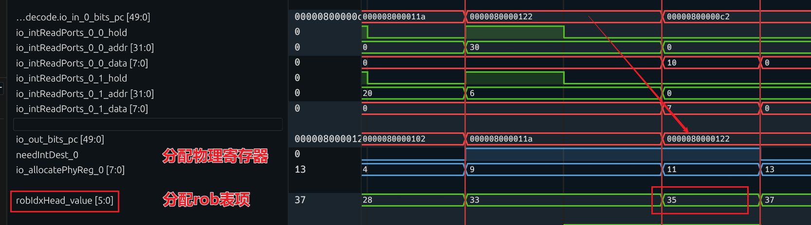

重命名模块输出和资源分配信号

| 信号名 | 位宽 | 核心功能 | 对应 Chisel 源码位置 | 波形关键说明 |
| --- | --- | --- | --- | --- |
| `io_out_bits_pc[49:0]` | 50bit | 重命名模块输出的指令 PC 值，与译码阶段的输入 PC 完全透传，用于在重命名、发射、执行、提交全阶段追踪同一条指令 | 1. 字段定义：`src/main/scala/xiangshan/backend/decode/DecodeBundle.scala`  → `DecodedInst.pc` 2. 模块端口：`src/main/scala/xiangshan/backend/rename/RenameUnit.scala`  → `io.out.bits.pc` | 波形中与译码阶段的`0x0000080000122` 完全对齐，确认是同一条指令的重命名阶段处理 |
| `needIntDest_0` | 1bit | 重命名模块第 0 路指令的整数目标寄存器需求标记：`=1` 表示该指令有有效的整数目标寄存器，需要从空闲物理寄存器列表（FreeList）分配新的物理寄存器；`=0` 则无需分配 | 1. 字段定义：`DecodeBundle.scala`  → `DecodedInst.needIntDest` 2. 控制逻辑：`RenameUnit.scala`  中用于触发 FreeList 的分配逻辑 | 目标指令周期内为高电平，说明该`add` 指令有目标寄存器`x2` ，需要分配物理寄存器 |
| `io_allocatePhyReg_0[7:0]` | 8bit | 重命名模块为第 0 路指令**从 FreeList 空闲列表分配的整数物理寄存器号**，是寄存器重命名的核心输出，用于后续重命名表更新、忙表标记、结果写回 | 1. 分配逻辑：`src/main/scala/xiangshan/backend/rename/FreeList.scala` 2. 端口定义：`RenameUnit.scala`  → `io.allocatePhyReg(0)` | 目标指令周期内值为`11` （十进制），即为目标逻辑寄存器`x2` 分配的物理寄存器号，后续该指令的运算结果将写回物理寄存器`11` |
| `robIdxHead_value[5:0]` | 6bit | ROB（重排序缓冲）的**分配头指针**，即新指令分配到的 ROB 表项索引，是乱序流水线中指令「程序原始顺序」的唯一标识，后续指令的执行、写回、异常处理、提交全流程都将以该索引为核心标识 | `src/main/scala/xiangshan/backend/rob/Rob.scala`  → ROB 模块的`allocPtr` /`io.head` 端口 | 目标指令周期内值为`35` ，即这条指令被分配到 ROB 的第 35 号表项，后续必须按 ROB 索引的递增顺序（程序顺序）完成提交 |

在重命名阶段，系统会自动记录每一次分配情况，独立地为每条有效指令分配 ROB 表项值，无需实时查看 ROB 页表的状态。

这大致通过以下代码实现分配：

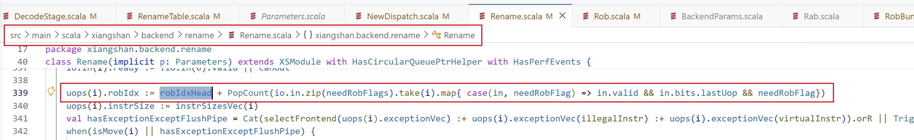

（暂未深入探究上述分配逻辑。）

通过本小节内容，可以确定：在重命名阶段，系统为这条加法指令分配了第 35 号 ROB 表项。

### （1.5）Rename往dispatch传输的信号总结

在对本节查看过的信号进行总结前，我们来查看最终传递给分发阶段（Dispatch）的信号具体有哪些。可以发现，在这两个阶段之间也存在一个 `RenamePipeDispatch`模块。

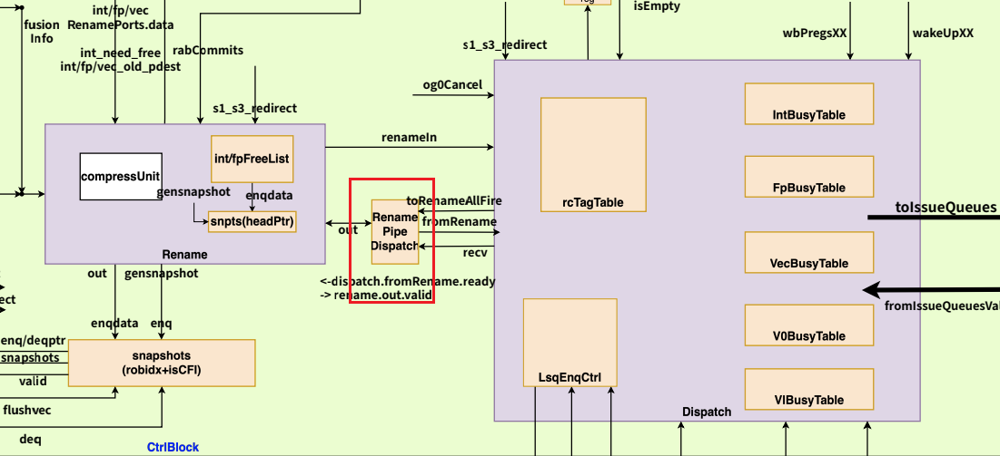

因此，我们可以直接查看这个模块的输出，也可以查看 Dispatch 模块的输入。此处我选择查看后者：

在这个模块中，我们提取以下信号进行观察：

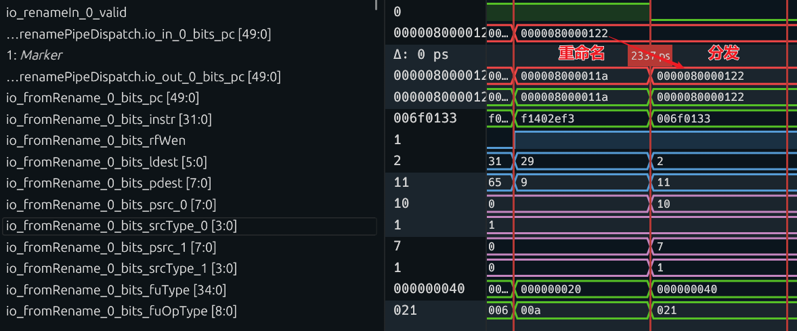

模块之间的握手信号：

| 信号名 | 位宽 | 核心含义 | 对应 Chisel 源码位置 | 波形数值与说明 |
| --- | --- | --- | --- | --- |
| `io_renameIn_0_valid` | 1bit | 重命名模块第 0 路输入的握手有效信号，`=1` 表示重命名模块接收到了来自译码阶段的有效指令 | `src/main/scala/xiangshan/backend/rename/RenameUnit.scala`  → `io.in(0).valid` | 波形中为高电平，说明重命名阶段有持续的有效指令输入 |
| `...renamePipeDispatch.io_in_0_bits_pc[49:0]` | 50bit | 分发模块第 0 路输入的指令 PC 值，是指令的唯一身份标识，与重命名阶段的 PC 完全透传 | `src/main/scala/xiangshan/backend/dispatch/DispatchUnit.scala`  → `io.in(0).bits.pc` | 2337ps 时刻值为`0000080000122` ，与重命名阶段的目标指令 PC 完全一致，确认是同一条指令进入分发模块 |
| `...renamePipeDispatch.io_out_0_bits_pc[49:0]` | 50bit | 分发模块第 0 路输出的指令 PC 值，PC 全程透传不修改，用于后续发射队列、执行阶段的指令追踪 | 同上 → `io.out(0).bits.pc` | 2337ps 时刻值为`0000080000122` ，确认指令成功通过分发模块，向下一级发射队列流转 |

重命名输出到分发模块的信号：

| 信号名 | 位宽 | 核心含义 | 对应 Chisel 源码位置 | 波形数值与说明 |
| --- | --- | --- | --- | --- |
| `io_fromRename_0_bits_pc[49:0]` | 50bit | 重命名模块输出的指令 PC 值，与前级完全透传，用于分发阶段的指令追踪、异常回溯 | 1. Bundle 定义：`src/main/scala/xiangshan/backend/decode/DecodeBundle.scala`  → `MicroOp.pc` 2. 模块端口：`RenameUnit.scala`  → `io.out(0).bits.pc` | 波形中值为`0000080000122` ，与分发模块输入的 PC 完全一致，是重命名模块发给分发模块的指令身份标识 |
| `io_fromRename_0_bits_instr[31:0]` | 32bit | 重命名模块输出的原始 32 位 RISC-V 指令机器码，全程透传不修改，用于调试、指令合法性校验 | 同上 → `MicroOp.instr` | 波形中值为`006f0133` ，对应`add` 加法指令，与之前译码阶段的机器码完全一致 |
| `io_fromRename_0_bits_rfWen` | 1bit | 寄存器堆写使能信号，`=1` 表示该指令执行完成后，需要将结果写回目标物理寄存器 | 同上 → `MicroOp.rfWen` | 波形中持续为高电平，说明这条`add` 指令需要写回目标寄存器，与之前的分析一致 |
| `io_fromRename_0_bits_ldest[5:0]` | 6bit | 指令目标操作数的**逻辑寄存器号（架构寄存器号）**，对应 RISC-V 指令的`rd` 字段，重命名阶段透传不修改 | 同上 → `MicroOp.ldest` | 波形中值为`2` ，对应目标逻辑寄存器`x2` （栈指针 sp），与译码阶段的`ldest=2` 完全匹配 |
| `io_fromRename_0_bits_pdest[7:0]` | 8bit | 重命名阶段为目标寄存器**分配的物理寄存器号**，是重命名阶段的核心输出，后续指令的运算结果将写回这个物理寄存器 | 同上 → `MicroOp.pdest` | 波形中值为`11` ，和之前重命名阶段分配的物理寄存器号完全一致，是这条指令的目标物理寄存器 |
| `io_fromRename_0_bits_psrc_0[7:0]` | 8bit | 第 0 个源操作数对应的**物理寄存器号**，由重命名阶段通过重命名映射表，从逻辑寄存器号`lsrc_0=30` 转换而来 | 同上 → `MicroOp.psrc(0)` | 波形中值为`10` ，对应逻辑寄存器`x30` 映射的物理寄存器号，后续发射队列会通过这个编号查询操作数是否就绪 |
| `io_fromRename_0_bits_srcType_0[3:0]` | 4bit | 第 0 个源操作数的类型标识，重命名阶段透传不修改，用于执行单元的操作数解析 | 同上 → `MicroOp.srcType(0)` | 波形中值为`1` ，表示该操作数是通用寄存器类型，与译码阶段一致 |
| `io_fromRename_0_bits_psrc_1[7:0]` | 8bit | 第 1 个源操作数对应的**物理寄存器号**，由逻辑寄存器号`lsrc_1=6` 转换而来 | 同上 → `MicroOp.psrc(1)` | 波形中值为`7` ，对应逻辑寄存器`x6` 映射的物理寄存器号 |
| `io_fromRename_0_bits_srcType_1[3:0]` | 4bit | 第 1 个源操作数的类型标识，透传不修改 | 同上 → `MicroOp.srcType(1)` | 波形中值为`1` ，表示通用寄存器类型 |
| `io_fromRename_0_bits_fuType[34:0]` | 35bit | 指令所属的**功能单元（FU）类型**，是分发模块的核心判断依据：分发模块会根据这个值，把指令分发到对应的发射队列 | 1. 枚举定义：`src/main/scala/xiangshan/backend/decoder/InstEnum.scala`  → `FUType` 2. Bundle 定义：`MicroOp.fuType` | 波形中值为`000000040` ，对应`ALU` 整数运算单元，分发模块会把这条指令分发到整数 ALU 对应的发射队列 |
| `io_fromRename_0_bits_fuOpType[8:0]` | 9bit | 功能单元内的**具体操作类型**，重命名阶段透传不修改，用于执行单元判断具体要执行的运算 | 同上 → `FUOpType` 枚举、`MicroOp.fuOpType` | 波形中值为`021` ，对应 ALU 的`ADD` 加法操作，与之前的指令类型完全匹配 |

主要关注目前的 Pc 值保持一致，分配了相应的物理寄存器，根据不同的 futype 的值可以分配到相应的模块里面

首先，我们通过 PC 值来验证流水线逻辑的正确性。可以发现流水级逻辑是正确的：在下一个周期，与 `dispatch`模块的 `io_fromRename_0_*`相关的信号被成功锁存，进入了分发（Dispatch）阶段。

从这些传入的信号值，我们可以得到以下信息：

* 这是一条 PC 为 `0x80000122`的加法指令，指令码为 `0x006f0133`。
* 该加法指令需要回写（`rfWen`为高），其回写的目标**逻辑寄存器**是 2 号（`ldest = 2`），在重命名阶段为它分配的**物理寄存器**是 11 号（`pdest = 11`）。
* 这条加法指令的两个源操作数都来自寄存器（`srcType`为 1），并且两个源操作数的值分别来自**物理寄存器 10 号**和**物理寄存器 7 号**（`psrc0 = 10`, `psrc1 = 7`）。
* 其余是关于 `fuType`和 `fuOpType`的信息，这里不再赘述。

基于前面对重命名阶段的理解，可以清晰地判断出，这些进入 Dispatch 阶段的信息都是正确的。
