# 乘法与除法的唤醒机制

以下内容按原始资料分段整理，原句与原图均保留，只在章节边界处加入必要的导语。

如果你还没有看过乘法和除法各自是怎么进入后端、怎么被发往对应 Issue Queue、怎么完成执行与提交的，建议先阅读：

* `../../instructions-lifecycle/mul-div/mul-div-execution-process.md`

这样在看下面的唤醒时序时，你会更容易知道“这条被唤醒的加法”到底站在流水线的什么位置上。


在前面对乘除法的分析中，我们会发现两条指令的源操作数都来自：

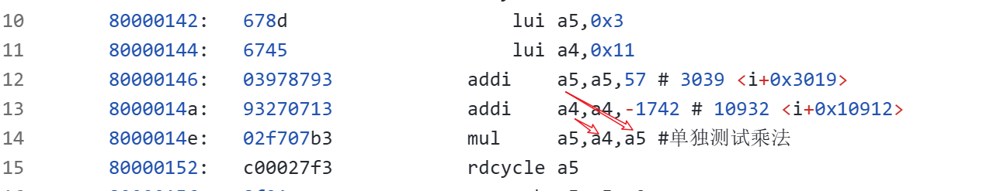

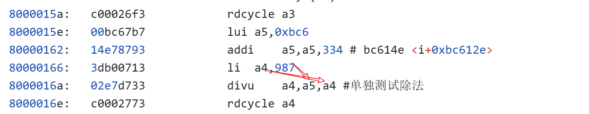

这些操作数均来自紧随其后的上一两条逻辑运算指令，而这类指令的运算延迟是固定的。因此，可以通过同 IQ 的唤醒方式来唤醒后续的乘除法指令。那么，乘除法指令各自可以采用何种方式来唤醒其他指令？有何限制？原因何在？下面将重点探究这一问题。

### 1.确定延迟的唤醒

在发射级的早期，如果同一个 IQ 发出的指令是 ALU 这种具有特定延迟的微操作，则会通过同级 IQ 进行唤醒。例如下图所示的情况：

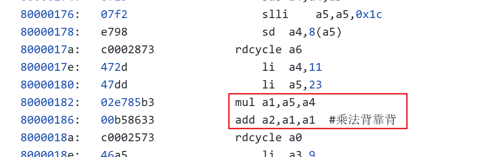

当这条加法指令需要依赖于前一条 `mul`指令的写回结果时，它将在何时、被何种唤醒源唤醒？

让我们在波形中寻找答案。

首先，定位这条加法指令在分发阶段的发射情况。可以顺利找到这两条指令在同一拍进入分发阶段。


查看它们被发往了哪个 IQ。


它们分别被发往第 0 个和第 1 个端口，即这个 IQ：

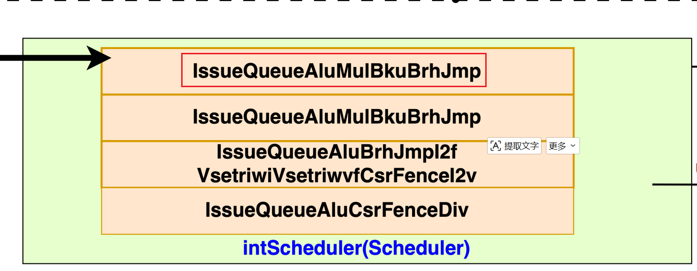

这两条指令成功进入 enqEntries，但都无法立即发射。


紧接着，它们被转移到正式的表项中。

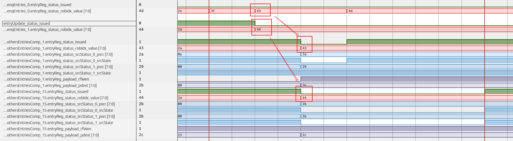

此时，可以看出乘法指令很快被发射出去，而依赖于该乘法结果的加法指令却延迟了许多周期才被发射，不再是之前那种紧接下一周期就发出的情况。

现在，我们可以大致观察一下唤醒加法指令的源，即物理寄存器 0x2b 的唤醒信号来自何处。


有趣的是，该唤醒信号竟然在回写的唤醒信号到来之前的一个周期就已提前到达！这条加法指令是如何得知的呢？我们先不急于探究，而是先查看乘法指令的计算完成时间。


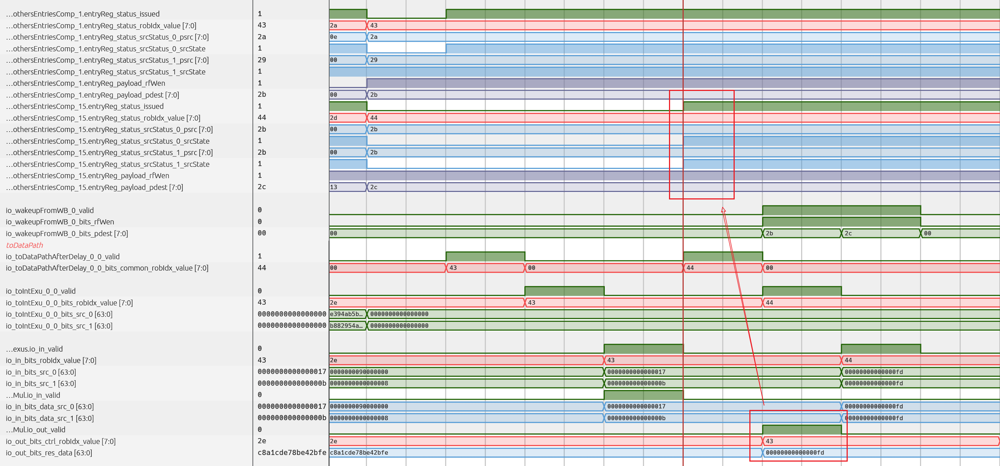

可以发现，确实是在乘法计算完成前的一个周期，唤醒信号就已发出。


完整的通路便是如此！

可以发现，这种方式完全没有浪费任何一个周期，这与普通的 ALU 指令相同：在结果产生的前一个周期立即唤醒，只要保证后续存在依赖关系的指令在进入执行阶段时能够顺利拿到结果即可。

普通 ALU 的唤醒流水级大致如下：

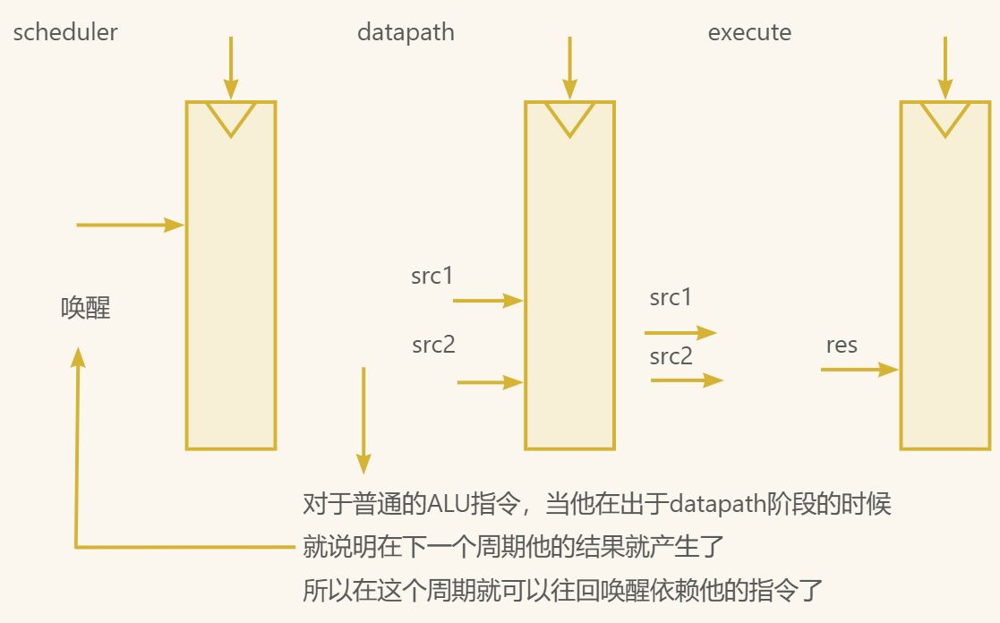

可以看到，乘法也采用了同样的设计哲学。尽管在乘法处于 datapath 时，尚不满足“下一周期结果产生”的条件，但香山处理器仍通过某种方式，在乘法即将满足“下一周期结果产生”的那个周期，去唤醒后续依赖于其乘法结果的指令。这样一来，就不会产生任何气泡。

接下来的问题就很简单了：只需查看它是通过何种方法来实现这种“吝啬”的唤醒机制。


可以发现，能够接收乘法的 IQ 可以向外发出唤醒源。但是，如果是乘法指令，在其执行的周期内不会发起唤醒，而是会延迟两个周期。而对于其他 ALU 指令，则会在执行的同一周期直接拉起唤醒源。

因此，直接查看每个 IQ 的唤醒源是如何产生的。打开 IQ 的代码：

`src/main/scala/xiangshan/backend/issue/IssueBlockParams.scala`

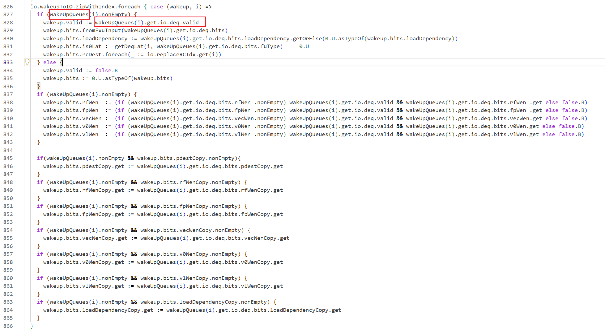

毫无疑问，重点是查看 `wakeUpQueues`这个参数。

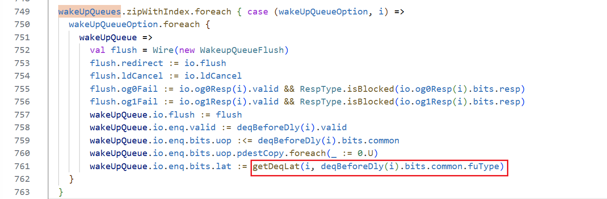

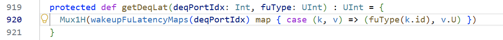

这里正是在设置延迟数！一切变得明朗起来。

该延迟的具体配置位置在 `FuConfig.scala`L281-L290 中：

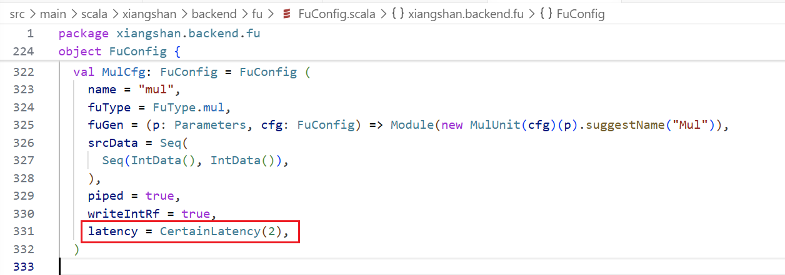

原来，每当 IQ 要向外发射指令时，其唤醒信号会进入 `wakeUpQueues`，并向该队列发起入队请求。在请求的同时，会携带一个根据 FuType 计算得出的延迟信号，用于指示该唤醒信号需要经过多长时间后才能发出。

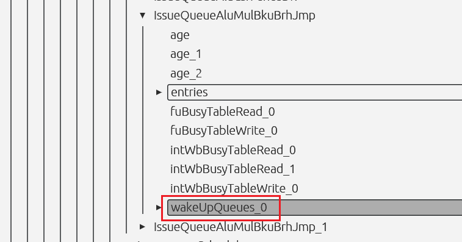

`wakeUpQueues`的入队与出队情况如下：


上述时序图已经非常清晰。在乘法指令即将离开 IQ 进行发射的前一个周期，由于它会回写 0x2b 这个寄存器，因此应向 `wakeUpQueues`发出请求。但因为它是乘法指令，需要三个周期才能计算完成，而其他 ALU 指令仅需一个周期，因此相对多了两个周期。相应地，需要在发出的请求信号中携带一个值为 2 的 `lat`参数，表示该唤醒信号的出队需要延迟两个周期。此时再观察出队信号，该唤醒信号确实延迟了两个周期才发出。而此时乘法指令也即将计算完成。这样一来，这个延迟了两个周期的唤醒信号成功地唤醒了下标为 15 的那个加法指令。该加法指令得以顺利向后执行。通过此机制，它也将顺利获得正确的前推源操作数。

综上所述，对于乘法指令这类虽然延迟较长但延迟固定的指令，其唤醒机制与普通 ALU 指令相同，都使用了 `wakeUpQueues`组件。唯一的区别在于各自设定了不同的延迟值，每个唤醒源必须在满足固定的延迟后才能正确发出，而此刻数据也一定准备就绪。

### 2.不确定延迟的唤醒

接下来分析除法背靠背的情况：

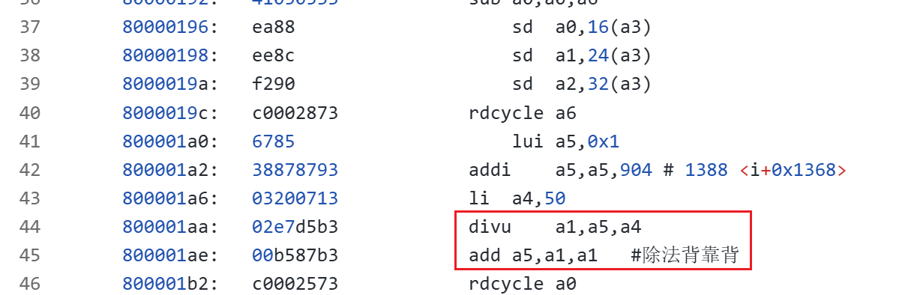

通过这两个指令进行探索：PC 值为 0x800001aa 的除法指令和 PC 值为 0x800001ae 的加法指令。

在 Dispatch 阶段找到它们，以便观察它们被发射到了哪个队列。

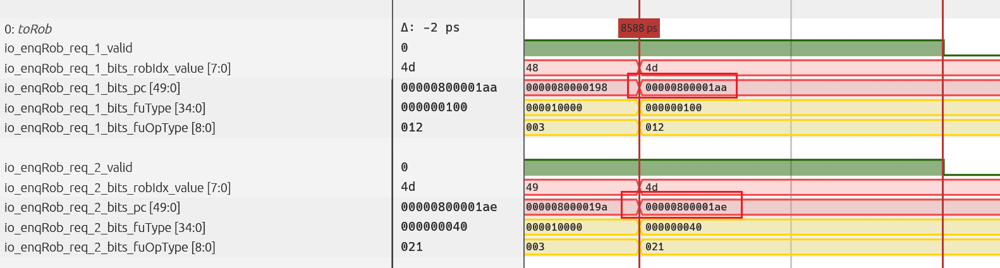


除法指令只能发往下标为 3 的队列，因此可以在第 6、7 号端口查找它。

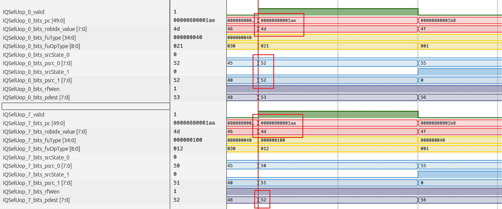

可以清晰地看到，除法指令被下标为 7 的端口发射到了下标为 3 的队列。


加法指令被下标为 0 的端口发射到了下标为 0 的队列。


并且，从波形图中可以清晰地看到两条指令之间存在数据相关性：加法指令依赖于除法指令的执行结果。我们需要探究除法指令是如何唤醒这条加法指令的。

因此，与之前乘法指令发送到同一个队列的情况不同，这里需要通过两个队列来回切换，观察两条指令各自的执行情况。

首先，查看它们各自入队了哪个表项。


除法指令进入了第 1 号请求表项，加法指令进入了第 0 号请求表项。两者均无法立即发射，因此需要转移到正式的表项中。

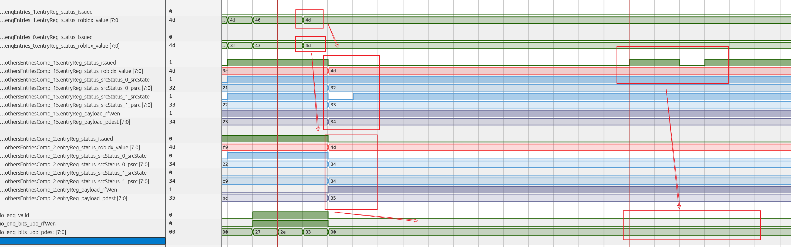

其中，除法指令被转移到了其 IQ 的第 15 号表项，加法指令被转移到了其 IQ 的第 2 号表项。初步分析还发现，当除法指令被发射时，它实际上并未向 `wakeUpQueues`发出指令。这意味着它的唤醒机制将与简单的 ALU 指令或乘法指令有所不同。

为什么除法指令的发射信号会被撤销一个周期？这是在做什么？

详情请参阅后文“4. 为什么发射后会有取消机制”。此处先不深究这一奇怪机制，只需知道第二次的发射信号才是最终准确的信号，应以第二个为准（第一个信号可能被刷掉或其他原因）。

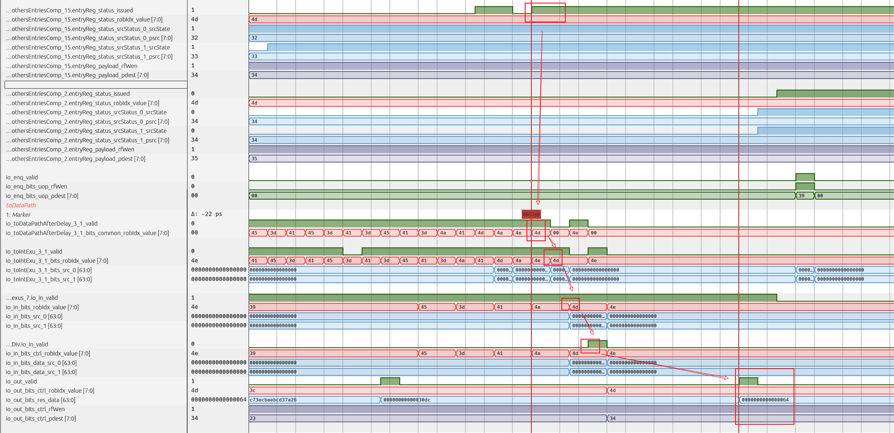

以上是这条除法指令执行过程的完整流程。

再来观察其唤醒机制。


可以发现，除法指令完全是通过回写唤醒的通道来唤醒的。在除法结果计算完成的那个周期，会通过 `WakeUpFromWB`通道反向发送唤醒请求。需要除法结果的加法指令在接收到来自此通道的信号后，在下一周期，其两个源操作数便立即准备就绪。到了它应该发射的时刻，自然就可以向外发射了。

### 3.总结

通过对乘除法唤醒机制的分析与对比，我们对香山处理器的唤醒机制有了更深入的理解。对于 ALU 指令或乘法指令，由于其计算完成周期是已知的，因此可以设置一个 `wakeUpQueues`，将唤醒请求填入其中，并携带关键信息：将在多少个周期后唤醒。这样，在指令计算完成的前一个周期，后续依赖于它的指令就会被唤醒并发射。当到达执行级时，自然就能获得正确的源操作数。这种方法无需等待数据计算完成后再唤醒，从而避免了不必要的气泡周期。

然而，对于除法这类非固定延迟的指令，由于其完成时间未知，只能在计算完成时才发起唤醒请求。这是它与乘法及 ALU 指令的主要区别。

### 4.为什么发射后会有取消机制

前面遇到了一个问题：除法指令在 IQ 中被发射后，又被取消了，随后再次进行发射。这是什么机制？由什么情况导致？这可能值得深入探讨。

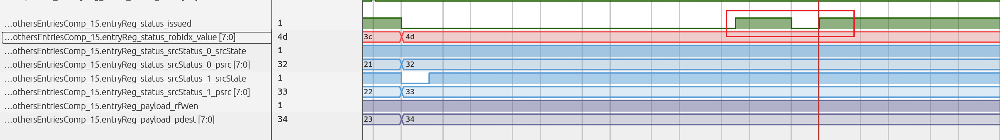

这实际上是一个常规问题，涉及的设计要点是：当执行单元被阻塞时（例如正在执行除法或其他非流水线化运算），执行单元会被阻塞。那么，发射到这个执行单元的前端流水级将如何保证正确性？是随之被阻塞，还是通过某种方式持续更新和保持状态？

从目前观察到的情况来看，前端流水级似乎在不断地刷新，并持续向被阻塞的那一级发送更新的数据。

启动 Verdi！

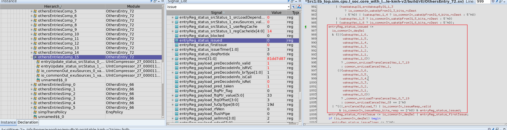

直接查看 issue 信号是由哪些信号决定的。

```systemverilog
entryReg_status_issued <=
io_commonIn_deqSel
& {(|{wakeupVec_1_6,
      wakeupVec_1_5,
      wakeupVec_1_4,
      wakeupVec_1_3,
      wakeupVec_1_2,
      wakeupVec_1_1,
      wakeupVec_1_0})
   ? _common_srcLoadTransCancelVec_1_T_19
   : common_srcLoadCancelVec_1,
   (|{wakeupVec_0_6,
              wakeupVec_0_5,
              wakeupVec_0_4,
              wakeupVec_0_3,
              wakeupVec_0_2,
              wakeupVec_0_1,
              wakeupVec_0_0})
   ? _common_srcLoadTransCancelVec_0_T_19
   : common_srcLoadCancelVec_0} == 2'h0
| ~((|_srcCancelByLoad_T) | io_commonIn_issueResp_valid
    & io_commonIn_issueResp_bits_resp == 2'h0) & entryReg_status_issued;

```


发现了！！原来队列里还能接收来自于发射后面的响应！只有接收到了0x3才说明有效，如果没有接受到0x3，说明后面被取消了，需要重新发！

继续随着verdi看看这个响应信号时怎么发过来的，依据于什么样的条件发过来的

读完这一篇之后，如果你接下来的疑问变成了：

* 指令虽然被及时唤醒了，但它在 datapath 里最初看到的源值为什么还可能是 0；
* 真正把正确操作数送进执行单元的那层网络到底是谁；
* RegCache 和当前拍前推、上一拍前推之间是什么关系；

那么请继续阅读：

* `../bypass-and-regcache/bypass-and-regcache.md`
