# 1. ADD 指令中的回写端口仲裁

以下文稿聚焦于原始资料中关于回写阶段、回写仲裁、ROB 接收回写、提交以及回写寄存器相关说明的内容。下面开始进入原始内容。

## （1）回写阶段

### （1.1）回写阶段的输入信号

先看一看在回写阶段是怎么处理来自于不同执行板块的回写端口的

在回写阶段，大概的数据流是这样的，回写阶段是先会接收来自于执行模块的数据结果。如图：

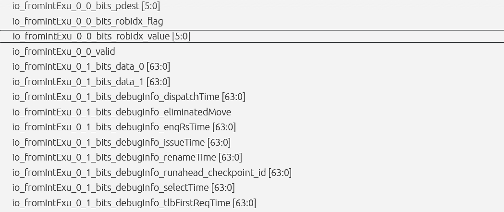

这些信号是直接与执行模块的信号连接起来的，一一对应的，例如我们先只着眼int类型的执行单元。一共有8个执行单元，那么其实也就是\*fromIntExu\_0\_0 这个信号到 \*fromIntExu\_3\_1这8组信号是一一对应着8个执行单元的。

例如我们刚刚看的加法执行通过这组信号传入回写阶段的情况是：

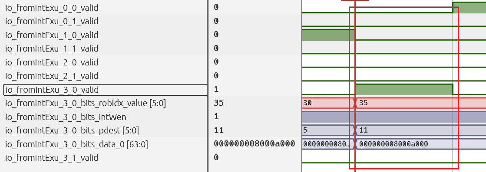

这个时候也只有下标为6的那个执行单元在发出我们的加法指令的结果。

输入这些信号后会有两个输出。

### （1.2）回写阶段往Rob的输出信号

其中一个是往ctrlBlock的输出，其实也就是往Rob传去的信息。如图：

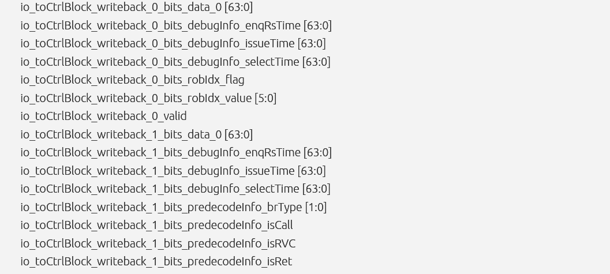

但这组信号是没有区分执行单元的，所有的执行单元（包括整数、浮点、向量、访存）的所有回写信号都是通过这组信号依次往Rob传去的，并且每组信号都会随着执行单元的不同而有不同的回写数据类型。

这些信号应该也是跟从执行板块传来的数据是一一对齐的，只是综合了所有执行板块的数据，例如我们的一直在观察的这个加法指令：

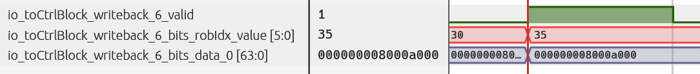

就是以下标为6的这个端口在往Rob传去。

### （1.3）回写阶段往物理寄存器的输出信号

还有一组向外传的信号就是往物理寄存器堆传去的回写信号，比如整型执行单元往整数寄存器堆，浮点就往浮点。所以说我们再看看这个时候往整数寄存器堆传去的回写信号：

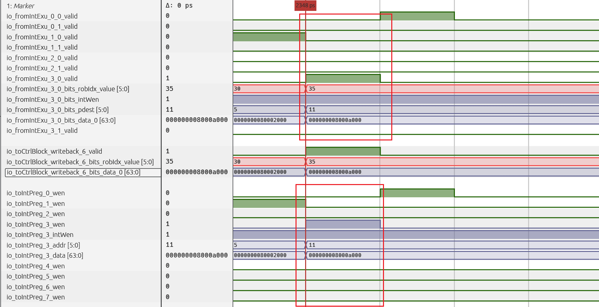

这个时候会发现，虽然往整数寄存器堆发去的回写数据端口也是八个，这个数量上是与执行模块的数量是相同的。但是会发现在位置上已经是对应不上了。例如上图中，我们一直在看的那条加法就是这样的情况。加法从执行模块来的时候是从下标为6的那个端口来的。但是经过回写板块的一顿”洗礼“之后，再传去回写物理寄存器板块的时候，就已经是用的下标为3的那个端口了。

所以说，现在问题就是，为什么会有这种不对齐的情况发生？又是怎么样进行不对齐的？为什么要有这样的机制？于是现在可以让我们重点分析这个机制：

其实这个问题的答案很简单。整型的执行单元确实是会有八个回写端口，他们也确实全都要回写物理寄存器堆。从波形图也能看到，回写物理寄存器堆的端口确实也是只有八个。

但是还有一件特别重要的事情是，不仅仅只有整型执行单元会回写整型物理寄存器，访存执行单元也可能会回写整型物理寄存器堆吧。就算是一些浮点、向量相关的操作，也是可能会回写整型的物理寄存器堆的。

所以说：需要回写整型物理寄存器的端口是远大于8个的，因为不仅仅包含了整型执行单元的回写端口。

需要回写的那么多，但是有的端口只有八个，所以必须是需要进行仲裁选择的，而进行仲裁选择的方法就是靠的一个仲裁器：

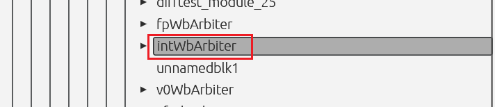

靠的就是回写模块里面的这个部件。所以说我们需要拉出仲裁器的输入输出信号是怎么样的：

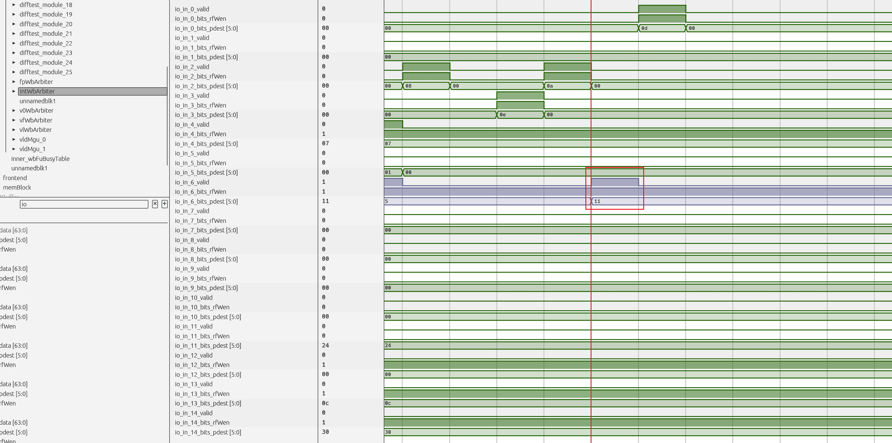

可以看到，这个仲裁器的输入端口是有15个的，这也就侧重说明了，每个周期的所有执行模块，需要往整型物理寄存器堆进行回写操作的端口，最多可能多达15个。

再看他的输出：

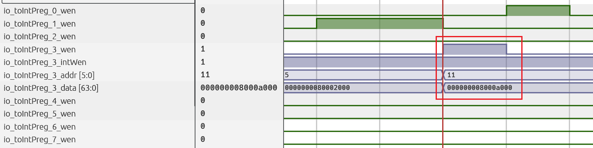

这个器件的输入其实就是我们前面看到的往整型寄存器堆发去的八个回写端口。

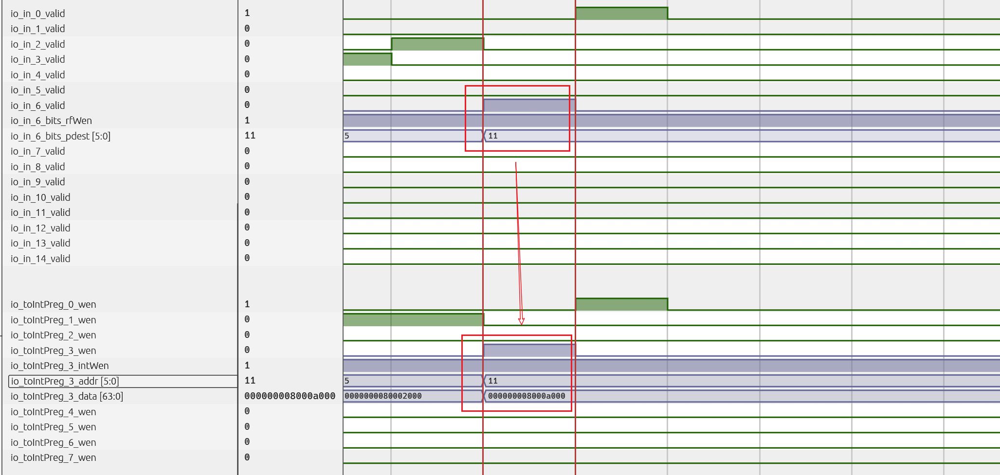

所以这个部件的作用就是，将数量多的这些15个需要回写物理寄存器堆的请求，通过仲裁得到8个真正需要回写的端口去了。并且这个工作也还是在一个周期内完成的。

所以说现在的探索目标又十分地明确了，也就是去探索这个仲裁机制到底是怎么样的就行，是如何把输入的15个端口最终输出只有8个的。

把大仲裁器剖开看，就会发现其实大仲裁器内部包含着八个小仲裁器：

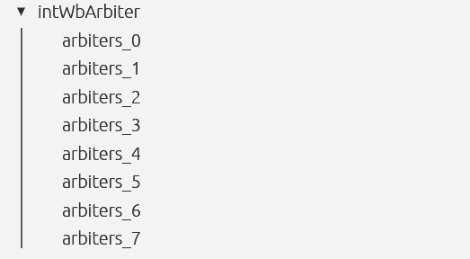

再结合代码里面的内容，我们稍微再阅读一下这边的代码：

src/main/scala/xiangshan/backend/datapath/WbArbiter.scala

之后再看看每一个仲裁器的输入输出：

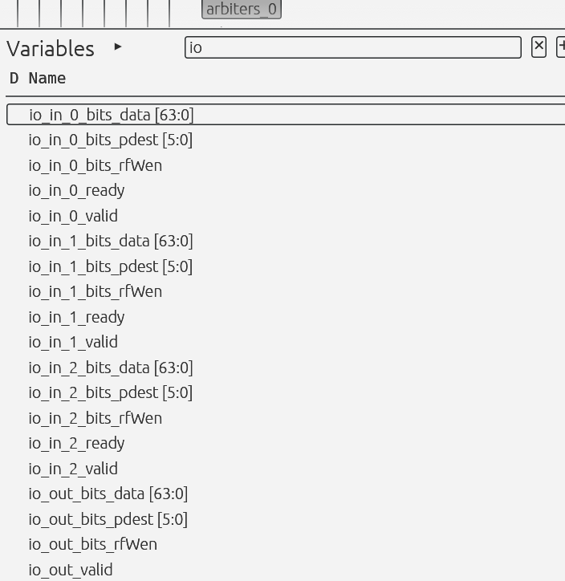

第0个仲裁器，三输入一输出

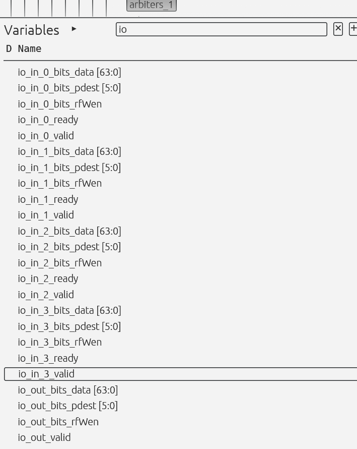

下标为1的这个仲裁器，四输入一输出

依次类推……

会发现其实就很明了了！原来这些小的仲裁器每一个都是对应着一个输出端口。所以说，之前我们的视角是把15个端口仲裁到8个端口，其实现在的视角就越来越明确了。而是把15个端口按照某种配置分成八组，然后每一组去竞争一个写端口。

至少我们前面的这个加法指令，他使用的是下标为6的这个执行单元。综合到所有的要进行回写整型物理寄存器端口的组信号中时，他就是下标为6的那组信号。

然后最后我们看他仲裁的结果是从下标为3的那组回写信号出来。至少可以推测出，下标为6的那个执行单元的回写端口是被投进了下标为3的那个仲裁器进行仲裁竞争的。

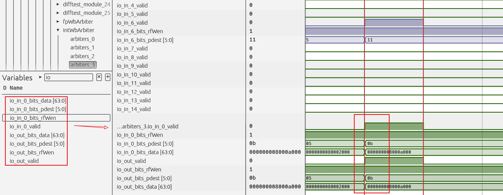

拉出这个仲裁器就会发现：没人和他抢，需要仲裁的就他一个端口。也就是说下标为6的那个执行单元的回写端口会独占一个写物理寄存器的端口。

现在需要去研究一下哪些端口是被分到了一组的：

1.整型执行单元一共有8个需要回写Int的端口：

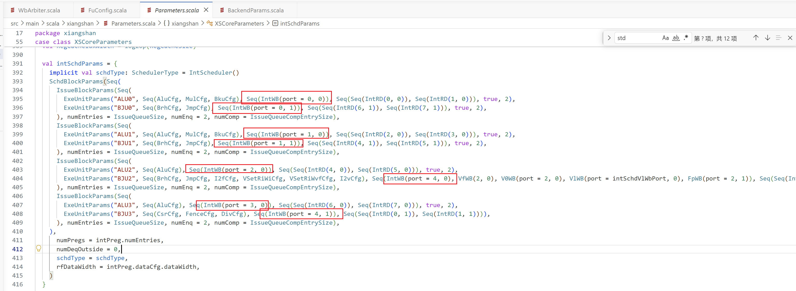

2.浮点单元有3个：

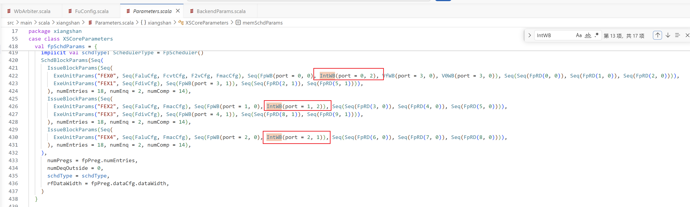

3.向量单元只有1个：

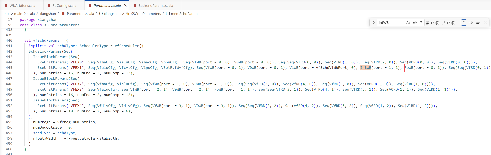

4.访存单元有3个

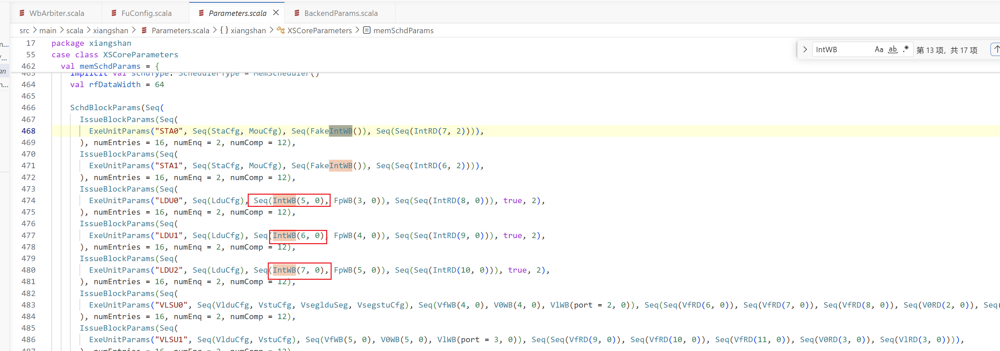

sta的回写单元是“Fake”，大概能知道是什么意思吧！因为store确实是不需要回写寄存器的，但是却需要给Rob传信息表示这个已经做好了。所以他这里是“Fake”

上面各个单元的数量：8+3+1+3=15正好是我们在波形里看到的那样。那怎么看端口的对应关系呢？那肯的是看后面的端口数据呢!

首先要明确的是，一共就只要8个端口。

例如IntWB(port = 3, 0)就表示，这个需要回写的端口将要竞争下标为3的那个回写物理寄存器的端口。并且他的优先级是0。

所以你会发现，把那15个端口依次遍历看看，就会发现竞争下标为3的那个端口的执行单元只有“ALU3”这个执行单元。所以才会看到我们上面看到的那样，下标为3的那个仲裁器，他的输入只有一个，也就是只有ALU3单独“竞争”这个端口。

同理，我们随便找个：

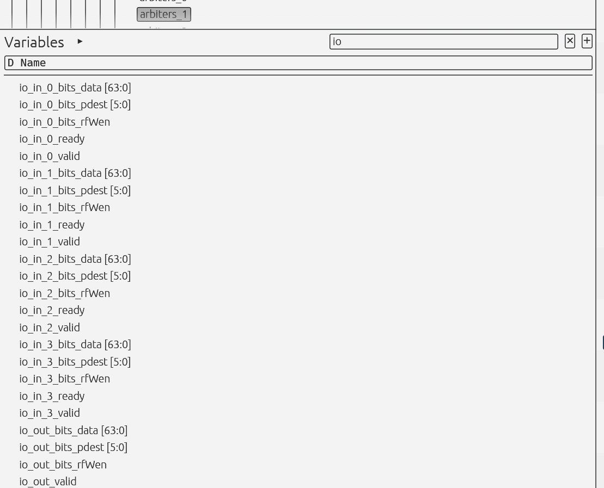

这个下标为1的这个仲裁器会去仲裁4个执行单元！那是哪四个呢，就可以去代码里找了：看哪些执行单元要用下标为1的这个回写端口：

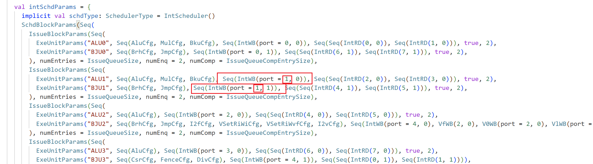

整型单元就有一个要用下标为1的这个回写端口了。

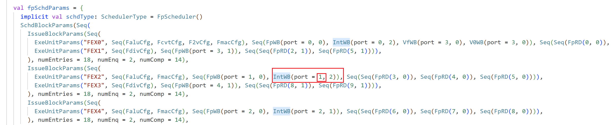

浮点里有一个

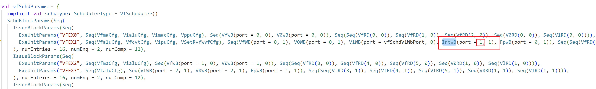

向量有一个

大概就是这个意思。那第二个数字表示什么呢？

查看：

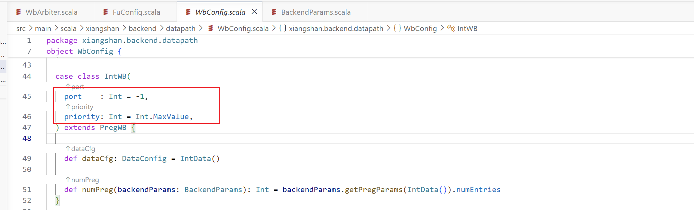

没错，第二个是优先级，因为仲裁肯定是得通过一定的优先级的。数字越小，优先级是越大的。

总结一下整型的端口竞争情况和优先级就是：

| **写端口** | **所属调度器** | **功能** | **优先级** | **冲突处理** |
| --- | --- | :--- | :---: | --- |
| **Port 0** | Int | ALU/Mul/Bku | **0** | 确定延迟，必胜 |
| | Int | Brh/Jmp | 1 | 确定延迟，与ALU0不该同时写 |
| | Fp | Falu/Fcvt/F2v/Fmac | 2 | 浮点转整数，低频 |
| **Port 1** | Int | ALU/Mul/Bku | **0** | 确定延迟，必胜 |
| | Int | Brh/Jmp | 1 | 确定延迟，与ALU1不该同时写 |
| | Vec | Vfalu/Vfcvt/Vipu/VSetRvfWvf | 1 | 向量转整数 |
| | Fp | Falu/Fmac | 2 | 浮点转整数 |
| **Port 2** | Int | ALU | **0** | 确定延迟，必胜 |
| | Fp | Falu/Fmac | 1 | 浮点转整数 |
| **Port 3** | Int | ALU | **0** | 无竞争 |
| **Port 4** | Int | Brh/Jmp/I2f/VSet/I2v | **0** | 确定延迟，必胜 |
| | Int | CSR/Fence/Div | 1 | 确定延迟，与BJU2不该同时写 |
| **Port 5** | Mem | Load | **0** | 不确定延迟，但无竞争者 |
| **Port 6** | Mem | Load | **0** | 不确定延迟，但无竞争者 |
| **Port 7** | Mem | Load | **0** | 不确定延迟，但无竞争者 |

### （1.4）竞争冲突了会怎么样

既然上面说到了会存在多个端口竞争一个端口的情况，那如果竞争冲突了会这么样呢？当然在这个加法这边是找不到冲突的情况的，额这个波形文件中的任何一个地方都没找到过冲突……

## （2）提交阶段

### （2.1）Rob接收回写信号

在上一节中，我们已经分析到了在回写阶段已经往Rob发去了回写信号：

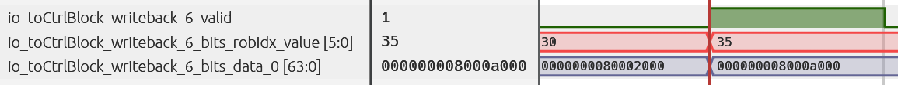

现在我们先研究在Rob接收到这个回写信号后进行的操作。

查看Rob这个组件相关的输入信号：

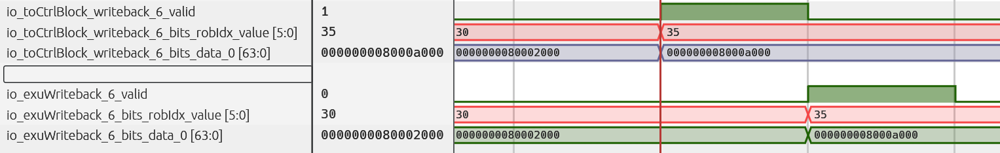

Rob在下一个周期接收到了这个回写信号：

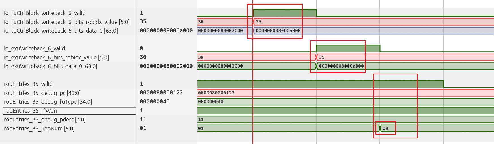

接着就可以观察，在接收到这个提交信号之后，在Rob中，他的表项是什么样的呢，

### （2.2）Rob表项变化与正式提交

可以看到，第35个Rob表项，也就是存储着我们一直追踪的这条加法的这个表项，再接收到这个回写信号之后，他的\*\_uopNum已经从之前的0x01变成了0x00，这就说明，在收到了回写消息之后，这个35号表项已经具备提交条件了，现在也就只需要到他自己的提交窗口之后，就可以立马提交了。

所以我们可以继续观察他的提交情况：

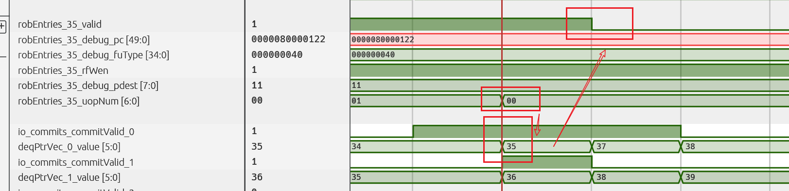

可以看到当前正是处于他自己的提交窗口，再进行回写之后，因为这时也是在他的提交窗口里面，所以他就马上就提交了。所以还会看到，在提交之后，这个表项的valid相关的信号已经被清理了，说明这个表项已经被顺利提交了。

## （3）回写寄存器

虽然在上节的内容中我们已经瞧见这条加法已经被提交了。但接第6回的内容继续看，第6节的内容中我们也只看到了回写阶段往传去了8个端口的回写信号，~~但这些回写信号可都不是简单的写到物理寄存器那么简单，他们和物理寄存器中间还是会隔着一个RegCache的，~~现在就是需要去详细地探究这个的机制。

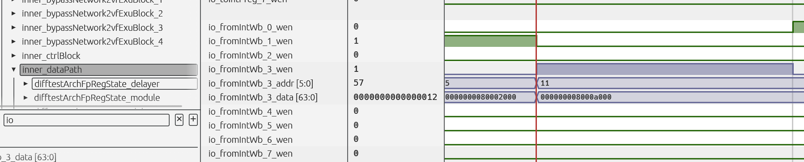

上图表明datapath接收到了这八个回写信号。

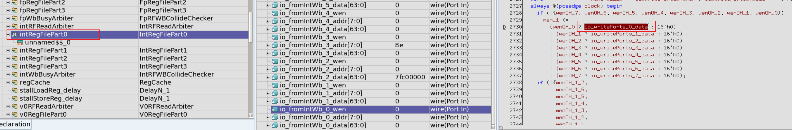

到这里会发现个问题，好像这八个回写端口就是直连到真正的物理寄存器的。那那个RegCache是干什么用的呢？准确来说是干什么用的呢？

准确来说，确实是这些回写信号会直接传入真正的物理寄存器，~~但同时也会经过bypass网络传去RegCache~~。

最后更正！这里的回写寄存器信号其实就俩目标，一个是正在的物理寄存器，一个是发往调度器的唤醒信号。

所以说这里应该跟regCache不是很强相关的。而和RegCache真正强相关的，其实是Bypass旁路网络。所以说，想要了解这部分的详细机制，尽请学习“一条乘除法指令的简单分析过程”。

OVER~

