# 一条乘除法指令的简单执行过程

以下内容按原始资料分段整理，原句与原图均保留，只在章节边界处加入必要的导语。

# 一条乘除法指令的简单分析（唤醒机制、Bypass、RegCache）

```scala
make ARCH=riscv64-xs

/nfs/home/wanghao/emuByYuan/emu -i /nfs/home/wanghao/xs-env/nexus-am/apps/learnMulDiv/build/learn-riscv64-xs.bin --diff ready-to-run/riscv64-nemu-interpreter-so --dump-wave-full


```

本章将重点分析乘除法相关指令的执行过程。这不仅包括每条指令自身的执行细节，也涵盖了当此类多周期指令遇到紧密数据相关时，系统如何确保正确操作。

1. mul/div 执行过程
2. 指令序列 `mul x3, x2, x1 (2-cycle)`与 `add x4, x3, x3 (1-cycle)`如何保证第二条指令能及时获取 x3 的最新值，即 Issue Queue 如何实现背靠背（back-to-back）的性能。
3. `div x3, x2, x1 (n-cycle)`与 `add x4, x3, x3 (1-cycle)`；第二条指令如何及时获取 x3 的值？针对不定长指令，Issue Queue 如何获知其执行完毕？

为了让主线阅读更顺畅，这一篇只把乘法和除法各自的基本执行过程完整串起来。当你在阅读过程中看到“为什么后一条指令能被及时唤醒”“为什么 datapath 看起来还没拿到正确数据但执行阶段已经对了”这类问题时，不需要在这里硬啃到底，可以继续阅读下面两篇专题文稿：

* `../../backend-mechanisms/wakeup-mechanism/wakeup-mechanism-of-mul-div.md`
* `../../backend-mechanisms/bypass-and-regcache/bypass-and-regcache.md`

所依据的测试用例和 Xiangshan emu 版本如下文件所示：

（波形图因体积过大无法推送至 GitHub）

[附件: learnMulDiv.zip](../../../attachments/learnMulDiv.zip)

## 一、指令的选择

观察测试的 C 语言文件，其中编写了三个测试项：

```c
// ------------------------------------------------------------
// 测试 1：单独运行乘法和除法指令
// ------------------------------------------------------------
void test1_mul_div_only() {
    uint64_t x1 = 12345, x2 = 67890;
    uint64_t x3;

    // ---- 乘法 ----
    uint64_t t0 = read_cycles();
    asm volatile(
        "mul %[x3], %[x2], %[x1]\n\t"
        : [x3] "=r" (x3)
        : [x1] "r" (x1),
        [x2] "r" (x2)
        :
    );
    uint64_t t1 = read_cycles();
    output_base[0] = t1 - t0;  // 乘法周期数

    // ---- 除法 ----
    x1 = 987; x2 = 12345678;
    t0 = read_cycles();
    asm volatile(
        "divu %[x3], %[x2], %[x1]\n\t"  // 无符号除法
        : [x3] "=r" (x3)
        : [x1] "r" (x1),
        [x2] "r" (x2)
        :
    );
    t1 = read_cycles();
    output_base[1] = t1 - t0;  // 除法周期数
}
```

```c
// ------------------------------------------------------------
// 测试 2：mul x3,x2,x1 (2-cycle) + add x4,x3,x3 (1-cycle)
// ------------------------------------------------------------
void test2_mul_add_back2back() {
    uint64_t x1 = 11, x2 = 23;
    uint64_t x3, x4;

    // 发射 mul，然后立即发射 add（背靠背）
    uint64_t t0 = read_cycles();
    asm volatile(
        "mul %[x3], %[x2], %[x1]\n\t"   // 2-cycle
        "add %[x4], %[x3], %[x3]\n\t"   // 1-cycle，依赖 x3
        : [x3] "=r" (x3),
          [x4] "=r" (x4)
        : [x1] "r" (x1),
          [x2] "r" (x2)
        :
    );
    uint64_t t1 = read_cycles();

    // 输出结果：总周期数、x3、x4
    output_base[2] = t1 - t0;   // 总周期数
    output_base[3] = x3;        // 期望 253
    output_base[4] = x4;        // 期望 506
}
```

```c
// ------------------------------------------------------------
// 测试 3：div x3,x2,x1 (n-cycle) + add x4,x3,x3 (1-cycle)
// ------------------------------------------------------------
void test3_div_add_back2back() {
    uint64_t x1 = 50, x2 = 5000;
    uint64_t x3, x4;

    uint64_t t0 = read_cycles();
    asm volatile(
        "divu %[x3], %[x2], %[x1]\n\t"  // n-cycle
        "add  %[x4], %[x3], %[x3]\n\t"  // 1-cycle，依赖 x3
        : [x3] "=r" (x3),
          [x4] "=r" (x4)
        : [x1] "r" (x1),
          [x2] "r" (x2)
        :
    );
    uint64_t t1 = read_cycles();

    output_base[5] = t1 - t0;   // 总周期数
    output_base[6] = x3;        // 期望 100
    output_base[7] = x4;        // 期望 200
}
```

对于上述三种情况生成的指令序列，在汇编中同样清晰可见：

```c
000000008000012a <main>:
    8000012a:	47a5                	li	a5,9
    8000012c:	07f2                	slli	a5,a5,0x1c
    8000012e:	86be                	mv	a3,a5
    80000130:	04078713          	addi	a4,a5,64
    80000134:	0007b023          	sd	zero,0(a5)
    80000138:	07a1                	addi	a5,a5,8
    8000013a:	fee79de3          	bne	a5,a4,80000134 <main+0xa>
    8000013e:	c0002673          	rdcycle	a2
    80000142:	678d                	lui	a5,0x3
    80000144:	6745                	lui	a4,0x11
    80000146:	03978793          	addi	a5,a5,57 # 3039 <i+0x3019>
    8000014a:	93270713          	addi	a4,a4,-1742 # 10932 <i+0x10912>
    8000014e:	02f707b3          	mul	    a5,a4,a5 #单独测试乘法
    80000152:	c00027f3          	rdcycle	a5
    80000156:	8f91                	sub	a5,a5,a2
    80000158:	e29c                	sd	a5,0(a3)
    8000015a:	c00026f3          	rdcycle	a3
    8000015e:	00bc67b7          	lui	a5,0xbc6
    80000162:	14e78793          	addi	a5,a5,334 # bc614e <i+0xbc612e>
    80000166:	3db00713          	li	a4,987
    8000016a:	02e7d733          	divu	a4,a5,a4 #单独测试除法
    8000016e:	c0002773          	rdcycle	a4
    80000172:	47a5                	li	a5,9
    80000174:	8f15                	sub	a4,a4,a3
    80000176:	07f2                	slli	a5,a5,0x1c
    80000178:	e798                	sd	a4,8(a5)
    8000017a:	c0002873          	rdcycle	a6
    8000017e:	472d                	li	a4,11
    80000180:	47dd                	li	a5,23
    80000182:	02e785b3          	mul	a1,a5,a4
    80000186:	00b58633          	add	a2,a1,a1  #乘法背靠背
    8000018a:	c0002573          	rdcycle	a0 
    8000018e:	46a5                	li	a3,9
    80000190:	06f2                	slli	a3,a3,0x1c
    80000192:	41050533          	sub	a0,a0,a6
    80000196:	ea88                	sd	a0,16(a3)
    80000198:	ee8c                	sd	a1,24(a3)
    8000019a:	f290                	sd	a2,32(a3)
    8000019c:	c0002873          	rdcycle	a6
    800001a0:	6785                	lui	a5,0x1
    800001a2:	38878793          	addi	a5,a5,904 # 1388 <i+0x1368>
    800001a6:	03200713          	li	a4,50
    800001aa:	02e7d5b3          	divu	a1,a5,a4
    800001ae:	00b587b3          	add	a5,a1,a1   #除法背靠背
    800001b2:	c0002573          	rdcycle	a0
    800001b6:	4625                	li	a2,9
    800001b8:	0672                	slli	a2,a2,0x1c
    800001ba:	41050533          	sub	a0,a0,a6
    800001be:	f608                	sd	a0,40(a2)
    800001c0:	fa0c                	sd	a1,48(a2)
    800001c2:	fe1c                	sd	a5,56(a2)
    800001c4:	4501                	li	a0,0
    800001c6:	8082                	ret

```

因此，在波形图中，主要探索以下 PC 值附近的指令执行情况：

* 0x8000014e 和 0x8000016a
* 0x80000182 和 0x80000186
* 0x800001aa 和 0x800001a

## 二、一条单独的mul/div的执行过程

### 1.乘法

#### (1)译码

本节将分析地址 0x8000014e 处的乘法指令和 0x8000016a 处的除法指令。

首先，照例拉出译码阶段的波形进行观察。

从以下模块中提取信号：


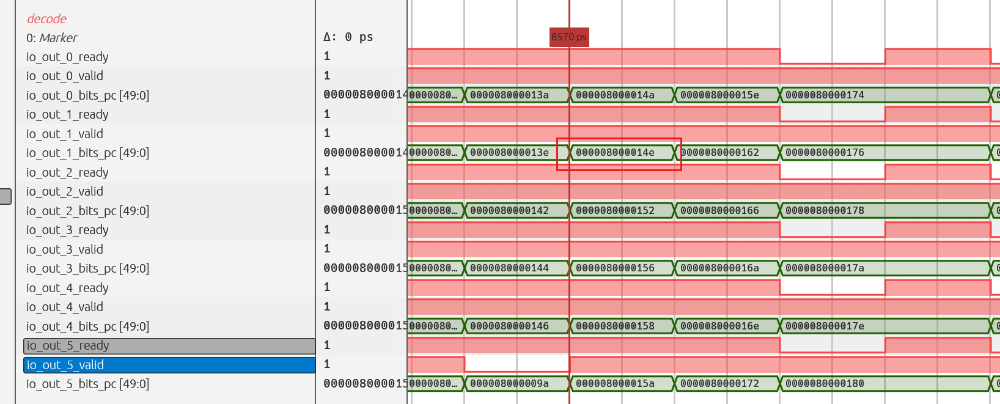

找到地址为 0x8000014e 的指令，它位于下标为 1 的通道。观察其在译码阶段译出的信息，重点关注其使用了哪些寄存器的值以及执行何种运算。

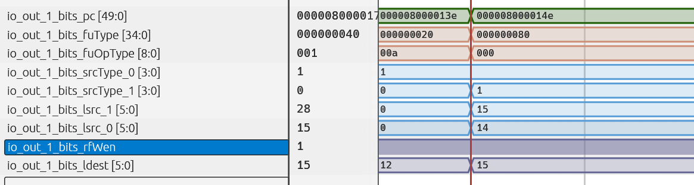

继续从上述模块中提取以下信号。结合信号与代码，可以得出一些结论：

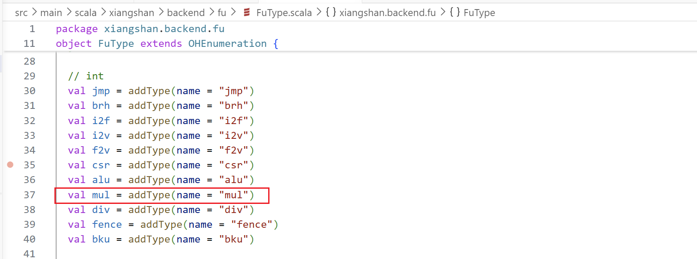


这是一条将使用乘法运算单元的指令，它对逻辑寄存器 14 和 15 号内的值进行 `mul`乘法运算，最终结果将写回到 15 号寄存器中。

#### (2) 重命名

在译码阶段读取 RAT 表：


逻辑寄存器 14 号和 15 号读出的物理寄存器分别为 26 号和 27 号。


但然而，由于在同一周期内，第 0 路有一条指令正在写入第 14 号逻辑寄存器，因此本条指令将使用该指令写入的值，即 28 号物理寄存器。

最终，本条指令使用的源物理寄存器为 28 号和 27 号。


写回的物理寄存器情况如下：

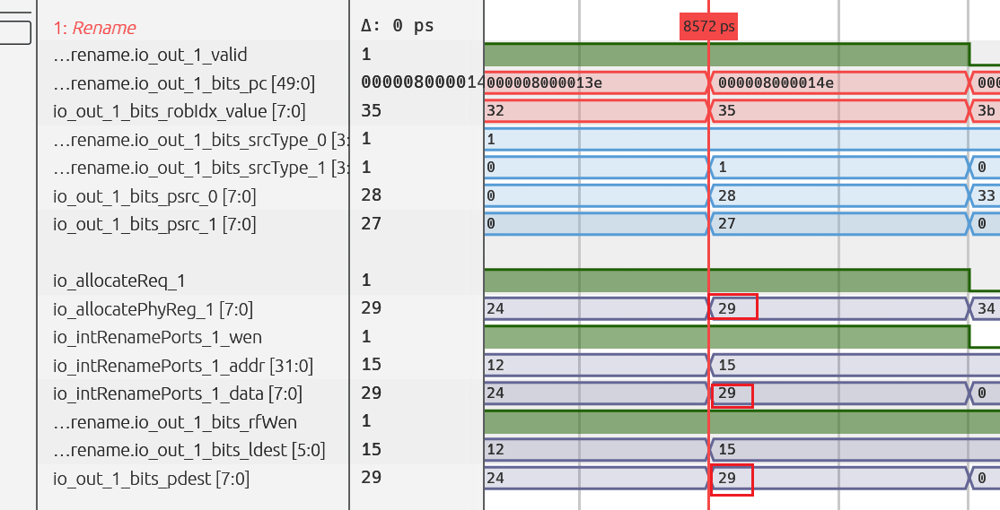

本条指令将结果写回第 15 号逻辑寄存器，为其分配的物理寄存器是第 29 号。同时可以看到，新的映射关系已成功写入 RAT 表。

此外，分配的 ROB 表项值为第 0x35 项。

特别注意：


写回数量为何变为 2？

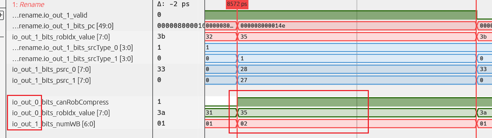

这是因为涉及到了 ROB 的压缩！它将前一条指令与本条指令合并在一起。两条指令共用同一个 ROB 表项。

（TODO：待进一步研究。）

此处触发了一次 ROB 压缩。

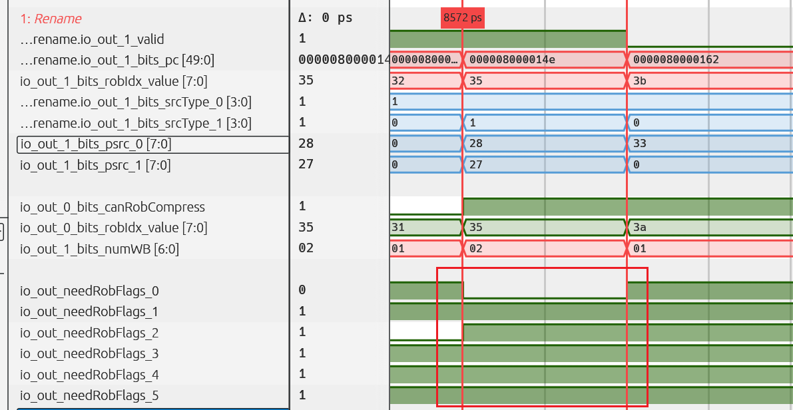

#### (3)分发阶段

在下一周期，指令顺利进入 Dispatch 阶段。


首先观察写入 ROB 的情况：


两条指令同时被写入到同一个 ROB 表项中，但其中大部分信息记录的仍是前一条 `addi`指令的内容。

观察发射信息：

乘法指令被发往 2/1=1 号 IQ。

上一条 `addi`指令被发往 6/2=3 号 IQ。

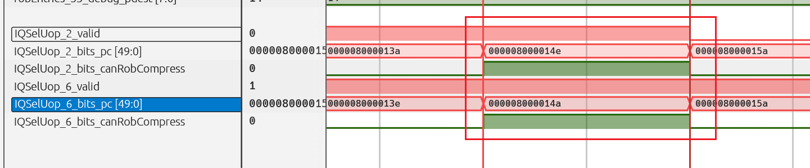


此时，回顾架构图，可以发现 0 号和 1 号 IQ 具有乘法功能，行为是正确的。

因此，重点研究被发往 1 号 IQ 的那条乘法指令。

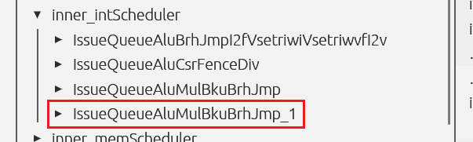

通过架构图可以推测，该指令被发往了图中圈出的 Issue Queue。接下来，拉取该 Issue Queue 中的波形进行详细观察。

#### (4)IQ 内部

IQsel 信号为 2（偶数），因此需要查看此 IQ 的第 0 个请求接口。


这条乘法指令成功发出，但其两个源操作数的数据均未准备好，仍处于 Busy 状态。

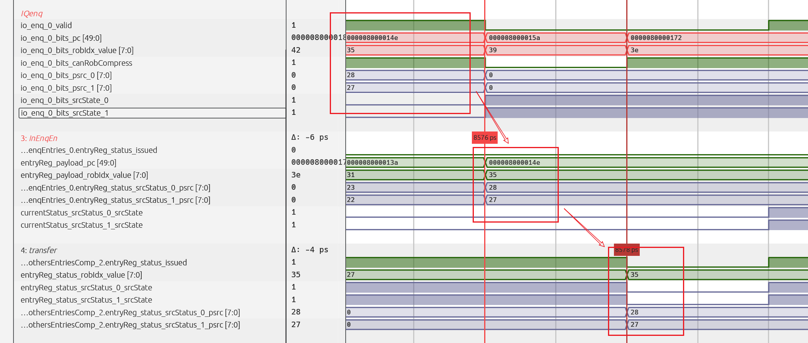

随后，请求被发出后，数据首先被填入 EnqEntry。在下一周期，数据被迁移至 CompEntry，并填入下标为 2 的表项。


在填入 CompEntry 表项后的第一个周期，便收到了来自同一调度器中其他 Issue Queue 的唤醒信号。紧接着的下一个周期，该微操作被成功发射。


在同一周期，本调度器编号为 1 的端口，即下标为 1 的那个 Issue Queue：


其第 0 个端口成功发出了这条乘法指令的发射信息。

#### (5)执行

随后，该指令进入对应的执行单元。

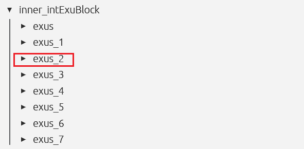

因此，从 Issue Queue 出来到进入执行阶段，大致遵循以下流程：


从调度器出来之后，先经过一级流水来读寄存器，进阶着在下一周期就进入了执行的流水阶段。

值得注意的是，在读寄存器阶段，读出的两个值均为 0。通过之前的分析，很容易推断出，这条乘法指令的唤醒来源于同一调度器的其他 IQ。因此，它获取源操作数的方式是通过 Bypass 路径。可以看到，当其进入执行单元时，正好获得了所需的值，因为此时它的源操作数已被计算完成并成功前推回来。

至此，我们已经成功观察到这条乘法微操作顺利进入了执行阶段。


进入执行阶段后，流水线乘法器立即开始运算。经过大约三个周期的乘法运算后，成功输出了结果。

执行单元也顺利地将乘法器的结果进行了输出。

#### (6) 回写

在结果输出的同一周期，不仅触发了对寄存器堆的回写，也向 CtrlBlock 的 ROB 发送了回写信号。


通过观察提交阶段的数据发现，该指令似乎并未提交。原来它在途中被刷掉了。不过，我们来看看被刷掉的原因。


原因是发生了跳转。只需修改二进制文件Bin，将此跳转指令改为不跳转，即可完美复现当前情况。

修改完成后，一切恢复正常。除法结果回写后，ROB 表项中的数据已从 0x1 变为 0x0，表明已具备提交条件。


接下来，我们将观察它是如何进行提交的。

#### (7) 提交

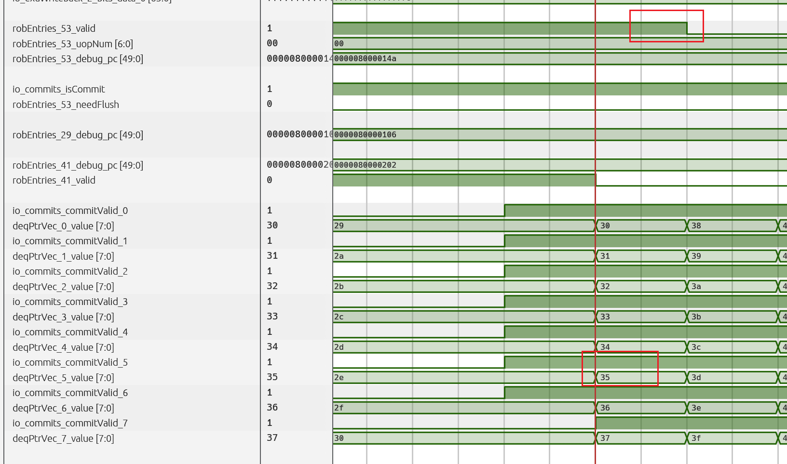

经过相当长的一段时间后，终于看到这条指令被成功提交。确切地说，是具有两个 opNum 的加法和乘法指令融合Rob表项被提交了。

### 2.除法

一条单独的除法指令，其前期流程几乎与乘法相同，此处不再赘述。唯一的区别在于除法运算所需的周期数大于乘法，因此需要严格关注这一差异。

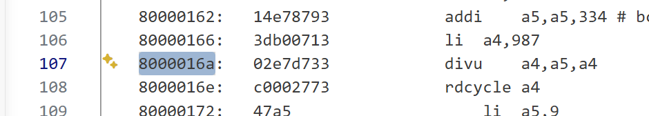

需要观察的指令是：PC 值为 0x8000016a 处的指令执行过程。

已找到其在分发阶段向 ROB 发送请求的时刻。


其 RobIdx 为 0x3c。

接下来查看它被发往了哪个 IQ。


再次参照架构图，只有下标为 3 的 IQ 可以接收除法指令。因此，重点查看 IQSelUop 的第 6、7 号发射位。


果然，在第 7 个发射口找到了它，且两个源操作数均未准备好。

观察它如何进入 IQ 队列。


显然，应查看带有“div”字样的 IQ。它首先进入 IQ 的请求表项。

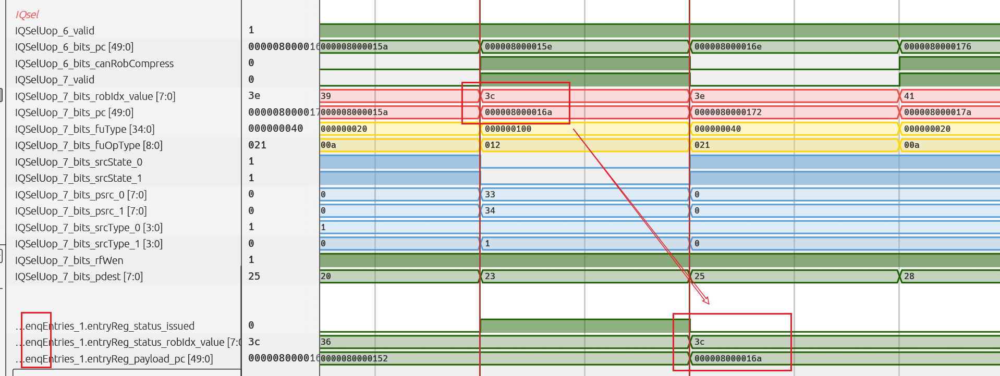

由于无法立即发射，它被转移到 EntriesComp，具体是下标为 15 的表项。

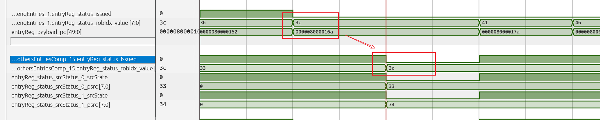

转到的是下标为15的那个表项。

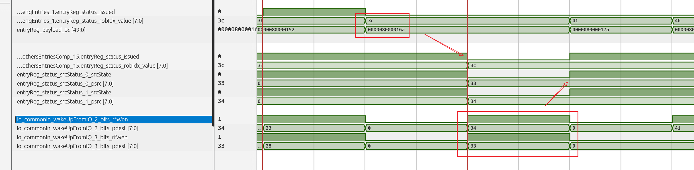

同样，仅过一个周期，来自 IQ 的唤醒信号便将两个未准备好的操作数唤醒。紧接着的下一个周期，这条除法指令便被发射出去。

随后，观察调度器最后两个发射端口（因为含有 div 的那个 IQ 属于最后一个 IQ）向外发射的情况。

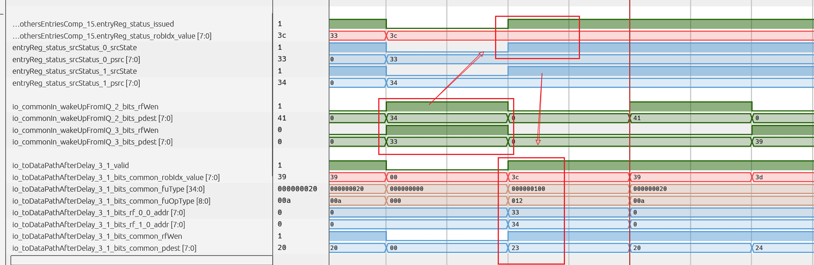

在同一周期，调度器向外发射了该指令。

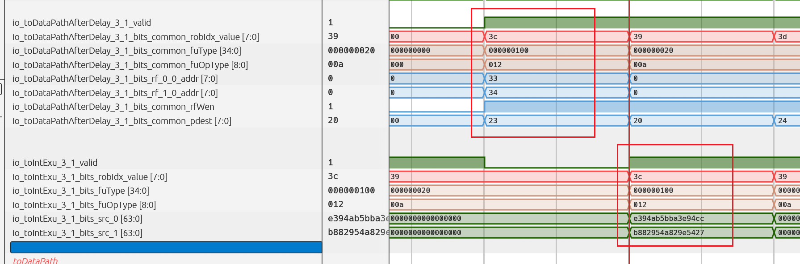

读寄存器之后的下一个周期，指令被发送至执行模块。但此时读出的数据仍然是一串乱码。因为它依赖于同 IQ 的寄存器唤醒，尚未获得前推数据。因此，需要关注下一个周期，即正式进入 Exu 模块时的状况。

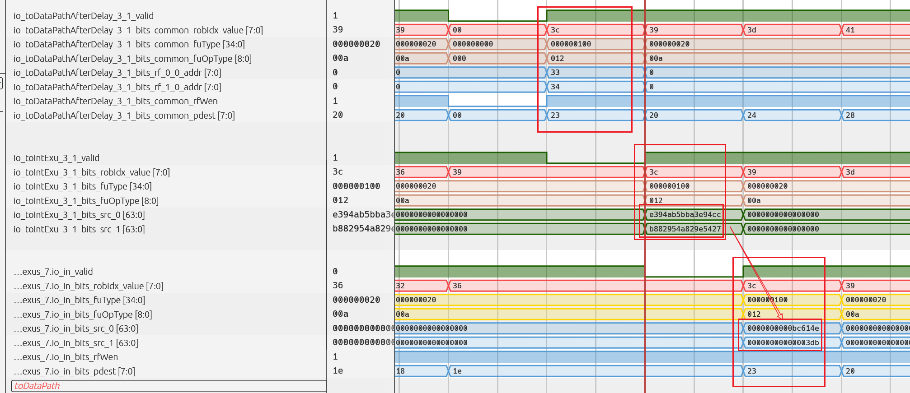

进入 Exu 时，它顺利地拿到了正确的前推数据。

进入执行阶段后，可以立即投入除法器进行运算。

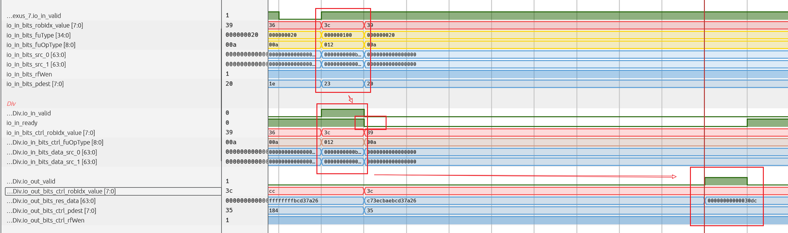

结果清晰显示：0xbc614e / 0x3db = 0x30dc，最终运算结果正确。值得注意的是，当开始运算时，除法器的 ready 信号被拉低。这恰好说明除法器不像乘法器那样采用流水线设计，而是多周期部件，一次只能接收一个运算，且运算时间不固定。

查看回写相关的接口：

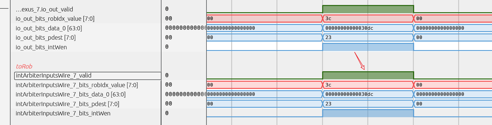

回写接口的信息已回填至 ROB，指令本身已具备提交条件。

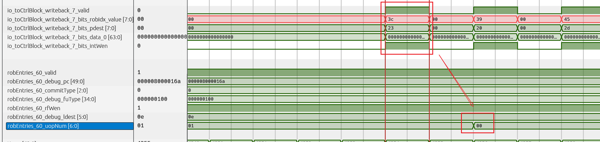

此时，只需等待其前面的指令提交，它便可以提交。

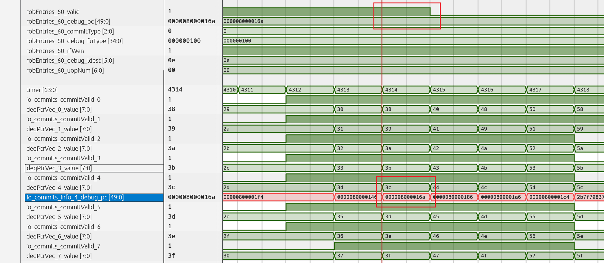

到达其提交窗口后，便可成功提交。

到这里，单条乘法和单条除法的基本执行路径已经完整走通了。接下来如果你最关心的是：

* 乘法背靠背为什么能提前两拍左右被唤醒；
* 除法背靠背为什么不能像乘法那样用固定延迟预测；
* 除法为什么会出现“发射后又取消、随后重新发射”的现象；

那么请继续阅读：

* `../../backend-mechanisms/wakeup-mechanism/wakeup-mechanism-of-mul-div.md`

如果你更关心的是：

* 乘法结果为什么能够在 datapath 之后被 Bypass 网络及时前推；
* RegCache 在这条链路里到底起了什么作用；

那么请继续阅读：

* `../../backend-mechanisms/bypass-and-regcache/bypass-and-regcache.md`
