# 1. 一条 ADD 指令的简单执行过程

以下文稿在保持原始资料原句与原图的前提下，抽取出与“一条 ADD 指令主流程”最直接相关的部分进行重组。下面开始进入原始内容。

# 一条ADD指令的简单分析过程

基于的波形文件：

[附件: add\_inst.zip](../../../attachments/8Y4Nert_doKhtzEK/add_inst.zip)

推荐一个看波形很丝滑的软件：

[surfer软件链接](https://surfer-project.org/)

# 详细知识点：

1. 重命名读操作的bypass路径
2. 回写端口竞争机制

# 1.软件与波形文件准备：

（1）下载并安装波形查看软件：[surfer软件链接](https://surfer-project.org/)


（2）打开波形文件及状态文件

首先，运行可执行文件（.exe）：

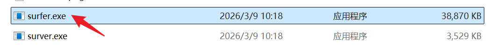


然后，打开波形文件：


此时，软件会自动检测到一个状态文件。这个文件实际上就是压缩包内的 `hello.surf.ron`文件，用于保存对波形所做的各项操作状态，例如显示哪些波形、设置的标记等。请点击“使用”这个状态文件。：


成功打开后的界面截图如下：


# 2.找到一条合适的 `add`指令

打开反汇编文件（即压缩包中的 `hello-riscv64-xs.txt`文件）：

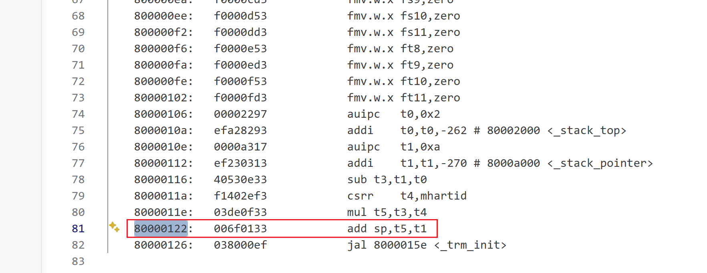

此处选择位于程序计数器（pc）地址 `0x80000122`的指令，其内容为 `0x006f0133`。单独分析这条指令，对照指令集手册：

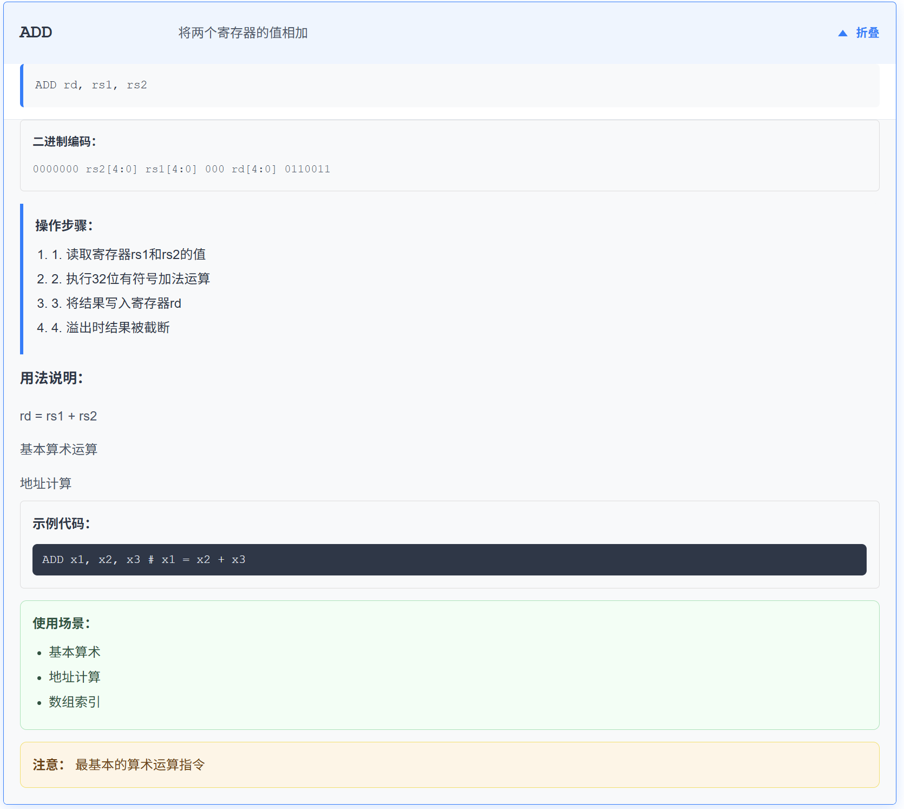

（ 本图来源于 [链接](https://ai-embedded.com/risc-v/riscv-isa-manual/) ）

通过人工解析这条指令可知，其功能是：

将 30 号寄存器的值（src1） 与 6 号寄存器的值（src2） 相加，并将结果存入 2 号寄存器。

结合该指令的上下文信息，可以确定：

* 30 号寄存器的值应为 `0x00000000`
* 6 号寄存器的值应为 `0x8000a000`

因此，最终写入 2 号寄存器的结果就是 `0x00000000 + 0x8000a000 = 0x8000a000`。

详细分析如下：

***

<font style="color:#585A5A;">要理解其具体行为，需要追溯 </font><code><font style="color:#585A5A;">t5</font></code><font style="color:#585A5A;">和 </font><code><font style="color:#585A5A;">t1</font></code><font style="color:#585A5A;">两个源操作数在此前的计算过程：</font>

1. <code>**<font style="color:#585A5A;">t1</font>**</code>**<font style="color:#585A5A;">的值</font>**<font style="color:#585A5A;">：</font>
   * <font style="color:#585A5A;">指令 </font><code><font style="color:#585A5A;">auipc t1, 0xa</font></code><font style="color:#585A5A;">（位于 </font><code><font style="color:#585A5A;">0x8000010e</font></code><font style="color:#585A5A;">）将当前 PC (</font><code><font style="color:#585A5A;">0x8000010e</font></code><font style="color:#585A5A;">) 的高20位与立即数 </font><code><font style="color:#585A5A;">0xa</font></code><font style="color:#585A5A;">左移12位相加，得到 </font><code><font style="color:#585A5A;">t1 = 0x8000010e + 0xa000 = 0x8000a10e</font></code><font style="color:#585A5A;">。</font>
   * <font style="color:#585A5A;">随后的 </font><code><font style="color:#585A5A;">addi t1, t1, -270</font></code><font style="color:#585A5A;">（位于 </font><code><font style="color:#585A5A;">0x80000112</font></code><font style="color:#585A5A;">）进行修正：</font><code><font style="color:#585A5A;">t1 = 0x8000a10e - 0x10e = 0x8000a000</font></code><font style="color:#585A5A;">。</font>
   * <font style="color:#585A5A;">此值对应符号 </font><code><font style="color:#585A5A;">_stack_pointer</font></code><font style="color:#585A5A;">的地址，是链接脚本中定义的栈区域的起始地址。</font>
2. <code>**<font style="color:#585A5A;">t5</font>**</code>**<font style="color:#585A5A;">的值</font>**<font style="color:#585A5A;">：</font>
   * <code><font style="color:#585A5A;">t5</font></code><font style="color:#585A5A;">是连续计算的结果：</font><code><font style="color:#585A5A;">t5 = t3 * t4</font></code><font style="color:#585A5A;">。</font>
   * <code><font style="color:#585A5A;">t3 = t1 - t0</font></code><font style="color:#585A5A;">，其中 </font><code><font style="color:#585A5A;">t0</font></code><font style="color:#585A5A;">被设置为 </font><code><font style="color:#585A5A;">_stack_top</font></code><font style="color:#585A5A;">的地址 (</font><code><font style="color:#585A5A;">0x80002000</font></code><font style="color:#585A5A;">)。因此，</font><code><font style="color:#585A5A;">t3 = 0x8000a000 - 0x80002000 = 0x8000</font></code><font style="color:#585A5A;">。这表示总的栈空间大小（</font><code><font style="color:#585A5A;">_stack_pointer</font></code><font style="color:#585A5A;">到 </font><code><font style="color:#585A5A;">_stack_top</font></code><font style="color:#585A5A;">的距离）。</font>
   * <code><font style="color:#585A5A;">t4</font></code><font style="color:#585A5A;">来自 </font><code><font style="color:#585A5A;">csrr t4, mhartid</font></code><font style="color:#585A5A;">，读取当前硬件线程（Hart）的 ID。在单核或 Hart 0 上，</font><code>**<font style="color:#585A5A;">t4</font>**</code>**<font style="color:#585A5A;">的值通常为 0</font>**<font style="color:#585A5A;">。</font>
   * <font style="color:#585A5A;">因此，</font><code><font style="color:#585A5A;">t5 = 0x8000 * 0 = 0</font></code><font style="color:#585A5A;">。这个乘法操作用于支持多核/多线程场景，为每个 Hart 计算独立的栈地址偏移。在当前单 Hart 场景下，偏移为 0。</font>

### <font style="color:#585A5A;">执行结果 </font>

* **<font style="color:#585A5A;">运算</font>**<font style="color:#585A5A;">：</font><code><font style="color:#585A5A;">sp = t5 + t1 = 0 + 0x8000a000</font></code>
* **<font style="color:#585A5A;">结果</font>**<font style="color:#585A5A;">：</font>**<font style="color:#585A5A;">栈指针寄存器 </font>**<code>**<font style="color:#585A5A;">sp</font>**</code>**<font style="color:#585A5A;">被设置为 </font>**<code>**<font style="color:#585A5A;">0x8000a000</font>**</code><font style="color:#585A5A;">，即符号 </font><code><font style="color:#585A5A;">_stack_pointer</font></code><font style="color:#585A5A;">所代表的地址。</font>

***

# 3.查阅架构图与代码，确定分析起点

目前只对后端进行分析，分析的起点显然是 `CtrlBlock`模块


通过阅读设计手册可知，指令在进入后端时，首先会进入译码阶段。在译码阶段，由 6 个 `DecodeUnit`模块负责对输入的 6 条指令进行译码。


首先查看 `DecodeStage`中的代码以验证此猜想：


由此可知，系统生成了 6 个 `DecodeUnit`实例，并分别向其输入了数据。因此，当前的观察重点应放在 `DecodeUnit`模块上。为此，我们首先查看该模块的代码：

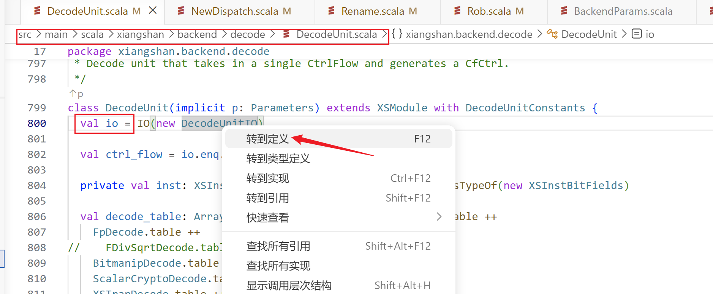

如上图所示，我们已定位到该模块的 IO 端口。接下来查看这些端口的定义：

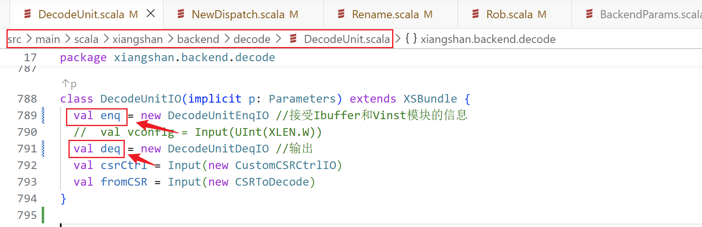

由此可知，`DecodeUnitEnqIO`是该模块的输入接口，`DecodeUnitDeqIO`是其输出接口。查阅这两组接口的定义如下：

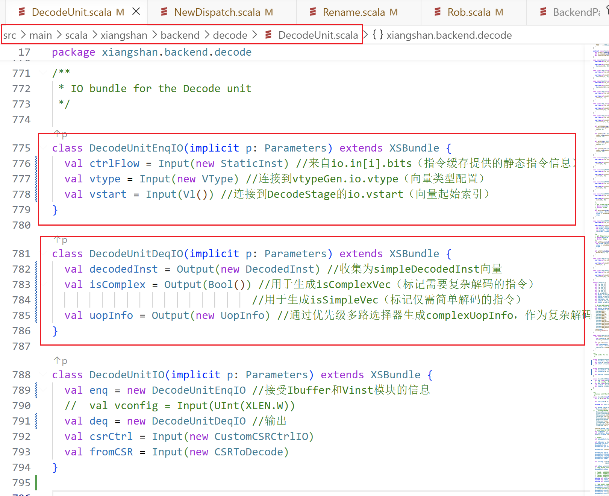

因此，对 `DecodeUnit`模块的研究将主要聚焦于这两组信号。

# 4.正式分析波形

## （1）译码模块（DecodeUnit）

查看第 0 个 DecodeUnit 的输入和输出：

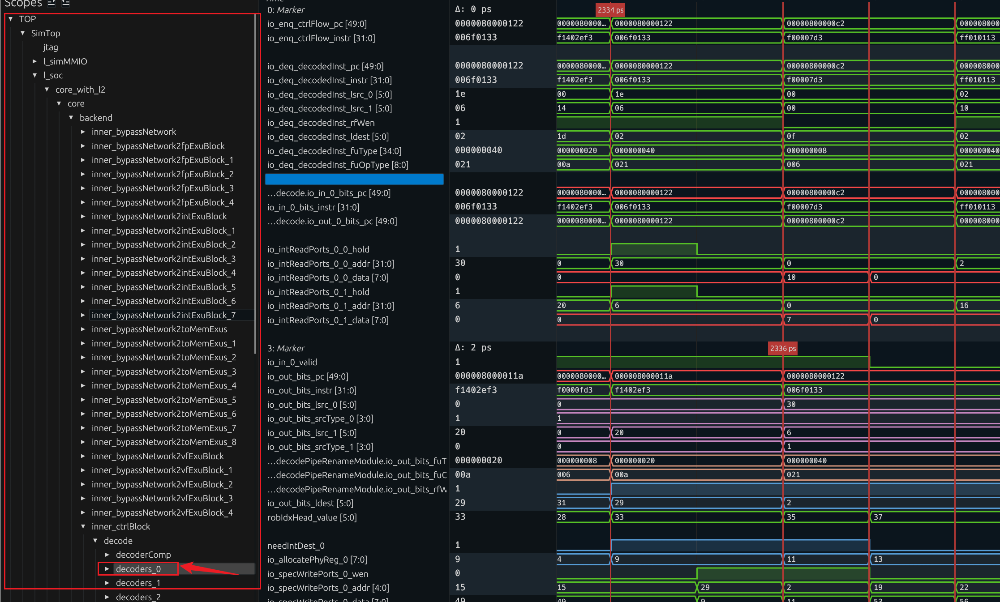

该模块的输入与输出内容如下：


| chisel | verilog | 含义 |
| --- | --- | --- |
| `scala // Dequeue DecodeWidth insts from Ibuffer class CtrlFlow(implicit p: Parameters) extends XSBundle {   val instr = UInt(32.W)   val pc = UInt(VAddrBits.W) `  |  io\_enq\_ctrlFlow\_pc\[49:0]   |  发射队列入队指令的\*\*<font style="color:rgb(0, 0, 0);background-color:rgba(0, 0, 0, 0);">程序计数器（PC） </font>**<font style="color:rgb(0, 0, 0);background-color:rgba(0, 0, 0, 0);">记录指令在内存中的地址，是指令流的核心标识，香山采用 50 位物理地址  </font> |
|  |  io\_enq\_ctrlFlow\_instr\[31:0]   |    发射队列入队的**<font style="color:rgb(0, 0, 0);background-color:rgba(0, 0, 0, 0);">原始 32 位指令编码，</font>**未解码的 RISC-V 指令机器码，从 ICache/ITLB 取出后直接入队   |
|  <br/><code>verilog 首先找到： io.deq.decodedInst := decodedInst  class DecodeInUop(implicit p: Parameters) extends XSBundle {     val foldpc = UInt(MemPredPCWidth.W) // for mdp     val exceptionVec = ExceptionVec()     val isFetchMalAddr = Bool()     val trigger = TriggerAction()     val isRVC = Bool()     val fixedTaken = Bool()     val predTaken  = Bool()     val crossPageIPFFix = Bool()     val ftqPtr = new FtqPtr     val ftqOffset = UInt(FetchBlockInstOffsetWidth.W)     val isLastInFtqEntry = Bool()   val instr = UInt(32.W) 完成译码之后的机器码位宽是32位 class DecodeOutUopDebug(implicit p: Parameters) extends XSBundle {     val pc = UInt(VAddrBits.W)     val debug_seqNum = InstSeqNum() } 在dubug模式下可以显示pc值 </code>  | io\_deq\_decodedinst\_pc\[49:0] |  发射队列出队、完成译码后的指令 PC   |
| | io\_deq\_decodedInst\_instr\[31:0]   |  完成译码后的原始指令编码（保留原始机器码）   |
| src/main/scala/xiangshan/backend/decode/DecodeUnit.scala 在文件里面找到 add 指令的映射，之后跳转到相应的类型定义<br/>ADD     -> XSDecode(SrcType.reg, SrcType.reg, SrcType.X, FuType.alu, ALUOpType.add , SelImm.X    , xWen = T, canRobCompress = T), | io\_deq\_decodedInst\_lsrc\_0\[5:0] |  第 0 个源操作数的**<font style="color:rgb(0, 0, 0);background-color:rgba(0, 0, 0, 0);">逻辑寄存器号</font>**<font style="color:rgb(0, 0, 0);background-color:rgba(0, 0, 0, 0);"></font> |
| | io\_deq\_decodedInst\_srcType\_0\[3:0]   |  第 0 个源操作数的<font style="color:rgb(0, 0, 0);background-color:rgba(0, 0, 0, 0);">类型标识， 标识源操作数类型：如寄存器、立即数、PC 等，用于后续执行单元的操作数准备  </font> |
| | io\_deq\_decodedInst\_lsrc\_1\[5:0] |  第 1 个源操作数的**<font style="color:rgb(0, 0, 0);background-color:rgba(0, 0, 0, 0);">逻辑寄存器号</font>\*\* |
| | io\_deq\_decodedInst\_srcType\_1\[3:0] |  同 srcType\_0，对应指令的第二个源操作数   |
| |  io\_deq\_decodedInst\_rfWen   |  寄存器堆写使能  ，<code><font style="color:rgb(0, 0, 0);background-color:rgba(0, 0, 0, 0);">1</font></code>（表示该指令需要写回目标寄存器）   |
| | io\_deq\_decodedInst\_ldest\[5:0] |  目标寄存器的\*\*<font style="color:rgb(0, 0, 0);background-color:rgba(0, 0, 0, 0);">逻辑寄存器号</font>**<code><font style="color:rgb(0, 0, 0);background-color:rgba(0, 0, 0, 0);">02</font></code>**<font style="color:rgb(0, 0, 0);background-color:rgba(0, 0, 0, 0);">（对应十进制 2）  </font>\*\* |
| | io\_deq\_decodedInst\_fuType\[34:0] |  指令所属的\*\*<font style="color:rgb(0, 0, 0);background-color:rgba(0, 0, 0, 0);">功能单元（FU）类型，</font>**<font style="color:rgb(0, 0, 0);background-color:rgba(0, 0, 0, 0);"> 标识指令需要分配到哪个执行单元（如 ALU、MUL/DIV、LD/ST、Branch 等）  </font> |
| | io\_deq\_decodedInst\_fuOpType\[8:0] |  功能单元内的**<font style="color:rgb(0, 0, 0);background-color:rgba(0, 0, 0, 0);">具体操作类型，</font>\*\*<font style="color:rgb(0, 0, 0);background-color:rgba(0, 0, 0, 0);"> 在 FU 类型基础上，标识具体操作（如 ALU 中的 ADD/SUB/AND 等）  </font> |

可以看到，在 2334 ps 时刻，PC 地址为 `0x80000122`、指令为 `0x006f0133`的这条指令，成功输入到了第 0 个 DecodeUnit 中。在同一周期内，DecodeUnit 计算出了该指令最主要的译码信号（如上图所示），例如：

***

**lsrc\_0： 0x1e（十进制 30），****<font style="color:#DF2A3F;">其源类型（srcType）是 0x1</font>****。**

**lsrc\_1： 0x06（十进制 6），****<font style="color:#DF2A3F;">其源类型（srcType）是 0x1</font>****。**

**这两个寄存器的值将按照**\*\*<font style="color:#DF2A3F;"> fuType为 0x40及 fuOpType为 0x21的运算方式</font>\*\***进行计算。**

**计算结果会进行回写（rfWen信号为高），回写的寄存器位置是 0x2（十进制 2，即 ldest）。**

***

以上非红色的内容你应该能完全理解，因为在前面的指令分析中已经做过明确的解析：

> 将 30 号寄存器的值（src1） 与 6 号寄存器的值（src2） 相加，并将结果存入 2 号寄存器。

可以确认，该译码行为完全正确。

接下来，你需要理解红色部分所代表的含义：

\*\*首先，理解这两个 \*\*<code>**srcType**</code>\*\*的意义。\*\*我们先看 DecodeUnit 模块如何为这条 add 指令写入该值：


在代码中很容易发现，`srcType_0`之所以为 `0x1`以及 `srcType_1`之所以为 `0x1`，是因为 DecodeUnit 为这两个位置写入了 `SrcType.reg`这个值。

从名称可以推断：<font style="color:#DF2A3F;">此参数用于指示源操作数来源于寄存器。</font>

为了确认“来源于寄存器”的指示信号是否确实对应“0x1”，我们继续查看关于 `srcType`的定义：

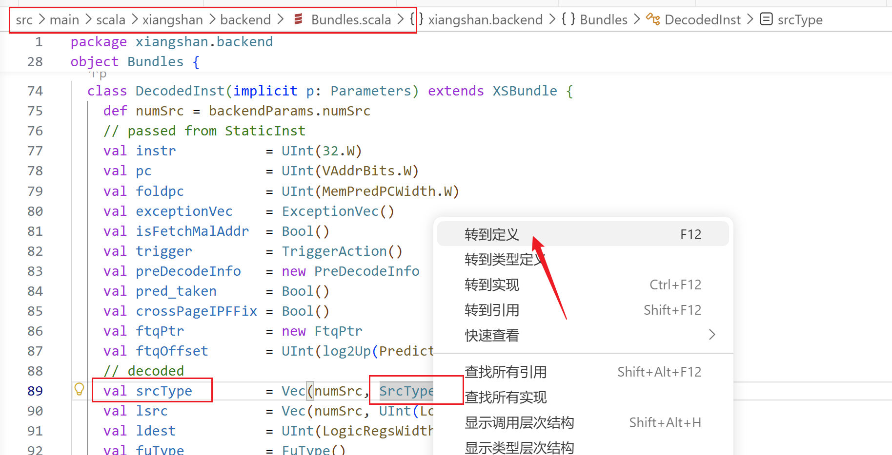

查找结果如下：

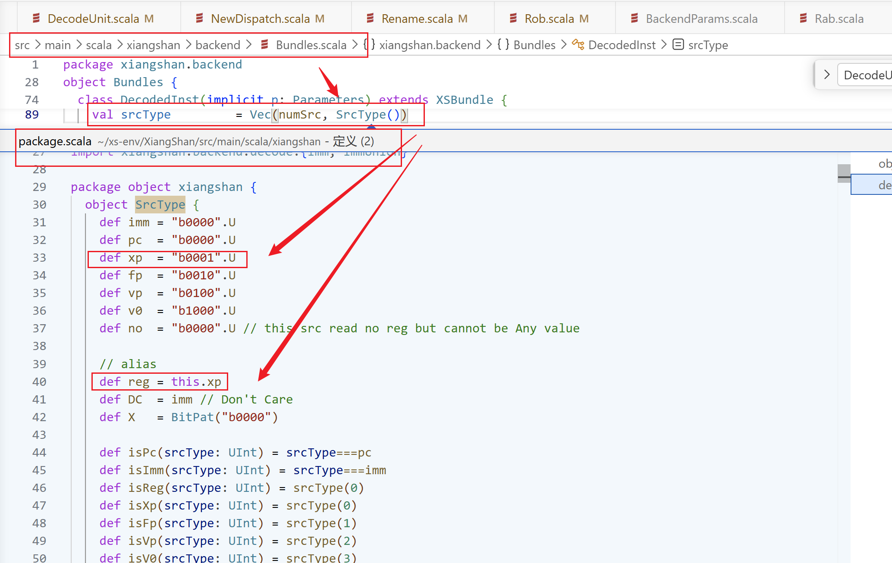

从代码中可以看到，定义了：

```plain
def xp  = "b0001".U
def reg = this.xp
```

由此可以确定，当 `srcType_0`为 `0x1`以及 `srcType_1`为 `0x1`时，所代表的意义是：**<font style="color:#DF2A3F;">源操作数 </font>**<code>**<font style="color:#DF2A3F;">lsrc_0</font>**</code>**<font style="color:#DF2A3F;">和 </font>**<code>**<font style="color:#DF2A3F;">lsrc_1</font>**</code>**<font style="color:#DF2A3F;">均来源于寄存器</font>**，而非立即数或 PC 等其他来源。

\*\*接着，分析 \*\*<code>**fuType**</code>\*\*为 \*\*<code>**0x40**</code>\*\*与 \*\*<code>**fuOpType**</code>\*\*为 \*\*<code>**0x21**</code>**所代表的意义。**


结果如下：

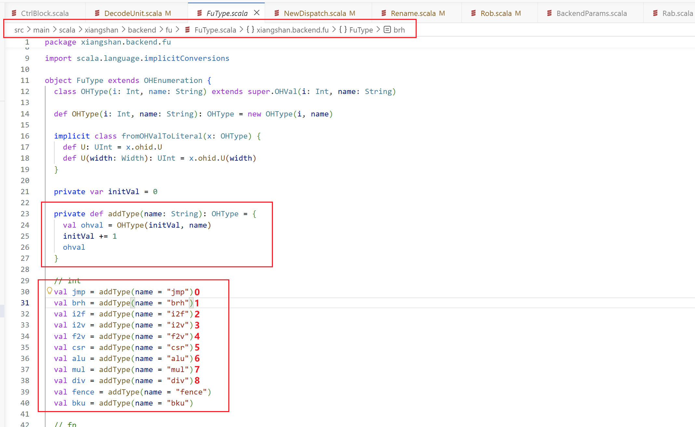

可以看出，这个值采用独热编码。`fuType`为 `0x40`，即二进制 `8b0100_0000`，意味着下标为 6 的位置是 `1b1`。

这是由以下语句生成的：<font style="color:#DF2A3F;">  </font>

```plain
val alu = addType(name = "alu")
```

因此，`fuType`为 `0x40`表示该指令将使用 ALU 功能单元。add 指令确实需要使用 ALU，译码行为正确。

紧接着，分析 `fuOpType`为 `0x21`的含义。可以推测，这个值指示了 ALU 执行的具体操作是加法。我们来验证一下：


在定义 `fuOpType`的代码处，可以看到当值为 `0x21`时，其注释表明它代表普通的加法操作。

通过以上分析，相信你对输入 DecodeUnit 模块的信号以及该模块输出的信号，都有了较深入的理解，对于其他指令也能独立判断这些信号的意义了。


总结如下：

* `srcType = 0x1`，`lsrc_0 = 0x1e`表示第一个操作数来自 30 号寄存器。
* `srcType = 0x1`，`lsrc_1 = 0x06`表示第二个操作数来自 6 号寄存器。
* `fuType = 0x40`，`fuOpType = 0x21`表示这两个源操作数将在 ALU 中进行普通的加法运算。
* 运算结果会进行回写（`rfWen`为高），写入的寄存器位置是 2 号寄存器（`ldest = 0x2`）。

## （2）重命名模块（Rename）概览

在主流程文稿中，这里不能把重命名阶段整个细节重新铺开，否则就会和专题文稿重复；但也绝不能一句不提直接跳到分发阶段，否则整条指令生命周期会断掉。因此，这里只保留重命名阶段最关键、最能支撑后续 `Dispatch / Issue / Execute` 阅读的主结论。

至此，对译码模块的探索可以暂时告一段落。在学习初期，我们只需要了解香山架构是如何对简单指令进行译码的。即在下图中：


在紫色板块（DecodeStage）中，我们只需理解被红色方框框出的部分。因为其他部分主要服务于向量指令，而学习初期我们暂不关注此类复杂指令。因此，可以认为译码模块的探究已经完成，接下来应转向对重命名（Rename）阶段的探究。

在探究重命名的实现之前，强烈建议先熟悉其理论基础，这将帮助你更好地理解此处的架构设计。理论学习可参考《香山源代码剖析 第二册》P1011，或直接阅读下方图片：


熟悉了上述理论知识后，接下来需要查看架构图：


可以发现，在 DecodeStage 译码结束后，会大致将两类信号向外传递，即上图中标红的数字 1 和 2。接下来，我们将主要从这两类信号开始，分析指令进入后续流水级的具体行为。

在查看此架构图时，需要注意一个关键点：图中所有用橙色标示的区域，通常都可以认为内部包含寄存器。例如下图框出的这些部分：


而其他部分通常只包含组合逻辑。

下面对这两组信号作简要说明：

1. **第1组信号**：传入名为 `DecodePipeRename`的模块。顾名思义，这是连接译码（Decode）模块和重命名（Rename）模块之间的流水级寄存器。这组信号负责将译码产生的信息传递到后续流水级。
2. **第2组信号**：这组信号**没有经过任何寄存器**，直接进入了 RAT（重命名地址表）中。因此，这组信号是利用逻辑源地址（`lsrc`）直接读取 RAT 表项的信号。具体作用将在后续结合波形进行解释。

对当前这条 ADD 指令来说，重命名阶段最关键的结果并不复杂，但必须先在主流程里建立起来：

- 逻辑 30 号寄存器被解析成当前应读取的物理寄存器 10
- 逻辑 6 号寄存器被解析成当前应读取的物理寄存器 7
- 逻辑目标寄存器 2 会被分配新的物理寄存器 11
- 同时会为这条指令分配 ROB 表项 35

这几个结果会直接决定后面分发阶段看到的 `psrc_0 = 10`、`psrc_1 = 7`、`pdest = 11` 和 `robIdx = 35`。也就是说，分发阶段并不是“凭空多出了一套编号”，而是沿着重命名阶段已经准备好的结果继续向后推进。

如果你想详细理解：

- 为什么逻辑寄存器 30 和 6 最终会读出物理 10 和 7
- 为什么 RAT 读出来的不是一张“死表”的静态值
- 为什么目标寄存器 2 最终会被更新为物理寄存器 11

那么请继续阅读专题文稿：

- `backend-mechanisms/rename-bypass/02-rename-bypass-path-of-an-add-instruction.md`


## （3）分发模块（dispatch）

### （3.1）输入信号总览

查看架构图可知，在重命名（Rename）模块与分发（Dispatch）模块之间也存在一个 `RenamePipeDispatch`模块。基本可以确认，这是两级流水线之间的流水线寄存器。其行为模式与我们前面分析过的 `DecodePipeRename`模块几乎完全相同，因此这里不再赘述。读者可自行查看该模块相关的输入、输出信号波形。


此处直接观察进入分发模块的数据信号，定位到该模块：

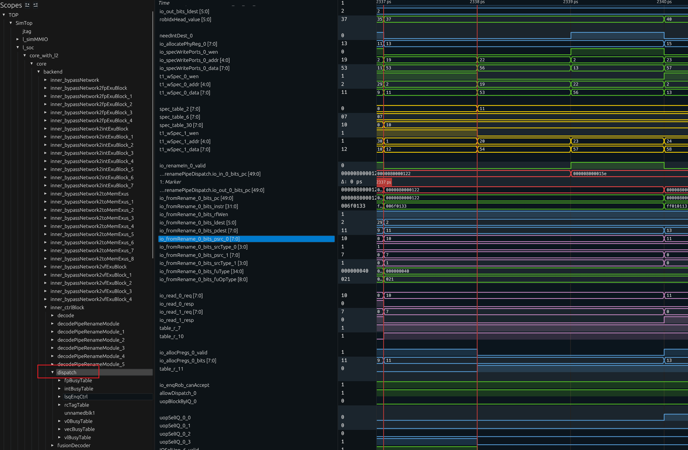

提取以下相关信号进行观察：


在波形中可以观察到，在仿真时间 2337 ps 这一时刻，第 0 路进入分发阶段的指令主要包含以下信息：

整理后的信号信息如下：

* <font style="color:#DF2A3F;">表示当前指令的程序计数器地址为 </font><code><font style="color:#DF2A3F;">0x80000122</font></code><font style="color:#DF2A3F;">，对应指令码 </font><code><font style="color:#DF2A3F;">0x006f0133</font></code><font style="color:#DF2A3F;">。</font>
* <code><font style="color:#2F8EF4;">rfWen = 1</font></code><font style="color:#2F8EF4;">表示该指令需要回写结果。</font>
* <code><font style="color:#2F8EF4;">ldest = 0x02</font></code><font style="color:#2F8EF4;">表示目标逻辑寄存器为 2 号。</font>
* <code><font style="color:#2F8EF4;">pdest = 0x0b</font></code><font style="color:#2F8EF4;">表示该指令在重命名阶段分配的物理寄存器为 11 号。</font>
* <code><font style="color:#E746A4;">psrc_0 = 0x0a</font></code><font style="color:#E746A4;">表示第一个源操作数来自物理寄存器 10 号。</font>
* <code><font style="color:#E746A4;">srcType_0 = 0x1</font></code><font style="color:#E746A4;">表示第一个源操作数来自寄存器。</font>
* <code><font style="color:#E746A4;">psrc_1 = 0x07</font></code><font style="color:#E746A4;">表示第二个源操作数来自物理寄存器 7 号。</font>
* <code><font style="color:#E746A4;">srcType_1 = 0x1</font></code><font style="color:#E746A4;">表示第二个源操作数来自寄存器。</font>
* `fuType = 0x40`表示功能单元类型为加法器。
* `fuOpType = 0x21`表示具体的加法操作类型。

结合以往的逻辑寄存器映射关系：

* `lsrc_0 = 0x1e`表示第一个操作数来自逻辑 30 号寄存器，此时它被映射到了物理寄存器 10（`psrc_0 = 0x0a`）。
* `lsrc_1 = 0x06`表示第二个操作数来自逻辑 6 号寄存器，此时它被映射到了物理寄存器 7（`psrc_1 = 0x07`）。

这些信息共同描述了重命名阶段完成后，进入 Dispatch 阶段的指令及其操作数映射状态。

### （3.2）读BusyTable

进入分发阶段后，如上节所示，指令已经知晓其两个源操作数分别来自物理寄存器 10 号和 7 号。那么，进入此阶段后，它的重要任务之一自然是查询这两个所需数据的状态，即检查 10 号和 7 号物理寄存器的数据是否就绪，是否仍处于繁忙状态。因此，它需要读取分发阶段下的子模块 `intBusyTable`，以获取这两个物理寄存器的状态信息。

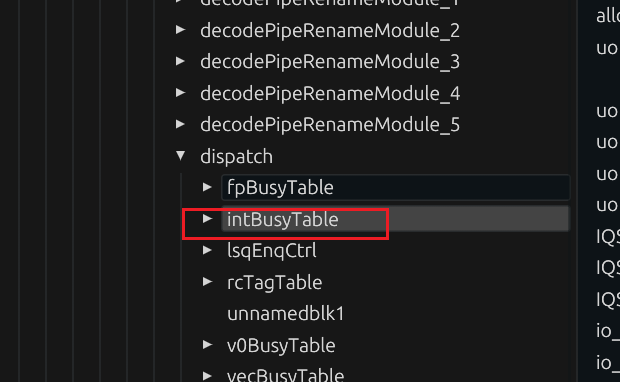

拉取此模块的如下信号：

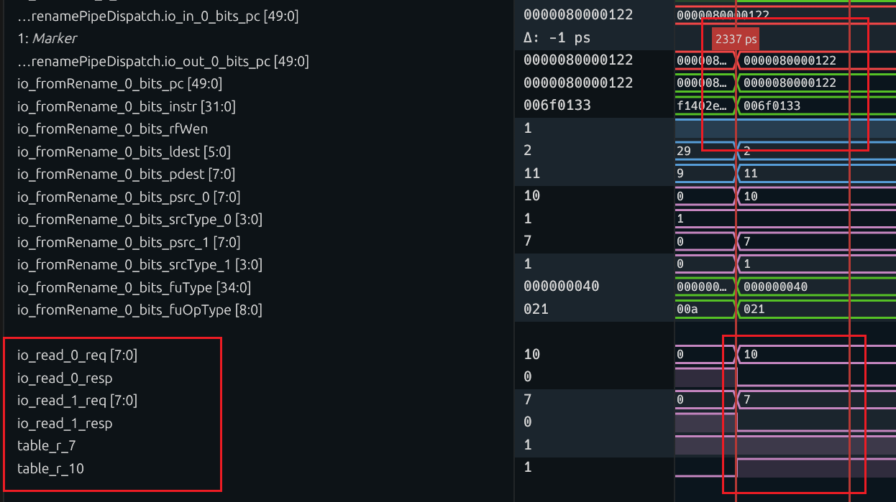

重命名到分发模块的信号：

| 信号名 | 核心含义 | 波形数值说明 |
| --- | --- | --- |
| `...renamePipeDispatch.io_in_0_bits_pc[49:0]` | 分发模块输入的指令 PC 值 | 2337ps 时值为`0000080000122`<br/>，确认是目标 add 指令 |
| `...renamePipeDispatch.io_out_0_bits_pc[49:0]` | 分发模块输出的指令 PC 值 | 与输入 PC 完全一致，指令身份标识全程透传 |
| `io_fromRename_0_bits_instr[31:0]` | 重命名模块输出的原始指令机器码 | 值为`006f0133`<br/>，对应 RISC-V 的 add 加法指令 |
| `io_fromRename_0_bits_rfWen` | 寄存器堆写使能信号 | 值为`1`<br/>，表示该指令执行完成后需要写回目标寄存器 |
| `io_fromRename_0_bits_ldest[5:0]` | 目标逻辑寄存器号 | 值为`2`<br/>，对应 RISC-V 的 x2 寄存器（栈指针 sp） |
| `io_fromRename_0_bits_pdest[7:0]` | 重命名分配的目标物理寄存器号 | 值为`11`<br/>，后续加法结果将写回这个物理寄存器 |
| `io_fromRename_0_bits_psrc_0[7:0]` | 第 0 个源操作数的物理寄存器号 | 值为`10`<br/>，对应逻辑寄存器 x30 |
| `io_fromRename_0_bits_psrc_1[7:0]` | 第 1 个源操作数的物理寄存器号 | 值为`7`<br/>，对应逻辑寄存器 x6 |
| `io_fromRename_0_bits_fuType[34:0]` | 功能单元类型 | 值为`000000040`<br/>，对应 ALU 整数运算单元 |
| `io_fromRename_0_bits_fuOpType[8:0]` | 具体操作类型 | 值为`021`<br/>，对应 ALU 的 ADD 加法操作 |

busy table 查询信号：

对应香山源码的 位置

<code><font style="color:rgb(0, 0, 0);background-color:rgba(0, 0, 0, 0);">src/main/scala/xiangshan/backend/rename/BusyTable.scala</font></code>、<code><font style="color:rgb(0, 0, 0);background-color:rgba(0, 0, 0, 0);">src/main/scala/xiangshan/backend/issue/IssueQueue.scala</font></code>。

| 信号名 | 位宽 | 核心功能 | 波形数值与逻辑说明 |
| --- | --- | --- | --- |
| `io_read_0_req[7:0]` | 8bit | **Busy Table 第 0 路读端口的请求地址**，即要查询的源物理寄存器号 | 2337ps 时值为`10`<br/>，正好对应指令的第 0 个源物理寄存器`psrc_0=10`<br/>，表示要查询物理寄存器 10 的忙 / 就绪状态 |
| `io_read_0_resp` | 1bit | **Busy Table 第 0 路读端口的查询响应结果**，返回对应物理寄存器的忙状态 | 2337ps 时值为`0`<br/>，香山 Busy Table 的规则是：`resp=0`<br/>表示**该物理寄存器不忙（就绪）**，数据已经写回，可用于发射执行 |
| `io_read_1_req[7:0]` | 8bit | **Busy Table 第 1 路读端口的请求地址**，对应指令的第 1 个源物理寄存器号 | 2337ps 时值为`7`<br/>，正好对应指令的第 1 个源物理寄存器`psrc_1=7`<br/>，查询物理寄存器 7 的忙 / 就绪状态 |
| `io_read_1_resp` | 1bit | **Busy Table 第 1 路读端口的查询响应结果** | 2337ps 时值为`0`<br/>，表示物理寄存器 7 也处于**就绪状态**，数据可用 |
| `table_r_7` | 1bit | **物理寄存器 7 的写回就绪广播信号** | 2337ps 时值为`1`<br/>，表示物理寄存器 7 在这个周期完成了结果写回，拉高 1 个周期广播给所有发射队列：等待该寄存器的指令可以更新就绪状态 |
| `table_r_10` | 1bit | **物理寄存器 10 的写回就绪广播信号**，功能与`table_r_7`<br/>完全一致 | 2337ps 时值为`1`<br/>，表示物理寄存器 10 在这个周期同步完成了写回，广播就绪信号 |

因为共有 6 条指令同时进入分发阶段，每条指令最多需要两个读端口来读取其源操作数的状态，因此 `intBusyTable`总共会提供 6 个读端口。由于我们关注的加法指令是第 0 条指令，所以在观察它对 BusyTable 的读取行为时，应重点查看第 0 和第 1 个读端口。

解释了以上内容后，我们来看具体的读取行为。可以明确该指令的两个源操作数分别来自物理寄存器 10 号和 7 号。因此可以推测，系统会以地址 10 和 7 去读取 BusyTable。在波形中验证，这个推测是正确的：`read_0_req`和 `read_1_req`的地址分别是 10 和 7。

再看读取的结果。这里的读取是单周期直接完成的，所以在同一周期内可以看到两个 `resp`信号都被拉低。需要注意的是，此处的 `resp`信号表示该寄存器的数据是否就绪。既然被拉低为 0，说明数据尚未就位。

我们再把 `table`内部的数据拉出来，检查读取是否正确。会发现此时 `table_r_7`和 `table_r_10`的值均为高电平。这个信号表示该寄存器位置的数据是否处于繁忙状态，即数据是否还未就位（通过设计手册的介绍可以确认他表示的意义）。因此，它们都被拉高意味着这两个寄存器位置的数据仍处于繁忙状态，尚未就位。

所以，`resp`输出的信号是基于 `table_r_*`信号取反后得出的（当然，同一周期内其他指令对 BusyTable 的写操作也会影响此结果）。两者所代表的含义是相反的。

综上，可以清楚地得出结论：

**读取行为正确**：指令在分发阶段读取 `intBusyTable`时，其第0路和第1路读端口的请求地址分别为 `10`和 `7`，与指令的两个源操作数物理寄存器编号（`psrc_0 = 10`, `psrc_1 = 7`）完全对应，说明寻址逻辑正确。

**状态信号含义明确**：

* `table_r_7`和 `table_r_10`信号为高电平（`1`），表示这两个物理寄存器的数据当前处于“繁忙”状态，即**数据尚未就绪**。
* 对应的 `resp_0`和 `resp_1`响应信号为低电平（`0`），表示**数据未就绪**。这证实了 `resp`信号是 `table_r_*`信号的**逻辑取反**（并可能受其他写操作影响），两者共同但以相反的逻辑指示了同一状态。

### （3.3）写BusyTable

明白了以上读取 BusyTable 的内容，我们自然可以推断：这条加法指令也应该执行写 BusyTable 的操作。因为该指令会将自身的加法结果写入物理寄存器 11 号，而此刻这个结果尚未计算出来，所以它应该对 BusyTable 的第 11 个位置写入“繁忙”信号。这样做的目的是告知后续的指令（包括同一周期内的逻辑后续指令）：“11 号寄存器本应由我的加法结果写入，但由于我尚未执行完成，这个结果还未写回，因此 11 号寄存器的数据仍在计算中。”这与上面读操作中，该加法指令得知自己的两个源操作数仍在运算中的效果是相同的。

那么，我们来推测一下这条加法指令是如何写入这个“繁忙”信号的。可以肯定的是，它会对 11 号位置进行写入。在写操作执行后，该位置对应的指示信号将被拉高。

现在，我们拉出以下信号进行查看


| 信号名 | 波形数值 | 核心功能 | 与全链路信号的联动关系 |
| --- | --- | --- | --- |
| `io_allocPregs_0_valid` | `1` | 第 0 路物理寄存器分配有效信号（FreeList 模块输出） | 上游触发：重命名模块检测到`rfWen=1`<br/>，向 FreeList 发起物理寄存器分配请求，FreeList 成功分配后拉高该信号；下游联动：该信号拉高的周期，`io_allocPregs_0_bits`<br/>输出有效分配结果，同时 Busy Table 会把对应的物理寄存器标记为「忙」（因为指令还没执行，结果未写回） |
| `io_allocPregs_0_bits[7:0]` | `11` | FreeList 分配的目标物理寄存器号 | 上游：来自 FreeList 的空闲物理寄存器池；核心对应：和重命名模块输出的`pdest=11`<br/>完全相等，是「逻辑寄存器 x2→物理寄存器 11」的映射核心；下游：该寄存器号会被送到 ALU 执行单元（告诉 ALU 结果要写回这里）、写回模块、Busy Table，是后续所有目标寄存器操作的核心地址 |
| `table_r_11` | `1` | 物理寄存器`11`<br/>的写回就绪广播信号 | 上游源头：完全对应`io_allocPregs_0_bits=11`<br/>和`pdest=11`<br/>，是这条 add 指令的目标寄存器；触发条件：ALU 完成加法运算，结果成功写回物理寄存器`11`<br/>后，拉高该信号 1 个周期；下游动作：1. Busy Table 收到广播，把物理寄存器`11`<br/>的状态从「忙」改为「就绪」；2. 所有依赖逻辑寄存器 x2（映射到物理寄存器 11）的后续指令，会收到该广播，更新自己的源寄存器就绪状态 |

可以观察到，BusyTable 的写端口 `io_allocPregs_0_valid`信号被拉高，表明需要进行写操作。紧接着，地址信号 `io_allocPregs_0_bits`的值为 11，即目标地址。在下一个时钟周期，可以看到 `table_r_11`的值被置为高电平。此后，这表示 11 号物理寄存器处于繁忙状态，需要等待这条加法指令完成运算。波形中的数据完全印证了我们的猜想是正确的。

所以明白了以上内容，可以清楚地知道：

**写 BusyTable 的操作**：加法指令在分发阶段，通过写端口向 `intBusyTable`发出写请求：

* 写使能信号 `io_allocPregs_0_valid`被拉高，表明需更新 BusyTable。
* 写地址信号 `io_allocPregs_0_bits`的值为 `11`，对应其目标物理寄存器（`pdest = 11`）。
* 在下一周期，`table_r_11`被置为高电平（`1`），表示物理寄存器 11 进入“繁忙”状态。

### （3.4）写Rob

在分发阶段，还有一项特别重要的操作，即对 ROB 的写操作。指令需要将自身的一些信息写入 ROB，以便在执行结束后能够按逻辑顺序正确提交。

因此，观察此模块的信号：

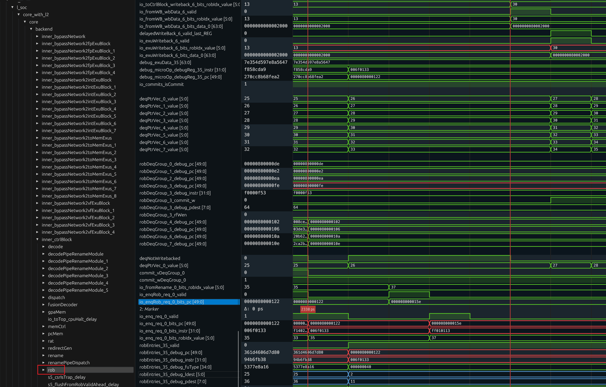

提取以下信号进行查看：


首先是 ROB 入队的请求信号

| 信号名 | 位宽 | 核心功能 | 波形数值与验证说明 |
| --- | --- | --- | --- |
| `io_enq_req_0_valid` | 1bit | ROB 入队请求的**握手有效信号**，由重命名模块驱动，告诉 ROB：「我有一条有效指令，申请入队」 | 2338ps 时值为`1`<br/>，说明发起了有效的入队请求，是指令入队的前提条件 |
| `io_enq_req_0_bits_pc[49:0]` | 50bit | 入队指令的 PC 值，是指令的唯一身份标识 | 值为`0000080000122`<br/>，和你全程跟踪的 add 指令 PC 完全一致，**第一步就确认入队的是目标指令** |
| `io_enq_req_0_bits_instr[31:0]` | 32bit | 入队指令的原始机器码 | 值为`006f0133`<br/>，对应 RISC-V 的 add 加法指令，和之前的指令机器码完全匹配，双重确认指令身份 |
| `io_enq_req_0_bits_robIdx_value[5:0]` | 6bit | 给这条指令预分配的 ROB 表项索引，也就是这条指令的「排队号」 | 值为`35`<br/>，和之前重命名阶段的`robIdxHead_value=35`<br/>完全对应，说明这条指令要写入 ROB 的**第 35 号专属表项** |

显示重命名的 rob 的 35 号表项里面保存了对应的目标指令

| 信号名 | 位宽 | 核心功能 | 波形数值与验证说明 |
| --- | --- | --- | --- |
| `robEntries_35_valid` | 1bit | ROB 表项的**有效位**，是入队成功的核心标志：`=1`<br/>表示表项已被占用，存储了有效指令；`=0`<br/>表示表项空闲，可分配给新指令 | 2338ps 后从`0`<br/>变为`1`<br/>，**直接证明这条 add 指令成功入队 ROB，35 号表项被正式占用** |
| `robEntries_35_debug_pc[49:0]` | 50bit | 表项中存储的指令 PC 值（debug 信号专门用于波形调试） | 从无效值变为`0000080000122`<br/>，和入队请求的 PC 完全一致，确认表项存储的就是目标指令 |
| `robEntries_35_debug_instr[31:0]` | 32bit | 表项中存储的指令机器码 | 从无效值变为`006f0133`<br/>，和入队请求的机器码完全匹配 |
| `robEntries_35_debug_fuType[34:0]` | 35bit | 表项中存储的指令功能单元类型 | 变为`000000040`<br/>，对应 ALU 整数运算单元，和之前重命名阶段的`fuType`<br/>完全一致 |
| `robEntries_35_debug_ldest[5:0]` | 6bit | 表项中存储的目标逻辑寄存器号 | 变为`2`<br/>，对应 RISC-V 的`x2`<br/>寄存器，和之前的`ldest=2`<br/>完全匹配 |
| `robEntries_35_debug_pdest[7:0]` | 8bit | 表项中存储的目标物理寄存器号 | 变为`11`<br/>，和重命名阶段分配的`pdest=11`<br/>完全一致，后续指令写回、提交都会用到这个值 |
| `robEntries_35_uopNum[6:0]` | 7bit | 表项中存储的微操作数量 | 值为`01`<br/>，说明这条普通整数指令只对应 1 个微操作，无需拆分 |
| `robEntries_35_realDestSize[6:0]` | 7bit | 目标寄存器的位宽标识 | 值为`01`<br/>，对应 RV64 的 64 位整数寄存器 |
| `robEntries_35_rfWen` | 1bit | 表项中存储的寄存器写使能信号 | 值为`1`<br/>，和之前的`rfWen=1`<br/>一致，说明这条指令执行完成后需要写回目标寄存器，提交时要更新处理器架构状态 |
| `robEntries_35_commitType[2:0]` | 3bit | 表项中存储的指令提交类型 | 值为`0`<br/>，表示这是**普通整数指令的正常提交**，无异常、分支、特权操作等特殊处理 |

在 2338 ps 这一时刻（可以确认这是在指令进入分发阶段后，经过一拍寄存器延迟再进入 ROB 的，从架构图中也能确认两者之间存在一级寄存器），`rob`模块的 `io_enq_req_0_*`端口被赋予了这条指令对应的请求信号，我们可以通过其 `pc`值和指令码来识别。

请注意，还有一个 `robIdx_value`值，它指示这条指令应该被写入第几个 ROB 表项。这个信号是在上一个流水级（重命名阶段）就已设置好的。如果忘记了，可以参考 2.4 节的内容。其值为 35，由此可以确认，这条指令的相关信息将被记录在第 35 个 ROB 表项中。

于是，我们拉取第 35 个 ROB 表项的内容进行查看，可以发现其行为完全正确。在下一个周期，这个表项里的数据都被正确地写入了。特别要注意 `uopNum`这个值，它所表示的意义是：这条指令**有几个回写的值尚未被写**。对于一条简单的加法指令而言，显然只有一个回写值。

所以明白了以上内容，可以清楚地知道：

* **写入时机与路径**：在 2338 ps 时刻，加法指令的信息通过 `io_enq_req_0_*`端口被写入 ROB。这发生在指令进入分发阶段后，经过一拍寄存器延迟，符合架构图中 ROB 位于分发阶段下一级的流水线设计。
* **写入位置**：写入的 ROB 表项索引由 `robIdx_value`指定，其值为 35。这与在重命名阶段为该指令分配的 ROB 表项编号（第 35 项）完全一致，证明了流水线上下文传递的正确性。
* **写入内容正确**：
* 在下一周期（2341 ps），第 35 号 ROB 表项内的数据（如 `pc`、指令信息等）被成功更新，表明写入操作完成。
* 其中，`uopNum`值为 1，这准确地表示该加法指令**有 1 个结果值尚未写回**。这与加法指令只产生一个回写结果的事实相符。

### （3.5）准备进入发射单元

完成以上各项主要任务（对一条加法指令而言大致就这些）后，指令就应准备进入发射队列。（以下内容仅为大致说明，笔者对后续架构尚未完全明晰）：

首先，需要确定指令具体可进入哪个发射队列。这个判断由分发（dispatch）模块中的以下信号决定

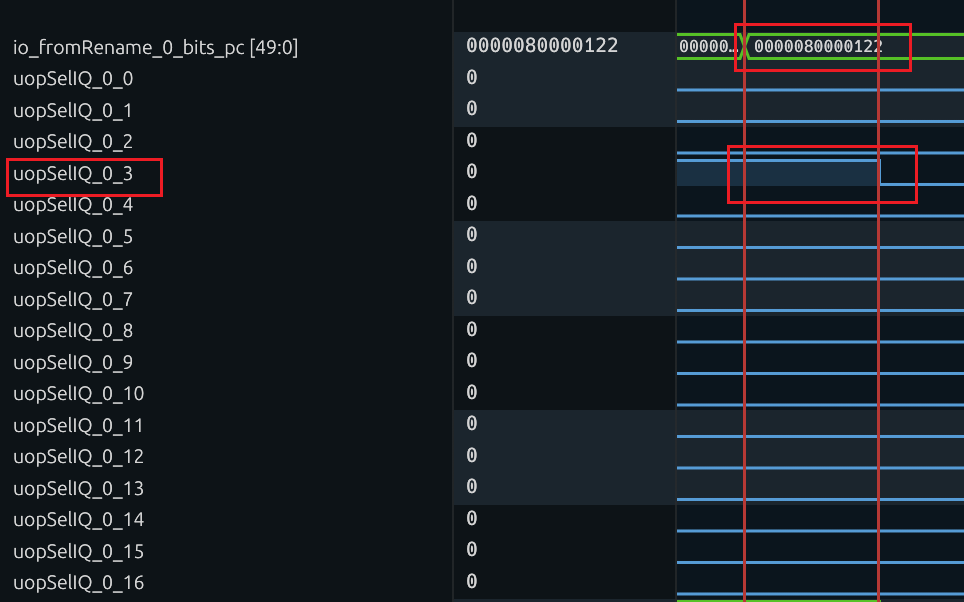

我们先来弄清楚这里为什么会有编号 0 到 16 一共 17 个发射队列。可以查看架构图：

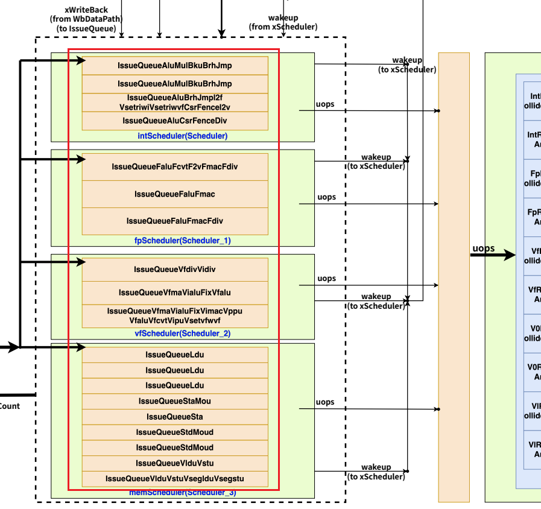

波形中的 17 个发射队列指的就是上图这些。你可能会数一数，发现图中一共画了 19 个方块，为什么数量对不上呢？对此，笔者暂时也没有完全弄懂原因，推测可能是在 `memScheduler`中有队列进行了合并。但对于前面的 `IntScheduler`部分，其序号应该是能对应上的。

***

看完store指令的执行过程后，就明白了这里为什么数量对不上了。因为对于store指令，是需要写数据、写地址两类的，所以这两类数据分别会进行发射。

也就是说在图中的：

1（"sta":store address算地址的队列）、3（"std":store data算数据的队列）是一对；同理2、4队列是一对。

也就是说对于一条store指令，会进入两个队列分别独立进行发射。所以说这里看似多了2个队列实际上就是因为这个原因。

***

例如，在上面的波形图中，你会发现给这条加法指令的信号中，只有 `uopSelIQ_0_3`被拉高了。这表明这条加法指令将被填入到上图中下标为 3（即第 4 个）的队列中。数一下就能确定，就是那个叫做 `IssueQueueAluCsrFenceDiv`的队列：


此外，还需要明白一点：每一个发射队列都会有两个写端口。因此，如果我们的加法指令是被发射到下标为 3 的发射队列中，那么它只可能通过下标为 6 或 7 的写端口对该队列进行写入。明白这一点后，就可以拉出这部分的写信号，确认它具体使用的是哪一个端口：


**发射队列选择信号：**

| 信号名 | 波形数值 | 核心功能 |
| --- | --- | --- |
| `IQSelUop_6_valid` | `1` | 第 6 路发射队列选择出的微操作（uop）有效信号，`=1`<br/>表示选中了一条有效指令 |
| `IQSelUop_6_bits_pc[49:0]` | `0000080000122` | 选中指令的 PC 值，确认是你跟踪的`add`<br/>指令 |
| `IQSelUop_6_bits_instr[31:0]` | `006f0133` | 选中指令的机器码，对应`add`<br/>加法指令 |
| `io_tolssueQueues_6_bits_pc[49:0]` | `0000080000122` | 发射队列输出给发射块的指令 PC，与选中指令一致 |
| `io_tolssueQueues_6_valid` | `1` | 发射队列→发射块的握手有效信号，`=1`<br/>表示队列有指令要发射 |
| `io_tolssueQueues_6_ready` | `1` | 发射块→发射队列的握手就绪信号，`=1`<br/>表示发射块可以接收指令 |

发射块接收信号：

| 信号名 | 波形数值 | 核心功能 |
| --- | --- | --- |
| `io_tolssueBlock_intUops_6_valid` | `1` | 整数发射块第 6 路输入有效信号，`=1`<br/>表示收到一条有效整数指令 |
| `io_tolssueBlock_intUops_6_bits_pc[49:0]` | `0000080000122` | 指令 PC，全程透传，确认是目标指令 |
| `io_tolssueBlock_intUops_6_bits_instr[31:0]` | `006f0133` | 指令机器码，用于调试 / 异常回溯 |
| `io_tolssueBlock_intUops_6_bits_fuType[34:0]` | `000000040` | 功能单元类型，`0x40`<br/>对应**整数 ALU**，决定指令要送到哪个执行单元 |
| `io_tolssueBlock_intUops_6_bits_fuOpType[8:0]` | `021` | 具体操作类型，`0x21`<br/>对应**ADD 加法**，告诉 ALU 要做什么运算 |
| `io_tolssueBlock_intUops_6_bits_psrc_0[7:0]` | `10` | 第 0 个源操作数的**物理寄存器号**，对应逻辑寄存器`x30` |
| `io_tolssueBlock_intUops_6_bits_psrc_1[7:0]` | `7` | 第 1 个源操作数的**物理寄存器号**，对应逻辑寄存器`x6` |
| `io_tolssueBlock_intUops_6_bits_srcState_0` | `0` | 第 0 个源操作数的就绪状态，`=0`<br/>表示**已就绪**（数据已写回物理寄存器） |
| `io_tolssueBlock_intUops_6_bits_srcState_1` | `0` | 第 1 个源操作数的就绪状态，`=0`<br/>表示**已就绪** |
| `io_tolssueBlock_intUops_6_bits_pdest[7:0]` | `11` | 目标物理寄存器号，对应逻辑寄存器`x2`<br/>，ALU 结果要写回这里 |
| `io_tolssueBlock_intUops_6_bits_rfWen` | `1` | 寄存器堆写使能，`=1`<br/>表示执行完成后要写回目标寄存器 |
| `io_tolssueBlock_intUops_6_bits_commitType[2:0]` | `0` | 提交类型，`0`<br/>表示普通整数指令，无异常 / 特殊提交 |

可以发现它是通过第 6 个端口进行写入的。写入的信号相信你已经可以自己总结了：

**1. 发射队列的写入端口**

* 每个发射队列拥有两个写端口。对于下标为 3 的队列，其写端口为 **6** 或 **7**。
* 波形图显示，该指令通过 **第 6 个写端口** 将数据写入目标队列。

**2. 写入信号的具体内容与含义**

通过波形图，我们可以提取并解读这条指令在进入发射队列时被写入的关键字段：

* <code>**io_toIssueBlock_intUops_6_valid**</code>: 有效信号，值为 1，表示本次传输的数据是有效的。
* <code>**bits_pc**</code>: 程序计数器（PC）值，为 `0x800000122`。
* <code>**bits_instr**</code>: 指令编码，为 `0x006f0133`。
* <code>**bits_fuType**</code>: 功能单元类型，为 `0x40`，表示这条指令将发往 ALU。
* <code>**bits_fuOpType**</code>: 功能单元操作类型，为 `0x21`，表示这条指令将在ALU中进行普通的加法操作。
* <code>**bits_psrc_0**</code>\*\*/ \*\*<code>**bits_psrc_1**</code>: 源操作数，分别为 `10`和 `7`，表示参与运算的两个操作数的物理寄存器编号。
* <code>**bits_srcState_0**</code>\*\*/ \*\*<code>**bits_srcState_1**</code>: 源操作数状态，均为 `0`，表示操作数是否已准备好（0 代表未就绪）。
* <code>**bits_pdest**</code>: 目标物理寄存器，为 `11`，表示运算结果将写入的物理寄存器编号。
* <code>**bits_rfWen**</code>: 寄存器写使能，为 `1`，表示指令执行完成后需要写回寄存器文件。
* <code>**bits_commitType**</code>: 提交类型，为 `0`，表示标准的提交行为。

## （4）发射队列

在前面的分析中，我们已经完全完成了ctrlBlock模块里面如何处理一条简单的ALU的大致流程，这三级流水都是顺序执行，指令一直到分发阶段都是有序的，进入IQ之后，也就将会变得无序了。所以现在要开始分析一条简单的ALU指令从分发阶段出去后到执行、到回写的全过程。

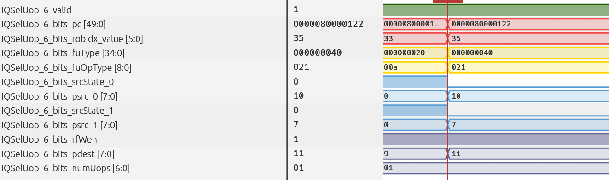

从下标为6的端口往外发射，所以会进入到6/2=3，进入到下标为3的那个IQ，在架构图的位置也就是：

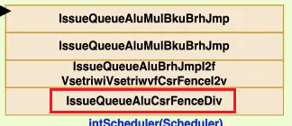

直接去拉到这个IQ的入队信号核验。6号端口对应的是这个IQ的第一个端口，所以直接拉第一个端口就行：

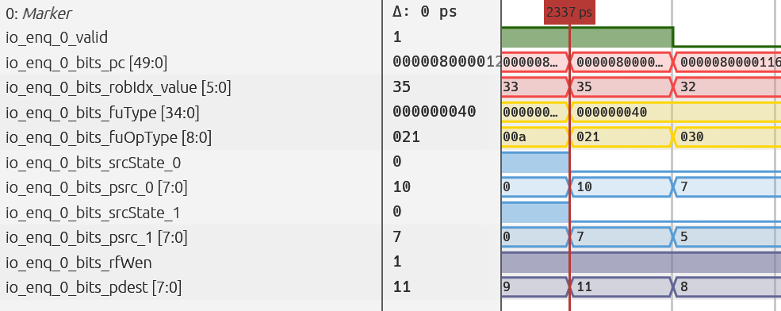

可以看到这个叫做“IssueQueueAluCsrFenceDiv”的这个IQ的第0个端口成功接收到了发来的请求入队信息。可以通过robIdx=0x35来判断出他是那条我们一直在追踪的加法指令；

通过FuType和FuOpType判断出这是一条普通的加法；

同时也可以看到，两个state信号例如srcState\_\*表明的意义就是，这条加法指令对应的两个源操作数是否已经就位；波形图已经是非常明确地告诉了我们，当前的这条加法指令的两个源操作数是来自第10号物理寄存器和第7号物理寄存器，并且这两个物理寄存器的值目前是还没有准备好的，还处于运算当中。

当然也可以看到这条加法指令是需要回写寄存器的，回写的使能信号\*rfWen被拉高、并且看到当前的需要回写的物理寄存器是第11号物理寄存器。与前面的都能对应上。

（好啰嗦~~因为笔者现在比较累，不太想动脑子了，就先写写这些啰里啰唆的东西磨磨时间~）

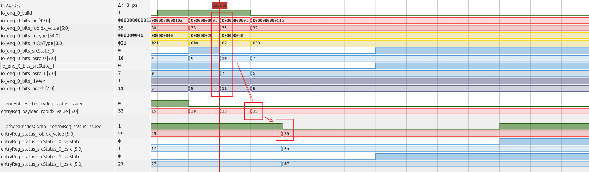

欸!继续看，前面看到了这个叫做“IssueQueueAluCsrFenceDiv”的IQ接收到之前的请求信息之后又有什么样的动作呢。所以就看上面的这个波形图吧。

当这个IQ接收到请求之后，紧接着在下一个周期，可以看到相关的入队信息被填入了*enqEntries*中。在图中的结构大概是这样的：

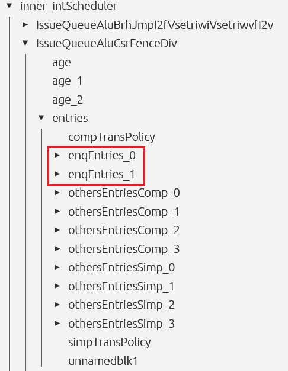

每一个IQ中，都会有两个enqEntries，其实就是对应着两个入队端口，当新的指令进入IQ的时候，都是先存到这个enqEntries中，如果不能够立马发射，那么就会转移到其他的表项中去，例如上图中的“ otherEntries\* ”相关的表项。（可能转移的条件等说法不是很准确，但大概就是这么个意思）

所以说，再回头看看正在分析的这条加法。前面看到了他的两个源操作数，也就是state信号，都是被拉低的，所以说理应他怎么也是不能马上发射的，所以说，在上上图中，是可以看到在请求表项里的数据被转移到了otherEntriesComp中去了。并且转移到的是下标为2的那个复杂表项，可以看到表项里面被填上了对应的数据，我们可以通过robIdx的值来识别定位到这条指令。

当然，这些存储在里面的信息，我们当然要重点去关注的信号当然是两个源操作数的就绪状态。也就是蓝色的那些信号。

## （5）读寄存器、执行

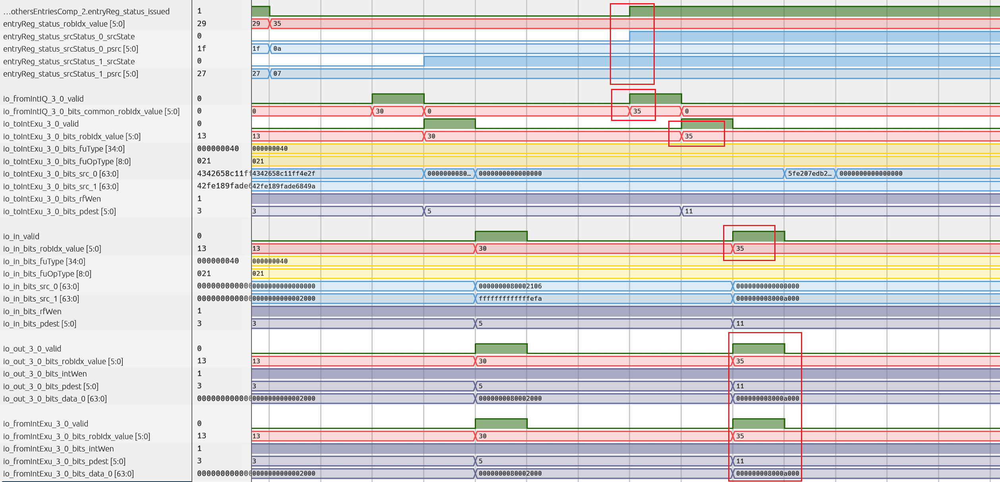

重点肯定是要关注一下两个源操作数的状态是怎么样的。可以看到有一个源操作数也就是“srcStatus\_1\_psrc”，其实也就是物理寄存器7号的值，大概过了两三个周期之后，可以看到state被拉高了，其实就是说明这个时候物理寄存器7号的值已经就绪了。但是再看看另一个操作数呢，也就是“srcStatus\_0\_psrc”的值，也就是物理寄存器0x0a的值，这个时候还没有准备好呢。但是又过了若干个周期之后，可以看到“srcStatus\_0\_srcState”被拉高了。也就是说，这个时候两个源操作数都是已经就绪的状态了，这条操作本身就已经具备的发射的条件。

这不，你瞧，在上面那个图开始一个框一个框开始往下看。

第二个框就是在datapath里的信号。可以看到在这条加法具备发射条件的这个周期，datapath就已经接收到了来自IQ的发射信号。从robIdx可以定位出来是我们一直在看的这条加法。这条加法正要进入datapath准备去读物理寄存器了。于是，在下一个周期，可以看到datapath传出了数据，不仅仅携带着常规的控制信号，并且还携带着两个源操作数的值。也就是是*src\_0和*src\_1两个值，这个值也正是在datapath阶段读出来的数据。仔细一看，其实会发现这两个值都是0，为什么呢？这完全不对呢。为什么这两个值都是错误的呢。

因为这个值是用的bypass路径来进行获取的，虽然在datapath阶段我们看到的源数据还不是正确的，但是在过一个周期，等他真正进入执行阶段之后，有没有发现，这个时候的值就已经正确了，其实也就是在说明，这个时候他成功地接收到了前推数据并正确设置了。

所以可以看到在倒数第二个小框框里面，可以看到各种数据被投入了执行模块中。

然后在最后一个框框中可以完美看到执行结果，可以看到最后的加法结果被算出了。而且是正确的~

## （6）回写与提交阶段概览

到这里为止，这条加法指令已经成功完成了执行，但对一条指令的完整生命周期来说，事情还没有结束。执行模块算出结果之后，这个结果还必须经过回写（Writeback）阶段，再由 ROB 判断其是否已经具备提交条件，最后才能在自己的提交窗口中真正完成提交。

因此，在主流程层面，至少应该先建立这样一个顺序认识：

1. **执行结束**：ALU 已经把加法结果算出来。
2. **结果回写**：执行结果离开执行单元，送往回写通路，同时向 ROB 和物理寄存器体系广播结果。
3. **ROB 表项变为可提交**：ROB 接收到这条指令对应的回写信息后，会更新 35 号表项的状态，使其从“仍有结果未写回”转为“已经具备提交条件”。
4. **真正提交**：只有当这条指令走到自己的提交窗口时，它才会正式完成提交并退出流水线。

也就是说，**执行结束**、**结果回写**、**ROB 具备提交条件**、**真正提交退场**，这是四个彼此相关但并不相同的时刻。主流程文稿必须至少知道这四者的顺序关系，否则“一条 ADD 指令的简单执行过程”在结构上就是不完整的。

对于当前这条加法指令，还可以明确知道以下事实：

* 这条指令的结果最终会写向其目标物理寄存器，也就是前面重命名阶段分配到的 11 号物理寄存器。
* ROB 中对应的 35 号表项会在接收到回写消息之后，从“仍有一个结果未写回”的状态，变化为“已经可以提交”的状态。
* 真正提交发生时，这个表项会被清理，指令正式退出后端。

但是，回写阶段内部还有两个很容易打断主线阅读节奏、又非常重要的专题机制：

1. 为什么执行模块出来的结果，在写物理寄存器时，端口编号会和执行端口编号对不上。
2. ROB 在接收回写之后，到底是如何更新表项状态并等待真正提交的。

这些内容如果全部塞在主流程篇里，会让这一篇再次被回写细节压垮；如果一句不提，又会让“执行结束后发生了什么”显得断裂。所以这里先明确告诉你：主流程已经走到回写与提交的门口，细节则需要转到专题文稿中去看。

如果你想继续阅读：

* 为什么回写阶段会出现 15 路输入竞争 8 路写口；
* 为什么执行单元的结果最后会经过仲裁器再决定从哪个整数写口出去；
* 为什么 ROB 在接收回写之后不是“天然立刻提交”，而是还要等自己的提交窗口；

那么请继续查看：

* `../../backend-mechanisms/writeback-port-arbitration/writeback-port-arbitration-of-an-add-instruction.md`
