# 一条LOAD指令的简单分析过程

Load 指令是 RISC-V 架构中核心的访存指令，在香山处理器中遵循\*\*<font style="color:rgb(0, 0, 0);background-color:rgba(0, 0, 0, 0);">取指→译码→重命名 + 资源分配→读寄存器 + 发射→执行（S1/S2/S3 三阶段）→写回 + 提交</font>\*\* 的流水线执行流程。Load 指令的数据来源优先级为：未写入 DCache 的 Store Buffer（地址匹配时） > DCache，前者数据更新且访问速度更快。本文从流水线阶段、核心模块、信号交互、波形调试维度，完整追踪 Load 指令在香山架构中的执行过程。

# <font style="color:rgb(0, 0, 0);">load 流水线</font>

<font style="color:rgb(25, 27, 31);"> Load 指令属于 I-type 格式，仅有一个源操作数（基址寄存器）+ 立即数偏移，包含目的寄存器（存储加载结果）。  load在指令集中定义如下，相比store，只有一个操作数，但是有目的寄存器</font>

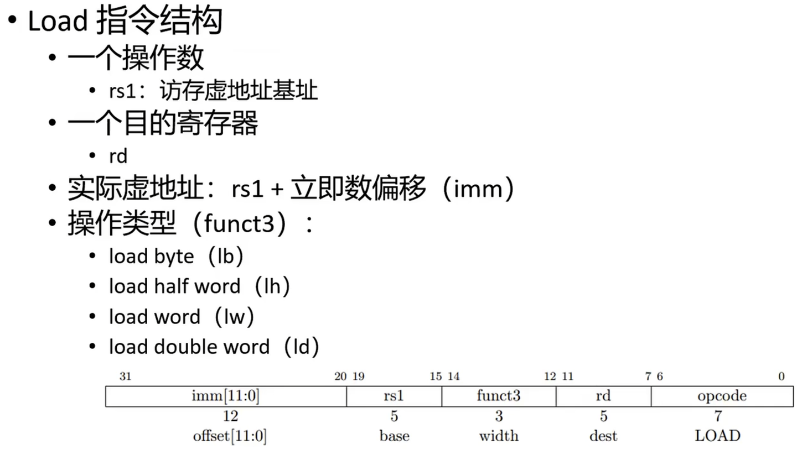

<font style="color:rgb(0, 0, 0);background-color:rgba(0, 0, 0, 0);">Load 指令的数据来源分为两类，优先级从高到低：</font>

1. **<font style="color:rgb(0, 0, 0);background-color:rgba(0, 0, 0, 0);">Store Buffer</font>**<font style="color:rgb(0, 0, 0);background-color:rgba(0, 0, 0, 0);">：未写入 DCache 的 Store 指令数据（地址匹配时优先读取，保证数据一致性）；</font>
2. **<font style="color:rgb(0, 0, 0);background-color:rgba(0, 0, 0, 0);">DCache</font>**<font style="color:rgb(0, 0, 0);background-color:rgba(0, 0, 0, 0);">：片上数据缓存，地址未命中 Store Buffer 时读取。</font>

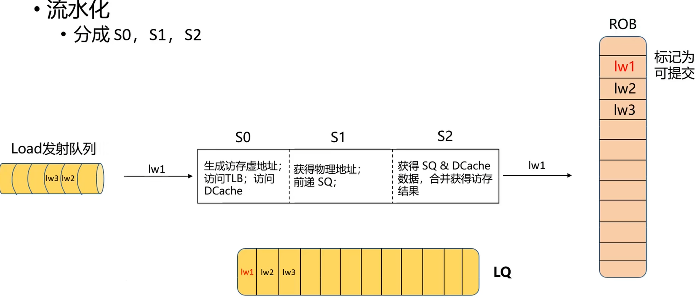

# <font style="color:rgb(0, 0, 0);"> 准备工作</font>

## 编译测试用例

使用 arch-fuzz 生成专用测试用例，验证 Load 指令全流程：

[附件: lw\_45.c](./attachments/7A2W1f1loEL4tTdk/lw_45.c)

[附件: lw\_45.s](./attachments/7A2W1f1loEL4tTdk/lw_45.s)

## 查看模块之间的结构

<font style="color:rgb(0, 0, 0);background-color:rgba(0, 0, 0, 0);">香山后端通过 CtrlBlock 统筹 Load 指令的流水线流转，核心模块包括 Decode（译码）、Rename（重命名）、Dispatch（分发）、IssueQueue（发射队列）、EXU（执行单元）、ROB（重排序缓冲），各模块交互关系如下：</font>

* **<font style="color:rgb(0, 0, 0);background-color:rgba(0, 0, 0, 0);">CtrlBlock</font>**<font style="color:rgb(0, 0, 0);background-color:rgba(0, 0, 0, 0);">：指令流核心控制模块，负责指令从 Frontend 到 IssueQueue 的流转；</font>
* **<font style="color:rgb(0, 0, 0);background-color:rgba(0, 0, 0, 0);">Decode</font>**<font style="color:rgb(0, 0, 0);background-color:rgba(0, 0, 0, 0);">：标量指令直接译码，输出指令类型、操作数、功能单元等信息；</font>
* **<font style="color:rgb(0, 0, 0);background-color:rgba(0, 0, 0, 0);">Rename</font>**<font style="color:rgb(0, 0, 0);background-color:rgba(0, 0, 0, 0);">：寄存器重命名，消除 WAR/WAW 相关，分配物理寄存器；</font>
* **<font style="color:rgb(0, 0, 0);background-color:rgba(0, 0, 0, 0);">IssueQueue</font>**<font style="color:rgb(0, 0, 0);background-color:rgba(0, 0, 0, 0);">：唯一乱序进出的模块，其余模块均顺序进出；</font>
* **<font style="color:rgb(0, 0, 0);background-color:rgba(0, 0, 0, 0);">EXU（LSU）</font>**<font style="color:rgb(0, 0, 0);background-color:rgba(0, 0, 0, 0);">：Load/Store 执行单元，分 S1/S2/S3 三阶段处理访存逻辑；</font>
* **<font style="color:rgb(0, 0, 0);background-color:rgba(0, 0, 0, 0);">ROB</font>**<font style="color:rgb(0, 0, 0);background-color:rgba(0, 0, 0, 0);">：指令提交与异常回滚的核心载体。</font>

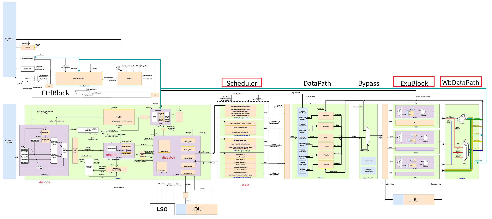

### crtlblock

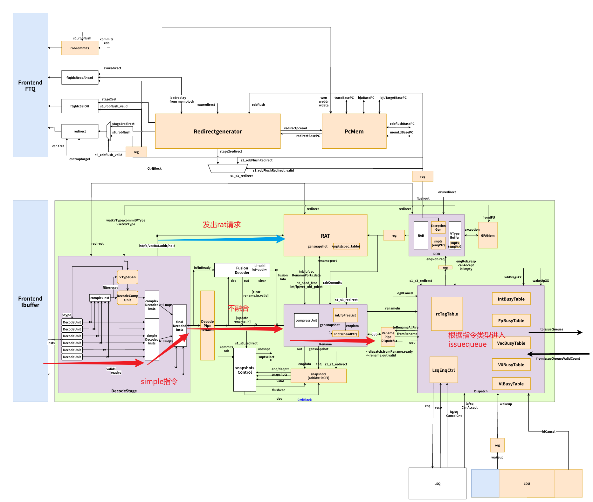

指令流在CtrlBlock的传递过程为：CtrlBlock读取Frontend传入的6条指令对应ctrlflow，经过decode 增加译码逻辑寄存器、运算操作符等信息，复杂指令经过DecodeComp添加指令拆分信息，每周期选出六条 uop输出，并发出读RAT请求。对于可以进行指令融合的uop，在进入rename时进行融合以及清除。之后经 过rename增加物理寄存器信息以及rob压缩信息后传入dispatch，最后通过dispatch进到rob/rab/vtype 申请entry，根据指令类型输出到issuequeue。这些模块中只有issuequeue顺序进，乱序出，其他模块都是 顺序进，顺序出。

### decode

将 Frontend 传入的机器码转换为硬件可识别的控制信号，补充指令类型、操作数、功能单元等信息，香山译码宽度为 8（每周期可译码 8 条指令）

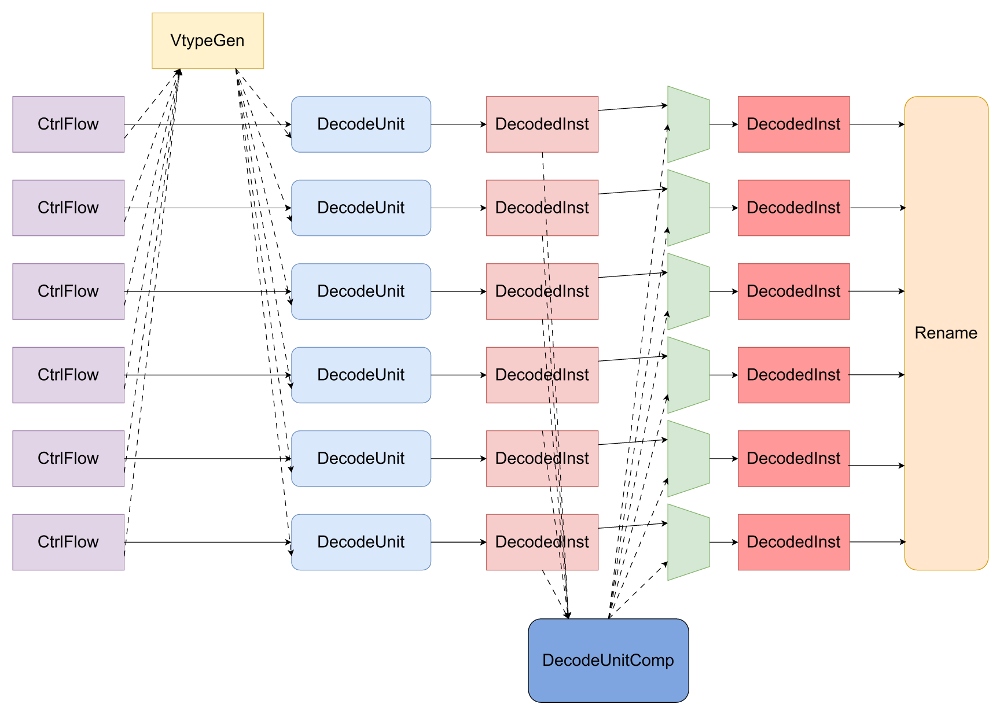

### 重命名

寄存器重命名维护重命名相关的表或指针。维护逻辑寄存器到物理寄存器的映射表，记录每一个逻辑寄存器 对应的最近分配的物理寄存器号。 对于整型、浮点和向量寄存器分别维护224项、192项和128项物理寄存器状态表，记录物理寄存器的状态， 记录是否分配，通过空闲物理寄存器分配指针记录未被分配的物理寄存器。 维护一张提交的逻辑寄存器对应物理寄存器的映射表（RenameTable,RAT），记录提交状态的逻辑寄存器 和物理寄存器的映射关系。 维护一个提交状态的空闲物理寄存器分配的指针。寄存器重命名技术消除指令之间的寄存器读后写相关 （WAR），和写后写相关（WAW），当指令执行发生例外或转移指令猜测错误而取消后面的指令时可以保证现场的 精确。

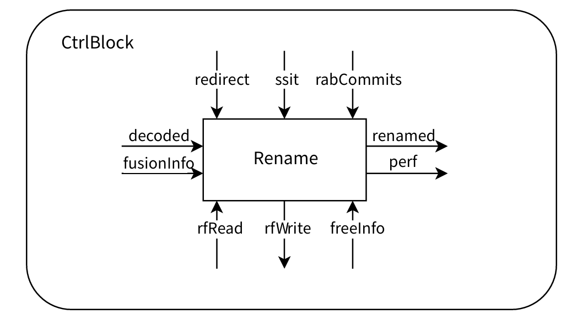

### 执行/写回

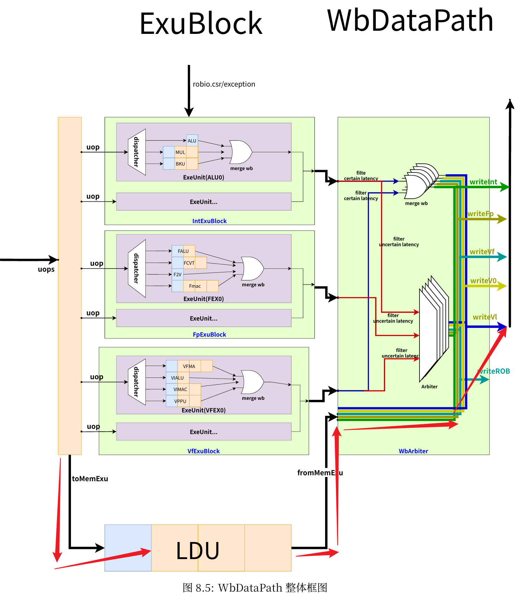

# chisel 源代码

\*\*指令重命名 → 发射队列（Issue）→ 执行单元（FU/Load Unit）→ 地址计算（TLB/VA→PA）→ DCache 访问 → 数据回写（WB）→ 重放/异常处理  \*\*

## decode

得到相应 pc 里面的机器码，转换为二进制

<code><font style="color:rgb(0, 0, 0);background-color:rgba(0, 0, 0, 0);">0x0007a783</font></code> → <code><font style="color:rgb(0, 0, 0);background-color:rgba(0, 0, 0, 0);">00000000 00000111 10100111 10000011</font></code>

| <font style="color:rgb(0, 0, 0);background-color:rgba(0, 0, 0, 0);">信号名称</font> | <font style="color:rgb(0, 0, 0);background-color:rgba(0, 0, 0, 0);">取值</font> | <font style="color:rgb(0, 0, 0);background-color:rgba(0, 0, 0, 0);">含义说明</font> |
| --- | --- | --- |
| <font style="color:rgb(0, 0, 0);background-color:rgba(0, 0, 0, 0);">指令格式</font> | <font style="color:rgb(0, 0, 0);background-color:rgba(0, 0, 0, 0);">I‑type</font> | <font style="color:rgb(0, 0, 0);background-color:rgba(0, 0, 0, 0);">立即数型加载指令</font> |
| <font style="color:rgb(0, 0, 0);background-color:rgba(0, 0, 0, 0);">opcode</font> | <font style="color:rgb(0, 0, 0);background-color:rgba(0, 0, 0, 0);">0000011</font> | <font style="color:rgb(0, 0, 0);background-color:rgba(0, 0, 0, 0);">Load 类指令标识</font> |
| <font style="color:rgb(0, 0, 0);background-color:rgba(0, 0, 0, 0);">funct3</font> | <font style="color:rgb(0, 0, 0);background-color:rgba(0, 0, 0, 0);">010</font> | <font style="color:rgb(0, 0, 0);background-color:rgba(0, 0, 0, 0);">LW 字加载子类型</font> |
| <font style="color:rgb(0, 0, 0);background-color:rgba(0, 0, 0, 0);">src1</font> | <font style="color:rgb(0, 0, 0);background-color:rgba(0, 0, 0, 0);">SrcType.reg</font> | <font style="color:rgb(0, 0, 0);background-color:rgba(0, 0, 0, 0);">源操作数 1 来自通用寄存器</font> |
| <font style="color:rgb(0, 0, 0);background-color:rgba(0, 0, 0, 0);">src2</font> | <font style="color:rgb(0, 0, 0);background-color:rgba(0, 0, 0, 0);">SrcType.imm</font> | <font style="color:rgb(0, 0, 0);background-color:rgba(0, 0, 0, 0);">源操作数 2 来自立即数</font> |
| <font style="color:rgb(0, 0, 0);background-color:rgba(0, 0, 0, 0);">src3</font> | <font style="color:rgb(0, 0, 0);background-color:rgba(0, 0, 0, 0);">SrcType.X</font> | <font style="color:rgb(0, 0, 0);background-color:rgba(0, 0, 0, 0);">无第三源操作数</font> |
| <font style="color:rgb(0, 0, 0);background-color:rgba(0, 0, 0, 0);">fuType</font> | <font style="color:rgb(0, 0, 0);background-color:rgba(0, 0, 0, 0);">FuType.ldu</font> | <font style="color:rgb(0, 0, 0);background-color:rgba(0, 0, 0, 0);">送往 Load 存储单元</font> |
| <font style="color:rgb(0, 0, 0);background-color:rgba(0, 0, 0, 0);">fuOpType</font> | <font style="color:rgb(0, 0, 0);background-color:rgba(0, 0, 0, 0);">LSUOpType.lw</font> | <font style="color:rgb(0, 0, 0);background-color:rgba(0, 0, 0, 0);">执行 32 位字加载操作</font> |
| <font style="color:rgb(0, 0, 0);background-color:rgba(0, 0, 0, 0);">selImm</font> | <font style="color:rgb(0, 0, 0);background-color:rgba(0, 0, 0, 0);">SelImm.IMM\_I</font> | <font style="color:rgb(0, 0, 0);background-color:rgba(0, 0, 0, 0);">使用 I 型立即数生成方式</font> |
| <font style="color:rgb(0, 0, 0);background-color:rgba(0, 0, 0, 0);">rfWen</font> | <font style="color:rgb(0, 0, 0);background-color:rgba(0, 0, 0, 0);">1</font> | <font style="color:rgb(0, 0, 0);background-color:rgba(0, 0, 0, 0);">写整数寄存器堆</font> |

<font style="color:rgb(0, 0, 0);background-color:rgba(0, 0, 0, 0);">根据 bitpat 的匹配规则： freechips.rocketchip.rocket.Instructions.\_  </font>

<font style="color:rgb(0, 0, 0);">BitPat("b?????????????????010?????0000011") // 规则：opcode=0000011 且 funct3=010 的32位指令，唯一匹配为LW</font>

译码结果输出

```bash
// 译码结果输出到重命名阶段
io.deq.decodedInst := decodedInst
```

| 译码字段 | 最终值 | 核心含义 |
| --- | --- | --- |
| fuType | FuType.ldu | 指令送往 Load 访存执行单元 |
| fuOpType | LSUOpType.lw | 执行 32 位有符号字加载操作 |
| lsrc(0) | 30（011110） | 基址寄存器 t5 (x30) |
| ldest | 6（000110） | 目的寄存器 t1 (x6) |
| imm | 1 | 32 位符号扩展后的地址偏移量 |
| rfWen | true | 允许写回整数寄存器堆 |
| fpWen | false | 不操作浮点寄存器 |
| selImm | SelImm.IMM\_I | 确认指令为 I-type 格式 |
| exceptionVec | 全 0 | 无任何异常，可正常执行 |
| firstUop/lastUop | true/true | 单微操作指令，无需拆分 |

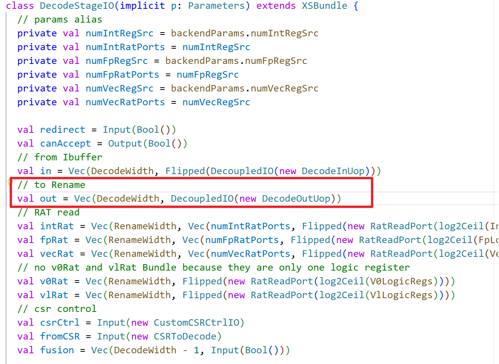

译码宽度是 8

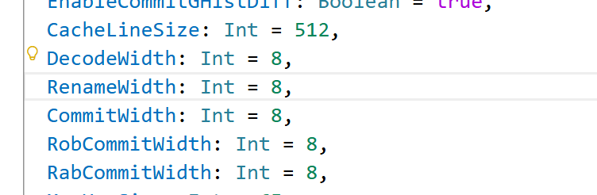

## rename

### 核心模块

* **<font style="color:rgb(0, 0, 0);background-color:rgba(0, 0, 0, 0);">RAT（Register Alias Table）</font>**<font style="color:rgb(0, 0, 0);background-color:rgba(0, 0, 0, 0);">：存储逻辑寄存器到物理寄存器的当前映射；</font>
* **<font style="color:rgb(0, 0, 0);background-color:rgba(0, 0, 0, 0);">FreeList</font>**<font style="color:rgb(0, 0, 0);background-color:rgba(0, 0, 0, 0);">：管理空闲物理寄存器，为目的寄存器分配新物理寄存器。</font>

### 模块初始化 和接口连接

```scala
// 重命名模块实例化
val renameModule = Module(new RenameModule()(p))
// 重命名模块输入：来自译码的指令流（RenameWidth为每周期发射宽度，如8）
val in = Vec(RenameWidth, Flipped(DecoupledIO(new DecodeOutUop)))
// 重命名模块输出：到Dispatch阶段
val out = Vec(RenameWidth, DecoupledIO(new RenameOutUop))

// 连接译码输出到重命名输入
renameModule.io.in <> io.deq
// 连接重命名输出到Dispatch输入
io.renameOut <> renameModule.io.out
```

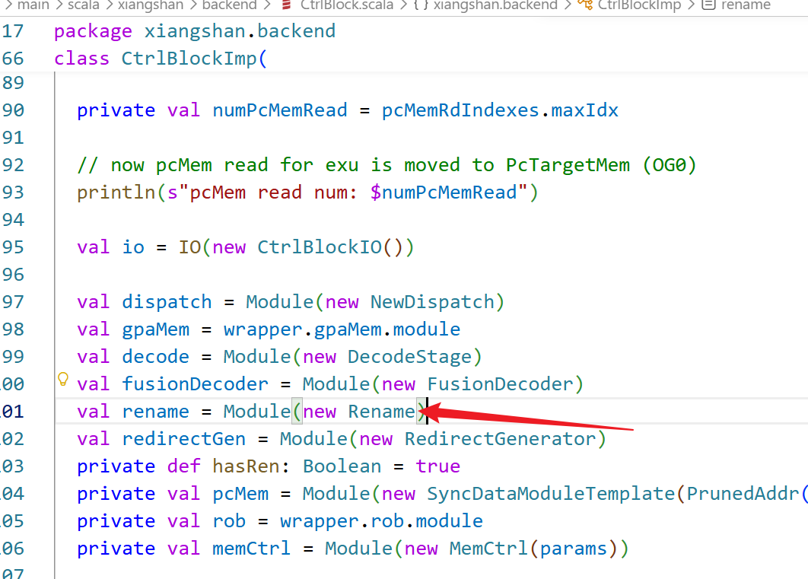

接受译码的输入和输出给 dispatch

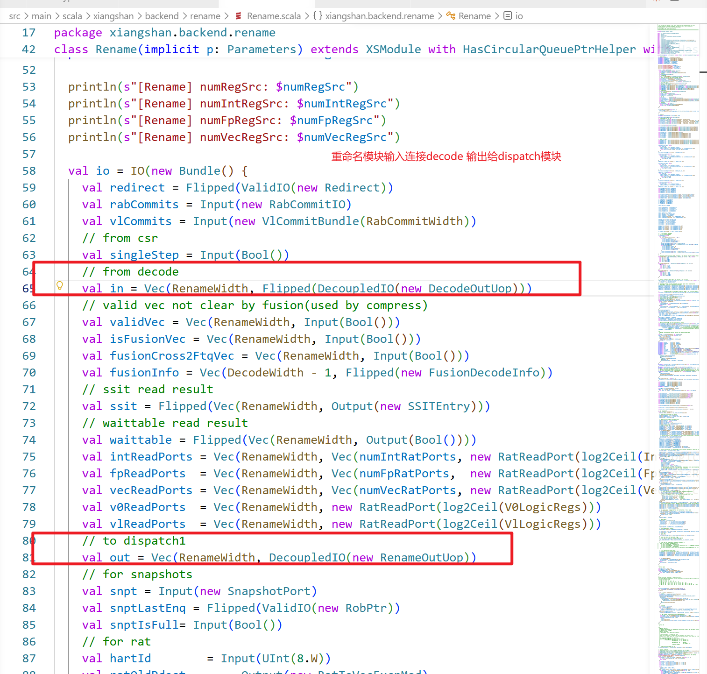

输入：

```bash
// 核心输入：来自译码模块的指令流，RenameWidth是每周期多发射宽度（如2/4/8发射）
val in = Vec(RenameWidth, Flipped(DecoupledIO(new DecodeOutUop)))
```

DecodeOutUop 里面主要的数据：

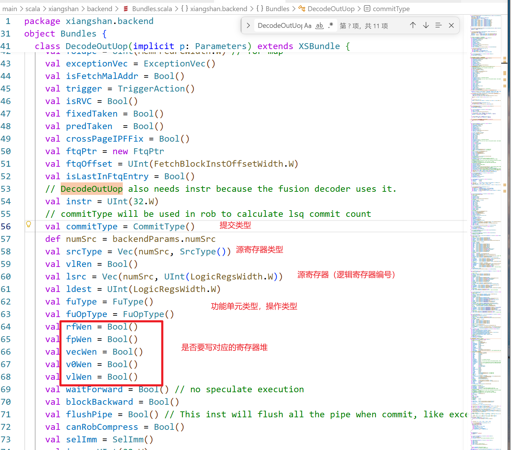

rename 模块里面连接到 rat 的端口

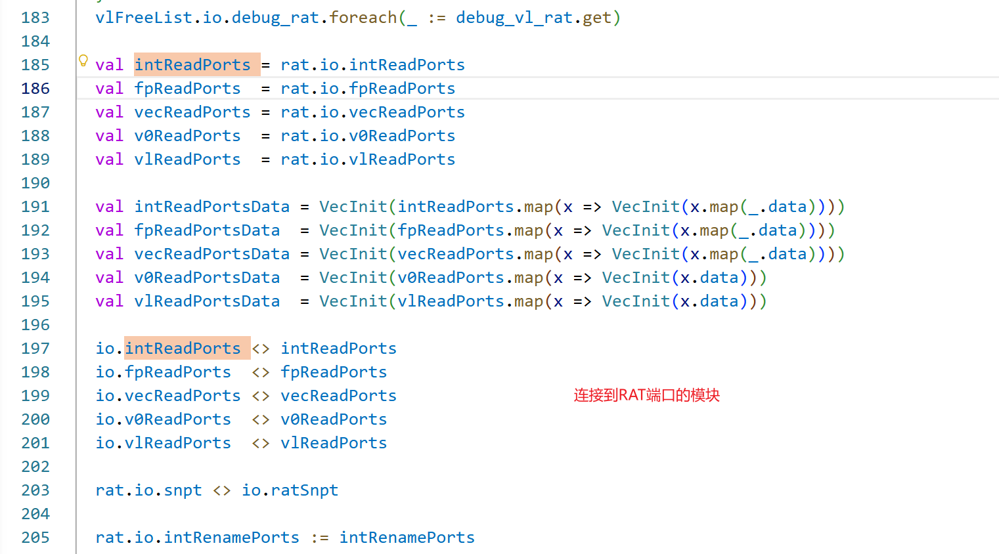

### 重命名的初始状态

复位 / 流水线冲刷后，RAT 表进入「架构状态对齐模式」：**<font style="color:rgb(0, 0, 0);background-color:rgba(0, 0, 0, 0);">逻辑寄存器号 = 物理寄存器号</font>**，FreeList 初始化规则如下：

| 寄存器类型 | 逻辑寄存器范围 | 初始映射规则 | 空闲物理寄存器范围 |
| --- | --- | --- | --- |
| 整数寄存器 | x0~x31 | xN → 物理寄存器 pN | p32~p63（加入 FreeList） |
| 浮点寄存器 | f0~f31 | fN → 物理寄存器 fpN | fp32~fp63（加入 FreeList） |
| 向量寄存器 | v0~v31 | vN → 物理寄存器 vpN | vp32~vp63（加入 FreeList） |

**<font style="color:rgb(0, 0, 0);background-color:rgba(0, 0, 0, 0);">特殊规则</font>**：x0（零寄存器）硬锁定为 p0，不允许写回，源码约束：

```scala
io.out.map { case x =>
  when(x.valid && x.bits.rfWen) {
    assert(x.bits.ldest =/= 0.U, "rfWen cannot be 1 when Int regfile ldest is 0")
  }
}
```

### 重命名流程

1. **前置条件检查：**

首先查看 free 处于空闲状态，当没有特殊情况（ 确保下游 Dispatch 就绪、FreeList 有空闲寄存器、无流水线冲刷  ）的时候可以接受指令

```scala
val canOut = dispatchCanAcc && fpFreeList.io.canAllocate && intFreeList.io.canAllocate && vecFreeList.io.canAllocate && v0FreeList.io.canAllocate && !io.rabCommits.isWalk
intFreeList.io.doAllocate := ... && dispatchCanAcc || io.rabCommits.isWalk
```

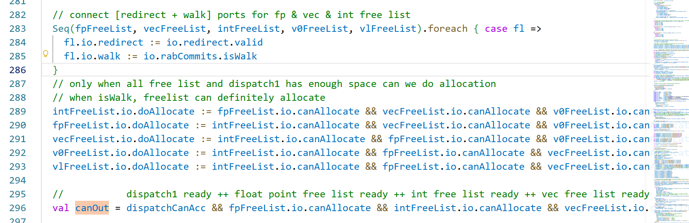

2. **源寄存器读 RAT**， 将逻辑源寄存器转换为物理源寄存器，支持同周期旁路优化  ：

```scala
// 读RAT获取物理源寄存器
uops(i).psrc(0) := Mux1H(uops(i).srcType(0)(2, 0), Seq(intReadPortsData(i)(0), fpReadPortsData(i)(0), vecReadPortsData(i)(0)))
// 同周期旁路（解决RAW冒险）
io.out(i).bits.psrc(0) := io.out.take(i).map(_.bits.pdest).zip(bypassCond(0)(i-1).asBools).foldLeft(uops(i).psrc(0)) {
  (z, next) => Mux(next._2, next._1, z)
}
```

3. **物理寄存器分配**

```scala
// 判断是否需要分配
needIntDest(i) := io.in(i).valid && needDestReg(Reg_I, io.in(i).bits)
// Move指令消除
intFreeList.io.allocateReq(i) := needIntDest(i) && !isMove(i)
io.out(i).bits.pdest := Mux(isMove(i), io.out(i).bits.psrc(0), uops(i).pdest)
// 分配物理寄存器
uops(i).pdest := MuxCase(0.U, Seq(
  needIntDest(i)    ->  intFreeList.io.allocatePhyReg(i),
  needFpDest(i)     ->  fpFreeList.io.allocatePhyReg(i),
  needVecDest(i)    ->  vecFreeList.io.allocatePhyReg(i),
  needV0Dest(i)     ->  v0FreeList.io.allocatePhyReg(i),
))
```

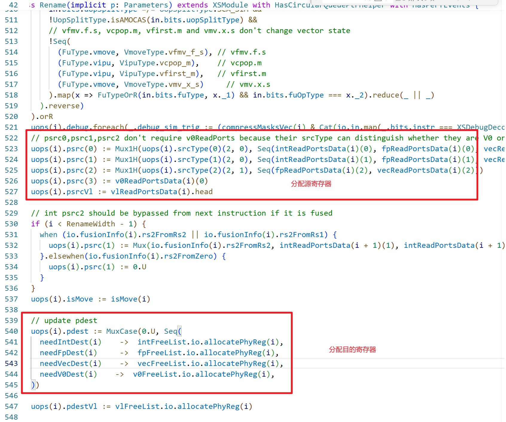

4. **分配 ROB 索引**， 为指令分配唯一 robIdx（终身标识）

```scala
val robIdxHead = RegInit(0.U.asTypeOf(new RobPtr))
val robIdxHeadNext = Mux(io.redirect.valid, io.redirect.bits.robIdx, Mux(canOut, robIdxHead + validCount, robIdxHead))
robIdxHead := robIdxHeadNext
uops(i).robIdx := robIdxHead + PopCount(...)
```

5. \*\* ****<font style="color:rgb(0, 0, 0);background-color:rgba(0, 0, 0, 0);">推测性更新 RAT</font>****：\*\*更新逻辑目的寄存器的物理映射（分支失败时可回滚）

```scala
intSpecWen(i) := needIntDest(i) && intFreeList.io.canAllocate && intFreeList.io.doAllocate && !io.rabCommits.isWalk && !io.redirect.valid
intRenamePorts(i).wen  := intSpecWen(i)
intRenamePorts(i).addr := inVec(i).ldest(log2Ceil(IntLogicRegs) - 1, 0)
intRenamePorts(i).data := io.out(i).bits.pdest
```

6. \*\*<font style="color:rgb(0, 0, 0);background-color:rgba(0, 0, 0, 0);">输出到 Dispatch</font>\*\*\*\*：  \*\*

```scala
io.out(i).valid := io.in(i).valid && intFreeList.io.canAllocate && fpFreeList.io.canAllocate && ... && !io.rabCommits.isWalk
io.out(i).bits := uops(i)
```

## issue

### 主要功能

<font style="color:rgb(0, 0, 0);background-color:rgba(0, 0, 0, 0);">IssueQueue（发射队列）是香山流水线中唯一「顺序进、乱序出」的模块，核心通过</font><code><font style="color:rgb(0, 0, 0);background-color:rgba(0, 0, 0, 0);">valid/ready</font></code><font style="color:rgb(0, 0, 0);background-color:rgba(0, 0, 0, 0);">握手信号管理指令入队 / 出队：</font>

* **<font style="color:rgb(0, 0, 0);background-color:rgba(0, 0, 0, 0);">入队（enq）</font>**<font style="color:rgb(0, 0, 0);background-color:rgba(0, 0, 0, 0);">：接收 Dispatch 阶段的指令，按序存入发射队列；</font>
* **<font style="color:rgb(0, 0, 0);background-color:rgba(0, 0, 0, 0);">出队（deq）</font>**<font style="color:rgb(0, 0, 0);background-color:rgba(0, 0, 0, 0);">：指令满足执行条件（操作数就绪、功能单元空闲）时，乱序发射到 Load 执行单元（LSU）。</font>

### 主要连接逻辑

```scala
// 发射队列入队：Dispatch → IssueQueue
issueQueue.io.enq(i).valid := dispatchOut(i).valid
issueQueue.io.enq(i).bits := dispatchOut(i).bits
dispatchOut(i).ready := issueQueue.io.enq(i).ready

// 发射队列出队：IssueQueue → LSU
lsu.io.in(i).valid := issueQueue.io.deq(i).valid
lsu.io.in(i).bits := issueQueue.io.deq(i).bits
issueQueue.io.deq(i).ready := lsu.io.in(i).ready
```

## exu

可以在 ctrlblock 里面查看 load 的信号处理过程，

```scala
// 包路径：香山后端 控制块模块（负责访存指令的状态控制）
package xiangshan.backend.ctrlblock

import org.chipsalliance.cde.config.Parameters
import chisel3._
import chisel3.util._
import xiangshan.XSBundle
import xiangshan.mem.LoadReplayCauses // Load指令重放原因的枚举定义

/**********************************************************************
 * DebugMdpInfo
 * 功能：MDP（内存依赖预测）相关调试信息
 * 作用：记录Load/Store是否需要等待前序Store、事务ID等
 * 仅用于调试、性能统计、TopDown分析
 **********************************************************************/
class DebugMdpInfo(implicit p: Parameters) extends XSBundle{
  val ssid = UInt(SSIDWidth.W)            // 共享段ID，用于内存事务标识
  val waitAllStore = Bool()               // 是否需要等待所有前面的Store完成
}

/**********************************************************************
 * DebugLsInfo
 * 【核心】Load/Store 指令在流水线中每一拍的状态调试信息
 * 你波形里看到的所有 LSU 状态信号，90% 来自这个 Bundle
 * 分为 3 个阶段：S1（地址计算）、S2（TLB/DCache访问）、S3（结果/重放）
 **********************************************************************/
class DebugLsInfo(implicit p: Parameters) extends XSBundle{

  // ===================== S1 阶段：地址计算、TLB 访问 =====================
  val s1_isTlbFirstMiss = Bool()          // S1阶段：是否是【第一次TLB缺失】（VA→PA翻译失败）
  val s1_isLoadToLoadForward = Bool()     // S1阶段：是否发生Load→Load数据前递（从前面的Load取数）

  // ===================== S2 阶段：DCache 访问、访存判断 =====================
  val s2_isBankConflict = Bool()          // S2阶段：是否发生DCache银行冲突（多访问同时打同一家）
  val s2_isDcacheFirstMiss = Bool()       // S2阶段：是否是【第一次DCache缺失】（没读到缓存）
  val s2_isForwardFail = Bool()           // S2阶段：数据前递失败（比如Store还没写）

  // ===================== S3 阶段：重放、异常、结果回写 =====================
  val s3_isReplayFast = Bool()            // S3：需要快速重放（1周期后重试）
  val s3_isReplaySlow = Bool()            // S3：需要慢速重放（等Cache填充/TLB刷新）
  val s3_isReplayRS = Bool()              // S3：需要把指令放回发射队列（IssueQueue）重试
  val s3_isReplay = Bool()                // S3：总重放信号（只要重放就为1）

  val replayCause = Vec(LoadReplayCauses.allCauses, Bool()) // 重放原因（TLB miss、DCache miss、冲突等）
  val replayCnt = UInt(XLEN.W)           // 这条Load指令重放了多少次（调试用）

  // ===================== 下面是 3 个赋值函数：流水线逐级打拍传递状态 =====================
  // 作用：把前一级（S1）的状态，赋值到当前级的DebugLsInfo
  def s1SignalEnable(ena: DebugLsInfo) = {
    when(ena.s1_isTlbFirstMiss)       { s1_isTlbFirstMiss       := true.B }
    when(ena.s1_isLoadToLoadForward) { s1_isLoadToLoadForward   := true.B }
  }

  // 把S2的状态赋值到当前级
  def s2SignalEnable(ena: DebugLsInfo) = {
    when(ena.s2_isBankConflict)       { s2_isBankConflict       := true.B }
    when(ena.s2_isDcacheFirstMiss)    { s2_isDcacheFirstMiss    := true.B }
    when(ena.s2_isForwardFail)       { s2_isForwardFail        := true.B }
  }

  // 把S3的状态赋值到当前级，并累计重放次数、合并重放原因
  def s3SignalEnable(ena: DebugLsInfo) = {
    when(ena.s3_isReplayFast)         { s3_isReplayFast         := true.B }
    when(ena.s3_isReplaySlow)         { s3_isReplaySlow         := true.B }
    when(ena.s3_isReplayRS)           { s3_isReplayRS           := true.B }
    when(ena.s3_isReplay) {
      s3_isReplay := true.B                // 标记重放
      replayCnt   := replayCnt + 1.U       // 重放次数 +1

      // 重放原因按位或：只要出现过任意原因，就一直记录
      when((ena.replayCause.asUInt ^ replayCause.asUInt).orR) {
        replayCause := ena.replayCause.zipWithIndex.map{ case (x, i) => x | replayCause(i) }
      }
    }
  }
}

/**********************************************************************
 * DebugLsInfo 伴生对象
 * 功能：提供初始化函数，让DebugLsInfo所有信号默认=0
 * 作用：防止复位时出现X态，保证流水线初始状态干净
 **********************************************************************/
object DebugLsInfo {
  def init(implicit p: Parameters): DebugLsInfo = {
    val lsInfo = Wire(new DebugLsInfo)
    lsInfo.s1_isTlbFirstMiss       := false.B
    lsInfo.s1_isLoadToLoadForward  := false.B
    lsInfo.s2_isBankConflict       := false.B
    lsInfo.s2_isDcacheFirstMiss    := false.B
    lsInfo.s2_isForwardFail        := false.B
    lsInfo.s3_isReplayFast         := false.B
    lsInfo.s3_isReplaySlow         := false.B
    lsInfo.s3_isReplayRS           := false.B
    lsInfo.s3_isReplay             := false.B
    lsInfo.replayCnt               := 0.U
    lsInfo.replayCause             := Seq.fill(LoadReplayCauses.allCauses)(false.B)
    lsInfo
  }
}

/**********************************************************************
 * DebugLsInfoBundle
 * 功能：在DebugLsInfo基础上，增加 ROB索引 跟踪
 * 作用：把Load指令的状态 和 ROB条目绑定，确保能精确定位是哪条指令
 **********************************************************************/
class DebugLsInfoBundle(implicit p: Parameters) extends DebugLsInfo {
  val s1_robIdx = UInt(log2Ceil(RobSize).W)   // S1阶段这条指令的ROB号
  val s2_robIdx = UInt(log2Ceil(RobSize).W)   // S2阶段这条指令的ROB号
  val s3_robIdx = UInt(log2Ceil(RobSize).W)   // S3阶段这条指令的ROB号
}

/**********************************************************************
 * DebugLSIO
 * 功能：模块端口定义，把多个LSU单元的DebugLsInfo输出
 * LduCnt：Load单元数量
 * HyuCnt：访存混合单元数量
 * StaCnt：Store单元数量
 **********************************************************************/
class DebugLSIO(implicit p: Parameters) extends XSBundle {
  val debugLsInfo = Vec(
    backendParams.LduCnt + backendParams.HyuCnt + backendParams.StaCnt + backendParams.HyuCnt,
    Output(new DebugLsInfoBundle)
  )
}

/**********************************************************************
 * LsTopdownInfo
 * 功能：用于TopDown性能分析的访存信息
 * 记录：虚拟地址、物理地址、Cache缺失
 * 作用：芯片性能分析、流水线瓶颈定位
 **********************************************************************/
class LsTopdownInfo(implicit p: Parameters) extends XSBundle {
  val s1 = new Bundle {
    val robIdx = UInt(log2Ceil(RobSize).W)       // 指令ROB号
    val vaddr_valid = Bool()                     // 虚拟地址有效
    val vaddr_bits = UInt(VAddrBits.W)           // 虚拟地址 VA
  }

  val s2 = new Bundle {
    val robIdx = UInt(log2Ceil(RobSize).W)       // 指令ROB号
    val paddr_valid = Bool()                     // 物理地址有效
    val paddr_bits = UInt(PAddrBits.W)           // 物理地址 PA
    val cache_miss_en = Bool()                   // Cache缺失使能
    val first_real_miss = Bool()                 // 是否是真实的第一次缺失
  }

  // 赋值函数：逐级传递状态
  def s1SignalEnable(ena: LsTopdownInfo) = {
    when(ena.s1.vaddr_valid) {
      s1.vaddr_valid := true.B
      s1.vaddr_bits  := ena.s1.vaddr_bits
    }
  }

  def s2SignalEnable(ena: LsTopdownInfo) = {
    when(ena.s2.paddr_valid) {
      s2.paddr_valid := true.B
      s2.paddr_bits  := ena.s2.paddr_bits
    }
    when(ena.s2.cache_miss_en) {
      s2.first_real_miss := ena.s2.first_real_miss
    }
  }
}

object LsTopdownInfo {
  def init(implicit p: Parameters): LsTopdownInfo = 0.U.asTypeOf(new LsTopdownInfo)
}
```

Load 指令在执行单元分为\*\*<font style="color:rgb(0, 0, 0);background-color:rgba(0, 0, 0, 0);">S1（地址计算 + TLB 访问）、S2（DCache 访问 + 数据前递）、S3（结果返回 / 重放）</font>\*\* 三阶段，核心通过状态机管理流程。

```scala
S1 ：地址计算 + TLB 访问
S2 ：DCache 访问 + 数据前递
S3 ：结果返回 / 重放
```

主要信号

#### <font style="color:rgb(0, 0, 0);background-color:rgba(0, 0, 0, 0);">① S1 阶段（第一拍）</font>

<font style="color:rgb(0, 0, 0);background-color:rgba(0, 0, 0, 0);">看这 2 个信号：</font>

* <code><font style="color:rgb(0, 0, 0);background-color:rgba(0, 0, 0, 0);">s1_vaddr_bits</font></code><font style="color:rgb(0, 0, 0);background-color:rgba(0, 0, 0, 0);"> → Load 的</font>**<font style="color:rgb(0, 0, 0);background-color:rgba(0, 0, 0, 0);">虚拟地址</font>**
* <code><font style="color:rgb(0, 0, 0);background-color:rgba(0, 0, 0, 0);">s1_isTlbFirstMiss</font></code><font style="color:rgb(0, 0, 0);background-color:rgba(0, 0, 0, 0);"> → </font>**<font style="color:rgb(0, 0, 0);background-color:rgba(0, 0, 0, 0);">TLB 是否缺失</font>**
  * <font style="color:rgb(0, 0, 0);background-color:rgba(0, 0, 0, 0);">= 0 → 翻译成功，得到 PA</font>
  * <font style="color:rgb(0, 0, 0);background-color:rgba(0, 0, 0, 0);">= 1 → 要走页表 Walk</font>

#### <font style="color:rgb(0, 0, 0);background-color:rgba(0, 0, 0, 0);">② S2 阶段（第二拍）</font>

<font style="color:rgb(0, 0, 0);background-color:rgba(0, 0, 0, 0);">看这 3 个信号：</font>

* <code><font style="color:rgb(0, 0, 0);background-color:rgba(0, 0, 0, 0);">s2_paddr_bits</font></code><font style="color:rgb(0, 0, 0);background-color:rgba(0, 0, 0, 0);"> → </font>**<font style="color:rgb(0, 0, 0);background-color:rgba(0, 0, 0, 0);">物理地址</font>**
* <code><font style="color:rgb(0, 0, 0);background-color:rgba(0, 0, 0, 0);">s2_isDcacheFirstMiss</font></code><font style="color:rgb(0, 0, 0);background-color:rgba(0, 0, 0, 0);"> → </font>**<font style="color:rgb(0, 0, 0);background-color:rgba(0, 0, 0, 0);">DCache 是否缺失</font>**
* <code><font style="color:rgb(0, 0, 0);background-color:rgba(0, 0, 0, 0);">s2_isBankConflict</font></code><font style="color:rgb(0, 0, 0);background-color:rgba(0, 0, 0, 0);"> → 是否发生缓存体冲突</font>

#### <font style="color:rgb(0, 0, 0);background-color:rgba(0, 0, 0, 0);">③ S3 阶段（第三拍）</font>

<font style="color:rgb(0, 0, 0);background-color:rgba(0, 0, 0, 0);">看这 4 个信号：</font>

* <code><font style="color:rgb(0, 0, 0);background-color:rgba(0, 0, 0, 0);">s3_isReplay</font></code><font style="color:rgb(0, 0, 0);background-color:rgba(0, 0, 0, 0);"> → </font>**<font style="color:rgb(0, 0, 0);background-color:rgba(0, 0, 0, 0);">是否重放</font>**
* <code><font style="color:rgb(0, 0, 0);background-color:rgba(0, 0, 0, 0);">s3_isReplayFast</font></code><font style="color:rgb(0, 0, 0);background-color:rgba(0, 0, 0, 0);"> / </font><code><font style="color:rgb(0, 0, 0);background-color:rgba(0, 0, 0, 0);">s3_isReplaySlow</font></code><font style="color:rgb(0, 0, 0);background-color:rgba(0, 0, 0, 0);"> → 重放类型</font>
* <code><font style="color:rgb(0, 0, 0);background-color:rgba(0, 0, 0, 0);">replayCause</font></code><font style="color:rgb(0, 0, 0);background-color:rgba(0, 0, 0, 0);"> → </font>**<font style="color:rgb(0, 0, 0);background-color:rgba(0, 0, 0, 0);">为什么重放</font>**
* <code><font style="color:rgb(0, 0, 0);background-color:rgba(0, 0, 0, 0);">replayCnt</font></code><font style="color:rgb(0, 0, 0);background-color:rgba(0, 0, 0, 0);"> → 重放了几次</font>



## 写回与提交（Write Back & Commit）

### <font style="color:rgb(0, 0, 0);background-color:rgba(0, 0, 0, 0);">写回（Write Back）</font>

<font style="color:rgb(0, 0, 0);background-color:rgba(0, 0, 0, 0);">只有执行单元输出握手成功的指令，其数据才能写回 ROB：</font>

1. <font style="color:rgb(0, 0, 0);background-color:rgba(0, 0, 0, 0);">LSU 执行完成后，将加载的数据和状态（无异常 / 重放）输出到 CtrlBlock；</font>
2. <font style="color:rgb(0, 0, 0);background-color:rgba(0, 0, 0, 0);">CtrlBlock 打一拍缓存，判断是否触发异常 / 重放 / 刷新流水线；</font>
3. <font style="color:rgb(0, 0, 0);background-color:rgba(0, 0, 0, 0);">无异常时，将数据写入 ROB 对应条目，更新物理寄存器值。</font>

### <font style="color:rgb(0, 0, 0);background-color:rgba(0, 0, 0, 0);">提交（Commit）</font>

1. <font style="color:rgb(0, 0, 0);background-color:rgba(0, 0, 0, 0);">ROB 按序提交指令，确认 Load 指令完成后，更新「提交态 RAT 表」（逻辑寄存器→物理寄存器的最终映射）；</font>
2. <font style="color:rgb(0, 0, 0);background-color:rgba(0, 0, 0, 0);">释放旧物理寄存器到 FreeList（若当前指令覆盖了逻辑寄存器的旧映射）；</font>
3. <font style="color:rgb(0, 0, 0);background-color:rgba(0, 0, 0, 0);">指令提交完成，流水线状态更新为「已提交」。</font>

# 波形

## 指令定位

<font style="color:rgb(0, 0, 0);background-color:rgba(0, 0, 0, 0);">通过 PC 值定位目标 Load 指令（</font><code><font style="color:rgb(0, 0, 0);background-color:rgba(0, 0, 0, 0);">8000025c: 001f2303 lw t1,1(t5)</font></code><font style="color:rgb(0, 0, 0);background-color:rgba(0, 0, 0, 0);">），核心步骤：</font>

1. <font style="color:rgb(0, 0, 0);background-color:rgba(0, 0, 0, 0);">提取 Frontend 输出到后端的 PC 值列表；</font>
2. <font style="color:rgb(0, 0, 0);background-color:rgba(0, 0, 0, 0);">通过波形工具的表达式筛选触发值（如</font><code><font style="color:rgb(0, 0, 0);background-color:rgba(0, 0, 0, 0);">pc == 8000025c</font></code><font style="color:rgb(0, 0, 0);background-color:rgba(0, 0, 0, 0);">）；</font>
3. <font style="color:rgb(0, 0, 0);background-color:rgba(0, 0, 0, 0);">确认指令在流水线中的真实流转位置（排除分支预测错误的冗余 PC）。</font>

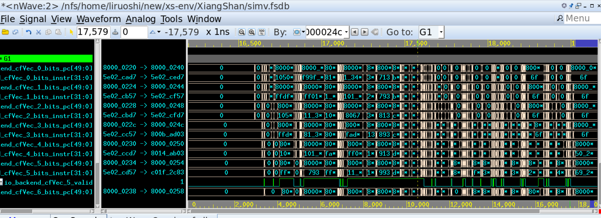

:::color4
这里有很多组 PC 值，也出现了很多次这个指令，什么时候才是正确的呢？

:::

使用逻辑运算表达式来找到相应的触发值

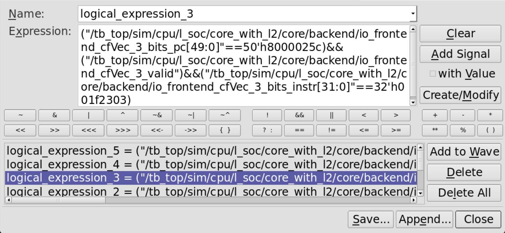

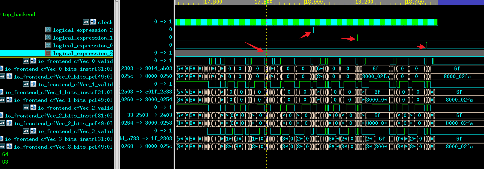

这里选择第一个位置，也就是 3

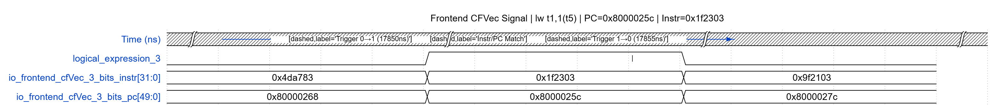

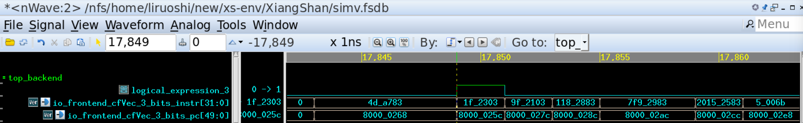

## decode

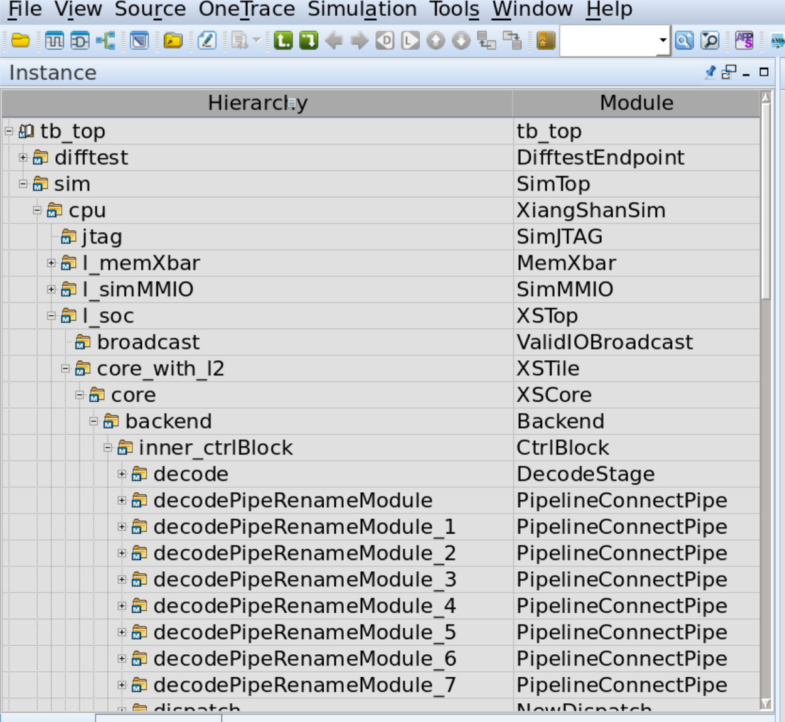

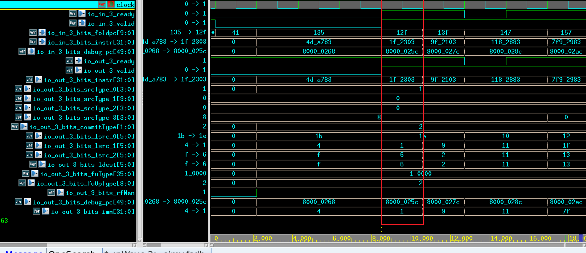

| 信号名 | 波形值 | 指令语义对应 |
| --- | --- | --- |
| `io_out_3_bits_lsrc_0[5:0]` | `0x1E`<br/>（30） | 源寄存器`rs1=t5(x30)`<br/>，逻辑号 30 |
| `io_out_3_bits_ldest[5:0]` | `0x6`<br/>（6） | 目的寄存器`rd=t1(x6)`<br/>，逻辑号 6 |
| `io_out_3_bits_imm[31:0]` | `1` | 指令偏移量`1` |
| `io_out_3_bits_fuType[35:0]` | `0x10000` | 功能单元`LSU`<br/>（Load/Store Unit） |
| `io_out_3_bits_fuOpType[8:0]` | `2` | 操作类型`Load`<br/>（LW） |
| `io_out_3_bits_rfWen` | `1` | 写回使能（Load 指令需写回`t1`<br/>） |
| `io_out_3_bits_srcType_0[3:0]` | `1` | 源操作数 0 类型为「寄存器」（对应`t5`<br/>） |
| `io_out_3_bits_commitType[1:0]` | `2` | 普通指令（非分支 / 异常）提交类型 |

## rename

:::success

1. 初始的时候 RAT 表的内容
2. RAR RAW 等不同的寄存器依赖的情况对 RAT 表的读取

:::

### 初始状态：RAT表里面保存的是什么？

RAT全称**Register Alias Table（寄存器别名表）**，是重命名的核心硬件，源码中由`RenameTableWrapper`模块实现，分为**整数(Int)、浮点(Fp)、向量(Vec)、V0、Vl** 5类独立的RAT，分别对应不同类型的寄存器。

#### 1. 复位/初始状态的核心规则（一一映射）

复位（reset）或流水线全冲刷后，RAT表会进入**架构状态对齐的初始模式**：**逻辑寄存器号 = 物理寄存器号**，实现架构寄存器与物理寄存器的一一绑定。

| 寄存器类型 | 逻辑寄存器范围 | 初始映射规则 | 源码对应 |
| --- | --- | --- | --- |
| 整数寄存器 | x0~x31（32个） | xN → 物理寄存器pN | `IntLogicRegs=32`，`IntPhyRegs=64` |
| 浮点寄存器 | f0~f31（32个） | fN → 物理寄存器fpN | `FpLogicRegs=32`，`FpPhyRegs=64` |
| 向量寄存器 | v0~v31（31个） | vN → 物理寄存器vpN | `VecLogicRegs=31`，`VfPhyRegs=64` |
| V0寄存器 | 单寄存器 | 固定映射到专属物理寄存器 | `V0LogicRegs=1` |
| Vl寄存器 | 单寄存器 | 固定映射到专属物理寄存器 | `VlLogicRegs=1` |

#### 2. 关键特殊处理

1. **零寄存器x0硬锁定**：x0是RISC-V架构的零寄存器，硬连线为0，不允许写回。源码中通过断言强制约束：

```scala
io.out.map { case x =>
  when(x.valid && x.bits.rfWen) {
    assert(x.bits.ldest =/= 0.U, "rfWen cannot be 1 when Int regfile ldest is 0")
  }
}
```

因此RAT表中x0的映射永远固定为p0，不会被任何重命名操作修改。

2. **FreeList与RAT初始状态严格联动**\
   物理寄存器分为「架构绑定区」和「空闲重命名区」，以整数寄存器为例：
   * 架构绑定区：p0<sub>p31，复位时被x0</sub>x31一一映射占用，永远不会进入空闲列表
   * 空闲重命名区：p32~p63，复位时全部进入`intFreeList`的空闲FIFO队列，等待重命名分配\
     源码中`intFreeList`（`MEFreeList`）、`fpFreeList`等模块，复位时会自动初始化空闲队列，把所有非架构绑定的物理寄存器加入队列。
3. **分支冲刷的状态恢复**\
   当`io.redirect.valid`（分支预测失败/流水线冲刷）有效时，RAT会通过**快照（Snapshot）机制**快速恢复到分支前的正确状态，极端情况会直接恢复到初始的一一映射状态，对应源码：

```scala
rat.io.redirect := io.redirect.valid
```

***

### 完整重命名分配流程（源码级逐步骤拆解）

整个重命名流程严格遵循\*\*「前置检查→源寄存器读RAT→目的寄存器分配→RAT推测更新→输出到Dispatch」\*\* 的顺序，全程基于`valid-ready`握手协议，支持推测执行和分支回滚。

我们以你调试的`lw t1,1(t5)`指令为例（逻辑源寄存器`rs1=x30(t5)`、逻辑目的寄存器`rd=x6(t1)`、`rfWen=1`需要写回），逐步骤对应源码讲解：

#### 步骤1：前置条件检查（流水线能不能执行重命名？）

重命名的前提是**所有资源就绪、无流水线冲刷**，源码中通过两个核心信号控制：

1. `canOut`**：流水线就绪总开关**

```scala
val canOut = dispatchCanAcc && fpFreeList.io.canAllocate && intFreeList.io.canAllocate && vecFreeList.io.canAllocate && v0FreeList.io.canAllocate && vlFreeList.io.canAllocate && !io.rabCommits.isWalk
```

必须同时满足：

```
- 下游Dispatch阶段就绪（`dispatchCanAcc=io.out.head.ready=1`）
- 所有类型的FreeList都有空闲物理寄存器可分配（`canAllocate=1`）
- 无ROB回滚操作（`!isWalk`）
```

2\. `doAllocate`**：FreeList分配使能**

```scala
intFreeList.io.doAllocate := ... && dispatchCanAcc || io.rabCommits.isWalk
```

只有`canOut`为真，才会给所有FreeList下发分配使能，否则流水线阻塞，`io.in(i).ready=0`，拒绝接收译码阶段的新指令。

#### 步骤2：源寄存器读RAT（逻辑源→物理源转换）

重命名的第一步，是**把指令的逻辑源寄存器号(lsrc)，通过RAT转换为物理源寄存器号(psrc)**，这是纯组合逻辑，0周期延迟。

1. **基础读RAT操作**\
   源码中通过`rat.io.intReadPorts`等读端口，同步读取所有源寄存器的物理映射：

```scala
uops(i).psrc(0) := Mux1H(uops(i).srcType(0)(2, 0), Seq(intReadPortsData(i)(0), fpReadPortsData(i)(0), vecReadPortsData(i)(0)))
uops(i).psrc(1) := Mux1H(uops(i).srcType(1)(2, 0), Seq(intReadPortsData(i)(1), fpReadPortsData(i)(1), vecReadPortsData(i)(1)))
```

以`lw`指令为例：

```
- 逻辑源寄存器`lsrc(0)=x30(t5)`，`srcType=SrcType.xp`（整数寄存器）
- 读整数RAT，获取x30对应的物理寄存器号（比如p30），赋值给`psrc(0)`
```

2\. **同周期旁路（Bypass）优化**\
为了解决同周期指令的RAW（写后读）冒险，源码实现了同周期前递逻辑：如果同周期前面的指令（i-1、i-2...）写了同一个逻辑寄存器，会直接把前面指令刚分配的`pdest`旁路给当前指令的`psrc`，无需等待RAT更新：

```scala
io.out(i).bits.psrc(0) := io.out.take(i).map(_.bits.pdest).zip(bypassCond(0)(i-1).asBools).foldLeft(uops(i).psrc(0)) {
  (z, next) => Mux(next._2, next._1, z)
}
```

#### 步骤3：目的寄存器物理寄存器分配（重命名核心）

对于需要写回目的寄存器的指令（`rfWen/fpWen/vecWen=1`），会从对应FreeList分配一个空闲物理寄存器，作为重命名后的目的物理寄存器`pdest`。

1. **判断是否需要分配**\
   源码通过`needDestReg`函数判断，只有需要写回的指令才会分配：

```scala
needIntDest(i) := io.in(i).valid && needDestReg(Reg_I, io.in(i).bits)
```

`lw`指令`rfWen=1`，因此`needIntDest=1`，需要分配整数物理寄存器。

2. **特殊规则：Move指令消除**\
   如果是可消除的move指令（`isMove=1`），不会分配新的物理寄存器，直接复用源寄存器的物理号，避免不必要的寄存器占用：

```scala
intFreeList.io.allocateReq(i) := needIntDest(i) && !isMove(i)
io.out(i).bits.pdest := Mux(isMove(i), io.out(i).bits.psrc(0), uops(i).pdest)
```

3. **正式分配物理寄存器**\
   给对应FreeList发送分配请求，FreeList从空闲FIFO队列头部取出一个空闲物理寄存器，通过`allocatePhyReg`端口返回：

```scala
uops(i).pdest := MuxCase(0.U, Seq(
  needIntDest(i)    ->  intFreeList.io.allocatePhyReg(i),
  needFpDest(i)     ->  fpFreeList.io.allocatePhyReg(i),
  needVecDest(i)    ->  vecFreeList.io.allocatePhyReg(i),
  needV0Dest(i)     ->  v0FreeList.io.allocatePhyReg(i),
))
```

以`lw`指令为例：`intFreeList`从空闲队列取出一个空闲物理寄存器（比如p35），赋值给`pdest`，作为x6(t1)的重命名物理寄存器。

#### 步骤4：分配唯一ROB索引（robIdx）

重命名阶段会给每条指令分配**唯一的robIdx（ROB指针）**，作为指令的「终身身份证」，全程伴随指令从Dispatch到Commit，不会改变，也是你波形调试的核心锚点。

```scala
val robIdxHead = RegInit(0.U.asTypeOf(new RobPtr))
val robIdxHeadNext = Mux(io.redirect.valid, io.redirect.bits.robIdx, Mux(canOut, robIdxHead + validCount, robIdxHead))
robIdxHead := robIdxHeadNext
uops(i).robIdx := robIdxHead + PopCount(...)
```

* robIdx严格按程序顺序分配，保证ROB按序提交
* 分支预测失败时，robIdx会回滚到分支指令对应的位置，抛弃所有错误路径的指令

#### 步骤5：推测性更新RAT表

分配完`pdest`后，会**推测性更新RAT表**，把逻辑目的寄存器的映射，更新为刚分配的`pdest`，让后续指令能读到最新的映射关系。

```scala
// 写使能：仅当分配成功、无冲刷、无回滚时有效
intSpecWen(i) := needIntDest(i) && intFreeList.io.canAllocate && intFreeList.io.doAllocate && !io.rabCommits.isWalk && !io.redirect.valid
// RAT写端口配置
intRenamePorts(i).wen  := intSpecWen(i)
intRenamePorts(i).addr := inVec(i).ldest(log2Ceil(IntLogicRegs) - 1, 0) // 逻辑目的寄存器号
intRenamePorts(i).data := io.out(i).bits.pdest // 新分配的物理寄存器号
```

* 这里的更新是**推测性的**：如果后续发生分支预测失败，会通过`redirect`和快照回滚这个更新，保证架构状态的正确性
* 只有当指令最终按序提交时，这个映射才会成为永久的架构状态
* 以`lw`指令为例：逻辑寄存器x6的映射，从原来的p6更新为刚分配的p35，后续指令读x6时，会直接拿到p35。

#### 步骤6：重命名结果输出到Dispatch阶段

所有重命名操作完成后，把包含`psrc`、`pdest`、`robIdx`、`fuType`等完整信息的uop，通过`io.out`端口输出到下游Dispatch阶段：

```scala
io.out(i).valid := io.in(i).valid && intFreeList.io.canAllocate && fpFreeList.io.canAllocate && ... && !io.rabCommits.isWalk
io.out(i).bits := uops(i)
```

* 只有所有资源就绪、重命名完成，`io.out.valid`才会拉高
* 下游Dispatch通过`valid-ready`握手接收指令，进入后续的发射队列、执行阶段

***

### 波形图

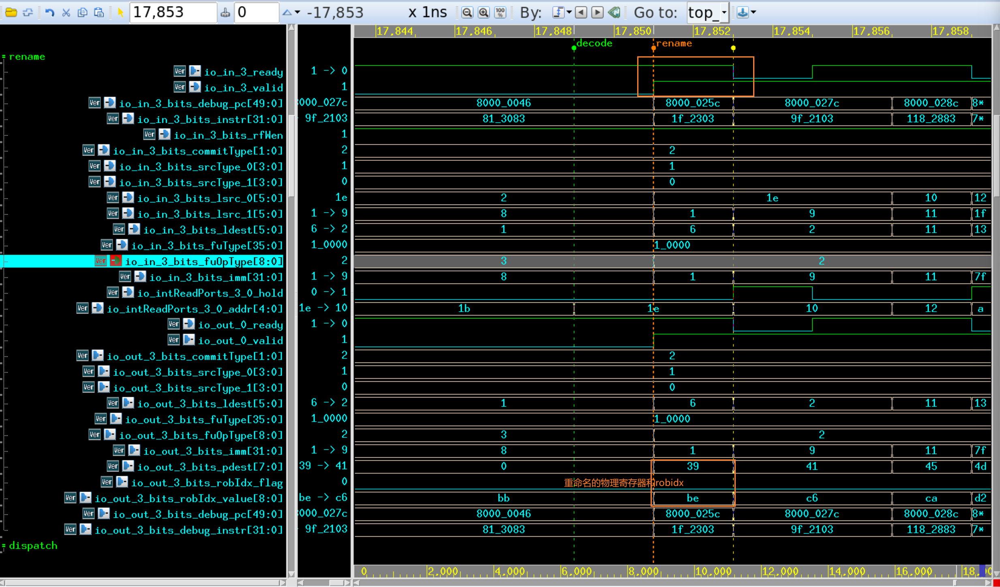

相较于译码阶段延迟了一个周期，在信号实现正确握手之后，找到对应的 pc 和指令值，和前面译码的通道序号是一样的，都是在 3 号通道

可以看到这里输入信号和 前面译码输出是一样的，经过重命名之后输出相应的对用的物理寄存器的 地址和 robidx 的值

## dispatch

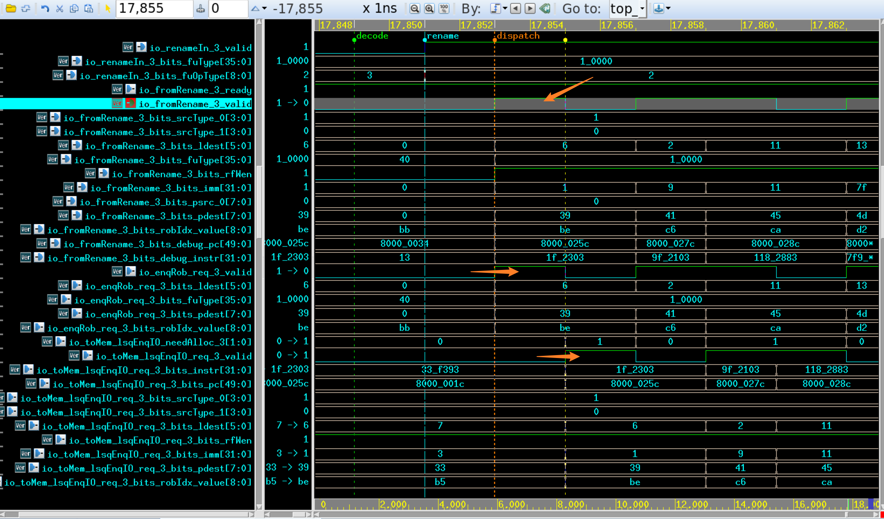

这里主要的控制信号有两个，首先是和 rename 模块之间的握手信号，在 17853 时刻 vaild 信号有效的时候可以实现正常的数据输入，整个过程包括：

* <font style="color:rgb(0, 0, 0);background-color:rgba(0, 0, 0, 0);">接收重命名完成的指令，完成前端→后端的握手；</font>
* <font style="color:rgb(0, 0, 0);background-color:rgba(0, 0, 0, 0);">按指令功能类型（Load 访存），双分发到「整数执行域地址计算发射队列」+「访存 LSQ 预分配」；</font>
* <font style="color:rgb(0, 0, 0);background-color:rgba(0, 0, 0, 0);">完成 ROB 重排序缓存的入队申请，为后续按序提交做准备。</font>

**输入信号**

指令完成重命名，完成架构寄存器→物理寄存器的映射，分配终身唯一的 9-bit <code><font style="color:rgb(0, 0, 0);background-color:rgba(0, 0, 0, 0);">robIdx=0xBE</font></code>、8-bit 目的物理寄存器<code><font style="color:rgb(0, 0, 0);background-color:rgba(0, 0, 0, 0);">pdest=0x39</font></code>，同时标记指令功能类型为 LDU（Load 访存）。

| 信号名称 | 位宽 | 波形关键值 | 核心作用 | 验证结果 |
| --- | --- | --- | --- | --- |
| `io_renameIn_3_valid` | 1bit | 1（高电平有效） | 重命名阶段给 Dispatch 的指令有效标记，代表第 3 号槽位的指令已完成重命名，可进入分发 | ✅ 有效，指令合法 |
| `io_fromRename_3_valid` | 1bit | 1（高电平有效） | Dispatch 给重命名阶段的输出有效标记，代表 Dispatch 已接收指令，准备分发 | ✅ 握手有效，前端→后端指令传递完成 |
| `io_fromRename_3_ready` | 1bit | 1（高电平有效） | 重命名阶段给 Dispatch 的就绪标记，代表重命名模块可接收下一条指令 | ✅ 握手完成，无流水线阻塞 |
| `io_fromRename_3_bits_robIdx_value[8:0]` | 9bit | `0xBE` | 重命名阶段给指令分配的**终身唯一 ROB ID**，是指令全生命周期的唯一锚点 | ✅ 和后续全流程的 robIdx 完全匹配 |
| `io_fromRename_3_bits_debug_pc[49:0]` | 50bit | `8000_025c` | 指令的程序计数器 PC，对应汇编代码里的指令地址 | ✅ 和反汇编代码完全匹配 |
| `io_fromRename_3_bits_debug_instr[31:0]` | 32bit | `0x1f2303` | 指令的机器码，对应`lw t1,1(t5)` | ✅ 和反汇编代码完全匹配，编码合法 |
| `io_fromRename_3_bits_pdest[7:0]` | 8bit | `0x39` | 重命名阶段分配的**目的物理寄存器号**，lw 指令要把读回的数据写入这个寄存器 | ✅ 和后续写回、提交阶段的 pdest 完全匹配 |
| `io_fromRename_3_bits_imm[31:0]` | 32bit | `0x1` | 指令的立即数偏移量，对应 lw 指令的`1(t5)`<br/>中的偏移 1 | ✅ 和指令语义完全匹配 |
| `io_fromRename_3_bits_fuType[35:0]` | 36bit | Load 类型（`LDU`<br/>） | 指令的功能单元类型，标记这是一条 Load 访存指令，Dispatch 会按这个类型分发 | ✅ 类型正确，触发访存指令双分发逻辑 |
| `io_fromRename_3_bits_rfWen` | 1bit | 1（高电平有效） | 寄存器写使能标记，代表这条指令需要把执行结果写回物理寄存器 | ✅ 符合 lw 指令的语义，Load 指令需要写回目的寄存器 |

**ROB 入队信号**

把指令信息写入 ROB 重排序缓存，ROB 为这条指令分配表项，记录指令状态为「执行中」，等待后续执行完成、按序提交 。

| 信号名称 | 位宽 | 波形关键值 | 核心作用 | 验证结果 |
| --- | --- | --- | --- | --- |
| `io_enqRob_req_3_valid` | 1-bit | 1（高电平有效） | Dispatch 给 ROB 的入队请求有效标记，代表要把这条指令写入 ROB | ✅ 和指令分发同步，入队请求有效 |
| `io_enqRob_req_3_bits_robIdx_value[8:0]` | 9-bit | `0xBE` | 要写入 ROB 的指令的唯一 ID，和重命名阶段分配的 robIdx 完全一致 | ✅ 100% 匹配，ROB 表项分配正确 |
| `io_enqRob_req_3_bits_pdest[7:0]` | 8-bit | `0x39` | 指令的目的物理寄存器号，ROB 会记录这个寄存器的重命名状态 | ✅ 匹配，ROB 状态记录正确 |

**访存模块请求信号**

给访存模块的 LSQ 发送预分配请求，为这条 Load 指令分配 LQ 表项（后续你跟踪的 7-bit <code><font style="color:rgb(0, 0, 0);background-color:rgba(0, 0, 0, 0);">lqIdx=0x18</font></code>），记录访存元信息，等待地址计算完成后回填。

| 信号名称 | 位宽 | 波形关键值 | 核心作用 | 验证结果 |
| --- | --- | --- | --- | --- |
| `io_toMem_lsqEnqIO_needAlloc_3[1:0]` | 2-bit | 1 | 访存队列分配请求标记，代表这条 Load 指令需要预分配一个 Load Queue（LQ）表项 | ✅ 符合 Load 指令需求，触发 LQ 表项分配 |
| `io_toMem_lsqEnqIO_req_3_valid` | 1-bit | 1（高电平有效） | Dispatch 给 LSQ 的入队请求有效标记 | ✅ 和指令分发同步，LSQ 入队请求有效 |
| `io_toMem_lsqEnqIO_req_3_bits_instr[31:0]` | 32-bit | `0x1f2303` | 指令机器码，LSQ 用于解析访存属性 | ✅ 匹配，访存属性解析正确 |
| `io_toMem_lsqEnqIO_req_3_bits_pc[49:0]` | 50-bit | `8000_025c` | 指令 PC，用于异常处理和调试 | ✅ 匹配，调试信息正确 |
| `io_toMem_lsqEnqIO_req_3_bits_robIdx_value[8:0]` | 9-bit | `0xBE` | 指令的唯一 ROB ID，用于绑定 LSQ 表项和 ROB 表项 | ✅ 匹配，LSQ 和 ROB 绑定正确 |
| `io_toMem_lsqEnqIO_req_3_bits_pdest[7:0]` | 8-bit | `0x39` | 目的物理寄存器号，LSQ 用于后续写回寄存器 | ✅ 匹配，写回信息正确 |
| `io_toMem_lsqEnqIO_req_3_bits_imm[31:0]` | 32-bit | `0x1` | 立即数偏移量，用于后续地址计算校验 | ✅ 匹配，偏移量正确 |

## issue queue 计算地址

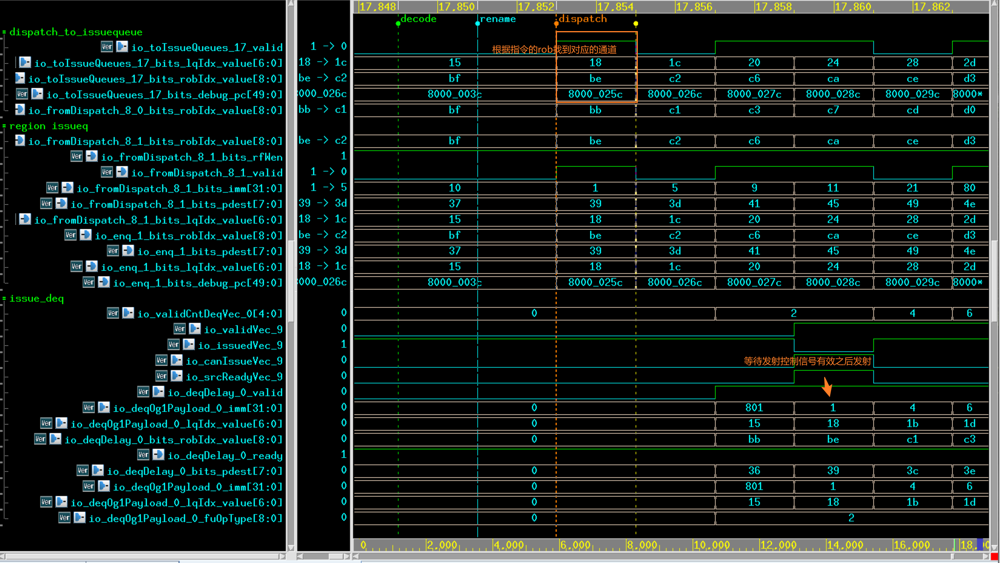

### dispatch 输出

Dispatch 模块完成指令重命名后，根据指令的<code><font style="color:rgb(0, 0, 0);background-color:rgba(0, 0, 0, 0);">fuType=Load</font></code>类型，把指令路由到后端 intRegion 的\*\*<font style="color:rgb(0, 0, 0);background-color:rgba(0, 0, 0, 0);">Load 地址专用 IssueQueue</font>\*\*，完成前端到后端执行单元的最终分发

17.854ns（dispatch 标记点），Dispatch 把重命名完成的 lw 指令，通过全局 17 号专用端口，路由到 intRegion 内的 AGU 地址计算发射队列，完成指令从前端到后端的分发，和之前跟踪的 Dispatch 阶段完全衔接。

| 信号名称 | 位宽 | 波形关键时序与值 | 核心作用 | 验证结果 |
| --- | --- | --- | --- | --- |
| `io_toIssueQueues_17_valid` | 1-bit | 17.854ns 从 0→1 拉高 | Dispatch 给 IssueQueue 的指令有效信号，代表后端全局 17 号发射端口的指令有效，准备入队。17 号是 AGU 地址生成单元的专属全局端口，和 intRegion 内的 8 号 AGU 管道硬连线绑定 | ✅ 有效，指令分发请求合法 |
| `io_toIssueQueues_17_bits_lqIdx_value[6:0]` | 7-bit | 17.854ns 从 15→18（0x12→0x18） | Dispatch 预分配的 Load Queue 表项号，和 LSQ 预分配的表项 ID 完全一致，是这条 Load 指令在访存队列里的唯一标识，随指令一起传递，用于后续地址计算完成后回填 LSQ | ✅ 匹配，和你之前跟踪的 lqIdx 完全一致 |
| `io_toIssueQueues_17_bits_robIdx_value[8:0]` | 9-bit | 17.854ns 从 bf→be（0xBF→0xBE） | 指令的终身唯一 ROB ID，是全流程指令匹配的核心锚点 | ✅ 100% 匹配，确认是目标 lw 指令 |
| `io_toIssueQueues_17_bits_debug_pc[49:0]` | 50-bit | 17.854ns 从 8000\_003c→8000\_025c | 指令的程序计数器 PC，和反汇编代码里的 lw 指令地址完全匹配 | ✅ 匹配，二次确认指令正确 |

### int\_region 输入

同一时刻， 接收 Dispatch 路由过来的 Load 指令，完成入队握手，把指令写入 IssueQueue 的空闲表项；同时启动源操作数监听，持续检查基地址寄存器的就绪状态，为后续发射做准备。这个模块就是你之前定位的<code><font style="color:rgb(0, 0, 0);background-color:rgba(0, 0, 0, 0);">IssueQueueLdu</font></code>，是地址计算指令的乱序等待缓冲池。

**第一部分**： IssueQueue 入队输入端口（<code><font style="color:rgb(0, 0, 0);background-color:rgba(0, 0, 0, 0);">io_fromDispatch_8_1_xxx</font></code>）

| 信号名称 | 位宽 | 波形关键值 | 核心作用 | 验证结果 |
| --- | --- | --- | --- | --- |
| `io_fromDispatch_8_1_bits_robIdx_value[8:0]` | 9-bit | 17.854ns 更新为 0xBE | 入队指令的 ROB ID，和 Dispatch 端的指令 ID 完全匹配 | ✅ 匹配，指令正确路由到 AGU 管道 |
| `io_fromDispatch_8_1_bits_rfWen` | 1-bit | 恒为 1 | 寄存器写使能标记，lw 指令需要把读回的数据写回寄存器，因此恒为 1 | ✅ 符合 lw 指令语义 |
| `io_fromDispatch_8_1_valid` | 1-bit | 17.854ns 为高电平 | 入队请求有效信号，和 Dispatch 端的`io_toIssueQueues_17_valid`<br/>同步 | ✅ 入队请求有效 |
| `io_fromDispatch_8_1_bits_imm[31:0]` | 32-bit | 17.854ns 更新为 1 | lw 指令的立即数偏移量，地址计算的核心参数 | ✅ 匹配，和指令语义完全一致 |
| `io_fromDispatch_8_1_bits_pdest[7:0]` | 8-bit | 17.854ns 更新为 0x39 | 重命名分配的目的物理寄存器号，后续写回的目标寄存器 | ✅ 匹配，和全流程 pdest 一致 |
| `io_fromDispatch_8_1_bits_lqIdx_value[6:0]` | 7-bit | 17.854ns 更新为 0x18 | LSQ 表项号，后续地址回填的核心标识 | ✅ 匹配，和预分配表项一致 |

**第二部分**： IssueQueue 内部入队锁存信号（<code><font style="color:rgb(0, 0, 0);background-color:rgba(0, 0, 0, 0);">io_enq_1_xxx</font></code>）

17.854ns，入队握手成功，指令从 Dispatch 的 17 号端口，路由到 intRegion 的 8 号 AGU 管道，成功写入 IssueQueueLdu 的\*\*<font style="color:rgb(0, 0, 0);background-color:rgba(0, 0, 0, 0);">9 号空闲表项</font>\*\*，入队完成。从这个时刻开始，指令进入发射等待阶段，队列持续监听基地址寄存器的就绪状态。

指令入队握手成功后，锁存到 IssueQueue 表项的寄存器输出，代表指令正式写入队列：

| 信号名称 | 位宽 | 波形关键值 | 核心作用 | 验证结果 |
| --- | --- | --- | --- | --- |
| `io_enq_1_bits_robIdx_value[8:0]` | 9-bit | 17.854ns 锁存为 0xBE | 写入队列表项的指令 ROB ID | ✅ 入队成功，指令已写入队列 |
| `io_enq_1_bits_pdest[7:0]` | 8-bit | 17.854ns 锁存为 0x39 | 锁存目的物理寄存器号 | ✅ 信息完整锁存 |
| `io_enq_1_bits_lqIdx_value[6:0]` | 7-bit | 17.854ns 锁存为 0x18 | 锁存 LSQ 表项号 | ✅ 信息完整锁存 |
| `io_enq_1_bits_debug_pc[49:0]` | 50-bit | 17.854ns 锁存为 8000\_025c | 锁存指令 PC | ✅ 二次确认入队的是目标 lw 指令 |

### issue\_deq（IssueQueue 出队）

完成源操作数就绪检查、多指令仲裁，把满足发射条件的指令从队列中发射出去，送到 AGU 地址生成单元执行地址计算，是地址计算的触发环节。这个模块的信号对应指令从「等待就绪」到「发射执行」的完整过程。

**队列中的信号统计：**

| 信号名称 | 位宽 | 波形变化 | 核心作用 |
| --- | --- | --- | --- |
| `io_validCntDeqVec_0[4:0]` | 5-bit | 从 0→2→4→6 递增 | 统计 IssueQueue 当前**已就绪、可发射的指令数量**，反映队列的负载情况，数值越大代表等待发射的指令越多 |

**指令状态仲裁：**

| 信号名称 | 位宽 | 波形时序 | 核心作用 | 关键逻辑 |
| --- | --- | --- | --- | --- |
| `io_validVec_9` | 1-bit | 17.860ns 从 0→1 拉高 | 9 号表项的有效标记，拉高代表表项内有有效指令（你的 lw 指令），不是空表项 | 入队完成后，表项有效位拉高 |
| `io_srcReadyVec_9` | 1-bit | 17.860ns 从 0→1 拉高 | 9 号表项的源操作数就绪标记，拉高代表你的 lw 指令的**基地址寄存器 t5 的值已经准备完成**，满足地址计算的核心前提 | 源就绪是指令可发射的必要条件 |
| `io_canIssueVec_9` | 1-bit | 17.860ns 从 0→1 拉高 | 9 号表项的可发射标记，拉高代表这条指令已经通过仲裁器的仲裁，被选中为下一个周期要发射的指令 | 只有源就绪 + 仲裁选中，该信号才会拉高 |
| `io_issuedVec_9` | 1-bit | 17.862ns 从 0→1 拉高 | 指令发射完成标记，拉高代表这条指令已经成功发射出队，离开 IssueQueue，表项释放回空闲池 | 发射完成后，表项状态复位 |

**出队信号**

| 信号名称 | 位宽 | 波形时序与值 | 核心作用 | 验证结果 |
| --- | --- | --- | --- | --- |
| `io_deqDelay_0_valid` | 1-bit | 17.858ns 从 0→1 拉高 | IssueQueue 的发射有效信号，拉高代表队列有指令发射到执行单元 | ✅ 发射请求有效 |
| `io_deqDelay_0_bits_robIdx_value[8:0]` | 9-bit | 17.858ns 从 bb→be（0xBE） | 发射指令的 ROB ID，和目标 lw 指令完全匹配 | ✅ 100% 确认发射的是目标指令 |
| `io_deqDelay_0_ready` | 1-bit | 恒为 1 | 下游 DataPath/AGU 的就绪信号，恒为 1 代表下游无阻塞，发射握手成功 | ✅ 握手成功，指令顺利进入执行单元 |
| `io_deqDelay_0_bits_pdest[7:0]` | 8-bit | 17.858ns 更新为 0x39 | 发射指令的目的物理寄存器号 | ✅ 匹配，写回目标正确传递 |

**Payload 信号  （ Payload = 指令执行必需的所有数据 / 控制信息集合  ）**

| 信号名称 | 位宽 | 波形值 | 核心作用 |
| --- | --- | --- | --- |
| `io_deq0g1Payload_0_imm[31:0]` | 32-bit | 1 | lw 指令的立即数偏移量，地址计算的核心参数 |
| `io_deq0g1Payload_0_lqIdx_value[6:0]` | 7-bit | 0x18 | LSQ 表项号，用于地址计算完成后回填 LSQ |
| `io_deq0g1Payload_0_fuOpType[8:0]` | 9-bit | 2 | 指令操作类型，标记为 Load 地址计算，AGU 会按该类型执行加法运算 |

## datapath

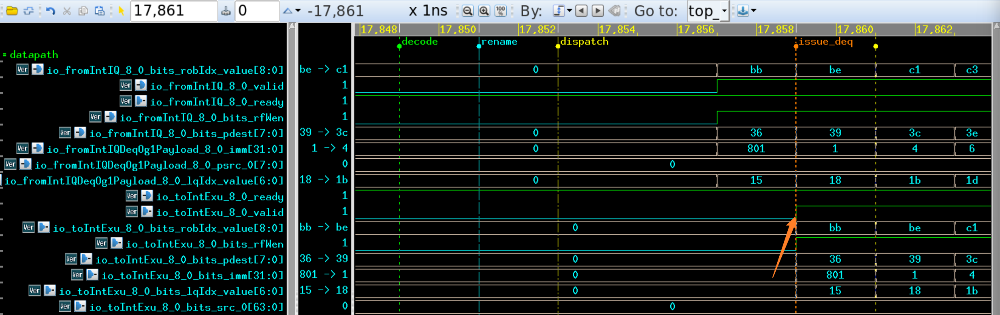

### IssueQueue → DataPath（入队接收）

通过 issue queue 的指令输出到 datapath。当控制信号 vaild 和 ready 准备好的时候，开始接受信号

根据 追踪的信号的 robidx 信号是 be，找到相应的信号物理寄存器是 39 等，表示这里信号正常输入到了数据通路模块

| 信号名称 | 位宽 | 波形时序 / 值 | 作用 |
| --- | --- | --- | --- |
| <code>**io_fromIntIQ_8_0_valid**</code> | **1-bit** | **17.858ns 拉高** | 发射队列（IQ）向数据通路发送握手信号，代表有指令要发走。 |
| <code>**io_fromIntIQ_8_0_bits_robIdx_value**</code> | **9-bit** | **be** | 绑定指令唯一 ID：`0xBE`<br/>。 |
| <code>**io_fromIntIQ_8_0_bits_pdest**</code> | **8-bit** | **3c → 39** | 目的物理寄存器号：`0x39`<br/>。 |
| <code>**io_fromIntIQDeq0g1Payload_8_0_imm**</code> | **32-bit** | **1** | 地址计算核心参数：立即数偏移`1`<br/>。 |
| <code>**io_fromIntIQDeq0g1Payload_8_0_lqIdx_value**</code> | **7-bit** | **1b → 18** | LSQ 表项号：`0x18`<br/>。 |
| <code>**io_fromIntIQ_8_0_ready**</code> | **1-bit** | 1 | 数据通路反馈：我已准备好接收，握手成功。 |

### datapath -> intexu

经过数据通路的 处理，延迟了一个周期进入执行模块

| 信号名称 | 位宽 | 波形时序 / 值 | 作用 |
| --- | --- | --- | --- |
| `**io_toIntExu_8_0_valid**` | **1-bit** | **17.860ns 拉高** | 数据通路向执行单元发送握手信号。 |
| `**io_toIntExu_8_0_bits_robIdx_value**` | **9-bit** | **be** | 透传指令 ID：`0xBE`。 |
| `**io_toIntExu_8_0_bits_pdest**` | **8-bit** | **39** | 透传目的寄存器号：`0x39`。 |
| `**io_toIntExu_8_0_bits_imm**` | **32-bit** | **1** | 透传立即数：`1`。 |
| `**io_toIntExu_8_0_bits_lqIdx_value**` | **7-bit** | **18** | 透传 LQ 表项：`0x18`。 |
| `**io_toIntExu_8_0_bits_src**` | **64-bit** | **0** | **注**：此处的 src 表现值为 0，并非最终地址。这是由于 DataPath 向执行单元传递时，寄存器堆的读出数据或旁路数据尚未完全落位于此信号线。真正的地址加法结果将在下一级执行单元内生成。 |

### <font style="color:rgb(0, 0, 0);background-color:rgb(248, 248, 248);">地址计算过程详解（AGU 加法逻辑）</font>

<font style="color:rgb(13, 13, 13);background-color:rgb(248, 248, 248);">在 Datapath 到 IntExu 的过程中，核心动作是由整数执行单元中的 AGU（地址生成单元）完成</font>**<font style="color:rgb(0, 0, 0);background-color:rgb(248, 248, 248);">基址寄存器与立即数偏移的加法运算</font>**<font style="color:rgb(13, 13, 13);background-color:rgb(248, 248, 248);">。对应的底层 Chisel 逻辑如下：</font>

```scala
// EXU 中的 ALU/AGU 加法逻辑简述
// 对于 Load 指令，源操作数 0 (psrc) 是基址，源操作数 1 (imm) 是偏移
val baseAddr = io.in.bits.src(0)  // 物理寄存器堆读出的 t5 (x30) 的值
val offset   = io.in.bits.data.imm // 译码阶段符号扩展后的立即数 (1)
val vaddr    = baseAddr + offset   // AGU 执行 64 位加法，得到虚拟地址

// 将计算出的虚拟地址传递给后级 LoadUnit (通过 src 信号线)
io.out.bits.src(0) := vaddr 
```

**<font style="color:rgb(0, 0, 0);background-color:rgb(248, 248, 248);">结合本次指令的计算过程记录：</font>**

1. **<font style="color:rgb(0, 0, 0);background-color:rgb(248, 248, 248);">基址准备</font>**<font style="color:rgb(13, 13, 13);background-color:rgb(248, 248, 248);">：指令 </font><code>**<font style="color:rgb(13, 13, 13);background-color:rgb(236, 236, 236);">lw t1, 1(t5)</font>**</code><font style="color:rgb(13, 13, 13);background-color:rgb(248, 248, 248);"> 中的 </font><code>**<font style="color:rgb(13, 13, 13);background-color:rgb(236, 236, 236);">t5</font>**</code><font style="color:rgb(13, 13, 13);background-color:rgb(248, 248, 248);"> 映射到物理寄存器。从波形可以看出，此时 </font><code>**<font style="color:rgb(13, 13, 13);background-color:rgb(236, 236, 236);">t5</font>**</code><font style="color:rgb(13, 13, 13);background-color:rgb(248, 248, 248);"> 的值为 </font><code>**<font style="color:rgb(13, 13, 13);background-color:rgb(236, 236, 236);">0x0</font>**</code><font style="color:rgb(13, 13, 13);background-color:rgb(248, 248, 248);">（或者前序指令刚好清零）。</font>
2. **<font style="color:rgb(0, 0, 0);background-color:rgb(248, 248, 248);">立即数准备</font>**<font style="color:rgb(13, 13, 13);background-color:rgb(248, 248, 248);">：</font><code>**<font style="color:rgb(13, 13, 13);background-color:rgb(236, 236, 236);">imm = 0x1</font>**</code><font style="color:rgb(13, 13, 13);background-color:rgb(248, 248, 248);">（I-type 指令的 </font><code>**<font style="color:rgb(13, 13, 13);background-color:rgb(236, 236, 236);">[31:20]</font>**</code><font style="color:rgb(13, 13, 13);background-color:rgb(248, 248, 248);"> 位符号扩展得到）。</font>
3. **<font style="color:rgb(0, 0, 0);background-color:rgb(248, 248, 248);">AGU 执行加法</font>**<font style="color:rgb(13, 13, 13);background-color:rgb(248, 248, 248);">：</font><code>**<font style="color:rgb(13, 13, 13);background-color:rgb(236, 236, 236);">vaddr = 0x0 + 0x1 = 0x1</font>**</code><font style="color:rgb(13, 13, 13);background-color:rgb(248, 248, 248);">。</font>
4. **<font style="color:rgb(0, 0, 0);background-color:rgb(248, 248, 248);">结果传递</font>**<font style="color:rgb(13, 13, 13);background-color:rgb(248, 248, 248);">：这个 </font><code>**<font style="color:rgb(13, 13, 13);background-color:rgb(236, 236, 236);">0x1</font>**</code><font style="color:rgb(13, 13, 13);background-color:rgb(248, 248, 248);"> 会作为计算结果传递给 MemBlock。</font>**<font style="color:rgb(0, 0, 0);background-color:rgb(248, 248, 248);">注意</font>**<font style="color:rgb(13, 13, 13);background-color:rgb(248, 248, 248);">：在 Datapath 阶段看到的 </font><code>**<font style="color:rgb(13, 13, 13);background-color:rgb(236, 236, 236);">src=0</font>**</code><font style="color:rgb(13, 13, 13);background-color:rgb(248, 248, 248);"> 是因为此时还在等寄存器堆读数据或旁路还没完全打通，真正加法结果 </font><code>**<font style="color:rgb(13, 13, 13);background-color:rgb(236, 236, 236);">0x1</font>**</code><font style="color:rgb(13, 13, 13);background-color:rgb(248, 248, 248);"> 是在进入 MemBlock 的 S1 阶段时稳定出现在 </font><code>**<font style="color:rgb(13, 13, 13);background-color:rgb(236, 236, 236);">debug_vaddr</font>**</code><font style="color:rgb(13, 13, 13);background-color:rgb(248, 248, 248);"> 信号上的。</font>

## bypass

这里是乱序处理器的性能优化部分，主要作用

* **<font style="color:rgb(0, 0, 0);background-color:rgba(0, 0, 0, 0);">数据转发（Forwarding）</font>**<font style="color:rgb(0, 0, 0);background-color:rgba(0, 0, 0, 0);">：如果当前指令的源操作数（比如你的 lw 指令的基地址寄存器 t5），是前一条刚执行完、还没写回物理寄存器的指令产生的，Bypass 会直接把结果转发给当前指令，</font>**<font style="color:rgb(0, 0, 0);background-color:rgba(0, 0, 0, 0);">避免流水线阻塞，不用等寄存器写回</font>**<font style="color:rgb(0, 0, 0);background-color:rgba(0, 0, 0, 0);">；</font>
* **<font style="color:rgb(0, 0, 0);background-color:rgba(0, 0, 0, 0);">指令透传</font>**<font style="color:rgb(0, 0, 0);background-color:rgba(0, 0, 0, 0);">：如果源操作数已经在物理寄存器中就绪，Bypass 会直接透传指令信息，不做额外处理，保证指令流无延迟传递。</font>

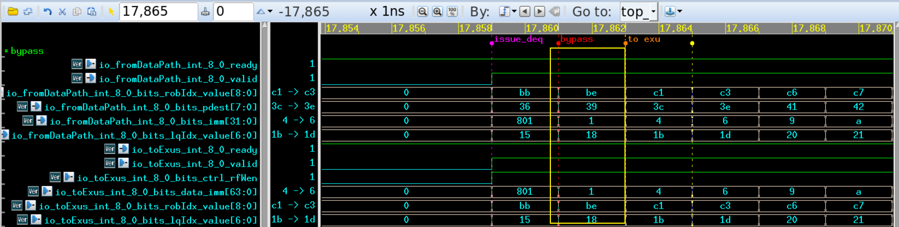

接收 DataPath 输入的指令信息，完成数据转发 / 透传，最终输出到 AGU 执行单元，是 DataPath 到执行单元之间的关键桥梁。全程锁定<code><font style="color:rgb(0, 0, 0);background-color:rgba(0, 0, 0, 0);">robIdx=0xBE</font></code>、<code><font style="color:rgb(0, 0, 0);background-color:rgba(0, 0, 0, 0);">lqIdx=0x18</font></code>、<code><font style="color:rgb(0, 0, 0);background-color:rgba(0, 0, 0, 0);">pdest=0x39</font></code>，

**输入信号**

| 信号名称 | 位宽 | 波形关键值（黄框内） | 核心作用 | 验证结果 |
| --- | --- | --- | --- | --- |
| `io_fromDataPath_int_8_0_valid` | 1-bit | 1（高电平） | DataPath 给 Bypass 的指令有效信号，代表输入端口有有效指令待处理 | ✅ 有效，指令输入合法 |
| `io_fromDataPath_int_8_0_ready` | 1-bit | 1（高电平） | Bypass 给 DataPath 的就绪信号，代表 Bypass 已准备好接收指令，握手成功 | ✅ 握手完成，无阻塞 |
| `io_fromDataPath_int_8_0_bits_robIdx_value[8:0]` | 9-bit | `0xBE` | 指令的终身唯一 ROB ID，全流程指令匹配的核心锚点 | ✅ 100% 匹配目标 lw 指令 |
| `io_fromDataPath_int_8_0_bits_pdest[7:0]` | 8-bit | `0x39` | 重命名分配的目的物理寄存器号，lw 指令写回的目标寄存器 | ✅ 匹配全流程 pdest |
| `io_fromDataPath_int_8_0_bits_imm[31:0]` | 32-bit | `1` | lw 指令的立即数偏移量，地址计算的核心参数 | ✅ 匹配指令语义`1(t5)` |
| `io_fromDataPath_int_8_0_bits_lqIdx_value[6:0]` | 7-bit | `0x18` | Dispatch 预分配的Load Queue 表项号，用于后续地址回填 LSQ | ✅ 匹配全流程 lqIdx |

Bypass 输出信号

| 信号名称 | 位宽 | 波形关键值（黄框内） | 核心作用 | 验证结果 |
| --- | --- | --- | --- | --- |
| `io_toExus_int_8_0_valid` | 1-bit | 1（高电平） | Bypass 给 AGU 的**指令有效信号**，代表输出端口有有效指令待执行 | ✅ 有效，指令输出合法 |
| `io_toExus_int_8_0_ready` | 1-bit | 1（高电平） | AGU 给 Bypass 的**就绪信号**，代表执行单元已准备好接收，握手成功 | ✅ 握手完成，无阻塞 |
| `io_toExus_int_8_0_bits_ctrl_rfWen` | 1-bit | 1（高电平） | **寄存器写使能控制信号**，标记这条指令需要把执行结果写回物理寄存器 | ✅ 符合 lw 指令语义（Load 需要写回目的寄存器） |
| `io_toExus_int_8_0_bits_data_imm[63:0]` | 64-bit | `1` | 透传的**立即数偏移量**（扩展为 64-bit），AGU 地址计算的核心输入 | ✅ 匹配输入的 imm=1，透传正确 |
| `io_toExus_int_8_0_bits_robIdx_value[8:0]` | 9-bit | `0xBE` | 透传指令 ROB ID，全程绑定指令 | ✅ 100% 匹配输入，无错误 |
| `io_toExus_int_8_0_bits_lqIdx_value[6:0]` | 7-bit | `0x18` | 透传 LSQ 表项号，用于后续地址回填 | ✅ 匹配输入，透传正确 |

## memBlock

整体的 memblock 的输入输出信号

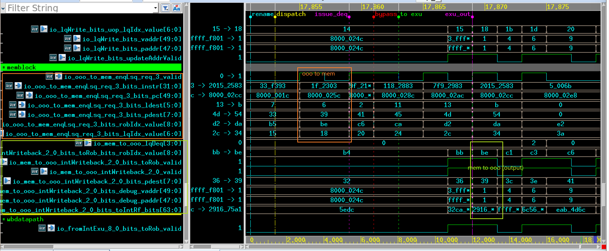

memblock 输入信号  （ooo\_to\_mem)

| 信号名称 | 位宽 | 波形关键值（lw 指令对应周期） | 核心作用 | 验证结果 |
| --- | --- | --- | --- | --- |
| `io_ooo_to_mem_enqLsq_req_3_valid` | 1-bit | 1（高电平） | 乱序调度给 memblock 的**LSQ 入队请求有效信号**，代表 3 号入队槽位有有效访存指令，需分配 LQ 表项 | ✅ 指令有效，入队请求合法 |
| `io_ooo_to_mem_enqLsq_req_3_bits_instr[31:0]` | 32-bit | `0x1f2303` | 访存指令的机器码，memblock 用于解析指令类型（Load/Store）、访存属性 | ✅ 完全匹配 `lw t1,1(t5)`<br/> 的机器码 |
| `io_ooo_to_mem_enqLsq_req_3_bits_pc[49:0]` | 50-bit | `0x8000_025c` | 指令的程序计数器 PC，用于调试、访存异常时记录指令地址 | ✅ 完全匹配 lw 指令的 PC |
| `io_ooo_to_mem_enqLsq_req_3_bits_ldest[5:0]` | 6-bit | `0x6`<br/>（十进制 6） | Load 指令的**目的架构寄存器号**（对应 x6/t1），用于重命名状态校验 | ✅ 匹配 `lw t1,1(t5)`<br/> 的目的寄存器 |
| `io_ooo_to_mem_enqLsq_req_3_bits_pdest[7:0]` | 8-bit | `0x39` | 重命名分配的**目的物理寄存器号**，访存完成后数据写入该寄存器 | ✅ 全程跟踪的 pdest 完全匹配 |
| `io_ooo_to_mem_enqLsq_req_3_bits_robIdx_value[8:0]` | 9-bit | `0xBE` | 指令的**终身唯一 ROB ID**，全流程指令匹配的核心锚点，绑定 LSQ 与 ROB 表项 | ✅ 100% 匹配目标 lw 指令 |
| `io_ooo_to_mem_enqLsq_req_3_bits_lqIdx_value[6:0]` | 7-bit | `0x18`<br/>（十六进制 18） | memblock 预分配的**Load Queue（LQ）表项号**，是指令在访存队列的唯一标识 | ✅ 全程跟踪的 lqIdx 完全匹配 |

memblock 输出

| 信号名称 | 位宽 | 波形关键值（lw 指令对应周期） | 核心作用 | 验证结果 |
| --- | --- | --- | --- | --- |
| `io_mem_to_ooo_intWriteback_2_0_valid` | 1-bit | 1（高电平） | memblock 给全局写回总线的**写回请求有效信号**，代表 Load 指令访存完成，需写回物理寄存器 | ✅ 访存完成，写回请求合法 |
| `io_mem_to_ooo_intWriteback_2_0_bits_toRob_valid` | 1-bit | 1（高电平，与写回 valid 同步） | memblock 给 ROB 的**指令执行完成通知有效信号**，代表对应 ROB ID 的指令已完成，可标记为「等待提交」 | ✅ 同步通知 ROB，状态更新正确 |
| `io_mem_to_ooo_intWriteback_2_0_bits_toRob_bits_robIdx_value[8:0]` | 9-bit | `0xBE` | 要通知 ROB 的指令 ROB ID，绑定指令更新 ROB 表项状态 | ✅ 100% 匹配目标 lw 指令 |
| `io_mem_to_ooo_intWriteback_2_0_bits_pdest[7:0]` | 8-bit | `0x39` | 写回的**目的物理寄存器号**，全局写回总线据此写入对应物理寄存器 | ✅ 全程跟踪的 pdest 完全匹配 |
| `io_mem_to_ooo_intWriteback_2_0_bits_debug_vaddr[49:0]` | 50-bit | `0x1` | 访存的虚拟地址调试信号，AGU 计算结果：`基地址0 + 偏移1 = 1` | ✅ 完全匹配地址计算结果 |
| `io_mem_to_ooo_intWriteback_2_0_bits_debug_paddr[47:0]` | 48-bit | `0x1` | 访存的物理地址调试信号，TLB 虚实地址翻译结果（1:1 恒等映射） | ✅ 完全匹配 TLB 翻译结果 |
| `io_mem_to_ooo_intWriteback_2_0_bits_toIntRf_bits[63:0]` | 64-bit | `0x2916_75a1` | **DCache 读出来的最终访存数据**，要写入物理寄存器的 64 位结果，是 Load 指令的执行产物 | ✅ 完全匹配你之前看到的 writeback 数据 |

### load 指令入队

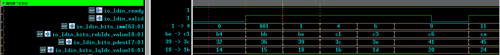

| 信号名称 | 位宽 | 波形关键值 | 核心作用 | 时序验证 |
| --- | --- | --- | --- | --- |
| `io_ldin_valid` | 1-bit | 1（17.862ns 拉高） | AGU 给 LoadUnit 的指令有效信号，代表访存指令已准备好 | ✅ 17.862ns（bypass 输出后 1 拍）拉高，时序正确 |
| `io_ldin_ready` | 1-bit | 1（恒高） | LoadUnit 给 AGU 的就绪信号，代表可接收指令，握手成功 | ✅ 握手完成，无阻塞 |
| `io_ldin_bits_robIdx_value[8:0]` | 9-bit | `0xBE` | 指令唯一 ROB ID，全流程锚点 | ✅ 匹配目标 lw 指令 |
| `io_ldin_bits_pdest[7:0]` | 8-bit | `0x39` | 目的物理寄存器号，后续写回目标 | ✅ 匹配全流程 pdest |
| `io_ldin_bits_lqIdx_value[6:0]` | 7-bit | `0x18` | LSQ 预分配的 Load 队列表项号 | ✅ 匹配 Dispatch 阶段分配的 lqIdx |
| `io_ldin_bits_imm[63:0]` | 64-bit | `1` | 地址计算用的立即数偏移（透传 AGU 结果） | ✅ 匹配`lw t1,1(t5)`<br/>的指令语义 |

### <font style="color:rgb(0, 0, 0);background-color:rgb(248, 248, 248);">LoadUnit 状态转移源码剖析</font>

<font style="color:rgb(13, 13, 13);background-color:rgb(248, 248, 248);">Load 指令进入 MemBlock 的 LoadUnit 后，严格遵循 S1 -> S2 -> S3 的三拍流水线。以下是控制状态转移的核心 Chisel 代码结构解析：</font>

```scala
// LoadUnit 内部的流水线有效信号传递
val s1_valid = io.ldin.valid && io.ldin.ready  // S1: 接收 AGU 发出的指令
val s2_valid = RegNext(s1_valid)               // S2: 打一拍
val s3_valid = RegNext(s2_valid && !s2_blocked) // S3: 再打一拍(前提是S2没被阻塞)

// ========== S1 阶段：地址接收与 TLB 请求 ==========
when (s1_valid) {
  // 锁存 AGU 算出的虚拟地址，发给 TLB
  s1_vaddr := io.ldin.bits.src(0) 
  tlb_req.valid := true.B
  tlb_req.bits.vaddr := s1_vaddr
  // 记录调试信息
  debugLsInfo.s1_robIdx := io.ldin.bits.robIdx
  debugLsInfo.s1_isTlbFirstMiss := !tlb_req.ready // TLB 未命中标记
}

// ========== S2 阶段：DCache 访问与数据前递 ==========
when (s2_valid) {
  // 获取 S1 阶段 TLB 翻译出的物理地址
  s2_paddr := tlb_resp.bits.paddr
  // 使用物理地址发起 DCache 请求，同时查询 StoreBuffer 是否有前递数据
  dcache_req.valid := true.B
  dcache_req.bits.addr := s2_paddr
  // 状态转移与调试信息打拍
  debugLsInfo.s2_robIdx := RegNext(debugLsInfo.s1_robIdx)
  debugLsInfo.s2SignalEnable(RegNext(debugLsInfo)) // 调用前面定义的方法传递状态
}

// ========== S3 阶段：结果返回或重放 ==========
when (s3_valid) {
  // 判断是否发生缺失或需要重放
  val needReplay = dcache_resp.bits.miss || s2_isForwardFail
  when (!needReplay) {
    // 【正常完成】将 DCache/StoreBuffer 读出的数据打包发送给写回总线
    io.wb.valid := true.B
    io.wb.bits.data := dcache_resp.bits.data 
    io.wb.bits.pdest := s3_pdest
  } .otherwise {
    // 【重放】根据缺失类型设置不同的重放路径
    debugLsInfo.s3_isReplay := true.B
    debugLsInfo.s3_isReplayFast := s2_isForwardFail.B // 前递失败，快速重试
    debugLsInfo.s3_isReplaySlow := dcache_resp.bits.miss.B // Cache缺失，等 refill 慢速重试
  }
  debugLsInfo.s3_robIdx := RegNext(debugLsInfo.s2_robIdx)
  debugLsInfo.s3SignalEnable(RegNext(debugLsInfo)) // 累加重放次数和原因
}
```

### <font style="color:rgb(0, 0, 0);background-color:rgb(248, 248, 248);">LoadUnit S1/S2/S3 状态转移波形追踪</font>

<font style="color:rgb(13, 13, 13);background-color:rgb(248, 248, 248);">在波形中，通过添加表达式 </font><code>**<font style="color:rgb(13, 13, 13);background-color:rgb(236, 236, 236);">debugLsInfo_s1_robIdx == 0xBE || debugLsInfo_s2_robIdx == 0xBE || debugLsInfo_s3_robIdx == 0xBE</font>**</code><font style="color:rgb(13, 13, 13);background-color:rgb(248, 248, 248);">，可以完整锁定这条 </font><code>**<font style="color:rgb(13, 13, 13);background-color:rgb(236, 236, 236);">lw</font>**</code><font style="color:rgb(13, 13, 13);background-color:rgb(248, 248, 248);"> 指令在访存流水线中的三拍生死时速。</font>

#### <font style="color:rgb(0, 0, 0);background-color:rgb(248, 248, 248);">① S1 阶段波形（T=17.862ns 后第一拍）</font>

<font style="color:rgb(13, 13, 13);background-color:rgb(248, 248, 248);">此阶段虚拟地址进入 LSU，同时发起 TLB 查询。</font>

| <font style="color:rgb(13, 13, 13);background-color:rgb(248, 248, 248);">信号名称</font> | <font style="color:rgb(13, 13, 13);background-color:rgb(248, 248, 248);">波形实际值</font> | <font style="color:rgb(13, 13, 13);background-color:rgb(248, 248, 248);">核心含义与验证</font> |
| --- | --- | --- |
| <code><font style="color:rgb(13, 13, 13);background-color:rgb(248, 248, 248);">debugLsInfo_s1_robIdx[8:0]</font></code> | <code><font style="color:rgb(13, 13, 13);background-color:rgb(248, 248, 248);">0xBE</font></code> | <font style="color:rgb(13, 13, 13);background-color:rgb(248, 248, 248);">锁定目标指令。</font> |
| <code><font style="color:rgb(13, 13, 13);background-color:rgb(248, 248, 248);">lsTopdownInfo_s1_vaddr_bits[49:0]</font></code> | <code><font style="color:rgb(13, 13, 13);background-color:rgb(248, 248, 248);">0x1</font></code> | **验证通过**<font style="color:rgb(13, 13, 13);background-color:rgb(248, 248, 248);">：确认 AGU 计算结果（基址 0 + 偏移 1）正确送达 LoadUnit。</font> |
| <code><font style="color:rgb(13, 13, 13);background-color:rgb(248, 248, 248);">debugLsInfo_s1_isTlbFirstMiss</font></code> | <code><font style="color:rgb(13, 13, 13);background-color:rgb(248, 248, 248);">0</font></code> | **TLB 命中**<font style="color:rgb(13, 13, 13);background-color:rgb(248, 248, 248);">。说明虚拟地址 </font><code><font style="color:rgb(13, 13, 13);background-color:rgb(248, 248, 248);">0x1</font></code><font style="color:rgb(13, 13, 13);background-color:rgb(248, 248, 248);"> 在 TLB 中成功翻译为物理地址，无需走页表 Walk，不会产生慢速重放。</font> |

#### <font style="color:rgb(0, 0, 0);background-color:rgb(248, 248, 248);">② S2 阶段波形（T=17.870ns 第二拍）</font>

<font style="color:rgb(13, 13, 13);background-color:rgb(248, 248, 248);">此阶段利用 S1 翻译出的物理地址访问 DCache，并查 StoreBuffer。</font>

| 信号名称 | 波形实际值 | 核心含义与验证 |
| --- | --- | --- |
| `debugLsInfo_s2_robIdx[8:0]` | `0xBE` | 状态正确从 S1 打拍传递。 |
| `lsTopdownInfo_s2_paddr_bits[47:0]` | `0x1` | **物理地址**。由于测试环境使用恒等映射，PA 等于 VA。 |
| `debugLsInfo_s2_isDcacheFirstMiss` | `0` | **DCache 命中**。数据在 L1 DCache 中成功找到，无需发起 refill 请求。 |
| `debugLsInfo_s2_isBankConflict` | `0` | **无银行冲突**。没有与其他访存指令抢占同一个 Cache Bank。 |
| `debugLsInfo_s2_isForwardFail` | `0` | **无需前递或前递成功**。说明没有年龄冲突的 Store 指令阻塞本次 Load。 |

#### <font style="color:rgb(0, 0, 0);background-color:rgb(248, 248, 248);">③ S3 阶段波形（T=17.878ns 第三拍）</font>

<font style="color:rgb(13, 13, 13);background-color:rgb(248, 248, 248);">此阶段汇聚 DCache 读出的数据，做出最终裁决：是直接写回，还是打回重放。</font>

| 信号名称 | 波形实际值 | 核心含义与验证 |
| --- | --- | --- |
| `debugLsInfo_s3_robIdx[8:0]` | `0xBE` | 状态正确从 S2 打拍传递。 |
| `debugLsInfo_s3_isReplay` | `0` | **不需要重放**！这是最理想的状况，代表 S1/S2 一路绿灯。 |
| `debugLsInfo_s3_isReplayFast` | `0` | 无快速重放。 |
| `debugLsInfo_s3_isReplaySlow` | `0` | 无慢速重放。 |
| `debugLsInfo_replayCnt[63:0]` | `0x0` | 重放次数为 0，印证了一次性执行成功。 |

**<font style="color:rgb(0, 0, 0);background-color:rgb(248, 248, 248);">状态转移结论</font>**<font style="color:rgb(13, 13, 13);background-color:rgb(248, 248, 248);">： 由于 S3 阶段 </font><code>**<font style="color:rgb(13, 13, 13);background-color:rgb(236, 236, 236);">s3_isReplay = 0</font>**</code><font style="color:rgb(13, 13, 13);background-color:rgb(248, 248, 248);">，状态机从 </font><code>**<font style="color:rgb(13, 13, 13);background-color:rgb(236, 236, 236);">S2</font>**</code><font style="color:rgb(13, 13, 13);background-color:rgb(248, 248, 248);"> 直接转移到了 </font><code>**<font style="color:rgb(13, 13, 13);background-color:rgb(236, 236, 236);">S3_Finish</font>**</code><font style="color:rgb(13, 13, 13);background-color:rgb(248, 248, 248);">（参考前文状态图）。LoadUnit 在这一拍拉高写回有效信号（对应你前面抓到的 </font><code>**<font style="color:rgb(13, 13, 13);background-color:rgb(236, 236, 236);">io_mem_to_ooo_intWriteback_2_0_valid = 1</font>**</code><font style="color:rgb(13, 13, 13);background-color:rgb(248, 248, 248);">），将 DCache 中读到的数据 </font><code>**<font style="color:rgb(13, 13, 13);background-color:rgb(236, 236, 236);">0x2916_75a1</font>**</code><font style="color:rgb(13, 13, 13);background-color:rgb(248, 248, 248);"> 挂载到全局写回总线上，通过 </font><code>**<font style="color:rgb(13, 13, 13);background-color:rgb(236, 236, 236);">pdest=0x39</font>**</code><font style="color:rgb(13, 13, 13);background-color:rgb(248, 248, 248);"> 送往物理寄存器堆和 ROB，完成整个 Load 指令的生命周期。</font>

### TLB 地址翻译

LoadUnit 拿到虚拟地址后，发起 TLB 翻译请求，将虚拟地址<code><font style="color:rgb(0, 0, 0);background-color:rgba(0, 0, 0, 0);">vaddr</font></code>转换为物理地址<code><font style="color:rgb(0, 0, 0);background-color:rgba(0, 0, 0, 0);">paddr</font></code>，是访存的核心前置步骤。

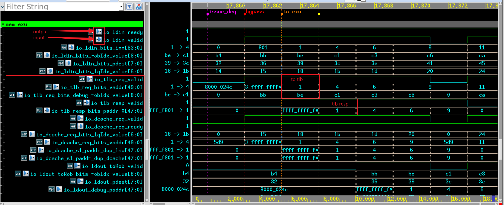

| 信号名称 | 位宽 | 波形关键值 | 核心作用 | 时序验证 |
| --- | --- | --- | --- | --- |
| `io_tlb_req_valid` | 1-bit | 1（17.864ns 拉高） | LoadUnit 给 TLB 的翻译请求有效信号 | ✅ 紧跟`io_ldin_valid`<br/>1 拍后拉高，时序正确 |
| `io_tlb_req_bits_vaddr[49:0]` | 50-bit | `1` | 待翻译的虚拟地址（AGU 计算结果：0+1=1） | ✅ 匹配地址计算结果 |
| `io_tlb_req_bits_debug_robIdx_value[8:0]` | 9-bit | `0xBE` | 绑定指令 ROB ID，用于 TLB 请求溯源 | ✅ 匹配目标指令 |
| `io_tlb_resp_valid` | 1-bit | 1（17.866ns 拉高） | TLB 给 LoadUnit 的翻译完成有效信号 | ✅ 1 拍延迟完成翻译，符合 TLB 单周期设计 |
| `io_tlb_resp_bits_paddr_0[47:0]` | 48-bit | `1` | 翻译完成的物理地址（虚实 1:1 恒等映射） | ✅ 虚拟地址 1→物理地址 1，符合香山启动阶段映射规则 |

### DCache 访存请求

TLB 翻译完成后，LoadUnit 向 DCache 发起读请求，访问物理地址对应的内存数据。

:::success
这里数据在哪输出，为什么 miss 信号会拉高。s1 s2 代表什么

:::

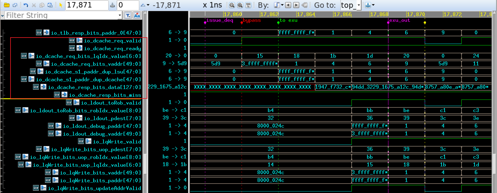

| 信号名称 | 位宽 | 波形关键值 | 核心作用 | 时序验证 |
| --- | --- | --- | --- | --- |
| `io_dcache_req_valid` | 1-bit | 1（17.866ns 拉高） | LoadUnit 给 DCache 的访存请求有效信号 | ✅ 紧跟 TLB 响应 1 拍后拉高，时序正确 |
| `io_dcache_req_ready` | 1-bit | 1（恒高） | DCache 给 LoadUnit 的就绪信号，握手成功 | ✅ 握手完成，DCache 无阻塞 |
| `io_dcache_req_bits_lqIdx_value[6:0]` | 7-bit | `0x18` | 绑定 LSQ 表项号，用于访存完成后回填 | ✅ 匹配目标指令的 lqIdx |
| `io_dcache_req_bits_vaddr[49:0]` | 50-bit | `1` | 访存虚拟地址（透传 AGU 结果） | ✅ 匹配地址计算结果 |
| `io_dcache_s1_paddr_dup_lsu[47:0]`<br/> / `io_dcache_s1_paddr_dup_dcache[47:0]` | 48-bit | `1` | 物理地址双路打拍，同步 DCache 流水线时序 | ✅ 透传 TLB 翻译的 paddr=1，时序同步 |

### 写回

DCache 返回读数据后，LoadUnit 完成访存，发起写回请求，通知 ROB 指令执行完成。

**返回 ROB**

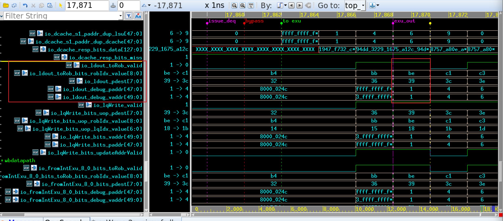

| 信号名称 | 位宽 | 波形关键值 | 核心作用 | 时序验证 |
| --- | --- | --- | --- | --- |
| `io_ldout_toRob_valid` | 1-bit | 1（17.870ns 拉高） | LoadUnit 给 ROB 的访存完成有效信号，代表指令执行完成 | ✅ DCache 访存完成后 2 拍拉高，时序正确 |
| `io_ldout_toRob_bits_robIdx_value[8:0]` | 9-bit | `0xBE` | 绑定指令 ROB ID，通知 ROB 标记该指令为「已完成」 | ✅ 匹配目标指令 |
| `io_ldout_pdest[7:0]` | 8-bit | `0x39` | 目的物理寄存器号，ROB 记录写回状态 | ✅ 匹配全流程 pdest |
| `io_ldout_debug_paddr[47:0]`<br/> / `io_ldout_debug_vaddr[49:0]` | 48/50-bit | `1` | 访存地址调试信息，用于异常排查 | ✅ 匹配访存地址 |

**写回 lsq 表**

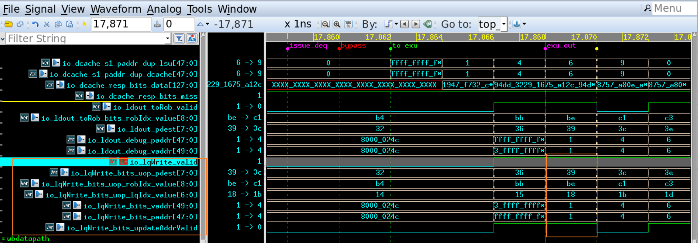

| 信号名称 | 位宽 | 波形关键值 | 核心作用 | 时序验证 |
| --- | --- | --- | --- | --- |
| `io_lqWrite_valid` | 1-bit | 1（17.870ns 拉高） | LoadUnit 给 LSQ 的写回有效信号，更新 LQ 表项状态 | ✅ 与`io_ldout_toRob_valid`<br/>同步拉高，时序正确 |
| `io_lqWrite_bits_uop_pdest[7:0]` | 8-bit | `0x39` | 目的物理寄存器号，LSQ 记录写回信息 | ✅ 匹配目标指令 |
| `io_lqWrite_bits_uop_robIdx_value[8:0]` | 9-bit | `0xBE` | 绑定指令 ROB ID，更新 LSQ 表项 | ✅ 匹配目标指令 |
| `io_lqWrite_bits_uop_lqIdx_value[6:0]` | 7-bit | `0x18` | 目标 LSQ 表项号，更新 18 号表项状态 | ✅ 匹配目标指令的 lqIdx |
| `io_lqWrite_bits_vaddr[49:0]`<br/> / `io_lqWrite_bits_paddr[47:0]` | 50/48-bit | `1` | 访存地址，用于 LSQ 表项状态更新 | ✅ 匹配访存地址 |
| `io_lqWrite_bits_updateAddrValid` | 1-bit | 1（17.872ns 拉高） | 地址更新有效信号，标记 LSQ 表项地址就绪 | ✅ 写回完成后 1 拍拉高，时序正确 |

## white back

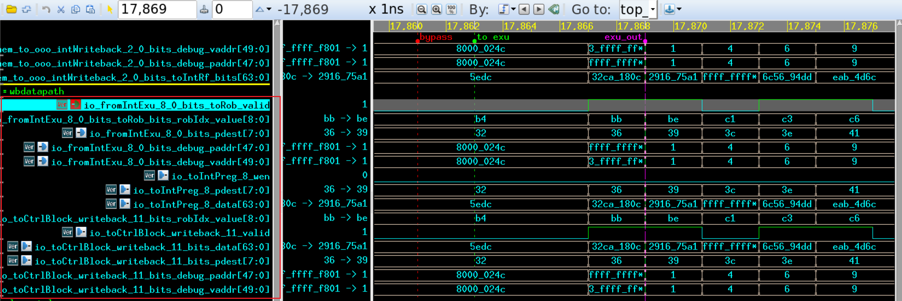

:::success
写回模块里面对数据进行了怎么样的处理？

<font style="color:rgb(0, 0, 0);background-color:rgba(0, 0, 0, 0);">写回数据通路会完成 3 个核心操作：</font>

1. **<font style="color:rgb(0, 0, 0);background-color:rgba(0, 0, 0, 0);">时序同步打拍</font>**<font style="color:rgb(0, 0, 0);background-color:rgba(0, 0, 0, 0);">：将执行单元的异步写回请求，同步到全局时钟域，避免亚稳态；</font>
2. **<font style="color:rgb(0, 0, 0);background-color:rgba(0, 0, 0, 0);">写回仲裁</font>**<font style="color:rgb(0, 0, 0);background-color:rgba(0, 0, 0, 0);">：若多个执行单元同时发起写回，按优先级仲裁，保证写回顺序正确；</font>
3. **<font style="color:rgb(0, 0, 0);background-color:rgba(0, 0, 0, 0);">信息无损透传</font>**<font style="color:rgb(0, 0, 0);background-color:rgba(0, 0, 0, 0);">：全程保留</font><code><font style="color:rgb(0, 0, 0);background-color:rgba(0, 0, 0, 0);">robIdx</font></code><font style="color:rgb(0, 0, 0);background-color:rgba(0, 0, 0, 0);">/</font><code><font style="color:rgb(0, 0, 0);background-color:rgba(0, 0, 0, 0);">pdest</font></code><font style="color:rgb(0, 0, 0);background-color:rgba(0, 0, 0, 0);">/</font><code><font style="color:rgb(0, 0, 0);background-color:rgba(0, 0, 0, 0);">data</font></code><font style="color:rgb(0, 0, 0);background-color:rgba(0, 0, 0, 0);">/ 地址等所有指令信息，确保指令绑定不混乱。</font>

:::

写回通路输入

| 信号名称 | 位宽 | 波形关键值（lw 指令对应周期） | 核心作用 | 验证结果 |
| --- | --- | --- | --- | --- |
| `io_fromIntExu_8_0_bits_toRob_valid` | 1-bit | 1（高电平，17.868ns 后拉高） | 执行单元给 ROB 的**指令执行完成有效信号**，代表该指令已执行完毕，需通知 ROB 标记为「已完成」 | ✅ 对应 lw 指令访存完成，写回请求合法 |
| `io_fromIntExu_8_0_bits_toRob_bits_robIdx_value[8:0]` | 9-bit | `0xBE` | 绑定指令的**终身唯一 ROB ID**，让 ROB 精准定位要更新的表项 | ✅ 100% 匹配目标 lw 指令 |
| `io_fromIntExu_8_0_bits_pdest[7:0]` | 8-bit | `0x39` | 执行结果要写入的**目的物理寄存器号**，lw 指令需将读回数据写入该寄存器 | ✅ 全程跟踪的 pdest 完全匹配 |
| `io_fromIntExu_8_0_bits_debug_paddr[47:0]` | 48-bit | `1` | 访存物理地址调试信号（TLB 翻译结果，虚实 1:1 映射） | ✅ 匹配 lw 指令访存地址 |
| `io_fromIntExu_8_0_bits_debug_vaddr[49:0]` | 50-bit | `1` | 访存虚拟地址调试信号（AGU 计算结果：`0+1=1`<br/>） | ✅ 匹配地址计算结果 |

写回通路双路输出

1. 写回寄存器堆

**<font style="color:rgb(0, 0, 0);background-color:rgba(0, 0, 0, 0);">低延迟直接写寄存器路径</font>**，让后续依赖该寄存器的指令可以最快拿到结果，避免流水线阻塞。

| 信号名称 | 位宽 | 波形关键值 | 核心作用 | 验证结果 |
| --- | --- | --- | --- | --- |
| `io_toIntPreg_8_wen` | 1-bit | 1（对应 pdest=0x39 周期拉高） | 给物理寄存器堆的**写使能信号**，高电平代表要执行写操作 | ✅ 写使能有效，寄存器写入触发 |
| `io_toIntPreg_8_pdest[7:0]` | 8-bit | `0x39` | 要写入的**物理寄存器地址**，对应 lw 指令的目的寄存器 | ✅ 匹配目标寄存器 |
| `io_toIntPreg_8_data[63:0]` | 64-bit | `0x2916_75a1` | **DCache 读回的最终访存数据**，要写入寄存器的 64 位结果 | ✅ 完全匹配 lw 指令的访存结果 |

2. 汇总到全局写回总线

**<font style="color:rgb(0, 0, 0);background-color:rgba(0, 0, 0, 0);">全局统一写回路径</font>**，用于 ROB 状态更新、发射队列唤醒、调试信息汇总

| 信号名称 | 位宽 | 波形关键值 | 核心作用 | 验证结果 |
| --- | --- | --- | --- | --- |
| `io_toCtrlBlock_writeback_11_valid` | 1-bit | 1（17.870ns 左右拉高） | 全局写回总线的**写回请求有效信号**，代表该写回请求合法 | ✅ 写回请求有效，全局总线接收 |
| `io_toCtrlBlock_writeback_11_bits_robIdx_value[8:0]` | 9-bit | `0xBE` | 全局写回总线绑定的指令 ROB ID，用于 ROB 标记完成、唤醒发射队列 | ✅ 匹配目标 lw 指令 |
| `io_toCtrlBlock_writeback_11_bits_data[63:0]` | 64-bit | `0x2916_75a1` | 全局写回总线透传的访存结果，用于寄存器写回、旁路转发 | ✅ 完全匹配访存数据 |
| `io_toCtrlBlock_writeback_11_bits_pdest[7:0]` | 8-bit | `0x39` | 全局写回总线透传的目的物理寄存器号 | ✅ 匹配目标寄存器 |
| `io_toCtrlBlock_writeback_11_bits_debug_paddr[47:0]` | 48-bit | `1` | 全局写回总线透传的物理地址调试信号 | ✅ 匹配访存地址 |
| `io_toCtrlBlock_writeback_11_bits_debug_vaddr[49:0]` | 50-bit | `1` | 全局写回总线透传的虚拟地址调试信号 | ✅ 匹配访存地址 |

## whiteback\&commit

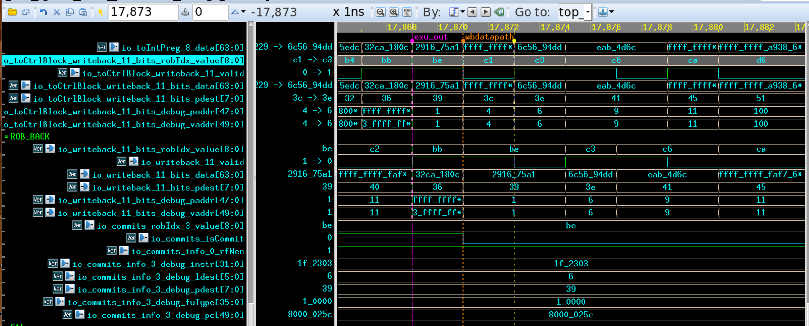

将 Load 指令的访存结果，通过全局写回总线同步到 ROB，标记指令为「已完成」，是执行环节到提交流程的中间枢纽。

写回输出信号（全局写回总线 → ROB\_BACK）

| 信号名称 | 位宽 | 波形关键值 | 核心作用 | 验证结果 |
| --- | --- | --- | --- | --- |
| `io_writeback_11_valid` | 1-bit | 1（17.872ns 拉高） | ROB 收到的写回有效信号，代表有指令执行完成，需更新 ROB 表项 | ✅ 写回请求同步送达 ROB，时序正确（比输入晚 1 拍，流水线打拍） |
| `io_writeback_11_bits_robIdx_value[8:0]` | 9-bit | `0xBE` | 要更新的 ROB 表项 ID，与写回输入完全一致 | ✅ 1:1 无损透传，指令匹配 |
| `io_writeback_11_bits_data[63:0]` | 64-bit | `0x2916_75a1` | 透传的访存结果，ROB 记录指令执行结果 | ✅ 完全匹配访存数据 |
| `io_writeback_11_bits_pdest[7:0]` | 8-bit | `0x39` | 透传的目的物理寄存器号，ROB 记录重命名状态 | ✅ 匹配目标寄存器 |
| `io_writeback_11_bits_debug_paddr[47:0]` | 48-bit | `1` | 透传的物理地址调试信号 | ✅ 匹配访存地址 |
| `io_writeback_11_bits_debug_vaddr[49:0]` | 50-bit | `1` | 透传的虚拟地址调试信号 | ✅ 匹配访存地址 |

ROB 按序提交

| 信号名称 | 位宽 | 波形关键值 | 核心作用 | 验证结果 |
| --- | --- | --- | --- | --- |
| `io_commits_robIdx_3_value[8:0]` | 9-bit | `0xBE` | 本次提交的指令 ROB ID，`3`<br/>是 ROB 单周期 4 发射提交的槽位号 | ✅ 100% 匹配目标`lw`<br/>指令 |
| `io_commits_isCommit` | 1-bit | 1（提交周期拉高） | ROB 全局提交使能信号，代表 ROB 当前周期正在执行提交操作 | ✅ 提交使能有效，是指令提交的必要条件 |
| `io_commits_info_3_rfWen` | 1-bit | 1 | 寄存器写使能标记，代表该指令需要修改架构寄存器状态（`lw`<br/>需要写回`x6`<br/>） | ✅ 符合`lw`<br/>指令语义 |
| `io_commits_info_3_debug_instr[31:0]` | 32-bit | `0x1f2303` | 提交指令的机器码，对应`lw t1,1(t5)` | ✅ 完全匹配`lw`<br/>指令的机器码 |
| `io_commits_info_3_debug_ldest[5:0]` | 6-bit | `6` | 目的架构寄存器号，对应`x6(t1)` | ✅ 匹配`lw`<br/>指令的目的寄存器 |
| `io_commits_info_3_debug_pdest[7:0]` | 8-bit | `0x39` | 目的物理寄存器号，对应重命名分配的`pdest` | ✅ 全程跟踪的`pdest`<br/>完全匹配 |
| `io_commits_info_3_debug_fuType[35:0]` | 36-bit | Load 类型（`1_0000`<br/>） | 指令功能单元类型，标记为 Load 访存指令 | ✅ 匹配`lw`<br/>指令类型 |
| `io_commits_info_3_debug_pc[49:0]` | 50-bit | `0x8000_025c` | 指令的程序计数器 PC，对应`lw`<br/>指令的取指地址 | ✅ 完全匹配`lw`<br/>指令的 PC |

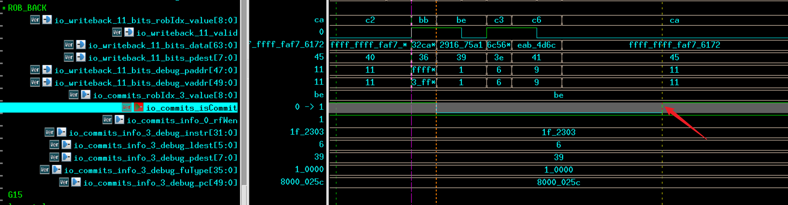

最终提交信号有效的时候，将指令相关的组成提交


> 更新: 2026-07-15 16:09:21  
> 原文: <https://bosc.yuque.com/staff-xmw8rg/fb7qy3/eb97ki1ka9cd61gg>
