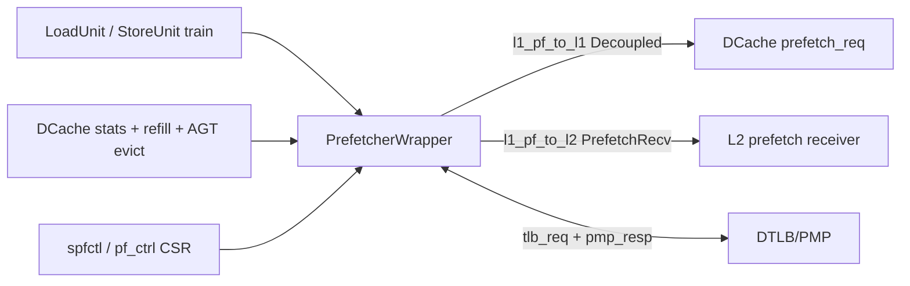
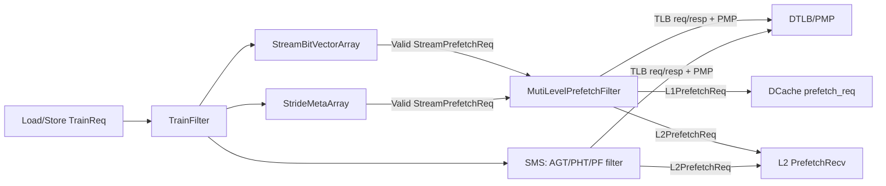

# XiangShan Kunminghu-v3 `mem/prefetch` 算法实现解析

## 1. 分析基线

| 项目 | 结论 |
| --- | --- |
| XiangShan 源码 | `https://github.com/OpenXiangShan/XiangShan.git` |
| 分支 / commit | `kunminghu-v3`, `a975701442ba4602bd81969f6d291a6ddadcb4e0` |
| 分析目录 | `src/main/scala/xiangshan/mem/prefetch` |
| weekly sync | 已执行；`/nfs/home/yuanmiaomiao/XiangShanLab` clean 且 `pulled-ff-only`；本地 `XiangShan-Design-Doc` 缺失 |
| Design Doc baseline | 本地未找到 `XiangShan-Design-Doc`，本文不使用 Design Doc 作为实现依据 |
| 有效默认 prefetcher | `Seq(StreamStrideParams(), SMSParams())`，见 `Parameters.scala:158-166` |
| 可选但默认未实例化 | `BertiParams` 源码存在，但默认 `prefetcher` 序列未包含；`FDP.scala` 提供 Counter/Bloom filter 辅助结构，未在 `prefetch` wrapper 中实例化 |

> 约束：本文每个行为性结论都绑定到代码行号。若只看到源码存在但未看到默认实例化，会明确标注为“可选/非默认有效”。

## 2. 顶层结构：谁、为什么、怎么连

| 模块 / 结构 | Who | Why | How | From what | To what | 代码依据 |
| --- | --- | --- | --- | --- | --- | --- |
| `PrefetcherWrapper` | L1D 预取顶层 wrapper | 汇总不同预取算法、接收训练、仲裁 L1/L2/L3 请求 | 按 `prefetcherSeq` 条件实例化 SMS、StreamStride、Berti，再用三级 Arbiter/Pipeline 输出 | CSR、DCache monitor、Load/Store train、DTLB/PMP | DCache L1 prefetch port、L2 `PrefetchRecv`、DTLB/PMP | `PrefetcherWrapper.scala:80-127`, `154-167`, `217-260`, `303-324` |
| `L1Prefetcher` | Stream + Stride 组合模块 | 用同一训练入口生成 L1/L2/L3 多级预取候选 | Stream 与 Stride 各自训练，进入 `MutiLevelPrefetchFilter`；Stream 优先于 Stride | `io.ld_in`、`stride_train`、`pf_ctrl` | `l1_req/l2_req/l3_req` | `L1PrefetchComponent.scala:849-934` |
| `SMSPrefetcher` | Spatial Memory Streaming 预取器 | 从空间区域访问模式和历史 pattern 预测 L2 预取 | TrainFilter -> AGT + stride side path -> PHT -> PrefetchFilter -> TLB/PMP -> L2 req | load/store train、DCache evict、CSR enables | L2 prefetch request；L1 输出固定无效 | `SMSPrefetcher.scala:1122-1267` |
| `BertiPrefetcher` | 可选 Berti delta 预取器 | 从时间相关 load/refill 中学习 delta | TrainFilter -> HistoryTable -> DeltaTable -> DeltaPrefetchBuffer -> TLB/PMP -> L1/L2/L3 | train + refillTrain | L1/L2/L3 req | 源码 `Berti.scala:937-981`；默认未实例化见 `Parameters.scala:166` |
| `PrefetcherMonitor` | DCache 反馈控制 | 统计 late/useless/hit/drop，产生 Stream/Stride 的 `pf_ctrl` | 每类 monitor 计数并输出 `dynamic_depth/flush/enable/confidence` | DCache load/main/miss/repl stats | `dcache.io.pf_ctrl` -> wrapper | `PrefetcherMonitor.scala:66-91`, `164-258`; `DCacheWrapper.scala:1458-1465` |

顶层有效连接：



代码证据：`MemBlock.scala:741-772` 例化 wrapper，连接 CSR/DCache/train/TLB/PMP/L1/L2；L1 请求后续接到 `dcache.io.prefetch_req`，见 `MemBlock.scala:781-807`。

## 3. 参数与默认有效性

`Parameters.scala:158-166` 明确说明 prefetch 优先级按 `Seq` 顺序，并给出默认 `prefetcher: Seq[PrefetcherParams] = Seq(StreamStrideParams(), SMSParams())`。`Parameters.scala:592-599` 再把该序列暴露为 `prefetcherSeq/prefetcherNum/hasSMS/hasBerti/hasStreamStride`。

因此默认 `kunminghu-v3`：

| 算法 | 默认有效性 | 代码依据 |
| --- | --- | --- |
| Stream | 有效，作为 `StreamStrideParams()` 中的 `L1Prefetcher` 子路径 | `Parameters.scala:166`; `PrefetcherWrapper.scala:217-258`; `L1PrefetchComponent.scala:855-912` |
| Stride | 有效，和 Stream 共享 `L1Prefetcher`，但可被 `modeStrideBerti`/CSR 关闭 | `PrefetcherWrapper.scala:161-166`, `217-226`; `L1PrefetchComponent.scala:855-912` |
| SMS | 有效，默认 `SMSParams()` | `Parameters.scala:166`; `PrefetcherWrapper.scala:167-215` |
| Berti | 源码存在，默认未有效实例化 | `Parameters.scala:166`; 条件实例化在 `PrefetcherWrapper.scala:260-301` |
| FDP Counter/Bloom | 源码存在，未在 `PrefetcherWrapper`/`SMSPrefetcher`/`L1Prefetcher` 中发现实例化 | `FDP.scala:61-147`, `167-202`; wrapper 实例化列表见 `PrefetcherWrapper.scala:167-301` |

## 3.1. 相关论文与源码对应关系

| 论文 | 核心思想 | XiangShan 对应算法 | 源码对应 |
| --- | --- | --- | --- |
| Jean-Loup Baer, Tien-Fu Chen, *An effective on-chip preloading scheme to reduce data access penalty*, SC 1991, DOI [`10.1145/125826.125932`](https://doi.org/10.1145/125826.125932) | 用运行时硬件预测指令流关联的数据引用，提前加载规则访问模式，并抑制不规则模式。源码注释在 Stride 文件头直接列出该论文。 | Stream/Stride 的规则访问检测、PC/hash 关联、look-ahead 生成 | 论文引用注释：`L1StridePrefetcher.scala:17-23`；Stride 表与地址生成：`L1StridePrefetcher.scala:39-56`, `143-251`；Stream bit-vector active：`L1StreamPrefetcher.scala:54-114`, `359-445` |
| Stephen Somogyi 等，*Spatial Memory Streaming*, ISCA 2006, DOI [`10.1109/ISCA.2006.38`](https://doi.org/10.1109/ISCA.2006.38) | 按空间区域收集访问 footprint，把 evicted/observed 区域 pattern 写入 PHT，再在后续同 PC/region context 下重放空间 pattern。源码注释在 SMS 文件头直接列出该论文。 | SMS 的 AGT/PHT/PrefetchFilter 三级结构 | 论文引用注释：`SMSPrefetcher.scala:17-23`；AGT：`SMSPrefetcher.scala:292-573`；PHT：`SMSPrefetcher.scala:590-915`；PrefetchFilter：`SMSPrefetcher.scala:928-1120` |
| Santhosh Srinath 等，*Feedback Directed Prefetching: Improving the Performance and Bandwidth-Efficiency of Hardware Prefetchers*, HPCA 2007, DOI [`10.1109/HPCA.2007.346185`](https://doi.org/10.1109/HPCA.2007.346185) | 用 prefetch accuracy、lateness、pollution、bandwidth/drop 等反馈动态调节 prefetch aggressiveness/confidence。源码注释在 FDP 文件头直接列出该论文。 | `PrefetcherMonitor` 的 late/useless/hit/drop 反馈控制；`FDP.scala` 的 Counter/Bloom 辅助结构 | 论文引用注释：`FDP.scala:17-22`；动态控制：`PrefetcherMonitor.scala:164-258`；DCache 反馈接入：`DCacheWrapper.scala:1458-1465`；Counter/Bloom：`FDP.scala:61-202` |
| Agustín Navarro-Torres 等，*Berti: An Accurate Local-Delta Data Prefetcher*, MICRO 2022, DOI [`10.1109/MICRO56248.2022.00072`](https://doi.org/10.1109/MICRO56248.2022.00072) | 以局部 delta 为单位学习同 PC 的近期访问距离，结合延迟/覆盖计数决定 prefetch level。 | `BertiPrefetcher` 的 HistoryTable、DeltaTable、DeltaPrefetchBuffer；默认未启用 | 参数/默认禁用：`Parameters.scala:166`, `PrefetcherWrapper.scala:260-301`；HT：`Berti.scala:137-374`；DT：`Berti.scala:376-667`；Buffer：`Berti.scala:669-935` |

论文与源码的关系不是一一复刻。本文只把论文作为算法背景；有效行为仍以 `kunminghu-v3` 源码为准。例如 SMS 论文有 AGT 直接产生 spatial stream 的思想，但当前 XiangShan 代码把 `io.s2_pf_gen_req.valid` 固定为 false，使 AGT 默认不直接发 prefetch，只通过 PHT lookup/update 参与，见 `SMSPrefetcher.scala:542-552`。

## 4. 训练输入：从什么来

Load train 由 LoadUnit 在 s2/s3 附近生成。条件是 `pipeIn.valid && tlbHit && !exception && !isUncache && !isUncacheReplay && in.isFirstIssue() && !isVector`，payload 包含 `robIdx/pc/vaddr/paddr/miss/metaSource/isHwPrefetch/refillLatency`，见 `NewLoadUnit.scala:1175-1187`。Store train 条件是 `fire && io.dcacheResp.fire && tlbHit && tlbAccessible && !hasException && !isUncache`，payload 类似但 `metaSource := L1_HW_PREFETCH_NULL`，见搜索结果 `NewStoreUnit.scala:700-711`。

`MemBlock` 将 s1/s2 fire hint 和 s3 train 接给 wrapper，见 `MemBlock.scala:749-757`。`PrefetcherWrapper` 用这些 hint 延迟 PC，使 s3 train 的 PC 对齐：load PC 经 `s2_loadPcVec/s3_loadPcVec` 两级 `RegEnable`，store PC 同理，见 `PrefetcherWrapper.scala:107-120`。wrapper 对 SMS、Stream/Stride、Berti 分别过滤训练：SMS 可按 `pf_train_on_hit` 选择所有非硬件预取 train 或只在 first issue 且 miss/prefetch-hit 时训练，见 `PrefetcherWrapper.scala:181-207`；Stream/Stride 中 Stride 只吃 miss 或 stride prefetch-hit，Stream 吃 first-issue 非硬件预取 load，见 `PrefetcherWrapper.scala:228-245`。

## 5. 通用接口与 source 标记

`PrefetchCtrl` 定义 L1I/L1D/L2 enable、SMS AGT/PHT enable、active 阈值、Stride enable、Berti enable 等 CSR 控制位，见 `BasePrefecher.scala:40-67`；CSR 位定义在 `CSRCustom.scala:80-96`。`PrefetcherIO` 固定包含 load/store train、TLB、PMP、L1/L2/L3 prefetch request，见 `BasePrefecher.scala:96-105`。默认 `BasePrefecher` 把 TLB、L2、L3 请求置无效，使子类只覆盖自己实际使用的接口，见 `BasePrefecher.scala:111-126`。

L1 prefetch source 标记是 3 bit：Null/Clear/Stride/Stream/Store/Berti，并提供 `isDemand/isFromL1Prefetch/isFromStride/isFromStream/isFromBerti` 判断，见 `L1PrefetchInterface.scala:28-50`。L1 请求包含 `paddr/vaddr/confidence/is_store/pf_source`，见 `L1PrefetchInterface.scala:59-73`。

## 6. `TrainFilter`：训练去重与顺序化

`TrainFilter` 是 Stream、Stride、SMS、Berti 共享的训练入口。它把多路 load/store train 按 ROB 顺序排序，再按 cache-line hash 去重，每周期最多对外 `deq` 一个 train。

| 行为 | 算法依据 |
| --- | --- |
| 输入宽度由 load/store 端口数决定，`size >= enqLen` | `L1PrefetchComponent.scala:115-132` |
| load/store train 先用 `HwSort(... robIdx)` 排序，再打一拍 | `L1PrefetchComponent.scala:138-149` |
| 对每个候选，若已有 entry 同 cache-line hash 或前序候选同 hash，则不分配 | `L1PrefetchComponent.scala:154-167` |
| 分配位置用 `index = PopCount(needAlloc.take(i))` 选择第几个 `enqPtrExt`，实际写 `entries(allocPtr.value)` | `L1PrefetchComponent.scala:157-172` |
| `allocNum = PopCount(canAlloc)` 后所有 enq 指针同加，形成多端口顺序分配 | `L1PrefetchComponent.scala:174-176` |
| dequeue 只看 `deqPtr` 指向 entry；`fire` 后清 valid 并 `deqPtrExt + 1` | `L1PrefetchComponent.scala:178-193` |
| flush 在 `RegNext(io.flush)` 后清所有 valid，并重置 enq/deq 指针 | `L1PrefetchComponent.scala:195-199` |

冲突场景：同周期两个 load train 访问同一 cache line，第一个 `needAlloc` 可为真，第二个被 `prev_enq_match` 屏蔽；如果 filter 满或 wrap 后 `allocPtr < deqPtrExt`，`canAlloc` 为假，训练被丢弃而不是反压上游，因为输入是 `ValidIO` 不是 `DecoupledIO`，证据是 `canAlloc := needAlloc && allocPtr >= deqPtrExt && io.enable` 与输入端口定义 `ValidIO`，见 `L1PrefetchComponent.scala:115-123`, `154-168`。

## 7. Stream 算法：区域 bit-vector active 检测

### 7.1 存储与索引

Stream 使用 `StreamBitVectorArray`。每个 entry 保存 `tag/bit_vec/active/cnt/decr_mode/trigger_full_va`，见 `L1StreamPrefetcher.scala:54-72`。区域参数来自 `HasStreamPrefetchHelper`：`REGION_SIZE=1024` 继承通用 helper，`BIT_VEC_WITDH = REGION_SIZE / blockBytes`，Stream 表大小 `BIT_VEC_ARRAY_SIZE=16`，active 阈值 `ACTIVE_THRESHOLD = BIT_VEC_WITDH - 4`，见 `L1PrefetchComponent.scala:21-28` 和 `L1StreamPrefetcher.scala:15-47`。

索引/地址计算：

| 计算 | 代码依据 |
| --- | --- |
| region tag = `vaddr(VAddrBits-1, REGION_TAG_OFFSET)`；region bits = `vaddr(REGION_TAG_OFFSET-1, BLOCK_OFFSET)` | `L1PrefetchComponent.scala:46-55` |
| region hash tag 用 region tag 的 low 与 high hash 拼接 | `L1PrefetchComponent.scala:84-89` |
| Stream s0 同时匹配当前、+1、-1 region，支持跨 region active 检测 | `L1StreamPrefetcher.scala:204-217` |
| 表命中选 `OHToUInt(s0_hit_vec)`，未命中选 PLRU `replacement.way` | `L1StreamPrefetcher.scala:194-215` |

### 7.2 更新 / 替换 / 查找

`alloc` 要求 bit-vector one-hot，并将 `cnt := 1`；如果邻居 region active，则新 entry 可直接 active，见 `L1StreamPrefetcher.scala:78-92`, `324-333`。`update` 对新 block bit 做 OR；若该 bit 之前没有置位则 `cnt+1`；`cnt_next >= ACTIVE_THRESHOLD` 或邻居 active 时置 `active`，见 `L1StreamPrefetcher.scala:94-114`, `335-343`。

当 s1 发现当前 train 对应 entry active 且该 bit 是新 bit，`s1_can_send_pf` 为真；s2 计算 L1/L2/L3 的前瞻 VA，s3/s4/s5 分别发 L1/L2/L3 候选，其中 L3 受 `enableL3StreamPrefetch` Constantin 控制且默认 false，见 `L1StreamPrefetcher.scala:311-317`, `359-445`。输出请求由 `StreamPrefetchReqBundle.getStreamPrefetchReqBundle` 生成，将目标地址对齐到 region 内 bit vector；递增模式左移，递减模式右移，见 `L1StreamPrefetcher.scala:117-166`。

场景：一个 region 内连续访问多个 cache block，`bit_vec` 逐步 OR 新 bit，`cnt` 达到 `ACTIVE_THRESHOLD` 后 `active := true`；后续同 region 新 bit 触发 `s2_will_send_pf = s2_valid && s2_active && s2_can_send_pf`，生成从当前 region offset 向前或向后的一组 bit，见 `L1StreamPrefetcher.scala:94-105`, `372-390`。

### 7.3. 示例讲解与源码对应

假设 DCache block 为 64B，则 1024B region 有 16 个 bit。训练序列为同一 region 内 offset `0, 1, 2, ... 12` 的 first-issue load miss。

| 步骤 | 示例状态 | 源码对应 | 结果 |
| --- | --- | --- | --- |
| 第 1 次访问 offset 0 | s0 miss，`s0_index = replacement.way` | `L1StreamPrefetcher.scala:204-215`, `324-333` | 分配 entry，`bit_vec=0001`, `cnt=1`, `active` 取邻居 active 判断 |
| 后续访问 offset 1..11 | s1 update，`bit_vec := bit_vec | UIntToOH(offset)` | `L1StreamPrefetcher.scala:94-105`, `335-343` | 新 bit 第一次出现时 `cnt+1`；达到 `ACTIVE_THRESHOLD` 后 `active := true` |
| offset 12 再次触发 | `s2_will_send_pf = s2_valid && s2_active && s2_can_send_pf` | `L1StreamPrefetcher.scala:372-390` | 生成 L1 prefetch bit-vector，source=`L1_HW_PREFETCH_STREAM` |
| 进入多级 filter | Stream valid 优先送入 `pf_queue_filter` | `L1PrefetchComponent.scala:899-912` | 与 Stride 同周期冲突时 Stream 候选被选择 |
| 实际发出 | `PriorityEncoder(bit_vec & ~sent_vec)` 选第一个未发 block | `L1PrefetchComponent.scala:268-274`, `666-720` | 下游 ready 时发 L1/L2 请求，并置 `sent_vec` 防止重复 |

这个实现对应 SC 1991 式的规则/顺序访问预取思想，但 XiangShan 不是简单 next-line：它先用 region bit-vector 判断 active，再把多个待预取 block 交给多级 filter 去翻译、去重和限流。

### 7.4 与 Stride 的关系

Stream 还给 Stride 提供 `stream_lookup_req/resp`，用于 Stride 选择是否因已有 stream pattern 而抑制输出。lookup 是 s0 接请求、s1 匹配、s2 读 active、s3 返回 `hit && active`，见 `L1StreamPrefetcher.scala:447-467`。当前常量 `LOOK_UP_STREAM = false`，因此 Stride 的 `s3_valid` 默认不被该响应屏蔽，见 `L1StridePrefetcher.scala:46-52`, `239-240`。

## 8. Stride 算法：PC-indexed stride confidence

### 8.1 存储与查找

Stride 表 `STRIDE_ENTRY_NUM=16`，每项保存 `pre_vaddr/stride/decr_mode/confidence/hash_pc`，见 `L1StridePrefetcher.scala:39-64`。s0 用 `pc_hash_tag(pc)` 对所有 valid entry CAM 匹配；命中选匹配项，未命中选 PLRU replacement，见 `L1StridePrefetcher.scala:143-158`。

### 8.2 更新规则

`StrideMetaBundle.update` 计算 `new_stride_plus = new_vaddr -& pre_vaddr` 和 `new_stride_minus = pre_vaddr - new_vaddr`，用符号位决定递减模式；stride 以 block 为单位要求既非 0 也非 1；若新 stride 与旧 stride 和方向都匹配，confidence 饱和加 1；否则 confidence 减 1，低置信时替换 stride 和方向，见 `L1StridePrefetcher.scala:84-112`。

触发 prefetch 的条件是 `stride_valid && stride_match && confidence >= CONF_THRESHOLD`，见 `L1StridePrefetcher.scala:91-95`。s1 更新或分配 entry，并用 `s0_can_accept := !(s1_valid && s1_pc_hash === s0_pc_hash)` 防止同 PC hash 连续冲突，见 `L1StridePrefetcher.scala:165-195`。

### 8.3 预取地址生成

s2 将 stride 左移不同 ratio 形成 L1/L2 前瞻深度：`l1_stride_ratio` 默认 2，`l2_stride_ratio` 默认 5；递增用 `vaddr + depth`，递减用 `vaddr - depth`。L1 输出在 s3，L2 输出在 s4，见 `L1StridePrefetcher.scala:197-251`。

场景：同一 PC 访问 `0x1000, 0x1100, 0x1200...`。第一次 miss 分配 entry；第二次 update 发现 stride，置信可能仍低；重复匹配直到 confidence 达到阈值后，s2 生成 L1 预取 `vaddr + (stride << l1_ratio)` 和 L2 预取 `vaddr + (stride << l2_ratio)`，证据为 `alloc/update` 与 s2 计算行 `183-213`。

### 8.4. 示例讲解与源码对应

假设同一 load PC=`0x80001000`，先后访问 VA=`0x1000, 0x1100, 0x1200, 0x1300`，block offset 为 6 bit，则观察到的 stride 是 `0x100` 字节，也就是 4 个 64B block。

| 步骤 | 示例状态 | 源码对应 | 结果 |
| --- | --- | --- | --- |
| 第一次训练 | `s0_hit=false`，替换路来自 PLRU | `L1StridePrefetcher.scala:143-158`, `183-188` | 分配 entry，记录 `pre_vaddr=0x1000`，`stride=0`，`confidence=0` |
| 第二次训练 | `new_stride_plus = 0x1100 - 0x1000` | `L1StridePrefetcher.scala:84-92`, `189-195` | stride 有效但还未和旧 stride 匹配，低置信时写入新 stride |
| 第三/四次训练 | 新 stride 与旧 stride、方向匹配 | `L1StridePrefetcher.scala:96-105` | confidence 饱和递增，达到 `CONF_THRESHOLD` 后允许发 prefetch |
| 生成地址 | `s2_l1_depth = s2_stride << l1_stride_ratio`，`s2_l2_depth = s2_stride << l2_stride_ratio` | `L1StridePrefetcher.scala:197-237` | L1 预取较近地址，L2 预取更远地址，source=`L1_HW_PREFETCH_STRIDE` |
| 输出阶段 | L1 s3 valid，L2 s4 valid | `L1StridePrefetcher.scala:239-251` | 请求进入 `MutiLevelPrefetchFilter`，再做 TLB/PMP/drop/ready 限流 |

这个例子对应 stride-directed prefetching 的核心思想：用 PC 绑定一个最近 stride 和置信度。XiangShan 额外加入了同 PC hash s0/s1 冲突反压和 Stream 优先级，见 `L1StridePrefetcher.scala:179-195` 与 `L1PrefetchComponent.scala:899-912`。

## 9. Stream/Stride 多级过滤器：去重、翻译、发 L1/L2/L3

`MutiLevelPrefetchFilter` 有五条内部流水：prefetch enqueue、TLB request、L1 prefetch、L2 prefetch、L3 prefetch，源码注释直接列出，见 `L1PrefetchComponent.scala:310-316`。

### 9.1 Entry 与 replacement

每个 `MLPReqFilterBundle` 保存 hash tag、region、待发 bit_vec、已发 sent_vec、sink、是否仍是 vaddr、source、confidence，见 `L1PrefetchComponent.scala:217-227`。`can_send_pf` 要求 `!is_vaddr`、`bit_vec & ~sent_vec` 非空且 valid；可替换条件是 invalid 或上一拍 `sent_vec` 已覆盖整 region，见 `L1PrefetchComponent.scala:255-266`。L1 filter 16 项、L2/L3 filter 16 项，见 `L1PrefetchComponent.scala:35-39`, `330-333`。

replacement 先选 invalid/已发完 entry，否则退化为 PLRU：`real_replace_vec = Mux(opt_replace.orR, opt_replace, all-true)`，见 `L1PrefetchComponent.scala:363-381`。

### 9.2 Enqueue/update

L1/L2 两套 enqueue 逻辑相同：s0 用 region hash CAM 匹配，hit 则更新 bit_vec/sink，miss 则按 replacement 分配；s1 阻止当前 s0 接收与正在 s1 分配相同 hash 的请求，见 `L1PrefetchComponent.scala:383-431` 和 `433-481`。`MLPReqFilterBundle.update` 对 `bit_vec` 做 OR；若新 sink 优先级更高，则清掉已发位之外的旧 bit 并更新 sink，见 `L1PrefetchComponent.scala:245-253`。

### 9.3 TLB/PMP/MMIO 过滤

若 entry 仍是 vaddr，L1/L2 entry 通过 RR arbiter 申请 TLB；`not_tlbing_vec` 保证同 entry 在 s1/s2/s3 已有 TLB 请求时不重复发，见 `L1PrefetchComponent.scala:539-585`。s1 发送 TLB 请求时若同 entry 被新分配覆盖，则 `s1_tlb_evict` 屏蔽请求，见 `L1PrefetchComponent.scala:587-600`。s3 收到 TLB/PMP 后，若 TLB miss 则保留 `is_vaddr := true`；若命中且 page/access fault、guest page fault、MMIO、PBMT uncache 或 PMP load fault，则 invalidate entry；否则把 region 从 VA region 更新为 PA region，见 `L1PrefetchComponent.scala:602-659`。

这说明 L1/Stream/Stride 预取不会对 MMIO/uncache 发请求，而是翻译后直接 drop。虚拟页跨越时，代码不是把一个 bit-vector 拆成多次翻译；它只以 region base `get_tlb_va()` 发一次 TLB 请求，见 `L1PrefetchComponent.scala:281-284`, `550-568`。如果 region 跨页，后续同 region 内其他 block 的物理页属性不会在此处逐块验证，这是验证风险。

### 9.4 发请求与 backpressure

L1 prefetch s0 从可发送 entry 中按 `TwoLevelRRArbiter` 选一个候选，`get_pf_paddr` 用 `PriorityEncoder(bit_vec & ~sent_vec)` 选最低未发 bit，见 `L1PrefetchComponent.scala:268-274`, `666-686`。s1 用 `s1_pf_valid` 持有请求，只有 `io.l1_req.ready` 时 fire 并更新 `sent_vec`；若 ready 低，`l1_pf_req_arb.io.out.ready := s1_pf_can_go || !s1_pf_valid` 阻止覆盖，见 `L1PrefetchComponent.scala:691-720`。

L2/L3 路径类似，L2 用 `sink === SINK_L2`，L3 用 `sink === SINK_L3`，并把 source 映射到 `MemReqSource.Prefetch2L2Stride/Stream` 或 `Prefetch2L3Stride/Stream`，见 `L1PrefetchComponent.scala:737-824`。

## 10. SMS 算法：AGT + PHT + Filter

### 10.1 SMS 参数与地址 hash

默认 `SMSParams` 包含 region 1024B、AGT 16 项、PHT 64 项 2-way、PHT lookup queue 4、prefetch filter 16、train filter 8，见 `SMSPrefetcher.scala:42-58`。helper 计算 block/region 地址、region hash、PHT index/tag：`pht_index` 使用 PC bit 混合，`pht_tag` 取更高 PC 位，见 `SMSPrefetcher.scala:69-142`。

### 10.2 SMS 内部 Stride side path

`StridePF` 是 SMS 内部轻量 stride 表，16 项 PLRU。它按低 `STRIDE_PC_BITS` PC 匹配，记录 last block addr、stride、2-bit confidence；同 PC 连续输入会被 `prev_valid && prev_pc === pc` 屏蔽，见 `SMSPrefetcher.scala:145-180`。s1 命中时 stride 匹配则 confidence 饱和加，否则减；低置信时更新 stride，见 `SMSPrefetcher.scala:182-225`。当 stride 匹配时，s2 生成 `PfGenReq`，跨页时 `paddr_valid` 清零以迫使后续 TLB 翻译，见 `SMSPrefetcher.scala:227-262`。

### 10.3 AGT：active generation table

AGT 每项保存 PHT index/tag、region bit set、single-bit update 状态、region tag、访问计数、方向等，见 `SMSPrefetcher.scala:265-276`。s0 同时匹配当前、+1、-1 region；DCache evict 也能查表并在无 lookup/conflict 时进入，`io.s0_dcache_evict.ready := !s0_lookup_valid && !s0_dcache_evict_conflict`，见 `SMSPrefetcher.scala:292-360`。

s1 对命中 entry OR 新 region bit，并在新 bit 到来时增加 `access_cnt`；未命中则按 PLRU 分配；被替换或 DCache evict 的 entry 会进入 PHT update，见 `SMSPrefetcher.scala:403-540`。AGT active 判断是 `s1_pf_gen_access_cnt > io.act_threshold`；若当前/邻居匹配且 active，按 `act_stride` 生成前后 region bit mask；否则 `s1_pht_lookup_valid := !s1_pf_gen_valid && prev_lookup_valid` 走 PHT，见 `SMSPrefetcher.scala:453-552`。

注意：当前代码把 `io.s2_pf_gen_req.valid := false.B` 固定为 false，虽然前面计算了 `s2_pf_gen_valid` 和 bits，见 `SMSPrefetcher.scala:542-549`。因此默认有效 SMS 中 AGT 不直接发 prefetch，只会更新/驱动 PHT lookup；这也解释了后面 `sms_agt_pf_gen` 计数会一直基于无效输出，见 `SMSPrefetcher.scala:554-563`。

### 10.4 PHT：single-port SRAM 的 update/lookup 仲裁

PHT 使用 `SRAMTemplate[PhtEntry]`，sets = `pht_size / pht_ways`，ways = `pht_ways`，singlePort = true，见 `SMSPrefetcher.scala:590-607`。lookup 和 evict update 先各进 `OverrideableQueue`，然后 s0 在 `lookup.valid || evict.valid` 时选操作；`evict.ready := !s1_valid || !s1_wait`，`lookup.ready := evict.ready && !evict.valid`，所以 evict/update 优先于 lookup，见 `SMSPrefetcher.scala:623-645`。

s1 读 SRAM，s2 计算 hit、hist 更新和 replacement，s3 写 SRAM 并根据历史生成 current/increment/decrement region prefetch candidate。single-port 冲突由 `s1_wait := (s2_valid && s2_evict && s2_ram_waddr === s1_ram_raddr) || s3_ram_en` 处理，见 `SMSPrefetcher.scala:662-818`。PHT 命中且不是 evict 时，s3 用历史高/低半部分生成当前/相邻 region bit mask，再用 3 输入 Arbiter 输出一个 `PfGenReq`，优先级按 Arbiter 输入顺序 current、increment、decrement，见 `SMSPrefetcher.scala:823-902`。

### 10.5 SMS PrefetchFilter：去重、翻译、发 L2

`PrefetchFilter` 有 16 项，每项保存 region tag/address/bits/filter_bits/alias/paddr_valid/decr/source，见 `SMSPrefetcher.scala:917-939`。s0 同 region 命中则 update，否则 PLRU 分配；连续同 region `prev_valid` 会屏蔽，且 s1 正在替换的 entry 不参与匹配，见 `SMSPrefetcher.scala:941-1018`。

对未物理化 entry，`tlb_req_arb` 发 region base VA 给 TLB，`not_tlbing_vec` 避免同 entry 多个 outstanding TLB；s3 收到 TLB/PMP 后，若 miss、非 pmem、page/access fault、MMIO、PBMT uncache 或 PMP fault，则 drop，否则填 `paddr_valid` 和物理 region，见 `SMSPrefetcher.scala:975-990`, `1020-1069`, `1071-1084`。对已物理化且仍有 pending bits 的 entry，`pf_req_arb` 用 `PriorityMux` 选择第一个或最后一个 pending bit：递增发低位优先，递减发高位优先；fire 后把该 bit OR 到 `filter_bits`，见 `SMSPrefetcher.scala:992-1008`, `1071-1091`。

SMS 顶层只输出 L2：`io.l2_req.valid := pf_filter.io.l2_pf_addr.valid && io.enable`，source 固定 `Prefetch2L2SMS`；L1 req 被固定无效，见 `SMSPrefetcher.scala:1234-1245`。

### 10.6. 示例讲解与源码对应

假设 PC=`0x80002000` 的 load 在 region R 中访问 offset bit `2, 4, 5, 9`，随后 AGT entry 被替换或 DCache evict，PHT 学到该 footprint；下一次同 PC/PHT index/tag 在类似 region offset 触发 lookup。

| 步骤 | 示例状态 | 源码对应 | 结果 |
| --- | --- | --- | --- |
| train 进入 SMS | `train_vld_s0` 保存 region tag、PHT index/tag、region offset、PA/VA region | `SMSPrefetcher.scala:1140-1184` | 形成 AGT/PHT/stride 的共同输入 |
| AGT 聚合 footprint | 命中 entry 时 `region_bits := old | new_bit`，`access_cnt` 增加 | `SMSPrefetcher.scala:427-440` | 当前 region 的空间访问集合被持续收集 |
| AGT evict/update PHT | `io.s2_evict.valid` 带出 AGTEntry；single update 也可写 PHT | `SMSPrefetcher.scala:520-540`, `1215-1217` | PHT 获得 region_bits、pht_index/tag、方向信息 |
| PHT lookup | lookup 与 evict 进入 queue；evict 优先，lookup 在无 evict 时读 SRAM | `SMSPrefetcher.scala:623-645`, `662-729` | 同 PC/tag 命中时读出历史 hist |
| 生成 PfGenReq | s3 根据 hist 生成 current/increment/decrement region bits，经 3 输入 Arbiter 输出 | `SMSPrefetcher.scala:823-902` | 形成一个 region-level prefetch candidate |
| PrefetchFilter 发 L2 | filter 对 region 去重、TLB/PMP 检查、按 pending bit 每次发一个 block | `SMSPrefetcher.scala:928-1120`, `1234-1237` | 输出 `MemReqSource.Prefetch2L2SMS` 到 L2 |

与 SMS 论文的关系：论文思想是学习并重放 spatial footprint；XiangShan 的有效路径体现为 AGT 收集、PHT 存 SRAM、PrefetchFilter 按 bit 发 L2。源码差异是 AGT 直接 prefetch valid 被固定为 false，见 `SMSPrefetcher.scala:542-549`，所以默认直接请求主要来自 PHT/stride side path 后的 filter。

## 11. Berti 算法（源码存在，默认未启用）

Berti 默认参数为 HT 64 sets x 6 ways，DT 64 ways x 4 deltas，HT replacement 默认 FIFO，见 `Berti.scala:30-42`。它的 helper 将 PC hash、line VA、delta width、byte/line 地址模式封装起来，见 `Berti.scala:44-111`。

`HistoryTable`：access 时记录 `(pcTag, baseVAddr, timestamp)`。FIFO 模式下，access 按 set 的 `accessPtr` 写入；如果 baseVAddr 已存在则不替换，否则写当前 pointer 并递增，且用 last entry 判断 `decrModes`，见 `Berti.scala:282-305`。search FIFO 每次用 `learnPtr` 取一个历史 entry，要求 valid、PC tag 相同、`currTime - latency > tsp`，再用当前 baseVA 与历史 baseVA 计算 delta；若方向与 `decrModes` 不一致则取负，见 `Berti.scala:307-325`。

`DeltaTable`：按 PC tag 全相联匹配 64 entry。learn 命中则在 entry 内匹配 delta，命中时 coverageCnt 加 1 并可能更新 bestDeltaIdx；delta miss 时按优先级分配到 delta=0、NO_PREF、L2_PREF_REPL 的槽，否则丢弃，见 `Berti.scala:497-545`, `580-599`。状态阈值由 Constantin 控制：`L1_PREF`、`L2_PREF`、`L2_PREF_REPL`、`NO_PREF` 的边界见 `Berti.scala:392-413`。prefetch 时取 best delta，非 `NO_PREF` 则生成 `SourcePrefetchReq`，目标 L1/L2/L3 由 delta status 决定，见 `Berti.scala:601-631`。

`DeltaPrefetchBuffer`：将源 VA prefetch 请求合并、翻译、过滤并发 L1/L2/L3。源请求按 line VA 查重，命中合并更高优先级 target，未命中用 PLRU 分配，见 `Berti.scala:669-789`。TLB/PMP drop 条件覆盖 TLB miss、非 pmem、page/access fault、MMIO/PBMT uncache、PMP fault；成功后填 PA line，见 `Berti.scala:790-868`。发请求阶段按 entry target 选择 L1/L2/L3 Decoupled 端口，fire 后清 valid，见 `Berti.scala:870-908`。

默认风险说明：`PrefetcherWrapper` 只有 `HasBerti` 为真才实例化 Berti，见 `PrefetcherWrapper.scala:260-301`；默认 `prefetcher` 不含 `BertiParams`，见 `Parameters.scala:166`。

### 11.1. 示例讲解与源码对应

假设某 PC 先后 demand miss/refill 到 line `A, A+3, A+6`，refill latency 可用于判断历史 entry 是否早于当前 miss 的有效时间窗。

| 步骤 | 示例状态 | 源码对应 | 结果 |
| --- | --- | --- | --- |
| HistoryTable access | demand miss 或 prefetch-hit 触发 access | `Berti.scala:946-966`, `282-305` | HT FIFO 记录 PC tag、base line VA、timestamp |
| HistoryTable search | demand refill 或 prefetch-hit 触发 search；要求 `currTime - latency > tsp` | `Berti.scala:307-325`, `963-968` | 计算 delta，例如 `+3` lines，并输出 `LearnDeltasLiteIO` |
| DeltaTable learn | PC tag 命中则更新 delta coverage，miss 则分配 entry/delta slot | `Berti.scala:497-545`, `580-599` | bestDeltaIdx 指向覆盖最高 delta |
| DeltaTable prefetch | 当前 train 命中 PC tag 且 best delta status 非 `NO_PREF` | `Berti.scala:601-631` | 生成 `prefetchVA = triggerVA + delta`，target 按 status 选 L1/L2/L3 |
| PrefetchBuffer issue | buffer 合并同 line，TLB/PMP 过滤，按 target 发 req | `Berti.scala:669-908` | 成功 fire 后清 entry valid |

这个例子对应 Berti 论文的 local-delta 思想：不是全局 stream，也不是单 PC 固定 stride，而是从近期历史访问中学习多个 candidate delta，并以 coverage/status 决定预取层级。XiangShan 当前默认未启用 Berti，因此该例子是源码可选路径示例，不是默认有效路径。

## 12. FDP 辅助结构（源码存在，未见默认实例化）

`CounterFilter` 用一个 FIFO 保存最近 load hit 的 `(idx, way)`，避免多个流水阶段对同一 prefetch line 重复统计 useful。容量为 `(LduStages=5) * LduCnt`，多端口 enqueue 用 `PopCount(needAlloc.take(i))` 计算分配位置，三拍后的 `last3CycleAlloc` 驱动 dequeue，query 对所有 valid entry 做 set/way CAM，见 `FDP.scala:61-147`。

`BloomFilter` 是一位向量过滤器：`set` 置位、`clr` 清位，查询下一拍返回；默认 bypass 模式用 `data_next(addr)`，所以同周期 set/clear 可反映到响应，见 `FDP.scala:149-202`。本文未在 `PrefetcherWrapper`、`L1Prefetcher`、`SMSPrefetcher` 中看到这些模块实例化，因此不把它们列为默认有效 prefetch datapath。

### 12.1. 示例讲解与源码对应

FDP 论文强调用运行时反馈调节预取强度。XiangShan 中默认有效的反馈控制主要在 `PrefetcherMonitor`，而 `FDP.scala` 的 Counter/Bloom 是辅助结构源码。

| 机制 | 示例 | 源码对应 | 结果 |
| --- | --- | --- | --- |
| late feedback | prefetch 已发但 demand hit/miss 先到，统计 `pf_late_in_cache/pf_late_in_mshr` | `PrefetcherMonitor.scala:94-123`, `199-223` | 触发 late hit/miss 阈值后降低 confidence/disable 或增大 depth |
| useless feedback | prefetch line 被替换时未被 demand 使用 | `PrefetcherMonitor.scala:188-235`; `DCacheWrapper.scala:1242-1246` | `trigger_pf_useless` 时 depth 右移，`trigger_disable` 时 disable 并 flush |
| CounterFilter 去重 | 三个 load 流水阶段都命中同一 `(idx,way)` prefetch line | `FDP.scala:61-147` | FIFO 记录近期 set/way，query 命中后可避免重复 useful 计数 |
| BloomFilter pollution | prefetch 设置 bloom bit，demand miss 查询命中 | `FDP.scala:149-202`; LoadPipe pollution 统计见 `LoadPipe.scala:504-505` | 可作为 pollution 反馈输入，帮助控制 prefetch aggressiveness |

当前默认有效链路是 `DCacheWrapper -> PrefetcherMonitor -> pf_ctrl -> L1Prefetcher`，见 `DCacheWrapper.scala:1458-1465` 与 `L1PrefetchComponent.scala:885-895`。

## 13. 控制路径和仲裁优先级

| 控制点 | 规则 | 冲突/失败场景 | 代码依据 |
| --- | --- | --- | --- |
| Wrapper 算法优先级 | L1/L2/L3 都用 Chisel `Arbiter`，输入顺序来自 `prefetcherSeq`，默认 StreamStride 在 SMS 前 | 同周期 StreamStride 和 SMS 发 L2，低 index 的 StreamStride 优先，SMS 的 `ready` 变低 | `Parameters.scala:158-166`; `PrefetcherWrapper.scala:121-126`, `337-342` |
| L1Prefetcher 内 Stream vs Stride | Stream valid 优先，bits 用 `Mux(stream_valid, stream_bits, stride_bits)` | 同周期二者都有候选，Stride 请求本周期丢失/等待其自身下游状态，输入是 Valid 而非 ready/valid | `L1PrefetchComponent.scala:899-912` |
| MultiLevelFilter TLB | L1/L2 entries 各自 RR，再通过 2 输入 RR 汇总；同 entry 在 s1/s2/s3 不重复 TLB | entry TLB outstanding 又被新 alloc 覆盖，则 TLB req/resp 被 evict 屏蔽 | `L1PrefetchComponent.scala:539-649` |
| MultiLevelFilter L1 issue | `TwoLevelRRArbiter` 每次选一个可发 entry；s1 持有直到 L1 ready | `io.l1_req.ready=0` 时 `s1_pf_valid` 保持，arbiter out not ready | `L1PrefetchComponent.scala:666-720` |
| SMS AGT vs DCache evict | evict 只有无 lookup 且无 s1 replacement conflict 才 ready | lookup 与 evict 同周期，evict 被反压 | `SMSPrefetcher.scala:331-360` |
| SMS PHT lookup vs evict | evict/update 优先，lookup 只有 `!evict.valid` 才 ready | PHT update queue 非空时 lookup 等待 | `SMSPrefetcher.scala:623-645` |
| SMS PHT SRAM single port | s3 写或 s2 evict 同 set 与 s1 读冲突会 `s1_wait` | read/write same set 时 s1 hold，防止 single-port 访问冲突 | `SMSPrefetcher.scala:636-640`, `662-667`, `786-818` |
| SMS PrefetchFilter | TLB 与 PF 分别仲裁；alloc/update/pf_fired/tlb_fired 同 entry 按代码赋值顺序处理，alloc 最后覆盖 entry | 同周期旧 entry pf fire 且新 alloc 同 index，最后 `ent := s1_alloc_entry`，旧 filter_bits 更新被覆盖 | `SMSPrefetcher.scala:964-1096` |

## 14. 跨边界代码解析

| Boundary | First fragment | Second fragment | Independent checks | Merge/ordering state | Failure and recovery |
| --- | --- | --- | --- | --- | --- |
| Virtual page | Stream/Stride MultiLevelFilter 对整个 region base VA 发 TLB | 没有对 bit-vector 中跨页 block 逐块拆分 | TLB miss/fault/PBMT/PMP/PMA 只基于 TLB/PMP 响应 | `is_vaddr` 和 region PA 更新；无 per-block merge | TLB miss 保持 `is_vaddr`；fault/MMIO/uncache/PMP drop entry，见 `L1PrefetchComponent.scala:281-284`, `550-659` |
| Virtual page | SMS `StridePF` 和 PHT 生成跨页 region 时清 `paddr_valid` | `PrefetchFilter` 对 region base 重新 TLB | TLB/PMP/PBMT/MMIO/pmem 检查在 s3 | entry `paddr_valid/region_addr/filter_bits` | miss/fault/MMIO/uncache/PMP drop，见 `SMSPrefetcher.scala:227-260`, `846-887`, `975-1084` |
| Cache line | Stream/Stride 用 bit-vector 标识多个 cache block | MultiLevelFilter 每次 `PriorityEncoder(bit_vec & ~sent_vec)` 只发一个 block | DCache/L2 后续决定 hit/miss/MSHR，prefetch 模块自身不读 tag/data | `sent_vec/filter_bits` 记录已发 block | downstream not ready 则 hold；fire 后置 sent/filter bit，见 `L1PrefetchComponent.scala:268-274`, `691-720`; `SMSPrefetcher.scala:992-1008`, `1088-1091` |
| MMIO/uncache | TLB/PMP 响应后检查 `pmp.mmio`、`Pbmt.isUncache` | 无第二 fragment | 与 page/access fault、PMP fault 同处 drop 条件 | entry invalidate 或 valid 清零 | 不向 L1/L2/L3 发 MMIO prefetch，见 `L1PrefetchComponent.scala:619-645`; `SMSPrefetcher.scala:1058-1084`; `Berti.scala:841-861` |

结论：该目录的预取器把预取视为可丢弃 speculative hint。跨页/uncache/fault 场景不是精确拆分并合并响应，而是保守地保持待翻译或 drop；不会产生架构写回。

## 15. 时延与吞吐

| 路径 | 起点 | 终点 | 最好情况时序 | 吞吐瓶颈 | 代码依据 |
| --- | --- | --- | --- | --- | --- |
| Load train 到 wrapper | LoadUnit s2 train valid | wrapper s3 train input | LoadUnit 输出再打一拍到 s3 wrapper | Load pipeline train width `LD_TRAIN_WIDTH` | `NewLoadUnit.scala:1177-1187`; `NewLoadUnit.scala:2033-2035`; `PrefetcherWrapper.scala:107-120` |
| Stream 生成候选 | `TrainFilter.trainReq.fire` | `StreamBitVectorArray.io.l1_prefetch_req.valid` | s0 lookup, s1 update, s2 gen, s3 L1 valid；L2 再到 s4；L3 s5 且默认关 | `BIT_VEC_ARRAY_SIZE`、PLRU、Valid 输出无 backpressure | `L1StreamPrefetcher.scala:196-287`, `289-445` |
| Stride 生成候选 | `train_req.fire` | L1 s3 / L2 s4 valid | s0 lookup, s1 update, s2 addr, s3 L1, s4 L2 | 16-entry CAM/PLRU；同 PC hash s0 backpressure | `L1StridePrefetcher.scala:143-251` |
| MultiLevelFilter VA 到 L1 req | enqueue valid | `io.l1_req.fire` | s0/s1 enqueue；TLB req s1；TLB resp s2；PMP s3；L1 issue s0/s1 | TLB RR arb、L1 ready、16-entry L1 array | `L1PrefetchComponent.scala:383-481`, `539-720` |
| SMS PHT lookup 到 L2 req | AGT lookup miss | `io.l2_req.valid` | lookup queue -> PHT s0/s1/s2/s3/s4 -> PrefetchFilter -> TLB/PMP -> pf arb | single-port PHT SRAM、lookup/evict queue、PF filter size 16、L2 ready | `SMSPrefetcher.scala:623-902`, `928-1120`, `1234-1237` |

所有数字都是源码流水级数推导；实际 cycle 会受 `GatedValidRegNext`、Queue、SRAM 实现、DTLB/PMP 响应和 downstream ready 影响，本文不声称固定端到端延迟。

## 16. 图：有效默认数据路径




```waveform-draw
{
  "signal": [
    { "name": "clk", "wave": "p........" },
    { "name": "l1_pf_req.valid", "wave": "01...0..." },
    { "name": "io.l1_req.ready", "wave": "0..10...." },
    { "name": "s1_pf_valid", "wave": "01..0...." },
    { "name": "s1_pf_fire", "wave": "0...10..." },
    { "name": "sent_vec", "wave": "x...=....", "data": ["set bit"] },
    { "name": "flush", "wave": "0........" }
  ],
  "config": { "hscale": 1 }
}
```

上图的 `s1_pf_valid/s1_pf_fire/sent_vec` 对应 `L1PrefetchComponent.scala:691-720`。

## 17. 验证特别注意

| Verification ID | Risk / invariant | Directed stimulus | Expected observation | Required checker / coverage |
| --- | --- | --- | --- | --- |
| `F_FIRST_REQUEST` | reset 后 valid bits 都为空，首个 train 不应读出旧 payload | reset 后发一个 miss load train | Stream/Stride/SMS TrainFilter 分配新 entry；无旧 line hit | Occupancy checker；`TrainFilter` valid reset/alloc lines `L1PrefetchComponent.scala:127-176` |
| `C_MULTI_TRAIN_SAME_LINE` | 同周期多路 train 同 cache line 只能保留一个 | 多个 LDU 同周期同 line 不同 ROB | `prev_enq_match/entry_match` 屏蔽重复 alloc | Storage conflict checker；`L1PrefetchComponent.scala:154-168` |
| `C_STREAM_STRIDE_PRIORITY` | Stream 和 Stride 同周期候选，Stream 优先 | 构造 active Stream 与 high-confidence Stride 同周期 valid | `pf_queue_filter` bits 选择 Stream，Stride 本周期不进入 filter | Arbiter/priority checker；`L1PrefetchComponent.scala:899-912` |
| `F_HOLD_BACKPRESSURE` | L1 prefetch ready 低时 payload 必须保持且不重复置 sent bit | 拉低 `io.l1_req.ready` 多周期 | `s1_pf_valid` 保持，`sent_vec` 只在 `s1_pf_fire` 更新 | Handshake checker；`L1PrefetchComponent.scala:691-720` |
| `E_PREFETCH_TRANSLATION_DROP` | fault/MMIO/uncache/PMP 不能发出 prefetch | TLB 命中但 PBMT uncache 或 PMP ld fault | entry invalidate/drop，L1/L2/L3 不 fire | Exception/context checker；`L1PrefetchComponent.scala:619-645`, `SMSPrefetcher.scala:1058-1084` |
| `C_PHT_SINGLE_PORT` | SMS PHT 单端口 SRAM 读写冲突必须 stall | evict update 与 lookup 同 set 连续到达 | `s1_wait` hold s1，lookup/evict ready 符合优先级 | Storage conflict checker；`SMSPrefetcher.scala:623-645`, `786-818` |
| `RESOURCE_PF_FILTER_FULL` | SMS PrefetchFilter 满时 PLRU 替换可能覆盖未发完 entry | 16 个 region pending 后继续 gen_req | replacement entry 被覆盖；旧 pending prefetch 可丢弃但不能发错 PA | Occupancy + flush/replay checker；`SMSPrefetcher.scala:937-1018`, `1071-1096` |
| `P_NO_MMIO_SIDE_EFFECT` | 预取不能对 MMIO/uncache 产生 side effect | 构造 VA 翻译到 MMIO/PBMT uncache | `s3_drop` 清 valid，不产生 downstream req | Architecture exception/context checker；`SMSPrefetcher.scala:1058-1068`, `Berti.scala:841-861` |
| `C_DEFAULT_BERTI_DISABLED` | 默认配置下不应出现 Berti request/source | 默认 `Seq(StreamStrideParams(), SMSParams())` 仿真 | `HasBerti=false`，wrapper 不例化 Berti 输入端口 | Configuration coverage；`Parameters.scala:166`, `PrefetcherWrapper.scala:260-301` |

