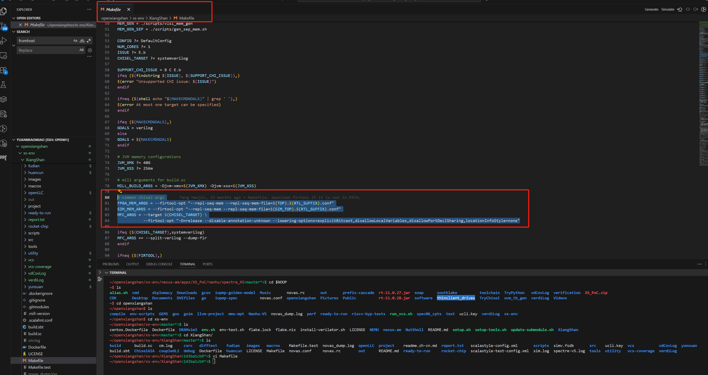

# 第七章 Chisel 常见语法错误

## Chisel 高频真实报错排查手册

本节汇总**工业开发 100% 高频 Chisel 报错**，每条包含：报错原文、错误原因、错误代码、标准修复方案，适合快速排错、复盘避坑。

### 1.1 模块实例化未包裹 Module()

**报错信息**：`Error: attempted to instantiate a Module without wrapping it in Module().`

**错误根源**：Chisel 所有自定义 Module 必须用 `Module(...)` 包裹，直接 new 会触发检查报错。

```scala
// 错误写法
val a = new MyModule()

// 正确写法
val a = Module(new MyModule())
```

### 1.2 Vec 整体赋值遗漏下标（最经典批量报错）

**报错信息**：`Sink and Source have different types`

**错误根源**：`Vec[T]` 是数组类型，不能直接用单个元素赋值；循环批量赋值忘记加 `(i)` 下标。

```scala
// 错误写法
val a = Vec(8, new MyBundle)
val b = new MyBundle
a := b  

// 正确写法
val a = Vec(8, new MyBundle)
val b = new MyBundle
a(0) := b  // 必须指定下标
```

### 1.3 信号位宽不匹配

**报错信息**：`waymask width does not equal nWays, waymask width: 32, nWays: 4`

**错误根源**：左右信号位宽不一致，大数赋小数、位宽参数填错、参数不匹配。

```scala
// 错误写法
val a = UInt(32.W)
val b = UInt(4.W)
a := b

// 正确写法（位宽对齐）
val a = UInt(32.W)
val b = UInt(4.W)
a := b.zext // 或 padTo(32.W)
```

### 1.4 数组下标越界（参数分支不匹配）

**报错信息**：`IndexOutOfBoundsException: 8 is out of bounds (min 0, max 5)`

**错误根源**：编译期参数分支不一致，部分宏/参数开启后，数组长度变化，但循环范围未同步修改，导致下标越界。

**典型场景**：`HasMptCheck` 开启后 `MemReqWidth` 变化，导致后续分支代码越界执行。

```scala
// 错误：分支不全导致越界
val resp_pte_sector = VecInit((0 until MemReqWidth).map(i => {
  if (xxx) {...}
  else if (yyy) {...}
  // 缺少参数适配分支，导致超索引执行
}))

// 正确：所有参数宏严格对齐循环范围
val resp_pte_sector = VecInit((0 until (
  if (HasBitmapCheck) MemReqWidth / 2 
  else if (HasMptCheck) MemReqWidth - 1 
  else MemReqWidth
)).map(i => {
  // 逻辑
}))
```

### 1.5 Bundle 层级赋值错误（直接赋值 bits）

**报错信息**：`Sink (AnonymousBundle) and Source (UInt) have different types.`

**错误根源**：对 `resp.bits` 直接赋值基础类型，未指定内部字段。

```scala
// 错误写法
io.resp.bits := 0.U

// 正确写法
io.resp.bits.value := 0.U
```

### 1.6 RegInit 非法 Vec 初始化

**报错信息**：`vec type 'Bool(false)' must be a Chisel type, not hardware`

**错误根源**：`RegInit()` 不支持直接传入 `Vec(xx, 常量.B)`，不能用硬件常量直接初始化向量寄存器。

```scala
// 错误写法
val reg_vec = RegInit(Vec(PtwWidth, false.B))

// 正确写法（类型对齐初始化）
val reg_vec = RegInit(0.U.asTypeOf(Vec(PtwWidth, Bool())))
```

### 1.7 Bundle 字段名写错/结构体用错

**报错信息**：`Right Record missing field (mptLevel)`

**错误根源**：手写 typo，将 `MptRespBundle` 写成 `MptReqBundle`，结构体字段不对称，缺少成员。

**解决方案**：统一输入输出 Bundle，严格核对字段名、结构体名称。

### 1.8 端口未完全初始化（sink not fully initialized）

**报错信息**：`sink "io_xxx" not fully initialized`

**错误根源**：新增 IO 端口、新增 Bundle 字段，代码中未赋值、未连接；仲裁器输出悬空也会报该抽象错误。

**工程特征**：arbiter 未连、prefetch 模块新增字段未初始化，报错信息极其抽象，不提示具体位置。

**解决方案**：新增 IO 必须全部赋值、默认兜底赋值，禁止悬空。

### 1.9 Option 枚举对象取值错误

**报错信息**：`value xxx is not a member of Option[XXX]`

**错误根源**：配置参数由 `OptionWrapper` 生成，返回 `Option[Object]`，不能直接点取内部子对象。

```scala
// 错误写法
ZicfilpFlag.ZicfilpJalr

// 正确写法（get 取出 Option 实例）
ZicfilpFlag.get.ZicfilpJalr
```

### 1.10 隐蔽报错定位优化方案（工程进阶）

针对 Chisel 抽象、不精准的报错（如 not fully initialized 无法定位具体端口），可手动指定高版本 firtool 优化报错信息，在 Makefile 中修改：

```makefile
MFC_ARGS = --target $(CHISEL_TARGET) \
--firtool-binary-path /nfs/home/share/firtool-1.74.0/bin/firtool \
--firtool-opt "-O=release --disable-annotation-unknown --lowering-options=explicitBitcast,disallowLocalVariables,disallowPortDeclSharing,locationInfoStyle=none"
```

**优化效果**：精准打印未初始化端口、类型不匹配位置、位宽错误具体行列，大幅提升排错效率。




## 报错速查总口诀

* 1. 模块必包 Module，直接 new 必报错
* 2. Vec 赋值必带下标，整体赋值必失配
* 3. 位宽严格对齐，宽窄互赋必报错
* 4. 分支参数统一长度，不然下标越界
* 5. Bundle 分层赋值，不能直赋 bits 整体
* 6. RegInit 初始化必须用类型转换对齐
* 7. Option 配置必须 .get 取值
* 8. 新增 IO 全兜底，杜绝悬空未初始化
* 9. 结构体不能写混 req/resp


> 更新: 2026-05-22 10:44:39  
