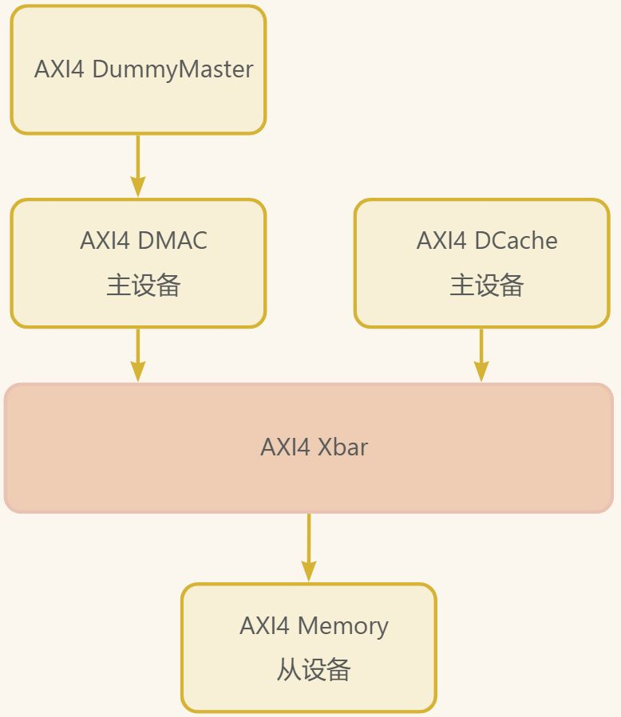

# 第十五章 Diplomacy 实战演练二

## 案例二：双主设备通过Xbar共享内存

### 2.1 题目要求

构建一个双主设备共享内存系统：`dmac -> xbar -> memory`和 `dcache -> xbar -> memory`

**系统要求**：

* 两个主设备：DMA控制器（dmac）和数据缓存（dcache）
* 一个从设备：内存（memory）
* 使用AXI4交叉开关（Xbar）实现多对一连接
* 实现完整的仲裁和数据通路

### 2.2 系统架构设计

基于我们提供的代码，系统架构如下：



**代码中出现的模块及其功能**：

1. **AXI4 DMAC**：DMA控制器，支持内存数据传输
2. **AXI4 DCache**：CPU数据缓存，发起内存访问
3. **AXI4 Xbar**：交叉开关，仲裁多主设备访问
4. **AXI4 Memory**：共享内存设备
5. **AXI4 DummyMaster**：DMAC配置接口的主设备端，由于DMAC的设计特性，其必须得接上这样一个空接口才能正常运行生成Verilog

### 2.3 代码深度解析

#### 2.3.1 顶层系统设计（TwoToOneXbarSystem）

这是系统的核心集成模块，完整展示了Diplomacy的多模块互联，也是本案例最核心的部分：

```scala
class TwoToOneXbarSystem(implicit p: Parameters) extends LazyModule {
  // 1. 实例化DMAC模块
  val dmac = LazyModule(new AXI4DMAC(Seq(AddressSet(0x40000000L, 0xfff))))

  // 2. 为DMAC创建虚拟主设备用于配置接口
  val dummyMaster = AXI4MasterNode(Seq(AXI4MasterPortParameters(
    Seq(AXI4MasterParameters(
      name = "dummy",
      id = IdRange(0, 1)
    ))
  )))
  dmac.node := dummyMaster  // 连接虚拟主设备到DMAC

  // 3. 实例化DCache模块
  val dcache = LazyModule(new AXI4DCache(AXI4MasterParameters(
    name = "dcache_master",
    id = IdRange(0, 256),
    aligned = true
  )))

  // 4. 实例化Memory模块
  val memory = LazyModule(new AXI4Memory(
    address = Seq(AddressSet(0x80000000L, 0x0fffffffL)),
    size = 0x10000000L,
    executable = true,
    beatBytes = 8
  ))

  // 5. 创建AXI4交叉开关
  val xbar = AXI4Xbar()

  // 6. Diplomacy连接：多主设备 -> Xbar -> 内存
  xbar := dmac.masterNode  // DMAC主端口连接到Xbar
  xbar := dcache.node      // DCache连接到Xbar
  memory.node := xbar      // Xbar输出连接到内存

  lazy val module = new TwoToOneXbarSystemModule(this)
}
```

**Diplomacy核心要点**：

1. **模块化设计**：每个功能模块独立实例化为LazyModule
2. **节点明确分工**：
   * `dmac.node`：从设备节点，接收配置请求
   * `dmac.masterNode`：主设备节点，发起DMA传输，连接到
   * `dcache.node`：主设备节点，发起缓存访问
   * `memory.node`：从设备节点，接收内存请求
3. **拓扑清晰**：使用`:=`操作符建立清晰的连接关系

#### 3.3.2 AXI4交叉开关（AXI4Xbar）

Diplomacy框架提供的`AXI4Xbar`是系统关键组件，自动处理：

1. **地址解码**：根据地址空间路由请求
2. **仲裁逻辑**：多主设备竞争时的优先级处理
3. **ID管理**：保持事务ID的唯一性
4. **数据通路**：正确路由读写数据

#### 2.3.3 DMAC模块的双角色设计

AXI4DMAC模块展示了复杂模块的Diplomacy设计：

```scala
class AXI4DMAC(address: Seq[AddressSet])(implicit p: Parameters) 
extends AXI4SlaveModule(address, executable = false) {

  // 从设备节点：接收配置请求
  // 继承自AXI4SlaveModule，已包含node

  // 主设备节点：发起DMA传输
  val masterNode = AXI4MasterNode(Seq(AXI4MasterPortParameters(
    Seq(AXI4MasterParameters(
      name = "dmac_master",
      id = IdRange(0, 1 << 14),  // 支持最多16384个ID
      aligned = true
    ))
  )))
}
```

**关键设计**：

1. **双节点设计**：同时包含主从节点，支持配置和传输
2. **ID空间管理**：为主设备分配充足的ID范围
3. **模块继承**：复用AXI4SlaveModule的基础功能

#### 2.3.4 硬件实现模块

硬件逻辑在`TwoToOneXbarSystemModule`中实现：

```scala
class TwoToOneXbarSystemModule(outer: TwoToOneXbarSystem) 
extends LazyModuleImp(outer) {

  val io = IO(new Bundle {
    // DMAC配置接口
    val dma_cfg_wen = Input(Bool())
    val dma_cfg_addr = Input(UInt(12.W))
    val dma_cfg_wdata = Input(UInt(64.W))
    val dma_cfg_ren = Input(Bool())
    val dma_cfg_rdata = Output(UInt(64.W))
    val dma_start = Input(Bool())
    val dma_src_addr = Input(UInt(64.W))
    val dma_dst_addr = Input(UInt(64.W))

    // 系统控制
    val system_reset = Input(Bool())

    // 调试信号
    val dma_status_busy = Output(Bool())
    val dma_status_done = Output(Bool())
    val cycle_counter = Output(UInt(32.W))
  })

  // 获取虚拟主设备接口
  val (dummy_bundle, _) = outer.dummyMaster.out.head

  // 配置虚拟主设备不发起实际请求
  dummy_bundle.aw.valid := false.B
  dummy_bundle.w.valid := false.B
  dummy_bundle.ar.valid := false.B
  dummy_bundle.r.ready := true.B
  dummy_bundle.b.ready := true.B

  // 其他硬件逻辑...
}
```

### 2.4 Diplomacy连接模式详解

#### 2.4.1 星型连接拓扑

本案例采用典型的星型连接：

```plain
主设备1 -----
                |
    主设备2 -----+---- Xbar ---- 从设备
                |
    主设备n -----
```

在Diplomacy中表示为：

```scala
xbar := master1.node
xbar := master2.node
// ... 更多主设备
slave.node := xbar
```

#### 2.4.2 连接方向语义

Diplomacy的连接操作符`:=`有明确的流向语义：

```scala
// 语法：下游 := 上游
// 语义：数据从上游流向下游

memory.node := xbar      // 数据：Xbar -> Memory
xbar := dmac.masterNode  // 数据：DMAC -> Xbar
xbar := dcache.node      // 数据：DCache -> Xbar
```

#### 2.4.3 参数自动协商

当建立连接时，Diplomacy自动执行参数协商：

1. **位宽对齐**：确保所有连接的位宽一致
2. **ID空间分配**：协调各主设备的ID范围
3. **地址映射**：验证地址空间不冲突
4. **协议特性**：协商支持的传输类型和突发长度

### 2.5 模块实现细节

#### 2.5.1 DCache模块简化实现

DCache实现展示了一个最小化的AXI4主设备：

```scala
class AXI4DCache(params: AXI4MasterParameters)(implicit p: Parameters) 
extends LazyModule {

  val node = AXI4MasterNode(Seq(AXI4MasterPortParameters(Seq(params))))

  override lazy val module = new LazyModuleImp(this) {
    val (axi_bundle, _) = node.out.head

    // 简化实现：不发起实际请求，仅占位
    axi_bundle.ar.valid := false.B
    axi_bundle.r.ready := true.B
    axi_bundle.aw.valid := false.B
    axi_bundle.w.valid := false.B
    axi_bundle.b.ready := true.B
  }
}
```

**注意**：这是一个最小化实现，实际DCache会有复杂的缓存逻辑。

#### 2.5.2 Memory模块实现

Memory模块的关键特性包括：

1. **同步存储器**：使用SyncReadMem存储数据
2. **地址映射**：支持特定的地址空间
3. **突发传输**：支持AXI4突发读写
4. **立即响应**：简化设计，无复杂延迟

### 2.6 Diplomacy优势在本案例的体现

#### 2.6.1 拓扑抽象

Diplomacy将复杂的物理连接抽象为逻辑连接：

```scala
// 逻辑描述
xbar := dmac.masterNode
xbar := dcache.node
memory.node := xbar

// 物理实现由Diplomacy自动生成，包括：
// 1. 仲裁逻辑
// 2. 地址解码
// 3. 数据多路复用
// 4. 响应路由
```

#### 2.6.2 参数化设计

系统高度可配置：

```scala
// 可配置参数
val dcache = LazyModule(new AXI4DCache(AXI4MasterParameters(
  name = "dcache_master",
  id = IdRange(0, 256),  // 可配置的ID范围
  aligned = true
)))

val memory = LazyModule(new AXI4Memory(
  address = Seq(AddressSet(0x80000000L, 0x0fffffffL)),  // 可配置地址
  size = 0x10000000L,  // 可配置大小
  beatBytes = 8  // 可配置位宽
)))
```

#### 2.6.3 自动错误检查

Diplomacy在编译时检查常见错误：

1. **地址冲突**：多个从设备地址重叠
2. **位宽不匹配**：连接设备位宽不一致
3. **协议不兼容**：设备间协议特性不匹配
4. **连接错误**：主从角色颠倒

### 2.7 测试与验证建议

#### 2.7.1 验证策略

1. **单元测试**：单独测试每个模块
2. **集成测试**：验证Xbar的正确路由
3. **并发测试**：同时发起DMA和Cache访问
4. **边界测试**：测试地址边界情况

#### 2.7.2 调试支持

在硬件模块中添加调试信息：

```scala
// 在LazyModuleImp中添加调试打印
when(axi_bundle.ar.fire) {
  printf(p"[DCache] AR request: addr=0x${Hexadecimal(axi_bundle.ar.bits.addr)}\n")
}

// 周期计数器用于跟踪进度
val cycle_counter = RegInit(0.U(32.W))
cycle_counter := cycle_counter + 1.U
when(cycle_counter % 1000.U === 0.U) {
  printf(p"[System] Cycle ${cycle_counter}: System running\n")
}
```

### 2.8 扩展性设计

当前系统可轻松扩展：

```scala
// 添加第三个主设备
val master3 = LazyModule(new AXI4MasterModule(...))
xbar := master3.node  // 只需增加一行连接

// 添加第二个从设备
val peripheral = LazyModule(new AXI4Peripheral(...))
peripheral.node := xbar  // Xbar自动处理地址解码
```

### 2.9 常见问题与解决方案

#### 问题1：Xbar地址冲突

**现象**：多个从设备地址空间重叠

**解决**：明确划分地址空间

```scala
// 正确：不重叠的地址空间
val memory1 = AXI4Memory(AddressSet(0x80000000L, 0x0fffffffL))
val memory2 = AXI4Memory(AddressSet(0x90000000L, 0x0fffffffL))  // 错误：重叠
```

#### 问题2：ID空间耗尽

**现象**：主设备ID范围不足

**解决**：合理分配ID范围

```scala
// 为不同主设备分配独立的ID范围
val dmac = AXI4MasterParameters(id = IdRange(0, 256))      // ID 0-255
val dcache = AXI4MasterParameters(id = IdRange(256, 512))  // ID 256-511
```

#### 问题3：性能瓶颈

**现象**：Xbar成为系统瓶颈

**解决**：

1. 增加Xbar的数据宽度
2. 使用多级Xbar结构
3. 优化仲裁算法


> 更新: 2026-05-25 16:14:35  
