# 12. CSR

在前面的章节里，我们关注的是处理器如何"计算"——加、减、乘、除、访存。但处理器还有另一面：**管理自身**——当前运行在什么特权级？中断有没有挂起？页表在哪？浮点舍入模式是什么？这些信息都存储在 CSR 中，而 CSR 指令就是读写它们的窗口。

🏛️读完本章，你将能够：

* ✅ 理解 CSR 更新的时机、路径与特权级保护
* ✅ 掌握 CSR 提交的乱序执行约束与回滚机制
* ✅ 认识 CSR 异常检查的完整流程与优先级

***

## 12.1 整体定位：CSR 子系统是什么？

你可以把 CSR 子系统想象成处理器的**管理办公室**：

* **CSR 寄存器** = 档案柜——存放处理器运行状态的各种表格和记录
* **CSR 指令** = 办事窗口——CSRRW、CSRRS、CSRRC 等指令用来读写档案
* **特权级** = 门禁卡——M 模式全权访问，S 模式部分访问，U 模式更受限
* **异常与中断** = 紧急电话——随时可能打断正常流程，进入处理程序

CSR 子系统是处理器中**代码量最大、逻辑最复杂**的功能单元之一，覆盖了 RISC-V 特权架构的几乎全部内容。

***

## 12.2 CSR Update（CSR 更新）

### 12.2.1 CSR 更新的触发来源

CSR 并非只能被 CSR 指令修改——它有**多种更新来源**：

| **来源** | **触发条件** | **例子** |
| --- | --- | --- |
| **CSR 指令** | CSRRW/CSRRS/CSRRC 执行 | <code>**csrw mstatus, t0**</code> |
| **异常/中断陷入** | 发生异常或中断 | 写 mepc、mcause、mtval |
| **特权级返回** | MRET/SRET/DRET | 恢复 mstatus 中的旧特权级 |
| **硬件事件** | 定时器、外部中断等 | CLINT 时间更新、中断挂起位更新 |
| **FENCE/VSET** | 特殊功能指令 | VSET 指令写 VL 和 VTYPE |

### 12.2.2 CSR 指令的更新流程

当一条 CSR 指令在执行单元中被执行时，更新流程如下：

```plain
Issue Queue 发射 CSR 指令
       │
       ▼
  CSR 执行单元接收指令（piped=false，独占执行）
       │
       ├──→ ① 权限检查：当前特权级是否允许访问该 CSR？
       ├──→ ② 读取 CSR 当前值（用于 CSRRS/CSRRC 的读-改-写）
       ├──→ ③ 计算新值：根据操作码（RW/RS/RC）和源操作数计算
       ├──→ ④ 异常检查：权限不足、CSR 不存在、写只读区域等
       └──→ ⑤ 写入 CSR 并输出结果 + 可能的重定向/异常信号
```

CSR 执行单元的配置：

```scala
// FuConfig.scala
val CsrCfg = FuConfig(
  name = "csr", fuType = FuType.csr,
  srcData = Seq(Seq(IntData())),
  piped = false,                        // ← 非流水化：独占执行
  writeIntRf = true,
  latency = UncertainLatency(),         // ← 延迟不确定
  exceptionOut = Seq(illegalInstr, virtualInstr, breakPoint,
                     ecallU, ecallS, ecallVS, ecallM),
  flushPipe = true,                     // ← 执行后冲刷流水线
)

val FenceCfg = FuConfig(
  name = "fence", fuType = FuType.fence,
  srcData = Seq(Seq(IntData(), IntData())),
  piped = false,                        // ← 非流水化
  latency = UncertainLatency(),
  flushPipe = true,                     // ← 执行后冲刷流水线
)
```

### 12.2.3 读-改-写语义

CSR 指令的更新具有**原子性的读-改-写语义**：

| **指令** | **语义** | **比喻** |
| --- | --- | --- |
| **CSRRW** | 先读旧值，再写新值 | 换表——把旧表取下来，新表挂上去 |
| **CSRRS** | 先读旧值，再把旧值和源操作数做 OR 后写入 | 勾选——在表格上打勾 |
| **CSRRC** | 先读旧值，再把旧值和源操作数做 AND-NOT 后写入 | 取消勾选——把勾擦掉 |
| **CSRRWI** | 立即数版本的 CSRRW | 同上，但参数直接写在指令里 |

### 12.2.4 特权级保护

并非所有 CSR 都能随便读写。RISC-V 定义了严格的**特权级保护**规则：

| **CSR 地址范围** | **最低访问特权级** | **说明** |
| --- | --- | --- |
| <code>**0x000–0x3FF**</code> | U 模式 | 用户级 CSR |
| <code>**0x400–0x7FF**</code> | S 模式 | 监督级 CSR |
| <code>**0x800–0xBFF**</code> | M 模式 | 机器级 CSR |

如果低特权级试图访问高特权级的 CSR，会触发**非法指令异常**。

***

## 12.3 CSR Commit（CSR 提交）

### 12.3.1 为什么 CSR 提交如此特殊？

在乱序处理器中，普通指令可以乱序执行、乱序写回，只要最终提交时按程序顺序确认即可。但 **CSR 指令不行**——它们修改的是处理器的全局状态，必须**严格按程序顺序生效**。

你可以把这想象成修改公司章程——不能随便谁都能改，必须等前面的提案全部通过后，才能处理下一个。

### 12.3.2 CSR 指令的执行约束

为了保证顺序性，CSR 指令在流水线中受到多重约束：

| **约束** | **机制** | **目的** |
| --- | --- | --- |
| 独占 CSR 执行单元 | <code>**piped=false**</code> | 同一时刻只有一条 CSR 指令在执行，自然串行化 |
| 执行后冲刷流水线 | <code>**flushPipe=true**</code> | 确保 CSR 写入后，后续指令从正确状态开始 |
| 可能产生重定向 | <code>**hasRedirect=true**</code> | 某些 CSR 写入改变执行流（如 MRET） |
| 可能产生异常 | <code>**exceptionOut=7种**</code> | 权限不足、非法 CSR 等触发异常 |
| 不确定延迟唤醒 | <code>**UncertainLatency()**</code><br/> + needUncertainWakeup | CSR 执行时间不固定 |

```scala
// FuType.scala — CSR 属于不确定延迟的功能单元
def isUncertain(fuType: UInt): Bool = FuTypeOrR(fuType, csr, div, fDivSqrt, vidiv, vfdiv)
 
// FuConfig.scala — CSR 可能产生重定向
def hasRedirect: Boolean = Seq(FuType.jmp, FuType.brh, FuType.csr).contains(fuType)
 
// FuConfig.scala — CSR 需要不确定延迟唤醒
def needUncertainWakeupFuConfigs = Seq(CsrCfg, DivCfg, FdivCfg, VfdivCfg, VidivCfg)
```

### 12.3.3 提交与回滚

CSR 指令在执行单元中完成计算，但**真正生效需要等 ROB 提交**。如果在提交前发生了误推测冲刷，CSR 的修改会被**回滚**：

```plain
CSR 指令执行 → 结果暂存 → ROB 提交确认 → CSR 正式生效
                      │
                      └→ 如果发生冲刷 → 丢弃暂存结果，CSR 不变
```

ROB 通过 <code>**RobCommitCSR**</code> 接口向 CSR 子系统发送提交信息，包含触发异常的指令信息、提交指针等：

### 12.3.4 哪些 CSR 写入需要冲刷流水线？

| **场景** | **CSR** | **原因** |
| --- | --- | --- |
| **切换页表** | satp | 页表变了，后续指令的地址翻译都不同了 |
| **切换特权级** | mstatus.MPP 等 | 权限变了，后续指令的访问权限不同了 |
| **修改中断使能** | mstatus.MIE | 中断是否可响应发生了变化 |
| **修改地址翻译模式** | mstatus.MPRV | 数据访问的翻译模式变了 |
| **FENCE 指令** | 无 CSR 写入，但需要冲刷 | 确保内存顺序 |

冲刷流水线意味着**十几拍的性能损失**，但这是保证正确性的必要代价。

***

## 12.4 CSR Exception Check（CSR 异常检查）

### 12.4.1 异常检查的层次

CSR 子系统的异常检查可以分为**三个层次**，按检查时机从早到晚排列：

| **检查层次** | **时机** | **检查内容** | **例子** |
| --- | --- | --- | --- |
| **① 权限检查** | CSR 指令执行时 | 当前特权级是否有权访问 | 用户态读写 mstatus |
| **② 编码检查** | CSR 指令执行时 | CSR 地址和操作是否合法 | 访问不存在的 CSR |
| **③ 事件触发** | 异常/中断发生时 | 是否需要陷入处理 | 缺页、断点、外部中断 |

CSR 执行单元声明的异常输出：

```scala
// FuConfig.scala 可产生的异常类型
exceptionOut = Seq(
  illegalInstr,    // 非法指令：权限不足、CSR 不存在、写只读区域
  virtualInstr,    // 虚拟指令异常：VS 模式访问受限 CSR
  breakPoint,      // 断点异常
  ecallU,          // U 模式系统调用
  ecallS,          // S 模式系统调用
  ecallVS,         // VS 模式系统调用
  ecallM,          // M 模式系统调用
)
```

### 12.4.2 权限检查详情

CSR 的权限检查是最基础的异常来源。检查内容包括：

| **检查项** | **触发异常** | **说明** |
| --- | --- | --- |
| 特权级不足 | 非法指令异常（EX\_II） | U 模式访问 S/M 级 CSR |
| 虚拟化权限不足 | 虚拟非法指令异常（EX\_VI） | VS 模式访问受限的 HS 级 CSR |
| CSR 不存在 | 非法指令异常（EX\_II） | 访问未实现的 CSR 地址 |
| 写只读 CSR | 非法指令异常（EX\_II） | 试图写入只读的 CSR 区域 |

### 12.4.3 异常优先级

当多种异常同时可能发生时，RISC-V 规范定义了严格的**优先级顺序**。CSR 异常在整体优先级中的位置：

```plain
更高优先级
   │
   │  ① 指令地址不对齐 / 取指异常
   │  ② 访问权限异常（取指）
   │  ③ 非法指令异常 ← CSR 权限异常在这里
   │  ④ 断点异常
   │  ⑤ Load/Store 异常
   │  ⑥ 外部中断
   │
更低优先级
```

### 12.4.4 异常处理的 CSR 更新

当异常被确认后，CSR 子系统需要自动更新一组"现场保护"寄存器：

| **CSR** | **写入内容** | **比喻** |
| --- | --- | --- |
| **mepc / sepc** | 发生异常的指令 PC | 记录"出事地点" |
| **mcause / scause** | 异常原因编码 | 记录"出了什么事" |
| **mtval / stval** | 附加信息（如出错地址） | 记录"具体情况" |
| **mstatus.MPP** | 异常前的特权级 | 记录"之前站在哪层楼" |
| **mstatus.MPIE** | 异常前的中断使能 | 记录"之前有没有开中断" |
| **mstatus.MIE** | 关闭中断 | "先别打扰我" |

这些更新由 **CSREvents** 模块自动完成，不需要软件干预：

来源：[<font style="color:rgb(0, 176, 170);">CSREvents/</font>](https://github.com/OpenXiangShan/XiangShan/blob/master/src/main/scala/xiangshan/backend/fu/NewCSR/CSREvents/) 目录

### 12.4.5 中断的过滤与分发

中断是异常的特殊形式——它不是由当前指令触发的，而是**外部事件异步触发**的。CSR 子系统需要对中断进行**过滤和分发**：

| **步骤** | **模块** | **作用** |
| --- | --- | --- |
| **① 中断请求收集** | 中断源 | CLINT（软件/定时器）、PLIC（外部）、Debug |
| **② 中断过滤** | InterruptFilter | 根据特权级和中断使能位判断是否可以响应 |
| **③ 中断分发** | CSREvents | 决定进入哪个特权级的处理程序 |
| **④ 陷入处理** | TrapHandleModule | 更新 epc、cause、status 等 CSR |

### 12.4.6 中断的特权级仲裁

当多个特权级都可以接收中断时，需要仲裁**由谁来处理**：

| **场景** | **仲裁结果** |
| --- | --- |
| M 模式中断使能，且中断优先级高于 S 模式 | M 模式处理 |
| M 模式中断未使能（mstatus.MIE=0），S 模式使能 | S 模式处理 |
| 虚拟化模式下 | VS 模式中断先经 HS 模式过滤 |

这就像公司的紧急电话——大事找董事长（M 模式），小事找部门经理（S 模式），但董事长可以说"别打扰我"（MIE=0），让部门经理处理。

***

## 12.5 CSR 子系统的模块化组织

CSR 子系统按 RISC-V 特权架构的层级，用 Scala Trait 混入（Mixin）的方式组织：

| **Trait** | **覆盖内容** | **对应规范章节** |
| --- | --- | --- |
| **MachineLevel** | mstatus、mepc、mcause、mtvec、mip、mie... | M 模式 |
| **SupervisorLevel** | sstatus、sepc、scause、stvec、sip、sie... | S 模式 |
| **HypervisorLevel** | hstatus、hgatp、hgeip... | H 扩展 |
| **VirtualSupervisorLevel** | vsstatus、vsepc、vstval... | VS 模式 |
| **Unprivileged** | fflags、frm、vstart、vtype、vl... | U 模式 |
| **DebugLevel** | dcsr、dpc、dscratch... | Debug 模式 |
| **CSRPMA** | 物理内存属性 | PMA |
| **CSRPMP** | 物理内存保护 | PMP |
| **CSRAIA** | 高级中断架构 | AIA 扩展 |
| **CSRIND** | 间接 CSR 访问 | Smcsrind/Sscsrind |

:::warning
💡新手建议\
这种 Trait Mixin 的组织方式让 CSR 子系统可以按需组合——如果不需要 Hypervisor 扩展，只需去掉 <code>**with HypervisorLevel**</code> 即可。这是 Scala 在硬件设计中独特的优势——用面向对象的特性实现模块化配置。

:::

***

## 12.6 CSR 与流水线的交互全景



***

## 12.7 总结

## <font style="color:rgb(0, 0, 0);background-color:rgba(0, 0, 0, 0);">✅</font><font style="color:rgb(0, 0, 0);background-color:rgba(0, 0, 0, 0);"> 核心要点总结</font>

* **CSR Update**：多种更新来源（CSR 指令、异常陷入、特权级返回、硬件事件）；CSR 指令具有原子性的读-改-写语义；严格的特权级保护，越权访问触发非法指令异常
* **CSR Commit**：CSR 指令必须按程序顺序提交；通过 <code>**piped=false**</code>（串行化执行）和 <code>**flushPipe=true**</code>（冲刷流水线）保证顺序性；CSR 属于 needUncertainWakeup 列表；部分 CSR 写入需要冲刷流水线（如切换页表、切换特权级）；提交前可回滚
* **CSR Exception Check**：三层检查——权限检查→编码检查→事件触发；CSR 可产生 7 种异常（illegalInstr、virtualInstr、breakPoint、ecallU/S/VS/M）；异常触发时自动更新 epc/cause/tval/status；中断需要经过过滤和特权级仲裁后分发

核心原则：CSR 子系统的设计围绕\*\*"安全与顺序"\*\*展开——安全是指严格的特权级保护和异常检查，顺序是指 CSR 更新必须严格按程序顺序生效（通过非流水化执行和流水线冲刷保证）。这两点共同保证了处理器状态的一致性和可预测性。


> 更新: 2026-07-02 10:21:04  
