# 8. Bypass Network

🔄在前面两章，我们看到了 Issue Queue 如何选出就绪的指令发射出去。但发射之后，指令的数据从哪里来？如果每条指令都要等结果写回寄存器堆再读取，那延迟可就太大了。Bypass Network 就是解决这个问题的"快递直达通道"。

:::info
读完本章，你将能够：

* ✅ 理解 Bypass Network 在数据通路中的角色和必要性
* ✅ 掌握七种数据来源的分类与选择逻辑
* ✅ 认识 Forward / Bypass / Bypass2 三级旁路的时序差异
* ✅ 了解跨调度域旁路的特殊处理

:::

***

## 8.1 整体定位：为什么需要旁路网络？

你可以把处理器的数据通路想象成一座城市的交通系统：

* **寄存器堆** = 公共仓库——所有人都要去仓库取货，但仓库有读端口数量限制，且读取有延迟
* **旁路网络** = 直达快线——上一家工厂刚产出的零件，不经过仓库，直接送到下一家工厂

如果不用旁路，一条加法指令的结果写回寄存器堆需要 1 拍，下一条依赖它的指令再从寄存器堆读出来又要 1 拍——白白浪费了 2 拍。旁路网络让结果直接从执行单元的输出"飞"到下一个执行单元的输入，省去了中间的寄存器堆读写延迟。

> ***核心价值：Bypass Network 是乱序处理器实现低延迟数据传递的关键基础设施，没有它，指令间的依赖将导致大量流水线气泡。***

***

## 8.2 七种数据来源

当 Issue Queue 发射一条 uop 到执行单元时，每个源操作数的数据从哪里来？香山定义了七种可能的数据来源，由 DataSource 模块编码：

```scala
// DataSource.scala
object DataSource {
  def reg: UInt      = "b1000".U   // 寄存器堆
  def regcache: UInt = "b0110".U   // 寄存器缓存
  def v0: UInt       = "b0101".U   // V0 寄存器
  def imm: UInt      = "b0100".U   // 立即数
  def bypass2: UInt  = "b0011".U   // 2 拍旁路
  def bypass: UInt   = "b0010".U   // 1 拍旁路
  def forward: UInt  = "b0001".U   // 当拍前递
  def zero: UInt     = "b0000".U   // 零寄存器
}
```

| **数据来源** | **编码** | **含义** | **比喻** |
| --- | --- | --- | --- |
| **zero** | <code>**0000**</code> | 读零寄存器（x0），值恒为 0 | 空盒子——本来就没东西 |
| **forward** | <code>**0001**</code> | 当拍前递——从执行单元输出直接获取 | 顺丰当日达 |
| **bypass** | <code>**0010**</code> | 1 拍旁路——延迟 1 周期的前递 | 次日达 |
| **bypass2** | <code>**0011**</code> | 2 拍旁路——延迟 2 周期的前递 | 隔日达 |
| **imm** | <code>**0100**</code> | 立即数——从指令字中提取 | 自带行李，不用取 |
| **regcache** | <code>**0110**</code> | 寄存器缓存——从 RegCache 快速读取 | 就近仓库取货 |
| **v0** | <code>**0101**</code> | V0 寄存器——专用向量寄存器 | 专用通道 |
| **reg** | <code>**1000**</code> | 寄存器堆——从物理寄存器堆正常读取 | 去总仓库取货 |

:::warning
❤️[此处为语雀卡片，点击链接查看](https://www.yuque.com/staff-xmw8rg/fb7qy3/ufmf4kq3vmz15du4#t4wyc)

新手建议\
你不需要记住所有编码。核心只需理解一件事：**数据来源的选择是根据"数据什么时候就绪"决定的**。越早就绪的数据，用越快的通道；如果数据已经在寄存器堆里了，就正常读取。

:::

***

## 8.3 Forward / Bypass / Bypass2：三级旁路

三级旁路的区别在于**数据从执行单元输出到消费端的延迟**

```scala
// BypassNetwork.scala# — 三级旁路数据生成
// forward: 当拍数据，零延迟
private val forwardDataVec: Vec[UInt] = VecInit(
  fromExus.map(x => ZeroExt(x.bits.data, RegDataMaxWidth))
)
 
// bypass: 1 拍延迟，RegNext 寄存
private val bypassDataVec = VecInit(
  fromExus.map(x => {
    if (x.bits.params.needDataFromI2F || x.bits.params.needDataFromF2I)
      ZeroExt(RegNext(x.bits.data), RegDataMaxWidth)  // 跨域需额外处理
    else ZeroExt(RegEnable(x.bits.data, x.valid), RegDataMaxWidth)
  })
)
 
// bypass2: 2 拍延迟，RegNext(RegNext(...))
private val bypass2DataVec = VecInit(
  fromDPsHasBypass2Source.map(x => RegNext(bypassDataVec(x)))
)
```

### 8.3.1 时序关系

```plain
时钟周期:      T          T+1          T+2       T+3
                                    ┌──────────────────────┐
         指令 A 发射 ──→ 执行中 ──→ 	│  结果就绪（写回）   	 │
                                    └──────────────────────┘
                                    │          │           │
                                    ▼          ▼           ▼
      指令 B（依赖A）             forward    bypass     bypass2
                                （当拍前递） （1拍旁路）  （2拍旁路）
```

| **旁路级别** | **延迟** | **数据来源** | **适用场景** |
| --- | --- | --- | --- |
| forward | 0 拍 | 执行单元当拍输出 | 同调度域内，ALU 等低延迟单元 |
| bypass | 1 拍 | 执行单元输出寄存一拍 | 同调度域内，延迟不确定的单元 |
| bypass2 | 2 拍 | bypass 数据再寄存一拍 | 跨调度域（VF→VF/Mem） |

### 8.3.2 Forward：当拍前递

Forward 是最快的旁路方式。当一条指令在当前周期写回结果，而另一条依赖它的指令恰好在同一周期发射时，数据可以通过 Forward 通路当拍传递，无需任何等待。

Forward 数据直接取自执行单元的输出端口，不经过任何寄存器打拍：

```scala
// BypassNetwork.scala
private val forwardDataVec: Vec[UInt] = VecInit(
  fromExus.map(x => ZeroExt(x.bits.data, RegDataMaxWidth))
  // x.bits.data 是执行单元当拍输出的写回数据，零延迟
)
```

### 8.3.3 Bypass：1 拍旁路

有些执行单元的结果需要 1 拍后才能稳定（比如跨时钟域同步、或者需要经历一级流水），此时用 Bypass。Bypass 数据是执行单元输出的寄存 1 拍版本：

```scala
// BypassNetwork.scala
private val bypassDataVec = VecInit(
  fromExus.map(x => {
    if (x.bits.params.needDataFromI2F || x.bits.params.needDataFromF2I)
      // 跨域数据转换（整数↔浮点）：用 RegNext 无条件打一拍
      ZeroExt(RegNext(x.bits.data), RegDataMaxWidth)
    else
      // 同域数据：用 RegEnable 条件打一拍，只有 valid 时才更新
      ZeroExt(RegEnable(x.bits.data, x.valid), RegDataMaxWidth)
  })
)
```

两种寄存策略的区别：

* **RegNext**：无条件每拍更新，用于跨域数据（I2F/F2I），因为数据格式需要稳定
* **RegEnable**：带使能的条件更新，只有 <code>**valid=1**</code> 时才锁存新数据，节省翻转功耗

### 8.3.4 Bypass2：2 拍旁路

Bypass2 是**专为跨调度域旁路设计的**。当向量执行单元（VF Exu）产生结果，需要旁路到整数/访存执行单元时，由于时序对齐的差异，数据需要额外延迟 2 拍。

```scala
// BypassNetwork.scala
// bypass2 的 source 限定：写向量寄存器 + (VF执行单元 或 含Load)
private val fromDPsHasBypass2Source = fromDPs.filter(x => 
  x.bits.exuParams.isIQWakeUpSource && x.bits.exuParams.writeVfRf && 
  (x.bits.exuParams.isVfExeUnit || x.bits.exuParams.hasLoadExu))
 
// bypass2 的 sink 限定：读向量寄存器 + (VF执行单元 或 Mem执行单元)
private val fromDPsHasBypass2Sink = fromDPs.filter(x => 
  x.bits.exuParams.isIQWakeUpSink && x.bits.exuParams.readVfRf && 
  (x.bits.exuParams.isVfExeUnit || x.bits.exuParams.isMemExeUnit))
 
// bypass2 数据 = bypass 数据再打一拍
private val bypass2DataVec = VecInit(
  fromDPsHasBypass2Source.map(x => RegNext(bypassDataVec(x)))
)
```

| **源** | **汇** | **原因** |
| --- | --- | --- |
| VF Exu（写向量寄存器堆） | VF Exu（读向量寄存器堆） | 向量域内部跨 IQ 旁路 |
| 带 Load 的 Exu | VF/Mem Exu（读向量寄存器堆） | Load 数据延迟较长 |

***

## 8.4 数据来源选择的完整逻辑

### 8.4.1 谁来决定用哪个来源？

数据来源的决策**不是 Bypass Network 自己做的**，而是在 Issue Queue 阶段就已经确定。Issue Queue 中的每个 Entry 会根据唤醒信息，为每个源操作数计算出一个 <code>**DataSource**</code> 值，随 uop 一起传递给 Bypass Network。

Bypass Network 只是一个**执行者**——根据 <code>**DataSource**</code> 的指示，从对应的通道取出数据，拼装成完整的执行单元输入。

### 8.4.2 选择优先级

BypassNetwork 中，每个源操作数通过 Mux1H 从多种数据来源中选择：

```scala
// BypassNetwork.scala
val originSrc = Mux1H(
  Seq(
    readForward    -> Mux1H(forwardOrBypassValidVec3(exuIdx)(srcIdx), forwardDataVec),
    readBypass     -> Mux1H(forwardOrBypassValidVec3(exuIdx)(srcIdx), bypassDataVec),
    readBypass2    -> (if (bypass2ExuIdx >= 0) 
                       Mux1H(bypass2ValidVec3(bypass2ExuIdx)(srcIdx), bypass2DataVec) 
                       else 0.U),
    readZero       -> 0.U,
    readV0         -> (if (srcIdx < 3 && isReadVfRf) exuInput.bits.src(3) else 0.U),
    readRegOH      -> fromDPs(exuIdx).bits.src(srcIdx),    // ← 来自寄存器堆
    readRegCache   -> fromDPsRCData(exuIdx)(srcIdx),       // ← 来自 RegCache
    readImm        -> (if (exuParm.hasLoadExu && srcIdx == 0) immLoadSrc0.get 
                       else if (exuParm.aluNeedPc) immALU else imm)
  )
)
src := originSrc
```

:::warning
💡 核心思想\
每个源操作数在任意时刻**只有一种**数据来源是有效的。这就像你不会同时从快递柜和家里取同一个包裹——系统保证每个包裹只有一条路径。

:::

### 8.4.3 数据来源的匹配机制

Forward 和 Bypass 的核心操作是匹配物理寄存器编号。匹配信息在 Issue Queue 的唤醒阶段就已经计算好了——以 <code>**exuSources**</code>（one-hot 编码的执行单元索引）的形式传递：

```scala
// BypassNetwork.scala
// exuSources 是 one-hot 编码：标记该源操作数由哪个执行单元产出
private val forwardOrBypassValidVec3 = MixedVecInit(
  fromDPs.map { x =>
    VecInit(x.bits.exuSources.map(_.map(_.toExuOH(x.bits.exuParams))).getOrElse(
      VecInit(Seq.fill(x.bits.exuParams.numRegSrc max 1)(VecInit(0.U(params.numExu.W).asBools)))
    ))
  }
)
```

Bypass Network 只需做一次 <code>**Mux1H(forwardOrBypassValidVec3(exuIdx)(srcIdx), forwardDataVec)**</code> 即可选中对应的写回数据——无需在 Bypass Network 内部做物理寄存器号比较，所有匹配逻辑已在 IQ 唤醒阶段完成。

***

## 8.5 跨调度域旁路

香山的后端分为三个调度域：**Int（整数）**、**FP（浮点）**、**VF（向量浮点）**。跨域旁路是时序最复杂的情况。

### 8.5.1 为什么跨域旁路更难？

不同调度域的执行单元延迟不同、流水级数不同。比如整数 ALU 可能只需 1 拍，而向量 ALU 可能需要 3-4 拍。当一个域的执行单元产出的数据需要被另一个域的执行单元消费时，必须做好**时序对齐**。

### 8.5.2 I2F 与 F2I：整数与浮点之间的桥接

某些浮点指令需要整数操作数（如 <code>**FMV.X.W**</code> 的逆操作），某些整数指令需要浮点结果（如 <code>**FMV.W.X**</code> 的逆操作）。这些跨域数据需要额外的**数据类型转换**和**时钟门控处理**：

```scala
// BypassNetwork.scala
if (x.bits.params.needDataFromI2F || x.bits.params.needDataFromF2I)
  // 跨域：用 RegNext 无条件打一拍，因为数据格式需要稳定
  ZeroExt(RegNext(x.bits.data), RegDataMaxWidth)
else
  // 同域：用 RegEnable 条件打一拍，省功耗
  ZeroExt(RegEnable(x.bits.data, x.valid), RegDataMaxWidth)
```

* **I2F（Int to Float）**：整数结果旁路到浮点执行单元时，数据需要打 1 拍（<code>**RegNext**</code>），因为时序对齐不同
* **F2I（Float to Int）**：浮点结果旁路到整数执行单元时，同样需要打 1 拍

### 8.5.3 VF 到 Int/Mem：最长的旁路路径

向量执行单元到 VF/Mem 域的旁路需要 **Bypass2（2 拍延迟）**，这是整个旁路网络中最长的路径。

```scala
// BypassNetwork.scala
// source: 写向量RF + (VF执行单元 或 含Load的执行单元)
// sink:   读向量RF + (VF执行单元 或 Mem执行单元)
private val bypass2DataVec = VecInit(
  fromDPsHasBypass2Source.map(x => RegNext(bypassDataVec(x)))  // bypass 再打一拍 = 2拍
)
```

原因有二：

1. **向量执行单元延迟更长**：向量数据通路比整数宽得多（128-256 bit），走线延迟更长
2. **跨 IQ 旁路**：source 和 sink 可能在不同的 Issue Queue 中，唤醒信号需要跨 IQ 传播，时序裕量更紧张

### 8.5.4 BypassNetwork 的 RegCache 写回

BypassNetwork 除了向执行单元提供旁路数据，还负责将 bypass 数据写回 RegCache：

```scala
// BypassNetwork.scala
// forward 级别的 RegCache 写信息
private val forwardIntWenVec = VecInit(
  fromExus.filter(_.bits.params.needWriteRegCache).map(x => x.valid && x.bits.intWen))
private val forwardTagVec = VecInit(
  fromExus.filter(_.bits.params.needWriteRegCache).map(x => x.bits.pdest))
 
// bypass 级别（打一拍后）的 RegCache 写信息
private val bypassIntWenVec = VecInit(forwardIntWenVec.map(x => GatedValidRegNext(x)))
private val bypassTagVec = VecInit(forwardTagVec.zip(forwardIntWenVec).map(x => RegEnable(x._1, x._2)))
private val bypassRCDataVec = VecInit(
  fromExus.zip(bypassDataVec).filter(_._1.bits.params.needWriteRegCache).map(_._2))
 
// 写入 RegCache
io.toDataPath.zipWithIndex.foreach{ case (x, i) => 
  x.wen  := bypassIntWenVec(i)    // RegCache 写使能（bypass 级别）
  x.data := bypassRCDataVec(i)    // RegCache 写数据（bypass 级别）
  x.tag.foreach(_ := bypassTagVec(i))  // RegCache 写标签
}
```

RegCache 的写入使用的是 **bypass 级别**（1 拍延迟）的数据，而不是 forward 级别的。这是因为 RegCache 的写入需要数据稳定后才能进行。

***

## 8.6 与 DataPath 的协作

Bypass Network 并不是孤立工作的，它是 **DataPath** 模块的一部分。DataPath 负责从 Issue Queue 出口到执行单元入口的**完整数据通路**，包括：

| **组件** | **职责** | **比喻** |
| --- | --- | --- |
| **RFReadArbiter（×5）** | 仲裁多个执行单元对 5 类物理寄存器堆（int/fp/vec/v0/vl）的并发读请求 | 仓库取货窗口调度员 |
| **WBCollideChecker（×5）** | 检查写回端口是否冲突，避免同一周期多条指令竞争同一写回端口 | 发货窗口排队检查 |
| **BypassNetwork** | 从多个数据来源中选出正确的操作数 | 快递分拣员——根据标签选择发货通道 |
| **RegCache** | 为整数寄存器提供快速读取通道 | 就近便利店——不用跑总仓库 |

从源码可以看到这些组件的实例化（DataPath.scala）：

```scala
// 5 类写回冲突检查器
private val intWbBusyArbiter = Module(new IntRFWBCollideChecker(backendParams))
private val fpWbBusyArbiter  = Module(new FpRFWBCollideChecker(backendParams))
private val vfWbBusyArbiter  = Module(new VfRFWBCollideChecker(backendParams))
private val v0WbBusyArbiter  = Module(new V0RFWBCollideChecker(backendParams))
private val vlWbBusyArbiter  = Module(new VlRFWBCollideChecker(backendParams))
 
// 5 类寄存器堆读仲裁器
private val intRFReadArbiter = Module(new IntRFBankReadArbiter(backendParams))
private val fpRFReadArbiter  = Module(new FpRFReadArbiter(backendParams))
private val vfRFReadArbiter  = Module(new VfRFReadArbiter(backendParams))
private val v0RFReadArbiter  = Module(new V0RFReadArbiter(backendParams))
private val vlRFReadArbiter  = Module(new VlRFReadArbiter(backendParams))
```

RFReadArbiter 的工作方式——按数据类型过滤源端口，只对需要读该类型寄存器堆的源发起仲裁：

```scala
// DataPath.scala — 整数RF读仲裁
intRFReadArbiter.io.in.zipWithIndex.foreach { case (arbInSeq2, iqIdx) =>
  arbInSeq2.zipWithIndex.foreach { case (arbInSeq, exuIdx) =>
    val srcIndices = fromIQ(iqIdx)(exuIdx).bits.exuParams.getRfReadSrcIdx(IntData())
    for (srcIdx <- 0 until numRegSrc) {
      if (srcIndices.contains(srcIdx)) {
        arbInSeq(srcIdx).valid := intRFBankRen(iqIdx)(exuIdx).get(srcIdx).asUInt.orR
        arbInSeq(srcIdx).bits.addr := fromIQDeqOg1Payload(iqIdx)(exuIdx).psrc(srcIdx)
        // ...
      } else {
        arbInSeq(srcIdx).valid := false.B  // 该源不需要读整数RF
      }
    }
  }
}
```

**协作流程**：



***

## 8.7 Bypass Network 的时序压力

### 8.7.1 关键时序路径

| **路径** | **描述** | **严重程度** |
| --- | --- | --- |
| Forward 数据选择 | N 个执行单元的写回数据做 Mux1H | 🔴 极高 |
| pdest 匹配 | 物理寄存器编号比对（在 IQ 阶段完成，结果以 exuSources 传递） | 🟡 已优化 |
| 跨域旁路 | I2F/F2I/VF2VF 的多拍延迟 | 🟡 中等 |
| Imm 提取 | 立即数解码与符号扩展 | 🟢 较低 |
| RFReadArbiter 仲裁 | 多个执行单元竞争有限读端口 | 🟡 中等 |

### 8.7.2 优化策略

**策略一：匹配前移到 Issue Queue**

Forward/Bypass 的物理寄存器匹配逻辑（"哪个执行单元写了我的源操作数"）是 O(N×M) 的比较操作（N 个源 × M 个执行单元）。香山将这部分逻辑**前移到 Issue Queue 的唤醒阶段**完成，以 <code>**exuSources**</code>（one-hot 编码）的形式传递给 Bypass Network。这样 Bypass Network 只需做一次简单的 <code>**Mux1H**</code> 选择，而不需要做比对。

```scala
// BypassNetwork.scala — exuSources 在 IQ 阶段计算好
private val forwardOrBypassValidVec3 = MixedVecInit(
  fromDPs.map { x =>
    VecInit(x.bits.exuSources.map(_.map(_.toExuOH(x.bits.exuParams))).getOrElse(...))
  }
)
// BypassNetwork 只做 Mux1H，不做匹配
Mux1H(forwardOrBypassValidVec3(exuIdx)(srcIdx), forwardDataVec)
```

**策略二：RegCache 减少寄存器堆读压力**

对于整数操作数，香山引入了 **RegCache（寄存器缓存）**。写回数据在经过 BypassNetwork 时同时写入 RegCache（bypass 级别，1 拍延迟），后续指令可以从 RegCache 快速读取，不必竞争寄存器堆有限的读端口：

```scala
// BypassNetwork.scala — bypass 数据写回 RegCache
io.toDataPath.zipWithIndex.foreach{ case (x, i) => 
  x.wen  := bypassIntWenVec(i)     // RegCache 写使能
  x.data := bypassRCDataVec(i)     // RegCache 写数据
  x.tag.foreach(_ := bypassTagVec(i))
}
```

这就像在仓库旁边开了一家便利店——常用货物就近取，不用每次都跑总仓。

**策略三：Bypass 数据门控**

Bypass 数据使用 RegEnable（带使能的寄存器）而非简单的 RegNext，只有当写回有效时才锁存数据。对于 I2F/F2I 等跨域旁路，则使用 RegNext 确保时序。这种差异化处理避免了不必要的寄存器翻转，节省了动态功耗：

```scala
// BypassNetwork.scala
if (x.bits.params.needDataFromI2F || x.bits.params.needDataFromF2I)
  ZeroExt(RegNext(x.bits.data), RegDataMaxWidth)          // 跨域：无条件打拍
else
  ZeroExt(RegEnable(x.bits.data, x.valid), RegDataMaxWidth) // 同域：条件打拍
```

***

## 8.8 总结

## <font style="color:rgb(0, 0, 0);background-color:rgba(0, 0, 0, 0);">✅</font><font style="color:rgb(0, 0, 0);background-color:rgba(0, 0, 0, 0);"> 核心要点总结</font>

* **为什么需要旁路**：不经过寄存器堆，让执行单元的结果直达下游，消除数据依赖延迟
* **八种数据来源**：zero / forward / bypass / bypass2 / imm / v0 / regcache / reg——根据数据何时就绪选择最合适的通道，每个源操作数在任意时刻只有一种来源有效（DataSource one-hot 编码）
* **三级旁路**：Forward（当拍）→ Bypass（1 拍）→ Bypass2（2 拍），对应不同的时序场景；跨域旁路（I2F、F2I 用 RegNext，VF→VF/Mem 用 Bypass2）需要额外延迟
* **与 DataPath 协作**：5 类 RFReadArbiter 仲裁读端口、5 类 WBCollideChecker 检查写回冲突、RegCache 缓存整数数据减少读端口竞争
* **时序优化**：匹配前移到 IQ 阶段（以 exuSources 传递）、RegCache 减少读端口竞争、差异化门控（RegEnable vs RegNext）节省功耗

核心原则：Bypass Network 的设计哲学是\*\*"让数据走最短的路径"**——数据刚产生就送走，能不经过寄存器堆就不经过。而时序优化的核心是**"把计算前移、把选择简化"\*\*——复杂的匹配逻辑交给 IQ，Bypass Network 只做轻量的 Mux 选择。


> 更新: 2026-07-01 16:37:51  
