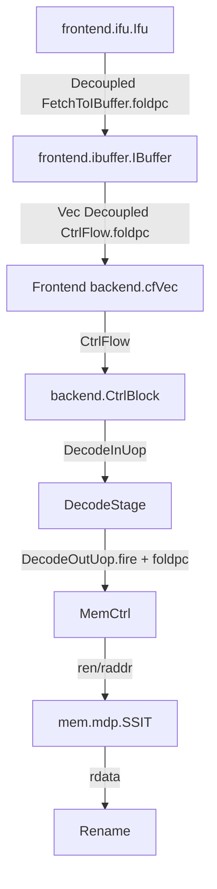

# XiangShan KunMingHu v3 foldPC 生成路径分析

## 分析范围

- 源码路径：`/nfs/home/yanyusong/mdp-kmhv3/XiangShan`
- 源码提交：`055d8ad9e56b0b618f2d549a97f3a028986b4849`
- weekly sync：已执行 skill 要求的检查，结果为 `skip: last sync 0.21 days ago < 7 days`
- 设计文档：`/nfs/home/yuanmiaomiao/XiangShanLab/XiangShan-Design-Doc` 在本机不存在，因此本分析以 KunMingHu v3 源码为准；课程资料可读，用于流水线/译码/多发射背景。

## 结论

KunMingHu v3 对每条送入后端的指令生成 `foldpc` 的有效路径是：

```text
IFU s1 对每个 IBuffer lane 的真实指令 PC 做 XORFold
foldpc = XORFold(pc(VAddrBits - 1, 1), MemPredPCWidth)
MemPredPCWidth = log2Up(WaitTableSize) = log2Up(1024) = 10
```

也就是说，`foldpc` 是一个 10-bit 的 PC 哈希/折叠索引。它丢弃 bit0，因为 RISC-V 指令至少 16-bit 对齐；再把 `pc[VAddrBits-1:1]` 按 10-bit 分组补零后并行异或，得到内存依赖预测器使用的表索引。

它的主要用途不是 debug，也不是精确 PC 存储，而是给 MDP（memory dependency predictor）在 decode/rename 附近查 SSIT/WaitTable。普通硬件前端路径在 `Ifu.scala` 生成；仿真前端 `SimFrontend.scala` 也用同一公式生成。

## Who / Why / How / From What / To What

| 问题 | 回答 |
| --- | --- |
| who | `frontend.ifu.Ifu` 为每个 IBuffer enqueue lane 生成 `foldpc`；`IBuffer`、`CtrlFlow`、`DecodeInUop`、`DecodeOutUop` 透传；`CtrlBlock` 在 decode fire 时送入 `MemCtrl/SSIT`。 |
| why | MDP 表项数量远小于虚拟 PC 空间，需要把每条指令 PC 压缩成固定宽度索引；当前参数下 SSIT/WaitTable 都是 1024 项，所以索引宽度是 10。 |
| how | `XORFold(pc(VAddrBits - 1, 1), MemPredPCWidth)`；`XORFold` 会把输入补零到 `resWidth` 的整数倍，再对每个 `resWidth` 分片并行 XOR。 |
| from what | 普通前端路径来自 IFU 对齐后的每 lane 指令 PC：`s1_alignedInstrPcVec`；MDP 训练路径来自 `pcMem` 读出的 FTQ start PC 加上指令 offset。 |
| to what | decode 阶段发给 `SSIT.io.raddr` 作为读地址；load violation 训练时作为 `MemPredUpdateReq.ldpc/stpc/waddr` 更新 SSIT/WaitTable。 |

## 参数与公式

`MemPredPCWidth` 由等待表大小决定：

```scala
def WaitTableSize = 1024
def MemPredPCWidth = log2Up(WaitTableSize)
def SSITSize = WaitTableSize
```

证据：`src/main/scala/xiangshan/Parameters.scala:818-827`。

`XORFold` 的实现：

```scala
object XORFold {
  def apply(input: UInt, resWidth: Int): UInt = {
    require(resWidth > 0)
    val fold_range = (input.getWidth + resWidth - 1) / resWidth
    val value = ZeroExt(input, fold_range * resWidth)
    ParallelXOR((0 until fold_range).map(i => value(i*resWidth+resWidth-1, i*resWidth)))
  }
}
```

证据：`utility/src/main/scala/utility/BitUtils.scala:236-242`。

因此当前实现可抽象为：

```text
raw = pc[VAddrBits-1:1]
raw_zero_extended = ZeroExt(raw, ceil(width(raw)/10)*10)
foldpc[j] = XOR(raw_zero_extended[j + 10*k] for all k)
```

## 有效生成路径

### 1. IFU s1：先得到每 lane 的真实指令 PC

IFU 先对取回的半字/指令做对齐，得到 `s1_alignedInstrVec`。随后用 `getInstrPc` 生成基础 PC；如果当前 lane 是跨页/跨 fetch block 的后半条指令，或者是无效 taken 边界，它会修正为前一半指令 PC 或 end-half PC：

```scala
private val s1_baseAlignedInstrPcVec = VecInit(s1_alignedInstrVec.map(instr => getInstrPc(instr, s1_fetchBlock)))
private val s1_alignedInstrPcVec = WireDefault(s1_baseAlignedInstrPcVec)
for (i <- 0 until IBufferEnqueueWidth) {
  when(s1_alignedInstrVec(i).isPrevEndHalfRvi) {
    s1_alignedInstrPcVec(i) := s1_prevEndHalfRviPc
  }.elsewhen(s1_alignedInstrVec(i).invalidTaken) {
    s1_alignedInstrPcVec(i) := Mux(
      s1_alignedInstrVec(i).blockSel,
      s1_totalEndHalfRviPc,
      s1_firstEndHalfRviPc
    )
  }
}
```

证据：`src/main/scala/xiangshan/frontend/ifu/Ifu.scala:304-331`。

这一步是关键：`foldpc` 不是按 fetch block 起始 PC 统一生成，而是按每个 IBuffer lane 的最终对齐 PC 逐条生成。

### 2. IFU s1：对每条 lane PC 生成 foldPC

```scala
private val s1_alignedFoldPc =
  VecInit(s1_alignedInstrPcVec.map(i => XORFold(i(VAddrBits - 1, 1), MemPredPCWidth)))
```

证据：`src/main/scala/xiangshan/frontend/ifu/Ifu.scala:336-337`。

这里 `map` 的粒度是 `IBufferEnqueueWidth` 个 lane，所以一拍 fetch bundle 中每条可能 enqueue 的指令都有自己的 `foldpc`。无效 lane 也会被组合计算，但只有 `valid/enqEnable` 允许的 lane 才会进入 IBuffer。

### 3. IFU s1 到 s2：foldPC 随 IFU 流水寄存

```scala
private val s2_alignedInstrPcVec = RegEnable(s1_alignedInstrPcVec, s1_fire)
private val s2_alignedFoldPc     = RegEnable(s1_alignedFoldPc, s1_fire)
```

证据：`src/main/scala/xiangshan/frontend/ifu/Ifu.scala:399-401`。

`s1_fire` 是 s1 到 s2 前进条件；这保证同一批指令的 `pc` 和 `foldpc` 一起进入 s2。s2 里 RVC expand、predecode、prediction check 都不会重算 `foldpc`。

### 4. IFU s2：发送给 IBuffer

IFU 在发送 `FetchToIBuffer` 时把整个 `s2_alignedFoldPc` 向量写入 bundle：

```scala
io.toIBuffer.bits.pc     := s2_alignedInstrPcVec // for debug
...
io.toIBuffer.bits.foldpc := s2_alignedFoldPc
```

证据：`src/main/scala/xiangshan/frontend/ifu/Ifu.scala:524-564`；bundle 字段定义见 `src/main/scala/xiangshan/frontend/Bundles.scala:313-319`。

`FetchToIBuffer` 中 `foldpc` 是 `Vec(IBufferEnqueueWidth, UInt(MemPredPCWidth.W))`，即每个 enqueue lane 一份。

### 5. uncache 特殊路径

uncache 指令只允许单条进入 IBuffer，并覆盖该 lane 的 `instrs/pc/isRvc/offset/valid/enqEnable`：

```scala
when(s2_reqIsUncache) {
  io.toIBuffer.bits.instrs(s2_alignShiftNum) := ...
  io.toIBuffer.bits.pc(s2_alignShiftNum) := uncachePc
  ...
  io.toIBuffer.bits.valid     := Cat(0.U(FetchBlockInstNum.W), UIntToOH(s2_alignShiftNum))
  io.toIBuffer.bits.enqEnable := Cat(0.U(FetchBlockInstNum.W), UIntToOH(s2_alignShiftNum))
}
```

证据：`src/main/scala/xiangshan/frontend/ifu/Ifu.scala:636-662`。

这段没有单独覆盖 `foldpc`。代码依赖前面的 `s2_alignedFoldPc` 已经按同一个 lane 的真实 PC 生成。uncache 请求记录的 `uncachePc` 来自 `s2_prevEndHalfPc` 或 `s2_alignedInstrPcVec(s2_alignShiftNum)`，见 `Ifu.scala:452-464`；普通跨半字 RVI 情况在 s1 也已经通过 `isPrevEndHalfRvi` 修正了 `s1_alignedInstrPcVec`，所以 `foldpc` 与输出 PC 仍然来自同一条指令的地址。

## IBuffer 中的保存与输出

`IBufEntry` 显式保存 `foldpc`：

```scala
class IBufEntry extends IBufferBundle {
  val inst = UInt(32.W)
  val pc = PrunedAddr(VAddrBits)
  val foldpc = UInt(MemPredPCWidth.W)
  ...
  def fromFetch(fetch: FetchToIBuffer, i: Int): IBufEntry = {
    inst := fetch.instrs(i)
    pc := fetch.pc(i)
    foldpc := fetch.foldpc(i)
    ...
  }
}
```

证据：`src/main/scala/xiangshan/frontend/ibuffer/Bundles.scala:49-75`。

输出时，`IBufEntry` 转成 `IBufOutEntry`，再转成后端 `CtrlFlow`：

```scala
result.foldpc := foldpc
...
cf.foldpc := foldpc
```

证据：`src/main/scala/xiangshan/frontend/ibuffer/Bundles.scala:78-97` 和 `:132-158`。

IBuffer 本体有两条输出路径：

- bypass：当 `enqPtr === deqPtr && decodeCanAccept`，新进入 IBuffer 的指令可直接形成输出，`entry.bits` 来自 `enqData`，而 `enqData` 已由 `fromFetch` 携带 `foldpc`。
- 正常队列：`ibuf` 是 `RegInit(VecInit.fill(Size)(...IBufEntry))`，enqueue 时写入完整 `IBufEntry`，dequeue 时按 bank 指针读出完整 entry。

关键证据：

```scala
private val ibuf: Vec[IBufEntry] = RegInit(VecInit.fill(Size)(0.U.asTypeOf(new IBufEntry)))
private val enqData = VecInit.tabulate(EnqueueWidth)(i => Wire(new IBufEntry).fromFetch(io.in.bits, i))
...
ibuf(bank + idx * NumWriteBank) := Mux(wen, writeEntry, ibuf(bank + idx * NumWriteBank))
...
deqEntries(i).bits := Mux1H(UIntToOH(deqBankPtrVec(i).value), readStage1)
```

证据：`src/main/scala/xiangshan/frontend/ibuffer/IBuffer.scala:75-86`、`:149-158`、`:286-302`、`:339-348`。

Frontend 顶层连接证明 IFU 到 IBuffer，再到 backend `cfVec`：

```scala
ifu.io.toIBuffer <> ibuffer.io.in
...
io.backend.cfVec <> ibuffer.io.out
```

证据：`src/main/scala/xiangshan/frontend/Frontend.scala:236-253`。

## 后端 Decode 透传

后端 `CtrlFlow` 本身包含 `foldpc`：

```scala
class CtrlFlow extends XSBundle {
  val instr = UInt(32.W)
  val pc = UInt(VAddrBits.W)
  val foldpc = UInt(MemPredPCWidth.W)
  ...
}
```

证据：`src/main/scala/xiangshan/Bundle.scala:93-98`。

`DecodeInUop` 和 `DecodeOutUop` 也都有 `foldpc`，注释明确写了 `for mdp`：

```scala
class DecodeInUop extends XSBundle {
  val foldpc = UInt(MemPredPCWidth.W) // for mdp
  ...
}
class DecodeOutUop extends XSBundle {
  val foldpc = UInt(MemPredPCWidth.W) // for mdp
  ...
}
```

证据：`src/main/scala/xiangshan/backend/Bundles.scala:106-137`。

`CtrlBlock` 把 frontend `CtrlFlow` 转为 `DecodeInUop`：

```scala
val decodeConnectFromFrontend = Wire(Vec(DecodeWidth, new DecodeInUop))
decodeConnectFromFrontend.zip(decodeFromFrontend).map(x => x._1.connectCtrlFlow(x._2.bits))
...
decodeIn.bits := Mux(decodeBufValid(i), decodeBufBits(i), decodeConnectFromFrontend(i))
```

证据：`src/main/scala/xiangshan/backend/CtrlBlock.scala:500-529`。

`connectCtrlFlow` 用同名端口复制字段，因此会把 `foldpc` 从 `CtrlFlow` 复制进 `DecodeInUop`：

```scala
def connectCtrlFlow(source: CtrlFlow): Unit = {
  connectSamePort(this, source)
  this.isRVC := source.isRvc
  ...
}
```

证据：`src/main/scala/xiangshan/backend/Bundles.scala:122-128`。

普通 DecodeUnit 在查表生成控制信号后，再把 `DecodeInUop` 的字段复制到 `DecodeOutUop`：

```scala
val decodedInst: DecodeOutUop = Wire(new DecodeOutUop()).decode(ctrl_flow.instr, decode_table)
decodedInst.connectDecodeInUop(io.enq.decodeInUop)
```

证据：`src/main/scala/xiangshan/backend/decode/DecodeUnit.scala:822-824`。`connectDecodeInUop` 见 `backend/Bundles.scala:200-204`。

复杂/拆分 uop 路径也继承同一个 decoded inst：`DecodeUnitComp` 的 `csBundle` 先 `dst := latchedInst`，再改写 uop index、FU op 等字段，所以拆出来的 uop 继承原始指令的 `foldpc`。证据：`src/main/scala/xiangshan/backend/decode/DecodeUnitComp.scala:188-199`。

## MDP 读路径：decode fire 时消费 foldPC

`CtrlBlock` 在 decode 输出 fire 时，把每 lane 的 `decode.io.out(i).bits.foldpc` 送给 `MemCtrl`：

```scala
for (i <- 0 until DecodeWidth) {
  mdpFlodPcVecVld(i) := decode.io.out(i).fire
  mdpFlodPcVec(i) := decode.io.out(i).bits.foldpc
}
...
memCtrl.io.mdpFoldPcVecVld := mdpFlodPcVecVld
memCtrl.io.mdpFlodPcVec := mdpFlodPcVec
```

证据：`src/main/scala/xiangshan/backend/CtrlBlock.scala:639-653`。

`MemCtrl` 把这些值接到 `SSIT` 的读使能和读地址：

```scala
for (i <- 0 until RenameWidth) {
  ssit.io.ren(i) := io.mdpFoldPcVecVld(i)
  ssit.io.raddr(i) := io.mdpFlodPcVec(i)
}
io.ssit2Rename := ssit.io.rdata
```

证据：`src/main/scala/xiangshan/backend/ctrlblock/MemCtrl.scala:14-31`。

`SSIT` 读端口定义和使用：

```scala
val ren = Vec(DecodeWidth, Input(Bool()))
val raddr = Vec(DecodeWidth, Input(UInt(MemPredPCWidth.W))) // xor hashed decode pc(VaddrBits-1, 1)
...
valid_array.io.ren.get(i) := io.ren(i)
data_array.io.ren.get(i) := io.ren(i)
valid_array.io.raddr(i) := io.raddr(i)
data_array.io.raddr(i) := io.raddr(i)
io.rdata(i).valid := valid_array.io.rdata(i)
io.rdata(i).ssid := data_array.io.rdata(i).ssid
io.rdata(i).strict := data_array.io.rdata(i).strict
```

证据：`src/main/scala/xiangshan/mem/mdp/StoreSet.scala:52-67`、`:125-140`。

这说明 `foldpc` 是 SSIT 的表索引。读请求在 decode 发起，读结果在 rename 使用。`SSIT` 源码注释也说明 `rdata will be send to rename`，见 `StoreSet.scala:65-67`。

## MDP 训练路径：后端重新折叠 PC 更新表

当 memblock 产生 `mdpTrain` 时，`CtrlBlock` 不是复用某个旧 `foldpc` 字段，而是从 `pcMem` 读出 FTQ start PC，加上 load/store 指令 offset，重新做同一公式：

```scala
val mdpTrainValid = io.fromMem.mdpTrain.valid
...
memCtrl.io.memPredUpdate.ldpc :=
  XORFold((pcMem.io.rdata(pcMemIdx).toUInt + offset)(VAddrBits - 1, 1), MemPredPCWidth)
memCtrl.io.memPredUpdate.waddr :=
  XORFold((pcMem.io.rdata(pcMemIdx).toUInt + offset)(VAddrBits - 1, 1), MemPredPCWidth)
...
memCtrl.io.memPredUpdate.stpc :=
  XORFold((pcMem.io.rdata(pcMemIdx).toUInt + offset)(VAddrBits - 1, 1), MemPredPCWidth)
memCtrl.io.memPredUpdate.valid := RegNext(mdpTrainValid)
```

证据：`src/main/scala/xiangshan/backend/CtrlBlock.scala:217-238`。

`pcMem` 保存的是 FTQ entry 的 start PC，来自 frontend FTQ：

```scala
private val pcMem = Module(new SyncDataModuleTemplate(PrunedAddr(VAddrBits), FtqSize, numPcMemRead, 1, "BackendPC", hasRen = hasRen))
...
pcMem.io.wen.head   := GatedValidRegNext(io.frontend.fromFtq.wen)
pcMem.io.waddr.head := RegEnable(io.frontend.fromFtq.ftqIdx, io.frontend.fromFtq.wen)
pcMem.io.wdata.head := RegEnable(io.frontend.fromFtq.startPc, io.frontend.fromFtq.wen)
```

证据：`src/main/scala/xiangshan/backend/CtrlBlock.scala:75-105`、`:776-778`。

`MemPredUpdateReq` 注释要求 `ldpc/stpc` 默认已经 xor folded：

```scala
// by default, ldpc/stpc should be xor folded
val ldpc = UInt(MemPredPCWidth.W)
val stpc = UInt(MemPredPCWidth.W)
```

证据：`src/main/scala/xiangshan/Bundle.scala:584-596`。

SSIT 更新时用 `ldpc/stpc` 作为写地址，并可进一步把它们折叠到更小的 `SSIDWidth`：

```scala
val s2_ldSsidAllocate = XORFold(s2_mempred_update_req.ldpc, SSIDWidth)
val s2_stSsidAllocate = XORFold(s2_mempred_update_req.stpc, SSIDWidth)
...
update_ld_ssit_entry(pc = s2_mempred_update_req.ldpc, ...)
update_st_ssit_entry(pc = s2_mempred_update_req.stpc, ...)
```

证据：`src/main/scala/xiangshan/mem/mdp/StoreSet.scala:202-230`、`:246-305`。

同一个更新还会写 WaitTable 的 `waddr`：

```scala
when(io.update.valid){
  data(io.update.waddr) := Cat(data(io.update.waddr)(0), true.B)
}
```

证据：`src/main/scala/xiangshan/mem/mdp/WaitTable.scala:33-57`。不过当前 `MemCtrl` 把 `waitTable2Rename` 置为 `DontCare`，SSIT 是有效读路径，见 `MemCtrl.scala:28-31`。

## SimFrontend 等价生成

仿真前端直接把 fetch helper 给出的 PC 做同样折叠：

```scala
cfVec.bits.pc     := fetchOut.pc
cfVec.bits.foldpc := XORFold(fetchOut.pc(VAddrBits - 1, 1), MemPredPCWidth)
```

证据：`src/main/scala/xiangshan/frontend/simfrontend/SimFrontend.scala:233-241`。

这条路径绕过真实 IFU/IBuffer，但保持同一 `foldpc` 语义。

## Theory-to-Code Mapping

| 理论概念 | 课程背景 | 代码实体 | 具体信号 | XiangShan 实现方式 | 与 textbook 的差异 |
| --- | --- | --- | --- | --- | --- |
| 多发射/多 lane 取指到译码 | 超标量处理器每拍处理多条指令 | `FetchToIBuffer`、`IBuffer`、`DecodeStage` | `Vec(IBufferEnqueueWidth, foldpc)`、`Vec(DecodeWidth, ...)` | IFU 对每个 enqueue lane 单独生成 `foldpc`，IBuffer 再按 decode 宽度输出 | 不是单条 PC 逐拍流，而是 vector lane 并行携带 metadata |
| 流水线 metadata 透传 | 指令在流水线中携带控制/异常/PC 信息 | `CtrlFlow`、`DecodeInUop`、`DecodeOutUop` | `foldpc` | 通过 bundle 同名字段和 connect 函数透传 | `foldpc` 是预测器索引，不是 ISA 可见状态 |
| 访存相关性预测 | 动态调度需要处理 load/store 相关性 | `SSIT`、`LFST`、`MemCtrl` | `mdpFlodPcVec`、`ssit.io.raddr` | decode fire 时用 folded PC 查 SSIT，rename 使用结果 | 使用 PC 哈希索引表，存在别名；不是精确按完整 PC 建表 |
| replay/训练 | 错误预测后训练预测器 | `CtrlBlock`、`MemPredUpdateReq`、`SSIT` | `ldpc/stpc/waddr` | 用 FTQ start PC + offset 重新折叠 PC 后更新 MDP 表 | 训练路径重新算 folded PC，不依赖前端保存的那份字段 |

## 数据路径图

```mermaid
flowchart LR
  A[IFU s1 aligned instr PC per lane] --> B[XORFold pc(VAddrBits-1,1)]
  B --> C[s1_alignedFoldPc Vec]
  C --> D[RegEnable on s1_fire]
  D --> E[s2_alignedFoldPc]
  E --> F[FetchToIBuffer.foldpc Vec]
  F --> G[IBufEntry.foldpc]
  G --> H[IBufOutEntry.foldpc]
  H --> I[CtrlFlow.foldpc]
  I --> J[DecodeInUop.foldpc]
  J --> K[DecodeOutUop.foldpc]
  K --> L[CtrlBlock mdpFlodPcVec]
  L --> M[MemCtrl]
  M --> N[SSIT raddr]
```

## 接口图



## 时序图

```waveform-draw
{signal: [
  {name: "s1_fire", wave: "010.."},
  {name: "s1_alignedInstrPcVec", wave: "x=...", data: ["pc per lane"]},
  {name: "s1_alignedFoldPc", wave: "x=...", data: ["XORFold(pc>>1)"]},
  {name: "s2_alignedFoldPc", wave: "x.=-.", data: ["registered foldpc"]},
  {name: "toIBuffer.valid", wave: "0.1.."},
  {name: "toIBuffer.ready", wave: "1.1.."},
  {name: "toIBuffer.fire", wave: "0.1.."},
  {name: "IBuffer entry foldpc", wave: "x..=.", data: ["stored or bypassed"]},
  {name: "decode.out.fire", wave: "0...1"},
  {name: "SSIT.ren/raddr", wave: "0...1", data: ["foldpc as raddr"]}
]}
```

## 关键边界条件

1. 无效 lane：`foldpc` 仍可能被组合生成，但 `FetchToIBuffer.valid/enqEnable` 决定是否进入 IBuffer。证据：`Ifu.scala:524-529`，`IBuffer.scala:292-302`。
2. IBuffer flush：flush 清空指针和输出 valid，但不需要单独清 `foldpc`；无效 entry 不会被消费。证据：`IBuffer.scala:407-423`。
3. Decode stall：`foldpc` 与其他 decoded metadata 一样被 decode buffer 或 pipeline register 保持；`CtrlBlock.scala:500-529` 描述 frontend 输入和 decode buffer 的选择。
4. 指令融合：fusion 可能清掉第二条进入 rename/dispatch 的有效性，但 `mdpFlodPcVecVld` 使用 `decode.io.out(i).fire`，发生在 fusion clear 前的 decode 输出 fire；因此 MDP 读以 decode 原始 lane 为粒度。证据：`CtrlBlock.scala:590-645`。
5. 复杂指令拆分：拆分出的 uop 继承同一个 `foldpc`，因为 `DecodeUnitComp` 从 `latchedInst` 复制整个 `DecodeOutUop`。证据：`DecodeUnitComp.scala:188-199`。

## 简化伪代码

```scala
// IFU, per IBuffer enqueue lane
for (lane <- 0 until IBufferEnqueueWidth) {
  pc0 = getInstrPc(alignedInstr(lane), fetchBlock)
  pc1 =
    if (alignedInstr(lane).isPrevEndHalfRvi) prevEndHalfRviPc
    else if (alignedInstr(lane).invalidTaken) selectedEndHalfRviPc
    else pc0

  foldpc(lane) = XORFold(pc1(VAddrBits - 1, 1), MemPredPCWidth)
}

// IBuffer/Decode
if (toIBuffer.fire && valid(lane) && enqEnable(lane)) {
  ibufEntry.foldpc = foldpc(lane)
}
decodeOut.foldpc = ibufEntry.foldpc

// MDP read
if (decodeOut.fire) {
  ssit.ren(lane) = true
  ssit.raddr(lane) = decodeOut.foldpc
}

// MDP training after memory violation
ldpc = XORFold((pcMem(loadFtqIdx) + loadOffset)(VAddrBits - 1, 1), MemPredPCWidth)
stpc = XORFold((pcMem(storeFtqIdx) + storeOffset)(VAddrBits - 1, 1), MemPredPCWidth)
ssit.update(ldpc, stpc)
```

## 源码索引

| 主题 | 文件与行号 |
| --- | --- |
| `MemPredPCWidth` 参数 | `src/main/scala/xiangshan/Parameters.scala:818-827` |
| `XORFold` 算法 | `utility/src/main/scala/utility/BitUtils.scala:236-242` |
| IFU 每 lane PC 修正 | `src/main/scala/xiangshan/frontend/ifu/Ifu.scala:304-337` |
| IFU s1/s2 寄存 | `src/main/scala/xiangshan/frontend/ifu/Ifu.scala:397-403` |
| IFU 发送 `foldpc` | `src/main/scala/xiangshan/frontend/ifu/Ifu.scala:524-564` |
| uncache 单指令覆盖 | `src/main/scala/xiangshan/frontend/ifu/Ifu.scala:636-662` |
| `FetchToIBuffer.foldpc` | `src/main/scala/xiangshan/frontend/Bundles.scala:313-319` |
| IBuffer entry 保存/输出 | `src/main/scala/xiangshan/frontend/ibuffer/Bundles.scala:49-97`、`:132-158` |
| IBuffer enqueue/dequeue | `src/main/scala/xiangshan/frontend/ibuffer/IBuffer.scala:75-86`、`:149-158`、`:286-348` |
| Frontend 连接 | `src/main/scala/xiangshan/frontend/Frontend.scala:236-253` |
| `CtrlFlow.foldpc` | `src/main/scala/xiangshan/Bundle.scala:93-98` |
| Decode bundle 透传 | `src/main/scala/xiangshan/backend/Bundles.scala:106-137`、`:200-204` |
| DecodeUnit 透传 | `src/main/scala/xiangshan/backend/decode/DecodeUnit.scala:822-824` |
| DecodeStage 输出 | `src/main/scala/xiangshan/backend/decode/DecodeStage.scala:225-258` |
| CtrlBlock 送入 MDP | `src/main/scala/xiangshan/backend/CtrlBlock.scala:639-653` |
| MemCtrl 接 SSIT | `src/main/scala/xiangshan/backend/ctrlblock/MemCtrl.scala:14-31` |
| SSIT 读/更新 | `src/main/scala/xiangshan/mem/mdp/StoreSet.scala:52-67`、`:125-140`、`:202-230`、`:246-305` |
| MDP 训练折叠 | `src/main/scala/xiangshan/backend/CtrlBlock.scala:217-238` |
| SimFrontend 等价路径 | `src/main/scala/xiangshan/frontend/simfrontend/SimFrontend.scala:233-241` |
