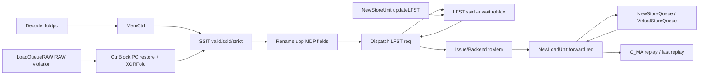
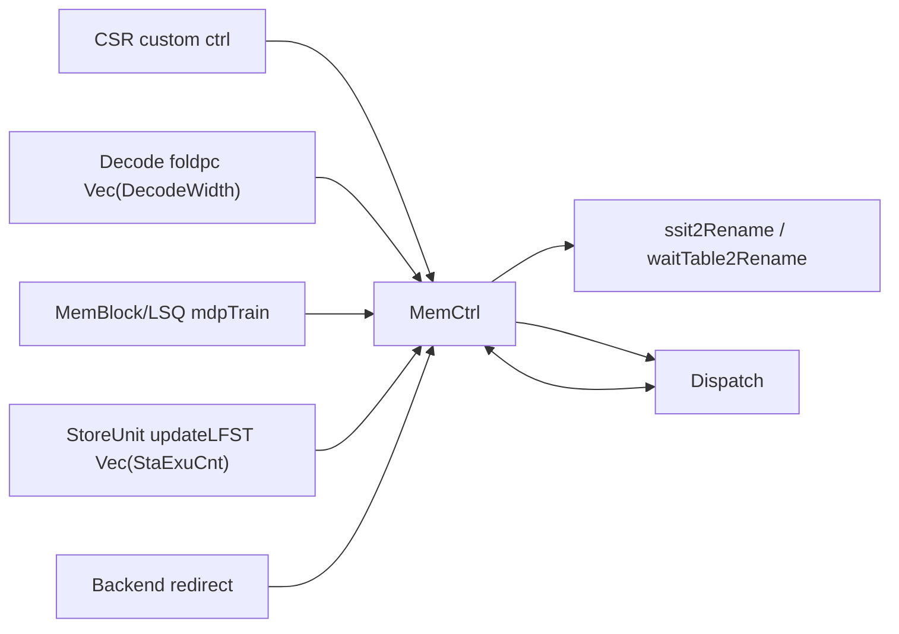
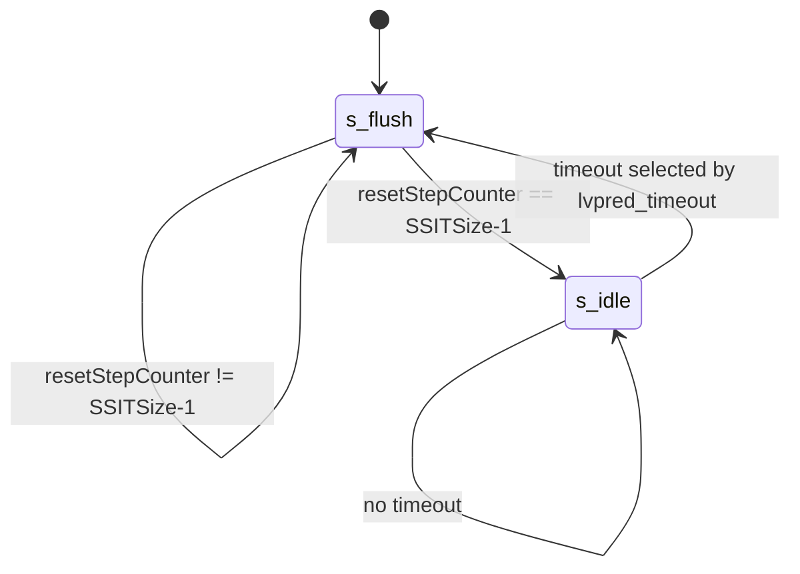

# XiangShan KunMingHu v3 MDP 代码分析

## 1. Scope

- 使用的 skill：`tools/analyze-xiangshan-kunminghu`
- 分析对象：`/nfs/home/yanyusong/mdp-kmhv3/XiangShan`
- 分析源码 commit：`055d8ad9e56b0b618f2d549a97f3a028986b4849`
- 主要源码根：`src/main/scala/xiangshan`
- 主要模块：`SSIT`、`LFST`、`WaitTable`、`MemCtrl`、`DispatchLFSTIO`、`LoadQueueRAW`、`VirtualStoreQueue`、`NewStoreQueue`、`NewLoadUnit`
- 子系统上下文：backend decode/rename/dispatch、mem LSQ、load/store pipeline、CSR custom control
- weekly sync 状态：已按 skill 执行 `tools/analyze-xiangshan-kunminghu/scripts/weekly_sync.py`。结果显示 `/nfs/home/yuanmiaomiao/XiangShanLab` 存在但不是 git 仓库，`XiangShan-Design-Doc` 缺失，课程深度解析目录存在但 git status 受 dubious ownership 限制。因此本文的设计文档上下文只使用 skill references，所有行为结论以 KunMingHu v3 本地源码为准。
- paper context：源码在 `StoreSet.scala` 中直接引用 Chrysos/Emer 的 Store Sets 论文；`WaitTable.scala` 引用 Alpha 21264。当前环境未暴露 `paper-search-agent-mcp` 工具，因此没有额外 MCP 检索结果，本文明确区分“论文原则”和“源码实际行为”。

结论先行：KunMingHu v3 的有效 MDP 路径是 Store Set 风格的 load violation predictor，由 `SSIT + LFST` 组成。`WaitTable` 源码仍存在，但 `MemCtrl` 中没有实例化，`waitTable2Rename` 被接成 `DontCare`，因此当前有效路径不是 Alpha 21264-like Load Wait Table。

## 2. 关键源码证据

| 主题 | 文件:行号 | 核心代码 | 证明 |
| --- | --- | --- | --- |
| MDP 参数 | `Parameters.scala:818-831` | `WaitTableSize = 1024`，`LFSTSize = 64`，`StoreSetEnable = true` | Store Set 表大小、SSID 宽度和启用状态 |
| uop MDP 字段 | `Bundle.scala:105-113` | `storeSetHit`、`waitForRobIdx`、`loadWaitBit`、`loadWaitStrict`、`ssid` | MDP 预测结果随 uop 流动 |
| MemCtrl 实例化 | `MemCtrl.scala:14-30` | `private val ssit = Module(new SSIT)`，`private val lfst = Module(new LFST)`，`waitTable2Rename := DontCare` | SSIT/LFST 有效，WaitTable 无效 |
| Decode 到 SSIT | `CtrlBlock.scala:640-646`，`MemCtrl.scala:19-22` | `mdpFlodPcVec(i) := decode.io.out(i).bits.foldpc`，`ssit.io.raddr(i) := io.mdpFlodPcVec(i)` | folded PC 是 SSIT lookup index |
| Rename 写入 uop | `Rename.scala:453-459` | `storeSetHit := io.ssit(i).valid`，`loadWaitStrict := io.ssit(i).strict`，`ssid := io.ssit(i).ssid` | SSIT 结果进入 uop |
| Dispatch 查 LFST | `Dispatch.scala:759-769` | `io.lfst.req(i).valid := ... storeSetHit`，`loadWaitBit := io.lfst.resp(i).bits.shouldWait` | LFST 覆盖最终 wait 信息 |
| LFST 查找规则 | `StoreSet.scala:383-412` | `shouldWait := (valid(ssid) || hitInDispatchBundle) ...` | store set 当前有未发射 store 时让 load 等待 |
| SSIT 训练 | `StoreSet.scala:170-306` | 读取 load/store PC 的 SSIT 项，再按四种情况更新 | RAW violation 训练 Store Set |
| RAW 违例训练源 | `LoadQueueRAW.scala:377-396` | `io.mdpTrain := Mux1H(oldestOH, allRedirect)` | 违例 redirect 同时训练 MDP |
| PC 还原和 fold | `CtrlBlock.scala:217-238` | `XORFold((pcMem.io.rdata(...) + offset)(VAddrBits - 1, 1), MemPredPCWidth)` | 训练端 load/store PC 变成 SSIT index |
| StoreUnit 释放 LFST | `NewStoreUnit.scala:415`，`NewStoreUnit.scala:515-518` | `updateLFST.valid`，`bits.robIdx/ssid/storeSetHit` | store 地址发射后清除 LFST 依赖 |
| StoreQueue 消费 MDP | `VirtualStoreQueue.scala:229-245`，`NewStoreQueue.scala:509-543`，`NewStoreQueue.scala:620-621` | 非 strict 查 `waitForRobIdx`，strict 查所有更老 store 地址 | load 是否 replay/等待的直接条件 |
| Load replay cause | `NewLoadUnit.scala:1077-1084` | `cause(C_MA) := troubleMaker && uop.storeSetHit && sqAddrInvalid` | MDP 等待未满足时触发 memory address replay |
| CSR 控制 | `CSRCustom.scala:99-104`，`NewCSR.scala:1437-1441` | `LVPRED_DISABLE`、`NO_SPEC_LOAD`、`STORESET_WAIT_STORE`、`LVPRED_TIMEOUT` | CSR 控制 MDP 开关、保守模式和清空周期 |

## 3. Theory-to-Code Mapping

| 理论概念 | 课程/理论语义 | 代码实体 | 具体信号/状态 | KunMingHu v3 实现方式 | 与教科书模型差异 |
| --- | --- | --- | --- | --- | --- |
| RAW memory dependence | younger load 可能越过 older store 错误执行 | `LoadQueueRAW`、`SSIT`、`LFST` | `mdpTrain`、`storeSetHit`、`waitForRobIdx` | 先允许 load 推测执行，违例后训练 predictor，下次通过 LFST 等待相关 store | 不是静态阻塞所有 load，而是按 PC 历史学习 |
| Scoreboard-like readiness | 动态调度需要判断依赖是否 ready | `NewStoreQueue` forward path | `addrInvalid.valid`、`loadWaitStrict` | load 查询 SQ 时，如果预测依赖 store 地址未 ready，则 replay | 依赖不是寄存器 ready bit，而是 store address readiness |
| ROB precise recovery | 乱序执行需精确回滚 | `Redirect`、`RobPtr` | `rollbackLqWb.bits.robIdx`、`needFlush` | RAW 违例产生 redirect，flush 错误 load 及更年轻指令 | MDP training 绑定在 redirect 元数据上 |
| Speculation | 为性能允许 load 越过 store | `loadWaitBit`、`no_spec_load` | `StoreSetEnable`、`LVPRED_DISABLE`、`NO_SPEC_LOAD` | 默认只对预测危险的 load 加等待；CSR 可关闭推测 load | 预测器是性能/正确性折中，不是架构可见状态 |
| Superscalar multi-width | 多条指令并行 decode/rename/dispatch | `DecodeWidth`、`RenameWidth` | `Vec(RenameWidth, ...)` | SSIT 和 LFST 读请求都是按宽度向量化 | 同一 dispatch bundle 内的 store-load 也要处理 |

## 4. 论文原则和有效代码

`StoreSet.scala:19-22` 写明实现受 Store Sets 论文启发。Store Sets 的原则是：当某个 load 和 store 曾经发生 memory order violation，把它们归入同一个 store set；后续 load 只等待该 set 中最近的 store，而不是保守等待所有 store。

KunMingHu v3 的对应实现：

- `SSIT` 负责 PC 到 `ssid` 的映射和 strict 位。
- `LFST` 负责 `ssid` 到当前 inflight store ROB index 的映射。
- `LoadQueueRAW` 发现真实 RAW 违例后训练 `SSIT`。

`WaitTable.scala:19-21` 引用 Alpha 21264，代码实现了 2-bit counter wait table。但由于 `MemCtrl.scala:28-30` 没有实例化并连接 WaitTable，本文把它归类为非有效路径。

## 5. Microarchitecture Parameters

| 参数 | 定义位置 | 值/表达式 | 影响 |
| --- | --- | --- | --- |
| `LoadDependencyWidth` | `Parameters.scala:181` | `2` | issue/wakeup 侧 load dependency metadata 宽度 |
| `ResetTimeMax2Pow` | `Parameters.scala:819` | `20` | predictor reset counter 最大位宽 |
| `ResetTimeMin2Pow` | `Parameters.scala:820` | `14` | CSR timeout 选择窗口低位 |
| `WaitTableSize` | `Parameters.scala:822` | `1024` | WaitTable/SSIT index 空间 |
| `MemPredPCWidth` | `Parameters.scala:823` | `log2Up(WaitTableSize)` | folded PC 宽度 |
| `LWTUse2BitCounter` | `Parameters.scala:824` | `true` | WaitTable 读 counter 高位；当前非有效路径 |
| `SSITSize` | `Parameters.scala:826` | `WaitTableSize` | SSIT 表项数 |
| `LFSTSize` | `Parameters.scala:827` | `64` | store set 数量 |
| `SSIDWidth` | `Parameters.scala:828` | `log2Up(LFSTSize)` | `ssid` 字段宽度 |
| `LFSTWidth` | `Parameters.scala:829` | `2` | 每个 store set 可记录的 inflight store 数 |
| `StoreSetEnable` | `Parameters.scala:830` | `true` | Dispatch 使用 LFST 覆盖 `loadWaitBit` |
| `LFSTEnable` | `Parameters.scala:831` | `true` | LFST 路径保留参数 |

## 6. 模块边界和接口

### 6.1 `MemCtrl`

`MemCtrl` 是 backend 控制块内的 MDP 容器。它拥有 `SSIT` 和 `LFST`，并把来自 decode/redirect/store issue/CSR/RAW training 的信号组织起来：

```scala
private val ssit = Module(new SSIT)
private val lfst = Module(new LFST)
ssit.io.update <> RegNext(io.memPredUpdate)
...
lfst.io.redirect <> RegNext(io.redirect)
lfst.io.storeIssue <> RegNext(io.stIn)
```

证据：`MemCtrl.scala:14-25`。

它没有实例化 WaitTable：

```scala
//  io.waitTable2Rename := waittable.io.rdata
io.waitTable2Rename := DontCare
io.ssit2Rename := ssit.io.rdata
```

证据：`MemCtrl.scala:28-30`。

### 6.2 `SSIT`

`SSIT` 的输入包括 decode 读端口、训练更新、CSR 控制；输出给 rename：

```scala
val ren = Vec(DecodeWidth, Input(Bool()))
val raddr = Vec(DecodeWidth, Input(UInt(MemPredPCWidth.W)))
val rdata = Vec(RenameWidth, Output(new SSITEntry))
val update = Input(new MemPredUpdateReq)
val csrCtrl = Input(new CustomCSRCtrlIO)
```

证据：`StoreSet.scala:54-63`。

### 6.3 `LFST`

`LFST` 接收 dispatch 查询、store issue 释放、redirect 恢复和 CSR 控制：

```scala
val redirect = Input(Valid(new Redirect))
val dispatch = Flipped(new DispatchLFSTIO)
val storeIssue = Vec(backendParams.StaExuCnt, Flipped(Valid(new StoreUnitToLFST)))
val csrCtrl = Input(new CustomCSRCtrlIO)
```

证据：`StoreSet.scala:366-373`。

### 6.4 Load/Store queue 侧接口

Load pipeline 发出的 store forward request 携带 MDP 字段：

```scala
storeForwardReq.loadWaitBit := uop.loadWaitBit
storeForwardReq.loadWaitStrict := uop.loadWaitStrict
storeForwardReq.ssid := uop.ssid
storeForwardReq.storeSetHit := uop.storeSetHit
storeForwardReq.waitForRobIdx := uop.waitForRobIdx
```

证据：`NewLoadUnit.scala:355-363`。

## 7. 为什么 MDP 存在

没有 MDP 时，处理器有两个极端选择：

1. 允许所有 load 越过更老 store：性能好，但一旦 store 地址后来证明与 load 地址冲突，就要 redirect/replay。
2. 让所有 load 等待所有更老 store 地址：正确但过度保守，损害乱序执行吞吐。

KunMingHu v3 的 MDP 走中间路线：默认推测，遇到 RAW 违例后通过 Store Set 记录“哪些 PC 组合曾经冲突”。后续只让相关 load 等待预测相关的 store；如果同一 set 反复冲突，则升级到 strict wait，等待所有更老 store 地址。

## 8. 有效动态路径

### 8.1 Lookup path

1. Decode 输出 folded PC：`CtrlBlock.scala:640-646`。
2. `MemCtrl` 使用 folded PC 读 SSIT：`MemCtrl.scala:19-22`。
3. Rename 把 SSIT 的 `valid/ssid/strict` 写入 uop：`Rename.scala:453-456`。
4. Dispatch 对 `storeSetHit` 的 uop 查询 LFST：`Dispatch.scala:759-762`。
5. LFST 输出 `shouldWait` 和 `robIdx`：`StoreSet.scala:399-408`。
6. Dispatch 覆盖 uop 的 `loadWaitBit/waitForRobIdx/loadWaitStrict`：`Dispatch.scala:764-769`。
7. Backend 将 MDP 字段送入 memory exu：`Backend.scala:483-492`。
8. LoadUnit 转发给 StoreQueue：`NewLoadUnit.scala:355-363`。
9. StoreQueue 返回 `addrInvalid`，LoadUnit 生成 `C_MA` replay cause：`NewStoreQueue.scala:620-621`、`NewLoadUnit.scala:1083`。

### 8.2 Training path

1. `LoadQueueRAW` 发现 store-load RAW 违例，生成 redirect：`LoadQueueRAW.scala:377-391`。
2. 最老 redirect 同时作为 `mdpTrain`：`LoadQueueRAW.scala:395-396`。
3. `MemBlock` 和 `XSCore` 把 `mdpTrain` 接到 backend：`MemBlock.scala:1071`、`XSCore.scala:147-148`。
4. `CtrlBlock` 读取 FTQ PC memory，加 offset 还原 load/store PC，再 XOR fold：`CtrlBlock.scala:217-238`。
5. `MemCtrl` 将 `memPredUpdate` 打一拍后送入 SSIT：`MemCtrl.scala:16`。
6. `SSIT` 根据 load/store 两端旧状态更新 `ssid` 和 strict 位：`StoreSet.scala:170-306`。

### 8.3 Release/recovery path

1. StoreUnit 地址发射成功后产生 `updateLFST`：`NewStoreUnit.scala:415`、`NewStoreUnit.scala:515-518`。
2. `MemBlock` 传到 `backend.io.mem.stIn`：`MemBlock.scala:1016-1018`、`XSCore.scala:143-145`。
3. LFST 清除匹配 `ssid/robIdx` 的有效项：`StoreSet.scala:414-422`。
4. redirect 时 LFST 清除被 flush 的 store 项并恢复 `allocPtr`：`StoreSet.scala:439-459`。

## 9. Index 和地址计算

| index/address | 定义位置 | 输入 | 计算 | 宽度/范围 | 消费者 |
| --- | --- | --- | --- | --- | --- |
| SSIT lookup index | `CtrlBlock.scala:640-646`、`MemCtrl.scala:19-22` | `decode.io.out(i).bits.foldpc` | 前端/译码侧已形成的 folded PC | `MemPredPCWidth`，默认 10 bit | SSIT `raddr` |
| SSIT train load PC | `CtrlBlock.scala:217-228` | load `ftqIdx` + `ftqOffset` | `(pcMem.rdata + offset)(VAddrBits-1,1)` 后 `XORFold(..., MemPredPCWidth)` | 默认 10 bit | `MemPredUpdateReq.ldpc/waddr` |
| SSIT train store PC | `CtrlBlock.scala:230-236` | store `stFtqIdx` + `stFtqOffset` | 同 load 训练路径 | 默认 10 bit | `MemPredUpdateReq.stpc` |
| SSID allocation | `StoreSet.scala:211-215` | `ldpc/stpc` | `XORFold(pc, SSIDWidth)` 后取较小者 | `SSIDWidth = log2Up(64)` | SSIT data entry |
| LFST lookup index | `StoreSet.scala:399-404` | dispatch req `ssid` | 直接用 `ssid` 索引 `validVec/robIdxVec/allocPtr` | 0 到 63 | LFST response |
| LFST alloc slot | `StoreSet.scala:424-437` | dispatch store `ssid` | `wptr = allocPtr(waddr)`，写后 `allocPtr(waddr) + 1.U` | `LFSTWidth = 2` 的环形槽 | `validVec(ssid)(wptr)` |
| precise MDP store ptr | `VirtualStoreQueue.scala:234-245` | `waitForRobIdx` | 在 virtual SQ 中按 ROB index 匹配，再 `ParallelPriorityEncoder` | StoreQueue entry range | physical SQ forward |

重要冲突点：

- SSIT update 复用 decode read port。源码注释说明 `io.update.valid` 时会 redirect frontend，因此 decode 不需要同周期读 SSIT（`StoreSet.scala:69-77`、`StoreSet.scala:176-187`）。
- SSIT 两个写端口若同地址，store write port 被关闭，避免同表项双写（`StoreSet.scala:308-315`）。
- LFST 每个 `ssid` 只有 `LFSTWidth = 2` 个槽。新 store dispatch 覆盖仍有效槽时，`LFST_Overflow_Count` 累加（`StoreSet.scala:424-437`、`StoreSet.scala:461`）。

## 10. 核心算法

### 10.1 SSIT update algorithm

Owner：`SSIT`

源码：`StoreSet.scala:170-306`

原则：当 RAW violation 发生，读取 load PC 和 store PC 的旧 SSIT 状态，再合并或分配 store set。

核心伪代码：

```text
if !loadAssigned && !storeAssigned:
  ssid = min(hash(ldpc), hash(stpc))
  SSIT[ldpc] = {valid, ssid, strict=false}
  SSIT[stpc] = {valid, ssid, strict=false}
else if loadAssigned && !storeAssigned:
  SSIT[stpc] = {valid, hash(ldpc), strict=false}
else if !loadAssigned && storeAssigned:
  SSIT[ldpc] = {valid, hash(stpc), strict=false}
else:
  winner = min(loadOldSSID, storeOldSSID)
  SSIT[ldpc] = {valid, winner, strict=false}
  SSIT[stpc] = {valid, winner, strict=false}
  if loadOldSSID == storeOldSSID:
    SSIT[ldpc].strict = true
```

注意：源码在 `b10` 和 `b01` 分支里使用 `s2_ldSsidAllocate` / `s2_stSsidAllocate`，而不是直接复用 `s2_loadOldSSID` / `s2_storeOldSSID`（`StoreSet.scala:264-283`）。因此本文只描述代码实际行为，不把它强行解释成论文原文的理想版本。

同时请求场景：一次 update 同时需要读 load/store 两个 PC；SSIT 为此保留两个 read ports（`SSIT_UPDATE_LOAD_READ_PORT = 0`、`SSIT_UPDATE_STORE_READ_PORT = 1`）。若 load/store PC 折叠后同地址，后面的 store write 被 mask 掉，load 侧写入胜出（`StoreSet.scala:308-315`）。

### 10.2 LFST lookup/update algorithm

Owner：`LFST`

源码：`StoreSet.scala:383-461`

查找规则：

```scala
shouldWait :=
  ((valid(ssid) || hitInDispatchBundle) &&
   req.valid &&
   (!isstore || csrCtrl.storeset_wait_store)) &&
  !csrCtrl.lvpred_disable ||
  csrCtrl.no_spec_load
```

行为：

- 如果同一 `ssid` 已有未发射 store，后续 load 等待该 store。
- 如果同一 dispatch bundle 内前面 slot 有相同 `ssid` 的 store，即使 LFST 还没写，也让后面的 load 等待。
- 默认 store 本身不等待，除非 CSR `storeset_wait_store` 置位。
- `no_spec_load` 强制保守等待。

更新/释放：

- store dispatch 时写入 `validVec(ssid)(allocPtr)` 和 `robIdxVec`，`allocPtr` 自增。
- store 地址发射后，按 `ssid/robIdx` 清除对应 valid。
- redirect 时，所有 `robIdx.needFlush(io.redirect)` 的项清除。

### 10.3 StoreQueue MDP wait algorithm

Owner：`VirtualStoreQueue` + `NewStoreQueue` forward module

源码：`VirtualStoreQueue.scala:229-245`、`NewStoreQueue.scala:489-543`、`NewStoreQueue.scala:620-621`

非 strict：

- 用 `waitForRobIdx` 在 virtual store queue 中找对应 store。
- 如果对应 physical SQ entry 地址仍 invalid，返回 `addrInvalid.valid`。
- load replay，等待 store 地址产生。

Strict：

- `s1StrictMdpWait = s1LoadWaitStrict && (s1HasAddrInvalidVec.orR || s1LoadOutOfRange)`。
- 只要任意更老 store 地址未 ready，load 就等待。

这正是 Store Set 的二级保护：普通情况下只等一个预测 store；同一 set 反复违例后改为等待所有 older store 地址。

## 11. 状态和存储结构

| 结构 | owner | reset/初始值 | search/read | update | release/clear | 冲突行为 |
| --- | --- | --- | --- | --- | --- | --- |
| SSIT `valid_array` | `SSIT` | flush 状态逐项写 false | decode 读 folded PC；update 复用读端口 | RAW violation 后写 load/store PC 项 | timeout flush 清 valid | update 同地址时 store write port 被关闭 |
| SSIT `data_array` | `SSIT` | data 默认 0，valid 决定有效性 | 同 valid array | 写 `ssid/strict` | valid false 后语义无效 | 同地址双写时 store write port 被关闭 |
| SSIT reset FSM | `SSIT` | `state = s_flush` | 无 | `s_idle` 等 timeout | `s_flush` 逐项清 valid | flush 期间占用 misc write port |
| LFST `validVec` | `LFST` | 全 false | dispatch 按 `ssid` 查询 | store dispatch set true | store issue 或 redirect clear | 同 `ssid` 超过 2 个 store 会覆盖并计 overflow |
| LFST `robIdxVec` | `LFST` | 未显式 reset，valid 控制语义 | dispatch 返回 last store robIdx | store dispatch 写 robIdx | valid clear 后语义无效 | `allocPtr-1` 返回最近写入槽 |
| LFST `allocPtr` | `LFST` | 全 0 | dispatch response 读取 `allocPtr-1` | store dispatch 自增 | redirect 后行为模型式恢复 | 多 dispatch store 同一 ssid 时按 loop 生成逻辑，需注意写冲突综合语义 |
| Virtual SQ MDP hit vec | `VirtualStoreQueue` | 无持久状态，s1/s2 寄存 | 按 `waitForRobIdx` CAM | 无 | request valid 控制寄存 | 多 entry 命中时 `ParallelPriorityEncoder` 选一个 |

## 12. Pipeline stage 分析

| 阶段 | 主要代码 | 工作 | 关键 payload/control | stall/flush/replay 行为 | 输出 |
| --- | --- | --- | --- | --- | --- |
| Decode/SSIT read | `CtrlBlock.scala:640-646`、`MemCtrl.scala:19-22` | 发送 folded PC 到 SSIT | `mdpFlodPcVecVld`、`mdpFlodPcVec` | decode fire 才读 | SSIT rdata 下一阶段给 rename |
| Rename | `Rename.scala:453-459` | 将 SSIT 结果写入 uop | `storeSetHit`、`ssid`、`loadWaitStrict` | redirect 由 rename/ctrl block 主路径处理 | uop 到 dispatch |
| Dispatch/LFST read+update | `Dispatch.scala:759-769`、`StoreSet.scala:383-437` | 查当前 store set 是否有 older store；store dispatch 写 LFST | `LFSTReq`、`LFSTResp` | bundle 内 store-load 同 cycle 特判 | `loadWaitBit/waitForRobIdx` |
| Issue to Mem | `Backend.scala:483-492` | 将 MDP 字段送入 mem exu | `EnableMdp` gate | 可用 Constantin 关 MDP | `ExuInput` |
| Load s0 forward request | `NewLoadUnit.scala:355-363` | load 发 StoreQueue forward 请求时携带 MDP | `StoreForwardReqS0` | load pipeline kill/redirect 由 LoadUnit 控制 | SQ forward query |
| StoreQueue s1/s2 | `NewStoreQueue.scala:390-543` | 计算 strict/non-strict MDP wait 和 forward 命中 | `s1LoadWaitStrict`、`s2MdpQueryResp` | 地址未 ready 形成 `addrInvalid` | forward resp |
| Load replay decision | `NewLoadUnit.scala:1077-1084` | 根据 `sqAddrInvalid` 设置 replay cause | `cause(C_MA)` | replay/fast replay | replay queue / writeback control |
| RAW train | `LoadQueueRAW.scala:377-396`、`CtrlBlock.scala:217-238` | 违例 redirect 训练 SSIT | `mdpTrain`、`MemPredUpdateReq` | redirect flush wrong-path load | SSIT update |

## 13. Control path rationale

| 控制信号 | producer | consumer | 为什么存在 | 场景 |
| --- | --- | --- | --- | --- |
| `storeSetHit` | Rename from SSIT | Dispatch、LoadUnit、StoreUnit | 标记 uop 是否属于已学习 store set | 某 load PC 曾违例，后续 rename 后需要查 LFST |
| `loadWaitBit` | Dispatch from LFST | StoreQueue/NewLoadUnit | 表示当前 load 需要等待预测 store 地址 | LFST 中同 ssid 有 older store 未 issue |
| `waitForRobIdx` | LFST | VirtualStoreQueue | 精确指出非 strict 要等哪个 store | younger load 只等历史相关 older store |
| `loadWaitStrict` | SSIT + LFST | StoreQueue | 多次同 set 违例后保守等待所有 older stores | 同一 load/store set 再次违例，单点等待不够 |
| `mdpTrain.valid` | LoadQueueRAW | CtrlBlock/SSIT | 真实 RAW 违例后训练预测器 | store 地址发现 younger load 已错误执行 |
| `updateLFST.valid` | StoreUnit | LFST | store 地址已算出，可释放等待它的 load | store TLB hit 且合法 issue |
| `lvpred_disable` | CSR | SSIT/LFST/WaitTable | 调试或性能实验时关闭 predictor | 怀疑 MDP 导致错误 replay 行为 |
| `no_spec_load` | CSR | LFST/WaitTable | 强制无推测 load | 需要验证 memory ordering 正确性 |

## 14. Data path

MDP data path 可分为三个闭环：

1. 预测信息随 uop 前进：`foldpc -> SSIT(valid, ssid, strict) -> uop.storeSetHit/ssid/loadWaitStrict -> LFST(waitForRobIdx/loadWaitBit) -> LoadUnit -> StoreQueue`。
2. store 生命周期反馈：`dispatch store -> LFST validVec/robIdxVec set -> StoreUnit address issue -> updateLFST -> LFST clear`。
3. 违例训练反馈：`LoadQueueRAW violation -> Redirect(ftq/offset + stFtq/offset) -> CtrlBlock PC restore and XORFold -> SSIT update`。

这些 data path 都是微架构状态，不改变架构寄存器或内存可见结果；错误预测只导致 replay/redirect。

## 15. 异常、debug、privilege

MDP 本身不产生架构异常；它产生 replay/redirect 条件。真实 RAW violation 使用 `Redirect` 让 backend/frontend 回滚，而不是提交异常。LoadUnit 中 `cause(C_MA)` 是 replay cause，不是 page fault/access fault。TLB page fault/access fault/guest page fault 等异常仍由 LoadUnit/TLB 路径处理，优先级在 LoadUnit replay/exception 逻辑中统一决策；本文仅覆盖 MDP 相关 memory-address replay。

## 16. CSR 控制

`Slvpredctl` 地址为 `0x5C2`（`CSRConst.scala:22-27`）。新 CSR 框架字段：

```scala
val LVPRED_TIMEOUT          = SlvpredCtlTimeOut(8, 4)
val STORESET_NO_FAST_WAKEUP = RW(3)
val STORESET_WAIT_STORE     = RW(2)
val NO_SPEC_LOAD            = RW(1)
val LVPRED_DISABLE          = RW(0)
```

证据：`CSRCustom.scala:99-104`。

CSR 输出连接到 custom control：

```scala
io.status.custom.lvpred_disable          := slvpredctl.regOut.LVPRED_DISABLE.asBool
io.status.custom.no_spec_load            := slvpredctl.regOut.NO_SPEC_LOAD.asBool
io.status.custom.storeset_wait_store     := slvpredctl.regOut.STORESET_WAIT_STORE.asBool
io.status.custom.storeset_no_fast_wakeup := slvpredctl.regOut.STORESET_NO_FAST_WAKEUP.asBool
io.status.custom.lvpred_timeout          := slvpredctl.regOut.LVPRED_TIMEOUT.asUInt
```

证据：`NewCSR.scala:1437-1441`。

## 17. Diagrams

### 17.1 Data-path diagram



### 17.2 Module-interface diagram



### 17.3 SSIT reset FSM



### 17.4 Timing: SSIT lookup to LFST wait

```waveform-draw
{
  "signal": [
    { "name": "clk", "wave": "p......" },
    { "name": "decode.fire", "wave": "010...." },
    { "name": "ssit.ren", "wave": "010...." },
    { "name": "ssit.raddr", "wave": "x=xxxxx", "data": ["foldpc"] },
    { "name": "rename.ssit.valid", "wave": "0010..." },
    { "name": "dispatch.lfst.req.valid", "wave": "00010.." },
    { "name": "lfst.resp.shouldWait", "wave": "00010.." },
    { "name": "uop.loadWaitBit", "wave": "00010.." }
  ],
  "config": { "hscale": 1 }
}
```

### 17.5 Timing: RAW violation training

```waveform-draw
{
  "signal": [
    { "name": "clk", "wave": "p......." },
    { "name": "raw.rollback.valid", "wave": "010....." },
    { "name": "mdpTrain.valid", "wave": "010....." },
    { "name": "pcMem.ren", "wave": "010....." },
    { "name": "memPredUpdate.valid", "wave": "0010...." },
    { "name": "ssit.update.valid", "wave": "00010..." },
    { "name": "ssit.wen", "wave": "000010.." }
  ],
  "config": { "hscale": 1 }
}
```

## 18. 有效行为和非有效代码的差异

- 有效：`SSIT + LFST` Store Set 路径。
- 非有效：`WaitTable`。它实现了 2-bit counter LWT，并有 timeout reset，但 `MemCtrl` 没有实例化。
- 保留接口：`Rename` 仍有 `waittable` 输入，`MemCtrlIO` 仍有 `waitTable2Rename` 输出，但当前为 `DontCare`。
- 风险点：`WaitTable` 相关性能计数或 debug 语义不能代表当前 MDP 行为；调试 v3 MDP 时应看 `ssit_pred_dependence`、`storeset_load_wait`、`LFST_Overflow_Count` 等 Store Set 相关路径。

## 19. 动态场景示例

### 正常无冲突 load

load PC 未命中 SSIT，`storeSetHit=false`。Dispatch 不产生有效 LFST wait，LoadUnit 正常访问 StoreQueue/DCache。若没有 SQ forward miss、TLB miss、DCache miss等原因，load 正常写回。

### 首次 RAW 违例

store 地址晚于 younger load 产生，`LoadQueueRAW` 发现地址和 mask 冲突，选择最老错误 load 生成 redirect，同时 `mdpTrain` 送回 backend。`CtrlBlock` 还原 load/store PC 并折叠成 `ldpc/stpc`，SSIT 为这对 PC 分配 `ssid`。下一次相同 PC 模式出现时，load 会命中 SSIT。

### 后续预测等待

store dispatch 时写 LFST；同 `ssid` 的 younger load dispatch 时查 LFST，拿到 `waitForRobIdx` 并置 `loadWaitBit`。LoadUnit 查询 StoreQueue，如果目标 store 地址还 invalid，`NewStoreQueue` 返回 `addrInvalid`，LoadUnit 触发 `C_MA` replay，避免再次发生真实 RAW violation。

### strict wait

如果 load/store 已属于同一个 `ssid` 仍再次发生违例，SSIT 把 load 项标记 strict。后续该 load 不只等 `waitForRobIdx`，而是等待所有更老 store 地址准备好。性能更保守，但减少复杂别名或多 store 场景下的反复违例。

## 20. 结论

KunMingHu v3 的 MDP 是一个有效连接在 backend 和 mem 之间的 Store Set predictor：

- `SSIT` 学习“PC -> store set”的历史依赖关系。
- `LFST` 追踪“store set -> 当前最近 store ROB index”的动态窗口状态。
- `LoadQueueRAW` 用真实 RAW violation 训练 `SSIT`。
- `StoreQueue` 和 `LoadUnit` 把预测结果落实为 load replay/等待。
- CSR 可关闭 predictor 或进入无 speculative load 的保守模式。

从当前 commit 看，`WaitTable` 只是保留代码，不是 KunMingHu v3 MDP 的有效执行路径。

## 验证特别注意

> 本节依据 `tools/verification-driver/skills` 中的 FSM、冲突、前向进展、索引/哈希、缓存结构、异常/虚拟化和性能瓶颈规则生成。每个期望必须以当前 `kunminghu-v2` 有效 Chisel 为准。

| Verification ID | 风险 / 不变量 | 定向激励 | 期望观察 | Checker / Coverage |
| --- | --- | --- | --- | --- |
| `H_SAME_INDEX_DIFF_TAG` | 不同 PC 的 SSIT/hash alias 形成错误依赖 | 构造 load/store PC 映射同 index、不同 tag/上下文 | alias 行为只产生可恢复的保守等待，不能破坏表端口；证据 [mem/mdp/StoreSet.scala:280-320](https://github.com/OpenXiangShan/XiangShan/blob/kunminghu-v2/src/main/scala/xiangshan/mem/mdp/StoreSet.scala#L280-L320) | Index/hash checker；false-positive/negative cross |
| `C_SAME_ENTRY_RW` | SSIT 查询与 violation 训练同拍同 entry | dispatch lookup 同拍提交 store-load violation update | 读旧/读新/更新优先级与源码一致；证据 [mem/mdp/StoreSet.scala:300-320](https://github.com/OpenXiangShan/XiangShan/blob/kunminghu-v2/src/main/scala/xiangshan/mem/mdp/StoreSet.scala#L300-L320) | Storage conflict checker；training scoreboard |
| `MDP_SET_MERGE` | 两个 store set 合并丢失成员或产生环形依赖 | 让已属不同 set 的 load/store 重复违例 | SSIT 统一到合法 set id，后续 lookup 得到一致依赖 | Store-set scoreboard；merge coverage |
| `RESOURCE_CONTENTION` | LFST 有效项/分配槽耗尽仍覆盖活跃 store | 填满 LFST 后持续 dispatch 新 store | 分配、valid、latest-store 指针和 full 行为一致；证据 [mem/mdp/StoreSet.scala:328-390](https://github.com/OpenXiangShan/XiangShan/blob/kunminghu-v2/src/main/scala/xiangshan/mem/mdp/StoreSet.scala#L328-L390) | Occupancy/pointer checker；full/almost-full cover |
| `I_WRAP_PTR` | LFST 环形 store 指针回绕破坏新旧关系 | 推进 store SQ/ROB 标识跨最大值并查询依赖 | 回绕后只等待真实未完成的最新 store，无 stale dependency | Pointer-age checker；wrap cross |
| `F_REQ_AND_FLUSH` | redirect 后 LFST/WaitTable 保留错误路径依赖 | 训练或 dispatch store/load 同拍 redirect，随后复用相同 PC | 错误路径状态被清除或不可见；WaitTable 更新与查询符合源码；证据 [mem/mdp/WaitTable.scala:25-71](https://github.com/OpenXiangShan/XiangShan/blob/kunminghu-v2/src/main/scala/xiangshan/mem/mdp/WaitTable.scala#L25-L71) | Flush/replay checker；stale-dependency scoreboard |
| `P_LIVELOCK_REPLAY_LOOP` | 重复 violation/等待预测导致 replay 活锁 | 同一 load-store 对连续违例并周期性释放 store | 训练最终稳定且 load 可完成，不形成永久不必要串行化 | Forward-progress checker；violation/replay-rate cover |
| `PB_RECOVERY_THROUGHPUT` | 过度保守预测长期降低内存并行度 | 训练热点后切换到无冲突访存阶段 | 陈旧依赖逐步消退，load 吞吐恢复并记录假阳性率 | Performance checker；serialization latency |

### 通用判定原则

- `valid && !ready` 期间 payload 必须稳定；只有 `fire` 才能推进指针、状态或训练一次。
- flush/redirect/replay 的胜负关系必须按代码优先级检查；错误路径不得提交、写表、训练预测器或暴露异常/数据。
- 资源填满后必须验证可排空；重复冲突、retry 或 redirect 不得形成 deadlock/livelock，并检查低优先级旧请求是否饥饿。
- 环形指针必须覆盖最大值到零的 wrap；表索引必须构造 same-index/different-tag 和同拍 read/write 冲突组。
- 性能覆盖至少记录占用率、反压周期、redirect 恢复延迟、重试次数和恢复后的持续吞吐。


## 21. Frontend 文档补充：访存依赖检测与 Replay

# 10. 访存依赖关系检测与 Replay 机制

## 概述

在乱序处理器中, 内存指令带来的核心矛盾是: Load 指令越早执行, 越有机会暴露 cache miss, 唤醒后续以来指令, 提高内存级并行度; 但 Load 执行的越早, 就越可能越过尚未解析地址的旧 Store, 从而破坏程序规定的内存顺序. 与寄存器以来不同, Load 和 Store 之间是否相关并不能只靠指令编码或寄存器号判断, 它最终取决于运行时计算出来的地址. 因此, 内存依赖关系检测本质上是在回答一个问题: 一条年轻的 Load, 能不能在前面那些 Store 完全确定之前先执行?

一种极端的方案是完全放开, 让所有 Load / Store 都按照调度器和执行单元的可用情况乱序执行. 这种方式看起来最激进, 也有利于性能, 因为 Load 不必等待旧 Store, 内存访问可以尽早发出. 但它的问题同样致命: 如果程序顺序中较老的 Store 和较年轻的 Load 访问同一个地址, Load 却先执行了, 那么 Load 可能读到旧值. 后续依赖这条 Load 的指令都会基于这个错误数据继续执行, 错误会沿着数据依赖链扩散. 更严重的是, 这种错误不一定能靠普通寄存器重命名或发射队列机制发现, 因为问题发生在内存别名关系上. 完全乱序如果没有检测和恢复机制, 就无法保证单线程程序语义正确.

另一种极端的方案是完全保守, 严格按照程序顺序处理所有内存指令, 尤其是让每条 Load 等待所有更老的 Store 地址甚至数据都确定后再执行. 这样确实可以避免 Store-Load 顺序违例, 因为 Load 执行时已经知道前面所有的 Store 是否与它同地址, 也可以正确进行转发或等待. 但这个策略会严重牺牲乱序处理器的价值. 真实程序中, 大多数 Store 和后续 Load 并不访问同一个地址; 如果所有 Load 都因为 “可能相关” 而等待, 就会把大量实际上无关的内存访问串行化. Load miss 不能被提前发出, 后续依赖链不能及时启动, ROB 和发射队列会被等待中的指令占住, 执行窗口的并行性被认为压缩. 结果是正确性得到了保证, 但性能接近一种过度保守的顺序内存流水线.

因此, 高性能处理器通常采用折中方案: 预测 + 检测 + replay. 预测机制根据历史性温判断某条 Load 是否可能依赖某些旧的 Store. 对于预测为无关的 Load, 允许它今早执行, 从而保留乱序执行和内存级并行度; 对于预测为相关的 Load, 则让它等待待定 Store, 而不是等待所有旧 Store. 这样可以避免完全顺序方案中过度阻塞的问题.

预测错误时, 则由检测和 replay 机制兜底. 也就是说, 处理器允许自己在内存依赖上做有根据的冒险, 但不会无条件相信预测结果. 当旧 Store 地址解析后, 如果发现某条年轻 Load 已经错误的越过了它并读取了错误数据, 硬件会识别出这次违例, 取消受影响的执行结果, 并从出错 Load 或相关位置重新执行. 这个 replay 的代价只在预测失败时支付, 而不是让所有 Load 在正常情况下都提前支付等待的代价.

这种设计的优势在于, 它把问题从 “所有 Load 都必须保守等待” 转化为 “只有高风险 Load 才等待, 低风险 Load 先执行, 少数错判再恢复”. 完全乱序追求性能但缺少正确性保障; 完全顺序保证正确性但浪费了大量的并行执行机会; 预测 + replay 机制则把正确性和性能拆开处理: 用预测获取大多数情况下的性能, 用检测和 replay 保证少数情况下仍然能回到正确的执行路径 (状态). 本文将先分析香山昆明湖 V3 中的内存预测模块 (算法), 再通过执行并分析一些测试程序的波形图来解析内存预测模块的工作流程.

## 内存依赖关系预测算法 - WaitTable

WaitTable 是一种非常简单, 非常保守的内存依赖预测算法. 它的核心思想不是精确预测 “一条 Load 应该等待哪一条 Store”, 而是预测 “一条 Load 是否属于高风险 Load”. 如果某条静态 Load 指令在历史生曾经发生过 Store-Load 顺序违例, 那么处理器就认为这条 Load 以后再次出现时仍然有较高概率越过相关 Store, 从而让它再执行前等待更老的 Store 条件满足. 反过来, 如果一条 Load 从未发生过违例, 就默认允许它继续激进的提前执行.

从算法结构看, WaitTable 通常是一张按 Load PC 索引的小表. 每个表项保存一个预测状态, 最简单的可以是 1 bit: 0 表示不需要等待, 1 表示需要等待. 处理器在前端或重命名/分派附近用 Load PC 查询 WaitTable. 如果查询到该 Load 的 wait bit 为 0, 就认为它可以像普通的 Load 一样尽早进入执行; 如果查询到 wait bit 为 1, 就给这条 Load 打上 “需要等待” 的标记, 让它在后端不要越过仍未确定的旧 Store. 等到后续执行中发现某条 Load 曾经错误越过旧 Store, 触发内存顺序违例时, 硬件会用这条 Load 的 PC 更新 WaitTable, 把对应表项置为 “以后需要等待”.

这个算法的优点是实现代价很低. 它不需要记录具体 Store PC, 也不需要维护 Load-Store 配对关系, 只需要记住 “这条 Load 过去是否危险”. 这很适合早期高频乱序处理器, 因为它的查询路径短, 状态少, 更新逻辑简单. Alpha 21264 的内存依赖处理通常就被归纳为这类思路: 对曾经发生过顺序违例的 Load 做标记, 后续遇到同一类 Load 时让它更保守的等待, 从而减少反复 replay 的代价.

但 WaitTable 的局限性也很明显. 它只知道某条 Load “可能有风险”, 却不知道它到底依赖哪条 Store. 因此, 一旦某个 Load 被标记为需要等待, 它往往需要等待较宽泛的条件, 例如等待更老的 Store 的地址解析完成, 而不是只等待真正相关的那一条 Store. 这会带来假依赖: 很多时候, 这条 Load 本次动态执行其实不和前面的 Store 指令访问相同地址, 但因为历史上发生过一次违例, 它仍然被保守阻塞. 换句话说, WaitTable 可以减少错误乱序带来的 replay, 但也会引入额外等待.

可以把 WaitTable 理解成 “负反馈式” 的预测器. 默认状态是乐观的: Load 可以提前执行; 一旦出错, 就把这条静态 Load 记下来, 让未来更谨慎. 这和分支预测里的饱和计数器有些相似: 硬件根据历史行为调整后续策略, 只不过 WaitTable 预测的不是分支方向, 而是 Load 是否应该保持等待. 实际设计中也常见 2-bit 或带老化机制的表项, 用来避免一次偶然违例永久污染预测结果. 例如第一次违例只把状态推向 “可疑”, 多次违例后才真正强制等待; 或者经过一段时间后清空表项, 让长期不再冲突的 Load 重新获得提前执行机会.

WaitTable 的本质折中是: 它比 “所有 Load 都等待旧 Store” 激进, 因为绝大多数没有历史违例的 Load 仍然可以提前执行; 它又比 “所有 Load 都自由乱序” 保守, 因为曾经出错的 Load 会被限制, 减少重复违例和流水线冲刷. 它不是最精确的内存依赖预测器, 但它抓住了一个重要经验: 许多 Store-Load 违例并不是完全随机的, 而是和特定的静态 Load 指令相关. 只要能记住这些高风险 Load, 就能以很小的硬件代价过滤掉一部分代价高昂的错误推测执行.

不过, 正因为 WaitTable 只按照 Load 记忆风险, 它无法区分 “这条 Load 这次到底应该等谁”. 这也是后续 Store Sets 等更复杂算法出现的原因. Store Sets 不再只回答 “这个 Load 要不要等”, 而是进一步尝试回答 “这个 Load 属于哪个依赖集合, 应当等待该集合中的哪些 Store”. 因此, WaitTable 可以看作内存依赖预测的基础形态: 实现起来更简单, 电路面积更低, 更具有性价比, 但是精度有限; 如果需要更高精度的内存依赖预测, 就需要使用其他的预测算法 (Store Sets).

## 内存依赖关系预测算法 - SSIT 和 LFST

Store Sets 是比 WaitTable 更精确的一类内存依赖预测算法. 它最早由 G. Z. Chrysos 和 J. S. Emer 在论文 Memory Dependence Prediction Using Store Sets 中提出, 用来解决 WaitTable 的一个核心缺陷: WaitTable 只能回答 “这条 Load 是否危险”, 却不能回答 “这条 Load 应该等待哪一类 Store”. Store Sets 的目标更进一步: 把历史上发生过内存顺序违例的 Load 和 Store 归入同一个依赖集合, 让后续同类 Load 只等待这个集合中相关的旧 Store, 而不是等待所有旧 Store.

这类算法的基本原理是: 程序中的内存依赖关系往往具有重复性 (循环, 或者是一个函数中的代码被调用多次). 某条静态 Load 如果曾经越过某条静态 Store 并发生违例, 那么它们在后续动态执行中仍然可能再次发生依赖. Store Sets 就利用这种历史相关性, 把曾经发生过冲突的 Load-PC 和 Store-PC 绑定到同一个 Store Set. 这个 Store Set 不是精确的地址集合, 而是一组 “历史上可能互相依赖的静态内存指令”. 预测时, 处理器不需要知道具体地址, 只需要知道当前 Load 属于哪个 Store Set, 以及这个 Store Set 中是否有尚未完成的旧 Store.

经典 Store Sets 结构通常包含两张表. 第一张是 SSIT (Store Set Identifier Table). 他用 Load 或 Store 的 PC (或者经过哈希折叠后的 PC) 进行索引, 记录该静态内存指令所属的 Store Set ID (SSID). 如果这条 Load 查询 SSIT 后没有命中, 说明它还没有已知的历史依赖关系, 可以按照普通方式提前乱序执行; 如果命中, 则说明它属于某个 Store Set, 需要进一步检查这个集合中是否存在未完成的旧 Store. 第二张是 LFST (Last Fetched Store Table), 以 SSID 为索引, 记录该 Store Set 中最近进入流水线, 仍可能影响后续 Load 的 Store. Load 查询到 SSID 后, 再用 SSID 查询 LFST; 如果 LFST 中存在对应 Store, Load 就应该等待该 Store, 不能盲目的乱序执行.

这样一来, Store Sets 相比 WaitTable 的关键进步在于 “等待对象更具体”. WaitTable 看到某条 Load 曾经出错, 往往只能让这条 Load 以后更保守地等待所有旧 Store 或一大类旧 Store; Store Sets 则把等待的范围缩小到 “同一个 Store Sets 中的旧 Store”. 如果某条 Load 曾经只和某几条 Store 发生过冲突, 那么它不必因为历史违例而等待所有无关 Store. 它只需要等待与自己同属于同一依赖集合的 Store. 这个机制保留了内存乱序执行的大部分性能, 同时减少了反复发生 Store-Load 违例.

Store Sets 的训练发生在 replay 或 violation 检测之后. 当处理器发现一条年轻 Load 错误越过了一条旧 Store, 并且两者访问同一地址时, 说明这对静态指令之间存在真实的历史依赖. 此时算法会用 Load PC 和 Store PC (或者对应的经过哈希折叠后的 PC) 更新 SSIT. 如果两者此前都没有 SSID, 就为他们分配一个新的 Store Set (即分配一个新的 SSID), 把出现依赖的 Load 和 Store 归入同一个集合. 如果其中一个已经属于某个 Store Set, 另一个还没有, 就把未分配的一方加入已有集合. 如果两者已经分别属于不同的 Store Set, 就需要把两个集合合并, 使他们以后共享同一个 SSID. Chrysos 和 Emer 的 Store Sets 论文强调的正是这种 “集合化” 的依赖表达: 不再单纯的记录一个 Load-Store 组合, 而是把可能相关的多个 Load/Store 组织成一个预测的集合.

LFST 则负责把静态集合关系转化为动态等待关系. SSIT 告诉我们 “这条 Load 属于哪个集合”, 但它并不知道当前流水线里这个集合有没有尚未完成的旧 Store. LFST 负责解决这个问题. 每当一个 Store 被取指, 分派, 或进入发射阶段时, 如果它在 SSIT 中有 SSID, 就用这个 SSID 更新 LFST, 表示该集合当前最近活跃的 Store 是它. 之后同一 Store Set 中的 Load 查询 LFST, 如果发现对应项有效, 就等待这个 Store. 等 Store 地址解析, 执行完成或离开需要约束 Load 的阶段后, LFST 中对应状态可以被清除或推进. 由此, SSIT 负责管理 “历史上谁和谁有关”, LFST 则负责管理 “当前动态执行中应该等待哪条指令”.

Store Sets 仍然是一种预测机制, 而不是精确依赖证明. 它可能产生假依赖: 两个指令因为历史上某次冲突被放进同一个集合, 但某次动态执行中它们访问的地址其实不通, Load 却仍然等待了 Store. 它也可能因为表项别名, 集合合并过度, SSID 数量有限而扩大等待范围. 不过, 这种假依赖通常比完全保守等待 Store 要轻得多. 与此同时, 它能显著减少真依赖被错过的情况, 因为一旦某组 Load/Store 发生过违例, 后续就会被同一个 Store Set 约束起来.

从算法思想看, Store Sets 是介于 “精确依赖预测” 和 “粗粒度等待预测” 之间的折中. 精确依赖预测试图预测某条 Load 应该等待哪一条具体 Store, 理论上更精准, 但硬件状态和更新复杂度高; WaitTable 只预测某条 Load 是否有风险, 实现简单但等待范围太粗. Store Sets 把多个相关的内存指令压缩成集合, 用 SSIT 记录静态归属, 用 LFST 记录动态最近 Store, 从而以相对有限的硬件成本表达多对多的内存依赖关系.

## 香山昆明湖 V3 - LoadQueueRAW 模块分析

LoadQueueRAW 模块是香山昆明湖 V3 中, 负责实现内存依赖关系检测的模块. 在访存子系统的 LoadQueue 中被实例化 (LoadQueue 又在 LSQWrapper 中被实例化, LSQWrapper 则在 MemBlock 中被实例化). 该模块接受来自 Load pipeline 的 rawNukeQuery, 来自 Store pipeline 的 storeAddrIn, 来自 Store Queue 的 stAddrReadySqPtr, 并输出 nuke\_rollback 和 mdpTrain. 这个模块负责解决 Load 指令乱序提前执行时, 如果前面还有更老的 Store 地址未知, Load 可能会绕过一个真正有地址依赖的 Store 的情况, 等那条更老的 Store 指令地址计算出来后, 发现和年轻 Load 指令地址存在重叠, 就必须回滚到该 Load 指令处, 重新执行这条 Load 以及后续的指令. 可以在 LoadQueue 的实现中看见该模块的实例化和与其父模块的信号交互:

```scala
  val loadQueueRAR = Module(new LoadQueueRAR)  //  read-after-read violation
  val loadQueueRAW = Module(new LoadQueueRAW)  //  read-after-write violation
  val loadQueueReplay = Module(new LoadQueueReplay)  //  enqueue if need replay
  val virtualLoadQueue = Module(new VirtualLoadQueue)  //  control state
  val uncacheBuffer = Module(new LoadQueueUncache) // uncache

  // ...

  /**
   * LoadQueueRAW
   */
  loadQueueRAW.io.redirect         <> io.redirect
  loadQueueRAW.io.storeIn          <> io.sta.storeAddrIn
  loadQueueRAW.io.stAddrReadySqPtr <> io.sq.stAddrReadySqPtr
  loadQueueRAW.io.query            <> io.ldu.rawNukeQuery
  io.mdpTrain                      := loadQueueRAW.io.mdpTrain

  // ...

  io.nuke_rollback := loadQueueRAW.io.rollback
  io.nack_rollback(0) := uncacheBuffer.io.rollback
```

### LoadQueueRAW 的输入输出信号

分析 LoadQueueRAW 模块的输入输出, 并研究其作用:

```scala
class LoadQueueRAW(implicit p: Parameters) extends XSModule
  with HasDCacheParameters
  with HasCircularQueuePtrHelper
  with HasLoadHelper
  with HasPerfEvents
{
  val io = IO(new Bundle() {
    // control
    val redirect = Flipped(ValidIO(new Redirect))

    // violation query
    val query = Vec(LoadPipelineWidth, Flipped(new LoadRAWNukeQuery()))

    // from store unit s1
    val storeIn = Vec(StorePipelineWidth, Flipped(Valid(new StoreAddrIO)))

    // global rollback flush
    val rollback = Vec(StorePipelineWidth,Output(Valid(new Redirect)))

    // mdp train io
    val mdpTrain        = ValidIO(new Redirect)

    // to LoadQueueReplay
    val stAddrReadySqPtr = Input(new SqPtr)
    val lqFull           = Output(Bool())
  })
```

其中 `redirect`, `query`, `storeIn`, 和`stAddrReadySqPtr`为输入类信号; `rollback`, `mdpTrain`, 和 `lqFull`为输出类信号. 输入信号 `redirect`负责接收全局的 flush 和 redirect 信号, 用来取消 RAW 队列中已经被冲刷掉的 load 指令信息 (如果某条 load 指令之前的分支预测指令预测错误, 就要冲刷掉这条 load 那么这条 load 指令是否违例就没有必要进行检查了); `query`来自 load pipeline, 每个 load pipeline 一路, 里面有关于一条 load 是否造成违例的查询信息 (在这组信号的 req 部分中), 并由该模块返回 revokeLastCycle 和 revokeLastLastCycle 来决定是否去要撤回上一个周期或者上上个周期执行的操作; `storeIn`来自 store address pipeline, 里面包括了关于本条存储指令的地址信息以及内存操作的长度信息; `stAddrReadySqPtr`提供了 Store Queue 给出的 store 地址 ready 的指针, 在这个指针值值钱的 store 地址都已经准备好了. 输出信号 `rollback`用于输出 LoadQueueRAW 计算出的是否发现出现了 RAW 冒险而需要进行 replay (重放, 也就是重定向 PC 到出现 RAW 违例的指令地址); `mdpTrain`用于告知依赖预测器出现了违例就把违例的 load-store 指令对, 用来对预测器进行训练 (对于 WaitTable, 记录那一条 load 存在危险, 对于 SSIT 则需要将这个指令对分配到一个 Store Set 中); `lqFull`用来告知外界 RAW 检测队列已满, 后续操作不能入队.

LoadQueueRAW 可以被理解成一个队列 (但是比队列又多了违例检测的功能), 接下来我们就逐一解析其队列的每个表项所携带的数据; 入队逻辑; 出队逻辑; 以及违例检测逻辑.

### LoadQueueRAW	表项分析

```scala
  //  LoadQueueRAW field
  //  +-------+--------+-------+-------+-----------+
  //  | Valid |  uop   |PAddr  | Mask  | Datavalid |
  //  +-------+--------+-------+-------+-----------+
  //
  //  Field descriptions:
  //  Allocated   : entry has been allocated already
  //  MicroOp     : inst's microOp
  //  PAddr       : physical address.
  //  Mask        : data mask
  //  Datavalid   : data valid
  //
  class UopEntry(implicit p: Parameters) extends XSBundle {
    val robIdx = new RobPtr()
    val sqIdx = new SqPtr()
    val isRVC = Bool()
    val ftqPtr = new FtqPtr()
    val ftqOffset = UInt(FetchBlockInstOffsetWidth.W)
    // only fo
    val pc = UInt(VAddrBits.W)
    val debugInfo = new PerfDebugInfo
  }
```

Valid (即注释中的 Allocated) 用来表示该表项所包含的数据是否有效. 当新的表项进入队列后, 对应表项的 allocated (代码中的实现为一个数据位宽为 LoadQueueRAWSize 的寄存器, 每一位被初始化为 0) 会被拉高. 当一个表项需要被释放时 (在代码中, 需要释放一个表项有以下几种可能: 当前表项的 load uop 中保存的 sqIdx 大于等于 LoadQueueRAW 接收到的 stAddrReadySqPtr; 当前表项之前的表项发生了 replay, 需要释放后面所有的表项), 对应的 allocated 值会被拉低.

MicroOp 的类型是 UopEntry, 通过 `Reg(Vec(LoadQueueRAWSize, new UopEntry))`进行初始化. 每个 UopEntry 保存了当前微操作对应的 ROB 表项号; 对应的 Store Queue 表项号 (Load 指令并不会分配 Store Queue 表项号, 这里传输进来 Store Queue 表项号是这条 Load 之前最年轻的一个 Store 类型指令的 Store Queue 表项号, 用来降低违例检查的开销. 即, 对于一条 Load 微操作, 我们不需要检查比这条 Load 为操作记录的 sqIdx 更老的 Store 是否违例); 是否是压缩指令; 其 FTQ (Fetch Target Queue) 指针和偏移量; 以及这条微操作对应的 PC; 和一些调试用的 debugging 信息.

PAddr 负责保存对应的 Load 微操作的部分物理地址 (不是完整的物理地址, 在代码中可以看到其位宽是 `UInt(PartialPAddrWidth.W)`, 其位宽长度是 24). Mask 负责保存所加载的内存字节掩码 (可以减少一些「假违例」情况, 比如说一对 Load-Store 的地址一样, 但是字节掩码不一样, 那么他们其实不存在冲突, 不需要进行 replay). Datavalid 表示 Load 指令是否已经拿到了数据 (代码中的实现为一个数据位宽为 LoadQueueRAWSize 的寄存器, 每一位被初始化为 0).

### LoadQueueRAW 入队逻辑

```scala
  //  LoadQueueRAW enqueue
  val canEnqueue = io.query.map(_.req.valid)
  val cancelEnqueue = io.query.map(_.req.bits.robIdx.needFlush(io.redirect))
  val hasAddrInvalidStore = io.query.map(_.req.bits.sqIdx).map(sqIdx => {
    io.stAddrReadySqPtr.isBefore(sqIdx)
  })
  val needEnqueue = canEnqueue.zip(hasAddrInvalidStore).zip(cancelEnqueue).map { case ((v, r), c) => v && r && !c }

  // Allocate logic
  val acceptedVec = Wire(Vec(LoadPipelineWidth, Bool()))
  val enqIndexVec = Wire(Vec(LoadPipelineWidth, UInt(log2Up(LoadQueueRAWSize).W)))
```

以上是 LoadQueueRAW 的入队逻辑, `canEnqueue`表示 load 流水线发来的 query 请求是有效的; `cancelEnqueue`表示该 Load 请求已经因为发生重定向而被冲刷掉, 所以请求已经没有意义了; `hasAddrInvalidStore`的计算算法为 `stAddrReadySqPtr.isBefore(load.sqIdx)`表示该 Load 微操作所携带的 sqIdx 比地址已经准备好的最年轻的 Store 对应的 sqIdx 还要年轻, 存在发生违例的可能性; `needEnqueue`等价于 `valid && hasAddrInvalidStore && !flush`, 也就是说, RAW Queue 只跟踪一种 Load: 已经执行过, 但它前面仍有 Store 地址未知. 如果 Load 执行时, 所有老 Store 地址都已经准备好了, 就不需要进这个队列.

如果一条 Load 微操作被判定为需要入队 LoadQueueRAW 队列, 则在 FreeList 中查找 enqIndex, 根据 enqIndex 将 allocated 对应的寄存器位拉高电平; 向 paddrModule, maskModule, 和 uopModule 中写入该微操作的信息, 供后续违例检查时使用.

### LoadQueueRAW 出队逻辑

```scala
  //  LoadQueueRAW deallocate
  val freeMaskVec = Wire(Vec(LoadQueueRAWSize, Bool()))

  // init
  freeMaskVec.map(e => e := false.B)

  // when the stores that "older than" current load address were ready.
  // current load will be released.
  for (i <- 0 until LoadQueueRAWSize) {
    val deqNotBlock = io.stAddrReadySqPtr.isNotBefore(uop(i).sqIdx)
    val needCancel = uop(i).robIdx.needFlush(io.redirect)

    when (allocated(i) && (deqNotBlock || needCancel)) {
      allocated(i) := false.B
      freeMaskVec(i) := true.B
    }
  }

  // ...

  for ((query, w) <- io.query.zipWithIndex) {
    val revokeLastCycle = query.revokeLastCycle && lastCanAccept(w)
    val revokeLastLastCycle = query.revokeLastLastCycle && lastLastCanAccept(w)
    val revokeLastIndex = lastAllocIndex(w)
    val revokeLastLastIndex = lastLastAllocIndex(w)

    when (allocated(revokeLastIndex) && revokeLastCycle) {
      allocated(revokeLastIndex) := false.B
      freeMaskVec(revokeLastIndex) := true.B
      willRevoke(revokeLastIndex) := true.B
    }
    when (allocated(revokeLastLastIndex) && revokeLastLastCycle) {
      allocated(revokeLastLastIndex) := false.B
      freeMaskVec(revokeLastLastIndex) := true.B
      willRevoke(revokeLastLastIndex) := true.B
    }
  }
  freeList.io.free := freeMaskVec.asUInt
```

以上是 LoadQueueRAW 的出队逻辑, `freeMaskVec`告知 FreeList 那些队列的表项被释放了. `deqNotBlock`计算当前 Store Queue 最年轻的一条地址就绪的微操作对应的 Store Queue Index 是否比当前 Load 所保存的在其前面最年轻一条 Store 的 Store Queue Index更不年轻, 如果更不年轻的话, 说明 Load 前面的所有 Store 地址均已就绪, 不会再出现新的 RAW 违例了; `needCancel`计算当前的 Load 指令是否被重定向冲刷掉, 如果冲刷掉了, 那么这条指令就不会被执行了, 也就不需要再检查 RAW 违例了. 因此, 对于所有已经分配的 LoadQueueRAW 表项, 如果 `deqNotBlock`或 `needCancel`, 则释放这些表项.

除此之外, 如果 query 输入的 `revokeLastCycle`或 `revokeLastLastCycle`则表示之前从 Load 流水线发来的查询请求已经没有必要再查询了 (Load Pipe 已经得知先前入对的微操作不会出现 RAW 违例的话), 相应的 LoadQueueRAW 表项也会被释放.

### LoadQueueRAW 违例检测与重放逻辑

```scala
  def detectRollback(i: Int) = {
    paddrModule.io.violationMdata(i) := genPartialPAddr(RegEnable(storeIn(i).bits.paddr, storeIn(i).valid))
    paddrModule.io.violationCheckLine.get(i) := RegEnable(storeIn(i).bits.wlineflag, storeIn(i).valid)
    maskModule.io.violationMdata(i) := RegEnable(storeIn(i).bits.mask, storeIn(i).valid)

    val addrMaskMatch = paddrModule.io.violationMmask(i).asUInt & maskModule.io.violationMmask(i).asUInt
    val entryNeedCheck = GatedValidRegNext(VecInit((0 until LoadQueueRAWSize).map(j => {
      allocated(j) && storeIn(i).valid && isAfter(uop(j).robIdx, storeIn(i).bits.uop.robIdx) && datavalid(j) && !uop(j).robIdx.needFlush(io.redirect) && !willRevoke(j)
    })))
    val lqViolationSelVec = VecInit((0 until LoadQueueRAWSize).map(j => {
      addrMaskMatch(j) && entryNeedCheck(j)
    }))

    // select logic
    val lqSelect: (Seq[Bool], Seq[UopEntry]) = selectOldestByGroup(lqViolationSelVec, uop, 0, isOlder)

    // select one inst
    val lqViolation = lqSelect._1(0)
    val lqViolationUop = lqSelect._2(0)

    if(debugEn) {
      XSDebug(
        lqViolation,
        "need rollback (ld wb before store) pc %x robidx %d target %x\n",
        storeIn(i).bits.uop.pc.get, storeIn(i).bits.uop.robIdx.asUInt, lqViolationUop.robIdx.asUInt
      )
    }

    (lqViolation, lqViolationUop)
  }

  // select rollback (part1) and generate rollback request
  // rollback check
  // Lq rollback seq check is done in s3 (next stage), as getting rollbackLq MicroOp is slow
  val rollbackLqWb = Wire(Vec(StorePipelineWidth, Valid(new UopEntry)))
  val stFtqIdx = Wire(Vec(StorePipelineWidth, new FtqPtr))
  val stFtqOffset = Wire(Vec(StorePipelineWidth, UInt(FetchBlockInstOffsetWidth.W)))
  val stIsRVC = Wire(Vec(StorePipelineWidth, Bool()))
  val stIsFirstIssue = Wire(Vec(StorePipelineWidth, Bool()))
  for (w <- 0 until StorePipelineWidth) {
    val detectedRollback = detectRollback(w)
    rollbackLqWb(w).valid := detectedRollback._1 && DelayN(storeIn(w).valid && !storeIn(w).bits.tlbMiss, TotalSelectCycles)
    rollbackLqWb(w).bits  := detectedRollback._2
    stFtqIdx(w) := DelayNWithValid(storeIn(w).bits.uop.ftqPtr, storeIn(w).valid, TotalSelectCycles)._2
    stFtqOffset(w) := DelayNWithValid(storeIn(w).bits.uop.ftqOffset, storeIn(w).valid, TotalSelectCycles)._2
    stIsRVC(w) := DelayNWithValid(storeIn(w).bits.uop.isRVC, storeIn(w).valid, TotalSelectCycles)._2
    stIsFirstIssue(w) := DelayNWithValid(storeIn(w).bits.uop.isFirstIssue, storeIn(w).valid, TotalSelectCycles)._2 // for perf
  }

  // select rollback (part2), generate rollback request, then fire rollback request
  // Note that we use robIdx - 1.U to flush the load instruction itself.
  // Thus, here if last cycle's robIdx equals to this cycle's robIdx, it still triggers the redirect.

  // select uop in parallel

  val allRedirect = (0 until StorePipelineWidth).map(i => {
    val redirect = Wire(Valid(new Redirect))
    redirect.valid := rollbackLqWb(i).valid
    redirect.bits             := DontCare
    redirect.bits.isRVC       := rollbackLqWb(i).bits.isRVC
    redirect.bits.robIdx      := rollbackLqWb(i).bits.robIdx
    redirect.bits.ftqIdx      := rollbackLqWb(i).bits.ftqPtr
    redirect.bits.ftqOffset   := rollbackLqWb(i).bits.ftqOffset
    redirect.bits.stIsRVC     := stIsRVC(i)
    redirect.bits.stFtqIdx    := stFtqIdx(i)
    redirect.bits.stFtqOffset := stFtqOffset(i)
    redirect.bits.level       := RedirectLevel.flush
    redirect.bits.target      := rollbackLqWb(i).bits.pc
    redirect.bits.debug_runahead_checkpoint_id := rollbackLqWb(i).bits.debugInfo.runahead_checkpoint_id
    redirect
  })
  io.rollback := allRedirect

  val oldestOH = Redirect.selectOldestRedirect(allRedirect)
  io.mdpTrain := Mux1H(oldestOH, allRedirect)
```

从上面的代码中可以看出, 在 LoadQueueRAW 中, 定义了违例检测的函数 detectRollback, 顾名思义, 就是检测某一个 Load 微操作是否需要回滚重放. 对于每一个 Store Pipeline, 我们都需要对其送入的 query 请求进行违例检查. 检查结束后, 如果出现了违例的情况, 就需要挑出来最老的一条违例的 Load 微操作, 并将包括这条微操作在内的后续所有微操作一并通过发起 redirect 请求冲刷掉, 并重新执行这些指令. 以下是检测和可能出现的 replay 逻辑的伪代码, 我们会对检测条件/算法进行细致的分析:

```plain
  for each store pipeline i:
    store_paddr = storeIn(i).paddr
    store_mask  = storeIn(i).mask

    for each RAW queue entry j:
      hit[j] =
        allocated[j] &&
        storeIn(i).valid &&
        load[j].robIdx is younger than store.robIdx &&
        load[j].dataValid &&
        load[j] not flushed &&
        load[j] not revoked &&
        paddr_match(store, load[j]) &&
        mask_overlap(store, load[j])

    victim = oldest_load_among(hit)
    if victim valid and store valid and !store.tlbMiss:
      generate Redirect to victim.pc
```

#### 违例检测 (1) - Store 地址 & 掩码检测

在上面的代码中可以看出, detectRollback 会把来自每一个 Store Pipeline 发来的地址信息 (地址和写掩码) 送到 paddrModule, 进行 CAM (Content Addressed Memory) 匹配. 在这里, 为了减轻 CAM 查询的时序压力, 我们并不是使用完成的 Store 物理地址, 而是将完成的物理地址进行位截断操作后生成的部分物理地址 (Partial PAddr) 送入 CAM 进行查表. detectRollback 中给的输入是 RegEnable 的输出, 表示只有在该路 Store Pipeline 发来的消息有效的情况下, 才把这些信息锁存到寄存器中. 接下来 CAM 侧的读取逻辑如下:

```scala
// 注意: 以下代码属于 LqPAddrModule (Load Queue physical address) 模块
// content addressed match
// 128-bits aligned
val needCacheLineCheck = enableCacheLineCheck && DCacheLineOffset > paddrOffset
for (i <- 0 until numCamPort) {
  for (j <- 0 until numEntries) {
    if (needCacheLineCheck) {
      val cacheLineOffset = DCacheLineOffset - paddrOffset
      val cacheLineHit    = io.violationMdata(i)(dataWidth - 1, cacheLineOffset) === data(j)(dataWidth - 1, cacheLineOffset)
      val lowAddrHit      = io.violationMdata(i)(cacheLineOffset - 1, 0) === data(j)(cacheLineOffset - 1, 0)
      io.violationMmask(i)(j) := cacheLineHit && (io.violationCheckLine.get(i) || lowAddrHit)
    } else {
      io.violationMmask(i)(j) := io.violationMdata(i) === data(j)
    }

  }
}

  // 注意: 以下代码属于 LqMaskModule (Load Queue Mask) 模块
  // content addressed match
  for (i <- 0 until numCamPort) {
    for (j <- 0 until numEntries) {
      io.violationMmask(i)(j) := (io.violationMdata(i) & data(j)).orR
    }
  }
```

如果 Store 是写入整条 Cache Line 的 (例如 RISC-V 的 cbo.zero 指令), 则 wlineflag 为高电平. 因此, 地址匹配的规则应该是: 如果是一条普通的 Store 类型指令, 同一个 Cache Line 并且 DCache Word 的低位地址匹配, 或者作为一个整条的 Cache Line 写类型指令, 只要 Cache Line 一样就算地址是匹配的. 对于掩码的检测来说, violationMmask 的计算逻辑等价于 `storeMask & loadMask != 0`也就是说, 只要检测的 Store 和 Load 之间访问的字节有交集, 就可能会出现匹配的违例情况.

回到 LoadQueueRAW 模块, 只有在地址匹配和掩码匹配的情况下才可能出现真正的 Load-Store 违例, 所以该模块会将 LqPAddr 模块和 LqMask 模块的可能违例输出进行合并 (`val addrMaskMatch = paddrModule.io.violationMmask(i).asUInt & maskModule.io.violationMmask(i).asUInt`) 对应上述伪代码中的 <code>paddr_match(store, load[j]) && mask_overlap(store, load[j])</code>.

#### 违例检测 (2) - 请求有效性验证

请求有效性的验证主要体现在 LoadQueueRAW 模块中的:

```scala
val entryNeedCheck = GatedValidRegNext(VecInit((0 until LoadQueueRAWSize).map(j => {
      allocated(j) && storeIn(i).valid && isAfter(uop(j).robIdx, storeIn(i).bits.uop.robIdx) && datavalid(j) && !uop(j).robIdx.needFlush(io.redirect) && !willRevoke(j)
    })))
```

这句代码给每一次违例检查提出了几点额外的要求: `allocated(j)`表示对应的 LoadQueueRAW 表项必须是有效的, 被分配的, 没有被分配的表项不参与违例检测; `storeIn(i).valid`表示如果本周期的 Store Pipeline 没能传来有效的 Store 地址, 那么本周期这条数据通路就不需要参与违例检测; `isAfter(uop(j).robIdx, storeIn(i).bits.uop.robIdx)`是 RAW 违例的基本的年龄条件, 表示只有较为年轻的 Load 微操作比较为年长的 Store 指令先执行才是问题, 如果 Load 本来就是更年轻的指令, 那么越过去执行就是正常的行为, 不产生违例; `datavalid(j)`表示对应的 Load 微操作已经拿到了 (可能错误的) 数据, 这个字段来自于 Load Query 时候传来的 dataValid, 如果这条 Load 微操作没有拿到有效数据, 那么也就不必要因为读取了错误的值而需要 replay (这种情况下有可能在拿到有效数据前, 较为年长的 Store 就已经执行完成了, 那么这时候 Load 才读取到有效数据的话就不算违例了); `!uop(j).robIdx.needFlush(io.redirect)`表示 Load 微操作没有因为重定向被冲刷掉, 如果这条 Load 因为某种原因出现重定向而被冲刷掉, 那么这条 Load 是不会修改体系结构状态的, 就不再需要重放了; 最后 `!willRevoke(j)`表示只有不会被撤回的 Load RAW Query 请求才需要计算是否会发生违例. 在请求有效性被验证之后, 以下代码会将地址和写掩码检测和请求有效性检测结果进行合并, 生成最终的是否真的发生违例的位图:

```scala
val lqViolationSelVec = VecInit((0 until LoadQueueRAWSize).map(j => {
      addrMaskMatch(j) && entryNeedCheck(j)
    }))
```

#### 重放逻辑 - 重放 Load 微操作选取

如果一个 Store 命中多个年轻的 Load 微操作, 我们不能随便挑一个 Load 微操作并从这个微操作开始重放. 必须选择 ROB 顺序最老的那个更年轻的 Load, 因为会滚到最老错误的 Load 之后可以覆盖它 (这条已经拿到错误的数据的指令) 及其后续执行的一切指令, 否则会出现状态跑飞的情况. 在 LoadQueueRAW 中, 使用 selectOldestByGroup 进行分组递归的选择 (出于时序的考量) 最老的出现问题的 Load 微操作, 并将其作为重放 redirect 的目标.

最后, 代码中的 `io.mdpTrain := Mux1H(oldestOH, allRedirect)`用来将 (新的) 违例信息告知内存依赖关系预测器, 预测器根据违例信息进行训练, 以后再遇到对应的指令就不允许 Load 再越过 Store 投机之行了.

## 香山昆明湖 V3 - SSIT 模块分析

SSIT 由 MenCtrl 实例化, 参数来自全局 Parameters. 通过 SSITSize 决定表项数, DecodeWidth / RenameWidth 决定读口数 (这两个参数必须是一样的), SSIDWidth (Store Set Identifier 的位宽) 由 LFST 决定. 考虑到乱序核心允许更年轻的 Load 在更年长的 Store 地址没有计算出来提前执行, 如果 LoadQueueRAW 模块后续发现出现了 RAW 违例, LoadQueueRAW 模块会发起重定向请求来冲刷掉错误执行的 Load 微操作, 这样的代价是非常大的, 所以我们需要在出现违例后即刻训练内存依赖关系预测器 (MDP). SSIT 用来记录某一对 Load-Store 指令属于同一个 Store Set (即这对指令的 Load 地址可能和 Store 有地址依赖), 下次再遇到这条 Load 指令执行的时候, 需要通过 LFST 查询是否还有可能有依赖关系的 Store 指令地址没有被计算出来, 从而减少反复因为内存依赖关系违例而造成的重定向冲刷.

## 香山昆明湖 V3 - LFST 模块分析

TODO 写点东西在这里

## 波形图分析

### 演示程序与解析

为了演示

```c
#include <klib.h>
#include <stdint.h>

static volatile uint64_t x __attribute__((aligned(64))) = 0;

int main(void) {
    uint64_t sum;

    asm volatile(
        "li t1, 10\n"
        "li t3, 1\n"
        "li %[sum], 0\n"
        "1:\n"
        "mv t0, %[p]\n"
        #define DEP "addi t0,t0,1\naddi t0,t0,-1\n"
        DEP DEP DEP DEP DEP DEP DEP DEP
        DEP DEP DEP DEP DEP DEP DEP DEP
        DEP DEP DEP DEP DEP DEP DEP DEP
        DEP DEP DEP DEP DEP DEP DEP DEP
        #undef DEP
        "sd t3, 0(t0)\n"
        "ld t4, 0(%[p])\n"
        "add %[sum], %[sum], t4\n"
        "addi t3, t3, 1\n"
        "addi t1, t1, -1\n"
        "bnez t1, 1b\n"
        : [sum] "=&r"(sum)
        : [p] "r"(&x)
        : "t0", "t1", "t3", "t4", "memory");

    printf("mdp raw demo: x=%lu sum=%lu\n", (uint64_t)x, sum);
    return 0;
}
```

### Replay 机制分析

TODO

### MDP 训练行为分析

TODO

### 后续同 Load 指令执行分析

TODO

## 复杂情况下的波形图分析

### 复杂演示程序解析

TODO

### SSIT 四种情况下的更新流程分析

#### 情况 (一): 违例的 Load 和 Store 均不在 Store Set 中

TODO

#### 情况 (二): 违例的 Load 在 Store Set 中, Store 不在 Store Set 中

TODO

#### 情况 (三): 违例的 Load 不在 Store Set 中, Load 在 Store Set 中

TODO

#### 情况 (四): 违例的 Load 和 Store 均在 Store Set 中

TODO


> 更新: 2026-07-23 15:32:14
> 原文: <https://bosc.yuque.com/staff-xmw8rg/fb7qy3/huxv0oxbmiv2svqa>