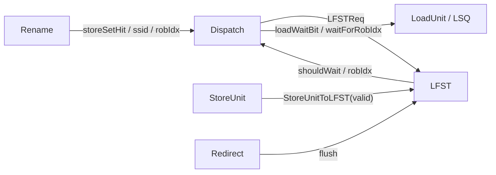
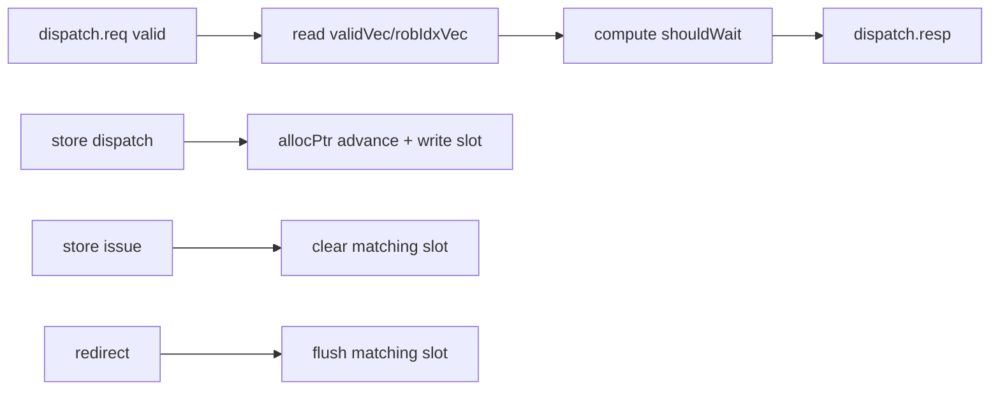

# 昆明湖 V3 LFST 模块分析

## 1. 范围

- 分析对象：`LFST`，源码在 `/nfs/home/yanyusong/mdp-kmhv3/XiangShan/src/main/scala/xiangshan/mem/mdp/StoreSet.scala`。
- 源码提交：`055d8ad9e56b0b618f2d549a97f3a028986b4849`。
- 有效实例化路径：`MemCtrl -> LFST`，其输入来自 `Dispatch`，失效/清除来自 `StoreUnitToLFST` 和 `Redirect`。
- 相关但非主体：同文件中的 `SSIT` 是静态 PC->store-set 分类表；`WaitTable` 在当前 v3 保留源码，但不是有效路径。
- 同步检查：`weekly_sync.py` 返回 `skip: last sync 5.18 days ago < 7 days`；本次以用户指定的本地 XiangShan 路径为权威源码。

## 2. 关键证据

| 主题 | 位置 | 核心代码 | 说明 |
| --- | --- | --- | --- |
| LFST entry 格式 | `StoreSet.scala:343-357` | `valid / robIdx` | 每个 store set 记录当前窗口里“最后一个已调度 store”的 ROB 位置。 |
| LFST 请求/响应 | `StoreSet.scala:348-362` | `LFSTReq(isstore, ssid, robIdx)`, `LFSTResp(shouldWait, robIdx)` | dispatch 端查询 LFST，返回是否要等和该等谁。 |
| LFST 模块 IO | `StoreSet.scala:365-373` | `redirect`, `dispatch`, `storeIssue`, `csrCtrl` | 读来自 dispatch；写清除来自 store issue 和 redirect。 |
| 有效实例化 | `MemCtrl.scala:14-31` | `private val lfst = Module(new LFST)` | LFST 被真正实例化并接入 backend。 |
| rename -> dispatch 输入 | `Dispatch.scala:759-768` | `lfst.req.valid := fire && storeSetHit` | 只有命中 SSIT 的 uop 才会查 LFST。 |
| load/store delay 控制 | `Dispatch.scala:764-770` | `loadWaitBit := resp.shouldWait`, `waitForRobIdx := resp.robIdx` | LFST 的输出直接覆盖 rename 阶段的等待控制。 |
| store issue payload | `Bundles.scala:681-685`, `NewStoreUnit.scala:515-518` | `robIdx`, `ssid`, `storeSetHit` | store unit 把释放 LFST 所需字段打包送出。 |
| store issue 清除 | `StoreSet.scala:414-422` | `storeIssue && robIdx match -> validVec := false` | store 地址算出/发射后，释放 LFST 中对应槽位。 |
| store dispatch 分配 | `StoreSet.scala:425-437` | `wptr = allocPtr(waddr); allocPtr += 1; validVec := true` | 每个 store dispatch 为其 `ssid` 追加一个活跃槽位。 |
| redirect 清除 | `StoreSet.scala:439-459` | `needFlush(io.redirect) -> validVec := false` | squash 过的 store 从 LFST 中移除。 |
| RAW 训练来源 | `LoadQueueRAW.scala:377-396` | `io.mdpTrain := Mux1H(oldestOH, allRedirect)` | LFST 的静态表兄弟 SSIT 由这里触发训练。 |
| MDP 控制位 | `Parameters.scala:825-831`, `CSRCustom.scala:100-104`, `NewCSR.scala:1437-1441` | `StoreSetEnable = true`, `LFSTEnable = true`, `storeset_wait_store`, `lvpred_disable`, `no_spec_load` | 这些控制位决定 LFST 是否参与等待决策。 |

## 3. 角色

LFST 是 store-set 的动态部分，不做 PC 分类，只做“当前这个 store set 里最近一次已进入窗口的 store 是谁”的追踪。

它解决的问题很具体：

1. SSIT 只能告诉你某条指令属于哪个 `ssid`。
2. 同一个 `ssid` 里可能同时有多条 store 在飞。
3. younger load 只需要等“当前最相关的那个 older store”，而不是把整个 set 全部串死。

所以 LFST 以 `ssid` 为行索引，以 `robIdx` 为动态窗口值，返回 `shouldWait + waitForRobIdx`。

## 4. 接口与数据结构

| 结构 | 字段 | 含义 |
| --- | --- | --- |
| `LFSTEntry` | `valid`, `robIdx` | 某个槽位是否占用，以及占用它的 store ROB 号。 |
| `LFSTReq` | `isstore`, `ssid`, `robIdx` | dispatch 阶段送来的查询/插入请求。 |
| `LFSTResp` | `shouldWait`, `robIdx` | 给 dispatch 的控制结果。 |
| `DispatchLFSTIO` | `req/resp` 向量 | 每条 rename lane 一组查询与返回。 |
| `StoreUnitToLFST` | `robIdx`, `ssid`, `storeSetHit` | store issue 时用于释放对应槽位。 |

`MemCtrl` 把 `redirect` 和 `storeIssue` 都做了一拍寄存后再喂给 LFST：

```scala
lfst.io.redirect <> RegNext(io.redirect)
lfst.io.storeIssue <> RegNext(io.stIn)
lfst.io.csrCtrl <> RegNext(io.csrCtrl)
lfst.io.dispatch <> io.dispatchLFSTio
```

这意味着 dispatch 查询是当前周期可见的组合路径，而 redirect/store issue 的清除都晚一拍进入 LFST。

## 5. 存储结构

LFST 内部有三组状态：

| 状态名 | 结构 | reset | 作用 |
| --- | --- | --- | --- |
| 占用位 | `validVec(ssid)(slot)` | 全 false | 标识该 `ssid` 的某个槽位是否有活跃 store。 |
| ROB 记录 | `robIdxVec(ssid)(slot)` | 未显式 reset | 记录对应 store 的 ROB 号。 |
| 写指针 | `allocPtr(ssid)` | 全 0 | 指向下一个要写入的槽位。 |

`LFSTSize = 64`，`LFSTWidth = 2`，所以每个 store set 最多同时追踪 2 个 store。`allocPtr` 只有 1 bit，天然环绕。

`validVec` 是真正的语义位；`robIdxVec` 只在 `validVec=true` 时才有意义。

## 6. 读路径

LFST 的读路径没有显式流水级，`Dispatch.scala` 直接消费 `resp`：

| 步骤 | 代码 | 动作 |
| --- | --- | --- |
| 1 | `io.dispatch.req(i).valid := fromRename(i).fire && updatedUop(i).storeSetHit` | 只有命中 SSIT 的 uop 才查 LFST。 |
| 2 | `io.dispatch.resp(i).bits.shouldWait := ...` | 计算是否需要等待。 |
| 3 | `io.dispatch.resp(i).bits.robIdx := robIdxVec(ssid)(allocPtr(ssid)-1.U)` | 默认返回该 store set 最近写入的 store ROB 号。 |
| 4 | `hitInDispatchBundleVec` 覆盖 `robIdx` | 同一 dispatch bundle 内若前面有同 `ssid` 的 store，后面的 load 直接等前面的 store。 |

### shouldWait 规则

源码中的条件可以按实际优先级读成：

```scala
((valid(ssid) || hitInDispatchBundle) &&
 req.valid &&
 (!isstore || csrCtrl.storeset_wait_store) &&
 !csrCtrl.lvpred_disable) ||
 csrCtrl.no_spec_load
```

含义：

- `valid(ssid)`：该 store set 当前已有活跃 store。
- `hitInDispatchBundle`：同一 dispatch bundle 里前面已经出现同 `ssid` 的 store。
- `storeset_wait_store`：是否连 store 自己也要被 LFST 延迟。
- `lvpred_disable`：关闭 load-violation predictor。
- `no_spec_load`：直接强制所有请求等待，覆盖左侧结果。

这条规则的关键点是：`no_spec_load` 是全局强制等待；`storeset_wait_store` 只影响 store 是否也被延迟。

### same-bundle walkthrough

假设 dispatch bundle 中 lane0 是 `store(ssid=5, robIdx=0x40)`，lane1 是 `load(ssid=5)`：

1. lane0 的 `req.valid` 为真，进入 LFST。
2. lane1 的 `hitInDispatchBundle` 为真，因为前面 lane0 是同 `ssid` 的 store。
3. lane1 的 `shouldWait` 直接为真，即使 LFST 里还没写入 lane0 的新状态。
4. lane1 的 `robIdx` 被覆盖成 lane0 的 `robIdx`，所以 load 会等这条刚发出的 store。

这是 LFST 处理同 bundle store/load 相关性的核心用途。

## 7. 写路径

### 7.1 store dispatch 分配

当 `io.dispatch.req(i).valid && io.dispatch.req(i).bits.isstore`：

1. `waddr = ssid`。
2. `wptr = allocPtr(waddr)`。
3. `allocPtr(waddr) := allocPtr(waddr) + 1.U`。
4. `validVec(waddr)(wptr) := true.B`。
5. `robIdxVec(waddr)(wptr) := req.robIdx`。
6. 若旧 `validVec(waddr)(wptr)` 已经是 1，则 `overflowVec(i) := true.B`。

这表示该 `ssid` 新增了一条在飞 store。LFST 没有显式 backpressure；槽位满了只记性能计数，不会在代码里阻塞 dispatch。

### 7.2 store issue 释放

当 `io.storeIssue(i).valid && io.storeIssue(i).bits.storeSetHit`：

```scala
when(io.storeIssue(i).bits.robIdx.value === robIdxVec(ssid)(j).value) {
  validVec(ssid)(j) := false.B
}
```

也就是说，store 的地址/issue 信息一到，LFST 就把该 ROB 号对应槽位清掉。这里不是按 `ssid` 释放全部条目，只清命中的那一个 ROB 条目。

### 7.3 redirect 清除与恢复

redirect 会清掉所有 `needFlush(io.redirect)` 的 store：

```scala
when(validVec(i)(j) && robIdxVec(i)(j).needFlush(io.redirect)) {
  validVec(i)(j) := false.B
}
```

然后在 `RegNext(io.redirect.fire)` 后做一个近似恢复：

```scala
val check_position = allocPtr(i) + (j+1).U
when(!validVec(i)(check_position)) {
  allocPtr(i) := check_position
}
```

这不是严格的 free-list 回滚，而是一个行为模型式的指针修复。源码注释也明确写了 `behavior model, to be refactored later`。

## 8. 状态生命周期

LFST 没有显式 `Enum` FSM，只有隐式状态：

| 隐式状态 | 含义 | 进入条件 | 退出条件 |
| --- | --- | --- | --- |
| empty slot | `validVec=false` | reset，或 store issue/redirect 清除 | 新 store dispatch 写入 |
| occupied slot | `validVec=true` | store dispatch | store issue / redirect 清除 |
| pointer advance | `allocPtr += 1` | 每次 store dispatch | 环绕，或 redirect 后修复 |

因此 LFST 的“状态机”本质是 per-set 的 valid/allocPtr 生命周期，而不是显式枚举状态机。

## 9. 冲突与并发

| 场景 | 触发 | 代码现象 | 结果 |
| --- | --- | --- | --- |
| 同 bundle store/load | 前面 lane 是同 `ssid` 的 store | `hitInDispatchBundleVec` | 后面的 load 直接等待前面的 store。 |
| 同 set 多个 store 同周期到达 | 多条 dispatch req 目标相同 `ssid` | 没有显式 arbiter | 源码没有单独仲裁；这是结构性并发点，具体优先级依赖生成硬件的连接结果。 |
| 槽位已满 | `validVec(ssid)(wptr)` 已经为真 | `overflowVec(i)=true` | 只记性能计数，不阻塞请求。 |
| store issue 与 redirect 同时到 | 同一个 ROB 号被清除 | 两条清除路径都可命中 | 最终 `validVec` 被清空；源码没有额外优先级网络。 |
| 请求为空 | `req.valid=false` | `resp.valid := req.valid` | 直接无效返回。 |

## 10. 具体算法 walkthrough

### 例子

假设：

- `ssid = 3`
- `allocPtr(3) = 0`
- `validVec(3) = [false, false]`
- lane0 是 `store(robIdx=0x20)`
- lane1 是 `load`

步骤：

1. lane0 进入 LFST，写入槽 0，`robIdxVec(3)(0)=0x20`，`validVec(3)(0)=1`，`allocPtr(3)` 变 1。
2. lane1 若与 lane0 同 bundle，`hitInDispatchBundle=true`，`shouldWait=true`，`robIdx=0x20`。
3. 下一周期，若一个新的 load 到达同一 `ssid=3`，`validVec(3)=1`，所以 `shouldWait=true`，返回 `robIdxVec(3)(allocPtr-1)=robIdxVec(3)(0)=0x20`。
4. 当 store 地址算出并从 store unit 发出 `storeIssue(robIdx=0x20)`，LFST 清掉槽 0。
5. 若该 store 也被 redirect squash，则 redirect 路径也会清掉槽 0。

这说明 LFST 的核心不是“预测下一条 store”，而是“给 load 一个当前最该等的 store ROB 号”。

## 11. 依赖关系

| 上游 | 下游 | 作用 |
| --- | --- | --- |
| `SSIT.valid/ssid` | `Dispatch -> LFST.req` | 决定是否进入 store-set 追踪。 |
| `LFSTResp.shouldWait/robIdx` | `Dispatch` | 决定 `loadWaitBit` 和 `waitForRobIdx`。 |
| `StoreUnitToLFST` | `LFST.storeIssue` | store 地址算出后释放槽位。 |
| `Redirect` | `LFST.redirect` | squash 后清除无效 store。 |
| `loadWaitBit/waitForRobIdx` | `LoadUnit`、`VirtualStoreQueue` | 让 younger load 等待预测的 older store。 |

`Backend.scala:486-492` 里还有一层 `EnableMdp` 记录门控：

```scala
sink.bits.loadWaitBit.foreach(_ := Mux(enableMdp, source.bits.loadWaitBit.get, false.B))
sink.bits.waitForRobIdx.foreach(_ := Mux(enableMdp, source.bits.waitForRobIdx.get, 0.U.asTypeOf(new RobPtr)))
sink.bits.storeSetHit.foreach(_ := Mux(enableMdp, source.bits.storeSetHit.get, false.B))
sink.bits.loadWaitStrict.foreach(_ := Mux(enableMdp, source.bits.loadWaitStrict.get, false.B))
sink.bits.ssid.foreach(_ := Mux(enableMdp, source.bits.ssid.get, 0.U(SSIDWidth.W)))
```

当前代码里这个门控默认是开着的，但它说明 MDP 字段在更上层还保留了关闭入口。

## 12. Timing / Throughput

| 路径 | 起点 | 终点 | 结论 |
| --- | --- | --- | --- |
| dispatch 查询 | `fromRename(i).fire` | `Dispatch` 使用 `resp.shouldWait/robIdx` | 组合路径，没有额外 pipeline register。 |
| store dispatch 写入 | `req.valid && isstore` | `validVec/robIdxVec/allocPtr` 更新 | 单拍更新；同周期可同时读。 |
| store issue 释放 | `storeIssue.valid` | `validVec` 清除 | 单拍更新。 |
| redirect 清除 | `redirect.fire` | `validVec` 清除，随后修复 `allocPtr` | 清除在注册后的 redirect 到达后发生。 |

吞吐上：

- 每个 rename lane 都可以发 1 个 `LFSTReq`。
- 每个 store issue lane 都可以独立释放一条 store 记录。
- 每个 `ssid` 最多跟踪 2 个活跃 store。

所以 LFST 的瓶颈不是 latency，而是 per-set 的 2 槽容量。

## 13. 图





```waveform-draw
{signal:[
  {name:"dispatch.req.valid", wave:"10.."},
  {name:"dispatch.resp.shouldWait", wave:"1.0."},
  {name:"store dispatch", wave:"0.10"},
  {name:"validVec(ssid)", wave:"0.11."},
  {name:"storeIssue.valid", wave:"0.10"},
  {name:"redirect.fire", wave:"0..1"}
]}
```

## 14. 结论

LFST 是昆明湖 V3 store-set 机制里的动态窗口表。它不做 PC 分类，只做“这个 `ssid` 当前最后一个活跃 store 是谁”的跟踪，并把结果转成 `loadWaitBit + waitForRobIdx`。

最关键的实现点有三条：

1. `shouldWait` 不是简单查表，而是 `valid(ssid)`、同 bundle store、`storeset_wait_store`、`lvpred_disable`、`no_spec_load` 的组合。
2. `robIdx` 默认取 `allocPtr-1` 指向的最新 store，因此 LFST 的语义是“最近一次写入的 store”。
3. 代码没有显式满/空队列控制；槽位满只记 `LFST_Overflow_Count`，因此 LFST 的容量问题表现为追踪精度下降，而不是硬件 backpressure。
