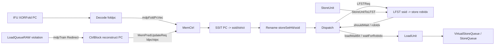
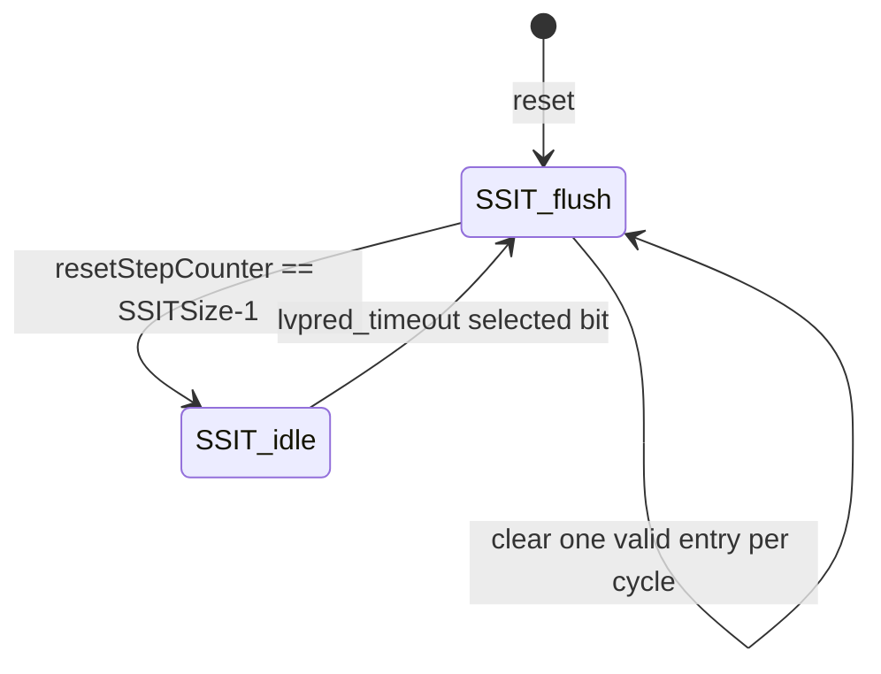

# 昆明湖 V3 MDP 模块分析

## 1. 范围

- 分析对象：KunMingHu V3 memory dependence predictor，主要由 `SSIT` 和 `LFST` 组成。
- 主源码：`/nfs/home/yanyusong/mdp-kmhv3/XiangShan/src/main/scala/xiangshan/mem/mdp/StoreSet.scala`。
- 源码提交：`055d8ad9e56b0b618f2d549a97f3a028986b4849`。
- 同步检查：`weekly_sync.py` 返回 `skip: last sync 5.18 days ago < 7 days`；本次以用户指定的本地 XiangShan 路径为权威源码。
- 有效路径：`Ifu foldpc -> CtrlBlock/MemCtrl -> SSIT -> Rename -> Dispatch/LFST -> LoadUnit/StoreQueue -> LoadQueueRAW mdpTrain -> CtrlBlock -> SSIT update`。
- 非有效路径：`WaitTable` 源码存在，但 `MemCtrl` 没实例化，`waitTable2Rename := DontCare`，当前 v3 有效行为来自 Store Set 路径。

## 2. MDP 总览

昆明湖 V3 的 MDP 解决的是乱序执行中的 store-load RAW 相关性预测问题。若 younger load 在 older store 地址未知时先执行，后续 store 地址算出后发现同地址/同 mask 冲突，会触发 load violation redirect。MDP 用历史训练结果让后续同类 load 提前等待对应 older store，减少重复违例。

它分成两个表：

- `SSIT`：Store Set Identifier Table，静态历史表，学习 `folded PC -> {valid, ssid, strict}`。
- `LFST`：Last Fetched Store Table，动态窗口表，跟踪 `ssid -> 当前窗口中最近/活跃 store robIdx`。

`SSIT` 回答“这条指令属于哪个 store set”；`LFST` 回答“这个 store set 当前有没有要等的 store，以及要等哪个 ROB entry”。

## 3. 关键源码证据

| 主题 | 位置 | 核心代码 | 证明 |
| --- | --- | --- | --- |
| Store Set 论文背景 | `StoreSet.scala:19-22`, `36-37` | `Memory Dependence Prediction using Store Sets` | 当前实现明确受 Store Sets 方法启发。 |
| 参数 | `Parameters.scala:818-831` | `WaitTableSize=1024`, `LFSTSize=64`, `LFSTWidth=2`, `StoreSetEnable=true` | SSIT 1024 项，SSID 6 bit，每个 SSID 2 个 LFST 槽，Store Set 路径打开。 |
| MDP uop 字段 | `Bundle.scala:105-113` | `storeSetHit`, `waitForRobIdx`, `loadWaitBit`, `loadWaitStrict`, `ssid` | MDP 控制信息随 uop 进入后端/访存。 |
| folded PC 生成 | `Ifu.scala:336-337`, `BitUtils.scala:236-242` | `XORFold(pc(VAddrBits-1,1), MemPredPCWidth)` | MDP 表用 XOR folded PC 而不是完整 PC 索引。 |
| MemCtrl 实例化 | `MemCtrl.scala:14-31` | `Module(new SSIT)`, `Module(new LFST)` | SSIT/LFST 是当前有效 MDP 实例。 |
| decode 查询接入 | `CtrlBlock.scala:639-654` | `mdpFlodPcVecVld := decode.fire`, `dispatchLFSTio <> dispatch.io.lfst` | decode fire 的 folded PC 送 SSIT，dispatch LFST 接回 MemCtrl。 |
| SSIT IO/读 | `StoreSet.scala:53-67`, `125-140` | `ren/raddr`, `rdata(valid,ssid,strict)` | SSIT 在 decode 读，在 rename 出结果。 |
| SSIT 存储 | `StoreSet.scala:86-101` | `valid_array`, `data_array` | SSIT 由 valid 表和 data 表组成。 |
| SSIT update | `StoreSet.scala:170-315` | update 读 `ldpc/stpc`，四分支写回 | RAW violation 训练后分配/合并 store set。 |
| LFST IO/状态 | `StoreSet.scala:348-381` | `LFSTReq`, `LFSTResp`, `validVec`, `robIdxVec`, `allocPtr` | LFST 用 `ssid` 索引动态 store ROB 状态。 |
| LFST 查询 | `StoreSet.scala:383-412` | `shouldWait`, `robIdx := robIdxVec(ssid)(allocPtr-1)` | dispatch 查询得到是否等待和等待的 store。 |
| LFST 更新/释放 | `StoreSet.scala:414-461` | store issue clear，store dispatch alloc，redirect flush | 动态窗口 store 生命周期在 LFST 内维护。 |
| Rename 消费 SSIT | `Rename.scala:453-459` | `storeSetHit := io.ssit.valid`, `loadWaitStrict := strict && valid` | SSIT 静态结果写入 uop。 |
| Dispatch 消费 LFST | `Dispatch.scala:759-770` | `loadWaitBit := lfst.resp.shouldWait`, `waitForRobIdx := lfst.resp.robIdx` | LFST 动态结果覆盖 load 等待控制。 |
| StoreUnit 释放 LFST | `Bundles.scala:681-685`, `NewStoreUnit.scala:515-518` | `StoreUnitToLFST(robIdx, ssid, storeSetHit)` | store 地址执行后把释放信息送回 LFST。 |
| LoadUnit 携带 MDP 信息 | `NewLoadUnit.scala:356-364` | `storeForwardReq.loadWaitBit/strict/ssid/waitForRobIdx` | load forward query 带着 MDP 结果进入 store queue 路径。 |
| StoreQueue MDP 查询 | `VirtualStoreQueue.scala:229-252` | `loadWaitBit && robIdx == waitForRobIdx && allocated` | SQ 通过 `waitForRobIdx` 精确找预测 store。 |
| RAW 违例训练 | `LoadQueueRAW.scala:377-396` | `oldestOH`, `io.mdpTrain := Mux1H(...)` | 真实 RAW violation 选择最老 redirect 训练 MDP。 |
| CSR 控制 | `CSRCustom.scala:99-104`, `NewCSR.scala:1437-1441` | `lvpred_disable`, `no_spec_load`, `storeset_wait_store`, `lvpred_timeout` | CSR 可关闭或强化 MDP 行为。 |
| WaitTable 非有效 | `WaitTable.scala:33-68`, `MemCtrl.scala:28-31` | `WaitTable` 有代码，但 `waitTable2Rename := DontCare` | 当前 v3 不是 21264-like wait table 路径。 |

## 4. Who / Why / How / From What / To What

**Who**：`MemCtrl` 拥有 `SSIT` 和 `LFST`。`SSIT` 由 `DecodeWidth/RenameWidth/SSITSize/SSIDWidth` 决定读口、表项和 ID 宽度；`LFST` 由 `RenameWidth/backendParams.StaExuCnt/LFSTSize/LFSTWidth` 决定查询、释放和每 set 容量。

**Why**：MDP 降低 store-load RAW violation 的重复发生率。没有 MDP 时，load 可以反复在 older store 地址未知时先执行，之后被 `LoadQueueRAW` 发现冲突并 redirect；MDP 让后续相同模式的 load 在 dispatch/LSQ 阶段提前等待预测 store。

**How**：正常查询时，front-end 生成 folded PC，SSIT 查出 `ssid/strict`，rename 写入 uop；dispatch 用该 `ssid` 查 LFST 得到 `shouldWait/robIdx`；load 带 `loadWaitBit/waitForRobIdx` 到 StoreQueue 查询。训练时，`LoadQueueRAW` 发现真实 violation，生成 `mdpTrain Redirect`，`CtrlBlock` 还原 load/store PC 并 XOR fold 成 `ldpc/stpc`，SSIT 更新 PC->SSID 关系。

**From what**：

- 查询索引来自前端 `foldpc`。
- 动态等待对象来自 dispatch 窗口内 store 的 `ssid/robIdx`。
- 训练输入来自 `LoadQueueRAW` 的 RAW violation redirect。
- 控制位来自 custom CSR 的 `slvpredctl`。

**To what**：

- `SSIT.rdata` 到 rename 的 `storeSetHit/ssid/loadWaitStrict`。
- `LFST.resp` 到 dispatch 的 `loadWaitBit/waitForRobIdx`。
- MDP uop 字段到 LoadUnit、VirtualStoreQueue 和 nuke/fast-replay 相关逻辑。

## 5. 参数

| 参数 | 位置 | 值/表达式 | 影响 |
| --- | --- | --- | --- |
| `WaitTableSize` | `Parameters.scala:822` | `1024` | SSIT 也复用这个大小。 |
| `MemPredPCWidth` | `Parameters.scala:823` | `log2Up(WaitTableSize)=10` | folded PC 宽度和 SSIT 地址宽度。 |
| `SSITSize` | `Parameters.scala:826` | `WaitTableSize` | SSIT valid/data 表深度。 |
| `LFSTSize` | `Parameters.scala:827` | `64` | store set 个数。 |
| `SSIDWidth` | `Parameters.scala:828` | `log2Up(LFSTSize)=6` | SSID 宽度。 |
| `LFSTWidth` | `Parameters.scala:829` | `2` | 每个 SSID 可追踪 2 个活跃 store。 |
| `StoreSetEnable` | `Parameters.scala:830` | `true` | Dispatch 使用 Store Set 输出覆盖 waittable 结果。 |
| `LFSTEnable` | `Parameters.scala:831` | `true` | 参数存在；当前实例化路径未再用它包条件。 |

## 6. Index 与地址计算

| 索引/地址 | 输入 | 计算 | 消费者 |
| --- | --- | --- | --- |
| 前端 folded PC | aligned instruction PC | `XORFold(pc(VAddrBits-1,1), MemPredPCWidth)` | `CtrlFlow.foldpc`，decode 后送 SSIT。 |
| 训练 load folded PC | `mdpTrain.ftqIdx + getPcOffset` | `XORFold((pcMem.rdata + offset)(VAddrBits-1,1), MemPredPCWidth)` | `MemPredUpdateReq.ldpc`。 |
| 训练 store folded PC | `mdpTrain.stFtqIdx + getStPcOffset` | 同上 | `MemPredUpdateReq.stpc`。 |
| SSIT read/write addr | `foldpc` / `ldpc` / `stpc` | 10-bit table index | `valid_array`、`data_array`。 |
| SSID 分配候选 | `ldpc/stpc` | `XORFold(pc, SSIDWidth)` | SSIT update 的新 `ssid`。 |
| LFST row | uop `ssid` | 直接索引 0..63 | `validVec/robIdxVec/allocPtr`。 |
| LFST slot | `allocPtr(ssid)` | 1-bit pointer，写后自增并环绕 | 每个 SSID 的 2 个槽。 |
| LFST 返回 store | `allocPtr(ssid)-1.U` | 最近一次写入槽位 | dispatch 返回 `waitForRobIdx`。 |
| StoreQueue MDP hit | `waitForRobIdx` | 遍历 SQ，匹配 `dataEntries(j).robIdx === waitForRobIdx && allocated` | VirtualStoreQueue 输出 `mdpHitPtr`。 |

`XORFold` 的定义是 zero-extend 到 `resWidth` 的整数倍后分段 XOR，因此 folded PC 和 SSID 都有别名风险。MDP 不追求完整 PC 精确匹配，而是用有限表项学习高概率相关。

## 7. 正常预测路径

| 阶段 | 源码 | 动作 | 输出 |
| --- | --- | --- | --- |
| IFU | `Ifu.scala:336-337` | 为每条 aligned instruction PC 生成 `foldpc` | `CtrlFlow.foldpc` |
| Decode -> MemCtrl | `CtrlBlock.scala:639-654` | decode fire 时发 `mdpFoldPcVecVld/foldpc` | `SSIT.ren/raddr` |
| SSIT read | `StoreSet.scala:125-140`; `DataModuleTemplate.scala:130-160` | 同步读 valid/data 表 | rename 阶段 `SSITEntry` |
| Rename | `Rename.scala:453-459` | 写 uop `storeSetHit/ssid/loadWaitStrict` | dispatch uop |
| Dispatch -> LFST | `Dispatch.scala:759-768` | `storeSetHit` 的 uop 查询 LFST；StoreSetEnable 时覆盖等待位 | `loadWaitBit/waitForRobIdx` |
| Backend -> LoadUnit | `Backend.scala:486-492` | `EnableMdp` 打开时把 MDP 字段送入 mem exu | load/store pipeline input |
| LoadUnit -> SQ | `NewLoadUnit.scala:356-364` | store forward request 带 MDP 字段 | VirtualStoreQueue/SQ 查询 |

## 8. SSIT 算法

SSIT 有两个存储结构：

- `valid_array[SSITSize]`：某 folded PC 是否有有效 store-set 记录。
- `data_array[SSITSize]`：`SSITDataEntry(ssid, strict)`。

读路径在 decode 发起，rename 收到结果。更新路径由 `MemPredUpdateReq.valid` 触发，复用 read port 0/1 分别读取 load/store 旧 entry。源码注释说明 update valid 时会有 redirect，decode 不需要读 SSIT。

四种更新规则：

| old state | 源码 | 行为 |
| --- | --- | --- |
| load/store 都未分配 | `StoreSet.scala:250-263` | 两边写同一个 `s2_allocSsid = min(hash(ldpc), hash(stpc))`。 |
| load 已分配、store 未分配 | `StoreSet.scala:266-273` | store entry 写 `s2_ldSsidAllocate = hash(ldpc)`。注意源码没有复制 `loadOldSSID`。 |
| store 已分配、load 未分配 | `StoreSet.scala:276-283` | load entry 写 `s2_stSsidAllocate = hash(stpc)`。注意源码没有复制 `storeOldSSID`。 |
| 两边都已分配 | `StoreSet.scala:287-304` | 两边都写数值较小的 old SSID；若 old SSID 已相同，load entry 的 `strict` 置 true。 |

双写冲突规则：若 load/store 更新地址相同，`StoreSet.scala:308-315` 关闭 store 写口，load 写口胜出。

SSIT flush FSM：`state` reset 到 `s_flush`，每拍清一个 `valid_array` entry；之后在 `s_idle` 中由 `resetCounter(ResetTimeMax2Pow-1, ResetTimeMin2Pow)(lvpred_timeout)` 再触发周期性清空。flush 清 valid，不清 data payload。

## 9. LFST 算法

LFST 的状态是：

- `validVec(ssid)(slot)`：某 SSID 的某个槽是否有活跃 store。
- `robIdxVec(ssid)(slot)`：活跃 store 的 ROB index。
- `allocPtr(ssid)`：下一个写入槽位。

查询规则：

```scala
shouldWait :=
  ((valid(ssid) || hitInDispatchBundle) &&
   req.valid &&
   (!isstore || csrCtrl.storeset_wait_store)) &&
  !csrCtrl.lvpred_disable ||
  csrCtrl.no_spec_load
```

`robIdx` 默认返回 `robIdxVec(ssid)(allocPtr(ssid)-1.U)`。若同一 dispatch bundle 中前面 lane 有相同 `ssid` 的 store，后面的 lane 用前面 store 的 `robIdx` 覆盖返回值。这样即使 LFST 状态还没写入，本 bundle 内 store-load 相关也能被捕获。

写入规则：store dispatch 时以 `ssid` 为行、`allocPtr` 为槽写入 `robIdx`，同时 `allocPtr += 1`。如果旧槽仍 valid，`LFST_Overflow_Count` 累加，但没有 backpressure。

释放规则：store issue 时，如果 `storeIssue.valid && storeSetHit && robIdx` 匹配对应槽位，则清 `validVec`。redirect 时，所有 `robIdx.needFlush(io.redirect)` 的槽位清空；随后 `RegNext(io.redirect.fire)` 触发一个行为模型式 `allocPtr` 修复。

## 10. 训练路径

1. Store 地址执行后，`LoadQueueRAW` 检查是否存在 younger load 已经错误执行。
2. 每个 store pipeline 产生候选 rollback redirect。
3. `Redirect.selectOldestRedirect` 选最老违例。
4. `io.mdpTrain := Mux1H(oldestOH, allRedirect)` 把该 redirect 送回 backend。
5. `CtrlBlock` 用 `ftqIdx/ftqOffset` 和 `stFtqIdx/stFtqOffset` 读 `pcMem`，重建 load/store PC。
6. `CtrlBlock` 对重建 PC 做 `XORFold`，生成 `MemPredUpdateReq.ldpc/stpc`。
7. `MemCtrl` 对 update 打拍后送 SSIT。
8. SSIT 读取旧 entry 并分配/合并 store set。

这条训练路径和前端保存的 `foldpc` 不直接复用，而是从 FTQ PC 和 offset 重建后再折叠。

## 11. 下游消费与 replay 关系

MDP 本身不直接产生 architectural exception，也不直接完成 replay。它产生的是等待和重放优化的输入：

- Dispatch 将 LFST 的 `shouldWait` 变成 `loadWaitBit`。
- Dispatch 将 LFST 的 `robIdx` 变成 `waitForRobIdx`。
- LoadUnit 把这些字段放入 `storeForwardReq`。
- VirtualStoreQueue 用 `waitForRobIdx` 匹配当前 SQ entry，输出 `mdpHitPtr`。
- NewLoadUnit 在 nuke 查询中用 `storeSetHit && req.robIdx === waitRobIdx` 生成 `fastReplayNukeFirst`，使预测相关的 nuke 场景优先走 fast replay。

因此 MDP 的有效作用是提前约束 load/store 顺序，并帮助 replay 路径更快识别“正是预测要等的那条 store”。

## 12. CSR 控制

| 控制位 | 位置 | 行为 |
| --- | --- | --- |
| `LVPRED_DISABLE` / `lvpred_disable` | `CSRCustom.scala:104`, `NewCSR.scala:1437` | LFST `shouldWait` 左侧预测结果被关闭。 |
| `NO_SPEC_LOAD` / `no_spec_load` | `CSRCustom.scala:103`, `NewCSR.scala:1438` | LFST `shouldWait` 直接为真，强制保守。 |
| `STORESET_WAIT_STORE` | `CSRCustom.scala:102`, `NewCSR.scala:1439` | 允许 store 自己也被 store-set wait 控制；默认 false 时主要约束 load。 |
| `STORESET_NO_FAST_WAKEUP` | `CSRCustom.scala:101`, `NewCSR.scala:1440` | CSR 输出存在；本次检查的 `StoreSet.scala` 内未消费。 |
| `LVPRED_TIMEOUT` | `CSRCustom.scala:100`, `NewCSR.scala:1441` | 选择 SSIT timeout flush 的 resetCounter bit。 |

## 13. 场景分析

| 场景 | 触发 | 关键代码 | 行为 |
| --- | --- | --- | --- |
| 冷启动/未学习 | `SSIT.valid=false` | `Rename.scala:453-459` | `storeSetHit=false`，dispatch 不发有效 LFST 请求，load 正常推测执行。 |
| 首次 RAW violation | `LoadQueueRAW` rollback valid | `LoadQueueRAW.scala:377-396`, `CtrlBlock.scala:217-238` | 最老违例 redirect 训练 SSIT，下次同 folded PC 有 store set。 |
| SSIT hit 且 LFST 当前有 older store | `valid(ssid)=true` | `StoreSet.scala:399-404`, `Dispatch.scala:765-768` | dispatch 设置 `loadWaitBit` 和 `waitForRobIdx`。 |
| 同 bundle store-load | 前面 lane 是同 `ssid` 的 store | `StoreSet.scala:387-411` | 后面 load 直接等前面 store 的 `robIdx`，不等下一周期 LFST 写入。 |
| store 地址已算出 | `storeIssue.valid` | `StoreSet.scala:414-422` | LFST 清掉对应 ROB 槽，后续 load 不再等它。 |
| redirect squash | `robIdx.needFlush(redirect)` | `StoreSet.scala:439-459` | 被 squash store 的 LFST 槽清空，并尝试修复 allocPtr。 |
| SSIT 同地址双写 | `ldpc == stpc` 或 folded alias | `StoreSet.scala:308-315` | store 写口被关闭，load 写口胜出。 |
| LFST per-set overflow | `validVec(ssid)(allocPtr)=true` 时再写 | `StoreSet.scala:424-437`, `461` | 只计 `LFST_Overflow_Count`，不阻塞 dispatch。 |
| 禁用 predictor | `lvpred_disable=true` | `StoreSet.scala:399-403` | 正常预测等待被关闭；若 `no_spec_load=false`，load 不因 LFST 等待。 |
| 强制无推测 load | `no_spec_load=true` | `StoreSet.scala:403` | `shouldWait` 直接为真，进入保守等待模式。 |

## 14. 冲突与风险点

- SSIT update 复用 decode read port 0/1。源码假设 update valid 同时伴随 redirect，decode 不需要正常读；若这个前提被破坏，低号 lane 的 SSIT 查询会被 update 覆盖。
- SSIT 两个写口同地址时 store 口被关，load 写入优先。这避免表模板多写同 entry，但会丢弃 store 侧同周期写入。
- LFST 每个 `ssid` 只有 2 槽且无 backpressure。第三条同 set store dispatch 会覆盖仍 valid 的槽，只记录 overflow 计数。
- LFST 同周期多 lane 写同一 `ssid` 没有显式 arbiter 或 per-lane slot 递增分配网络；这是需要波形或生成 RTL 再核查的并发风险点。
- `STORESET_NO_FAST_WAKEUP` CSR 字段存在，但本次在 `StoreSet.scala` 有效代码中未看到消费。

## 15. Timing / Throughput

| 路径 | 起点 | 终点 | 代码证明的时序 | 吞吐/瓶颈 |
| --- | --- | --- | --- | --- |
| SSIT lookup | decode fire | rename 得到 `SSITEntry` | `SyncDataModuleTemplate` 对 read address 打一拍 | `DecodeWidth` 个读/cycle；update valid 接管 port 0/1。 |
| LFST lookup | dispatch req | dispatch 使用 resp | 组合读 valid/robIdx | `RenameWidth` 个 req/cycle；同 set 多写无显式仲裁。 |
| LFST store dispatch write | dispatch store req | valid/robIdx/allocPtr 更新 | 单拍 Reg 更新 | 每 set 2 槽，无满阻塞。 |
| LFST store issue release | `StoreUnitToLFST.valid` | valid bit clear | `MemCtrl` RegNext 后进入 LFST | 最多 `backendParams.StaExuCnt` 个释放/cycle。 |
| SSIT train | `mdpTrain.valid` | SSIT write | `CtrlBlock` PC read + `MemCtrl` RegNext + SSIT s1/s2 | 一次训练一对 load/store PC。 |
| Load end-to-end | issue/load pipe | writeback/commit | MDP 不决定固定 load latency | TLB/DCache/SQ/replay/commit 决定真实 latency。 |

## 16. 图





```waveform-draw
{signal:[
  {name:"decode.fire", wave:"10....."},
  {name:"SSIT.ren/raddr", wave:"10.....", data:["foldpc"]},
  {name:"SSIT.rdata", wave:"x=.....", data:["valid/ssid/strict"]},
  {name:"dispatch.LFST.req", wave:"01....", data:["ssid"]},
  {name:"LFST.resp", wave:"01....", data:["wait robIdx"]},
  {name:"loadWaitBit", wave:"01...."},
  {name:"RAW violation", wave:"0...10."},
  {name:"mdpTrain", wave:"0...10."},
  {name:"SSIT update write", wave:"0.....1"}
]}
```

## 17. 结论

昆明湖 V3 的 MDP 是有效接入的 Store Set predictor，而不是 WaitTable predictor。它的闭环是：

`foldpc 查 SSIT -> rename 标记 storeSetHit/ssid -> dispatch 查 LFST -> load 等待 predicted store -> RAW violation 训练 SSIT`。

最值得关注的实现细节：

1. `SSIT` 是历史表，`LFST` 是动态窗口表，两者缺一不可。
2. `LFST.shouldWait` 受 CSR 控制，`no_spec_load` 可以强制保守，`lvpred_disable` 可以关闭预测等待。
3. SSIT 和 LFST 都存在容量/别名风险：SSIT folded PC/SSID 会 alias，LFST 每 set 只有 2 槽且 overflow 不阻塞。
4. `WaitTable` 代码仍在，但当前 `MemCtrl` 没有实例化它；调试 v3 MDP 应优先看 `ssit_*`、`storeset_*`、`LFST_Overflow_Count` 和 load violation redirect/`mdpTrain` 路径。
