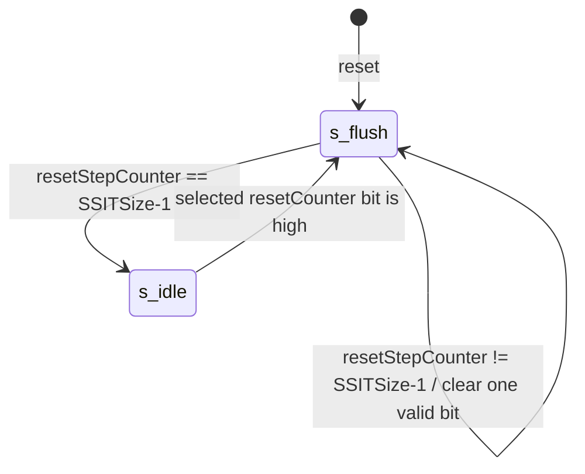
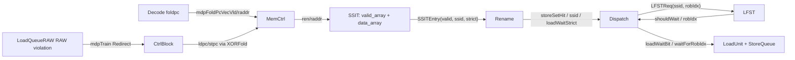
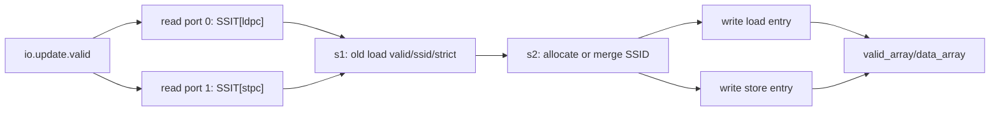

# 昆明湖 V3 SSIT 模块分析

## 1. 分析范围

- 分析对象：`SSIT`，位于 `/nfs/home/yanyusong/mdp-kmhv3/XiangShan/src/main/scala/xiangshan/mem/mdp/StoreSet.scala`。
- 源码提交：`055d8ad9e56b0b618f2d549a97f3a028986b4849`。
- 有效实例化路径：`Backend`/`CtrlBlock` -> `MemCtrl` -> `SSIT`；`SSIT` 结果送 `Rename`，再由 `Dispatch` 结合 `LFST` 生成 load 等待控制。
- 相关但非本文主体：同文件中的 `LFST` 是 SSIT 的动态窗口配套表；`WaitTable` 在当前 v3 有源码但未接入有效路径。
- 同步检查：`weekly_sync.py` 返回 `skip: last sync 5.17 days ago < 7 days`，本次以用户指定的本地 XiangShan 路径为权威源码。

## 2. 关键源码证据

| 主题 | 源码位置 | 核心代码片段 | 说明 |
| --- | --- | --- | --- |
| SSIT entry 格式 | `StoreSet.scala:40-49` | `valid / ssid / strict` | SSIT 对每个 folded PC 记录是否命中、store-set ID 和 strict 等待位。 |
| SSIT IO | `StoreSet.scala:53-63` | `ren/raddr -> rdata`, `update`, `csrCtrl` | decode 发读请求，rename 收结果；更新由 `MemPredUpdateReq` 输入。 |
| 表大小和 ID 宽度 | `Parameters.scala:818-830` | `SSITSize = WaitTableSize`, `SSIDWidth = log2Up(LFSTSize)` | 当前 SSIT 1024 项，`MemPredPCWidth=10`，`LFSTSize=64`，`SSIDWidth=6`。 |
| 同步表模板 | `DataModuleTemplate.scala:89-160` | `RegEnable(io.raddr, io.ren)` | `SyncDataModuleTemplate` 读地址打一拍，SSIT read 在 decode、结果在 rename。 |
| decode 读路径 | `StoreSet.scala:125-140` | `raddr := io.raddr(i)`, `rdata := array.rdata(i)` | 每个 decode lane 读 valid/data 两张表。 |
| timeout flush FSM | `StoreSet.scala:142-168` | `s_idle :: s_flush`, `wdata := false.B` | reset/timeout 时逐项清 `valid_array`，不清 data payload。 |
| update 端口复用 | `StoreSet.scala:170-187` | `when(io.update.valid) { raddr(0/1) := ldpc/stpc }` | update valid 时接管读口 0/1 读取 load/store 旧 entry。 |
| update 合并规则 | `StoreSet.scala:202-305` | `switch(Cat(loadAssigned, storeAssigned))` | RAW violation 训练后分四种情况分配/合并 store set。 |
| 双写冲突处理 | `StoreSet.scala:308-315` | `when(waddr0 === waddr1) { wen1 := false.B }` | load/store folded PC 同地址时关闭 store 写口，load 写口胜出。 |
| 训练 PC 生成 | `CtrlBlock.scala:217-238` | `ldpc/stpc := XORFold(pc + offset, MemPredPCWidth)` | `LoadQueueRAW` 的 `mdpTrain` 触发后端重建 load/store folded PC。 |
| XORFold 定义 | `BitUtils.scala:236-242` | `ZeroExt` 后按 `resWidth` 分段 XOR | folded PC 和 SSID 候选值都来自 XOR folding。 |
| 有效接入 | `MemCtrl.scala:14-31` | `ssit := Module(new SSIT)`, `ssit2Rename := ssit.io.rdata` | `SSIT` 被实例化；`waitTable2Rename := DontCare`。 |
| rename 消费 | `Rename.scala:453-459` | `storeSetHit := io.ssit(i).valid` | rename 把 SSIT 结果写入 uop 的 MDP 字段。 |
| dispatch/LFST 消费 | `Dispatch.scala:759-770` | `lfst.req.valid := fire && storeSetHit` | dispatch 用 `ssid` 查询 LFST，生成 `loadWaitBit/waitForRobIdx`。 |
| RAW 训练源头 | `LoadQueueRAW.scala:377-396` | `io.mdpTrain := Mux1H(oldestOH, allRedirect)` | Store-load RAW violation 选择最老 redirect 训练 SSIT。 |

## 3. Who / Why / How / From What / To What

**Who**：`SSIT` 由 `MemCtrl` 实例化，参数来自全局 `Parameters`。`SSITSize` 决定表项数，`DecodeWidth/RenameWidth` 决定读口数，`SSIDWidth` 由 `LFSTSize` 决定。

**Why**：乱序核允许 younger load 在 older store 地址未算出前先执行。若后续发现 RAW violation，需要训练 memory dependence predictor；SSIT 记住“load/store PC 属于同一个 store set”，下次让 load 通过 LFST 等待相关 older store，从而减少反复违例和 redirect。

**How**：SSIT 是两张同步表：

- `valid_array[foldpc]`：该 folded PC 是否已经学习到 store set。
- `data_array[foldpc]`：`SSID` 和 `strict` 位。

decode 阶段用每条指令的 `foldpc` 读表；rename 阶段收到 `{valid, ssid, strict}`。当 `LoadQueueRAW` 检测到真实 RAW violation，`CtrlBlock` 从 redirect 元数据恢复 load/store PC，折叠成 `ldpc/stpc`，SSIT 读取旧 entry 并按 store-set 合并规则写回。

**From what**：

- 查询地址来自 `decode.io.out(i).bits.foldpc`，在 `CtrlBlock.scala:640-646` 只在 decode fire 时送到 `MemCtrl`。
- 训练地址来自 `io.fromMem.mdpTrain` 中的 load/store FTQ index 和 offset，`CtrlBlock.scala:217-238` 通过 `pcMem` 和 `XORFold` 生成 `ldpc/stpc`。

**To what**：

- `SSIT.io.rdata` 送 `Rename`，生成 uop 字段 `storeSetHit/loadWaitStrict/ssid`。
- dispatch 使用 `storeSetHit` 和 `ssid` 查询 `LFST`，输出 `loadWaitBit` 和 `waitForRobIdx`，下游 load/store queue 用它做等待、forward query 和 replay 优化。

## 4. 有效路径与非有效路径

当前 v3 有效 MDP 路径是 `SSIT + LFST`：

1. `CtrlBlock` 在 decode fire 时把 folded PC 发给 `MemCtrl`。
2. `MemCtrl` 读 `SSIT`，结果传给 `Rename`。
3. `Rename` 把 `valid/ssid/strict` 写入 uop。
4. `Dispatch` 对 `storeSetHit` 的 uop 发 `LFSTReq`。
5. `LFST` 用 `ssid` 查当前窗口内未发射 store，返回 `shouldWait` 和 `robIdx`。
6. `LoadQueueRAW` 检测真实 RAW violation 后通过 `mdpTrain` 训练 SSIT。

`WaitTable` 是保留代码，不是当前有效路径。证据是 `Parameters.scala:830` 令 `StoreSetEnable = true`，同时 `MemCtrl.scala:28-31` 没有实例化 `WaitTable`，并把 `waitTable2Rename` 置为 `DontCare`。

## 5. 存储结构与索引

| 结构/索引 | 计算方式 | 宽度/范围 | reset/首用行为 | 消费者 |
| --- | --- | --- | --- | --- |
| `foldpc` | `XORFold(pc(VAddrBits-1, 1), MemPredPCWidth)` | `MemPredPCWidth=10`，1024 项 | 前端/后端都使用同一类 XOR folding；SSIT reset 后 `valid=false`，data stale 但无效 | `SSIT.valid_array/data_array` 读写地址 |
| `valid_array` | `SyncDataModuleTemplate(Bool(), SSITSize, DecodeWidth, 2)` | 1024 x 1 bit | reset/timeout flush 逐项写 false | rename 判断 `storeSetHit` |
| `data_array.ssid` | update 时由 old SSID 或 `XORFold(ldpc/stpc, SSIDWidth)` 写入 | `SSIDWidth=6`，64 个 store set | 只有 valid=true 时有语义 | rename/dispatch/LFST |
| `data_array.strict` | 默认写 false；同一 SSID 仍违例时 load entry 写 true | 1 bit | valid=false 时无语义 | rename 生成 `loadWaitStrict` |
| `resetStepCounter` | `0 .. SSITSize-1` 顺序递增 | `log2Up(SSITSize+1)` | `state` 初始为 `s_flush`，上电后逐项清 valid | flush FSM 的写地址 |
| `s2_allocSsid` | `min(XORFold(ldpc, SSIDWidth), XORFold(stpc, SSIDWidth))` | 0..63 | 首次遇到一对未分配 load/store 时使用 | update 写回 load/store entry |
| `s2_winnerSSID` | `min(loadOldSSID, storeOldSSID)` | 0..63 | 两边都已分配时使用 | 合并 store set |

`XORFold` 的精确语义来自 `utility/BitUtils.scala:236-242`：先把输入 zero-extend 到 `resWidth` 的整数倍，再按 `resWidth` 分段做 parallel XOR。对 SSIT 来说，完整 PC 不进入表，只进入 folded PC；因此不同 PC 可能别名到同一 entry，这是容量换时序/面积的显式取舍。

## 6. 读路径阶段

| 阶段 | 触发条件 | 主要动作 | 输出 |
| --- | --- | --- | --- |
| decode | `decode.io.out(i).fire` | `CtrlBlock` 置 `mdpFoldPcVecVld(i)` 并传 `foldpc` | `SSIT.io.ren/raddr` |
| SSIT read | `io.ren(i)` | `valid_array/data_array` 捕获读地址 | 下一拍产生 `valid/ssid/strict` |
| rename | 同一条 uop 到 rename | `storeSetHit := valid`，`loadWaitStrict := strict && valid`，`ssid := ssid` | uop 携带 store-set 元数据到 dispatch |
| dispatch/LFST | `fromRename(i).fire && storeSetHit` | 用 `ssid` 查动态 store 窗口 | `loadWaitBit/waitForRobIdx` |

`SSIT` 本身不直接产生 `loadWaitBit`。它只产生静态历史分类 `{valid, ssid, strict}`；当前窗口内是否真的有需要等待的 older store，由 `LFST` 决定。

## 7. 更新算法

SSIT update 是多拍训练路径：

1. `LoadQueueRAW` 把 store-load RAW violation 转成 `Redirect`，用 `Redirect.selectOldestRedirect` 选择最老违例，输出 `mdpTrain`。
2. `CtrlBlock` 读取 load/store 所属 FTQ entry 的 base PC，叠加 offset，再 `XORFold` 成 `ldpc/stpc`。
3. `MemCtrl` 对 `memPredUpdate` 打一拍后送给 `SSIT`。
4. `SSIT` 在 update stage 0 用读口 0/1 分别读 load/store 旧 entry。
5. stage 1 捕获旧 `valid/ssid/strict`。
6. stage 2 按四种情况写回。

四种核心规则：

| `loadAssigned, storeAssigned` | 行为 | 代码含义 |
| --- | --- | --- |
| `00` | 两边都未分配 | 为这对 load/store 分配同一个 `s2_allocSsid`，两项都 valid，strict=false。 |
| `10` | load 已分配，store 未分配 | 代码把 store entry 写成 `s2_ldSsidAllocate`。注意这是 `XORFold(ldpc, SSIDWidth)`，不是 `s2_loadOldSSID`。这是源码有效行为。 |
| `01` | store 已分配，load 未分配 | 代码把 load entry 写成 `s2_stSsidAllocate`，同样不是直接复制 `storeOldSSID`。 |
| `11` | 两边都已分配 | 选择数值更小的旧 SSID 作为 winner，load/store 都写 winner；如果两边旧 SSID 已相同，load entry 的 `strict` 置 true。 |

`11` 场景的 winner 不是年龄比较，也不是 ROB 顺序比较，而是 `Mux(loadOldSSID < storeOldSSID, loadOldSSID, storeOldSSID)`，即数值较小者胜出。这是昆明湖 v3 代码里的具体实现选择。

### 具体 walkthrough

假设一次 RAW violation 给出 `ldpc=0x155`、`stpc=0x2aa`，并且 `XORFold(ldpc, 6)=0x12`、`XORFold(stpc, 6)=0x2b`：

1. 若两项都 invalid，`s2_allocSsid=min(0x12,0x2b)=0x12`，SSIT 写 `SSIT[0x155]={valid=1, ssid=0x12, strict=0}`，`SSIT[0x2aa]={valid=1, ssid=0x12, strict=0}`。
2. 下次同 load PC decode 时，rename 得到 `storeSetHit=1, ssid=0x12, loadWaitStrict=0`。
3. dispatch 用 `ssid=0x12` 查 LFST。若同 set 有 older store 未完成地址，LFST 返回 `shouldWait=1` 和对应 `robIdx`。
4. 若之后同一 load/store set 仍发生 violation，且两边 old SSID 都为 `0x12`，`s2_ssidIsSame` 触发，load entry 写 `strict=true`。再出现时 rename 会把 `loadWaitStrict` 带到 dispatch，dispatch 只有在 LFST 仍要求等待时才保留 strict。

## 8. 状态机与 valid 生命周期

`SSIT` 有一个显式 FSM：

| 状态 | 含义 | 进入条件 | 退出条件 | 动作 |
| --- | --- | --- | --- | --- |
| `s_flush` | 正在逐项清空 SSIT valid bits | reset 初始状态，或 timeout 触发 | `resetStepCounter === SSITSize-1` | 每拍写 `valid_array[resetStepCounter]=false`，并清 `debug_valid` |
| `s_idle` | 正常查询/训练 | flush 完成 | `resetCounter(19,14)(lvpred_timeout)` 为真 | 等待下一次 timeout |

重要细节：

- flush 只清 `valid_array`，不清 `data_array`。因此 `data_array` 可以保留 stale ssid/strict，但只要 valid=false，rename 不会把它当成有效 store set。
- `state` 初始为 `s_flush`，所以硬件 reset 后会扫完整张 SSIT valid 表。
- `resetCounter` 每拍递增，`lvpred_timeout` 选择 `resetCounter(19,14)` 中的一位作为进入 flush 的条件。当前 CSR 默认值来自 `SlvpredCtlTimeOut.initValue = 3.U`。



## 9. 冲突、重定向和资源场景

| 场景 | 触发条件 | 资源/请求者 | 优先级或行为 | 下游影响 |
| --- | --- | --- | --- | --- |
| decode 读 vs update 读 | `io.update.valid` 与 decode lane 0/1 同周期 | SSIT read port 0/1 | update 覆盖端口 0/1 的 `raddr/ren`；源码注释说明 update valid 时前端会 redirect，decode 不需要读 SSIT | 训练读旧 load/store entry，decode lane 0/1 的读被接管 |
| load/store update 同地址双写 | `waddr(load) === waddr(store)` | valid/data 两张表的两个写口 | store 写口 `wen1` 被关闭，load 写口胜出 | 避免同 entry 双写；不同 PC 折叠别名时只保留 load 写入 |
| RAW violation 训练 | `LoadQueueRAW.rollbackLqWb.valid` | 多个 store pipeline 可能同时发现 violation | `Redirect.selectOldestRedirect` 选最老 redirect，`Mux1H` 输出 `mdpTrain` | 只训练最老违例，后端重定向并更新 SSIT |
| periodic flush | `s_idle` 中 timeout bit 触发 | `valid_array` write port 0 | FSM 逐项写 false；无 ready/backpressure | 历史依赖被老化，后续 load 需要重新学习 |
| LFST 当前窗口命中 | dispatch uop `storeSetHit=1` | LFST 按 `ssid` 查当前未完成 store | 如果同 set 有 valid store 或同 bundle 前面有同 set store，则 `shouldWait=1` | load 得到 `loadWaitBit/waitForRobIdx`，下游 StoreQueue/LoadUnit 用它等待或 replay |
| resource empty/full | SSIT 本身没有队列、free list、full/almost-full 逻辑 | 固定大小同步表 | searched, not present in `SSIT` | 容量压力表现为 folded PC / SSID aliasing，而不是 backpressure |
| replay/exception/privilege | SSIT 内部不产生 replay/exception | replay 由 LSQ/LoadUnit 产生 | searched in `StoreSet.scala`; SSIT 只被 RAW violation redirect 训练 | 精确异常和真正 replay 不在 SSIT 内部完成 |

## 10. 下游效果

SSIT 输出的三个字段在下游分工明确：

- `storeSetHit`：由 rename 从 `SSIT.valid` 生成；dispatch 只对 hit 的 uop 发 LFST 请求。
- `ssid`：作为 LFST lookup index，也是 store address unit 后续释放 LFST entry 的 key。
- `loadWaitStrict`：由 `SSIT.strict && valid` 生成；dispatch 再与 `LFST.shouldWait` 相与。只有“SSIT 认为应 strict”且“当前窗口确实有要等的 store”时，strict 才传到 load uop。

下游 `VirtualStoreQueue` 会用 `loadWaitBit && waitForRobIdx` 匹配 store queue 里仍 allocated 的目标 store；`NewLoadUnit` 也用 `storeSetHit` 和 `waitForRobIdx` 判断某些 nuke 场景是否可走 fast replay。也就是说，SSIT 负责历史分类，LFST/StoreQueue 负责当前动态窗口内的实际阻塞对象。

## 11. Timing / Throughput

| 路径 | 起点 | 终点 | 代码证明的时序 | 吞吐限制 |
| --- | --- | --- | --- | --- |
| decode SSIT lookup | decode lane fire | rename 使用 `io.ssit(i)` | `SyncDataModuleTemplate` 对 read address 打一拍；`StoreSet.scala:125-140` 注释也把读/结果分成 decode/rename | 最多 `DecodeWidth` 个 read/cycle，update valid 时 port 0/1 被训练接管 |
| SSIT training | `mdpTrain.valid` | SSIT 写回 valid/data | `CtrlBlock` 和 `MemCtrl` 各有注册边界，SSIT 内部还有 s1/s2 两级 | 单次 update 同时处理一对 load/store PC；写口为 2 个，same address 时 store 口关闭 |
| timeout flush | timeout 或 reset | 全表 valid 清空 | 每拍清 1 个 entry，共 `SSITSize` 拍 | flush 占用 misc/load write port 0；表仍可被读，但 valid 正在被逐项清 |

这里不给出 load 指令端到端 latency，因为 SSIT 只改变调度/等待条件，不直接完成 load 数据访问。真正 load latency 还取决于 issue、TLB、DCache、StoreQueue forwarding、replay queue、writeback 和 commit。

## 12. 数据/接口图





```waveform-draw
{signal:[
  {name:"decode fire", wave:"10.."},
  {name:"SSIT ren/raddr", wave:"10..", data:["foldpc"]},
  {name:"SSIT rdata", wave:"x=..", data:["valid/ssid/strict"]},
  {name:"update.valid", wave:"0.10"},
  {name:"update read p0/p1", wave:"0.10", data:["ldpc/stpc"]},
  {name:"update write", wave:"0..1", data:["merged entry"]}
]}
```

## 13. 结论

昆明湖 V3 的 SSIT 是 Store Set memory dependence predictor 的历史分类表：它学习“folded load/store PC -> store-set ID”，并在重复同 set 违例时把 load entry 升级为 strict。它不直接阻塞 load，也不直接产生 replay；真正的等待对象由 LFST 和 StoreQueue 根据当前乱序窗口决定。

当前实现中需要特别注意三点：

1. `00` 情况分配同一 `min(hash(ldpc), hash(stpc))`；但 `10/01` 情况不是复制已存在 old SSID，而是使用另一侧 PC 的 folded hash 作为新写入 SSID。这是源码行为，和常见 store-set 文字描述不完全一样。
2. folded PC 和 6-bit SSID 都会别名；同地址双写时 load 写口胜出，store 写口被关闭。
3. `WaitTable` 代码保留但非有效路径；调试 v3 MDP 行为时应看 SSIT/LFST 相关信号和性能计数，而不是 WaitTable 的 2-bit counter。
