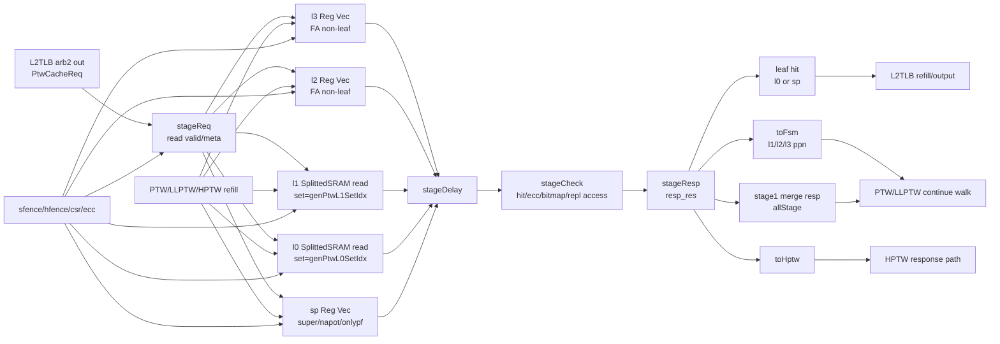
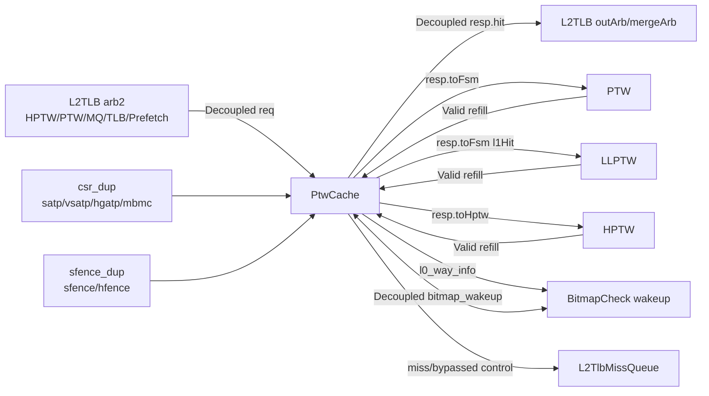

# PageTableCache 使用目的与工作原理分析

## 分析范围

- 分析对象：KunMingHu v3 的 `PtwCache`，源码文件为 `src/main/scala/xiangshan/cache/mmu/PageTableCache.scala`。
- 用户给定源码树：`/nfs/home/yanyusong/mdp-kmhv3/XiangShan`
- 分析源码 commit：`055d8ad9e56b0b618f2d549a97f3a028986b4849`
- skill 路径：用户给出的 `/tools/xiangshan-code-analyzer/skills/analyze-xiangshan-kunminghu` 在当前环境不可读，实际使用工作区同名路径 `/nfs/home/yanyusong/XiangShanLab/tools/xiangshan-code-analyzer/skills/analyze-xiangshan-kunminghu`。
- weekly sync：前序检查结果为 `skip: last sync 0.24 days ago < 7 days`，因此本次以用户给定本地 XiangShan v3 源码为准。

本文讨论的 PageTableCache 不是 DCache，也不是最终 TLB storage，而是 L2TLB/PTW 路径内部的页表遍历结果缓存。它缓存页表 walker 已经读到的 PTE 或一组 PTE，用来缩短后续 page walk。

## 模块定位

`PtwCache` 在 `L2TLB` 内部实例化，位于 miss queue、PTW、HPTW、LLPTW 之间：

```scala
// L2TLB.scala:138-142
val missQueue = Module(new L2TlbMissQueue)
val cache = Module(new PtwCache)
val ptw = Module(new PTW)
val hptw = Module(new HPTW)
val llptw = Module(new LLPTW)
```

L2TLB 将来自 TLB miss、missQueue、PTW/LLPTW 继续遍历请求、HPTW 请求以及预取器的请求统一仲裁到 `PtwCache`。代码中 `arb2.io.out.ready := cache.io.req.ready`，然后 `cache.io.req.valid := arb2.io.out.fire`，payload 包括 VPN、stage 类型、是否首次请求、是否 HPTW 请求等信息，见 `L2TLB.scala:299` 和 `L2TLB.scala:368-376`。

模块自身的注释说明了基本意图：

```scala
// PageTableCache.scala:33-37
/* ptw cache caches the page table of all the three layers
 * ptw cache resp at next cycle
 * the cache should not be blocked
 * when miss queue if full, just block req outside
 */
```

这里的 “all the three layers” 是历史注释，v3 代码在启用 Sv48 时实际包含 l3/l2/l1/l0/sp 多类结构。

## 为什么需要 PageTableCache

一次 TLB miss 可能触发多级页表遍历。普通 4KB 页在 Sv39/Sv48 下需要逐级读取 non-leaf PTE，直到叶子 PTE；两阶段地址翻译还可能叠加 S-stage 和 G-stage 翻译。PageTableCache 的作用是把这些中间结果和叶子结果缓存起来：

| 命中类型 | 缓存内容 | 下游效果 |
| --- | --- | --- |
| `l0` 命中 | 4KB 叶子 PTE sector，含权限/PBMT/PPN | 可以直接形成 TLB refill 响应；如果两阶段翻译为 `allStage` 且 stage1 不是 page fault，则生成 `stage1` 结果给后续 stage2 |
| `sp` 命中 | 2MB/1GB/512GB superpage 或 Svnapot/onlypf 条目 | 可以直接形成大页/napot/异常类响应 |
| `l1/l2/l3` 命中 | non-leaf PTE，主要是下一层页表 PPN | PTW/LLPTW 不必从根页表重新走，可以从缓存 PPN 继续 walk |
| 未命中 | 无可用缓存项 | 请求进入 PTW/HPTW/LLPTW 或 miss queue |

代码证据：

- 输出 `hit` 只由 `l0` 或 `sp` 叶子类命中产生，见 `PageTableCache.scala:719`。
- non-leaf 命中通过 `toFsm.l3Hit/l2Hit/l1Hit` 和 `toFsm.ppn` 传给 PTW FSM，见 `PageTableCache.scala:726-730`。
- `stage1Hit` 表示 allStage 翻译时找到了 stage1 PTE，但还需要继续做 stage2 翻译，见 `PageTableCache.scala:714` 和 `PageTableCache.scala:730`。
- L2TLB 根据这些信号把请求送到 PTW 或 LLPTW，见 `L2TLB.scala:334-354` 和 `L2TLB.scala:390-405`。

## 接口与上下游

`PtwCacheIO` 定义了四类关键接口，见 `PageTableCache.scala:129-202`：

| 接口 | 方向 | 类型 | 作用 |
| --- | --- | --- | --- |
| `req` | 输入 | `Flipped(DecoupledIO(new PtwCacheReq()))` | 接收来自 L2TLB 仲裁后的 page-walk 查询请求 |
| `resp` | 输出 | `DecoupledIO(...)` | 返回命中、partial hit、stage1、toHptw 等结果 |
| `refill` | 输入 | `Flipped(ValidIO(...))` | PTW/LLPTW/HPTW 从内存取回 PTE 后写入 page cache |
| `sfence_dup/csr_dup` | 输入 | bundle | 用于 flush、ASID/VMID 比较、虚拟化状态、PBMT/bitmap 等控制 |
| `bitmap_wakeup` | 可选输入 | `DecoupledIO(new BitmapWakeup())` | Bitmap Check 完成后更新 l0 bitmap 状态 |
| `l0_way_info` | 可选输出 | `UInt` | l0 refill 时输出 victim way，方便后续 bitmap wakeup 定位 |

`PtwCacheReq` 包含请求的翻译上下文，见 `PageTableCache.scala:121-127`：

```scala
class PtwCacheReq(implicit p: Parameters) extends PtwBundle {
  val req_info = new L2TlbInnerBundle()
  val isFirst = Bool()
  val bypassed = if (EnableSv48) Vec(4, Bool()) else Vec(3, Bool())
  val isHptwReq = Bool()
  val hptwId = UInt(log2Up(l2tlbParams.llptwsize).W)
}
```

`resp` 不是一个简单 hit/miss。它同时携带：

- `hit/prefetch/bypassed`：叶子命中、是否预取来源、是否被同周期/近周期 refill bypass 影响。
- `toFsm`：给 PTW/LLPTW 继续 walk 的 partial hit 信息。
- `stage1`：two-stage 翻译中 stage1 命中的合并响应。
- `toHptw`：HPTW 请求命中或 partial hit 的响应。

## 与 L2TLB 的实际连接

L2TLB 中，`PtwCache` 位于所有 page-walk 请求的第一站。有效路径如下：

1. `arb2` 仲裁请求源，包括 HPTW、PTW 继续请求、missQueue、L1 TLB miss、预取请求，见 `L2TLB.scala:207-285`。
2. `arb2.io.out.ready := cache.io.req.ready`，cache 控制仲裁器能否放行，见 `L2TLB.scala:299`。
3. 仲裁输出进入 `cache.io.req`，并设置 `isFirst/isHptwReq/hptwId/bypassed`，见 `L2TLB.scala:368-376`。
4. cache 响应若是 leaf hit，进入 TLB refill 输出通路；若是 non-leaf partial hit，送 PTW/LLPTW 继续；若无法立即下发，则进入 missQueue，见 `L2TLB.scala:381-410`。
5. PTW/LLPTW/HPTW 从内存拿到 PTE 后通过 `cache.io.refill` 写回 PageTableCache，refill 连接在 `L2TLB.scala:656-661` 附近。

## 参数与容量

`L2TLBParameters` 给出默认容量和替换策略，见 `MMUConst.scala:44-76`：

| 结构 | 默认参数 | 作用 |
| --- | --- | --- |
| l3 | `l3Size = 16`, `plru` | Sv48 level 3 non-leaf PTE，全相联 |
| l2 | `l2Size = 16`, `plru` | level 2 non-leaf PTE，全相联 |
| l1 | `l1nSets = 4`, `l1nWays = 2`, `setplru` | level 1 non-leaf PTE，组相联 SRAM |
| l0 | `l0nSets = 64`, `l0nWays = 4`, `setplru` | level 0 4KB leaf PTE sector，组相联 SRAM |
| sp | `spSize = 16`, `plru` | superpage/Svnapot/onlypf 条目，全相联 |
| hash | `hashAsidWidth = 3`, `hashVpnWidth = 6` | l0/l1 flush 过滤用的 ASID/VMID/VPN 折叠哈希 |

`HasPtwConst` 定义各级 tag/index/sector 划分，见 `MMUConst.scala:283-318`。l1/l0 的 set 和 sector index 由如下函数计算：

```scala
// MMUConst.scala:342-368
def genPtwL1Idx(vpn: UInt) = (vpn(vpnLen - 1, vpnnLen))(PtwL1IdxLen - 1, 0)
def genPtwL1SectorIdx(vpn: UInt) = genPtwL1Idx(vpn)(PtwL1SectorIdxLen - 1, 0)
def genPtwL1SetIdx(vpn: UInt) =
  genPtwL1Idx(vpn)(PtwL1SetIdxLen + PtwL1SectorIdxLen - 1, PtwL1SectorIdxLen)
def genPtwL0Idx(vpn: UInt) = vpn(PtwL0IdxLen - 1, 0)
def genPtwL0SectorIdx(vpn: UInt) = genPtwL0Idx(vpn)(PtwL0SectorIdxLen - 1, 0)
def genPtwL0SetIdx(vpn: UInt) =
  genPtwL0Idx(vpn)(PtwL0SetIdxLen + PtwL0SectorIdxLen - 1, PtwL0SectorIdxLen)
```

含义：

- l1 缓存的是下一层页表页内的一组 PTE，索引从 VPN 去掉最低一级 VPN 后再取低位。
- l0 缓存的是 4KB leaf PTE sector，直接从 VPN 低位切出 sector/set。
- sector index 选择同一 cache line 中的具体 PTE；set index 选择 SRAM set；剩余高位形成 tag。

## 内部存储结构

`PtwCache` 内部有五类主要存储，见 `PageTableCache.scala:249-343`：

| 名称 | 代码结构 | valid 初值 | 存储内容 | 命中粒度 |
| --- | --- | --- | --- | --- |
| `l3` | `Reg(Vec(l3Size, new PtwEntry(...)))` | `l3v = 0` | Sv48 level 3 non-leaf PTE | 全相联 entry |
| `l2` | `Reg(Vec(l2Size, new PtwEntry(...)))` | `l2v = 0` | level 2 non-leaf PTE | 全相联 entry |
| `l1` | `SplittedSRAM(PTWEntriesWithEcc(...))` | `l1v = 0` | level 1 non-leaf PTE sector，带 ECC | set/way/sector |
| `l0` | `SplittedSRAM(PTWEntriesWithEcc(...))` | `l0v = 0` | level 0 叶子 PTE sector，带权限和 ECC | set/way/sector |
| `sp` | `Reg(Vec(spSize, new PtwEntry(... hasPerm/hasLevel/hasNapot)))` | `spv = 0` | superpage、Svnapot、onlypf 类叶子项 | 全相联 entry |

每类结构旁边还有 `g/asid/vmid/h` 等元数据：

- `g`：global 位过滤，S-stage/G-stage 有差异。
- `asid/vmid`：地址空间匹配。
- `h`：记录该条目属于 `noS2xlate/onlyStage1/onlyStage2` 中哪类翻译；请求 `allStage` 会先按 stage1 查找。
- l0/l1 使用 `XORFold` 后的 ASID/VMID 哈希辅助 flush，l0 还存 `l0vpns` 的 VPN 哈希。
- l0 可选 `l0BitmapReg` 记录每个 l0 sector PTE 是否已通过 Bitmap Check，见 `PageTableCache.scala:210-214`。

## PTE entry 的命中语义

`PtwEntry` 字段见 `MMUBundle.scala:908-918`，包括 `tag/asid/vmid/n/pbmt/ppn/perm/level/prefetch/v`。

核心命中函数见 `MMUBundle.scala:921-982`：

- 非 superpage 情况：比较 ASID、VMID、tag。
- `onlyStage2` 时不需要 ASID。
- 非虚拟化或普通 sfence 用 `satp.asid`；虚拟化 stage1 用 `vsatp.asid` 和 `hgatp.vmid`。
- `allType = true` 用于 superpage，根据 entry 的 `level` 决定比较 VPN 的高几段。
- global 位可绕过 ASID 比较，但 G-stage PTE 的 g 位在 refill 时被清掉。

`PtwEntry.refill` 见 `MMUBundle.scala:984-1000`，会写 tag、pbmt、ppn、perm、asid、vmid、prefetch、valid、level。若 `s2xlate === onlyStage2`，代码把 `perm.g` 强制清零，避免 G-stage PTE 的 global 位被硬件误用，见 `MMUBundle.scala:991-994`。

`PtwEntries` 是 l0/l1 的 sector 化版本，见 `MMUBundle.scala:1031-1099`：

- 一个 SRAM entry 内保存多个 PTE 的 `pbmts/ppns/vs/onlypf/perms`。
- l0 `hasPerm = true`，`vs` 表示该 sector slot 是否可作为 leaf 或 only page fault 条目。
- l1 `hasPerm = false`，只缓存 non-leaf PTE；如果 level 1 PTE 是 leaf，l1 不会直接返回权限结果，因为它没有保存 permission。
- `sectorIdxClip(vpn, level)` 选中 sector 内具体 PTE。

## 流水线

`PtwCache` 用 `stageReq -> stageDelay -> stageCheck -> stageResp` 组织查询，见 `PageTableCache.scala:229-247`。

| 阶段 | 主要工作 | 关键寄存/控制 | 可能阻塞/清空 |
| --- | --- | --- | --- |
| `stageReq` | 接收 `io.req`；发起 l0/l1 SRAM read；同时计算 l2/l3/sp 全相联比较的第一拍 | `stageReq <> io.req` | `rwHarzad` 或 `wakeupHarzad` 会阻塞进入下一拍 |
| `stageDelay` | 等 SRAM 响应；保存 full-assoc hitVec 和 SRAM valid/h/g 元数据 | `DataHoldBypass`、`RegEnable` | `flush` 清空 |
| `stageCheck` | 对 l0/l1 SRAM 数据做 tag/ASID/VMID/sector/ECC/bitmap 检查；更新 replacement access | `stageCheck_valid_1cycle` | `flush` 清空 |
| `stageResp` | 打包 leaf hit、partial hit、stage1、toHptw、bypass 信息 | `resp_res` | `io.resp.ready` 反压 |

`rwHarzad` 和 `wakeupHarzad` 是结构冲突控制，见 `PageTableCache.scala:224-227`：

```scala
val rwHarzad = if (sramSinglePort) io.refill.valid else false.B
val wakeupHarzad = if (HasBitmapCheck) io.bitmap_wakeup.get.fire else false.B
PipelineConnect(stageReq, stageDelay(0), stageDelay(1).ready, flush, rwHarzad || wakeupHarzad)
```

这表示单端口 SRAM refill 写入或 bitmap wakeup 读取 l0 时，新查询不能同时占用读口。被阻塞的请求在 `io.req` 侧通过 Decoupled ready 反压保留。

## 查询路径

查询统一使用请求 VPN 和翻译类型。代码先把 `allStage` 转成 stage1 查找：

```scala
// PageTableCache.scala:378-383
val vpn_search = stageReq.bits.req_info.vpn
val h_search = MuxLookup(stageReq.bits.req_info.s2xlate, noS2xlate)(Seq(
  allStage -> onlyStage1,
  onlyStage1 -> onlyStage1,
  onlyStage2 -> onlyStage2
))
```

### l3/l2 全相联查询

l3 仅 Sv48 启用，l2 常驻。它们都是 Reg Vec 全相联结构，命中条件是：

1. entry 自身 `hit(...)` 通过 tag、ASID/VMID/global 判断。
2. valid bit 为 1。
3. entry 的 `h` 与当前 `h_search` 一致。

l3 见 `PageTableCache.scala:385-421`，l2 见 `PageTableCache.scala:423-455`。命中后用 `ParallelPriorityMux` 取 PPN/PBMT/prefetch，并更新 replacement policy 的 access 状态。

### l1 SRAM 查询

l1 是 set/way SRAM。读取流程见 `PageTableCache.scala:457-513`：

1. `ridx = genPtwL1SetIdx(vpn_search)` 选 set。
2. `l1.io.r.req.valid := stageReq.fire` 发起 SRAM read。
3. 同拍读取该 set 的 valid、h、global 元数据。
4. 下一拍用 SRAM data、valid、h、global 和 delayed VPN 做 `PtwEntries.hit`。
5. `ParallelPriorityMux` 选择 hit way，从 sector 中取 `ppns(genPtwL1SectorIdx(check_vpn))` 和 PBMT。
6. 若启用 PTW ECC，`hitWayEntry.decode()` 检查 ECC。
7. 命中时 `ptwl1replace.access(set, way)` 更新 set PLRU。

l1 只返回 non-leaf PPN，不返回 permission，所以它只用于让 PTW 从更低一级继续 walk。

### l0 SRAM 查询

l0 是 4KB leaf PTE sector cache，流程见 `PageTableCache.scala:524-610`：

1. `ridx = genPtwL0SetIdx(vpn_search)` 选 set。
2. 读出所有 way 的 sector 数据。
3. 用 `PtwEntries.hit` 比较 tag、ASID/VMID、sector valid。
4. 从 hit way 取出 sector 内所有 PPN/PBMT/perm/onlypf。
5. `idx = vpn(2, 0)` 在响应阶段选择当前 4KB 页对应的 sector slot，见 `PageTableCache.scala:715`。
6. 如果开启 Bitmap Check，且当前请求需要 bitmap 验证，则只有 `l0BitmapReg(hitWay)(pte_index) == 1` 才算真正 hit；否则返回 `jmp_bitmap_check`，见 `PageTableCache.scala:557-570`。
7. 命中时更新 l0 set PLRU。

l0 会构造 `l0Ptes` 和 `l0cfs`，用于 bitmap check 或下游 stage1 响应，见 `PageTableCache.scala:602-609`。

### sp 查询

`sp` 是 superpage/Svnapot/onlypf 的全相联 Reg Vec，见 `PageTableCache.scala:646-684`。它调用 `PtwEntry.hit(... allType = true ...)`，根据 entry 中记录的 `level` 判断 VPN 哪些段需要匹配。

如果启用 Bitmap Check，superpage 命中且需要 bitmap 验证时不会直接算 hit，而是置 `jmp_bitmap_check` 让下游处理，见 `PageTableCache.scala:656-660`。

## 响应语义

`check_res` 在 `stageCheck` 聚合各级命中结果，`resp_res` 在 `stageResp` 使用，见 `PageTableCache.scala:686-694`。

核心响应规则见 `PageTableCache.scala:712-833`：

```scala
val isAllStage = stageResp.bits.req_info.s2xlate === allStage
val isOnlyStage2 = stageResp.bits.req_info.s2xlate === onlyStage2
val stage1Hit = (resp_res.l0.hit || resp_res.sp.hit) && isAllStage
val stage1Pf = !Mux(resp_res.l0.hit, resp_res.l0.v(idx), resp_res.sp.v)
io.resp.bits.hit := (resp_res.l0.hit || resp_res.sp.hit) &&
  (!isAllStage || isAllStage && stage1Pf)
```

含义：

- 非 two-stage `allStage` 请求：l0/sp 命中就是最终 leaf hit。
- `allStage` 请求：l0/sp 命中通常只是 stage1 命中，还需要 stage2；只有 stage1 已经是 page fault 时，才可以直接作为最终 hit 返回异常。
- l1/l2/l3 命中不会让 `io.resp.bits.hit` 为真，而是作为 `toFsm.l1Hit/l2Hit/l3Hit` 和 `toFsm.ppn` 返回，让 PTW 从缓存 PPN 继续。
- HPTW 请求走 `toHptw` 通路，见 `PageTableCache.scala:741-772`。
- `stage1` 响应将 l0/sp/l1/l2/l3 的 PPN/PBMT/level 等转成 `PtwMergeResp`，给 two-stage 翻译继续使用，见 `PageTableCache.scala:774-831`。

同时，代码断言普通页和大页不能同时 hit：

```scala
// PageTableCache.scala:833
XSError(stageResp.valid && resp_res.l0.hit && resp_res.sp.hit,
  "normal page and super page both hit")
```

## refill 路径

`io.refill` 是 `ValidIO`，不带 ready，因此 refill 到来时 cache 必须处理或通过 flush 条件屏蔽。refill 数据包括：

- `ptes`：一个 cache block 的 PTE 数据。
- `levelOH`：指示写入 l3/l2/l1/l0/sp 哪类结构。
- `req_info_dup/level_dup/sel_pte_dup`：为不同 cache level 复制的请求和选中 PTE，降低扇出。

refill 数据解析见 `PageTableCache.scala:853-860`。`memPtes` 是 block 内所有 PTE，`memPte` 是各副本选中的 PTE，`pbmte` 根据 S-stage/G-stage 选择 `hPBMTE/mPBMTE`。

### l3/l2 refill

l3 refill 条件见 `PageTableCache.scala:888-918`，l2 refill 条件见 `PageTableCache.scala:920-950`：

- 不能处于对应 flush。
- `levelOH.l3/l2` 有效。
- 选中 PTE 不是 leaf。
- `canRefill(...)` 允许 refill。
- victim index 由 `replaceWrapper(valids, replacer.way)` 选择。

`replaceWrapper` 先找无效项，满了才用替换策略给出的 way，见 `MMUConst.scala:237-245`：

```scala
def replaceWrapper(v: UInt, lruIdx: UInt): UInt = {
  val width = v.getWidth
  val emptyIdx = ParallelPriorityMux((0 until width).map(i => (!v(i), i.U(log2Up(width).W))))
  val full = Cat(v).andR
  Mux(full, lruIdx, emptyIdx)
}
```

### l1 refill

l1 refill 见 `PageTableCache.scala:952-994`：

- set index：`genPtwL1SetIdx(refill.req_info_dup(1).vpn)`。
- victim way：`replaceWrapper(getl1vSet(vpn), ptwl1replace.way(set))`。
- 写入数据：`l1Wdata.gen(...)` 根据整条 `memRdata` 生成一个 `PtwEntries` sector。
- 写 SRAM：`l1.io.w.apply(valid = true, setIdx, data, waymask)`。
- 更新 `l1v/l1g/l1h/l1asids/l1vmids`。

l1 的 global 位需要 block 内所有 PTE 都为 global 才置位，见 `PageTableCache.scala:981`。

### l0 refill

l0 refill 见 `PageTableCache.scala:995-1042`：

- 条件：`levelOH.l0` 且选中 PTE 不是 napot。
- set index：`genPtwL0SetIdx(vpn)`。
- victim way：优先空 way，否则 set PLRU。
- 写入 `l0Wdata.gen(...)`，其中包含多个 leaf PTE 的 PPN/PBMT/权限。
- 更新 `l0v/l0g/l0h/l0asids/l0vmids/l0vpns`。
- 若启用 Bitmap Check，会清掉被替换 entry 对应的 `l0BitmapReg`，见 `PageTableCache.scala:1030`。

### sp refill

`sp` refill 见 `PageTableCache.scala:1045-1074`。它处理：

- level 1/2/3 的 leaf superpage。
- l0 level 的 Svnapot PTE。
- `onlyPf` 类条目，用于缓存只产生 page fault 的结果。

victim 直接来自 `spreplace.way`，写入 `sp/spv/spg/sph`，并记录 level、napot、permission 等 leaf 信息。

## 替换与 access 更新

替换策略来自 `ReplacementPolicy.fromString`：

- l3/l2/sp 是全相联 PLRU，命中时按 hit way 调用 `access`，见 `PageTableCache.scala:404`、`438`、`665`。
- l1/l0 是 set PLRU，命中时按 `(set, way)` 调用 `access`，见 `PageTableCache.scala:504`、`582`。
- refill 时同样对 victim way 调用 `access`，表示新写入 entry 成为最近访问项，见 `PageTableCache.scala:940`、`979`、`1026`、`1064`。

同时发生 refill 与查询时，如果 SRAM 是 single-port，`rwHarzad` 阻塞新查询，避免 l0/l1 read/write 端口冲突。Reg Vec 的 l2/l3/sp 虽不受 SRAM 端口限制，但 pipeline 统一受阻，保证 refill bypass/valid 更新的一致性。

## flush 与一致性

PageTableCache 有三类清空来源：

1. CSR 或特权虚拟化状态变化：`satp/vsatp/hgatp/virt_changed`，形成 `flush_dup`，见 `PageTableCache.scala:221-222`。
2. `sfence/hfence`：按 ASID/VMID/global/VPN/translation stage 精细清空，见 `PageTableCache.scala:1096-1288`。
3. ECC 错误：l1/l0 对应 set 清空，见 `PageTableCache.scala:1076-1094`。

sfence 逻辑的要点：

- 普通 `sfence` 只处理非 `hg/hv` 情况，见 `PageTableCache.scala:1104-1153`。
- `hfencev` 清理 stage1/VS 相关条目，见 `PageTableCache.scala:1155-1196`。
- `hfenceg` 清理 stage2/G-stage 相关条目，见 `PageTableCache.scala:1199-1240`。
- Sv48 下 l3 也有相同逻辑，但 l3 不按具体 VA leaf 清，因为 l3 缓存的是高层 non-leaf PTE，见 `PageTableCache.scala:1242-1288`。
- l0/l1 为了降低全量比较成本，用 ASID/VMID/VPN 的 XORFold 哈希做粗过滤，再结合 set mask 和 valid bit 清理，见 `PageTableCache.scala:1097-1127`。

这种 flush 设计的目的不是替代 TLB shootdown，而是保证 page-walk cache 中的旧 PTE 不会在页表修改后被继续用于跳过内存访问。

## Bitmap Check 交互

当 `HasBitmapCheck` 启用时，l0 命中还可能需要额外的 bitmap 权限检查：

- `bitmapEnable := mbmc.BME === 1 && mbmc.CMODE === 0`，见 `PageTableCache.scala:214`。
- l0 查询时，如果需要 bitmap 且对应 bit 未通过，则不返回 leaf hit，而置 `jmp_bitmap_check`，见 `PageTableCache.scala:568-570`。
- bitmap wakeup 端口会读 l0 SRAM 验证 entry 仍命中，再更新 `l0BitmapReg(set)(way)(pte_index)`，见 `PageTableCache.scala:611-643`。
- wakeup 与 refill 不能同时抢 l0 端口，`io.bitmap_wakeup.ready := !(valid && refill.valid)`，见 `PageTableCache.scala:616`。

因此 l0 的 leaf PTE 缓存与 bitmap 检查状态是分开的：PTE 命中只能说明页表项命中，bitmap 状态决定能否直接放行。

## bypass 机制

`bypassed` 用于处理查询流水中与 refill 的近距离冲突。`stageResp` 中，每个 level 都会检查 `refill_bypass(vpn, level, s2xlate)`，如果同一请求在流水中遇到刚发生的 refill，可能标记 bypassed，见 `PageTableCache.scala:696-710`。

`InsideStageConnect` 还会在 stage 内保存 bypassed 状态，避免 refill 有效但请求尚未进入下一 stage 时丢失信息，见 `PageTableCache.scala:1290-1300`。

下游 L2TLB 看到 `bypassed` 且仍未命中时，会倾向于放入 missQueue 或等待重新请求，而不是使用可能已经过期的 miss 判断，见 `L2TLB.scala:306-317` 和 `L2TLB.scala:381-387`。

## 数据路径图



## 模块接口图



## ready/valid 时序图

下面的 timing 图是对 `PageTableCache.scala:241-247` 中 pipeline connect 的抽象：`req.fire` 后经过 delay/check/resp 多拍，在 `resp.ready` 允许时输出；如果 refill 单端口冲突，`req.ready` 会被拉低。

```waveform-draw
{
  "signal": [
    { "name": "clk", "wave": "p........" },
    { "name": "io.req.valid", "wave": "01.0.10.." },
    { "name": "io.req.ready", "wave": "01.0.10.." },
    { "name": "stageReq.fire", "wave": "01.0.10.." },
    { "name": "rwHarzad", "wave": "000.100.." },
    { "name": "stageDelay.valid", "wave": "001.0.10." },
    { "name": "stageCheck.valid", "wave": "0001.0.10" },
    { "name": "io.resp.valid", "wave": "00001.0.1" },
    { "name": "io.resp.ready", "wave": "111111111" },
    { "name": "flush", "wave": "000000000" },
    { "name": "req.bits.vpn", "wave": "x=.x.=x..", "data": ["vpn0", "vpn1"] }
  ],
  "config": { "hscale": 1 }
}
```

## refill 与查询冲突时序

```waveform-draw
{
  "signal": [
    { "name": "clk", "wave": "p......" },
    { "name": "io.refill.valid", "wave": "0100..." },
    { "name": "rwHarzad", "wave": "0100..." },
    { "name": "io.req.valid", "wave": "01..0.." },
    { "name": "io.req.ready", "wave": "0.10..." },
    { "name": "stageReq.fire", "wave": "0..10.." },
    { "name": "l0/l1 write", "wave": "0100..." },
    { "name": "l0/l1 read", "wave": "0..10.." },
    { "name": "bypassed", "wave": "0.=.0..", "data": ["level"] }
  ],
  "config": { "hscale": 1 }
}
```

## 一次普通 miss 到命中的动态流程

场景：一个 load 触发 L1 TLB miss，L2TLB 查询 PageTableCache。

1. L2TLB 将请求经 `arb2` 送入 `PtwCache`。
2. `PtwCache` 并行查 l2/l3/sp，同时发起 l0/l1 SRAM read。
3. 如果 l0 命中且 bitmap/ECC 通过，`io.resp.bits.hit` 为 1，L2TLB 直接用 PPN/PBMT/权限形成 TLB refill。
4. 如果 l1/l2/l3 命中，`hit` 仍为 0，但 `toFsm` 携带命中 level 和 PPN，PTW 从该 PPN 指向的下一层页表继续读，减少根页表访问。
5. 如果全部 miss，请求进入 PTW 从根开始 walk；PTW 从内存取回 PTE block 后通过 `io.refill` 写入 PageTableCache。
6. 后续相邻 VPN 或同一页表层级的请求可能命中 l1/l0 sector 或 l2/l3 non-leaf entry。

## two-stage 翻译场景

`s2xlate === allStage` 时，PageTableCache 首先按 stage1 查找，即 `h_search = onlyStage1`。如果 l0/sp 找到 stage1 leaf：

- 若 stage1 是 page fault，则 `io.resp.bits.hit` 直接为真，因为异常已经足以返回。
- 若 stage1 有效，则不把它当最终 hit，而是通过 `stage1` 和 `toFsm.stage1Hit` 交给 PTW/HPTW 继续做 stage2 翻译。

这由 `PageTableCache.scala:712-719` 和 `PageTableCache.scala:774-831` 实现。

## 设计边界

PageTableCache 负责：

- 缓存 page table walk 过程中的 PTE 或 PTE sector。
- 根据 VPN/ASID/VMID/stage/global/level 判断命中。
- 给 PTW/HPTW/LLPTW 提供 leaf hit 或 partial walk 起点。
- 处理 refill、replacement、sfence/hfence/csr flush、ECC set flush、bitmap wakeup。

PageTableCache 不负责：

- 最终 L1/L2 TLB entry 的长期存储和替换。
- 真实内存读请求的发出；那是 PTW/HPTW/LLPTW 和下层 cache/memory 系统的职责。
- PTE permission 的完整架构检查；它缓存 permission 并把信息传下去，最终 page fault/access fault 语义由 PTW/TLB 相关路径完成。

## 关键源码证据索引

| 主题 | 文件与行号 |
| --- | --- |
| 模块注释和目标 | `PageTableCache.scala:33-37` |
| IO 定义 | `PageTableCache.scala:129-202` |
| pipeline 与 hazard | `PageTableCache.scala:221-247` |
| l3/l2/l1/l0/sp 存储结构 | `PageTableCache.scala:249-343` |
| 请求 stage 类型归一化 | `PageTableCache.scala:378-383` |
| l3 查询 | `PageTableCache.scala:385-421` |
| l2 查询 | `PageTableCache.scala:423-455` |
| l1 查询 | `PageTableCache.scala:457-513` |
| l0 查询与 bitmap | `PageTableCache.scala:524-610` |
| bitmap wakeup | `PageTableCache.scala:611-643` |
| sp 查询 | `PageTableCache.scala:646-684` |
| 响应选择 | `PageTableCache.scala:686-833` |
| refill 数据解析 | `PageTableCache.scala:847-860` |
| l3/l2/l1/l0/sp refill | `PageTableCache.scala:887-1074` |
| ECC flush | `PageTableCache.scala:1076-1094` |
| sfence/hfence flush | `PageTableCache.scala:1096-1288` |
| stage 内 bypass | `PageTableCache.scala:1290-1300` |
| L2TLB 实例化 | `L2TLB.scala:138-140` |
| L2TLB 请求进入 PtwCache | `L2TLB.scala:299`, `L2TLB.scala:368-376` |
| L2TLB 响应分流 | `L2TLB.scala:381-410` |
| 参数默认值 | `MMUConst.scala:44-76` |
| PTW index/tag 切分 | `MMUConst.scala:283-318`, `MMUConst.scala:342-368` |
| victim 选择 | `MMUConst.scala:237-245` |
| PtwEntry 命中/refill | `MMUBundle.scala:908-1000` |
| PtwEntries sector 命中/refill生成 | `MMUBundle.scala:1031-1099` |

## 总结

KunMingHu v3 的 PageTableCache 是 L2TLB 内部的 PTW 加速缓存。它把页表遍历中的 non-leaf PTE、4KB leaf PTE sector、大页/Svnapot/onlypf 结果分层缓存起来。查询时，它并行搜索 l3/l2/l1/l0/sp：l0/sp 命中可以直接形成 leaf 响应，l1/l2/l3 命中则把 PTW 的起点推进到更低层页表。refill 时，它按 levelOH 写入不同结构，优先使用 invalid entry，满时采用 PLRU/set-PLRU。sfence/hfence、CSR 变化、ECC 错误和 bitmap check 状态共同维护缓存正确性。

从微架构角度看，它解决的是 page walk 的重复内存访问问题：许多相邻 VPN 共享高层页表项，l0/l1 又能利用同一 PTE cache line 内的 sector 局部性。PageTableCache 用较小的专用结构换取 PTW latency 和内存带宽的下降，同时通过 stage 类型、ASID/VMID/global、flush 和 bitmap/ECC 机制保证不会错误复用旧页表项。
