# 一条ADD指令的简单分析过程

基于的波形文件：

[附件: add\_inst.zip](./attachments/8Y4Nert_doKhtzEK/add_inst.zip)

推荐一个看波形很丝滑的软件：

[surfer软件链接](https://surfer-project.org/)

# 1.软件与波形文件准备：

（1）下载并安装波形查看软件：[surfer软件链接](https://surfer-project.org/)

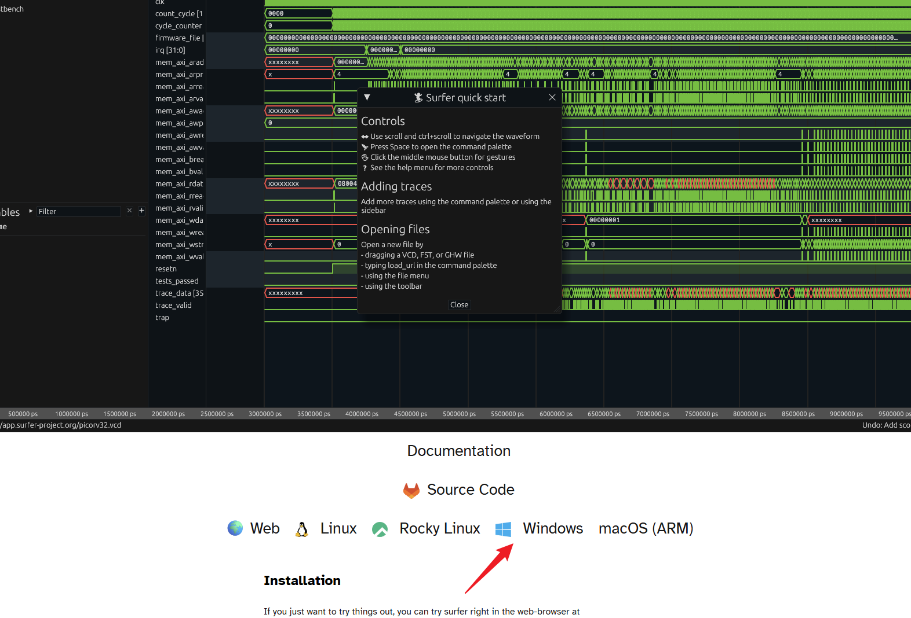

（2）打开波形文件及状态文件

首先，运行可执行文件（.exe）：


然后，打开波形文件：

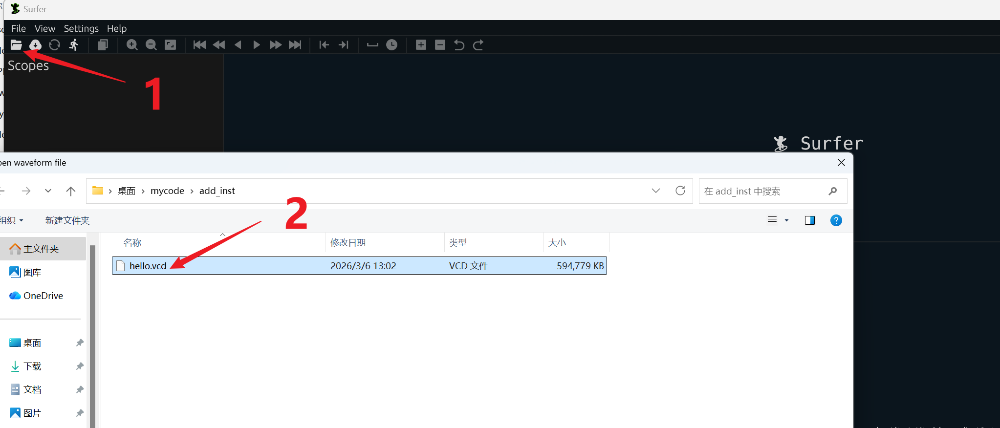

此时，软件会自动检测到一个状态文件。这个文件实际上就是压缩包内的 `hello.surf.ron`文件，用于保存对波形所做的各项操作状态，例如显示哪些波形、设置的标记等。请点击“使用”这个状态文件。：

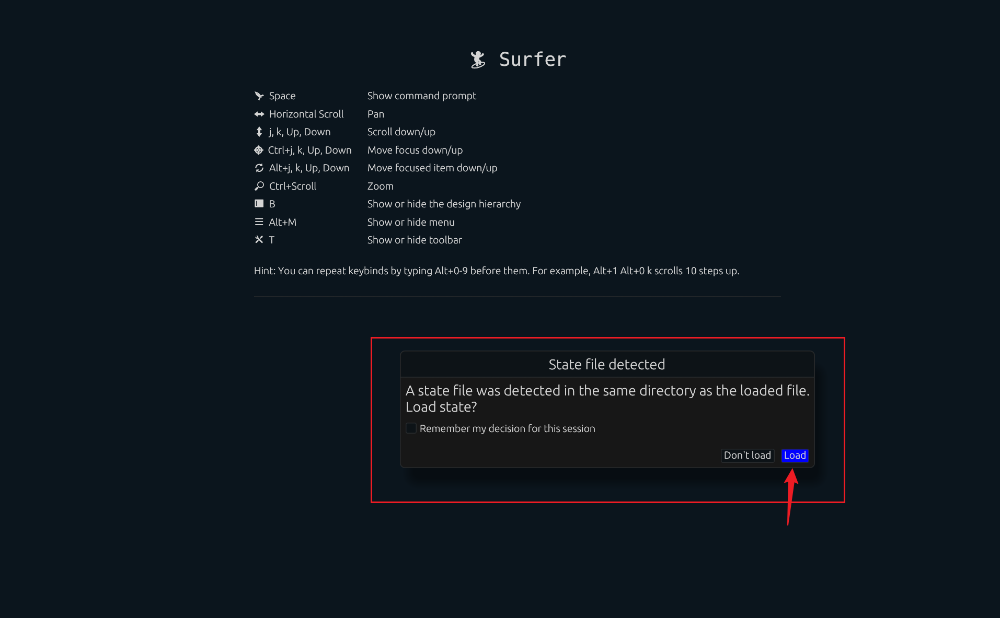

成功打开后的界面截图如下：

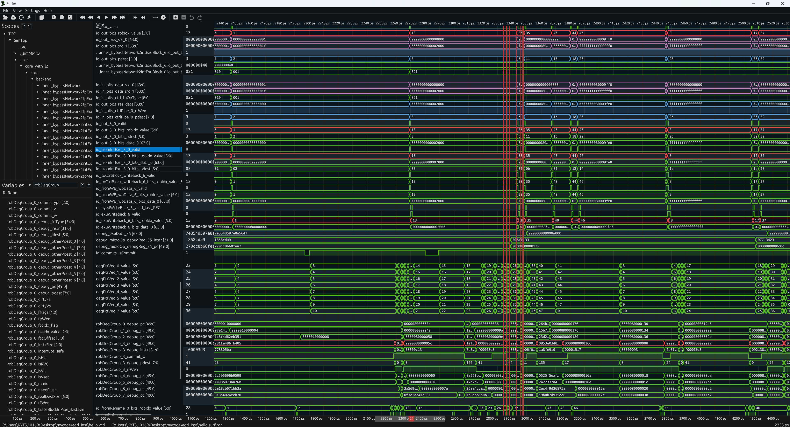

# 2.找到一条合适的 `add`指令

打开反汇编文件（即压缩包中的 `hello-riscv64-xs.txt`文件）：


此处选择位于程序计数器（pc）地址 `0x80000122`的指令，其内容为 `0x006f0133`。单独分析这条指令，对照指令集手册：


（ 本图来源于 [链接](https://ai-embedded.com/risc-v/riscv-isa-manual/) ）

通过人工解析这条指令可知，其功能是：

将 30 号寄存器的值（src1） 与 6 号寄存器的值（src2） 相加，并将结果存入 2 号寄存器。

结合该指令的上下文信息，可以确定：

* 30 号寄存器的值应为 `0x00000000`
* 6 号寄存器的值应为 `0x8000a000`

因此，最终写入 2 号寄存器的结果就是 `0x00000000 + 0x8000a000 = 0x8000a000`。

详细分析如下：

***

<font style="color:#585A5A;">要理解其具体行为，需要追溯 </font><code><font style="color:#585A5A;">t5</font></code><font style="color:#585A5A;">和 </font><code><font style="color:#585A5A;">t1</font></code><font style="color:#585A5A;">两个源操作数在此前的计算过程：</font>

1. <code>**<font style="color:#585A5A;">t1</font>**</code>**<font style="color:#585A5A;">的值</font>**<font style="color:#585A5A;">：</font>
   * <font style="color:#585A5A;">指令 </font><code><font style="color:#585A5A;">auipc t1, 0xa</font></code><font style="color:#585A5A;">（位于 </font><code><font style="color:#585A5A;">0x8000010e</font></code><font style="color:#585A5A;">）将当前 PC (</font><code><font style="color:#585A5A;">0x8000010e</font></code><font style="color:#585A5A;">) 的高20位与立即数 </font><code><font style="color:#585A5A;">0xa</font></code><font style="color:#585A5A;">左移12位相加，得到 </font><code><font style="color:#585A5A;">t1 = 0x8000010e + 0xa000 = 0x8000a10e</font></code><font style="color:#585A5A;">。</font>
   * <font style="color:#585A5A;">随后的 </font><code><font style="color:#585A5A;">addi t1, t1, -270</font></code><font style="color:#585A5A;">（位于 </font><code><font style="color:#585A5A;">0x80000112</font></code><font style="color:#585A5A;">）进行修正：</font><code><font style="color:#585A5A;">t1 = 0x8000a10e - 0x10e = 0x8000a000</font></code><font style="color:#585A5A;">。</font>
   * <font style="color:#585A5A;">此值对应符号 </font><code><font style="color:#585A5A;">_stack_pointer</font></code><font style="color:#585A5A;">的地址，是链接脚本中定义的栈区域的起始地址。</font>
2. <code>**<font style="color:#585A5A;">t5</font>**</code>**<font style="color:#585A5A;">的值</font>**<font style="color:#585A5A;">：</font>
   * <code><font style="color:#585A5A;">t5</font></code><font style="color:#585A5A;">是连续计算的结果：</font><code><font style="color:#585A5A;">t5 = t3 * t4</font></code><font style="color:#585A5A;">。</font>
   * <code><font style="color:#585A5A;">t3 = t1 - t0</font></code><font style="color:#585A5A;">，其中 </font><code><font style="color:#585A5A;">t0</font></code><font style="color:#585A5A;">被设置为 </font><code><font style="color:#585A5A;">_stack_top</font></code><font style="color:#585A5A;">的地址 (</font><code><font style="color:#585A5A;">0x80002000</font></code><font style="color:#585A5A;">)。因此，</font><code><font style="color:#585A5A;">t3 = 0x8000a000 - 0x80002000 = 0x8000</font></code><font style="color:#585A5A;">。这表示总的栈空间大小（</font><code><font style="color:#585A5A;">_stack_pointer</font></code><font style="color:#585A5A;">到 </font><code><font style="color:#585A5A;">_stack_top</font></code><font style="color:#585A5A;">的距离）。</font>
   * <code><font style="color:#585A5A;">t4</font></code><font style="color:#585A5A;">来自 </font><code><font style="color:#585A5A;">csrr t4, mhartid</font></code><font style="color:#585A5A;">，读取当前硬件线程（Hart）的 ID。在单核或 Hart 0 上，</font><code>**<font style="color:#585A5A;">t4</font>**</code>**<font style="color:#585A5A;">的值通常为 0</font>**<font style="color:#585A5A;">。</font>
   * <font style="color:#585A5A;">因此，</font><code><font style="color:#585A5A;">t5 = 0x8000 * 0 = 0</font></code><font style="color:#585A5A;">。这个乘法操作用于支持多核/多线程场景，为每个 Hart 计算独立的栈地址偏移。在当前单 Hart 场景下，偏移为 0。</font>

### <font style="color:#585A5A;">执行结果 </font>

* **<font style="color:#585A5A;">运算</font>**<font style="color:#585A5A;">：</font><code><font style="color:#585A5A;">sp = t5 + t1 = 0 + 0x8000a000</font></code>
* **<font style="color:#585A5A;">结果</font>**<font style="color:#585A5A;">：</font>**<font style="color:#585A5A;">栈指针寄存器 </font>**<code>**<font style="color:#585A5A;">sp</font>**</code>**<font style="color:#585A5A;">被设置为 </font>**<code>**<font style="color:#585A5A;">0x8000a000</font>**</code><font style="color:#585A5A;">，即符号 </font><code><font style="color:#585A5A;">_stack_pointer</font></code><font style="color:#585A5A;">所代表的地址。</font>

***

# 3.查阅架构图与代码，确定分析起点

目前只对后端进行分析，分析的起点显然是 `CtrlBlock`模块

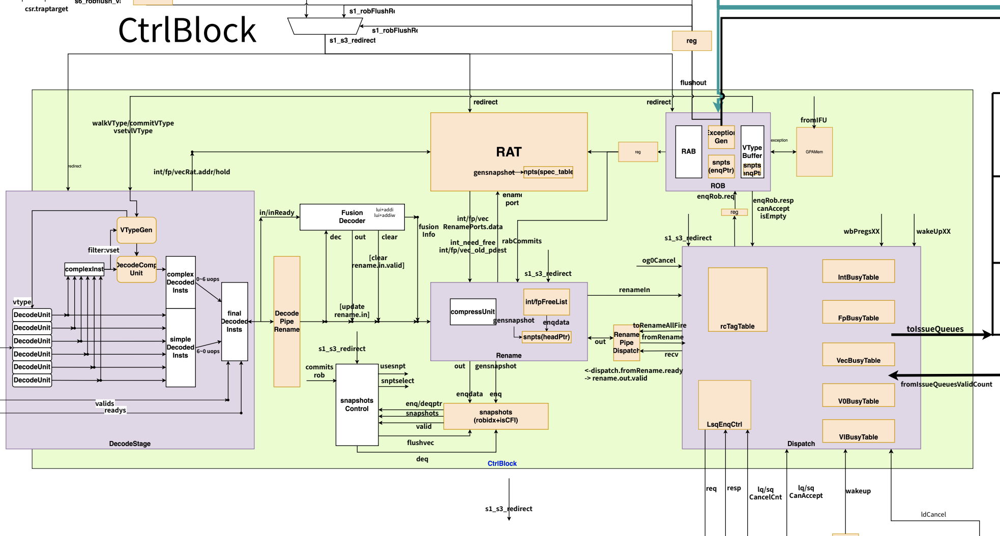

通过阅读设计手册可知，指令在进入后端时，首先会进入译码阶段。在译码阶段，由 6 个 `DecodeUnit`模块负责对输入的 6 条指令进行译码。

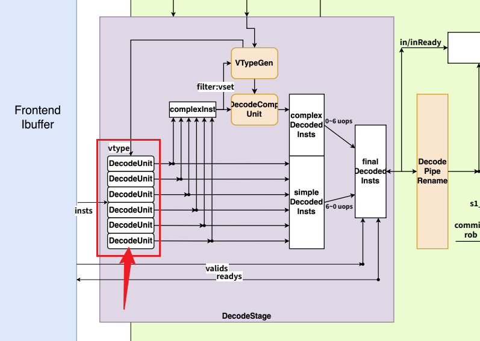

首先查看 `DecodeStage`中的代码以验证此猜想：

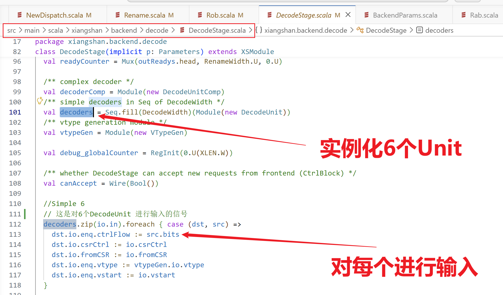

由此可知，系统生成了 6 个 `DecodeUnit`实例，并分别向其输入了数据。因此，当前的观察重点应放在 `DecodeUnit`模块上。为此，我们首先查看该模块的代码：


如上图所示，我们已定位到该模块的 IO 端口。接下来查看这些端口的定义：


由此可知，`DecodeUnitEnqIO`是该模块的输入接口，`DecodeUnitDeqIO`是其输出接口。查阅这两组接口的定义如下：


因此，对 `DecodeUnit`模块的研究将主要聚焦于这两组信号。

# 4.正式分析波形

## （1）译码模块（DecodeUnit）

查看第 0 个 DecodeUnit 的输入和输出：


该模块的输入与输出内容如下：

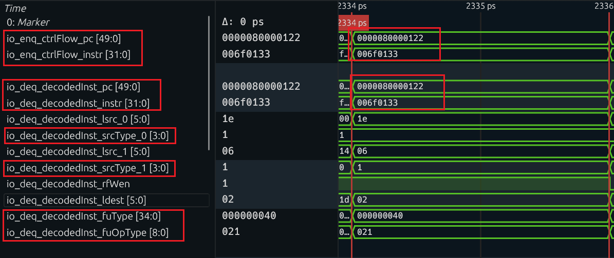

| chisel | verilog | 含义 |
| --- | --- | --- |
| `scala // Dequeue DecodeWidth insts from Ibuffer class CtrlFlow(implicit p: Parameters) extends XSBundle {   val instr = UInt(32.W)   val pc = UInt(VAddrBits.W) `  |  io\_enq\_ctrlFlow\_pc\[49:0]   |  发射队列入队指令的\*\*<font style="color:rgb(0, 0, 0);background-color:rgba(0, 0, 0, 0);">程序计数器（PC） </font>**<font style="color:rgb(0, 0, 0);background-color:rgba(0, 0, 0, 0);">记录指令在内存中的地址，是指令流的核心标识，香山采用 50 位物理地址  </font> |
|  |  io\_enq\_ctrlFlow\_instr\[31:0]   |    发射队列入队的**<font style="color:rgb(0, 0, 0);background-color:rgba(0, 0, 0, 0);">原始 32 位指令编码，</font>**未解码的 RISC-V 指令机器码，从 ICache/ITLB 取出后直接入队   |
|  <br/><code>verilog 首先找到： io.deq.decodedInst := decodedInst  class DecodeInUop(implicit p: Parameters) extends XSBundle {     val foldpc = UInt(MemPredPCWidth.W) // for mdp     val exceptionVec = ExceptionVec()     val isFetchMalAddr = Bool()     val trigger = TriggerAction()     val isRVC = Bool()     val fixedTaken = Bool()     val predTaken  = Bool()     val crossPageIPFFix = Bool()     val ftqPtr = new FtqPtr     val ftqOffset = UInt(FetchBlockInstOffsetWidth.W)     val isLastInFtqEntry = Bool()   val instr = UInt(32.W) 完成译码之后的机器码位宽是32位 class DecodeOutUopDebug(implicit p: Parameters) extends XSBundle {     val pc = UInt(VAddrBits.W)     val debug_seqNum = InstSeqNum() } 在dubug模式下可以显示pc值 </code>  | io\_deq\_decodedinst\_pc\[49:0] |  发射队列出队、完成译码后的指令 PC   |
| | io\_deq\_decodedInst\_instr\[31:0]   |  完成译码后的原始指令编码（保留原始机器码）   |
| src/main/scala/xiangshan/backend/decode/DecodeUnit.scala 在文件里面找到 add 指令的映射，之后跳转到相应的类型定义<br/>ADD     -> XSDecode(SrcType.reg, SrcType.reg, SrcType.X, FuType.alu, ALUOpType.add , SelImm.X    , xWen = T, canRobCompress = T), | io\_deq\_decodedInst\_lsrc\_0\[5:0] |  第 0 个源操作数的**<font style="color:rgb(0, 0, 0);background-color:rgba(0, 0, 0, 0);">逻辑寄存器号</font>**<font style="color:rgb(0, 0, 0);background-color:rgba(0, 0, 0, 0);"></font> |
| | io\_deq\_decodedInst\_srcType\_0\[3:0]   |  第 0 个源操作数的<font style="color:rgb(0, 0, 0);background-color:rgba(0, 0, 0, 0);">类型标识， 标识源操作数类型：如寄存器、立即数、PC 等，用于后续执行单元的操作数准备  </font> |
| | io\_deq\_decodedInst\_lsrc\_1\[5:0] |  第 1 个源操作数的**<font style="color:rgb(0, 0, 0);background-color:rgba(0, 0, 0, 0);">逻辑寄存器号</font>\*\* |
| | io\_deq\_decodedInst\_srcType\_1\[3:0] |  同 srcType\_0，对应指令的第二个源操作数   |
| |  io\_deq\_decodedInst\_rfWen   |  寄存器堆写使能  ，<code><font style="color:rgb(0, 0, 0);background-color:rgba(0, 0, 0, 0);">1</font></code>（表示该指令需要写回目标寄存器）   |
| | io\_deq\_decodedInst\_ldest\[5:0] |  目标寄存器的\*\*<font style="color:rgb(0, 0, 0);background-color:rgba(0, 0, 0, 0);">逻辑寄存器号</font>**<code><font style="color:rgb(0, 0, 0);background-color:rgba(0, 0, 0, 0);">02</font></code>**<font style="color:rgb(0, 0, 0);background-color:rgba(0, 0, 0, 0);">（对应十进制 2）  </font>\*\* |
| | io\_deq\_decodedInst\_fuType\[34:0] |  指令所属的\*\*<font style="color:rgb(0, 0, 0);background-color:rgba(0, 0, 0, 0);">功能单元（FU）类型，</font>**<font style="color:rgb(0, 0, 0);background-color:rgba(0, 0, 0, 0);"> 标识指令需要分配到哪个执行单元（如 ALU、MUL/DIV、LD/ST、Branch 等）  </font> |
| | io\_deq\_decodedInst\_fuOpType\[8:0] |  功能单元内的**<font style="color:rgb(0, 0, 0);background-color:rgba(0, 0, 0, 0);">具体操作类型，</font>\*\*<font style="color:rgb(0, 0, 0);background-color:rgba(0, 0, 0, 0);"> 在 FU 类型基础上，标识具体操作（如 ALU 中的 ADD/SUB/AND 等）  </font> |

可以看到，在 2334 ps 时刻，PC 地址为 `0x80000122`、指令为 `0x006f0133`的这条指令，成功输入到了第 0 个 DecodeUnit 中。在同一周期内，DecodeUnit 计算出了该指令最主要的译码信号（如上图所示），例如：

***

**lsrc\_0： 0x1e（十进制 30），****<font style="color:#DF2A3F;">其源类型（srcType）是 0x1</font>****。**

**lsrc\_1： 0x06（十进制 6），****<font style="color:#DF2A3F;">其源类型（srcType）是 0x1</font>****。**

**这两个寄存器的值将按照**\*\*<font style="color:#DF2A3F;"> fuType为 0x40及 fuOpType为 0x21的运算方式</font>\*\***进行计算。**

**计算结果会进行回写（rfWen信号为高），回写的寄存器位置是 0x2（十进制 2，即 ldest）。**

***

以上非红色的内容你应该能完全理解，因为在前面的指令分析中已经做过明确的解析：

> 将 30 号寄存器的值（src1） 与 6 号寄存器的值（src2） 相加，并将结果存入 2 号寄存器。

可以确认，该译码行为完全正确。

接下来，你需要理解红色部分所代表的含义：

\*\*首先，理解这两个 \*\*<code>**srcType**</code>\*\*的意义。\*\*我们先看 DecodeUnit 模块如何为这条 add 指令写入该值：

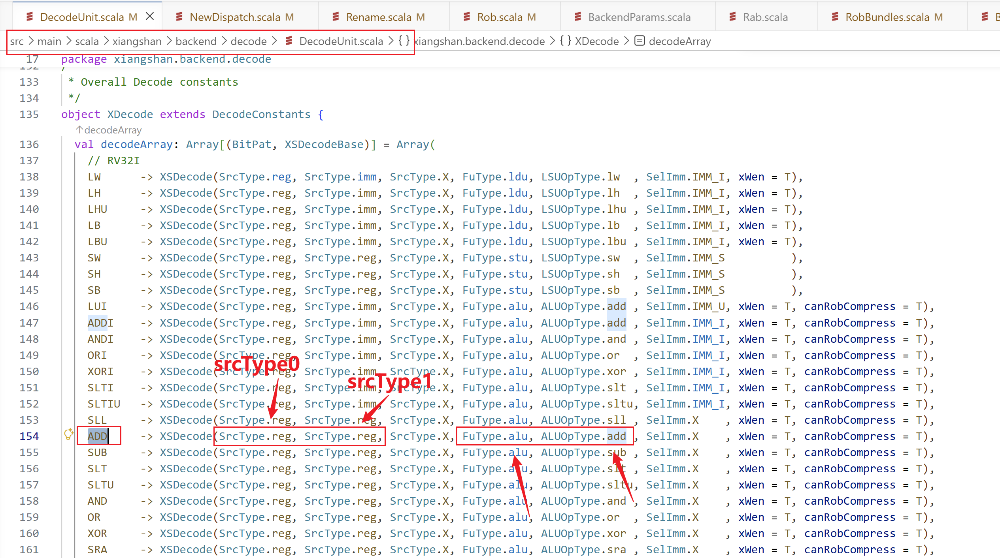

在代码中很容易发现，`srcType_0`之所以为 `0x1`以及 `srcType_1`之所以为 `0x1`，是因为 DecodeUnit 为这两个位置写入了 `SrcType.reg`这个值。

从名称可以推断：<font style="color:#DF2A3F;">此参数用于指示源操作数来源于寄存器。</font>

为了确认“来源于寄存器”的指示信号是否确实对应“0x1”，我们继续查看关于 `srcType`的定义：


查找结果如下：


从代码中可以看到，定义了：

```plain
def xp  = "b0001".U
def reg = this.xp
```

由此可以确定，当 `srcType_0`为 `0x1`以及 `srcType_1`为 `0x1`时，所代表的意义是：**<font style="color:#DF2A3F;">源操作数 </font>**<code>**<font style="color:#DF2A3F;">lsrc_0</font>**</code>**<font style="color:#DF2A3F;">和 </font>**<code>**<font style="color:#DF2A3F;">lsrc_1</font>**</code>**<font style="color:#DF2A3F;">均来源于寄存器</font>**，而非立即数或 PC 等其他来源。

\*\*接着，分析 \*\*<code>**fuType**</code>\*\*为 \*\*<code>**0x40**</code>\*\*与 \*\*<code>**fuOpType**</code>\*\*为 \*\*<code>**0x21**</code>**所代表的意义。**

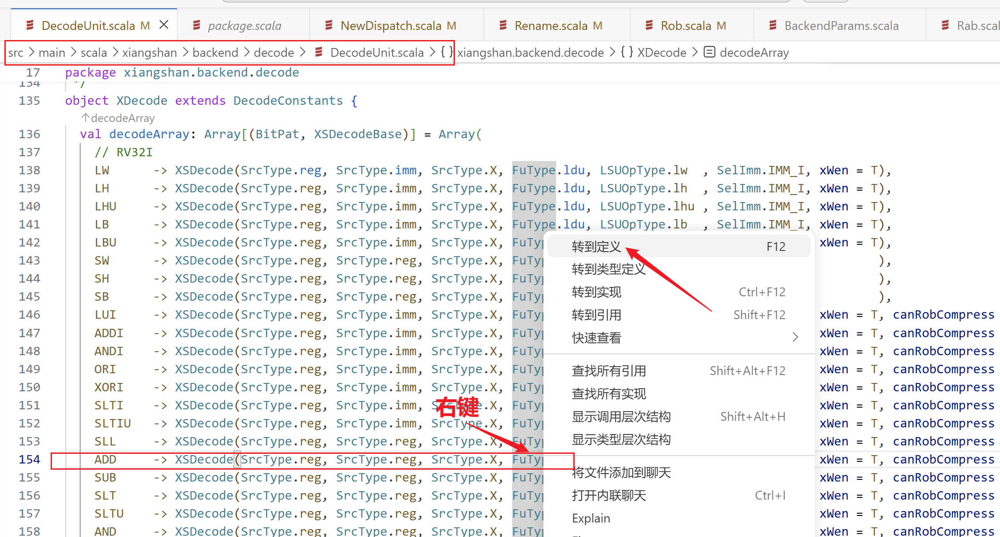

结果如下：


可以看出，这个值采用独热编码。`fuType`为 `0x40`，即二进制 `8b0100_0000`，意味着下标为 6 的位置是 `1b1`。

这是由以下语句生成的：<font style="color:#DF2A3F;">  </font>

```plain
val alu = addType(name = "alu")
```

因此，`fuType`为 `0x40`表示该指令将使用 ALU 功能单元。add 指令确实需要使用 ALU，译码行为正确。

紧接着，分析 `fuOpType`为 `0x21`的含义。可以推测，这个值指示了 ALU 执行的具体操作是加法。我们来验证一下：

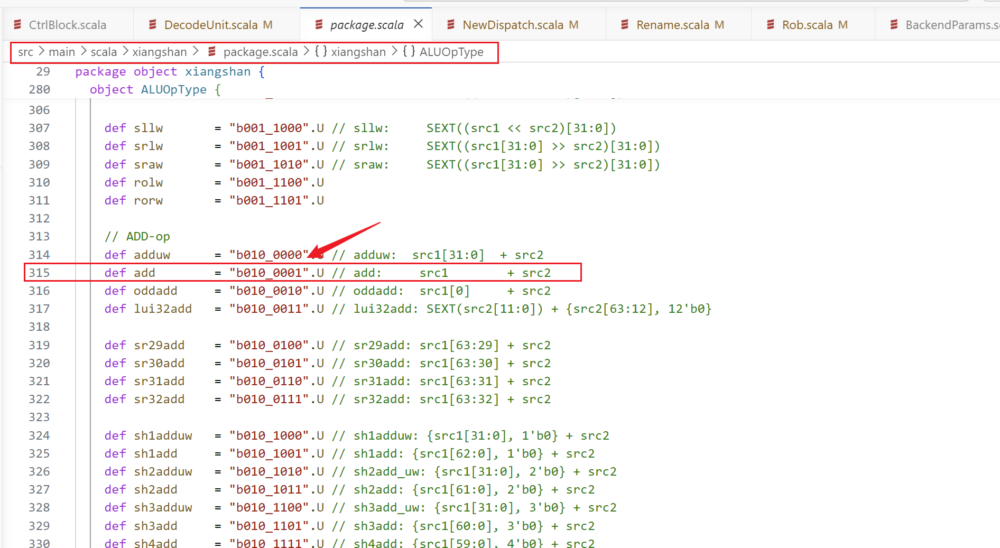

在定义 `fuOpType`的代码处，可以看到当值为 `0x21`时，其注释表明它代表普通的加法操作。

通过以上分析，相信你对输入 DecodeUnit 模块的信号以及该模块输出的信号，都有了较深入的理解，对于其他指令也能独立判断这些信号的意义了。


总结如下：

* `srcType = 0x1`，`lsrc_0 = 0x1e`表示第一个操作数来自 30 号寄存器。
* `srcType = 0x1`，`lsrc_1 = 0x06`表示第二个操作数来自 6 号寄存器。
* `fuType = 0x40`，`fuOpType = 0x21`表示这两个源操作数将在 ALU 中进行普通的加法运算。
* 运算结果会进行回写（`rfWen`为高），写入的寄存器位置是 2 号寄存器（`ldest = 0x2`）。

## （2）重命名模块（Rename）

至此，对译码模块的探索可以暂时告一段落。在学习初期，我们只需要了解香山架构是如何对简单指令进行译码的。即在下图中：


在紫色板块（DecodeStage）中，我们只需理解被红色方框框出的部分。因为其他部分主要服务于向量指令，而学习初期我们暂不关注此类复杂指令。因此，可以认为译码模块的探究已经完成，接下来应转向对重命名（Rename）阶段的探究。

在探究重命名的实现之前，强烈建议先熟悉其理论基础，这将帮助你更好地理解此处的架构设计。理论学习可参考《香山源代码剖析 第二册》P1011，或直接阅读下方图片：

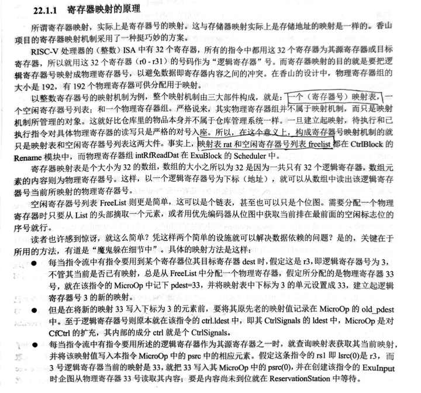


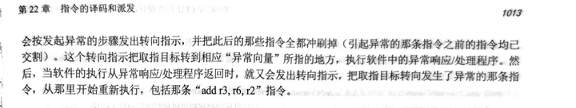

熟悉了上述理论知识后，接下来需要查看架构图：

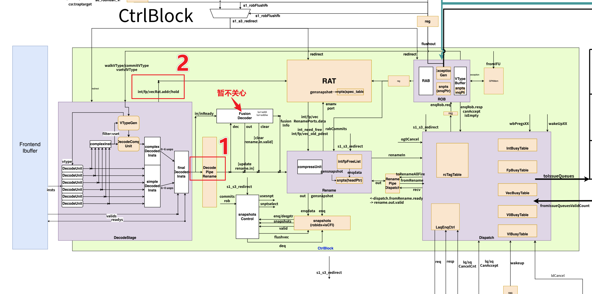

可以发现，在 DecodeStage 译码结束后，会大致将两类信号向外传递，即上图中标红的数字 1 和 2。接下来，我们将主要从这两类信号开始，分析指令进入后续流水级的具体行为。

在查看此架构图时，需要注意一个关键点：图中所有用橙色标示的区域，通常都可以认为内部包含寄存器。例如下图框出的这些部分：

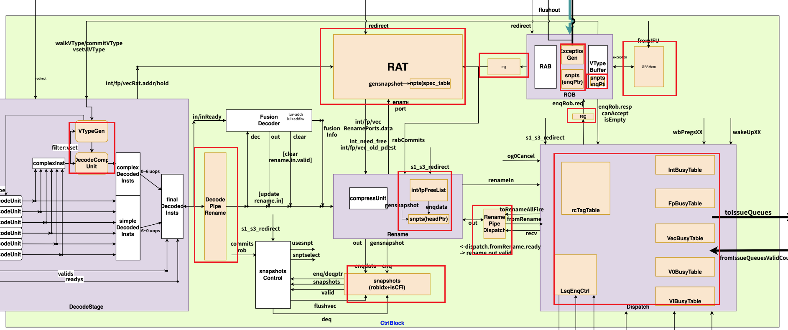

而其他部分通常只包含组合逻辑。

下面对这两组信号作简要说明：

1. **第1组信号**：传入名为 `DecodePipeRename`的模块。顾名思义，这是连接译码（Decode）模块和重命名（Rename）模块之间的流水级寄存器。这组信号负责将译码产生的信息传递到后续流水级。
2. **第2组信号**：这组信号**没有经过任何寄存器**，直接进入了 RAT（重命名地址表）中。因此，这组信号是利用逻辑源地址（`lsrc`）直接读取 RAT 表项的信号。具体作用将在后续结合波形进行解释。

### （2.1）译码信号如何进入下一流水级

首先观察第一组信号的波形，需要找到 `DecodePipeRename`这个模块。

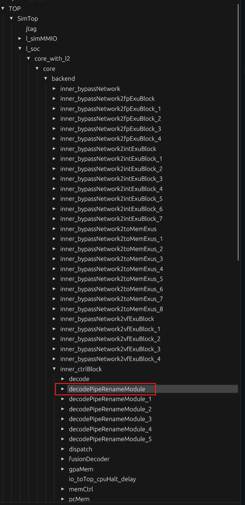

提取该模块的主要输出信号，并结合之前译码阶段的部分信号，以观察其行为：

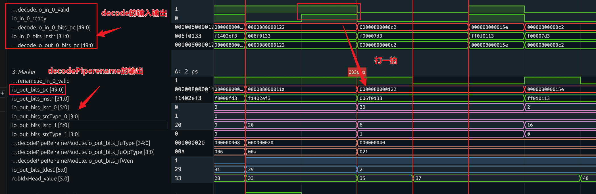

从 Decode 模块的输入和输出信号波形可以看出，其输入与输出之间是直接组合逻辑相连的，中间没有寄存器。Decode 模块的输出信号会直接传入 `DecodePipeRename`模块。

只有当 `valid`信号和 `ready`信号同时有效时，数据才能通过这个寄存器被锁存，并打入下一个流水级。这两个信号是非常关键的控制信号。例如，在图中所示的情况下：

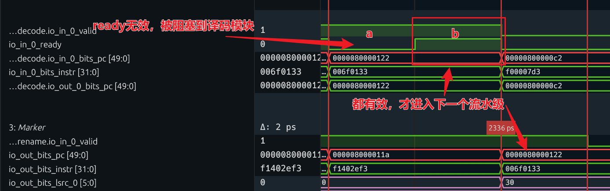

`valid`信号一直保持为高电平，这表明当前位于译码阶段的这条加法指令已准备好进入下一流水级。

在**周期a**，`ready`信号为低电平，表示后续流水线尚未准备好接收这条加法指令，因此它需要停留在译码阶段等待。

在**周期b**，检测到 `ready`信号变为高电平，表明后续流水级已准备就绪。因此，在下一个时钟周期，译码产生的所有信号被成功锁存到 `DecodePipeRename`模块的输出端，也就是进入了重命名（Rename）流水级。

当然，我们可以再检查一下这些进入重命名（Rename）阶段的必要信号是否正确：


| 波形信号名 | 位宽 | 核心含义 | 对应 Chisel 源码位置 | 补充说明 |
| --- | --- | --- | --- | --- |
| `decode.io_in_0_valid` | 1-bit | 译码模块第 0 路输入有效信号（表示有指令送入译码模块） | `src/main/scala/xiangshan/backend/decode/DecodeUnit.scala`<br/>→ `io.in(0).valid` | Chisel 中`DecoupledIO`<br/>的标准信号：`valid=1`<br/>表示输入指令有效 |
| `io_in_0_ready` | 1-bit | 译码模块第 0 路输入就绪信号（表示译码模块可接收新指令） | 同上 → `io.in(0).ready` | `valid & ready`<br/>表示指令成功送入译码模块（握手成功） |
| `decode.io_in_0_bits_pc[49:0]` | 50bit | 送入译码模块的指令 PC（程序计数器） | `src/main/scala/xiangshan/utils/bundles/CtrlFlow.scala`<br/>→ `CtrlFlow.pc`<br/>（译码模块输入`in.bits`<br/>为`CtrlFlow`<br/> Bundle） | 50 位对应香山物理地址位宽（`PAddrBits=50`<br/>），记录指令内存地址 |
| `io_in_0_bits_instr[31:0]` | 32bit | 送入译码模块的原始 32 位 RISC-V 指令机器码 | 同上 → `CtrlFlow.instr` | 未译码的二进制指令，如波形中`006f0133`<br/>是 ADD 指令机器码 |
| `decode.io_out_0_bits_pc[49:0]` | 50bit | 译码模块输出的指令 PC（与输入 PC 一致） | `src/main/scala/xiangshan/backend/decode/DecodeBundle.scala`<br/>→ `DecodedInst.pc` | 译码后保留 PC，用于后续异常处理、流水线追踪 |
| `rename.io_in_0_valid` | 1bit | 重命名模块第 0 路输入有效信号（表示译码后的指令送入重命名模块） | `src/main/scala/xiangshan/backend/rename/RenameUnit.scala`<br/>→ `io.in(0).valid` | 译码→重命名阶段的握手有效信号 |
| `io_out_bits_pc[49:0]` | 50bit | 重命名模块输出的指令 PC | 同上 → `io.out(0).bits.pc` | 重命名阶段不修改 PC，仅透传 |
| `io_out_bits_instr[31:0]` | 32bit | 重命名模块输出的原始指令机器码 | 同上 → `io.out(0).bits.instr` | 重命名阶段保留原始指令，用于调试 / 校验 |
| `io_out_bits_lsrc_0[5:0]` | 6bit | 第 0 个源操作数的**逻辑寄存器号** | `DecodeBundle.scala`<br/> → `DecodedInst.lsrc(0)` | 波形中值为`30`<br/>（十进制），对应 RISC-V 寄存器`x30` |
| `io_out_bits_srcType_0[3:0]` | 4bit | 第 0 个源操作数的**类型标识** | `DecodeBundle.scala`<br/> → `DecodedInst.srcType(0)` | 波形中值为`1`<br/>，表示该操作数是**通用寄存器类型**（其他值：0 = 立即数、2=PC 等） |
| `io_out_bits_lsrc_1[5:0]` | 6bit | 第 1 个源操作数的逻辑寄存器号 | `DecodeBundle.scala`<br/> → `DecodedInst.lsrc(1)` | 波形中值为`6`<br/>，对应寄存器`x6` |
| `io_out_bits_srcType_1[3:0]` | 4bit | 第 1 个源操作数的类型标识 | `DecodeBundle.scala`<br/> → `DecodedInst.srcType(1)` | 波形中值为`1`<br/>，同样表示通用寄存器类型 |
| `decodePipeRenameModule.io_out_bits_fuType[34:0]` | 35bit | 指令所属的**功能单元（FU）类型** | `src/main/scala/xiangshan/backend/decoder/InstEnum.scala`<br/>→ `FUType`<br/>枚举 | 波形中值为`000000040`<br/>（十六进制），对应`ALU`<br/>功能单元（整数运算） |
| `decodePipeRenameModule.io_out_bits_fuOpType[8:0]` | 9bit | 功能单元内的**具体操作类型** | 同上 → `FUOpType`<br/>枚举 | 波形中值为`021`<br/>（十六进制），对应 ALU 的`ADD`<br/>操作（加法） |
| `decodePipeRenameModule.io_out_bits_rfWen` | 1bit | 寄存器堆写使能信号 | `DecodeBundle.scala`<br/> → `DecodedInst.rfWen` | 波形中值为`1`<br/>，表示该指令执行后需要写回目标寄存器 |
| `io_out_bits_ldest[5:0]` | 6bit | 目标操作数的逻辑寄存器号 | `DecodeBundle.scala`<br/> → `DecodedInst.ldest` | 波形中值为`2`<br/>，对应寄存器`x2`<br/>（栈指针 sp） |

这些都是我们从译码模块的输出中已熟悉的信号，这里不再赘述。经核对，这些信号均是准确的。

### （2.2）RAT表的读取操作

在前面我们还提到，存在第2组信号，用于读取RAT表。接下来我们继续分析这组信号：

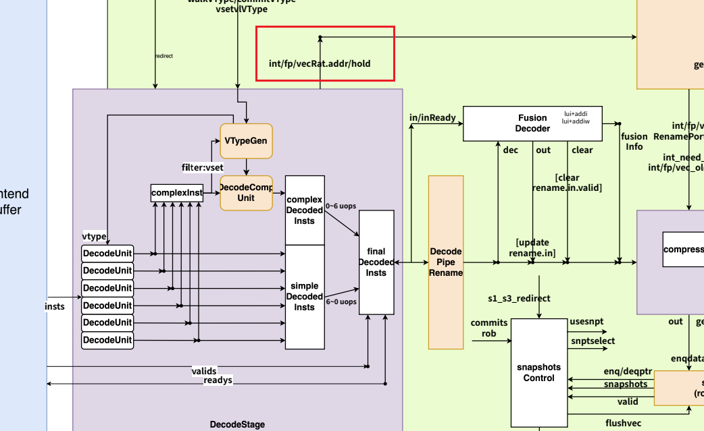

很明显，这组信号在译码阶段就直接传入了RAT表，中间没有经过任何寄存器。


那么，我们直接查看 RAT 表的输入。在熟悉重命名理论知识的前提下，我们知道此处的读取操作必然以两个逻辑源寄存器地址（`lsrc`）作为索引，即：

* 对应 `srcType = 0x1, lsrc_0 = 0x1e`表示第一个操作数来自 30 号寄存器。
* 对应 `srcType = 0x1, lsrc_1 = 0x06`表示第二个操作数来自 6 号寄存器。

系统会以 `30`和 `6` 这两个数值进行读取。找到对应的波形图：

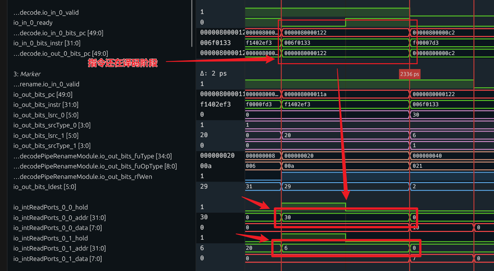

无论是从架构图推断，还是通过波形图确认，我们都能看出RAT在指令仍处于译码阶段时，就已经接收到了两个需要读取的地址，即上图中红框标记的30和6。这个行为是正确的。

另外，可以观察到`hold`信号与`valid`和`ready`信号紧密关联。只有当这两个信号允许时，才“不hold”，即不进行保持，允许执行读取操作。

那么，读取出的内容是在当前周期就得到，还是需要延迟几个周期呢？换句话说，上图中`io_intReadPorts_*_data`信号在哪个时刻对应的是地址30和6的数据？要确认这一点，需要从代码中找到答案。

这里就是读端口在代码中所处的位置：


在代码中，我们可以看到这样的一些代码片段，它们清楚地说明了这组信号之间的时序关系。


上图代码提供了以下关键信息：

`readPorts`信号进入 RAT 后，在满足条件时（`!hold`）会经过一拍寄存，变成 `t1_raddr`信号。随后，在同一周期内，即可通过 `spec_table(_)`读出对应的数据，存入 `t1_rdata_use_t1_raddr`信号，这就是需要读取的原始数据。

之后，`t1_rdata_use_t1_raddr`会经过下方一系列的“旁路（bypass）处理”，最终成为最终输出的读数据 `r.data`。

至于“旁路的一堆处理”具体指什么，这需要后续进行探究。但通过阅读此处的代码，我们至少可以明确：**读取的数据将会在下一个时钟周期产生**。

虽然读取地址会在指令处于译码周期时就被送入 RAT 表，但实际读取到的数据要到下一个周期才会产生。与此同时，`DecodePipeRename`也会在下一个周期将译码完成的数据锁存并送入下一流水级。因此，我们可以认为，**实际读取到的数据将与指令相关的译码数据一同进入 Rename 模块**。

接下来，我们再查看波形进行验证：


| 波形信号名 | 位宽 | 核心功能 | 对应 Chisel 源码位置 | 波形补充说明 |
| --- | --- | --- | --- | --- |
| `...rename.io_in_0_valid` | 1bit | 重命名模块第 0 路输入的握手有效信号，`=1`<br/>表示译码后的指令有效，可送入重命名模块处理 | `src/main/scala/xiangshan/backend/rename/RenameUnit.scala`<br/>对应 `io.in(0).valid`<br/>（DecoupledIO 标准握手信号） | 波形中持续为高，说明流水线持续有有效指令输入 |
| `io_out_bits_pc[49:0]` | 50bit | 重命名模块输出的指令 PC（程序计数器），与取指、译码阶段的 PC 完全透传，用于异常处理、指令流追踪、分支预测校验 | 1. 字段定义：`src/main/scala/xiangshan/backend/decode/DecodeBundle.scala`<br/> → `DecodedInst.pc`<br/>2. 模块透传：`RenameUnit.scala`<br/> → `io.out(0).bits.pc` | 2336ps 时值为`0000080000122`<br/>，是 RISC-V 处理器标准启动地址空间的指令 |
| `io_out_bits_instr[31:0]` | 32bit | 重命名模块输出的原始 32 位 RISC-V 指令机器码，重命名阶段不修改，保留用于调试、异常回溯、指令合法性校验 | 1. 字段定义：`DecodeBundle.scala`<br/> → `DecodedInst.instr`<br/>2. 模块透传：`RenameUnit.scala`<br/> → `io.out(0).bits.instr` | 2336ps 时值为`006f0133`<br/>，对应 RISC-V 的`add`<br/>整数加法指令 |
| `io_out_bits_lsrc_0[5:0]` | 6bit | 指令第 0 个源操作数的**逻辑寄存器号**（架构寄存器号），对应 RISC-V 指令的`rs1`<br/>字段 | 1. 字段定义：`DecodeBundle.scala`<br/> → `DecodedInst.lsrc(0)`<br/>2. 模块透传：`RenameUnit.scala`<br/> 中直接透传该字段 | 2336ps 时值为`30`<br/>（十进制），对应 RISC-V 通用寄存器`x30` |
| `io_out_bits_srcType_0[3:0]` | 4bit | 指令第 0 个源操作数的**类型标识**，用于区分操作数是通用寄存器、立即数、PC 值等类型 | 1. 枚举定义：`src/main/scala/xiangshan/backend/decoder/InstType.scala`<br/> → `SrcType`<br/>2. 字段定义：`DecodeBundle.scala`<br/> → `DecodedInst.srcType(0)` | 2336ps 时值为`1`<br/>，对应「通用寄存器类型」 |
| `io_out_bits_lsrc_1[5:0]` | 6bit | 指令第 1 个源操作数的**逻辑寄存器号**，对应 RISC-V 指令的`rs2`<br/>字段 | 1. 字段定义：`DecodeBundle.scala`<br/> → `DecodedInst.lsrc(1)`<br/>2. 模块透传：`RenameUnit.scala`<br/> 中直接透传该字段 | 2336ps 时值为`6`<br/>（十进制），对应 RISC-V 通用寄存器`x6` |
| `io_out_bits_srcType_1[3:0]` | 4bit | 指令第 1 个源操作数的**类型标识**，定义与`srcType_0`<br/>完全一致 | 1. 枚举定义：`InstType.scala`<br/> → `SrcType`<br/>2. 字段定义：`DecodeBundle.scala`<br/> → `DecodedInst.srcType(1)` | 2336ps 时值为`1`<br/>，对应「通用寄存器类型」 |
| `...decodePipeRenameModule.io_out_bits_fuType[34:0]` | 35bit | 指令所属的**功能单元（FU）类型**，决定该指令要分发到哪个执行单元（ALU / 乘除法 / 访存 / 分支等） | 1. 枚举定义：`src/main/scala/xiangshan/backend/decoder/InstEnum.scala`<br/> → `FUType`<br/>2. 字段定义：`DecodeBundle.scala`<br/> → `DecodedInst.fuType` | 2336ps 时值为`000000040`<br/>（十六进制），对应「ALU 整数运算单元」 |
| `...decodePipeRenameModule.io_out_bits_fuOpType[8:0]` | 9bit | 功能单元内的**具体操作类型**，在`fuType`<br/>基础上，指定执行单元要完成的具体运算 | 1. 枚举定义：`InstEnum.scala`<br/> → `FUOpType`<br/>2. 字段定义：`DecodeBundle.scala`<br/> → `DecodedInst.fuOpType` | 2336ps 时值为`021`<br/>（十六进制），对应 ALU 的「ADD 加法操作」 |
| `...decodePipeRenameModule.io_out_bits_rfWen` | 1bit | 寄存器堆写使能信号，`=1`<br/>表示该指令执行完成后，需要将结果写回目标寄存器 | 字段定义：`DecodeBundle.scala`<br/> → `DecodedInst.rfWen` | 波形中持续为高，说明该指令需要写回寄存器 |
| `io_out_bits_ldest[5:0]` | 6bit | 指令目标操作数的**逻辑寄存器号**，对应 RISC-V 指令的`rd`<br/>字段 | 字段定义：`DecodeBundle.scala`<br/> → `DecodedInst.ldest` | 2336ps 时值为`2`<br/>（十进制），对应 RISC-V 通用寄存器`x2`<br/>（栈指针 sp） |

由此可以确认，以 30 和 6 作为地址传入 RAT 表进行读取，数据会在下一个时钟周期读出，其值分别为 10 和 7。

现在我们可以明确：

* `lsrc_0 = 0x1e`表示第一个操作数来自**逻辑 30 号寄存器**，它之前被映射到了**物理寄存器 10**。
* `lsrc_1 = 0x06`表示第二个操作数来自**逻辑 6 号寄存器**，它之前被映射到了**物理寄存器 7**。

理解了吗？现在，我们可以进一步核对 `spec_table`中第 30 号和第 6 号位置的数据是否确实为 10 和 7：

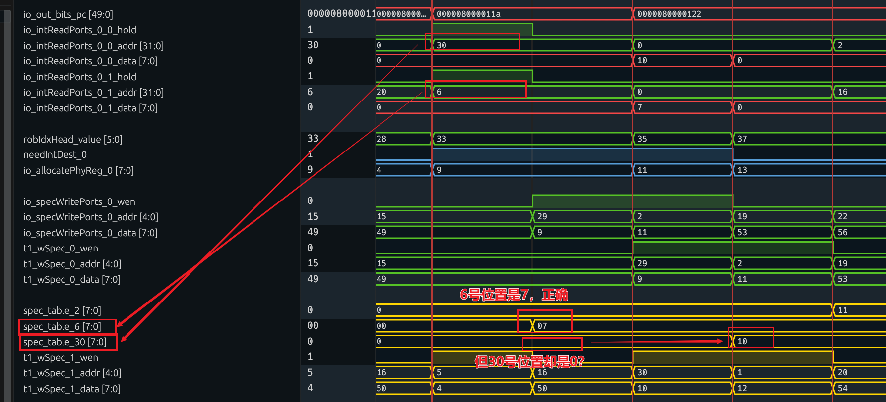

| 波形信号名 | 位宽 | 核心功能 | 对应 Chisel 源码位置 | 波形补充说明 |
| --- | --- | --- | --- | --- |
| `...rename.io_in_0_valid` | 1bit | 重命名模块第 0 路输入的握手有效信号，`=1`<br/>表示译码后的指令有效，可送入重命名模块处理 | `src/main/scala/xiangshan/backend/rename/RenameUnit.scala`<br/>对应 `io.in(0).valid`<br/>（DecoupledIO 标准握手信号） | 波形中持续为高，说明流水线持续有有效指令输入 |
| `io_out_bits_pc[49:0]` | 50bit | 重命名模块输出的指令 PC（程序计数器），与取指、译码阶段的 PC 完全透传，用于异常处理、指令流追踪、分支预测校验 | 1. 字段定义：`src/main/scala/xiangshan/backend/decode/DecodeBundle.scala`<br/> → `DecodedInst.pc`<br/>2. 模块透传：`RenameUnit.scala`<br/> → `io.out(0).bits.pc` | 2336ps 时值为`0000080000122`<br/>，是 RISC-V 处理器标准启动地址空间的指令 |
| `io_out_bits_instr[31:0]` | 32bit | 重命名模块输出的原始 32 位 RISC-V 指令机器码，重命名阶段不修改，保留用于调试、异常回溯、指令合法性校验 | 1. 字段定义：`DecodeBundle.scala`<br/> → `DecodedInst.instr`<br/>2. 模块透传：`RenameUnit.scala`<br/> → `io.out(0).bits.instr` | 2336ps 时值为`006f0133`<br/>，对应 RISC-V 的`add`<br/>整数加法指令 |
| `io_out_bits_lsrc_0[5:0]` | 6bit | 指令第 0 个源操作数的**逻辑寄存器号**（架构寄存器号），对应 RISC-V 指令的`rs1`<br/>字段 | 1. 字段定义：`DecodeBundle.scala`<br/> → `DecodedInst.lsrc(0)`<br/>2. 模块透传：`RenameUnit.scala`<br/> 中直接透传该字段 | 2336ps 时值为`30`<br/>（十进制），对应 RISC-V 通用寄存器`x30` |
| `io_out_bits_srcType_0[3:0]` | 4bit | 指令第 0 个源操作数的**类型标识**，用于区分操作数是通用寄存器、立即数、PC 值等类型 | 1. 枚举定义：`src/main/scala/xiangshan/backend/decoder/InstType.scala`<br/> → `SrcType`<br/>2. 字段定义：`DecodeBundle.scala`<br/> → `DecodedInst.srcType(0)` | 2336ps 时值为`1`<br/>，对应「通用寄存器类型」 |
| `io_out_bits_lsrc_1[5:0]` | 6bit | 指令第 1 个源操作数的**逻辑寄存器号**，对应 RISC-V 指令的`rs2`<br/>字段 | 1. 字段定义：`DecodeBundle.scala`<br/> → `DecodedInst.lsrc(1)`<br/>2. 模块透传：`RenameUnit.scala`<br/> 中直接透传该字段 | 2336ps 时值为`6`<br/>（十进制），对应 RISC-V 通用寄存器`x6` |
| `io_out_bits_srcType_1[3:0]` | 4bit | 指令第 1 个源操作数的**类型标识**，定义与`srcType_0`<br/>完全一致 | 1. 枚举定义：`InstType.scala`<br/> → `SrcType`<br/>2. 字段定义：`DecodeBundle.scala`<br/> → `DecodedInst.srcType(1)` | 2336ps 时值为`1`<br/>，对应「通用寄存器类型」 |
| `...decodePipeRenameModule.io_out_bits_fuType[34:0]` | 35bit | 指令所属的**功能单元（FU）类型**，决定该指令要分发到哪个执行单元（ALU / 乘除法 / 访存 / 分支等） | 1. 枚举定义：`src/main/scala/xiangshan/backend/decoder/InstEnum.scala`<br/> → `FUType`<br/>2. 字段定义：`DecodeBundle.scala`<br/> → `DecodedInst.fuType` | 2336ps 时值为`000000040`<br/>（十六进制），对应「ALU 整数运算单元」 |
| `...decodePipeRenameModule.io_out_bits_fuOpType[8:0]` | 9bit | 功能单元内的**具体操作类型**，在`fuType`<br/>基础上，指定执行单元要完成的具体运算 | 1. 枚举定义：`InstEnum.scala`<br/> → `FUOpType`<br/>2. 字段定义：`DecodeBundle.scala`<br/> → `DecodedInst.fuOpType` | 2336ps 时值为`021`<br/>（十六进制），对应 ALU 的「ADD 加法操作」 |
| `...decodePipeRenameModule.io_out_bits_rfWen` | 1bit | 寄存器堆写使能信号，`=1`<br/>表示该指令执行完成后，需要将结果写回目标寄存器 | 字段定义：`DecodeBundle.scala`<br/> → `DecodedInst.rfWen` | 波形中持续为高，说明该指令需要写回寄存器 |
| `io_out_bits_ldest[5:0]` | 6bit | 指令目标操作数的**逻辑寄存器号**，对应 RISC-V 指令的`rd`<br/>字段 | 字段定义：`DecodeBundle.scala`<br/> → `DecodedInst.ldest` | 2336ps 时值为`2`<br/>（十进制），对应 RISC-V 通用寄存器`x2`<br/>（栈指针 sp） |

寄存器堆读端口信号

| 波形信号名 | 位宽 | 核心功能 | 对应 Chisel 源码位置 | 波形补充说明 |
| --- | --- | --- | --- | --- |
| `io_intReadPorts_0_0_hold` | 1bit | 整数寄存器堆第 0 路读端口的保持信号，`=1`<br/>时会锁存当前读端口的地址和数据，避免流水线气泡导致的读数据丢失 | `src/main/scala/xiangshan/backend/regfile/IntRegFile.scala`<br/>对应 `io.readPorts(0).hold` | 波形中持续为高，说明读端口持续保持有效输出 |
| `io_intReadPorts_0_0_addr[31:0]` | 32bit（实际有效位 6bit） | 整数寄存器堆第 0 路读端口的地址，即要读取的寄存器号 | `IntRegFile.scala`<br/> → `io.readPorts(0).addr` | 2336ps 前地址为`30`<br/>，对应前面指令的`lsrc_0=30`<br/>，要读取`x30`<br/>寄存器 |
| `io_intReadPorts_0_0_data[7:0]` | 8bit（波形仅展示低 8 位，实际为 64bit RV64 位宽） | 整数寄存器堆第 0 路读端口读出的寄存器数据 | `IntRegFile.scala`<br/> → `io.readPorts(0).data` | 对应地址`30`<br/>时，读出数据为`10`<br/>（十六进制），即`x30`<br/>寄存器的值为`0x10` |
| `io_intReadPorts_0_1_hold` | 1bit | 整数寄存器堆第 1 路读端口的保持信号，功能与第 0 路完全一致 | `IntRegFile.scala`<br/> → `io.readPorts(1).hold` | 波形中持续为高，与第 0 路同步保持 |
| `io_intReadPorts_0_1_addr[31:0]` | 32bit（实际有效位 6bit） | 整数寄存器堆第 1 路读端口的地址，即要读取的寄存器号 | `IntRegFile.scala`<br/> → `io.readPorts(1).addr` | 2336ps 前地址为`6`<br/>，对应前面指令的`lsrc_1=6`<br/>，要读取`x6`<br/>寄存器 |
| `io_intReadPorts_0_1_data[7:0]` | 8bit（波形仅展示低 8 位，实际为 64bit） | 整数寄存器堆第 1 路读端口读出的寄存器数据 | `IntRegFile.scala`<br/> → `io.readPorts(1).data` | 对应地址`6`<br/>时，读出数据为`7`<br/>（十六进制），即`x6`<br/>寄存器的值为`0x7` |

此时我们会观察到，`spec_table_6`的值确实是 7，读取出来的也是 7，行为正确。但查看 `spec_table_30`时就会发现问题：读取这个位置时的值不是 0 吗，为什么读出来是 10？

发现问题了吧。这时候你应该能猜到，原因就在于前面提到过的：

> `t1_rdata_use_t1_raddr`会经过下方一系列的“旁路（bypass）处理”，最终成为最终输出的读数据 `r.data`，

没错，正是 `bypass`中的处理导致了这一结果。我们再来仔细阅读 `bypass`部分的代码：


发现了吗？之所以需要这些处理，是因为**读取操作和写入操作可能同时发生**。为了保证逻辑上的正确性，必须设置这样的旁路路径来检测：当前正在写入的值，是否恰好是本次读取所期望的值。如果是，**那么这个尚未真正写入的值，才是我们真正想要读取的正确数据**。

下图清晰地展示了这条旁路路径以及读数据的时序关系。请你结合代码来理解，一定能彻底弄清楚。实际上，下图已经把写数据的时序逻辑也清楚地标明了。写信号在进入重命名（Rename）阶段后，还会再打一拍，变成 `t1_wspec`信号，之后才能真正访问到 `spec_table`。明确这一点，将有助于我们后续的理解。

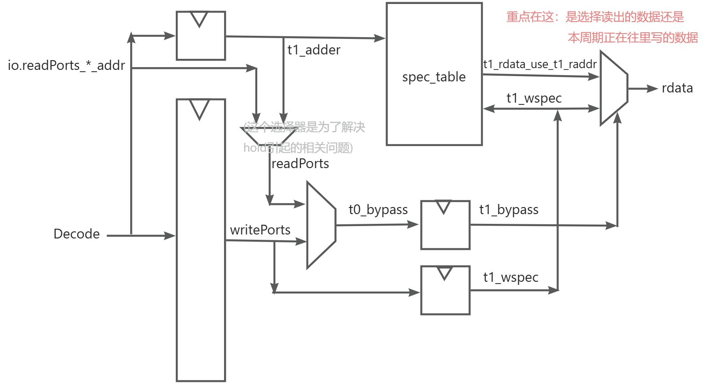

清楚了读时序逻辑、旁路机制以及写操作的时序逻辑后，再来看波形就非常简单了。回顾一下前面尚未解决的问题：

> 查看 `spec_table_30`时就会发现问题：读取这个位置时的值不是 0 吗，为什么读出来是 10？


可以清楚地发现，当我们的加法指令进入重命名阶段后，在同一个周期内，`t1_wSpec`信号正在对 SpecTable\_30 表进行写入操作，写入的值恰好是 10。

因此，我们应该直接采用这里正要写入的 10 作为正确数据，而不是表中当前存储的旧值 0。

通过以上探究，我们可以总结如下：

我们已经确认以下信息：

* `lsrc_0 = 0x1e`表示第一个操作数来自**逻辑 30 号寄存器**，此时它被映射到了**物理寄存器 10**。
* `lsrc_1 = 0x06`表示第二个操作数来自**逻辑 6 号寄存器**，此时它被映射到了**物理寄存器 7**。

也就是说：

* 源操作数0 来自逻辑寄存器 30 号，我们需要在**物理寄存器 10 号**中获取其数据。
* 源操作数1 来自逻辑寄存器 6 号，我们需要在**物理寄存器 7 号**中获取其数据。

此外，我们还理清了其中简单的旁路路径，以及读写操作的时序逻辑。

### （2.3）RAT表的写操作

对于这条加法指令，根据前面的译码信号，我们已知以下信息：

> 运算结果会进行回写（`rfWen`为高），写入的寄存器位置是 2 号寄存器（`ldest = 0x2`）

这条指令肯定要对寄存器进行回写。因此，在重命名阶段，我们需要完成两件重要的事情：

1. **从 Freelist 获取一个空闲的物理寄存器**，指示这条指令的回写结果应该存入哪个物理寄存器。
2. **更新 RAT 表**。由于我们刚刚获得了一个物理寄存器，意味着这条指令将要回写的**逻辑寄存器 2 号**，从此刻起被映射到这个新分配的物理寄存器上。因此，需要将这一映射关系写入 RAT 表，告知后续的指令：逻辑寄存器 2 号现在映射到了一个新的物理寄存器。

首先，来看第一个任务的行为。我们直接推测，指令在有效（`valid`）且需要回写（`rfWen`）时，才会触发 Freelist 分配物理寄存器。在代码中，`needIntDest`信号用于指示是否需要分配物理寄存器。我们直接查看它的实现方式：


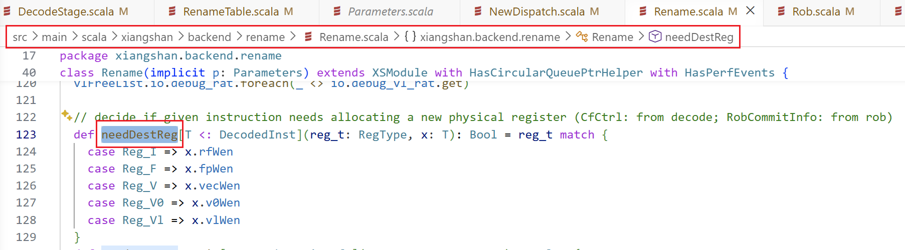

这完美印证了我们的猜想：当 `valid`信号和 `rfWen`信号均为高电平时，请求新物理寄存器的信号（`needIntDest`）就会被拉高。

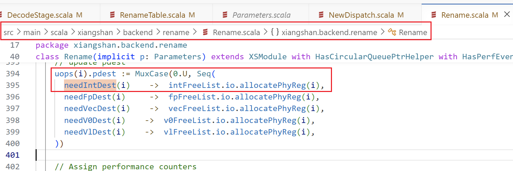

之后，Freelist 模块会根据这个请求信号，返回一个“当前空闲的”物理寄存器。

获得这个物理寄存器后，接下来应该就是执行写入 RAT 表的操作了。

我们接着看波形：


重命名控制和分配信号

| 信号名 | 位宽 | 核心功能 | 对应 Chisel 源码位置 | 波形关键说明 |
| --- | --- | --- | --- | --- |
| `io_out_bits_pc[49:0]` | 50bit | 重命名模块输出的指令 PC，与取指、译码阶段的 PC 完全透传，用于指令流追踪、异常回溯，是跟踪单条指令全生命周期的核心标识 | 1. 字段定义：`src/main/scala/xiangshan/backend/decode/DecodeBundle.scala`<br/> → `DecodedInst.pc`<br/>2. 模块透传：`src/main/scala/xiangshan/backend/rename/RenameUnit.scala`<br/> → `io.out.bits.pc` | 红框周期值为`0000080000122`<br/>，与之前译码波形的 ADD 指令 PC 一致，是同一条指令的重命名阶段 |
| `needIntDest_0` | 1bit | 第 0 路指令的整数目标寄存器需求标记：`=1`<br/>表示该指令有整数目标寄存器，需要从空闲列表分配物理寄存器；`=0`<br/>表示无需分配 | 1. 字段定义：`DecodeBundle.scala`<br/> → `DecodedInst.needIntDest`<br/>2. 控制逻辑：`RenameUnit.scala`<br/> 中用于触发 FreeList 分配 | 该信号为前级译码输出，提前 1 个周期触发物理寄存器分配，是重命名的前置控制信号 |
| `io_allocatePhyReg_0[7:0]` | 8bit | 重命名模块为第 0 路指令**从 FreeList 空闲列表分配的整数物理寄存器号**，是寄存器重命名的核心输出，用于后续重命名表更新、忙表标记 | 1. 分配逻辑：`src/main/scala/xiangshan/backend/rename/FreeList.scala`<br/>2. 端口定义：`RenameUnit.scala`<br/> → `io.allocatePhyReg(0)` | 红框周期值为`11`<br/>（十进制），即为这条 ADD 指令的目标逻辑寄存器`x2`<br/>分配的物理寄存器号 |
| `robIdxHead_value[5:0]` | 6bit | ROB（重排序缓冲）的**分配头指针**，即新指令分配到的 ROB 表项索引，严格按程序原始顺序递增，是乱序流水线中指令「程序顺序」的唯一标识 | `src/main/scala/xiangshan/backend/rob/Rob.scala`<br/> → ROB 模块的`allocPtr`<br/>/`io.head` | 红框周期值为`35`<br/>，即这条指令被分配到 ROB 的第 35 号表项，后续将按 ROB 索引顺序提交 |

RAT 写端口信号

| 信号名 | 位宽 | 核心功能 | 对应 Chisel 源码位置 | 波形关键说明 |
| --- | --- | --- | --- | --- |
| `io_specWritePorts_0_wen` | 1bit | 推测重命名表（Speculative Rename Map）**写端口 0 的写使能**，`=1`<br/>表示当前周期要更新重命名表，写入新的「逻辑→物理寄存器」映射关系 | 1. 端口定义：`src/main/scala/xiangshan/backend/rename/RenameMap.scala`<br/> → `SpecRenameMap`<br/>的`io.write`<br/>端口2. 控制逻辑：`RenameUnit.scala`<br/> 中重命名表写控制 | 红框周期值为`1`<br/>，表示当前周期发起重命名表写入请求 |
| `io_specWritePorts_0_addr[4:0]` | 5bit | 重命名表写端口 0 的**写入地址**，即要更新的**逻辑寄存器号（架构寄存器号）**，对应指令的`rd`<br/>目标寄存器字段 | 同上，`RenameMap.scala`<br/> 写端口的`addr`<br/>字段 | 红框周期值为`2`<br/>，对应要更新的逻辑寄存器`x2`<br/>，与之前译码波形的`ldest=2`<br/>完全匹配 |
| `io_specWritePorts_0_data[7:0]` | 8bit | 重命名表写端口 0 的**写入数据**，即逻辑寄存器新映射的**物理寄存器号**，与`io_allocatePhyReg_0`<br/>的值完全一致 | 同上，`RenameMap.scala`<br/> 写端口的`data`<br/>字段 | 红框周期值为`11`<br/>，即要把`x2`<br/>的映射关系更新为物理寄存器`11` |
| `t1_wSpec_0_wen` | 1bit | 重命名表写操作的**打拍后写使能**，与`io_specWritePorts_0_wen`<br/>是同一写操作的流水线打拍信号，用于同步寄存器写入时序 | `RenameMap.scala`<br/> 内部写逻辑的打拍寄存器 | 红框周期值为`1`<br/>，与前级写使能同步，触发最终的寄存器写入 |
| `t1_wSpec_0_addr[4:0]` | 5bit | 打拍后的重命名表写地址，与`io_specWritePorts_0_addr`<br/>的值完全一致，用于时序同步 | 同上 | 红框周期值为`2`<br/>，对应逻辑寄存器`x2` |
| `t1_wSpec_0_data[7:0]` | 8bit | 打拍后的重命名表写数据，与`io_specWritePorts_0_data`<br/>的值完全一致，用于时序同步 | 同上 | 红框周期值为`11`<br/>，对应新的物理寄存器号 |

RAT 存储和 多发射辅助信号

| 信号名 | 位宽 | 核心功能 | 对应 Chisel 源码位置 | 波形关键说明 |
| --- | --- | --- | --- | --- |
| `spec_table_2[7:0]` | 8bit | 推测重命名表中**逻辑寄存器 x2 对应的表项**，存储当前`x2`<br/>映射的物理寄存器号，是重命名映射关系的实际存储单元 | `RenameMap.scala`<br/> 内部的寄存器数组 `spec_table` | 写入操作完成后，值更新为`11`<br/>，标注 “成功写入”，表示`x2→11`<br/>的重命名映射已生效 |
| `spec_table_6[7:0]` | 8bit | 推测重命名表中逻辑寄存器 x6 对应的表项，存储 x6 当前映射的物理寄存器号 | 同上 | 波形中值为`07`<br/>，表示 x6 当前映射到物理寄存器 7，与之前读寄存器波形的源操作数匹配 |
| `spec_table_30[7:0]` | 8bit | 推测重命名表中逻辑寄存器 x30 对应的表项，存储 x30 当前映射的物理寄存器号 | 同上 | 波形中值为`10`<br/>，表示 x30 当前映射到物理寄存器 10，与之前读寄存器波形的源操作数匹配 |
| `t1_wSpec_1_wen`<br/>/`addr`<br/>/`data` | 1bit/5bit/8bit | 重命名表写端口 1 的打拍后写信号，对应第 1 路指令的重命名表更新，功能与写端口 0 完全一致 | 同上 | 波形中值为`1`<br/>/`30`<br/>/`10`<br/>，表示同一周期第 1 路指令同步完成`x30→10`<br/>的重命名映射写入，体现香山的多发射特性 |

从波形可以看出，在指令进入重命名阶段后，`needIntDest_0`信号被拉高。同时，它立即收到了一个名为 `allocatePhyReg_0`的信号，其值为 11。这表明 **Freelist 为这条加法指令分配了第 11 号物理寄存器，指令执行结果最终将被写入 11 号物理寄存器**。

既然产生了新的映射关系，此时就理应对 RAT 表进行一次写操作。我们可以直接推测：**这将向 RAT 表中地址为 2 的表项写入值 11**，目的是告知后续的指令，如果它们需要逻辑 2 号寄存器的值，就应该去 11 号物理寄存器中读取。这类似于本指令之前读取 RAT 表的操作。

我们继续看上图的波形。可以观察到，在本周期内，该指令确实如预期那样，为与 `io_specWritePorts_0_*`相关的写使能、地址和数据信号设置了正确的激励。结合前面绘制的时序图可以确认，这些数据会被打一拍，变成 `t1_wSpec_0_*`信号，然后在下一个时钟周期成功写入 `spec_table`表中。波形的行为与此完全一致。

经过本节内容的学习，你应该明确了以下几点：

* 运算结果会进行回写（`rfWen`为高），写入的**逻辑寄存器**位置是 2 号寄存器（`ldest = 0x2`）。
* 进入 Rename 阶段后，Freelist 为其分配了**第 11 号物理寄存器**，因此指令结果将写入 11 号物理寄存器。
* 除此之外，指令还执行了更新 RAT 表的操作，**向 RAT 表中地址为 2 的表项写入了值 11**。

### （2.4）分配Rob表项

为指令分配 ROB 表项的操作，同样在重命名阶段进行。查看波形：


重命名模块输出和资源分配信号

| 信号名 | 位宽 | 核心功能 | 对应 Chisel 源码位置 | 波形关键说明 |
| --- | --- | --- | --- | --- |
| `io_out_bits_pc[49:0]` | 50bit | 重命名模块输出的指令 PC 值，与译码阶段的输入 PC 完全透传，用于在重命名、发射、执行、提交全阶段追踪同一条指令 | 1. 字段定义：`src/main/scala/xiangshan/backend/decode/DecodeBundle.scala`<br/> → `DecodedInst.pc`<br/>2. 模块端口：`src/main/scala/xiangshan/backend/rename/RenameUnit.scala`<br/> → `io.out.bits.pc` | 波形中与译码阶段的`0x0000080000122`<br/>完全对齐，确认是同一条指令的重命名阶段处理 |
| `needIntDest_0` | 1bit | 重命名模块第 0 路指令的整数目标寄存器需求标记：`=1`<br/>表示该指令有有效的整数目标寄存器，需要从空闲物理寄存器列表（FreeList）分配新的物理寄存器；`=0`<br/>则无需分配 | 1. 字段定义：`DecodeBundle.scala`<br/> → `DecodedInst.needIntDest`<br/>2. 控制逻辑：`RenameUnit.scala`<br/> 中用于触发 FreeList 的分配逻辑 | 目标指令周期内为高电平，说明该`add`<br/>指令有目标寄存器`x2`<br/>，需要分配物理寄存器 |
| `io_allocatePhyReg_0[7:0]` | 8bit | 重命名模块为第 0 路指令**从 FreeList 空闲列表分配的整数物理寄存器号**，是寄存器重命名的核心输出，用于后续重命名表更新、忙表标记、结果写回 | 1. 分配逻辑：`src/main/scala/xiangshan/backend/rename/FreeList.scala`<br/>2. 端口定义：`RenameUnit.scala`<br/> → `io.allocatePhyReg(0)` | 目标指令周期内值为`11`<br/>（十进制），即为目标逻辑寄存器`x2`<br/>分配的物理寄存器号，后续该指令的运算结果将写回物理寄存器`11` |
| `robIdxHead_value[5:0]` | 6bit | ROB（重排序缓冲）的**分配头指针**，即新指令分配到的 ROB 表项索引，是乱序流水线中指令「程序原始顺序」的唯一标识，后续指令的执行、写回、异常处理、提交全流程都将以该索引为核心标识 | `src/main/scala/xiangshan/backend/rob/Rob.scala`<br/> → ROB 模块的`allocPtr`<br/>/`io.head`<br/>端口 | 目标指令周期内值为`35`<br/>，即这条指令被分配到 ROB 的第 35 号表项，后续必须按 ROB 索引的递增顺序（程序顺序）完成提交 |

在重命名阶段，系统会自动记录每一次分配情况，独立地为每条有效指令分配 ROB 表项值，无需实时查看 ROB 页表的状态。

这大致通过以下代码实现分配：


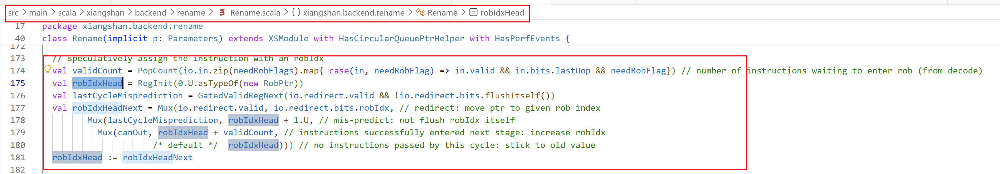

（暂未深入探究上述分配逻辑。）

通过本小节内容，可以确定：在重命名阶段，系统为这条加法指令分配了第 35 号 ROB 表项。

### （2.5）Rename往dispatch传输的信号总结

在对本节查看过的信号进行总结前，我们来查看最终传递给分发阶段（Dispatch）的信号具体有哪些。可以发现，在这两个阶段之间也存在一个 `RenamePipeDispatch`模块。


因此，我们可以直接查看这个模块的输出，也可以查看 Dispatch 模块的输入。此处我选择查看后者：

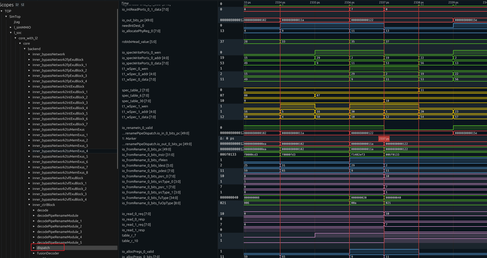

在这个模块中，我们提取以下信号进行观察：


模块之间的握手信号：

| 信号名 | 位宽 | 核心含义 | 对应 Chisel 源码位置 | 波形数值与说明 |
| --- | --- | --- | --- | --- |
| `io_renameIn_0_valid` | 1bit | 重命名模块第 0 路输入的握手有效信号，`=1`<br/>表示重命名模块接收到了来自译码阶段的有效指令 | `src/main/scala/xiangshan/backend/rename/RenameUnit.scala`<br/> → `io.in(0).valid` | 波形中为高电平，说明重命名阶段有持续的有效指令输入 |
| `...renamePipeDispatch.io_in_0_bits_pc[49:0]` | 50bit | 分发模块第 0 路输入的指令 PC 值，是指令的唯一身份标识，与重命名阶段的 PC 完全透传 | `src/main/scala/xiangshan/backend/dispatch/DispatchUnit.scala`<br/> → `io.in(0).bits.pc` | 2337ps 时刻值为`0000080000122`<br/>，与重命名阶段的目标指令 PC 完全一致，确认是同一条指令进入分发模块 |
| `...renamePipeDispatch.io_out_0_bits_pc[49:0]` | 50bit | 分发模块第 0 路输出的指令 PC 值，PC 全程透传不修改，用于后续发射队列、执行阶段的指令追踪 | 同上 → `io.out(0).bits.pc` | 2337ps 时刻值为`0000080000122`<br/>，确认指令成功通过分发模块，向下一级发射队列流转 |

重命名输出到分发模块的信号：

| 信号名 | 位宽 | 核心含义 | 对应 Chisel 源码位置 | 波形数值与说明 |
| --- | --- | --- | --- | --- |
| `io_fromRename_0_bits_pc[49:0]` | 50bit | 重命名模块输出的指令 PC 值，与前级完全透传，用于分发阶段的指令追踪、异常回溯 | 1. Bundle 定义：`src/main/scala/xiangshan/backend/decode/DecodeBundle.scala`<br/> → `MicroOp.pc`<br/>2. 模块端口：`RenameUnit.scala`<br/> → `io.out(0).bits.pc` | 波形中值为`0000080000122`<br/>，与分发模块输入的 PC 完全一致，是重命名模块发给分发模块的指令身份标识 |
| `io_fromRename_0_bits_instr[31:0]` | 32bit | 重命名模块输出的原始 32 位 RISC-V 指令机器码，全程透传不修改，用于调试、指令合法性校验 | 同上 → `MicroOp.instr` | 波形中值为`006f0133`<br/>，对应`add`<br/>加法指令，与之前译码阶段的机器码完全一致 |
| `io_fromRename_0_bits_rfWen` | 1bit | 寄存器堆写使能信号，`=1`<br/>表示该指令执行完成后，需要将结果写回目标物理寄存器 | 同上 → `MicroOp.rfWen` | 波形中持续为高电平，说明这条`add`<br/>指令需要写回目标寄存器，与之前的分析一致 |
| `io_fromRename_0_bits_ldest[5:0]` | 6bit | 指令目标操作数的**逻辑寄存器号（架构寄存器号）**，对应 RISC-V 指令的`rd`<br/>字段，重命名阶段透传不修改 | 同上 → `MicroOp.ldest` | 波形中值为`2`<br/>，对应目标逻辑寄存器`x2`<br/>（栈指针 sp），与译码阶段的`ldest=2`<br/>完全匹配 |
| `io_fromRename_0_bits_pdest[7:0]` | 8bit | 重命名阶段为目标寄存器**分配的物理寄存器号**，是重命名阶段的核心输出，后续指令的运算结果将写回这个物理寄存器 | 同上 → `MicroOp.pdest` | 波形中值为`11`<br/>，和之前重命名阶段分配的物理寄存器号完全一致，是这条指令的目标物理寄存器 |
| `io_fromRename_0_bits_psrc_0[7:0]` | 8bit | 第 0 个源操作数对应的**物理寄存器号**，由重命名阶段通过重命名映射表，从逻辑寄存器号`lsrc_0=30`<br/>转换而来 | 同上 → `MicroOp.psrc(0)` | 波形中值为`10`<br/>，对应逻辑寄存器`x30`<br/>映射的物理寄存器号，后续发射队列会通过这个编号查询操作数是否就绪 |
| `io_fromRename_0_bits_srcType_0[3:0]` | 4bit | 第 0 个源操作数的类型标识，重命名阶段透传不修改，用于执行单元的操作数解析 | 同上 → `MicroOp.srcType(0)` | 波形中值为`1`<br/>，表示该操作数是通用寄存器类型，与译码阶段一致 |
| `io_fromRename_0_bits_psrc_1[7:0]` | 8bit | 第 1 个源操作数对应的**物理寄存器号**，由逻辑寄存器号`lsrc_1=6`<br/>转换而来 | 同上 → `MicroOp.psrc(1)` | 波形中值为`7`<br/>，对应逻辑寄存器`x6`<br/>映射的物理寄存器号 |
| `io_fromRename_0_bits_srcType_1[3:0]` | 4bit | 第 1 个源操作数的类型标识，透传不修改 | 同上 → `MicroOp.srcType(1)` | 波形中值为`1`<br/>，表示通用寄存器类型 |
| `io_fromRename_0_bits_fuType[34:0]` | 35bit | 指令所属的**功能单元（FU）类型**，是分发模块的核心判断依据：分发模块会根据这个值，把指令分发到对应的发射队列 | 1. 枚举定义：`src/main/scala/xiangshan/backend/decoder/InstEnum.scala`<br/> → `FUType`<br/>2. Bundle 定义：`MicroOp.fuType` | 波形中值为`000000040`<br/>，对应`ALU`<br/>整数运算单元，分发模块会把这条指令分发到整数 ALU 对应的发射队列 |
| `io_fromRename_0_bits_fuOpType[8:0]` | 9bit | 功能单元内的**具体操作类型**，重命名阶段透传不修改，用于执行单元判断具体要执行的运算 | 同上 → `FUOpType`<br/>枚举、`MicroOp.fuOpType` | 波形中值为`021`<br/>，对应 ALU 的`ADD`<br/>加法操作，与之前的指令类型完全匹配 |

主要关注目前的 Pc 值保持一致，分配了相应的物理寄存器，根据不同的 futype 的值可以分配到相应的模块里面

首先，我们通过 PC 值来验证流水线逻辑的正确性。可以发现流水级逻辑是正确的：在下一个周期，与 `dispatch`模块的 `io_fromRename_0_*`相关的信号被成功锁存，进入了分发（Dispatch）阶段。

从这些传入的信号值，我们可以得到以下信息：

* 这是一条 PC 为 `0x80000122`的加法指令，指令码为 `0x006f0133`。
* 该加法指令需要回写（`rfWen`为高），其回写的目标**逻辑寄存器**是 2 号（`ldest = 2`），在重命名阶段为它分配的**物理寄存器**是 11 号（`pdest = 11`）。
* 这条加法指令的两个源操作数都来自寄存器（`srcType`为 1），并且两个源操作数的值分别来自**物理寄存器 10 号**和**物理寄存器 7 号**（`psrc0 = 10`, `psrc1 = 7`）。
* 其余是关于 `fuType`和 `fuOpType`的信息，这里不再赘述。

基于前面对重命名阶段的理解，可以清晰地判断出，这些进入 Dispatch 阶段的信息都是正确的。

## （3）分发模块（dispatch）

### （3.1）输入信号总览

查看架构图可知，在重命名（Rename）模块与分发（Dispatch）模块之间也存在一个 `RenamePipeDispatch`模块。基本可以确认，这是两级流水线之间的流水线寄存器。其行为模式与我们前面分析过的 `DecodePipeRename`模块几乎完全相同，因此这里不再赘述。读者可自行查看该模块相关的输入、输出信号波形。

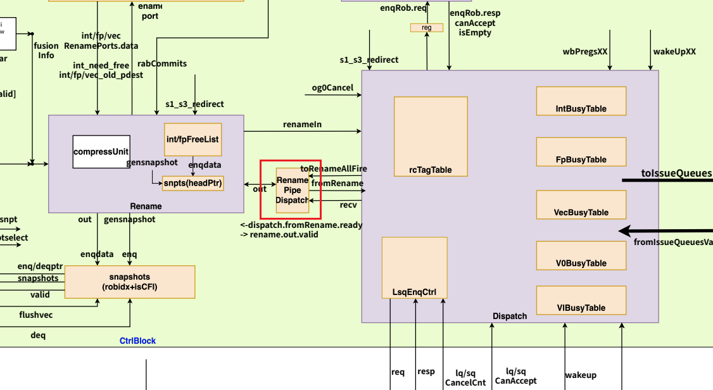

此处直接观察进入分发模块的数据信号，定位到该模块：


提取以下相关信号进行观察：

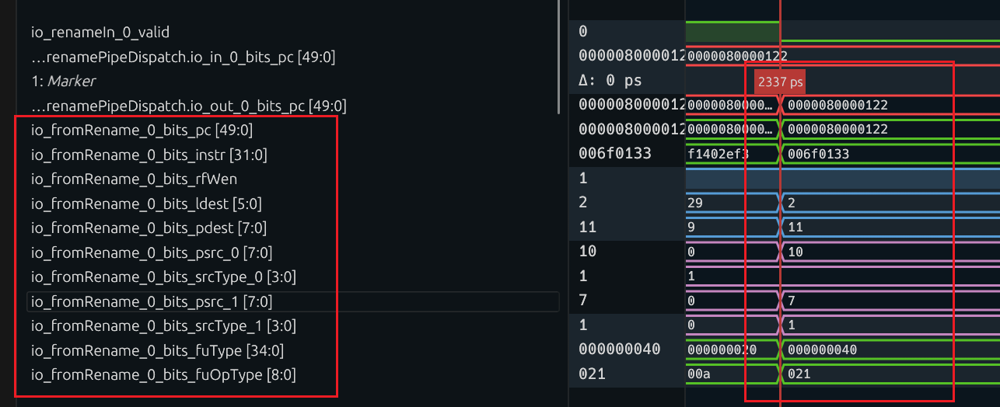

在波形中可以观察到，在仿真时间 2337 ps 这一时刻，第 0 路进入分发阶段的指令主要包含以下信息：

整理后的信号信息如下：

* <font style="color:#DF2A3F;">表示当前指令的程序计数器地址为 </font><code><font style="color:#DF2A3F;">0x80000122</font></code><font style="color:#DF2A3F;">，对应指令码 </font><code><font style="color:#DF2A3F;">0x006f0133</font></code><font style="color:#DF2A3F;">。</font>
* <code><font style="color:#2F8EF4;">rfWen = 1</font></code><font style="color:#2F8EF4;">表示该指令需要回写结果。</font>
* <code><font style="color:#2F8EF4;">ldest = 0x02</font></code><font style="color:#2F8EF4;">表示目标逻辑寄存器为 2 号。</font>
* <code><font style="color:#2F8EF4;">pdest = 0x0b</font></code><font style="color:#2F8EF4;">表示该指令在重命名阶段分配的物理寄存器为 11 号。</font>
* <code><font style="color:#E746A4;">psrc_0 = 0x0a</font></code><font style="color:#E746A4;">表示第一个源操作数来自物理寄存器 10 号。</font>
* <code><font style="color:#E746A4;">srcType_0 = 0x1</font></code><font style="color:#E746A4;">表示第一个源操作数来自寄存器。</font>
* <code><font style="color:#E746A4;">psrc_1 = 0x07</font></code><font style="color:#E746A4;">表示第二个源操作数来自物理寄存器 7 号。</font>
* <code><font style="color:#E746A4;">srcType_1 = 0x1</font></code><font style="color:#E746A4;">表示第二个源操作数来自寄存器。</font>
* `fuType = 0x40`表示功能单元类型为加法器。
* `fuOpType = 0x21`表示具体的加法操作类型。

结合以往的逻辑寄存器映射关系：

* `lsrc_0 = 0x1e`表示第一个操作数来自逻辑 30 号寄存器，此时它被映射到了物理寄存器 10（`psrc_0 = 0x0a`）。
* `lsrc_1 = 0x06`表示第二个操作数来自逻辑 6 号寄存器，此时它被映射到了物理寄存器 7（`psrc_1 = 0x07`）。

这些信息共同描述了重命名阶段完成后，进入 Dispatch 阶段的指令及其操作数映射状态。

### （3.2）读BusyTable

进入分发阶段后，如上节所示，指令已经知晓其两个源操作数分别来自物理寄存器 10 号和 7 号。那么，进入此阶段后，它的重要任务之一自然是查询这两个所需数据的状态，即检查 10 号和 7 号物理寄存器的数据是否就绪，是否仍处于繁忙状态。因此，它需要读取分发阶段下的子模块 `intBusyTable`，以获取这两个物理寄存器的状态信息。


拉取此模块的如下信号：


重命名到分发模块的信号：

| 信号名 | 核心含义 | 波形数值说明 |
| --- | --- | --- |
| `...renamePipeDispatch.io_in_0_bits_pc[49:0]` | 分发模块输入的指令 PC 值 | 2337ps 时值为`0000080000122`<br/>，确认是目标 add 指令 |
| `...renamePipeDispatch.io_out_0_bits_pc[49:0]` | 分发模块输出的指令 PC 值 | 与输入 PC 完全一致，指令身份标识全程透传 |
| `io_fromRename_0_bits_instr[31:0]` | 重命名模块输出的原始指令机器码 | 值为`006f0133`<br/>，对应 RISC-V 的 add 加法指令 |
| `io_fromRename_0_bits_rfWen` | 寄存器堆写使能信号 | 值为`1`<br/>，表示该指令执行完成后需要写回目标寄存器 |
| `io_fromRename_0_bits_ldest[5:0]` | 目标逻辑寄存器号 | 值为`2`<br/>，对应 RISC-V 的 x2 寄存器（栈指针 sp） |
| `io_fromRename_0_bits_pdest[7:0]` | 重命名分配的目标物理寄存器号 | 值为`11`<br/>，后续加法结果将写回这个物理寄存器 |
| `io_fromRename_0_bits_psrc_0[7:0]` | 第 0 个源操作数的物理寄存器号 | 值为`10`<br/>，对应逻辑寄存器 x30 |
| `io_fromRename_0_bits_psrc_1[7:0]` | 第 1 个源操作数的物理寄存器号 | 值为`7`<br/>，对应逻辑寄存器 x6 |
| `io_fromRename_0_bits_fuType[34:0]` | 功能单元类型 | 值为`000000040`<br/>，对应 ALU 整数运算单元 |
| `io_fromRename_0_bits_fuOpType[8:0]` | 具体操作类型 | 值为`021`<br/>，对应 ALU 的 ADD 加法操作 |

busy table 查询信号：

对应香山源码的 位置

<code><font style="color:rgb(0, 0, 0);background-color:rgba(0, 0, 0, 0);">src/main/scala/xiangshan/backend/rename/BusyTable.scala</font></code>、<code><font style="color:rgb(0, 0, 0);background-color:rgba(0, 0, 0, 0);">src/main/scala/xiangshan/backend/issue/IssueQueue.scala</font></code>。

| 信号名 | 位宽 | 核心功能 | 波形数值与逻辑说明 |
| --- | --- | --- | --- |
| `io_read_0_req[7:0]` | 8bit | **Busy Table 第 0 路读端口的请求地址**，即要查询的源物理寄存器号 | 2337ps 时值为`10`<br/>，正好对应指令的第 0 个源物理寄存器`psrc_0=10`<br/>，表示要查询物理寄存器 10 的忙 / 就绪状态 |
| `io_read_0_resp` | 1bit | **Busy Table 第 0 路读端口的查询响应结果**，返回对应物理寄存器的忙状态 | 2337ps 时值为`0`<br/>，香山 Busy Table 的规则是：`resp=0`<br/>表示**该物理寄存器不忙（就绪）**，数据已经写回，可用于发射执行 |
| `io_read_1_req[7:0]` | 8bit | **Busy Table 第 1 路读端口的请求地址**，对应指令的第 1 个源物理寄存器号 | 2337ps 时值为`7`<br/>，正好对应指令的第 1 个源物理寄存器`psrc_1=7`<br/>，查询物理寄存器 7 的忙 / 就绪状态 |
| `io_read_1_resp` | 1bit | **Busy Table 第 1 路读端口的查询响应结果** | 2337ps 时值为`0`<br/>，表示物理寄存器 7 也处于**就绪状态**，数据可用 |
| `table_r_7` | 1bit | **物理寄存器 7 的写回就绪广播信号** | 2337ps 时值为`1`<br/>，表示物理寄存器 7 在这个周期完成了结果写回，拉高 1 个周期广播给所有发射队列：等待该寄存器的指令可以更新就绪状态 |
| `table_r_10` | 1bit | **物理寄存器 10 的写回就绪广播信号**，功能与`table_r_7`<br/>完全一致 | 2337ps 时值为`1`<br/>，表示物理寄存器 10 在这个周期同步完成了写回，广播就绪信号 |

因为共有 6 条指令同时进入分发阶段，每条指令最多需要两个读端口来读取其源操作数的状态，因此 `intBusyTable`总共会提供 6 个读端口。由于我们关注的加法指令是第 0 条指令，所以在观察它对 BusyTable 的读取行为时，应重点查看第 0 和第 1 个读端口。

解释了以上内容后，我们来看具体的读取行为。可以明确该指令的两个源操作数分别来自物理寄存器 10 号和 7 号。因此可以推测，系统会以地址 10 和 7 去读取 BusyTable。在波形中验证，这个推测是正确的：`read_0_req`和 `read_1_req`的地址分别是 10 和 7。

再看读取的结果。这里的读取是单周期直接完成的，所以在同一周期内可以看到两个 `resp`信号都被拉低。需要注意的是，此处的 `resp`信号表示该寄存器的数据是否就绪。既然被拉低为 0，说明数据尚未就位。

我们再把 `table`内部的数据拉出来，检查读取是否正确。会发现此时 `table_r_7`和 `table_r_10`的值均为高电平。这个信号表示该寄存器位置的数据是否处于繁忙状态，即数据是否还未就位（通过设计手册的介绍可以确认他表示的意义）。因此，它们都被拉高意味着这两个寄存器位置的数据仍处于繁忙状态，尚未就位。

所以，`resp`输出的信号是基于 `table_r_*`信号取反后得出的（当然，同一周期内其他指令对 BusyTable 的写操作也会影响此结果）。两者所代表的含义是相反的。

综上，可以清楚地得出结论：

**读取行为正确**：指令在分发阶段读取 `intBusyTable`时，其第0路和第1路读端口的请求地址分别为 `10`和 `7`，与指令的两个源操作数物理寄存器编号（`psrc_0 = 10`, `psrc_1 = 7`）完全对应，说明寻址逻辑正确。

**状态信号含义明确**：

* `table_r_7`和 `table_r_10`信号为高电平（`1`），表示这两个物理寄存器的数据当前处于“繁忙”状态，即**数据尚未就绪**。
* 对应的 `resp_0`和 `resp_1`响应信号为低电平（`0`），表示**数据未就绪**。这证实了 `resp`信号是 `table_r_*`信号的**逻辑取反**（并可能受其他写操作影响），两者共同但以相反的逻辑指示了同一状态。

### （3.3）写BusyTable

明白了以上读取 BusyTable 的内容，我们自然可以推断：这条加法指令也应该执行写 BusyTable 的操作。因为该指令会将自身的加法结果写入物理寄存器 11 号，而此刻这个结果尚未计算出来，所以它应该对 BusyTable 的第 11 个位置写入“繁忙”信号。这样做的目的是告知后续的指令（包括同一周期内的逻辑后续指令）：“11 号寄存器本应由我的加法结果写入，但由于我尚未执行完成，这个结果还未写回，因此 11 号寄存器的数据仍在计算中。”这与上面读操作中，该加法指令得知自己的两个源操作数仍在运算中的效果是相同的。

那么，我们来推测一下这条加法指令是如何写入这个“繁忙”信号的。可以肯定的是，它会对 11 号位置进行写入。在写操作执行后，该位置对应的指示信号将被拉高。

现在，我们拉出以下信号进行查看

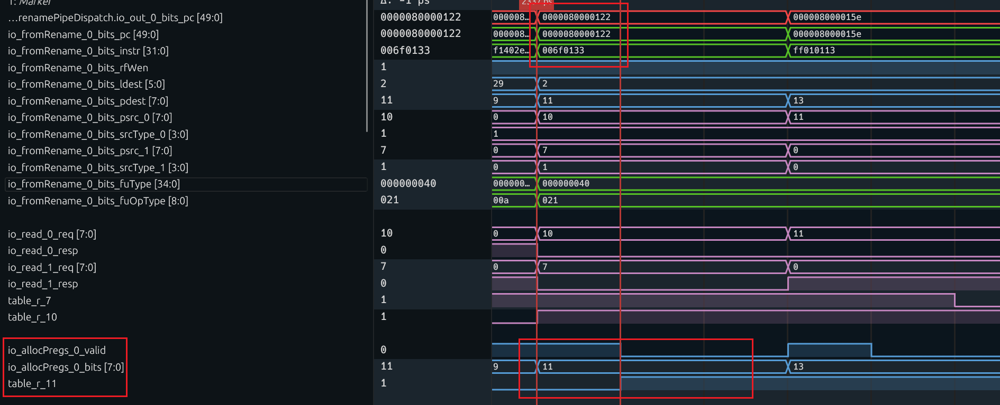

| 信号名 | 波形数值 | 核心功能 | 与全链路信号的联动关系 |
| --- | --- | --- | --- |
| `io_allocPregs_0_valid` | `1` | 第 0 路物理寄存器分配有效信号（FreeList 模块输出） | 上游触发：重命名模块检测到`rfWen=1`<br/>，向 FreeList 发起物理寄存器分配请求，FreeList 成功分配后拉高该信号；下游联动：该信号拉高的周期，`io_allocPregs_0_bits`<br/>输出有效分配结果，同时 Busy Table 会把对应的物理寄存器标记为「忙」（因为指令还没执行，结果未写回） |
| `io_allocPregs_0_bits[7:0]` | `11` | FreeList 分配的目标物理寄存器号 | 上游：来自 FreeList 的空闲物理寄存器池；核心对应：和重命名模块输出的`pdest=11`<br/>完全相等，是「逻辑寄存器 x2→物理寄存器 11」的映射核心；下游：该寄存器号会被送到 ALU 执行单元（告诉 ALU 结果要写回这里）、写回模块、Busy Table，是后续所有目标寄存器操作的核心地址 |
| `table_r_11` | `1` | 物理寄存器`11`<br/>的写回就绪广播信号 | 上游源头：完全对应`io_allocPregs_0_bits=11`<br/>和`pdest=11`<br/>，是这条 add 指令的目标寄存器；触发条件：ALU 完成加法运算，结果成功写回物理寄存器`11`<br/>后，拉高该信号 1 个周期；下游动作：1. Busy Table 收到广播，把物理寄存器`11`<br/>的状态从「忙」改为「就绪」；2. 所有依赖逻辑寄存器 x2（映射到物理寄存器 11）的后续指令，会收到该广播，更新自己的源寄存器就绪状态 |

可以观察到，BusyTable 的写端口 `io_allocPregs_0_valid`信号被拉高，表明需要进行写操作。紧接着，地址信号 `io_allocPregs_0_bits`的值为 11，即目标地址。在下一个时钟周期，可以看到 `table_r_11`的值被置为高电平。此后，这表示 11 号物理寄存器处于繁忙状态，需要等待这条加法指令完成运算。波形中的数据完全印证了我们的猜想是正确的。

所以明白了以上内容，可以清楚地知道：

**写 BusyTable 的操作**：加法指令在分发阶段，通过写端口向 `intBusyTable`发出写请求：

* 写使能信号 `io_allocPregs_0_valid`被拉高，表明需更新 BusyTable。
* 写地址信号 `io_allocPregs_0_bits`的值为 `11`，对应其目标物理寄存器（`pdest = 11`）。
* 在下一周期，`table_r_11`被置为高电平（`1`），表示物理寄存器 11 进入“繁忙”状态。

### （3.4）写Rob

在分发阶段，还有一项特别重要的操作，即对 ROB 的写操作。指令需要将自身的一些信息写入 ROB，以便在执行结束后能够按逻辑顺序正确提交。

因此，观察此模块的信号：


提取以下信号进行查看：

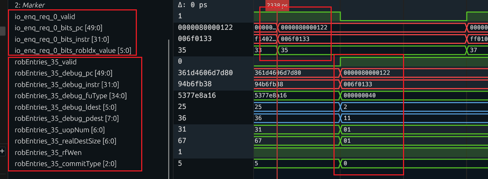

首先是 ROB 入队的请求信号

在 2338 ps 这一时刻（可以确认这是在指令进入分发阶段后，经过一拍寄存器延迟再进入 ROB 的，从架构图中也能确认两者之间存在一级寄存器），`rob`模块的 `io_enq_req_0_*`端口被赋予了这条指令对应的请求信号，我们可以通过其 `pc`值和指令码来识别。

请注意，还有一个 `robIdx_value`值，它指示这条指令应该被写入第几个 ROB 表项。这个信号是在上一个流水级（重命名阶段）就已设置好的。如果忘记了，可以参考 2.4 节的内容。其值为 35，由此可以确认，这条指令的相关信息将被记录在第 35 个 ROB 表项中。

于是，我们拉取第 35 个 ROB 表项的内容进行查看，可以发现其行为完全正确。在下一个周期，这个表项里的数据都被正确地写入了。特别要注意 `uopNum`这个值，它所表示的意义是：这条指令**有几个回写的值尚未被写**。对于一条简单的加法指令而言，显然只有一个回写值。

所以明白了以上内容，可以清楚地知道：

* **写入时机与路径**：在 2338 ps 时刻，加法指令的信息通过 `io_enq_req_0_*`端口被写入 ROB。这发生在指令进入分发阶段后，经过一拍寄存器延迟，符合架构图中 ROB 位于分发阶段下一级的流水线设计。
* **写入位置**：写入的 ROB 表项索引由 `robIdx_value`指定，其值为 35。这与在重命名阶段为该指令分配的 ROB 表项编号（第 35 项）完全一致，证明了流水线上下文传递的正确性。
* **写入内容正确**：
* 在下一周期（2341 ps），第 35 号 ROB 表项内的数据（如 `pc`、指令信息等）被成功更新，表明写入操作完成。
* 其中，`uopNum`值为 1，这准确地表示该加法指令**有 1 个结果值尚未写回**。这与加法指令只产生一个回写结果的事实相符。

### （3.5）准备进入发射单元

完成以上各项主要任务（对一条加法指令而言大致就这些）后，指令就应准备进入发射队列。（以下内容仅为大致说明，笔者对后续架构尚未完全明晰）：

首先，需要确定指令具体可进入哪个发射队列。这个判断由分发（dispatch）模块中的以下信号决定


我们先来弄清楚这里为什么会有编号 0 到 16 一共 17 个发射队列。可以查看架构图：


波形中的 17 个发射队列指的就是上图这些。你可能会数一数，发现图中一共画了 19 个方块，为什么数量对不上呢？对此，笔者暂时也没有完全弄懂原因，推测可能是在 `memScheduler`中有队列进行了合并。但对于前面的 `IntScheduler`部分，其序号应该是能对应上的。

***

看完store指令的执行过程后，就明白了这里为什么数量对不上了。因为对于store指令，是需要写数据、写地址两类的，所以这两类数据分别会进行发射。

也就是说在图中的：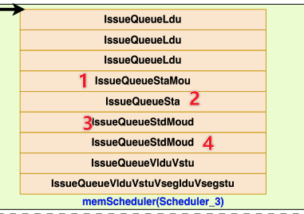

1（"sta":store address算地址的队列）、3（"std":store data算数据的队列）是一对；同理2、4队列是一对。

也就是说对于一条store指令，会进入两个队列分别独立进行发射。所以说这里看似多了2个队列实际上就是因为这个原因。

***

例如，在上面的波形图中，你会发现给这条加法指令的信号中，只有 `uopSelIQ_0_3`被拉高了。这表明这条加法指令将被填入到上图中下标为 3（即第 4 个）的队列中。数一下就能确定，就是那个叫做 `IssueQueueAluCsrFenceDiv`的队列：

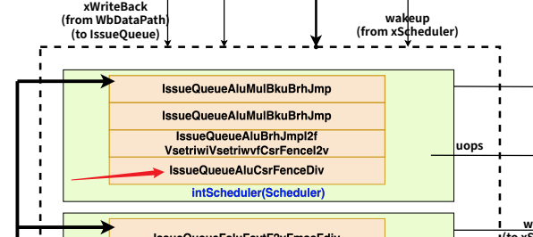

此外，还需要明白一点：每一个发射队列都会有两个写端口。因此，如果我们的加法指令是被发射到下标为 3 的发射队列中，那么它只可能通过下标为 6 或 7 的写端口对该队列进行写入。明白这一点后，就可以拉出这部分的写信号，确认它具体使用的是哪一个端口：

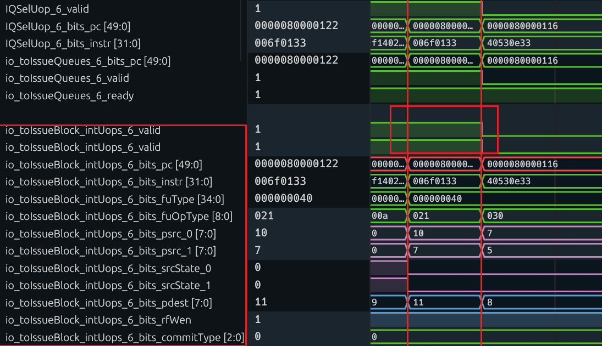

可以发现它是通过第 6 个端口进行写入的。写入的信号相信你已经可以自己总结了：

**1. 发射队列的写入端口**

* 每个发射队列拥有两个写端口。对于下标为 3 的队列，其写端口为 **6** 或 **7**。
* 波形图显示，该指令通过 **第 6 个写端口** 将数据写入目标队列。

**2. 写入信号的具体内容与含义**

通过波形图，我们可以提取并解读这条指令在进入发射队列时被写入的关键字段：

* <code>**io_toIssueBlock_intUops_6_valid**</code>: 有效信号，值为 1，表示本次传输的数据是有效的。
* <code>**bits_pc**</code>: 程序计数器（PC）值，为 `0x800000122`。
* <code>**bits_instr**</code>: 指令编码，为 `0x006f0133`。
* <code>**bits_fuType**</code>: 功能单元类型，为 `0x40`，表示这条指令将发往 ALU。
* <code>**bits_fuOpType**</code>: 功能单元操作类型，为 `0x21`，表示这条指令将在ALU中进行普通的加法操作。
* <code>**bits_psrc_0**</code>\*\*/ \*\*<code>**bits_psrc_1**</code>: 源操作数，分别为 `10`和 `7`，表示参与运算的两个操作数的物理寄存器编号。
* <code>**bits_srcState_0**</code>\*\*/ \*\*<code>**bits_srcState_1**</code>: 源操作数状态，均为 `0`，表示操作数是否已准备好（0 代表未就绪）。
* <code>**bits_pdest**</code>: 目标物理寄存器，为 `11`，表示运算结果将写入的物理寄存器编号。
* <code>**bits_rfWen**</code>: 寄存器写使能，为 `1`，表示指令执行完成后需要写回寄存器文件。
* <code>**bits_commitType**</code>: 提交类型，为 `0`，表示标准的提交行为。


> 更新: 2026-03-25 10:36:45  
