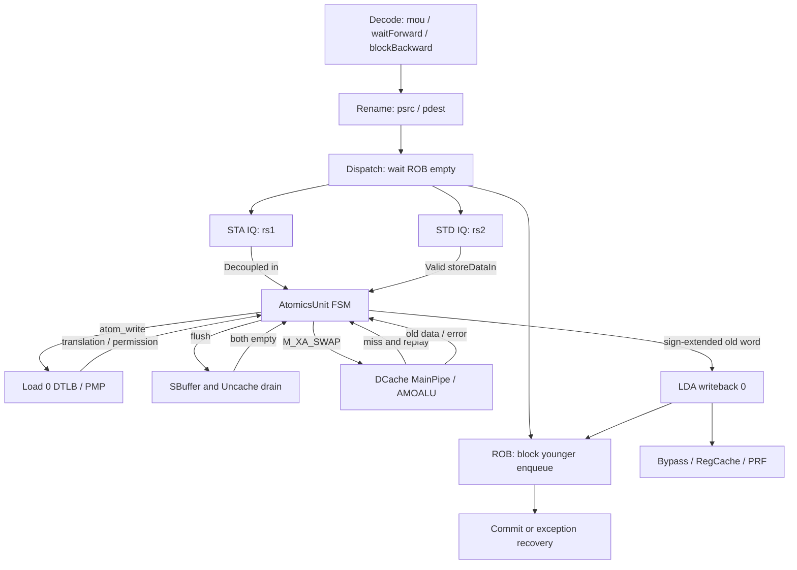

# AMOSWAP.W 指令执行生命周期

## 📋 基本信息

| 字段 | 内容 |
|---|---|
| **指令名称** | `amoswap.w rd, rs2, (rs1)`；排序修饰为 `.aq`、`.rl`、`.aqrl` |
| **编码格式** | `00001_aq_rl_rs2[4:0]_rs1[4:0]_010_rd[4:0]_0101111`，32 位；`funct5=00001`、`funct3=010`、`opcode=0101111` |
| **RISC-V 扩展** | A 扩展中的原子读改写指令；本地译码见 [DecodeUnit][D] |
| **是否有压缩格式** | 无对应的 C 扩展压缩编码；指令低两位为 `11` |
| **指令分类** | 访存／原子交换，同时产生内存写入和整数寄存器结果 |
| **FuType** | `FuType.mou`，不是普通 `store` 或整数 ALU |
| **FuOpType** | `LSUOpType.amoswap_w = "b001010".U`，见 [package.scala][OP]；不能把指令编码的 `aq/rl` 当作该内部操作码的高位 |
| **目标 FU** | MemScheduler 的 STA/MOU 地址路径与 STD/MOUD 数据路径汇合到单个 [AtomicsUnit][A]，再访问 DCache 原子端口 |
| **分析日期** | 2026-09-06 |

**分析范围与证据等级。** 按用户要求，以本地 `/nfs/home/wanghao/emuByYuan/stable-kmh-v2` 为实现依据，记录其 HEAD 为 `abd0f867a86b66a92d4fc5d3c6d62944725c747f`，不与其他本地树或远程分支混用。以下行号指向本次读取的本地文件；参数默认值不等于某个历史仿真的实际 elaboration 配置。模板保留全部章节，但阶段名称、信号和延迟以该版本源码为准。

现有 [AMO 教学材料](index.md) 的反汇编实例是 `PC=0x80000142`、`inst=0x08e7a7af`，即 `amoswap.w a5,a4,(a5)`，`rd=rs1=x15`、`rs2=x14`、`aq=rl=0`。其正文还出现少一位的 `0x8000142`，不能沿用为目标 PC。旁边的复杂 AMO 文档是另一个 `.aq` 自旋锁场景，不是同一次动态执行。本次没有建立与该实例匹配的原始波形、反汇编、仿真日志闭环；Task27 现有 `redirect/demo/learnRedirect/learn.c` 也不能直接作为该 AMO 实例的验证程序。因此本文是**源码核验后的生命周期分析，不是已经完成的逐周期波形报告**，不转录截图时间作为实测延迟。

**数据语义。** 地址取进入本条指令时的 `X[rs1]`，旧内存字返回 `rd`，新内存字取 `X[rs2][31:0]`；RV64 上返回值是旧 32 位字的符号扩展。`rd=x0` 只丢弃寄存器结果，不取消原子访存或异常。对上述 `rd=rs1` 实例，重命名保证读旧地址映射、写新目标映射，不会拿返回值当地址。实现依据是 [Rename][R]、[AtomicsUnit][A] 和 [AMOALU][ALU]。

```text
address = X[rs1]
old32   = atomic_exchange_32(address, X[rs2][31:0])
X[rd]   = sign_extend_64(old32)       （rd != x0 时）
```

---

## 1. 前端路径

### 1.1 取指

| 阶段 | 延迟 | 关键行为 | 代码位置 |
|---|---|---|---|
| ICache/MainPipe | 命中、翻译、补行和背压相关 | 提供指令数据与取指异常；数据访存的原子属性不改变取指请求类型 | [ICacheMainPipe][IC]；[IFU][IF] 中 `icacheRespAllValid` |
| IFU F0 | 请求基准拍 | `fromFtq.req.fire` 接收 FTQ 请求，受 `f1_ready && icacheReady` 限制 | [IFU][IF] 241–263 行 |
| IFU F1 | 无阻塞时下一拍 | 保存 FTQ 请求、准备 PC 等元数据，`f1_valid && f2_ready` 推进 | [IFU][IF] 291–304 行 |
| IFU F2 | 无阻塞时再下一拍，可等待 | 等 ICache 数据，整理指令边界并预译码；`f2_fire=f2_valid && f3_ready && icacheRespAllValid` | [IFU][IF] 357–385、517 行附近 |
| IFU F3 | 无阻塞时再下一拍，可等待 | 使用预译码结果、RVC 扩展结果与 PredChecker 范围，`io.toIbuffer.fire` 入队 | [IFU 输出][IFO] 953–969 行 |

> **前端流水线总延迟（无冲刷）：** 在 ICache 响应及时、无跨块补取、无 IBuffer 背压的条件下，`f0_fire` 到 `f3_fire` 是 3 个周期间隔。仅“无冲刷”不足以固定延迟。该树使用 F0–F3，不能套用模板示例的 S0–S2，也不能把并行 ICache 等待再机械相加。

### 1.2 预译码

| 项目 | 内容 |
|---|---|
| **brTable 匹配** | AMOSWAP.W 不匹配控制流条目；[PreDecode][PD] 的 `ListLookup` 默认 `BrType.notCFI` |
| **PreDecodeInfo 字段** | 对有效起始位置：`valid=validStart(i)`、`isRVC=false`、`brType=00`、`isCall=false`、`isRet=false`；本地字段不是 `brAttribute` |
| **是否有专用检测逻辑** | 预译码不识别原子交换语义；由后端译码识别 `FuType.mou` |
| **跳转偏移计算** | `jal_offset`、`br_offset` 在组合逻辑中仍计算；非 CFI 不将这些比特解释为本指令的跳转目标。不能表述成“电路不触发” |

### 1.3 PredChecker 校验

| 项目 | 内容 |
|---|---|
| **是否触发 remaskFault** | 本 AMO 自身不满足 JAL/JALR/RET 条件；同一取指块更早的控制流指令仍可能触发 remask |
| **是否触发 mispredict** | 正确预测时不触发；若预测器错误地把该非 CFI 位置预测为 taken，则 `notCFITaken` 可以置位，产生 `notCFIFault` |
| **是否产生 wbRedirect** | 不因原子交换语义产生；错误 CFI 预测可经 PredChecker Stage 2 和 IFU→FTQ 校正路径恢复，不能无条件写“否” |
| **fixedRange 影响** | AMO 自身不截断范围，但可能被同块更早的 remask 排除；入队还须满足该位置 `f3_instr_valid` |

[PredChecker][PC] 的关键条件是：

```scala
notCFITaken := VecInit(pds.zipWithIndex.map { case (pd, i) =>
  fixedRange(i) && instrValid(i) && i.U === takenIdx && pd.notCFI && predTaken
})
```

### 1.4 IBuffer 入队

| 项目 | 内容 |
|---|---|
| **入队宽度** | 本树使用 `PredictWidth=FetchWidth*(HasCExtension ? 2 : 1)`，默认 `FetchWidth=8` 且 C 开启时为 16 个半字起始位置；不是每拍固定 16 条 32 位 AMO |
| **是否可能被挡** | 是；[IBuffer][IB] 的 `io.in.ready=allowEnq`，容量不足时背压 IFU |
| **携带的关键信息** | 指令、PC、`pd`、`ftqPtr`、`ftqOffset`、异常类型、trigger 等；本位置还须被 `enqEnable` 选中 |

[IFU 输出][IFO] 与 [IBuffer][IB] 的关键门控：

```scala
io.toIbuffer.bits.enqEnable := checkerOutStage1.fixedRange.asUInt & f3_instr_valid.asUInt
```

```scala
allowEnq := (IBufSize - PredictWidth).U >= numValidNext
io.in.ready := allowEnq
```

---

## 2. 后端路径

### 2.1 译码

| 项目 | 内容 |
|---|---|
| **DecodeWidth** | 本地参数默认 6，见 [Parameters][P] |
| **简单/复杂译码** | 简单译码；[UopInfoGen][U] 的复杂判定仅覆盖相应向量类别和 AMOCAS，不能因为 AMO 执行复杂就称为 Complex Decoder |
| **译码延迟** | 译码表为组合逻辑；“0 cycle”只描述该组合逻辑，不表示 IBuffer→Rename 总耗时为零 |
| **关键译码结果** | `fuType=mou`、`fuOpType=amoswap_w`、两路整数寄存器源、`rfWen=true`；`noSpec=T` 映射到 `waitForward=true`，`blockBackward=true`，`flushPipe=false`；默认 `numUops=1`、`numWB=1` |
| **异常** | 正常合法指令不因 AMO 类别增加译码异常；取指异常继续携带，地址/权限异常在访存阶段检测 |
| **代码位置** | [DecodeUnit][D] 240、839–840 行；[控制 Bundle][B] 105–130 行 |

```scala
AMOSWAP_W -> XSDecode(SrcType.reg, SrcType.reg, SrcType.X, FuType.mou, LSUOpType.amoswap_w, SelImm.X, xWen = T, noSpec = T, blockBack = T),
```

这里的 `numUops=1` 不否认派发后地址／数据分路；它不是把 AMOSWAP 分解成可独立提交的 load、ALU、store 三条指令。

### 2.2 重命名

| 项目 | 内容 |
|---|---|
| **RenameWidth** | 默认 6 |
| **延迟** | 含 RAT 读取、同组相关前递、分配及边界推进；是否能下一拍推进取决于空闲表、下游和 redirect，本文不将停留时间固定为 1 |
| **源操作数** | 两个整数源，`psrc(0)` 对应地址 `rs1`，`psrc(1)` 对应交换数据 `rs2` |
| **目标操作数** | `rd!=x0` 时从 IntFreeList 分配新物理目标；`rd=x0` 无有效架构整数写入 |
| **特殊处理** | `rd=rs1` 或 `rd=rs2` 时仍读取旧映射；向后跟踪必须使用 `robIdx`（含回绕位）、物理源／目标，不能只按 PC |
| **代码位置** | [Rename][R] 340、385–404、513 行附近 |

### 2.3 派发

| 项目 | 内容 |
|---|---|
| **DispatchWidth** | 来自 `RenameWidth` 的输入组，默认 6；AMO 的串行化限制使其不能按此宽度并行进入 ROB |
| **延迟** | 可变；尤其需要等待 ROB 清空，不能固定填 1 cycle |
| **目标 ROB** | `fromRename.fire` 才使 `enqRob.req.valid` 生效；须满足 ROB/IQ 等资源条件 |
| **目标 Issue Queue** | 默认 STA0/STA1 中支持 `MouCfg` 的地址 IQ；数据复制到对应支持 `MoudCfg` 的 STD IQ，不是独占的“AMO IQ” |
| **LSQ 分配** | AMO 被显式排除在普通 LSQ 请求之外，`needAlloc=0`；携带的 `lqIdx/sqIdx` 不能被解释成该指令占用普通 LQ/SQ 表项 |
| **代码位置** | [NewDispatch][DIS] 50、668–700、795–829 行；[调度配置][MP] 466–493 行 |

[NewDispatch][DIS] 和 [Rob][ROB] 联合保证前后串行化：

```scala
blockedByWaitForward(0) := !io.enqRob.isEmpty && isWaitForward(0)
```

```scala
enqLsqIO.req(i).valid := io.fromRename(i).fire && !isAMOVec(i) && !isSegment(i) && !isfofFixVlUop(i)
```

`waitForward` 等待更老指令离开 ROB，同组更老有效指令也参与门控；`blockBackward` 阻止同组后续指令，ROB 再通过 `hasBlockBackward` 阻止后续周期入队，并在 ROB 为空时清除该锁存。ROB 为空不代表更老 store 已全部落入 DCache，所以 AtomicsUnit 还需要排空写缓冲。

### 2.4 发射

| 项目 | 内容 |
|---|---|
| **Issue Queue 类型** | MemScheduler 共享 STA/STD 队列；地址与数据可以不同拍到达 |
| **唤醒条件** | 地址路径等待 `rs1`，数据路径等待 `rs2`；还受读端口、FU 可接收状态及取消条件约束 |
| **选择策略** | [IssueQueue][IQ] 使用 `canIssue`、FU busy mask、端口支持条件和 AgeDetector 等选择逻辑，不能概括为不受限制的全局 oldest-first |
| **最小延迟** | 未对 IQ→读寄存器→MemBlock 所有边界建立实测；单独的组合 select 不能充当固定“1 cycle”发射延迟 |
| **最大延迟** | 对资源或响应等待，源码未给出有限周期上界 |
| **接收条件** | AMOSWAP.W 在 AtomicsUnit 空闲时 `io.in.ready=1`，`io.in.fire` 保存地址和 uop；数据侧是 `Valid` 接口，没有 `ready` |
| **代码位置** | [IssueQueue][IQ] 420–490 行；[MemBlock 原子接管][MA]；[AtomicsUnit][A] 137–178、474–495 行 |

`feedbackSlow.hit=true` 只是给地址 IQ 的完成反馈；该单元自行轮询 DTLB，**不能据此断言真实 TLB 命中**。`data_valid` 等待 STD 数据计数达到 1，才允许 AMOSWAP 发 DCache 请求。

### 2.5 执行

| 项目 | 内容 |
|---|---|
| **执行单元** | [AtomicsUnit][A] → [DCache MainPipe][C] → [AMOALU][ALU] |
| **流水/阻塞** | [MouCfg][F]：`piped=false`、`latency=UncertainLatency()`，`maybeBlock` 未覆盖、默认 false；但真实 AtomicsUnit 是单事务 FSM，不能把配置默认 false 解读为不阻塞 |
| **执行延迟** | 不定长：翻译／权限、写缓冲排空、STD 数据、Cache 仲裁／miss／replay、输出背压共同决定 |
| **FSM 状态机** | 共 9 个状态；AMOSWAP.W 正常路径不进入专供 AMOCAS.Q 第二次写回的 `s_finish2` |
| **关键输出信号** | `dtlb.req`、`flush_sbuffer.valid`、`dcache.req`、`out`、`feedbackSlow`、`exceptionInfo` |
| **代码位置** | [AtomicsUnit][A] 44–68、238–418、454–537 行 |

**FSM 状态机：** 状态编码按 `Enum(9)` 顺序；表中转移均指时钟沿更新，不是同拍穿透多个状态。

| 状态 | 持续条件 | 输出信号 | 次态转换条件 |
|---|---|---|---|
| `s_invalid`（0） | 等待地址输入 | 对 AMOSWAP `in.ready=1` | `in.fire` 保存 uop/rs1/pdest → 1 |
| `s_tlb_and_flush_sbuffer_req`（1） | 无合格翻译响应或 TLB miss | 持续 `dtlb.req.valid`；非空时请求 flush | 首拍响应被 `have_sent_first_tlb_req` 排除；之后 `resp.fire && !miss`：未对齐／trigger → 7，否则 → 2 |
| `s_pm`（2） | 固定一拍权限检查 | 读取 PMP/PMA/PBMT、继续 flush | 地址翻译异常或权限／MMIO／NC 拒绝 → 7；否则缓冲已空 → 4，未空 → 3 |
| `s_wait_flush_sbuffer_resp`（3） | `!flush_sbuffer.empty` | 保持 flush 请求 | `empty` → 4 |
| `s_cache_req`（4） | `!data_valid` 或请求端不 ready | `data_valid` 时 `dcache.req.valid=1`、`cmd=M_XA_SWAP` | `dcache.req.fire` → 5 |
| `s_cache_resp`（5） | 无响应，或 miss 已接纳等待补行 | 等待 DCache 的 Valid 响应 | `miss && replay` → 4；`miss && !replay` 留在 5；`!miss` 锁存数据／错误 → 6 |
| `s_cache_resp_latch`（6） | 固定一拍 | 选择低／高 32 位并符号扩展，记录 cache error | 设置 `resp_data`、`out_valid` → 7 |
| `s_finish`（7） | `!out.ready` 或所需 pdest 尚未有效 | `out.valid=out_valid && pdest1Valid` | AMOSWAP 的 `out.fire` 重置 → 0；不进入 8 |
| `s_finish2`（8） | 仅 AMOCAS.Q 需要 | 第二次输出 | 对本文指令不可达 |

**地址、数据和原子更新。** [AtomicsUnit][A] 使用 `vaddr=rs1`，以 `TlbCmd.atom_write` 查询翻译和权限；在 `s_pm` 通过后，必须等 `sbuffer_empty`。这个 empty 实际由 [MemBlock][MA] 合成为 `sbuffer.io.flush.empty && uncache.io.flush.empty`，并非只看一个 SBuffer 表项计数。

请求的 `addr/vaddr` 是行对齐地址，`word_idx` 选择 64 位 bank，`amo_data=Fill(4, rs2[31:0])` 为 128 位复制数据，16 位 `amo_mask` 对 W 操作是 `0x000f << paddr[2:0]`。因此合法 W 地址的 mask 为 `0x000f` 或 `0x00f0`；其他字节不被覆盖。[AtomicsUnit][A] 的关键片段：

```scala
"b10".U -> Fill(4, data(31, 0)),
```

```scala
"b10".U -> (0xf.U << addr(2,0)),
```

[MainPipe][C] 将读出的旧数据接到 AMOALU 的 `lhs`、交换数据接到 `rhs`；SWAP 不选择加／与／或／异或／min/max 的运算效果，返回待写的新值 `rhs`，再按 mask 与旧行合并。S3 中的 AMOALU 结果寄存和数据阵列写入受流水线可推进条件约束；不是接收请求即原子更新完成。成功原子响应返回的是**更新前的数据**：

```scala
atomic_hit_resp.data := Mux(s3_sc, s3_sc_fail.asUInt, s3_data_quad_word)
```

回到 [AtomicsUnit][A]，由 `paddr[2:0]` 在旧数据中选择目标字，再执行：

```scala
"b10".U -> SignExt(rdataSel(31, 0), QuadWordBits),
```

内部先扩展到 128 位，输出到 64 位 `MemExuOutput.data` 时取低 XLEN 位，因此 RV64 的最终结果仍是 32→64 位符号扩展。`0x80000001` 的旧内存字应返回 `0xffffffff80000001`，不是零扩展值，也不是 `rs2`。

**缺失与重试。** [MainPipe][C] 的 miss 请求可以进入 MissQueue，补行后重新走原子更新；资源不允许接纳或权限升级失败时用原子 replay 响应返回。AtomicsUnit 遇 `miss && replay` 才重新发请求，不能见 miss 就重复交换。具体 MSHR 编号、set/way、补行 beat 数和一致性事务耗时须由实际配置与波形给出，本文不虚构。

### 2.6 写回

| 项目 | 内容 |
|---|---|
| **写回端口** | [MemBlock 写回连接][MW] 中 `AtomicWBPort=0`，原子结果优先复用 `ldaExeWbReqs(0)`，再走整数写回；不是根据旧注释认定走 store 端口 |
| **是否写回** | `rd!=x0` 时写整数物理寄存器，值是符号扩展旧字；ROB 同时接收完成／异常信息。无 FP/Vec 结果 |
| **写回延迟** | 成功 DCache 响应采样后，先到 latch 状态，再到 finish；无输出背压时 2 个周期间隔后可发生 `AtomicsUnit.out.fire`。后续仲裁、PRF、ROB 观察点不与该事件混为一谈 |
| **代码位置** | [AtomicsUnit][A] 357–409、479–487 行；[MemBlock][MW] 513–521 行；[WbArbiter][WB] 288–362 行 |

```scala
ldaExeWbReqs(AtomicWBPort).valid := atomicsUnit.io.out.valid || loadUnits(AtomicWBPort).io.ldout.valid
atomicsUnit.io.out.ready := ldaExeWbReqs(AtomicWBPort).ready
```

**前递、RegCache、PRF 分开计时。** [BypassNetwork][BY] 对支持 `needWriteRegCache` 的结果，以 `valid && intWen` 生成前递写使能，下一拍保存写使能／tag／data；[DataPath][DP] 的 `regCache.io.writePorts := io.fromBypassNetwork` 连接到 RegCache。PRF 写端由 [WbArbiter][WB] 的实际仲裁 `fire` 生成。本文未测这三个相对目标 AMO 发射事件的绝对拍号，不照搬原教学截图的“RegCache 下一拍退休”。

### 2.7 提交

| 项目 | 内容 |
|---|---|
| **CommitWidth** | 本地默认 `CommitWidth=8`、`RobCommitWidth=8`；AMO 串行化不意味着每拍可提交 8 条 AMO |
| **提交条件** | ROB 有效头项、所需写回完成、无待处理异常／redirect 阻止提交，并满足本地 commit 控制条件 |
| **是否触发 flush** | 正常 AMOSWAP 未设置 `flushPipe`，无需像 fence.i 那样在成功提交时主动全流水线 flush |
| **是否触发 redirect** | 不产生分支目标 redirect；异常／中断等走 ROB 通用恢复路径 |
| **代码位置** | [Rob][ROB] 187–194、395–402、460–461、619–629 行及提交／difftest 逻辑 |

内存原子更新发生在 DCache 执行路径，**不是等普通 store 提交后再写入 SBuffer**；执行前通过前后串行化保证安全。寄存器架构提交仍需 ROB 退休。后续验证应同时比对 `commits.isCommit && commitValid(i)`、提交 PC/inst、`rd/pdest`、整数结果及原子内存事件；只看到 `out.valid` 或 `DiffAtomicEvent.valid` 不等于已经退休。

---

## 3. 信号前递

### 3.1 前递路径图



### 3.2 信号清单

位宽以 [AtomicsUnit IO][A]、[MainPipe 请求][C]、[AtomicWordIO][AI] 定义为准；这是 Chisel 字段名，不冒充某次 RTL dump 的展开名。

| 信号名 | 方向 | 位宽 | 语义 | 持续方式 |
|---|---|---|---|---|
| `in.valid/ready` | MemBlock ↔ AtomicsUnit | 各 1 | 地址/uop 接收；payload 含 `src_rs1`（64）、`robIdx`、`pdest` | Decoupled，`fire=valid && ready` |
| `storeDataIn(i).valid/data` | STD → AtomicsUnit | 1 / XLEN=64 | 保存 `rs2`；AMOSWAP 需要一份 STD 数据 | Valid，无 ready；其 `fire` 就是 valid |
| `dtlb.req.valid/ready` | AtomicsUnit ↔ DTLB | 各 1 | 请求地址翻译及原子写权限检查 | 在状态 1 持续请求，直到取得可用响应 |
| `dtlb.resp.valid/ready` | DTLB ↔ AtomicsUnit | 各 1 | 含 paddr、miss、pf/af/gpf、PBMT | ready 恒 true；首拍仍有防旧响应门控 |
| `flush_sbuffer.valid/empty` | AtomicsUnit ↔ MemBlock | 各 1 | flush 请求／两种写缓冲均已排空 | 电平握手，不是 Decoupled ready |
| `dcache.req.valid/ready` | AtomicsUnit ↔ DCache | 各 1 | 状态 4 且数据有效才提交交换请求 | Decoupled，可背压 |
| `dcache.req.bits.amo_data/amo_mask` | AtomicsUnit → DCache | 128 / 16 | 复制的新字和有效字节掩码 | 请求 payload，握手时采纳 |
| `dcache.resp.valid` | DCache → AtomicsUnit | 1 | data 为旧数据，另有 miss/replay/error | **Valid 接口，没有 resp.ready** |
| `feedbackSlow.valid/hit` | AtomicsUnit → 地址 IQ | 各 1 | 输入 valid 延迟两拍形成反馈；hit 固定 true，不代表真实 TLB hit | Valid 反馈 |
| `out.valid/ready/data` | AtomicsUnit ↔ 写回 | 1 / 1 / 64 | 旧字符号扩展结果和 uop/exception | 输出保持到 fire |
| `exceptionInfo.valid` | AtomicsUnit → MemBlock | 1 | 覆盖异常地址；携带 XLEN 位 vaddr/gpaddr | 锁存的 `atom_override_xtval`，redirect 清除 |

特别注意：[AtomicWordIO][AI] 的响应定义是 `Flipped(ValidIO(new MainPipeResp))`。源码中的 `io.dcache.resp.fire` 在这里等价于 valid，不能补造一根 ready 信号。

---

## 4. 周期计算

### 4.1 流水线延迟分解

采用同一时钟上升沿的**事件间隔**计数，不把状态占据的拍数与首尾事件包含式计数混用。未确认匹配波形，故没有绝对 cycle、仿真时间或真实时钟周期数值。

| 阶段 | 固定/可变 | 周期数 | 说明 |
|---|---|---|---|
| Decode | 组合＋边界等待 | 表逻辑 0；边界间隔另计 | 起点取 IBuffer 出队，终点取 Decode→Rename 接收 |
| Rename | 可变 | `T_rename` | RAT／分配／下游等待，以进入和离开握手为界 |
| Dispatch | 可变 | `T_dispatch` | 包含 ROB 清空、队列与资源等待 |
| Issue Queue 出队 | 可变 | `T_issue` | 从派发接收到 AtomicsUnit 地址 `in.fire`；若 STD 更迟，其等待留在执行中 |
| 执行 | 可变 | `N_tlb + 1 + N_drain + N_req + N_resp + 1` | 从地址 in.fire 到首次正常 out.valid；两个 1 分别为 PM 和响应 latch |
| 写回 | 可变 | `T_wb` | 从首次 out.valid 到所选 PRF 写回端点，含背压及写回通路 |
| **合计** | 可变 | `T_backend_to_PRF` | 不包含前端取指与 PRF 写回之后的退休等待 |

对单次成功、无 replay 路径，`N_tlb` 是状态 1 的停留拍数，首拍被门控排除所以至少 2；`N_drain>=0` 是状态 3 停留拍数；`N_req>=1` 是状态 4 停留拍数，含等待 STD／Cache ready；`N_resp>=1` 是状态 5 停留拍数。后两项的下限只是 FSM 结构下限，不证明实际 DCache 可以一拍响应。TLB 查询与 drain 并行，不能把完整 TLB 耗时和完整 drain 耗时再简单相加。

### 4.2 公式

$$
T_{backend\_to\_PRF}=T_{decode}+T_{rename}+T_{dispatch}+T_{issue}+T_{execute}+T_{wb}
$$

$$
T_{fetch\_to\_commit}=T_{frontend}+T_{IBuffer\_wait}+T_{backend\_to\_PRF}+T_{PRF\_to\_commit}
$$

公式各端点必须用同一条指令的握手事件界定；如实测中 ROB 完成信息与 PRF 写入路径不同时到达，要分别记录，不借公式假定二者同拍。Cache replay 时，把每轮再次进入请求／响应状态的停留计入 `T_execute`；发生异常的路径另算，不套用成功交换公式。

### 4.3 最佳/最差情况

| 场景 | 周期数 | 条件 |
|---|---|---|
| **最佳** | 成功路径 FSM 下限 `T_execute>=6`，不是整条指令实测最短延迟 | `N_tlb=2`、PM=1、drain=0、req=1、resp=1、latch=1；真实 Cache 流水线还会抬高下限 |
| **典型** | 无匹配波形／统计，不能给数值 | DTLB hit、可写缓存行、数据就绪时仍有串行化、Cache 和写回开销 |
| **最差** | 无源码保证的有限上界 | PTW、写缓冲未排空、MSHR／一致性阻塞、replay 或 out.ready 长期拉低；正常进展依赖下游最终响应 |

### 4.4 时序图

以下是**条件化源码示意，不是实测**。假设地址在 C0 接收、TLB 第二个等待拍命中、写缓冲已空、STD 数据已到；Cache 请求在 C4 接收，并在某个 `Cr>=C5` 返回成功响应：

```text
事件沿          C0       C1       C2       C3       C4       ... Cr      Cr+1     Cr+2
地址 in.fire    1
该沿前状态      invalid  tlb      tlb      pm       cache_req   cache_resp latch    finish
TLB 响应                 首拍忽略 有效命中
DCache req.fire                                    1
DCache resp.valid                                               1
结果锁存                                                                  1
out.fire（ready=1）                                                                  1
PRF / ROB / Commit                                                                  后续各自观察
```

配套 WaveDrom 只表达偏序和不定长等待，不额外指定 Cache 延迟：

```wavedrom
{ "signal": [
  { "name": "phase (schematic)", "wave": "2345=6=7", "data": ["in", "TLB wait", "PM", "req", "cache wait", "latch", "finish", "retire wait"] }
] }
```

验证时需先确认 `TOP.clock` 的真实层级和采样沿，从 PC/指令位建立 FTQ 锚点，再按 `robIdx+pdest` 跟踪地址、STD 数据、原子请求、旧值返回、PRF 和 commit。必须补齐虚／物理地址、mask、aq/rl、miss/replay、异常与原子 difftest 事件；CSR、privilege、trap 等未导出的状态应标为不可观测，而不是填零。

---

## 5. 异常与特殊处理

### 5.1 异常检测

| 异常类型 | 检测位置 | 检测条件 | 处理方式 |
|---|---|---|---|
| 取指 PF/AF/GPF、非法指令 | [IBuffer][IB]／[DecodeUnit][D] | 取指异常或不能合法译码 | 携带异常到 ROB，不执行正常原子交换 |
| Store/AMO address misaligned | [AtomicsUnit][A] 250–275 行 | W 地址 `vaddr[1:0]!=0`，在可用翻译响应时判定 | 置 `storeAddrMisaligned`，转 finish 异常输出，不进入 DCache 请求 |
| 页／客户页／地址访问异常 | [AtomicsUnit][A] 257–306 行 | DTLB 的 `pf/af/gpf`，随后 `s_pm` 汇总 | 记录异常与 vaddr/gpaddr，绕过正常 Cache 执行 |
| PMP/PMA/PBMT 禁止 | [AtomicsUnit][A] 283–306 行 | `pmp.st || pmp.ld || pmp.mmio || Pbmt.isIO || Pbmt.isNC` | 对 AMOSWAP 报相应 store access fault；不转普通 MMIO/Uncache 交换 |
| Trigger | [AtomicsUnit][A] 205–275 行 | 符合 load/store 触发器及 action 门控 | breakpoint/debug action 经 uop 和 ROB/debug 路径处理 |
| Cache／互连错误 | [AtomicsUnit][A] 390–394 行 | `cache_error_enable` 下的 `tl_denied` 或 `tl_corrupt` | denied→store access fault；corrupt 且非 denied→hardwareError；不把错误返回当作成功退休 |

**跨边界处理。** 本地实现主动检查自然对齐，不支持把未对齐 AMOSWAP.W 拆成两次普通访存：

| 边界与具体地址例 | 子请求／资源与异常路径 |
|---|---|
| 4 KiB 页末 `0x80000ffc`，访问 4 B | 自然对齐，字节至 `0x80000fff`，不跨页；一次地址翻译和原子行访问。页末 `0x80000ffe` 会跨页且未对齐，本 FSM 报异常，不创建第二页数据子请求或合并结果 |
| 64 B 行末 `0x8000003c`，访问 4 B | 行内最后一字，`word_idx=7`、mask=`0x00f0`；若 miss，可申请该行的 MissQueue 资源。`0x8000003e` 跨行且未对齐，在发 Cache 前拒绝，不分配两行 AMO 请求 |
| PMA 边界 `B`（假设为 4 B 对齐边界），从 `B-2` 访问 | 4 B 请求跨边界也未对齐，不拆为 cacheable 与 MMIO 两段；从 `B` 对齐访问若属性为 MMIO/IO/NC，在 `s_pm` 报 access fault，无原子 Uncache entry 分配 |

以上拒绝路径不需要数据响应合并；翻译过程本身仍可能触发 PTW，不能把“未发 DCache 原子请求”扩展成“完全没有微架构活动”。内存数据对齐限制也不意味着指令 PC 必须 4 B 对齐：启用 C 的前端仍可能从半字边界取出本条 32 位指令。

### 5.2 冲刷与重定向

| 触发条件 | 类型 | 影响范围 | 恢复方式 |
|---|---|---|---|
| AMO 尚在前端／Rename 等待时，更老分支恢复 | 通用 redirect | 受影响的错误路径指令与元数据 | 前端、Rename、IQ/ROB 按各自 redirect 范围取消；不允许其越过 waitForward 去修改内存 |
| 原子单元产生异常，ROB 头部处理 | 异常 flush | 故障指令及相应年轻状态 | [Rob][ROB] `flushOut` 携带 ROB/FTQ 信息；MemBlock 提供异常地址，交由 CSR/trap 路径 |
| DCache miss/replay | 局部事务重试，不是分支 redirect | 当前原子请求 | 状态 5→4，保留 uop、地址和数据 |
| `io.redirect.valid` 到 AtomicsUnit | 清异常地址覆盖标志 | `atom_override_xtval` | 本地代码只将该标志清零，**没有据此调用 resetFSM 来撤销已发送的原子事务** |
| 正常 AMOSWAP 提交 | 无主动 flush | 释放 ROB 及串行化约束 | ROB 为空后清 `hasBlockBackward`，继续派发 |

最后两行是区分原子操作与可随意杀掉的普通推测 load 的关键。不能凭存在 `redirect` 输入就宣称该 FSM 能回滚已经进行的内存交换。

### 5.3 与其他指令的交互

| 交互场景 | 影响指令 | 行为 |
|---|---|---|
| 更老指令尚在 ROB | 当前 AMO | waitForward 阻止派发 |
| 更老 store 已退休但写缓冲未排空 | 当前 AMO | 翻译与 drain 并行，Cache 请求等两种写缓冲均空 |
| 年轻 load/store/整数指令 | 年轻指令的派发 | blockBackward＋ROB 锁存阻止越过 AMO；前端仍可能提前取指 |
| 与 Load 0／硬件预取共享资源 | Load 0 DTLB 与预取输入 | [MemBlock][MA] 在原子模式借用 DTLB 端口，禁止相应预取请求，返回结果复用 LDA 0 |
| `rd=rs1` 或 `rd=rs2` | 本条指令及依赖消费者 | RAT 区分旧源与新目标；消费者使用旧内存字的写回结果 |
| 多 hart 同地址交换 | 同一缓存行的请求 | 需要一致性权限与原子更新仲裁；不能以普通 load→store 替换，也不能由单核源码分析推出某个多核锁的实测公平性 |

---

## 6. 安全性分析

### 6.1 推测执行窗口

| 窗口 | 起始点 | 终止点 | 周期数 | 风险等级 |
|---|---|---|---|---|
| 前端错误路径 | FTQ/IFU 提前取指 | redirect 或等待派发 | 未测，非固定值 | 可存在取指／预测器状态变化；未验证攻击，不定级 |
| 等待原子执行许可 | Decode/Rename 识别 AMO | ROB 为空后派发 | 未测 | waitForward 阻止在更老未退休指令之后进行原子内存更新 |
| 原子事务在途 | AtomicsUnit in.fire | out.fire／异常处理 | 见第 4 节 | 不是普通可撤销投机窗口；安全性依赖串行化和权限门控，不能据此证明无侧信道 |

### 6.2 侧信道暴露面

| 暴露面 | 类型 | 缓解措施 |
|---|---|---|
| DTLB/PTW hit/miss | 微架构时序 | 本实现先检查翻译与权限再发原子 Cache 请求；这不清除已有 TLB/PTW 时序差异 |
| SBuffer/Uncache drain、Cache miss/replay | 共享资源时序 | 串行化保证顺序，不提供常数时间保证；隔离／软件处理应结合实际威胁模型，本文不声称已有攻击证据 |
| 取指／预测错误 | 前端微架构状态 | 通用 redirect 恢复控制流，不意味着恢复所有 Cache/BPU 状态 |

### 6.3 有序性保证

| 保证 | 机制 | 代码依据 |
|---|---|---|
| 不越过更老未退休指令开始原子执行 | `waitForward` 等 ROB 空 | [DecodeUnit][D]、[NewDispatch][DIS] |
| 不让年轻指令进入后端并越过 AMO | 同组 blockBackward 与 ROB `hasBlockBackward` | [NewDispatch][DIS]、[Rob][ROB] |
| 更老缓冲写在原子 Cache 请求前排空 | `s_pm/s_wait_flush_sbuffer_resp` 等待 `stIsEmpty` | [AtomicsUnit][A]、[MemBlock][MA] |
| 交换不退化为两条可交错的普通访存 | `M_XA_SWAP` 经 MainPipe 原子读改写路径，响应返回旧数据 | [MainPipe][C]、[AMOALU][ALU] |
| 排序位与实现串行化分开解释 | `.aq` 表示 acquire、`.rl` 表示 release；本例两位均 0，而本树仍统一对 AMOSWAP 串行化 | [DecodeUnit][D] 同一条 AMOSWAP_W 译码；不能把实现的保守顺序反写成无修饰指令的架构保证 |

`aq/rl` 不是“清空所有缓存”开关，也不是独立 `fence.i`。本文验证的是这条本地实现路径，不宣称已完成 RVWMO 的全系统形式化证明或跨 memory/I/O 域排序验证。

---

## 7. 性能特征

| 指标 | 值 | 说明 |
|---|---|---|
| **执行吞吐** | 单 AtomicsUnit 一次处理一条 AMOSWAP；不支持每拍接收 | 地址 ready 仅在 invalid；下一条还受 ROB 串行化释放影响，不能从两个 STA 端口推导两条 AMO 并行 |
| **执行延迟** | `UncertainLatency()` | in.fire→out.fire 包含翻译、drain、数据到达、Cache 往返、replay 与背压 |
| **端口占用** | STA/MOU＋STD/MOUD，借用 Load 0 DTLB，DCache 原子端口，LDA 0 写回 | 资源配置和连接分别见 [调度配置][MP]、[MemBlock][MA]、[写回连接][MW] |
| **流水线阻塞** | ROB 前后串行化、单事务 FSM、共享访存资源等待 | 瓶颈不一定是 SBuffer；空缓冲时 Cache/TLB/写回也可能主导 |
| **关键路径影响** | 未进行综合／STA，不能给频率结论 | [MainPipe][C] 中 AMOALU 和掩码合并有寄存级边界；周期多不等于组合关键路径一定最长 |

---

## 8. 配置依赖

| 参数 | 默认值 | 影响 | 配置位置 |
|---|---|---|---|
| `XLEN` | 64 | 地址源、整数写回宽度；W 返回值必须符号扩展 | [Parameters][P] 59 行 |
| `FetchWidth` / `PredictWidth` | 8 / C 开启时 16 | 取指半字窗口和 IBuffer 入队候选位置 | [Parameters][P] 80、658–659 行 |
| `IBufSize` / `IBufNBank` | 48 / 6 | 前端缓冲容量与背压 | [Parameters][P] 147–148 行 |
| `DecodeWidth` / `RenameWidth` | 6 / 6 | 译码、重命名与派发输入宽度，不代表 AMO 并行度 | [Parameters][P] 149–150 行 |
| `CommitWidth` / `RobCommitWidth` / `RobSize` | 8 / 8 / 160 | ROB 容量和提交控制 | [Parameters][P] 151–152、178 行 |
| STA/STD IQ 配置 | STA0/1、STD0/1，各 16 项、2 入队端口 | 地址／数据调度资源；汇合后仍是单 AtomicsUnit | [调度配置][MP] 466–493 行 |
| `DCacheParameters.blockBytes` | 64 | 行对齐地址与跨行判定；不是 AMO 的操作宽度 | [DCache 参数][CP] 53 行 |
| `PAddrBits` / `PhyRegIdxWidth` | 由 SoC／寄存器配置推导 | 原子物理地址与 pdest/psrc 跟踪位宽，不能从截图猜固定值 | [Parameters][P] 与 [控制 Bundle][B] |
| `cache_error_enable` | CSR 控制，非本文确认的运行值 | 决定 Cache 错误是否转异常 | [AtomicsUnit][A] 390–394 行 |
| `env.EnableDifftest` | 构建环境决定 | 是否有 `DiffAtomicEvent` 等观测点，不改变 SWAP 数据语义 | [AtomicsUnit][A] 540 行起 |

上述为本地声明默认值／表达式，不冒充原教学波形配置。本文仅修改本生命周期文档；未重新构建仿真器或生成新的波形。

---

## 附录：关键代码索引

所有链接均指向本次分析的本地源码。表中区间用于说明阅读范围，链接锚点为起始行。

| 模块 | 文件路径 | 关键行号 |
|---|---|---|
| 原子内部操作码 | [package.scala][OP] | 607 |
| 译码与默认 uop 数 | [backend/decode/DecodeUnit.scala][D] | 240、839–840 |
| 复杂译码判定 | [backend/decode/UopInfoGen.scala][U] | 248 |
| waitForward 等控制字段 | [backend/Bundles.scala][B] | 105–130 |
| 取指流水线 | [frontend/IFU.scala][IF]、[IBuffer 输出连接][IFO] | 241–385、517、556–560、953–969 |
| ICache 主流水线 | [frontend/icache/ICacheMainPipe.scala][IC] | 以 IFU 响应接口为取指完成边界 |
| 预译码与预测校验 | [frontend/PreDecode.scala][PD]、[PredChecker][PC] | 35–38、72–82、130–155、361–434 |
| 指令缓冲 | [frontend/IBuffer.scala][IB] | 92–102、227–233、305 |
| 重命名 | [backend/rename/Rename.scala][R] | 340、385–404、513 起 |
| 派发和 LSQ 排除 | [backend/dispatch/NewDispatch.scala][DIS] | 50、668–700、795–829 |
| IQ 发射选择 | [backend/issue/IssueQueue.scala][IQ] | 420–490 |
| MOU/MOUD 配置 | [backend/fu/FuConfig.scala][F] | 52、503–526 |
| 原子 FSM/权限/结果 | [mem/pipeline/AtomicsUnit.scala][A] | 44–68、137–178、238–418、441–547 |
| MemBlock 排空、原子接管 | [mem/MemBlock.scala][MA] | 1735–1815 |
| 原子结果复用 LDA 0 | [mem/MemBlock.scala][MW] | 73、513–521 |
| DCache 请求及原子更新 | [cache/dcache/mainpipe/MainPipe.scala][C] | 61–62、623、688–733、876–901 |
| 原子 ALU | [cache/dcache/mainpipe/AMOALU.scala][ALU] | 30–80 |
| DCache 参数／Valid 响应类型 | [cache/dcache/DCacheWrapper.scala][CP]、[AtomicWordIO][AI] | 39–53、594–616 |
| PRF 写回仲裁 | [backend/datapath/WbArbiter.scala][WB] | 288–362 |
| 前递到 RegCache | [backend/datapath/BypassNetwork.scala][BY]、[DataPath.scala][DP] | 197–210、485 |
| ROB 串行化／flush／difftest | [backend/rob/Rob.scala][ROB] | 187–194、395–402、460–461、619–629、1539–1542 |
| 默认配置 | [Parameters.scala][P]、[MemScheduler 配置][MP] | 59、80、147–178、466–493、658–659 |

[OP]: /nfs/home/wanghao/emuByYuan/stable-kmh-v2/src/main/scala/xiangshan/package.scala#L607
[D]: /nfs/home/wanghao/emuByYuan/stable-kmh-v2/src/main/scala/xiangshan/backend/decode/DecodeUnit.scala#L240
[U]: /nfs/home/wanghao/emuByYuan/stable-kmh-v2/src/main/scala/xiangshan/backend/decode/UopInfoGen.scala#L248
[B]: /nfs/home/wanghao/emuByYuan/stable-kmh-v2/src/main/scala/xiangshan/backend/Bundles.scala#L105
[IF]: /nfs/home/wanghao/emuByYuan/stable-kmh-v2/src/main/scala/xiangshan/frontend/IFU.scala#L241
[IFO]: /nfs/home/wanghao/emuByYuan/stable-kmh-v2/src/main/scala/xiangshan/frontend/IFU.scala#L953
[IC]: /nfs/home/wanghao/emuByYuan/stable-kmh-v2/src/main/scala/xiangshan/frontend/icache/ICacheMainPipe.scala#L1
[PD]: /nfs/home/wanghao/emuByYuan/stable-kmh-v2/src/main/scala/xiangshan/frontend/PreDecode.scala#L35
[PC]: /nfs/home/wanghao/emuByYuan/stable-kmh-v2/src/main/scala/xiangshan/frontend/PreDecode.scala#L361
[IB]: /nfs/home/wanghao/emuByYuan/stable-kmh-v2/src/main/scala/xiangshan/frontend/IBuffer.scala#L227
[R]: /nfs/home/wanghao/emuByYuan/stable-kmh-v2/src/main/scala/xiangshan/backend/rename/Rename.scala#L340
[DIS]: /nfs/home/wanghao/emuByYuan/stable-kmh-v2/src/main/scala/xiangshan/backend/dispatch/NewDispatch.scala#L668
[IQ]: /nfs/home/wanghao/emuByYuan/stable-kmh-v2/src/main/scala/xiangshan/backend/issue/IssueQueue.scala#L420
[F]: /nfs/home/wanghao/emuByYuan/stable-kmh-v2/src/main/scala/xiangshan/backend/fu/FuConfig.scala#L503
[A]: /nfs/home/wanghao/emuByYuan/stable-kmh-v2/src/main/scala/xiangshan/mem/pipeline/AtomicsUnit.scala#L44
[MA]: /nfs/home/wanghao/emuByYuan/stable-kmh-v2/src/main/scala/xiangshan/mem/MemBlock.scala#L1735
[MW]: /nfs/home/wanghao/emuByYuan/stable-kmh-v2/src/main/scala/xiangshan/mem/MemBlock.scala#L513
[C]: /nfs/home/wanghao/emuByYuan/stable-kmh-v2/src/main/scala/xiangshan/cache/dcache/mainpipe/MainPipe.scala#L61
[ALU]: /nfs/home/wanghao/emuByYuan/stable-kmh-v2/src/main/scala/xiangshan/cache/dcache/mainpipe/AMOALU.scala#L30
[CP]: /nfs/home/wanghao/emuByYuan/stable-kmh-v2/src/main/scala/xiangshan/cache/dcache/DCacheWrapper.scala#L39
[AI]: /nfs/home/wanghao/emuByYuan/stable-kmh-v2/src/main/scala/xiangshan/cache/dcache/DCacheWrapper.scala#L612
[WB]: /nfs/home/wanghao/emuByYuan/stable-kmh-v2/src/main/scala/xiangshan/backend/datapath/WbArbiter.scala#L288
[BY]: /nfs/home/wanghao/emuByYuan/stable-kmh-v2/src/main/scala/xiangshan/backend/datapath/BypassNetwork.scala#L197
[DP]: /nfs/home/wanghao/emuByYuan/stable-kmh-v2/src/main/scala/xiangshan/backend/datapath/DataPath.scala#L485
[ROB]: /nfs/home/wanghao/emuByYuan/stable-kmh-v2/src/main/scala/xiangshan/backend/rob/Rob.scala#L187
[P]: /nfs/home/wanghao/emuByYuan/stable-kmh-v2/src/main/scala/xiangshan/Parameters.scala#L59
[MP]: /nfs/home/wanghao/emuByYuan/stable-kmh-v2/src/main/scala/xiangshan/Parameters.scala#L466
