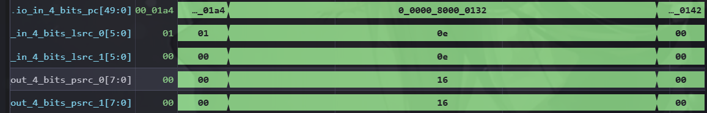

# 一条BEQ指令的简单分析过程

# 找到一条合适的`beq`指令

在source\-code/branch\-test\-riscv64\-xs\.txt中找到一条要分析的beq指令：


此处选择位于程序计数器（pc）地址 `0x80000132`的指令，其内容为 `00e70363`。单独分析这条指令，对照指令集手册：


人工解析指令的功能是：

当`a4`\(src1\)寄存器与`a4`\(src2\)寄存器相等的时候，进行跳转

由于a4寄存器的值必定和自己相等，因此可以确认本条指令会跳转到`PC+offset`，也就是`0x80000138`

# 2\.整体运行流程梳理

本篇文章的测试版本为`kuminghu-v2`


整体运行流程如下

```YAML
前端产生已展开指令
        |
        v
Decode：识别 BEQ，生成
        srcType=reg/reg
        fuType=brh
        fuOpType=BRUOpType.beq
        rfWen=false
        |
        v
Rename：逻辑 rs1/rs2
        -> 物理 psrc0/psrc1
        不分配整数 pdest
        分配 ROB index，读取/更新整数 RAT
        |
        v
Dispatch：根据 fuType=brh
          选择支持分支执行的 Integer IQ
          同时生成 ROB enqueue request
        |
        +--> ROB：保存 BEQ 的 robIdx、完成状态和控制信息
        |
        v
Issue Queue：等待
             两个物理整数源 ready
             分支执行端口可用
             BEQ 未被 flush
        |
        v
DataPath：读取整数物理寄存器
          必要时选择 bypass/forward 数据
        |
        v
ExuBlock / ExeUnit：将 BEQ uop 送入 BranchUnit
        |
        v
BranchUnit：
        读取 src1、src2、PC、B 型立即数
        使用 fuOpType=beq 进行相等比较
        |
        +--> taken = (src1 == src2)
        |
        +--> 计算实际目标地址
        |       taken：PC + sign-extended immediate
        |       not-taken：顺序下一条 PC
        |
        +--> 比较预测结果 pred_taken
                |
                +--> pred_taken == taken
                |       |
                |       v
                |   mispredict=0
                |   BEQ 正常完成
                |   向 ROB 报告完成
                |
                +--> pred_taken != taken
                        |
                        v
                    mispredict=1
                    生成 redirect
                    携带 robIdx、fullTarget、
                    flushAfter 和 cfiUpdate
                        |
                        v
                RedirectGenerator：
                汇总多个 redirect 请求
                按 ROB 年龄选择恢复请求
                        |
                        v
                CtrlBlock：
                向后端广播 redirect / flush
                        |
        +---------------+----------------+
        |                                |
        v                                v
ROB：清除 BEQ 之后的年轻 entry       Issue Queue / ExeUnit：
    保留产生 redirect 的 BEQ          清除错误路径上的年轻 uop
        |                                |
        v                                v
Rename / FreeList：恢复重命名状态     Dispatch / DataPath：
    回收错误路径分配的资源             阻止错误路径继续传播
                        |
                        v
                正确路径重新进入后端
                        |
                        v
                ROB head 满足提交条件
                        |
                        v
                Commit：
                BEQ 按程序顺序提交
                释放 ROB 项
                BEQ 不写整数目的寄存器
```

# 3\.Decode

在`decodestage.scala`中声明`DecodeWidth`\(6\)个译码器，在观察`DdecodeUnit.scala`中的输入输出端口，decoder接受来自前端的`StaticInst`，解码完成后给重命名模块传输`DecodedInst`


波形文件中查看decodeUnit的相关波形：


通过波形获得以下信息：

- 两个源操作数均为0x0e，即反汇编文件中提到的`a4`寄存器

- `fuType`为`002`，根据`futype.scala`中独热码编码的信息，得出其使用`brh`作为功能单元

- `fuOpType`为000，根据bru的optype信息得知其为beq指令


## 4\.Rename

### 4\.1 为什么需要重命名


BEQ 的汇编形式为：

```Plain Text
beq rs1, rs2, offset
```

BEQ 读取两个整数源寄存器，但不写回整数目的寄存器。Rename 仍然需要为它建立动态指令身份和物理源寄存器编号。后续 Issue Queue、BusyTable 和 BranchUnit 都使用物理寄存器编号，而不是直接使用 `rs1`、`rs2`。

### 4\.2 读取整数 RAT

Rename 通过整数 RAT \(renametable\)查询 `lsrc(0)` 和 `lsrc(1)`：

```Plain Text
逻辑 rs1 ──► intReadPorts(0) ──► psrc(0)//16
逻辑 rs2 ──► intReadPorts(1) ──► psrc(1)//16
```

波形：



对应的 Rename 代码为：

```Scala
uops(i).psrc(0) := Mux1H(
  uops(i).srcType(0)(2, 0),
  Seq(io.intReadPorts(i)(0), io.fpReadPorts(i)(0), io.vecReadPorts(i)(0))
)

uops(i).psrc(1) := Mux1H(
  uops(i).srcType(1)(2, 0),
  Seq(io.intReadPorts(i)(1), io.fpReadPorts(i)(1), io.vecReadPorts(i)(1))
)
```

BEQ 的两个 `srcType` 都是 `SrcType.reg`，所以这里会选择整数 RAT 的读结果。

### 4\.3 目的寄存器和 ROB 编号

BEQ 的译码结果中 `rfWen=false`。Rename 通过 `needDestReg(Reg_I, x)` 判断是否需要整数目的物理寄存器：


因此对 `BEQ`，`needIntDest = false`，不从 `intFreeList `申请 `pdest`

但 BEQ 仍然需要 ROB 编号。Rename 根据当前 ROB 头指针，为动态 uop 填写 `robIdx`：


此时 ROB 表项还没有真正写入，实际入队请求由 Dispatch 产生。

### 4\.4 Rename 输出

`Rename` 输出为：


阅读`DynInst`中的`rename`部分，相比于译码阶段，多了以下数据：源寄存器状态`srccState`,源操作数依赖关系`srcLoadDepndency`,源操作数对应的物理寄存器`psrc`，物理目标寄存器`pdest`


## 5\.Dispatch：同时送往 ROB 和整数 Issue Queue

`Dispatch `接收 `Rename `产生的 `DynInst`，然后生成两路请求：一路进入 `ROB`，一路进入整数 `Issue Queue`。

```Plain Text
+--> ROB entry
Rename -> Dispatch ------+
                         +--> Integer Issue Queue
```

### 5\.1 向 ROB 发出入队请求

源码位置：`backend/dispatch/NewDispatch.scala`。

对应代码为：


只有 `fromRename.fire` 成立时，Dispatch 才会向 ROB 产生有效入队请求。

从上述代码可以得到，由`dispatch`发送给`ROB`的信息为`updatedUop`,`updatedUop`即为rename部分生成`的DynInst`


### 5\.2 进入哪个 Issue Queue

通过阅读`Parameters.scala`中关于`issueBlockParams`的部分，得知dispatch会通过BrhCfg来判断要发送的队列，而`BrhCfg`是通过`FuType.brh`来辨识的，在译码部分中得知`beq`指令的`FuType`为`brh`，因此最终会发送给前三个含有`brh`配置的发射队列中。


若多个队列都能接收，`issueQueueCount`记录了每个发射队列中的资源占用情况，在根据一个比较矩阵将可用的发射队列进行排序，最后通过排序结果来选出最空闲的发射队列，进行分配。


`uopSelIQ` 保存队列选择结果，`uopSelIQMatrix` 计算同一 IQ 内的入队序号，`IQSelUop` 形成送往 Issue Queue 的动态指令。

### 5\.3 Dispatch 阶段读取整数 BusyTable

Dispatch 使用 Rename 产生的 `psrc(0)`、`psrc(1)` 查询整数 BusyTable：


对本条 BEQ，查询地址可以表示为：`intBusyTable[p22]`

BusyTable 返回的 ready 状态会写入 Issue Queue entry 的 `srcState`：

```Plain Text
srcState(0) = 1：p22 已经 ready
```

如果源物理寄存器仍然 `busy`，`Issue Queue` 等待后续 `wakeup`。

### 5\.4 Dispatch 输出与握手

Dispatch 的输入和输出使用 `DecoupledIO`：

```Plain Text
fromRename.fire = fromRename.valid && fromRename.ready
toIssueQueues.fire = toIssueQueues.valid && toIssueQueues.ready
```

ROB 接收条件由 `io.enqRob.canAccept` 表示；`Issue Queue` 接收条件由对应入队端口的 `ready` 表示。任一资源不足，`Dispatch `都会对 `Rename`形成背压。

## 6\.Issue Queue：等待、唤醒并乱序发射

### 6\.1 Issue Queue 保存的 BEQ 信息

Issue Queue entry 保存：

```Plain Text
psrc(0) = p22
psrc(1) = p22
srcState = 0
fuType = FuType.brh
fuOpType = BRUOpType.beq
robIdx
```

它不执行相等比较，只负责保存 uop、跟踪源状态并参与发射选择。

波形：


### 6\.2 源操作数唤醒

源操作数有两种方式变为 ready：

1. Dispatch 查询 BusyTable 时已经 ready；

2. BEQ 入队后，Issue Queue 收到匹配 `pdest` 的 wakeup。

概念上的匹配条件为：

```Plain Text
wakeup.valid
&& wakeup.bits.pdest == entry.psrc(i)
&& wakeup 对应寄存器类型为 Int
```

当两个源均 ready 且分支执行资源可用时，Scheduler 才能选择 BEQ。

### 6\.3 发射事件

根据发射阶段得到的robidx找到波形位置：


发射路径为：

```Plain Text
Issue Queue
    ↓
Scheduler
    ↓
ExuBlock / ExeUnit
    ↓
BranchUnit
```

发射时需要同时保持 BEQ 的源数据、`fuOpType`、`robIdx` 和预测信息，避免控制字段与数据字段错配。

## 7\.DataPath：读取整数源并送入 BranchUnit

DataPath 根据执行单元的读端口配置，为 BEQ 选择整数物理寄存器数据。若源生产者刚刚完成，数据可以通过 bypass/forward 路径提供给 BranchUnit。

```Plain Text
p22
   ↓
IntRegFile / bypass / forward
   ↓
src(0)、src(1)
```


从波形可以看出这里的dataSources为1，阅读源码可知其选择了forward作为读取路径


## 8\.BranchUnit：计算实际方向和目标地址

源码位置：`backend/fu/wrapper/BranchUnit.scala`、`backend/fu/Branch.scala`。

### 8\.1 BEQ 的实际条件

阅读`Branch.scala` 中 BEQ 的条件判断，发现结果为`!xor.orR`，即`src1^src2`均为0，也就是每一位都相等的时候进行跳转


因此：

```Plain Text
src1 == src2  -> taken = 1
src1 != src2  -> taken = 0
```

### 8\.2 预测结果比较

BranchUnit 同时接收预测的 taken 信息，再根据实际计算出的跳转信息taken决定下一个pc路径：


| `pred_taken` | `taken` | 处理                     |
| ------------ | ------- | ------------------------ |
| 0            | 0       | 预测正确，按顺序执行     |
| 1            | 1       | 预测正确，继续目标路径   |
| 0            | 1       | 预测错误，恢复到分支目标 |
| 1            | 0       | 预测错误，恢复到顺序 PC  |

### 8\.3 目标地址

实际 `taken `时，`BranchUnit `使用分支 `PC` 和符号扩展后的 B 型立即数计算目标；实际 `not-taken` 时使用顺序下一条 PC。

波形位置：


根据波形可以看到这次的目标地址是`8000_0138`，和反汇编文件中一致。由于`pred_taken`为0，实际`taken`为1，产生`mispredict`，需要进行Redirect恢复\.


## 9\.Redirect：生成恢复请求

`BranchUnit `的 `redirect`有效条件包含执行结果`io.out.valid`有效和预测错误`mispredict`：


redirect 携带：

```Plain Text
robIdx
fullTarget // 完整的跳转地址
level = RedirectLevel.flushAfter // Flush范围
cfiUpdate // 控制流信息
```

波形：


## 10\.Flush：按 ROB 年龄清除错误路径

Redirect 经过 `RedirectGenerator` 和 `CtrlBlock` 后，传播到后端各个需要恢复的模块。

```Plain Text
BranchUnit
    ↓
RedirectGenerator
    ↓
CtrlBlock
    ├── ROB
    ├── Rename / FreeList
    ├── Dispatch
    ├── Issue Queue
    ├── ExeUnit
    └── DataPath
```

`flushAfter` 表示保留产生 redirect 的 BEQ，清除它之后的年轻指令。它不是清空整个 ROB。

### 10\.1 ROB 的处理

相关源码位于：`backend/rob/Rob.scala`

在收到redirect信号后，通过这部分代码来确认回滚范围。

其中，先通过重定向指令的rob索引`robIdx`与rob下一项要提交的位置`deqPtrVec_next(0)`确认重定向的距离

再通过`flushItself()`来决定是否清楚分支指令本身。通过上文的`level = RedirectLevel.flushAfter`可知道本条beq指令会进行保留。


```Plain Text
older instruction：保留
BEQ：保留
younger instruction：清除
```

### 10\.2 Issue Queue 和 ExeUnit 的处理

发送给后端其余模块的`flush`信号在`CtrlBlock`中产生，由`redirect`信号生成：


尚未发射的错误路径 BEQ 后继指令在 Issue Queue 中被清除；已经进入执行流水线但比 BEQ 年轻的 uop 根据 `robIdx.needFlush` 被取消。

以issue queue为例子，波形如下，可以观察到flush产生后issuequeue的valid置0，并冲刷了其余信息


### 10\.3 Rename的处理

错误路径指令可能已经更新推测 RAT 或申请物理寄存器。恢复逻辑需要撤销这些年轻状态，恢复到 BEQ 对应的推测边界，并回收错误路径分配的物理寄存器。

当`rename`接收到`redirect`时候，若有可用快照`useSnpt`则恢复到快照状态，否则恢复到架构RAT\(已提交的状态\)。


## 11\. ROB 完成与提交

BEQ 没有整数目的寄存器，因此没有整数写回数据；但 ROB 仍需记录它的完成状态。

```Plain Text
BranchUnit 完成
    ↓
ROB 对应 entry 标记完成
    ↓
等待更老指令
    ↓
ROB head
    ↓
BEQ 按程序顺序提交
```

预测正确时，BEQ 完成后正常提交。预测错误时，BEQ 作为 `flushAfter` 边界保留，年轻错误路径被清除；恢复后的正确路径重新进入后端。

## 12\. 关键代码索引

| 阶段        | 源码位置                                    | 重点内容                                      |
| ----------- | ------------------------------------------- | --------------------------------------------- |
| Decode 字段 | `backend/Bundles.scala`                     | `DecodedInst.allSignals`、`decode()` 字段连接 |
| BEQ 译码表  | `backend/decode/DecodeUnit.scala`           | `BEQ -> XSDecode(...)`                        |
| Rename      | `backend/rename/Rename.scala`               | RAT 读端口、`psrc`、`robIdx`、FreeList 请求   |
| Dispatch    | `backend/dispatch/NewDispatch.scala`        | IQ 选择、BusyTable、ROB 入队、背压            |
| Issue Queue | `backend/issue/IssueQueue.scala`            | uop 保存、wakeup、发射选择                    |
| DataPath    | `backend/datapath/DataPath.scala`           | 整数寄存器读取、bypass/forward                |
| BranchUnit  | `backend/fu/wrapper/BranchUnit.scala`       | redirect 和目标地址                           |
| Branch      | `backend/fu/Branch.scala`                   | `taken` 和 `mispredict`                       |
| Redirect    | `backend/ctrlblock/RedirectGenerator.scala` | redirect 汇总和年龄选择                       |
| Flush       | `backend/ctrlblock/CtrlBlock.scala`         | redirect 广播和恢复控制                       |
| ROB         | `backend/rob/Rob.scala`                     | 完成、提交和年轻指令清除                      |

阅读这条 BEQ 时，建议始终用同一个 `robIdx` 连接波形中的 Rename、Dispatch、Issue、BranchUnit、redirect 和 ROB 事件。


