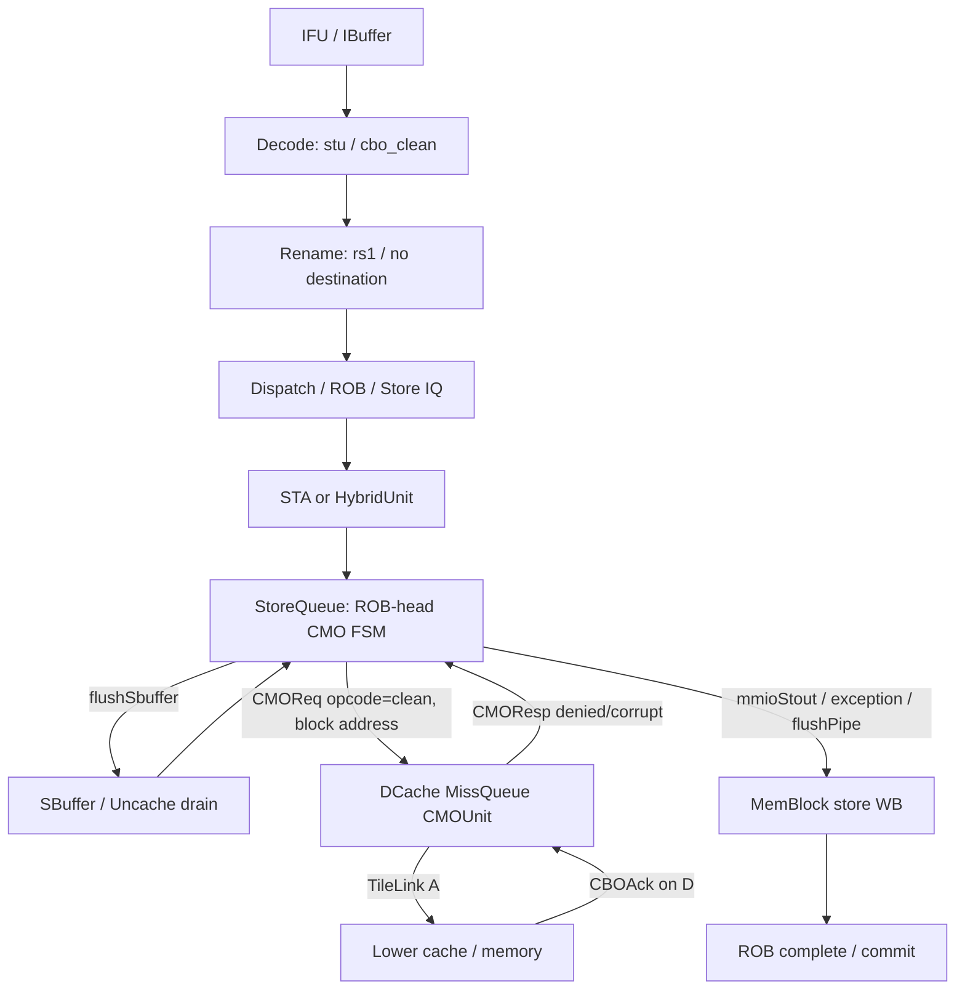

# CBO.CLEAN 指令执行生命周期

## 📋 基本信息

| 字段 | 内容 |
|---|---|
| **指令名称** | `cbo.clean rs1` |
| **编码格式** | CBO 指令使用 `opcode=0001111`、`funct3=010`、`rs1` 地址源和 `rd=00000`；`cbo.clean` 的本地 CMO 子操作编码为 `LSUOpType.cbo_clean = 0b1100`。具体指令匹配常量见 [DecodeUnit.scala][D] 与 [package.scala][OP] |
| **RISC-V 扩展** | `Zicbom`；本地构建还由 `HasCMO` 和 CSR 的 `cboCF` 能力控制 |
| **是否有压缩格式** | 无 C 扩展压缩编码；CBO 指令本身是 32 位指令，前端仍可从启用 C 扩展的半字窗口中取出 |
| **指令分类** | 缓存块管理 / CMO / clean |
| **FuType** | `FuType.stu` |
| **FuOpType** | `LSUOpType.cbo_clean` |
| **目标 FU** | Store 地址路径 → StoreQueue CMO 状态机 → DCache `CMOUnit` → TileLink CBO 请求 |
| **分析日期** | 2026-09-06 |

**语义边界。** `cbo.clean` 请求以 `rs1` 给出的地址定位一个 DCache cache block，将该块的脏数据按 CMO 路径向下层写回／清理，但不使该块失效；它不产生 GPR 写回，也不是普通 store。当前本地实现把它作为 `FuType.stu` 处理，并在 StoreQueue 中等到 ROB 头部、写缓冲排空后才向 DCache CMO 接口发请求。本文以本地 `/nfs/home/wanghao/emuByYuan/stable-kmh-v2` 源码为唯一实现依据；没有把现有报告中的截图周期当作本次源码已经证明的实测值。

---

## 1. 前端路径

### 1.1 取指

| 阶段 | 延迟 | 关键行为 | 代码位置 |
|---|---|---|---|
| ICache/MainPipe | 可变 | 通过 ICache 返回取指块；等待响应、跨块和前端背压 | [ICacheMainPipe.scala][IC]、[IFU.scala][IF] |
| IFU F0 | 请求握手 | `fromFtq.req.fire` 接收 FTQ 请求，受 `f1_ready && icacheReady` 限制 | [IFU.scala][IF] 241–263 行 |
| IFU F1 | 通常下一拍 | 保存 FTQ 请求并推进到 F2，条件为 `f1_valid && f2_ready` | [IFU.scala][IF] 291–304 行 |
| IFU F2 | 通常再下一拍，可等待 | 等待 ICache 数据，完成指令切分和预译码输入 | [IFU.scala][IF] 357–385、517 行附近 |
| IFU F3 | 通常再下一拍，可等待 | 经过 PredChecker 后向 IBuffer 发送，要求 `io.toIbuffer.fire` | [IFU.scala][IFO] 953–969 行 |

> **前端流水线总延迟（无冲刷）：** 在 ICache 响应及时、无 IBuffer 背压和无错误预测校正时，`f0_fire` 到 `f3_fire` 是 3 个周期间隔；它不包含 IBuffer 等待和后端等待。

### 1.2 预译码

| 项目 | 内容 |
|---|---|
| **brTable 匹配** | `cbo.clean` 是非控制流指令，预译码表默认给出 `BrType.notCFI`；不产生分支预测目标 |
| **PreDecodeInfo 字段** | 有效项为 `valid=1`、`isRVC=0`、`brType=BrType.notCFI`、`isCall=0`、`isRet=0`；字段定义见 [PreDecode.scala][PD] |
| **是否有专用检测逻辑** | 没有前端 CBO 专用预译码；CBO 语义在后端 DecodeUnit 识别 |
| **跳转偏移计算** | `jal_offset`/`br_offset` 组合逻辑仍对窗口计算，但 `notCFI` 不会把本条 CBO 当作跳转 |

### 1.3 PredChecker 校验

| 项目 | 内容 |
|---|---|
| **是否触发 remaskFault** | 本条自身不满足 JAL/JALR/RET 条件；同一取指块更早的控制流指令仍可能触发 remask |
| **是否触发 mispredict** | 正常预测不触发；若预测器对非 CFI 位置错误置 taken，会命中 `notCFITaken` |
| **是否产生 wbRedirect** | CBO 语义不产生 redirect；错误的非 CFI 预测仍可经 PredChecker 的 fault 路径纠正 |
| **fixedRange 影响** | 本条不主动截断取指范围，但会受同一窗口中更早 remask fault 的 `fixedRange` 截断 |

PredChecker 的非 CFI 检测在 [PreDecode.scala][PC] 389–395 行，取指送入 IBuffer 时由 [IFU.scala][IFO] 959 行以 `fixedRange & f3_instr_valid` 产生 `enqEnable`。

### 1.4 IBuffer 入队

| 项目 | 内容 |
|---|---|
| **入队宽度** | `PredictWidth=FetchWidth*(HasCExtension ? 2 : 1)`；本地默认 `FetchWidth=8`，启用 C 时为 16 个半字候选位置，不等于每拍 16 条 CBO |
| **是否可能被挡** | 是；`io.in.ready=allowEnq`，接近容量上限时停止接收 |
| **携带的关键信息** | 指令、PC、FTQ 指针和 offset、预译码信息、取指异常、backend exception、trigger 等 |
| **代码位置** | [IBuffer.scala][IB] 227–233、305 行；[Parameters.scala][P] 80、147–150、658–659 行 |

---

## 2. 后端路径

### 2.1 译码

| 项目 | 内容 |
|---|---|
| **DecodeWidth** | 默认 6，见 [Parameters.scala][P] 149 行 |
| **简单/复杂译码** | 普通标量访存／Store 译码；不属于 AMOCAS 等复杂拆分类型 |
| **译码延迟** | 译码表组合匹配；不将组合逻辑误写成端到端零延迟 |
| **关键译码结果** | `fuType=FuType.stu`、`fuOpType=LSUOpType.cbo_clean`、`srcType(0)=reg`、第二源为 `DC`、`selImm=IMM_S`、无整数写回；表项位于 [DecodeUnit.scala][D] 478–481 行 |
| **异常控制** | `HasCMO` 未启用或 CSR `illegalInst.cboCF` 置位时产生 `illegalInstr`；CSR `virtualInst.cboCF` 置位时产生 `virtualInstr`，见 [DecodeUnit.scala][EX] 894–933 行 |

```scala
CBO_CLEAN -> XSDecode(
  SrcType.reg, SrcType.DC, SrcType.X,
  FuType.stu, LSUOpType.cbo_clean, SelImm.IMM_S
)
```

### 2.2 重命名

| 项目 | 内容 |
|---|---|
| **RenameWidth** | 默认 6 |
| **延迟** | 受 RAT、空闲物理寄存器和下游 ready 影响；不为 CBO 伪造固定拍数 |
| **源操作数** | 一个整数地址源 `rs1`；立即数由 `IMM_S` 解码，但 CBO clean 的 cache-block 地址最终由访存路径使用 |
| **目标操作数** | 无 GPR 目标，不分配整数目标物理寄存器 |
| **特殊处理** | 仍必须分配 ROB 表项并跟踪 `robIdx`；不能因为“无写回”而跳过 ROB |
| **代码位置** | [Rename.scala][R] 385–404 行；[Bundles.scala][B] 的 `srcType/dstType/robIdx` 字段 |

### 2.3 派发

| 项目 | 内容 |
|---|---|
| **DispatchWidth** | 由默认 `RenameWidth=6` 决定输入组宽度 |
| **延迟** | 可变；受 ROB、Store/STA IQ 和序列化门控影响 |
| **目标 ROB** | `fromRename.fire` 后写入 ROB；CBO 后续必须在 ROB 头部执行 |
| **目标 Issue Queue** | `FuType.stu` 进入 Store/STA 相关调度路径；不是普通 ALU 或专用 CMO Issue Queue |
| **LSQ 分配** | CBO 作为 `FuType.stu` 进入 StoreQueue 的记录和地址有效流程，但不会沿普通 Store 的数据写入、SBuffer drain 后直接写 Cache 的路径完成；其 ROB 头处理改走 `cmoOpReq` |
| **特殊顺序要求** | StoreQueue 在 `deqCanDoCbo` 条件下才开始 CMO 请求；该条件要求 ROB 头、地址有效、已分配且无异常，并由 `memBackTypeMM` 过滤 |
| **代码位置** | [NewDispatch.scala][DIS] 668–700、822–829 行；[StoreQueue.scala][SQ] 983–985 行 |

### 2.4 发射

| 项目 | 内容 |
|---|---|
| **Issue Queue 类型** | Store/STA 调度队列；CBO 的地址源必须就绪 |
| **唤醒条件** | `rs1` 可读、STA FU 可接收、ROB/IQ 资源可用；完成后交给 StoreUnit/HybridUnit 地址阶段 |
| **选择策略** | 受 IssueQueue 的 `canIssue`、端口能力、FU busy 和 age 选择逻辑控制；不能简化为无条件 oldest-first |
| **最小延迟** | 源码没有证明从 IQ 出队到 StoreQueue ROB 头可执行的固定拍数 |
| **最大延迟** | 资源、前序提交、TLB/PMP 和 StoreQueue 状态可能使等待无固定上界 |
| **代码位置** | [IssueQueue.scala][IQ] 420–490 行；[HybridUnit.scala][HU] 的 `s1/s2` 地址和权限阶段 |

### 2.5 执行

| 项目 | 内容 |
|---|---|
| **执行单元** | Store/Hybrid 地址执行 → StoreQueue CMO 状态机 → DCache `CMOUnit` |
| **流水/阻塞** | CBO 位于 `FuType.stu`，其后端完成不是普通一拍 Store WB；必须等待 ROB 头、写缓冲 drain 和 CMO 响应 |
| **执行延迟** | `UncertainLatency` 语义：受地址翻译、PMP/PMA/PBMT、SBuffer、DCache CMO、TileLink A/D 往返和 output backpressure 影响 |
| **FSM 状态机** | StoreQueue 的 `s_idle/s_req/s_resp/s_wb/s_wait` 五状态；DCache CMOUnit 另有四状态 |
| **关键输出信号** | `flushSbuffer.valid`、`cmoOpReq.valid/opcode/address`、`cmoOpResp.valid/denied/corrupt`、`mmioStout.valid`、`uop.flushPipe` |
| **代码位置** | [StoreQueue.scala][SQ] 818–890、983–1058 行；[MissQueue.scala][CMO] 299–371 行；[MemBlock.scala][MB] 1204–1205 行 |

**StoreQueue 状态机：**

| 状态 | 持续条件 | 输出信号 | 次态转换条件 |
|---|---|---|---|
| `s_idle` | 没有正在处理的 MMIO/CMO 项 | 等待 `rob.pendingst` 对应的 ROB 头项 | 头项满足 pending、allocated、datavalid、addrvalid、无异常 → `s_req` |
| `s_req` | 等待写缓冲排空或发送 CMO 请求 | 未排空时 `flushSbuffer.valid=1`；排空且 `cmoOpReq.fire` 后发送 CMO | `io.flushSbuffer.empty` → `cboFlushedSb=1`；`cmoOpReq.fire` → `s_resp` |
| `s_resp` | 等待 DCache `CMOUnit` 响应 | `cmoOpResp.ready=1` | `cmoOpResp.fire`，记录 denied/corrupt → `s_wb` |
| `s_wb` | CMO 已完成，等待向 ROB 返回执行结果 | `mmioStout.valid=1`，并将 `uop.flushPipe := deqCanDoCbo` | `mmioStout.fire`：有异常 → `s_idle`，否则 → `s_wait` |
| `s_wait` | 等待 ROB 提交 | 无新的 CMO 请求 | `scommit>0` → `s_idle` |

**DCache CMOUnit 状态机：** `s_idle` 接收 CMO，`s_sreq` 发 TileLink A 通道请求，`s_wresp` 等 CBOAck/D 通道响应，`s_lsq_resp` 向 StoreQueue 返回 `CMOResp`。`req.ready` 只在 idle 有效；A 请求被 WFI 禁止时保持等待；D 响应中的 `denied/corrupt` 被保存后返回。

```scala
io.req_chanA.bits := edge.CacheBlockOperation(
  fromSource = (cfg.nMissEntries + 1).U,
  toAddress = req.address,
  lgSize = (log2Up(cfg.blockBytes)).U,
  opcode = req.opcode
)._2
```

`cbo.clean` 的 `CMOReq.opcode=0`，地址由 StoreQueue 的 `get_block_addr(paddr)` 得到；DCache CMOUnit 使用 `blockBytes` 对齐大小创建 CacheBlockOperation。该路径不是普通 `M_XWR` uncache store：StoreQueue 先关闭普通 uncache 请求，再使用 `cmoOpReq`。

### 2.6 写回

| 项目 | 内容 |
|---|---|
| **写回端口** | StoreQueue 的 `mmioStout` 连接 MemBlock 的 store writeback 路径；不占用整数 PRF 写端 |
| **是否写回** | 不写 GPR/FP/Vec 架构寄存器；写回的是 Store/CMO 完成状态、异常向量和 `sqIdx` 等执行结果 |
| **写回延迟** | 从 `cmoOpResp.fire` 到 `mmioStout.fire` 还要经过 `s_wb` 的 ready；若写回端口被阻塞则可变 |
| **错误处理** | `denied` 转 `storeAccessFault`；`corrupt && !denied` 转 `hardwareError` |
| **代码位置** | [StoreQueue.scala][SQ] 867–885、1050–1064 行；[MemBlock.scala][MB] 1356–1363 行 |

### 2.7 提交

| 项目 | 内容 |
|---|---|
| **CommitWidth** | 默认 `CommitWidth=8`、`RobCommitWidth=8` |
| **提交条件** | CMO 必须先完成并向 ROB 写回；随后仍由 ROB 头部正常提交，异常则走通用异常路径 |
| **是否触发 flush** | `cbo.clean` 的完成 uop 设置 `flushPipe`，源码注释说明这是为了保持 CMO 顺序；这不是分支错误 redirect，而是提交前的顺序化流水线 flush 请求 |
| **是否触发 redirect** | 正常 clean 不产生分支目标 redirect；`flushPipe` 可能触发 ROB 的通用 flush/恢复控制，具体是否形成前端 redirect 取决于 ROB 当前状态 |
| **代码位置** | [StoreQueue.scala][SQ] 1053–1058 行；[Rob.scala][ROB] 619–635 行 |

---

## 3. 信号前递

### 3.1 前递路径图



### 3.2 信号清单

| 信号名 | 方向 | 位宽 | 语义 | 持续方式 |
|---|---|---|---|---|
| `io.cmoOpReq.valid/ready` | StoreQueue ↔ DCache | 各 1 | CMO 请求握手 | Decoupled，`fire=valid&&ready` |
| `cmoOpReq.bits.opcode` | StoreQueue → DCache | 3 | `0=clean`、`1=flush`、`2=inval`、`3=zero` | 请求握手时采纳 |
| `cmoOpReq.bits.address` | StoreQueue → DCache | `PAddrBits` | 已按 cache block 对齐的物理地址 | 请求 payload |
| `CMOUnit.req_chanA.valid/ready` | CMOUnit ↔ TileLink | 各 1 | 发送 CacheBlockOperation | Decoupled |
| `CMOUnit.resp_chanD.valid/ready` | TileLink ↔ CMOUnit | 各 1 | 接收 CBOAck、denied、corrupt | CMOUnit 仅在 `s_wresp` ready |
| `io.cmoOpResp.valid/ready` | DCache ↔ StoreQueue | 各 1 | 返回地址、nderr、denied、corrupt | Decoupled |
| `flushSbuffer.valid/empty` | StoreQueue ↔ MemBlock/SBuffer | 各 1 | CMO 前排空 store buffer | 请求为电平，empty 为状态 |
| `mmioStout.valid/ready` | StoreQueue ↔ MemBlock | 各 1 | CMO 完成/异常写回 | Decoupled，保持到 fire |
| `uop.flushPipe` | StoreQueue → ROB | 1 | CMO 完成时请求顺序化流水线 flush | 随 writeback uop 携带 |
| `cmoOpResp.bits.denied/corrupt` | DCache → StoreQueue | 各 1 | 下层拒绝或数据/协议损坏 | 响应寄存后保持到 fire |

`CMOResp.nderr` 在当前 StoreQueue 片段中不是主要异常选择条件；源码显式使用 `denied` 和 `corrupt` 生成 `storeAccessFault`/`hardwareError`。不能把 `nderr` 自动等同为异常。

---

## 4. 周期计算

### 4.1 流水线延迟分解

| 阶段 | 固定/可变 | 周期数 | 说明 |
|---|---|---|---|
| Decode | 组合 | 0（组合逻辑） | 不代表从 IBuffer 到 Decode 的握手间隔固定 |
| Rename | 可变 | `T_rename` | 无目标寄存器，但仍受 RAT/ROB/下游 ready 影响 |
| Dispatch/Issue | 可变 | `T_dispatch+T_issue` | 等待 Store IQ、地址源和 ROB 条件 |
| ROB-head wait | 可变 | `T_head` | CMO 只有到 ROB 头、无异常且地址有效才进入 `deqCanDoCbo` |
| SBuffer drain | 可变 | `T_drain` | `flushSbuffer.empty` 之前不能发 CMO |
| CMO request | 可变 | `T_cmo_req` | 等 DCache CMOUnit idle、A 通道 ready 和 WFI 解除 |
| Lower response | 可变 | `T_cmo_resp` | TileLink D 通道 CBOAck 返回；下层延迟不由本模块限定 |
| Writeback | 可变 | `T_wb` | 等 `mmioStout.ready` |
| Commit/flush | 可变 | `T_commit` | ROB 提交和 `flushPipe` 顺序化；不与 CMO 响应混为同一事件 |
| **合计** | 可变 | `T_total` | 不存在源码证明的固定端到端周期 |

### 4.2 公式

$$T_{total}=T_{decode}+T_{rename}+T_{dispatch}+T_{issue}+T_{head}+T_{drain}+T_{cmo\_req}+T_{cmo\_resp}+T_{wb}+T_{commit}$$

公式用于分段记录事件间隔。`T_cmo_req` 不等于 A 通道发送拍，`T_cmo_resp` 也不等于 D 通道收到拍；两者要分别记录 `cmoOpReq.fire`、`resp_chanD.fire`、`cmoOpResp.fire`。若 StoreQueue 因异常在 `s_wb` 直接回收，则成功路径公式不适用。

### 4.3 最佳/最差情况

| 场景 | 周期数 | 条件 |
|---|---|---|
| **最佳** | 仍为可变，至少包含 StoreQueue/DCache FSM 状态推进 | 指令已经到 ROB 头、地址有效、SBuffer 已空、CMOUnit 空闲、A/D 通道均及时握手、写回 ready |
| **典型** | 无匹配波形，不能给绝对值 | 可能经历一个或多个 StoreQueue 等待周期以及一次下层 CBOAck 往返 |
| **最差** | 无源码给出的有限上界 | ROB 前有长时间阻塞、SBuffer 长时间 drain、MissQueue/TileLink 背压、WFI、下层拒绝或 output backpressure |

### 4.4 时序图

以下是源码约束下的示意，不是具体仿真周期：

```text
事件沿          C0       ...       Ch       Ch+1       ...       Cd       ...       Cw       Cc
ROB head        等待                 1
StoreQueue      s_idle               s_req                 s_resp             s_wb      s_wait/idle
flushSbuffer    可能请求            empty=1
cmoOpReq.fire                         1
TileLink A                                                1
TileLink CBOAck                                                   1
cmoOpResp.fire                                                        1
mmioStout.fire                                                                      1
ROB commit                                                                                      1
```

```wavedrom
{ "signal": [
  { "name": "StoreQueue", "wave": "3...4.5...6...7..8", "data": ["head wait", "s_req", "s_resp", "s_wb", "s_wait"] },
  { "name": "CMO request", "wave": "0...1...........0" },
  { "name": "CBOAck/response", "wave": "0........1......0" },
  { "name": "writeback", "wave": "0...........1....0" }
] }
```

---

## 5. 异常与特殊处理

### 5.1 异常检测

| 异常类型 | 检测位置 | 检测条件 | 处理方式 |
|---|---|---|---|
| 非法指令 | DecodeUnit | `!HasCMO` 或 CSR `illegalInst.cboCF` | 设置 `illegalInstr`，不进入有效 CMO 请求 |
| 虚拟指令 | DecodeUnit | CSR `virtualInst.cboCF` | 设置 `virtualInstr`，由特权/虚拟化路径处理 |
| 取指 PF/AF/GPF/非法压缩 | IBuffer/Decode | 前端异常随 uop 携带 | ROB 头异常处理，跳过正常 CMO |
| 地址翻译／Store 权限异常 | Store/Hybrid 路径 | `rs1` 翻译失败、PMP/PMA/PBMT 不允许 | 置 store 异常，`deqCanDoCbo` 被禁止 |
| CMO 被下层拒绝 | CMOUnit/StoreQueue | `CMOResp.denied` | `storeAccessFault`，在 `mmioStout` 写回异常 |
| CMO 响应损坏 | CMOUnit/StoreQueue | `CMOResp.corrupt && !denied` | `hardwareError`，不作为成功 clean 提交 |
| WFI | CMOUnit | `wfiReq` 有效 | 禁止 A 通道 CMO 请求，报告 `wfiSafe` 条件 |

**边界分析。** CBO clean 操作按 cache block 地址发送，而不是把一个跨边界请求拆成多个普通数据访问：

| 边界场景 | 源码可证明的行为 |
|---|---|
| 页内、cache line 内的对齐地址 | Store/Hybrid 完成翻译与权限后，StoreQueue 对物理地址执行 `get_block_addr`，向 CMOUnit 发一次 block operation |
| 页边界附近地址 | 地址翻译和权限检查先于 CMO 请求；本模块没有把一条 CBO clean 拆成两个页请求。若地址本身不合法，异常阻止 `deqCanDoCbo` |
| Cache line 边界附近地址 | `CMOReq.address` 是一个 block 地址，DCache CMOUnit 使用 `lgSize=log2Up(blockBytes)`；源码没有跨两个 block 的合并语义 |
| MMIO/uncache 属性 | StoreQueue 通过 `memBackTypeMM` 和 Store/Hybrid 的 PMA/PBMT 判定进入 CMO；CBO 不走普通 `M_XWR` uncache 请求。若属性/权限不符合，转异常或由实现的地址属性路径处理 |

### 5.2 冲刷与重定向

| 触发条件 | 类型 | 影响范围 | 恢复方式 |
|---|---|---|---|
| 更老分支/异常在 CMO 发出前触发 redirect | 通用 redirect/kill | 未到 ROB 头的 CBO 及年轻指令 | 按 ROB/LSQ redirect 规则取消，不能产生 CMO 请求 |
| CBO 已到 ROB 头 | 顺序化 flush | CMO 前后的流水线和年轻指令 | `mmioStout.bits.uop.flushPipe := deqCanDoCbo`，由 ROB 通用 flush 控制保持顺序 |
| SBuffer 未空 | 局部阻塞 | 当前 CBO，不一定清空整个前端 | `flushSbuffer.valid` 保持到 `empty`，之后再发 CMO |
| TileLink A/D 通道背压 | CMO FSM stall | CMOUnit 当前事务 | `s_sreq` 或 `s_wresp` 保持，直到对应 fire |
| CMO denied/corrupt | 异常路径 | 当前 CBO 和年轻指令 | 在 `s_wb` 返回异常，ROB 头部按异常恢复 |

### 5.3 与其他指令的交互

| 交互场景 | 影响指令 | 行为 |
|---|---|---|
| 更老 Store 尚在 SBuffer | `cbo.clean` | 先请求 flush，等 `io.flushSbuffer.empty` 后再发 CMO |
| 更年轻 Load/Store | 年轻内存指令 | CMO 的 `flushPipe` 和 ROB 头规则防止其越过 CMO 观察到错误顺序 |
| `cbo.flush` | 同一 CMO 路径 | opcode 不同；clean 写回但保留缓存块，不能把 flush 的失效语义套给 clean |
| `cbo.inval` | 同一 CMO 路径 | opcode 不同；inval 的缓存保留语义不同，本文只分析 clean |
| `cbo.zero` | StoreQueue 特殊路径 | 可能产生多次写回／zero 操作，不能与 clean 的一次 CMOReq 状态机等同 |
| 普通 MMIO store | StoreQueue uncache 路径 | 普通 MMIO 使用 `M_XWR`；CBO clean 显式禁用该普通 uncache 请求并走 `cmoOpReq` |
| Fence/其他 flush-SB 操作 | MemBlock | MemBlock 断言不同 flush 请求不应同时有效；CMO 与 fence 的排空资源共享 |

---

## 6. 安全性分析

### 6.1 推测执行窗口

| 窗口 | 起始点 | 终止点 | 周期数 | 风险等级 |
|---|---|---|---|---|
| 前端窗口 | FTQ/IFU 取指 | redirect 或 IBuffer/后端拒绝 | 未测 | 可能产生前端微架构活动；不等于 CMO 已执行 |
| 后端等待窗口 | Decode/Dispatch | `deqCanDoCbo` 成立且进入 ROB 头处理 | 可变 | 通过 ROB 头、无异常和地址有效条件阻止过早 CMO |
| CMO 事务窗口 | `cmoOpReq.fire` | `cmoOpResp.fire` / 异常 | 可变 | 一旦下层接受请求，不能当作普通可撤销 ALU 操作；实现以顺序化和完成响应约束 |

### 6.2 侧信道暴露面

| 暴露面 | 类型 | 缓解措施 |
|---|---|---|
| StoreBuffer drain 时长 | 微架构时序 | CMO 等待写缓冲排空；这保证顺序但不提供常数时间 |
| Cache block 是否脏、下层响应时延 | Cache/互连时序 | clean 路径统一等待 CMO 响应；脏/干块和一致性状态仍可能造成可观测差异 |
| TileLink denied/corrupt | 错误状态 | 显式转异常，禁止把失败响应当作成功提交 |
| 前端错误路径 | BPU/ICache 状态 | 通用 redirect 恢复控制流；不能据此声称清除所有微架构侧信道 |

### 6.3 有序性保证

| 保证 | 机制 | 代码依据 |
|---|---|---|
| 更老 store 先于 clean 对外可见 | CMO 请求前等待 `flushSbuffer.empty` | [StoreQueue.scala][SQ] 1031–1035 |
| clean 只能在 ROB 头执行 | `deqCanDoCbo` 要求 pending ROB 项成为当前头部且无异常 | [StoreQueue.scala][SQ] 841–847、983–985 |
| CMO 请求与普通 uncache 请求不混用 | `deqCanDoCbo` 时禁用 `io.uncache.req.valid` | [StoreQueue.scala][SQ] 1006–1025 |
| 下层完成后才向 ROB 写回 | `cmoOpResp.fire → s_wb → mmioStout.fire` | [StoreQueue.scala][SQ] 1015–1019、1053–1058 |
| clean 与 flush/inval 语义分离 | CMO opcode 分别编码为 0/1/2 | [DCacheWrapper.scala][CW] 619–627 |

这些是该本地实现的控制路径保证；它们不替代对整个 RVWMO、I/O 域和多核一致性协议的形式化验证。

---

## 7. 性能特征

| 指标 | 值 | 说明 |
|---|---|---|
| **执行吞吐** | 单个 StoreQueue CMO FSM 一次处理一条事务 | `CMOUnit.req.ready` 仅在 idle；不能从 MissQueue 条目数推导每拍多条 clean |
| **执行延迟** | `UncertainLatency`，由 ROB 头等待、drain、A/D 往返和写回决定 | 不存在源码证明的固定周期 |
| **端口占用** | Store/STA 地址路径、StoreQueue CMO 端口、DCache MissQueue CMOUnit、TileLink A/D | 还与普通 uncache/fence 的共享控制有关 |
| **流水线阻塞** | ROB 头顺序化、SBuffer drain、CMOUnit busy、TileLink 背压、`mmioStout.ready` | CMO 完成 uop 带 `flushPipe`，会进一步影响年轻指令恢复 |
| **关键路径影响** | 未做综合/STA，不能给频率结论 | 控制状态和互连往返增加延迟，不等价于组合关键路径必然变长 |

---

## 8. 配置依赖

| 参数 | 默认值 | 影响 | 配置位置 |
|---|---|---|---|
| `XLEN` | 64 | 地址、PMP/PMA 和数据结构宽度 | [Parameters.scala][P] 59 行 |
| `FetchWidth` / `PredictWidth` | 8 / C 开启时 16 | CBO 指令前端窗口宽度 | [Parameters.scala][P] 80、658–659 行 |
| `IBufSize` | 48 | IBuffer 满/空和前端背压 | [Parameters.scala][P] 147 行 |
| `DecodeWidth` / `RenameWidth` | 6 / 6 | 后端输入宽度；不代表 CMO 并行度 | [Parameters.scala][P] 149–150 行 |
| `CommitWidth` / `RobCommitWidth` / `RobSize` | 8 / 8 / 160 | CMO 完成后的 ROB 提交资源 | [Parameters.scala][P] 151–152、178 行 |
| `HasCMO` | 配置项 | 未启用时 clean/flush/inval/zero 进入非法指令路径 | [DecodeUnit.scala][EX] 913–915 行 |
| `DCache blockBytes` | 本地参数结构字段，常见默认 64 B | `get_block_addr` 和 TileLink `lgSize` | [DCacheWrapper.scala][CW] 39–53；[CMOUnit][CMO] 353–357 行 |
| `nMissEntries` | 配置项 | CMOUnit 的 TileLink source 编号为 `nMissEntries+1`，并影响 MissQueue 资源 | [CMOUnit][CMO] 353–355 行 |
| `PAddrBits` | SoC 参数推导 | CMO physical block address 位宽 | [DCacheWrapper.scala][CW] 619–627 行 |
| `cache_error_enable` | CSR/配置控制 | 该 CBO 路径是否将下层错误显式转异常，依本地 CMOResp 接口处理 | StoreQueue/CMOUnit 相关错误路径 |

---

## 附录：关键代码索引

| 模块 | 文件路径 | 关键行号 |
|---|---|---|
| CBO 内部操作码 | [package.scala][OP] | 582–597 |
| CBO 译码表 | [backend/decode/DecodeUnit.scala][D] | 478–481 |
| CBO 非法/虚拟指令检查 | [backend/decode/DecodeUnit.scala][EX] | 882–933 |
| 前端取指与 IBuffer | [frontend/IFU.scala][IF]、[frontend/IBuffer.scala][IB] | 241–385、953–969、227–305 |
| CBO 地址执行/权限 | [mem/pipeline/HybridUnit.scala][HU]、[mem/pipeline/StoreUnit.scala][SU] | 477–505 |
| StoreQueue CMO 状态机 | [mem/lsqueue/StoreQueue.scala][SQ] | 818–890、983–1065 |
| CMO 请求/响应 Bundle | [cache/dcache/DCacheWrapper.scala][CW] | 619–627、851–852 |
| DCache CMO FSM | [cache/dcache/mainpipe/MissQueue.scala][CMO] | 299–371 |
| MemBlock 连接 | [mem/MemBlock.scala][MB] | 1204–1205、1741–1751 |
| Dispatch/ROB | [backend/dispatch/NewDispatch.scala][DIS]、[backend/rob/Rob.scala][ROB] | 668–700、619–635 |
| 默认配置 | [Parameters.scala][P] | 59、80、147–178、658–659 |

[OP]: /nfs/home/wanghao/emuByYuan/stable-kmh-v2/src/main/scala/xiangshan/package.scala#L582
[D]: /nfs/home/wanghao/emuByYuan/stable-kmh-v2/src/main/scala/xiangshan/backend/decode/DecodeUnit.scala#L478
[EX]: /nfs/home/wanghao/emuByYuan/stable-kmh-v2/src/main/scala/xiangshan/backend/decode/DecodeUnit.scala#L894
[IF]: /nfs/home/wanghao/emuByYuan/stable-kmh-v2/src/main/scala/xiangshan/frontend/IFU.scala#L241
[IFO]: /nfs/home/wanghao/emuByYuan/stable-kmh-v2/src/main/scala/xiangshan/frontend/IFU.scala#L953
[IC]: /nfs/home/wanghao/emuByYuan/stable-kmh-v2/src/main/scala/xiangshan/frontend/icache/ICacheMainPipe.scala#L1
[PD]: /nfs/home/wanghao/emuByYuan/stable-kmh-v2/src/main/scala/xiangshan/frontend/PreDecode.scala#L72
[PC]: /nfs/home/wanghao/emuByYuan/stable-kmh-v2/src/main/scala/xiangshan/frontend/PreDecode.scala#L389
[IB]: /nfs/home/wanghao/emuByYuan/stable-kmh-v2/src/main/scala/xiangshan/frontend/IBuffer.scala#L227
[R]: /nfs/home/wanghao/emuByYuan/stable-kmh-v2/src/main/scala/xiangshan/backend/rename/Rename.scala#L385
[B]: /nfs/home/wanghao/emuByYuan/stable-kmh-v2/src/main/scala/xiangshan/backend/Bundles.scala#L105
[DIS]: /nfs/home/wanghao/emuByYuan/stable-kmh-v2/src/main/scala/xiangshan/backend/dispatch/NewDispatch.scala#L668
[IQ]: /nfs/home/wanghao/emuByYuan/stable-kmh-v2/src/main/scala/xiangshan/backend/issue/IssueQueue.scala#L420
[HU]: /nfs/home/wanghao/emuByYuan/stable-kmh-v2/src/main/scala/xiangshan/mem/pipeline/HybridUnit.scala#L477
[SU]: /nfs/home/wanghao/emuByYuan/stable-kmh-v2/src/main/scala/xiangshan/mem/pipeline/StoreUnit.scala#L470
[SQ]: /nfs/home/wanghao/emuByYuan/stable-kmh-v2/src/main/scala/xiangshan/mem/lsqueue/StoreQueue.scala#L818
[CW]: /nfs/home/wanghao/emuByYuan/stable-kmh-v2/src/main/scala/xiangshan/cache/dcache/DCacheWrapper.scala#L619
[CMO]: /nfs/home/wanghao/emuByYuan/stable-kmh-v2/src/main/scala/xiangshan/cache/dcache/mainpipe/MissQueue.scala#L299
[MB]: /nfs/home/wanghao/emuByYuan/stable-kmh-v2/src/main/scala/xiangshan/mem/MemBlock.scala#L1204
[ROB]: /nfs/home/wanghao/emuByYuan/stable-kmh-v2/src/main/scala/xiangshan/backend/rob/Rob.scala#L619
[P]: /nfs/home/wanghao/emuByYuan/stable-kmh-v2/src/main/scala/xiangshan/Parameters.scala#L59
