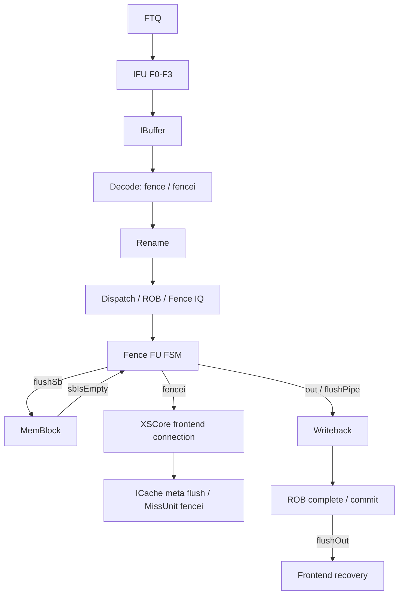

# FENCE.I 指令执行生命周期

## 📋 基本信息

| 字段 | 内容 |
|---|---|
| **指令名称** | `fence.i` |
| **编码格式** | `000000000000_00000_001_00000_0001111`，即常见机器码 `0x0000100f`；`fm=0000`、`pred=0000`、`succ=0000`、`rd=0`、`rs1=0` |
| **RISC-V 扩展** | `Zifencei` |
| **是否有压缩格式** | 无对应 C 扩展编码；启用 C 时仍可从半字边界取出该 32 位指令 |
| **指令分类** | 系统／内存顺序／指令缓存同步 |
| **FuType** | `FuType.fence` |
| **FuOpType** | `FenceOpType.fencei` |
| **目标 FU** | Fence FU；输出到前端 ICache 和 SBuffer 控制 |
| **分析日期** | 2026-09-06 |

本文以本地 `/nfs/home/wanghao/emuByYuan/stable-kmh-v2` 源码为实现依据。`fence.i` 的架构作用是使该 hart 先前对指令内存的写入，在后续取指中可见；实现上不能简化为“清空 ICache 一拍”，因为它还要等待更老 store buffer 内容排空，并通过 ROB 的 `flushPipe` 保证顺序。现有 `fence_i-report.md` 中的波形属于另一套路径和环境，本文不把其中的绝对周期当作当前源码版本的实测结果。

## 1. 前端路径

### 1.1 取指

| 阶段 | 延迟 | 关键行为 | 代码位置 |
|---|---|---|---|
| ICache/MainPipe | 可变 | 普通取指经过 ICache；`fence.i` 到达前，年轻取指可能已在前端流水线上，但提交时的 flush 会清除其错误路径状态 | [IFU.scala][IF]、[ICache.scala][IC] |
| IFU F0 | 请求握手 | FTQ 请求以 `fromFtq.req.fire` 接收，受 `f1_ready` 和 ICache ready 限制 | [IFU.scala][IF] 241–263 行 |
| IFU F1 | 通常下一拍 | 锁存 FTQ 请求并推进到 F2 | [IFU.scala][IF] 291–304 行 |
| IFU F2 | 通常再下一拍，可等待 | 等待 ICache 响应并准备预译码 | [IFU.scala][IF] 357–385 行 |
| IFU F3 | 通常再下一拍，可等待 | PredChecker 后通过 `io.toIbuffer.fire` 入队 | [IFU.scala][IFO] 953–969 行 |

> **前端流水线总延迟（无冲刷）：** `f0_fire` 到 `f3_fire` 在响应及时且无背压时为 3 个周期间隔；`fence.i` 本身不在前端产生控制流预测目标，但提交后的 ICache flush 会使前端重新取指。

### 1.2 预译码

| 项目 | 内容 |
|---|---|
| **brTable 匹配** | 不匹配控制流条目；预译码结果为 `BrType.notCFI` |
| **PreDecodeInfo 字段** | `valid=1`、`isRVC=0`、`brType=notCFI`、`isCall=0`、`isRet=0`；字段见 [PreDecode.scala][PD] 72–82 行 |
| **是否有专用检测逻辑** | 无前端 Fence 专用预译码；后端 DecodeUnit 识别 `FENCE_I` |
| **跳转偏移计算** | `jal_offset` 和 `br_offset` 组合逻辑仍对取指窗口计算，但本条不会作为跳转执行 |

### 1.3 PredChecker 校验

| 项目 | 内容 |
|---|---|
| **是否触发 remaskFault** | `fence.i` 自身不满足 JAL/JALR/RET 条件；同一 FTQ 窗口中的其他控制流指令仍可能触发 |
| **是否触发 mispredict** | 正常情况下不触发；错误地将非 CFI 位置预测为 taken 时可能触发 `notCFITaken` |
| **是否产生 wbRedirect** | Fence 语义不产生分支 redirect；其提交时的 `flushPipe` 走 ROB 通用恢复/刷新接口 |
| **fixedRange 影响** | 本条不主动缩短范围，但可能受同一 fetch block 中更早预测校验错误影响 |

### 1.4 IBuffer 入队

| 项目 | 内容 |
|---|---|
| **入队宽度** | `PredictWidth=FetchWidth*(HasCExtension ? 2 : 1)`；默认 `FetchWidth=8`，启用 C 时为 16 个半字候选位置 |
| **是否可能被挡** | 是；`io.in.ready=allowEnq`，容量不足时 IFU 停止推进 |
| **携带的关键信息** | PC、指令、FTQ 指针/offset、预译码结果、取指异常、trigger 和后端 exception |
| **代码位置** | [IFU.scala][IFO] 956–969 行；[IBuffer.scala][IB] 227–233、305 行 |

## 2. 后端路径

### 2.1 译码

| 项目 | 内容 |
|---|---|
| **DecodeWidth** | 默认 6，见 [Parameters.scala][P] 149 行 |
| **简单/复杂译码** | 系统类直接译码；不属于复杂拆分指令 |
| **译码延迟** | 译码表组合匹配；不等于端到端零延迟 |
| **关键译码结果** | `fuType=FuType.fence`、`fuOpType=FenceOpType.fencei`、`SrcType.pc`、`SrcType.imm`、无 GPR 写回、`noSpec=T`、`blockBack=T`、`flushPipe=T` |
| **代码位置** | [DecodeUnit.scala][D] 228–230 行；[Bundles.scala][B] 105–110 行 |

```scala
FENCE_I -> XSDecode(
  SrcType.pc, SrcType.imm, SrcType.X,
  FuType.fence, FenceOpType.fencei, SelImm.X,
  noSpec = T, blockBack = T, flushPipe = T
)
```

`flushPipe` 的 Bundle 注释明确表示该指令在提交时刷新流水线，但仍可正常提交；它不是异常指令。

### 2.2 重命名

| 项目 | 内容 |
|---|---|
| **RenameWidth** | 默认 6 |
| **延迟** | 受重命名输出和下游 ready 影响；系统指令不应填入固定端到端周期 |
| **源操作数** | 两个逻辑输入槽位：`PC` 和立即数语义；本实现 Fence 不依赖普通整数源寄存器值 |
| **目标操作数** | 无 GPR/FP/Vec 目标，不分配架构结果物理寄存器 |
| **特殊处理** | 必须分配 ROB；`noSpec`/`blockBackward` 让它与前后指令保持顺序 |
| **代码位置** | [Rename.scala][R]；[Bundles.scala][B] 105–110、200–210 行 |

### 2.3 派发

| 项目 | 内容 |
|---|---|
| **DispatchWidth** | 默认由 `RenameWidth=6` 决定输入组宽度 |
| **延迟** | 可变；ROB、Fence FU 和顺序化门控都会造成等待 |
| **目标 ROB** | 通过 `fromRename.fire` 写入 ROB；`flushPipe` 随异常生成信息保存 |
| **目标 Issue Queue** | Fence FU 所属 Issue Queue；不进入 Load/Store 数据队列 |
| **顺序限制** | `blockBackward` 阻止同组后续 uop 越过；ROB 维护 `hasBlockBackward`，直到相关表项离开/ROB 清空 |
| **代码位置** | [NewDispatch.scala][DIS] 805–829 行；[Rob.scala][ROB] 395–402、460–461 行 |

### 2.4 发射

| 项目 | 内容 |
|---|---|
| **Issue Queue 类型** | Fence FU 对应的系统指令 Issue Queue |
| **唤醒条件** | 所需控制数据可用、FU 空闲、输出端可接收；Fence 不等待普通数据操作数 |
| **选择策略** | 由 IssueQueue 的 `canIssue`、FU busy 和 age 选择逻辑共同决定 |
| **最小延迟** | 源码未证明从 IQ 出队到 Fence `io.in.fire` 的固定拍数 |
| **最大延迟** | 可能受端口冲突、前序顺序化和 FU 忙状态影响，无源码给出的有限上界 |
| **代码位置** | [IssueQueue.scala][IQ] 420–490 行；[FuConfig.scala][F] 347–358 行 |

### 2.5 执行

| 项目 | 内容 |
|---|---|
| **执行单元** | [Fence.scala][FENCE] 的 `Fence` 功能单元 |
| **流水/阻塞** | `piped=false`、`latency=UncertainLatency()`、`flushPipe=true`；输入接受后由 FSM 持续占用直到完成 |
| **执行延迟** | 可变：至少等待 SBuffer empty；随后 ICache flush 信号及其内部处理还可能产生等待 |
| **FSM 状态机** | 6 状态：`s_idle`、`s_wait`、`s_tlb`、`s_icache`、`s_fence`、`s_nofence`；`fence.i` 只使用前三个相关路径中的 `s_idle/s_wait/s_icache` |
| **关键输出信号** | `fenceio.sbuffer.flushSb`、`fenceio.fencei`、`io.out.valid`、`uop.ctrl.flushPipe` |
| **代码位置** | [Fence.scala][FENCE] 26–100 行；[XSCore.scala][CORE] 139、190、228 行 |

**Fence FSM：**

| 状态 | 持续条件 | 输出信号 | 次态转换条件 |
|---|---|---|---|
| `s_idle` | 无 Fence 事务 | `in.ready=1` | `io.in.valid` 时进入 `s_wait`，并锁存 uop |
| `s_wait` | 等更老 store buffer 排空 | `sbuffer.flushSb=1`；`fencei=0` | `func=fencei && sbEmpty` → `s_icache` |
| `s_tlb` | 仅 sfence/hfence 路径 | `sfence.valid` | 本条不可达 |
| `s_icache` | Fence.I 触发拍 | `fencei=1` | 下一时钟回到 `s_idle`；同时 `io.out.valid=1` |
| `s_fence` | 普通 fence 路径 | 无专用 ICache 信号 | 本条不可达 |
| `s_nofence` | Svinval no-fence 路径 | 无专用 ICache 信号 | 本条不可达 |

源码关键逻辑：

```scala
sbuffer := state === s_wait
fencei  := state === s_icache
when (state === s_wait && func === FenceOpType.fencei && sbEmpty) {
  state := s_icache
}
when (state =/= s_idle && state =/= s_wait) { state := s_idle }
```

注意 `sbuffer` 输出为 `state===s_wait`，而 `sbEmpty` 来自 MemBlock；因此 Fence FU 等待的是后端提供的全局写缓冲空状态，不是本地猜测。

### 2.6 写回

| 项目 | 内容 |
|---|---|
| **写回端口** | Fence FU 的普通执行结果通路；不占用整数结果数据端口 |
| **是否写回** | 不写 GPR/FP/Vec；返回 `res.data=0`、原 uop、ROB index、异常向量和 `flushPipe` |
| **写回延迟** | `s_icache` 产生 `out.valid` 后，在 `out.ready` 为真时完成；源码有断言要求 Fence 输出有效时必须 ready |
| **代码位置** | [Fence.scala][FENCE] 86–100 行；[WbArbiter.scala][WB] 的执行结果仲裁 |

### 2.7 提交

| 项目 | 内容 |
|---|---|
| **CommitWidth** | 默认 `CommitWidth=8`、`RobCommitWidth=8` |
| **提交条件** | Fence 完成写回、成为 ROB 头且无异常；随后按普通 ROB 提交规则退休 |
| **是否触发 flush** | 是，`flushPipe=1`；它是“可提交的流水线刷新”，不是异常提交 |
| **是否触发 redirect** | 不产生分支目标 redirect；ROB 的 `flushOut` 可在 flushPipe 条件下启动前端恢复，级别和具体周期由 ROB 状态决定 |
| **代码位置** | [Rob.scala][ROB] 583、619–635、1213–1218 行 |

ROB 中 `deqHasFlushPipe` 将已完成且满足提交时序的 `flushPipe` 指令纳入 flush 判断；`flushOut.level` 对 flushPipe 取 `RedirectLevel.flushAfter`（除非同时存在异常/重放等更强条件）。

## 3. 信号前递

### 3.1 前递路径图



### 3.2 信号清单

| 信号名 | 方向 | 位宽 | 语义 | 持续方式 |
|---|---|---|---|---|
| `io.in.valid/ready` | Issue Queue ↔ Fence FU | 各 1 | 接收 Fence uop | Decoupled，`fire=valid&&ready` |
| `fenceio.sbuffer.flushSb` | Fence → MemBlock | 1 | 请求排空 store buffer | 状态电平，`s_wait` 保持 |
| `fenceio.sbuffer.sbIsEmpty` | MemBlock → Fence | 1 | SBuffer/uncache 综合为空 | 电平 |
| `fenceio.fencei` | Fence → Frontend | 1 | 请求 ICache fence.i 处理 | `s_icache` 单拍电平 |
| `frontend.io.fencei` | XSCore → ICache | 1 | 顶层连接后的前端刷新请求 | 由 Fence 输出直接连接 |
| `icache.io.fencei` | Frontend → ICache | 1 | 使 ICache MetaArray 全表失效并通知 MissUnit | 电平/寄存取决于 ICache 接口 |
| `io.out.valid/ready` | Fence FU ↔ 写回 | 各 1 | Fence 完成结果握手 | 输出必须等待 ready |
| `uop.ctrl.flushPipe` | Fence → ROB | 1 | 提交时刷新流水线但允许提交 | 随 uop 携带 |
| `rob.flushOut.valid` | ROB → Frontend | 1 | 提交/异常后的前端恢复 | Valid 脉冲 |

XSCore 的连接为：

```scala
frontend.io.fencei <> backend.io.fenceio.fencei
backend.io.fenceio.sbuffer.sbIsEmpty := memBlock.io.mem_to_ooo.sbIsEmpty
memBlock.io.ooo_to_mem.flushSb := backend.io.fenceio.sbuffer.flushSb
```

ICache 端将 `io.fencei` 接到 `metaArray.io.flushAll` 和 `missUnit.io.fencei`；MissUnit 在 fencei/flush期间禁止普通 miss 继续取得数据，并禁止将响应写入 ICache 的 meta/data array。实现中 `fence.i` 的关键不是向数据缓存发送 CMO 请求，而是前端 ICache 的全表失效与 miss 状态抑制。

## 4. 周期计算

### 4.1 流水线延迟分解

| 阶段 | 固定/可变 | 周期数 | 说明 |
|---|---|---|---|
| Decode | 组合 | 0（组合逻辑） | 不包含 IBuffer/Decode 握手等待 |
| Rename | 可变 | `T_rename` | 系统指令无目标寄存器，但仍受资源影响 |
| Dispatch/Issue | 可变 | `T_dispatch+T_issue` | 等待 ROB、Fence IQ 和 FU 接收 |
| Fence FU 输入到 `s_wait` | 固定 | 1 个状态推进间隔 | `in.fire` 后下一状态为 `s_wait` |
| SBuffer drain | 可变 | `T_sb` | 等 `sbIsEmpty`，可能包含更老 store/uncache 排空 |
| ICache fencei | 固定控制拍 | 至少 1 个状态周期 | `s_wait→s_icache` 后 `fencei=1`；ICache 内部处理仍可能延长提交可见时间 |
| Fence output | 可变 | `T_out` | `s_icache` 输出等待 `out.ready`，源码要求其始终 ready |
| ROB flush/commit | 可变 | `T_flush+T_commit` | `flushPipe` 的提交与前端恢复不是同一事件 |
| **合计** | 可变 | `T_total` | 没有当前版本的匹配波形，不能给端到端绝对值 |

### 4.2 公式

$$T_{total}=T_{decode}+T_{rename}+T_{dispatch}+T_{issue}+T_{sb}+T_{icache}+T_{out}+T_{flush}+T_{commit}$$

计时起点必须明确：若从 `Fence.io.in.fire` 开始，`T_sb` 是到 `sbIsEmpty` 的等待；若从指令 PC 开始，还需加前端和 IBuffer 延迟。历史波形中的 `fencei` 脉冲、ICache `flush` 和 ROB commit 应分别作为事件，不得压缩成一个“Fence 延迟”。

### 4.3 最佳/最差情况

| 场景 | 周期数 | 条件 |
|---|---|---|
| **最佳** | FSM 下限路径，仍不等于实测端到端周期 | Fence 已发射、`sbIsEmpty` 已为真、ICache 可立即接收、写回 ready、ROB 无其他阻塞 |
| **典型** | 无当前版本匹配波形，不能给绝对值 | 存在若干 SBuffer drain 周期，随后一次 ICache flush 控制拍和正常 ROB flushAfter |
| **最差** | 无源码给出的有限上界 | 前序 store/uncache 长时间未排空、Fence FU/IQ 竞争、ICache miss/flush 抑制、ROB 或前端恢复背压 |

### 4.4 时序图

```text
事件沿          C0       C1       ...       Cs       Cs+1      Cs+2       ...       Ccommit
Fence in.fire   1
Fence state     idle     wait               wait     icache     idle
flushSb                  1                  1         0
sbIsEmpty                          0 ...      1
fencei                                                1         0
Fence out.valid                                             1
ROB flushPipe                                                                     1
ROB commit                                                                                   1
```

上图是源码约束的示意，不是实测波形。波形验证时应以 `TOP.clock` 正沿采样，先用 PC/指令字定位 `fence.i`，再用 `robIdx` 追踪 `Fence.state`、`flushSb`、`sbIsEmpty`、`fencei`、ICache `fencei/flush`、`out.valid` 和 ROB commit；不能仅凭 PC 在 Rename 之后追踪。

## 5. 异常与特殊处理

### 5.1 异常检测

| 异常类型 | 检测位置 | 检测条件 | 处理方式 |
|---|---|---|---|
| 取指页故障/访问故障 | IFU/IBuffer | fetch exception 随 entry 携带 | ROB 头处理，正常 Fence FU 不执行 |
| 非法指令 | DecodeUnit | `SelImm.INVALID_INSTR` 或系统控制限制 | `illegalInstr`，不触发合法 fence.i 路径 |
| 虚拟指令 | DecodeUnit | CSR `virtualInst` 控制 | `virtualInstr`，交由特权路径处理 |
| 前序 store/uncache 异常 | ROB/MemBlock | 更老指令未完成或已有异常 | Fence 在 ROB/执行顺序上等待或被异常路径阻止 |
| ICache/总线错误 | ICache/MissUnit | 当前 ICache error/flush 处理逻辑 | 由前端错误路径传播；源码未证明具体错误码映射 |

`fence.i` 本身不访问由 `rs1` 指定的数据地址，也没有普通 load/store 地址对齐异常；它的关键输入是 Fence FU 的 `sbIsEmpty` 和前端 `fencei` 控制。

### 5.2 冲刷与重定向

| 触发条件 | 类型 | 影响范围 | 恢复方式 |
|---|---|---|---|
| Fence 前存在更老分支错误/异常 | 通用 redirect/exception | Fence 及其年轻指令 | ROB/前端按 redirect level 清除，不得执行被清除 Fence |
| Fence 到达提交条件且 `flushPipe=1` | 可提交的 pipeline flush | Fence 后年轻指令和前端在途状态 | ROB 生成 `flushOut`，以 `flushAfter` 等级恢复下一取指位置 |
| SBuffer 未空 | Fence 局部等待 | Fence FU，不直接清空前端 | `flushSb` 保持到 `sbIsEmpty` |
| ICache flush 请求 | 前端刷新 | ICache meta valid、MissUnit miss/响应写入状态 | `fencei` 脉冲结束后重新取指；具体重新填充由正常 ICache 路径完成 |
| redirect 与 Fence 同时出现 | redirect 优先级由各模块逻辑决定 | 当前 Fence 事务及年轻状态 | 以 ROB/Frontend 的 `needFlush` 结果为准；不能凭输入存在断言已回滚外部缓存状态 |

### 5.3 与其他指令的交互

| 交互场景 | 影响指令 | 行为 |
|---|---|---|
| 先写代码再执行 `fence.i` | 前序 Store + 后续取指 | Fence 等待 store buffer 空，再请求 ICache 刷新，使后续取指重新获取代码 |
| Fence 后的 Load/Store | 年轻内存指令 | `blockBackward` 与 ROB `flushPipe` 防止其在 Fence 顺序点前完成可见提交 |
| `fence` | 内存访问 | 共用 Fence FU/SBuffer 等待，但 `fence` 进入 `s_fence`，不产生 ICache `fencei` |
| `sfence.vma`/HFENCE | TLB 指令 | 共用 Fence FSM，但等待 `s_tlb` 并产生 `sfence`，不等同于 ICache flush |
| ICache miss | 前端取指 | fencei/flush期间抑制 miss 状态推进和 SRAM 写入，之后重新发起正常取指 |
| 数据缓存 CMO | DCache 指令 | `fence.i` 不使用 CBO `CMOReq`，其目标是 ICache/取指一致性 |

## 6. 安全性分析

### 6.1 推测执行窗口

| 窗口 | 起始点 | 终止点 | 周期数 | 风险等级 |
|---|---|---|---|---|
| 前端窗口 | FTQ 取指 | Fence 提交触发 flush | 可变 | 年轻指令可能被取指/译码，但不应越过提交顺序点产生架构提交 |
| Fence 等待窗口 | Fence `in.fire` | `sbIsEmpty` | 可变 | Fence FU 保持状态，避免在更老写入未排空时刷新前端 |
| ICache 刷新窗口 | `fencei=1` | ICache 完成控制转移 | 至少一个控制拍，内部可变 | miss/响应写入被抑制；不能将该窗口视作普通可撤销 ALU 执行 |

### 6.2 侧信道暴露面

| 暴露面 | 类型 | 缓解措施 |
|---|---|---|
| SBuffer drain 时长 | 微架构时序 | Fence 等待 `sbIsEmpty`，但不提供常数时间 |
| ICache flush 后重新填充 | Cache 时序 | 失效后按正常取指重填；重填延迟可能暴露缓存状态 |
| 前端在途指令 | 推测状态 | `flushPipe`/ROB redirect 清理年轻状态；不等于清除所有预测器历史 |
| 自修改代码可见性 | 一致性/顺序 | 软件在写入指令后执行 `fence.i`；本文不扩展为多 hart 全系统一致性证明 |

### 6.3 有序性保证

| 保证 | 机制 | 代码依据 |
|---|---|---|
| 更老数据写入先完成排空 | Fence `s_wait` 拉高 `flushSb`，等待 `sbIsEmpty` | [Fence.scala][FENCE] 59–66、79–81 行 |
| ICache 刷新发生在 Fence 顺序点 | `fencei` 只在 `s_icache` 拉高 | [Fence.scala][FENCE] 64–67 行 |
| Fence 可以提交但会刷新年轻流水线 | `flushPipe=true` 随 uop 写入 ROB/ExceptionGen | [DecodeUnit.scala][D] 229 行；[Rob.scala][ROB] 1180、1217 行 |
| ICache 不在刷新期间写入新 meta/data | `missUnit.fencei` 与 `write_sram_valid` 门控 | [ICacheMissUnit.scala][MISS] 141–161、394–399 行 |
| 前端重新取指而非沿用旧 ICache valid 位 | `metaArray.io.flushAll := io.fencei` | [ICache.scala][IC] 635 行 |

## 7. 性能特征

| 指标 | 值 | 说明 |
|---|---|---|
| **执行吞吐** | Fence FU 单事务处理；不能按 DecodeWidth 推导连续 fence.i 吞吐 | `piped=false` 且状态机等待 SBuffer/ICache |
| **执行延迟** | `UncertainLatency()` | 主要变量是前序写缓冲排空、ICache 处理和 ROB flush/恢复 |
| **端口占用** | Fence FU、MemBlock SBuffer flush 控制、Frontend/ICache fencei 控制、ROB flushOut | 不使用 DCache CMO 端口 |
| **流水线阻塞** | `blockBackward`、Fence FU busy、SBuffer drain、前端 flush 恢复 | 年轻指令不能安全地越过 Fence 顺序点 |
| **关键路径影响** | 未做综合/STA，不能给频率结论 | 控制信号传播和 ICache 全表失效不等于组合路径必然成为关键路径 |

## 8. 配置依赖

| 参数 | 默认值 | 影响 | 配置位置 |
|---|---|---|---|
| `XLEN` | 64 | Fence Bundle 地址/控制数据宽度 | [Parameters.scala][P] 59 行 |
| `FetchWidth` / `PredictWidth` | 8 / C 开启时 16 | Fence 前端取指窗口宽度 | [Parameters.scala][P] 80、658–659 行 |
| `IBufSize` | 48 | Fence 到达 IBuffer 的背压条件 | [Parameters.scala][P] 147 行 |
| `DecodeWidth` / `RenameWidth` | 6 / 6 | 后端输入宽度，不代表 Fence 并行度 | [Parameters.scala][P] 149–150 行 |
| `CommitWidth` / `RobCommitWidth` / `RobSize` | 8 / 8 / 160 | Fence ROB 提交和 flush 控制资源 | [Parameters.scala][P] 151–152、178 行 |
| `FenceCfg.piped` | false | Fence FU 不接受连续流水化请求 | [FuConfig.scala][F] 347–358 行 |
| `FenceCfg.latency` | `UncertainLatency()` | SBuffer/ICache/ROB 等待导致可变延迟 | [FuConfig.scala][F] 347–358 行 |
| `FenceCfg.flushPipe` | true | Fence 完成时允许提交并刷新流水线 | [FuConfig.scala][F] 347–358 行 |
| `HasCExtension` | 配置项 | 决定 PredictWidth 和 RVC 解码路径 | [Parameters.scala][P] 658–659 行 |

## 附录：关键代码索引

| 模块 | 文件路径 | 关键行号 |
|---|---|---|
| Fence 译码 | [backend/decode/DecodeUnit.scala][D] | 228–230 |
| Fence 控制字段 | [backend/Bundles.scala][B] | 105–110、200–210 |
| Fence FSM | [backend/fu/Fence.scala][FENCE] | 26–100 |
| Fence FU 参数 | [backend/fu/FuConfig.scala][F] | 347–358 |
| Frontend 连接 | [XSCore.scala][CORE] | 139、190、228 |
| IFU 流水线 | [frontend/IFU.scala][IF] | 241–385、556–560、953–969 |
| 预译码/PredChecker | [frontend/PreDecode.scala][PD] | 72–82、343–434 |
| IBuffer | [frontend/IBuffer.scala][IB] | 227–305 |
| ICache Fence 输入 | [frontend/icache/ICache.scala][IC] | 562、635、691 |
| ICache miss 抑制 | [frontend/icache/ICacheMissUnit.scala][MISS] | 141–161、315、394–399 |
| ROB flushPipe | [backend/rob/Rob.scala][ROB] | 583、619–635、1180、1217 |
| SBuffer 汇合 | [mem/MemBlock.scala][MB] | 1740–1751 |
| 调度选择 | [backend/issue/IssueQueue.scala][IQ] | 420–490 |
| 重命名 | [backend/rename/Rename.scala][R] | 385–404 |
| 默认配置 | [Parameters.scala][P] | 59、80、147–178、658–659 |

[D]: /nfs/home/wanghao/emuByYuan/stable-kmh-v2/src/main/scala/xiangshan/backend/decode/DecodeUnit.scala#L228
[B]: /nfs/home/wanghao/emuByYuan/stable-kmh-v2/src/main/scala/xiangshan/backend/Bundles.scala#L105
[FENCE]: /nfs/home/wanghao/emuByYuan/stable-kmh-v2/src/main/scala/xiangshan/backend/fu/Fence.scala#L26
[F]: /nfs/home/wanghao/emuByYuan/stable-kmh-v2/src/main/scala/xiangshan/backend/fu/FuConfig.scala#L347
[CORE]: /nfs/home/wanghao/emuByYuan/stable-kmh-v2/src/main/scala/xiangshan/XSCore.scala#L139
[IF]: /nfs/home/wanghao/emuByYuan/stable-kmh-v2/src/main/scala/xiangshan/frontend/IFU.scala#L241
[IFO]: /nfs/home/wanghao/emuByYuan/stable-kmh-v2/src/main/scala/xiangshan/frontend/IFU.scala#L953
[IC]: /nfs/home/wanghao/emuByYuan/stable-kmh-v2/src/main/scala/xiangshan/frontend/icache/ICache.scala#L562
[MISS]: /nfs/home/wanghao/emuByYuan/stable-kmh-v2/src/main/scala/xiangshan/frontend/icache/ICacheMissUnit.scala#L141
[PD]: /nfs/home/wanghao/emuByYuan/stable-kmh-v2/src/main/scala/xiangshan/frontend/PreDecode.scala#L72
[IB]: /nfs/home/wanghao/emuByYuan/stable-kmh-v2/src/main/scala/xiangshan/frontend/IBuffer.scala#L227
[ROB]: /nfs/home/wanghao/emuByYuan/stable-kmh-v2/src/main/scala/xiangshan/backend/rob/Rob.scala#L583
[MB]: /nfs/home/wanghao/emuByYuan/stable-kmh-v2/src/main/scala/xiangshan/mem/MemBlock.scala#L1740
[IQ]: /nfs/home/wanghao/emuByYuan/stable-kmh-v2/src/main/scala/xiangshan/backend/issue/IssueQueue.scala#L420
[R]: /nfs/home/wanghao/emuByYuan/stable-kmh-v2/src/main/scala/xiangshan/backend/rename/Rename.scala#L385
[P]: /nfs/home/wanghao/emuByYuan/stable-kmh-v2/src/main/scala/xiangshan/Parameters.scala#L59
