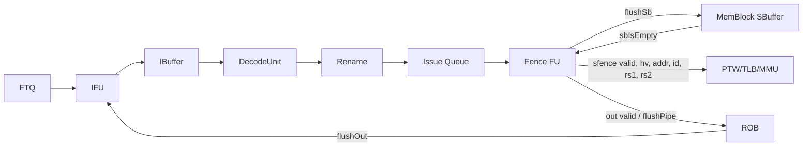

# SFENCE.VMA 指令执行生命周期

## 📋 基本信息

| 字段 | 内容 |
|---|---|
| **指令名称** | `sfence.vma` |
| **编码格式** | `0001001_?????_?????_000_?????_1110011`；本地译码使用 `SFENCE_VMA`，具体 `rs1`/`rs2` 携带虚拟地址与 ASID 选择信息 |
| **RISC-V 扩展** | Supervisor／地址翻译同步 |
| **是否有压缩格式** | 否；没有对应的 C 扩展编码 |
| **指令分类** | 系统／虚拟内存管理／当前地址翻译缓存失效 |
| **FuType** | `FuType.fence` |
| **FuOpType** | `FenceOpType.sfence` |
| **目标 FU** | Fence FU；经 `sfence` 接口通知 MMU/TLB |
| **分析日期** | 2026-09-06 |

本文以本地 `/nfs/home/wanghao/emuByYuan/stable-kmh-v2` 源码为准。`sfence.vma` 不执行普通算术或访存，也不直接写回整数寄存器；它在 Fence FU 中等待 SBuffer 排空后，产生带有 `hv=0` 的 TLB 刷新请求。刷新范围由 `rs1`、`rs2` 的零值组合以及 ASID、虚拟页号共同决定。

## 1. 前端路径

### 1.1 取指

| 阶段 | 延迟 | 关键行为 | 代码位置 |
|---|---|---|---|
| ICache/MainPipe | 可变 | 普通取指获取包含 `sfence.vma` 的指令块；该指令不是控制流指令 | [IFU.scala][IF]、[ICache.scala][IC] |
| IFU F0 | 请求握手 | FTQ 请求通过 `fromFtq.req.fire` 接收，受下游 ready 和 ICache 请求条件限制 | [IFU.scala][IF] |
| IFU F1 | 通常下一拍 | 锁存取指请求并推进流水线 | [IFU.scala][IF] |
| IFU F2 | 通常再下一拍，可等待 | 接收 ICache 响应并整理预译码信息 | [IFU.scala][IF] |
| IFU F3 | 通常再下一拍，可等待 | 经过 PredChecker 后通过 `io.toIbuffer.fire` 进入 IBuffer | [IFU.scala][IFO] |

> **前端流水线总延迟（无冲刷）：** 在响应及时、无背压时，`f0_fire` 到 `f3_fire` 通常为 3 个周期间隔；端到端延迟仍受 ICache、IBuffer 和重定向影响。

### 1.2 预译码

| 项目 | 内容 |
|---|---|
| **brTable 匹配** | `sfence.vma` 不是分支、跳转、调用或返回指令，正常情况下不匹配控制流预测条目，`brType` 为非控制流类型 |
| **PreDecodeInfo 字段** | `valid=1`、`isRVC=0`、`brType=notCFI`，不产生 call/return 属性；具体字段由 [PreDecode.scala][PD] 定义 |
| **是否有专用检测逻辑** | 无前端专用 SFENCE 专用预译码逻辑；后端 `DecodeUnit` 识别 `SFENCE_VMA` |
| **跳转偏移计算** | 预译码窗口仍可组合计算通用 JAL/Branch 偏移，但本条不会使用这些偏移 |

### 1.3 PredChecker 校验

| 项目 | 内容 |
|---|---|
| **是否触发 remaskFault** | `sfence.vma` 自身不满足控制流指令条件，因此不主动触发；同一窗口内其他指令仍可能触发 |
| **是否触发 mispredict** | 正常情况下不触发；仅当非控制流位置被错误预测为 taken 时，才可能由通用检查逻辑报告错误 |
| **是否产生 wbRedirect** | 不产生分支 redirect；Fence 的 `flushPipe` 在 ROB 顺序点执行通用流水线恢复 |
| **fixedRange 影响** | 本条不主动截断后续取指范围，但会受到同一 fetch block 中更早预测错误的影响 |

### 1.4 IBuffer 入队

| 项目 | 内容 |
|---|---|
| **入队宽度** | 由 `PredictWidth=FetchWidth*(HasCExtension ? 2 : 1)` 等配置决定；不是 SFENCE 专属宽度 |
| **是否可能被挡** | 是；IBuffer 空间不足或下游不 ready 时，`io.toIbuffer.fire` 不成立 |
| **携带的关键信息** | PC、指令字、FTQ 指针/偏移、RVC 信息、预译码结果、取指异常、trigger 和后端异常信息 |
| **代码位置** | [IFU.scala][IFO]、[IBuffer.scala][IB] |

## 2. 后端路径

### 2.1 译码

| 项目 | 内容 |
|---|---|
| **DecodeWidth** | 由本地参数配置；默认值应以实际构建配置为准，不能由单条指令推导 |
| **简单/复杂译码** | 系统指令直接译码，不需要 Complex Decoder |
| **译码延迟** | 组合译码逻辑，通常计为 0 个额外流水线周期 |
| **关键译码结果** | `fuType=FuType.fence`、`fuOpType=FenceOpType.sfence`、两个源操作数为 `SrcType.reg`、目标为 `SrcType.X`、`noSpec=true`、`blockBack=true`、`flushPipe=true` |
| **代码位置** | [DecodeUnit.scala][D] 490 行附近 |

```scala
SFENCE.VMA -> XSDecode(
  SrcType.reg, SrcType.reg, SrcType.X,
  FuType.fence, FenceOpType.sfence, SelImm.X,
  noSpec = T, blockBack = T, flushPipe = T
)
```

`rs1` 提供 虚拟地址语义，`rs2` 提供 ASID 语义；当相应寄存器为 `x0` 时，`Fence.scala` 将其编码为 `sfence.bits.rs1/rs2` 的全范围选择条件。

### 2.2 重命名

| 项目 | 内容 |
|---|---|
| **RenameWidth** | 由本地参数配置 |
| **延迟** | 通常为 1 个流水线阶段，实际受输入输出握手影响 |
| **源操作数** | 2 个整数源操作数：`rs1` 对应地址，`rs2` 对应 ASID；实际物理值由重命名后的数据通路提供 |
| **目标操作数** | 无整数、浮点或向量目的寄存器，`dstType=SrcType.X` |
| **特殊处理** | `noSpec` 和 `blockBack` 使其按系统指令顺序处理，不应将其当作普通 ALU 指令跨越顺序点 |
| **代码位置** | [Rename.scala][R] |

### 2.3 派发

| 项目 | 内容 |
|---|---|
| **DispatchWidth** | 由后端配置决定 |
| **延迟** | 通常为 1 个流水线阶段 |
| **目标 ROB** | 分配 ROB 项，保存 `robIdx`、异常字段和 `flushPipe` 控制 |
| **目标 Issue Queue** | 进入 Fence FU 对应的 Issue Queue/调度路径 |
| **代码位置** | [IssueQueue.scala][IQ]、[Rob.scala][ROB] |

### 2.4 发射

| 项目 | 内容 |
|---|---|
| **Issue Queue 类型** | Fence FU 专用调度入口，具体容量和选择逻辑由配置决定 |
| **唤醒条件** | 两个源操作数有效且执行资源可接收；该指令还受系统指令阻塞策略约束 |
| **选择策略** | 由 Issue Queue 的年龄和资源选择逻辑决定；不应假设固定优先级 |
| **最小延迟** | 至少经历一次选择/出队握手 |
| **最大延迟** | 无固定有限值，可能受 IQ、Fence FU 或更老指令阻塞 |
| **代码位置** | [IssueQueue.scala][IQ] |

### 2.5 执行

| 项目 | 内容 |
|---|---|
| **执行单元** | `Fence` |
| **流水/阻塞** | `FenceCfg.piped=false`；状态机在 SBuffer 和 TLB 刷新阶段占用执行资源 |
| **执行延迟** | `UncertainLatency()`；必须等待 `sbIsEmpty`，并包含 TLB 刷新控制拍 |
| **FSM 状态机** | 有：`s_idle`、`s_wait`、`s_tlb` 等 |
| **关键输出信号** | `flushSb`、`sfence.valid`、`sfence.bits.hv`、`sfence.bits.rs1/rs2`、`sfence.bits.addr`、`sfence.bits.id` |
| **代码位置** |与 ASID 对齐 | [Bundle.scala][BUNDLE][FENCE] 26–100 行 |

**FSM 状态机：**

| 状态 | 持续条件 | 输出信号 | 次态转换条件 |
|---|---|---|---|
| `s_idle` | 等待输入 | `io.in.ready=1` | 输入握手后进入 `s_wait` |
| `s_wait` | 等待更老 SBuffer 内容排空 | `flushSb=1` | `func=sfence` 且 `sbIsEmpty=1` 时进入 `s_tlb` |
| `s_tlb` | TLB 刷新控制拍 | `sfence.valid=1`、`hv=0` | 下一拍返回 `s_idle` |
| 其他状态 | 本指令不使用 | `fencei=0` | 不适用于 `sfence.vma` |

`sfence.vma` 的 `sfence.bits.id` 使用 `rs2` 提供的 ASID；虚拟化模式下还结合当前 `hgatp.vmid` 选择目标项；`sfence.bits.addr` 锁存 `src(0)`。`rs1/rs2` 标志由指令立即数字段中对应寄存器编号是否为零决定。PageTableCache 的 `sfence_valid` 分支根据特权态选择 `noS2xlate` 或 `onlyStage1` 翻译项。

### 2.6 写回

| 项目 | 内容 |
|---|---|
| **写回端口** | 经过 Fence FU 的通用执行结果接口返回 ROB，不进入 Int/FP/Vec 寄存器文件写端口 |
| **是否写回** | 否；`io.out.bits.res.data=0`，且无目的寄存器 |
| **写回延迟** | TLB 刷新状态完成后产生 `io.out.valid`；实际时刻受执行握手影响 |
| **代码位置** |与 ASID 对齐 | [Bundle.scala][BUNDLE][FENCE] |

### 2.7 提交

| 项目 | 内容 |
|---|---|
| **CommitWidth** | 由 ROB 配置决定 |
| **提交条件** | 成为 ROB 最老指令、执行结果有效且无异常 |
| **是否触发 flush** | 是；译码设置 `flushPipe=true`，提交时刷新年轻流水线 |
| **是否触发 redirect** | 不产生分支目标 redirect；ROB 使用通用 `flushOut` 恢复前端顺序取指 |
| **代码位置** | [Rob.scala][ROB] |

## 3. 信号前递

### 3.1 前递路径图



### 3.2 信号清单

| 信号名 | 方向 | 位宽 | 语义 | 持续方式 |
|---|---|---|---|---|
| `io.in.valid/ready` | Issue Queue ↔ Fence FU | 各 1 | Fence uop 输入握手 | Decoupled，`fire=valid&&ready` |
| `sbuffer.flushSb` | Fence → MemBlock | 1 | 请求排空 SBuffer | `s_wait` 状态电平 |
| `sbuffer.sbIsEmpty` | MemBlock → Fence | 1 | SBuffer 是否为空 | 电平 |
| `sfence.valid` | Fence → MMU | 1 | 发出一次 TLB 刷新请求 | `s_tlb` 状态电平，通常持续一拍 |
| `sfence.bits.hv` | Fence → MMU | 1 | 普通 `sfence.vma` 时为 0；用于区分 HFENCE.VVMA 和 HFENCE.GVMA | 随 `sfence` 有效 |
| `sfence.bits.rs1/rs2` | Fence → MMU | 各 1 | 选择按地址、ASID 或全范围失效 | 随请求携带 |
| `sfence.bits.addr` | Fence → MMU | XLEN | 虚拟地址参数 | 输入握手时锁存 |
| `sfence.bits.id` | Fence → MMU | 由 ASID/ASID 参数决定 | `sfence` 时为零扩展 ASID | 输入握手时锁存 |
| `io.out.valid/ready` | Fence FU ↔ ROB/WB | 各 1 | 执行完成握手 | Fence FU 断言输出有效时要求 ready |
| `uop.ctrl.flushPipe` | uop → ROB | 1 | 提交时刷新年轻流水线 | 随 uop 携带 |

顶层 SBuffer 连接为 `memBlock.io.ooo_to_mem.flushSb := backend.io.fenceio.sbuffer.flushSb`；MMU 侧通过 `MemBlock` 的 `sfence` 路径分发到 PTW、ITLB、DTLB 和页表缓存。具体接收模块由本地配置决定。

## 4. 周期计算

### 4.1 流水线延迟分解

| 阶段 | 固定/可变 | 周期数 | 说明 |
|---|---|---|---|
| Decode | 固定 | 0（组合逻辑） | 不含前后级握手等待 |
| Rename | 固定 | 通常 1 | 受 Rename ready 影响 |
| Dispatch | 固定 | 通常 1 | 分配 ROB 并进入调度路径 |
| Issue Queue 出队 | 可变（≥1） | `T_issue` | 受年龄、资源和系统指令阻塞影响 |
| Fence FU 执行 | 可变 | `T_sb + 1` 起步 | `s_wait` 等 `sbIsEmpty`，`s_tlb` 发出刷新请求 |
| TLB/MMU 处理 | 可变 | `T_mmu` | 各 TLB、PTW repeater、PageTableCache 的失效传播可能不同 |
| 写回/完成 | 可变 | `T_out` | 无寄存器写回，但需完成 Fence FU 输出握手 |
| 提交/刷新 | 可变 | `T_commit` | ROB 顺序提交并清除年轻流水线 |
| **合计** | 可变 | `T_total` | 当前没有匹配波形时不能给出绝对端到端周期 |

### 4.2 公式

$$T_{total}=T_{decode}+T_{rename}+T_{dispatch}+T_{issue}+T_{sb}+T_{tlb}+T_{out}+T_{commit}$$

若从指令进入前端开始计时，还需加取指、ICache 响应、预译码和 IBuffer 等延迟。若从 `Fence.io.in.fire` 开始计时，则不应重复计算前端部分。

### 4.3 最佳/最差情况

| 场景 | 周期数 | 条件 |
|---|---|---|
| **最佳** | FSM 下限路径，不能直接等同于端到端实测值 | 指令已发射、`sbIsEmpty=1`、MMU 接收刷新、Fence 输出立即握手、ROB 无阻塞 |
| **典型** | 可变 | 存在若干 SBuffer 排空周期，随后 TLB 各级按配置传播刷新请求 |
| **最差** | 无源码给出的有限上界 | 更老访存未完成、IQ/Fence FU/ROB 背压，或 MMU 刷新与 PTW/重填路径发生竞争 |

### 4.4 时序图

```text
事件沿          C0       C1       ...       Cs       Cs+1       Cs+2       ...       Ccommit
Fence in.fire   1
Fence state     idle     wait               wait     tlb        idle
flushSb                  1                  1         0
sbIsEmpty                          0 ...      1
sfence.valid                                             1         0
sfence.hg                                                1         0
Fence out.valid                                                       1
ROB flushPipe                                                                            1
ROB commit                                                                                         1
```

上图是源码约束的示意，不是当前版本实测波形。验证时应以 `TOP.clock` 正沿采样，先用 PC/指令字定位 `sfence.vma`，进入后端后使用 `robIdx` 继续追踪；重点观察 `flushSb`、`sbIsEmpty`、`sfence.valid`、`hv`、`rs1/rs2`、`addr`、`id`、各级 TLB 失效以及 ROB 提交。

## 5. 异常与特殊处理

### 5.1 异常检测

| 异常类型 | 检测位置 | 检测条件 | 处理方式 |
|---|---|---|---|
| 非法指令 | DecodeUnit/CSR 权限检查 | `illegalInst.sfenceVMA` 置位，或当前特权状态不允许执行 | 记录非法指令异常，按 ROB 异常路径处理，不发出有效 TLB 刷新 |
| 虚拟指令异常 | DecodeUnit/CSR 权限检查 | `virtualInst.sfenceVMA` 置位，例如虚拟化特权状态不允许 | 记录虚拟指令异常，进入异常处理路径 |
| 取指页故障/访问故障 | IFU、ITLB、取指路径 | 包含该指令的取指请求翻译或权限失败 | 指令不能正常进入后端，按取指异常重定向 |
| TLB/PTW 相关异常 | 后续访存/取指请求 | 刷新后重新翻译时发生权限或页表错误 | 由对应请求产生异常；`sfence.vma` 本身不写回异常数据 |

SFENCE.VMA 的执行权限由 CSR 状态参与判定；本地 `DecodeUnit.scala` 明确检查 `illegalInst.sfenceVMA` 和 `virtualInst.sfenceVMA`，不能仅凭指令编码判断其一定可执行。

### 5.2 冲刷与重定向

| 触发条件 | 类型 | 影响范围 | 恢复方式 |
|---|---|---|---|
| ``flushPipe=true` 的 SFENCE 到达 ROB 顺序点 | 流水线刷新 | 清除年轻 uop，保持更老指令和 SFENCE 的顺序提交 | ROB 通过 `flushOut` 通知前端恢复 |
| SFENCE 正常执行 | MMU/TLB 局部失效 | 按 `rs1`、`rs2`、ASID 和 当前地址空间 地址匹配失效，不等于全流水线异常冲刷 | 后续翻译请求使用失效后的缓存状态 |
| 非法/虚拟指令异常 | 异常冲刷 | 清除异常点之后的年轻指令 | 由异常目标和 CSR 状态恢复 |

### 5.3 与其他指令的交互

| 交互场景 | 影响指令 | 行为 |
|---|---|---|
| 更老 store 或 uncache 请求 | store、AMO、uncache 访存 | Fence FU 先等待 `sbIsEmpty`，再发出 TLB 刷新 |
| 当前地址空间 页表更新 | 后续 guest 访存/取指 | 软件更新页表后使用 SFENCE.VMA，使匹配的旧翻译项失效 |
| `rs1=x0` | 所有 当前地址空间 虚拟页 | `sfence.bits.rs1=1`，PageTableCache 走不按单一地址限制的路径 |
| `rs2=x0` | 所有 ASID | `sfence.bits.rs2=1`，不按单一 ASID 限制 |
| `rs1!=x0` 或 `rs2!=x0` | 指定地址/ASID | 由 PageTableCache 的匹配逻辑选择性失效 |
| `sfence.vma` 与 `hfence.vvma` | 当前地址空间 或 虚拟地址空间翻译 | 共享 Fence FU，但 `hv`/`hg` 标志不同，不能混淆刷新范围 |
| `hinval.gvma` | Hypervisor 无效化路径 | 也映射到 `sfence` 操作码族，但其译码控制字段可能不同，不能直接当作同一架构指令解释 |

## 6. 安全性分析

### 6.1 推测执行窗口

| 窗口 | 起始点 | 终止点 | 周期数 | 风险等级 |
|---|---|---|---|---|
| 前端在途窗口 | SFENCE 被取指至 ROB 顺序点 | `flushPipe` 生效并前端恢复 | 可变 | 中 |
| SBuffer 等待窗口 | Fence FU 进入 `s_wait` | `sbIsEmpty=1` | `T_sb` | 低到中 |
| TLB 刷新窗口 | 进入 `s_tlb` 并发出 `sfence.valid` | 各 MMU 接收路径完成其失效处理 | 配置相关 | 中 |

SFENCE.VMA 的架构效果依赖顺序点和参数匹配；文档不将“发出 `sfence.valid`”未经证据扩展为所有异步 MMU 结构已经同时完成刷新。

### 6.2 侧信道暴露面

| 暴露面 | 类型 | 缓解措施 |
|---|---|---|
| SBuffer 排空时长 | 微架构时序 | 在刷新前等待 `sbIsEmpty`，但耗时不是常数，软件不应依赖固定延迟 |
| TLB/PageTableCache 命中状态 | Cache/MMU 时序 | 按地址、ASID 和 地址空间标记进行选择性失效；刷新后重新翻译 |
| 前端年轻指令 | 推测状态 | `flushPipe` 清除 SFENCE 之后的年轻流水线状态；仍需遵守实现的前端恢复边界 |
| 虚拟化权限状态 | 权限侧信道 | 由 CSR 的非法/虚拟指令检查阻止不具备权限的 SFENCE 执行 |

### 6.3 有序性保证

| 保证 | 机制 | 代码依据 |
|---|---|---|
| 更老 store 先完成排空 | `s_wait` 保持 `flushSb`，直到 `sbIsEmpty` |与 ASID 对齐 | [Bundle.scala][BUNDLE][FENCE] |
| 普通 SFENCE 请求不设置 Hypervisor 标志 | `sfence.bits.hv=0`，且 `hg=0` |与 ASID 对齐 | [Bundle.scala][BUNDLE][FENCE] |
| 虚拟化模式下限定当前 VMID | PageTableCache 使用 CSR 提供的 `hgatp.vmid` 匹配 当前地址空间 项 | [PageTableCache.scala][PTC] |
| 地址/ASID 全范围选择可编码 | `rs1/rs2` 由立即数字段判断是否为零 |与 ASID 对齐 | [Bundle.scala][BUNDLE][FENCE] |
| TLB 按 地址空间和参数匹配失效 | PageTableCache 使用 `hv`、当前地址空间上下文 和 地址空间标记及 VPN 进行选择性失效 | [PageTableCache.scala][PTC] |
| 年轻流水线不会越过 Fence 提交 | `flushPipe=true` 随 uop 进入 ROB | [DecodeUnit.scala][D]、[Rob.scala][ROB] |

## 7. 性能特征

| 指标 | 值 | 说明 |
|---|---|---|
| **执行吞吐** | 非流水化 Fence FU；不能按 DecodeWidth 推导连续 SFENCE 吞吐 | `FenceCfg.piped=false`，每条指令需经过等待和 TLB 控制状态 |
| **执行延迟** | `UncertainLatency()` | 主要变量是 SBuffer 排空、Issue/ROB 背压和 MMU 刷新传播 |
| **资源占用** | Fence FU、SBuffer flush 控制、MMU/TLB 刷新接口、ROB flush 控制 | 不使用普通 ALU 或寄存器写回端口 |
| **流水线阻塞** | `blockBack`、Fence FU 状态机、SBuffer drain 和 ROB flush | 目的在于维护翻译缓存失效的顺序边界 |
| **关键路径影响** | 未进行综合/STA，不能给出频率结论 | 控制信号跨模块传播不等于必然构成时序关键路径 |

## 8. 配置依赖

| 参数 | 默认值 | 影响 | 配置位置 |
|---|---|---|---|
| `XLEN` | 由构建配置决定 | `addr`、源操作数和 Bundle 宽度 | [Parameters.scala][P] |
| `AsidLength` | 由 MMU/Hypervisor 配置决定 | 影响 ASID 字段宽度和匹配逻辑 | [PageTableCache.scala][PTC] |
| `AsidLength` | 由 MMU 配置决定 | `sfence.bits.id` Bundle 宽度与 ASID 对齐 | [Bundle.scala][BUNDLE]| [Fence.scala][FENCE] |
| `FenceCfg.piped` | `false` | Fence FU 不流水化接收事务 | [FuConfig.scala][F] |
| `FenceCfg.latency` | `UncertainLatency()` | 反映等待 SBuffer/MMU 的可变执行时间 | [FuConfig.scala][F] |
| `FenceCfg.flushPipe` | `true` | SFENCE 顺序点提交时刷新年轻流水线 | [FuConfig.scala][F] |
| `FetchWidth` / `PredictWidth` | 由前端配置决定 | 影响 SFENCE 到达 IBuffer 的窗口宽度 | [Parameters.scala][P] |
| TLB/PageTableCache 参数 | 由 MMU 配置决定 | 影响失效匹配、传播和重新填充成本 | [PageTableCache.scala][PTC] |

## 附录：关键代码索引

| 模块 | 文件路径 | 关键内容 |
|---|---|---|
| SFENCE.VMA 译码 | [backend/decode/DecodeUnit.scala][D] | `SFENCE_VMA` → `FenceOpType.sfence` |
| 特权检查 | [backend/decode/DecodeUnit.scala][D] | `illegalInst.sfenceVMA`、`virtualInst.sfenceVMA` |
| Fence FSM | [backend/fu/Fence.scala][FENCE] | SBuffer 等待、`sfence` 生成和状态转换 |
| Fence 参数 | [backend/fu/FuConfig.scala][F] | `FenceCfg` 的流水化和延迟属性 |
| MMU 顶层连接 | [mem/MemBlock.scala][MB] | `sfence` 分发到 PTW、ITLB、DTLB |
| PageTableCache 当前地址空间 失效 | [cache/mmu/PageTableCache.scala][PTC] | `hfenceg_valid`、ASID/VPN 匹配和 valid 清除 |
| IFU 流水线 | [frontend/IFU.scala][IF] | 取指请求、响应和 IBuffer 入队 |
| IBuffer | [frontend/IBuffer.scala][IB] | 前端缓存、背压和 uop 携带信息 |
| 重命名 | [backend/rename/Rename.scala][R] | 源操作数重命名 |
| 调度 | [backend/issue/IssueQueue.scala][IQ] | Fence FU 选择与出队 |
| ROB | [backend/rob/Rob.scala][ROB] | `flushPipe`、提交和前端恢复 |

[D]: /nfs/home/wanghao/emuByYuan/stable-kmh-v2/src/main/scala/xiangshan/backend/decode/DecodeUnit.scala#L490
[FENCE]: /nfs/home/wanghao/emuByYuan/stable-kmh-v2/src/main/scala/xiangshan/backend/fu/Fence.scala#L26
[F]: /nfs/home/wanghao/emuByYuan/stable-kmh-v2/src/main/scala/xiangshan/backend/fu/FuConfig.scala#L347
[MB]: /nfs/home/wanghao/emuByYuan/stable-kmh-v2/src/main/scala/xiangshan/mem/MemBlock.scala#L665
[PTC]: /nfs/home/wanghao/emuByYuan/stable-kmh-v2/src/main/scala/xiangshan/cache/mmu/PageTableCache.scala#L1106
[IF]: /nfs/home/wanghao/emuByYuan/stable-kmh-v2/src/main/scala/xiangshan/frontend/IFU.scala#L241
[IFO]: /nfs/home/wanghao/emuByYuan/stable-kmh-v2/src/main/scala/xiangshan/frontend/IFU.scala#L953
[IC]: /nfs/home/wanghao/emuByYuan/stable-kmh-v2/src/main/scala/xiangshan/frontend/icache/ICache.scala#L562
[PD]: /nfs/home/wanghao/emuByYuan/stable-kmh-v2/src/main/scala/xiangshan/frontend/PreDecode.scala#L72
[IB]: /nfs/home/wanghao/emuByYuan/stable-kmh-v2/src/main/scala/xiangshan/frontend/IBuffer.scala#L227
[R]: /nfs/home/wanghao/emuByYuan/stable-kmh-v2/src/main/scala/xiangshan/backend/rename/Rename.scala#L385
[IQ]: /nfs/home/wanghao/emuByYuan/stable-kmh-v2/src/main/scala/xiangshan/backend/issue/IssueQueue.scala#L420
[ROB]: /nfs/home/wanghao/emuByYuan/stable-kmh-v2/src/main/scala/xiangshan/backend/rob/Rob.scala#L583
[BUNDLE]: /nfs/home/wanghao/emuByYuan/stable-kmh-v2/src/main/scala/xiangshan/Bundle.scala#L596
[P]: /nfs/home/wanghao/emuByYuan/stable-kmh-v2/src/main/scala/xiangshan/Parameters.scala#L59
