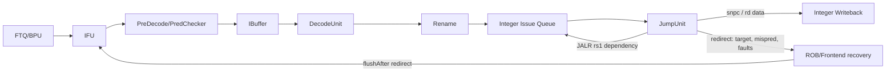

# JAL/JALR 指令执行生命周期

## 📋 基本信息

| 字段 | 内容 |
|---|---|
| **指令名称** | `jal`、`jalr` |
| **编码格式** | `jal`：`imm[20|10:1|11|19:12]_rd_1101111`；`jalr`：`imm[11:0]_rs1_000_rd_1100111` |
| **RISC-V 扩展** | `RV64I` |
| **是否有压缩格式** | `jal` 在 RVC 下有不同编码的 `c.j`/`c.jal`（具体取决于配置和 XLEN）；`jalr` 有 `c.jr`/`c.jalr` 的压缩形式。本文分析 32 位 `jal` 与 `jalr` 路径 |
| **指令分类** | 控制流／无条件跳转／链接寄存器写回 |
| **FuType** | `FuType.jmp` |
| **FuOpType** | `JumpOpType.jal`、`JumpOpType.jalr` |
| **目标 FU** | Jump FU（`JumpUnit`） |
| **分析日期** | 2026-09-06 |

本文以本地 `/nfs/home/wanghao/emuByYuan/stable-kmh-v2` 源码为准。`jal` 使用 `PC + sign-extended UJ immediate` 计算目标，`jalr` 使用 `rs1 + sign-extended I immediate` 计算目标并清除最低位；两者都把顺序下一条 PC 写入 `rd`。前端可利用 FTQ/BTB 中的控制流信息提前取目标路径，后端 `JumpUnit` 再对预测目标和真实目标进行校验。

## 1. 前端路径

### 1.1 取指

| 阶段 | 延迟 | 关键行为 | 代码位置 |
|---|---|---|---|
| ICache/MainPipe | 可变 | ICache 返回包含跳转指令的 fetch block；目标路径可能已由 FTQ/BPU 预测并并行请求 | [IFU.scala][IF]、[NewFtq.scala][FTQ] |
| IFU F0 | 请求握手 | 通过 `fromFtq.req.fire` 接收 FTQ 请求；请求中携带预测 PC/FTQ 信息 | [IFU.scala][IF] |
| IFU F1 | 通常下一拍 | 锁存取指请求并进行半字边界、PC 和请求状态推进 | [IFU.scala][IF] |
| IFU F2 | 通常再下一拍，可等待 | 接收 ICache 响应，完成 RVC 展开、预译码和控制流候选整理 | [IFU.scala][IF]、[PreDecode.scala][PD] |
| IFU F3 | 通常再下一拍，可等待 | PredChecker 校验 `jal/jalr` 的控制流属性后，将有效指令送入 IBuffer | [IFU.scala][IFO]、[PreDecode.scala][PD] |

> **前端流水线总延迟（无冲刷）：** 响应及时且无背压时，`f0_fire` 到 `f3_fire` 通常为 3 个周期间隔；若跳转预测命中，目标路径可以在前端提前展开，若预测错误则需要后端或前端校验恢复。

### 1.2 预译码

| 项目 | 内容 |
|---|---|
| **brTable 匹配** | `NewFtq` 记录 fetch block 内的 `jmpInfo`、`jmpOffset`、`jalTarget`；`jal` 的直接目标可由立即数计算，`jalr` 的目标依赖寄存器值，通常需要预测器提供目标 |
| **PreDecodeInfo 字段** | `isJal`/`isJalr`、`isCall`、`isRet`、`brType`、`jmpOffset` 和 `jalTarget`；`NewFtq` 用这些字段更新 FTQ 控制流信息 |
| **是否有专用检测逻辑** | 是；[PreDecode.scala][PD] 和 [NewFtq.scala][FTQ] 对 JAL/JALR 进行专门识别、目标整理和调用/返回属性标记 |
| **跳转偏移计算** | `jal` 使用 UJ immediate 计算 `PC + offset`；`jalr` 的真实目标不能仅由前端立即数得到，后端使用 `rs1 + I immediate` 计算，并将最低位清零 |

### 1.3 PredChecker 校验

| 项目 | 内容 |
|---|---|
| **是否触发 remaskFault** | 可能。前端根据 `jalFaultVec`、`jalrFaultVec` 和 `retFaultVec` 识别控制流边界、指令类型或预测属性不一致，并据此计算 `fixedRange` |
| **是否触发 mispredict** | 预测目标、taken 属性或控制流类型与预译码结果不一致时触发；JALR 还可能因目标预测更新而产生错误 |
| **是否产生 wbRedirect** | 前端校验错误可通过 IFU 的 flush/redirect 路径恢复；后端 `JumpUnit` 在真实目标与预测目标不一致或目标地址异常时产生 `redirect` |
| **fixedRange 影响** | 会截断控制流指令之后的错误路径指令；`fixedRange` 与 `fixedTaken`、`fixedMissPred` 共同决定哪些指令可进入 IBuffer |

### 1.4 IBuffer 入队

| 项目 | 内容 |
|---|---|
| **入队宽度** | `PredictWidth=FetchWidth*(HasCExtension ? 2 : 1)`；默认 `FetchWidth=8`，启用 C 时按半字候选位置扩展 |
| **是否可能被挡** | 是；IBuffer 满、下游不 ready、取指异常或 `fixedRange` 截断时，`io.toIbuffer.fire` 可能不成立 |
| **携带的关键信息** | PC、指令字、FTQ 指针/偏移、RVC 信息、预译码控制流属性、预测 taken/target、异常和 trigger 信息 |
| **代码位置** | [IFU.scala][IFO]、[IBuffer.scala][IB]、[NewFtq.scala][FTQ] |

## 2. 后端路径

### 2.1 译码

| 项目 | 内容 |
|---|---|
| **DecodeWidth** | 默认 `DecodeWidth=6`，实际以构建配置为准 |
| **简单/复杂译码** | 直接译码，不需要 Complex Decoder |
| **译码延迟** | 组合译码逻辑，通常计为 0 个额外流水线周期 |
| **关键译码结果** | `jal`：`SrcType.pc`、`SrcType.imm`、`FuType.jmp`、`JumpOpType.jal`、`SelImm.IMM_UJ`、`xWen=true`；`jalr`：`SrcType.reg`、`SrcType.imm`、`JumpOpType.jalr`、`SelImm.IMM_I`、`xWen=true` |
| **代码位置** | [DecodeUnit.scala][D] 201–202 行 |

```scala
JAL  -> XSDecode(SrcType.pc , SrcType.imm, SrcType.X,
                 FuType.jmp, JumpOpType.jal,  SelImm.IMM_UJ, xWen = T)
JALR -> XSDecode(SrcType.reg, SrcType.imm, SrcType.X,
                 FuType.jmp, JumpOpType.jalr, SelImm.IMM_I,  xWen = T)
```

`rd` 是链接寄存器目的操作数；当 `rd=x0` 时，架构上丢弃链接值，但跳转目标仍然需要计算。

### 2.2 重命名

| 项目 | 内容 |
|---|---|
| **RenameWidth** | 默认 `RenameWidth=6`，实际以构建配置为准 |
| **延迟** | 通常为 1 个流水线阶段，受 ready/valid 和资源可用性影响 |
| **源操作数** | `jal`：PC 和立即数；`jalr`：整数 `rs1`、立即数；PC 不通过普通 GPR RAT 查找 |
| **目标操作数** | 整数目的寄存器 `rd`，写入顺序下一条 PC；`rd=x0` 时不分配有效 GPR 目的 |
| **特殊处理** | JAL/JALR 同时承担控制流重定向和链接值写回；JALR 的 `rs1` 依赖可能推迟其发射 |
| **代码位置** | [Rename.scala][R] |

### 2.3 派发

| 项目 | 内容 |
|---|---|
| **DispatchWidth** | 由后端调度配置决定 |
| **延迟** | 通常为 1 个流水线阶段 |
| **目标 ROB** | 分配 ROB 项，保存 `robIdx`、FTQ 信息、预测信息、异常字段和目的寄存器控制 |
| **目标 Issue Queue** | 进入包含 Jump FU 的整数调度块；当前配置中 Jmp FU 位于 `BJU` 相关执行单元 |
| **代码位置** | [Parameters.scala][PARAM]、[IssueBlockParams.scala][IBP] |

### 2.4 发射

| 项目 | 内容 |
|---|---|
| **Issue Queue 类型** | 整数调度块中的 Jump FU 专用执行端口 |
| **唤醒条件** | `jal` 的源操作数可直接使用 PC/立即数；`jalr` 必须等待 `rs1` 就绪，并同时满足 Jump FU 输入 ready |
| **选择策略** | 由 Issue Queue 年龄和端口选择逻辑决定；不应假设固定优先级 |
| **最小延迟** | 至少经历一次调度选择和出队握手 |
| **最大延迟** | 无固定有限值，可能受源操作数、IQ、执行端口和写回资源竞争影响 |
| **代码位置** | [IssueQueue.scala][IQ]、[IssueBlockParams.scala][IBP] |

### 2.5 执行

| 项目 | 内容 |
|---|---|
| **执行单元** | `JumpUnit`，内部使用 `JumpDataModule` |
| **流水/阻塞** | `JmpCfg.piped=true`；输入 `ready` 受输出 ready 约束，可流水化接收 |
| **执行延迟** | 目标和链接值为组合计算；输出通过 Jump FU 的控制/数据接口完成握手，端到端仍受流水级和 redirect 传播影响 |
| **FSM 状态机** | 无专用 FSM；JumpUnit 为流水化执行单元 |
| **关键输出信号** | `io.out.bits.res.data`、`io.out.bits.res.redirect`、`redirect.cfiUpdate.target`、`isMisPred`、`backendIAF`、`backendIPF`、`backendIGPF` |
| **代码位置** | [Jump.scala][JUMP]、[JumpUnit.scala][JU] |

目标计算公式为：

- `jal`：`target = PC + sign_extend(imm_UJ)`；
- `jalr`：`target = (rs1 + sign_extend(imm_I)) & ~1`；
- 两者的链接结果：`result = snpc = PC + nextPcOffset × instruction-byte-offset`。

`JumpUnit` 将真实目标与预测目标 `jmpTarget` 比较，并检查 `predTaken`；当目标不一致、未预测 taken 或目标存在指令访问/页故障时，生成 `flushAfter` 级别的 redirect。

### 2.6 写回

| 项目 | 内容 |
|---|---|
| **写回端口** | 整数寄存器写回端口；Jmp FU 配置为 `writeIntRf=true` |
| **是否写回** | 是，写回 `snpc` 到 `rd`；`rd=x0` 时架构上丢弃 |
| **写回延迟** | 随 Jump FU 流水和写回仲裁而定；不能仅由源码中的组合目标计算推导完整端到端周期 |
| **代码位置** | [JumpUnit.scala][JU]、[FuConfig.scala][F]、[DataPath.scala][DP] |

### 2.7 提交

| 项目 | 内容 |
|---|---|
| **CommitWidth** | 默认 `RobCommitWidth=8`，实际以 ROB 配置为准 |
| **提交条件** | 指令位于 ROB 最老可提交位置，且没有未处理异常或更高优先级 flush |
| **是否触发 flush** | 预测错误或后端目标异常时触发 `flushAfter`；预测正确时不因 JAL/JALR 本身额外 flush |
| **是否触发 redirect** | 是，条件为真实目标与预测目标不一致、未预测 taken 或目标地址异常 |
| **代码位置** | [Rob.scala][ROB]、[JumpUnit.scala][JU] |

## 3. 信号前递

### 3.1 前递路径图



### 3.2 信号清单

| 信号名 | 方向 | 位宽 | 语义 | 持续方式 |
|---|---|---|---|---|
| `predictInfo.target` | 前端 → JumpUnit | VAddr 相关 | 前端预测的跳转目标 | 随 uop 携带 |
| `predictInfo.taken` | 前端 → JumpUnit | 1 | 是否预测跳转成立 | 随 uop 携带 |
| `data.pc` | 后端流水线 → JumpUnit | XLEN/地址宽度 | 当前指令 PC | 随 uop 携带 |
| `data.src(0)` | 重命名/旁路 → JumpUnit | XLEN | JALR 的 `rs1`；JAL 路径对应 PC 源 | 随 uop 携带，可由旁路提供 |
| `data.imm` | Decode → JumpUnit | 立即数扩展宽度 | UJ 或 I 型立即数 | 随 uop 携带 |
| `res.data` | JumpUnit → 整数写回 | XLEN | 顺序下一条 PC，写入 `rd` | 输出握手 |
| `res.redirect.valid` | JumpUnit → ROB/前端 | 1 | 后端需要恢复前端 | 当前执行结果有效时的条件脉冲 |
| `redirect.fullTarget` | JumpUnit → 前端 | VAddr | 真实跳转目标 | 随 redirect 携带 |
| `redirect.cfiUpdate.isMisPred` | JumpUnit → 控制流更新 | 1 | 预测目标或 taken 属性不一致 | 随 redirect 携带 |
| `backendIAF/IPF/IGPF` | JumpUnit → 异常/前端 | 各 1 | 目标访问故障、页故障、客户机页故障 | 随 redirect 携带 |

## 4. 周期计算

### 4.1 流水线延迟分解

| 阶段 | 固定/可变 | 周期数 | 说明 |
|---|---|---|---|
| Decode | 固定 | 0（组合逻辑） | 生成 Jump FU 控制字段和立即数选择 |
| Rename | 固定 | 通常 1 | `jalr` 需要重命名 `rs1`，JAL 还要保留 PC 源 |
| Dispatch | 固定 | 通常 1 | 分配 ROB 并进入整数调度块 |
| Issue Queue 出队 | 可变（≥1） | `T_issue` | 等待源操作数、年龄选择和 Jump 端口 |
| 执行 | 组合/流水 | 由 `JmpCfg` 流水路径决定 | 目标、snpc 和 redirect 条件组合计算 |
| 写回 | 可变 | `T_wb` | 受整数写回仲裁和旁路时序影响 |
| 前端恢复 | 可变 | `T_redirect` | 仅预测错误或目标异常时增加；正确预测不增加后端恢复开销 |
| **合计** | 可变 | `T_total` | 需区分正确预测和错误预测两条路径 |

### 4.2 公式

$$T_{total}=T_{decode}+T_{rename}+T_{dispatch}+T_{issue}+T_{execute}+T_{wb}+T_{redirect}$$

其中 `T_redirect=0` 表示预测正确且无目标异常；发生错误预测时，`T_redirect` 包含 redirect 传播、前端清除和重新取指的延迟。JALR 还可能因 `rs1` 未就绪增加 `T_issue`。

### 4.3 最佳/最差情况

| 场景 | 周期数 | 条件 |
|---|---|---|
| **最佳** | 固定流水线下限，不能直接替代实测端到端周期 | 预测命中、源操作数就绪、Jump FU 和整数写回端口可用、无目标异常 |
| **典型** | 可变 | JAL 直接目标较易预测；JALR 依赖寄存器值，目标预测可能需要后端校验或更新 |
| **最差** | 无源码给出的有限上界 | JALR 等待 `rs1`、Issue Queue/写回端口竞争，或发生目标页故障、错误预测和前端重取 |

### 4.4 时序图

```text
Cycle          C0        C1        C2        C3        C4        C5        C6
IBuffer        inst
Decode                    inst
Rename                              inst
Dispatch                                      inst
IssueQ                                                  inst
JumpUnit                                                           target/snpc
Writeback                                                                    rd=snpc
Redirect       （仅在预测错误/目标异常时：JumpUnit → ROB → 前端恢复）
Commit                                                                              inst
```

上图是无停顿的抽象示意，不是当前版本实测波形。验证时应先用 PC、FTQ 和指令字定位 JAL/JALR，进入后端后使用 `robIdx` 追踪 `predictInfo`、`JumpUnit` 真实目标、`redirect.valid`、`isMisPred`、整数写回和 ROB 提交。

## 5. 异常与特殊处理

### 5.1 异常检测

| 异常类型 | 检测位置 | 检测条件 | 处理方式 |
|---|---|---|---|
| 指令访问故障 | 目标地址检查 | `checkAccessFault(target)` 有效 | 通过后端 redirect 携带异常信息，按异常路径处理 |
| 指令页故障 | 目标地址检查 | `checkPageFault(target)` 有效 | 产生目标页故障并清除错误路径 |
| 客户机页故障 | 目标地址检查 | `checkGuestPageFault(target)` 有效 | 产生 guest page fault 相关处理 |
| 前端取指异常 | IFU/ITLB | 跳转目标重新取指时发生翻译或权限异常 | 由前端异常与 ROB 恢复路径处理 |
| 控制流预测错误 | PredChecker/JumpUnit | 目标、taken 或 CFI 类型不一致 | 生成 `flushAfter` redirect，更新预测状态 |

### 5.2 冲刷与重定向

| 触发条件 | 类型 | 影响范围 | 恢复方式 |
|---|---|---|---|
| 后端真实目标与预测目标不同 | 控制流恢复 | 清除错误路径上的年轻指令 | 使用 `redirect.fullTarget` 和 FTQ 信息重新取指 |
| `predTaken=false` 但 JAL/JALR 实际跳转 | 控制流恢复 | 从当前指令之后的错误顺序路径开始清除 | `JumpUnit` 生成 `flushAfter` redirect |
| 目标访问/页/客户机页故障 | 异常重定向 | 清除目标错误路径并保留异常点 | 由异常入口和 ROB/前端恢复逻辑处理 |
| 前端 `fixedRange`/JALR fault | 前端局部冲刷 | 截断 fetch block 中错误控制流之后的指令 | IFU 根据 PredChecker 结果重新请求 |

### 5.3 与其他指令的交互

| 交互场景 | 影响指令 | 行为 |
|---|---|---|
| `jal rd, offset` | 后续 `ret`/间接跳转 | 将 `PC+4` 或压缩指令对应 `snpc` 写入 `rd`，通常 `rd=x1` 形成调用链接 |
| `jalr rd, imm(rs1)` | 函数返回、间接调用 | 从 `rs1+imm` 形成目标并清除最低位；`rd` 保存顺序下一条 PC |
| `rd=x0` | 无链接跳转 | 丢弃 `snpc` 写回，但仍执行目标重定向 |
| RVC 取指 | `c.j`/`c.jal`/`c.jr`/`c.jalr` | 压缩指令使用半字长度，`nextPcOffset` 决定链接地址；本文 32 位路径由同一 Jump FU 处理 |
| BTB/FTQ 训练 | 后续同类跳转 | JAL/JALR 的提交和 CFI 更新可影响后续预测目标与 taken 状态 |
| 分支指令 | 邻近控制流指令 | 共享前端控制流检查和后端 redirect 资源，但分支条件计算使用 Branch FU |

## 6. 安全性分析

### 6.1 推测执行窗口

| 窗口 | 起始点 | 终止点 | 周期数 | 风险等级 |
|---|---|---|---|---|
| 预测目标窗口 | 前端根据 FTQ/BPU 生成目标 | PredChecker 或 JumpUnit 确认目标 | 可变 | 中 |
| JALR 数据依赖窗口 | JALR 进入后端等待 `rs1` | JumpUnit 得到真实目标并产生结果 | `T_issue` 可变 | 中 |
| 错误路径窗口 | 错误目标或顺序路径开始取指 | `flushAfter` redirect 生效 | `T_redirect` 可变 | 中到高 |

### 6.2 侧信道暴露面

| 暴露面 | 类型 | 缓解措施 |
|---|---|---|
| JALR 目标预测和 BTB 状态 | 微架构时序 | 通过后端目标校验和预测更新保证架构控制流正确；软件需考虑预测器共享带来的时序差异 |
| 错误路径取指与 ICache 活动 | Cache/推测执行 | redirect 清除年轻指令，但错误路径产生的微架构状态不等于架构提交 |
| `rs1` 就绪时间 | 数据依赖时序 | 旁路和唤醒网络缩短依赖等待，但源值生产者和端口竞争仍可能暴露延迟 |
| 目标地址异常检查 | 异常/权限时序 | JumpUnit 对目标执行访问、页和 guest 页故障检查，异常通过 ROB/前端路径收敛 |

### 6.3 有序性保证

| 保证 | 机制 | 代码依据 |
|---|---|---|
| 链接地址与跳转目标来自同一条指令 | `JumpDataModule` 同时计算 `target` 和 `snpc` | [Jump.scala][JUMP] |
| JALR 目标最低位清零 | `io.target := Cat(target(XLEN-1,1), false.B)` | [Jump.scala][JUMP] |
| 错误预测不会沿错误路径提交 | `redirect.level=flushAfter`，由 ROB/前端恢复 | [JumpUnit.scala][JU]、[Rob.scala][ROB] |
| 目标异常随控制流结果传播 | `backendIAF/IPF/IGPF` 由真实目标检查产生 | [JumpUnit.scala][JU] |
| 链接值进入整数写回路径 | `JmpCfg.writeIntRf=true`、`io.out.bits.res.data=...` | [FuConfig.scala][F]、[JumpUnit.scala][JU] |

## 7. 性能特征

| 指标 | 值 | 说明 |
|---|---|---|
| **执行吞吐** | Jmp FU 为 `piped=true`；峰值受执行单元、Issue Queue、整数写回和提交资源限制 | 不能直接用 DecodeWidth 代替跳转吞吐 |
| **执行延迟** | 目标/链接组合计算加 Jump FU 流水和写回路径 | JALR 额外受 `rs1` 依赖影响 |
| **端口占用** | Jump FU、整数写回端口、前端 redirect/FTQ 更新路径 | JAL/JALR 不占用普通 ALU 执行端口 |
| **流水线阻塞** | 源操作数未就绪、Jump FU 输出不 ready、目标预测错误、异常或前端恢复 | 正确预测时可避免大部分恢复气泡 |
| **关键路径影响** | 目标加法、JALR 最低位清零、预测比较和目标异常检查共同参与控制流路径 | 未进行综合/STA，不能据此给出频率结论 |

## 8. 配置依赖

| 参数 | 默认值 | 影响 | 配置位置 |
|---|---|---|---|
| `XLEN` | 由构建配置决定 | PC、目标地址、链接值和源操作数宽度 | [Parameters.scala][PARAM] |
| `FetchWidth` / `PredictWidth` | `8` / 启用 C 时乘 2 | FTQ/IFU 每个 fetch block 的候选指令位置 | [Parameters.scala][PARAM] |
| `HasCExtension` | 配置项 | 决定压缩跳转识别和 `nextPcOffset` | [Parameters.scala][PARAM]、[PreDecode.scala][PD] |
| `DecodeWidth` / `RenameWidth` | `6` / `6` | 后端每周期可处理的指令数，不等于 Jmp FU 吞吐 | [Parameters.scala][PARAM] |
| `RobCommitWidth` / `RobSize` | `8` / `160` | 跳转提交和错误路径清除资源 | [Parameters.scala][PARAM] |
| `JmpCfg.piped` | `true` | Jump FU 可按流水化路径接收输入 | [FuConfig.scala][F] |
| Jmp FU 执行单元数量 | 由 `intSchdParams` 决定 | 影响同周期 JAL/JALR 的发射能力 | [Parameters.scala][PARAM] |

## 附录：关键代码索引

| 模块 | 文件路径 | 关键内容 |
|---|---|---|
| JAL/JALR 译码 | [backend/decode/DecodeUnit.scala][D] | `JAL/JALR` 的源类型、立即数类型和 `JumpOpType` |
| 跳转数据计算 | [backend/fu/Jump.scala][JUMP] | `target`、`snpc` 和 JALR 最低位清零 |
| Jump 执行与 redirect | [backend/fu/wrapper/JumpUnit.scala][JU] | 预测比较、目标异常和 `flushAfter` redirect |
| Jump FU 参数 | [backend/fu/FuConfig.scala][F] | `JmpCfg.piped`、整数写回和立即数类型 |
| 前端预译码 | [frontend/PreDecode.scala][PD] | JAL/JALR fault、fixedRange 和控制流校验 |
| FTQ 控制流信息 | [frontend/NewFtq.scala][FTQ] | `jmpInfo`、`jmpOffset`、`jalTarget`、调用/返回属性 |
| IFU 流水线 | [frontend/IFU.scala][IF] | 取指、PredChecker 和 IBuffer 入队 |
| IBuffer | [frontend/IBuffer.scala][IB] | 前端缓存、背压和 uop 携带信息 |
| 调度参数 | [backend/issue/IssueBlockParams.scala][IBP] | Jmp FU 所属整数调度块 |
| Issue Queue | [backend/issue/IssueQueue.scala][IQ] | 选择、唤醒和出队 |
| 重命名 | [backend/rename/Rename.scala][R] | `rs1`/`rd` 物理寄存器映射 |
| ROB 恢复 | [backend/rob/Rob.scala][ROB] | redirect、flushAfter 和提交控制 |
| 默认参数 | [Parameters.scala][PARAM] | Fetch/Decode/Rename/ROB 等配置 |

[D]: /nfs/home/wanghao/emuByYuan/stable-kmh-v2/src/main/scala/xiangshan/backend/decode/DecodeUnit.scala#L201
[JUMP]: /nfs/home/wanghao/emuByYuan/stable-kmh-v2/src/main/scala/xiangshan/backend/fu/Jump.scala#L35
[JU]: /nfs/home/wanghao/emuByYuan/stable-kmh-v2/src/main/scala/xiangshan/backend/fu/wrapper/JumpUnit.scala#L35
[F]: /nfs/home/wanghao/emuByYuan/stable-kmh-v2/src/main/scala/xiangshan/backend/fu/FuConfig.scala#L225
[PD]: /nfs/home/wanghao/emuByYuan/stable-kmh-v2/src/main/scala/xiangshan/frontend/PreDecode.scala#L343
[FTQ]: /nfs/home/wanghao/emuByYuan/stable-kmh-v2/src/main/scala/xiangshan/frontend/NewFtq.scala#L97
[IF]: /nfs/home/wanghao/emuByYuan/stable-kmh-v2/src/main/scala/xiangshan/frontend/IFU.scala#L241
[IFO]: /nfs/home/wanghao/emuByYuan/stable-kmh-v2/src/main/scala/xiangshan/frontend/IFU.scala#L953
[IB]: /nfs/home/wanghao/emuByYuan/stable-kmh-v2/src/main/scala/xiangshan/frontend/IBuffer.scala#L227
[IBP]: /nfs/home/wanghao/emuByYuan/stable-kmh-v2/src/main/scala/xiangshan/backend/issue/IssueBlockParams.scala#L110
[IQ]: /nfs/home/wanghao/emuByYuan/stable-kmh-v2/src/main/scala/xiangshan/backend/issue/IssueQueue.scala#L420
[R]: /nfs/home/wanghao/emuByYuan/stable-kmh-v2/src/main/scala/xiangshan/backend/rename/Rename.scala#L385
[ROB]: /nfs/home/wanghao/emuByYuan/stable-kmh-v2/src/main/scala/xiangshan/backend/rob/Rob.scala#L610
[PARAM]: /nfs/home/wanghao/emuByYuan/stable-kmh-v2/src/main/scala/xiangshan/Parameters.scala#L80
