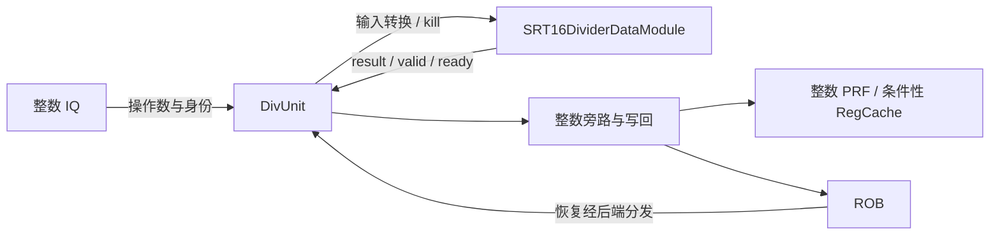
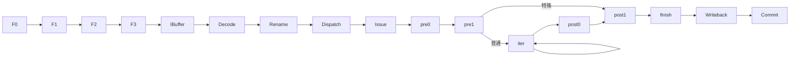

# 整数除法与余数指令执行生命周期

## 📋 基本信息

| 字段 | 内容 |
|---|---|
| **指令名称** | `div/divu/rem/remu/divw/divuw/remw/remuw` |
| **编码格式** | R 型：`0000001_rs2_rs1_funct3_rd_opcode`；商/无符号商/余数/无符号余数的 `funct3=100/101/110/111`；64 位组 `opcode=0110011`，W 组 `opcode=0111011` |
| **RISC-V 扩展** | RV64M 标量整数除法；不包含浮点或向量除法 |
| **是否有压缩格式** | 基础 C 扩展没有对应除法/余数编码；本文指令均为 32 位 |
| **指令分类** | 整数计算／非流水化迭代除法 |
| **FuType** | `FuType.div` |
| **FuOpType** | 译码使用 `MDUOpType` 对应成员；wrapper 使用编码一致的 `DIVOpType` 提取 `isSign/isW/isH` |
| **目标 FU** | `DivUnit` → `SRT16DividerDataModule(64)` |
| **分析日期** | 2026-09-06 |

实现依据为本地 `/nfs/home/wanghao/emuByYuan/stable-kmh-v2`，源码标识 `abd0f867a86b66a92d4fc5d3c6d62944725c747f`。本文只描述实际由 DivUnit 实例化的 SRT16，不把同目录 SRT4/Radix2 当作当前数据通路。参数为默认声明，时序为源码推导，未执行本版本波形仿真。乘法另见 [整数乘法生命周期](mul-lifecycle.md)。

## 1. 前端路径

### 1.1 取指

| 阶段 | 延迟 | 关键行为 | 代码位置 |
|---|---|---|---|
| ICache/MainPipe | 可变 | 获取除法指令所在指令块；ITLB/PTW、cache miss 和背压影响取指，不属于除法迭代时间 | [IFU][IF] |
| IFU F0 | 请求握手 | 接受 FTQ 请求 | [IFU][IF] 241–263 行 |
| IFU F1 | 无停顿时一阶段 | 保存请求并推进 | [IFU][IF] 291–304 行 |
| IFU F2 | 可等待 | 等待响应、整理预译码输入 | [IFU][IF] 357–385 行 |
| IFU F3 | 可背压 | 根据有效范围向 IBuffer 入队 | [IFU 入队][IFO] 953–986 行 |

> **前端流水线总延迟（无冲刷）：** 连续推进时 F0 至 F3 为三个阶段间隔；前端等待和 IBuffer 排队需要另计，不能从这个数字推算除法总延迟。

### 1.2 预译码

| 项目 | 内容 |
|---|---|
| **brTable 匹配** | 无控制流条目匹配，得到 `BrType.notCFI` |
| **PreDecodeInfo 字段** | 有效的 32 位除法：`valid=1, isRVC=0, brType=notCFI, isCall=0, isRet=0` |
| **是否有专用检测逻辑** | 前端不区分除法的符号、商/余数和 W 型；由后端译码处理 |
| **跳转偏移计算** | 通用预译码逻辑可运行，但除法不使用跳转偏移改变 PC |

依据：[PreDecode][PD] 35–82 行。

### 1.3 PredChecker 校验

| 项目 | 内容 |
|---|---|
| **是否触发 remaskFault** | 本条不是 JAL/JALR/RET，不主动触发 |
| **是否触发 mispredict** | 预测器将本条非 CFI 错当 taken 时可能产生 `notCFITaken`，不是除法运算错误 |
| **是否产生 wbRedirect** | 通用前端校验可以恢复；除法 FU 不生成分支 redirect |
| **fixedRange 影响** | 同块更早控制流错误可使本条落在无效范围，不应继续作为有效除法处理 |

依据：[PredChecker][CHECK] 361–445 行。

### 1.4 IBuffer 入队

| 项目 | 内容 |
|---|---|
| **入队宽度** | `PredictWidth=FetchWidth*(HasCExtension ? 2 : 1)`；默认 FetchWidth=8，C 开启时 16 个半字候选位置 |
| **是否可能被挡** | IBuffer 容量、下游 ready 和 `enqEnable` 有效范围共同限制 |
| **携带的关键信息** | 指令、PC、FTQ 指针/偏移、预译码、异常和 trigger；还没有除法迭代状态 |
| **代码位置** | [IFU][IFO]、[IBuffer][IB] 227–305 行 |

## 2. 后端路径

### 2.1 译码

| 项目 | 内容 |
|---|---|
| **DecodeWidth** | 默认 6 |
| **简单/复杂译码** | 八条指令分别直接表译码；不展开成多条软件减法 |
| **译码延迟** | 组合匹配，不等于整个 DecodeStage 零时间 |
| **关键译码结果** | 两个 `SrcType.reg`、第三源 `SrcType.X`、`FuType.div`、对应 `MDUOpType`、`SelImm.X`、`xWen=T` |
| **代码位置** | [DecodeUnit][D] 190–198 行、[操作类型][OP] 481–526 行 |

`SrcType.X` 在此是第三个源，不是目的类型。目的为整数 rd。正常除法没有 Fence 的 `waitForward/blockBackward/flushPipe` 串行化语义：迭代期间其他可发射指令仍可执行。

### 2.2 重命名

| 项目 | 内容 |
|---|---|
| **RenameWidth** | 默认 6 |
| **延迟** | 受物理寄存器和后端 ready 影响；不写成无条件固定 1 拍 |
| **源操作数** | `rs1` 为被除数，`rs2` 为除数；读取两个整数物理源 |
| **目标操作数** | 有效非零 rd 分配整数物理目的；只选商或余数之一写回 |
| **特殊处理** | 两源尚未就绪时等待唤醒；W 型仍使用 64 位物理寄存器 |
| **代码位置** | [Rename][R]，尤其 634–684 行 |

### 2.3 派发

| 项目 | 内容 |
|---|---|
| **DispatchWidth** | 默认 Rename 6 路；目标 IssueBlock `numEnq=2`，不是六个除法端口 |
| **延迟** | ROB、派发和 IQ 容量不足会等待 |
| **目标 ROB** | 分配普通整数运算项，以 `robIdx` 追踪完成、提交和取消 |
| **目标 Issue Queue** | 默认含 ALU3/BJU3 的整数共享 IssueBlock；BJU3 中配置 `CsrCfg, FenceCfg, DivCfg` |
| **代码位置** | [NewDispatch][DIS]、[执行配置][PORT] 391–410 行 |

### 2.4 发射

| 项目 | 内容 |
|---|---|
| **Issue Queue 类型** | 共享整数 IQ，目标为 BJU3 的 Div FU |
| **唤醒条件** | 两源数据有效，并满足执行槽选择和 ready 条件 |
| **选择策略** | IQ 的就绪/年龄/端口仲裁；执行核心 busy 时不能开始下一次迭代事务 |
| **最小延迟** | 需通过选择及读数/旁路边界；FU 输入握手才是下文除法计时起点 |
| **最大延迟** | 源生产者和共享资源等待没有环境无关有限上界 |
| **代码位置** | [IssueQueue][IQ]、[DivUnit][U] 30–55 行 |

`DivCfg` 声明 `hasInputBuffer=(true,4,true)`，但不能仅凭这个配置字段就认定当前执行路径有“必经四拍”或“可同时运算四条”。实际算术核心只有一个事务状态机，且 `in_ready=state(s_idle)`；接入缓冲的具体展开应以生成连接为准。[DivCfg][CFG]、[SRT16 输出][OUT]

### 2.5 执行

| 项目 | 内容 |
|---|---|
| **执行单元** | `DivUnit` 实例化 `SRT16DividerDataModule` |
| **流水/阻塞** | `piped=false`；busy 期间 `in_ready=0`，结束输出可等待 `out_ready` |
| **执行延迟** | `UncertainLatency()`；由前处理、特殊路径/迭代次数、后处理和输出等待组成 |
| **FSM 状态机** | 七态 one-hot 状态寄存器，详见下表 |
| **关键输出信号** | `out_valid/out_data/in_ready`；内部另有 `out_validNext` 提前指示 |
| **代码位置** | [DivUnit][U]、[SRT16][CORE] 41–107、140–180、393–402 行 |

wrapper 先将 W 型的低 32 位按符号/无符号扩展到 64 位；非 W 型保持全宽。`ctrlReg.isHi` 对 `rem*` 为真，选择余数；`isW` 最终统一将结果低字**符号扩展**，包括 `divuw/remuw`，不能把无符号输入转换误写成无符号输出扩展。[DivUnit][U] 16–47 行、[结果选择][OUT] 393–402 行

**FSM 状态机：**

| 状态 | 持续条件 | 输出信号 | 次态转换条件 |
|---|---|---|---|
| `s_idle` | 等待有效事务 | `in_ready=1` | `in_fire&&!kill_w` → `s_pre_0` |
| `s_pre_0` | 一拍 | 前导零与归一化准备 | → `s_pre_1` |
| `s_pre_1` | 一拍 | 设置迭代计数和特殊结果 | `special` → `s_post_1`，否则 → `s_iter` |
| `s_iter` | 由计数控制 | SRT 商/部分余数递推 | `finalIter` → `s_post_0`，否则继续 |
| `s_post_0` | 一拍 | 余数及修正候选准备 | → `s_post_1` |
| `s_post_1` | 一拍 | 选取特殊结果或修正商/余数；`out_validNext=1` | → `s_finish` |
| `s_finish` | 可等待下游 | `out_valid=1`，保持结果 | `out_ready=1` → `s_idle` |

`kill_r` 优先于所有正常转移，直接回 idle；新请求 `kill_w` 则阻止开始运算。特殊路径由 `special=dIsOne|dIsZero|aTooSmall` 控制：除数绝对值为 1、除数为零、或前导零比较判定无需常规迭代。不能简单写成“所有 |被除数|<|除数| 都在同一拍提前结束”，应观察实际 `special`。[SRT16][CORE]、[前处理][PRE]

### 2.6 写回

| 项目 | 内容 |
|---|---|
| **写回端口** | 默认 BJU3 的 `IntWB(port=4,priority=1)`，与相关配置共享资源 |
| **是否写回** | 一个 64 位商或余数；rd=x0 时架构结果丢弃 |
| **写回延迟** | 输出首次可见不等于握手完成；`s_finish` 保持到 `out_ready`，再经过整型写回路径 |
| **代码位置** | [DivUnit][U] 47–55 行、[SRT16][OUT]、[执行配置][PORT] |

`out_validNext` 在 `s_post_1` 提示下一周期输出，但 wrapper 中仅有局部 `validNext` 绑定，不能据此宣称已经向 IQ 广播唤醒。依赖数据的 `readForward/readBypass/readRegCache` 由共享数据通路选择；RegCache 写入取决于 `needWriteRegCache` 和结果有效写使能，不是每条除法必经的架构步骤。[DivUnit][U]、[BypassNetwork][BP]

### 2.7 提交

| 项目 | 内容 |
|---|---|
| **CommitWidth** | 默认 `CommitWidth=8, RobCommitWidth=8` |
| **提交条件** | 执行完成且位于 ROB 可提交的顺序前缀，无更老阻塞/异常 |
| **是否触发 flush** | 除零、溢出不触发 flush；外部异常和错误预测可取消本条 |
| **是否触发 redirect** | DivUnit 不生成控制流 redirect，只接收 `io.flush` |
| **代码位置** | [Rob][ROB]、[DivUnit][U] 30–44 行 |

## 3. 信号前递

### 3.1 前递路径图





### 3.2 信号清单

| 信号名 | 方向 | 位宽 | 语义 | 持续方式 |
|---|---|---|---|---|
| `valid/in_ready` | wrapper ↔ 核心 | 各 1 | 接受新事务 | `in_fire=valid&&in_ready` |
| `src(0/1)` | wrapper → 核心 | 各 64 | 已按 W 型转换的被除数/除数 | 输入握手采样 |
| `sign/isHi/isW` | wrapper → 核心 | 各 1 | 符号、余数选择、W 型 | 控制锁存后参与对应阶段 |
| `kill_w` | wrapper → 核心 | 1 | 输入 robIdx 被取消 | 阻止启动 |
| `kill_r` | wrapper → 核心 | 1 | busy 事务的 robIdx 被取消 | 优先恢复 idle |
| `out_validNext` | 核心 → wrapper | 1 | post1 阶段提示 | 不能当作已经输出握手 |
| `out_valid/out_ready` | 核心 ↔ wrapper | 各 1 | 完成输出 | finish 保持到握手 |
| `out_data` | 核心 → 写回路径 | 64 | 商/余数最终结果 | 与 out_valid 配对 |
| `robIdxReg` | wrapper 内 | RobPtr 参数宽度 | 运行中事务身份 | 输入握手锁存 |

## 4. 周期计算

### 4.1 流水线延迟分解

| 阶段 | 固定/可变 | 周期数 | 说明 |
|---|---|---|---|
| Decode | 组合 | 0 个额外逻辑寄存级 | 译码表不等于整个阶段时间 |
| Rename/Dispatch/Issue | 可变 | `T_r+T_d+T_i` | 两源依赖、IQ/执行资源和读数 |
| 核心前处理 | 状态推进 | pre0、pre1 | 两个状态周期 |
| 核心中段 | 可变 | 特殊路径跳过；普通路径 `N_iter` | 普通路径还经过 post0 |
| 核心后处理 | 状态推进 | post1 → finish | 输出寄存并置 valid |
| 输出等待 | 可变 | `T_hold` | finish 等待 ready |
| 写回/提交 | 可变 | `T_w+T_c` | 不纳入核心算法延迟 |
| **合计** | 可变 | 见公式 | 不含前端等待 |

### 4.2 公式

定义 `C0` 为 idle 中输入 valid/ready 已成立、将在该周期末采样的周期窗口；没有 kill。

$$N_{iter}=\left\lfloor\frac{lzcRegDiff+1}{4}\right\rfloor+1$$

这是普通路径中由 `iterNumReg` 初值及零判断推导的迭代周期数；前提是执行实际进入普通分支。[前处理][PRE] 175–180 行

$$T_{FU,visible}=\begin{cases}4,&special\\N_{iter}+5,&\text{普通路径}\end{cases}$$

$$T_{decode\to commit}=T_r+T_d+T_i+T_{FU,visible}+T_{hold}+T_w+T_c$$

4 表示 C0 到首次输出 valid 的 C4，相同定义下普通路径为 C(N_iter+5)，并非程序从取指起只需四拍。核心只能在 finish 完成后回 idle，再接受下一条；同一核心无背压时最小输入启动间隔为 `T_FU,visible+1`，因此特殊路径为 5 个周期窗口间隔。

### 4.3 最佳/最差情况

| 场景 | 周期数 | 条件 |
|---|---|---|
| **最佳** | FU 首次输出 C4；核心 II=5 | `special=1`、无 kill、finish 时 ready |
| **典型** | `N_iter+5` 核心周期窗口间隔 | 由实际前导零差决定；不虚构输入分布统计 |
| **最差** | 端到端无独立于环境的有限上界 | 输出背压、源数据迟到、调度竞争、ROB 更老阻塞；与有限算法迭代次数不同 |

### 4.4 时序图

```text
特殊路径       C0       C1       C2       C3       C4       C5
state          idle     pre0     pre1     post1    finish   idle
in.fire        A        -        -        -        -        B可接收
out_validNext  0        0        0        1        0        0
out_valid      0        0        0        0        1        0
out_ready      1        1        1        1        1        1

普通路径：idle → pre0 → pre1 → iter重复N_iter拍 → post0 → post1 → finish
背压路径：finish且out_ready=0 → finish保持；kill_r可优先中止事务。
```

```wavedrom
{"signal":[{"name":"clock","wave":"p....."},{"name":"in.valid","wave":"10...."},{"name":"in.ready","wave":"10...1"},{"name":"out_validNext","wave":"0..10."},{"name":"out.valid","wave":"0...10"},{"name":"out.ready","wave":"1....."}]}
```

图为特殊分支源码示意，不是实测。验证以 `TOP.clock` 正沿采样，在 PC 锚定后改用 `robIdxReg/pdest`，分别观察 `special/iterNumReg/finalIter/state/out_valid/out_ready/kill` 和写回、commit。

## 5. 异常与特殊处理

### 5.1 异常检测

| 异常类型 | 检测位置 | 检测条件 | 处理方式 |
|---|---|---|---|
| 整数除零 | 核心 `dIsZero` | 除数为 0 | **不产生算术 trap**：商全 1，余数等于被除数 |
| 有符号溢出 | 特殊结果路径 | 最小负整数除以 -1 | **不产生 trap**：商为最小负整数，余数为 0 |
| 非法编码/取指异常 | Decode/前端 | 无有效译码或取指异常 | 通用精确异常处理，不能混同除零 |
| 外部取消 | wrapper/core | `kill_w/kill_r` | 丢弃错误路径事务，不提交其结果 |

W 型上述结果最后仍作低 32 位符号扩展。无符号除零 `divuw` 因而写回 `0xffffffffffffffff`，不是 `0x00000000ffffffff`。[前处理][PRE] 152–172 行、[结果选择][OUT]

### 5.2 冲刷与重定向

| 触发条件 | 类型 | 影响范围 | 恢复方式 |
|---|---|---|---|
| 输入属于被取消范围 | `kill_w` | 尚未启动事务 | idle 不转入 pre0 |
| 正在计算的事务被取消 | `kill_r` | 当前唯一 busy 事务 | FSM 优先回 idle，不等待迭代自然结束 |
| 已完成但未提交时发生更老异常 | 后端恢复 | 年轻架构状态 | ROB/重命名通用撤销；不能只看 FU valid 判断提交 |

### 5.3 与其他指令的交互

| 交互场景 | 影响指令 | 行为 |
|---|---|---|
| load 生产被除数/除数 | div/rem | 源未就绪延长 Issue 等待，不属于 SRT16 迭代 |
| div/rem 后接依赖算术 | 消费者 | 结果可用后按物理标签唤醒/旁路，不能用乘法固定两拍调度 |
| 同操作数 div 与 rem | 两条 ISA 指令 | 核心内部计算商/余数，但每条只输出所选结果；不假定自动融合 |
| CSR/Fence 等共享配置资源 | BJU3 请求 | 可能受共享执行/写回约束，除法不因此变为 Fence 串行指令 |
| 跨页/Cache line/MMIO | 取指或数据生产者 | 除法没有地址、mask、LSQ/缓存请求；相关等待归于前端或 load/store 路径 |

## 6. 安全性分析

### 6.1 推测执行窗口

| 窗口 | 起始点 | 终止点 | 周期数 | 风险等级 |
|---|---|---|---|---|
| 错误路径迭代 | 推测事务启动 | kill_r 生效或完成 | 数据/控制相关 | 需波形验证，未评定 |
| 执行单元占用 | in.fire | 返回 idle | 可变 | 潜在资源时序观察面 |

### 6.2 侧信道暴露面

| 暴露面 | 类型 | 缓解措施 |
|---|---|---|
| special 和前导零相关迭代次数 | 数据相关时序 | 不能承诺常数时间；敏感算法需采用经验证的恒时实现 |
| 共享端口/busy | 微架构竞争 | 对独占/竞争条件分别测量，不能用算法周期覆盖所有等待 |
| 错误路径残留 | 推测执行 | kill_r 缩短占用并取消事务，但不是全微架构状态清除证明 |

### 6.3 有序性保证

| 保证 | 机制 | 代码依据 |
|---|---|---|
| 结果对应正确操作模式 | 输入握手锁存 `ctrlReg`，选择商/余数及 W 型 | [DivUnit][U] |
| 能取消运行中的年轻除法 | `robIdxReg.needFlush` 形成 kill_r | [DivUnit][U]、[SRT16][CORE] |
| finish 不丢弃未接收结果 | ready 为零时保持 finish | [SRT16][CORE] 90–107 行 |
| 执行完成不越序改变架构态 | ROB 按序提交 | [Rob][ROB] |

## 7. 性能特征

| 指标 | 值 | 说明 |
|---|---|---|
| **执行吞吐** | 单核心 II 随数据变化，特殊分支最佳 II=5 | 算术核心边界、无背压；不是每拍一条 |
| **执行延迟** | 特殊路径 4，普通路径 `N_iter+5` | 首次 valid 的窗口间隔；完整指令延迟另计 |
| **端口占用** | 默认单 DivCfg，BJU3/IntWB4 | 不按 DecodeWidth 推导除法并行度 |
| **流水线阻塞** | 核心 busy、finish 背压、IQ/写回竞争 | 其他无依赖可发射指令仍可执行 |
| **关键路径影响** | SRT 商选择、部分余数递推与后处理 | 无 STA，不给定频率或瓶颈结论 |

## 8. 配置依赖

| 参数 | 默认值 | 影响 | 配置位置 |
|---|---|---|---|
| `XLEN` | 64 | SRT16 len、W 型转换与输出宽度 | [Parameters][P]、[DivUnit][U] |
| `FetchWidth/IBufSize` | 8/48 | 前端窗口和缓冲 | [Parameters][P] |
| `DecodeWidth/RenameWidth` | 6/6 | 后端输入，不是除法器数目 | [Parameters][P] |
| `RobCommitWidth/RobSize` | 8/160 | 提交和在途资源 | [Parameters][P] |
| `DivCfg.piped/latency` | `false/UncertainLatency()` | 非流水化可变时延 | [DivCfg][CFG] |
| `DivCfg.hasInputBuffer` | `(true,4,true)` | 配置声明，不能直接当作运算并行数或四拍延迟 | [DivCfg][CFG] |
| DivCfg 实例数 | 默认 1 | 位于 BJU3 | [执行配置][PORT] |

## 附录：关键代码索引

| 模块 | 文件路径 | 关键行号 |
|---|---|---|
| 指令译码/类型 | [DecodeUnit][D]、[package][OP] | 190–198；481–526 |
| Div 配置/wrapper | [FuConfig][CFG]、[DivUnit][U] | 334–345；12–55 |
| SRT16 状态转移 | [SRT16][CORE] | 41–107 |
| 特殊输入与计数 | [前处理][PRE] | 140–180 |
| 后处理/输出 | [结果选择][OUT] | 380–402 |
| 前端 | [IFU][IF]、[入队][IFO]、[PreDecode][PD]、[PredChecker][CHECK] | 241–385、953–986；35–82、361–445 |
| 后端分配/调度 | [Rename][R]、[NewDispatch][DIS]、[IssueQueue][IQ] | 634–684；720–815；420–490 |
| 旁路/提交/配置 | [BypassNetwork][BP]、[Rob][ROB]、[Parameters][P]、[执行配置][PORT] | 153–218；提交/恢复；59–178、391–410 |

[IF]: /nfs/home/wanghao/emuByYuan/stable-kmh-v2/src/main/scala/xiangshan/frontend/IFU.scala#L241
[IFO]: /nfs/home/wanghao/emuByYuan/stable-kmh-v2/src/main/scala/xiangshan/frontend/IFU.scala#L953
[PD]: /nfs/home/wanghao/emuByYuan/stable-kmh-v2/src/main/scala/xiangshan/frontend/PreDecode.scala#L35
[CHECK]: /nfs/home/wanghao/emuByYuan/stable-kmh-v2/src/main/scala/xiangshan/frontend/PreDecode.scala#L361
[IB]: /nfs/home/wanghao/emuByYuan/stable-kmh-v2/src/main/scala/xiangshan/frontend/IBuffer.scala#L227
[D]: /nfs/home/wanghao/emuByYuan/stable-kmh-v2/src/main/scala/xiangshan/backend/decode/DecodeUnit.scala#L190
[OP]: /nfs/home/wanghao/emuByYuan/stable-kmh-v2/src/main/scala/xiangshan/package.scala#L481
[CFG]: /nfs/home/wanghao/emuByYuan/stable-kmh-v2/src/main/scala/xiangshan/backend/fu/FuConfig.scala#L334
[U]: /nfs/home/wanghao/emuByYuan/stable-kmh-v2/src/main/scala/xiangshan/backend/fu/wrapper/DivUnit.scala#L12
[CORE]: /nfs/home/wanghao/emuByYuan/stable-kmh-v2/src/main/scala/xiangshan/backend/fu/SRT16Divider.scala#L41
[PRE]: /nfs/home/wanghao/emuByYuan/stable-kmh-v2/src/main/scala/xiangshan/backend/fu/SRT16Divider.scala#L140
[OUT]: /nfs/home/wanghao/emuByYuan/stable-kmh-v2/src/main/scala/xiangshan/backend/fu/SRT16Divider.scala#L380
[R]: /nfs/home/wanghao/emuByYuan/stable-kmh-v2/src/main/scala/xiangshan/backend/rename/Rename.scala#L385
[DIS]: /nfs/home/wanghao/emuByYuan/stable-kmh-v2/src/main/scala/xiangshan/backend/dispatch/NewDispatch.scala#L720
[IQ]: /nfs/home/wanghao/emuByYuan/stable-kmh-v2/src/main/scala/xiangshan/backend/issue/IssueQueue.scala#L420
[BP]: /nfs/home/wanghao/emuByYuan/stable-kmh-v2/src/main/scala/xiangshan/backend/datapath/BypassNetwork.scala#L153
[ROB]: /nfs/home/wanghao/emuByYuan/stable-kmh-v2/src/main/scala/xiangshan/backend/rob/Rob.scala#L610
[P]: /nfs/home/wanghao/emuByYuan/stable-kmh-v2/src/main/scala/xiangshan/Parameters.scala#L59
[PORT]: /nfs/home/wanghao/emuByYuan/stable-kmh-v2/src/main/scala/xiangshan/Parameters.scala#L391
