# 一条乘法指令的执行过程：固定延迟与提前唤醒

本章将重点分析一条乘法指令从译码到提交的完整过程。在此基础上，再观察紧随其后、依赖乘法结果的加法指令，看看处理器如何利用固定执行延迟，提前安排唤醒，并在真正执行时取得正确的数据。

这里的关键不是“乘法需要多等几拍”，而是：**当一条乘法沿正常路径执行时，硬件能够根据已知延迟安排结果可用的时刻。因此，后继指令不必等到结果写进寄存器堆后，才开始准备执行。**

## 阅读与复现说明


```bash
make ARCH=riscv64-xs
/nfs/home/wanghao/emuByYuan/emu -i /nfs/home/wanghao/xs-env/nexus-am/apps/learnMulDiv/build/learn-riscv64-xs.bin --diff ready-to-run/riscv64-nemu-interpreter-so --dump-wave-full
```


为核对机制，本文同时参考了本地 `stable-kmh-v2` 源码，提交号为 `abd0f867a`。


## 一、指令的选择与观察目标

单条乘法测试的输入为 `67890` 和 `12345`。在原始反汇编中，可以找到如下指令：

```asm
80000142: 678d       lui  a5,0x3
80000144: 6745       lui  a4,0x11
80000146: 03978793   addi a5,a5,57
8000014a: 93270713   addi a4,a4,-1742
8000014e: 02f707b3   mul  a5,a4,a5
```

因此，这条指令读取 `a4`、`a5`，将乘积低 XLEN 位写入 `a5`。本例乘积为 `838102050`。后文跟踪的 PC 是 `0x8000014e`。

为了观察乘法如何唤醒后继指令，原测试还准备了第二组测试：

```asm
80000182: 02e785b3   mul a1,a5,a4
80000186: 00b58633   add a2,a1,a1
```

这里一条乘法、一条加法。两条指令在程序中相邻，属于“背靠背”的执行依赖。

**要观察的是：在满足资源条件时，后继加法能否尽早进入执行流程，而不额外等待乘法写回后再读寄存器。**

## 二、一条单独乘法指令的执行过程

### （1）译码

本节将分析地址 `0x8000014e` 处的 `mul a5,a4,a5` 指令。

首先，照例拉出译码阶段的波形进行观察。

从以下模块中提取信号：


找到地址为 0x8000014e 的指令，它位于下标为 1 的通道。观察其在译码阶段译出的信息，重点关注其使用了哪些寄存器的值以及执行何种运算。如在下图，可以重点人工核验其使用的 **FuType** **FuOpType** 是否是满足乘法的要求，包括其要操作的源操作数、目的寄存器等等是否 满足汇编上的语义。


继续从上述模块中提取以下信号。结合信号与代码，可以得出一些结论：


观察FuType代表的意义：


观察FuOpType代表的语义：

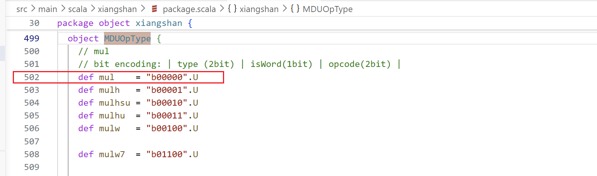

这是一条将使用乘法运算单元的指令，它对逻辑寄存器 14 和 15 号内的值进行 `mul`乘法运算，最终结果将写回到 15 号寄存器中。

### （2）重命名

在译码阶段读取 RAT 表：


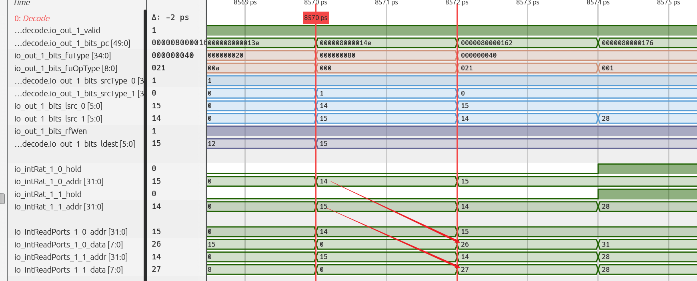

逻辑寄存器 14 号和 15 号读出的物理寄存器分别为 26 号和 27 号。

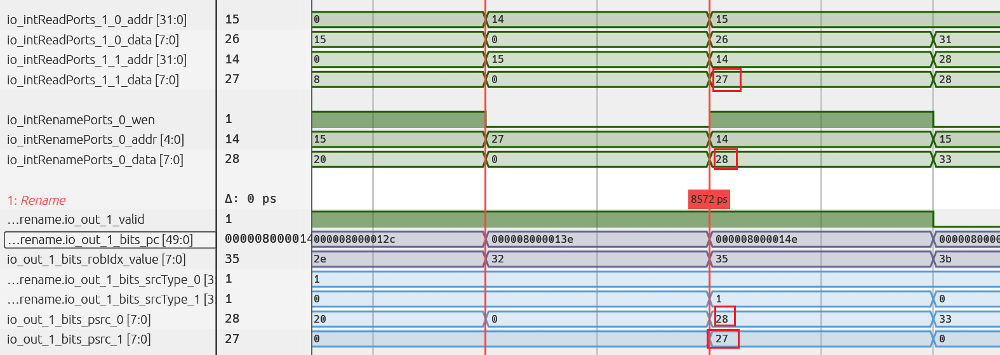

不过，由于在同一周期内，第 0 路有一条指令正在写入第 14 号逻辑寄存器，因此本条指令将使用该指令写入的值，即 28 号物理寄存器。

最终，本条指令使用的源物理寄存器为 28 号和 27 号。


以下可以观察到给这条指令分配的写回物理寄存器情况，写回的物理寄存器情况如下：


本条指令将结果写回第 15 号逻辑寄存器，为其分配的物理寄存器是第 29 号。同时可以从以上波形看到，新的映射关系已成功写入 RAT 表。

此外，观察下面的波形，分配的 ROB 表项值为第 0x35 项。

特别注意：

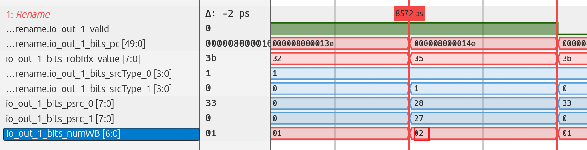

numWB这个值的写回数量为何变为 2？


这是因为涉及到了 ROB 的压缩！它将前一条指令与本条指令合并在一起。两条指令共用同一个 ROB 表项。

这里的压缩是 ROB 记账层面的合并，并不是把 `addi` 与 `mul` 合并成一次乘法运算。它们仍分别分发、执行和回写，共用表项必须等需要的回写全部到齐，才能满足完成条件。

此处触发了一次 ROB 压缩。


### （3）分发阶段

在下一周期，指令顺利进入 Dispatch 阶段。

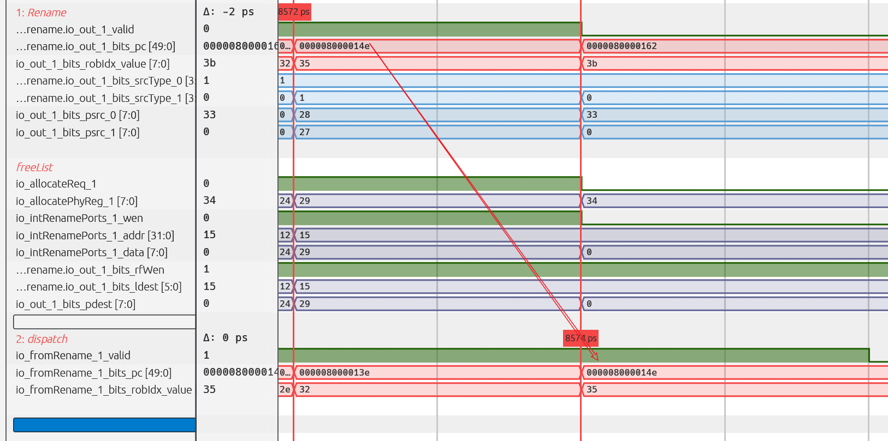

首先观察写入 ROB 的情况：

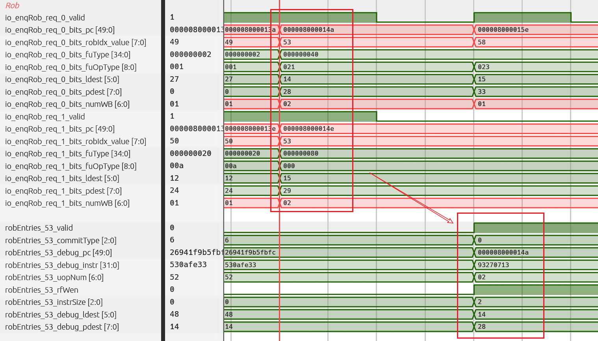

两条指令同时被写入到同一个 ROB 表项中，但其中大部分信息记录的仍是前一条 `addi`指令的内容，本文不详细讲解Rob压缩的机制，所以此处仅知道有这个机制就好。

观察发射信息：

每个 IQ 对应两个分发选择端口的布局下，乘法指令的选择端口为 2，对应 `2 / 2 = 1` 号 IQ。因此此处确立了这条乘法指令在 Dispatch 阶段对 IQ 的端口选择。


上一条 `addi`指令被发往 6/2=3 号 IQ。


此时，回顾架构图，可以发现 0 号和 1 号 IQ 都是具有乘法功能的，行为是正确的。

因此，重点研究被发往 1 号 IQ 的那条乘法指令。


通过架构图上面的名称可以推测，该指令被发往了图中圈出的 Issue Queue。接下来，拉取该 Issue Queue 中的波形进行详细观察。

### （4）IQ 内部

IQsel 信号为 2（偶数），因此需要查看此 IQ 的第 0 个请求接口。

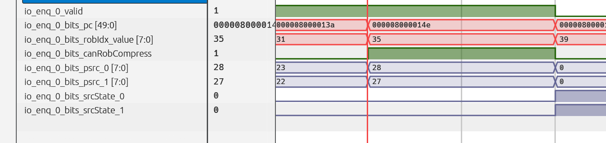

这条乘法指令成功进入 IQ 的请求接口，但其两个源操作数均未准备好，仍处于 Busy 状态。此时完成的是入队，不是向执行单元发射。


随后，入队请求首先被填入 EnqEntry，但由于不能马上发射。在下一周期，数据被迁移至 CompEntry，填入了下标为 2 的那个表项，见如下的波形图。

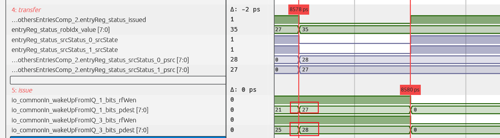

在填入 CompEntry 表项后的第一个周期，便收到了来自同一调度器中其他 Issue Queue 的唤醒信号（见如上波形图）。紧接着的下一个周期，该微操作被成功发射（见下图）。

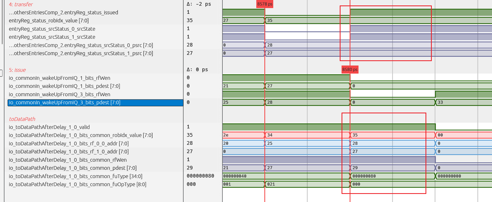

根据上图，在同一周期，本调度器编号为 1 的端口，即下标为 1 的那个 Issue Queue：


其第 0 个端口成功发出了这条乘法指令的发射信息。

### （5）执行

随后，该指令进入对应的执行单元。


因此，从 Issue Queue 出来到进入执行阶段，大致遵循以下流程：

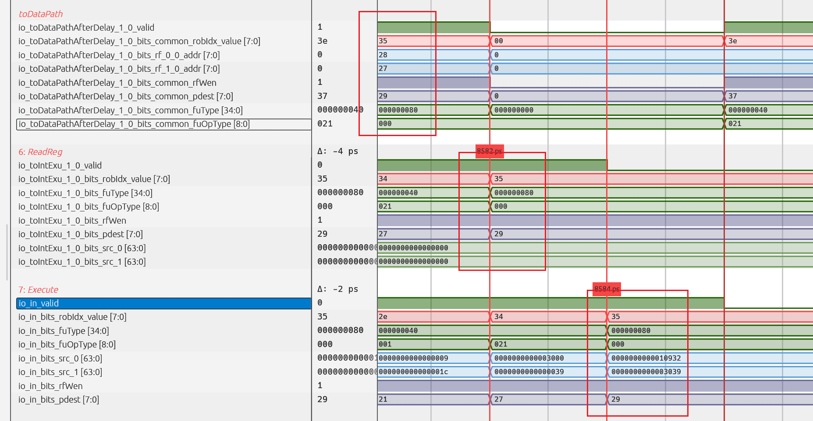

从调度器出来之后，先经过一级流水来读寄存器，紧接着在下一周期就进入了执行的流水阶段。

值得注意的是，在读寄存器阶段，读出的两个值均为 0。通过之前的分析，很容易推断出，这条乘法指令的唤醒来源于同一调度器的其他 IQ。因此，它获取源操作数的方式是通过 Bypass 路径。可以看到，当其进入执行单元时，正好获得了所需的值，因为此时它的源操作数已被计算完成并成功前推回来。

至此，我们已经成功观察到这条乘法微操作顺利进入了执行阶段。

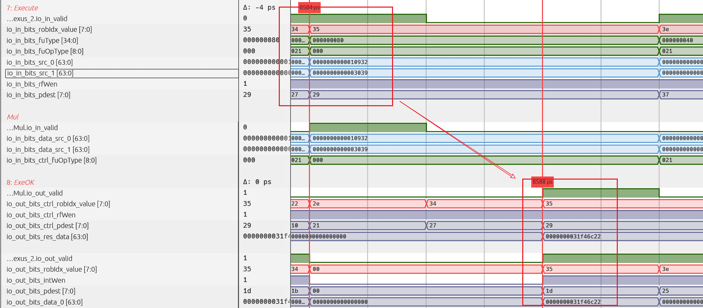

进入执行阶段并被功能单元接收后，流水线乘法器开始运算，随后输出结果。值得我们注意的是，这个乘法在计算的延迟，**是2**。（后面会考）

流水线化还意味着：在端口和下游允许的情况下，前一条乘法没有输出结果时，后续独立乘法也可以进入流水线。单条指令的执行延迟与连续接收指令的间隔是两个不同概念。

执行单元也顺利地将乘法器的结果进行了输出。

### （6）回写

接下来观察结果输出对应的回写接口。在这组波形中，可以同时追踪寄存器堆回写与发往 CtrlBlock 中 ROB 的完成信息。实际判断应以各接口的有效条件为准，不能只看数据线上是否出现结果。

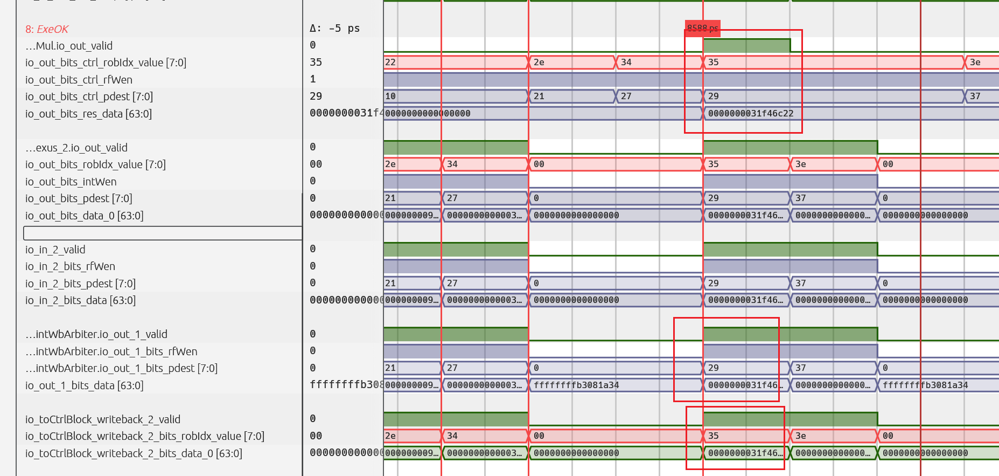

通过观察提交阶段的数据发现，该指令似乎并未提交。原来它在途中被刷掉了……不过，我们来看看被刷掉的原因。

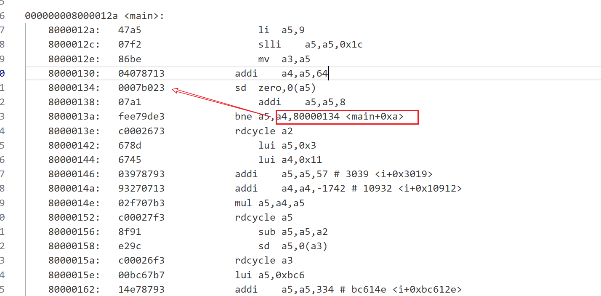


哎哟，不想再重新拉波形了，反正大概的执行过程也就那个过程，经过一顿分析，我们找到了这条指令真正被执行的那个时候，直接忽略前面的发射执行的这些内容，直接看他是怎么被提交的：

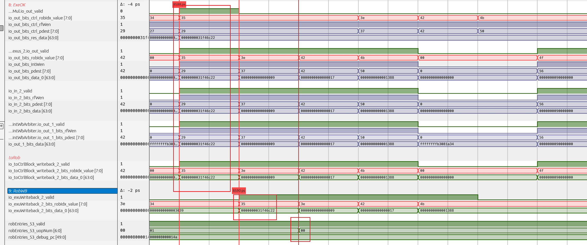

接下来，我们将观察它是如何进行提交的。

### （7）提交


继续观察，可以看到对应 ROB 表项被成功提交。确切地说，这是包含前一条 `addi` 和本条 `mul`、`opNum` 为 2 的压缩 ROB 表项完成提交。乘法虽然固定延迟完成运算，仍然必须遵守 ROB 的顺序提交规则。

## 三、固定延迟如何用来提前唤醒后继指令

### （1）先找到真正的数据依赖

接下来切换到 `0x80000182` 的乘法和 `0x80000186` 的加法。此时我们的重点就是观察， **这条乘法是怎么唤醒他背后的那条加法的**。


如上图，直接先定位到这两条乘法的pc值、指令码等。


如下图，直接忽略他们的译码、重命名等过程，直接从他在分发阶段的时候开始看起，一次性看两条指令：

先看他们对Rob的请求情况：


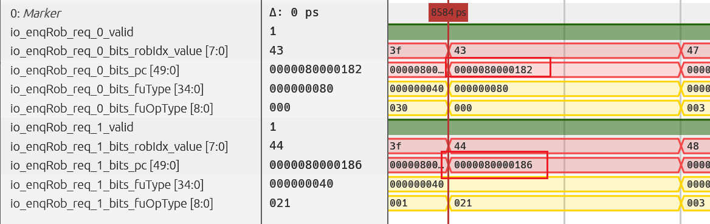


再看这条乘法和加法选择了哪个IQ进行发射出去

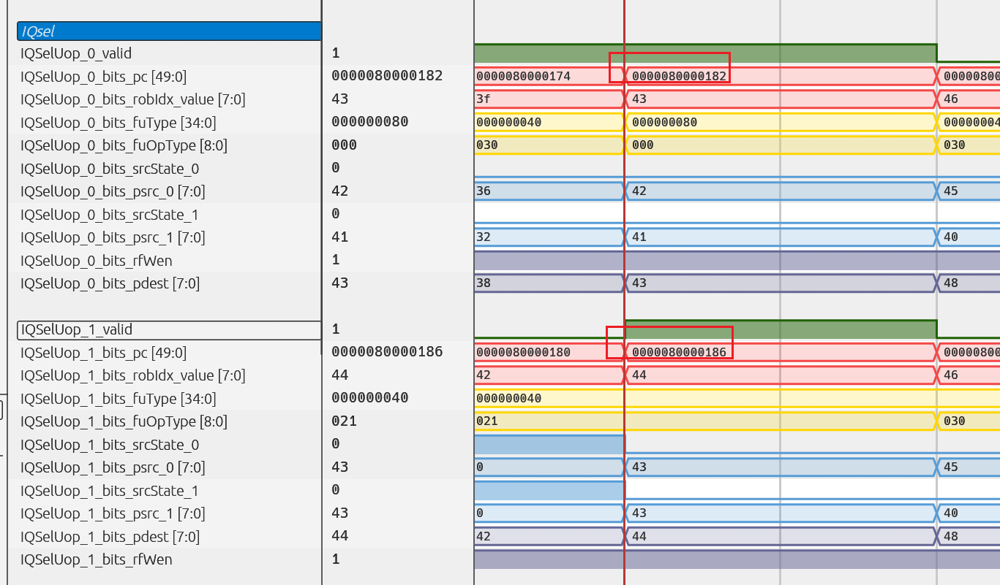


通过上图可以发现，这两条指令都是进入的同一个IQ的


紧接着就是重点了，看看他们什么时候被发射出来的，**重点！！！**

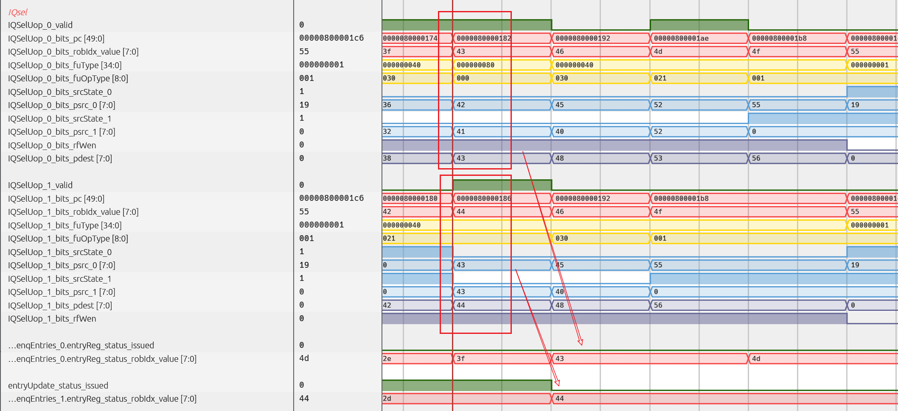


在这上面的两组波形中，两条指令经由同一个 IQ 的两个入队端口进入队列，随后迁移到正式表项。乘法的目的物理寄存器、需要写的是 `0x2b`，而后面这条加法的两个源都依赖它。

因此，我们重点要关注，加法需要的`0x2b`是被怎么样的机制所唤醒的。

此时必须区分两件事：乘法自己的输入何时准备好，取决于它前面的生产者；乘法结果何时能够唤醒加法，才取决于乘法自身的执行延迟。不能因为它们都出现在 IQ 波形中，就把两次唤醒混成一次。

在以上的波形中，我们已经观察到了加法指令是在何时被唤醒的，现在也就重点去研究其机制。


### （2）唤醒请求先进入延迟队列

乘法发射时，硬件已经知道它的目的物理寄存器和功能单元类型，但其结果乘积还没有产生。此时需要传递的不是乘积，而是一条“这个目的寄存器将在约定时刻可用”的控制信息。

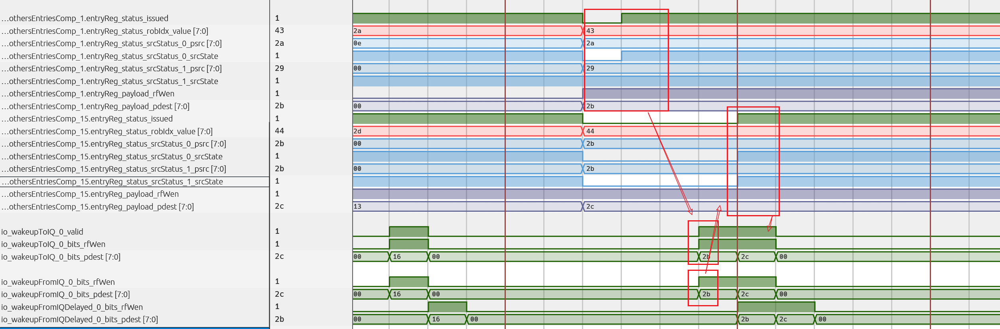


在以上的图中，我们可以看到，加法的两个源操作数的状态之所以被拉高，是因为在前一个周期接受到了 **wakeupToIQ** 的相关信号，所以，要想找到源头，其实也不过是去找一下这个信号的源头是来自于哪儿

所以在代码里逛了一圈后发现，这个信号的源头是来自于一个叫做wakeUpQueues的组件，并且我们还敏锐地发现了其中的一个叫做“getDeqLat”的玩意儿，直觉告诉我们，这就是一个和延迟高度相关的参数


再顺着代码一步一步找，可以看到这个参数的值是跟Fu，也就是使用哪个功能单元的是密切相关的，也就是说，对于乘法指令而言，他的这个延迟参数，是2。诶是不是很熟悉了！前面是不是提到过，乘法指令的计算，是需要延迟两个周期的！

这样一来，其实这个机制就比较好理解了，唤醒的重点就是在这个 **wakeUpQueue**这个组件上！


以下的图就完美解释了整个的唤醒流程：

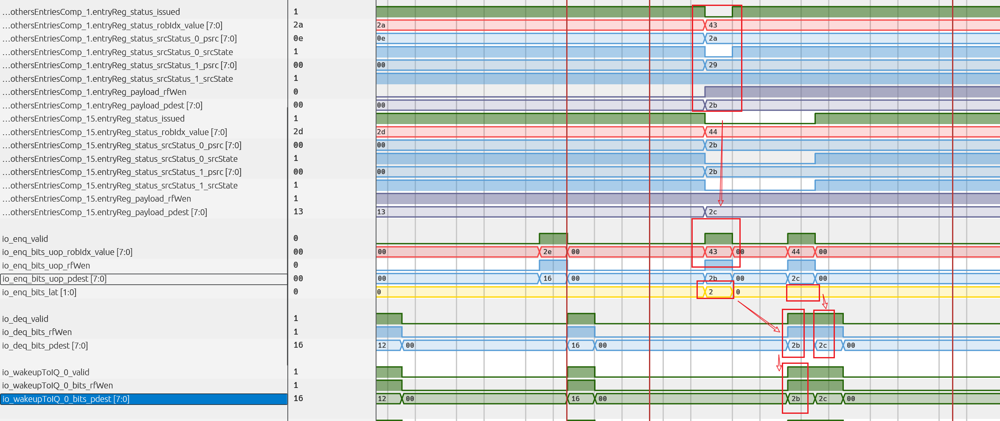


乘法指令在发射的时候，就会忘wakeupQ里面去入队一个信息，当然也就是他要唤醒的一个信息，值得我们特别注意的是，也就是上图中用黄色标记出来的波形，入队的时候不仅仅要入队他要唤醒哪个物理寄存器的信号，还需要同步写入这个延迟，表示这个计算的唤醒是需要延迟多少的，由于乘法的计算是需要延迟两个周期才能计算出来的（流水线乘法器），所以这个延迟是2 。

同理可以再来看看出队。可以清楚地看到，刚刚入队的这个信息，是在两个周期后才出来的，而出来的这个信号，其实越就是真正的唤醒信号了。整个机制堪称完成，利用一个wakeupQ的机制完美实现了这种确定延迟的唤醒。

再比如后面的这个加法，可以看到他的唤醒信号仅仅过了一个周期就被发出来了，因为加法只需要一个周期就发出来了


总结一下，顺着代码查看，可以在 `IssueQueue.scala` 中找到 `wakeUpQueues` 的入队连接：请求携带微操作信息，同时通过 `getDeqLat` 按功能单元类型选择延迟。`MultiWakeupQueue.scala` 则将请求送入对应长度的延迟通路。

对于本例乘法，图中入队的 `lat` 为 2；对应配置为 `CertainLatency(2)`。这不是“等结果回来以后再数两拍”，而是从发射侧安排唤醒请求，经过配置的延迟后向消费者发出通知。相对于普通 ALU 的唤醒基准，乘法的通知需要相应推迟，不能在乘法一发射时就把加法当作下一拍一定有数据。

### （3）提前的是控制，随后到达的是数据

以下重点说明了，结合以上的唤醒机制，再结合整个datapath、bypass等机制把整个执行的过程机制查看一下。

下图展示了乘法发出的唤醒信号


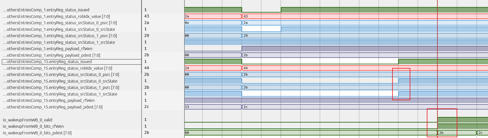

下图展示了那条乘法的整个执行过程


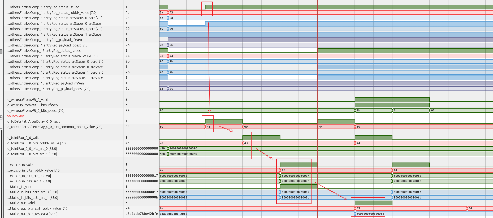


下图展示了在乘法结果还没有算出来的前一个周期，唤醒信号就发出来了


下图展示了这两条指令背靠背的执行流程，如果你懂了，你应该可以非常清楚地知道下面的这个图到底在讲什么

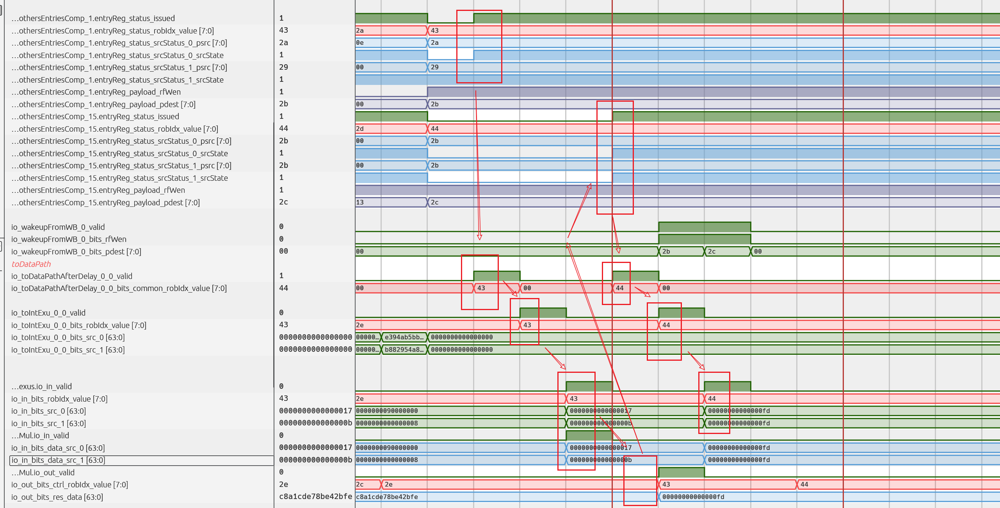

原始波形显示，加法收到 IQ 侧唤醒的时刻早于对应的回写唤醒。于是，它可以提前更新源状态，并参与后续发射选择。此时乘积未必已经存在于寄存器堆中，但加法从被选中，到经过读寄存器和 Bypass，再到真正使用操作数，还需要经历流水级。

这正是固定延迟的作用：把消费者的准备过程与生产者尚未结束的运算重叠起来。这里不应笼统地承诺“总能提前两拍”或“完全没有气泡”；具体领先多少拍，要看所比较的接口、流水级和当时的资源占用。能够保证的是，在预测对应的执行路径有效时，数据到达时间与消费者使用时间相互配合。

### （4）Bypass 把正确结果送到加法输入

下面展示了一小点关于bypass的机制。建议查看

* [Bypass 与 RegCache](../../scenarios-analysis/backend-mechanisms/bypass-and-regcache/bypass-and-regcache.md)

加法被唤醒之后，再沿 datapath 向后看。即使读寄存器阶段看到旧值或零，也不能直接断定执行错误，因为最终操作数可能选自执行结果前推，而不是这个寄存器堆读口。

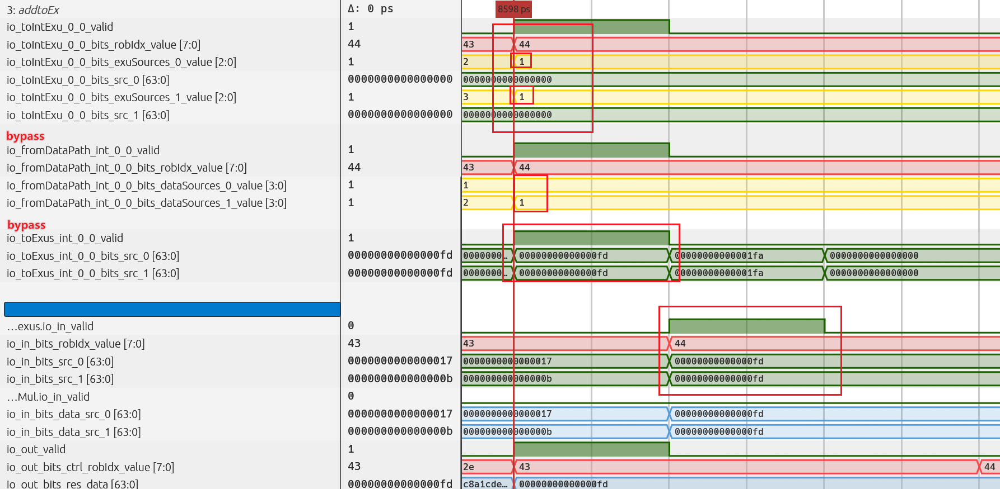


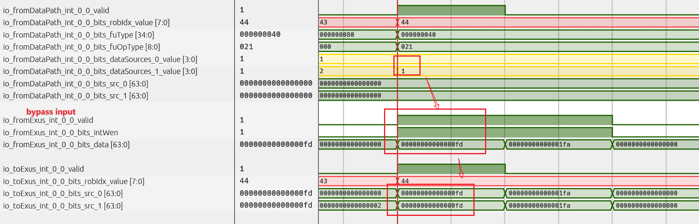

在原始示例中，Bypass 网络选出了乘法结果 `0xfd`，也就是十进制 `253`，再将它送到加法执行输入。加法两个源均为这个数，因此结果为 `506`。

可以把两条通路分开理解：唤醒通路回答“什么时候可以准备使用这个源”，Bypass 数据通路回答“执行时从哪里取得这个源”。`dataSource` 指示数据来源类别，`exuSource` 指示相关执行单元来源。RegCache 是可能的数据来源之一，但这一次紧密依赖并不意味着必须先写 RegCache、再从 RegCache 读取；应以实际选择信号为准。

### （5）提前唤醒必须允许取消

最后还要补上一条约束：提前安排的唤醒，只在对应指令正常沿预计路径执行时才成立。如果发射后的流水级阻塞、源依赖被取消，或者发生重定向，就不能继续把这个预计结果当作有效结果。

核对的 `IssueQueue.scala` 将 redirect、load cancel 以及 OG0、OG1 阶段的失败响应送入唤醒队列的取消逻辑。这里说明的是固定延迟预测同样需要有效性管理，并不是所有取消都来自乘法器，也不是固定延迟指令永远不会重发。

## 四、把固定延迟执行过程串起来

| 观察位置 | 本条乘法在做什么 | 对后继加法的意义 |
| --- | --- | --- |
| 译码、重命名 | 确认乘法类型，建立源和目的物理寄存器关系 | 确认加法究竟依赖哪一个目的寄存器 |
| 分发、IQ 等待 | 等待乘法自己的源和发射资源 | 此时乘法尚未开始运算 |
| 发射侧 | 发出乘法，并按配置安排延迟唤醒 | 不必先等真实回写到来 |
| 功能单元执行 | 按固定流水延迟生成结果 | 唤醒时序可以与结果可用时序对齐 |
| 加法读数与 Bypass | 从所选数据通路取得乘积 | 提前就绪不等于提前读到数据 |
| 回写、提交 | 回写物理寄存器和 ROB，按顺序提交 | 唤醒消费者不需要等待生产者提交 |

到这里，乘法的执行过程就完整串起来了。固定的是功能单元约定的运算延迟，不是 IQ 等待时间，也不是整条指令从译码到提交的总时间。处理器利用这个确定性提前传递控制信息，再由 Bypass 等数据通路保证执行时拿到正确结果。

## 五、源码与延伸阅读

本地核对位置（相对于前述源码根目录）：

* `src/main/scala/xiangshan/backend/fu/FuConfig.scala`：`MulCfg` 的流水化和延迟配置。
* `src/main/scala/xiangshan/backend/fu/wrapper/MulUnit.scala`：固定延迟、结果高低位及字操作选择。
* `src/main/scala/xiangshan/backend/issue/IssueQueue.scala`：唤醒请求、延迟选择和取消条件。
* `src/main/scala/xiangshan/backend/issue/MultiWakeupQueue.scala`：按延迟配置组织的唤醒通路。

* [一条除法指令的执行过程：不固定延迟与回写唤醒](div-execution-process.md)
* [乘法与除法的唤醒机制](../../scenarios-analysis/backend-mechanisms/wakeup-mechanism/wakeup-mechanism-of-mul-div.md)
* [Bypass 与 RegCache](../../scenarios-analysis/backend-mechanisms/bypass-and-regcache/bypass-and-regcache.md)
