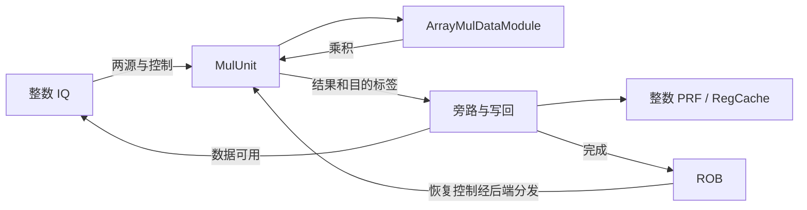
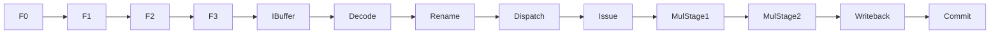

# 整数乘法指令执行生命周期

## 📋 基本信息

| 字段 | 内容 |
|---|---|
| **指令名称** | `mul`、`mulh`、`mulhsu`、`mulhu`、`mulw` |
| **编码格式** | R 型：`0000001_rs2_rs1_funct3_rd_opcode`；前四条的 `opcode=0110011`，`funct3` 依次为 `000/001/010/011`；`mulw` 为 `opcode=0111011, funct3=000` |
| **RISC-V 扩展** | RV64M 标量整数乘法；不包含浮点、向量和无进位乘法 |
| **是否有压缩格式** | 本文五条 RV64M 指令均按 32 位编码分析；基础 C 扩展没有对应整数乘法编码，不把其他扩展的压缩运算混入此路径 |
| **指令分类** | 整数计算／流水化乘法 |
| **FuType** | `FuType.mul` |
| **FuOpType** | 译码使用 `MDUOpType.mul/mulh/mulhsu/mulhu/mulw`；执行侧使用编码一致的 `MULOpType` 解释 |
| **目标 FU** | `MulUnit` → `ArrayMulDataModule` |
| **分析日期** | 2026-09-06 |

实现依据为本地 `/nfs/home/wanghao/emuByYuan/stable-kmh-v2`，源码标识 `abd0f867a86b66a92d4fc5d3c6d62944725c747f`。下文参数指 `XSCoreParameters` 默认声明，不代表任意仿真配置。周期是源码推导，未将历史教学报告中的波形周期作为本版本实测数据。除法与余数见 [整数除法生命周期](div-lifecycle.md)。

## 1. 前端路径

### 1.1 取指

| 阶段 | 延迟 | 关键行为 | 代码位置 |
|---|---|---|---|
| ICache/MainPipe | 可变 | 获取指令块；miss、ITLB/PTW 和取指背压可以延长等待，与乘法运算耗时无关 | [IFU][IF] |
| IFU F0 | 请求接受 | FTQ 请求握手，建立取指请求 | [IFU][IF] 241–263 行 |
| IFU F1 | 无停顿时一阶段 | 保存请求并推进 | [IFU][IF] 291–304 行 |
| IFU F2 | 可等待响应 | 处理取指数据及预译码输入 | [IFU][IF] 357–385 行 |
| IFU F3 | 可被 IBuffer 阻塞 | 以有效范围和指令边界形成入队数据 | [IFU 入队][IFO] 953–986 行 |

> **前端流水线总延迟（无冲刷）：** 响应及时、各级连续推进时，F0 到 F3 为三个阶段推进间隔；ICache 请求之前的等待和 IBuffer 滞留不包含在内，不能据此给出取指到提交固定延迟。

### 1.2 预译码

| 项目 | 内容 |
|---|---|
| **brTable 匹配** | 不匹配分支/跳转条目，得到 `BrType.notCFI` |
| **PreDecodeInfo 字段** | 对有效的本文 32 位指令：`valid=1, isRVC=0, brType=notCFI, isCall=0, isRet=0` |
| **是否有专用检测逻辑** | 无乘法专用前端字段；乘法类别由后端译码确定 |
| **跳转偏移计算** | 通用偏移组合逻辑可对窗口运行，但乘法不使用该结果改变 PC |

依据：[PreDecode.scala][PD] 35–82 行。

### 1.3 PredChecker 校验

| 项目 | 内容 |
|---|---|
| **是否触发 remaskFault** | 本条不满足 JAL/JALR/RET 条件；同窗口的更早控制流指令可触发 |
| **是否触发 mispredict** | 正常不触发；若预测器把该非 CFI 位置预测为 taken，可触发 `notCFITaken` |
| **是否产生 wbRedirect** | 可能因通用前端预测校验错误产生恢复，不是乘法 FU 发起跳转 |
| **fixedRange 影响** | 本条不主动截断范围，但可以被更早控制流的修正范围屏蔽 |

依据：[PredChecker][CHECK] 361–445 行。

### 1.4 IBuffer 入队

| 项目 | 内容 |
|---|---|
| **入队宽度** | `PredictWidth=FetchWidth*(HasCExtension ? 2 : 1)`；默认 `FetchWidth=8`，C 开启时有 16 个半字候选位置，不等于每拍 16 条 32 位乘法 |
| **是否可能被挡** | 容量/ready 背压；`enqEnable` 还受 `fixedRange` 和指令有效掩码限制 |
| **携带的关键信息** | 指令字、PC、FTQ 指针/偏移、预译码、取指异常及 trigger 信息 |
| **代码位置** | [IFU][IFO] 953–986 行、[IBuffer][IB] 227–305 行 |

## 2. 后端路径

### 2.1 译码

| 项目 | 内容 |
|---|---|
| **DecodeWidth** | 默认 6 |
| **简单/复杂译码** | 五条指令直接表译码；本文不将内部融合操作 `mulw7` 当作 ISA 指令 |
| **译码延迟** | 表匹配为组合逻辑，不包含 DecodeStage 握手和流水寄存器等待 |
| **关键译码结果** | 两个 `SrcType.reg` 输入、第三源 `SrcType.X`、`FuType.mul`、相应 `MDUOpType`、`SelImm.X`、`xWen=T` |
| **代码位置** | [DecodeUnit][D] 184–189 行；[操作码][OP] 465–526 行 |

第三源 `SrcType.X` 不是目的类型。目的为整数 `rd`；`rd=x0` 丢弃结果，不改变乘法语义。普通乘法不设置 Fence 式串行化或 `flushPipe`。

### 2.2 重命名

| 项目 | 内容 |
|---|---|
| **RenameWidth** | 默认 6 |
| **延迟** | 经过 Rename 流水边界；受空闲物理寄存器和下游 ready 影响，不指定固定端到端拍数 |
| **源操作数** | 两个整数逻辑源映射至物理源；同组依赖需要重命名旁路 |
| **目标操作数** | `rd≠x0` 且写使能有效时分配整数物理目的；保留旧映射供提交回收/恢复 |
| **特殊处理** | W 型不会分配 32 位寄存器，仍产生 XLEN 位结果 |
| **代码位置** | [Rename][R]，尤其 634–684 行 |

### 2.3 派发

| 项目 | 内容 |
|---|---|
| **DispatchWidth** | Rename 输入默认 6 路；各 IssueBlock 默认 `numEnq=2`，不能将两者混为一谈 |
| **延迟** | 受 ROB、派发队列和 IQ 空间影响，可变 |
| **目标 ROB** | 进入 ROB，携带物理目的、异常信息与 `robIdx` |
| **目标 Issue Queue** | 默认整数调度块中通向 `ALU0/ALU1` 的共享 IQ；这两个 ExeUnit 均含 `AluCfg, MulCfg, BkuCfg` |
| **代码位置** | [NewDispatch][DIS]、[执行配置][PORT] 391–410 行 |

### 2.4 发射

| 项目 | 内容 |
|---|---|
| **Issue Queue 类型** | 整数共享 IQ，不是专门只装乘法的队列 |
| **唤醒条件** | 两源数据可用，并满足选择、端口及执行/写回资源约束 |
| **选择策略** | IQ 的就绪与年龄选择逻辑；多个执行槽共同受仲裁约束，不承诺全局严格 oldest-first |
| **最小延迟** | 必须经过就绪选择和读数/旁路路径；不能把 FU 的 2 拍直接当作 IQ 到写回延迟 |
| **最大延迟** | 等待生产者或资源时没有独立于环境的有限上界 |
| **代码位置** | [IssueQueue][IQ]、[BypassNetwork][BP] 153–171 行 |

### 2.5 执行

| 项目 | 内容 |
|---|---|
| **执行单元** | `MulUnit` 内实例化 `ArrayMulDataModule(XLEN+1)`，RV64 输入扩展到 65 位 |
| **流水/阻塞** | `piped=true`；数据和控制共用两级使能；不套用除法的 busy FSM |
| **执行延迟** | `CertainLatency(2)`，wrapper 的 `latency=2` 与两组 `regEnables` 一致；该数值限定 FU 内无停顿正常路径 |
| **FSM 状态机** | 无事务迭代状态机；使用 `HasPipelineReg` 的 valid、ready、控制寄存器推进 |
| **关键输出信号** | `io.out.valid`、`res.data`、`ctrl.pdest`、`ctrl.robIdx` |
| **代码位置** | [MulUnit][U] 10–61 行、[Multiplier][CORE] 42–160 行、[流水控制][PIPE] 166–266 行 |

| 指令 | 输入转换 | 结果选择 |
|---|---|---|
| `mul` | 两源零扩展到 65 位；低位乘积不依赖有符号解释 | 乘积 `[63:0]` |
| `mulh` | 两源符号扩展 | 乘积 `[127:64]` |
| `mulhsu` | `rs1` 符号扩展，`rs2` 零扩展，不能交换二者解释 | 乘积 `[127:64]` |
| `mulhu` | 两源零扩展 | 乘积 `[127:64]` |
| `mulw` | 使用低位乘积路径 | `[31:0]` 符号扩展到 64 位 |

ArrayMul 使用每次两位的 Booth 部分积选择、列压缩及最终 `sum+carry`。`regEnables(0/1)` 对应两处寄存边界；`isHi/isW` 经过相同数量的控制寄存器，避免连续不同乘法混用结果选择。[MulUnit][U]、[Multiplier][CORE]

### 2.6 写回

| 项目 | 内容 |
|---|---|
| **写回端口** | 默认 `ALU0` 对应 `IntWB(0,0)`、`ALU1` 对应 `IntWB(1,0)`；与其他配置的同端口执行结果存在资源约束 |
| **是否写回** | 有效整数目的接收 64 位乘积结果；无 FP/Vec 写回 |
| **写回延迟** | FU 完成、旁路可见、RegCache 写入、PRF 写入是不同边界；不能统一称为“执行后 1 拍” |
| **代码位置** | [执行配置][PORT]、[BypassNetwork][BP] 153–218 行、[ExeUnit][EXU] |

BypassNetwork 分别提供 `readForward/readBypass/readBypass2/readRegCache`。对满足 `needWriteRegCache` 的源，写使能和标签由执行结果有效性寄存，数据取 `bypassDataVec`；因此 RegCache 是依赖加速路径，不是乘法提交条件。实际 issue→PRF/RegCache 总拍数还需对应生成配置或波形确认。[BypassNetwork][BP] 195–218 行

### 2.7 提交

| 项目 | 内容 |
|---|---|
| **CommitWidth** | 默认 `CommitWidth=8, RobCommitWidth=8`；不是每拍保证提交 8 条乘法 |
| **提交条件** | ROB 按序允许提交，乘法完成且不存在阻止提交的更老指令/异常 |
| **是否触发 flush** | 正常乘法不主动请求 flush；错误路径或异常恢复可取消其结果 |
| **是否触发 redirect** | 乘法 FU 不产生控制流 redirect；接收外部恢复控制 |
| **代码位置** | [Rob][ROB]、[MulCfg][CFG]、[流水控制][PIPE] |

## 3. 信号前递

### 3.1 前递路径图





### 3.2 信号清单

| 信号名 | 方向 | 位宽 | 语义 | 持续方式 |
|---|---|---|---|---|
| `io.in.valid/ready` | 上游 ↔ MulUnit | 各 1 | FU 接受条件 `fire=valid&&ready` | 握手 |
| `data.src(0/1)` | 旁路/读数 → FU | 各 64 | 两整数操作数 | 随输入 |
| `fuOpType` | 译码 → FU | `FuOpType` 宽度 | 高低位、W 型和符号选择 | 随 uop |
| `regEnables` | wrapper → array | 2 | 两级寄存使能 | 逐级有效推进 |
| `res.data` | FU → 旁路/写回 | 64 | 最终结果 | 与输出 valid 对齐 |
| `pdest/robIdx` | 控制流水 → 写回/ROB | 参数化 | 数据依赖与指令身份 | 随结果 |
| `io.flush` | 后端 → FU | Redirect Bundle | 外部恢复身份与范围 | Valid 控制，不是乘法输出 |

## 4. 周期计算

### 4.1 流水线延迟分解

| 阶段 | 固定/可变 | 周期数 | 说明 |
|---|---|---|---|
| Decode | 组合 | 0 个额外逻辑寄存级 | 不包含输入排队 |
| Rename/Dispatch | 可变 | `T_r + T_d` | 按实际握手测量 |
| Issue/读数 | 可变 | `T_i` | 含两源依赖、调度与旁路选择 |
| Mul FU | 源码固定流水深度 | 2 | 无停顿有效输入到输出可见 |
| 写回 | 配置/资源相关 | `T_w` | FU 输出到写回完成 |
| 提交 | 可变 | `T_c` | 等待 ROB 按序提交 |
| **合计** | 可变 | `T_r+T_d+T_i+2+T_w+T_c` | 不含前端和 IBuffer 排队 |

### 4.2 公式

$$T_{decode\to commit}=T_r+T_d+T_i+2+T_w+T_c$$

起点为译码可用，终点为提交；从取指开始还需加前端时间。单 MulUnit 无资源冲突时启动间隔为 1 拍；默认两个 MulCfg 实例给出 FU 层每拍 2 条独立乘法的资源上限，不是依赖链吞吐或整核承诺。

### 4.3 最佳/最差情况

| 场景 | 周期数 | 条件 |
|---|---|---|
| **最佳** | FU 深度 2；端到端另计 | 两源已就绪、正常流水推进、写回可接收 |
| **典型** | 没有本版本统计分布 | 连续独立乘法可重叠，相关乘法需等待旁路数据 |
| **最差** | 排队/提交无环境无关上界 | load 生产者等待、共享 ALU/BKU 资源、写回冲突或恢复 |

### 4.4 时序图

以下是无停顿输入流的 FU 级示意，`A/B/C` 为独立乘法，不是实测周期编号。

```text
周期窗口       C0    C1    C2    C3    C4
in.fire        A     B     C     -     -
第一级         -     A     B     C     -
第二级/输出    -     -     A     B     C
out.ready      1     1     1     1     1
```

```wavedrom
{"signal":[{"name":"clock","wave":"p...."},{"name":"in.valid","wave":"1..0."},{"name":"in.ready","wave":"1...."},{"name":"out.valid","wave":"0.1.."},{"name":"out.ready","wave":"1...."}]}
```

波形核验以 `TOP.clock` 正沿采样；前端以 PC 定位，Rename 后以 `robIdx/pdest` 追踪。必须分别记录 issue、FU 输入、forward/bypass、RegCache、PRF 和 commit，不能从代码流水深度伪造实测表。

## 5. 异常与特殊处理

### 5.1 异常检测

| 异常类型 | 检测位置 | 检测条件 | 处理方式 |
|---|---|---|---|
| 乘积溢出 | 算术结果选择 | 高位超出目的宽度 | 不是 trap；按指令截取高/低位 |
| 非法编码 | DecodeUnit | 编码不属于有效译码项 | 通用非法指令异常 |
| 取指异常 | 前端 | 本条取指页故障、访问故障等 | 携带异常进入通用精确异常路径 |
| 更老异常/误预测 | 后端恢复 | 本乘法落在取消范围 | 撤销年轻架构效果，不作为本条算术异常 |

### 5.2 冲刷与重定向

| 触发条件 | 类型 | 影响范围 | 恢复方式 |
|---|---|---|---|
| 更老分支错误 | 外部 redirect | 年轻 IQ/执行/ROB 项 | 按身份恢复映射和流水有效性 |
| 更老 trap | 精确异常 | 异常后的年轻指令 | ROB 通用恢复；乘法不生成目标 PC |
| 前端预测校验 | 局部前端恢复 | 无效取指范围 | 不把已屏蔽指令作为有效乘法入队 |

### 5.3 与其他指令的交互

| 交互场景 | 影响指令 | 行为 |
|---|---|---|
| `load → mul` | 乘法源 | load 未完成会增加 `T_i`，不改变 Mul FU 两级结构 |
| `mul → add/mul` | 结果消费者 | 唤醒与旁路必须以物理目的匹配，不能只比较逻辑 rd |
| `mulh` 与 `mul` | 同一操作数的高/低乘积 | ISA 可分别取得两部分；不假定本地会融合成一次运算 |
| `mulw` | RV64 消费者 | 低 32 位结果必须符号扩展，例如结果低字 `0x80000000` 变为 `0xffffffff80000000` |
| Cache line/页边界/MMIO | 指令获取或源生产者 | 乘法自身不发 load/store 请求；跨界取指、MMIO load 的等待应归入相应前置路径 |

## 6. 安全性分析

### 6.1 推测执行窗口

| 窗口 | 起始点 | 终止点 | 周期数 | 风险等级 |
|---|---|---|---|---|
| 错误路径算术 | 推测发射 | 外部恢复或有效提交 | 可变 | 需场景验证，未测定 |
| 共享执行资源 | IQ 就绪 | 获得执行槽 | 可变 | 潜在时序观察面，非漏洞结论 |

### 6.2 侧信道暴露面

| 暴露面 | 类型 | 缓解措施 |
|---|---|---|
| ALU/BKU/MUL 共享调度与写回 | 微架构时序 | 固定 FU 深度不保证端到端常数时间；需隔离资源并测量竞争 |
| 部分积与切换活动 | 潜在功耗/电磁 | 本次无门级或功耗数据，不能由固定延迟推导无泄漏 |
| 错误路径状态 | 推测执行 | ROB 保证架构按序提交，不等于抹除所有微架构痕迹 |

### 6.3 有序性保证

| 保证 | 机制 | 代码依据 |
|---|---|---|
| 运算控制与结果对齐 | `isHi/isW` 经两级 PipelineReg | [MulUnit][U] |
| 源数据来自正确生产者 | 物理寄存器重命名、旁路选择 | [Rename][R]、[BypassNetwork][BP] |
| 完成不等于提交 | ROB 按程序顺序退休 | [Rob][ROB] |

## 7. 性能特征

| 指标 | 值 | 说明 |
|---|---|---|
| **执行吞吐** | 单 FU 最佳 1 条/拍；默认两实例 FU 层上限 2 条/拍 | 独立输入、端口可用、无恢复；不代表相关链吞吐 |
| **执行延迟** | FU 深度 2 拍 | `CertainLatency(2)`，不含 IQ/PRF/commit |
| **端口占用** | 默认 ALU0/ALU1 与 IntWB 0/1 | 与其他功能共享执行/写回资源 |
| **流水线阻塞** | 源依赖、调度冲突、写回约束 | 与迭代除法 busy 不同 |
| **关键路径影响** | 部分积压缩与末级加法 | 未综合/STA，不报告频率结论 |

## 8. 配置依赖

| 参数 | 默认值 | 影响 | 配置位置 |
|---|---|---|---|
| `XLEN` | 64 | 65 位扩展输入、64 位结果 | [Parameters][P] |
| `FetchWidth/IBufSize` | 8/48 | 前端窗口与容量 | [Parameters][P] |
| `DecodeWidth/RenameWidth` | 6/6 | 后端输入宽度 | [Parameters][P] |
| `RobCommitWidth/RobSize` | 8/160 | 提交和在途资源 | [Parameters][P] |
| `MulCfg.latency/piped` | `CertainLatency(2)/true` | FU 深度与重叠能力 | [MulCfg][CFG] |
| `MulCfg` 实例数 | 默认 2 | ALU0、ALU1 | [执行配置][PORT] |

## 附录：关键代码索引

源码链接定位到本地文件和起始行，关键行号列给出分析区间。

| 模块 | 文件路径 | 关键行号 |
|---|---|---|
| 译码与操作类型 | [DecodeUnit][D]、[package.scala][OP] | 184–198；465–526 |
| Mul 配置/wrapper | [FuConfig][CFG]、[MulUnit][U] | 322–332；10–61 |
| 数据阵列/流水控制 | [Multiplier][CORE]、[FuncUnit][PIPE] | 42–160；166–266 |
| 前端与预译码 | [IFU][IF]、[PreDecode][PD]、[PredChecker][CHECK] | 241–385、953–986；35–82、361–445 |
| 重命名/派发/调度 | [Rename][R]、[NewDispatch][DIS]、[IssueQueue][IQ] | 634–684；720–815；420–490 |
| 旁路与结果输出 | [BypassNetwork][BP]、[ExeUnit][EXU] | 153–218；执行接口及仲裁 |
| ROB/参数 | [Rob][ROB]、[Parameters][P]、[执行配置][PORT] | 提交/恢复；59–178、391–410 |

[IF]: /nfs/home/wanghao/emuByYuan/stable-kmh-v2/src/main/scala/xiangshan/frontend/IFU.scala#L241
[IFO]: /nfs/home/wanghao/emuByYuan/stable-kmh-v2/src/main/scala/xiangshan/frontend/IFU.scala#L953
[PD]: /nfs/home/wanghao/emuByYuan/stable-kmh-v2/src/main/scala/xiangshan/frontend/PreDecode.scala#L35
[CHECK]: /nfs/home/wanghao/emuByYuan/stable-kmh-v2/src/main/scala/xiangshan/frontend/PreDecode.scala#L361
[IB]: /nfs/home/wanghao/emuByYuan/stable-kmh-v2/src/main/scala/xiangshan/frontend/IBuffer.scala#L227
[D]: /nfs/home/wanghao/emuByYuan/stable-kmh-v2/src/main/scala/xiangshan/backend/decode/DecodeUnit.scala#L184
[OP]: /nfs/home/wanghao/emuByYuan/stable-kmh-v2/src/main/scala/xiangshan/package.scala#L465
[CFG]: /nfs/home/wanghao/emuByYuan/stable-kmh-v2/src/main/scala/xiangshan/backend/fu/FuConfig.scala#L322
[U]: /nfs/home/wanghao/emuByYuan/stable-kmh-v2/src/main/scala/xiangshan/backend/fu/wrapper/MulUnit.scala#L10
[CORE]: /nfs/home/wanghao/emuByYuan/stable-kmh-v2/src/main/scala/xiangshan/backend/fu/Multiplier.scala#L42
[PIPE]: /nfs/home/wanghao/emuByYuan/stable-kmh-v2/src/main/scala/xiangshan/backend/fu/FuncUnit.scala#L166
[R]: /nfs/home/wanghao/emuByYuan/stable-kmh-v2/src/main/scala/xiangshan/backend/rename/Rename.scala#L385
[DIS]: /nfs/home/wanghao/emuByYuan/stable-kmh-v2/src/main/scala/xiangshan/backend/dispatch/NewDispatch.scala#L720
[IQ]: /nfs/home/wanghao/emuByYuan/stable-kmh-v2/src/main/scala/xiangshan/backend/issue/IssueQueue.scala#L420
[BP]: /nfs/home/wanghao/emuByYuan/stable-kmh-v2/src/main/scala/xiangshan/backend/datapath/BypassNetwork.scala#L153
[EXU]: /nfs/home/wanghao/emuByYuan/stable-kmh-v2/src/main/scala/xiangshan/backend/exu/ExeUnit.scala#L100
[ROB]: /nfs/home/wanghao/emuByYuan/stable-kmh-v2/src/main/scala/xiangshan/backend/rob/Rob.scala#L610
[P]: /nfs/home/wanghao/emuByYuan/stable-kmh-v2/src/main/scala/xiangshan/Parameters.scala#L59
[PORT]: /nfs/home/wanghao/emuByYuan/stable-kmh-v2/src/main/scala/xiangshan/Parameters.scala#L391
