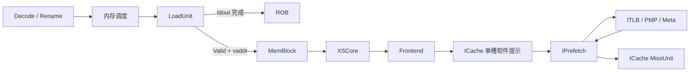
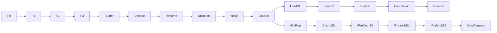

# PREFETCH.I 指令执行生命周期

## 📋 基本信息

| 字段 | 内容 |
|---|---|
| **指令名称** | `prefetch.i offset(rs1)` |
| **编码格式** | `imm[11:5]_00000_rs1_110_00000_0010011`，属于 `ORI rd=x0` 的 hint 编码空间；例如 `0x0007e013` 为 `prefetch.i 0(a5)` |
| **RISC-V 扩展** | `Zicbop`，软件指令预取提示 |
| **是否有压缩格式** | 本文为 32 位编码，基础 C 扩展没有对应 `prefetch.i` 编码 |
| **指令分类** | 软件预取／指令侧 hint，不是跳转或缓存一致性屏障 |
| **FuType** | `FuType.ldu` |
| **FuOpType** | `LSUOpType.prefetch_i` |
| **目标 FU** | 内存调度 → LoadUnit 地址生成；旁路提示到 Frontend/ICache/IPrefetch |

本文以本地 `/nfs/home/wanghao/emuByYuan/stable-kmh-v2` 为实现依据，源码标识为 `abd0f867a86b66a92d4fc5d3c6d62944725c747f`。下文仅将代码可证明的时序作为推导，不采用其他源码环境的波形周期。必须区分两条路径：**后端 uop 完成并提交**，以及**异步提示被 ICache 接收并可能引发填充**。后者不是前者的完成应答。

## 1. 前端路径

### 1.1 取指

| 阶段 | 延迟 | 关键行为 | 代码位置 |
|---|---|---|---|
| ICache/MainPipe | 可变 | 获取 `prefetch.i` 自身所在指令块；与它将来提示的目标代码块是不同请求 | [IFU][IF] |
| IFU F0 | 请求握手 | 接受 FTQ 取指请求 | [IFU][IF] 241–263 行 |
| IFU F1 | 无停顿时一阶段 | 保存请求并推进 | [IFU][IF] 291–304 行 |
| IFU F2 | 可等待 | 接收 ICache 响应、整理预译码输入 | [IFU][IF] 357–385 行 |
| IFU F3 | 可背压 | 根据指令边界和修正范围送入 IBuffer | [IFU 入队][IFO] 953–986 行 |

> **前端流水线总延迟（无冲刷）：** F0→F3 连续推进需要三个阶段间隔；取指 miss、IBuffer 等待另计。此延迟不是目标代码的预取填充时间。

### 1.2 预译码

| 项目 | 内容 |
|---|---|
| **brTable 匹配** | 不匹配分支/跳转，得到 `BrType.notCFI` |
| **PreDecodeInfo 字段** | 有效 32 位指令为 `valid=1,isRVC=0,brType=notCFI,isCall=0,isRet=0` |
| **是否有专用检测逻辑** | 前端预译码不生成软件预取请求；后端 DecodeUnit 再识别 hint |
| **跳转偏移计算** | 通用偏移逻辑可运行，但本条不用其结果改变 PC |

依据：[PreDecode][PD] 35–82 行。

### 1.3 PredChecker 校验

| 项目 | 内容 |
|---|---|
| **是否触发 remaskFault** | 本条不是 JAL/JALR/RET，不主动触发 |
| **是否触发 mispredict** | 正常不触发；若非 CFI 位置被预测 taken，可由 `notCFITaken` 检出 |
| **是否产生 wbRedirect** | 通用前端预测校验可能恢复，但不是本条发出跳转 |
| **fixedRange 影响** | 本条可被同块更早控制流错误截断；不能把被屏蔽指令作为有效提示 |

依据：[PredChecker][CHECK] 361–445 行。

### 1.4 IBuffer 入队

| 项目 | 内容 |
|---|---|
| **入队宽度** | `PredictWidth=FetchWidth*(HasCExtension ? 2 : 1)`；默认 FetchWidth=8，C 开启时为 16 个半字候选位置 |
| **是否可能被挡** | IBuffer 容量、ready 和 `enqEnable` 有效范围限制 |
| **携带的关键信息** | 本条指令字、PC、FTQ 指针/偏移、预译码、取指异常和 trigger；不是预取目标的物理地址 |
| **代码位置** | [IFU 入队][IFO]、[IBuffer][IB] 227–305 行 |

## 2. 后端路径

### 2.1 译码

| 项目 | 内容 |
|---|---|
| **DecodeWidth** | 默认 6，实际由构建配置决定 |
| **简单/复杂译码** | ORI 编码基础上执行软件预取覆盖译码，不使用复杂 uop 拆分 |
| **译码延迟** | 组合识别，不等于完整译码阶段零时间 |
| **关键译码结果** | `fuType=ldu,fuOpType=prefetch_i,selImm=IMM_S,canRobCompress=false`；源为基址寄存器和立即数，`rd=x0` 导致最终 `rfWen=false` |
| **代码位置** | [DecodeUnit][D] 1102–1106、1133–1146、1166–1175 行 |

识别条件为 opcode=`0010011`、funct3=`110`、rd=0，且编码位 `[24:20]` 为 0。这里名为 `inst.RS2` 的切片用于区分 hint，不是第二个 GPR 源。`IMM_S` 从 `[31:25]` 与 rd 所在的五个零位构造偏移；所得有符号 12 位偏移低五位为零。LoadUnit 用基址加该偏移生成目标虚拟地址，不能把原始 ORI 的整个 I 型立即数直接当预取偏移。[DecodeUnit][D]、[LoadUnit 地址生成][ADDR]

### 2.2 重命名

| 项目 | 内容 |
|---|---|
| **RenameWidth** | 默认 6 |
| **延迟** | 受输入/输出 ready 和后端资源影响，不指定固定端到端周期 |
| **源操作数** | 一个整数基址 rs1，经物理源映射；偏移不是寄存器依赖 |
| **目标操作数** | 无有效 GPR/FP/Vec 目的寄存器；不分配用于返回预取数据的物理寄存器 |
| **特殊处理** | 有源依赖但无寄存器结果，仍保留后端指令身份和 ROB 路径 |
| **代码位置** | [Rename][R]、[DecodeUnit][D] |

### 2.3 派发

| 项目 | 内容 |
|---|---|
| **DispatchWidth** | 默认 Rename 输入 6 路；内存调度端口宽度另由配置决定 |
| **延迟** | ROB、队列和内存调度资源等待可变 |
| **目标 ROB** | 作为 uop 跟踪完成和按序提交；LoadUnit 的整数来源设置 `has_rob_entry=true` |
| **目标 Issue Queue** | `FuType.ldu` 内存调度路径，进入支持该操作的 LoadUnit，而非前端直接执行 |
| **代码位置** | [NewDispatch][DIS]、[LoadUnit][ADDR] 623–644 行 |

### 2.4 发射

| 项目 | 内容 |
|---|---|
| **Issue Queue 类型** | 内存调度的 load 类路径，非独占的软件指令预取队列 |
| **唤醒条件** | 基址寄存器就绪、内存执行通路可接受 |
| **选择策略** | IQ 资源选择与 LoadUnit S0 多源仲裁；不能假定软件预取总能立即占用端口 |
| **最小延迟** | 须经过选择与读数/旁路，不能从 hint 属性推导零执行成本 |
| **最大延迟** | 源依赖、端口竞争和后端排队无环境无关有限上界 |
| **代码位置** | [IssueQueue][IQ]、[LoadUnit][LOAD]、[地址生成][ADDR] |

### 2.5 执行

| 项目 | 内容 |
|---|---|
| **执行单元** | LoadUnit 生成地址；Frontend 内 IPrefetch 执行 ICache 预取 |
| **流水/阻塞** | 后端走 load 流水及仲裁；跨模块提示为 Valid-only，无 ready；ICache 内部请求另有 ready/valid |
| **执行延迟** | 后端完成和目标填充分别可变，不能标作单一固定 FU 延迟 |
| **FSM 状态机** | LoadUnit 没有专属 `prefetch.i` FSM；IPrefetch S1 有五态控制，见下表 |
| **关键输出信号** | `ifetchPrefetch.valid/bits.vaddr`、`ldout`；前端 `prefetcher.io.req`、`toMSHR` |
| **代码位置** | [LoadUnit][LOAD] 336、405、887–888 行、[ICache][IC] 662–688 行、[IPrefetch][IP] |

后端 S0 将 `prf_i` 纳入 `s0_tlb_no_query`，并用 `!prf_i` 禁止普通 DCache 请求；目标不是靠 DTLB 翻译后送出，而是以虚拟地址交给指令侧。提示精确生成式为：

```scala
io.ifetchPrefetch.valid := RegNext(s0_src_select_vec(int_iss_idx) && s0_sel_src.prf_i)
io.ifetchPrefetch.bits.vaddr := RegEnable(s0_out.vaddr, 0.U, s0_src_select_vec(int_iss_idx) && s0_sel_src.prf_i)
```

这个条件是 **S0 来源选择**，不能替换写成 `RegNext(s0_fire)`。在跟踪波形时要同时核对来源有效性、选择、流水 fire 和 redirect。

ICache 使用一个 `softPrefetchValid/softPrefetch` 寄存槽：同周期多路输入用 `MuxCase` 选第一条；新提示可覆盖未发出的旧提示。待处理软件提示优先于 FTQ 预取请求，且 `ftqPrefetch.req.ready` 被 `!softPrefetchValid` 限制。该槽不是可靠、多入多出的队列。[ICache][IC] 662–688 行

**IPrefetch S1 状态机：**

| 状态 | 持续条件 | 输出信号/行为 | 次态转换条件 |
|---|---|---|---|
| `m_idle` | 等待或检查 S1 | 判断 ITLB 是否完成 | 未完成转 itlbResend；未完成 WayLookup 路径转 enqWay；S2 不就绪可转 enterS2 |
| `m_itlbResend` | ITLB miss 未解决 | 重发翻译 | 完成后按 Meta ready 转 metaResend 或 enqWay |
| `m_metaResend` | Meta 不可读 | 重试 Meta | ready 后转 enqWay |
| `m_enqWay` | 等待 WayLookup 或软件提示旁路 | 软件提示不向 WayLookup 入队 | `toWayLookup.fire || s1_isSoftPrefetch` 后按 S2 ready 转 idle/enterS2 |
| `m_enterS2` | S2 未就绪 | 保持等待 | S2 ready 后回 idle |

`s1_flush` 优先将状态恢复到 idle；`s1_real_fire=s1_fire&&csr_pf_enable` 才真正推进到 S2。软件提示免于按 FTQ 身份判断的 BPU 局部 flush，但仍受 `io.flush` 控制。S2 仅向 MSHR 发出未命中、无异常、非 MMIO 且尚未发送的行请求，`has_send` 防止重复发送。[IPrefetch][IP] 362、417–471、547–589 行

### 2.6 写回

| 项目 | 内容 |
|---|---|
| **写回端口** | LoadUnit `ldout` 携带完成元信息；不是把目标指令块写进整数 RF |
| **是否写回** | 无架构寄存器写回；后端仍需要完成通知供 ROB 跟踪 |
| **写回延迟** | 后端流水与仲裁决定，不等待 IPrefetch 的 cache fill |
| **代码位置** | [LoadUnit 完成][WB] 1784–1792 行、[DecodeUnit][D] 的 rfWen 门控 |

### 2.7 提交

| 项目 | 内容 |
|---|---|
| **CommitWidth** | 默认 `RobCommitWidth=8`，不是每拍保证完成八个预取 |
| **提交条件** | 后端 uop 完成、ROB 按序允许提交且无更老异常阻塞 |
| **是否触发 flush** | hint 自身不要求 Fence 式流水刷新；外部恢复可以取消年轻 uop |
| **是否触发 redirect** | 不改变架构 PC；目标代码还需后续正常跳转或顺序执行 |
| **代码位置** | [Rob][ROB]、[DecodeUnit][D]、[SoftIfetchPrefetchBundle][B] |

提示 Bundle 只有 vaddr，没有 robIdx、完成应答或回传填充状态；因此“提交成功”不证明目标已进入 ICache，也不证明该 hint 没被覆盖。

## 3. 信号前递

### 3.1 前递路径图





### 3.2 信号清单

| 信号名 | 方向 | 位宽 | 语义 | 持续方式 |
|---|---|---|---|---|
| `ldin` | 调度 → LoadUnit | MemExuInput | 基址、偏移、uop 身份 | ready/valid |
| `prf_i` | LoadUnit 内部 | 1 | 软件指令预取类别 | 来源选择控制 |
| `ifetchPrefetch.valid` | LoadUnit → MemBlock | 1/路 | S0 选中条件的寄存输出 | Valid-only，无 ready |
| `ifetchPrefetch.bits.vaddr` | LoadUnit → Frontend | `VAddrBits` | 目标虚拟地址 | 与 valid 对齐 |
| `softPrefetchValid` | ICache 内部 | 1 | 单槽有待处理提示 | 可被新提示覆盖 |
| `prefetcher.io.req` | ICache → IPrefetch | IPrefetchReq | 软件或 FTQ 请求 | Decoupled |
| `isSoftPrefetch` | IPrefetch 内部 | 1 | 区分软件与 FTQ 预取 | 随流水保存 |
| `toITLB.bits.cmd` | IPrefetch → ITLB | TlbCmd | `exec` 翻译语义 | 请求/重发 |
| `toMSHR` | IPrefetch → MissUnit | ICacheMissReq | 块物理地址及虚拟组索引 | Decoupled |
| `ldout` | LoadUnit → 后端 | 完成 Bundle | uop 完成而非填充完成 | 通用完成接口 |

连接依据：[MemBlock][MB] 873–874 行、[XSCore][XS] 134 行、[Frontend][FE] 181 行；提示宽度见 [Bundle][B] 374–376 行。

## 4. 周期计算

### 4.1 流水线延迟分解

| 阶段 | 固定/可变 | 周期数 | 说明 |
|---|---|---|---|
| Decode | 组合 | 0 个额外逻辑寄存级 | 不包含阶段握手等待 |
| Rename/Dispatch/Issue | 可变 | `T_r+T_d+T_i` | 等基址和资源 |
| LoadUnit 后端完成 | 可变 | `T_ld` | 按实际 S0→ldout 流水测量 |
| S0 选择→提示寄存输出 | 固定寄存边界 | 1 | 由 RegNext/RegEnable 证明 |
| 提示→ICache 单槽 | 寄存边界 | 下一次采样 | 可能被覆盖，多路只选一条 |
| IPrefetch/ITLB/Meta/MSHR | 可变 | `T_pf` | 独立异步分支，可能不发下级请求 |
| ROB 提交 | 可变 | `T_c` | 不以填充完成作为握手条件 |
| **合计** | 两条独立时间轴 | 见公式 | 不把填充串联到提交延迟 |

### 4.2 公式

$$T_{decode\to commit}=T_r+T_d+T_i+T_{ld}+T_c$$

对没有被丢弃且确实 miss 的提示，另测：

$$T_{select\to fill}=T_{hintReg}+T_{slot}+T_{IPrefetch}+T_{MSHR}+T_{memory/refill}$$

若提示被覆盖、预取被禁用、目标已命中或检查失败，则不能承诺存在一次对应的填充完成事件。

### 4.3 最佳/最差情况

| 场景 | 周期数 | 条件 |
|---|---|---|
| **最佳** | 后端正常流水；目标可能已命中而无需填充 | 基址已就绪、队列空、ICache 接口可接收 |
| **典型** | 未提供本版本实测分布 | ITLB/Meta 命中后检查是否发 MSHR 请求 |
| **最差** | 目标填充不保证发生，不能给有限上界 | 多路丢弃、单槽覆盖、禁用、异常/MMIO 或长期下级等待 |

### 4.4 时序图

下图仅展示两处寄存和请求握手，假定单提示、无覆盖、IPrefetch ready；不是实测波形，也不表示 C2 已填充。

```text
周期窗口       C0       C1       C2       后续可变
LoadS0选中     A        -        -
ifetchPrefetch -        A        -
ICache单槽    -        -        A
IPrefetch请求 -        -        fire     ITLB/Meta/MSHR
后端完成      独立沿Load流水推进，再经ROB按序提交
```

```wavedrom
{"signal":[{"name":"clock","wave":"p...."},{"name":"s0.select_prfi","wave":"10..."},{"name":"ifetchPrefetch.valid","wave":"010.."},{"name":"softPrefetchValid","wave":"0.10."},{"name":"IPrefetch.req.ready","wave":"1...."}]}
```

验证以 `TOP.clock` 正沿采样：后端以 PC→robIdx 跟踪提交；提示离开 LoadUnit 后没有 robIdx，必须改用 vaddr、来源路号和寄存时间关联，并显式记录多请求覆盖。不能仅靠一次提交匹配所有 MSHR 请求。

## 5. 异常与特殊处理

### 5.1 异常检测

| 异常类型 | 检测位置 | 检测条件 | 处理方式 |
|---|---|---|---|
| 本条取指异常 | IFU/ITLB | hint 指令本身未能正常取出 | 通用取指异常，不能因它是 hint 而忽略 |
| 普通 load 类目标异常 | LoadUnit S2 | `s2_prf` 且无 delayedLoadError | 清理相应 exceptionVec 和 misalign；debug/延迟错误需独立核对 |
| 预取目标 PF/GPF/AF | IPrefetch | ITLB/PMP/Meta 检查异常 | 阻止该行的预取 miss 请求，不回传为 hint 的 load trap |
| MMIO/不可按普通代码预取 | IPrefetch S2 | mmio/PBMT/PMP 等检查 | `s2_miss` 门控禁止预取，不能当作普通 MMIO 读执行 |
| ECC/系统错误 | 对应缓存错误路径 | 校验或总线错误 | 不承诺“hint 不可能引起任何错误事件”；按模块错误机制处理 |

依据：[LoadUnit 异常][EXC] 1226–1235 行、[IPrefetch][IP] 547–554 行。只有目标提示是可忽略的，不意味着前端取指、debug 和系统错误被一并豁免。

### 5.2 冲刷与重定向

| 触发条件 | 类型 | 影响范围 | 恢复方式 |
|---|---|---|---|
| 更老分支/异常 | 后端恢复 | 年轻 uop | 通过通用 ROB/LoadUnit 恢复；提示不是精确可撤销存储事务 |
| BPU 按 FTQ 校验 | 前端局部 flush | FTQ 来源的预取 | 软件提示由 `!isSoftPrefetch` 排除该局部判定 |
| IPrefetch `io.flush` | 通用 flush | 预取流水与 S1 状态 | 清理有效性并恢复 idle |
| 新软件提示到达 | 覆盖而非 redirect | 单槽旧提示 | 新内容覆盖；不保证重发旧提示 |

### 5.3 与其他指令的交互

| 交互场景 | 影响指令 | 行为 |
|---|---|---|
| 地址生产者→prefetch.i | 基址依赖 | 等待 rs1 就绪；无返回数据旁路给消费者 |
| prefetch.i→jal/jalr | 未来执行目标 | 跳转仍需正常执行，不因提示改变控制流 |
| 自修改代码与 fence.i | 指令一致性 | prefetch.i 不等待 SBuffer 排空、不替代 fence.i 同步 |
| prefetch.r/w | 数据预取 | 编码共享 hint 识别但操作码和目标通路不同，不把 DCache 行为套入 prefetch.i |
| 多 LoadUnit 同拍提示 | 软件预取 | ICache 只取首个有效来源，其他提示可丢弃 |
| 软件与 FTQ 预取竞争 | 硬件预取 | 单槽有效时软件优先，FTQ 请求被阻塞 |
| 跨 Cache line/页边界 | 目标翻译和预取 | `crossCacheline` 看 `startAddr(blockOffBits-1)`；第二行地址为 vaddr+块大小，双行时分别翻译，不能假设第二行沿用第一行物理页 |

软件请求复用 IPrefetch 的双行机制，而不是一个普通 load 的字节拆分与数据合并。S2 对前缀异常/MMIO 一并门控，第一行失败时不继续对第二行发预取；软件提示不向 WayLookup 提交取指需求。[IPrefetch][IP] 32–53、174–183、362、547–554 行

## 6. 安全性分析

### 6.1 推测执行窗口

| 窗口 | 起始点 | 终止点 | 周期数 | 风险等级 |
|---|---|---|---|---|
| 推测发出的软件提示 | LoadUnit 选择目标 | 前端消费/覆盖/flush | 可变 | 需验证，未测定 |
| 异步缓存影响 | MSHR 请求 | 填充、替换或取消 | 可变 | 潜在时序观察面，不直接判定漏洞 |

### 6.2 侧信道暴露面

| 暴露面 | 类型 | 缓解措施 |
|---|---|---|
| 目标命中、翻译与填充差异 | Cache/TLB 时序 | ITLB/PMP 检查约束请求；不因此声称全部时序状态被隔离 |
| 单槽覆盖和 FTQ 竞争 | 资源时序 | 控制提示密度；检查丢弃和阻塞计数器 |
| 错误路径缓存活动 | 推测状态 | 架构按序提交不等于缓存无残留；需结合波形验证恢复范围 |

### 6.3 有序性保证

| 保证 | 机制 | 代码依据 |
|---|---|---|
| 提示地址与 valid 对齐 | 相同选择条件驱动 RegNext/RegEnable | [LoadUnit 提示][HINT] |
| 后端无架构目的寄存器 | rd=0，输出 rfWen 门控 | [DecodeUnit][D] |
| 无效目标不发普通预取 miss | 异常/MMIO/hit 门控 | [IPrefetch][IP] |
| 同一 S2 行不重复发出 | `has_send` 在请求 fire 后记录 | [IPrefetch][IP] 565–589 行 |
| 提交按序但不保证填充 | 独立 ROB 完成路径与 Valid-only 提示 | [Rob][ROB]、[Bundle][B] |

## 7. 性能特征

| 指标 | 值 | 说明 |
|---|---|---|
| **执行吞吐** | 后端受 load 资源限制；ICache 同拍软件提示最多保留一条 | 不是 LduCnt 个可靠预取队列 |
| **执行延迟** | 后端完成与预取填充分别可变 | 不能用取指收益反推 hint 执行拍数 |
| **端口占用** | LoadUnit、ICache 预取、ITLB/Meta、MissUnit/下级带宽 | 不生成该 hint 的普通 DCache 请求 |
| **流水线阻塞** | 基址依赖、load 仲裁、FTQ 预取竞争、S1/S2 等待 | 外部 Valid-only 链无可靠背压协议 |
| **关键路径影响** | 地址加法、来源选择和前端预取控制 | 未进行 STA，不给频率结论 |

可观测计数器包括 `softPrefetch_drop_not_ready`、`softPrefetch_drop_multi_req`、`softPrefetch_block_ftq`，以及 IPrefetch 的 `prefetch_req_receive_sw/prefetch_req_send_sw`。它们分别统计不同边界，不能都称为“预取完成数”。[ICache][IC] 751–755 行、[IPrefetch][IP] 597–602 行

## 8. 配置依赖

| 参数 | 默认值 | 影响 | 配置位置 |
|---|---|---|---|
| `DecodeWidth/RenameWidth` | 6/6 | 后端输入宽度 | [Parameters][P] |
| `FetchWidth/IBufSize` | 8/48 | 前端取指与等待 | [Parameters][P] |
| `RobCommitWidth/RobSize` | 8/160 | 提交和在途资源 | [Parameters][P] |
| `LduCnt` | 由后端配置计算 | 软件提示来源路数，不等于前端保留数量 | [MemBlock][MB]、[ICache][IC] |
| `VAddrBits` | 按地址模式/配置 | SoftIfetchPrefetchBundle 地址宽度 | [Bundle][B] |
| `blockOffBits` | 按 ICache 块大小 | 双行判断与 nextlineStart | [IPrefetch][IP] |
| `csr_pf_enable` | 运行时控制 | `s1_real_fire` 是否推进到 S2 | [IPrefetch][IP] 471 行 |
| 软件提示缓存 | 一个寄存槽 | 新提示覆盖旧提示、多路首选 | [ICache][IC] 662–688 行 |

## 附录：关键代码索引

| 模块 | 文件路径 | 关键行号 |
|---|---|---|
| hint 识别与覆盖译码 | [DecodeUnit][D] | 1102–1106、1133–1146、1166–1175 |
| 地址与来源 | [LoadUnit][ADDR] | 623–644 |
| 禁止普通 DTLB/DCache 查询 | [LoadUnit][LOAD] | 336、405 |
| 注册提示 | [LoadUnit][HINT] | 887–888 |
| 目标异常抑制与后端完成 | [LoadUnit][EXC]、[ldout][WB] | 1226–1235、1784–1792 |
| 跨模块连接 | [MemBlock][MB]、[XSCore][XS]、[Frontend][FE] | 873–874、134、181 |
| 单槽覆盖/请求优先级 | [ICache][IC] | 662–688、751–755 |
| 预取 FSM 与过滤 | [IPrefetch][IP] | 32–53、137–183、362、417–589 |
| 前端与调度 | [IFU][IF]、[PreDecode][PD]、[IssueQueue][IQ] | 241–385、953–986；35–82、361–445；420 起 |

[IF]: /nfs/home/wanghao/emuByYuan/stable-kmh-v2/src/main/scala/xiangshan/frontend/IFU.scala#L241
[IFO]: /nfs/home/wanghao/emuByYuan/stable-kmh-v2/src/main/scala/xiangshan/frontend/IFU.scala#L953
[PD]: /nfs/home/wanghao/emuByYuan/stable-kmh-v2/src/main/scala/xiangshan/frontend/PreDecode.scala#L35
[CHECK]: /nfs/home/wanghao/emuByYuan/stable-kmh-v2/src/main/scala/xiangshan/frontend/PreDecode.scala#L361
[IB]: /nfs/home/wanghao/emuByYuan/stable-kmh-v2/src/main/scala/xiangshan/frontend/IBuffer.scala#L227
[D]: /nfs/home/wanghao/emuByYuan/stable-kmh-v2/src/main/scala/xiangshan/backend/decode/DecodeUnit.scala#L1102
[R]: /nfs/home/wanghao/emuByYuan/stable-kmh-v2/src/main/scala/xiangshan/backend/rename/Rename.scala#L385
[DIS]: /nfs/home/wanghao/emuByYuan/stable-kmh-v2/src/main/scala/xiangshan/backend/dispatch/NewDispatch.scala#L720
[IQ]: /nfs/home/wanghao/emuByYuan/stable-kmh-v2/src/main/scala/xiangshan/backend/issue/IssueQueue.scala#L420
[LOAD]: /nfs/home/wanghao/emuByYuan/stable-kmh-v2/src/main/scala/xiangshan/mem/pipeline/LoadUnit.scala#L336
[ADDR]: /nfs/home/wanghao/emuByYuan/stable-kmh-v2/src/main/scala/xiangshan/mem/pipeline/LoadUnit.scala#L623
[HINT]: /nfs/home/wanghao/emuByYuan/stable-kmh-v2/src/main/scala/xiangshan/mem/pipeline/LoadUnit.scala#L887
[EXC]: /nfs/home/wanghao/emuByYuan/stable-kmh-v2/src/main/scala/xiangshan/mem/pipeline/LoadUnit.scala#L1226
[WB]: /nfs/home/wanghao/emuByYuan/stable-kmh-v2/src/main/scala/xiangshan/mem/pipeline/LoadUnit.scala#L1784
[MB]: /nfs/home/wanghao/emuByYuan/stable-kmh-v2/src/main/scala/xiangshan/mem/MemBlock.scala#L873
[XS]: /nfs/home/wanghao/emuByYuan/stable-kmh-v2/src/main/scala/xiangshan/XSCore.scala#L134
[FE]: /nfs/home/wanghao/emuByYuan/stable-kmh-v2/src/main/scala/xiangshan/frontend/Frontend.scala#L181
[IC]: /nfs/home/wanghao/emuByYuan/stable-kmh-v2/src/main/scala/xiangshan/frontend/icache/ICache.scala#L662
[IP]: /nfs/home/wanghao/emuByYuan/stable-kmh-v2/src/main/scala/xiangshan/frontend/icache/IPrefetch.scala#L32
[B]: /nfs/home/wanghao/emuByYuan/stable-kmh-v2/src/main/scala/xiangshan/Bundle.scala#L374
[ROB]: /nfs/home/wanghao/emuByYuan/stable-kmh-v2/src/main/scala/xiangshan/backend/rob/Rob.scala#L610
[P]: /nfs/home/wanghao/emuByYuan/stable-kmh-v2/src/main/scala/xiangshan/Parameters.scala#L59
