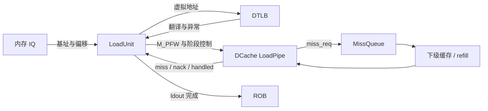
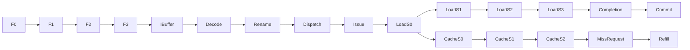

# PREFETCH.W 指令执行生命周期

## 📋 基本信息

| 字段 | 内容 |
|---|---|
| **指令名称** | `prefetch.w offset(rs1)` |
| **编码格式** | `imm[11:5]_00011_rs1_110_00000_0010011`；例如 `0x0236e013` 为 `prefetch.w 32(a3)` |
| **RISC-V 扩展** | `Zicbop`，数据写意图预取提示 |
| **是否有压缩格式** | 本文指令为 32 位；基础 C 扩展没有对应编码 |
| **指令分类** | 软件预取／数据侧写意图 hint；既不执行普通 store，也不返回普通 load 数据 |
| **FuType** | `FuType.ldu` |
| **FuOpType** | `LSUOpType.prefetch_w`，本地值 `b1010` |
| **目标 FU** | 内存调度 → LoadUnit → DCache LoadPipe；缺失请求可进入 MissQueue |

实现依据为本地 `/nfs/home/wanghao/emuByYuan/stable-kmh-v2`，源码标识 `abd0f867a86b66a92d4fc5d3c6d62944725c747f`。参数数字均指默认声明，不替代实际构建配置；周期仅为源码推导，未引用其他环境的波形作为本版本实测。

本条指令表达未来写入数据的意图。**ROB 提交、DCache 接受缺失/权限升级请求和缓存事务完成是三个不同事件**：hint 可以正常退休而未产生一次成功填充。与 `prefetch.i` 不同，本条不通过软件提示单槽转发至 Frontend；与普通 load 不同，本条没有架构目的寄存器，也不承诺通过重放最终取得数据。

## 1. 前端路径

### 1.1 取指

| 阶段 | 延迟 | 关键行为 | 代码位置 |
|---|---|---|---|
| ICache/MainPipe | 可变 | 获取 hint 指令自身所在代码块；与它提示的数据目标是两次不同访问 | [IFU][IF] |
| IFU F0 | 请求握手 | FTQ 请求进入 IFU | [IFU][IF] 241–263 行 |
| IFU F1 | 连续推进时一阶段 | 保存请求信息并推进 | [IFU][IF] 291–304 行 |
| IFU F2 | 可等待 | 响应到达后整理指令与预译码输入 | [IFU][IF] 357–385 行 |
| IFU F3 | 可背压 | 按指令有效范围送入 IBuffer | [入队][IFO] 953–986 行 |

> **前端流水线总延迟（无冲刷）：** F0→F3 连续推进时为三个阶段间隔；ICache miss、ITLB/PTW 等待与 IBuffer 排队另计，不把该数字当作写意图预取延迟。

### 1.2 预译码

| 项目 | 内容 |
|---|---|
| **brTable 匹配** | 非控制流指令，默认 `BrType.notCFI` |
| **PreDecodeInfo 字段** | 有效的 32 位 hint：`valid=1,isRVC=0,brType=notCFI,isCall=0,isRet=0` |
| **是否有专用检测逻辑** | 前端不执行写预取，后端 DecodeUnit 识别 ORI hint 编码 |
| **跳转偏移计算** | 通用偏移组合逻辑可对窗口运行，但本条不消费其结果改变 PC |

依据：[PreDecode][PD] 35–82 行。

### 1.3 PredChecker 校验

| 项目 | 内容 |
|---|---|
| **是否触发 remaskFault** | 本条不是 JAL/JALR/RET，不主动触发 |
| **是否触发 mispredict** | 正常不触发；若此非 CFI 位置被错误预测 taken，可触发 `notCFITaken` |
| **是否产生 wbRedirect** | 前端通用预测校验可能恢复，不是写预取产生控制流跳转 |
| **fixedRange 影响** | 同块更早控制流错误可屏蔽本条；它不会因数据目标地址而截断取指范围 |

依据：[PredChecker][CHECK] 361–445 行。

### 1.4 IBuffer 入队

| 项目 | 内容 |
|---|---|
| **入队宽度** | `PredictWidth=FetchWidth*(HasCExtension ? 2 : 1)`；默认 FetchWidth=8，C 开启时为 16 个半字候选位置 |
| **是否可能被挡** | IBuffer 容量、ready 与有效范围掩码共同限制 |
| **携带的关键信息** | 指令字、PC、FTQ 指针/偏移、预译码、取指异常及 trigger；还没有预取目标物理地址 |
| **代码位置** | [IFU 入队][IFO]、[IBuffer][IB] 227–305 行 |

## 2. 后端路径

### 2.1 译码

| 项目 | 内容 |
|---|---|
| **DecodeWidth** | 默认 6 |
| **简单/复杂译码** | 基础 ORI 表项加软件预取覆盖译码；不拆成多个复杂 uop |
| **译码延迟** | 组合识别，不包含阶段握手等待 |
| **关键译码结果** | `fuType=ldu,fuOpType=prefetch_w,selImm=IMM_S,canRobCompress=false`；基址寄存器源、立即数源，无有效 GPR 目的 |
| **代码位置** | [DecodeUnit][D] 1102–1106、1133–1146、1166–1175 行；[操作类型][OP] 560–567 行 |

识别式要求 opcode=`0010011`、funct3=`110`、rd=0，并以 `inst.RS2===3` 区分写预取。这里 `RS2` 是编码切片 `[24:20]`，**不是第二个源寄存器**。`IMM_S` 从 `[31:25]` 与 rd 所在的五个零位形成偏移，因此偏移低五位为 0；`0x0236e013` 的偏移是 32，不是将 ORI 的 I 型立即数 35 直接作为地址偏移。最终 `rfWen=(ldest!=0)&&decodedInst.rfWen` 为假。[DecodeUnit][D]

### 2.2 重命名

| 项目 | 内容 |
|---|---|
| **RenameWidth** | 默认 6 |
| **延迟** | 受下游 ready 等资源约束，不能固定为端到端 1 拍 |
| **源操作数** | 一个整数基址 rs1，通过物理寄存器映射及旁路取得；偏移无寄存器依赖 |
| **目标操作数** | rd=x0，无有效整数、浮点、向量目的寄存器 |
| **特殊处理** | 无结果寄存器不等于跳过后端；仍携带身份和完成信息 |
| **代码位置** | [Rename][R]、[DecodeUnit][D] |

### 2.3 派发

| 项目 | 内容 |
|---|---|
| **DispatchWidth** | 默认 Rename 输入 6 路；内存调度实际接收宽度另由配置决定 |
| **延迟** | ROB、派发和 IQ 队列等待可变 |
| **目标 ROB** | 普通后端 uop 跟踪；LoadUnit 整数来源设置 `has_rob_entry=true` |
| **目标 Issue Queue** | 由 `FuType.ldu` 进入 load 类内存调度，不是硬件预取器的独立输入 |
| **代码位置** | [NewDispatch][DIS]、[LoadUnit 来源][ADDR] 623–644 行 |

### 2.4 发射

| 项目 | 内容 |
|---|---|
| **Issue Queue 类型** | 内存调度 load 路径，共享 LoadUnit 资源 |
| **唤醒条件** | rs1 就绪、调度选择和执行入口允许 |
| **选择策略** | IQ 选择后还经过 LoadUnit S0 多源优先仲裁；来源就绪由更高优先来源的有效性限制 |
| **最小延迟** | 经过选择、读数/旁路与 ldin 握手；hint 并非零成本 |
| **最大延迟** | 源生产者和资源阻塞无环境无关有限上界 |
| **代码位置** | [IssueQueue][IQ]、[LoadUnit S0][S0] 330–352 行 |

### 2.5 执行

| 项目 | 内容 |
|---|---|
| **执行单元** | LoadUnit 地址/翻译流水与 DCache LoadPipe |
| **流水/阻塞** | 共享 load 流水；S0 受 DCache ready 约束，不能因为请求是 hint 就绕过入口仲裁 |
| **执行延迟** | uop 完成和 miss/refill 为不同路径，均不能统一填固定 FU 拍数 |
| **FSM 状态机** | 没有专属 PREFETCH.W 等待填充 FSM；LoadUnit/LoadPipe 使用阶段 valid，MissQueue 另管理被接受的事务 |
| **关键输出信号** | `dcache.req(cmd=M_PFW)`、`dcache.s1_kill/s2_kill`、`miss_req`、`ldout` |
| **代码位置** | [LoadUnit S0][S0]、[LoadPipe][CACHE]、[MissQueue][MQ] |

**阶段处理与分支：**

| 阶段 | 条件/动作 | 后续行为 |
|---|---|---|
| LoadUnit S0 | 计算 `src(0)+SignExt(imm[11:0],VAddrBits)`，置 `prf/prf_wr` | 首发软件写预取正常查询 DTLB；不同于预翻译硬件预取和 `prf_i` |
| DCache 请求 | `cmd=M_PFW,instrtype=DCACHE_PREFETCH_SOURCE` | 写意图 cache 请求，不向 Frontend 发送 ifetchPrefetch |
| LoadUnit S1 | DTLB miss/异常/取消形成 `dcache.s1_kill` | 可以终止此次缓存访问；不是等待翻译后保证重试填充 |
| LoadPipe S1 | 读取标签和一致性状态；`banked_data_read.valid` 要求 `!s1_is_prefetch` | 不为 hint 读出普通 load 数据返回寄存器 |
| LoadPipe S2 | 缺失条件生成 `miss_req`；地址用 `get_block_addr(s2_paddr)` | MissQueue 决定是否处理，受可用项、已有事务与取消限制 |
| LoadUnit S2/S3 | 屏蔽普通 load 的若干异常与重放原因，生成完成 | 后端完成不等待下级数据填充 |

依据：[地址来源][ADDR] 623–644 行、[LoadUnit S0][S0] 336、405–420 行、[S1][S1] 928–976 行、[LoadPipe][CACHE] 185、310–313、434–478 行。

关键区别是 `s2_troublem` 要求 `!s2_prf`。`rep_info.tlb_miss/dcache_rep/dcache_miss/bank_conflict/wpu_fail` 等普通重放原因均再与该条件相与，因此不能把普通 load 的“miss→重放→返回数据”照搬为 hint 的可靠重试机制。源码还有 `s2_prefetch_ignored` 记录 MSHR 满/请求冲突导致的忽略。[LoadUnit S2][S2] 1305–1312、1424–1433 行、[计数器][PERF] 1955–1959 行

MissQueue 区分 `isPrefetchRead` 与 `isPrefetchWrite`；已有同块事务下的晚到预取可能被忽略，不能声称所有 hint 都会分配一个新 MSHR 或都作为普通 load 合并。后续真正的 load/store 可按各自类型及 MissQueue 时机条件与已有事务交互，不能假设所有请求都能合并。[MissQueue][MQ] 95–96、594–610、738–752 行

**写权限与一致性状态：**

LoadUnit 对 `prf_wr` 选择 `TlbCmd.write`，并设置 `isPrefetch`；这与 `memidx.is_ld=true,is_st=false` 并不矛盾：前者描述翻译意图，后者描述复用的后端 load 通路。DCache 命令 `M_PFW` 被 `isWriteIntent` 识别，但不是普通数据写命令，不带待写 store 数据。[DTLB 请求][TLB] 382–399 行、[命令分类][CONST] 58、89–92 行

| 目标缓存状态 | `onAccess(M_PFW)` 结果 | 本条含义 |
|---|---|---|
| Nothing（不在本地缓存） | 请求 `NtoT` | 若请求被接受，尝试获取写意图权限与数据 |
| Branch（有共享副本） | 权限不足，请求 `BtoT` | 标签命中也可能触发缺失/权限升级路径 |
| Trunk | 权限命中，保持 Trunk | 写意图不等于真实写入，不因本条自动转 Dirty |
| Dirty | 权限命中，保持 Dirty | 不执行新的架构存储 |

本地 `ClientMetadata` 对写意图获得 `toT` 的结果为 Trunk，而普通写的结果为 Dirty。LoadPipe 的 `s1_hit` 同时要求标签、权限和状态条件；MissQueue 通过 `req_coh.onAccess(req.cmd)._2` 形成 Acquire 的权限参数。具体是否发出事务还取决于取消、资源和合并条件，不能承诺提交时独占权限已到手，更不能承诺后续 store 一定命中。[一致性元数据][COH] 52–98 行、[LoadPipe][CACHE] 305–307、376–381 行、[Acquire 生成][ACQ] 250–265 行

### 2.6 写回

| 项目 | 内容 |
|---|---|
| **写回端口** | LoadUnit `ldout` 通用完成路径，不是预取数据的架构 RF 写端口 |
| **是否写回** | 无 GPR/FP/Vec 结果；保留 ROB 完成通知 |
| **写回延迟** | ldout 的流水与仲裁时间，不是 miss/refill 往返时间 |
| **代码位置** | [LoadUnit 完成][WB] 1784–1792 行、[DecodeUnit][D] |

基址可由生产者旁路提供；本条没有目的寄存器，不应描述为将“预取值”写入 RegCache/PRF 再唤醒后续 load。软件预取还被 S0 常规快速唤醒和 `fast_uop` 路径的对应条件排除。[LoadUnit 唤醒][WAKE] 875–883 行、[LoadUnit S2][S2] 1469 行

### 2.7 提交

| 项目 | 内容 |
|---|---|
| **CommitWidth** | 默认 `RobCommitWidth=8` |
| **提交条件** | uop 已完成、ROB 可按序退休，无更老异常/阻塞 |
| **是否触发 flush** | hint 不设置 Fence 式 `flushPipe`；外部异常或误预测可取消年轻指令 |
| **是否触发 redirect** | 本条不改变 PC，不产生预取目标跳转 |
| **代码位置** | [Rob][ROB]、[DecodeUnit][D]、[LoadUnit 完成][WB] |

一次成功提交只说明架构 hint 已执行，不证明目标驻留 DCache；已经进入缓存层的活动与 ROB 提交时间不能一一等同。

## 3. 信号前递

### 3.1 前递路径图





### 3.2 信号清单

| 信号名 | 方向 | 位宽 | 语义 | 持续方式 |
|---|---|---|---|---|
| `ldin` | 调度 → LoadUnit | MemExuInput | 基址、偏移和 uop 身份 | ready/valid |
| `prf/prf_wr/prf_i` | LoadUnit 内 | 各 1 | 本条为 1/1/0 | 随来源和流水 |
| `dcache.req` | LoadUnit → LoadPipe | 请求 Bundle | `M_PFW`、地址、mask、prefetch 来源 | Decoupled |
| `tlbNoQuery` | LoadUnit 内 | 1 | 正常首发软件写预取不因自身类型置位 | 随流水 |
| `dcache.s1_kill/s2_kill` | LoadUnit → LoadPipe | 各 1 | 翻译、权限、uncache 或外部取消控制 | 阶段控制 |
| `miss_req.addr` | LoadPipe → MissQueue | 物理地址宽度 | 块对齐物理目标 | 随缺失请求 |
| `miss_req.cancel` | LoadPipe → MissQueue | 1 | LSU kill、tag 错误等取消原因 | 随请求 |
| `s2_mq_nack/resp.handled` | Cache → LoadUnit | 布尔状态 | 资源拒绝/已处理，均非 refill 完成 | 阶段响应 |
| `ldout` | LoadUnit → 后端 | 完成 Bundle | 完成 uop 身份与控制 | 通用完成接口 |

`mask` 是复用 load 接口的字段，不表示软件要求从目标返回一个固定宽度标量。预取对 cache block 的作用由命令、块地址与一致性处理决定。[LoadUnit S0][S0]、[LoadPipe][CACHE]

## 4. 周期计算

### 4.1 流水线延迟分解

| 阶段 | 固定/可变 | 周期数 | 说明 |
|---|---|---|---|
| Decode | 组合 | 0 个额外逻辑寄存级 | 不包含阶段排队 |
| Rename/Dispatch | 可变 | `T_r+T_d` | 后端资源等待 |
| Issue/读数 | 可变 | `T_i` | 基址依赖和 load 端口选择 |
| LoadUnit S0→ldout | 流水及控制相关 | `T_ld` | 以本条 uop 实际握手测量 |
| ROB 等待提交 | 可变 | `T_c` | 与更老指令有关 |
| 缺失请求到 refill | 可变或不发生 | `T_fill` | 独立缓存事务，不加到每条 hint 提交延迟中 |
| **合计** | 可变 | 见公式 | 提交与填充分开计时 |

### 4.2 公式

$$T_{decode\to commit}=T_r+T_d+T_i+T_{ld}+T_c$$

若请求确实被缓存层接收且需要填充，另测：

$$T_{request\to fill}=T_{translation/cache}+T_{missAcceptance}+T_{lowerMemory/refill}$$

翻译与标签查询存在重叠，这些时间项应按实际事件边界划分，不能重复相加。提示被忽略、目标已命中或请求被取消时，不存在该提示专属的一次填充事件。

### 4.3 最佳/最差情况

| 场景 | 周期数 | 条件 |
|---|---|---|
| **最佳** | 正常流水完成；目标已有所需权限时无需升级 | 基址已就绪、DTLB 命中、Trunk/Dirty 权限命中、端口可用 |
| **典型** | 无本版本匹配波形统计，不给平均拍数 | miss 请求可能被接收、忽略或取消 |
| **最差** | 无目标填充完成保证 | TLB miss、MSHR 满、冲突、权限/MMIO 或外部恢复 |

### 4.4 时序图

```text
后端：Issue → LoadS0 → LoadS1 → LoadS2 → LoadS3/ldout → ROB commit
缓存：         请求 → 翻译/标签 → 命中或 miss 请求 → 下级事务 → refill
分支：                    TLB miss/异常/取消 → 可终止此次预取
                          MSHR 满/冲突 → 可忽略 hint，不保证重试填充
```

以下仅为 DCache 请求在 ready 约束下的一次握手示意，不是本版本实测波形，也不是完整指令固定周期表。

```wavedrom
{"signal":[{"name":"clock","wave":"p...."},{"name":"source pending","wave":"1..0."},{"name":"dcache.req.ready","wave":"0.1.."},{"name":"dcache.req.valid","wave":"0.10."},{"name":"dcache.req.fire","wave":"0.10."}]}
```

验证以 `TOP.clock` 正沿采样：先按 PC/编码定位，再以 `robIdx/lqIdx` 跟踪后端；缓存侧用块地址及 MSHR 身份关联，分别记录 `req.fire`、`cancel`、`handled`、refill 和 commit，不能只凭提交推导填充成功。

## 5. 异常与特殊处理

### 5.1 异常检测

| 异常类型 | 检测位置 | 检测条件 | 处理方式 |
|---|---|---|---|
| 本条取指异常 | IFU/ITLB | hint 自身所在代码页访问失败 | 按普通取指异常处理，不因 hint 属性而豁免 |
| 目标翻译 miss/异常 | LoadUnit S1 | DTLB 返回 miss、PF/GPF/AF | 通过 s1_kill 控制缓存访问；不能当作必然重试的 demand load |
| 普通 load 目标异常 | LoadUnit S2 | `s2_prf` 且无 delayedLoadError | 清理相应 exceptionVec 和 misalign，见代码门控 |
| PMP/PMA/PBMT 与 MMIO | LoadUnit S2 | 权限不符或 actually_uncache | s2_kill 取消缓存 miss，且预取不进入普通 MMIO/uncache 读路径 |
| ECC、延迟错误、debug | 各自处理路径 | 对应检查有效 | 不承诺“所有错误事件都不会发生”，需区分系统错误与 hint 目标异常 |

依据：[S1][S1] 928–1028 行、[S2][S2] 1216–1248、1518 行。异常被屏蔽不代表可绕过内存权限发出任意访问；缓存请求还有阶段取消控制。

### 5.2 冲刷与重定向

| 触发条件 | 类型 | 影响范围 | 恢复方式 |
|---|---|---|---|
| 更老分支/异常 | 后端恢复 | 年轻 hint uop | 按 robIdx 范围取消，不改变 hint 的目标 PC |
| TLB miss/异常 | s1_kill | DCache 在途访问 | LoadPipe 不继续作为有效 S2 请求 |
| PMP/uncache/取消 | s2_kill | 尚未有效接收的 miss | `miss_req.cancel` 参与处理 |
| 已进入缓存层的事务 | 缓存协议处理 | 下级请求、填充和替换 | 不能仅凭 ROB flush 声称缓存副作用全部撤销 |

### 5.3 与其他指令的交互

| 交互场景 | 影响指令 | 行为 |
|---|---|---|
| load/add 生产基址 | prefetch.w | 等待 rs1；不是不依赖寄存器的硬件预取 |
| prefetch.w 后续 store | 同块写入 | 可能预先获取写权限，也可能被忽略或权限已丢失；真实 store 仍需执行地址、数据、权限和提交检查 |
| 更老 store | 同地址或同块 | S1 SBuffer/LSQ 数据前递请求由 `!s1_prf` 门控，hint 不接收 store-forward 数据作为架构结果 |
| prefetch.r | 读意图 hint | 共用 hint 识别，但命令分别是 M_PFR/M_PFW；读权限足够不等于写意图权限足够 |
| prefetch.i/fence.i | 指令预取/一致性同步 | 本条走 DCache，不走 ICache 单槽，也不替代任何屏障 |
| 目标靠近 cache line/页末 | 数据预取 | 对计算地址所在块提出提示，不进行普通跨界标量 load 的两段数据拼接；下一页不是自动额外预取范围 |
| MMIO/NC 地址 | 目标访问 | 不执行有副作用的普通设备读；由内存属性/阶段 kill 约束 |

## 6. 安全性分析

### 6.1 推测执行窗口

| 窗口 | 起始点 | 终止点 | 周期数 | 风险等级 |
|---|---|---|---|---|
| 推测软件预取 | LoadUnit 接受 | 取消或后端完成 | 可变 | 未测定，需场景验证 |
| 缓存资源影响 | 缺失请求被接受 | 填充/替换/协议结束 | 可变 | 潜在时序观察面，非漏洞定论 |

### 6.2 侧信道暴露面

| 暴露面 | 类型 | 缓解措施 |
|---|---|---|
| DTLB、标签、MSHR 状态 | 微架构时序 | 权限和取消门控限制访问；不因此证明所有时序影响被隔离 |
| 缓存污染和带宽竞争 | 资源竞争 | 控制预取频率及距离，区分有用填充与无效请求 |
| 错误路径预取 | 推测状态 | ROB 保证按序架构效果，但不是缓存痕迹清除证明 |

### 6.3 有序性保证

| 保证 | 机制 | 代码依据 |
|---|---|---|
| 无架构结果写入 | rd=0 且 rfWen 门控 | [DecodeUnit][D] |
| 写意图正确传播 | prf_wr 选择 M_PFW，instrtype 标记预取来源 | [LoadUnit S0][S0] |
| 无效目标受取消约束 | s1_kill/s2_kill → miss_req.cancel | [S1][S1]、[S2][S2]、[LoadPipe][CACHE] |
| 完成不等于填充 | 独立 ldout 与 MissQueue/refill 路径 | [完成][WB]、[MissQueue][MQ] |

**验证特别注意**

| Verification ID | 风险/不变量 | 定向激励 | 预期观察 | 检查与覆盖 |
|---|---|---|---|---|
| PFW_ENCODING | 立即数低位类型与地址混淆 | `0x0236e013`，已知 a3 | `isPreW=1`，地址 a3+32，cmd=M_PFW | 覆盖正负偏移及 rs1=x0 |
| PFW_NO_RF | 完成误写寄存器或存储数据 | 目标命中与缺失各一次 | ldout 可完成而 rfWen=0；不产生本条的 store 数据写入 | 检查 ROB、RF 写使能及目标字节值 |
| PFW_PERMISSION | 标签命中误判权限命中 | 目标分别处于 Branch/Trunk/Dirty | Branch 可请求 BtoT；Trunk 不因 hint 自动置脏 | 检查 M_PFW、s1_has_permission、Acquire 参数及元数据 |
| PFW_TLB_MISS | 错套 demand replay | 冷 DTLB 目标 | s1_tlb_miss、缓存 s1_kill；常规 rep_info 门控 | 不以随后 PTW 活动推定原 hint 一定重试 |
| PFW_MSHR_FULL | 把 hint 当可靠填充 | 占满缺失资源后发 hint | s2_mq_nack/ignored 可出现，普通 dcache_rep 不因 hint 置位 | 区分请求数、接受数与 refill 数 |
| PFW_KILL | 取消与缺失同拍 | 更老 redirect 或属性检查失败 | s1/s2 kill 和 miss_req.cancel 按阶段起效 | 无年轻架构写回；缓存事务另跟踪 |
| PFW_MMIO | 产生设备读副作用 | MMIO/PBMT NC 目标 | actually_uncache 取消，预取不走普通 MMIO 路径 | 检查 uncache 请求与目标块事务 |

上述均为待执行的验证场景，不表示已获得仿真覆盖率或通过结论。

## 7. 性能特征

| 指标 | 值 | 说明 |
|---|---|---|
| **执行吞吐** | 受 load 发射、DTLB、标签及 MissQueue 资源限制 | 不从 DecodeWidth 推导成功预取数 |
| **执行延迟** | 后端完成与缓存填充分别可变 | hint 可忽略，不保证每条都有 refill 延迟 |
| **端口占用** | LoadUnit、DTLB、DCache 标签/缺失资源 | 预取通过 `!s1_is_prefetch` 抑制普通 banked data read |
| **流水线阻塞** | 基址依赖、S0 ready、仲裁 | 接受后普通 load 重放原因被相应屏蔽 |
| **关键路径影响** | 地址、翻译/标签、权限与缺失控制 | 未综合/STA，不给频率结论 |

`s2_prefetch_hit/miss/accept/ignored` 是 LoadUnit 的阶段统计，并不只覆盖本条软件写预取；必须结合 `prefetch_w`、来源和命令筛选。`accept` 也不能替代 MissQueue 实际处理或 refill 完成证据。[计数器][PERF]

## 8. 配置依赖

| 参数 | 默认值 | 影响 | 配置位置 |
|---|---|---|---|
| `DecodeWidth/RenameWidth` | 6/6 | 后端输入宽度 | [Parameters][P] |
| `FetchWidth/IBufSize` | 8/48 | 前端窗口和排队 | [Parameters][P] |
| `RobCommitWidth/RobSize` | 8/160 | 提交和在途资源 | [Parameters][P] |
| `VAddrBits/PAddrBits` | 地址配置决定 | 基址加法与物理块地址宽度 | [地址生成][ADDR]、[LoadPipe][CACHE] |
| LoadUnit 数量 | 后端配置决定 | 共享地址生成与 load 服务能力 | [内存模块][MEM] |
| DCache 块大小/组路数 | Cache 配置决定 | 对齐、标签匹配和替换 | [LoadPipe][CACHE] |
| MissQueue 容量与接收策略 | Cache 配置决定 | 请求接受、忽略与竞争 | [MissQueue][MQ] |

## 附录：关键代码索引

| 模块 | 文件路径 | 关键行号 |
|---|---|---|
| 软件预取译码 | [DecodeUnit][D] | 1102–1106、1133–1146、1166–1175 |
| 预取操作码 | [package.scala][OP] | 560–567 |
| S0 地址/请求 | [LoadUnit][S0]、[地址来源][ADDR] | 330–420、623–644 |
| S1 翻译与前递门控 | [LoadUnit][S1] | 928–1028 |
| S2 异常/重放/取消 | [LoadUnit][S2] | 1216–1248、1305–1312、1424–1433、1518 |
| 完成与统计 | [ldout][WB]、[计数器][PERF] | 1784–1792、1955–1959 |
| DCache load 流水 | [LoadPipe][CACHE] | 185、310–313、350–351、434–478 |
| 缺失事务 | [MissQueue][MQ] | 95–96、594–610、738–752 |
| 写意图翻译与命令分类 | [DTLB 请求][TLB]、[命令常量][CONST] | 382–399；58、89–92 |
| 一致性权限与 Acquire | [ClientMetadata][COH]、[Acquire 生成][ACQ] | 52–98；250–265 |
| 前端与调度 | [IFU][IF]、[PreDecode][PD]、[IssueQueue][IQ] | 241–385、953–986；35–82、361–445；420 起 |

[IF]: /nfs/home/wanghao/emuByYuan/stable-kmh-v2/src/main/scala/xiangshan/frontend/IFU.scala#L241
[IFO]: /nfs/home/wanghao/emuByYuan/stable-kmh-v2/src/main/scala/xiangshan/frontend/IFU.scala#L953
[PD]: /nfs/home/wanghao/emuByYuan/stable-kmh-v2/src/main/scala/xiangshan/frontend/PreDecode.scala#L35
[CHECK]: /nfs/home/wanghao/emuByYuan/stable-kmh-v2/src/main/scala/xiangshan/frontend/PreDecode.scala#L361
[IB]: /nfs/home/wanghao/emuByYuan/stable-kmh-v2/src/main/scala/xiangshan/frontend/IBuffer.scala#L227
[D]: /nfs/home/wanghao/emuByYuan/stable-kmh-v2/src/main/scala/xiangshan/backend/decode/DecodeUnit.scala#L1102
[OP]: /nfs/home/wanghao/emuByYuan/stable-kmh-v2/src/main/scala/xiangshan/package.scala#L560
[R]: /nfs/home/wanghao/emuByYuan/stable-kmh-v2/src/main/scala/xiangshan/backend/rename/Rename.scala#L385
[DIS]: /nfs/home/wanghao/emuByYuan/stable-kmh-v2/src/main/scala/xiangshan/backend/dispatch/NewDispatch.scala#L720
[IQ]: /nfs/home/wanghao/emuByYuan/stable-kmh-v2/src/main/scala/xiangshan/backend/issue/IssueQueue.scala#L420
[S0]: /nfs/home/wanghao/emuByYuan/stable-kmh-v2/src/main/scala/xiangshan/mem/pipeline/LoadUnit.scala#L330
[ADDR]: /nfs/home/wanghao/emuByYuan/stable-kmh-v2/src/main/scala/xiangshan/mem/pipeline/LoadUnit.scala#L623
[S1]: /nfs/home/wanghao/emuByYuan/stable-kmh-v2/src/main/scala/xiangshan/mem/pipeline/LoadUnit.scala#L928
[S2]: /nfs/home/wanghao/emuByYuan/stable-kmh-v2/src/main/scala/xiangshan/mem/pipeline/LoadUnit.scala#L1216
[WB]: /nfs/home/wanghao/emuByYuan/stable-kmh-v2/src/main/scala/xiangshan/mem/pipeline/LoadUnit.scala#L1784
[WAKE]: /nfs/home/wanghao/emuByYuan/stable-kmh-v2/src/main/scala/xiangshan/mem/pipeline/LoadUnit.scala#L875
[PERF]: /nfs/home/wanghao/emuByYuan/stable-kmh-v2/src/main/scala/xiangshan/mem/pipeline/LoadUnit.scala#L1955
[CACHE]: /nfs/home/wanghao/emuByYuan/stable-kmh-v2/src/main/scala/xiangshan/cache/dcache/loadpipe/LoadPipe.scala#L185
[MQ]: /nfs/home/wanghao/emuByYuan/stable-kmh-v2/src/main/scala/xiangshan/cache/dcache/mainpipe/MissQueue.scala#L95
[ROB]: /nfs/home/wanghao/emuByYuan/stable-kmh-v2/src/main/scala/xiangshan/backend/rob/Rob.scala#L610
[P]: /nfs/home/wanghao/emuByYuan/stable-kmh-v2/src/main/scala/xiangshan/Parameters.scala#L59
[MEM]: /nfs/home/wanghao/emuByYuan/stable-kmh-v2/src/main/scala/xiangshan/mem/MemBlock.scala#L314

[TLB]: /nfs/home/wanghao/emuByYuan/stable-kmh-v2/src/main/scala/xiangshan/mem/pipeline/LoadUnit.scala#L382
[CONST]: /nfs/home/wanghao/emuByYuan/stable-kmh-v2/rocket-chip/src/main/scala/rocket/Consts.scala#L58
[COH]: /nfs/home/wanghao/emuByYuan/stable-kmh-v2/rocket-chip/src/main/scala/tilelink/Metadata.scala#L52
[ACQ]: /nfs/home/wanghao/emuByYuan/stable-kmh-v2/src/main/scala/xiangshan/cache/dcache/mainpipe/MissQueue.scala#L250
