# 一条FADD指令的简单分析过程

基于的波形的文件：
<a href="source-code/float-add-inst.zip" target="_blank">【附件: float-add-inst.zip】</a>

基于的波形的测试程序：

```
#include <klib.h>

volatile float a = 1.25f;
volatile float b = 2.50f;
volatile float c;

int main() {
  c = a + b;// 目标：生成 fadd.s
  assert(c == 3.75f);
  printf("success\n");
  return 0;
}
```

## 1.找到一条合适的 `fadd`指令

打开反汇编文件（即压缩包中的 `float-riscv64-xs.txt`文件）：

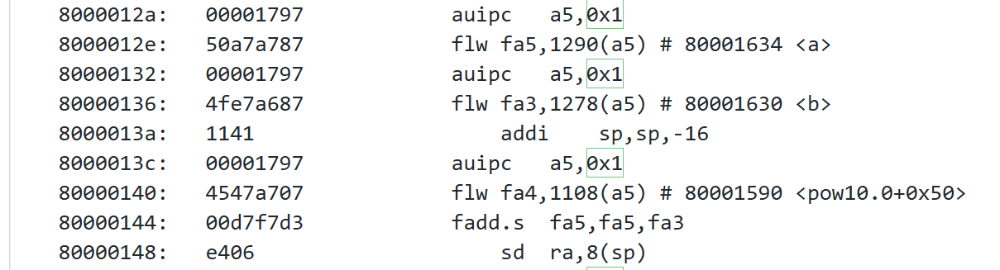

此处选择位于程序计数器（pc）地址 `0x80000144`的指令，其内容为 `0x00d7f7d3`。单独分析这条指令，对照指令集手册：

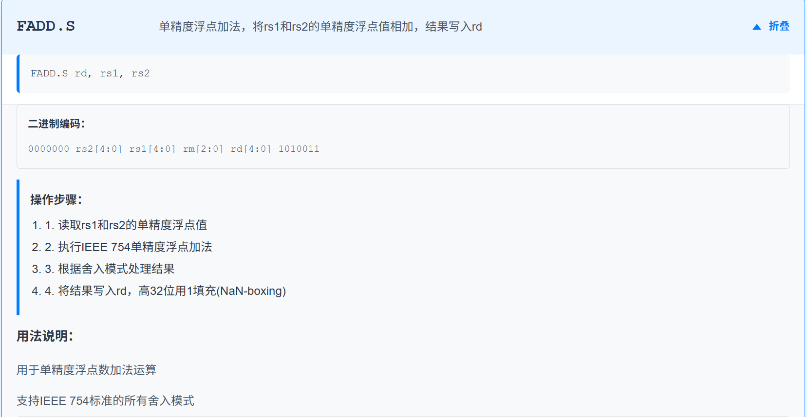

**注意：** 结果在64位浮点寄存器中进行NaN-boxing

（ 本图来源于 [链接](https://ai-embedded.com/risc-v/riscv-isa-manual/) ）

- fa5 号寄存器的值为地址 0x80001634 中的值，也就是变量a的值
- fa3 号寄存器的值为地址 0x80001630 中的值，也就是变量b的值
- fa4 号寄存器的值为地址 0x80001590 中的值，这个地址位于常量池中。从源代码和后续用途来看，它很可能加载的是 assert 要比较的常量

## 2.整体流程概括

核为kunminghu-v2


通过架构图我们也能梳理出一条指令执行的流程以及经过的模块，以下为整体分析结束之后的流程图，在后文中会详细阐述：

```
前端产生已展开指令
        |
        v
Decode：识别 FADD_S，生成 fp -> falu/vfadd/fpWen
        |
        v
Rename：逻辑 fs1/fs2/fd -> 物理 psrc0/psrc1/pdest
        |       分配 ROB index，更新 FP RAT
        v
Dispatch：动态选择 FP IQ0/IQ1/IQ2，形成 ROB enqueue request
        |
        v
Issue Queue：等待两个物理 FP 源 ready 和 FALU/WB 资源
        |
        v
DataPath：仲裁读取 FpRegFile；必要时选择 bypass/forward 数据
        |
        v
BypassNetwork：把读出的源数据和控制信息送给目标 FEX
        |
        v
FEX0/FEX2/FEX4 中的 FALU
        |
        v
YunSuan FloatAdder：f32 解包 -> far/close path -> GRS 舍入 -> f32 结果
        |
        +--> 结果和 fflags 返回 WbDataPath
        |
        +--> FP 结果写回 FpRegFile[pdest]
        |
        +--> ROB 按 robIdx 减少未完成 uop 数并聚合 fflags
        v
ROB head 满足提交条件
        |
        v
Commit：更新 architectural FP RAT，释放 old_pdest，更新 CSR fflags
```

## 3.frontend传入backend时机

通过IBuffer传给backend：

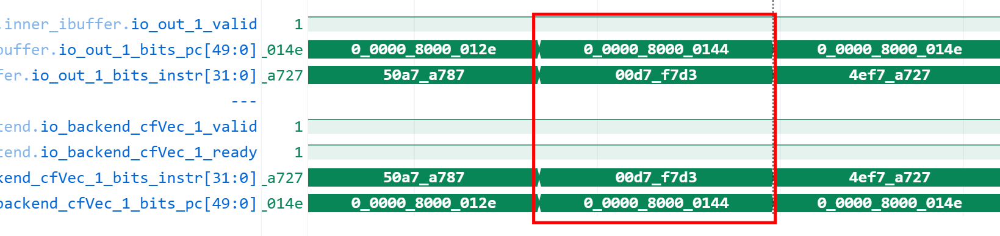

目标指令通过 `cfVec_1` 进入 Backend。

```
class FrontendToCtrlIO(implicit p: Parameters) extends XSBundle {
    val cfVec = Vec(DecodeWidth, DecoupledIO(new CtrlFlow))
}
```

cfVec与DecodeWidth数量一致，每个 cfVec_i 对应一次并行发送的一条指令。

## 4.Decode

`DecodeStage` 在 `DecodeStage.scala`

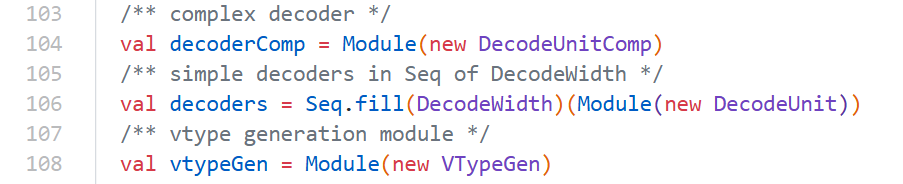 

实例化`DecodeWidth`（6）个解码器；输入接受和输出 `DecodedInst` 的流水控制在 `DecodeStage.scala:195-247`。

 ### 4.1`FADD_S` 的主译码表项

```
val opfff: Array[(BitPat, XSDecodeBase)] = Array(
  // Scalar Float Point
  FADD_S -> OPFFF(
    SrcType.fp, 
    SrcType.fp, 
    SrcType.X,
    FuType.falu, 
    VfaluType.vfadd,
    F, T, F, 
    UopSplitType.SCA_SIM
  ),
  // ...
)
```

因此 `fadd.s` 的关键控制字段为：

| 字段             | 值                | 含义                       |
| ---------------- | ----------------- | -------------------------- |
| `srcType(0)`     | `SrcType.fp`      | 第一个源是 FP 逻辑寄存器   |
| `srcType(1)`     | `SrcType.fp`      | 第二个源是 FP 逻辑寄存器   |
| `srcType(2)`     | `SrcType.X`       | 标量 `fadd.s` 不使用第三源 |
| `fuType`         | `FuType.falu`     | 浮点算术逻辑单元           |
| `fuOpType`       | `VfaluType.vfadd` | FALU 的浮点加法操作        |
| `rfWen`          | `false`           | 不写整数寄存器             |
| `fpWen`          | `true`            | 写 FP 寄存器               |
| `vecWen`         | `false`           | 不写向量寄存器             |
| `uopSplitType`   | `SCA_SIM`         | 标量、单 uop               |
| `canRobCompress` | `true`            | 具备 ROB 压缩资格          |

其中的`FuType` 与 `FuOpType`分别是 `功能单元的大类选择` 与 `功能单元内部的具体操作编码`。

 `OPFFF.generate()` 固定设置`canRobCompress = true`，`RobCompress` 不是 RVC 指令压缩，而是多个相邻、满足条件的指令共享一个 ROB entry。`fadd.s` 具备 ROB 压缩资格，但是否会压缩不一定


`yunsuan/src/main/scala/yunsuan/package.scala` 定义高位控制字段：

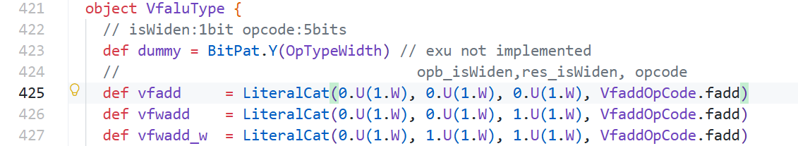

定义低五位 opcode：

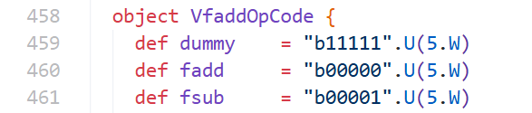

在 `8331 ps`，Decode 输出：

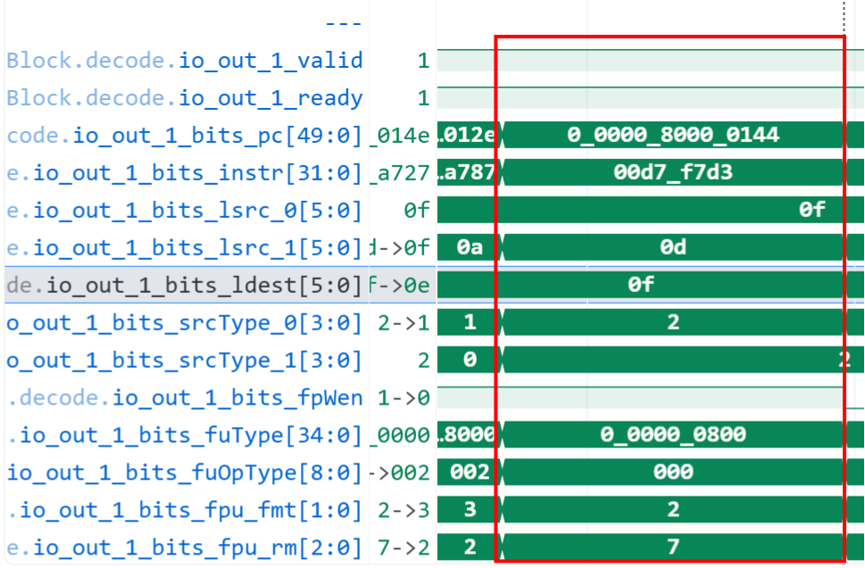

| 字段               |       波形值 | 含义                   |
| ------------------ | -----------: | ---------------------- |
| `pc`               | `0x80000144` | 目标 PC                |
| `instr`            | `0x00d7f7d3` | 目标机器码             |
| `lsrc_0`           |           15 | 逻辑浮点源 `f15`       |
| `lsrc_1`           |           13 | 逻辑浮点源 `f13`       |
| `srcType_0`        |       `0010` | FP 源寄存器            |
| `srcType_1`        |       `0010` | FP 源寄存器            |
| `ldest`            |           15 | 逻辑浮点目的 `f15`     |
| `fpWen`            |            1 | 需要写浮点寄存器       |
| `fuType`           |      `0x800` | `FuType.falu` 独热编码 |
| `fuOpType`         |            0 | `VfaluType.vfadd`      |
| `fpu_fmt`          |         `10` | FP32                   |
| `fpu_rm`           |        `111` | 动态舍入               |
| `fpu_wflags`       |            1 | 需要产生/更新 `fflags` |
| `firstUop/lastUop` |          1/1 | 单 uop 指令            |
| `numUops/numWB`    |          1/1 | 一个 uop，一次写回     |

`fuOpType=0` 不是“没有译码”。`VfaluType.vfadd` 的低 5 位使用`FaddOpCode.fadd`，其编码正好为零。


### 4.2 Decode 到 Rename 的握手

在 CtrlBlock.scala 中完成，核心代码是：

```
private val decodePipeRename =
    Wire(Vec(RenameWidth, DecoupledIO(new DecodedInst)))

for (i <- 0 until RenameWidth) {
    PipelineConnect(
        decode.io.out(i),
        decodePipeRename(i),
        rename.io.in(i).ready,
        s1_s3_redirect.valid || s2_s4_pendingRedirectValid,
        moduleName = Some("decodePipeRenameModule")
    )

    decodePipeRename(i).ready := rename.io.in(i).ready

    rename.io.in(i).valid := decodePipeRename(i).valid && !fusionDecoder.io.clear(i)

    rename.io.in(i).bits := decodePipeRename(i).bits
  }
```

整体数据路径是：

```
  DecodeStage
      |
      | decode.io.out(i)
      | Decoupled[DecodedInst]
      v
  decodePipeRename(i)
      |
      | PipelineConnect，带一个流水寄存器
      v
  Rename
      |
      | rename.io.in(i)
      v
  Rename 处理
```

PipelineConnect 的实现位于backend/datapath/NewPipelineConnect.scala:

```
val valid = RegInit(false.B)

left.ready := right.ready || !valid || isOlder
val data = RegEnable(left.bits, left.fire)

when (rightOutFire) { valid := false.B}

when (left.fire) { valid := true.B}

when (isFlush) { valid := false.B}

right.bits  := data
right.valid := valid
```

 分析之后得知：

  - 如果 decodePipeRename 为空，Decode 可以把结果写入这个流水寄存器；
  - 如果 decodePipeRename 中有数据，则必须等待 Rename 接收；
  - 如果发生 redirect，流水寄存器会被清空。

因此可以把 Decode 到 Rename 的握手简化为：

Decode 产生指令：

```
decode.io.out.valid = 1
```

Rename 和中间流水寄存器有空间：

```
decode.io.out.ready = 1
```

指令进入 PipelineConnect：

```
decode.io.out.fire = 1
```

Rename 接收：

```
rename.io.in.valid = 1
rename.io.in.ready = 1
rename.io.in.fire = 1
```

## 5.Rename

### 5.1 为什么需要重命名

源代码中 `fa5` 同时是源寄存器和目的寄存器：

```text
f15 = f15 + f13
```

如果直接使用逻辑寄存器编号，年轻指令和年老指令会出现 WAR/WAW 等伪相关。Rename
为新结果分配新的物理寄存器，使读取旧 `f15` 和写入新 `f15` 可以同时存在：

```text
读取旧 f15 映射：p66
写入新 f15 映射：p69
```

### 5.2 读取 FP RAT

逻辑寄存器到物理寄存器的查询由 Decode 阶段准备地址，RAT 返回物理寄存器号， CtrlBlock 再把返回值接到 Rename。Rename 根据 `srcType` 从整数、浮点或向量 读端口中选择对应结果：

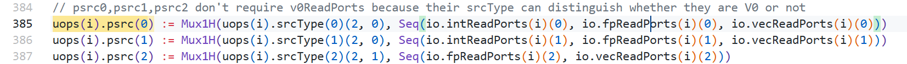

因为两个 `srcType` 都是 `SrcType.fp`，所以：

```text
fpRAT[f15] = p66
fpRAT[f13] = p67
```

对应源码关系为：

```text
DecodeStage.scala:271~273
  io.fpRat(i)(0/1/2).addr := io.out(i).bits.lsrc(0/1/2)

CtrlBlock.scala:669
  rename.io.fpReadPorts := VecInit(rat.io.fpReadPorts.map(x => VecInit(x.map(_.data))))

Rename.scala:387
  uops(i).psrc(2) := Mux1H(uops(i).srcType(2)(2, 1), Seq(io.fpReadPorts(i)(2), io.vecReadPorts(i)(2)))

```

### 5.3 从 FP FreeList 分配目的寄存器

判断指令需要 FP 目的寄存器，并请求 `FreeList`：

FreeList 是空闲物理寄存器列表。`Rename` 阶段为需要写目的寄存器的指令分配一个新的物理寄存器，后文中我们还会提到一个`BusyTable`，而`BusyTable` 不负责分配寄存器，而是记录每个物理寄存器的结果是否已经产生，以本次指令为例。

|   模块    |                        管理的问题                        |
| :-------: | :------------------------------------------------------: |
| BusyTable | p66、p67 是否已经 ready？<br> p69 的结果是否已经 ready？ |
| FreeList  |                   p69 是否可以被分配？                   |

写回时清除的是新物理寄存器的 BusyTable 状态；提交时归还的是旧物理寄存器给 FreeList。


`fpWen=1` 使 `needFpDest` 成立：

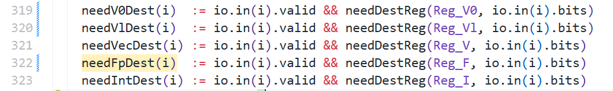

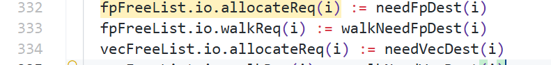

```scala
needFpDest(i) := io.in(i).valid && needDestReg(Reg_F, io.in(i).bits)

fpFreeList.io.allocateReq(i) := needFpDest(i)
```

FreeList 给两条 flw 分配 p66、p67：backend/rename/Rename.scala

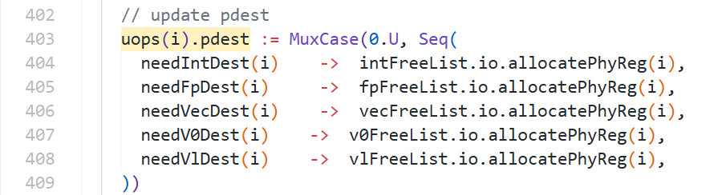FreeList 的实际选择代码在：backend/rename/freelist/StdFreeList.scala

```
val phyRegCandidates = VecInit(headPtrOHVec.map(sel => Mux1H(sel, freeList)))

io.allocatePhyReg(i) := phyRegCandidates(PopCount(io.allocateReq.take(i)))
```

但是FreeList 只负责产生新的物理寄存器号 p69，不会自己修改 RAT。p69 只是 FreeList 给出的候选物理寄存器号；它还需要被写入推测 RAT，才能真正建立新的映射。

RAT 的修改需要通过 `fpRenamePorts` 写端口完成。

生成 FP RAT 写端口：

```
io.fpRenamePorts(i).wen  := fpSpecWen(i)
io.fpRenamePorts(i).addr := uops(i).ldest(...)
io.fpRenamePorts(i).data := fpFreeList.io.allocatePhyReg(i)
```

写端口连接到 RAT：backend/CtrlBlock.scala

```
rat.io.fpRenamePorts := rename.io.fpRenamePorts
```

写入 FP 推测 RAT，最终更新 fpRat 的 spec_table：rename/RenameTable.scala

```
for ((spec, rename) <- fpRat.io.specWritePorts.zip(io.fpRenamePorts)) {
    when (rename.wen) {
    	spec.wen  := true.B
        spec.addr := rename.addr
        spec.data := rename.data
    }
}
```

对本条指令：

```
addr = 15   // 逻辑浮点寄存器 f15
data = 69   // 新物理寄存器 p69
wen  = 1
```

也就是请求将 `fpRAT[f15]` 更新为 `p69`

### 5.4 分配 ROB 编号

`Rename` 会预分配 `ROB index`，并把它附加到动态 `uop`：

```text
robIdx = 56
```

此时只是确定该指令以后使用 `ROB entry 56`。`ROB` 表项的实际写入请求由下一阶段`Dispatch` 产生。

### 5.5 Rename 输出与握手

`Rename` 与 `Dispatch` 之间也不是直接连接，而是经过一个一拍的 `PipeGroupConnect`：

```
  Rename.io.out
      |
      v
  renamePipeDispatch
      |
      v
  Dispatch.io.fromRename
```

 行为与`decodePipeRename`相似，因此这里不再赘述。

在 `8332 ps`：

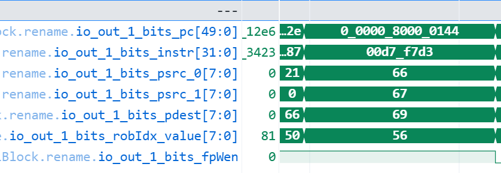

（注：波形初始为16进制，例如psrc_0显示为:42，图片上已换为10进制）

Rename 只有在 `FreeList` 可分配、下游可接收、且当前不处于 `RAB walk` 等条件满足时才会
令输出有效。

## 6.Dispatch：同时送往 ROB 和浮点 Issue Queue

Dispatch 接收 Rename 产生的 `DynInst`，随后分别生成 ROB 入队请求和 Issue Queue 入队请求。这里的“分叉”是逻辑上的两路输出，不代表两个接口必然在同一个时刻完成握手：

```text
                         +--> ROB entry 56
Rename -> Dispatch ------+
                         +--> FP Issue Queue
```

ROB 保存程序顺序和精确状态，`Issue Queue` 负责等待操作数并乱序选择执行。

### 6.1 向 ROB 发出入队请求

`Dispatch` 源码：

```scala
io.enqRob.req(i).valid := fromRename(i).fire
io.enqRob.req(i).bits  := updatedUop(i)
```

含义是：只有 `Rename -> Dispatch` 真正发生 `fire` 时，Dispatch 才向 ROB 产生有效入队请求。

在 `8333 ps` ：

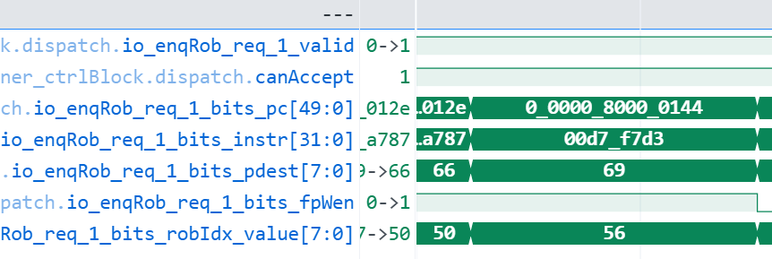

在我奇怪为什么没有ready信号的时候，发现 ROB 侧通过 `canAccept` 表示资源是否足够。

在 `8335 ps`，ROB entry 56 的 debug 字段中已经可见：


```text
robEntries_56_debug_pc    = 0x80000144
robEntries_56_debug_instr = 0x00d7f7d3
```

### 6.2 向 FP Issue Queue 分发

`fuType=FuType.falu` 使 Dispatch 把该 uop 导向到 FP Scheduler。波形中的链路为：

```text
dispatch.io_toIssueQueues_12
  -> inner_fpScheduler.io_fromDispatch_uops_4
  -> IssueQueueFaluFmac.io_enq_0
```

在 `8333 ps`，三处都携带：

```text
PC      = 0x80000144
instr   = 0x00d7f7d3
psrc0   = 66
psrc1   = 67
pdest   = 69
robIdx  = 56
fuType  = 0x800
fpWen   = 1
```

Issue Queue 入队使用 Decoupled：

```text
IssueQueue.io_enq_0.fire = io_enq_0_valid && io_enq_0_ready
```

若 IQ 满，`ready` 会拉低并通过 Dispatch 反压到前级。

 ### 6.3 Dispatch 阶段读写 FP BusyTable

 Dispatch 使用 Rename 传入的 psrc 作为 BusyTable 的查询地址：

位置：backend/dispatch/NewDispatch.scala：269

```
val readAddr = VecInit(
    fromRename.map(x =>
        x.bits.psrc.zipWithIndex.filter(xx => idxseq.contains(xx._2)).map(_._1)
    ).flatten
)
b.io.read.map(_.req).zip(readAddr).map(x => x._1 := x._2)
```

对于本条指令，查询地址为：

```
fpBusyTable read address 0 = 66
fpBusyTable read address 1 = 67
```

也就是查询：

```
fpBusyTable[p66]
fpBusyTable[p67]
```

BusyTable 的返回信号 resp 表示源物理寄存器是否已经 ready：

resp = 1 -> 物理寄存器 ready，数据可以使用
resp = 0 -> 物理寄存器 busy，仍需等待结果产生

对应的组合逻辑为：

位置：backend/rename/BusyTable.scala：174

```
res.resp := !(table(res.req) || readBypass.asUInt.orR)
```

因此，BusyTable 内部的 busy bit 与对外的 resp 含义相反：

table[preg] = 1 -> resp = 0 -> busy
table[preg] = 0 -> resp = 1 -> ready

#### 1.设置目的物理寄存器为 busy

由于这条 fadd.s 会写浮点目的寄存器，因此：

fpWen = 1
pdest = p69

Dispatch 生成 FP BusyTable 的分配请求：

位置：backend/dispatch/NewDispatch.scala：241~251

```
allocPregsValid(1) := VecInit(fromRename.map(x => x.valid && x.bits.fpWen))

val allocPregs = Wire(Vec(busyTables.size, Vec(RenameWidth, ValidIO(UInt(PhyRegIdxWidth.W)))))
  allocPregs.zip(allocPregsValid).map(x =>{
    x._1.zip(x._2).zipWithIndex.map{case ((sink, source), i) => {
      sink.valid := source
      sink.bits := fromRename(i).bits.pdest
    }
  }
})
```

对于本条指令：

```
allocPregsValid = 1
allocPregs.bits  = 69
```

这表示：

将 fpBusyTable[p69] 标记为 busy

原因是当前指令虽然已经分配了 p69，但 FALU 还没有计算出结果。此时如果后续指令需要读取 p69，不能认为它已经 ready。所以 Dispatch 阶段之后，状态关系为：

-   p66：源物理寄存器，等待查询其 ready 状态

-   p67：源物理寄存器，等待查询其 ready 状态
-   p69：当前 fadd.s 的目标物理寄存器，被标记为 busy

#### 2.对本条 fadd.s 的结果

如果 Dispatch 查询得到：

```
fpBusyTable[p66] -> ready
fpBusyTable[p67] -> ready
```

则 Issue Queue 中对应的两个源操作数状态会被初始化为 ready：

```
src0Ready = 1
src1Ready = 1
```

此时这条指令不需要等待源操作数的 wakeup，可以继续等待：

-   FEX4 是否可用

-   FP 写回端口 2 是否会冲突
-   Issue Queue 仲裁是否选中该指令

但目标寄存器仍然处于：

fpBusyTable[p69] = busy

直到 FALU 计算完成并写回结果。因此，BusyTable 在本条指令中的完整作用是：

```
  查询 p66、p67 是否 ready
          |
          v
  初始化 Issue Queue 的源操作数状态

  标记 p69 为 busy
          |
          v
  阻止后续指令过早读取尚未产生的 fadd.s 结果
```

## 7.Issue Queue：等待、唤醒并乱序发射

### 6.1进入哪个队列

本条指令进入IssueQueueFaluFmac（是一个浮点发射队列，名字由它支持的功能单元类型生成）

```text
def getIQName = {
    "IssueQueue" ++ getFuCfgs.map(_.name).distinct.map(_.capitalize).reduce(_ ++ _)
}
```

 位置： backend/issue/IssueBlockParams.scala

它的名字可以拆成：

IssueQueue + Falu + Fmac

含义是：

  - IssueQueue：发射队列
  - Falu：浮点加减、比较、转换等功能
  - Fmac：浮点乘加、乘减等功能

在当前配置中，FP Scheduler 的第三个 Issue Block 是：

```
IssueBlockParams(Seq(
    ExeUnitParams("FEX4", Seq(FaluCfg, FmacCfg), ... )
), numEntries = 18, numEnq = 2, numComp = 14)
```

位置：xiangshan/Parameters.scala

因此该 Issue Block 的队列名就是：IssueQueueFaluFmac

它不是执行器，而是保存等待执行的指令。

源码中 Issue Queue 的输入和输出接口是：

位置：backend/issue/IssueQueue.scala

```
val enq = Vec(params.numEnq, Flipped(DecoupledIO(new DynInst)))
...
val deqDelay = MixedVec[DecoupledIO[IssueQueueIssueBundle]]
```

  其中：

```
enq        : Dispatch    -> Issue Queue
deqDelay   : Issue Queue -> DataPath/ExeUnit
```

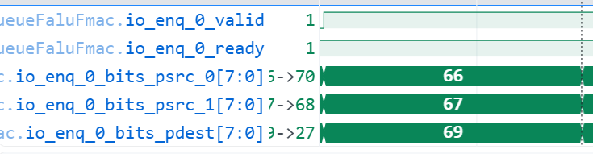

该队列对应 FEX4，  FEX4 是一个浮点执行单元，也就是 ExeUnit：

```scala
ExeUnitParams(
  "FEX4",
  Seq(FaluCfg, FmacCfg),
  Seq(FpWB(port = 2, 0), IntWB(port = 2, 1)),
  Seq(Seq(FpRD(6, 0)), Seq(FpRD(7, 0)), Seq(FpRD(8, 0)))
)
```

这里的含义是：

```
  FEX4
   ├── 支持 FALU
   ├── 支持 FMAC
   ├── 使用浮点写回端口 2
   └── 使用若干浮点寄存器读端口
```

FEX4 本身不是一个单独的加法器，而是一个容器，里面包含多个 Function Unit：

```
  FEX4 ExeUnit
   ├── FALU
   └── FMAC   
```

ExeUnit 会根据指令的 fuType 和 fuOpType，把输入指令送给正确的功能单元。

所以本次执行资源是：

```text
FP Scheduler
  -> IssueQueueFaluFmac
  -> FEX4
  -> FALU
  -> FP writeback port 2
```

### 6.2 源操作数状态

IQ entry 保存 `psrc0=66`、`psrc1=67` 以及两个源的 ready 状态。源可以通过两种主要
方式变为 ready：

1. Dispatch 查询 BusyTable 时已经是 ready；
2. 入队后收到 wakeup，且 wakeup 的 `pdest` 与本 entry 的 `psrc` 匹配。

概念上的匹配条件为：

```text
wakeup.valid
&& wakeup.bits.pdest == entry.psrc(i)
&& wakeup 对应寄存器类型为 FP
```

写回 `p66` 或 `p67` 的生产者完成后，广播会把对应源状态置为 ready。若生产者和消费者
距离很近，还可能通过 IQ/EXU 的快速唤醒和旁路网络提前取得数据，不必等数据已经稳定
写入物理寄存器后再开始调度。

### 6.3 为什么从 8333 ps 等到 8403 ps

目标指令在 `8333 ps` 入队，却到 `8403 ps` 才发射。其间 IQ 需要等待：

- `p66` 和 `p67` 都 ready；
- FEX4 可以接收；
- 预计的 FP 写回端口 2 在结果返回拍可用；
- 没有更老的 flush/redirect 取消该 entry；
- 选择仲裁器最终选中该 entry。

仅凭现有目标信号不能把 70 ps 等待全部归因于某一个源未就绪或某一次仲裁失败。若要
精确归因，需要同时展开 entry 4 的每个 `srcStatus`、wakeup 命中、FU busy 和
writeback busy table 信号。

### 6.4 发射事件

目标项最终位于 IQ entry 4。在 `8403 ps`：

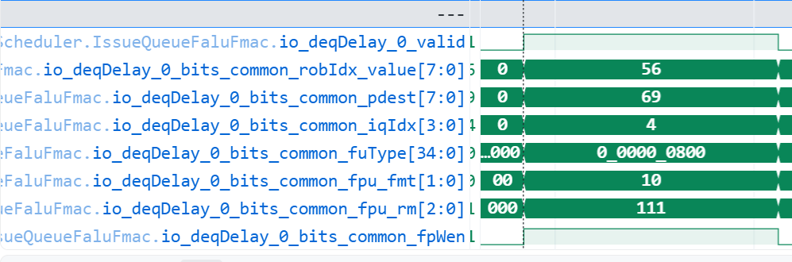

```text
io_deqDelay_0_valid                    = 1
io_deqDelay_0_bits_common_robIdx_value = 56
io_deqDelay_0_bits_common_pdest        = 69
io_deqDelay_0_bits_common_iqIdx        = 4
io_deqDelay_0_bits_common_fuType       = 0x800
io_deqDelay_0_bits_common_fpu_fmt      = 10
io_deqDelay_0_bits_common_fpu_rm       = 111
io_deqDelay_0_bits_common_fpWen        = 1
```

从这一阶段开始，很多接口不再携带原始 `PC/instr`。因此必须使用：

```text
robIdx=56 + pdest=69
```

继续追踪。

## 8.DataPath：读取 p66、p67 并送入 FEX4

Issue Queue 发射的内容主要是控制信息和物理源寄存器号。实际源数据由 DataPath 从 FP
物理寄存器堆读取，必要时由 bypass network 替换。

FEX4 配置使用 FP 读口：

```text
src0 -> FpRD(6, 0)
src1 -> FpRD(7, 0)
src2 -> FpRD(8, 0)  // FALU 不使用第三源，FMA 会使用
```

对本条 FALU：

```text
FP RegFile[p66] -> src0
FP RegFile[p67] -> src1
```

应重点观察：

```text
fpScheduler -> DataPath 的发射请求
FP RF read address = 66 / 67
FP RF read data
bypass network 的选择和输出
FEX4.io_in.valid / ready
FEX4.io_in.bits.src
```

FEX4 输入是 Decoupled，真正接收条件为：

```text
FEX4.io_in.fire
= FEX4.io_in.valid && FEX4.io_in.ready
```

在进入 FALU 前，两个 32 位单精度数据按 RISC-V NaN-boxing 规则装在 64 位浮点寄存器
中：

```text
p66 = 0xffffffff3fa00000
p67 = 0xffffffff40200000
```

高 32 位全 1，低 32 位分别是 FP32 的 `1.25` 和 `2.5`。

## 9.FEX4/FALU：执行单精度浮点加法

### 9.1 FALU 输入

在 `8405 ps`：

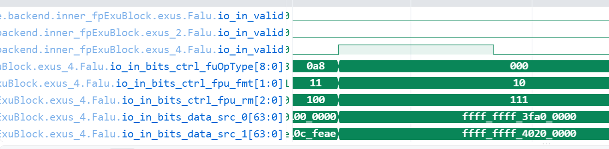

```text
Falu.io_in_valid              = 1
Falu.io_in_bits_ctrl_fuOpType = 0
Falu.io_in_bits_ctrl_fpu_fmt  = 10
Falu.io_in_bits_ctrl_fpu_rm   = 111
Falu.io_in_bits_data_src_0    = 0xffffffff3fa00000
Falu.io_in_bits_data_src_1    = 0xffffffff40200000
```

FALU wrapper 将信号连接到 YunSuan `FloatAdder`：

```scala
falu.io.fire       := io.in.valid
falu.io.fp_a       := src0
falu.io.fp_b       := src1
falu.io.round_mode := rm
falu.io.fp_format  := fp_fmt
falu.io.op_code    := opcode
```

需要注意：这里内部 `FloatAdder.io.fire` 只是计算流水线的有效使能，不是一个完整的
Decoupled 握手，因为 `FloatAdder` 接口没有 `ready`。

真正处理反压的是外层 `FuncUnit.io.in` 和 `FuncUnit.io.out`。

### 9.2 动态舍入模式

FALU 对舍入模式的选择为：

```scala
rm = Mux(instRm =/= "b111".U, instRm, frm)
```

所以：

```text
指令 rm != 111 -> 直接使用指令中的 rm
指令 rm == 111 -> 使用 CSR.frm
```

本条指令 `rm=111`，因此送入 FloatAdder 的实际 `round_mode` 来自 CSR `frm`。

### 9.3 进入 F32Adder

`fp_format=10` 表示 FP32。`FloatAdder` 同时实例化 F64 和 F32/F16 路径，再使用前一拍
保存的格式选择结果。

本条指令看到：

```text
Falu.falu.io_fire          = 1
Falu.falu.io_fp_format     = 10
Falu.falu.F32Adder.io_fire = 1
```

单精度加法内部大致经过：

1. 截取两个 32 位 FP32 操作数；
2. 检查 NaN、sNaN、Infinity、Zero 等特殊值；
3. 比较指数并选择 far path 或 close path；
4. 对较小操作数尾数右移对齐；
5. 形成 guard、round、sticky 位；
6. 执行有效数加法或减法；
7. 规格化结果并调整指数；
8. 按 `round_mode` 舍入；
9. 产生 `NV/DZ/OF/UF/NX` 五个 `fflags`；
10. 把 FP32 结果重新 NaN-box 为 64 位。

### 9.4 数值计算

两个输入：

```text
0x3fa00000 = 1.25  = 1.01b x 2^0
0x40200000 = 2.50  = 1.01b x 2^1
```

指数对齐：

```text
1.25 = 0.101b x 2^1
2.50 = 1.010b x 2^1
```

有效数相加：

```text
0.101b + 1.010b = 1.111b
```

所以：

```text
1.111b x 2^1 = 3.75
```

结果能够精确表示，不需要产生 inexact。

### 9.5 FALU 输出

在 `8406 ps`：

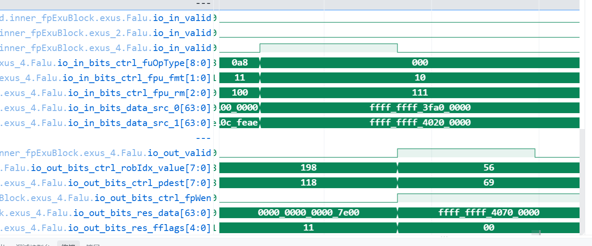

```text
Falu.io_out_valid                 = 1
Falu.io_out_bits_ctrl_robIdx      = 56
Falu.io_out_bits_ctrl_pdest       = 69
Falu.io_out_bits_ctrl_fpWen       = 1
Falu.io_out_bits_res_data         = 0xffffffff40700000
Falu.io_out_bits_res_fflags       = 00000
```

其中：

```text
低 32 位 0x40700000 = 3.75f
高 32 位 0xffffffff = 合法 NaN-box
fflags 00000         = 无浮点异常
```

## 10.写回：结果写入 p69，并通知依赖者和 ROB

### 10.1 FEX4 到 WbDataPath

FEX4 的输出是 Decoupled：

```text
inner_fpExuBlock.io_out_2_0
  -> inner_wbDataPath.io_fromFpExu_2_0
```

传输条件：

```text
io_out_2_0.fire = valid && ready
```

FALU 是确定延迟单元。WbDataPath 对这类 EXU 令外层输出 ready，并断言它在返回拍必须
成功获得对应写回端口。

### 10.2 FP 写回端口仲裁

FEX4 的配置指定：

```text
FpWB(port = 2, priority = 0)
```

因此 `fpWen=1` 的结果进入 FP 写回端口 2 的仲裁组：

```text
FEX4 result
  -> fpArbiterInputs
  -> fpWbArbiter input
  -> fpWbArbiter output 2
```

概念上的仲裁输入条件：

```text
arbiterIn.valid = exuOut.valid && exuOut.bits.fpWen
```

在目标事件附近，波形可见：

```text
8406 ps:
inner_fpExuBlock.io_out_2_0_valid       = 1
inner_fpExuBlock.io_out_2_0_bits_fpWen = 1
inner_fpExuBlock.io_out_2_0_bits_pdest = 69
inner_fpExuBlock.io_out_2_0_bits_robIdx = 56
inner_wbDataPath.fpWbArbiter.io_out_2_valid = 1
```

写回仲裁输出形成寄存器堆写口：

```text
wen  = arbiterOut.fire
addr = pdest = 69
data = 0xffffffff40700000
```

### 10.3 写入 FP Physical RegFile

WbDataPath 的 `toFpPreg` 连接到 DataPath：

```text
wbDataPath.io_toFpPreg
  -> dataPath.io_fromFpWb
  -> fpRfWen/fpRfWaddr/fpRfWdata
  -> FpRegFile writePorts
```

源码中的寄存器堆写接口为：

```scala
wport.wen  := en
wport.addr := addr
wport.data := data
```

本条指令最终完成：

```text
8406 ps:
wbDataPath.io_toFpPreg_2_wen  = 1
wbDataPath.io_toFpPreg_2_addr = 69
wbDataPath.io_toFpPreg_2_data = 0xffffffff40700000

FP Physical RegFile[p69] = 0xffffffff40700000
```

这里写的是物理寄存器 `p69`，不是直接用逻辑编号写 `f15`。逻辑 `f15 -> p69` 的映射
已经在 Rename 阶段写入推测 RAT。

当前实现把 64 位 FP RegFile 数据拆成 4 个 16 位分块，因此在更底层会看到
`fpRegFilePart0` 到 `fpRegFilePart3` 的四组写口同时写地址 69。若只展开其中一个 part，
只能看到结果的 16 位切片；查看完整结果应优先使用 64 位的
`io_toFpPreg_2_data/io_fromFpWb_2_data`。

### 10.4 唤醒依赖指令

写回端口还把：

```text
wen=1, fpWen=1, addr/pdest=69
```

送给 FP Scheduler 和 Dispatch/BusyTable。其作用是：

- BusyTable 把 `p69` 标记为 ready；
- 已经在 IQ 中、且 `psrc == 69` 的依赖指令被唤醒；
- 后续 Dispatch 的年轻指令查询 `p69` 时可直接得到 ready 状态。

因此，“写寄存器堆”和“唤醒消费者”是同一个生产结果引起的两种效果，但对应的硬件
状态并不相同。

### 10.5 通知 ROB

WbDataPath 不只生成寄存器堆写口，还把发生 `fire` 的 EXU 结果送给 CtrlBlock：

```scala
fpExuWBs.valid := fpExuInput.fire
io.toCtrlBlock.writeback.valid := fpExuWBs.valid
```

CtrlBlock 会：

1. 检查该写回是否被更老的 redirect 冲刷；
2. 对有效写回寄存一拍；
3. 记录 `writebackTime`；
4. 把 `robIdx=56`、`fflags` 等信息送给 ROB。

在 `8406 ps` 的 CtrlBlock 接收端可直接确认：

```text
inner_ctrlBlock.io_fromWB_wbData_12_valid             = 1
inner_ctrlBlock.io_fromWB_wbData_12_bits_robIdx_value = 56
inner_ctrlBlock.io_fromWB_wbData_12_bits_fflags       = 00000
```

其中 bundle 下标 12 是本次具体配置下 FEX4 对应的写回位置，不是架构固定编号。

ROB 根据：

```text
writeback.valid
&& writeback.bits.robIdx.value == 56
```

找到 entry 56，并把 `uopNum` 减去本次完成的写回数。对本条 `fadd.s` 自身而言，
它是单 uop、单写回，所以本次事件贡献一次计数递减。

但 `fadd.s` 具备 ROB 压缩资格，entry 56 可能还包含同组的其他简单指令。因此不能
脱离 `robEntries_56.uopNum` 的实际波形，直接断言整个 entry 一定从 1 变成 0。只有
entry 56 中所有被压缩 uop 的待写回计数都清零后，该 ROB entry 才整体完成。

同时，因为本条指令需要写 `fflags`，ROB 会把返回的：

```text
fflags = 00000
```

合并到 entry 56 保存的浮点异常标志中。

## 11.Commit

为什么写回不等于提交？写回完成只说明：

```text
结果已经计算出来并写入推测物理状态
```

提交还要求：

- entry 56 已经走到 ROB 队首；
- 该 entry 的所有 uop 都已写回；
- 没有异常、触发器或需要 replay/flush 的事件；
- 更老指令均已提交；
- 提交端资源允许推进。

提交时，处理器才把该动态指令的效果变为架构上不可回滚的状态，并处理：

- 提交态 RAT/RAB 信息；
- 浮点 dirty 状态；
- `fflags` 的架构更新；
- 旧物理浮点寄存器的回收。

对本条指令，Rename 时不能立即释放旧 `f15` 对应的 `p66`，因为发生异常或分支预测
失败时可能需要回滚。只有该指令提交后，旧物理寄存器才可以通过 FreeList 回收路径
重新分配。

因此完整顺序是：

```text
Rename 分配 p69
-> FALU 计算并写 p69
-> ROB 记录执行完成
-> ROB 按序提交
-> 旧映射 p66 可以回收
```

# 总结

本次波形中的 `fadd.s fa5,fa5,fa3` 完整执行链为：

```text
IFU / IBuffer
  -> Decode: f15 <- f15 + f13, FP32, falu
  -> Rename: p69 <- p66 + p67, ROB 56
  -> Dispatch: ROB enqueue + IssueQueueFaluFmac enqueue
  -> Issue: entry 4 等待两个源 ready 后发射到 FEX4
  -> DataPath: 读取/旁路 p66=1.25、p67=2.5
  -> FALU/F32Adder: 单精度加法
  -> Result: p69=3.75, fflags=00000
  -> WbDataPath: FP WB port 2
  -> FP Physical RegFile: 写 p69
  -> Wakeup: 广播 pdest=69
  -> ROB: ROB 56 写回完成
  -> Commit: 到达 ROB 头后按序提交并回收旧 p66
```


注：当前香山`kuminghu-v2`版本使用的是`yunsuan`目录下的 `FloatAdder`，并非 `fudian` 目录，当前代码对 `fudian` 的直接使用主要是：

```
import fudian.FloatPoint
import fudian.utils.SignExt
```

也就是说，对于`fudian`目前主要使用的是：FloatPoint 数据结构，浮点格式解析工具，符号扩展工具。


# 题目回答

现在回答题目中的几个问题：

### **0.1 FS=Off 时，会发生什么**

`FS` 是 `mstatus` 中的浮点状态字段。香山在`backend/fu/NewCSR/NewCSR.scala` 中将`mstatus.FS == ContextStatus.Off`（虚拟化场景还检查 `vsstatus.FS`）输出为`illegalInst.fsIsOff`。随后 `backend/decode/DecodeUnit.scala` 的`exceptionII` 检查这个信号：

- 标量浮点运算、浮点转换等 `fpOP/f2v` 指令被标记为非法指令；
- 编码为浮点访问的 `flh/flw/fld` 和 `fsh/fsw/fsd` 也被标记为非法指令；
- 相关指令不会按正常路径进入 Rename、Issue Queue 和 FPU 执行；
- 最终由 Decode 生成 `illegalInstr` 异常，而不是让 FALU 执行后再报错。

因此，对当前文档中的 `fadd.s`，`FS=Off` 的关键结果是：它在 Decode 阶段就不能正常执行。`FS=Initial`、`Clean`、`Dirty` 的状态转换和保存/恢复语义属于CSR/操作系统上下文管理；它们不改变 `fadd.s` 的算术格式。

### 0.2 不同舍入模式如何配置

指令编码中的 `rm` 是 3 位，香山在`backend/decode/FPDecoder.scala` 中把 `inst.RM` 放入 `ctrl.rm`。当前实现的编码为：

| `rm`      | 名称     | 含义                                        |
| --------- | -------- | ------------------------------------------- |
| `000`     | `RNE`    | round to nearest, ties to even              |
| `001`     | `RTZ`    | toward zero                                 |
| `010`     | `RDN`    | toward negative infinity                    |
| `011`     | `RUP`    | toward positive infinity                    |
| `100`     | `RMM`    | round to nearest, ties to maximum magnitude |
| `101/110` | reserved | 非法编码                                    |
| `111`     | `DYN`    | 使用 CSR `frm`                              |

对于 `fadd.s`，`backend/fu/fpu/FpPipedFuncUnit.scala` 选择：

```scala
rm = Mux(instRm =/= "b111".U, instRm, frm)
```

也就是说，`rm != 111` 时使用指令自身的舍入模式；`rm == 111` 时使用当前CSR `frm`。`frm` 由 `frm` CSR 或 `fcsr[7:5]` 配置。Decode 还会把`rm=101/110`，以及 `rm=111` 但 `frm` 为保留值的情况标为非法指令。实际执行时，`fudian/RoundingUnit.scala` 根据 guard、round、sticky 位和`rm` 决定是否加 1：

- `RNE` 根据距离最近值和 ties-to-even 规则决定；
- `RTZ` 永不向上舍入；
- `RUP/RDN` 只在结果方向对应时向上舍入；
- `RMM` 在恰好一半时向最大幅度方向舍入。

因此本例 `1.25f + 2.50f = 3.75f` 是精确结果，改变合法舍入模式也不会改变结果，`fflags` 仍为 `00000`；对不能精确表示的结果，舍入模式才会影响低位和`NX`，并可能影响溢出时输出 infinity 还是最大有限数。

### 0.4 NaN、Inf、subnormal 等操作数如何处理

`FloatPoint.decode` 根据 IEEE 编码分类：

- `exp=全1、fraction =0`：infinity；
- `exp=全1、fraction!=0`：NaN；fraction 最高有效位区分 qNaN 和 sNaN；
- `exp=全0、fraction!=0`：subnormal；
- `exp=全0、fraction =0`：零；
- 其他情况：normal。

对当前 `fadd.s`，FALU 包装器`backend/fu/wrapper/FALU.scala` 会检查单精度操作数的高 32 位是否全为 1，并把不满足 NaN-boxing 的输入作为 canonical NaN 交给`yunsuan.fpu.FloatAdder`。加法器的特殊路径会先于普通加法路径处理：

- 任一操作数为 NaN，结果为 canonical/default qNaN；
- sNaN 会使 `NV=1`；
- `+Inf + -Inf`，或等价的无穷相反数相加，会产生 qNaN 并使 `NV=1`；
- 同号 infinity 的加法得到相同符号的 infinity，通常不设置异常；
- 零、subnormal 不会因为“数值特殊”就自动产生异常，subnormal 会进入规格化、
    对齐、舍入路径；
- 普通有限数的精确加法不设置异常。

在 `yunsuan/fpu/FloatFMA.scala` 中可以看到对应实现：`has_nan` 和 `has_inf`优先选择 NaN/Inf 结果，NaN 结果使用`Cat(0, exponent=全1, quiet-bit=1, ...)`；`fflags` 按照`Cat(NV,DZ,OF,UF,NX)` 输出。较早/另一套加法器实现`fudian/FADD.scala` 也明确将 sNaN 和相反无穷相加判为 invalid。

### 0.5 Double -> Single 精度转换及高位处理

`fcvt.s.d` 不是截取 Double 的低 32 位，而是由`backend/fu/wrapper/FCVT.scala` 调用 `yunsuan.scalar.FPCVT`，将 binary64 数值转换成 binary32 数值。转换过程会：

1. 解码 Double 的符号、指数和有效数；
2. 将数值重新编码到 Single 的指数范围和 24 位有效精度；
3. 对被丢弃的有效位使用 `rm` 舍入，并据此设置 `NX`；
4. 对 NaN、Inf、零、subnormal、overflow 等特殊值走对应特殊路径。

在 XLEN/FLEN=64 的标量浮点寄存器中，Single 结果必须使用 RISC-V NaN-boxing表示。`FCVT.scala` 的结果选择明确写成：

```scala
Cat(Fill(32, 1.U), fcvtResult(31, 0))
```

所以 `Double -> Single` 的“高位处理”分两层理解：

- 数值转换阶段只产生低 32 位的 IEEE binary32 编码；
- 写回 64 位浮点寄存器时，高 32 位补成全 1，而不是零扩展、符号扩展，
    也不是保留原 Double 的高位。

例如 Single 结果为 `0x40700000`，寄存器中的合法表示是：

```text
0xffffffff40700000
```

### 0.6 Floating load single source（`flw`）的高位如何处理

这里的 single source 是从内存加载一个单精度源值，即 `flw`。在`mem/lsqueue/LoadQueue.scala` 的 `HasLoadHelper.rdataHelper` 中，浮点写使能`fpWen` 为真时：

```scala
LSUOpType.lw -> Mux(fpWen, FPU.box(rdata, FPU.S), SignExt(...))
```

因此：

- `flw` 从内存取得 `rdata[31:0]`；
- 写入浮点物理寄存器时，`FPU.box(..., FPU.S)` 生成
    `{32'hffffffff, rdata[31:0]}`；
- 它不是整数 `lw` 的符号扩展；
- 后续单精度浮点运算只使用低 32 位，并要求高 32 位全为 1；
- 若一个 64 位浮点寄存器的高 32 位不是全 1，`FALU.scala` 会把这个输入视为
    non-canonical NaN，而不是把高位截掉后当成正常 Single。

对应地，`fld` 使用 `FPU.box(rdata, FPU.D)`，Double 占满 64 位，不需要额外NaN-boxing。半精度也遵循同一规则，高 48 位补全 1。

### 0.7 计算结果 underflow/overflow 如何处理

香山在加法器中保留额外舍入位，并在舍入后判断指数是否超出目标格式范围。在 `yunsuan/fpu/FloatFMA.scala` 中：

- `NX` 由 guard/round/sticky 位决定；
- 结果太小、落入 subnormal 或舍入为 subnormal 且不精确时，设置 `UF`；
- 结果太大时设置 `OF`，并同时设置 `NX`；
- 对 overflow，`RTZ`，以及与结果符号相反方向的 directed rounding，
    选择带最大有效 fraction 的最大有限数；
- 其他舍入方向选择 infinity。

同样的结果选择在 `fudian/FADD.scala` 中写得更直接：`common_overflow` 检测溢出，`RoundingUnit.is_rmin` 决定 `common_overflow_exp` 和`common_overflow_sig`，从而在 infinity 与最大有限数之间选择；`common_underflow`和 `common_inexact` 分别生成 `UF`、`NX`。因此，underflow/overflow 一般不会变成整数异常或直接陷入；浮点指令仍写回一个按舍入模式确定的 IEEE 结果，并通过 `fflags` 报告状态。以单精度为例，overflow结果的低 32 位可能是 infinity，也可能是最大有限数，随后若写入 64 位浮点寄存器仍要再进行 Single 的 NaN-boxing。

### 0.8 浮点除法除零是否有特殊处理

有。`fdiv.s` 通过 `backend/fu/wrapper/FDivSqrt.scala` 连接到`yunsuan.fpu.FloatDivider`。在
`yunsuan/fpu/FloatDivider.scala` 中，单精度和双精度共用相同的特殊情况判断：

```scala
op_invalid = (Inf / Inf) || (0 / 0) || sNaN
res_is_nan  = input_NaN || op_invalid
res_is_inf  = Inf numerator || zero denominator
divided_by_zero = !res_is_nan && !Inf numerator && zero denominator
```

所以主要情况是：

| 操作                 | 结果                  | 标志                        |
| -------------------- | --------------------- | --------------------------- |
| 有限非零数 `/ +0/-0` | 带正确符号的 infinity | `DZ=1`                      |
| `0 / 0`              | canonical qNaN        | `NV=1`，不是 `DZ`           |
| `Inf / Inf`          | canonical qNaN        | `NV=1`                      |
| qNaN 参与运算        | canonical qNaN        | 通常不因 qNaN 本身设置 `NV` |
| sNaN 参与运算        | canonical qNaN        | `NV=1`                      |
| `Inf /` 有限非零数   | 带正确符号的 infinity | 通常无 `DZ`                 |
| 有限非零数 `/ Inf`   | 带正确符号的零        | 通常无 `DZ`                 |

除零是在特殊路径中提前识别的，不必进入完整迭代除法；最终`fflags_scalar = Cat(NV,DZ,OF,UF,NX)`。`fdiv.s` 的结果写回 64 位物理浮点寄存器时，`FDivSqrt.scala` 与其他标量 Single 结果一样，将低 32 位用高 32 个1 进行 NaN-boxing。
