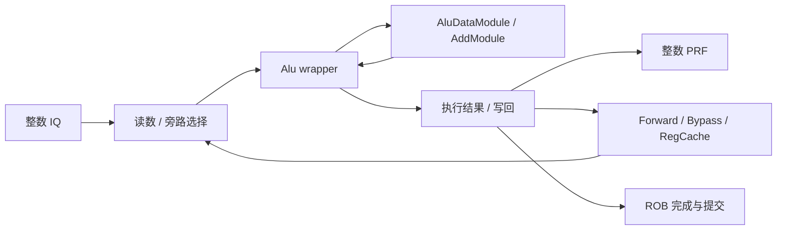

# ADD 指令执行生命周期

## 📋 基本信息

| 字段 | 内容 |
|---|---|
| **指令名称** | `add rd, rs1, rs2` |
| **编码格式** | R 型：`0000000_rs2_rs1_000_rd_0110011` |
| **RISC-V 扩展** | RV64I 标量整数加法 |
| **是否有压缩格式** | 本文分析 32 位 ADD；C 扩展的 `c.add` 是受操作数约束的 16 位加法编码，不能把其指令长度当作 ADD 的长度 |
| **指令分类** | 整数计算，结果为 `(rs1+rs2) mod 2^64` |
| **FuType** | `FuType.alu` |
| **FuOpType** | `ALUOpType.add`，本地编码 `b010_0001` |
| **目标 FU** | `wrapper.Alu` → `AluDataModule` → `AddModule` |

实现依据为本地 `/nfs/home/wanghao/emuByYuan/stable-kmh-v2`，源码标识 `abd0f867a86b66a92d4fc5d3c6d62944725c747f`。配置数字指默认声明，不代表所有仿真配置。以下时序为源码推导，没有将历史报告周期作为本版本实测。ADD、ADDI、ADDW 虽共享部分执行资源，但本文主线仅为两个寄存器源的 64 位 ADD。

## 1. 前端路径

### 1.1 取指

| 阶段 | 延迟 | 关键行为 | 代码位置 |
|---|---|---|---|
| ICache/MainPipe | 可变 | 获取 ADD 所在代码块；ITLB/PTW、cache miss 和背压可以增加等待 | [IFU][IF] |
| IFU F0 | 请求握手 | FTQ 请求进入 IFU | [IFU][IF] 241–263 行 |
| IFU F1 | 连续推进时一阶段 | 保存请求并推进 | [IFU][IF] 291–304 行 |
| IFU F2 | 可等待 | 等响应并整理预译码输入 | [IFU][IF] 357–385 行 |
| IFU F3 | 可背压 | 根据有效指令范围入队 IBuffer | [IFU 入队][IFO] 953–986 行 |

> **前端流水线总延迟（无冲刷）：** F0→F3 连续推进是三个阶段间隔；不包含此前的取指等待和之后的 IBuffer 排队，不能由此给出取指到提交固定拍数。

### 1.2 预译码

| 项目 | 内容 |
|---|---|
| **brTable 匹配** | 不匹配控制流条目，得到 `BrType.notCFI` |
| **PreDecodeInfo 字段** | 对有效 32 位 ADD：`valid=1,isRVC=0,brType=notCFI,isCall=0,isRet=0` |
| **是否有专用检测逻辑** | 无 ADD 专用前端控制流检测；运算类别由后端译码确定 |
| **跳转偏移计算** | 通用偏移组合逻辑可对取指窗口运行，但 ADD 不使用结果改变 PC，不应描述为整个偏移电路不运行 |

依据：[PreDecode][PD] 35–82 行。

### 1.3 PredChecker 校验

| 项目 | 内容 |
|---|---|
| **是否触发 remaskFault** | ADD 自身不是 JAL/JALR/RET，不主动触发 |
| **是否触发 mispredict** | 正常不触发；非 CFI 的 ADD 位置若被错误预测 taken，可由 `notCFITaken` 检出 |
| **是否产生 wbRedirect** | 通用前端校验可能恢复；ADD FU 不产生分支 redirect |
| **fixedRange 影响** | 同块更早控制流错误可屏蔽 ADD，不能说对 ADD 完全无影响 |

依据：[PredChecker][CHECK] 361–445 行。

### 1.4 IBuffer 入队

| 项目 | 内容 |
|---|---|
| **入队宽度** | `PredictWidth=FetchWidth*(HasCExtension ? 2 : 1)`；默认 FetchWidth=8，C 开启时为 16 个半字候选位置。输出至 Decode 的宽度默认是 6，不是同一参数 |
| **是否可能被挡** | IBuffer 容量、ready、有效范围与 flush 共同影响入队 |
| **携带的关键信息** | 指令字、PC、FTQ 指针/偏移、预译码、取指异常及 trigger |
| **代码位置** | [IFU 入队][IFO]、[IBuffer][IB] 227–305 行、[Parameters][P] |

## 2. 后端路径

### 2.1 译码

| 项目 | 内容 |
|---|---|
| **DecodeWidth** | 默认 6 |
| **简单/复杂译码** | 直接表译码，不需要复杂指令拆分 |
| **译码延迟** | 组合匹配，不等于完整 DecodeStage 零时间 |
| **关键译码结果** | 两个 `SrcType.reg`、第三源 `SrcType.X`、`FuType.alu`、`ALUOpType.add`、`SelImm.X`、`xWen=T,canRobCompress=T` |
| **代码位置** | [DecodeUnit][D] 154 行；[操作码][OP] 316 行 |

```scala
ADD -> XSDecode(SrcType.reg, SrcType.reg, SrcType.X,
  FuType.alu, ALUOpType.add, SelImm.X, xWen = T, canRobCompress = T)
```

第三个 `SrcType.X` 是第三源，不是目的类型。非零 rd 写入整数结果；`rd=x0` 由最终 rfWen 门控关闭写回。`canRobCompress` 是 ROB 压缩资格，不表示这条 ADD 成为 16 位指令，也不保证每次都与邻接指令合并。[DecodeUnit][D] 1145、1179 行附近

### 2.2 重命名

| 项目 | 内容 |
|---|---|
| **RenameWidth** | 默认 6 |
| **延迟** | 经 Rename 边界并受物理寄存器/下游 ready 影响，不能无条件填固定端到端 1 拍 |
| **源操作数** | 两个整数逻辑源映射到物理源；同组 RAW 依赖需要重命名旁路 |
| **目标操作数** | 有效非零 rd 分配整数物理目的，旧映射用于后续回收/恢复 |
| **特殊处理** | `add rd,rs1,x0` 数学上像拷贝，但不能因此假定 move elimination；本地 isMove 匹配 ADDI 零立即数等专门编码，不是所有加零 ADD |
| **代码位置** | [Rename][R]，尤其 634–684 行；[Move 识别][MOVE] 845–847 行 |

### 2.3 派发

| 项目 | 内容 |
|---|---|
| **DispatchWidth** | 默认 Rename 输入 6 路，各整数 IssueBlock 的 `numEnq=2`；不是六个 ADD 专用执行口 |
| **延迟** | ROB、派发队列和 IQ 空间不足会等待 |
| **目标 ROB** | 跟踪执行完成、异常与按序退休，保留 robIdx/物理目的等身份 |
| **目标 Issue Queue** | 默认四个整数 IssueBlock 的 ALU0–ALU3 均含 AluCfg；ALU0/1 还与 MulCfg/BkuCfg 共享 ExeUnit |
| **代码位置** | [NewDispatch][DIS]、[执行配置][PORT] 391–410 行 |

### 2.4 发射

| 项目 | 内容 |
|---|---|
| **Issue Queue 类型** | 整数共享 IQ，不是只接收 ADD 的专用队列 |
| **唤醒条件** | 两源数据可用，满足选择、读数/旁路与执行/写回端口约束 |
| **选择策略** | 就绪、年龄与端口仲裁共同决定，不承诺全局严格 oldest-first |
| **最小延迟** | 必须经过调度和数据选择边界；不能将 ALU 的零内部寄存级等同于 IQ 零等待 |
| **最大延迟** | 源生产者、队列和共享资源可持续阻塞，没有环境无关有限上界 |
| **代码位置** | [IssueQueue][IQ]、[BypassNetwork][BP] 153–171 行 |

### 2.5 执行

| 项目 | 内容 |
|---|---|
| **执行单元** | `wrapper.Alu` 内实例化 `AluDataModule`，后者使用 `AddModule` |
| **流水/阻塞** | `AluCfg.piped=true,maybeBlock=false`；wrapper 组合连接 `in.ready=out.ready` 和 `out.valid=in.valid` |
| **执行延迟** | AluCfg 未覆盖默认 `CertainLatency(0)`，表示 FU 内无额外寄存级，不是整条 ADD 零周期 |
| **FSM 状态机** | 无 ADD 专属状态机；组合计算由周围流水边界承载 |
| **关键输出信号** | `io.out.bits.res.data`、`io.out.valid` 及对应目的/身份控制 |
| **代码位置** | [Alu wrapper][WR] 8–23 行、[FuConfig][CFG] 64、310–320 行、[Alu 数据通路][ALU] |

`ALUOpType.add=b010_0001` 下，`wordMaskAddSource` 保留 rs1 的全部 64 位，输入 mux 选择原始两源；`AddModule.io.add := src(0)+src(1)` 输出 XLEN 位，最终 `AluResSel` 选择 addRes。因此结果是模 2^64 的加法，高位进位被丢弃，不更新条件码、不产生整数溢出 trap。[Alu 数据通路][ALU] 25–34、183–194、270–291 行

**无 FSM 的执行条件表：**

| 输入/输出条件 | 行为 | 身份约束 |
|---|---|---|
| in.valid=0 | 无有效执行结果 | 组合数据变化不代表一次指令执行 |
| in.valid=1,out.ready=1 | in/out 可在同一 FU 周期窗口握手 | 两源、fuOpType 和目的控制属于同一 uop |
| out.ready=0 | in.ready=0 | 上下游必须遵循其接口保持/取消规则，不能重复接受 |
| 外部 redirect | 后端按年龄取消年轻工作 | wrapper 中局部 `flushed` 定义不能单独视为有效门控证明 |

最后一点尤其重要：本地 wrapper 虽计算 `robIdx.needFlush`，其 `out.valid` 赋值仍直接来自 `in.valid`。ADD 的正确取消必须沿执行单元、调度、写回和 ROB 的实际恢复连接分析，不能只凭变量名断言 wrapper 已屏蔽输出。[Alu wrapper][WR]

### 2.6 写回

| 项目 | 内容 |
|---|---|
| **写回端口** | 默认 ALU0–ALU3 对应 IntWB 0–3；其他功能可能共享这些资源 |
| **是否写回** | 有效非零 rd 写入 64 位和；rd=x0 丢弃，无 FP/Vec 写回 |
| **写回延迟** | FU 输出、forward/bypass、RegCache 写入、PRF 写入分别计时，不统一写作“执行后 1 拍” |
| **代码位置** | [执行配置][PORT]、[BypassNetwork][BP]、[ExeUnit][EXU] |

对参与旁路的整数源，`readForward/readBypass/readRegCache` 选择不同数据时刻；不能将 `readBypass2` 泛化为 ADD 必经级，它的生成还受执行单元类别筛选。RegCache 写使能、标签由有效整数执行结果寄存，数据来自 `bypassDataVec`。这是加速源数据获取的机制，不是架构提交点；issue→PRF/RegCache 的绝对拍数需要对应生成配置/波形确认。[BypassNetwork][BP] 108–128、153–171、195–218 行

### 2.7 提交

| 项目 | 内容 |
|---|---|
| **CommitWidth** | 默认 CommitWidth=8、RobCommitWidth=8；实际提交还受 ROB 压缩/提交控制影响 |
| **提交条件** | ADD 完成并进入可退休的程序顺序前缀，无更老异常/阻塞 |
| **是否触发 flush** | 普通 ADD 不设置 flushPipe；外部异常/错误预测可取消它 |
| **是否触发 redirect** | ADD FU 不生成控制流目标；由后端通用恢复处理 |
| **代码位置** | [Rob][ROB]、[FuConfig][CFG]、[DecodeUnit][D] |

## 3. 信号前递

### 3.1 前递路径图




### 3.2 信号清单

| 信号名 | 方向 | 位宽 | 语义 | 持续方式 |
|---|---|---|---|---|
| `io.in.valid/ready` | 上游 ↔ Alu | 各 1 | 接受有效 uop | `fire=valid&&ready` |
| `data.src(0/1)` | 读数/旁路 → ALU | 各 64 | 两整数操作数 | 随有效输入 |
| `ctrl.fuOpType` | 后端 → ALU | FuOpType 宽度 | 选择 ADD 路径 | 随 uop |
| `res.data` | ALU → 写回/旁路 | 64 | 模 2^64 的和 | 组合，与 valid 配对 |
| `pdest/robIdx` | 控制路径 → 写回/ROB | 参数化 | 数据依赖与指令身份 | 随结果 |
| `readForward/readBypass/readRegCache` | 数据源选择控制 | 布尔选择 | 当前、寄存旁路或缓存来源 | 消费者源选择 |
| `toDataPath.wen/tag/data` | BypassNetwork → RegCache 写路径 | 使能/标签/整数数据 | 条件性 RegCache 更新 | 寄存控制与旁路数据对齐 |

## 4. 周期计算

### 4.1 流水线延迟分解

| 阶段 | 固定/可变 | 周期数 | 说明 |
|---|---|---|---|
| Decode | 组合 | 0 个额外逻辑寄存级 | 不包含阶段排队 |
| Rename/Dispatch | 可变 | `T_r+T_d` | 资源与握手等待 |
| Issue/读数 | 可变 | `T_i` | 两源依赖、选择、读 RF/旁路 |
| ALU 内部 | 源码固定 | 0 个额外寄存级 | 同一周期窗口组合生成结果 |
| 执行结果到写回 | 配置/资源相关 | `T_w` | 周围流水寄存器与仲裁 |
| ROB 等待 | 可变 | `T_c` | 按序提交 |
| **合计** | 可变 | `T_r+T_d+T_i+T_w+T_c` | 不包含取指/IBuffer 等待 |

### 4.2 公式

$$T_{decode\to commit}=T_r+T_d+T_i+T_{ALU,internal}+T_w+T_c,\quad T_{ALU,internal}=0$$

这里的 0 表示 wrapper 无额外寄存级，不表示组合加法没有物理传播时间，也不表示依赖链可以在一个时钟窗口无限执行。单 ALU 无资源冲突时可以每拍接收一条独立操作；默认四实例给出 FU 资源层每拍 4 条独立 ADD 的上限，实际受共享调度和写回限制。

### 4.3 最佳/最差情况

| 场景 | 周期数 | 条件 |
|---|---|---|
| **最佳** | ALU 内组合完成；端到端需另计 | 两源就绪、执行/写回资源可用 |
| **典型** | 无本版本统计分布 | 独立 ADD 可并行，相关链需按唤醒/旁路时序推进 |
| **最差** | 等待无环境无关有限上界 | load 源 miss、IQ 满、端口竞争、ROB 更老阻塞或恢复 |

### 4.4 时序图

以下仅描述 ALU 边界的一次 ready/valid 握手，不是整条指令的实测时序。

```text
周期窗口        C0          C1          C2
in.valid        1           1           0
out.ready       0           1           1
in.ready        0           1           1
out.valid       1           1           0
in/out.fire     0           1           0
数据            A保持       A被接受     无有效结果
```

```waveform-draw
{"signal":[{"name":"clk","wave":"p.."},{"name":"io.in.valid","wave":"1.0"},{"name":"io.out.ready","wave":"01."},{"name":"io.in.ready","wave":"01."},{"name":"io.out.valid","wave":"1.0"},{"name":"io.in.fire","wave":"010"}]}
```

核验以 `TOP.clock` 正沿采样；先用 PC/编码定位，再用 robIdx/pdest 跟踪 issue、执行结果、forward/bypass、RegCache、PRF 写入与 commit，不能只用 rd 或 PC 匹配乱序结果。

## 5. 异常与特殊处理

### 5.1 异常检测

| 异常类型 | 检测位置 | 检测条件 | 处理方式 |
|---|---|---|---|
| 整数溢出 | 加法输出截断 | 和超出 64 位 | 不产生 trap，保留低 64 位 |
| 非法指令 | Decode | 不符合有效编码 | 通用非法指令异常，不归因于合法 ADD 的数值 |
| 取指异常 | 前端 | ADD 所在代码访问失败 | 保留精确异常路径 |
| debug/trigger | 通用调试路径 | 满足配置触发条件 | 独立于 ADD 算术运算处理 |

### 5.2 冲刷与重定向

| 触发条件 | 类型 | 影响范围 | 恢复方式 |
|---|---|---|---|
| 更老分支错误 | 后端 redirect | 年轻 ADD 及其消费者 | 按年龄恢复队列、映射与 ROB 状态 |
| 更老异常/中断 | 精确恢复 | 取消范围内的年轻工作 | 不使错误路径结果成为架构提交 |
| 前端误预测修正 | fixedRange/前端 flush | 无效取指范围 | ADD 可被屏蔽，不是 ADD 主动跳转 |

### 5.3 与其他指令的交互

| 交互场景 | 影响指令 | 行为 |
|---|---|---|
| `load → add` | ADD 源 | load miss 增加源等待，不改变 ALU 组合实现 |
| `add → add/store/jalr` | 消费者 | 依据物理目的唤醒、旁路，消费者不必等 ADD 架构提交 |
| ADDI 零立即数 | 拷贝/消除路径 | 与 ADD 加零编码不同，不能默认同样消除 |
| ADDW | RV64 字运算 | ADDW 只取低 32 位并符号扩展，ADD 保留 64 位和 |
| `rd=x0` | 无有效目的 | 不写寄存器，不产生虚假数据依赖 |
| 跨 cache line/页取指 | ADD 指令字 | 前端处理半字拼接、翻译和异常；ALU 不发跨界数据请求 |
| MMIO 或地址计算 | ADD 的源/用途 | 整数相加不触发 MMIO 访问，实际副作用属于后续 load/store |

**跨边界代码解析**

ADD 不生成数据访存请求；下表的边界仅涉及构成该指令的两个半字。启用 C 扩展时，32 位 ADD 可以从半字对齐地址开始。

| 边界与示例 | 首片段 / 次片段 | 检查与合并 | 失败与恢复 |
|---|---|---|---|
| 4 KiB 页边界，PC 页内偏移 `0xffe` | 本页末 2 字节 / 次页首 2 字节 | 不能沿用第一页权限代表第二页；`f2_crossPage_exception_vec` 在首片段无异常且满足跨行非 RVC 条件时选择第二份异常 | 次页异常随指令传递，不把半条 ADD 当成正常指令执行；见 [IFU][IF] 528–537 行 |
| cache line 边界，PC 位于行末 2 字节 | 当前行末半字 / 下一行首半字 | `f0_doubleLine` 来自 `crossCacheline`；取指响应等待与半指令有效性共同约束前进，不是 ALU 的一次原子数据访问 | 保存的 `f3_lastHalf.valid` 在 `f3_flush` 时优先清零，防止旧片段进入新路径；见 [IFU][IF] 243、925–960 行 |
| uncache 取指，物理地址低 3 位为 `110` | 当前返回片段 / 必要时重发获取后半字 | 非 RVC、地址满足跨返回边界且无异常时 `needResend` 进入 `m_sendTLB`，重新请求翻译；总线异常与第二份取指异常先合并 | `Pbmt.nc` 可直接进入发送态，其他路径经过前序提交等待，不能将全部 uncache 取指描述为可自由推测；见 [IFU][IF] 731–775 行 |

这些是 IFU 的边界处理条件，不代表已经验证所有 ICache miss、MSHR 分配或总线返回组合。定向检查应覆盖“次页故障 + 跨行 ADD”以及“残留半指令 + redirect”，观察异常归属和冲刷后入队有效性。

## 6. 安全性分析

### 6.1 推测执行窗口

| 窗口 | 起始点 | 终止点 | 周期数 | 风险等级 |
|---|---|---|---|---|
| 推测算术 | 推测发射 | 正确路径按序提交，或错误路径被恢复取消 | 可变 | 需验证，未测定 |
| 共享资源等待 | 就绪入队 | 获得执行/写回槽 | 可变 | 潜在时序观察面，非漏洞结论 |

### 6.2 侧信道暴露面

| 暴露面 | 类型 | 缓解措施 |
|---|---|---|
| ALU/旁路/RF 竞争 | 微架构时序 | 固定组合结构不保证整条指令恒时；需隔离或测量共享资源 |
| 数据切换活动 | 潜在功耗/电磁 | 无门级功耗数据，不能由无迭代推导无泄漏 |
| 错误路径微架构状态 | 推测执行 | ROB 保证架构按序，不等于全部微架构痕迹被清除 |

### 6.3 有序性保证

| 保证 | 机制 | 代码依据 |
|---|---|---|
| 正确的源/目的关系 | 物理寄存器映射和同组依赖处理 | [Rename][R] |
| 加法结果与操作选择一致 | add 操作码经过输入 mux 和结果 mux | [Alu 数据通路][ALU]、[操作码][OP] |
| 旁路身份与数据对齐 | 物理标签及数据源选择 | [BypassNetwork][BP] |
| 执行完成不越序提交 | ROB 完成记录与按序退休 | [Rob][ROB] |

**验证特别注意**

| Verification ID | 风险/不变量 | 定向激励 | 预期观察 | 检查与覆盖 |
|---|---|---|---|---|
| ADD_WRAP | 进位错误或误报 trap | `0xffffffffffffffff + 1` | 结果为 0，无算术异常 | 覆盖进位、符号边界和零值 |
| ADD_WIDTH | 与 ADDW 混淆 | `0x100000000 + 1` | ADD 得 `0x100000001` | 覆盖高 32 位保留 |
| ADD_RAW | 相关指令取旧值 | 同组及跨拍 ADD 依赖链 | psrc/pdest、唤醒及旁路匹配 | 分别检查 RF、forward、bypass、RegCache |
| ADD_X0 | 写零寄存器 | rd=x0；rs1/rs2=x0 | 目的写使能关闭，源零正确 | 不将 ADD 加零自动判作 move elimination |
| ADD_BACKPRESSURE | 重复接受 | out.ready 拉低后恢复 | wrapper in.ready 同步受限 | 按 fire 计数，区分 valid 与接受 |
| ADD_FLUSH | 错误路径结果退休 | 更老分支错误与 ADD 执行重叠 | 年轻 ADD 不进入有效架构提交 | 追踪 ROB 年龄和写回取消，不只看局部 flushed |
| ADD_FETCH_BOUNDARY | 跨界片段或异常归属错误 | 页末 ADD 次页故障；半指令残留时 redirect；uncache 重发 | 次片段检查生效，旧路径半指令不入队 | 检查跨页异常字段、lastHalf.valid、入队 valid 与重发状态 |

上述为验证场景设计，不代表已有波形覆盖或仿真通过结论。

## 7. 性能特征

| 指标 | 值 | 说明 |
|---|---|---|
| **执行吞吐** | 单 FU 最佳 1 条/拍；默认四实例资源上限 4 条独立 ADD/拍 | 受共享执行、写回和源依赖限制 |
| **执行延迟** | FU 内部 CertainLatency(0) | 周围流水和调度不能省略 |
| **端口占用** | 默认 ALU0–ALU3、IntWB0–3 | ALU0/1 与乘法/BKU 共享配置 |
| **流水线阻塞** | 整数源依赖及 IQ、执行、写回资源竞争 | 不具备除法式迭代 busy |
| **关键路径影响** | 输入选择、64 位加法、结果选择及旁路 | 未综合/STA，不报告频率结论 |

## 8. 配置依赖

| 参数 | 默认值 | 影响 | 配置位置 |
|---|---|---|---|
| XLEN | 64 | 加法输入和结果宽度 | [Parameters][P] |
| FetchWidth/IBufSize | 8/48 | 取指窗口、缓冲 | [Parameters][P] |
| DecodeWidth/RenameWidth | 6/6 | 后端输入宽度 | [Parameters][P] |
| RobCommitWidth/RobSize | 8/160 | 提交和在途资源 | [Parameters][P] |
| AluCfg.piped/latency | true / 默认 CertainLatency(0) | FU 内无额外寄存级 | [FuConfig][CFG] |
| AluCfg 实例数 | 默认 4 | ALU0–ALU3 | [执行配置][PORT] |
| needWriteRegCache | 由 ExeUnit 条件派生 | 是否参与 RegCache 写路径 | [ExeUnit 参数][EP]、[BypassNetwork][BP] |

## 附录：关键代码索引

| 模块 | 文件路径 | 关键行号 |
|---|---|---|
| ADD 译码/类型 | [DecodeUnit][D]、[package][OP] | 154；316 |
| 拷贝识别 | [DecodeUnit][MOVE] | 845–847 |
| ALU wrapper | [wrapper/Alu][WR] | 8–23 |
| 加法器和选择 | [Alu 数据通路][ALU] | 25–34、183–194、270–291 |
| 配置与资源 | [FuConfig][CFG]、[Parameters][PORT] | 64、310–320；391–410 |
| 前端与预译码 | [IFU][IF]、[入队][IFO]、[PreDecode][PD]、[PredChecker][CHECK] | 241–385、953–986；35–82、361–445 |
| 重命名/派发/发射 | [Rename][R]、[NewDispatch][DIS]、[IQ][IQ] | 634–684；720–815；420 起 |
| 旁路/写回/提交 | [BypassNetwork][BP]、[ExeUnit][EXU]、[Rob][ROB] | 108–218；执行接口；提交/恢复 |

[IF]: /nfs/home/wanghao/emuByYuan/stable-kmh-v2/src/main/scala/xiangshan/frontend/IFU.scala#L241
[IFO]: /nfs/home/wanghao/emuByYuan/stable-kmh-v2/src/main/scala/xiangshan/frontend/IFU.scala#L953
[PD]: /nfs/home/wanghao/emuByYuan/stable-kmh-v2/src/main/scala/xiangshan/frontend/PreDecode.scala#L35
[CHECK]: /nfs/home/wanghao/emuByYuan/stable-kmh-v2/src/main/scala/xiangshan/frontend/PreDecode.scala#L361
[IB]: /nfs/home/wanghao/emuByYuan/stable-kmh-v2/src/main/scala/xiangshan/frontend/IBuffer.scala#L227
[D]: /nfs/home/wanghao/emuByYuan/stable-kmh-v2/src/main/scala/xiangshan/backend/decode/DecodeUnit.scala#L154
[MOVE]: /nfs/home/wanghao/emuByYuan/stable-kmh-v2/src/main/scala/xiangshan/backend/decode/DecodeUnit.scala#L845
[OP]: /nfs/home/wanghao/emuByYuan/stable-kmh-v2/src/main/scala/xiangshan/package.scala#L316
[WR]: /nfs/home/wanghao/emuByYuan/stable-kmh-v2/src/main/scala/xiangshan/backend/fu/wrapper/Alu.scala#L8
[ALU]: /nfs/home/wanghao/emuByYuan/stable-kmh-v2/src/main/scala/xiangshan/backend/fu/Alu.scala#L25
[CFG]: /nfs/home/wanghao/emuByYuan/stable-kmh-v2/src/main/scala/xiangshan/backend/fu/FuConfig.scala#L64
[R]: /nfs/home/wanghao/emuByYuan/stable-kmh-v2/src/main/scala/xiangshan/backend/rename/Rename.scala#L385
[DIS]: /nfs/home/wanghao/emuByYuan/stable-kmh-v2/src/main/scala/xiangshan/backend/dispatch/NewDispatch.scala#L720
[IQ]: /nfs/home/wanghao/emuByYuan/stable-kmh-v2/src/main/scala/xiangshan/backend/issue/IssueQueue.scala#L420
[BP]: /nfs/home/wanghao/emuByYuan/stable-kmh-v2/src/main/scala/xiangshan/backend/datapath/BypassNetwork.scala#L108
[EXU]: /nfs/home/wanghao/emuByYuan/stable-kmh-v2/src/main/scala/xiangshan/backend/exu/ExeUnit.scala#L100
[EP]: /nfs/home/wanghao/emuByYuan/stable-kmh-v2/src/main/scala/xiangshan/backend/exu/ExeUnitParams.scala#L92
[ROB]: /nfs/home/wanghao/emuByYuan/stable-kmh-v2/src/main/scala/xiangshan/backend/rob/Rob.scala#L610
[P]: /nfs/home/wanghao/emuByYuan/stable-kmh-v2/src/main/scala/xiangshan/Parameters.scala#L59
[PORT]: /nfs/home/wanghao/emuByYuan/stable-kmh-v2/src/main/scala/xiangshan/Parameters.scala#L391
