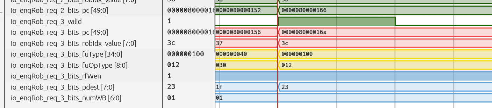
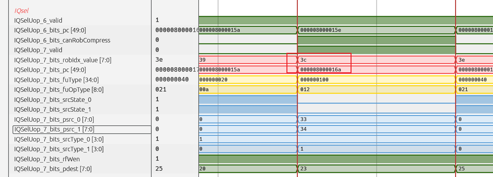
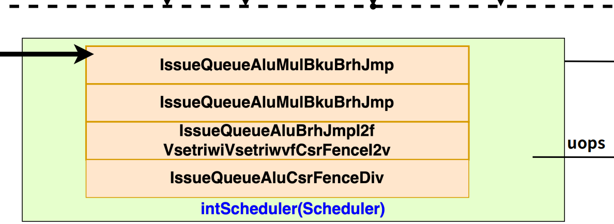
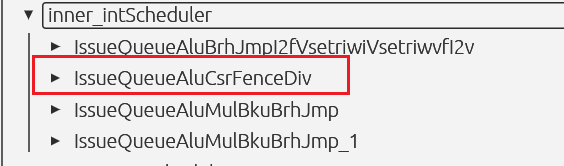
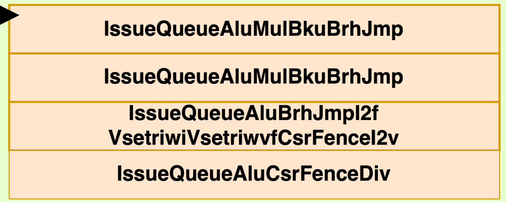
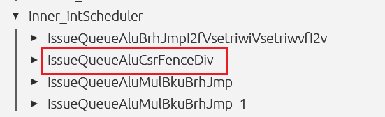
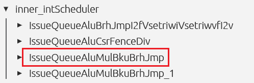
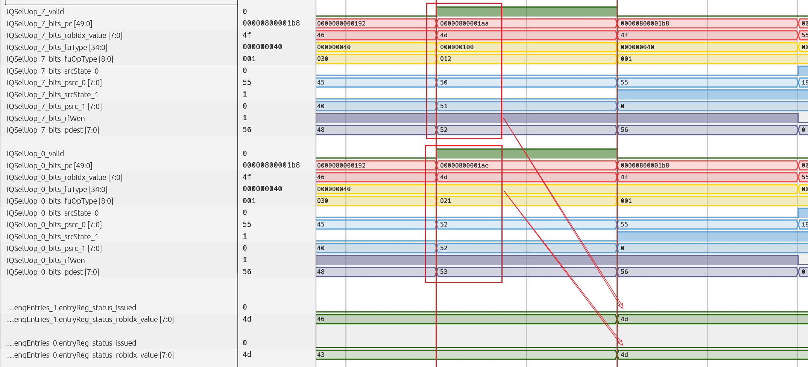
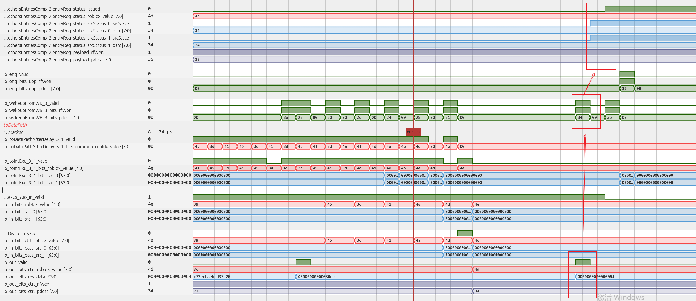
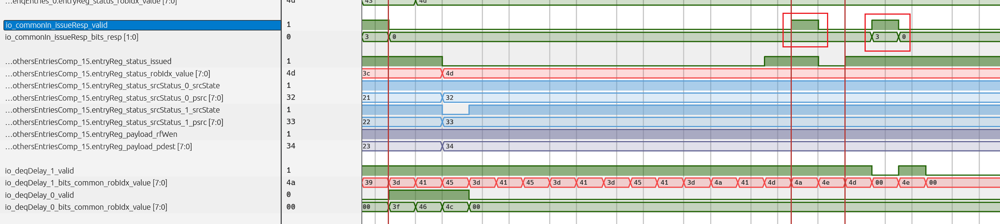

# 一条除法指令的执行过程：不固定延迟与回写唤醒

本章将重点分析一条除法指令从译码到提交的完整过程。在此基础上，再观察依赖除法结果的加法指令（背靠背执行），看看在无法确定除法什么时候计算完成的情况下，如何等待真实完成事件，并保证后继指令正确执行。

强烈建议先学习以下内容再学习本节

* [一条乘法的执行过程](../scalar-mul/mul-execution-process.md)

## 阅读与复现说明


为核对机制，本文同时参考了本地 `stable-kmh-v2` 源码，提交号为 `abd0f867a`。该源码用于解释实现，不能据此断言它就是生成全部历史截图的二进制版本。源码根目录为 `/nfs/home/wanghao/emuByYuan/stable-kmh-v2`，文末列出了对应文件。


## 一、指令的选择与观察目标

单条除法测试使用被除数 `12345678`、除数 `987`。原始反汇编如下：

```asm
8000015e: 00bc67b7   lui  a5,0xbc6
80000162: 14e78793   addi a5,a5,334
80000166: 3db00713   li   a4,987
8000016a: 02e7d733   divu a4,a5,a4
```

本文实际跟踪的是无符号除法 `divu`，不是有符号的 `div`。它读取旧的 `a5` 和旧的 `a4`，将无符号整数商写到新的 `a4`。本例商为 `12508`，也就是 `0x30dc`；余数为 `282`，本条指令不写回余数。

原测试还包含以下紧密依赖序列：

```asm
800001aa: 02e7d5b3   divu a1,a5,a4
800001ae: 00b587b3   add  a5,a1,a1
```

这一组输入是 `5000` 和 `50`，商为 `100`，后继加法结果为 `200`。后文将分别分析单条除法和这一组相关指令，不混用两次运行位置的编号。

## 二、一条单独除法指令的执行过程

### （1）译码：明确运算类型与源寄存器

首先，照例根据 PC 查找目标指令：


需要观察的是 `0x8000016a` 处的 `divu a4,a5,a4`。译码应当给出整数除法功能单元类型、无符号求商操作，以及两个整数寄存器源。按汇编寄存器编号来看，源是逻辑寄存器 15 和 14，目的为逻辑寄存器 14。

这里不能因为源和目的都出现 `a4`，就认为除数会被新结果覆盖。译码只描述逻辑寄存器关系，随后重命名会把“作为输入的旧值”与“作为输出的新值”分开。

这部分暂时不看波形图，机制和普通算术指令无异。

### （2）重命名：保存旧源，分配新目的

接着查看 RAT 与重命名输出。旧 `a5` 和旧 `a4` 分别映射为两个源物理寄存器；新的 `a4` 则获得目的物理寄存器。后面的相关指令再读取 `a4` 时，才能依赖本条除法的新结果。

如果前面同一重命名组内的指令恰好写了这两个源中的一个，最终 `psrc` 还需要考虑组内重命名旁路。这个旁路修正的是寄存器映射关系，不是把除法结果提前计算出来。重命名也不要求源数据已经就绪；它先建立依赖，未就绪的源随后交给 IQ 等待。

这部分暂时不看波形图，机制和普通算术指令无异。

### （3）分发：进入能够执行除法的 IQ



在 Dispatch 向 ROB 发送请求的位置，可以找到这条除法，其 `robIdx` 为 `0x3c`。后续跟踪需要同时关注有效信号和 ROB 标识，避免把数据总线上的残留值误当作新的请求。

接下来查看它被送往哪个 IQ。









在这组配置中，下标为 3 的 IQ 支持除法，对应 Dispatch 选择侧的第 6、7 号端口。波形在第 7 号端口找到了目标指令，而且两个源操作数均未准备好。这里看到的是指令被分发到 IQ，不代表除法器已经接收它。

### （4）IQ 等待：先等除法自己的输入准备好


需要特别区分：这里被唤醒的是“除法的输入”，不是“除法的输出”。除法前面的整数指令具有可预测的执行时序，所以完全可以通过 IQ 侧提前唤醒这条除法。除法自身是不固定延迟，并不妨碍它成为其他固定延迟指令的消费者。

源就绪还不是全部发射条件。IQ 仍需要检查端口、执行资源和相关阻塞条件；看到表项被选中，也不应立即推断它已经进入除法器内部。

### （5）读寄存器与 Bypass：以执行入口的操作数为准

这条指令先进入请求表项。由于不能立即发射，它随后转移到 `EntriesComp` 中下标为 15 的表项。接着，来自 IQ 的唤醒使它的两个源变为就绪，目标指令获得后续发射机会。


顺着调度器输出，可以看到目标指令进入读寄存器和后续数据通路。在原始截图中，读寄存器侧的数据还不是最终需要的值，而到 EXU 入口时，已经取得正确的前推数据。


这说明唤醒与取数是两条配合工作的通路。唤醒先让指令参与发射，Bypass 再根据数据来源选择，把上游刚产生的结果送到执行输入。不能只盯住寄存器堆读口，就把尚未被最终选择的数据判定为运算错误。

本条指令真正使用的被除数应为 `0xbc614e`，除数应为 `0x3db`。复现时，需要核对功能单元有效接收时的两个操作数，而不是在任意一个周期读取总线值。

### （6）进入除法器：以握手开始一次运算


接下来才是本章的重点。核对的源码中，`DivCfg` 设置 `piped = false`、`latency = UncertainLatency()`，`DivUnit` 内部连接 `SRT16DividerDataModule`（如果你听不懂这里再说些什么，请先去看看乘法）。这条指令并没有一个可像乘法那样直接用于固定延迟预测的执行拍数。

对除法器本体而言，只有输入有效且输入就绪同时成立，即 `valid && ready`，才接受一个新请求。源码中以 `in_fire` 标识这一事件。进入运算状态以后，本体的 `in_ready` 不再保持为高，不能每拍再开始一个独立除法。

需要注意接口层级：本地 `DivCfg` 同时配置了输入缓冲。外层能够暂存待执行请求，并不等于内部除法器已经开始计算，也不等于除法器可以流水化接收新运算。因此，“IQ 已发出”“外层缓冲已接收”“除法器本体已接收”是三个应分别观察的事件。

### （7）不固定延迟来自哪里

继续沿 `SRT16Divider.scala` 的状态机向下看，可以把正常执行过程分成以下几步：

1. 在 `s_idle` 等待并接收请求，保存本次运算需要的信息。
2. 经过 `s_pre_0`、`s_pre_1`，完成前导零检测、操作数规格化和特殊情况判断。
3. 普通情况进入 `s_iter`，逐步计算商和余数，直到迭代终止条件满足。
4. 经过后处理和结果修正，进入 `s_finish`，输出有效结果。
5. 等到输出被下游接收后，再返回空闲状态；若发生针对该指令的冲刷，则按取消路径处理。

其中，迭代次数的初始化与操作数前导零信息有关，特殊情况还可能跳过普通迭代路径。因此，不同输入不必经历相同数量的周期。这与“因为队列里等得久，所以看起来执行延迟不固定”不是同一件事；这里是功能单元本身就存在数据相关的执行路径。

另外，结果算出来之后，如果下游暂时不能接收，除法器会在结果有效状态等待。于是，“内部算完”“输出有效”“输出握手成功”也可能不是同一个观察时刻。分析时既要看算法执行状态，也要看输出接口的 `valid` 和 `ready`。

本例最终商为 `0x30dc`，与 `12345678 / 987` 的整数商一致。不能仅凭这一组输入的波形，就把除法延迟概括为一个对所有输入都成立的常数。

### （8）回写：结果和完成信息分别到达目的地


接着观察回写接口。除法结果写入目的物理寄存器，对应的 ROB 完成信息也被更新。在没有异常、冲刷且其他必要完成条件满足时，这条指令具备后续提交的条件。

回写还有一个重要作用：通知依赖这个结果的指令，真正的生产者已经完成。后面分析 `divu + add` 时，会看到这条回写唤醒通路正是消费者等待的事件。

### （9）提交：执行完成仍需等待程序顺序


当更老的指令完成提交，目标除法进入允许提交的位置，并且没有阻止提交的异常或冲刷时，它才能成功提交。因此，除法执行结束并不意味着当拍必然提交。

反过来，依赖除法的后继指令也不必等它提交后才开始执行。数据依赖由就绪和取数机制解决，程序顺序与精确状态由 ROB 提交机制维护，两者不能混为一谈。

## 三、不固定延迟如何唤醒后继加法

### （1）分别跟踪生产者和消费者

现在切换到 `0x800001aa` 的 `divu` 和 `0x800001ae` 的 `add`。加法的两个源都来自除法的目的寄存器，同样，还是分析一下这种背靠背的运行机制。


直接在分发阶段去找他们俩：


看看各自都被发配到哪个IQ了：








这一次，除法通过第 7 号选择端口进入 3 号 IQ，加法通过第 0 号选择端口进入 0 号 IQ。

确定了IQ之后，就到各自的IQ中去看看两条指令在里面的行为：




除法随后进入其 IQ 的第 15 号正式表项，加法进入另一个 IQ 的第 2 号正式表项。

因此，需要在两个队列之间对照物理寄存器依赖。看看除法是怎么唤醒加法的。

从上图可以清楚观察到，除法在发射出去的时候，是完全没有对那个wakeUPQ发去数据的。说明给他并不是用的乘法的那一套确定延迟的唤醒方式。所以再继续探索一下除法是如何唤醒加法的，先去看看除法的运算过程。

### （2）发射除法时，不能先假定若干拍后结果就绪（AI写的，当总结看看）

乘法可以在发射侧按已知延迟安排唤醒，但本例除法没有采用这条固定延迟预测路径。在波形中，也没有看到这条除法像乘法一样，为自己的结果向 `wakeUpQueues` 发出相应的定时唤醒请求。

如果不顾这一差异，仍然用一个任意固定拍数去唤醒加法，那么当除法尚未完成时，加法就可能被错误地标记为可执行。多加几拍同样不能解释实际机制：既可能浪费周期，也不能代替真实的完成判断。

### （3）实际回写到来后，再更新消费者的源状态



在原始波形中，除法结果完成并进入相应回写路径后，通过 `WakeUpFromWB` 通道通知等待者。加法将唤醒携带的目的物理寄存器与两个源物理寄存器比较，匹配后更新就绪状态。也就是说，对于除法这种不确定延迟的计算，只能等他完全计算好了之后，也才能真正发起唤醒信号。

随后，这条加法参与正常发射选择。这里说的是“获得发射资格”，不是保证无论端口是否占用都在下一拍发射。等到它真正向执行单元前进时，再由寄存器堆或当时有效的数据前推路径提供操作数。回写唤醒的名字描述的是控制来源，并不意味着可以忽略执行入口的数据选择。

## 四、为什么会看到发射后取消、随后重发


前面的波形还记录了一个值得注意的现象：IQ 中的除法一度被标记为已发射，随后该状态撤销，之后再次发射。


在实际的代码中，会发现确实会有一些取消的信号伴随其中


在波形中能够找到，原来发射后，还需要接受来自于后面的响应信号，来表示他的那次发射有没有成功




很显然，第一次得到的响应数据为0，第二次得到的是3，显然说明第一次发射没有成功，被打回来重发了。

IQ 到执行单元之间还有后续流水级和资源检查。指令被选中后，如果收到有效的阻塞或失败反馈，队列需要恢复可重试状态，等条件满足后再次尝试重发。对非流水化除法而言，执行资源忙是应检查的原因之一。也就是说，如果发生了阻塞，但是实际上不会一直阻塞，而是会取消发送，再次尝试重发其他的看可以不可以发，万一其他的某条指令发出去后就不会被阻塞呢，这样性能不就是提起来了。


## 五、把不固定延迟执行过程串起来

| 观察位置 | 本条除法在做什么 | 对后继加法的意义 |
| --- | --- | --- |
| 译码、重命名 | 明确无符号求商，建立新旧物理寄存器关系 | 保存真正的结果依赖 |
| IQ 等待与发射 | 等自身源就绪，并竞争执行资源 | 除法可以被上游 IQ 唤醒，但尚未产生自己的结果 |
| 功能单元输入握手 | 除法器本体正式接收请求 | 不按一个固定拍数预告消费者就绪 |
| 预处理、迭代、后处理 | 根据输入和状态推进运算 | 消费者继续等待有效完成事件 |
| 实际回写 | 写回结果并发送 WB 唤醒 | 匹配的源变为就绪，随后参与发射 |
| ROB 提交 | 满足完成条件后按顺序提交 | 消费者不必等生产者提交才执行 |

到这里，除法的执行过程就完整串起来了。不固定延迟不意味着“硬件不知道自己在做什么”，而是不能像固定延迟乘法一样，仅凭发射时刻和一个常数就安排消费者。除法器用状态机和握手报告实际完成，后端再通过回写唤醒，把这个完成事件传递给等待结果的指令。

## 六、源码与延伸阅读

本地核对位置（相对于前述源码根目录）：

* `src/main/scala/xiangshan/backend/fu/FuConfig.scala`：`DivCfg` 的非流水化、不固定延迟与输入缓冲配置。
* `src/main/scala/xiangshan/backend/fu/wrapper/DivUnit.scala`：无符号／有符号控制、功能单元握手和冲刷连接。
* `src/main/scala/xiangshan/backend/fu/SRT16Divider.scala`：预处理、迭代、后处理及结果等待状态。
* `src/main/scala/xiangshan/backend/issue/EntryBundles.scala`：发射响应编码和表项状态条件。

* [一条乘法指令的执行过程：固定延迟与提前唤醒](../scalar-mul/mul-execution-process.md)
* [乘法与除法的唤醒机制](../../scenarios-analysis/backend-mechanisms/wakeup-mechanism/wakeup-mechanism-of-mul-div.md)
* [Bypass 与 RegCache](../../scenarios-analysis/backend-mechanisms/bypass-and-regcache/bypass-and-regcache.md)
