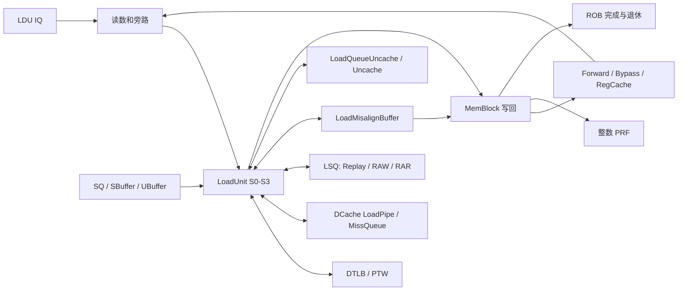
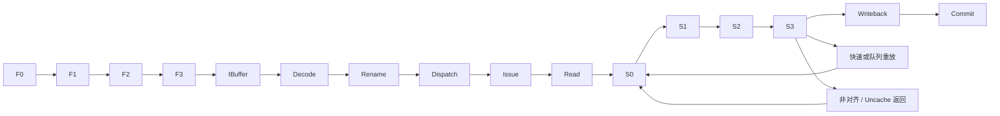

# 标量 Load 指令执行生命周期

## 📋 基本信息

| 字段 | 内容 |
|---|---|
| **指令名称** | `lb/lbu/lh/lhu/lw/lwu/ld rd, imm(rs1)`；以 `ld` 为主线 |
| **编码格式** | I 型：`imm[11:0]_rs1_funct3_rd_0000011` |
| **RISC-V 扩展** | RV64I；不包含浮点、向量、LR、AMO、HLV 或软件预取 |
| **是否有压缩格式** | C 扩展有受寄存器、立即数约束的 `c.lw/c.ld/c.lwsp/c.ldsp`，不是七种 Load 都有对应 C 编码；本文主线为 32 位指令 |
| **指令分类** | 数据读取；有效地址为 `rs1 + sext(imm12)` |
| **FuType** | `FuType.ldu` |
| **FuOpType** | `LSUOpType.lb/lh/lw/ld/lbu/lhu/lwu` |
| **目标 FU** | 后端 LDU 执行接口 → `MemBlock` 中的 `LoadUnit` → DTLB、DCache 与 LSQ |

**源码基线：**本地 `/nfs/home/wanghao/emuByYuan/stable-kmh-v2`。本文以该源码树的有效赋值和默认参数声明为依据，不将其他分支的阶段名称、教学波形或参数移植为本实现结论。以下时序是源码推导，不是仿真实测。

| 指令 | funct3 | 字节数 | 读数到 XLEN=64 的处理 |
|---|---|---|---|
| LB / LBU | `000` / `100` | 1 | 符号扩展 / 零扩展 |
| LH / LHU | `001` / `101` | 2 | 符号扩展 / 零扩展 |
| LW / LWU | `010` / `110` | 4 | 符号扩展 / 零扩展 |
| LD | `011` | 8 | 保留完整 64 位数据 |

译码见 [DecodeUnit][DECODE]；内部操作码见 [LSUOpType][OP]；扩展与数据选择见 [Load 数据助手][HELP]。`rd=x0` 只抑制目的寄存器写入，不能取消访存、异常或合法设备读取的副作用。

## 1. 前端路径

### 1.1 取指

| 阶段 | 延迟 | 关键行为 | 代码位置 |
|---|---|---|---|
| ICache/MainPipe | 可变 | 读取 Load 指令字，不是读取该 Load 的数据地址；ITLB、cache miss 和下游背压可能阻塞 | [IFU][IFU] |
| IFU F0 | 请求接受窗口 | 接收 FTQ 请求，记录是否跨 cache line | [IFU][IFU] 241–263 行 |
| IFU F1 | 连续推进时一阶段 | 保存请求，形成指令候选 PC 等信息 | [IFU][IFU] 291–335 行 |
| IFU F2 | 可等待 | 等取指响应，切分指令并预译码 | [IFU][IFU] 357–537 行 |
| IFU F3 | 可背压 | 校验有效范围，处理半指令，向 IBuffer 入队 | [IFU][IFU] 925–986 行 |

> **前端流水线总延迟（无冲刷）：** F0→F3 连续推进对应三个阶段间隔；不包括请求此前的等待和 IBuffer 排队，不能据此给出取指到 Load 提交的固定拍数。

### 1.2 预译码

| 项目 | 内容 |
|---|---|
| **brTable 匹配** | 普通整数 Load 不是控制流，得到 `BrType.notCFI` |
| **PreDecodeInfo 字段** | 对有效 32 位 Load：`valid=1,isRVC=0,brType=notCFI,isCall=0,isRet=0` |
| **是否有专用检测逻辑** | 无 Load 数据访问专用前端译码；此处不查 DTLB、不访问数据缓存 |
| **跳转偏移计算** | 通用前端组合逻辑可运行，但 Load 不使用跳转偏移改变 PC |

依据：[PreDecode][PD] 35–82 行。

### 1.3 PredChecker 校验

| 项目 | 内容 |
|---|---|
| **是否触发 remaskFault** | Load 自身不是 JAL/JALR/RET，不主动触发对应检查 |
| **是否触发 mispredict** | 正常不触发；Load 所在非 CFI 位置若被预测 taken，`notCFITaken` 可检出 |
| **是否产生 wbRedirect** | 前端通用错误预测恢复可以发生，不是 Load 生成分支目标 |
| **fixedRange 影响** | 同块更早控制流改变有效范围时，Load 可被屏蔽 |

依据：[PredChecker][CHECK] 361–445 行。前端误预测恢复与后端访存违例重定向是不同来源。

### 1.4 IBuffer 入队

| 项目 | 内容 |
|---|---|
| **入队宽度** | `PredictWidth=FetchWidth*(HasCExtension ? 2 : 1)`；默认 FetchWidth=8，C 开启时是 16 个半字候选位置，不是 16 条完整 32 位指令 |
| **是否可能被挡** | 容量、ready、有效范围与 flush；默认 IBufSize=48，输出 DecodeWidth=6 |
| **携带的关键信息** | 指令字、PC、FTQ 指针/偏移、预译码、取指异常与 trigger |
| **代码位置** | [IBuffer][IB]、[IFU][IFU] 953–986 行、[Parameters][PARAM] |

## 2. 后端路径

### 2.1 译码

| 项目 | 内容 |
|---|---|
| **DecodeWidth** | 默认 6 |
| **简单/复杂译码** | 普通表译码；非对齐数据拆分不在这里展开成两个架构指令 |
| **译码延迟** | 组合匹配，不等于整个 DecodeStage 的排队时间为零 |
| **关键译码结果** | `SrcType.reg, SrcType.imm, SrcType.X, FuType.ldu, LSUOpType.ld, SelImm.IMM_I, xWen=T` |
| **代码位置** | [DecodeUnit][DECODE] 138–142 行及 RV64 的 LD/LWU 条目 |

源 0 是整数基址，源 1 是符号扩展的 I 型立即数，第三源不使用。`rfWen` 最终受 `ldest != 0` 门控；Load 仍保留 ROB 身份、访问类型与异常处理路径。[DecodeUnit][DECODE] 1145 行

### 2.2 重命名

| 项目 | 内容 |
|---|---|
| **RenameWidth** | 默认 6 |
| **延迟** | 受物理寄存器和下游 ready 影响，不给无条件固定端到端拍数 |
| **源操作数** | 一个整数逻辑基址映射为物理源，立即数不分配物理源；同组依赖需旁路 |
| **目标操作数** | 非零 rd 分配整数物理目的并保留恢复/回收所需映射 |
| **特殊处理** | Load 的目的就绪依赖有效返回，而非地址计算完成；不能按 move elimination 消除 |
| **代码位置** | [Rename][RENAME]，尤其 634–684 行 |

### 2.3 派发

| 项目 | 内容 |
|---|---|
| **DispatchWidth** | 入口按 RenameWidth=6；Load 分配能力还受 `LSQLdEnqWidth` 和 LDU IQ 端口限制 |
| **延迟** | ROB、IQ、LSQ 资源共同制约，可变 |
| **目标 ROB** | 按程序顺序分配；后续数据就绪与按序提交分开记录 |
| **目标 Issue Queue** | 默认 LDU0–LDU2 对应的访存调度队列 |
| **LSQ 身份** | `LsqEnqCtrl` 分配/更新 `lqIdx` 和 `sqIdx`；后者也是限定更老 Store 的年龄边界 |
| **代码位置** | [NewDispatch][DIS] 446–550、784–820 行；[执行配置][PORT] |

LQ 不是单一的“所有数据等待返回的 FIFO”。[LoadQueue][LQ] 211–216 行实例化 VirtualLoadQueue、RAR、RAW、Replay、异常缓冲与 Uncache 子结构。VirtualLoadQueue 以循环指针距离计算占用，并用 `validCount <= VirtualLoadQueueSize-LSQLdEnqWidth` 预留入队容量；其项记录 `allocated/robIdx` 等状态，redirect 根据年龄产生取消计数。已完成前缀释放与 ROB 架构退休不能混为一个信号。[VirtualLoadQueue][VLQ]

### 2.4 发射

| 项目 | 内容 |
|---|---|
| **Issue Queue 类型** | LDU 所属访存 IQ；与 LoadUnit 内部入口仲裁是两层选择 |
| **唤醒条件** | 基址物理源就绪、依赖约束满足、发射/读数端口允许；Load cancel 可撤销依赖链上的推测唤醒 |
| **选择策略** | IQ 选择受年龄和资源约束；进入 LoadUnit 后还要竞争重放、拆分和预取入口 |
| **最小延迟** | 必须区分 IQ 选择、读数、`io.ldin.fire` 和 S0 接受，不把它们都叫 issue |
| **最大延迟** | 源未就绪、队列满、持续冲突或下游无响应时，没有环境无关有限上界 |
| **代码位置** | [IssueQueue][IQ]、[LoadUnit][LU] 307–350、833–847 行 |

**LoadUnit S0 的有效请求优先级：** misalign → D 通道转发重放 → fast replay → 普通 LSQ replay → 高置信度硬件预取 → vector → scalar `ldin` → MMIO 返回 → NC 返回 → load-to-load forwarding → 低置信度预取。`s0_src_ready_vec` 屏蔽所有存在更高优先级有效请求的入口；普通 replay 还受 `s0_rep_stall` 年龄条件约束，实际接受另受 kill、DCache ready 和流水推进条件限制。[LoadUnit][LU] 305–350 行

例如拆分请求与新 LD 同拍到达时，新 LD 不能仅因基址就绪而进入 S0；未握手的上游请求必须按各自接口保留或重试。固定优先级不能直接推导出无饥饿保证。

### 2.5 执行

| 项目 | 内容 |
|---|---|
| **执行单元** | `MemBlock` 实例化真实 `LoadUnit`，不是通用 ALU wrapper |
| **流水/阻塞** | `LduCfg.piped=false`，但 LoadUnit 内部有 S0–S3 流水；该配置标志不能解释为“所有 Load 必须串行” |
| **执行延迟** | `UncertainLatency(3)`，不是每条 Load 固定三周期完成 |
| **FSM 状态机** | 普通命中主线是流水；Uncache 与跨 16 B 非对齐路径分别有 FSM |
| **关键输出信号** | `io.ldout`、`io.lsq.ldin`、`io.fast_rep_out`、`io.rollback`、`io.ldCancel` |
| **代码位置** | [LduCfg][CFG] 415–433 行；[MemBlock][MEM] 418–434 行；[LoadUnit][LU] |

| LoadUnit 阶段 | 输入 → 操作 → 输出 | 阻塞/失败处理 |
|---|---|---|
| S0 | 选择请求，计算基址加立即数、大小/mask；启动 DTLB/DCache 请求 | 请求未获准则不接受；redirect kill |
| S1 | 取得翻译结果，发 SQ/SBuffer 转发查询，处理翻译异常和 trigger | TLB miss 不等于 page fault；携带重放信息 |
| S2 | 处理 DCache 响应与 PMP/PMA/PBMT 分类，合并字节转发，检查 RAW/RAR 资源和违例 | miss、bank conflict、转发失败、检查队列 nack 等产生重放原因 |
| S3 | 数据按地址移位并符号/零扩展，安全写回、LSQ 更新或转入专门缓冲 | fast replay、ReplayQueue、misalign/uncache、rollback 或异常完成 |

依据：[LoadUnit][LU] 691–825、899–1038、1157–1442、1530–1788 行。前端 ITLB 与这里的 DTLB 处理的是两个不同地址空间访问事件。

**FSM 状态机（Uncache 条目）：**

| 状态 | 持续条件 | 输出/动作 | 次态转换条件 |
|---|---|---|---|
| `s_idle` | 有效请求尚未获发送资格 | MMIO 等待 `pendingMMIOld` 且 `robIdx==pendingPtr`；NC 不使用这一 ROB 头门槛 | `canSendReq` → `s_req` |
| `s_req` | 请求尚未握手 | 发 `M_XRD`、地址和字节 mask | `io.uncache.req.fire` → `s_resp` |
| `s_resp` | 等总线返回 | 接收数据及 denied/corrupt 等错误 | 返回后正常 → `s_wait`；已取消 → 清理回 idle |
| `s_wait` | 返回尚未送入 LoadUnit | 经 `mmioOut` 或 `ncOut` 返回 | 输出 fire 或取消 → idle |

依据：[LoadQueueUncache][UNC] 68–205 行。已经发出的总线请求不能靠清 valid 撤销；`s_resp` 在响应回来后处理延迟 flush。MMIO 的发送资格与最终 Load 提交不是同一事件。

**FSM 状态机（LoadMisalignBuffer）：**

` s_idle → s_split → s_req → s_resp → s_comb_wakeup_rep → s_wb `。`s_resp` 若仍有子请求或需要重放则回 `s_req`；遇异常或 uncache 则提前转 `s_wb`。标量正常合并后还发送 wakeup 请求，再等待写回。缓冲只保留一条待处理请求，满时拒绝新请求；多个入口同时到达按端口优先选择。[LoadMisalignBuffer][MAB] 145–280 行

### 2.6 写回

| 项目 | 内容 |
|---|---|
| **写回端口** | 默认 LDU0–LDU2 对应 IntWB 5–7；配置同时支持 FP 端口，但本文整数指令不写 FP |
| **是否写回** | 有效结果写非零 rd；异常完成必须保留异常元数据，不能当成正常架构结果 |
| **写回延迟** | 命中主线在 S3 形成 `io.ldout`；后端转接、旁路、RegCache、PRF 和 ROB 完成须分别计时 |
| **共享冲突** | Misalign 写回口优先普通 LoadUnit 返回，缓冲等待；另有 Atomic 共享口，不应将所有端口视为完全独占 |
| **代码位置** | [LoadUnit][LU] 1745–1788 行；[MemBlock][MEM] 510–542 行；[执行配置][PORT] |

**Store-to-Load forwarding 不是“优先读 Store Buffer”这么简单。** S1 查询 SQ 与 SBuffer；S2 逐字节组合 mask，匹配 SQ 字节优先，其后按 NC 分支选择 UBuffer 数据或 SBuffer 数据，未覆盖部分由缓存/返回路径补齐。`s2_full_fwd` 还要求请求 mask 被全部覆盖且 SQ 未报告 `dataInvalid`。地址未知、数据未就绪或虚实地址匹配失败不能用旧缓存值冒充成功。[LoadUnit][LU] 960–982、1386–1412 行；[StoreQueue][SQ] 700–814 行

### 2.7 提交

| 项目 | 内容 |
|---|---|
| **CommitWidth** | 默认 RobCommitWidth=8；不是 Load 专属吞吐 |
| **提交条件** | 完成信息可用，处在可退休的程序顺序前缀，没有更老阻塞或需要处理的异常 |
| **是否触发 flush** | Load 可以因排序/重执行条件请求恢复；`LduCfg.flushPipe=true` 表示能力，不是每次执行必然 flush |
| **是否触发 redirect** | `io.rollback` 区分重新取当前指令的 `flush` 和保留当前指令、取消后继的 `flushAfter` |
| **代码位置** | [ROB][ROB]、[LoadUnit][LU] 1599–1680 行 |

缓存访问和数据旁路可早于架构退休。ROB 的按序提交不意味着所有 Load 都按序访问 DCache，更不意味着年轻 Load 必须等待所有更老 Store 写入缓存。

## 3. 信号前递

### 3.1 前递路径图

**模块连接：**



**流水阶段与重放：**



依据：[MemBlock][MEM] 847 行起的接口连接和 [LoadUnit][LU]。图中的双向边表示请求与返回，不表示组合环路或固定同拍完成。

### 3.2 信号清单

| 信号名 | 方向 | 位宽 | 语义 | 持续方式 |
|---|---|---|---|---|
| `io.ldin.valid/ready` | 后端 ↔ LoadUnit | 各 1 | 初次整数流入口 | 仅 fire 接受 |
| `vaddr/fullva/paddr` | 地址路径 → TLB、缓存、LSQ | VAddrBits/XLEN/PAddrBits | 裁剪地址、完整地址与翻译后地址 | 随请求身份寄存 |
| `mask` | LoadUnit → 转发/缓存 | 本地 16 位字节 mask | 覆盖 16 B 数据窗口内有效字节，不等于访问 16 B 的架构语义 | 随阶段推进 |
| `uop.robIdx/lqIdx/sqIdx/pdest` | 后端 → LSU/写回 | 参数化 | 年龄、队列位置及物理目的身份 | 请求、重放和结果保持关联 |
| `io.lsq.forward` | LoadUnit ↔ SQ | 地址、mask、数据和状态 | 更老 Store 转发/数据未就绪判断 | 查询与返回分阶段 |
| `rep_info.cause` | LoadUnit → ReplayQueue | 原因向量 | TLB miss、转发失败、缓存冲突等 | S3 编码选择并记录 |
| `io.ldout` | LoadUnit → MemBlock | XLEN 数据及 uop | 结果与完成/异常元数据 | valid 与接受分开观察 |
| `io.ldCancel` | LSU → 后端 | 按接口定义 | 取消推测 Load 唤醒依赖 | 不能当作 ROB 提交取消的唯一信号 |
| `io.rollback` | LSU → 恢复控制 | redirect bundle | 排序或匹配失败恢复 | 关联 robIdx/FTQ |

[BypassNetwork][BP] 153–171 行通过 `readForward/readBypass/readRegCache` 选择来源；RegCache 写路径在 195–218 行对有效整数写使能和标签寄存，数据来自 `bypassDataVec`，不是统一等待 PRF 后再复制。是否参与写 RegCache 由 ExeUnit 的 `needWriteRegCache` 条件派生。`io.fast_uop.valid` 只是早期唤醒，不是最终值正确或架构提交的证明。[LoadUnit][LU] 1354、1469 行

## 4. 周期计算

### 4.1 流水线延迟分解

| 阶段 | 固定/可变 | 周期数 | 说明 |
|---|---|---|---|
| Decode→入口接受 | 可变 | `T_front_backend` | 包含重命名、资源分配、IQ 等待与读数；起点固定为 Decode 接受 |
| S0→S3 | 条件固定 | 连续推进时 3 个寄存边界 | DTLB 命中、正常缓存/转发结果，无重放/异常/冲刷、输出资源允许 |
| 重放/翻译/补数等待 | 可变 | `T_retry` | 只累加真实额外等待与重入，不重复计首轮 S0→S3 |
| S3→后端写回接受 | 配置相关 | `T_wb` | MemBlock 端口共享和后端写回路径 |
| 写回→提交 | 可变 | `T_commit` | ROB 等待更老指令与异常处理 |
| **合计** | 可变 | `T_front_backend+3+T_retry+T_wb+T_commit` | 仅普通 cacheable 主线；MMIO/拆分必须换成相应路径时长 |

寄存证据：[LoadUnit][LU] 902–915、1157–1189、1530–1571 行。S3 valid、数据寄存和 ready 的赋值方式不同，不应从示意图推断它在任意背压下都自动保持；实际输出约束应检查生成 RTL 和写回连接。

### 4.2 公式

$$T_{decode\to commit}=T_{front\_backend}+T_{LSU,path}+T_{wb}+T_{commit}$$

$$T_{LSU,hit}=3,\qquad T_{LSU,replay}=3+\sum_k(T_{wait,k}+T_{reenter,k})$$

这里的 3 从 S0 接受该请求的周期窗口数到 S3 形成结果的窗口，表示三个阶段间隔，不包含此前 issue/read 阶段，也不承诺第三个正沿已经完成 PRF 写入或 commit。MMIO 的 `T_LSU,path` 还包含等待 ROB 资格、Uncache 握手/响应、回到 LoadUnit；非对齐路径还包含缓冲排队、子请求和合并唤醒。

### 4.3 最佳/最差情况

| 场景 | 周期数 | 条件 |
|---|---|---|
| **最佳** | S0→S3 三阶段间隔，端到端另计 | 基址就绪、DTLB hit、L1 hit 或满足成功转发条件，无冲突 |
| **典型** | 不填未经统计的单一值 | 需按命中率、转发率、TLB miss、重放与依赖链分别统计 |
| **最差** | 无环境无关有限上界 | 外部响应停顿、重复重放、资源饥饿或更老指令阻塞 |
| cache miss | 首轮识别 miss，加等待/重入 | miss request 被接受或合并，不代表数据已返回 |
| MMIO / 跨界非对齐 | 可变且不适用单轮三阶段公式 | 分别受事务状态机和拆分状态机控制 |

### 4.4 时序图

以下为一条无冲突 LD 的阶段有效窗口示意，不是实测波形。C0 为 S0 接受窗口；C3 的 `io.ldout.valid` 还要求成功写回条件成立。

```text
周期窗口          C0   C1   C2   C3   C4
s0_fire            1    0    0    0    0
s1_valid           0    1    0    0    0
s2_valid           0    0    1    0    0
s3_valid           0    0    0    1    0
io.ldout.valid     0    0    0    1    0
```

```waveform-draw
{"signal":[{"name":"clk","wave":"p...."},{"name":"s0_fire","wave":"10..."},{"name":"s1_valid","wave":"010.."},{"name":"s2_valid","wave":"0.10."},{"name":"s3_valid","wave":"0..10"},{"name":"io.ldout.valid","wave":"0..10"}]}
```

实际测量按时钟正沿对齐，使用 PC/指令编码定位，再用 robIdx、lqIdx、pdest 跟踪同一条 Load 的各次重放；分别记录 `io.ldin.fire`、S0、旁路可用、RegCache 更新、PRF 写使能、ROB 完成和 commit。不能把 miss 的首次发射与重放后的局部三拍当作总延迟，也不能凭 PC 匹配循环中的不同实例。

## 5. 异常与特殊处理

### 5.1 异常检测

| 异常类型 | 检测位置 | 检测条件 | 处理方式 |
|---|---|---|---|
| Load page/guest-page fault | S1 翻译返回 | 页表权限或翻译检查失败，区别于 TLB miss | 携带对应异常与地址元数据，精确异常路径处理 |
| Load access fault | S1/S2/S3、Uncache 返回 | 翻译访问错误、PMP 拒绝、相关缓存/总线错误 | 按有效翻译及错误条件写入异常，不能忽略 denied/corrupt |
| Load address misaligned | S0、S2、MisalignBuffer | 地址不满足访问大小；是否硬件处理取决于路径和使能 | 可处理的 cacheable 请求修复，禁止概括为“全部 trap”或“全部支持” |
| breakpoint/debug | MemTrigger 与后续门控 | 地址 trigger 和调试条件 | 可抑制正常拆分/重放路径，不能仅按数据 miss 处理 |
| 取指异常 | IFU→Decode→ROB | Load 指令字访问失败 | 与数据地址异常分开归属 |

依据：[LoadUnit][LU] 813–814、1026–1038、1130–1150、1200–1248、1549–1561、1630 行起；[LoadQueueUncache][UNC] 190 行起。翻译已报错时不能把尚无可信物理地址的 PMP/PMA 输出当成更强结论；TLB miss 的重放也不是软件可见 page fault。多个异常位的最终优先级由通用异常路径决定，此表不作为优先级排序。

### 5.2 冲刷与重定向

| 触发条件 | 类型 | 影响范围 | 恢复方式 |
|---|---|---|---|
| 更老分支/异常恢复 | 外部 redirect | 年轻 Load、队列项与依赖链 | 各阶段 `robIdx.needFlush`，队列取消及 ROB 恢复 |
| 地址/数据暂不可用、TLB miss、cache 冲突 | 局部 replay | 当前 Load 的访存尝试 | 快速重放或 ReplayQueue，不必每次清空前端 |
| 虚实地址转发匹配失败 | `rep_frm_fetch` / rollback | 当前及相关后续工作 | 以原 PC 重取，`RedirectLevel.flush` |
| Load-Load 检查要求恢复 | `flushPipe` / rollback | 当前 Load 之后 | 按本地条件使用 `flushAfter`；受 CSR 使能约束 |
| 已发 Uncache 请求遭取消 | 延迟清理 | 已在途事务与对应队列项 | 等待响应并丢弃取消结果，不假定总线事务可撤销 |

依据：[LoadUnit][LU] 1599–1680 行、[VirtualLoadQueue][VLQ]、[LoadQueueUncache][UNC] 122–160 行。Store-Load 检查既有流水内 nuke，也有 [LoadQueueRAW][RAW] 的在途违例检测，不能仅依靠 SQ 转发覆盖所有乱序情况。

### 5.3 与其他指令的交互

| 交互场景 | 影响指令 | 行为 |
|---|---|---|
| 更老 Store 与 Load 重叠 | 当前 Load | SQ 按年龄、地址、字节 mask 查找；未就绪转发需等待/重放 |
| Store 已离开 SQ | 当前 Load | SBuffer 可提供尚未写入缓存的数据，不能只查 DCache |
| `load → add/load/store` | 年轻消费者 | 数据经旁路可先于提交使用；预测唤醒失败要取消依赖链 |
| fence 与访存排序 | 前后访存 | fence 协调排序，不把普通 Load 自动当作全局内存屏障 |
| `rd=x0` | 无有效整数目的 | 保留访存及异常，不能按目的未使用删除设备访问 |
| 预取/向量/拆分重入 | 新标量 Load | 共享入口与缓存资源，按有效请求仲裁 |

**跨边界代码解析**

标量最大访问 8 B。自然对齐的 1/2/4/8 B 请求不会跨越正常对齐的 4 KiB 页或 64 B 行边界；需要重点分析的是非对齐请求。LoadUnit 对不跨 16 B 的非对齐访问可使用扩大数据窗口和偏移选择；跨 16 B 请求在硬件非对齐使能及其他条件满足时进入 LoadMisalignBuffer。默认配置允许硬件非对齐，但运行时还检查 `hd_misalign_ld_enable`。[LoadUnit][LU] 729–732、1238–1241、1582–1586 行

| 边界 | 首片段 | 次片段 | 独立检查 | 合并/排序状态 | 失败与恢复 |
|---|---|---|---|---|---|
| 4 KiB 页：`ld` 地址页内偏移 `0xffc` | 本页末 4 B | 次页首 4 B | 拆分形成分别对齐的请求，重入 LoadUnit 后各自翻译并检查权限/PMP/PMA/PBMT，不能从首页物理地址加 4 推断次页映射 | `curPtr/unSentLoads/splitLoadResp` 记录子请求，按低/高片段移位拼接 | 次页 fault 不产生正常整数结果；异常地址覆盖使用出错子请求元数据 |
| 64 B 行：`ld` 行内偏移 `0x3c` | 当前行末 4 B | 下一行首 4 B | 两个地址分别查对应 cache line，各自可能 hit/miss、MSHR 合并/分配或 nack | 子请求按状态机推进，第二片段不因第一片段命中而视为有效 | miss 或冲突重试；只有需要的片段完成才合并，不承诺跨行原子性 |
| 内存类型边界：任一拆分片段落入 uncache | 首个可缓存或非缓存片段 | 下一片段重新分类 | 不把不同 PMA/PBMT 区域拼成一个 cacheable 请求 | `isUncache` 终止剩余拆分，设置 `loadAddrMisaligned`，关闭正常 rfWen | 不以两次设备读取模拟普通可缓存拆分；已到达的缓存侧活动不等于可撤销 |

拆分地址与长度：[LoadMisalignBuffer][MAB] 280–510 行；返回、合并和异常优先分支：515–564 行；异常地址覆盖：615–630 行。相同响应同时被分类为 uncache 和其他错误时，缓冲返回处理首先走 `isUncache` 分支；这是局部源码优先级，不推广为整个处理器的 trap 优先级。

DCache 将物理地址用于 tag/行定位与请求处理；[LoadPipe][DC] 387–478 行区分 miss、nack、`mshr_id`、`handled/merged`。MSHR 可接收新请求或合并兼容请求；无法接收时上游重放，而不是默认把整个跨行 Load 放进同一个 MSHR。[MissQueue][MQ] 1080–1155 行。TL D 通道和 MSHR 数据可以转发到重入 Load，仍须与请求身份及片段有效性匹配。[LoadUnit][LU] 1241–1248、1730–1748 行

Load 指令字也可能跨取指页/行：32 位指令位于行末 2 B 时，前端使用另一半字及独立异常信息；`f3_lastHalf.valid` 在 flush 时清零，防止旧路径残片进入新指令流。这与数据 Load 的拆分缓冲无关。[IFU][IFU] 528–537、925–960 行

## 6. 安全性分析

### 6.1 推测执行窗口

| 窗口 | 起始点 | 终止点 | 周期数 | 风险等级 |
|---|---|---|---|---|
| cacheable 推测读取 | 请求接受 | 正确路径退休或错误路径取消 | 可变 | 潜在观察面，未进行漏洞判定 |
| Load 预测唤醒 | 早期唤醒 | 有效结果确认或 ldCancel/恢复 | 配置与重放相关 | 需验证错误数据不会形成错误提交 |
| MMIO 事务 | 满足 ROB 资格后发送 | 响应并完成或取消清理 | 可变 | 有外部副作用，重点检查资格和重复发送 |

### 6.2 侧信道暴露面

| 暴露面 | 类型 | 缓解措施 |
|---|---|---|
| DCache/TLB 命中、替换与 miss | 潜在时间差 | 权限检查不等于清除所有推测痕迹；需结合隔离策略和定向测量 |
| SQ 转发及地址依赖预测 | 等待/重放时间差 | 验证年龄、字节和上下文隔离，不能只看最终数据相等 |
| bank、MSHR、ReplayQueue 竞争 | 共享资源时间差 | 覆盖争用与持续高优先级流量，报告有用吞吐和重放次数 |
| MMIO/NC 分类 | 副作用与推测边界 | 分别检查 PMA/PBMT、ROB 头门控和在途取消，不能混为同一路径 |

以上是源码可见机制导出的验证方向，不是已有侧信道利用或安全证明。

### 6.3 有序性保证

| 保证 | 机制 | 代码依据 |
|---|---|---|
| 读取合适的更老 Store 数据 | SQ 年龄范围、地址匹配与逐字节优先转发 | [StoreQueue][SQ]、[LoadUnit][LU] 1386–1412 行 |
| 识别错误的访存执行顺序 | RAW/RAR 队列与流水 nuke 查询，必要时重放/恢复 | [LoadQueueRAW][RAW]、[LoadQueueRAR][RAR] |
| 推测完成不越序成为架构结果 | ROB 顺序退休、异常与 redirect 恢复 | [ROB][ROB] |
| MMIO 不按普通命中路径推测发送 | `pendingMMIOld/pendingPtr` 门槛 | [LoadQueueUncache][UNC] 122–127 行 |
| 拆分请求不重复形成多个架构结果 | 子请求状态、合并和单条原始 uop 写回 | [LoadMisalignBuffer][MAB] |

**验证特别注意**

| Verification ID | 风险/不变量 | 定向激励 | 预期观察 | 检查与覆盖 |
|---|---|---|---|---|
| LD_WIDTH_SIGN | 读数扩展错误 | 各大小、符号最高位为 1、所有合法偏移 | LB/LH/LW 符号扩展，U 类型零扩展 | 数据 scoreboard，覆盖七种指令 |
| LD_X0_FAULT | x0 导致访问或异常丢失 | `ld x0` 访问无权限页和设备区域 | rfWen 关闭，异常/事务仍按规则处理 | 架构异常与总线事务 scoreboard |
| LD_FWD_BYTES | 转发年龄或字节错误 | 多个更老 Store 局部覆盖；最近匹配项数据迟到 | SQ 优先和逐字节合并正确；无效数据不冒充成功 | 年龄/环绕指针及转发 scoreboard |
| LD_RESOURCE_FULL | 资源超分配/重复完成 | 填满 VLQ、ReplayQueue、MSHR，叠加 bank 冲突 | 拒绝或重放，资源释放后恢复 | Occupancy、握手和前进性 checker |
| LD_REPLAY_CANCEL | 错误唤醒传播 | cache miss、地址匹配失败叠加依赖链 | cancel/replay 与同一 Load 身份对应，只提交一次 | Flush/replay checker |
| LD_PAGE_SPLIT | 第二页检查被遗漏 | 页末跨界 LD，次页无权限或非连续映射 | 独立翻译；故障不正常写 rd，地址归属正确 | 异常地址 scoreboard |
| LD_LINE_SPLIT | 错片段/错误原子性假设 | 一片 hit、一片 miss，返回叠加 redirect | 有效片段正确合并，被取消者不提交 | 片段 scoreboard、MSHR 覆盖 |
| LD_UNCACHE_BOUNDARY | 非对齐设备副作用 | 拆分后片段落入 MMIO/NC | 进入局部非对齐异常路径，不正常合并设备读取 | PMA/PBMT 与 FSM checker |
| LD_MMIO_FLUSH | 重复发送或提前发送 | 未到 ROB 头、总线背压、响应与取消同拍 | MMIO 门槛有效；已发请求等待响应清理 | 总线握手/重复事务 checker |
| LD_WB_CONTENTION | 返回丢失 | 普通 Load 与 misalign 同口完成并施加合法背压 | 优先级符合 MemBlock 连接，完成身份不丢 | 写回 scoreboard、输出约束检查 |
| LD_CONTEXT_CHANGE | 旧翻译/片段污染 | 翻译等待或半指令残留时切换/恢复 | 被取消工作不提交，后续请求使用有效上下文 | 上下文隔离、前端残片 checker |

这些是待执行的验证场景，不代表已经获得波形覆盖或仿真通过结果。

## 7. 性能特征

| 指标 | 值 | 说明 |
|---|---|---|
| **执行吞吐** | 默认三个标量 LoadUnit，资源层上限 3 条独立普通 Load/拍 | 需命中、无入口/缓存/写回冲突；不是 3 条依赖 Load/拍 |
| **执行延迟** | 命中主线 S0→S3 三阶段间隔 | 不等于 issue→PRF 或 decode→commit |
| **关键瓶颈** | 地址依赖、TLB/PTW、bank、MSHR、转发失败、重放队列 | 每类分别统计，不能只写“Store Buffer 命中率” |
| **非对齐代价** | 跨 16 B 的缓冲、子请求及合并唤醒开销 | 共享单请求缓冲和写回口，可能阻塞其他请求 |
| **MMIO/NC** | 事务和排序条件决定 | MMIO 等 ROB 资格；NC 不等同 MMIO |
| **关键路径影响** | 地址生成、转发选择、缓存返回与读数扩展 | 未做综合/STA，不给频率或关键路径裕量结论 |

## 8. 配置依赖

| 参数 | 默认值 | 影响 | 配置位置 |
|---|---|---|---|
| XLEN | 64 | 整数寄存器和扩展宽度 | [Parameters][PARAM] |
| FetchWidth / DecodeWidth / RenameWidth | 8 / 6 / 6 | 前端候选与后端入口，不代表 Load 吞吐 | [Parameters][PARAM] |
| RobCommitWidth / RobSize | 8 / 160 | 退休和在途资源 | [Parameters][PARAM] |
| LoadPipelineWidth | 3 | 与后端 LDU 数量一致的约束 | [Parameters][PARAM] 214、842 行 |
| VirtualLoadQueueSize / LoadQueueReplaySize | 72 / 72 | 控制项与重放容量，是不同结构 | [Parameters][PARAM] 167–172 行 |
| LoadQueueRARSize / LoadQueueRAWSize | 72 / 32 | 内存排序检测资源 | [Parameters][PARAM] 168–169 行 |
| LoadUncacheBufferSize | 16 | LSQ uncache 条目容量，不等同全系统未决 MMIO 吞吐 | [Parameters][PARAM] 172 行 |
| EnableHardwareLoadMisalign | true | 硬件非对齐配置；运行时另有 CSR 门控 | [Parameters][PARAM] 245 行；[LoadUnit][LU] 1238 行 |
| EnableLoadToLoadForward | false | 专门 load-to-load 路径，不能与通用整数旁路混淆 | [Parameters][PARAM] 237 行 |
| EnableAccurateLoadError | false | S3 精确延迟错误路径的编译条件 | [Parameters][PARAM] 242 行；[LoadUnit][LU] 1549 行 |
| LduCfg.latency / piped | UncertainLatency(3) / false | 后端配置描述；真实访存由 MemBlock 流水完成 | [LduCfg][CFG] |

## 附录：关键代码索引

| 模块 | 文件路径 | 关键行号 |
|---|---|---|
| 前端取指/范围 | [IFU][IFU]、[PreDecode][PD]、[PredChecker][CHECK]、[IBuffer][IB] | 241、528、925；35、361；227 |
| 译码/操作类型 | [DecodeUnit][DECODE]、[LSUOpType][OP] | 138；538 |
| 重命名/派发/发射 | [Rename][RENAME]、[NewDispatch][DIS]、[IssueQueue][IQ] | 634；446、514；420 |
| LDU 配置与连接 | [LduCfg][CFG]、[MemBlock][MEM]、[执行配置][PORT] | 415；418、510、847；474 |
| 主访存流水 | [LoadUnit][LU] | 307、691、899、1157、1386、1530、1784 |
| LQ 各子结构 | [LoadQueue][LQ]、[VirtualLoadQueue][VLQ]、[ReplayQueue][REPLAY]、[RAW][RAW]、[RAR][RAR] | 211；85；各模块主体 |
| 转发/扩展/旁路 | [StoreQueue][SQ]、[Load 数据助手][HELP]、[BypassNetwork][BP] | 700；52；153、195 |
| 拆分/Uncache | [LoadMisalignBuffer][MAB]、[LoadQueueUncache][UNC] | 145、172、515；68、122 |
| 缓存 miss | [LoadPipe][DC]、[MissQueue][MQ] | 387–478；1080–1155 |
| 架构退休 | [ROB][ROB] | 完成、异常与提交逻辑 |

**教学资料与实现的对应边界：**课程 `14_LoadStore.md` 的源码基线不同，本文仅使用其访存术语，不继承其周期结论；独立 Design Doc 不作为本地实现证据。

| 理论/教学概念 | 本地源码映射 | 核对状态 | 阅读边界 |
|---|---|---|---|
| IQ 唤醒不等于执行完成 | IssueQueue、LoadUnit `fast_uop/ldCancel` | 本地实现已核对 | 不把早期唤醒作为值正确证明 |
| Store-to-Load forwarding | SQ、SBuffer、LoadUnit 字节 mux | 本地实现已核对 | 不简化为只查 Store Buffer |
| Load/Store 教学流水 | MemBlock、LoadUnit S0–S3 | 资料版本不同 | 阶段、参数和周期以本文本地源码为准 |
| ROB 顺序退休 | Rob | 本地实现定位 | 不扩展成全局访存严格按序执行 |

[IFU]: /nfs/home/wanghao/emuByYuan/stable-kmh-v2/src/main/scala/xiangshan/frontend/IFU.scala#L241
[PD]: /nfs/home/wanghao/emuByYuan/stable-kmh-v2/src/main/scala/xiangshan/frontend/PreDecode.scala#L35
[CHECK]: /nfs/home/wanghao/emuByYuan/stable-kmh-v2/src/main/scala/xiangshan/frontend/PreDecode.scala#L361
[IB]: /nfs/home/wanghao/emuByYuan/stable-kmh-v2/src/main/scala/xiangshan/frontend/IBuffer.scala#L227
[DECODE]: /nfs/home/wanghao/emuByYuan/stable-kmh-v2/src/main/scala/xiangshan/backend/decode/DecodeUnit.scala#L138
[OP]: /nfs/home/wanghao/emuByYuan/stable-kmh-v2/src/main/scala/xiangshan/package.scala#L538
[PARAM]: /nfs/home/wanghao/emuByYuan/stable-kmh-v2/src/main/scala/xiangshan/Parameters.scala#L59
[PORT]: /nfs/home/wanghao/emuByYuan/stable-kmh-v2/src/main/scala/xiangshan/Parameters.scala#L474
[RENAME]: /nfs/home/wanghao/emuByYuan/stable-kmh-v2/src/main/scala/xiangshan/backend/rename/Rename.scala#L634
[DIS]: /nfs/home/wanghao/emuByYuan/stable-kmh-v2/src/main/scala/xiangshan/backend/dispatch/NewDispatch.scala#L446
[IQ]: /nfs/home/wanghao/emuByYuan/stable-kmh-v2/src/main/scala/xiangshan/backend/issue/IssueQueue.scala#L420
[CFG]: /nfs/home/wanghao/emuByYuan/stable-kmh-v2/src/main/scala/xiangshan/backend/fu/FuConfig.scala#L415
[MEM]: /nfs/home/wanghao/emuByYuan/stable-kmh-v2/src/main/scala/xiangshan/mem/MemBlock.scala#L418
[LU]: /nfs/home/wanghao/emuByYuan/stable-kmh-v2/src/main/scala/xiangshan/mem/pipeline/LoadUnit.scala#L307
[LQ]: /nfs/home/wanghao/emuByYuan/stable-kmh-v2/src/main/scala/xiangshan/mem/lsqueue/LoadQueue.scala#L211
[HELP]: /nfs/home/wanghao/emuByYuan/stable-kmh-v2/src/main/scala/xiangshan/mem/lsqueue/LoadQueue.scala#L52
[VLQ]: /nfs/home/wanghao/emuByYuan/stable-kmh-v2/src/main/scala/xiangshan/mem/lsqueue/VirtualLoadQueue.scala#L85
[REPLAY]: /nfs/home/wanghao/emuByYuan/stable-kmh-v2/src/main/scala/xiangshan/mem/lsqueue/LoadQueueReplay.scala#L100
[RAW]: /nfs/home/wanghao/emuByYuan/stable-kmh-v2/src/main/scala/xiangshan/mem/lsqueue/LoadQueueRAW.scala#L100
[RAR]: /nfs/home/wanghao/emuByYuan/stable-kmh-v2/src/main/scala/xiangshan/mem/lsqueue/LoadQueueRAR.scala#L100
[SQ]: /nfs/home/wanghao/emuByYuan/stable-kmh-v2/src/main/scala/xiangshan/mem/lsqueue/StoreQueue.scala#L700
[MAB]: /nfs/home/wanghao/emuByYuan/stable-kmh-v2/src/main/scala/xiangshan/mem/lsqueue/LoadMisalignBuffer.scala#L145
[UNC]: /nfs/home/wanghao/emuByYuan/stable-kmh-v2/src/main/scala/xiangshan/mem/lsqueue/LoadQueueUncache.scala#L68
[DC]: /nfs/home/wanghao/emuByYuan/stable-kmh-v2/src/main/scala/xiangshan/cache/dcache/loadpipe/LoadPipe.scala#L387
[MQ]: /nfs/home/wanghao/emuByYuan/stable-kmh-v2/src/main/scala/xiangshan/cache/dcache/mainpipe/MissQueue.scala#L1080
[BP]: /nfs/home/wanghao/emuByYuan/stable-kmh-v2/src/main/scala/xiangshan/backend/datapath/BypassNetwork.scala#L153
[ROB]: /nfs/home/wanghao/emuByYuan/stable-kmh-v2/src/main/scala/xiangshan/backend/rob/Rob.scala#L610
