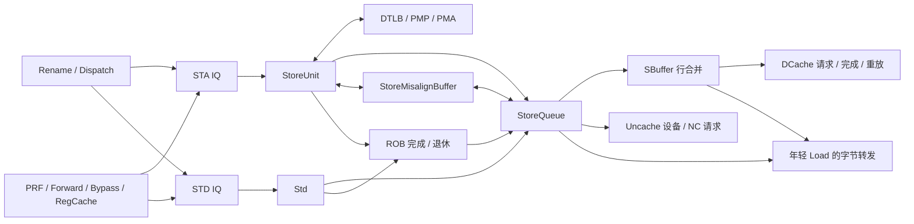
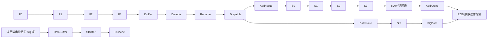

# 标量 Store 指令执行生命周期

## 📋 基本信息

| 字段 | 内容 |
|---|---|
| **指令名称** | `sb/sh/sw/sd rs2, imm(rs1)`；以 `sd` 为主线 |
| **编码格式** | S 型：`imm[11:5]_rs2_rs1_funct3_imm[4:0]_0100011` |
| **RISC-V 扩展** | RV64I；不包含浮点、向量、SC、AMO 和 CBO |
| **是否有压缩格式** | C 扩展有受约束的 `c.sw/c.sd/c.swsp/c.sdsp`；不是每种 Store 都有对应 C 编码 |
| **指令分类** | 整数数据写入；地址为 `rs1+sext(imm12)`，数据取 rs2 低 8/16/32/64 位 |
| **FuType** | 译码为 `FuType.stu`；本地 `StaCfg` 与 `StdCfg` 都使用该 FuType，不能杜撰 `FuType.std` |
| **FuOpType** | `LSUOpType.sb/sh/sw/sd` |
| **目标 FU** | STA：MemBlock/StoreUnit；STD：MemBlock 中定义的 `Std`，由后端执行路径实例化；二者汇合到 StoreQueue |

**实现依据：**本地 `/nfs/home/wanghao/emuByYuan/stable-kmh-v2` 的源码及默认参数声明。本文分别讨论源操作数准备、SQ 状态更新、ROB 退休、SQ 排出和缓存处理，不将其合并成一个“Store 完成”事件。时序为源码推导，没有使用其他配置的波形作为本实现实测。

| 指令 | funct3 | 写入大小 | 源数据 |
|---|---|---|---|
| SB | `000` | 1 B | rs2[7:0] |
| SH | `001` | 2 B | rs2[15:0] |
| SW | `010` | 4 B | rs2[31:0] |
| SD | `011` | 8 B | rs2[63:0] |

编码类别与控制见 [DecodeUnit][DEC]；大小对应的字节 mask 和数据复制由访存路径生成。[StoreUnit][STA]、[StoreQueue][SQ] 592–635 行。`rs2=x0` 表示写零，不表示取消 Store。

## 1. 前端路径

### 1.1 取指

| 阶段 | 延迟 | 关键行为 | 代码位置 |
|---|---|---|---|
| ICache/MainPipe | 可变 | 读取 Store 指令字；与后续数据写地址无关 | [IFU][IFU] |
| IFU F0 | 请求接受窗口 | 接收 FTQ 请求，记录跨行信息 | [IFU][IFU] 241–263 行 |
| IFU F1 | 连续推进时一阶段 | 保存请求、形成候选 PC | [IFU][IFU] 291–335 行 |
| IFU F2 | 可等待 | 等待响应、切分并预译码 | [IFU][IFU] 357–537 行 |
| IFU F3 | 可背压 | 校验范围、半指令处理并入队 IBuffer | [IFU][IFU] 925–986 行 |

> **前端流水线总延迟（无冲刷）：** F0→F3 连续推进对应三个阶段间隔；ITLB/ICache miss、请求等待和 IBuffer 排队另计。不能写成所有 Store 从取指到后端固定三拍。

### 1.2 预译码

| 项目 | 内容 |
|---|---|
| **brTable 匹配** | 普通 Store 是 `BrType.notCFI` |
| **PreDecodeInfo 字段** | 有效 32 位 Store：`valid=1,isRVC=0,brType=notCFI,isCall=0,isRet=0` |
| **是否有专用检测逻辑** | 无 Store 数据访问专用预译码；本阶段不计算数据写地址、不查 DTLB |
| **跳转偏移计算** | 通用组合逻辑可以运行，但 Store 不使用其结果改变 PC |

依据：[PreDecode][PD] 35–82 行。压缩 Store 的指令长度与这里的 32 位主线不同。

### 1.3 PredChecker 校验

| 项目 | 内容 |
|---|---|
| **是否触发 remaskFault** | Store 自身不是 JAL/JALR/RET，不主动触发对应检测 |
| **是否触发 mispredict** | 正常不触发；非 CFI 的 Store 位置错误预测 taken 可由 `notCFITaken` 检出 |
| **是否产生 wbRedirect** | 通用前端恢复可发生，不是 Store 生成分支目标 |
| **fixedRange 影响** | 更早控制流错误可能屏蔽该 Store，不能说完全无影响 |

依据：[PredChecker][CHECK] 361–445 行。

### 1.4 IBuffer 入队

| 项目 | 内容 |
|---|---|
| **入队宽度** | `PredictWidth=FetchWidth*(HasCExtension ? 2 : 1)`；默认 FetchWidth=8，C 开启时有 16 个半字候选位置 |
| **是否可能被挡** | 容量、ready、有效范围与 flush；IBufSize 默认 48 |
| **携带的关键信息** | 指令字、PC、FTQ 指针/偏移、预译码、取指异常与 trigger |
| **输出宽度** | DecodeWidth 默认 6；不是候选半字位置数 |
| **代码位置** | [IBuffer][IB]、[IFU][IFU] 953–986 行、[Parameters][PARAM] |

## 2. 后端路径

### 2.1 译码

| 项目 | 内容 |
|---|---|
| **DecodeWidth** | 默认 6，不沿用其他配置的 8 |
| **简单/复杂译码** | 普通表译码；STA/STD 分路不意味着解码为两条架构指令 |
| **译码延迟** | 组合匹配；Decode 排队和握手另计 |
| **关键译码结果** | `SrcType.reg, SrcType.reg, SrcType.X, FuType.stu, LSUOpType.sd, SelImm.IMM_S`；无整数目的写使能 |
| **代码位置** | [DecodeUnit][DEC] 143–145 行及 RV64 SD 条目 |

第一个寄存器源是 rs1 基址，第二个是 rs2 数据；S 型指令没有 rd，指令的 [11:7] 位是立即数而不是目的寄存器。重命名保留两个源的依赖关系，STA 使用立即数做地址运算，STD 使用第二寄存器源。

### 2.2 重命名

| 项目 | 内容 |
|---|---|
| **RenameWidth** | 默认 6 |
| **延迟** | 受后端 ready 等条件影响，不提供无条件固定拍数 |
| **源操作数** | rs1、rs2 分别映射到整数物理源；同组 RAW 依赖需要重命名旁路 |
| **目标操作数** | 不分配 Store 的整数结果目的；不因执行完成而更新 GPR 映射 |
| **特殊处理** | 地址和数据生产者可能不同，不能等同为一个源就绪条件 |
| **代码位置** | [Rename][REN]、[NewDispatch][DIS] 的 BusyTable/源依赖更新 |

### 2.3 派发

| 项目 | 内容 |
|---|---|
| **DispatchWidth** | 按 RenameWidth 的入口组织，受 ROB、SQ 和 STA/STD IQ 资源限制 |
| **延迟** | 任一必要资源不足可阻塞 |
| **目标 ROB** | 一条原始 Store 保持同一 robIdx；地址和数据完成分别跟踪 |
| **目标 Issue Queue** | STA 队列与 STD 队列协同入队，之后可独立等待源 |
| **SQ 分配** | LsqEnqCtrl 分配 sqIdx，地址/数据返回通过同一 SQ 身份汇合 |
| **代码位置** | [NewDispatch][DIS] 50、446–550 行；[Scheduler][SCH] 492–508 行 |

Scheduler 将 STA 派发信息复制到 STD 队列，并把原源 1 的 `srcState/psrc/srcType/srcLoadDependency/useRegCache/regCacheIdx` 映射到 STD 的源 0，同时保持 `sqIdx`。这解释了为什么 Std 内部读 `src(0)`，但架构上写入的仍是 rs2。

### 2.4 发射

| 项目 | 内容 |
|---|---|
| **Issue Queue 类型** | 默认 STA0/STA1 与 STD0/STD1 相关访存 IQ |
| **唤醒条件** | STA 等基址，STD 等待存数据；分别受物理源、读端口、Load cancel 和执行资源约束 |
| **选择策略** | IQ 受年龄与资源资格约束；StoreUnit 入口还存在拆分、普通标量、向量等流的选择 |
| **最小延迟** | 必须区分 IQ 选择、读数、FU 接受与 SQ 更新，不能笼统写成 1 拍 |
| **最大延迟** | 源长期未就绪或持续背压时没有环境无关有限上界 |
| **代码位置** | [IssueQueue][IQ]、[Scheduler][SCH]、[StoreUnit][STA] 90–153 行 |

StoreUnit S0 的流选择优先级是非对齐重入 → 向量 → 普通标量 → 硬件预取；实际接受还需满足流水推进和相应接口条件。持续高优先级请求下不能仅凭该固定优先选择推导无饥饿保证。[StoreUnit][STA] 90–103 行

STD 到 SQ 的共享口还可能被向量数据占用：`vsSplit(i).io.vstd.valid` 为真时，MemBlock 选择向量数据并将标量 `stData(i).ready` 拉低；否则接收普通标量数据。未握手的标量输出不能重复计数或丢弃。[MemBlock][MEM] 1283–1308 行

### 2.5 执行

| 项目 | 内容 |
|---|---|
| **执行单元** | 地址：StoreUnit；数据：Std → MemBlock → StoreQueue |
| **流水/阻塞** | StaCfg：`piped=false,UncertainLatency()`；StdCfg：`piped=true,CertainLatency(0)`；实际 STA 是多级流水 |
| **执行延迟** | STD 内部组合直通，不等于 Store 零周期；STA 末端还包含 RAWTotalDelayCycles 级延迟 |
| **FSM 状态机** | 普通 STA 是流水；SQ MMIO、NC、StoreMisalignBuffer 和 SBuffer 各有独立状态控制 |
| **关键输出信号** | STA `io.lsq/io.lsq_replenish/io.stout`；STD 数据与 sqIdx；SQ `io.sbuffer/io.uncache` |
| **代码位置** | [FuConfig][CFG] 434–460 行；[Std][STD] 81–87 行；[StoreUnit][STA] |

| 地址阶段 | 主要行为 | 完成边界 |
|---|---|---|
| S0 | `rs1+sext(imm12)`，生成大小、mask、完整/裁剪虚拟地址，发翻译和相关缓存请求 | 请求接受，不是写缓存 |
| S1 | TLB 返回，向 SQ 提交地址信息，向 Load 排序检查发送 Store 地址，产生 TLB 反馈 | TLB miss 通过反馈重试，不能当 page fault |
| S2 | PMP/PMA/PBMT 与 MMIO/NC 分类、异常补充、非对齐反馈 | 更新 SQ 后续状态；普通 MMIO 不走普通 STA 完成主线 |
| S3 | 形成普通 Store 地址完成与异常元数据 | 仍不是最终 `io.stout` |
| SX | 经过 RAWTotalDelayCycles 个额外寄存级，等待排序检查相关延迟 | 最末级形成 `io.stout` |

依据：[StoreUnit][STA] 142、298–434、442–545、580–664 行。STD 的 `io.out.valid=io.in.valid`、`io.in.ready=io.out.ready`，输出数据直接来自源 0；SQ 仍另有数据写请求和延迟的 `datavalid` 更新。[Std][STD]、[StoreQueue][SQ] 592–625 行

**SQ MMIO 状态机（普通标量 Store）：**

| 状态 | 持续条件 | 输出信号/动作 | 次态转换条件 |
|---|---|---|---|
| `s_idle` | 队首请求未获资格 | 检查 pendingst、ROB 指针相等、allocated、pending、地址/数据有效、无异常 | 条件寄存后满足 → `s_req` |
| `s_req` | 总线请求未接受 | `M_XWR`、地址、数据、mask；还受 WFI 门控 | `mmioDoReq` → `s_resp` |
| `s_resp` | 等响应 | 记录 denied/corrupt 等错误 | 普通 Store 响应 → `s_wb` |
| `s_wb` | 完成输出未接受 | `mmioStout` 返回 ROB | 有异常回 idle；无异常 → `s_wait` |
| `s_wait` | 等退休反馈 | 不重复发设备写请求 | `scommit>0` → idle |

依据：[StoreQueue][SQ] 819–910 行。MMIO 在获得 ROB 头资格后、最终退休前进行外部事务；不能套用“所有 Store 都退休后才发总线”的说法。

NC 使用独立 `nc_idle→nc_req→nc_req_ack→nc_resp` 状态机：要求 SQ 项 `committed && allvalid && !hasException` 等资格；ack 后是否等待响应由 `uncacheOutstanding` 决定。NC 不等同 MMIO，也不能照搬 Load NC 的发送门槛。[StoreQueue][SQ] 915–949 行

**StoreMisalignBuffer 状态机：**`s_idle→s_split→s_req→s_resp→s_wb`。子请求未完成或需重试时回 `s_req`；最后响应后还等待 RAWTotalDelayCycles；正常跨页标量完成输出后进入 `s_block`，直到 SQ 的 `doDeq` 才释放，以保留第二页物理地址和控制信息。[StoreMisalignBuffer][MA] 143、230–340 行

### 2.6 写回

| 项目 | 内容 |
|---|---|
| **写回端口** | STA 配置为 FakeIntWB，STD 无普通 GPR 结果端口；不表示它们没有 ROB 完成通知 |
| **是否写回** | 无架构整数/浮点目的数据；分别报告地址/异常完成与数据完成 |
| **写回延迟** | STA 在 S3 之后还经 SX；STD FU 内部零额外级，外围执行与 SQ 写入另计 |
| **SQ 数据有效** | 数据请求后，寄存保存 SQ 索引，再根据前一拍请求与 allocated 更新 datavalid，不能把 STD 输出当同拍转发保证 |
| **代码位置** | [StoreUnit][STA] 580–664 行；[StoreQueue][SQ] 592–625 行；[ROB][ROB] 1021–1045 行 |

ROB 使用独立 `stdWritebacked` 状态；只看到地址完成不能证明 Store 的数据已经就绪。Store 消费其他指令的 forward/bypass/RegCache 数据，但自身没有 GPR 结果，因此没有“Store 结果写入 RegCache/PRF”事件。[Scheduler][SCH]、[BypassNetwork][BP]、[ROB][ROB]

### 2.7 提交

| 项目 | 内容 |
|---|---|
| **CommitWidth** | 默认 RobCommitWidth=8，不代表每拍写缓存 8 条 Store |
| **提交条件** | ROB 顺序退休、地址/数据完成及异常处理条件满足；MMIO 还需专用事务完成 |
| **SQ 授权** | `committed` 是 SQ 的不可取消/可排出资格，必须按 pendingPtr、waitStoreS2、取消和 MMIO 状态的有效条件理解 |
| **是否触发 flush** | 普通对齐 Store 不无条件 flush；异常、访存违例及特殊非对齐流程可参与恢复 |
| **是否触发 redirect** | Store 地址可触发年轻 Load 的排序恢复；不生成分支跳转目标 |
| **代码位置** | [ROB][ROB]、[StoreQueue][SQ] 1117–1158、1469–1488 行 |

**SQ committed、ROB commit、SBuffer 接收和 DCache 完成不是同一个事件。** 本地 SQ 并非简单执行 `scommit` 次就把所有普通项置 committed：它检查项年龄不晚于寄存后的 `pendingPtr`、未取消、`waitStoreS2` 等，再传播连续授权；MMIO 分支显式使用 `scommit`。因此不能只依据变量名给出两者严格同拍关系。[StoreQueue][SQ] 1132–1155 行

普通可缓存项在 `allocated && committed`、地址/数据有效、非 MMIO/NC 等条件下进入 SQ 数据缓冲，随后握手送 SBuffer。SBuffer 可按行合并，之后才请求 DCache 并等待命中完成或 replay；这不是直接写 DRAM，也不能单凭 `io.sbuffer.fire` 宣称其他核已经观察到写入。[StoreQueue][SQ] 1190–1340 行；[Sbuffer][SB] 327–388、619–750 行

## 3. 信号前递

### 3.1 前递路径图

**模块连接：**



**流水阶段：**



图中 ROB 与 SQ 的关系由第 2.7 节门控约束，不以绘图位置表示全部路径的严格周期先后。依据：[Scheduler][SCH]、[MemBlock][MEM]、[StoreQueue][SQ]。

### 3.2 信号清单

| 信号名 | 方向 | 位宽 | 语义 | 持续方式 |
|---|---|---|---|---|
| `io.stin` | STA 后端 → StoreUnit | uop 和源数据 | 地址流入口 | fire 接受 |
| `io.in/io.out`（Std） | STD 读数 ↔ Std | XLEN 数据及控制 | rs2 对应的源 0 组合传递 | ready/valid 直通 |
| `robIdx/sqIdx` | 派发 → 地址/数据/SQ | 参数化 | 原指令身份与 SQ 位置 | 两路必须匹配 |
| `vaddr/fullva/paddr` | STA → 翻译/SQ | VAddrBits/XLEN/PAddrBits | 裁剪、完整与物理地址 | 随阶段寄存 |
| `addrvalid/datavalid` | SQ 状态 | 每项各 1 | 地址与数据分别有效 | 独立更新，排出时联合检查 |
| `committed/completed` | SQ 状态 | 每项各 1 | 授权与排出完成跟踪 | 不是同义字段 |
| `io.stout` | STA → 后端 | 完成/异常 uop | 地址执行完成 | 含 SX 延迟 |
| `stdWritebacked` | ROB 状态 | 每项标志 | Store 数据完成 | 与地址完成分开 |
| `io.sbuffer` | SQ → SBuffer | 地址、数据、mask | 已获资格写入合并缓冲 | fire 不等于 DCache 完成 |
| `io.uncache` | SQ ↔ Uncache | 请求/响应 | MMIO 或 NC 外部事务 | 使用独立状态机和响应归属 |

SQ 和 SBuffer 向年轻 Load 提供逐字节转发。LoadUnit 在同一字节上优先使用 SQ 命中数据，再按路径选择其他来源；数据未知、年龄不符和地址歧义必须单独处理，不能无条件转发“任意同地址 Store”。[StoreQueue][SQ] 700–814 行；[LoadUnit][LU] 1386–1412 行

## 4. 周期计算

### 4.1 流水线延迟分解

| 阶段 | 固定/可变 | 周期数 | 说明 |
|---|---|---|---|
| Decode→STA/STD 接受 | 可变、两路独立 | `T_A/T_D` | 含重命名、派发、源等待与读数 |
| STA S0→S3 | 连续推进时固定 | 3 个阶段间隔 | 翻译命中、普通可缓存、无异常/冲刷/拆分 |
| S3→STA 最末 SX | 参数化 | `R=RAWTotalDelayCycles` | 来自真实寄存级，不可省略 |
| Std FU 输入→输出 | 组合 | 0 个额外寄存级 | 不含 SQ 写入、后端执行转接和完成接收 |
| SQ 地址/数据更新 | 可变/局部寄存 | 分别测量 | 两路没有固定先后；datavalid 不是输入 valid 的别名 |
| ROB 等待与排出 | 可变 | 分事件统计 | ROB commit、SQ 授权、SBuffer fire 分开 |
| SBuffer→DCache 完成 | 可变 | 行合并、等待、重放、响应 | 更下层可见性还需一致性协议证据 |

[Parameters][PARAM] 中 `R=ceil(log2Ceil(LoadQueueRAWSize)/log2Ceil(RollbackGroupSize))-1`。默认 32 与 8 得 `R=1`，所以无停顿 STA 主线 S0→最终 SX 为 **4 个阶段间隔**，不是 3；不含初次发射之前的等待，也不包含提交或写缓存。[StoreUnit][STA] 580–664 行

### 4.2 公式

以 Decode 接受为共同起点，分别定义两路到 ROB 可识别完成的时间：

$$T_{ready}=\max(T_A+3+R+T_{A,return},\;T_D+T_{D,return})$$

$$T_{decode\to retire}=T_{ready}+T_{ROB,wait}$$

公式只适用于普通正常完成路径；翻译重试加入 STA 路径，MMIO 或非对齐应换用其状态机路径。`T_D,return` 包含 Std 外围执行转接，不能因为 FU 内零额外级而置零。SQ→SBuffer→DCache 应另立时间轴测量，不能把它机械地加在 ROB 退休后并假定所有情形相同。

### 4.3 最佳/最差情况

| 场景 | 周期数 | 条件 |
|---|---|---|
| **最佳** | STA 局部 3+R 阶段间隔；完整生命周期另计 | 两源就绪、翻译命中、缓存可用、无冲突 |
| **典型** | 无本实现统计，不填统一数值 | 需分别统计源依赖、TLB miss、SQ/SBuffer 占用和排出速度 |
| **最差** | 无环境无关有限上界 | 外部响应不返回、长期资源争用、队首阻塞 |
| 地址早、数据晚 | 取决于 STD 源等待 | 已有地址不能绕过数据有效检查写缓存 |
| 数据早、地址晚 | 取决于 STA 翻译/重试 | 已有数据不能在地址/权限未确认时写设备 |
| MMIO / 跨页非对齐 | 状态机路径可变 | 总线握手、二次翻译、RAW 对齐及 SQ 释放另计 |

### 4.4 时序图

下面仅示意默认 R=1、普通对齐 Store 的 STA 连续推进；不包含 STD、ROB commit、SQ 排出和缓存写入。C0 表示 S0 接受所在窗口。

```text
周期窗口       C0 C1 C2 C3 C4 C5
s0_fire         1  0  0  0  0  0
s1_valid        0  1  0  0  0  0
s2_valid        0  0  1  0  0  0
s3_valid        0  0  0  1  0  0
io.stout.valid  0  0  0  0  1  0
```

```waveform-draw
{"signal":[{"name":"clk","wave":"p....."},{"name":"s0_fire","wave":"10...."},{"name":"s1_valid","wave":"010..."},{"name":"s2_valid","wave":"0.10.."},{"name":"s3_valid","wave":"0..10."},{"name":"io.stout.valid","wave":"0...10"}]}
```

实际波形应按时钟正沿，用 PC/编码定位后以 robIdx/sqIdx 跟踪两条分路；观察 STA/STD 接受、SQ 地址/数据有效、ROB 完成和退休、SQ committed、SBuffer 入队及 DCache 响应。地址相同或 PC 相同不足以证明是同一动态指令。示意图不作为仿真证据。

## 5. 异常与特殊处理

### 5.1 异常检测

| 异常类型 | 检测位置 | 检测条件 | 处理方式 |
|---|---|---|---|
| Store page/guest-page fault | STA 翻译返回 | 页表或权限失败 | 保留异常地址/上下文，区别于 TLB miss 重试 |
| Store access fault | STA PMP/翻译；MMIO 响应 | 权限拒绝、访问错误、设备 denied | 异常完成而非正常内存写入 |
| 地址非对齐 | StoreUnit/StoreMisalignBuffer | 地址不满足大小要求，结合硬件/CSR 使能和内存类型 | 允许的 cacheable 路径修复，受限路径报告异常 |
| hardwareError | MMIO 响应等错误路径 | corrupt 且未 denied 等本地条件 | 不能全部简化为 storeAccessFault |
| breakpoint/debug | MemTrigger 与后续门控 | 地址触发条件 | 与正常访问、拆分和完成路径配合 |
| 取指异常 | IFU→ROB | Store 指令字无法合法取到 | 不归到数据写地址错误 |

依据：[StoreUnit][STA] 357–433、465–545 行；[StoreQueue][SQ] 852–890 行。页/访问异常发生时物理地址可能无效，不能将此时 PMP/PMA 输出作为更可靠的内存类型判定。表格不是最终 trap 优先级；MMIO denied 与 corrupt 的局部门控应分别覆盖。

### 5.2 冲刷与重定向

| 触发条件 | 类型 | 影响范围 | 恢复方式 |
|---|---|---|---|
| 更老分支/异常 | 外部 redirect | 年轻 STA/STD 和未授权 SQ 项 | 流水 kill、队列恢复、ROB 恢复 |
| STA TLB miss | 地址流重试 | 当前地址计算尝试 | IQ 反馈，不等于整机异常 |
| Store 地址发现年轻 Load 违例 | RAW/nuke 检查 | 错误提前执行的 Load 及相关后续工作 | LoadQueueRAW 产生回滚；不是把 Store 当分支 |
| 已授权 SQ 项 | 不按普通年轻项取消 | 需要继续排出/完成的写入 | `needCancel` 显式排除 committed 项 |
| 跨页非对齐 | 特殊同步与恢复 | 拆分请求和 SQ 控制信息 | 保留 second-page 信息至 SQ dequeue，或异常清理 |

依据：[StoreUnit][STA] 328–340、357–367、580–664 行；[StoreQueue][SQ] 1469–1488 行；[LoadQueueRAW][RAW]；[StoreMisalignBuffer][MA] 176–196、322–340 行。缓存重放是已排出请求的完成机制，不能与错误路径取消混为一谈。

### 5.3 与其他指令的交互

| 交互场景 | 影响指令 | 行为 |
|---|---|---|
| ALU/Load 产生 rs1 | STA | 基址通过物理源唤醒和旁路获得，Load cancel 可能撤销就绪 |
| ALU/Load 产生 rs2 | STD | 独立等待数据，不要求与 STA 同拍执行 |
| 更年轻同址 Load | Load | 从 SQ/SBuffer 获取适当的更老字节；未知数据不能用旧缓存值替代 |
| fence | 前后访存 | 依赖排序/排空协议，不把普通 Store 本身当内存屏障 |
| 多个 Store 写同一行 | SBuffer | 可按 mask 合并；同一字节的更新顺序必须验证 |
| 向量 Store | 标量 STD | 共享 SQ 数据口，向量有效可反压标量 |

**跨边界代码解析**

最大标量 Store 为 8 B，自然对齐的访问不会跨正常对齐的 4 KiB 页或 64 B 行。非对齐访问必须区分不跨 16 B 的窗口内处理和跨 16 B 的拆分；硬件默认配置与 `hd_misalign_st_enable` 运行时门控共同影响路径。[StoreUnit][STA] 428–434 行；[StoreMisalignBuffer][MA]

| 边界 | 首片段 | 次片段 | 独立检查 | 合并/排序状态 | 失败与恢复 |
|---|---|---|---|---|---|
| 页：`sd` 地址页内偏移 `0xffc` | 本页末 4 B | 次页首 4 B | 子请求重入 STA，分别进行翻译、写权限及内存类型检查；不假定相邻虚拟页物理连续 | 保存两份响应；跨页正常完成后 `s_block` 维持第二页物理地址，SQ `doDeq` 才释放 | 次页 fault 更新异常归属，不把地址子请求当作已经发出的数据写事务 |
| 行：`sd` 行内偏移 `0x3c` | 当前行末 4 B | 下一行首 4 B | STA 检查地址；SQ 数据缓冲分离数据/mask，SBuffer/DCache 分别处理行 | 等待所需地址结果和原 Store 数据；不能把两行当一次不可分割写入 | 缓存争用/缺失延长排出，不能给跨行 Store 原子性保证 |
| 内存类型：任一子请求落入 MMIO/NC | 第一片段分类 | 第二片段独立分类 | `isUncache` 使拆分终止，不能把缓存和设备空间合并 | 记录 globalUncache，异常完成，避免正常可缓存排出 | 子响应处理优先 `isUncache` 时生成 `storeAddrMisaligned`，而非模拟两次设备写 |

具体依据：[StoreMisalignBuffer][MA] 206–280、350–580、658 行起；[StoreQueue][SQ] 1190–1320 行。拆分请求首先用于地址/异常检查，数据副作用还受 SQ 排出门控；不能将 Load 的“两片段返回数据合并”状态机原样套用到 Store。

SBuffer 的行合并、分配与 DCache 发请求各自有容量及握手条件。无可合并行/空闲项时上游等待；请求已发出进入 inflight，DCache replay 响应保留并重试，成功响应才清理相关项。[Sbuffer][SB] 327–388、619–750 行。这里分析到 DCache 接口，不以 SBuffer 清理证明 DRAM 更新或任意其他核可见。

Store 指令字也可能跨取指页/行：行末 2 B 的 32 位指令需另一半字和对应异常；IFU 在 flush 时清除 `f3_lastHalf.valid`。这是取指片段恢复，不是 StoreMisalignBuffer 的数据地址拆分。[IFU][IFU] 528–537、925–960 行

## 6. 安全性分析

### 6.1 推测执行窗口

| 窗口 | 起始点 | 终止点 | 周期数 | 风险等级 |
|---|---|---|---|---|
| 推测地址/数据准备 | STA/STD 发射 | 取消或获得不可取消/排出资格 | 可变 | 需检查身份和权限隔离 |
| SQ 转发 | 地址/数据可供查询 | SQ 释放或取消 | 可变 | 潜在时序观察面，未作漏洞判定 |
| MMIO 事务 | ROB 头资格后请求接受 | 响应与专用完成/退休 | 可变 | 外部副作用，重点检查重复请求 |

### 6.2 侧信道暴露面

| 暴露面 | 类型 | 缓解措施 |
|---|---|---|
| 翻译与地址相关缓存活动 | 潜在时序差 | 不因未提交就推断完全无微架构痕迹；需定向测量 |
| SQ 转发、SBuffer 行合并与资源占用 | 数据/地址相关竞争 | 覆盖同址、别名、字节 mask 和共享资源争用 |
| MMIO/NC 分类错误 | 外部副作用 | 分别验证权限、内存类型、发送资格和响应归属 |
| 取消与数据晚到竞争 | 队列项复用风险 | 联合检查 sqIdx 环绕、robIdx 年龄和 allocated 更新 |

这些是验证方向，不代表已有利用结果或安全证明。ROB 精确退休也不意味着全部微架构状态在恢复时被擦除。

### 6.3 有序性保证

| 保证 | 机制 | 代码依据 |
|---|---|---|
| 地址与数据属于同一 Store | 共同 robIdx/sqIdx，独立有效位 | [Scheduler][SCH]、[StoreQueue][SQ] |
| 未获资格数据不正常排出 | committed、allvalid、异常及内存类型门控 | [StoreQueue][SQ] 1190–1320 行 |
| 不漏掉晚到数据 | ROB stdWritebacked 与 SQ datavalid | [ROB][ROB]、[StoreQueue][SQ] 618–625 行 |
| 修复错误的 Store-Load 顺序 | 地址 nuke、RAW 检查及回滚 | [StoreUnit][STA]、[LoadQueueRAW][RAW] |
| MMIO 不按普通缓存 Store 自由发出 | pendingst/ROB 头与有效性门槛 | [StoreQueue][SQ] 840 行 |
| 跨页辅助状态不提前释放 | s_block 与 SQ doDeq | [StoreMisalignBuffer][MA] 322–340 行 |

**验证特别注意**

| Verification ID | 风险/不变量 | 定向激励 | 预期观察 | 检查与覆盖 |
|---|---|---|---|---|
| ST_SIZE_MASK | 大小和字节错位 | SB/SH/SW/SD、不同偏移、rs2=x0 | 只更新预期字节，不修改相邻数据 | 内存数据/mask scoreboard |
| ST_TWO_PATHS | 两路身份错配 | 地址早/数据晚及反向组合，同组依赖 | robIdx/sqIdx 匹配，未就绪一路不被另一条替代 | 地址/数据 scoreboard |
| ST_STD_BACKPRESSURE | 共享口丢数据 | 向量占口叠加标量 STD | 标量 ready 拉低，恢复后仅接受一次 | Handshake checker |
| ST_SQ_WRAP_FLUSH | 取消后晚到覆盖新项 | SQ 环绕、redirect 与 STD 数据返回重叠 | 有效/年龄判定正确，不污染复用项 | Pointer-age、Occupancy checker |
| ST_RAW_RECOVERY | 年轻 Load 读旧值 | Store 地址晚解析，同址年轻 Load 已执行 | RAW/nuke 恢复，错误值不进入最终架构状态 | Flush/replay checker |
| ST_PAGE_FAULT | 次页权限漏查 | 页末 SD，次页 fault 或物理不连续 | 独立翻译，异常地址归属正确，无正常错误数据排出 | 架构异常和总线 scoreboard |
| ST_LINE_SPLIT | 片段/mask 错误 | 跨行 SD，一行拥塞，另一行可用 | 两份地址/数据 mask 正确，不假定原子写两行 | 片段与缓存请求 scoreboard |
| ST_UNCACHE_SPLIT | 误写设备 | 拆分第二片段为 MMIO/NC | 异常路径，不正常模拟两次设备写 | PMA/PBMT、FSM checker |
| ST_MMIO_RESP | 重复事务/错误丢失 | ROB 头等待、请求背压、denied/corrupt | 发请求资格正确，错误按对应分支报告 | 事务计数、异常 scoreboard |
| ST_SB_MERGE_FULL | 合并覆盖顺序错误 | 同行同字节双入队、满缓冲、DCache replay | ready 和 mask 优先级正确，重放不丢写 | 存储冲突、Occupancy checker |
| ST_PROGRESS | 排空死锁/饥饿 | SQ/SBuffer 满后停生产者，释放下游 | 在响应与公平条件成立时最终排空 | Forward-progress checker |

这些场景尚不代表已有仿真覆盖；尤其 SQ 授权与退休的时间关系应以对应配置波形核验。

## 7. 性能特征

| 指标 | 值 | 说明 |
|---|---|---|
| **执行资源** | 默认 2 STA、2 STD | 两路各自可用不代表每拍两条已提交且写缓存的 Store |
| **地址路径延迟** | 最佳 S0→最终 SX 为 3+R，默认 4 个阶段间隔 | 无翻译重试、冲刷、拆分或背压 |
| **数据路径延迟** | Std 内组合直通 | SQ 数据写入及完成另计 |
| **SQ→SBuffer 接口** | EnsbufferWidth 默认 2 | 受有效位、授权、MMIO/NC、非对齐与下游 ready 限制 |
| **SBuffer 合并效果** | 多条 Store 可合并一行 | 指令数/拍不能直接换算成缓存行数/拍 |
| **关键瓶颈** | 两路源依赖、TLB/PTW、SQ 满、SBuffer 满、缓存请求/响应 | 不笼统宣称一定慢于 ALU |
| **物理关键路径** | 地址加法、转发查询、mask 合并等 | 未做综合/STA，不报告频率或裕量 |

## 8. 配置依赖

| 参数 | 默认值 | 影响 | 配置位置 |
|---|---|---|---|
| XLEN | 64 | 整数地址/数据宽度 | [Parameters][PARAM] |
| DecodeWidth / RenameWidth | 6 / 6 | 后端入口宽度 | [Parameters][PARAM] |
| RobCommitWidth / RobSize | 8 / 160 | 退休及在途资源 | [Parameters][PARAM] |
| StorePipelineWidth | 2 | 与后端 STA 数量一致 | [Parameters][PARAM] 215、843 行 |
| StoreQueueSize | 56 | 地址/数据汇合及排队容量 | [Parameters][PARAM] 174 行 |
| StoreBufferSize / StoreBufferThreshold | 16 / 7 | 行合并容量与相关排出控制 | [Parameters][PARAM] 224–225 行 |
| EnsbufferWidth | 2 | SQ 向 SBuffer 的接口宽度 | [Parameters][PARAM] 226 行 |
| LoadQueueRAWSize / RollbackGroupSize | 32 / 8 | 推导 RAWTotalDelayCycles=1 | [Parameters][PARAM] 169–170、785–786 行 |
| EnableHardwareStoreMisalign | true | 硬件非对齐能力；另受 CSR 门控 | [Parameters][PARAM] 244 行；[StoreUnit][STA] 428–434 行 |
| EnableUncacheWriteOutstanding | false | NC 是否等待响应等路径的配置背景 | [Parameters][PARAM] 243 行；[StoreQueue][SQ] 915–949 行 |
| StaCfg / StdCfg | UncertainLatency() / CertainLatency(0) | 不能替代实际流水和外围时延 | [FuConfig][CFG] |

## 附录：关键代码索引

| 模块 | 文件路径 | 关键行号 |
|---|---|---|
| 前端 | [IFU][IFU]、[PreDecode][PD]、[PredChecker][CHECK]、[IBuffer][IB] | 241、528、925；35、361；227 |
| 译码/源映射 | [DecodeUnit][DEC]、[Rename][REN] | 143；634 |
| 派发/两路队列 | [NewDispatch][DIS]、[Scheduler][SCH]、[IssueQueue][IQ] | 446、514；492–508；420 |
| 功能配置 | [FuConfig][CFG]、[Parameters][PARAM] | 434–460；468–492 |
| 数据 FU 与连接 | [Std][STD]、[MemBlock][MEM] | 81–87；1283–1308 |
| 地址执行及 SX | [StoreUnit][STA] | 142、298、442、580–664 |
| SQ 有效/授权/排出 | [StoreQueue][SQ] | 518、592、819、1117、1190、1469 |
| Store 拆分 | [StoreMisalignBuffer][MA] | 143、230、322、597、658 |
| 缓存行合并 | [Sbuffer][SB] | 327–388、619–750 |
| 转发与排序 | [LoadUnit][LU]、[LoadQueueRAW][RAW]、[BypassNetwork][BP] | 1386；回滚逻辑；153 |
| ROB 数据完成 | [ROB][ROB] | 1021–1045、1347 |

**资料使用边界：**既有教学报告用于理解双路径与缓冲解耦的概念，不继承其中其他配置的 8 宽译码、波形时间或“Store 完成”定义。本文实现结论定位到本地源码，不把独立设计文档的意图当作 RTL 证据。

| 教学概念 | 本地实现映射 | 核对状态 | 关键区别 |
|---|---|---|---|
| 地址/数据解耦 | Scheduler 源 1→STD 源 0，保持 sqIdx | 已核对 | 同一架构 Store，不是两个独立退休项 |
| Store 地址完成 | StoreUnit S3 与 SX | 已核对 | 有额外 RAW 延迟级 |
| 提交后排出 | SQ committed/pendingPtr、数据缓冲、SBuffer | 已核对局部门控 | committed 与 ROB commit 不按名称假定同拍 |
| 写入完成 | SBuffer req/resp/replay | 已核对接口 | 不等于 DRAM 更新或全局可见 |

[IFU]: /nfs/home/wanghao/emuByYuan/stable-kmh-v2/src/main/scala/xiangshan/frontend/IFU.scala#L241
[PD]: /nfs/home/wanghao/emuByYuan/stable-kmh-v2/src/main/scala/xiangshan/frontend/PreDecode.scala#L35
[CHECK]: /nfs/home/wanghao/emuByYuan/stable-kmh-v2/src/main/scala/xiangshan/frontend/PreDecode.scala#L361
[IB]: /nfs/home/wanghao/emuByYuan/stable-kmh-v2/src/main/scala/xiangshan/frontend/IBuffer.scala#L227
[DEC]: /nfs/home/wanghao/emuByYuan/stable-kmh-v2/src/main/scala/xiangshan/backend/decode/DecodeUnit.scala#L143
[REN]: /nfs/home/wanghao/emuByYuan/stable-kmh-v2/src/main/scala/xiangshan/backend/rename/Rename.scala#L634
[DIS]: /nfs/home/wanghao/emuByYuan/stable-kmh-v2/src/main/scala/xiangshan/backend/dispatch/NewDispatch.scala#L446
[SCH]: /nfs/home/wanghao/emuByYuan/stable-kmh-v2/src/main/scala/xiangshan/backend/issue/Scheduler.scala#L492
[IQ]: /nfs/home/wanghao/emuByYuan/stable-kmh-v2/src/main/scala/xiangshan/backend/issue/IssueQueue.scala#L420
[PARAM]: /nfs/home/wanghao/emuByYuan/stable-kmh-v2/src/main/scala/xiangshan/Parameters.scala#L59
[CFG]: /nfs/home/wanghao/emuByYuan/stable-kmh-v2/src/main/scala/xiangshan/backend/fu/FuConfig.scala#L434
[STD]: /nfs/home/wanghao/emuByYuan/stable-kmh-v2/src/main/scala/xiangshan/mem/MemBlock.scala#L81
[MEM]: /nfs/home/wanghao/emuByYuan/stable-kmh-v2/src/main/scala/xiangshan/mem/MemBlock.scala#L1283
[STA]: /nfs/home/wanghao/emuByYuan/stable-kmh-v2/src/main/scala/xiangshan/mem/pipeline/StoreUnit.scala#L90
[SQ]: /nfs/home/wanghao/emuByYuan/stable-kmh-v2/src/main/scala/xiangshan/mem/lsqueue/StoreQueue.scala#L592
[MA]: /nfs/home/wanghao/emuByYuan/stable-kmh-v2/src/main/scala/xiangshan/mem/lsqueue/StoreMisalignBuffer.scala#L143
[SB]: /nfs/home/wanghao/emuByYuan/stable-kmh-v2/src/main/scala/xiangshan/mem/sbuffer/Sbuffer.scala#L327
[LU]: /nfs/home/wanghao/emuByYuan/stable-kmh-v2/src/main/scala/xiangshan/mem/pipeline/LoadUnit.scala#L1386
[RAW]: /nfs/home/wanghao/emuByYuan/stable-kmh-v2/src/main/scala/xiangshan/mem/lsqueue/LoadQueueRAW.scala#L330
[BP]: /nfs/home/wanghao/emuByYuan/stable-kmh-v2/src/main/scala/xiangshan/backend/datapath/BypassNetwork.scala#L153
[ROB]: /nfs/home/wanghao/emuByYuan/stable-kmh-v2/src/main/scala/xiangshan/backend/rob/Rob.scala#L1021
