# 向量浮点加法指令的执行过程

## 1.找到合适的指令

基于的波形的文件： [【附件: vector-fadd-inst.zip】](source-code/vector-fadd-inst.zip)

基于的波形的测试程序：

```
#include <am.h>
#include <klib.h>

#define VECTOR_LEN 4

static void init_vector_state() {
  // Enable the vector unit and clear vector control state.
  asm volatile("li t0, 0x2500\n"
               "csrs mstatus, t0\n"
               "csrwi vcsr, 0\n"
               "csrwi vstart, 0"
               :
               :
               : "t0", "memory");
}

int main() {
  init_vector_state();

  float lhs[VECTOR_LEN] = {1.0f, 1.0f, 1.0f, 1.0f};
  float rhs[VECTOR_LEN] = {0.1f, 0.1f, 0.1f, 0.1f};
  float result[VECTOR_LEN] = {0.0f, 0.0f, 0.0f, 0.0f};

  asm volatile("vsetivli zero, 4, e32, m1, ta, ma\n"
               "vle32.v v1, (%0)\n"
               "vle32.v v2, (%1)\n"
               "vfadd.vv v3, v1, v2\n"
               "vse32.v v3, (%2)\n"
               "fence rw, rw"
               :
               : "r"(lhs), "r"(rhs), "r"(result)
               : "v1", "v2", "v3", "memory");

  printf("vfadd.vv result: %f %f %f %f\n", result[0], result[1], result[2], result[3]);

  return 0;
}
```

打开反汇编文件（即压缩包中的 `vector-float-riscv64-xs.txt`文件），找到本次核心的几条指令：

```asm
0x80000166  vsetivli zero,4,e32,m1,ta,ma
0x8000016a  vle32.v  v1,(sp)
0x8000016e  vle32.v  v2,(a3)
0x80000172  vfadd.vv v3,v1,v2
0x80000176  vse32.v v3,(a5)
0x8000017a  fence    rw,rw
```

| 指令                           | 对软件可见的作用                                     | 在香山里的类别                                      |
| ------------------------------ | ---------------------------------------------------- | --------------------------------------------------- |
| `csrwi fcsr,0`                 | 设置 `frm=000` 并清 `fflags`，即 RNE 起始状态        | CSR 状态写入，不是浮点加法                          |
| `vsetivli zero,4,e32,m1,ta,ma` | `vl=4`、`SEW=32`、`LMUL=1`；尾部/掩码策略为 agnostic | 向量配置指令，建立后续向量操作上下文                |
| `vle32.v v1,(sp)`              | 将四个 32 位元素装入 `v1`                            | 向量 load，走向量访存/LSU 通路                      |
| `vle32.v v2,(a3)`              | 将四个 32 位元素装入 `v2`                            | 向量 load，走向量访存/LSU 通路                      |
| `vfadd.vv v3,v1,v2`            | 每个活动 lane 做浮点加法                             | 译码为向量浮点 ALU（vfalu），走向量浮点调度与 VFALU |
| `vse32.v v3,(a5)`              | 将四个结果元素写回内存                               | 向量 store，走访存通路；不负责算出加法结果          |
| `fence rw,rw`                  | 约束读写操作的可观察顺序                             | 内存顺序控制，不改变浮点结果                        |

`vsetivli` 的 `e32` 是元素宽度，`m1` 是向量寄存器分组系数，立即数 `4` 设置活动元素数；`zero` 是 `rd`，表示不需要保存旧 `vl`，不代表 `vl=0`。C 声明为 `float` 只是编译时数据类型；硬件并不接收 C 类型信息，真正决定这是浮点操作的是 `vfadd.vv` 的操作码和译码控制。

香山按操作类型分流：向量 load/store 进入 LSU 相关通路；向量整数、逻辑、排列等进入相应向量执行单元；`vfadd.vv` 的向量浮点编码进入 `vfalu`。因此不能把所有访问 `v` 寄存器的指令都称为浮点指令，也不能把 `vle32.v` 的完成当成加法器开始计算。

当前源码中 `Instructions.scala` 定义 `VFADD_VV` 编码（约第 512 行），向量译码的 `FuTypeField.genFuType` 按向量 opcode 类别产生功能类型；`VFALU.scala` 的 `VFAlu` 是后续的执行包装层。

标量 `FALU.scala` 实例化 `yunsuan.fpu.FloatAdder`，而向量 `VFALU.scala` 实例化 `yunsuan.vector.VectorFloatAdder`。本条指令沿后者执行，不经过标量 FALU。

## 2. 全流程概括

核为kunminghu-v2

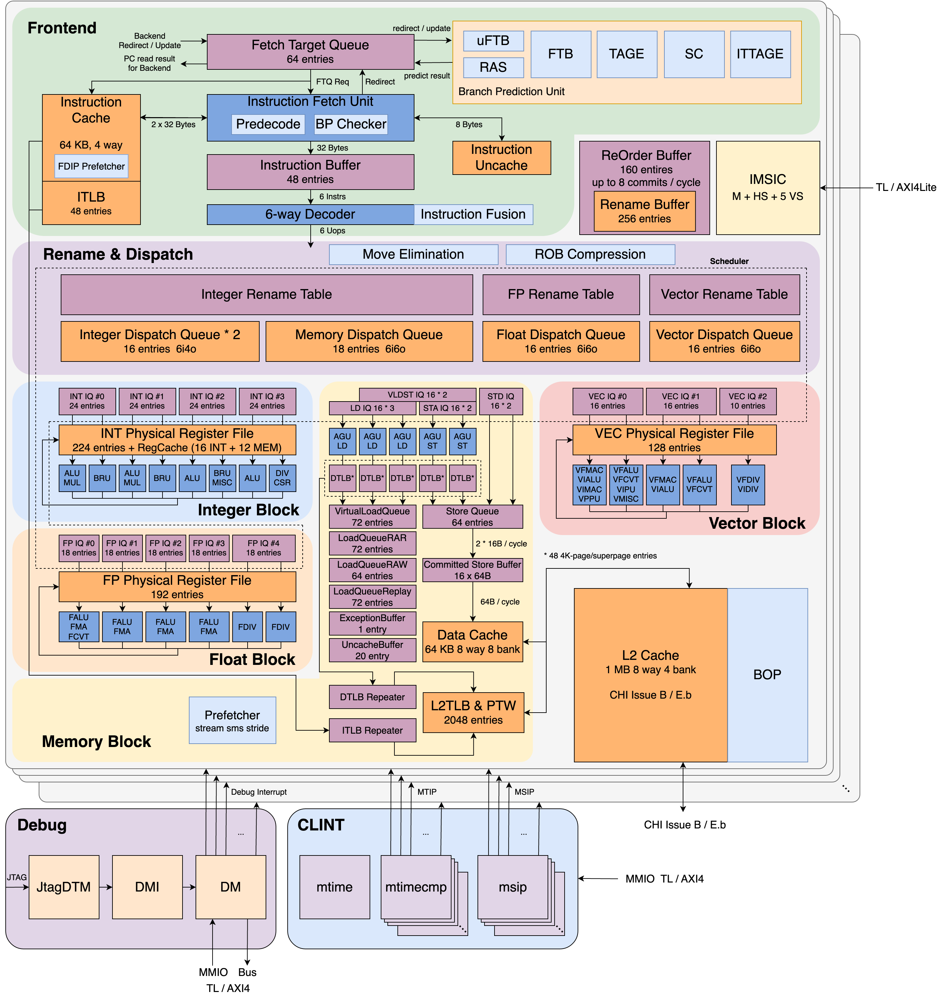

一条指令从前端进入后端后，先被译码成“要做什么、读写哪些寄存器、属于哪个功能单元”，然后分配物理寄存器和 ROB 项，再排队等待操作数，最后进入执行单元。对本条向量浮点加法，流程可以简化成：

```text
前端指令流
  -> Decode：识别 VFADD_VV，生成向量浮点控制信息
  -> Rename：向量逻辑寄存器映射到物理寄存器，分配 pdest
  -> Dispatch：建立 ROB 项并把 uop 送到向量浮点 issue queue
  -> Issue Queue：等待物理源操作数 ready，选择 uop 发射
  -> Operand Gather / 数据通路：取得 vs2、vs1 的向量位数据
  -> VFALU：依 SEW 将向量拆成计算切片，分发 FP 格式、操作码、舍入控制
  -> VectorFloatAdder：每个 FP32 lane 做特殊值判定、加/减、规格化、舍入
  -> VFALU：收集 lane 结果和异常标志，按向量规则处理 mask/tail
  -> Writeback：写向量物理寄存器并反馈 fflags
  -> ROB：确认完成，等到队首后提交
```

先把解释两个词：

- **向量**描述一次指令带有多个元素，活动 lane 由 `vl`、元素宽度由 `SEW` 等配置确定。
- **浮点**描述每个元素内部的数值编码和运算规则，例如 FP32 的符号、指数、尾数、舍入和异常标志。

所以 `vfadd.vv` 不是“一个超宽浮点数相加”，而是“一条向量指令触发多个相互独立的浮点 lane 运算”。

## 3. backend

由于同目录下的其余教程将这一段大致流程表讲述的已经非常清楚了，为避免趋同化，这里只是简单梳理一下流程，重点讲述不同部分。

### 3.1 Decode

Decode将机器码翻译成控制字段。

它根据 `instr` 识别这是一条 `VFADD_VV`，并形成内部 uop 控制：两个向量源、一个向量目的、浮点加法操作码、目标功能单元类型、SEW/向量状态相关信息以及舍入模式来源等。`valid && ready` 表示 Decoupled 接口这一拍完成传输。

波形观察：

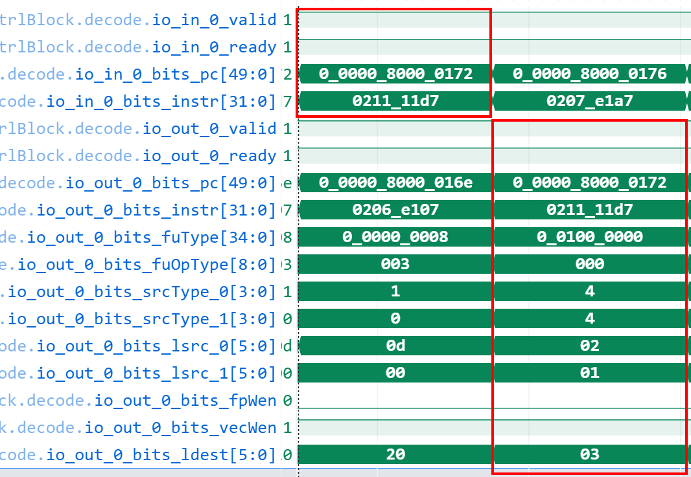

本次 `io_in_0` 在 8441 ps 接收，`io_out_0` 在 8442 ps 译码结束发出。

### 3.2 Rename

寄存器重命名的目的，是避免不同指令对同一逻辑寄存器产生写后写、写后读等假依赖。Rename 查询向量 RAT，为源 `v1/v2` 找到物理源，为目的 `v3` 分配新物理寄存器；本次波形后续标识显示 `pdest=0x36`。Rename 不读取浮点数值，也不进行浮点格式解码。

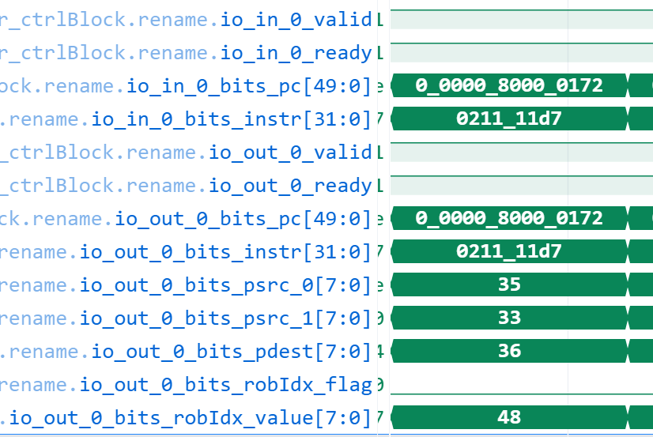

目标 uop 通过 Rename。

### 3.3 Dispatch

Dispatch 一边向 ROB 申请位置，一边依据 `fuType` 把 uop 分发到执行队列。本次分配 `robIdx=0x48`，目的物理寄存器 `pdest=0x36`，向量浮点队列入队握手成功。ROB 保存指令顺序、异常/完成状态和提交信息；issue queue 保存等待发射的 uop。此刻仍未做 FP 加法。

约`8444ps`：

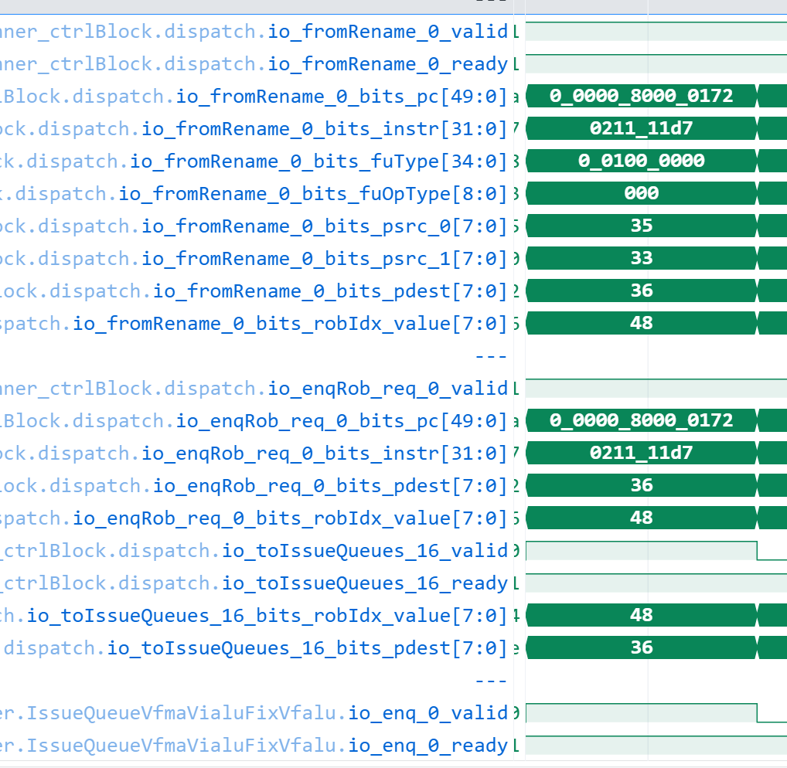

观察信号：

```text
dispatch.io_fromRename_0
dispatch.io_enqRob_req_0
dispatch.io_toIssueQueues_16
inner_vfScheduler.IssueQueueVfmaVialuFixVfalu.io_enq_0
```

目标指令约 `8444 ps` 经过此阶段。同时进入 ROB 与向量浮点队列，之后使用 `robIdx=0x48` 作为跨模块追踪 ID。

### 3.4 Issue Queue

队列会检查源操作数是否 ready、uop 是否阻塞、执行端能否接收等条件。源尚未就绪时，指令留在队列；这是依赖等待。源准备好后，仲裁逻辑选择一个候选发射。

波形：

| 时间 | 信号 | 证据 |
|---:|---|---|
| 8484 ps | `entries.io_deqSelOH_1_valid` | 目标 entry 被选择；entry 的 ROB=`0x48`、pdest=`0x36` |
| 8484 ps | `deqBeforeDly_1_valid` | 选择结果进入 dequeue 前级 |
| 8485 ps | `io_deqDelay_1_valid && io_deqDelay_1_ready` | 出队接口握手，ROB/pdest 仍匹配 |

源码可从 `VecIssueQueue.scala` 中 entry 可发射判定处和 `IssueQueue.scala` 的 dequeue/响应路径阅读。波形里选择信号有效只表示“选中”；要看到同一时刻 ready 才能说接口传输成功。

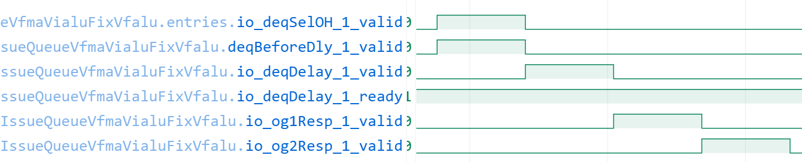

### 3.5 操作数收集

操作数收集（operand gather）会从向量物理寄存器文件读取源，或从旁路网络取得刚完成的值。此时操作数是原始位向量；浮点语义稍后由执行单元按格式解释。

- 约 8486 ps `io_og1Resp_1_valid` 有效，
- 约 8487 ps `io_og2Resp_1_valid` 有效。`vv` 形式要有两个向量源。
- 约 8488 ps，`Vfalu.io_in_valid=1`、`io_in_ready=1`，随后 `vfalus_0.io_fire=1`，说明向量浮点单元采纳了该 uop。

接上面的波形继续：

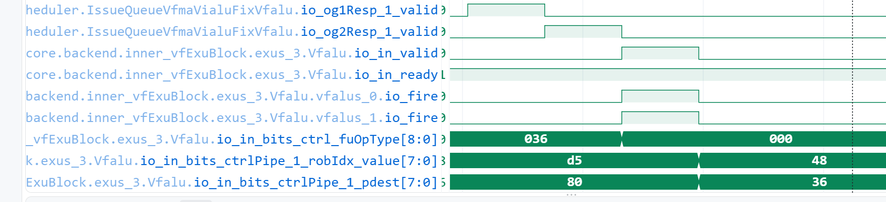

最终也会把两个源数据送到执行端

## 4. 向量浮点执行

### 4.1 VFALU

VFalu本质是包装/分发层。

香山的 `VFAlu` 位于 `backend/fu/wrapper/VFALU.scala`，它是向量浮点功能单元的顶层包装。它接收执行 uop 的控制和数据，并按元素宽度/格式组织计算切片，再把结果及浮点标志整理成后端写回格式。向量基本单元 `VecPipedFuncUnit` 提供 `vsew`、`vl`、`vstart`、`mask`、`uop index` 等向量控制别名；动态舍入模式 `rm` 来自浮点 `frm`。

本实现里一个 `VectorFloatAdder` 接口计算 64 位切片。香山 `VLEN=128` 时会实例化 `128/64=2` 个向量浮点计算模块。`VFALU.scala` 注释示意切片布局：

```text
源128位向量: [lane3 | lane2 | lane1 | lane0]
切片0     : [lane2 | lane0]
切片1     : [lane3 | lane1]
```

这个重排是为了把分散的 32 位 lane 装进两个 64 位算术接口；架构层仍然只有一条 `vfadd.vv`。对当前 `SEW=32, VL=4`，两个子模块各处理两个 FP32 元素，并行完成四次独立加法。

### 4.2 操作数、格式、opcode、mask 和舍入控制如何进入加法器

`VFALU.scala` 的关键连接可以概括为：

```scala
mod.io.fire       := io.in.valid
mod.io.fp_a       := vs2Split.io.outVec64b(i)
mod.io.fp_b       := vs1Split.io.outVec64b(i)
mod.io.mask       := Mux(...)
mod.io.round_mode := rm
mod.io.fp_format  := Mux(resWiden, vsew + 1.U, vsew)
mod.io.op_code    := opcode
resultData(i)     := mod.io.fp_result
fflagsData(i)     := mod.io.fflags
```

阅读时逐项理解：

- `fire`：子模块在本 uop 有效时采样输入和控制。
- `fp_a/fp_b`：两个源切片。这里分别来自 `vs2` 和 `vs1`。
- `fp_format`：选择 FP16、FP32 或 FP64 元素格式。本条配置 `SEW=32`，所以是 FP32。
- `op_code`：选浮点加、减、比较等具体功能。本条是 add。
- `round_mode`：动态舍入控制，由 `frm` 提供。启动代码 `csrwi fcsr,0` 清 CSR，因此模式为 `000` RNE；`vcsr=0` 是向量定点舍入/饱和状态，不是浮点 `frm`。
- `mask`：控制被屏蔽 lane 是否参与/更新。本程序用 `vsetivli ... ma` 且指令没有显式 mask 操作数，相当于活动 lane 全参与；mask/tail 的结果整理由向量包装层/MGU 处理。
- `fp_result/fflags`：子模块回传每个切片的数据和 lane 浮点异常标志。

文件顶层 `VectorFloatAdder` IO 定义了 `round_mode`、`fp_format`、`op_code`、mask、`fp_result` 和 20 位 `fflags`；它按格式选择 FP32/FP16/FP64 lane 管线。

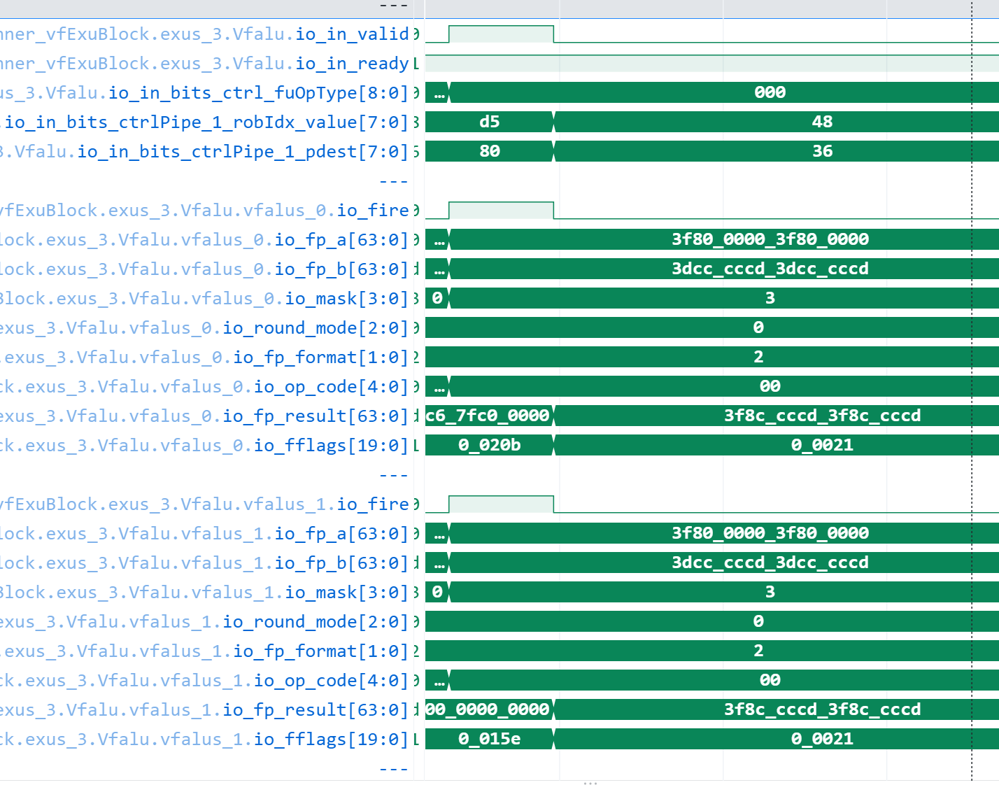

### 4.3 一个 FP32 lane 内部做什么

对每个 lane，数学语义是：

```text
result[i] = round_to_FP32( value(vs2[i]) + value(vs1[i]), frm )
```

具体电路包含如下逻辑阶段。它们说明算术工作内容，不等价于对外暴露的每一个独立时钟级；内部流水级边界应以相同版本 RTL 和实际波形寄存器为准。

1. **拆字段并分类**：取符号、指数、尾数；判断 NaN、Inf、零、subnormal 或 normal。FP32 指数为 8 位、fraction 为 23 位；normal 有隐含前导 1，subnormal 没有隐含 1。
2. **确定加减关系**：有效数相加/相减取决于符号是否相同。对 `a+b`，硬件可把符号差异转化成有效数减法，并选取幅值较大的操作数确定结果符号。
3. **指数对齐**：较小指数的有效数右移至较大指数位置；右移丢掉的位形成 guard、round、sticky 信息，不能简单丢弃，否则舍入和 NX 会错误。
4. **远路径 / 近路径**：指数差大时，小数右移很多，采用 far path 和 GRS 处理；指数接近且异号相消时，结果可能需要大幅左规，采用 close path、前导零检测和规格化。源码的混合 FP32/FP16 pipeline 同时连了 `U_far_path`、`U_close_path`，再根据指数差和符号关系选择路径。
5. **规格化**：调整尾数和指数。加法进位可能右规；相减后前导零可能需要左移。subnormal 输入会使用无隐含位的 significand 参与运算，必要时规范化/对齐。
6. **舍入**：按 `frm` 和 GRS 判断保留位是否加一，并处理舍入进位传播。RNE、RTZ、RDN、RUP、RMM 的方向定义见第 9 节。
7. **打包与 flags**：组合符号、指数和 fraction，输出 FP32 位型；同时产生 NV/DZ/OF/UF/NX。向量执行单元把每个 lane 的 flags 编入 20 位切片总线，再按 mask 与结果路径汇总。

以 lane `vfalus_0.U_F32_Mixed_0` 为例，实际如下；同名节点也应在 `vfalus_0.U_F32_Mixed_1`、`vfalus_1.U_F32_Mixed_0/1` 下检查，不能把一个 lane 的值当成四个 lane 的共同值：

```text
时间点 = 8489 ps
io_fp_a[31:0]    = 0x3f800000
Efp_a_is_all_one = 0
fp_a_is_SNAN     = 0
io_fp_b[31:0]    = 0x3dcccccd
Efp_b_is_all_one = 0
fp_b_is_SNAN     = 0
out_NAN[31:0]    = 0x7fc00000（NaN 候选值，未被选中）
io_fp_c[31:0]    = 0x3f8ccccd
io_fflags[4:0]   = 0x01
```

### 4.4 源码 FP32 路径

下面按数据实际经过的顺序对照 `D:\XiangShan\yunsuan\src\main\scala\yunsuan\vector\VectorFloatAdder.scala`。源码片段只摘录与本条 `vfadd.vv` 相关的关键行；原文件还包含其他格式、widening、比较与 reduction 路径。行号按当前源码版本标注。

#### 4.4.1 两个 FP32 lane 接收向量元素

`VectorFloatAdder` 把向量拆成并行的 element lane。`U_F32_Mixed_0` 处理低 32 位元素，`U_F32_Mixed_1` 处理高 32 位元素。两者都接收 `fire`、操作数、`round_mode`、`fp_format`、mask 和 opcode；`fire` 是本次运算的有效控制。`fp_b` 选择兼容标量浮点寄存器 `frs1` 输入，本条向量 `vfadd.vv` 使用向量源操作数。

```scala
// VectorFloatAdder.scala:173–185，lane 0
val U_F32_Mixed_0 = Module(new FloatAdderF32WidenF16MixedPipeline(is_print = false, hasMinMaxCompare = hasMinMaxCompare))
U_F32_Mixed_0.io.fire       := fire
U_F32_Mixed_0.io.fp_a       := f32_0_fp_a
U_F32_Mixed_0.io.fp_b       := Mux(io.is_frs1, io.frs1(31,0), io.fp_b(31,0))
U_F32_Mixed_0.io.mask       := io.mask(0)
U_F32_Mixed_0.io.is_sub     := fast_is_sub
U_F32_Mixed_0.io.round_mode := io.round_mode
U_F32_Mixed_0.io.fp_format  := fp_format
U_F32_Mixed_0.io.op_code    := io.op_code
val U_F32_0_result = U_F32_Mixed_0.io.fp_c
val U_F32_0_fflags = U_F32_Mixed_0.io.fflags

// VectorFloatAdder.scala:195–219，lane 1 关键输入/输出
val U_F32_Mixed_1 = Module(new FloatAdderF32WidenF16MixedPipeline(is_print = false, hasMinMaxCompare = hasMinMaxCompare))
U_F32_Mixed_1.io.fire       := fire
U_F32_Mixed_1.io.fp_a       := f32_1_fp_a
U_F32_Mixed_1.io.fp_b       := Mux(io.is_frs1, io.frs1(31,0), io.fp_b(63,32))
U_F32_Mixed_1.io.mask       := Mux(fp_format === 1.U, io.mask(1), io.mask(2))
U_F32_Mixed_1.io.round_mode := io.round_mode
U_F32_Mixed_1.io.fp_format  := fp_format
U_F32_Mixed_1.io.op_code    := io.op_code
val U_F32_1_result = U_F32_Mixed_1.io.fp_c
val U_F32_1_fflags = U_F32_Mixed_1.io.fflags
```

本次 `SEW=32` 时，两个 lane 分别处理各自的 32 位 A、B 元素。四元素向量由两条 64 位执行切片、各两个 FP32 lane 共同覆盖；具体 lane 与 VFALU 切片的对应关系见 6.5 节波形输入表。

#### 4.4.2 lane 选择 FP32 数据并并行送往 far/close path

类名 `FloatAdderF32WidenF16MixedPipeline` 表示这个流水实现还服务 FP16 widening 等操作。`res_is_f32` 为真且本条不是 widening 时，`fp_a_to32/fp_b_to32` 选择原始 FP32 `io.fp_a/io.fp_b`。两个 path 都接收同一对操作数和舍入模式，之后由指数差及 `EOP` 决定使用哪个结果。`EOP` 反映有效操作数的符号关系，`is_sub` 在此参与 B 操作数符号的反转。

```scala
// VectorFloatAdder.scala:396–425，省略注释掉的 half 转换逻辑
val fp_a_to32 = Mux(io.res_widening & !io.opb_widening,
  io.widen_a, Mux(res_is_f32, io.fp_a, fp_a_16as32))
val fp_b_to32 = Mux(io.res_widening & !io.is_vfwredosum,
  io.widen_b, Mux(res_is_f32, io.fp_b, fp_b_16as32))
val EOP = (fp_a_to32.head(1) ^ io.is_sub ^ fp_b_to32.head(1)).asBool

val U_far_path = Module(new FarPathF32WidenF16MixedPipeline(is_print=is_print, hasMinMaxCompare=hasMinMaxCompare))
U_far_path.io.fp_a := fp_a_to32
U_far_path.io.fp_b := fp_b_to32
U_far_path.io.is_sub := io.is_sub
U_far_path.io.round_mode := io.round_mode
val U_close_path = Module(new ClosePathF32WidenF16MixedPipeline(is_print=is_print, hasMinMaxCompare=hasMinMaxCompare))
U_close_path.io.fp_a := fp_a_to32
U_close_path.io.fp_b := fp_b_to32
U_close_path.io.round_mode := io.round_mode
```

#### 4.4.3 特殊值分类与 far/close 路径选择（约 `:427–483`；长段截取分类和选择信号）

`Efp_a/Efp_b` 是指数域，mantissa 非零检测对应 fraction 非零。指数全 1 且 fraction 非零是 NaN；指数全 1 且 fraction 为零是 infinity；指数为零且 fraction 为零是 zero。sNaN 还要检查 quiet bit。指数差较小且有效操作数相减时走 close path，以处理抵消和规格化；其他情况走 far path。检测到 sNaN 或相反无穷相加时置 NV 并选 NaN 结果。

```scala
// VectorFloatAdder.scala:437–456，A 操作数分类（B 操作数采用对称逻辑）
val Efp_a_is_zero = !Efp_a.orR | (fp_a_is_f16 & Efp_a === "b01100110".U)
val Efp_a_is_all_one = Mux(fp_a_is_f16, ..., io.fp_a(30,23).andR)
val fp_a_is_NAN = io.fp_aIsFpCanonicalNAN | Efp_a_is_all_one & fp_a_mantissa_isnot_zero
val fp_a_is_SNAN = !io.fp_aIsFpCanonicalNAN & Efp_a_is_all_one & fp_a_mantissa_isnot_zero & !fp_a_to32(significandWidth-2)
val fp_a_is_infinite = !io.fp_aIsFpCanonicalNAN & Efp_a_is_all_one & !fp_a_mantissa_isnot_zero
val fp_a_is_zero = !io.fp_aIsFpCanonicalNAN & Efp_a_is_zero & !fp_a_mantissa_isnot_zero

// VectorFloatAdder.scala:428、459–468，路径及异常标志
val is_close_path = EOP & (!absEaSubEb(absEaSubEb.getWidth - 1, 1).orR)
val is_far_path = !EOP | (EOP & absEaSubEb(absEaSubEb.getWidth - 1, 1).orR) | ...
when(RegEnable((fp_a_is_SNAN | fp_b_is_SNAN) | (EOP & fp_a_is_infinite & fp_b_is_infinite), fire)) {
  float_adder_fflags := "b10000".U
}.otherwise {
  float_adder_fflags := Mux(is_far_path_reg, U_far_path.io.fflags, U_close_path.io.fflags)
}
```

以上摘录中的 `...` 仅省去与本说明无关的格式/特殊路径条件。观察波形时对照 `Efp_*`、`fp_*_is_SNAN`、`fp_*_is_infinite`、`EOP`、`is_far_path`，再检查 `float_adder_fflags` 和最终 `float_adder_result`。

#### 4.4.4 far path：对齐、舍入和 OF/NX

far path 处理指数差较大的运算。它把 `round_mode` 锁存为 RNE/RTZ/RDN/RUP/RMM 控制；对齐后的 L/G/S 信息参与 `far_case_normal_round_up_reg` 判定，再选择结果是否进一。`OF_reg` 表示溢出，`NX` 表示舍弃了非零信息或发生溢出。当前实现中 far path 的 `UF` 初始化为 false 且未在该路径赋值，因此此处输出 UF 保持 0。

```scala
// VectorFloatAdder.scala:804–814，舍入模式及 flags
val RNE_reg = RegEnable(io.round_mode === "b000".U, fire)
val RTZ_reg = RegEnable(io.round_mode === "b001".U, fire)
val RDN_reg = RegEnable(io.round_mode === "b010".U, fire)
val RUP_reg = RegEnable(io.round_mode === "b011".U, fire)
val RMM_reg = RegEnable(io.round_mode === "b100".U, fire)
val OF_reg = WireInit(false.B)
val UF = WireInit(false.B)
val NX = WireInit(false.B)
io.fflags := Cat(NV, DZ, OF_reg, UF, NX)

// VectorFloatAdder.scala:936–940，normal 结果的舍入增量
val far_case_normal_round_up_reg = (RegEnable(EOP, fire) & !lgs_normal_reg(1) & !lgs_normal_reg(0)) |
  (RNE_reg & lgs_normal_reg(1) & (lgs_normal_reg(2) | lgs_normal_reg(0))) |
  (RDN_reg & far_sign_result_reg & (lgs_normal_reg(1) | lgs_normal_reg(0))) |
  (RUP_reg & !far_sign_result_reg & (lgs_normal_reg(1) | lgs_normal_reg(0))) |
  (RMM_reg & lgs_normal_reg(1))
OF_reg := RegEnable(Mux(res_is_f32, EA_add1.andR, EA_add1.tail(3).andR), fire) & (...)
NX := Mux(far_case_normal_reg, lgs_normal_reg(1,0).orR, lgs_overflow_reg(1,0).orR) | OF_reg
```

`...` 在 `OF_reg` 行省去该行后半部的 overflow 条件。逐周期观察时，把 `io.round_mode`、`lgs_normal_reg`、`far_case_normal_round_up_reg`、`OF_reg`、`NX` 与 `io.fflags/io.fp_c` 对齐到同一次 `fire`。

#### 4.4.5 close path：相消、前导零检测和结果选择

close path 主要处理指数接近的减法。源码并行生成候选加/减结果 `CS0`–`CS4`，用 `sel_CS*` 选择候选；再对 `CS_0123_result` 与指数边界掩码合成的 `priority_mask` 做 LZD，取得左移规格化量。`NX_reg` 根据候选末位与 guard 位确定不精确标志。波形应重点看 `CS*`、`sel_CS*`、`lzd_0123_reg`、`CS_0123_lshift_result_reg`、`close_fraction_result_reg`。

```scala
// VectorFloatAdder.scala:1126–1129、1146–1158，候选选择、LZD 与 NX
val sel_CS0 = exp_is_equal & !U_CS0.io.result.head(1).asBool
val sel_CS1 = exp_is_equal & U_CS0.io.result.head(1).asBool
val sel_CS2 = !exp_is_equal & !Efp_b_is_greater & (...)
val sel_CS3 = !exp_is_equal & Efp_b_is_greater & (...)
val CS_0123_result = Mux1H(Seq(sel_CS0 -> Cat(CS0,0.U), sel_CS1 -> Cat(CS1,0.U), sel_CS2 -> CS2, sel_CS3 -> CS3))
val priority_mask = CS_0123_result | mask_onehot
val lzd_0123 = LZD(priority_mask)
val lzd_0123_reg = RegEnable(lzd_0123, fire)
NX_reg := RegEnable(Mux(..., B_guard, 0.U), fire)
```

这里 `...` 表示完整候选判定中还包含舍入位和结果符号条件；代码位置不到 40 行的核心信号已列出，完整条件可按行号回到源码核对。

#### 4.4.6 将两个 FP32 lane 结果合成向量结果

完成后，顶层按 `fp_format` 选择 FP32 结果并拼接两个 lane。`is_vec_reg` 控制高半部分是否作为向量元素输出。flags 也按 lane 与格式条件汇集，因此要区分每 lane 的 5 位 flags 和 VFALU 对外汇总后的 flags。

```scala
// VectorFloatAdder.scala:270–293，FP32 结果拼接与 flags 汇集
val res_is_f32 = fp_format_reg === 2.U
val fp_f32_result = Cat(Fill(32, is_vec_reg) & U_F32_1_result, U_F32_0_result)
io.fp_result := Mux1H(Seq(
  res_is_f16 -> fp_f16_result,
  res_is_f32 -> fp_f32_result,
  res_is_f64 -> fp_f64_result,
))
io.fflags := Cat(
  Fill(5,is_vec_reg & res_is_f16) & U_F16_3_fflags,
  Fill(5,is_vec_reg & res_is_f16) & U_F16_2_fflags,
  Fill(5,is_vec_reg & !res_is_f64) & Mux(res_is_f32,U_F32_1_fflags,U_F16_1_fflags),
  Mux(res_is_f64,U_F64_Widen_0_fflags,Mux(res_is_f32,U_F32_0_fflags,U_F16_0_fflags))
)
```

#### 4.4.7 从代码回到波形的观察顺序

1. 在 VFALU 输入处核对 `fp_format`、`round_mode`、`op_code`、`fire` 与两路 `fp_a/fp_b`。
2. 在 lane 分类处核对 `fp_a_to32/fp_b_to32`、`Efp_a/Efp_b`、`fp_*_is_SNAN`、`fp_*_is_infinite`、`fp_*_is_zero`、`EOP`。
3. 在 far/close 选择处看 `absEaSubEb`、`is_far_path`；进入 far 时看 `lgs_normal_reg`、round-up 和 flags，进入 close 时看 `CS*`、`sel_CS*`、`lzd_0123_reg`。
4. 在 lane 输出和 VFALU 输出处核对 `fp_c`、`fflags`、`fp_result`，确认两个 FP32 元素的拼接与 flags 汇集。

### 4.5 本次实际波形：四个 lane 的输入和输出

执行实例路径：

```text
TOP.SimTop.cpu.l_soc.core_with_l2.core.backend.inner_vfExuBlock.exus_3.Vfalu
TOP.SimTop.cpu.l_soc.core_with_l2.core.backend.inner_vfExuBlock.exus_3.Vfalu.vfalus_0
TOP.SimTop.cpu.l_soc.core_with_l2.core.backend.inner_vfExuBlock.exus_3.Vfalu.vfalus_1
```

约 8488 ps：

| 切片 | `fp_a` | `fp_b` | 拆出的 FP32 lane |
|---|---|---|---|
| `vfalus_0` | `0x3f8000003f800000` | `0x3dcccccd3dcccccd` | 两组 `1.0f + 0.1f` |
| `vfalus_1` | 另两个 lane 的相同数据 | 另两个 lane 的相同数据 | 两组 `1.0f + 0.1f` |

约 8489 ps，`vfalus_0.io_fp_result[63:0]=0x3f8ccccd3f8ccccd`，四个 lane 在完整向量结果中都是 `0x3f8ccccd`。`vfalus_0.io_fflags[19:0]=0x00021`：每 lane 5 位 flags，两个 NX 位分别在 bit 0、bit 5 置位，其他位为 0。写回处汇总的 `fflags=0x1` 表示架构累计 NX。

源码对应：`VectorFloatAdder.scala` 中 `U_F32_Mixed_0/1.io.fp_c` 分别提供两个 FP32 结果，`fp_f32_result` 再按向量模式拼合；`io.fflags` 同样逐 lane 打包。波形若同时展开 `vfalus_0` 与 `vfalus_1`，可以逐个核实四个 lane，而不是只在 writeback 看合并后的 128 位总线。
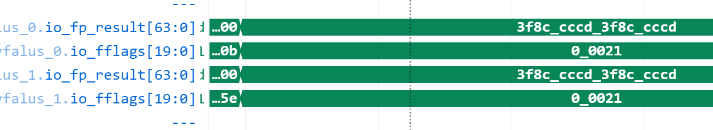

## 5. 特殊操作数

### 5.1 FP32 位字段与分类判据

FP32 编码是：

```text
31            30            23 22                         0
+---------------+---------------+---------------------------+
| sign (1 bit)  | exponent (8)  | fraction (23)             |
+---------------+---------------+---------------------------+
```

| 类别 | 指数 | fraction | 含义/内部处理重点 |
|---|---|---|---|
| Zero | 全 0 | 全 0 | 正零或负零；看 sign。参与加法的结果零符号受操作数符号与舍入方向影响。 |
| Subnormal | 全 0 | 非 0 | 没有隐含的前导 1；需要按较小有效数值参与对齐/规格化。 |
| Normal | 非全 0 且非全 1 | 任意 | 隐含前导 1 的常规有限数。 |
| Infinity | 全 1 | 全 0 | `+Inf` 或 `-Inf`，sign 决定方向。 |
| NaN | 全 1 | 非 0 | fraction 的最高位（quiet bit）为 1 通常是 qNaN；为 0 是 sNaN（且 fraction 非零）。 |

常用 FP32 位型：

- +0=`0x00000000`
- -0=`0x80000000`
- 最小正 subnormal=`0x00000001`
- 最大 subnormal=`0x007fffff`
- 最小正 normal=`0x00800000`
- +Inf=`0x7f800000`
- -Inf=`0xff800000`
- qNaN 示例=`0x7fc00000`
- sNaN 示例=`0x7f800001`

FP32/FP16 混合加法路径对操作数检查全 1 指数与 fraction 是否为零，并用 `quiet bit` 识别 sNaN；VFALU 的 NaN-boxing 检查也可通过 `fp_*IsFpCanonicalNAN` 通知子模块把非法装箱输入按 `canonical NaN` 处理。

对本条 FP32 向量运算，输入元素本身就是 32 位格式；NaN-boxing 主要关联标量窄格式放入 64 位标量 FP 寄存器，不要将二者混为一谈。分类信号定义见 `VectorFloatAdder.scala:449–459` 左右。

### 5.2 NaN

两类 NaN 都是 `exp=全 1、fraction!=0`。

- qNaN 的 quiet bit=1
- sNaN 的 quiet bit=0

FP 加法的数据路径会先做特殊值分类，再决定是否进入普通 far/close 算术路径。

| 运算情形 | 典型结果 | `NV` |
|---|---|---:|
| qNaN + 有限数 | canonical/default qNaN | 0 |
| qNaN + qNaN | canonical/default qNaN | 0 |
| sNaN + 有限数 | quiet/canonical NaN | 1 |
| sNaN + qNaN 或 sNaN | quiet/canonical NaN | 1 |

> **qNaN**：quiet NaN，静默 NaN。它表示“结果无效或未定义”，但继续参与运算时通常不会再触发 `NV`
>
> **canonical qNaN**：规范 NaN。硬件选定的一种标准 qNaN 位型，用来统一表示 NaN 结果。在这份实现中，`out_NAN` 候选值是 `0x7fc00000`
>
> **default qNaN**：默认 qNaN，意思是该实现选择的默认 NaN 结果；通常就是它采用的 canonical qNaN。具体位型取决于实现。

这份 VectorFloatAdder 源码对 sNaN 设置 `fflags=10000`（5 位顺序 NV,DZ,OF,UF,NX），普通 NaN 结果走 canonical NaN 分支；`out_NAN` 生成指数全 1、quiet bit 为 1 的结果。

本 VCD 没有单独 dump `fp_a_is_NAN` 或 `fp_a_is_QNAN`；qNaN 应由原始输入指数全 1、fraction 非零且 `fp_a_is_SNAN=0` 判定。在 8489 ps 查看 lane0。当前波形运行的是有限数 `1.0f + 0.1f`，没有 NaN 输入；因此以下是该实际周期的数据，不能据此认定 NaN 分支被触发。`out_NAN` 是候选值总线，只有选择 NaN 分支时才会成为结果。

```text
时间点 = 8489 ps
io_fp_a			 = 0x3f800000
Efp_a_is_all_one = 0
fp_a_is_SNAN	 = 0
io_fp_b			 = 0x3dcccccd
Efp_b_is_all_one = 0
fp_b_is_SNAN 	 = 0
out_NAN 		 = 0x7fc00000（候选值，未被选中）
io_fp_c 		 = 0x3f8ccccd
io_fflags 		 = 0x01（NX）
```

简称均对应 lane0；检查其他 lane 时，将 lane 标识替换为 `vfalus_0.U_F32_Mixed_1`、`vfalus_1.U_F32_Mixed_0` 或 `vfalus_1.U_F32_Mixed_1`。
加法实现将“有效操作数为 infinity”与“一正一负无穷相消”分别分类。`EOP` 代表有效操作数符号关系下的减法/相消情况；当两个操作数都是 infinity 且该关系是相反无穷相加时，特殊分支报告 invalid 并选择 NaN。

```text
时间点 = 8489 ps
fp_a_is_infinite = 0
fp_b_is_infinite = 0
EOP				 = 0
out_NAN 		 = 0x7fc00000（候选值，未被选中）
io_fflags 		 = 0x01（NX；非 NV）
```

本次 `VFALU` 实现存在对零和 widening 情形的显式选择分支；对普通 FP32 `vfadd.vv`，应结合所选 FP32 lane 运算路径检查，而不能将 widening 专用旁路直接套到本条指令。推荐测试 `+0 + +0`、`-0 + -0`、`+0 + -0`，并读回原始位型，而不仅比较 C 的浮点相等（因为 `+0 == -0`）。

subnormal 是合法有限数，不会自动产生异常。两个 subnormal 相加可以得到 subnormal 或 normal；相邻大小的相反符号数相减还可能得到非常小的精确结果。VCD 没有单独的 `is_subnormal` 标志，需要从全名信号的指数为零且原始 fraction 非零进行判定；再追踪指数差、far/close 结果和 flags：

```text
时间点 = 8489 ps
io_fp_a				 = 0x3f800000
io_fp_b 			 = 0x3dcccccd
Efp_a_is_zero 		 = 0
Efp_b_is_zero 		 = 0
far.absEaSubEb 		 = 0x04
far.lgs_normal_reg_r = 0x3
close.lzd_0123_reg   = 0x01
io_fp_c 		 	 = 0x3f8ccccd
io_fflags			 = 0x01（NX）
```

波形验证溢出时查看以下名称；`UF` 没有在本次 VCD 的 lane 内作为独立变量出现，应从 `io_fflags` 的 UF 位读取实际输出，并与 RTL 中 UF 保持默认 0 的实现相互核对：

```text
时间点 = 8489 ps
far.OF_reg      = 0
far.NX          = 1
far.io_fflags   = 0x01
far.io_fp_c     = 0x3f8ccccd（选中）
close.NX_reg_r  = 0
close.io_fflags = 0x00
close.io_fp_c   = 0xbf19999a（未选路径候选）
```

### 5.3 Infinity

加法的无穷规则：

| 运算 | 结果 | flags |
|---|---|---|
| `+Inf +` 有限数 | `+Inf` | 不因 Inf 本身设置异常 |
| `-Inf +` 有限数 | `-Inf` | 不因 Inf 本身设置异常 |
| `+Inf + +Inf` | `+Inf` | 无 NV |
| `-Inf + -Inf` | `-Inf` | 无 NV |
| `+Inf + -Inf`（或相反） | canonical qNaN | `NV=1` |

加法实现将“有效操作数为 infinity”与“一正一负无穷相消”分别分类。`EOP` 代表有效操作数符号关系下的减法/相消情况；当两个操作数都是 infinity 且该关系是相反无穷相加时，特殊分支报告 invalid 并选择 NaN。观察波形时要区分 `fp_a_is_infinite/fp_b_is_infinite` 与 `EOP`，只看到 exponent 全 1 并不足以判断 NV。

波形检查项（lane0）：

```text
Vfalu.vfalus_0.U_F32_Mixed_0.fp_a_is_infinite
Vfalu.vfalus_0.U_F32_Mixed_0.fp_b_is_infinite
Vfalu.vfalus_0.U_F32_Mixed_0.EOP
Vfalu.vfalus_0.U_F32_Mixed_0.out_NAN
Vfalu.vfalus_0.U_F32_Mixed_0.io_fflags
```

### 5.4 Zero 与符号零

`+0` 和 `-0` 数值相等，但编码符号位不同。零加有限数通常返回该有限数；两个零相加时结果符号需要遵循舍入规则，特别是发生符号相消时，RDN（向负无穷）可决定负零。零本身不会设置 NV、OF、UF 或 NX。

本次 `VFALU` 实现存在对零和 widening 情形的显式选择分支；对普通 FP32 `vfadd.vv`，应结合所选 FP32 lane 运算路径检查，而不能将 widening 专用旁路直接套到本条指令。推荐测试 `+0 + +0`、`-0 + -0`、`+0 + -0`，并读回原始位型，而不仅比较 C 的浮点相等（因为 `+0 == -0`）。

### 5.5 Subnormal

指数全 0 且 fraction 非 0 的数是 subnormal。它没有 normal 数隐含的前导 1，所以有效数不能按 normal 的 `1.fraction` 解读。加法器生成 significand 时用 exponent 是否为零决定是否补入前导位；再参与指数比较、右移对齐和必要的规格化。

subnormal 是合法有限数，不会自动产生异常。两个 subnormal 相加可以得到 subnormal 或 normal；相邻大小的相反符号数相减还可能得到非常小的精确结果。检查时关注：输入指数/尾数分类、指数差、移位量、左规/规格化结果、最终 fraction，以及 UF/NX。
波形检查项（lane0）：

```text
Vfalu.vfalus_0.U_F32_Mixed_0.io_fp_a
Vfalu.vfalus_0.U_F32_Mixed_0.io_fp_b
Vfalu.vfalus_0.U_F32_Mixed_0.Efp_a_is_zero
Vfalu.vfalus_0.U_F32_Mixed_0.Efp_b_is_zero
Vfalu.vfalus_0.U_F32_Mixed_0.U_far_path.absEaSubEb
Vfalu.vfalus_0.U_F32_Mixed_0.U_far_path.lgs_normal_reg_r
Vfalu.vfalus_0.U_F32_Mixed_0.U_close_path.lzd_0123_reg
Vfalu.vfalus_0.U_F32_Mixed_0.io_fp_c
Vfalu.vfalus_0.U_F32_Mixed_0.io_fflags
```

> 源码定位：FP32 lane 用 `significand_fp_a = Cat(Efp_a_is_not_zero, fp_a_mantissa)`（B 同理）构造有效数；指数为 0 时最高位补 0，指数非 0 时补隐含 1。另有部分 half-to-single 转换片段处于注释状态，不能把注释代码当作当前启用路径。

### 5.6 Overflow 与 underflow：结果边界和 flags

RISC-V 浮点异常 flags 的 5 位排列为 `NV DZ OF UF NX`，分别对应无效、除零、溢出、下溢、不精确。加法通常不会触发 DZ；对加法重点看 NV/OF/UF/NX。

**Overflow（OF）**：舍入前精确结果的幅值超过目标格式可表示范围。结果按舍入模式可能是带符号 infinity，也可能是最大有限数。例如 `maxFinite + maxFinite` 会进入溢出处理。源码 far path 根据舍入模式选择 `result_overflow_reg`：RTZ 通常选择最大有限数；RDN/RUP 根据结果符号决定是否朝 infinity 方向；RNE/RMM 按最近舍入规则选择。发生 overflow 同时应置 NX。

**Underflow（UF）**：结果很小，进入 subnormal 区域，并且舍入造成不精确时报告下溢；RISC-V 使用 tininess-after-rounding 的语义。结果可能是 subnormal，也可能在舍入后变成零。仅仅“结果是 subnormal”不必然意味着 UF；精确 subnormal 结果可以不触发 UF。UF 通常与 NX 一起观察。

**当前仓库实现观察（需要注意）**：在 `yunsuan\vector\VectorFloatAdder.scala` 中，FP32 far path（`FarPathF32WidenF16MixedPipeline`，约 `:779–977`）和 close path（`ClosePathF32WidenF16MixedPipeline`，约 `:1018` 起）都声明 `UF = WireInit(false.B)`（约 `:812`、`:1046`）。检查这两个模块的输出逻辑，`UF` 没有后续赋值，因此此版本 FP32 far/close lane 输出中 UF 保持 0。

`NX` 表示舍弃了非零信息、结果不精确；即使没有 OF/UF，也可能单独置位。当前输入 `1.0f+0.1f` 正是普通有限数舍入产生 NX 的例子。

### 5.7 特殊情形速查表

| 输入情形 | 结果类别 | 预期标志重点 |
|---|---|---|
| qNaN + number | qNaN | 通常 NV=0 |
| sNaN + number | quiet/canonical NaN | NV=1 |
| `+Inf + -Inf` | qNaN | NV=1 |
| 同号 Inf + Inf | 同号 Inf | 不置 NV |
| zero + finite | finite | 通常无特殊异常 |
| signed zero + signed zero | signed zero | 符号依规则/舍入模式；通常无异常 |
| subnormal + finite | finite / subnormal | subnormal 本身不代表 UF；检查精确性 |
| finite result not exactly representable | rounded finite result | NX=1 |
| finite result beyond max range | Inf 或 max finite | OF=1、NX=1 |
| tiny inexact rounded result | subnormal 或 zero | ISA 语义 UF=1、NX=1；当前 VectorFloatAdder FP32 far/close 实现里 UF 保持 0、NX 按舍弃位计算 |

## 6. 向量异常标志如何汇集

每个 FP32 lane 都独立产生 5 位 flags。VectorFloatAdder 的 `fflags` 输出宽度为 20 位，对应 4 个 lane 的 `4 × 5` 标志槽位；VFALU 按切片收集这些标志，并根据活动 lane/mask 等向量条件形成执行结果的架构 `fflags`。架构 CSR 中 `fflags` 是累积状态，多个活动 lane 或多条指令的标志会按位 OR；所以调试每 lane 异常时先看子模块的 lane flags，再看写回/ROB 汇总结果。
本条指令的 per-slice flags 和架构写回 flags，波形为：

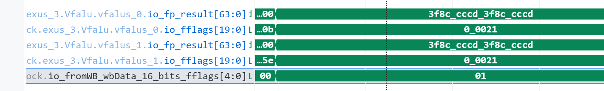

当前波形的 `0x00021` 表示两个低 lane 的 NX 位均为 1（bit0 和 bit5），不是一个名为 `0x21` 的单独 flag。写回包里 `fflags=0x1` 是架构 5 位 flags 聚合后 NX=1。若某 lane 被 mask 掉，结果与 flags 的行为要结合 mask policy 和 VFALU/MGU 的有效 lane 策略判断，不能把 inactive lane 的中间加法结果当作架构可见结果。

## 7. 舍入模式与对结果的影响

向量 FP 动态舍入模式来自 `frm`，不是 `vcsr.vxrm`。编码为：

| `frm` | 名称 | 规则 |
|---:|---|---|
| `000` | RNE | 最近值；中点取偶数 |
| `001` | RTZ | 向零 |
| `010` | RDN | 向负无穷 |
| `011` | RUP | 向正无穷 |
| `100` | RMM | 最近值；中点取最大幅值 |

用户给定程序启动阶段 `csrwi fcsr,0`，将 `frm=000`。`vfadd.vv` 的编码中使用动态舍入时，VectorFloatAdder 收到此 `frm`。`csrwi vcsr,0` 配置的是向量定点 `vxrm/vxsat` 状态，与浮点舍入无关。
查看舍入模式传递时，以下全名把译码/分发控制与执行端输入连起来：

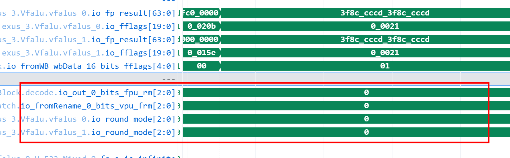

lane 内舍入决策和结果对应的全名见 6.3 中 `lgs_normal_reg_r`、`far_case_normal_round_up_reg_r`、`io_fp_c` 与 `io_fflags`。

当前两个 FP32 位型的精确和为 `1.10000000149011611938...`，位于相邻 FP32 数 `0x3f8ccccc` 与 `0x3f8ccccd` 之间且更靠近上方值。因而当前 RNE 结果是 `0x3f8ccccd`；RTZ/RDN 对正结果取下方 `0x3f8ccccc`，RUP 取上方，RMM 与 RNE 一样取最近上方。四 lane 输入相同，结果也相同。该样例不是中点，不能区分 RNE 与 RMM 的 tie 规则。

## 8. 写回与提交：结果如何成为架构状态

### 8.1 执行输出和写回

VFALU 把两个切片结果重新组织成向量写回数据，并携带控制信息/异常 flags。观察 `Vfalu.io_out_valid`、输出 ROB、结果数据和 flags，再看 `backend.inner_ctrlBlock.io_fromWB_wbData_16`。
本次执行输出与写回仲裁的信号：

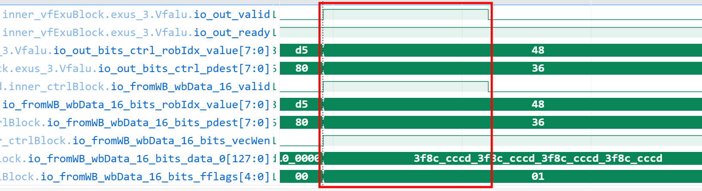

本次约 8489 ps 写回有效，`robIdx=0x48`、`vecWen=1`、`fflags=0x1`；每个 lane 是 `0x3f8ccccd`。执行结果写入推测态向量物理寄存器 `pdest=0x36`，唤醒依赖它的后续 uop；写回不是提交。

### 8.2 ROB 完成与按序提交

ROB 按程序顺序等待本条指令完成。当目标项到达队首且没有异常/flush 等阻碍后，才能提交。约 8492 ps 的 ROB commit metadata slot 0 显示 PC=`0x80000172`、instr=`0x021111d7`、vector write enable 有效和 NX 标志。*一定要同时检查对应 `commitValid_0`*；metadata 可能保留旧值，只有 valid 才说明实际提交。
slot 0 的提交信号：

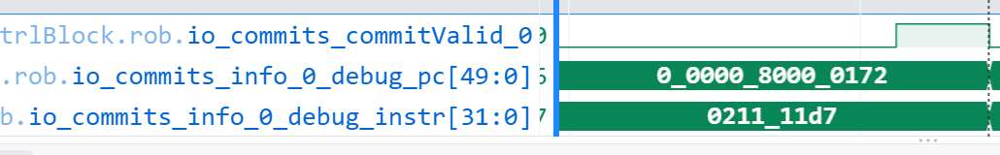

当前这条加法本身不访问 LSQ/DCache。下条 `vse32.v`（`0x80000176`）才把寄存器结果写进内存。

## 9. 总结

目标 `vfadd.vv` 从 Decode 被识别为向量浮点加法，Rename/Dispatch 后进入向量浮点队列，操作数收集完成后在约 8488 ps 进入 VFALU。VFALU 并没有把 128 位寄存器视为一个巨型浮点数，而是分发成两个 64 位切片、共四个 FP32 lane。每 lane 独立做特殊值检查、指数对齐、有效数运算、规格化、舍入和 flags 产生；VFALU 再合并 lane 结果和标志并写回向量物理寄存器，ROB 最后按序提交。

本次实际数据为 `1.0f + 0.1f`，结果每 lane `0x3f8ccccd`，NX=1。波形没有跑特殊值用例；NaN/Inf/zero/subnormal/overflow 的语义与实现路径已按当前 Yunsuan 源码分析。当前 FP32 far/close datapath 的 UF 输出保持默认 0，与 IEEE/RISC-V 对 tiny-and-inexact 的 UF 语义存在差异；需结合工程采用的版本历史、测试结果和维护说明进一步判断。


