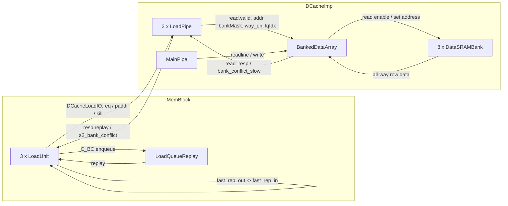
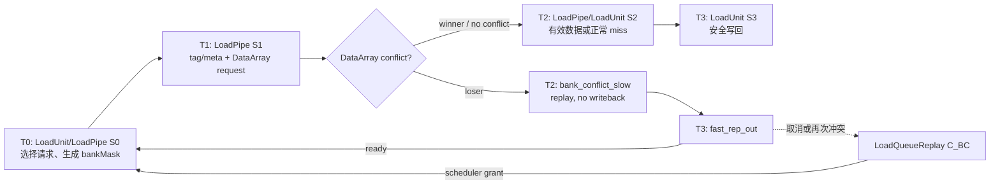

# 香山昆明湖 V2 L1 DCache Bank Conflict 原理与源码分析

## 1. 分析范围与结论

### 1.1 分析基线

| 项目 | 本文采用的基线 |
| --- | --- |
| XiangShan 上游 | `https://github.com/OpenXiangShan/XiangShan.git` |
| 本地源码目录 | `/nfs/home/yanyusong/cache-conflict-env/XiangShan` |
| 分支 | `kunminghu-v2` |
| Commit | `485333f4dcc90156e5ada3d6420abeaad0058d22` |
| 顶层配置 | `top.KunminghuV2Config` |
| 目标模块 | L1 DCache 的 `BankedDataArray`、`LoadPipe`、`LoadUnit` 和 `LoadQueueReplay` |
| Design Doc baseline | 未使用。本文不把设计文档或注释当成有效实现证据 |
| 分析方法 | 静态阅读有效 Scala/Chisel 源码；未运行 EMU/FST，因此本文时序图是源码推导图，不是实测波形 |
| Weekly sync | 技能包的 7 天保护检查已执行；结果为 `skip: last sync 0.02 days ago < 7 days` |

本文使用 `xiangshan-code-analyzer` 的分析规范，区分以下三层：

1. **原理层**：bank conflict 是超标量多发射处理器中的结构冲突，即同一周期的请求数超过物理端口可服务能力。
2. **设计意图层**：让能够继续执行的请求使用 SRAM，把其他请求恢复为可重试状态，避免错误数据进入写回。
3. **有效代码层**：本文所有行为结论均由当前 commit 中实际实例化的模块、连接、寄存器和仲裁逻辑证明。

### 1.2 一句话结论

在当前昆明湖 V2 L1 DCache 中，**纯 bank conflict 是一次可恢复的微架构结构冲突，不是 cache miss，也不是体系结构异常**：

- 同周期 load-load 冲突时，`BankedDataArray` 在冲突参与者中选择 `LqPtr` 最老的请求；winner 真正读取 SRAM，loser 的物理读使能被屏蔽。
- loser 并不留在 DataArray 入口原地等待，而是在下一拍收到 `bank_conflict_slow`，由 `LoadPipe` 把响应标成 `replay`。
- `LoadUnit` 首选本地 fast replay 回环；如果 fast replay 被取消，或已经是 fast replay 的请求再次冲突，则进入 `LoadQueueReplay`，以 `C_BC` 原因等待再次发射。
- 纯 bank conflict 不会单独申请 MSHR，不会向 L2 制造一次“假 miss”，不会产生 ROB/Frontend redirect，也不会允许冲突拍的无效数据写回。
- 与 MainPipe 整行读取冲突时 MainPipe 获胜；与 DataArray 写入冲突时写入获胜，load 通过 `ready`/nack 加 replay 恢复。

## 2. Theory-to-Code Mapping

### 2.1 为什么这是结构冲突

昆明湖默认有 3 条 load pipeline，但 L1D data array 的每个 bank 是单端口 SRAM。若多个 load 同周期需要同一 bank 的**不同 set 地址**，该 bank 无法同时给出两个 SRAM 行，因此必须选择一个地址并恢复其他请求。这不是 RAW/WAR/WAW 数据相关，也不是分支控制冲突，而是物理端口不足产生的结构冲突。

| 理论概念 | 有效代码对象 | 代码中的具体实现 |
| --- | --- | --- |
| 多发射请求 | `LoadPipelineWidth = 3` | 三个 `LoadPipe` 可同周期向 data array 发请求 |
| 有限结构资源 | `DataSRAMBank` | 每个 bank、每个 way 使用 `singlePort = true` 的 SRAM |
| 冲突检测 | `rr_bank_conflict` | `valid`、相同 div、`bankMask` 相交、set 不同 |
| 冲突仲裁 | `selcetOldestPort` | 使用带环回 flag 的 `LqPtr` 选择最老请求 |
| loser 恢复 | `bank_conflict_slow`、`resp.replay` | 下一拍把失败请求转为 replay |
| 快速恢复 | `fast_rep_out <> fast_rep_in` | 同一 LoadUnit 本地回环重发 |
| 持久恢复 | `LoadQueueReplay` | `C_BC` entry 立即解除 blocking，之后按优先级和年龄调度 |

### 2.2 Who / Why / How / From / To

| 模块/所有者 | Who | Why | How | From what | To what |
| --- | --- | --- | --- | --- | --- |
| `DCacheImp` | L1D 顶层，拥有 `BankedDataArray` 和 3 个 `LoadPipe` | 汇聚 load、MainPipe 整行读和写端口 | `<>` 连接请求/响应，传递冲突和快唤醒禁止信号 | `DCacheLoadIO`、MainPipe | DataArray、各 LoadPipe |
| `BankedDataArray` | 数据阵列与冲突仲裁所有者 | 保护单端口 SRAM，避免一个 bank 同拍访问两个 set | 地址切片、冲突矩阵、LQ 年龄选择、读地址 mux | 3 个 load read、MainPipe `readline`、write | SRAM read enable/data、`bank_conflict_slow` |
| `LoadPipe` | 每个 DCache load 端口的 S0-S3 流水 | 将 tag/data 访问结果转成 hit/miss/replay 响应 | S0 bank mask，S1 data request，S2 replay/miss 响应 | LoadUnit 请求、DataArray 响应 | `DCacheWordResp`、`s2_bank_conflict` |
| `LoadUnit` | MemBlock 中每条 load 执行流水 | 合并 TLB、forward、DCache 和 LSQ 状态，决定完成还是重发 | 屏蔽 full-forward/NC，生成 `C_BC`，选择 fast/slow replay | DCache response、LSQ/SBuffer/MSHR forward | 写回、fast replay、LSQ replay enqueue |
| `LoadQueueReplay` | LSQ 内的持久 replay 存储 | fast replay 不能使用或再次失败时保存请求，防止丢失 | free-list 分配、cause/blocked 状态、优先级与年龄选择 | `LoadUnit.io.lsq.ldin` | `LoadUnit.io.replay` |

## 3. 有效配置、地址索引与物理存储

### 3.1 KunminghuV2Config 的实际 L1D 参数

源码路径：`src/main/scala/top/Configs.scala`，L258-L276、L460-L485。

```scala
case class WithNKBL1D(n: Int, ways: Int = 8) extends Config((site, here, up) => {
  case XSTileKey =>
    val sets = n * 1024 / ways / 64
    up(XSTileKey).map(_.copy(
      dcacheParametersOpt = Some(DCacheParameters(
        nSets = sets,
        nWays = ways,
        tagECC = Some("secded"),
        dataECC = Some("secded"),
        replacer = Some("setplru"),
        nMissEntries = 16,
        nProbeEntries = 8,
        nReleaseEntries = 18,
        nMaxPrefetchEntry = 6,
        enableTagEcc = true,
        enableDataEcc = true
      ))
    ))
})

class DefaultConfig(n: Int = 1) extends Config(
  L3CacheConfig("16MB", inclusive = false, banks = 4, ways = 16)
    ++ L2CacheConfig("1MB", inclusive = true, banks = 4)
    ++ WithNKBL1D(64, ways = 4)
    ++ new BaseConfig(n)
)

class KunminghuV2Config(n: Int = 1) extends Config(
  L2CacheConfig("1MB", inclusive = true, banks = 4, tp = false)
    ++ new DefaultConfig(n)
    ++ new WithCHI
)
```

`WithNKBL1D` 没有覆盖 `blockBytes`，因此采用 `DCacheParameters` 的 64 B 默认值。源码路径：`src/main/scala/xiangshan/cache/dcache/DCacheWrapper.scala`，L39-L64。

```scala
case class DCacheParameters
(
  nSets: Int = 128,
  nWays: Int = 8,
  rowBits: Int = 64,
  tagECC: Option[String] = None,
  dataECC: Option[String] = None,
  replacer: Option[String] = Some("setplru"),
  updateReplaceOn2ndmiss: Boolean = true,
  nMissEntries: Int = 1,
  nProbeEntries: Int = 1,
  nReleaseEntries: Int = 1,
  nMMIOEntries: Int = 1,
  nMMIOs: Int = 1,
  blockBytes: Int = 64,
  nMaxPrefetchEntry: Int = 1,
  alwaysReleaseData: Boolean = false,
  isKeywordBitsOpt: Option[Boolean] = Some(true),
  enableDataEcc: Boolean = false,
  enableTagEcc: Boolean = false
) extends L1CacheParameters {
  val setBytes = nSets * blockBytes
  val aliasBitsOpt = if(setBytes > pageSize) Some(log2Ceil(setBytes / pageSize)) else None
}
```

由 `sets = 64 * 1024 / 4 / 64` 可得：

| 参数 | 有效值 | 推导或来源 |
| --- | ---: | --- |
| L1D 容量 | 64 KiB | `WithNKBL1D(64, ways = 4)` |
| cache line | 64 B | `DCacheParameters.blockBytes` |
| ways | 4 | 顶层配置 |
| sets | 256 | `64 KiB / 4 way / 64 B` |
| load pipelines | 3 | `XSCoreParameters.LoadPipelineWidth = 3` |
| LoadQueueReplay entries | 72 | `XSCoreParameters.LoadQueueReplaySize` |
| miss entries | 16 | `WithNKBL1D` |
| data WPU | 默认关闭 | `dwpuParameters.enWPU = false` |

源码路径：`src/main/scala/xiangshan/Parameters.scala`，L214-L216、L260-L265。

```scala
LoadPipelineWidth: Int = 3,
StorePipelineWidth: Int = 2,

dwpuParameters: WPUParameters = WPUParameters(
  enWPU = false,
  algoName = "mmru",
  enCfPred = false,
  isICache = false,
),
```

因此 `DCacheImp` 的有效实例是 `BankedDataArray`，不是 `SramedDataArray`。

源码路径：`src/main/scala/xiangshan/cache/dcache/DCacheWrapper.scala`，L1017-L1024。

```scala
// core data structures
val bankedDataArray = if(dwpuParam.enWPU) Module(new SramedDataArray) else Module(new BankedDataArray)
val metaArray = Module(new L1CohMetaArray(readPorts = LoadPipelineWidth + 1, writePorts = 1))
val errorArray = Module(new L1ErrorMetaArray(readPorts = LoadPipelineWidth + 1, writePorts = 1, enableBypass = true))
val tagArray = Module(new DuplicatedTagArray(readPorts = TagReadPort))
```

若显式开启 D-WPU，代码会改用同文件中的 `SramedDataArray`；其 load-load 冲突条件额外要求 `way_en` 相同。本文后续默认分析标准 `enWPU=false` 路径。

### 3.2 Bank、set 和 byte offset 如何计算

源码路径：`src/main/scala/xiangshan/cache/dcache/DCacheWrapper.scala`，L126-L156、L213-L230。

```scala
val DCacheSetDiv = 1
val DCacheSets = cacheParams.nSets
val DCacheWays = cacheParams.nWays
val DCacheBanks = 8 // hardcoded
val DCacheSRAMRowBits = cacheParams.rowBits // hardcoded
require(DCacheSRAMRowBits == 64)

val DCacheSRAMRowBytes = DCacheSRAMRowBits / 8
val DCacheBankOffset = log2Up(DCacheSRAMRowBytes)
val DCacheSetOffset = DCacheBankOffset + log2Up(DCacheBanks)
val DCacheAboveIndexOffset = DCacheSetOffset + log2Up(DCacheSets)

def addr_to_dcache_bank(addr: UInt) = {
  require(addr.getWidth >= DCacheSetOffset)
  addr(DCacheSetOffset-1, DCacheBankOffset)
}

def addr_to_dcache_div_set(addr: UInt) = {
  require(addr.getWidth >= DCacheAboveIndexOffset)
  addr(DCacheAboveIndexOffset - 1, DCacheSetOffset + DCacheSetDivBits)
}
```

有效值为：

```text
data-array address
+-----------------------+----------------+-------------+-------------+
|       higher bits     | set [13:6]     | bank [5:3]  | byte [2:0]  |
+-----------------------+----------------+-------------+-------------+
```

- 每个 SRAM row 是 64 bit，即 8 B，所以 `DCacheBankOffset = log2(8) = 3`。
- 8 个 bank 需要 3 bit，所以 `DCacheSetOffset = 3 + 3 = 6`。
- 256 set 需要 8 bit，所以 data-array set 是 `[13:6]`。
- 64 B cache line 正好由 8 个 8 B bank 组成。
- 地址每增加 8 B 切换到下一个 bank；每增加 64 B 回到同一个 bank、进入下一个 set。

| 地址 | set | bank | 结果 |
| --- | ---: | ---: | --- |
| `0x1000` | 64 | 0 | 基准请求 |
| `0x1008` | 64 | 1 | 与 `0x1000` 不冲突 |
| `0x1040` | 65 | 0 | 与 `0x1000` 同 bank、不同 set，构成冲突 |
| `0x2000` | 128 | 0 | 与 `0x1000` 同 bank、不同 set，构成冲突 |

### 3.3 普通请求与 128-bit 请求的 bank mask

源码路径：`src/main/scala/xiangshan/cache/dcache/loadpipe/LoadPipe.scala`，L137-L146。

```scala
val s0_valid = io.lsu.req.fire
val s0_req = WireInit(io.lsu.req.bits)
s0_req.vaddr := Mux(io.load128Req,
  Cat(io.lsu.req.bits.vaddr(io.lsu.req.bits.vaddr.getWidth - 1, 4), 0.U(4.W)),
  io.lsu.req.bits.vaddr)
val s0_vaddr = s0_req.vaddr
val s0_load128Req = io.load128Req
val s0_bank_oh_64 = UIntToOH(addr_to_dcache_bank(s0_vaddr))
val s0_bank_oh_128 = (s0_bank_oh_64 << 1.U).asUInt | s0_bank_oh_64.asUInt
val s0_bank_oh = Mux(s0_load128Req, s0_bank_oh_128, s0_bank_oh_64)
```

非 128-bit 请求不论实际是 byte、half、word 还是 doubleword，data array 都读取地址所在的一个 8 B bank row。128-bit 请求先按 16 B 对齐，再将 one-hot mask 左移一位并与原 mask 相或，因此访问相邻两个 bank：`0/1`、`2/3`、`4/5` 或 `6/7`。

### 3.4 为什么“同 bank、同 set”可以共享

源码路径：`src/main/scala/xiangshan/cache/dcache/data/BankedDataArray.scala`，L163-L210。

```scala
class DataSRAMBank(index: Int)(implicit p: Parameters) extends DCacheModule {
  val io = IO(new Bundle() {
    val w = Input(new DataSRAMBankWriteReq)
    val r = new Bundle() {
      val en = Input(Bool())
      val addr = Input(UInt())
      val data = Output(Vec(DCacheWays, UInt(encDataBits.W)))
    }
  })

  val data_bank = Seq.fill(DCacheWays) {
    Module(new SRAMTemplate(
      Bits(encDataBits.W),
      set = DCacheSets / DCacheSetDiv,
      way = 1,
      shouldReset = false,
      holdRead = false,
      singlePort = true,
      withClockGate = EnableClockGate,
      hasMbist = hasMbist,
      hasSramCtl = hasSramCtl,
      suffix = Some("dcsh_dat")
    ))
  }

  for (w <- 0 until DCacheWays) {
    val wen = w_info.en && w_info.way_en(w)
    data_bank(w).io.w.req.valid := wen
    data_bank(w).io.w.req.bits.apply(setIdx = w_info.addr, data = w_info.data, waymask = 1.U)
    data_bank(w).io.r.req.valid := io.r.en
    data_bank(w).io.r.req.bits.apply(setIdx = io.r.addr)
  }

  io.r.data := data_bank.map(_.io.r.resp.data(0))
}
```

一个 bank 内有 4 个单端口 way SRAM，但它们共享同一个 `r.addr`，一次读取会取得该 set 的全部 way。于是两个 load 若 bank 和 set 都相同，即使物理 tag 最后命中不同 way，也能共享一次 SRAM 行读取；只有当它们需要同一 bank 的两个不同 set 地址时，才发生真正的 read-read bank conflict。

## 4. 模块接口与流水级

### 4.1 模块连接



源码路径：`src/main/scala/xiangshan/cache/dcache/DCacheWrapper.scala`，L1323-L1340、L1378-L1393。

```scala
bankedDataArray.io.readline <> mainPipe.io.data_readline
bankedDataArray.io.readline_intend := mainPipe.io.data_read_intend
mainPipe.io.data_resp := bankedDataArray.io.readline_resp

(0 until LoadPipelineWidth).map(i => {
  bankedDataArray.io.read(i) <> ldu(i).io.banked_data_read
  bankedDataArray.io.is128Req(i) <> ldu(i).io.is128Req
  bankedDataArray.io.read_error_delayed(i) <> ldu(i).io.read_error_delayed
  ldu(i).io.banked_data_resp := bankedDataArray.io.read_resp(i)
  ldu(i).io.bank_conflict_slow := bankedDataArray.io.bank_conflict_slow(i)
})

for (w <- 0 until LoadPipelineWidth) {
  ldu(w).io.lsu <> io.lsu.load(w)
  ldu(w).io.load128Req := io.lsu.load(w).is128Req
  ldu(w).io.disable_ld_fast_wakeup :=
    bankedDataArray.io.disable_ld_fast_wakeup(w)
}
```

### 4.2 S0-S3 流水级地图

| 阶段 | 主要工作 | 关键状态/索引 | stall、kill 或 replay | 输出 |
| --- | --- | --- | --- | --- |
| LoadUnit S0 / LoadPipe S0 | 从 misalign、fast replay、LSQ replay、issue 等源中选一个；生成 DCache 请求和 bank mask | vaddr、`lqIdx`、`bank_oh` | DCache `req.ready`、更高优先级源可阻止选中 | meta/tag 请求；S1 payload |
| LoadUnit S1 / LoadPipe S1 | TLB 产生 paddr；tag/meta 比较；向 data array 发读请求 | `s1_vaddr`、paddr、预测/真实 way、bank mask | TLB miss、异常、misalign 可 kill data read | `banked_data_read` |
| BankedDataArray 组合逻辑 | 计算 bank/set/div；检测 read-read、read-line、read-write 冲突；选择 SRAM 地址 | `bank_addrs`、`set_addrs`、`rr_bank_conflict_oldest` | loser 被 mask；write 冲突使 `ready=0` | SRAM read enable；下一拍 conflict 标志 |
| LoadPipe S2 / LoadUnit S2 | 接收数据与 conflict；区分 miss、nack、forward、NC；生成 replay cause | `real_miss`、`replayCarry`、`rep_info.C_BC` | conflict、miss、TLB/forward 等原因 | 正常结果或 fast/slow replay 决策 |
| LoadUnit S3 | 正常 load 写回；冲突 load 输出 fast replay 或进入 LSQ | `s3_fast_rep`、`s3_safe_writeback` | redirect kill、fast replay cancel、LSQ path | PRF 写回、`fast_rep_out` 或 `lsq.ldin` |
| LoadQueueReplay | 保存不能立即完成的请求，按原因和年龄重发 | free-list index、`allocated/scheduled/blocking/cause` | cold-down、redirect、replay 下游 `ready`；full 触发容量断言 | `io.replay` 回到 LoadUnit S0 |

### 4.3 S1 发给 DataArray 的实际负载

源码路径：`src/main/scala/xiangshan/cache/dcache/loadpipe/LoadPipe.scala`，L305-L317。

```scala
val (s1_has_permission, s1_shrink_perm, s1_new_hit_coh) = s1_hit_coh.onAccess(s1_req.cmd)
val s1_hit = s1_tag_match_dup_dc && s1_has_permission && s1_hit_coh === s1_new_hit_coh
val s1_will_send_miss_req = s1_valid && !s1_nack && !s1_hit

// data read
io.banked_data_read.valid := s1_fire && !s1_nack && !s1_is_prefetch && !io.lsu.s1_kill_data_read
io.banked_data_read.bits.addr := s1_vaddr
io.banked_data_read.bits.addr_dup := s1_vaddr_dup
io.banked_data_read.bits.kill := io.lsu.s1_kill_data_read
io.banked_data_read.bits.way_en := s1_pred_tag_match_way_dup_dc
io.banked_data_read.bits.bankMask := s1_bank_oh
io.banked_data_read.bits.lqIdx := s1_req.lqIdx
io.is128Req := s1_load128Req
```

`lqIdx` 用于 read-read 冲突的年龄仲裁，`bankMask` 表示请求占用的一个或两个 bank，`way_en` 用于 SRAM 返回后选择命中 way。DataArray 使用 `s1_vaddr` 做 VIPT data index；物理 tag/权限判断仍使用 S1 得到的 paddr 和 tag/meta 响应。

## 5. Load-load 冲突检测与 winner 选择

### 5.1 精确冲突条件

源码路径：`src/main/scala/xiangshan/cache/dcache/data/BankedDataArray.scala`，L703-L748。

```scala
(0 until LoadPipelineWidth).map(rport_index => {
  div_addrs(rport_index) := addr_to_dcache_div(io.read(rport_index).bits.addr)
  bank_addrs(rport_index)(0) := addr_to_dcache_bank(io.read(rport_index).bits.addr)
  bank_addrs(rport_index)(1) := Mux(
    io.is128Req(rport_index),
    bank_addrs(rport_index)(0) + 1.U,
    bank_addrs(rport_index)(0)
  )
  set_addrs(rport_index) := addr_to_dcache_div_set(io.read(rport_index).bits.addr)
})

val rr_bank_conflict = Seq.tabulate(LoadPipelineWidth)(x =>
  Seq.tabulate(LoadPipelineWidth)(y => {
    if (x == y) {
      false.B
    } else {
      io.read(x).valid && io.read(y).valid &&
      div_addrs(x) === div_addrs(y) &&
      (io.read(x).bits.bankMask & io.read(y).bits.bankMask) =/= 0.U &&
      set_addrs(x) =/= set_addrs(y)
    }
  })
)

val load_req_with_bank_conflict = rr_bank_conflict.map(_.reduce(_ || _))
val load_req_lqIdx = io.read.map(_.bits.lqIdx)
val load_req_index = (0 until LoadPipelineWidth).map(_.asUInt)

val load_req_bank_conflict_selcet =
  selcetOldestPort(load_req_with_bank_conflict, load_req_lqIdx, load_req_index)
val load_req_bank_select_port = UIntToOH(load_req_bank_conflict_selcet._2).asBools

val rr_bank_conflict_oldest = (0 until LoadPipelineWidth).map(i =>
  !load_req_bank_select_port(i) && load_req_with_bank_conflict(i)
)
```

当前 `DCacheSetDiv=1`，所以所有请求的 div 都是 0。有效条件可以简化为：

```text
同一周期 valid && bankMask 有交集 && set 不同
```

注意，比较使用 `io.read.valid` 而不是 `fire`。read-read conflict 本身不拉低 `ready`；DataArray 让请求进入流水线，再通过 loser mask 和下一拍 replay 恢复。

### 5.2 为什么 winner 是最老 LQ 请求

源码路径：`src/main/scala/xiangshan/cache/dcache/data/BankedDataArray.scala`，L339-L361。

```scala
def selcetOldestPort(
  valid: Seq[Bool], bits: Seq[LqPtr], index: Seq[UInt]
): ((Bool, LqPtr), UInt) = {
  ParallelOperation(valid zip bits zip index,
    (a: ((Bool, LqPtr), UInt), b: ((Bool, LqPtr), UInt)) => {
      val au = a._1._2
      val bu = b._1._2
      val aValid = a._1._1
      val bValid = b._1._1
      val bSel = au > bu
      val bits = Mux(
        aValid && bValid,
        Mux(bSel, b._1._2, a._1._2),
        Mux(aValid && !bValid, a._1._2, b._1._2)
      )
      val idx = Mux(
        aValid && bValid,
        Mux(bSel, b._2, a._2),
        Mux(aValid && !bValid, a._2, b._2)
      )
      ((aValid || bValid, bits), idx)
    }
  )
}
```

`LqPtr` 不是普通无符号数，而是包含环回 flag 的 circular pointer。源码路径：`utility/src/main/scala/utility/CircularQueuePtr.scala`，L65-L74。

```scala
final def > (that: T): Bool = {
  val differentFlag = this.flag ^ that.flag
  val compare = this.value > that.value
  differentFlag ^ compare
}

final def < (that: T): Bool = {
  val differentFlag = this.flag ^ that.flag
  val compare = this.value < that.value
  differentFlag ^ compare
}
```

当 `a > b` 时选择 `b`，所以 reduction 最终保留较老的 LQ pointer；正常情况下不同动态 load 拥有不同 LQ entry。若指针完全相等，比较为 false，reduction 保留左侧输入，形成确定性的 tie 行为。

这里必须以有效代码为准：`AbstractBankedDataArray` 附近有一条旧注释称冲突时忽略 read port 1，但实际实现不是固定端口 1 输，而是对所有冲突参与者做动态 `LqPtr` 年龄选择。

### 5.3 loser 如何被挡在物理 SRAM 外

源码路径：`src/main/scala/xiangshan/cache/dcache/data/BankedDataArray.scala`，L811-L859。

```scala
val bank_addr_matchs = WireInit(VecInit(List.tabulate(LoadPipelineWidth)(i => {
  io.read(i).valid &&
  div_addrs(i) === div_index.U &&
  (bank_addrs(i)(0) === bank_index.U ||
    bank_addrs(i)(1) === bank_index.U && io.is128Req(i)) &&
  !rr_bank_conflict_oldest(i)
})))

val readline_match = Wire(Bool())
if (ReduceReadlineConflict) {
  readline_match := io.readline.valid &&
    io.readline.bits.rmask(bank_index) &&
    line_div_addr === div_index.U
} else {
  readline_match := io.readline.valid && line_div_addr === div_index.U
}

val bank_set_addr = Mux(
  readline_match,
  line_set_addr,
  PriorityMux(Seq.tabulate(LoadPipelineWidth)(i =>
    bank_addr_matchs(i) -> set_addrs(i)
  ))
)
val read_enable = bank_addr_matchs.asUInt.orR || readline_match

val data_bank = data_banks(div_index)(bank_index)
data_bank.io.r.en := read_enable
data_bank.io.r.addr := bank_set_addr
```

关键是 `!rr_bank_conflict_oldest(i)`：

- winner 的 match 保留，驱动目标 bank 的 set 地址和 `r.en`。
- loser 虽然 Decoupled `fire` 可以为真，但不会为其目标 set 发起物理 SRAM read。
- 与 winner 完全相同 set 的非冲突请求也会 match；`PriorityMux` 选择的 set 值相同，所以它们共享同一行。
- 若三个端口形成链式重叠，例如 128-bit port1 同时与 port0、port2 各重叠一个 bank，当前实现是在所有“参与任一冲突”的端口中只保留一个全局最老者。这比逐 bank 最大匹配更保守，可能多 replay 一个本可并行的端口，但保证正确性。

## 6. 冲突后的完整动作

### 6.1 动作一：冲突当拍不把 load-load loser 反压在 S1

源码路径：`src/main/scala/xiangshan/cache/dcache/data/BankedDataArray.scala`，L750-L778。

```scala
val wr_bank_conflict = Seq.tabulate(LoadPipelineWidth)(x =>
  io.read(x).valid &&
  write_valid_reg &&
  div_addrs(x) === write_div_addr_dup_reg.head &&
  (write_bank_mask_reg(bank_addrs(x)(0)) ||
    write_bank_mask_reg(bank_addrs(x)(1)) && io.is128Req(x))
)

// ready
io.readline.ready := !wrl_bank_conflict
io.read.zipWithIndex.map { case (x, i) =>
  x.ready := !(wr_bank_conflict(i) || rrhazard)
}
```

`io.read.ready` 只受 read-write conflict 和 `rrhazard` 影响，而当前 `rrhazard=false.B`。因此：

- load-load loser 的 `valid && ready` 仍可成立。
- LoadPipe 不在 S1 保持该请求，而是正常进入 S2。
- 正确性由“物理 SRAM 不读 loser 地址”和“S2 标记 replay”共同保证。

read-write conflict 不同：写端口正在占用目标 bank 时，`ready` 会拉低；LoadPipe 仍向 S2 前进，但会记住 `!ready` 形成 `s2_nack_data`，见 6.4。

### 6.2 动作二：冲突类型和 loser 身份寄存一拍

源码路径：`src/main/scala/xiangshan/cache/dcache/data/BankedDataArray.scala`，L750-L778。

```scala
val rrl_bank_conflict = Wire(Vec(LoadPipelineWidth, Bool()))
val rrl_bank_conflict_intend = Wire(Vec(LoadPipelineWidth, Bool()))
(0 until LoadPipelineWidth).foreach { i =>
  val judge = if (ReduceReadlineConflict) {
    io.read(i).valid &&
      (io.readline.bits.rmask & io.read(i).bits.bankMask) =/= 0.U &&
      div_addrs(i) === line_div_addr
  } else {
    io.read(i).valid && div_addrs(i) === line_div_addr
  }
  rrl_bank_conflict(i) := judge && io.readline.valid
  rrl_bank_conflict_intend(i) := judge && io.readline_intend
}

(0 until LoadPipelineWidth).foreach(i => {
  val real_other_bank_conflict_reg = RegNext(
    wr_bank_conflict(i) || rrl_bank_conflict(i)
  )
  val real_rr_bank_conflict_reg = RegNext(rr_bank_conflict_oldest(i))
  io.bank_conflict_slow(i) :=
    real_other_bank_conflict_reg || real_rr_bank_conflict_reg

  io.disable_ld_fast_wakeup(i) :=
    wr_bank_conflict(i) || rrl_bank_conflict_intend(i) ||
    (if (i == 0) 0.B
     else (0 until i).map(rr_bank_conflict(_)(i)).reduce(_ || _))
})
```

`bank_conflict_slow` 是与 LoadPipe S2 对齐的精确信号，来源包括：

1. 当前 load 是 read-read conflict 的 loser。
2. 当前 load 与 MainPipe `readline` 冲突。
3. 当前 load 与写端口冲突。

`disable_ld_fast_wakeup` 是更早的 S1 防护信号，但 read-read 部分按较低端口号关系生成，并不等价于最终基于 LQ 年龄的 `rr_bank_conflict_oldest`。最终正确性还由 LoadUnit S2 的 `!rep_info.need_rep` 门控保证，不能把这个早期信号单独解释为 winner 选择。

### 6.3 动作三：loser 返回数据必须被视为无效

源码路径：`src/main/scala/xiangshan/cache/dcache/data/BankedDataArray.scala`，L889-L904。

```scala
(0 until LoadPipelineWidth).map(i => {
  // 1 cycle after read fire(load s2)
  val r_read_fire = RegNext(io.read(i).fire)
  val r_div_addr = RegEnable(div_addrs(i), io.read(i).fire)
  val r_bank_addr = RegEnable(bank_addrs(i), io.read(i).fire)
  val r_way_addr = RegEnable(OHToUInt(way_en(i)), io.read(i).fire)

  // 2 cycles after read fire(load s3)
  val rr_read_fire = RegNext(r_read_fire)
  val rr_div_addr = RegEnable(RegEnable(div_addrs(i), io.read(i).fire), r_read_fire)
  val rr_bank_addr = RegEnable(RegEnable(bank_addrs(i), io.read(i).fire), r_read_fire)
  val rr_way_addr = RegEnable(RegEnable(OHToUInt(way_en(i)), io.read(i).fire), r_read_fire)

  (0 until VLEN / DCacheSRAMRowBits).map(j => {
    io.read_resp(i)(j) := bank_result(r_div_addr)(r_bank_addr(j))(r_way_addr)
    io.read_error_delayed(i)(j) :=
      rr_read_fire &&
      read_bank_error_delayed(rr_div_addr)(rr_bank_addr(j))(rr_way_addr) &&
      !RegNext(io.bank_conflict_slow(i))
  })
})
```

因为 loser 没有读取自己的 set，`read_resp` 总线上的值可能来自 winner、line read 或保留值，不能作为该 load 的数据。代码通过两层措施保证它不可见：

- S2 `bank_conflict_slow` 使请求 replay，阻止安全 wakeup/writeback。
- 延迟 ECC 错误还显式与 `!RegNext(bank_conflict_slow)` 相与，避免把无效数据解释成该 load 的 data ECC error。

### 6.4 动作四：LoadPipe S2 将冲突编码为 replay，而不是 miss

源码路径：`src/main/scala/xiangshan/cache/dcache/loadpipe/LoadPipe.scala`，L380-L400、L433-L478。

```scala
val s2_can_send_miss_req = RegEnable(s1_will_send_miss_req, s1_fire)
val s2_miss_req_valid = s2_valid && s2_can_send_miss_req
val s2_miss_req_fire = s2_miss_req_valid_dup && io.miss_req.ready

val s2_nack_hit = RegEnable(s1_nack, s1_fire)
val s2_nack_no_mshr = s2_miss_req_valid_dup && !io.miss_req.ready
val s2_nack_wbq_conflict = s2_miss_req_valid_dup && io.wbq_block_miss_req
// Bank conflict on data arrays
val s2_nack_data = RegEnable(!io.banked_data_read.ready, s1_fire)
val s2_nack =
  s2_nack_hit || s2_nack_no_mshr || s2_nack_data || s2_nack_wbq_conflict

// send load miss to miss queue
io.miss_req.valid := s2_miss_req_valid

// send back response
val real_miss = !s2_real_way_en.orR
resp.bits.real_miss := real_miss
resp.bits.miss := real_miss
resp.bits.data := s2_resp_data

resp.bits.replay :=
  (resp.bits.miss && (s2_nack || io.miss_req.bits.cancel)) ||
  io.bank_conflict_slow ||
  s2_wpu_pred_fail ||
  s2_btot_occupy_fail

resp.bits.replayCarry.valid :=
  (resp.bits.miss && (s2_nack || io.miss_req.bits.cancel)) ||
  io.bank_conflict_slow ||
  s2_wpu_pred_fail ||
  s2_btot_occupy_fail
resp.bits.replayCarry.real_way_en := s2_real_way_en
resp.bits.handled :=
  s2_miss_req_fire && !io.miss_req.bits.cancel &&
  !io.wbq_block_miss_req && io.miss_resp.handled
```

这里有一条必须明确的“注释与有效代码差异”：源码在 `real_miss` 前有旧注释 `report a miss if bank conflict is detected`，但实际赋值没有把 `bank_conflict_slow` OR 到 `real_miss`。有效行为是：

- tag/权限 hit 时，`s2_real_way_en.orR=1`，所以纯 conflict 的 `miss=0`。
- `io.miss_req.valid` 只来自 S1 判断出的真正 miss；纯 conflict 不申请 MSHR。
- conflict 单独通过 `resp.bits.replay` 和 `replayCarry.valid` 报给 LSU。
- 若请求本身确实是 miss，同时又出现 data-array conflict，则 miss 路径仍然存在；后续 replay cause 的 `C_DM` 优先级高于 `C_BC`。不能把“纯冲突”和“miss+冲突复合事件”混为一谈。

### 6.5 动作五：LoadUnit 屏蔽已经有正确转发数据的冲突

源码路径：`src/main/scala/xiangshan/mem/pipeline/LoadUnit.scala`，L1250-L1274。

```scala
val s2_dcache_miss = io.dcache.resp.bits.miss &&
                     !s2_fwd_frm_d_chan_or_mshr &&
                     !s2_full_fwd && !s2_in.nc

val s2_mq_nack = io.dcache.s2_mq_nack &&
                 !s2_fwd_frm_d_chan_or_mshr &&
                 !s2_full_fwd && !s2_in.nc

val s2_bank_conflict = io.dcache.s2_bank_conflict &&
                       !s2_fwd_frm_d_chan_or_mshr &&
                       !s2_full_fwd && !s2_in.nc

val s2_wpu_pred_fail = io.dcache.s2_wpu_pred_fail &&
                       !s2_fwd_frm_d_chan_or_mshr &&
                       !s2_full_fwd && !s2_in.nc
```

若 store queue/SBuffer、refill D-channel 或 MSHR 已经完整提供该 load 需要的字节，`s2_full_fwd` 或 `s2_fwd_frm_d_chan_or_mshr` 会屏蔽 data-array conflict。原因是此时 load 的正确值不依赖被冲突屏蔽的 SRAM 读，继续 replay 只会浪费带宽。NC/uncache 请求也不使用这条 L1D data-array 完成路径。

### 6.6 动作六：生成 `C_BC` 并阻止错误 wakeup/writeback

源码路径：`src/main/scala/xiangshan/mem/pipeline/LoadUnit.scala`，L1319-L1336、L1356-L1359、L1423-L1444、L1466-L1475。

```scala
// fast replay require
val s2_dcache_fast_rep =
  s2_mq_nack || !s2_dcache_miss && (s2_bank_conflict || s2_wpu_pred_fail)

val s2_fast_rep =
  !s2_in.isFastReplay &&
  !s2_mem_amb &&
  !s2_tlb_miss &&
  !s2_fwd_fail &&
  (s2_dcache_fast_rep || s2_nuke_fast_rep) &&
  s2_troublem

val s2_dcache_no_query =
  !s2_dcache_miss && (s2_bank_conflict || s2_wpu_pred_fail)
val s2_can_query = !(s2_dcache_no_query || s2_in.rep_info.nuke) && s2_troublem

s2_out.rep_info.dcache_miss   := s2_dcache_miss && s2_troublem
s2_out.rep_info.bank_conflict := s2_bank_conflict && s2_troublem
s2_out.rep_info.rep_carry     := io.dcache.resp.bits.replayCarry

val s2_safe_wakeup =
  !s2_out.rep_info.need_rep &&
  !s2_mmio &&
  (!s2_in.nc || s2_nc_with_data) &&
  !s2_mis_align &&
  !s2_real_exception
val s2_safe_writeback = s2_real_exception || s2_safe_wakeup || s2_vp_match_fail

val s1_fast_uop_valid = WireInit(false.B)
s1_fast_uop_valid :=
  !io.dcache.s1_disable_fast_wakeup &&
  s1_valid && !s1_kill &&
  !io.tlb.resp.bits.miss &&
  !io.lsq.forward.dataInvalidFast
io.fast_uop.valid :=
  GatedValidRegNext(s1_fast_uop_valid) &&
  (s2_valid && !s2_out.rep_info.need_rep && !s2_uncache &&
    !(s2_prf && !s2_hw_prf)) &&
  !s2_isvec && !s2_frm_mabuf
```

这里同时解决三个问题：

1. `rep_info.bank_conflict=1` 将原因编码为 `C_BC` 候选。
2. `s2_safe_wakeup=0`，因此依赖该 load 的指令不会把冲突拍数据当成已就绪值。
3. `s2_safe_writeback=0`，S3 不会向物理寄存器写回 loser 数据。

`s2_dcache_no_query` 还避免纯 bank conflict 为 RAR/RAW 依赖检查额外占用查询端口，因为该 load 本拍本来就不会完成。

### 6.7 动作七：首选本地 fast replay

源码路径：`src/main/scala/xiangshan/mem/pipeline/LoadUnit.scala`，L1535-L1545、L1691-L1714、L1813-L1817；`src/main/scala/xiangshan/mem/MemBlock.scala`，L879-L886。

```scala
// LoadUnit S3
val s3_valid = GatedValidRegNext(
  s2_valid && !s2_out.isHWPrefetch && !s2_out.uop.robIdx.needFlush(io.redirect)
)
val s3_in = RegEnable(s2_out, s2_fire)
val s3_dcache_rep = RegEnable(s2_dcache_fast_rep && s2_troublem, false.B, s2_fire)
val s3_fast_rep = Wire(Bool())

s3_fast_rep := RegNext(s2_fast_rep)
io.ldCancel.ld2Cancel := s3_valid && !s3_safe_wakeup && !s3_isvec

// s3 load fast replay
io.fast_rep_out.valid := s3_valid && s3_fast_rep
io.fast_rep_out.bits := s3_in
io.fast_rep_out.bits.lateKill := s3_rep_frm_fetch
io.fast_rep_out.bits.delayedLoadError := s3_hw_err
```

```scala
// MemBlock: each LoadUnit's local loop
loadUnits(i).io.fast_rep_in <> loadUnits(i).io.fast_rep_out

// dcache access
loadUnits(i).io.dcache <> dcache.io.lsu.load(i)
```

fast replay 回到 LoadUnit S0 时优先级高于普通 LSQ replay、RS 新发射和 prefetch，仅低于 misalign buffer 与 `forward_tlDchannel` 的 super replay。它携带原请求的 paddr，因此不重新查 TLB。

源码路径：`src/main/scala/xiangshan/mem/pipeline/LoadUnit.scala`，L290-L340、L790-L849。

```scala
private val Seq(
  mab_idx, super_rep_idx, fast_rep_idx, lsq_rep_idx, high_pf_idx,
  vec_iss_idx, int_iss_idx, mmio_idx, nc_idx, l2l_fwd_idx, low_pf_idx
) = (0 until SRC_NUM).toSeq

val s0_src_valid_vec = WireInit(VecInit(Seq(
  io.misalign_ldin.valid,
  io.replay.valid && io.replay.bits.forward_tlDchannel,
  io.fast_rep_in.valid,
  io.replay.valid && !io.replay.bits.forward_tlDchannel && !s0_rep_stall,
  io.prefetch_req.valid && io.prefetch_req.bits.confidence > 0.U,
  io.vecldin.valid,
  io.ldin.valid,
  io.lsq.uncache.valid,
  io.lsq.nc_ldin.valid,
  io.l2l_fwd_in.valid,
  io.prefetch_req.valid && io.prefetch_req.bits.confidence === 0.U
)))

val s0_tlb_no_query =
  s0_hw_prf_select || s0_sel_src.prf_i ||
  s0_src_select_vec(fast_rep_idx) ||
  s0_src_select_vec(mmio_idx) ||
  s0_src_select_vec(nc_idx)

s0_out.paddr := Mux(
  s0_src_select_vec(nc_idx), io.lsq.nc_ldin.bits.paddr,
  Mux(s0_src_select_vec(fast_rep_idx), io.fast_rep_in.bits.paddr,
    Mux(s0_src_select_vec(int_iss_idx) && s0_sel_src.prf_i, 0.U,
      io.prefetch_req.bits.paddr)))
s0_out.tlbNoQuery := s0_tlb_no_query

io.fast_rep_in.ready :=
  s0_can_go && io.dcache.req.ready && s0_src_ready_vec(fast_rep_idx)
```

fast replay 的“快”是避免分配 Replay Queue entry、避免重新做 TLB 查询，并从高优先级 S0 源直接重进 DCache；它仍然必须重新经过 DCache tag/data 流水，不能绕过物理 bank 端口。

### 6.8 动作八：fast replay 不能使用时进入 LoadQueueReplay

源码路径：`src/main/scala/xiangshan/mem/pipeline/LoadUnit.scala`，L1576-L1604、L1614-L1635。

```scala
val s3_fast_rep_canceled =
  io.replay.valid && io.replay.bits.forward_tlDchannel ||
  io.misalign_ldin.valid ||
  !io.dcache.req.ready

val s3_can_enter_lsq_valid =
  s3_valid && (!s3_fast_rep || s3_fast_rep_canceled) && !s3_in.feedbacked
io.lsq.ldin.valid := s3_can_enter_lsq_valid
io.lsq.ldin.bits := s3_in
io.lsq.ldin.bits.dcacheRequireReplay := s3_dcache_rep

val s3_lrq_rep_info = WireInit(s3_in.rep_info)
val s3_lrq_sel_rep_cause = PriorityEncoderOH(s3_lrq_rep_info.cause.asUInt)
val s3_replayqueue_rep_cause = WireInit(0.U.asTypeOf(s3_in.rep_info.cause))

when (s3_rep_frm_fetch || s3_frm_mabuf) {
  s3_replayqueue_rep_cause := 0.U.asTypeOf(s3_lrq_rep_info.cause.cloneType)
}.otherwise {
  s3_replayqueue_rep_cause := VecInit(s3_lrq_sel_rep_cause.asBools)
}
io.lsq.ldin.bits.rep_info.cause := s3_replayqueue_rep_cause

// Int load, if hit, will be writebacked at s3
s3_out.valid := s3_valid && s3_safe_writeback && !toMisalignBufferValid
```

以下情况不再走当前 fast replay：

- 更高优先级 `forward_tlDchannel` replay 或 misalign 请求占用 S0。
- DCache `req.ready=0`。
- 当前请求本身已经是 `isFastReplay`；`s2_fast_rep` 的第一项会禁止 fast replay 连续自环。因此第二次 bank conflict 会进入 Replay Queue，避免无限组合/本地重试链。
- 同一请求还有更高优先级的 replay cause，`PriorityEncoderOH` 会选编码更低的原因。

## 7. MainPipe、写端口和复合冲突

### 7.1 Load 与 MainPipe readline

`BankedDataArray` 中 `ReduceReadlineConflict=false`，且 `DCacheSetDiv=1`。因此只要 MainPipe 发出 `readline.valid`，每个有效 load 的 div 都与其相同，所有并发 load data read 都被标为 `rrl_bank_conflict`。在 SRAM 地址 mux 中，`readline_match` 又明确优先于 load 的 `PriorityMux`，所以 MainPipe 获胜，load 下一拍 replay。

MainPipe 是否读取 data array 由 `banked_need_data` 明确决定。源码路径：`src/main/scala/xiangshan/cache/dcache/mainpipe/MainPipe.scala`，L283-L299、L826-L830。

```scala
val store_need_data = !s0_req.probe && s0_req.isStore && banked_store_rmask.orR
val probe_need_data = s0_req.probe
val amo_need_data = !s0_req.probe && s0_req.isAMO
val miss_need_data = s0_req.miss
val replace_need_data = s0_req.replace

val banked_need_data =
  store_need_data || probe_need_data || amo_need_data ||
  miss_need_data || replace_need_data

val s0_banked_rmask = Mux(store_need_data, banked_store_rmask,
  Mux(probe_need_data || amo_need_data || miss_need_data || replace_need_data,
    banked_full_rmask,
    banked_none_rmask
  ))

io.data_read_intend := s1_valid && s1_need_data
io.data_readline.valid := s1_valid && s1_need_data
io.data_readline.bits.rmask := s1_banked_rmask
io.data_readline.bits.way_en := s1_way_en
io.data_readline.bits.addr := s1_req.vaddr
```

所以整行/多 bank 读取覆盖 partial-store read-modify-write、probe、AMO、miss 和 replacement 等 MainPipe 情形。本文证明的是 data-array 端口仲裁；不同 source 在 MainPipe 后续阶段的语义仍各自独立。

### 7.2 Load 与 write

写请求先寄存 `wmask/data/valid/way/set/div`，之后按 bank 产生实际写使能。

源码路径：`src/main/scala/xiangshan/cache/dcache/data/BankedDataArray.scala`，L691-L701、L758-L767、L936-L949。

```scala
val write_bank_mask_reg = RegEnable(io.write.bits.wmask, io.write.valid)
val write_data_reg = RegEnable(io.write.bits.data, io.write.valid)
val write_valid_reg = RegNext(io.write.valid)

val wr_bank_conflict = Seq.tabulate(LoadPipelineWidth)(x =>
  io.read(x).valid &&
  write_valid_reg &&
  div_addrs(x) === write_div_addr_dup_reg.head &&
  (write_bank_mask_reg(bank_addrs(x)(0)) ||
    write_bank_mask_reg(bank_addrs(x)(1)) && io.is128Req(x))
)

io.read.zipWithIndex.map { case (x, i) =>
  x.ready := !(wr_bank_conflict(i) || rrhazard)
}

for (div_index <- 0 until DCacheSetDiv) {
  for (bank_index <- 0 until DCacheBanks) {
    val wen_reg =
      write_bank_mask_reg(bank_index) &&
      write_valid_dup_reg(bank_index) &&
      write_div_addr_dup_reg(bank_index) === div_index.U &&
      RegNext(io.write.valid, false.B)
    val data_bank = data_banks(div_index)(bank_index)
    data_bank.io.w.en := wen_reg
    data_bank.io.w.way_en := write_wayen_dup_reg(bank_index)
    data_bank.io.w.addr := write_set_addr_dup_reg(bank_index)
    data_bank.io.w.data := asECCData(write_ecc_reg, write_data_reg(bank_index))
  }
}
```

当前只有一个 div，所以 read-write 判断实质上只看 write mask 是否覆盖 load 的一个或两个 bank，不比较 set。原因是底层 SRAM 单端口，某个 bank 同拍正在写任意 set 时，都不能再读另一个 set。不同 bank 的读写仍可并行。

这里的 nack 是 `banked_data_read.ready=0` 被 `LoadPipe.s2_nack_data` 采样；它不是 `DCacheWrapper` 中已固定为 false 的旧 `ldu.io.nack` 接口。后者旁边“replay and nack not needed anymore”的注释只针对旧接口，不能据此推导 bank-conflict replay 已被删除。

### 7.3 冲突场景矩阵

| 场景 | 触发条件 | winner | loser 的当拍行为 | 恢复路径 |
| --- | --- | --- | --- | --- |
| 两个 load，同 bank、不同 set | `rr_bank_conflict=1` | 冲突参与者中最老 `LqPtr` | `ready=1`，但 SRAM match 被 mask | `bank_conflict_slow -> fast replay` |
| 两个 load，同 bank、同 set | `set_addrs` 相等 | 可共享 | 两者使用同一行、各自选 way | 正常完成 |
| 128-bit 与普通 load 重叠 | 两个 bank mask 任一 bit 相交且 set 不同 | 最老 LQ | loser 的整个请求 replay，不做半个请求完成 | fast/slow replay |
| Load 与 `readline` | `readline.valid` 且同 div | MainPipe | load 的 SRAM 地址不被选择 | `rrl_bank_conflict -> replay` |
| Load 与 write | write valid 且 bank mask 相交 | write | load `ready=0`，S2 记 `s2_nack_data` | replay |
| 真正 miss + bank conflict | tag/权限 miss 且 conflict | miss cause 优先 | 不能仅以 conflict 解释 | MSHR/miss replay；`C_DM` 优先于 `C_BC` |
| D-channel/MSHR/full store forward | conflict 同时有完整正确数据 | forward data | bank conflict 被屏蔽 | 正常完成 |
| fast replay 再次 conflict | `isFastReplay=1` 且再次失败 | 本拍 bank winner | 不继续 fast self-loop | 进入 `LoadQueueReplay` |
| redirect 与 replay 同拍 | `robIdx.needFlush(redirect)` | redirect/flush | 被杀请求不得入队或重发 | 清除投机状态，无写回 |

## 8. LoadQueueReplay 生命周期、优先级与容量

### 8.1 Replay cause 优先级

源码路径：`src/main/scala/xiangshan/mem/lsqueue/LoadQueueReplay.scala`，L37-L75。

```scala
object LoadReplayCauses {
  // these causes have priority, lower coding has higher priority.
  val C_MA  = 0  // st-ld violation re-execute check
  val C_TM  = 1  // tlb miss check
  val C_FF  = 2  // store-to-load-forwarding check
  val C_DR  = 3  // dcache replay check
  val C_DM  = 4  // dcache miss check
  val C_WF  = 5  // wpu predict fail
  val C_BC  = 6  // dcache bank conflict check
  val C_RAR = 7
  val C_RAW = 8
  val C_NK  = 9
  val C_MF  = 10
  val allCauses = 11
}
```

数字越小优先级越高。因此一个请求同时具有 true miss 和 bank conflict 时，`C_DM=4` 会先于 `C_BC=6` 被选中。这个顺序有源码中的 deadlock 警告，不能随意调整。

### 8.2 Entry 的隐式状态机

当前标准配置中，Virtual Load Queue 和 Replay Queue 都是 72 项；3 条 LoadPipe 也构成 Replay Queue 的 3 路分配/选择宽度。源码路径：`src/main/scala/xiangshan/Parameters.scala`，L167-L173、L208-L216。

```scala
VirtualLoadQueueSize: Int = 72,
LoadQueueRARSize: Int = 72,
LoadQueueRAWSize: Int = 32,
RollbackGroupSize: Int = 8,
LoadQueueReplaySize: Int = 72,
LoadUncacheBufferSize: Int = 16,
LoadQueueNWriteBanks: Int = 8,

LoadPipelineWidth: Int = 3,
StorePipelineWidth: Int = 2,
```

72 项不是“bank conflict 专用容量”；所有 load replay cause 共用这些 entry。`LoadQueueReplaySize % LoadPipelineWidth == 0`，选择逻辑按 entry index 对 3 取余分成 3 组，每组 24 个候选，对应最多 3 路 replay 输出。

源码路径：`src/main/scala/xiangshan/mem/lsqueue/LoadQueueReplay.scala`，L228-L290、L373-L390、L605-L683、L721-L759。

```scala
val allocated = RegInit(VecInit(List.fill(LoadQueueReplaySize)(false.B)))
val scheduled = RegInit(VecInit(List.fill(LoadQueueReplaySize)(false.B)))
val cause = RegInit(VecInit(
  List.fill(LoadQueueReplaySize)(0.U(LoadReplayCauses.allCauses.W))))
val blocking = RegInit(VecInit(List.fill(LoadQueueReplaySize)(false.B)))

val freeList = Module(new FreeList(
  size = LoadQueueReplaySize,
  allocWidth = LoadPipelineWidth,
  freeWidth = 4,
  enablePreAlloc = true,
  moduleName = "LoadQueueReplay freelist"
))

val cancelEnq = io.enq.map(enq => enq.bits.uop.robIdx.needFlush(io.redirect))
val needReplay = io.enq.map(enq => enq.bits.rep_info.need_rep)
val needEnqueue = VecInit((0 until LoadPipelineWidth).map(w =>
  io.enq(w).valid && !cancelEnq(w) && needReplay(w)
))
val lqFull = freeList.io.empty

// LoadQueueReplay can't backpressure.
// We think LoadQueueReplay can always enter, as long as it is the same size as VirtualLoadQueue.
assert(
  freeList.io.canAllocate.reduce(_ || _) || !io.enq.map(_.valid).reduce(_ || _),
  s"LoadQueueReplay Overflow"
)

val offset = PopCount(newEnqueue.take(w))
val enqIndex = Mux(
  enq.bits.isLoadReplay,
  enq.bits.schedIndex,
  freeList.io.allocateSlot(offset)
)
enq.ready := true.B

val debug_robIdx = enq.bits.uop.robIdx.asUInt
XSError(
  needEnqueue(w) && enq.ready &&
  allocated(enqIndex) && !enq.bits.isLoadReplay,
  p"LoadQueueReplay: can not accept more load, check: ldu $w, robIdx $debug_robIdx!"
)

when (needEnqueue(w) && enq.ready) {
  allocated(enqIndex) := true.B
  scheduled(enqIndex) := false.B
  uop(enqIndex) := enq.bits.uop
  cause(enqIndex) := enq.bits.rep_info.cause.asUInt

  blocking(enqIndex) := true.B
  when (enq.bits.rep_info.cause(LoadReplayCauses.C_BC) ||
        enq.bits.rep_info.cause(LoadReplayCauses.C_NK) ||
        enq.bits.rep_info.cause(LoadReplayCauses.C_DR) ||
        enq.bits.rep_info.cause(LoadReplayCauses.C_WF)) {
    // can replay next cycle
    blocking(enqIndex) := false.B
  }
}

when (enq.valid && enq.bits.isLoadReplay) {
  when (!needReplay(w)) {
    allocated(schedIndex) := false.B
    freeMaskVec(schedIndex) := true.B
  }.otherwise {
    scheduled(schedIndex) := false.B
  }
}

// misprediction recovery / exception redirect
for (i <- 0 until LoadQueueReplaySize) {
  needCancel(i) := uop(i).robIdx.needFlush(io.redirect) && allocated(i)
  when (needCancel(i)) {
    allocated(i) := false.B
    freeMaskVec(i) := true.B
  }
}
```

状态生命周期如下：

| 状态 | reset | 进入条件 | 保持/退出 | 意义 |
| --- | --- | --- | --- | --- |
| Free | `allocated=0` | free-list 分配新 index | 入队后变 Allocated | entry 可供新 replay 使用 |
| Allocated-Unblocked | `allocated=1, scheduled=0, blocking=0` | C_BC 入队立即到达 | 被 scheduler 选中 | 可以从下一调度周期参与竞争，不表示一定下一拍发射 |
| Scheduled | `scheduled=1` | S0 selector 选中 | replay 成功后释放；仍需 replay 时清 `scheduled` | 防止同一 entry 被重复选择 |
| Released | `allocated=0` | 重发返回且 `needReplay=0` | free-list 回收 | 指令完成或转入其他合法路径 |
| Flushed | 不分配/选择取消 | `robIdx.needFlush(redirect)` | entry 被恢复逻辑清除 | 错路 load 不再重发或写回 |

新 entry 的 index 来自 free-list，多个同拍入队端口通过 `PopCount(newEnqueue.take(w))` 形成各自 allocation offset；已经是 load replay 的请求继续使用原 `schedIndex`，不会重复分配 entry。

### 8.3 Scheduler 不是简单的全局 FIFO

源码路径：`src/main/scala/xiangshan/mem/lsqueue/LoadQueueReplay.scala`，L424-L489。

```scala
val s0_loadHigherPriorityReplaySelMask = VecInit(
  (0 until LoadQueueReplaySize).map(i => {
    val hasHigherPriority =
      cause(i)(LoadReplayCauses.C_DM) || cause(i)(LoadReplayCauses.C_FF)
    allocated(i) && !scheduled(i) && !blocking(i) && hasHigherPriority
  })
).asUInt

val s0_loadLowerPriorityReplaySelMask = VecInit(
  (0 until LoadQueueReplaySize).map(i => {
    val hasLowerPriority =
      !cause(i)(LoadReplayCauses.C_DM) && !cause(i)(LoadReplayCauses.C_FF)
    allocated(i) && !scheduled(i) && !blocking(i) && hasLowerPriority
  })
).asUInt

val s0_remPriorityReplaySelVec = VecInit(
  (0 until LoadPipelineWidth).map(rem => {
    Mux(s0_remHintSelValidVec(rem), s0_remLoadHintSelMask(rem),
      Mux(ParallelORR(s0_remLoadHigherPriorityReplaySelMask(rem)),
        s0_remLoadHigherPriorityReplaySelMask(rem),
        s0_remLoadLowerPriorityReplaySelMask(rem)))
  })
)

val OldestSelectStride = 4
val oldestPtrExt = (0 until OldestSelectStride).map(i => io.ldWbPtr + i.U)
```

选择顺序是 L2 hint 唤醒优先，其次 `C_DM/C_FF` 高类别，再次其他低类别；`C_BC` 属于低类别。候选集中优先匹配 `ldWbPtr` 附近的程序序老请求，否则使用 `AgeDetector`。因此 `blocking=false` 只表示 C_BC 已具备资格，不承诺它一定比 miss/forward replay 更早发射。

连续 replay 还受到 `ColdDownThreshold` 控制，默认阈值为 12；这降低单一重放流连续占用端口的风险。Replay Queue 的 `enq.ready` 被固定为 true，设计假设其容量与 Virtual Load Queue 的关系保证所有需要 replay 的 load 都能进入。`lqFull` 可观测，但“队列已满时再来一个新入队”不是正常 backpressure/drain 流程，而是 `LoadQueueReplay Overflow` 断言及 allocated-index `XSError` 要捕获的容量不变量失败。

## 9. 时序、延迟与吞吐

### 9.1 源码推导的阶段时序



```waveform-draw
{
  "signal": [
    {"name": "clk",                              "wave": "p....."},
    {"name": "banked_data_read.valid",           "wave": "010000"},
    {"name": "rr_bank_conflict_oldest(loser)",   "wave": "010000"},
    {"name": "data_bank.r.en(winner)",            "wave": "010000"},
    {"name": "bank_conflict_slow(loser)",         "wave": "001000"},
    {"name": "dcache.resp.replay(loser)",         "wave": "001000"},
    {"name": "fast_rep_out.valid",                "wave": "000100"},
    {"name": "retry dcache.req.valid (best case)","wave": "000100"}
  ]
}
```

该图只描述“普通 cacheable hit、唯一失败原因是 read-read bank conflict、fast replay 当拍被接收”的最佳情况。打开 VS Code Markdown Preview 并启用 `bmpenuelas.markdown-preview-wavedrom` 后可渲染 `waveform-draw`；源码编辑器本身不会内联绘制。

### 9.2 延迟结论

| 路径 | 起点 | 终点 | 代码可证明的结论 | 可变因素 |
| --- | --- | --- | --- | --- |
| 无冲突 L1 hit | LoadPipe S1 data request | LoadUnit S3 write回 | SRAM response 在 read fire 后一拍对齐 S2，之后进入 S3 | TLB、kill、forward、写回 ready |
| 第一次纯 C_BC | S1 conflict detect | S3 `fast_rep_out.valid` | conflict 经一个 `RegNext` 到 S2，再经 S3 输出 fast replay | S0 更高优先级源、DCache ready |
| fast replay 成功 | fast replay 在 S0 fire | 最终 S3 写回 | 必须完整重走一次 LoadUnit/DCache 流水 | 再次 conflict、line/write、redirect |
| Replay Queue path | C_BC entry 入队 | replay request fire/完成 | `blocking=false` 后具备调度资格，但总延迟不固定 | 高类别 replay、年龄选择、cold-down、replay 输出端 ready |

因此不能把 bank conflict 代价写成一个无条件固定周期数。最佳情况相当于多走一轮 load/DCache 执行；重复冲突或进入 Replay Queue 后延迟是可变的。

### 9.3 吞吐结论

| 资源 | 数量/宽度 | 峰值条件 | 降级场景 |
| --- | --- | --- | --- |
| LoadPipe | 3 | 每拍最多接收 3 个独立 load flow | replay、DCache not ready、source priority |
| Data banks | 8 x 8 B | 三个请求 bank 不冲突，或同 bank 同 set 可共享 | 同 bank 不同 set |
| 单 bank | 每拍一个不同 set 地址 | 一个 SRAM row read | read-read conflict、write、line read |
| 128-bit load | 占相邻 2 bank | bank pair 不与其他请求重叠 | 任一 mask bit 相交都使整个请求 replay |
| MainPipe readline | 读取整行 | 没有并发 load data read | 当前配置下会压过所有并发 load |
| Replay Queue | 72 entries、3 路选择（每组 24 项） | scheduler/下游可接收 | high-priority replay、cold-down；full 是设计不变量失败而非正常反压 |

物理约束准确说法是：**每个 bank 每拍只能服务一个不同的 set 地址**，而不是“每 bank 每拍只能完成一个 load”。同 set 的多个逻辑 load 可以共享一个 row read。

## 10. 跨边界代码解析

### 10.1 VIPT 与虚拟页边界

LoadPipe S1 使用如下地址形成 data-array index。

源码路径：`src/main/scala/xiangshan/cache/dcache/loadpipe/LoadPipe.scala`，L181-L190。

```scala
val s1_paddr_dup_lsu = io.lsu.s1_paddr_dup_lsu
val s1_paddr_dup_dcache = io.lsu.s1_paddr_dup_dcache

val s1_vaddr_update = Cat(
  s1_req.vaddr(VAddrBits - 1, blockOffBits),
  io.lsu.s1_paddr_dup_lsu(blockOffBits - 1, 0)
)
val s1_vaddr_update_dup = Cat(
  s1_req.vaddr_dup(VAddrBits - 1, blockOffBits),
  io.lsu.s1_paddr_dup_dcache(blockOffBits - 1, 0)
)
val s1_vaddr = Mux(
  s1_load128Req,
  Cat(s1_vaddr_update(VAddrBits - 1, 4), 0.U(4.W)),
  s1_vaddr_update
)
```

bank `[5:3]` 完全位于 4 KiB 页内 offset，因此翻译前后不改变 bank 选择。当前 256-set 配置的 set `[13:6]` 包含页外虚拟索引位，属于 VIPT/alias 处理范围；tag/权限必须依靠物理地址路径验证，不能只看 data-array set。

跨页的非对齐 load 不能被描述成一个原子 bank 请求。它先进入 `LoadMisalignBuffer`，拆成低地址和高地址 fragment，每个 fragment 分别回到 LoadUnit，完成各自 TLB、权限、PBMT/PMP 和 cache/uncache 分类；高页发生异常时还会覆盖 exception buffer 的地址信息。

### 10.2 Cache-line 边界

标量最大访问为 8 B。任何跨 64 B line 的非对齐标量 load 必然也跨某个 16 B 边界，LoadUnit 会 kill 初始 data read，交给 `LoadMisalignBuffer` 拆分。真正送入 DataArray 的是拆分后的子请求，每个子请求独立计算 line/set/bank，并可能独立 hit、miss 或 bank conflict。

源码路径：`src/main/scala/xiangshan/mem/pipeline/LoadUnit.scala`，L711-L734、L930-L960；`src/main/scala/xiangshan/mem/lsqueue/LoadMisalignBuffer.scala`，L292-L327。

```scala
val s0_check_vaddr_low = s0_dcache_vaddr(4, 0)
val s0_check_vaddr_Up_low = LookupTree(s0_alignType, List(
  "b00".U -> 0.U,
  "b01".U -> 1.U,
  "b10".U -> 3.U,
  "b11".U -> 7.U
)) + s0_check_vaddr_low
val s0_rs_cross16Bytes =
  s0_check_vaddr_Up_low(4) =/= s0_check_vaddr_low(4)
val s0_misalignWith16Byte =
  !s0_rs_cross16Bytes && !s0_addr_aligned && !s0_hw_prf_select
s0_is128bit := s0_sel_src.is128bit || s0_misalignWith16Byte

val s1_misalign_kill = RegEnable(
  s0_rs_cross16Bytes && !s0_addr_aligned && !s0_hw_prf_select,
  false.B,
  s0_fire
)
io.dcache.s1_kill_data_read := s1_misalign_kill
```

```scala
val highAddress = LookupTree(alignedType, List(
  LB -> 0.U,
  LH -> 1.U,
  LW -> 3.U,
  LD -> 7.U
)) + req.vaddr(4, 0)
val cross16BytesBoundary =
  req_valid && (highAddress(4) =/= req.vaddr(4))

when (bufferState === s_split) {
  when (!cross16BytesBoundary) {
    assert(false.B,
      "There should be no non-aligned access that does not cross 16Byte boundaries.")
  }.otherwise {
    // split this unaligned load into `maxSplitNum` aligned loads
    unSentLoads := Fill(maxSplitNum, 1.U(1.W))
    curPtr := 0.U
    lowAddrLoad.uop := req.uop
    highAddrLoad.uop := req.uop
  }
}
```

两个 fragment 各自重走正常 load 流水，因此可以一个 hit、一个 miss；若二者落在不同 cache block 且都 miss，后续 MSHR 不能彼此 merge，因为 MissQueue entry 的 merge 条件首先要求物理 block 和 alias 都匹配。源码路径：`src/main/scala/xiangshan/cache/dcache/mainpipe/MissQueue.scala`，L743-L753、L789-L805。

```scala
def should_merge(new_req: MissReqWoStoreData): Bool = {
  val block_match = get_block(req.addr) === get_block(new_req.addr)
  val alias_match = is_alias_match(req.vaddr, new_req.vaddr)
  block_match && alias_match &&
  (
    before_req_sent_can_merge(new_req) ||
    before_data_refill_can_merge(new_req)
  )
}

io.primary_ready :=
  !req_valid && !GatedValidRegNext(primary_fire)
io.secondary_ready := should_merge(io.req.bits)
io.secondary_reject := should_reject(io.req.bits)
```

结果由 MisalignBuffer 按 fragment 状态合并。若 redirect 到来，buffer 清除 `req_valid`、`curPtr`、`unSentLoads` 和累计异常/内存类型状态，防止错误路径 fragment 继续产生副作用。

### 10.3 MMIO/uncache 边界

LoadUnit S2 根据 TLB/PBMT/PMP 分类得到 `s2_mmio/s2_uncache`。`s2_bank_conflict` 明确与 `!s2_in.nc` 相与，`s2_troublem` 又排除没有 cacheable 数据的 uncache 请求。因此 MMIO/uncache 访问不通过 L1D bank-conflict replay 完成，而是进入 uncache/MMIO buffer，并受其 ordering、commit 和响应握手约束。

一个非对齐访问若某个 fragment 被分类为 MMIO/uncache，不能把两段当成普通 cacheable load 原子合并；有效代码会保留 fragment 的异常/内存类型状态，必要时产生 misaligned exception。本文范围只追到 L1D/LoadUnit 边界，具体 uncache 总线事务应在后续 MMIO 场景文档中单独展开。

### 10.4 边界总结表

| 边界 | 第一 fragment | 第二 fragment | 独立检查 | 合并/排序状态 | 失败与恢复 |
| --- | --- | --- | --- | --- | --- |
| 虚拟页 | 低地址页 TLB/PMP/PBMT | 高地址页独立翻译 | page/access/guest/PMP/PBMT | `LoadMisalignBuffer` fragment state | 高页 fault 更新异常地址；redirect 清 buffer |
| Cache line | 第一 line 的 set/bank/tag/MSHR | 下一 line 独立 hit/miss/MSHR | tag/meta/data 与 bank conflict | low/high result shift/width、`curPtr` | 任一 fragment replay/miss；全部有效后合并 |
| MMIO/uncache | cacheable 或 uncache 分类 | 第二段独立分类 | PBMT/PMP/MMIO、misalign legality | uncache/misalign buffer | commit wait、异常或 redirect cancel |

## 11. 异常、redirect 与体系结构可见性

### 11.1 Bank conflict 本身不产生异常

`C_BC` 是微架构 replay cause，不进入 RISC-V exception vector。它不会产生 page fault、access fault、misaligned exception，也不会要求 Frontend 从 load PC 重新取指。正常纯冲突只在 LoadUnit/DCache/LSQ 内部重发。

源码路径：`src/main/scala/xiangshan/mem/pipeline/LoadUnit.scala`，L1606-L1612、L1670-L1684。

```scala
val s3_vp_match_fail =
  GatedValidRegNext(s2_fwd_vp_match_invalid) && s3_troublem
val s3_rep_frm_fetch = s3_vp_match_fail
val s3_ldld_rep_inst =
  io.lsq.ldld_nuke_query.resp.valid &&
  io.lsq.ldld_nuke_query.resp.bits.rep_frm_fetch &&
  GatedValidRegNext(io.csrCtrl.ldld_vio_check_enable)
val s3_flushPipe = s3_ldld_rep_inst

val s3_frm_mis_flush = s3_frm_mabuf &&
  (io.misalign_ldout.bits.rep_info.fwd_fail ||
   io.misalign_ldout.bits.rep_info.mem_amb ||
   io.misalign_ldout.bits.rep_info.nuke ||
   io.misalign_ldout.bits.rep_info.rar_nack ||
   io.misalign_ldout.bits.rep_info.raw_nack)

io.rollback.valid :=
  s3_valid &&
  (s3_rep_frm_fetch || s3_flushPipe || s3_frm_mis_flush) &&
  !s3_exception
```

`io.rollback.valid` 的有效条件中没有 `rep_info.bank_conflict`。这与 `fast_rep_out`/`LoadQueueReplay(C_BC)` 形成清晰分工：bank conflict 恢复单条 load；真正需要清流水线的违例才产生 rollback。

### 11.2 无效数据为什么不能提交

完整保护链为：

```text
loser SRAM read 被 mask
  -> bank_conflict_slow=1
  -> resp.replay=1
  -> rep_info.need_rep=1
  -> s2_safe_wakeup=0 / s2_safe_writeback=0
  -> s3_out.valid=0
  -> ldCancel.ld2Cancel=1（标量依赖唤醒恢复）
  -> fast replay 或 Replay Queue
```

因此即使 `read_resp.data` 总线上存在其他请求的数据，也不能成为该 load 的 PRF 写回值或最终提交状态。

### 11.3 Redirect 与 replay 同时发生

LoadUnit S3 的 `s3_valid` 在生成时检查 `robIdx.needFlush(io.redirect)`；Replay Queue 入队也用 `cancelEnq` 排除需要 flush 的 ROB 项，已被选择的 replay 在 S1/S2 同样检查 redirect。恢复优先级的基本不变量是：**被 redirect 杀死的 load 不得再次发 DCache 请求、不得写回、不得保留新的 Replay Queue entry**。

## 12. 动态示例与状态演化

### 12.1 两个普通 load 冲突

假设同一周期：

| 端口 | 地址 | set/bank | LQ pointer | 状态 |
| --- | --- | --- | --- | --- |
| LDU0 | `0x1000` | set64/bank0 | 10 | 较老 |
| LDU1 | `0x1040` | set65/bank0 | 13 | 较年轻 |
| LDU2 | `0x1088` | set66/bank1 | 15 | 不冲突 |

演化如下：

1. `rr_bank_conflict(0)(1)=1`；LDU2 的 conflict vector 为 0。
2. `selcetOldestPort` 选择 LQ10，即 LDU0。
3. bank0 的 set mux 选择 set64；LDU1 的 `bank_addr_matchs` 被 `rr_bank_conflict_oldest(1)` 清除。
4. bank1 同时为 LDU2 读取 set66，所以非冲突 bank 不受影响。
5. 下一拍 LDU0/LDU2 正常完成；LDU1 的 `bank_conflict_slow=1`，不写回。
6. LDU1 在 S3 输出 fast replay；若 DCache ready 且无更高优先级源，可同拍重新进入 S0。
7. 重发时 bank0 空闲则正常完成；如果再次冲突，因为 `isFastReplay=1`，它转入 `LoadQueueReplay`。

### 12.2 同 bank、同 set、不同 way

假设两个虚拟索引都得到 set64/bank0，但物理 tag 分别命中 way1 和 way3。冲突条件中的 `set_addrs(x) =/= set_addrs(y)` 为 false，因此不产生 `rr_bank_conflict`。DataSRAMBank 用同一个 set64 同时读出四个 way，两个 LoadPipe 根据各自寄存的 `way_en` 选择 way1/way3，均可完成。

### 12.3 真 miss 与 conflict 同拍

若一个请求 tag miss，另一个请求又与其 bank mask 重叠：

1. `real_miss` 由 tag way 是否命中决定，不由 conflict 决定。
2. miss 请求可以向 MissQueue 申请/合并 MSHR；若 MissQueue 不 ready，则形成 miss replay。
3. LoadUnit 的 `s2_dcache_fast_rep` 只有在 `!s2_dcache_miss` 时才把 bank conflict 作为 fast replay 原因。
4. Replay cause 编码中 `C_DM=4` 高于 `C_BC=6`，所以真正 miss 语义优先。

这解释了为什么“bank conflict 不申请 MSHR”必须完整表述为“**纯 bank conflict 不申请 MSHR**”。

## 13. 可观测信号与性能计数器

### 13.1 DataArray 计数器

源码路径：`src/main/scala/xiangshan/cache/dcache/data/BankedDataArray.scala`，L769-L791。

```scala
XSPerfAccumulate("data_array_multi_read", perf_multi_read)
(1 until LoadPipelineWidth).foreach(y => (0 until y).foreach(x =>
  XSPerfAccumulate(
    s"data_array_rr_bank_conflict_${x}_${y}",
    rr_bank_conflict(x)(y)
  )
))
(0 until LoadPipelineWidth).foreach(i => {
  XSPerfAccumulate(s"data_array_rrl_bank_conflict_${i}", rrl_bank_conflict(i))
  XSPerfAccumulate(s"data_array_rw_bank_conflict_${i}", wr_bank_conflict(i))
  XSPerfAccumulate(s"data_array_read_${i}", io.read(i).valid)
})
XSPerfAccumulate("data_array_access_total", PopCount(io.read.map(_.valid)))
XSPerfAccumulate("data_array_read_line", io.readline.valid)
XSPerfAccumulate("data_array_write", io.write.valid)
```

### 13.2 LoadUnit debug 与 Replay Queue 计数器

源码路径：`src/main/scala/xiangshan/mem/pipeline/LoadUnit.scala`，L1883-L1898；`src/main/scala/xiangshan/mem/lsqueue/LoadQueueReplay.scala`，L810-L835。

```scala
io.debug_ls.s2_isBankConflict := s2_fire && (!s2_kill && s2_bank_conflict)
io.debug_ls.s3_isReplayFast := s3_valid && s3_fast_rep && !s3_fast_rep_canceled
io.debug_ls.s3_isReplaySlow :=
  io.lsq.ldin.valid && io.lsq.ldin.bits.rep_info.need_rep
io.debug_ls.s3_isReplay := s3_valid && s3_lrq_rep_info.need_rep
io.debug_ls.replayCause := s3_lrq_rep_info.cause

val replayBankConflictCount = PopCount(io.enq.map(enq =>
  enq.fire && !enq.bits.isLoadReplay &&
  enq.bits.rep_info.cause(LoadReplayCauses.C_BC)
))
XSPerfAccumulate("replay_full", io.lqFull)
XSPerfAccumulate("replay_bank_conflict", replayBankConflictCount)
```

验证时应同时观察 DataArray 原始冲突、LoadUnit S2 接受后的有效冲突、S3 fast/slow replay 和最终写回，避免只看到某一级 valid 就错误统计一次架构完成。

`LoadPipe` 还提供了直接计数。源码路径：`src/main/scala/xiangshan/cache/dcache/loadpipe/LoadPipe.scala`，L643-L655。

```scala
XSPerfAccumulate("load_replay", io.lsu.resp.fire && resp.bits.replay)
XSPerfAccumulate(
  "load_replay_for_dcache_data_nack",
  io.lsu.resp.fire && resp.bits.replay && s2_nack_data
)
XSPerfAccumulate(
  "load_replay_for_dcache_conflict",
  io.lsu.resp.fire && resp.bits.replay && io.bank_conflict_slow
)
XSPerfAccumulate("load_hit", io.lsu.resp.fire && !real_miss)
XSPerfAccumulate("load_miss", io.lsu.resp.fire && real_miss)
XSPerfAccumulate(
  "load_miss_or_conflict",
  io.lsu.resp.fire && resp.bits.miss
)
```

最后一个计数器的名称包含 `conflict`，但有效条件只有 `resp.bits.miss`；统计 bank conflict 应使用 `load_replay_for_dcache_conflict`。这再次说明分析时必须服从赋值而不是名称或陈旧注释。

## 14. 验证特别注意

下表中的 checker/coverage 名称是本文建议建立的验证对象，不表示当前仓库已经存在同名 checker。

| Verification ID | 风险/不变量 | 定向激励 | 预期观察 | 必需 checker / coverage | 有效源码证据 |
| --- | --- | --- | --- | --- | --- |
| `C_BANK_CONFLICT_RR` | 同 bank、不同 set 只能有一个 SRAM 地址 | 3 条 LDU 同拍，其中两条地址相差 64 B | 最老 LQ winner；loser `bank_conflict_slow=1`；非冲突端口继续 | `bc_rr_one_winner_checker`；cross `port x/y x bank x age` | `BankedDataArray.scala:725-748,826-859` |
| `C_BANK_SHARE_ROW` | 同 bank、同 set 不应误 replay | 同 set/bank、不同物理 tag/way 的两 load | `rr_bank_conflict=0`；一次 row read；两端各选自己的 way | `same_row_share_scoreboard` | `DataSRAMBank:163-210`; `BankedDataArray:725-734` |
| `I_WRAP_PTR_BC` | LQ pointer wrap 后仍应选择真正最老者 | 让一个 LQ pointer 在 flag=0 尾部，另一个在 flag=1 头部 | circular age 比较正确；one-hot winner | `lqptr_wrap_age_checker` | `CircularQueuePtr.scala:65-74`; `BankedDataArray.scala:339-361` |
| `C_BANK_CONFLICT_128` | 两 bank mask 任一重叠都必须恢复整个 128-bit 请求 | 128-bit 请求分别与 bank0/bank1 普通 load 重叠 | 一个全请求 winner；loser 不出现半完成或混合数据 | `load128_atomic_replay_checker`；bank-pair coverage | `LoadPipe.scala:137-146`; `BankedDataArray.scala:708-733` |
| `CACHE_ARRAY_RW_CONFLICT` | 单端口 bank 不得同拍读写 | 对一个 bank 做 write，同时 load 该 bank 的同/不同 set | write 胜；load `ready=0`、`s2_nack_data=1`、后续 replay | `bank_rw_storage_checker` | `BankedDataArray.scala:758-767,936-949`; `LoadPipe.scala:391-400` |
| `CACHE_READLINE_CONFLICT` | MainPipe readline 地址 mux 优先且 load 不使用 line data | 制造 probe/store-RMW/replace line read 与 load 同拍 | `readline_match=1`；所有同 div load replay；line response 正确 | `readline_priority_checker` | `BankedDataArray.scala:750-756,834-849` |
| `F_RESP_AND_REPLAY` | loser 数据/ECC 不得成为完成结果 | 注入可区分 winner/loser 数据和 ECC pattern | loser `resp.replay=1`、无 PRF 写回、无伪 ECC fault | `replay_no_writeback_checker`、ECC scoreboard | `BankedDataArray.scala:889-904`; `LoadUnit.scala:1358-1359,1635` |
| `CACHE_NO_FALSE_MISS` | 纯 C_BC 不得分配 MSHR | 两条都为已驻留 L1D hit，仅制造同 bank 不同 set | loser `miss=0`、`miss_req.valid=0`、`replay=1` | `bc_not_miss_checker`；MSHR allocation cross | `LoadPipe.scala:305-307,433-478` |
| `CACHE_MISS_PLUS_BC` | 复合事件必须保持 miss 优先级 | 一个 true miss 与另一个 load bank 重叠 | `C_DM` 优先；MSHR handled/nack 行为不被 C_BC 覆盖 | `replay_cause_priority_checker` | `LoadUnit.scala:1319-1336`; `LoadQueueReplay.scala:37-75` |
| `CACHE_FORWARD_MASK_BC` | 已完整 forward 时不应无谓 replay | 制造 DataArray conflict，同时 SQ/MSHR/D-channel full-forward | `s2_bank_conflict=0`，使用 forward data 正常完成 | `forward_over_bc_scoreboard` | `LoadUnit.scala:1260-1274` |
| `P_LIVELOCK_REPLAY_LOOP` | fast replay 再冲突不得无限自环 | 持续注入同 bank 不同 set 流量 | 第一次 fast replay；再次失败进入 LRQ；释放压力后最终完成 | `bc_forward_progress_checker`; replay count bound coverage | `LoadUnit.scala:1327-1332,1580-1583`; `LoadQueueReplay.scala:675-683` |
| `RESOURCE_CONTENTION_LRQ` | Replay Queue 无反压，容量假设一旦失效不得静默覆盖 entry | 逼近满容量并在边界制造新 C_BC | 合法状态下不出现 overflow；超出容量时断言/XSError 必须命中，不能期待正常等待 | occupancy/free-list invariant checker | `LoadQueueReplay.scala:228-290,605-644` |
| `F_REQ_AND_FLUSH` | redirect 后的 C_BC 不得重发或写回 | conflict 的 S2/S3/queue select 各阶段注入 redirect | killed ROB entry 无 DCache fire、无 writeback、无残留 allocated | flush/replay checker | `LoadUnit.scala:1537-1545`; `LoadQueueReplay.scala:277-283,505-525,751-759` |
| `BOUNDARY_LINE_PAGE` | 跨 line/page fragment 不得被当作单一 bank 请求 | 非对齐跨 64 B、跨 4 KiB，并让一个 fragment conflict/另一个 fault | 两段独立翻译/分类；异常地址正确；无部分提交 | fragment scoreboard、exception scoreboard | `LoadUnit.scala:711-734,939-960`; `LoadMisalignBuffer.scala:292-327,610-640` |
| `PB_RECOVERY_THROUGHPUT` | 冲突压力解除后吞吐应恢复 | 饱和同 bank 流量后切换为均匀 bank 地址 | conflict/replay 计数停止增长，3 LDU 恢复并行完成 | performance checker | `BankedDataArray.scala:780-790`; `LoadUnit.scala:1917-1923` |

## 15. 总结

1. 当前昆明湖 V2 标准 L1D 是 64 KiB、4 way、256 set、8 bank；bank bits 固定为 `[5:3]`。
2. 每个 bank 只能在一拍读取一个不同的 set 地址，但相同 set 的多个 load 可以共享一次全 way row read。
3. load-load conflict 的有效条件是同拍 valid、bank mask 相交、set 不同；winner 是冲突参与者中 `LqPtr` 最老者，不是固定端口。
4. read-read loser 不通过 `ready` 停在 S1，而是物理读被 mask，下一拍形成 `bank_conflict_slow` 和 `resp.replay`。
5. 纯 bank conflict 的 `real_miss=0`、不申请 MSHR；真正 miss 与 conflict 同拍时，miss cause 优先。
6. LoadUnit 屏蔽已有完整 forward 数据和 NC/uncache 路径的 bank conflict，并阻止 loser wakeup/writeback。
7. 第一次纯 hit conflict 优先走本地 fast replay；fast replay 再失败或被取消后进入 `LoadQueueReplay(C_BC)`。
8. MainPipe line read 优先于普通 load；DataArray write 优先于重叠 bank 的 read。
9. bank conflict 是内部 replay，不是异常或 frontend redirect；外部 redirect 到来时必须清除相关投机请求。
10. 本文是原理与源码教学文档。要给出某次具体程序的实际冲突周期、动态地址、端口和 replay 延迟，还需要后续构造 scenario testcase 并用 EMU/FST 与 wavekit 验证。
