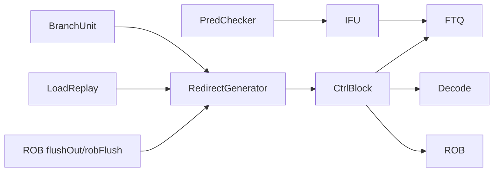
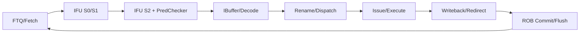

# 香山 Kunminghu Redirect / Flush 场景教学文档

## 1. 分析范围

### 1.1. 文档目标

本文不是追踪单条指令的完整生命周期，而是围绕 `redirect / flush` 这一类恢复机制做定向场景分析。主线严格跟随 [redirect场景描述.md](/nfs/home/wanghao/XiangShanLab/xiangshan-course/docs/5-xiangshan-scenarios-analysis/scenarios-analysis/redirect/learn-redirect/redirect场景描述.md)：

1. redirect 为什么存在。
2. 它经过哪些模块。
3. 哪些指令或事件会触发它。
4. 波形里该看哪些信号。
5. replay、flush、contention、exception 为什么都可能落到这条恢复链上。

### 1.2. 本次材料

| 项目 | 内容 |
| --- | --- |
| 场景说明 | [redirect场景描述.md](/nfs/home/wanghao/XiangShanLab/xiangshan-course/docs/5-xiangshan-scenarios-analysis/scenarios-analysis/redirect/learn-redirect/redirect场景描述.md) |
| 测试程序 | [learn.c](/nfs/home/wanghao/XiangShanLab/xiangshan-course/docs/5-xiangshan-scenarios-analysis/scenarios-analysis/redirect/learn-redirect/demo/learn.c) |
| Makefile | [Makefile](/nfs/home/wanghao/XiangShanLab/xiangshan-course/docs/5-xiangshan-scenarios-analysis/scenarios-analysis/redirect/learn-redirect/demo/Makefile) |
| 反汇编 | [learn-riscv64-xs.txt](/nfs/home/wanghao/XiangShanLab/xiangshan-course/docs/5-xiangshan-scenarios-analysis/scenarios-analysis/redirect/learn-redirect/demo/build/learn-riscv64-xs.txt) |
| ELF | [learn-riscv64-xs.elf](/nfs/home/wanghao/XiangShanLab/xiangshan-course/docs/5-xiangshan-scenarios-analysis/scenarios-analysis/redirect/learn-redirect/demo/build/learn-riscv64-xs.elf) |
| 波形 | [learnRedirect.vcd](/nfs/home/wanghao/XiangShanLab/xiangshan-course/docs/5-xiangshan-scenarios-analysis/scenarios-analysis/redirect/learn-redirect/waveform/learnRedirect.vcd) |
| XiangShan 源码基线 | `/nfs/home/wanghao/xs-env/XiangShan` |
| XiangShan commit | `556be598120db8e86b3a3e9f7fe6346e0e2127d4` |

### 1.3. 方法说明

本次分析遵循 `tools/xiangshan-wave-analysis/SKILL.md` 与 `tools/analyze-xiangshan-wavekit/SKILL.md` 的流程：

1. 先用测试程序和反汇编定义场景与目标 PC。
2. 再从 VCD 中抽取 `frontend toFtq redirect`、`mem redirect`、`fencei`、`flushPipe` 相关信号作为波形锚点。
3. 最后回到 XiangShan Chisel 源码，对 `PredChecker -> IFU -> CtrlBlock -> ROB -> FTQ` 的恢复链做因果解释。

本次文档使用了已经初始化并本地构建完成的 `wavekit-xslab 0.7.0` 工具链。`learnRedirect.vcd` 体积约 `2.7G`，因此分析时采用 `wavekit` 的 VCD 后端语义，并只加载 `redirect / fence.i / TOP.clock` 相关信号子集；采样边沿与 skill 的默认规则一致，统一使用 `TOP.clock` 的上升沿，即 `sample_on_posedge=True`。

可复核的最小方法如下：

```python
from wavekit import VcdReader

with VcdReader("learnRedirect.vcd") as r:
    redirect_valid = r.load_waveform(
        "TOP.SimTop.cpu.l_soc.core_with_l2.core.backend.io_frontend_toFtq_redirect_valid",
        clock="TOP.clock",
        sample_on_posedge=True,
    )
```

考虑到这份 VCD 极大，本文实际采用 `wavekit-xslab` 同一后端的目标信号子集读取方式，只抽取：

- `TOP.clock`
- `io_frontend_toFtq_redirect_*`
- `io_mem_redirect_*`
- `io_fenceio_fencei`

后文所有波形例子都给出 VCD 的绝对 `time`，并补充 `TOP.clock` 上升沿编号 `clock`。阅读波形时，可先在查看器中定位到对应 `time`，再同时核对同拍的 `redirect.valid / target / isMisPred / ftqIdx / offset / mem_redirect_valid / fencei`。

## 2. 核心源码证据

### 2.1. 关键模块

- 前端预测修正：[PredChecker.scala](/nfs/home/wanghao/xs-env/XiangShan/src/main/scala/xiangshan/frontend/ifu/PredChecker.scala:104)
- IFU 接收 redirect 并生成各级 flush：[Ifu.scala](/nfs/home/wanghao/xs-env/XiangShan/src/main/scala/xiangshan/frontend/ifu/Ifu.scala:125)
- IFU 写回型 redirect 转通用 redirect：[IfuRedirectReceiver.scala](/nfs/home/wanghao/xs-env/XiangShan/src/main/scala/xiangshan/frontend/ftq/IfuRedirectReceiver.scala:25)
- 后端分支执行单元产生 redirect：[BranchUnit.scala](/nfs/home/wanghao/xs-env/XiangShan/src/main/scala/xiangshan/backend/fu/wrapper/BranchUnit.scala:53)
- 多来源 redirect 仲裁：[RedirectGenerator.scala](/nfs/home/wanghao/xs-env/XiangShan/src/main/scala/xiangshan/backend/ctrlblock/RedirectGenerator.scala:17)
- CtrlBlock 向前端和 Decode 广播恢复：[CtrlBlock.scala](/nfs/home/wanghao/xs-env/XiangShan/src/main/scala/xiangshan/backend/CtrlBlock.scala:368)
- ROB 产生 flush 并阻塞提交：[Rob.scala](/nfs/home/wanghao/xs-env/XiangShan/src/main/scala/xiangshan/backend/rob/Rob.scala:721)

### 2.2. 关键代码摘录

`PredChecker` 在前端就能发现 direct jump / jalr / ret / not-CFI 的明显预测错误，并产出 `checkerRedirect`：[PredChecker.scala](/nfs/home/wanghao/xs-env/XiangShan/src/main/scala/xiangshan/frontend/ifu/PredChecker.scala:223)

```scala
io.resp.stage2Out.checkerRedirect.valid             := mispredIdxNext.valid && wbValid
io.resp.stage2Out.checkerRedirect.bits.target       := fixedTarget
io.resp.stage2Out.checkerRedirect.bits.misIdx       := mispredIdxNext
io.resp.stage2Out.checkerRedirect.bits.taken        := fixedTaken
io.resp.stage2Out.checkerRedirect.bits.invalidTaken := invalidTakenNext
io.resp.stage2Out.checkerRedirect.bits.mispredPc    := finalPcNext
```

`Ifu` 把 `backendRedirect`、`wbRedirect`、`uncacheRedirect` 汇总成 `s3/s2/s1/s0_flush`：[Ifu.scala](/nfs/home/wanghao/xs-env/XiangShan/src/main/scala/xiangshan/frontend/ifu/Ifu.scala:130)

```scala
backendRedirect := fromFtq.redirect.valid
s3_flush        := backendRedirect || (wbRedirect.valid && !s3_wbNotFlush)
s2_flush        := backendRedirect || uncacheRedirect.valid || wbRedirect.valid
s1_flush        := s2_flush || s1_flushFromBpu(0)
s0_flush        := s1_flush || s0_flushFromBpu(0)
```

后端 `BranchUnit` 在方向错误或目标错误时直接形成 redirect：[BranchUnit.scala](/nfs/home/wanghao/xs-env/XiangShan/src/main/scala/xiangshan/backend/fu/wrapper/BranchUnit.scala:55)

```scala
val targetWrong = dataModule.io.fixedTaken && dataModule.io.taken && (brhRealTarget =/= brhPredictTarget)
val isMisPred = dataModule.io.mispredict || targetWrong
redirect.valid := io.out.valid && (isMisPred || redirect.bits.hasBackendFault)
redirect.bits.level := RedirectLevel.flushAfter
redirect.bits.target := addModule.io.target
redirect.bits.isMisPred := isMisPred
```

`RedirectGenerator` 对执行单元 redirect、`loadReplay`、`robFlush` 做优先级处理：[RedirectGenerator.scala](/nfs/home/wanghao/xs-env/XiangShan/src/main/scala/xiangshan/backend/ctrlblock/RedirectGenerator.scala:31)

```scala
val allRedirect: Vec[ValidIO[Redirect]] = VecInit(oldestExuRedirect, loadRedirect)
val oldestOneHot = Redirect.selectOldestRedirect(allRedirect)
val needFlushVec = VecInit(allRedirect.map(_.bits.robIdx.needFlush(flushAfter) || robFlush.valid))
val oldestValid = VecInit(oldestOneHot.zip(needFlushVec).map { case (v, f) => v && !f }).asUInt.orR
io.stage2Redirect.valid := s1_redirect_valid_reg && !robFlush.valid
```

`CtrlBlock` 把后端恢复真正广播到前端 FTQ 和 Decode：[CtrlBlock.scala](/nfs/home/wanghao/xs-env/XiangShan/src/main/scala/xiangshan/backend/CtrlBlock.scala:368)

```scala
io.frontend.toFtq.redirect.valid := s5_flushFromRobValid || s3_redirectGen.valid
io.frontend.toFtq.redirect.bits := Mux(s5_flushFromRobValid, frontendFlushBits, s3_redirectGen.bits)
decode.io.redirect.valid := s1_s3_redirect.valid || s2_s4_pendingRedirectValid
decode.io.redirect.bits := Mux(s1_s3_redirect.valid, s1_s3_redirect.bits, s2_s4_redirect.bits)
```

ROB 对 flush / mispredict 的提交保护是本章的关键：[Rob.scala](/nfs/home/wanghao/xs-env/XiangShan/src/main/scala/xiangshan/backend/rob/Rob.scala:835)

```scala
val misPredWb = Cat(VecInit(redirectWBs.map(wb =>
  wb.bits.redirect.get.bits.isMisPred && wb.bits.redirect.get.valid && wb.valid
).toSeq)).orR
val misPredBlock = misPredBlockCounter(0)
val blockCommit = misPredBlock || lastCycleFlush || hasWFI || io.redirect.valid ||
  (deqNeedFlush && !deqHasFlushed) || deqFlushBlock || criticalErrorState || traceBlock
io.commits.isCommit := state === s_idle && !blockCommit
```

## 3. 理论概念与代码对象的对应关系

| 课程概念 | 代码对象 | 本质含义 |
| --- | --- | --- |
| 分支预测错误 | `BranchUnit.isMisPred` | 后端已经算出真实方向/目标，要求恢复真实路径。 |
| 前端自纠错 | `PredChecker.checkerRedirect` | 不等到执行阶段，predecode 先修明显错误。 |
| 冲刷流水线 | `s3_flush/s2_flush/s1_flush/s0_flush` | 把 wrong-path 上仍在前端流动的内容尽快停掉。 |
| 多恢复源竞争 | `RedirectGenerator` | 执行 redirect、load replay、ROB flush 不会同时无序下发。 |
| 精确异常恢复 | `rob.io.flushOut` / `robFlush` | 恢复不仅改 PC，还要保证提交边界不被 younger 指令污染。 |
| 提交保护 | `misPredBlockCounter` / `blockCommit` | redirect 发出后，提交仍需额外阻塞几个周期。 |

## 4. 理论和有效实现

### 4.1. redirect 不是“改一下 PC”

`redirect场景描述.md` 反复强调：redirect / flush 不只是“下一条从哪取”，还要处理以下几件事：

- 谁是恢复源头。
- 哪些 younger 指令应被 kill。
- 这次恢复属于普通 mispredict、replay 还是精确异常。
- 提交边界何时重新开放。

这和代码是一致的。`CtrlBlock` 不只是给前端一个 target，它同时对 Decode 发 `decode.io.redirect`；`ROB` 也不只是出 `flushOut`，还要进一步利用 `blockCommit` 暂停提交。

### 4.2. 恢复语义分三层

1. 前端局部自纠错：`PredChecker -> wbRedirect -> IFU flush`。
2. 后端普通恢复：`BranchUnit / loadReplay -> RedirectGenerator -> CtrlBlock`。
3. ROB 精确恢复：`flushOut / exception / interrupt -> robFlush -> frontend redirect + blockCommit`。

测试程序把 `jal`、`jalr`、条件分支风暴和 `fence.i` 放在一起，目的不是混合现象，而是把同一条恢复链的不同入口放到一份波形中，便于对照观察。

## 5. 参数、材料与测试程序结构

### 5.1. redirect 演示程序的 5 个子场景

反汇编与源码共同表明，测试程序分成五段：

| 函数 | 关键 PC | 作用 |
| --- | --- | --- |
| `direct_jump_chain` | `0x8000012a` 起 | 连续 3 次 `jal x0, label`，演示 direct jump 路径。 |
| `jalr_jump_chain` | `0x80000150` 起 | 通过 `jr a4`、`jr a3` 触发间接跳转 redirect。 |
| `branch_redirect_storm` | `0x8000017c` 起 | 64 次条件分支，制造连续 mispredict / recovery。 |
| `frontend_flush_by_fencei` | `0x800001a4` 起 | `fence.i` 触发 flushPipe 型恢复。 |
| `mixed_redirect_window` | `0x800001ba` 起 | 把上面几类恢复叠在一个窗口里。 |

### 5.2. 关键反汇编片段

`jalr_jump_chain`：[learn-riscv64-xs.txt](/nfs/home/wanghao/XiangShanLab/xiangshan-course/docs/5-xiangshan-scenarios-analysis/scenarios-analysis/redirect/learn-redirect/demo/build/learn-riscv64-xs.txt)

```text
80000166:  00070067           jr  a4
8000016e:  0519               addi a0,a0,6
80000170:  00068067           jr  a3
80000178:  051d               addi a0,a0,7
```

`branch_redirect_storm`：

```text
80000192:  c299               beqz a3,80000198
80000194:  953e               add  a0,a0,a5
80000196:  a011               j    8000019a
80000198:  8d11               sub  a0,a0,a2
8000019e:  feb797e3           bne  a5,a1,8000018c
```

`frontend_flush_by_fencei`：

```text
800001ac:  0000100f           fence.i
800001b0:  00338e13           addi t3,t2,3
```

## 6. 模块边界和接口

### 6.1. 前端边界

前端这条链的关注对象是：

`PredChecker -> wbRedirect -> Ifu -> FTQ`

其中 `IfuRedirectReceiver` 把 IFU 写回型 redirect 变成通用 `Redirect`：[IfuRedirectReceiver.scala](/nfs/home/wanghao/xs-env/XiangShan/src/main/scala/xiangshan/frontend/ftq/IfuRedirectReceiver.scala:31)

```scala
redirect.valid          := wbRedirect.valid
redirect.bits.ftqIdx    := wbRedirect.bits.ftqIdx
redirect.bits.ftqOffset := wbRedirect.bits.ftqOffset
redirect.bits.level     := RedirectLevel.flushAfter
redirect.bits.pc        := wbRedirect.bits.pc
redirect.bits.target    := Mux(wbRedirect.bits.attribute.isReturn, specTopAddr, wbRedirect.bits.target)
```

### 6.2. 后端边界

后端的恢复入口统一落到 `RedirectGenerator`：

- `oldestExuRedirect`
- `loadReplay`
- `robFlush`

这意味着香山不是“谁发现错谁直接改前端”，而是先统一仲裁，再由 `CtrlBlock` 做广播。

### 6.3. 提交边界

提交边界由 `ROB` 负责保护。理解 redirect 时，应同时把以下两点与前端恢复一起观察：

- redirect 发出，不代表恢复完成。
- 只有 `blockCommit` 解除后，提交边界才重新安全。

## 7. 这个机制为什么存在

如果错误预测、异常恢复或 replay 恢复时不清空 wrong-path：

- 前端会继续按错路径取指。
- FTQ / Decode 会继续灌入年轻错误指令。
- ROB 附近的 younger 指令可能错误提交。

所以 redirect / flush 要完成两件事：

1. 告诉前端“从哪里重新开始取”。
2. 告诉后端“哪些年轻指令必须马上失效”。

## 8. 动态路径

### 8.1. 通用恢复路径

`场景检测 -> redirect 形成 -> 多源仲裁 -> 广播到 FTQ/Decode -> IFU flush -> ROB 暂停提交 -> 从新 target 继续`

### 8.2. 本测试中的 4 类入口

1. `jal` / `jalr`：控制流改变，容易产生前端或后端的 redirect。
2. 条件分支风暴：连续方向变化，形成高密度 mispredict。
3. `fence.i`：不是分支，但会通过 `flushPipe` 触发恢复。
4. 混合窗口：把多种恢复源放进同一执行段，体现真实处理器里的竞争关系。

## 9. 索引、身份与教学中的跟踪方法

本文不是单指令逐拍追踪，因此没有把某一个 `robIdx` 作为唯一主线；但 `redirect` 类问题仍应遵守以下跟踪原则：

1. rename 之前先用 `PC` 找前端锚点。
2. rename 之后优先用 `robIdx / ftqIdx` 而不是继续只看 PC。
3. 对 redirect 类问题，必须同时看 `source / target / cause / flush scope / commit blocking`。

在本 VCD 里，课程级最稳定的导出信号是：

- `io_frontend_toFtq_redirect_valid`
- `io_frontend_toFtq_redirect_bits_cfiUpdate_pc`
- `io_frontend_toFtq_redirect_bits_cfiUpdate_target`
- `io_frontend_toFtq_redirect_bits_cfiUpdate_isMisPred`
- `io_mem_redirect_valid`
- `io_fenceio_fencei`

## 10. 核心算法

### 10.1. 前端 remask / redirect 算法

`PredChecker` 先做 `jalFaultVec / jalrFaultVec / retFaultVec / notCfiTaken / invalidTaken` 检查，再用 `fixedRange` 限定有效范围。这一步的教学重点是：前端不是只会“照着预测走”，它也会主动纠偏。

### 10.2. 后端 mispredict 算法

`BranchUnit` 同时看：

- 方向是否错 (`mispredict`)
- target 是否错 (`targetWrong`)

只要任一成立，就发 `flushAfter` 级 redirect。

### 10.3. 多恢复源仲裁算法

`RedirectGenerator` 的规则非常适合讲 contention：

1. 先在 `oldestExuRedirect` 与 `loadReplay` 里选最老者。
2. 再看 `robFlush` 是否存在。
3. 如果 `robFlush.valid=1`，普通 redirect 会被压制。

这正对应 `redirect场景描述.md` 里强调的“精确恢复优先于普通恢复”。

## 11. 状态与存储

本场景最重要的不是大状态机数量，而是几个“短期恢复状态”：

| 状态/寄存器 | 所在模块 | 作用 |
| --- | --- | --- |
| `flushAfter` | `RedirectGenerator` | 记住最近的恢复窗口，避免 younger redirect 重复生效。 |
| `flushAfterCounter` | `RedirectGenerator` | 给恢复窗口留出几个周期的持续性。 |
| `mispredIdxNext` / `wbValid` | `PredChecker` | 把前端发现的错误带到写回阶段形成 `checkerRedirect`。 |
| `misPredBlockCounter` | `ROB` | mispredict 写回后，继续阻塞后续几个周期的 commit。 |
| `deqFlushBlockCounter` | `ROB` | 针对命中 deqPtr 的 flush 维持提交保护。 |

## 12. 分流水阶段理解 redirect

### 12.1. 前端阶段

- `PredChecker` 发现明显的预测错误。
- `Ifu` 根据 `wbRedirect` 和后端 redirect 拉起 `s3/s2/s1/s0_flush`。
- `FTQ` 接收 `toFtq.redirect`，恢复新的 fetch 起点。

### 12.2. 后端执行阶段

- `BranchUnit` 产生普通 mispredict redirect。
- `LoadReplay` 也可以把恢复请求送入 redirect 通道。
- `CtrlBlock` 决定这一拍真正向前广播谁。

### 12.3. 提交阶段

- `ROB` 负责 `flushOut`。
- `blockCommit` 负责挡住年轻提交。
- 异常、中断、replay、flushPipe 都可能在这里升级为更强恢复语义。

## 13. 控制路径为什么这样设计

### 13.1. 为什么要有 `PredChecker`

因为很多控制流错误不必等到执行后才发现。direct jump 未预测 taken、jalr 未预测 taken、return 未预测 taken，这些都可以前端先修掉，减少 wrong-path 深度。

### 13.2. 为什么 `RedirectGenerator` 不直接放行所有恢复源

因为同拍多个恢复源并发时，如果没有统一优先级：

- 可能恢复到错误 target。
- 可能 kill 错年龄范围。
- 可能出现 replay 和精确异常互相覆盖错误。

### 13.3. 为什么 redirect 之后还要 `blockCommit`

这是理解精确恢复时最容易忽略的一层。已接近 ROB 头部的 younger 指令，不会因为前端改了 PC 就自动安全；只有 `ROB` 在提交边界继续保护一段时间，精确状态才真正恢复。

## 14. 数据路径和跨边界行为

### 14.1. 这章的数据路径重点不是数据本身，而是控制元数据

本节真正要追的是：

- `pc`
- `target`
- `ftqIdx`
- `ftqOffset`
- `robIdx`
- `isMisPred`
- `flushPipe`

它们决定的是“控制流恢复边界”，而不是某个 load/store 的字节数据。

### 14.2. fetch block / half instruction 边界

`Ifu` 中 `invalidTaken`、`isHalfInstr`、`halfPc`、`halfData` 的处理说明 redirect 还要照顾半条指令与 fetch block 边界：[Ifu.scala](/nfs/home/wanghao/xs-env/XiangShan/src/main/scala/xiangshan/frontend/ifu/Ifu.scala:784)

```scala
wbRedirect.valid          := checkFlushWb.valid
wbRedirect.isHalfInstr    := wbCurrentLastRvi && checkerRedirect.bits.invalidTaken
wbRedirect.halfPc         := checkerRedirect.bits.mispredPc
wbRedirect.halfData       := wbCurrentLastHalfData
```

这也是 `redirect场景描述.md` 特别强调的“半条指令和边界状态修复”场景。

### 14.3. 本专题的跨边界重点

| 边界 | 本节关注点 |
| --- | --- |
| 前端 fetch block 边界 | `invalidTaken` 和 `fixedRange` 如何限制错误传播。 |
| IFU 到 FTQ 边界 | `wbRedirect` 如何转成通用 redirect。 |
| 后端到前端边界 | `CtrlBlock` 如何把后端恢复广播回前端。 |
| 提交边界 | `blockCommit` 如何阻止 wrong-path 提交。 |

## 15. 异常 / 调试 / 特权语义

### 15.1. 本程序里最值得讲的是 `fence.i`

`fence.i` 不是分支，但它会触发 `flushPipe` 型恢复。这里要让学生建立一个认识：

- redirect 的触发者不只可能是 branch unit。
- 任何会要求前后端恢复一致性的事件，都可能落到 redirect/flush 链上。

### 15.2. ROB 的异常等级

`Rob.scala` 中这行是关键：[Rob.scala](/nfs/home/wanghao/xs-env/XiangShan/src/main/scala/xiangshan/backend/rob/Rob.scala:727)

```scala
io.flushOut.bits.level := Mux(deqHasReplayInst || intrEnable || deqHasException || needModifyFtqIdxOffset,
  RedirectLevel.flush, RedirectLevel.flushAfter)
```

它说明 replay、interrupt、exception 和普通 `flushPipe` 在恢复语义上并不等价。

## 16. CSR control

本专题不是预测器开关控制专题，因此没有像 branch predictor 文档那样展开 `sbpctl` 到 BPU 子预测器的 CSR 控制链。本程序与 redirect 关系最直接的 CSR 是启动代码中的基础 machine 状态初始化，而不是一个“用 CSR 开关 redirect”的专门控制面。

这里反而要强调：redirect 是流水线控制恢复机制，不是一个由单独 CSR 打开的旁路功能。

## 17. 图示

### 17.1. Top-Level Module Connectivity



### 17.2. Frontend/Backend Pipeline Stages



### 17.3. `fence.i` 恢复链时序图

```waveform-draw
{ "signal": [
  { "name": "clk", "wave": "P..........." },
  { "name": "io_fenceio_fencei", "wave": "0....10.....", "node": ".....a......" },
  { "name": "io_mem_redirect_valid", "wave": "0.....10....", "node": "......b....." },
  { "name": "io_frontend_toFtq_redirect_valid", "wave": "0.......10..", "node": "........c..." },
  { "name": "target", "wave": "x.......=x..", "data": ["0x800001b0"] }
], "edge": ["a->b fence.i 完成后 backend 进入恢复", "b->c frontend 接收 redirect"] }
```

## 18. 设计文档 / 源码 / 波形之间的证据边界

### 18.1. 一致之处

- `redirect场景描述.md` 提出的五类核心教学点，都能在当前 XiangShan 代码里找到直接对应对象。
- 测试程序确实构造了 direct jump、jalr、branch storm、fence.i、mixed window 这五段负载。
- VCD 里确实导出了 `toFtq.redirect`、`mem.redirect`、`fencei` 等教学需要的顶层信号。

### 18.2. 本次不能过度声称的地方

- 本次已经使用 `wavekit-xslab` 的 VCD 工具链完成目标信号抽取，但由于 `learnRedirect.vcd` 体积很大，分析采取的是“限定信号子集 + `TOP.clock` 上升沿采样”的方式，而不是对全层级做一次完整展开。
- 这份 VCD 能稳定观察到顶层 redirect 与 `fencei`，但没有在本文中建立“每一次前端 redirect 都精确回溯到唯一一条 ROB 项”的全量逐拍证明。
- 因此本文是“课程级场景教学文档”，不是“单条指令全流水线法证报告”。

## 19. 动态场景

### 19.1. 场景一：`jalr_jump_chain` 的两次间接跳转 redirect

先看反汇编：

```text
80000166:  00070067           jr  a4
8000016e:  0519               addi a0,a0,6
80000170:  00068067           jr  a3
80000178:  051d               addi a0,a0,7
```

VCD 中能直接抽到两次落在 `jalr_jump_chain` 代码区间内的前端 redirect：

| time | clock | 观测值 | 与反汇编的对应 |
| ---: | ---: | --- | --- |
| `8970` | `4484` | `frontend_valid=1`，`pc=0x80000150`，`target=0x8000016e`，`ftqIdx=0x26`，`ftqOffset=0xb`，`level=0`，`taken=1`，`isMisPred=1`，同时 `mem_redirect_valid=1` | 对应 `80000166: jr a4` 需要把前端恢复到 `8000016e`。 |
| `9002` | `4500` | `frontend_valid=1`，`pc=0x8000016e`，`target=0x80000178`，`ftqIdx=0x27`，`ftqOffset=0x1`，`level=0`，`taken=1`，`isMisPred=1`，同时 `mem_redirect_valid=1` | 对应 `80000170: jr a3` 需要把前端恢复到 `80000178`。 |

这正好对应 `learn.c` 中两次 `jalr x0, target, 0`。教学重点是：`jalr` 的目标直到执行时才完全确定，因此它比 `jal` 更能体现“前端负责猜，后端负责判”。

这两拍波形需要按因果关系来理解，而不是只停留在“发生了 redirect”这一层：

1. `time=8970` 时，前端已经收到一个有效 redirect，载荷中的 `target=0x8000016e` 说明恢复目标就是 `jr a4` 的真实目标。
2. 同一拍 `isMisPred=1`，说明这不是 fence/异常类 flush，而是控制流预测与真实执行不一致后的恢复。
3. 同一拍 `mem_redirect_valid=1`，说明前端这个 redirect 不是凭空出现，而是后端恢复链已经在工作。
4. 到 `time=9002`，第二个 `jr` 又重复一次同样模式，这正是 `jalr` 链式跳转在波形上的样子。

从这两个具体窗口中，应读出三层信息：

- 如何做：后端给出 redirect，CtrlBlock 广播到前端。
- 为什么这样做：`jalr` 的真实目标要等执行后才能确认。
- 做完的结果：前端 target 立刻落到 `0x8000016e/0x80000178`，而不是继续顺序取 `0x8000016a/0x80000174` 那些 wrong-path 指令。

### 19.2. 场景二：`branch_redirect_storm` 的连续分支恢复

在 `branch_redirect_storm` 的循环区间，VCD 中出现了高密度 redirect，目标反复落在：

- `0x80000194`：taken 路径 `add a0,a0,a5`
- `0x80000198`：not-taken 路径 `sub a0,a0,a2`
- `0x8000018c`：回到本轮分支判断点
- `0x800001a2`：循环退出 `ret`

先看分支本体：

```text
80000192:  c299               beqz a3,80000198
80000194:  953e               add  a0,a0,a5
80000196:  a011               j    8000019a
80000198:  8d11               sub  a0,a0,a2
8000019e:  feb797e3           bne  a5,a1,8000018c
800001a2:  8082               ret
```

例如下面几个真实窗口：

| time | clock | 关键波形值 | 解释 |
| ---: | ---: | --- | --- |
| `9098` | `4548` | `pc=0x8000019a`，`target=0x8000018c`，`ftqIdx=0x2b`，`ftqOffset=0x2`，`taken=1`，`isMisPred=1`，`mem_redirect_valid=1` | 落回 `bne a5,a1,8000018c` 的循环判断点。 |
| `9196` | `4597` | `pc=0x8000018c`，`target=0x80000198`，`ftqIdx=0x2c`，`ftqOffset=0x3`，`taken=1`，`isMisPred=1` | 指向 `beqz` 的一条恢复路径 `sub`。 |
| `9270` | `4634` | `pc=0x8000018c`，`target=0x80000194`，`ftqIdx=0x2e`，`ftqOffset=0x3`，`taken=0`，`isMisPred=1` | 指向 `beqz` 另一条恢复路径 `add`。 |
| `10754` | `5376` | `pc=0x80000198`，`target=0x800001a2`，`ftqIdx=0x36`，`ftqOffset=0x3`，`taken=0`，`isMisPred=1`，`mem_redirect_valid=1` | 循环退出，恢复到 `ret`。 |

这类场景最适合用来讲两件事：

1. redirect 不是罕见异常，而是分支密集程序里的高频事件。
2. `blockCommit` 的意义会在这种高密度 mispredict 窗口里变得很真实。

这里最重要的不是“表格里有很多 target”，而是看懂这些 target 为什么这样跳：

1. `time=9098` 时 target 回到 `0x8000018c`，说明恢复链正在维持循环判断的正确入口，而不是随便找一个后继地址。
2. `time=9196` 和 `time=9270` 两拍分别落到 `0x80000198` 与 `0x80000194`，正好对应同一个条件分支的两条备选路径。
3. `time=10754` 的 target 变成 `0x800001a2`，这不是“随机又跳了一次”，而是循环结束时恢复到 `ret`，说明 redirect 目标随着真实控制流收敛到了退出点。

学生看到这一串真实窗口后，就能理解香山为什么必须有统一的 redirect 链：如果没有它，前端会继续沿着错误的 taken/not-taken 方向灌入 wrong-path 指令，ROB 侧也会被这些错误路径污染。

### 19.3. 场景三：`fence.i` 引发的 flushPipe 型 redirect

本程序有两次 `fence.i` 生效窗口：一次单独调用，一次位于 `mixed_redirect_window` 内。

第一段窗口的波形关系是：

| time | clock | 观测值 | 含义 |
| ---: | ---: | --- | --- |
| `11000` | `5499` | `fencei=1`，而 `frontend_redirect_valid=0`、`mem_redirect_valid=0` | Fence 单元此时刚发出 `fence.i` 动作，本拍还没有进入前端恢复。 |
| `11010` | `5504` | `mem_redirect_valid=1`，`mem_rob_flag=1`，`mem_rob_val=0x39` | 后端先进入恢复链，说明 `fence.i` 不是直接在前端本地改 PC。 |
| `11020` | `5509` | `frontend_redirect_valid=1`，`target=0x800001b0`，`ftqIdx=0x3a`，`ftqOffset=0x4`，`level=1`，`isMisPred=0`，`debugIsCtrl=0` | 前端收到 flush 级恢复，目标正是 `fence.i` 的顺序下一条。 |

`0x800001b0` 正好是反汇编中的：

```text
800001ac: 0000100f  fence.i
800001b0: 00338e13  addi t3,t2,3
```

第二段窗口重复了同一规律：

| time | clock | 观测值 |
| ---: | ---: | --- |
| `12482` | `6240` | `fencei=1` |
| `12492` | `6245` | `mem_redirect_valid=1`，`mem_rob_flag=0`，`mem_rob_val=0x8` |
| `12502` | `6250` | `frontend_redirect_valid=1`，`target=0x800001b0`，`ftqIdx=0x12`，`ftqOffset=0x4`，`level=1`，`isMisPred=0` |

教学重点是：这里的 redirect 不是分支错判，而是 `flushPipe` 导致的恢复。所以 `isMisPred=0` 反而非常关键，它提醒学生 redirect 的来源不止分支。

这段波形最适合回答三个核心问题：

1. 香山如何做：先由 Fence 单元拉起 `fencei`，随后后端 `mem_redirect_valid=1`，最后前端才收到 `toFtq.redirect.valid=1`。
2. 香山为什么这样做：`fence.i` 需要保证前面的取指状态、旧 ICache 内容和 younger work 一起恢复，不是单独改一个 PC 就结束。
3. 这样做的结果是什么：最终 target 精确落到 `0x800001b0`，也就是 `fence.i` 的顺序下一条，而 `isMisPred=0` 证明它不是 branch predictor 误判，而是 flushPipe 恢复。

换句话说，这个窗口是教学里最好的反例：它告诉学生“所有 redirect 看上去都像改 PC，但来源、级别和语义并不一样”。

### 19.4. 场景四：`oldestExuRedirect` / `loadReplay` / `robFlush` 的竞争语义

本测试程序没有定向制造 load replay 和 exception 同拍竞争，但代码已清楚给出规则：

- 普通执行恢复和 load replay 先比年龄。
- `robFlush` 一旦有效，会压住普通 `stage2Redirect`。

因此这份教学文档把它作为“代码可证、后续波形可补”的必讲场景，而不是在当前 VCD 上虚构一个不存在的同拍竞争。

### 19.5. 场景五：redirect 后 commit 仍被阻塞

当前 VCD 已经能直接证明大量 `redirect.valid` 脉冲；源码又明确给出 `misPredBlockCounter` 和 `blockCommit` 的保护逻辑。因此阅读这类场景时，必须同步检查提交保护，而不能只看前端 target。

- redirect 不是前端局部现象。
- 它一直影响到 commit 边界。

学生如果只看 `toFtq.redirect.target`，通常会漏掉这一层。

## 20. 结论

把这章内容压缩成一句话：`redirect / flush` 是香山处理器里一条跨前端、后端、FTQ、Decode、ROB 的统一恢复链，而不是“某个分支模块里的小功能”。

本次 `learnRedirect` 演示程序把五类最重要的教学入口放在了一起：

- `jal` / `jalr` 让学生看到控制流恢复的基本形态。
- 条件分支风暴让学生看到 redirect 的高频性。
- `fence.i` 让学生理解 `flushPipe` 也是 redirect 的来源。
- 源码里的 `RedirectGenerator` 和 `blockCommit` 则把 replay、contention、精确恢复和提交保护串成一个完整微架构故事。

因此，这份场景最适合作为 `redirect` 专题课的第一讲：先建立恢复链的全局图，再分别深入分支、replay、异常与 commit 保护。

## 验证特别注意

| Verification ID | Risk / invariant | Directed stimulus | Expected observation | Required checker / coverage |
| --- | --- | --- | --- | --- |
| `C_REDIRECT_REDIRECT` | 多个 redirect 源同拍时不能给出两个恢复目标 | 构造 `oldestExuRedirect + loadReplay` 同拍，再叠加 `robFlush` | 只有一个有效恢复目标；`robFlush` 能压住普通 `stage2Redirect` | arbiter checker；redirect priority coverage；[RedirectGenerator.scala](/nfs/home/wanghao/xs-env/XiangShan/src/main/scala/xiangshan/backend/ctrlblock/RedirectGenerator.scala:31) |
| `F_REQ_AND_FLUSH` | 被 kill 的 wrong-path 不能继续进入 Decode/Commit | 在 branch storm 或 `fence.i` 后紧跟 younger 指令 | `decode.io.redirect.valid=1` 后，wrong-path 不得继续作为合法提交可见 | flush/replay checker；commit scoreboard；[CtrlBlock.scala](/nfs/home/wanghao/xs-env/XiangShan/src/main/scala/xiangshan/backend/CtrlBlock.scala:430) |
| `PB_RECOVERY_THROUGHPUT` | 高频 mispredict 后流水线必须恢复前进 | 执行 `branch_redirect_storm` 这类高密度控制流 | redirect 大量出现，但前端 target 始终落在合法路径，最终程序继续退出 | forward-progress checker；redirect-rate coverage |
| `F_HOLD_BACKPRESSURE` | redirect 期间 payload 不得重复接受或丢失 | 在 IFU/Decode 边界叠加 redirect 与下游 ready 降低 | `valid && !ready` 时 payload 保持，flush 后错误 payload 不可再次 fire | handshake checker；payload stability checker |
| `F_REQ_AND_FLUSH_FENCEI` | `fence.i` 引起的恢复不能被误记为 mispredict | 定向执行 `frontend_flush_by_fencei` | 观察到 `io_fenceio_fencei=1`，随后 `mem_redirect_valid=1`，再到 frontend redirect；`isMisPred=0` | cause coverage；flushPipe checker；[Rob.scala](/nfs/home/wanghao/xs-env/XiangShan/src/main/scala/xiangshan/backend/rob/Rob.scala:727) |
| `P_LIVELOCK_REPLAY_LOOP` | replay/redirect 高频出现时不能活锁 | 构造 load replay 与 branch redirect 交叠窗口 | loser 可被延后或重试，但系统必须继续前进；不能无限停在恢复窗口 | forward-progress checker；replay/redirect overlap coverage |
| `F_COMMIT_BLOCK` | redirect 后 younger work 不得错误提交 | 在 mispredict 写回后观察 ROB 头部行为 | `blockCommit` 在保护窗口内为真，commit 暂停，直到恢复链完成 | ROB checker；commit blocking coverage；[Rob.scala](/nfs/home/wanghao/xs-env/XiangShan/src/main/scala/xiangshan/backend/rob/Rob.scala:864) |
