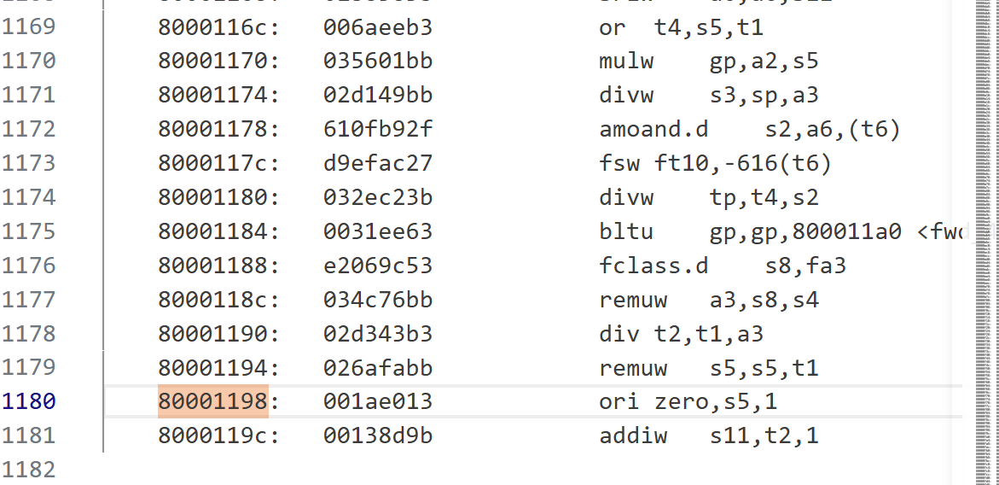
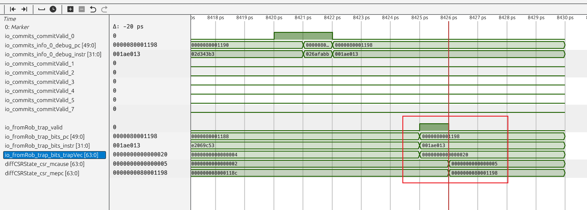

# perfetch的bug

/nfs/home/wanghao/xs-test/perfetch


v3把0x80001198识别到了一个异常（v2没有识别到）

反汇编：




只是一条ORI指令？？？

再看v3行为：



真把

```scala
    80001198:	001ae013          	ori	zero,s5,1
```

识别成了异常

异常码mcause是0x5


？一条ORI识别出来有加载访问异常？？？？？？


> 更新: 2026-05-15 16:01:20  
