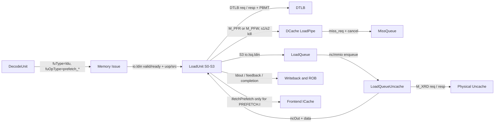
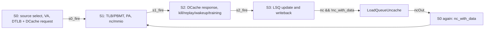
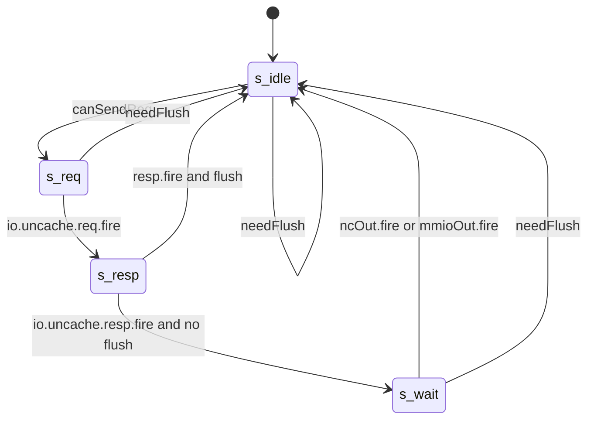

# PR #4636：LoadUnit S1 NC 逻辑对软件 Prefetch 的影响

本文分析香山昆明湖在 Pull Request [#4636](https://github.com/OpenXiangShan/XiangShan/pull/4636) 合入前，`LoadUnit` 如何处理命中 Svpbmt `PBMT.NC` 的软件预取，以及 PR 将 `s1_out.nc` 增加 `!s1_prf` 门控后改变了什么。

## 1. 分析范围、基线与证据等级

### 1.1. 固定基线

| 项目 | 固定值 |
| --- | --- |
| XiangShan checkout | `/home/yanyusong/prefetch-env/XiangShan` |
| 当前提交，也就是本地 squash 合入前基线 | `acf3dcce41edb40ff57765e343984bd8a58510eb` |
| 目标文档 | `/home/yanyusong/XiangShanLab/xiangshan-course/docs/6-xiangshan-debug/xiangshan-issue-4636/analysis.md` |
| 父子关系 | `6a3636fd...` 的唯一父提交正是 `acf3dcce...` |
| GitHub PR #4636 标题 | `fix(LoadUnit): perfetch no longer generates nc access`（保留上游 `perfetch` 拼写） |
| GitHub PR base / head | base `4bbdccbb077840af5e1b65c7138d31af3966f625`；head `ef06ced1a9fc7677d8c84ebe4cdaeacf1d1699d3` |
| PR #4636 的本地合入结果（squash/merge commit） | `6a3636fd23a2df2f5ef01890da6a564c546ba4d0` |
| PR 源码 diff | GitHub API 报告 `changed_files=1, additions=1, deletions=1`；本地 `acf3dcce... -> 6a3636fd...` 同样只改 `LoadUnit.scala` 一行 |
| Design Doc baseline | 未使用；本地没有 `XiangShan-Design-Doc` checkout |
| XiangShanLab baseline | `679eb9d4476c7ecc4935b2ebb36a97f8a8a76ba7`，只作理论和既有课程导航，不作实现证据 |
| 动态验证状态 | 已用 WaveKit 分析旧版基线的最新 FST，`PREFETCH.R -> NC read` 已动态闭环；target 尚未采集同激励 A/B 波形 |

按用户明确要求，本次**跳过 weekly sync**，没有运行 `weekly_sync.py`、`git fetch`、`git pull` 或任何会改变提交节点的同步操作。当前源码工作树原有 `difftest` 修改和 `src/main/resources/aia/` 未跟踪目录也没有被改动。

### 1.2. 证据标签

- **[Git/PR 事实]**：由本地提交对象、父提交关系和精确 diff 直接证明。
- **[代码事实]**：由当前提交中的有效 Chisel 赋值、握手、状态转移或模块连接直接证明。
- **[波形事实]**：由指定 FST 中同一 `PC/robIdx/lqIdx/paddr` 的逐周期信号、`valid && ready` 握手和最终 commit 直接证明。
- **[静态推导]**：由多段有效连接联合推出；成立条件会随结论给出。
- **[待仿真]**：target 的同激励 A/B 波形，以及未被本次定向程序覆盖的 fault、redirect 和资源竞争 corner case 尚未确认。
- **[开放问题]**：代码表明行为会变化，但是否符合体系结构或设计意图仍需规范、测试或维护者确认。

本文的 Scala 代码块均注明来源。除明确标为“PR 合入结果（target）”的一处外，代码块都摘自当前 checkout 的提交 `acf3dcce...`；代码块是对应行的逐字源码节选，省略的外围 `when`、函数或表达式闭合不代表实现缺失。

主要有效源码集合如下：

| 层次 | 文件/模块 | 本文使用目的 |
| --- | --- | --- |
| Decode | `backend/decode/DecodeUnit.scala`、`xiangshan/package.scala` | 识别 PREFETCH.I/R/W、选择 LDU、抑制 GPR 写回 |
| Load pipeline | `mem/pipeline/LoadUnit.scala` | S0-S3、PBMT/NC、kill、wakeup、training、LSQ 和 NC 回灌 |
| MMU | `cache/mmu/TLB.scala`、`cache/mmu/MMUBundle.scala` | PBMT 来源、NC/IO 分类、permission/PMP 检查边界 |
| DCache | `cache/dcache/loadpipe/LoadPipe.scala`、`cache/dcache/mainpipe/MissQueue.scala` | prefetch tag/coherence、miss cancel、MSHR alloc/merge |
| LSQ/Uncache | `mem/lsqueue/LoadQueue.scala`、`VirtualLoadQueue.scala`、`LoadQueueUncache.scala` | S3 扇出、entry/FSM/free-list、真实 NC 请求和响应 |
| Top connection | `mem/MemBlock.scala` | LoadUnit-DCache-LSQ-Uncache 闭环和 PREFETCH.I 接口 |
| Parameters | `Parameters.scala`、`cache/CacheConstants.scala` | 默认容量、LoadPipelineWidth 和 memory command 语义 |

### 1.3. 核心结论

**[静态推导]** 在软件 `PREFETCH.R/W` 首次执行、DTLB 命中、PBMT 为 `NC`、DCache lookup 为 cold/miss、没有 redirect/异常阻断、Uncache 有可分配 slot 且下游最终 ready 的条件下，当前提交会经历：

1. S0 同时发出 DTLB 查询和 DCache `M_PFR/M_PFW`；
2. S1 把 `PBMT.NC` 无条件转换成 `s1_out.nc = 1`；
3. S2 因 `s2_actually_uncache = 1` 把原本会发出的 DCache miss request 标为 `cancel=1`，从而阻止 MissQueue 的有效 alloc/merge；但由于它仍是 prefetch，普通 replay 和首遍 safe wakeup 也不会接管；
4. 软件 prefetch 仍从 S3 送入 LoadQueue，尝试分配 `LoadQueueUncache` entry；分配成功后才进入后续请求路径；
5. Uncache 路径不保留 `M_PFR/M_PFW`，而是在 entry 成功分配、仲裁获胜且物理 Uncache ready 时发出真实 `M_XRD`；
6. NC 响应经 `ncOut` 回灌 LoadUnit，第二遍作为 `nc_with_data` 完成，读回数据最终因 `rd=x0` 不产生 GPR 架构结果。

PR #4636 把步骤 2 改为“只要是 prefetch，就不向后传播 `nc`”。因此，对“PBMT.NC 且其余 PMA/PMP 条件允许普通内存访问”的软件 `PREFETCH.R/W`：

- 不再分配 `LoadQueueUncache` entry，也不再发 `M_XRD` 和等待 `ncOut` 回灌；
- S0 已发出的 DCache `M_PFR/M_PFW` 的 miss request 不再仅因 PBMT.NC 带 `cancel=1`；若 miss 且 MissQueue 有资源，它可以被分配或合并；
- 软件 prefetch uop 可以在首遍 S3 完成，prefetch training 也不再被 `s2_actually_uncache` 单独抑制。

这不是“发现 NC 后丢弃预取”，而是“禁止 software prefetch 改走 NC load；让它继续按 DCache prefetch 处理”。这也是该修改最需要验证的设计边界。

## 2. 指令分类与理论到代码映射

### 2.1. PREFETCH.I/R/W 都被编码为 LoadUnit 操作

当前提交源码：[package.scala](/home/yanyusong/prefetch-env/XiangShan/src/main/scala/xiangshan/package.scala:559)，第 559-565 行。

```scala
    // Zicbop software prefetch
    // bit encoding: | prefetch 1 | 0 | prefetch type (2bit) |
    def prefetch_i = "b1000".U // TODO
    def prefetch_r = "b1001".U
    def prefetch_w = "b1010".U

    def isPrefetch(op: UInt): Bool = op(3) && (op(5, 4) === "b000".U) && (op(8, 7) === "b00".U)
```

来源说明：该片段来自当前提交 `acf3dcce...` 的 `src/main/scala/xiangshan/package.scala`，定义了后续 `LoadUnit` 使用的三种 `LSUOpType` 和统一 prefetch 判定。

当前提交源码：[DecodeUnit.scala](/home/yanyusong/prefetch-env/XiangShan/src/main/scala/xiangshan/backend/decode/DecodeUnit.scala:1101)，第 1101-1105 行。

```scala
  // decode for SoftPrefetch instructions (prefetch.w / prefetch.r / prefetch.i)
  val isSoftPrefetch = inst.OPCODE === BitPat("b0010011") && inst.FUNCT3 === BitPat("b110") && inst.RD === 0.U
  val isPreW = isSoftPrefetch && inst.RS2 === 3.U(5.W)
  val isPreR = isSoftPrefetch && inst.RS2 === 1.U(5.W)
  val isPreI = isSoftPrefetch && inst.RS2 === 0.U(5.W)
```

来源说明：该片段来自当前提交的 `src/main/scala/xiangshan/backend/decode/DecodeUnit.scala`，证明 `rd=x0` 是 software prefetch 的识别条件，`RS2` 编码区分 I/R/W。

当前提交源码：[DecodeUnit.scala](/home/yanyusong/prefetch-env/XiangShan/src/main/scala/xiangshan/backend/decode/DecodeUnit.scala:1133)，第 1133-1137 行和第 1167-1177 行。

```scala
  }.elsewhen (isPreW || isPreR || isPreI) {
    decodedInst.selImm := SelImm.IMM_S
    decodedInst.fuType := FuType.ldu.U
    decodedInst.canRobCompress := false.B
  }.elsewhen (isZimop) {
```

```scala
  io.deq.decodedInst.fuOpType := MuxCase(decodedInst.fuOpType, Seq(
    isCsrrVl    -> VSETOpType.csrrvl,
    isCsrrVlenb -> ALUOpType.add,
    isFLI       -> Cat(1.U, inst.FMT, inst.RS1),
    (isPreW || isPreR || isPreI) -> Mux1H(Seq(
      isPreW -> LSUOpType.prefetch_w,
      isPreR -> LSUOpType.prefetch_r,
      isPreI -> LSUOpType.prefetch_i,
    )),
    (isCboInval && io.fromCSR.special.cboI2F) -> LSUOpType.cbo_flush,
  ))
```

来源说明：两个代码块都来自当前提交的 `DecodeUnit.scala`，其中保留了相邻分支/表达式闭合作为节选边界。它们证明三种软件预取都进入 `FuType.ldu`，使用 S-type 立即数，并由 `fuOpType` 携带 I/R/W 意图；它们不是 StoreUnit 的真实 store。

当前提交源码：[DecodeUnit.scala](/home/yanyusong/prefetch-env/XiangShan/src/main/scala/xiangshan/backend/decode/DecodeUnit.scala:1145)，第 1145-1146 行。

```scala
  io.deq.decodedInst := decodedInst
  io.deq.decodedInst.rfWen := (decodedInst.ldest =/= 0.U) && decodedInst.rfWen
```

来源说明：该片段来自当前提交的 `DecodeUnit.scala`。software prefetch 的识别条件要求 `rd=x0`，所以这里把整数寄存器写使能压低；它仍需要 uop/ROB 完成，但不会写 GPR。

当前提交源码：[CacheConstants.scala](/home/yanyusong/prefetch-env/XiangShan/src/main/scala/xiangshan/cache/CacheConstants.scala:25)，第 25-32 行和第 60-63 行。

```scala
trait MemoryOpConstants {
  val NUM_XA_OPS = 9
  val M_SZ      = 5
  def M_X       = BitPat("b?????")
  def M_XRD     = "b00000".U // int load
  def M_XWR     = "b00001".U // int store
  def M_PFR     = "b00010".U // prefetch with intent to read
  def M_PFW     = "b00011".U // prefetch with intent to write
```

```scala
  def isPrefetch(cmd: UInt) = cmd === M_PFR || cmd === M_PFW
  def isRead(cmd: UInt) = cmd === M_XRD || cmd === M_XLR || cmd === M_XSC || isAMO(cmd)
  def isWrite(cmd: UInt) = cmd === M_XWR || cmd === M_PWR || cmd === M_XSC || isAMO(cmd)
  def isWriteIntent(cmd: UInt) = isWrite(cmd) || cmd === M_PFW || cmd === M_XLR
```

来源说明：两个代码块来自当前提交的 `src/main/scala/xiangshan/cache/CacheConstants.scala`，证明 DCache 能区分 `M_PFR`、`M_PFW` 和真实读 `M_XRD`，且 `M_PFW` 表示写权限意图而非存储数据。

### 2.2. 指令类别矩阵

| 类别 | Decode/FU 标记 | LoadUnit 首次路径 | Cache/MMU 路径 | 架构结果 | 与 PR #4636 的关系 |
| --- | --- | --- | --- | --- | --- |
| `PREFETCH.R` | `FuType.ldu` + `prefetch_r` | 整数 issue 源 | DTLB read + DCache `M_PFR` | `rd=x0`，无 GPR 数据结果 | PBMT.NC 场景是主要受影响对象 |
| `PREFETCH.W` | `FuType.ldu` + `prefetch_w` | 整数 issue 源 | DTLB write + DCache `M_PFW` | 无 store data、无内存修改 | PBMT.NC 场景是主要受影响对象；旧 NC 路径会丢失 write intent |
| `PREFETCH.I` | `FuType.ldu` + `prefetch_i` | 整数 issue 源 | 不发数据侧 DCache；`ifetchPrefetch` 送前端 | 无 GPR 数据结果 | 基本不受此修改影响 |
| 硬件 L1 prefetch | `io.prefetch_req` | LoadUnit 的 high/low confidence 源 | 直接带物理地址，不做通常的软件 DTLB 查询 | 无 ROB entry | 表达式形式上被 `!s1_prf` 覆盖，正常路径实际没有 PBMT.NC 来源 |
| 普通 load | `FuType.ldu`，非 prefetch op | 整数 issue 源 | DTLB + `M_XRD` | 正常 load 写回/异常 | `s1_prf=0`，NC 行为不变 |

### 2.3. Who / Why / How / From / To

| 对象 | Who | Why | How | From what | To what |
| --- | --- | --- | --- | --- | --- |
| `s1_prf` | `LoadUnit` S1 | 区分 hint 与 demand load | 从 S0 `isPrefetch` pipeline register 读取 | Decode 的 `fuOpType` 经 `fromIntIssueSource.prf` | S2 异常、replay、MMIO、training、wakeup 门控 |
| `s1_pbmt` | DTLB 产生，LoadUnit 消费 | 表达翻译后的物理内存类型 | TLB hit 时选 `resp.bits.pbmt.head` | 页表/PBMT lookup | `Pbmt.isNC/isIO`，再写入 `s1_out.nc/mmio` |
| `s1_out.nc` | `LoadUnit` S1 | 选择 NC 数据回读协议 | 当前为 `s1_nc || Pbmt.isNC(s1_pbmt)` | 既有 NC 回灌标记或 DTLB PBMT.NC | S2 DCache kill、S3 LSQ、LoadQueueUncache |
| `s2_actually_uncache` | `LoadUnit` S2 | 判断物理访问是否不能由 DCache 正常处理 | PMA/PMP MMIO、`nc`、`mmio` 的组合 | S1 memory type + PMP/PMA | `dcache.s2_kill` 和 prefetch training 门控 |
| `s2_uncache` | `LoadUnit` S2 | 只让非-prefetch demand load 走 MMIO/uncache完成语义 | `!s2_prf && s2_actually_uncache` | `s2_prf`、`s2_actually_uncache` | 普通 load exception/response/MMIO 路径 |
| `LoadQueueUncache` | LoadQueue 子模块 | 保存 outstanding MMIO/NC load 并等待物理响应 | free-list + per-entry FSM + request/response arbiters | LoadUnit S3 `ldin` | Uncache 总线、`mmioOut` 或 `ncOut` 回灌 |

### 2.4. Theory-to-Code Mapping

| 理论概念 | 课程层含义 | 当前代码载体 | 本问题中的具体表现 | 与抽象模型的差异 |
| --- | --- | --- | --- | --- |
| Prefetch hint | 提前暴露未来访问，不产生程序可用的数据结果 | `fuOpType=prefetch_*`、`rfWen=0`、`M_PFR/M_PFW` | uop仍走乱序后端并完成，但不写GPR | Base 的 PBMT.NC 路径额外执行了真实 `M_XRD` |
| 结构冲突 | 多个请求争用有限端口/队列 | LoadUnit固定优先级、4-entry默认Uncache参数、MMIO mux、NC RR arbiter | Base hint可占entry和总线，甚至触发full rollback | Target把压力移到DCache/MissQueue，而非让资源需求消失 |
| 投机与恢复 | wrong-path工作必须被redirect清除 | 各级 `robIdx.needFlush`、entry `needFlush` | pipeline可kill；outstanding Uncache响应需要drain后清理 | 外部读发出后不能当作未发生，恢复跨越模块边界 |
| 精确提交 | 无寄存器结果的uop仍需顺序完成身份 | uop `robIdx/lqIdx`、S3 writeback/feedback | `rd=x0`不等于在Decode/Dispatch丢弃 | LQ内部 `committed` 标记也不等于ROB已经retire |
| Memory ordering | cacheable、NC、MMIO的发送约束不同 | `s2_actually_uncache`、`req.nc`、ROB `pendingPtr` | NC可不等ROB head；MMIO必须等待 | Base额外让hint继承了NC实体事务的资源语义；是否符合意图属于开放问题 |

## 3. 模块边界与端到端数据通路

### 3.1. 模块接口图



该图的主要连接由当前提交 `MemBlock.scala:856-860, 913-924, 980-990`、`LoadQueue.scala:293-305` 和 `LoadUnit.scala:380-418` 证明。

### 3.2. LoadUnit 阶段图



当前提交中，S1/S2 的 valid 均以 `RegInit(false.B)` 复位：上一级 `fire` 的置位分支优先于本级 `fire`/`kill` 清零分支，消费者不 ready 时保持。S3 使用 `GatedValidRegNext` 对 S2 的有效条件打一拍，并显式排除硬件 prefetch，但不排除 software prefetch；它不能简单等同为一个带 ready 保持的普通 Decoupled stage（`LoadUnit.scala:901-914, 1150-1179, 1502-1510`）。

### 3.3. MemBlock 的有效连接

当前提交源码：[MemBlock.scala](/home/yanyusong/prefetch-env/XiangShan/src/main/scala/xiangshan/mem/MemBlock.scala:856)，第 856-860 行。

```scala
    // SoftPrefetch to frontend (prefetch.i)
    loadUnits(i).io.ifetchPrefetch <> io.ifetchPrefetch(i)

    // dcache access
    loadUnits(i).io.dcache <> dcache.io.lsu.load(i)
```

来源说明：该片段来自当前提交的 `src/main/scala/xiangshan/mem/MemBlock.scala`，证明 `PREFETCH.I` 的前端接口与数据侧 DCache 接口分离。

当前提交源码：[MemBlock.scala](/home/yanyusong/prefetch-env/XiangShan/src/main/scala/xiangshan/mem/MemBlock.scala:980)，第 980-990 行。

```scala
    // passdown to lsq (load s2)
    lsq.io.ldu.ldin(i) <> loadUnits(i).io.lsq.ldin
    if (i == UncacheWBPort) {
      lsq.io.ldout(i) <> loadUnits(i).io.lsq.uncache
    } else {
      lsq.io.ldout(i).ready := true.B
      loadUnits(i).io.lsq.uncache.valid := false.B
      loadUnits(i).io.lsq.uncache.bits := DontCare
    }
    lsq.io.ld_raw_data(i) <> loadUnits(i).io.lsq.ld_raw_data
    lsq.io.ncOut(i) <> loadUnits(i).io.lsq.nc_ldin
```

来源说明：该片段来自当前提交的 `MemBlock.scala`，证明 LoadUnit S3 到 LSQ 的输出，以及 `LoadQueueUncache.ncOut` 回到各 LoadUnit `nc_ldin` 的闭环。

## 4. 当前提交的逐级行为

### 4.1. S0：软件 prefetch 与 NC 回灌是不同来源

当前提交源码：[LoadUnit.scala](/home/yanyusong/prefetch-env/XiangShan/src/main/scala/xiangshan/mem/pipeline/LoadUnit.scala:287)，第 287-333 行中的源定义与 one-hot 选择核心。

```scala
  // load flow select/gen
  // src 0: misalignBuffer load (io.misalign_ldin)
  // src 1: super load replayed by LSQ (cache miss replay) (io.replay)
  // src 2: fast load replay (io.fast_rep_in)
  // src 3: mmio (io.lsq.uncache)
  // src 4: nc (io.lsq.nc_ldin)
  // src 5: load replayed by LSQ (io.replay)
  // src 6: hardware prefetch from prefetchor (high confidence) (io.prefetch)
  // NOTE: Now vec/int loads are sent from same RS
  //       A vec load will be splited into multiple uops,
  //       so as long as one uop is issued,
  //       the other uops should have higher priority
  // src 7: vec read from RS (io.vecldin)
  // src 8: int read / software prefetch first issue from RS (io.in)
  // src 9: load try pointchaising when no issued or replayed load (io.fastpath)
  // src10: hardware prefetch from prefetchor (high confidence) (io.prefetch)
  // priority: high to low
```

```scala
  // load flow source ready
  val s0_src_ready_vec = Wire(Vec(SRC_NUM, Bool()))
  s0_src_ready_vec(0) := true.B
  for(i <- 1 until SRC_NUM){
    s0_src_ready_vec(i) := !s0_src_valid_vec.take(i).reduce(_ || _)
  }
  // load flow source select (OH)
  val s0_src_select_vec = WireInit(VecInit((0 until SRC_NUM).map{i => s0_src_valid_vec(i) && s0_src_ready_vec(i)}))
  val s0_hw_prf_select = s0_src_select_vec(high_pf_idx) || s0_src_select_vec(low_pf_idx)
```

来源说明：两个片段均来自当前提交的 `LoadUnit.scala`。它们证明首次 software prefetch 使用整数 issue 源 `src 8`，而物理 NC 数据响应使用优先级更高的 `src 4`；结合下面补出的 `s0_src_ready_vec` 前缀屏蔽规则，选择是固定优先级 one-hot，而不是 round-robin。

当前提交源码：[LoadUnit.scala](/home/yanyusong/prefetch-env/XiangShan/src/main/scala/xiangshan/mem/pipeline/LoadUnit.scala:622)，第 622-639 行。

```scala
  def fromIntIssueSource(src: MemExuInput): FlowSource = {
    val out = WireInit(0.U.asTypeOf(new FlowSource))
    val addr           = io.ldin.bits.src(0) + SignExt(io.ldin.bits.uop.imm(11, 0), VAddrBits)
    out.mask          := genVWmask(addr, src.uop.fuOpType(1,0))
    out.uop           := src.uop
    out.try_l2l       := false.B
    out.has_rob_entry := true.B
    out.rep_carry     := 0.U.asTypeOf(out.rep_carry)
    out.mshrid        := 0.U
    out.frm_mabuf     := false.B
    out.isFirstIssue  := true.B
    out.fast_rep      := false.B
    out.ld_rep        := false.B
    out.l2l_fwd       := false.B
    out.prf           := LSUOpType.isPrefetch(src.uop.fuOpType)
    out.prf_rd        := src.uop.fuOpType === LSUOpType.prefetch_r
    out.prf_wr        := src.uop.fuOpType === LSUOpType.prefetch_w
    out.prf_i         := src.uop.fuOpType === LSUOpType.prefetch_i
```

来源说明：该片段来自当前提交的 `LoadUnit.scala`，证明地址为基址加 S-type 立即数，并从 `fuOpType` 生成 `prf/prf_rd/prf_wr/prf_i`。

### 4.2. S0：PREFETCH.R/W 同时查询 DTLB 和 DCache

当前提交源码：[LoadUnit.scala](/home/yanyusong/prefetch-env/XiangShan/src/main/scala/xiangshan/mem/pipeline/LoadUnit.scala:380)，第 380-413 行。

```scala
  // query DTLB
  io.tlb.req.valid                   := s0_tlb_valid
  io.tlb.req.bits.cmd                := Mux(s0_sel_src.prf,
                                         Mux(s0_sel_src.prf_wr, TlbCmd.write, TlbCmd.read),
                                         TlbCmd.read
                                       )
  io.tlb.req.bits.isPrefetch         := s0_sel_src.prf
  io.tlb.req.bits.vaddr              := s0_tlb_vaddr
  io.tlb.req.bits.fullva             := s0_tlb_fullva
  io.tlb.req.bits.checkfullva        := s0_src_select_vec(vec_iss_idx) || s0_src_select_vec(int_iss_idx)
  io.tlb.req.bits.hyperinst          := s0_tlb_hlv
  io.tlb.req.bits.hlvx               := s0_tlb_hlvx
  io.tlb.req.bits.size               := Mux(s0_sel_src.isvec, s0_sel_src.alignedType(2,0), LSUOpType.size(s0_sel_src.uop.fuOpType))
  io.tlb.req.bits.kill               := s0_kill || s0_tlb_no_query // if does not need to be translated, kill it
  io.tlb.req.bits.memidx.is_ld       := true.B
  io.tlb.req.bits.memidx.is_st       := false.B
  io.tlb.req.bits.memidx.idx         := s0_sel_src.uop.lqIdx.value
  io.tlb.req.bits.debug.robIdx       := s0_sel_src.uop.robIdx
  io.tlb.req.bits.no_translate       := s0_tlb_no_query  // hardware prefetch and fast replay does not need to be translated, need this signal for pmp check
  io.tlb.req.bits.debug.pc           := s0_sel_src.uop.pc
  io.tlb.req.bits.debug.isFirstIssue := s0_sel_src.isFirstIssue

  // query DCache
  io.dcache.req.valid             := s0_valid && !s0_sel_src.prf_i && !s0_nc_with_data
  io.dcache.req.bits.cmd          := Mux(s0_sel_src.prf_rd,
                                      MemoryOpConstants.M_PFR,
                                      Mux(s0_sel_src.prf_wr, MemoryOpConstants.M_PFW, MemoryOpConstants.M_XRD)
                                    )
  io.dcache.req.bits.vaddr        := s0_dcache_vaddr
  io.dcache.req.bits.vaddr_dup    := s0_dcache_vaddr
  io.dcache.req.bits.mask         := s0_sel_src.mask
  io.dcache.req.bits.data         := DontCare
  io.dcache.req.bits.isFirstIssue := s0_sel_src.isFirstIssue
  io.dcache.req.bits.instrtype    := Mux(s0_sel_src.prf, DCACHE_PREFETCH_SOURCE.U, LOAD_SOURCE.U)
```

来源说明：该片段来自当前提交的 `LoadUnit.scala`。`PREFETCH.W` 用 DTLB write permission 命令和 DCache `M_PFW`，`PREFETCH.R` 用 read + `M_PFR`；`PREFETCH.I` 被 `!prf_i` 明确排除在数据侧 DCache 请求之外。

当前提交源码：[LoadUnit.scala](/home/yanyusong/prefetch-env/XiangShan/src/main/scala/xiangshan/mem/pipeline/LoadUnit.scala:335)，第 335-337 行。

```scala
  val s0_tlb_no_query = s0_hw_prf_select || s0_sel_src.prf_i ||
    s0_src_select_vec(fast_rep_idx) || s0_src_select_vec(mmio_idx) ||
    s0_src_select_vec(nc_idx)
```

来源说明：该片段来自当前提交的 `LoadUnit.scala`。普通软件 `PREFETCH.R/W` 不在 `s0_tlb_no_query` 中，硬件 prefetch、PREFETCH.I 和 NC 回灌则不做通常的地址翻译查询。

### 4.3. S1：PBMT.NC 无条件转成 `nc`

当前提交源码：[MMUBundle.scala](/home/yanyusong/prefetch-env/XiangShan/src/main/scala/xiangshan/cache/mmu/MMUBundle.scala:398)，第 398-410 行。

```scala
// Svpbmt extension
object Pbmt {
  def pma:  UInt = "b00".U  // None
  def nc:   UInt = "b01".U  // Non-cacheable, idempotent, weakly-ordered (RVWMO), main memory
  def io:   UInt = "b10".U  // Non-cacheable, non-idempotent, strongly-ordered (I/O ordering), I/O
  def rsvd: UInt = "b11".U  // Reserved for future standard use
  def width: Int = 2

  def apply() = UInt(2.W)
  def isUncache(a: UInt) = a===nc || a===io
  def isPMA(a: UInt) = a===pma
  def isNC(a: UInt) = a===nc
  def isIO(a: UInt) = a===io
```

来源说明：该片段来自当前提交的 `src/main/scala/xiangshan/cache/mmu/MMUBundle.scala`。它证明 PBMT.NC 和 PBMT.IO 是不同分类，后文不会把二者混为一谈。

当前提交源码：[LoadUnit.scala](/home/yanyusong/prefetch-env/XiangShan/src/main/scala/xiangshan/mem/pipeline/LoadUnit.scala:927)，第 927-934 行。

```scala
  val s1_tlb_miss         = io.tlb.resp.bits.miss && io.tlb.resp.valid && s1_valid
  val s1_tlb_fast_miss    = io.tlb.resp.bits.fastMiss && io.tlb.resp.valid && s1_valid
  val s1_tlb_hit          = !io.tlb.resp.bits.miss && io.tlb.resp.valid && s1_valid
  val s1_pbmt             = Mux(s1_tlb_hit, io.tlb.resp.bits.pbmt.head, 0.U(Pbmt.width.W))
  val s1_nc               = s1_in.nc
  val s1_prf              = s1_in.isPrefetch
  val s1_hw_prf           = s1_in.isHWPrefetch
  val s1_sw_prf           = s1_prf && !s1_hw_prf
```

来源说明：该片段来自当前提交的 `LoadUnit.scala`，给出了 `s1_pbmt` 和 `s1_prf` 的直接来源：前者来自有效 TLB hit，后者来自 pipeline 中的 prefetch 标记。

当前提交源码：[LoadUnit.scala](/home/yanyusong/prefetch-env/XiangShan/src/main/scala/xiangshan/mem/pipeline/LoadUnit.scala:997)，第 997-1011 行。

```scala
  s1_out                   := s1_in
  s1_out.vaddr             := s1_vaddr
  s1_out.fullva            := io.tlb.resp.bits.fullva
  s1_out.vaNeedExt         := io.tlb.resp.bits.excp(0).vaNeedExt
  s1_out.isHyper           := io.tlb.resp.bits.excp(0).isHyper
  s1_out.paddr             := s1_paddr_dup_lsu
  s1_out.gpaddr            := s1_gpaddr_dup_lsu
  s1_out.isForVSnonLeafPTE := io.tlb.resp.bits.isForVSnonLeafPTE
  s1_out.tlbMiss           := s1_tlb_miss
  s1_out.ptwBack           := io.tlb.resp.bits.ptwBack
  s1_out.rep_info.debug    := s1_in.uop.debugInfo
  s1_out.rep_info.nuke     := s1_nuke && !s1_sw_prf
  s1_out.delayedLoadError  := s1_dly_err
  s1_out.nc := s1_nc || Pbmt.isNC(s1_pbmt)
  s1_out.mmio := Pbmt.isIO(s1_pbmt)
```

来源说明：该片段来自当前提交的 `LoadUnit.scala`。第 1010 行是问题核心：它没有检查 `s1_prf`，所以 DTLB 返回的 PBMT.NC 会对软件 prefetch 设置 `nc=1`。

### 4.4. S2：`actually_uncache=1`，但普通 uncache/replay/wakeup 又排除 prefetch

当前提交源码：[LoadUnit.scala](/home/yanyusong/prefetch-env/XiangShan/src/main/scala/xiangshan/mem/pipeline/LoadUnit.scala:1184)，第 1184-1218 行中的核心分类和异常门控。

```scala
  val s2_prf    = s2_in.isPrefetch
  val s2_hw_prf = s2_in.isHWPrefetch
  val s2_exception_vec = WireInit(s2_in.uop.exceptionVec)

  // exception that may cause load addr to be invalid / illegal
  // if such exception happen, that inst and its exception info
  // will be force writebacked to rob

  // The response signal of `pmp/pma` is credible only after the physical address is actually generated.
  // Therefore, the response signals of pmp/pma generated after an address translation has produced an `access fault` or a `page fault` are completely unreliable.
  val s2_un_access_exception =  s2_vecActive && (
    s2_in.uop.exceptionVec(loadAccessFault) ||
    s2_in.uop.exceptionVec(loadPageFault)   ||
    s2_in.uop.exceptionVec(loadGuestPageFault)
  )
  // This real physical address is located in uncache space.
  val s2_actually_uncache = !s2_in.tlbMiss && !s2_un_access_exception && Pbmt.isPMA(s2_pbmt) && s2_pmp.mmio || s2_in.nc || s2_in.mmio
  val s2_uncache = !s2_prf && s2_actually_uncache
  val s2_memBackTypeMM = !s2_pmp.mmio
  when (!s2_in.delayedLoadError) {
    s2_exception_vec(loadAccessFault) := s2_vecActive && (
      s2_in.uop.exceptionVec(loadAccessFault) ||
      s2_pmp.ld ||
      s2_isvec && s2_uncache ||
      io.dcache.resp.bits.tag_error && GatedValidRegNext(io.csrCtrl.cache_error_enable)
    )
  }

  // soft prefetch will not trigger any exception (but ecc error interrupt may
  // be triggered)
  val s2_tlb_unrelated_exceps = s2_in.uop.exceptionVec(loadAddrMisaligned) ||
                                s2_in.uop.exceptionVec(breakPoint)
  when (!s2_in.delayedLoadError && (s2_prf || s2_in.tlbMiss && !s2_tlb_unrelated_exceps)) {
    s2_exception_vec := 0.U.asTypeOf(s2_exception_vec.cloneType)
    s2_isMisalign := false.B
  }
```

来源说明：该片段来自当前提交的 `LoadUnit.scala`。由于 `s2_in.nc=1`，`s2_actually_uncache=1`；但 `s2_uncache` 被 `!s2_prf` 压成 0。同时 software prefetch 的普通异常向量在这里被清零。

当前提交源码：[LoadUnit.scala](/home/yanyusong/prefetch-env/XiangShan/src/main/scala/xiangshan/mem/pipeline/LoadUnit.scala:1283)，第 1283-1288 行和第 1325-1328 行。

```scala
  //if it is NC with data, it should handle the replayed situation.
  //else s2_uncache will enter uncache buffer.
  val s2_troublem        = !s2_exception &&
                           (!s2_uncache || s2_nc_with_data) &&
                           !s2_prf &&
                           !s2_in.delayedLoadError
```

```scala
  val s2_fwd_vp_match_invalid = io.lsq.forward.matchInvalid || io.sbuffer.matchInvalid || io.ubuffer.matchInvalid
  val s2_vp_match_fail = s2_fwd_vp_match_invalid && s2_troublem
  val s2_safe_wakeup = !s2_out.rep_info.need_rep && !s2_mmio && (!s2_in.nc || s2_nc_with_data) && !s2_mis_align && !s2_real_exception // don't need to replay and is not a mmio\misalign no data
  val s2_safe_writeback = s2_real_exception || s2_safe_wakeup || s2_vp_match_fail
```

来源说明：两个片段都来自当前提交的 `LoadUnit.scala`。首遍 software prefetch 因 `!s2_prf` 使 `s2_troublem=0`，不会按普通 load 的 replay 原因处理；又因 `nc=1 && !nc_with_data` 使 `s2_safe_wakeup=0`，必须等待另一条完成路径。

### 4.5. S2：DCache miss request 仍可 valid，但 `cancel=1` 阻止 MissQueue alloc/merge

当前提交源码：[LoadUnit.scala](/home/yanyusong/prefetch-env/XiangShan/src/main/scala/xiangshan/mem/pipeline/LoadUnit.scala:1450)，第 1450-1453 行、第 1466-1468 行和第 1488 行。

```scala
  val s2_prefetch_train_valid = WireInit(false.B)
  s2_prefetch_train_valid              := s2_valid && !s2_actually_uncache && (!s2_in.tlbMiss || s2_hw_prf)
  io.prefetch_train.valid              := GatedValidRegNext(s2_prefetch_train_valid)
  io.prefetch_train.bits.fromLsPipelineBundle(s2_in, latch = true, enable = s2_prefetch_train_valid)
```

```scala
  val s2_prefetch_train_l1_valid = WireInit(false.B)
  s2_prefetch_train_l1_valid              := s2_valid && !s2_actually_uncache
  io.prefetch_train_l1.valid              := GatedValidRegNext(s2_prefetch_train_l1_valid)
```

```scala
  io.dcache.s2_kill := s2_pmp.ld || s2_pmp.st || s2_actually_uncache || s2_kill
```

来源说明：三个片段来自当前提交的 `LoadUnit.scala`。PBMT.NC prefetch 的 `s2_actually_uncache=1` 会同时抑制两类 prefetch training，并进入 DCache 的 S2 kill。

当前提交源码：[LoadPipe.scala](/home/yanyusong/prefetch-env/XiangShan/src/main/scala/xiangshan/cache/dcache/loadpipe/LoadPipe.scala:419)，第 419-428 行。

```scala
  // send load miss to miss queue
  io.miss_req.valid := s2_miss_req_valid
  io.miss_req.bits := DontCare
  io.miss_req.bits.source := s2_instrtype
  io.miss_req.bits.pf_source := RegNext(RegNext(io.lsu.pf_source))  // TODO: clock gate
  io.miss_req.bits.cmd := s2_req.cmd
  io.miss_req.bits.addr := get_block_addr(s2_paddr)
  io.miss_req.bits.vaddr := s2_vaddr
  io.miss_req.bits.req_coh := s2_hit_coh
  io.miss_req.bits.cancel := io.lsu.s2_kill || s2_tag_error
```

来源说明：该片段来自当前提交的 `src/main/scala/xiangshan/cache/dcache/loadpipe/LoadPipe.scala`，证明 LoadUnit 的 S2 kill 直接成为 miss request 的 `cancel`，而地址已经被规整为单个 cache block address。

当前提交源码：[MissQueue.scala](/home/yanyusong/prefetch-env/XiangShan/src/main/scala/xiangshan/cache/dcache/mainpipe/MissQueue.scala:476)，第 476-483 行。

```scala
  // allocate current miss queue entry for a miss req
  val primary_fire = WireInit(io.req.valid && io.primary_ready && io.primary_valid && !io.req.bits.cancel && !io.wbq_block_miss_req)
  val primary_accept = WireInit(io.req.valid && io.primary_ready && io.primary_valid && !io.req.bits.cancel)
  // merge miss req to current miss queue entry
  val secondary_fire = WireInit(io.req.valid && io.secondary_ready && !io.req.bits.cancel && !io.wbq_block_miss_req)
  val secondary_accept = WireInit(io.req.valid && io.secondary_ready && !io.req.bits.cancel)

  val req_handled_by_this_entry = primary_accept || secondary_accept
```

来源说明：该片段来自当前提交的 `src/main/scala/xiangshan/cache/dcache/mainpipe/MissQueue.scala`。primary allocation 和 secondary merge 都要求 `!cancel`，所以旧路径不能靠 DCache miss 完成该 prefetch。

### 4.6. S3：软件 prefetch 仍送入 LSQ

当前提交源码：[LoadUnit.scala](/home/yanyusong/prefetch-env/XiangShan/src/main/scala/xiangshan/mem/pipeline/LoadUnit.scala:1502)，第 1502-1508 行。

```scala
  val s3_valid        = GatedValidRegNext(s2_valid && !s2_out.isHWPrefetch && !s2_out.uop.robIdx.needFlush(io.redirect))
  val s3_in           = RegEnable(s2_out, s2_fire)
  val s3_out          = Wire(Valid(new MemExuOutput))
  val s3_dcache_rep   = RegEnable(s2_dcache_fast_rep && s2_troublem, false.B, s2_fire)
  val s3_ld_valid_dup = RegEnable(s2_ld_valid_dup, s2_fire)
  val s3_fast_rep     = Wire(Bool())
  val s3_nc_with_data = RegNext(s2_nc_with_data)
```

来源说明：该片段来自当前提交的 `LoadUnit.scala`。S3 只显式丢弃硬件 prefetch；从整数 issue 进入、带 ROB entry 的软件 prefetch 仍保持 `s3_valid`。

当前提交源码：[LoadUnit.scala](/home/yanyusong/prefetch-env/XiangShan/src/main/scala/xiangshan/mem/pipeline/LoadUnit.scala:1547)，第 1547-1565 行。

```scala
  val s3_can_enter_lsq_valid = s3_valid && (!s3_fast_rep || s3_fast_rep_canceled) && !s3_in.feedbacked
  io.lsq.ldin.valid := s3_can_enter_lsq_valid
  // TODO: check this --by hx
  // io.lsq.ldin.valid := s3_valid && (!s3_fast_rep || !io.fast_rep_out.ready) && !s3_in.feedbacked && !s3_in.lateKill
  io.lsq.ldin.bits := s3_in
  io.lsq.ldin.bits.miss := s3_in.miss

  // connect to misalignBuffer
  val toMisalignBufferValid = s3_can_enter_lsq_valid && s3_mis_align && !s3_frm_mabuf
  io.misalign_enq.req.valid := toMisalignBufferValid && s3_misalign_can_go
  io.misalign_enq.req.bits  := s3_in
  io.misalign_enq.revoke := false.B

  /* <------- DANGEROUS: Don't change sequence here ! -------> */
  io.lsq.ldin.bits.nc_with_data := s3_nc_with_data
  io.lsq.ldin.bits.data_wen_dup := s3_ld_valid_dup.asBools
  io.lsq.ldin.bits.replacementUpdated := io.dcache.resp.bits.replacementUpdated
  io.lsq.ldin.bits.missDbUpdated := GatedValidRegNext(s2_fire && s2_in.hasROBEntry && !s2_in.tlbMiss && !s2_in.missDbUpdated)
  io.lsq.ldin.bits.updateAddrValid := !s3_mis_align && (!s3_frm_mabuf || s3_in.isFinalSplit) || s3_exception
```

来源说明：该片段来自当前提交的 `LoadUnit.scala`，证明 S3 的 LSQ 输出独立于标量 `s3_out.valid`，并携带 `nc_with_data` 以区分 NC 首遍和回灌后的第二遍。

## 5. LoadQueueUncache 如何把 prefetch 变成真实 NC read

### 5.1. 首遍进入 Uncache，第二遍不再重复分配

当前提交源码：[LoadQueue.scala](/home/yanyusong/prefetch-env/XiangShan/src/main/scala/xiangshan/mem/lsqueue/LoadQueue.scala:293)，第 293-305 行。

```scala
  uncacheBuffer.io.redirect <> io.redirect
  uncacheBuffer.io.mmioOut <> io.ldout
  uncacheBuffer.io.ncOut <> io.ncOut
  uncacheBuffer.io.mmioRawData <> io.ld_raw_data
  uncacheBuffer.io.rob <> io.rob
  uncacheBuffer.io.uncache <> io.uncache

  for ((buff, w) <- uncacheBuffer.io.req.zipWithIndex) {
    // from load_s3
    val ldinBits = io.ldu.ldin(w).bits
    buff.valid := io.ldu.ldin(w).valid && !ldinBits.nc_with_data
    buff.bits := ldinBits
  }
```

来源说明：该片段来自当前提交的 `src/main/scala/xiangshan/mem/lsqueue/LoadQueue.scala`。它把首遍请求送入 Uncache 的 enqueue 流水；最终是否写入 entry 还要满足下游 `mmio || nc`、无异常/无 replay 以及 free-list 可分配等条件。回灌后的第二遍 `nc_with_data=1` 不会再次分配，避免无限循环。

当前提交源码：[VirtualLoadQueue.scala](/home/yanyusong/prefetch-env/XiangShan/src/main/scala/xiangshan/mem/lsqueue/VirtualLoadQueue.scala:243)，第 243-259 行。

```scala
  for(i <- 0 until LoadPipelineWidth) {
    //   most lq status need to be updated immediately after load writeback to lq
    //   flag bits in lq needs to be updated accurately
    io.ldin(i).ready := true.B
    val loadWbIndex = io.ldin(i).bits.uop.lqIdx.value

    val need_rep = io.ldin(i).bits.rep_info.need_rep
    val need_valid = io.ldin(i).bits.updateAddrValid
    when (io.ldin(i).valid) {
      val hasExceptions = ExceptionNO.selectByFu(io.ldin(i).bits.uop.exceptionVec, LduCfg).asUInt.orR
      when (!need_rep && need_valid && !io.ldin(i).bits.isvec) {
        committed(loadWbIndex) := true.B
        //  Debug info
        debug_mmio(loadWbIndex) := io.ldin(i).bits.mmio
        debug_paddr(loadWbIndex) := io.ldin(i).bits.paddr
      }
    }
```

来源说明：该片段来自当前提交的 `src/main/scala/xiangshan/mem/lsqueue/VirtualLoadQueue.scala`。首遍若无 replay 会更新 LQ entry 的内部 `committed` 标记；它是 LQ 状态更新的一部分，不能据此声称 ROB 已在同拍 retire，也不能单独推出释放已经发生。

### 5.2. Entry 状态机：NC 不等待 ROB head

当前提交源码：[LoadQueueUncache.scala](/home/yanyusong/prefetch-env/XiangShan/src/main/scala/xiangshan/mem/lsqueue/LoadQueueUncache.scala:63)，第 63-73 行。

```scala
  val req_valid = RegInit(false.B)
  val req = Reg(new LqWriteBundle)
  val slaveAccept = RegInit(false.B)
  val slaveId = Reg(UInt(UncacheBufferIndexWidth.W))

  val s_idle :: s_req :: s_resp :: s_wait :: Nil = Enum(4)
  val uncacheState = RegInit(s_idle)
  val uncacheData = Reg(io.uncache.resp.bits.data.cloneType)
  val nderr = RegInit(false.B)

  val writeback = Mux(req.nc, io.ncOut.fire, io.mmioOut.fire)
```

来源说明：该片段来自当前提交的 `src/main/scala/xiangshan/mem/lsqueue/LoadQueueUncache.scala`。每个 entry 用 `req_valid` 和四态 FSM 保存一个 outstanding 事务，复位状态是 `s_idle`。

当前提交源码：[LoadQueueUncache.scala](/home/yanyusong/prefetch-env/XiangShan/src/main/scala/xiangshan/mem/lsqueue/LoadQueueUncache.scala:118)，第 118-157 行。

```scala
  val pendingld = GatedValidRegNext(io.rob.pendingMMIOld)
  val pendingPtr = GatedRegNext(io.rob.pendingPtr)
  val canSendReq = req_valid && !needFlush && Mux(
    req.nc, true.B,
    pendingld && req.uop.robIdx === pendingPtr
  )
  switch (uncacheState) {
    is (s_idle) {
      when (needFlush) {
        uncacheState := s_idle
        flush := true.B
      }.elsewhen (canSendReq) {
        uncacheState := s_req
      }
    }
    is (s_req) {
      when(needFlush){
        uncacheState := s_idle
        flush := true.B
      }.elsewhen(io.uncache.req.fire) {
        uncacheState := s_resp
      }
    }
    is (s_resp) {
      when (io.uncache.resp.fire) {
        when (needFlush || needFlushReg) {
          uncacheState := s_idle
          flush := true.B
        }.otherwise{
          uncacheState := s_wait
        }
      }
    }
    is (s_wait) {
      when (needFlush || writeback) {
        uncacheState := s_idle
        flush := true.B
      }
    }
  }
```

来源说明：该片段来自当前提交的 `LoadQueueUncache.scala`。`req.nc` 直接使 `canSendReq` 成立，不要求该 uop 到 ROB head；MMIO 分支才要求 `pendingMMIOld/pendingPtr`。请求 fire、响应 fire、写回 fire 分别推进 FSM。



### 5.3. PREFETCH.R/W 的意图在 NC 通道统一退化为 `M_XRD`

当前提交源码：[LoadQueueUncache.scala](/home/yanyusong/prefetch-env/XiangShan/src/main/scala/xiangshan/mem/lsqueue/LoadQueueUncache.scala:167)，第 167-180 行。

```scala
  /* uncahce req */
  io.uncache.req.valid     := uncacheState === s_req && !needFlush
  io.uncache.req.bits      := DontCare
  io.uncache.req.bits.cmd  := MemoryOpConstants.M_XRD
  io.uncache.req.bits.data := DontCare
  io.uncache.req.bits.addr := req.paddr
  io.uncache.req.bits.vaddr:= req.vaddr
  io.uncache.req.bits.mask := Mux(req.paddr(3), req.mask(15, 8), req.mask(7, 0))
  io.uncache.req.bits.id   := entryIndex.U
  io.uncache.req.bits.instrtype := DontCare
  io.uncache.req.bits.replayCarry := DontCare
  io.uncache.req.bits.robIdx := req.uop.robIdx
  io.uncache.req.bits.nc := req.nc
  io.uncache.req.bits.memBackTypeMM := req.memBackTypeMM
```

来源说明：该片段来自当前提交的 `LoadQueueUncache.scala`。命令被硬编码为 `M_XRD`；所以旧版 `PREFETCH.R` 和 `PREFETCH.W` 都产生真实 NC read，`PREFETCH.W` 的 DCache write intent 不会穿过该接口。

### 5.4. 响应经 `ncOut` 回灌，且不再保留 prefetch 标记

当前提交源码：[LoadQueueUncache.scala](/home/yanyusong/prefetch-env/XiangShan/src/main/scala/xiangshan/mem/lsqueue/LoadQueueUncache.scala:212)，第 212-226 行。

```scala
  when(req.nc){
    io.ncOut.valid := (uncacheState === s_wait) && !needFlush
    io.ncOut.bits := DontCare
    io.ncOut.bits.uop := selUop
    io.ncOut.bits.uop.lqIdx := req.uop.lqIdx
    io.ncOut.bits.uop.exceptionVec(hardwareError) := nderr
    io.ncOut.bits.data := rdataPartialLoad
    io.ncOut.bits.paddr := req.paddr
    io.ncOut.bits.vaddr := req.vaddr
    io.ncOut.bits.nc := true.B
    io.ncOut.bits.mask := Mux(req.paddr(3), req.mask(15, 8), req.mask(7, 0))
    io.ncOut.bits.schedIndex := req.schedIndex
    io.ncOut.bits.isvec := req.isvec
    io.ncOut.bits.is128bit := req.is128bit
    io.ncOut.bits.vecActive := req.vecActive
```

来源说明：该片段来自当前提交的 `LoadQueueUncache.scala`。它把响应数据、原 uop、地址和 `nc=true` 送回 LoadUnit，并把总线 `nderr` 写入回灌 uop 的 `hardwareError` 位；这不是对独立 `io.exception` 输出的概括。

当前提交源码：[LoadQueueUncache.scala](/home/yanyusong/prefetch-env/XiangShan/src/main/scala/xiangshan/mem/lsqueue/LoadQueueUncache.scala:243)，第 243-245 行。

```scala
  io.exception.valid := writeback
  io.exception.bits := req
  io.exception.bits.uop.exceptionVec(loadAccessFault) := nderr
```

来源说明：该片段来自当前提交的 `LoadQueueUncache.scala`。同一个 `nderr` 还通过 entry 的独立 `io.exception` 输出映射为 `loadAccessFault`；它与上面的 `ncOut`/`hardwareError` 是两条输出路径，不能假定同一消费者同时观察到两种异常。base 的额外 NC transaction 因而增加了这些错误来源，target 删除该 transaction 后不再暴露由该 NC transaction 产生的来源。

当前提交源码：[LoadUnit.scala](/home/yanyusong/prefetch-env/XiangShan/src/main/scala/xiangshan/mem/pipeline/LoadUnit.scala:510)，第 510-523 行。

```scala
  def fromNcSource(src: LsPipelineBundle): FlowSource = {
    val out = WireInit(0.U.asTypeOf(new FlowSource))
    out.vaddr := src.vaddr
    out.paddr := src.paddr
    out.mask := genVWmask(src.vaddr, src.uop.fuOpType(1,0))
    out.uop := src.uop
    out.has_rob_entry := true.B
    out.sched_idx := src.schedIndex
    out.isvec := src.isvec
    out.is128bit := src.is128bit
    out.vecActive := src.vecActive
    out.isnc := true.B
    out.data := src.data
    out
```

来源说明：该片段来自当前提交的 `LoadUnit.scala`。`FlowSource` 先被清零，函数只恢复 `isnc` 和数据，没有恢复 `prf/prf_rd/prf_wr`；所以回灌的第二遍已按普通 NC load 处理。

当前提交源码：[LoadUnit.scala](/home/yanyusong/prefetch-env/XiangShan/src/main/scala/xiangshan/mem/pipeline/LoadUnit.scala:1696)，第 1696-1717 行。

```scala
  /* data from pipe, which forward from respectively
   *  dcache hit: [D channel, mshr, sbuffer, sq]
   *  nc_with_data: [sq]
   */

  val s2_ld_data_frm_nc = shiftDataToHigh(s2_out.paddr, s2_out.data)
  val s2_ld_raw_data_frm_pipe = Wire(new LoadDataFromDcacheBundle)
  s2_ld_raw_data_frm_pipe.respDcacheData       := Mux(s2_nc_with_data, s2_ld_data_frm_nc, io.dcache.resp.bits.data)
  s2_ld_raw_data_frm_pipe.forward_D            := s2_fwd_frm_d_chan && !s2_nc_with_data
  s2_ld_raw_data_frm_pipe.forwardData_D        := s2_fwd_data_frm_d_chan
  s2_ld_raw_data_frm_pipe.forward_mshr         := s2_fwd_frm_mshr && !s2_nc_with_data
  s2_ld_raw_data_frm_pipe.forwardData_mshr     := s2_fwd_data_frm_mshr
  s2_ld_raw_data_frm_pipe.forward_result_valid := s2_fwd_data_valid

  s2_ld_raw_data_frm_pipe.forwardMask          := s2_fwd_mask
  s2_ld_raw_data_frm_pipe.forwardData          := s2_fwd_data
  s2_ld_raw_data_frm_pipe.uop                  := s2_out.uop
  s2_ld_raw_data_frm_pipe.addrOffset           := s2_out.paddr(3, 0)

  val s2_ld_raw_data_frm_tlD = s2_ld_raw_data_frm_pipe.mergeTLData()
  val s2_merged_data_frm_pipe = s2_ld_raw_data_frm_pipe.mergeLsqFwdData(s2_ld_raw_data_frm_tlD)
  val s3_merged_data_frm_pipe = RegEnable(s2_merged_data_frm_pipe, s2_fire)
```

来源说明：该片段来自当前提交的 `LoadUnit.scala`，证明第二遍 `nc_with_data` 选择回灌数据而不是 DCache response，然后仍可与 LSQ forwarding 数据合并。

### 5.5. 容量、分配、仲裁、释放和满时 rollback

当前提交源码：[Parameters.scala](/home/yanyusong/prefetch-env/XiangShan/src/main/scala/xiangshan/Parameters.scala:168)，第 168-174 行。

```scala
  VirtualLoadQueueSize: Int = 72,
  LoadQueueRARSize: Int = 72,
  LoadQueueRAWSize: Int = 32, // NOTE: make sure that LoadQueueRAWSize is power of 2.
  RollbackGroupSize: Int = 8,
  LoadQueueReplaySize: Int = 72,
  LoadUncacheBufferSize: Int = 4,
  LoadQueueNWriteBanks: Int = 8, // NOTE: make sure that LoadQueueRARSize/LoadQueueRAWSize is divided by LoadQueueNWriteBanks
```

来源说明：该片段来自当前提交的 `src/main/scala/xiangshan/Parameters.scala`，证明 `XSCoreParameters` 的默认 `LoadUncacheBufferSize` 为 4；若顶层配置覆盖该参数，应以实际 elaboration 值为准。

当前提交源码：[LoadQueueUncache.scala](/home/yanyusong/prefetch-env/XiangShan/src/main/scala/xiangshan/mem/lsqueue/LoadQueueUncache.scala:349)，第 349-386 行中的分配核心。

```scala
  val s1_sortedVec = HwSort(VecInit(io.req.map { case x => DataWithPtr(x.valid, x.bits, x.bits.uop.robIdx) }))
  val s1_req = VecInit(s1_sortedVec.map(_.bits))
  val s1_valid = VecInit(s1_sortedVec.map(_.valid))
  val s2_enqueue = Wire(Vec(LoadPipelineWidth, Bool()))
```

```scala
  for (w <- 0 until LoadPipelineWidth) {
    s2_enqueue(w) := s2_valid(w) && !s2_has_exception(w) && !s2_need_replay(w) && (s2_req(w).mmio || s2_req(w).nc)
  }
```

```scala
  for (w <- 0 until LoadPipelineWidth) {
    val offset = PopCount(s2_enqueue.take(w))
    s2_enqValidVec(w) := s2_enqueue(w) && freeList.io.canAllocate(offset)
    s2_enqIndexVec(w) := freeList.io.allocateSlot(offset)
  }
```

来源说明：三个片段均来自当前提交的 `LoadQueueUncache.scala`。请求先按 ROB 年龄排序；每个 lane 的 `offset` 是同拍更早合格请求数，再从 free-list 取得对应 slot。条件没有排除 prefetch，只检查无异常、无 replay 且 `mmio || nc`。

当前提交源码：[LoadQueueUncache.scala](/home/yanyusong/prefetch-env/XiangShan/src/main/scala/xiangshan/mem/lsqueue/LoadQueueUncache.scala:397)，第 397-404 行和第 482-488 行。

```scala
  private val NC_WB_MOD = NCWBPorts.length

  val uncacheReq = Wire(DecoupledIO(io.uncache.req.bits.cloneType))
  val mmioSelect = entries.map(e => e.io.mmioSelect).reduce(_ || _)
  val mmioReq = Wire(DecoupledIO(io.uncache.req.bits.cloneType))
  // TODO lyq: It's best to choose in robIdx order / the order in which they enter
  val ncReqArb = Module(new RRArbiterInit(io.uncache.req.bits.cloneType, LoadUncacheBufferSize))
```

```scala
  mmioReq.ready := false.B
  ncReqArb.io.out.ready := false.B
  when(mmioSelect){
    uncacheReq <> mmioReq
  }.otherwise{
    uncacheReq <> ncReqArb.io.out
  }
```

来源说明：两个片段来自当前提交的 `LoadQueueUncache.scala`。NC entry 之间使用 round-robin；只要有活跃 MMIO entry，外层 mux 优先选择 MMIO，NC 败者保持在 entry 中等待后续仲裁。

当前提交源码：[LoadQueueUncache.scala](/home/yanyusong/prefetch-env/XiangShan/src/main/scala/xiangshan/mem/lsqueue/LoadQueueUncache.scala:565)，第 565-594 行中的满时检测和输出。

```scala
  val reqNeedCheck = VecInit((0 until LoadPipelineWidth).map(w =>
    s2_enqueue(w) && !s2_enqValidVec(w)
  ))
```

```scala
  val oldestOneHot = selectOldestRedirect(allRedirect)
  val oldestRedirect = Mux1H(oldestOneHot, allRedirect)
  val lastCycleRedirect = Wire(Valid(new Redirect))
  lastCycleRedirect.valid := RegNext(io.redirect.valid)
  lastCycleRedirect.bits := RegEnable(io.redirect.bits, io.redirect.valid)
  val lastLastCycleRedirect = Wire(Valid(new Redirect))
  lastLastCycleRedirect.valid := RegNext(lastCycleRedirect.valid)
  lastLastCycleRedirect.bits := RegEnable(lastCycleRedirect.bits, lastCycleRedirect.valid)
  io.rollback.valid := GatedValidRegNext(oldestRedirect.valid &&
                      !oldestRedirect.bits.robIdx.needFlush(io.redirect) &&
                      !oldestRedirect.bits.robIdx.needFlush(lastCycleRedirect) &&
                      !oldestRedirect.bits.robIdx.needFlush(lastLastCycleRedirect))
  io.rollback.bits := RegEnable(oldestRedirect.bits, oldestRedirect.valid)
```

来源说明：两个片段来自当前提交的 `LoadQueueUncache.scala`。无法获得 free-list slot 的合格请求进入 `reqNeedCheck`，模块选择最老者产生 flush-level rollback，并过滤已被相邻周期 redirect 杀掉的 uop。

当前提交源码：[LoadQueueUncache.scala](/home/yanyusong/prefetch-env/XiangShan/src/main/scala/xiangshan/mem/lsqueue/LoadQueueUncache.scala:521)，第 521-529 行。

```scala
  // dealloc logic
  entries.zipWithIndex.foreach {
    case (e, i) =>
      when ((e.io.mmioSelect && e.io.mmioOut.fire) || e.io.ncOut.fire || e.io.flush) {
        freeMaskVec(i) := true.B
      }
  }

  freeList.io.free := freeMaskVec.asUInt
```

来源说明：该片段来自当前提交的 `LoadQueueUncache.scala`，证明 entry 在 MMIO writeback、NC writeback 或 flush 后才释放到 free-list。

#### 5.5.1. Storage lifecycle 与冲突处理

| 操作 | 索引/状态 | 使能条件 | 同拍冲突与优先级 | 失败者行为 |
| --- | --- | --- | --- | --- |
| Search/read free slot | `offset=PopCount(s2_enqueue.take(w))`，`allocateSlot(offset)` | lane 合格且 `canAllocate(offset)` | 请求先按 ROB 年龄排序，同拍更早请求占较小 offset | 无 slot 的请求不写 entry，进入 rollback 候选 |
| Update/allocate entry | one-hot 比较 `i.U === s2_enqIndexVec(w)` | `s2_enqValidVec(w)` | free-list为各成功lane返回不同slot；同一entry多写在合法状态下不应发生 | 应用 assertion/one-hot checker 验证唯一性 |
| Release/free entry | `freeMaskVec(i)` | `mmioOut.fire`、`ncOut.fire` 或 `flush` | 每个entry只有一个free bit，多种释放原因OR为一次释放 | consumer不ready时entry保持，不提前free |
| Replace | 无有效entry替换算法 | 不适用 | full时不牺牲已有outstanding事务 | 新请求rollback，而不是覆盖旧entry |
| Request arbitration | entry index进入 `RRArbiterInit` | entry处于`s_req` | NC内部round-robin；活跃MMIO在外层mux优先 | loser保持valid和payload，等待后续ready |
| Response search | `mid`/slave ID匹配entry | `idResp/resp.valid` | 只有匹配entry接收response | 不匹配entry保持原状态 |

**[静态推导]** 因此旧行为会让本应只是性能 hint 的软件 prefetch 消耗 LoadQueueUncache entry、NC 请求带宽和回灌端口；资源满时还可能成为 rollback 的直接触发者。PR 后这些资源风险转移到 DCache/MissQueue prefetch 路径。

## 6. PR #4636 的精确修改

### 6.1. Base 与 target

当前提交源码：[LoadUnit.scala](/home/yanyusong/prefetch-env/XiangShan/src/main/scala/xiangshan/mem/pipeline/LoadUnit.scala:1010)，提交 `acf3dcce...` 第 1010 行。

```scala
  s1_out.nc := s1_nc || Pbmt.isNC(s1_pbmt)
```

来源说明：这是用户指定的当前目录、当前提交中的实际代码，也是 PR #4636 合入前行为。

PR 合入结果（target）源码：`src/main/scala/xiangshan/mem/pipeline/LoadUnit.scala`，本地 squash/merge 提交 `6a3636fd...` 第 1010 行。

```scala
  s1_out.nc := (s1_nc || Pbmt.isNC(s1_pbmt)) && !s1_prf
```

来源说明：这是本地 PR squash/merge 提交 `6a3636fd...` 中对应行；它不在当前 checkout 中，仅用于精确前后比较。GitHub PR 的 head 是 `ef06ced1...`，base 是 `4bbdccbb...`，不要将这些对象与本地合入结果混称。

修改没有改变 bundle、端口、寄存器级数或模块实例，只改变 S1 的组合控制值。其布尔结果如下：

| `s1_nc` | `PBMT.NC` | `s1_prf` | 当前/base `nc` | PR/target `nc` | 代表场景 |
| ---: | ---: | ---: | ---: | ---: | --- |
| 0 | 0 | 0 | 0 | 0 | 普通 cacheable load |
| 0 | 1 | 0 | 1 | 1 | 普通 load 命中 PBMT.NC |
| 1 | 0/1 | 0 | 1 | 1 | `ncOut` 回灌第二遍 |
| 0 | 0 | 1 | 0 | 0 | cacheable software/hardware prefetch |
| 0 | 1 | 1 | 1 | 0 | 本 PR 的主要变化：software prefetch + PBMT.NC |
| 1 | 0/1 | 1 | 1 | 0 | 非常规组合；target 对任何 prefetch 都不传播 NC |

### 6.2. 各阶段的变化

| 阶段/结构 | 当前提交 | PR #4636 后 | 直接后果 |
| --- | --- | --- | --- |
| S0 DTLB | `PREFETCH.R/W` 查询 DTLB | 不变 | R/W permission command 和 PBMT 仍产生 |
| S0 DCache | 先发 `M_PFR/M_PFW` | 不变 | 修改不是在请求入口丢弃 prefetch |
| S1 | PBMT.NC 令 `nc=1` | prefetch 强制 `nc=0` | 行为分叉点 |
| S2 `actually_uncache` | 因 `s2_in.nc` 为 1 | 在“仅 PBMT.NC、无其他 uncache 原因”时为 0 | 不再单独触发 DCache kill |
| DCache/MissQueue | miss request `cancel=1`，不可 alloc/merge | 不再仅因 PBMT.NC cancel；是否 alloc/merge仍取决于 ready/full/冲突 | 可继续作为 DCache prefetch |
| S2 wakeup | `nc && !nc_with_data` 阻断首遍 safe wakeup | 无其他异常/replay时可 safe wakeup | 软件 prefetch uop 首遍完成 |
| prefetch training | `actually_uncache` 抑制 | 在其他条件满足时恢复 | 可能改变后续硬件预取器状态 |
| S3/LoadQueue | `nc=1`，尝试分配 LoadQueueUncache entry | `nc=0`，仍更新通用 LQ，但不进入 Uncache | 不占 NC entry |
| Uncache 总线 | 分配/仲裁/ready 成功后发 `M_XRD`、等待响应 | 无该 prefetch 对应请求 | 删除真实 NC read 和第二遍回灌 |
| 架构 GPR | `rd=x0`，无写寄存器 | 不变 | 修改主要影响微架构资源和完成路径 |

### 6.3. 修改没有改变什么

- **普通 PBMT.NC load**：`s1_prf=0`，仍保持 `nc=1`、Uncache request 和 `nc_with_data` 回灌。
- **NC response 第二遍**：`fromNcSource` 不设置 `prf`，target 的 `!s1_prf` 为真，不会破坏真正 NC load 的完成。
- **PREFETCH.I**：S0 已经用 `!s0_sel_src.prf_i` 阻止数据侧 DCache，并经 `ifetchPrefetch` 送前端。
- **PBMT.IO 与 PMA/PMP MMIO**：它们由 `s1_out.mmio`、`s2_pmp.mmio` 和 `s2_mmio` 单独处理；PR 只改 `nc` 表达式。
- **硬件 prefetch 的常规路径**：它直接携带物理地址并处在 `s0_tlb_no_query`，通常不会从 DTLB 获得 PBMT.NC；形式上 gate 适用于所有 `s1_prf`，实际主要修复 software prefetch。
- **外部接口兼容性**：没有端口、bundle 字段或参数变化，调用者与被调用者不需要改线。

### 6.4. 关键设计含义与风险

**[代码事实]** target 不再把 PBMT.NC software prefetch 转成 Uncache load。

**[静态推导]** target 也不再仅因该 PBMT.NC 取消此前已发出的 DCache `M_PFR/M_PFW`，所以 cold-line request 在 MissQueue 有资源时可能分配/合并并继续 cache-line refill。

**[开放问题]** PBMT.NC 表示 non-cacheable main memory；“对这一地址保留 DCache prefetch、可能获得 cache line/权限”究竟是有意忽略 hint、实现特例，还是仍需额外过滤，不能只凭这一行代码判定。PR 没有随提交增加定向测试或波形。

另外，当前代码在 S2 清除 software prefetch 的普通异常，而 base 的 `nc` 又可使其满足 Uncache enqueue 条件。**[静态推导/高风险待验证]** 应专门测试 PBMT.NC 与 page/access/PMP fault 同时出现的矩阵，确认 base 是否可能在异常本应抑制访问时仍发出 NC `M_XRD`，并确认 target 不产生 DCache 或 Uncache 副作用。本文没有用仿真证明该风险已发生。

## 7. 对各类 prefetch 和 load 的实际影响

### 7.1. PREFETCH.R

当前提交中，`PREFETCH.R` 首遍的意图是 DTLB read + DCache `M_PFR`。如果 TLB 返回 PBMT.NC，旧 S1 将其改标为 `nc`，S2 把 miss request 标为 `cancel=1`，随后在 Uncache entry 和握手条件满足时发 `M_XRD`。换言之，旧实现不是“把目标 cache line 预取为读共享状态”，而是在该内存类型下发一个带字节 mask 的真实 NC read；mask 由 `fuOpType` 低位、地址和后续 8-byte 通道切片共同形成，再把无架构用途的数据回灌。

PR 后 `nc=0`，不会再产生该 NC round-trip。DCache tag/coherence lookup 仍执行；miss request 不再仅因 PBMT.NC cancel。是否真的发往下级、分配 MSHR 或 refill，仍取决于 DCache 当时的 hit、MissQueue ready/full、writeback block 等条件。

当前提交源码：[LoadPipe.scala](/home/yanyusong/prefetch-env/XiangShan/src/main/scala/xiangshan/cache/dcache/loadpipe/LoadPipe.scala:300)，第 300-308 行。

```scala
  // get s1_will_send_miss_req in lpad_s1
  val s1_has_permission = s1_hit_coh.onAccess(s1_req.cmd)._1
  val s1_new_hit_coh = s1_hit_coh.onAccess(s1_req.cmd)._3
  val s1_hit = s1_tag_match_dup_dc && s1_has_permission && s1_hit_coh === s1_new_hit_coh
  val s1_will_send_miss_req = s1_valid && !s1_nack && !s1_hit

  // data read
  io.banked_data_read.valid := s1_fire && !s1_nack && !s1_is_prefetch
```

来源说明：该片段来自当前提交的 `LoadPipe.scala`。DCache prefetch仍做 tag/coherence hit判断，但用 `!s1_is_prefetch` 禁止普通 banked data read；它的目的不是把数据送回 software prefetch uop。

### 7.2. PREFETCH.W

`PREFETCH.W` 的差异更明显：首遍 DTLB 用 write command，DCache 用 `M_PFW`，但是旧 Uncache 路径把命令硬编码为 `M_XRD`。因此旧行为既不是 store，也没有把 write intent 传到 NC 总线；它只是一次真实 non-cacheable read。

PR 后，`M_PFW` 可以继续留在 DCache/MissQueue 路径。`CacheConstants.scala:63` 把它计入 `isWriteIntent`；`LoadPipe.scala:300-304, 373-376` 也用 `onAccess(cmd)` 判断/生成权限，而 MissQueue 的下级 Acquire 又从 `req.req_coh.onAccess(req.cmd)._2` 生成 grow parameter（`MissQueue.scala:231-246, 754-770`）。因此 target 保留了获取写意图权限的候选路径；实际是否分配 MSHR、发 Acquire 并取得权限，仍必须在 cold line、shared line 和 merge 场景中动态验证。

### 7.3. PREFETCH.I

当前提交源码：[LoadUnit.scala](/home/yanyusong/prefetch-env/XiangShan/src/main/scala/xiangshan/mem/pipeline/LoadUnit.scala:885)，第 885-887 行。

```scala
  // prefetch.i(Zicbop)
  io.ifetchPrefetch.valid := RegNext(s0_src_select_vec(int_iss_idx) && s0_sel_src.prf_i)
  io.ifetchPrefetch.bits.vaddr := RegEnable(s0_out.vaddr, 0.U, s0_src_select_vec(int_iss_idx) && s0_sel_src.prf_i)
```

来源说明：该片段来自当前提交的 `LoadUnit.scala`。结合 S0 DCache valid 中的 `!s0_sel_src.prf_i`，`PREFETCH.I` 走 `ifetchPrefetch`，不走本文的 DCache/LoadQueueUncache NC 路径，因此 PR 基本不影响它。

### 7.4. 硬件 prefetch

硬件 prefetch 由 `MemBlock` 的 `l1_pf_req` 扇出到 LoadUnit high/low confidence 源，直接携带物理地址，且被 `s0_tlb_no_query` 覆盖。它仍有 `isPrefetch=1`，所以 target 表达式形式上也禁止它传播已有 `s1_nc`；但正常硬件 prefetch 构造不会从 DTLB 得到 PBMT.NC，当前可见有效路径没有显示本 PR 会改变它的常规行为。

### 7.5. 普通 NC load

普通 load 的 `s1_prf=0`，target 的 `&& !s1_prf` 恒为真。它仍必须：

1. 在 S1 把 PBMT.NC 转成 `nc=1`；
2. 在 S3 尝试分配 LoadQueueUncache entry；
3. 分配成功并获仲裁后发 `M_XRD`，等待 `ncOut`；分配失败则按 rollback/reissue 路径处理；
4. 第二遍用 `nc_with_data` 完成正常 load 写回。

所以 PR 没有把 NC 支持整体删除，也没有改变本文源码链追踪到的普通 NC load 分类、Uncache 路由和回灌完成路径；完整 memory-ordering contract 尚未沿下游互连和体系结构规范验证。

### 7.6. PBMT.IO 与 PMA/PMP MMIO

PBMT.IO 在 S1 设置 `mmio` 而不是 `nc`；S2 的 `s2_mmio` 又明确带 `!s2_prf`。对 software prefetch，PMA/PMP MMIO 或 PBMT.IO 可以令 `s2_actually_uncache` 杀掉 DCache，但不会把它当具有副作用的 MMIO load 入队。这一分支不由 PR 的 `nc` gate 直接改变。

## 8. 动态路径、时延与吞吐

### 8.1. 当前提交的动态路径

以 `PREFETCH.R x0, (va)`、DTLB hit、PBMT.NC、cold line、无 redirect 为例：

| 顺序 | 事件 | 接受/保持条件 | 资源和状态 | 结果 |
| ---: | --- | --- | --- | --- |
| 1 | integer issue 到 S0 | `io.ldin.valid && io.ldin.ready` | LoadUnit 源仲裁 | 生成 VA、`prf_rd=1` |
| 2 | DTLB + DCache 请求 | DCache `req.ready` 且 S1 可前进 | DTLB port、DCache LoadPipe | 发 read translation 和 `M_PFR` |
| 3 | S1 接收 PBMT.NC | `s1_valid`、TLB response valid | S1 pipeline register | `s1_out.nc=1` |
| 4 | S2 决策 | S3 可前进 | DCache miss request | request 可保持 valid，但 `cancel=1` 阻止 MissQueue 有效 alloc/merge；无首遍 safe wakeup |
| 5 | S3 到 LSQ | `s3_valid` | VirtualLoadQueue、LoadQueueUncache enqueue pipeline | `ldin.nc=1` |
| 6 | 分配 entry | free-list `canAllocate(offset)` | 默认 4-entry 参数 | 成功则进入 `s_req`；失败则候选 rollback |
| 7 | NC 请求 | RR arbiter 获胜且 physical Uncache ready | 单一 uncache request path | 发 `M_XRD` |
| 8 | NC response | response ID 命中 entry | entry `uncacheData/nderr` | 进入 `s_wait` |
| 9 | `ncOut` 回灌 | 对应 NC writeback port ready | LoadUnit source 4 | `prf=0, isnc=1, nc_with_data=1` |
| 10 | 第二遍 S3 | 无异常/replay，writeback ready | LoadUnit/LSQ/ROB completion | uop 完成；`rd=x0` 不写 GPR |

如果 Uncache request/response 或 `ncOut.ready` 被阻塞，entry 分别保持在 `s_req`、`s_resp` 或 `s_wait`；payload 保存在寄存器中，不会因 valid 保持而重复接受。redirect 在 request 发出前可直接回到 idle；response 已经 outstanding 时，entry 等 response 后按 `needFlush/needFlushReg` 清理。

### 8.2. PR 后的动态路径

相同输入在 target 中仍执行步骤 1-3，但 S1 得到 `nc=0`。在没有其他 exception、MMIO、replay 或 redirect 原因时：

- DCache `s2_kill` 不再由该 PBMT.NC 单独拉高；
- software prefetch 不进入普通 demand-load replay，但 `s2_safe_wakeup` 可以成立；
- S3 仍更新通用 LQ/ROB 完成状态，却不会匹配 LoadQueueUncache 的 `mmio || nc` enqueue 条件；
- DCache hit 时只有 tag/meta/coherence 处理，prefetch 本来就不发普通 banked data read；
- DCache miss 时，request 可被 MissQueue 接受/合并，也可能因资源不足而不被接受；无论如何不应回退成 NC `M_XRD`。

### 8.3. 时延结论

| 路径 | 起点 | 终点 | 代码可证明的阶段 | 可变贡献 | 结论等级 |
| --- | --- | --- | --- | --- | --- |
| Base PBMT.NC software prefetch | `io.ldin.fire` | 对应 uop 首次可完成 | 首遍 S0-S3 + Uncache FSM + 第二遍 S0-S3 | S0 source/DCache backpressure、free-list、MMIO 优先级、NC arbiter、总线响应、`ncOut`/writeback ready | 可证明路径更长；不能仅由 Scala 给固定周期 |
| Target PBMT.NC software prefetch | `io.ldin.fire` | software prefetch S3 completion | 单遍 S0-S3 | pipeline backpressure、redirect、TLB miss、writeback ready | 最佳情况少一次 Uncache round-trip；精确周期待波形 |
| Target DCache prefetch side effect | DCache `req.fire` | MissQueue accept/refill完成 | DCache LoadPipe + MissQueue/refill | hit/miss、MSHR full、merge、writeback block、L2/内存 | 与 uop completion 解耦，完全可变 |
| 普通 NC load | `io.ldin.fire` | load writeback | Uncache round-trip + second pass | 同 base NC 资源 | PR 前后不变 |

不能把“减少一条 Uncache round-trip”直接换算为固定节省 N 周期：源码只证明 pipeline register 和握手依赖，物理 Uncache、MissQueue、下级缓存与 writeback 的等待时间是可变的。

### 8.4. 吞吐与结构冲突

| 资源 | 参数/端口 | 当前/base 影响 | Target 影响 | 饱和时行为 |
| --- | --- | --- | --- | --- |
| LoadUnit | `LoadPipelineWidth` 默认 3 | 软件 prefetch 首遍和第二遍都占用 source/stage | 只占首遍 | 更高优先级 replay/NC 可阻塞整数 issue 源 |
| LoadQueueUncache entries | `LoadUncacheBufferSize` 默认 4 | PBMT.NC prefetch 占 entry | 不占 | base 分配失败可 rollback；target 不由该 prefetch触发 |
| Uncache request | MMIO mux + NC RR arbiter | 与真实 NC/MMIO 争用 | 无该争用 | 活跃 MMIO 优先，NC entry 保持等待 |
| NC writeback | `NCWBPorts = Seq(1, 2)` | 回灌占端口并再次进入 LoadUnit | 无回灌 | valid 保持至 ready，entry 在 writeback/flush 后释放 |
| DCache MissQueue | primary alloc / secondary merge | 请求因 cancel 不占 MSHR | 可占用/合并 MSHR | full/blocked 时 prefetch可能不被接受，需验证完成与丢弃策略 |
| prefetch training | 两组 training valid | PBMT.NC 被抑制 | 条件满足时恢复 | 会改变后续硬件预取流量和污染率 |

## 9. 跨边界代码解析

software prefetch 表示对“包含目标地址的 cache block”的 hint，不是一个会读取多个架构字节并返回拼接数据的普通 misaligned load。因此必须先判断边界是否真的可达，不能机械虚构两个 fragment。

### 9.1. 虚拟页边界

| 边界 | 第一 fragment | 第二 fragment | 独立检查 | 合并/排序状态 | 失败与恢复 |
| --- | --- | --- | --- | --- | --- |
| 虚拟页 | 单一目标 VA 进入一次 DTLB request | 当前 software prefetch 路径未发现第二个 VA fragment | 一次 translation、permission、PBMT/PMP/PMA | 无跨页 data assembler | TLB miss/exception由 S2 prefetch规则处理；redirect kill pipeline |

**[代码事实]** `fromIntIssueSource` 只生成一个 `addr`，S0 只发一个 `io.tlb.req`；当前路径没有像 misaligned load 那样把一条 software prefetch 拆成两个页请求。它是单地址 hint，不返回需要跨页拼接的多字节架构数据；本文不依赖未在此处证明的固定页大小。

当前提交源码：[DCacheWrapper.scala](/home/yanyusong/prefetch-env/XiangShan/src/main/scala/xiangshan/cache/dcache/DCacheWrapper.scala:40)，第 40-56 行中的默认参数节选。

```scala
// DCache specific parameters
case class DCacheParameters
(
  nSets: Int = 128,
  nWays: Int = 8,
  rowBits: Int = 64,
  tagECC: Option[String] = None,
  dataECC: Option[String] = None,
  replacer: Option[String] = Some("setplru"),
  updateReplaceOn2ndmiss: Boolean = true,
  nMissEntries: Int = 1,
  nProbeEntries: Int = 1,
  nReleaseEntries: Int = 1,
  nMMIOEntries: Int = 1,
  nMMIOs: Int = 1,
  blockBytes: Int = 64,
  nMaxPrefetchEntry: Int = 1,
```

来源说明：该代码块逐字摘自当前提交的 `src/main/scala/xiangshan/cache/dcache/DCacheWrapper.scala`。它证明默认 `blockBytes` 是 64 B，但参数可被配置覆盖。对默认系统中常见的 4 KiB 页，64 B 对齐 block 不会跨页；本文真正由 LoadUnit 代码证明的是“一条 software prefetch 只形成一个目标地址/一个 block request”，非默认页或 block 参数必须在 elaboration 后重新验证。

### 9.2. Cache-line 边界

| 边界 | 第一 fragment | 第二 fragment | 独立检查 | 合并/排序状态 | 失败与恢复 |
| --- | --- | --- | --- | --- | --- |
| Cache line | `get_block_addr(s2_paddr)` 指定一个 line | 无第二 line request | 一个 tag/coherence lookup 和一个 MissQueue primary/secondary判断 | 可与同 block miss 合并；无两行 response assembly | cancel、MSHR full/blocked或 redirect；prefetch不返回架构数据 |

**[代码事实]** `LoadPipe.scala:425` 把 miss 地址转换为一个 `get_block_addr`，`MissQueue` 对这个 request 做 primary allocate 或 secondary merge。当前 software prefetch 没有 size-driven 跨线拆分；位于 line 最后一个字节的 hint 仍只指向该行。

PR 的变化恰好发生在这个边界：base 对 PBMT.NC line 设置 `cancel`，target 不再仅因此 cancel。**[待仿真]** target 最终是否 refill、是否获得写权限、是否因 MissQueue full 丢弃，必须观察实际 `miss_req`、MSHR alloc/merge 和下级请求。

### 9.3. MMIO / Uncache 边界

| 分类 | Base software prefetch | Target software prefetch | 是否等待 ROB head | 是否有真实总线副作用 |
| --- | --- | --- | --- | --- |
| PBMT.PMA + cacheable PMA | DCache prefetch | DCache prefetch | 否 | 可能有 cache prefetch side effect |
| PBMT.NC | 被改成 NC `M_XRD` | 不进 NC；保留 DCache prefetch候选 | base NC 不等 ROB head | base 有 NC read；target 是否 cache refill待资源/波形 |
| PBMT.IO | DCache 被 kill，software prefetch不成为 `s2_mmio` | 同 base | 不分配 MMIO entry | 预期无 MMIO request，需 assertion确认 |
| PMA/PMP MMIO | `s2_actually_uncache` 可 kill DCache，`s2_mmio` 因 prefetch为 0 | 同 base | 不分配 MMIO entry | 预期无副作用，需 fault/MMIO交叉验证 |
| 普通 NC load | NC `M_XRD` | 不变 | NC 不等 ROB head | 有真实 read |
| 普通 MMIO load | MMIO path | 不变 | 等 ROB `pendingPtr` | 有顺序化、可能带副作用的 read |

这里的关键是：`PBMT.NC` 是 idempotent main memory 分类，`PBMT.IO` 是 non-idempotent I/O 分类；只有普通 MMIO load 使用 ROB-head gate。不能把“旧 prefetch 进 NC”写成“prefetch 会按 MMIO commit 后才发送”，因为源码对 `req.nc` 明确绕过这一 gate。

### 9.4. 边界与 redirect/fault 同时发生

- S0-S2 redirect：`robIdx.needFlush` 清 pipeline valid 或进入 DCache kill，错误路径不应训练、不应完成。
- Uncache request 前 redirect：entry 从 `s_idle/s_req` 回 idle，不应发生 `req.fire`。
- Uncache response 已 outstanding：entry 在 `s_resp` 等 response，再依据 `needFlush/needFlushReg` 清理，不能假定外部读可取消。
- PBMT.NC + TLB/PMP fault：base 的异常清零与 `nc` enqueue 组合是高风险静态推导；必须用“零 DCache/Uncache side effect”checker 验证 target，并记录 base 实际结果。
- MSHR full + target：software prefetch可以不被 MissQueue 接受，但不得转成 NC request，也不得让同一 ROB uop完成两次。

## 10. 控制时序图

以下第 10.1-10.3 节是按源码级阶段关系画出的**预期时序模板**，不是采集到的 FST 波形；本次旧版基线的实际逐周期证据见第 16 节。图中补出了关键 Decoupled 的 `valid/ready/fire`、identity payload 和 normal-case `redirect/replay`；为了保持可读性，full/backpressure 与 redirect corner case 仍应使用第 13 节信号清单单独采波形。`ready`、总线等待长度和具体层级名必须以 elaborated RTL 为准；追踪时应以同一 `robIdx` 和 `paddr` 关联两遍 LoadUnit 流。

### 10.1. Base：PBMT.NC 触发 NC round-trip

```waveform-draw
{
  "signal": [
    { "name": "clk", "wave": "p.............." },
    { "name": "io.ldin.valid", "wave": "010............" },
    { "name": "io.ldin.ready", "wave": "01............." },
    { "name": "io.ldin.fire", "wave": "010............" },
    { "name": "uop.robIdx", "wave": "x=x............", "data": ["R0"] },
    { "name": "s0_out.paddr", "wave": "x.=x...........", "data": ["PA0"] },
    { "name": "io.tlb.req.valid", "wave": "010............" },
    { "name": "io.tlb.req.ready", "wave": "01............." },
    { "name": "io.tlb.req.fire", "wave": "010............" },
    { "name": "io.dcache.req.valid", "wave": "010............" },
    { "name": "io.dcache.req.ready", "wave": "01............." },
    { "name": "io.dcache.req.fire", "wave": "010............" },
    { "name": "io.dcache.req.bits.cmd", "wave": "x=x............", "data": ["M_PFR"] },
    { "name": "io.tlb.resp.valid", "wave": "0.10..........." },
    { "name": "s1_prf", "wave": "0.10..........." },
    { "name": "s1_out.nc", "wave": "0.10..........." },
    { "name": "io.dcache.s2_kill", "wave": "0..10.........." },
    { "name": "miss_req.valid", "wave": "0..10.........." },
    { "name": "miss_req.ready", "wave": "1.............." },
    { "name": "miss_req.bits.cancel", "wave": "0..10.........." },
    { "name": "io.lsq.ldin.valid", "wave": "0...10........." },
    { "name": "io.uncache.req.valid", "wave": "0....110......." },
    { "name": "io.uncache.req.ready", "wave": "0.....1........" },
    { "name": "io.uncache.req.fire", "wave": "0.....10......." },
    { "name": "io.uncache.req.bits.cmd", "wave": "x....=x........", "data": ["M_XRD"] },
    { "name": "io.uncache.req.bits.addr", "wave": "x....=x........", "data": ["PA0"] },
    { "name": "io.uncache.resp.fire", "wave": "0........10...." },
    { "name": "io.ncOut.valid", "wave": "0..........10.." },
    { "name": "io.ncOut.ready", "wave": "1.............." },
    { "name": "io.ncOut.fire", "wave": "0..........10.." },
    { "name": "s0_nc_with_data", "wave": "0...........10." },
    { "name": "io.ldout.valid", "wave": "0.............1" },
    { "name": "io.ldout.ready", "wave": "1.............." },
    { "name": "io.ldout.fire", "wave": "0.............1" },
    { "name": "io.redirect.valid", "wave": "0.............." },
    { "name": "s2_out.rep_info.need_rep", "wave": "0.............." }
  ],
  "config": { "hscale": 1 }
}
```

`io.uncache.req.fire` 到 `resp.fire` 之间的空档仅表示可变等待，不能据图读取固定周期数。

### 10.2. Target：不进 Uncache，首遍完成并保留 DCache prefetch

```waveform-draw
{
  "signal": [
    { "name": "clk", "wave": "p........." },
    { "name": "io.ldin.valid", "wave": "010......." },
    { "name": "io.ldin.ready", "wave": "01........" },
    { "name": "io.ldin.fire", "wave": "010......." },
    { "name": "uop.robIdx", "wave": "x=x.......", "data": ["R0"] },
    { "name": "s0_out.paddr", "wave": "x.=x......", "data": ["PA0"] },
    { "name": "io.tlb.req.valid", "wave": "010......." },
    { "name": "io.tlb.req.ready", "wave": "01........" },
    { "name": "io.tlb.req.fire", "wave": "010......." },
    { "name": "io.dcache.req.valid", "wave": "010......." },
    { "name": "io.dcache.req.ready", "wave": "01........" },
    { "name": "io.dcache.req.fire", "wave": "010......." },
    { "name": "io.dcache.req.bits.cmd", "wave": "x=x.......", "data": ["M_PFR"] },
    { "name": "io.tlb.resp.valid", "wave": "0.10......" },
    { "name": "s1_prf", "wave": "0.10......" },
    { "name": "s1_out.nc", "wave": "0........." },
    { "name": "io.dcache.s2_kill", "wave": "0........." },
    { "name": "miss_req.valid", "wave": "0..10....." },
    { "name": "miss_req.ready", "wave": "1........." },
    { "name": "miss_req.bits.cancel", "wave": "0........." },
    { "name": "s2_safe_wakeup", "wave": "0..10....." },
    { "name": "s2_prefetch_train_valid", "wave": "0..10....." },
    { "name": "io.uncache.req.valid", "wave": "0........." },
    { "name": "s3_out.valid", "wave": "0...10...." },
    { "name": "io.redirect.valid", "wave": "0........." },
    { "name": "s2_out.rep_info.need_rep", "wave": "0........." }
  ],
  "config": { "hscale": 1 }
}
```

图中的 `miss_req.valid` 表示 cold-line 示例；hit 情况可以为 0，MSHR 是否接受还需要另外观察 alloc/merge handshake。

### 10.3. Base corner case：NC request 已发出后收到 redirect

下面模板对应 entry 已进入 `s_resp` 后原 uop 被 redirect flush 的情况。源码不尝试撤销已经 fire 的外部读，而是用 `needFlushReg` 记住 kill，等待 response fire 后清 entry；因此 `ncOut.valid` 不应再出现。

当前提交源码：[LoadQueueUncache.scala](/home/yanyusong/prefetch-env/XiangShan/src/main/scala/xiangshan/mem/lsqueue/LoadQueueUncache.scala:82)，第 82-89 行。

```scala
  val needFlushReg = RegInit(false.B)
  val needFlush = req_valid && req.uop.robIdx.needFlush(io.redirect)
  val flush = WireInit(false.B)
  when(flush){
    needFlushReg := false.B
  }.elsewhen(needFlush){
    needFlushReg := true.B
  }
```

来源说明：该片段逐字来自当前提交的 `LoadQueueUncache.scala`。它证明 redirect 命中 outstanding entry 后，`needFlushReg` 会跨周期保留，直到实际 `flush` 清零；`s_resp` 对 response 的处理和清理分支见本文件 5.2 节已嵌入的状态机源码。

```waveform-draw
{
  "signal": [
    { "name": "clk", "wave": "p..........." },
    { "name": "io.uncache.req.valid", "wave": "010........." },
    { "name": "io.uncache.req.ready", "wave": "01.........." },
    { "name": "io.uncache.req.fire", "wave": "010........." },
    { "name": "req.uop.robIdx", "wave": "x=..........", "data": ["R0"] },
    { "name": "uncacheState", "wave": "x==....=x...", "data": ["s_req", "s_resp", "s_idle"] },
    { "name": "io.redirect.valid", "wave": "0..10......." },
    { "name": "needFlush", "wave": "0..10......." },
    { "name": "needFlushReg", "wave": "0...1..0...." },
    { "name": "io.uncache.resp.valid", "wave": "0......10..." },
    { "name": "io.uncache.resp.ready", "wave": "1..........." },
    { "name": "io.uncache.resp.fire", "wave": "0......10..." },
    { "name": "flush", "wave": "0......10..." },
    { "name": "io.ncOut.valid", "wave": "0..........." }
  ],
  "config": { "hscale": 1 }
}
```

这里的关键检查不是固定周期数，而是 identity 和因果关系：redirect 必须命中同一 `robIdx`，response 前 `needFlushReg` 保持，response 被接收后 entry 回到 idle，且不会发生 `ncOut.fire`。源码依据是当前 `LoadQueueUncache.scala:82-89, 141-149`。

在 VS Code 中使用 `Markdown: Open Preview to the Side` 查看这些 `waveform-draw` 块；workspace 需要 `bmpenuelas.markdown-preview-wavedrom`，并将 `markdown-preview-wavedrom.LanguageIdentifier` 配为 `waveform-draw`。

## 11. Exception / Privilege / 架构可见性

| 类别 | 生产者与字段 | 当前 prefetch处理 | PR 是否直接改变 | 架构/微架构可见性 |
| --- | --- | --- | --- | --- |
| TLB page/access/guest fault | DTLB `exceptionVec` | S2 对 software prefetch 清零 | 不直接改异常表达式；通过不传播 `nc` 消除一条潜在副作用路径 | 通常不形成 prefetch trap；副作用需要验证 |
| PMP load/store deny | `s2_pmp.ld/st` | 进入 DCache `s2_kill`；software prefetch异常清零 | `s2_kill` 的 PMP项不变 | 不应产生架构寄存器结果；总线副作用需 checker |
| PBMT.NC | TLB `resp.bits.pbmt` | base 转 `nc`，target 对 prefetch压零 | 是，本 PR 核心 | 微架构路由、资源和 cache状态可能变化 |
| PBMT.IO / PMA MMIO | `s1_out.mmio`、`s2_pmp.mmio` | prefetch不形成普通 `s2_mmio` | 否 | 应避免 non-idempotent side effect |
| Uncache `nderr` | entry 捕获总线 error | base 分别经 `ncOut.uop` 写 `hardwareError`、经独立 `io.exception` 写 `loadAccessFault` | target 因无该 NC transaction而消除这些来源 | 两条输出的消费与优先级需分别追踪 |
| redirect/flush | ROB index age判断 | kill pipeline或清理 entry | 表达式不变，但 target缩短资源生命周期 | 错误路径不得写回或训练 |
| GPR writeback | Decode `rd=x0` 使 `rfWen=0` | 两版本均无 GPR 数据结果 | 否 | cache/queue/bus变化是微架构状态，不等于架构寄存器变化 |

这里没有 AIA、IOPMP、AXI channel 或 difftest architectural-state bundle 的直接改动。物理 Uncache 继续向哪个 TL/AXI/CHI 边界发送请求，需沿当前系统配置的下游模块和生成 RTL继续追踪；本文只在 `LoadQueueUncache.io.uncache` 边界内下结论。

## 12. 场景矩阵

| 场景 | 触发 | 竞争资源 | Base winner/loser | Target 行为 | 恢复/下游 | 源码证据 |
| --- | --- | --- | --- | --- | --- | --- |
| DCache cold miss | software prefetch + PBMT.NC | MissQueue entry | request 可 valid 但带 `cancel=1`，不 alloc/merge | 可 alloc/merge，仍受 ready/full限制 | cache refill或丢弃 hint | `LoadUnit.scala:1488`; `LoadPipe.scala:419-428`; `MissQueue.scala:476-483` |
| Uncache full | 多个 NC/MMIO占满 entry | free-list slot | prefetch可成为未分配者，最老失败请求 rollback | 该 prefetch不申请 entry | frontend redirect / retry | `LoadQueueUncache.scala:349-386,565-594` |
| NC 与 MMIO 同时请求 | 活跃 MMIO + NC entries | 单一 uncache request path | MMIO mux获胜，NC在 RR arbiter保持 | 无 prefetch NC竞争 | MMIO结束后NC继续 | `LoadQueueUncache.scala:397-404,482-488` |
| 多个 NC 同时请求 | 多个 entry在 `s_req` | NC request arbiter | RR winner fire，loser valid保持 | 仅真实 NC load参与 | 轮转前进取决于 ready | `LoadQueueUncache.scala:403,453-456` |
| redirect 与 S2 重叠 | uop `robIdx.needFlush` | pipeline valid | DCache kill、S2 valid清理 | 同 | killed work不完成/训练 | `LoadUnit.scala:1174-1179,1488` |
| redirect 与 outstanding NC重叠 | entry已发请求 | 外部响应不可任意撤销 | 等response后flush，或发出前回idle | software prefetch不再有此entry | entry最终释放 | `LoadQueueUncache.scala:124-157` |
| MSHR full | target cold prefetch | MissQueue | base已cancel，无MSHR | prefetch可不被接受，但不得转NC | uop只完成一次 | `MissQueue.scala:476-483`; `LoadUnit.scala:1327-1328` |
| PBMT.NC + fault | permission/fault与NC同拍 | DCache/Uncache side effect | 高风险：异常清零与nc入队组合 | `nc=0`，仍需确认所有副作用为0 | checker判定，不凭静态结论 | `LoadUnit.scala:1192-1218,1010` |
| NC response回灌 | `ncOut.fire` | LoadUnit source priority | source 4优先于integer issue，第二遍 `prf=0` | 普通NC load仍相同 | `nc_with_data`完成 | `LoadUnit.scala:287-333,510-523`; `LoadQueue.scala:300-305` |

未发现由本 PR 生成 branch redirect、load-load violation 算法或 DCache bank index 算法的直接修改；相关路径只有在资源/kill 条件变化后被间接观察到。

## 13. 验证特别注意

| Verification ID | Risk / invariant | Directed stimulus | Expected observation | Required checker / coverage | Exact source evidence |
| --- | --- | --- | --- | --- | --- |
| `PFNC_BASE_R` | Base 的 PBMT.NC read-prefetch应只完成一次 | `acf3dcce...`，TLB hit、PBMT.NC、cold line、`PREFETCH.R`、无redirect/fault、Uncache有slot且请求/响应最终ready | `s1_out.nc=1`；miss `cancel=1`；最终一次 `M_XRD.fire`、一次 `ncOut.fire`、同 ROB uop一次完成 | ROB-identity scoreboard；handshake checker；command coverage | `LoadUnit.scala:1010,1200-1201,1488`; `LoadQueueUncache.scala:167-180,212-226` |
| `PFNC_TARGET_R` | Target 不得产生 NC side effect | `6a3636fd...`，与上一行完全相同 | `s1_out.nc=0`；无匹配 Uncache req/ncOut；DCache request不因NC cancel；首遍完成 | A/B assertion；no-uncache checker；single-completion scoreboard | target `LoadUnit.scala:1010`; base context `1327-1328,1488` |
| `PFNC_TARGET_W` | `M_PFW` 不得退化为 `M_XRD` | target，PBMT.NC、`PREFETCH.W`、cold/shared line | DTLB write check；DCache cmd=`M_PFW`；无 Uncache `M_XRD` | command scoreboard；coherence permission coverage | `LoadUnit.scala:382-406`; `CacheConstants.scala:31-32,63`; target line 1010 |
| `NORMAL_NC_REGRESSION` | 普通 NC load 行为必须保持 | 两版本用普通 load 访问PBMT.NC | 两版本均 `nc=1`、Uncache `M_XRD`、`ncOut`回灌和正确数据写回 | load data/exception scoreboard；equivalence coverage | base/target line 1010；`fromNcSource` `LoadUnit.scala:510-523` |
| `PREFETCH_I_ISOLATION` | 数据侧修改不得影响指令侧 prefetch | 两版本向同一虚拟页发 `PREFETCH.I` | 产生 `ifetchPrefetch`；数据侧 DTLB request 即使 valid 也必须带 kill/no-translate，且无有效 DCache/Uncache transaction | interface-isolation assertion | `LoadUnit.scala:335-337,380-403,885-887`; `MemBlock.scala:856-860` |
| `HW_PREFETCH_ISOLATION` | 正常硬件 prefetch 无 PBMT来源，预期行为等价 | 向同一物理地址注入 high/low confidence HW prefetch | 预期两版本请求、kill、训练等价且无 Uncache entry；必须由 scoreboard 证明 | sequential equivalence或信号scoreboard | `LoadUnit.scala:287-333,335-337`; `MemBlock.scala:546-577` |
| `UNCACHE_FULL_CONTENTION` | Base hint 不应造成不可恢复死锁；target不应占entry | 用真实NC/MMIO填满所有entry，再发 PBMT.NC software prefetch | base按年龄产生至多一个合法 rollback并最终drain；target对该prefetch无allocate/rollback | occupancy checker；free-list model；forward-progress checker | `LoadQueueUncache.scala:349-386,512-529,565-594` |
| `NC_MMIO_ARBITRATION` | MMIO优先且NC loser保持，最终有进展 | 同时令MMIO entry活跃和多个NC entry在`s_req` | MMIO先获外层request；NC RR grant one-hot；解除MMIO后NC最终fire | arbiter checker；loser-persistence；starvation coverage | `LoadQueueUncache.scala:397-404,428-488` |
| `PFNC_REDIRECT_RACE` | killed prefetch不得新发总线访问、重复完成或训练 | 分别在S1、S2、Uncache req前/后、resp前/后注入redirect | kill 后不新发访问；已发请求安全 drain；无错误路径 training/architectural update | flush/replay checker；FSM checker；ROB scoreboard | `LoadUnit.scala:901-914,1174-1179,1502`; `LoadQueueUncache.scala:124-157` |
| `MSHR_FULL_TARGET` | Target资源不足时不能回退成NC | 填满可用MSHR后发 PBMT.NC `PREFETCH.R/W` | alloc/merge可失败或hint被丢弃；Uncache始终无匹配req；uop只完成一次 | MissQueue occupancy；no-fallback assertion；single-completion | `MissQueue.scala:476-483`; target line 1010 |
| `PREFETCH_TRAIN_DELTA` | PR会改变训练资格，wrong-path不得训练 | A/B同一PBMT.NC prefetch，分别hit/miss/redirect | base training valid为0；target在合法条件下可为1；redirect样本不更新训练状态 | training coverage；wrong-path suppression checker | `LoadUnit.scala:1450-1478`; target line 1010 |
| `PBMT_FAULT_MATRIX` | prefetch hint不得绕过permission造成副作用 | 交叉 PMA/NC/IO/RSVD、TLB miss、PF/AF、PMP ld/st/mmio | 只有NC+prefetch路由按diff变化；fault/IO用例无非法DCache/Uncache fire | architecture exception scoreboard；context isolation；side-effect assertion | `TLB.scala:238-256`; `LoadUnit.scala:1192-1235,1488` |
| `FIRST_AFTER_RESET` | valid/FSM初值和首请求无陈旧payload | reset释放后第一条PBMT.NC software prefetch | S1/S2 valid从0按fire推进；Uncache entry从idle开始；无stale response | reset/FSM/handshake checker | `LoadUnit.scala:901-914,1150-1179`; `LoadQueueUncache.scala:63-73` |
| `BACKPRESSURE_HOLD` | valid保持时payload稳定、不可重复accept | 拉低DCache ready、Uncache req ready和ncOut ready | 对应stage/entry保持，fire只发生一次，release后继续 | handshake/payload stability checker | `LoadUnit.scala:229-243,910-914`; `LoadQueueUncache.scala:124-157` |
| `CACHE_BOUNDARY` | 一个hint只对应一个line，不得生成第二fragment | 对每个line offset发 prefetch，重点offset 63 | 每条只有一个block address；target最多一次alloc/merge；无response assembly | address scoreboard；line-offset cross coverage | `LoadPipe.scala:425`; `MissQueue.scala:476-483` |

建议 A/B 波形至少记录：`robIdx`、`vaddr/paddr`、`s1_prf`、`s1_pbmt`、`s1_out.nc`、`s2_actually_uncache`、`s2_safe_wakeup`、`io.dcache.s2_kill`、`miss_req.{valid,ready,bits.cancel,bits.cmd}`、MissQueue alloc/merge、`io.lsq.ldin.{valid,bits.nc,bits.nc_with_data}`、Uncache req/resp、`ncOut`、prefetch training、`s3_out.valid` 和最终 ROB completion。

## 14. 结论与开放问题

### 14.1. 已确认的代码行为

1. 当前提交 `acf3dcce...` 是 PR #4636 squash commit 的直接父提交，比较方向无歧义。
2. 当前 software `PREFETCH.R/W` 在 S0 发 DTLB + DCache prefetch；PBMT.NC 在 S1 无条件变为 `nc`。
3. 该 `nc` 在 S2 将原本会发出的 DCache miss request 标为 `cancel=1`，阻止有效 alloc/merge；它仍从 S3 尝试进入 LoadQueueUncache，只有 entry 分配、仲裁和下游握手均成功时才发实际 `M_XRD`。
4. NC response 回灌时 prefetch标记丢失，第二遍以 `nc_with_data` 完成；数据不写入GPR，但资源和总线副作用真实存在。
5. PR 的 `&& !s1_prf` 删除了 software prefetch 的 NC/Uncache round-trip，并使 DCache `M_PFR/M_PFW` 不再仅因 PBMT.NC 被取消。
6. 普通 NC load、NC response回灌、PREFETCH.I 和独立的 PBMT.IO/PMA-MMIO 分类没有被这一行直接改变。

### 14.2. 仍需动态验证的问题

- target 对 PBMT.NC 地址的 DCache prefetch最终是被接受、合并、refill还是被更下游过滤；
- `PREFETCH.W` 是否在 target 中按预期获得 write intent/coherence permission；
- base 在 PBMT.NC 与 permission fault 同时出现时是否真的产生 NC总线请求；
- Uncache满、MSHR满、redirect与response竞争时的精确前进性和完成次数；
- training变化对后续硬件预取命中率、污染率和带宽的实际影响；
- PR 所表达的“NC prefetch 不生成 NC access”究竟要求丢弃 hint，还是允许将其当普通 cache prefetch。当前代码实现的是后者的候选路径。

### 14.3. 最终判断

PR #4636 改变的不是 LoadUnit 的接口或流水级数，而是 **S1 对 memory type 与 prefetch身份的组合分类**。这一位 `nc` 向后控制 DCache cancel、safe wakeup、prefetch training、LoadQueueUncache分配、真实Uncache请求和第二遍LoadUnit回灌，所以一行逻辑修改跨越了 cache path、queue capacity、总线副作用和uop完成时序。

从资源和 hint 语义看，它消除了“software prefetch 变成真实 NC read”的反直觉路径；从内存类型正确性看，它又让 PBMT.NC software prefetch 保留为 DCache request 候选。前一个结果可由源码链完整证明，后一个结果的最终 cache/bus表现和架构合理性仍应由定向 A/B 仿真、波形与规范审查闭环。

## 15. 演示程序解析

### 15.1. 本次使用的固定产物

本节只分析用户指定的已有程序和 `build` 目录中时间戳最新的波形，没有重新编译或重新运行 emu。分析对象固定如下：

| 项目 | 路径/值 |
| --- | --- |
| AM 程序 | `/home/yanyusong/prefetch-env/nexus-am/apps/prefetch-replay` |
| C 入口 | [main.c](/home/yanyusong/prefetch-env/nexus-am/apps/prefetch-replay/main.c:10) |
| 特权级、页表和被测指令 | [replay.S](/home/yanyusong/prefetch-env/nexus-am/apps/prefetch-replay/replay.S:32) |
| 已编译 ELF | `/home/yanyusong/prefetch-env/nexus-am/apps/prefetch-replay/build/prefetch-replay-riscv64-xs.elf` |
| emu 镜像 | `/home/yanyusong/prefetch-env/nexus-am/apps/prefetch-replay/build/prefetch-replay-riscv64-xs.bin`，40968 bytes，SHA-256 `d420099ef646f0627181e4e889a47f1872d924213920367176b98635033f658f` |
| 最新且唯一的 FST | `/home/yanyusong/prefetch-env/XiangShan/build/2026-08-27@15:29:17.fst`，113327364 bytes，mtime `2026-08-27 15:30:37 +0800` |
| FST SHA-256 | `a25621e291e4fd0e145c787b167c7fc02106f9297ae38940db5b8b10e8554762` |
| 旧版 XiangShan | `acf3dcce41edb40ff57765e343984bd8a58510eb`，即 PR #4636 合入结果的直接父提交 |

ELF 反汇编把被测符号固定在物理链接地址 `0x80002018`：

```text
0000000080002018 <measured_prefetch_r>:
    80002018: 02166013    .word 0x02166013
```

进入 S-mode 后代码页映射到 VA `0x0000`，所以流水线和 ROB 中记录的被测 PC 是 `0x18`。二者表示同一条静态指令，不是两个不同样本。

### 15.2. PMP 只授权，Svpbmt PTE 才产生 NC

程序先配置全地址 NAPOT PMP entry，使 S-mode 获得 R/W/X 权限；随后建立两个 Sv39 末级页表项。代码页 VA `0x0000` 使用普通 PBMT，数据页 VA `0x1000` 的 PTE `[62:61]` 被写为 `01`，即 `PBMT.NC`。关键代码位于 [replay.S](/home/yanyusong/prefetch-env/nexus-am/apps/prefetch-replay/replay.S:37) 和 [replay.S](/home/yanyusong/prefetch-env/nexus-am/apps/prefetch-replay/replay.S:62)：

```asm
  # PMP：只给 S-mode 访问权限
  li t0, -1
  csrw pmpaddr0, t0
  li t0, PMP_NAPOT_RWX
  csrw pmpcfg0, t0

  # Svpbmt：把数据页标记为 PBMT.NC
  la t0, nc_data_page
  srli t0, t0, 2
  ori t0, t0, PTE_DATA
  li t2, 1
  slli t2, t2, 61
  or t0, t0, t2
  sd t0, 8(t1)
```

因此这里不能表述为“PMP 把内存变成 NC”。PMP 负责权限，实际命中 PR 修改中 `Pbmt.isNC(s1_pbmt)` 分支的是 Svpbmt PTE。香山对编码的定义也明确把 `01` 解释为 NC，见 [MMUBundle.scala](/home/yanyusong/prefetch-env/XiangShan/src/main/scala/xiangshan/cache/mmu/MMUBundle.scala:398)。

### 15.3. 预热访问和被测访问的隔离

S-mode payload 位于 [replay.S](/home/yanyusong/prefetch-env/nexus-am/apps/prefetch-replay/replay.S:121)。它先用普通 `ld` 访问 VA `0x1040`，预热 DTLB 并得到 PA `0x80009040`；随后把该 load 返回的 `t3` 加到预取基址，形成真数据依赖，再执行原始编码 `0x02166013`：

```asm
  li a1, 0x1000
  ld t3, 0x40(a1)       # warm VA 0x1040 -> PA 0x80009040
  bnez t3, s_mode_fail

  li a2, 0x1160
  add a2, a2, t3        # 等待预热 NC load 真正返回
measured_prefetch_r:
  .word 0x02166013      # PREFETCH.R 32(a2)
                       # target VA 0x1180 -> PA 0x80009180
```

[main.c](/home/yanyusong/prefetch-env/nexus-am/apps/prefetch-replay/main.c:10) 打印的运行时标识也从波形中的 UART 恢复为：

```text
PFNC warm_pa=80009040 target_pa=80009180 prefetch_pc=18
```

后续分析始终用 `PC=0x18`、`ROB=(flag=0,value=0x99)`、`LQ=(flag=1,value=0x40)` 和 `PA=0x80009180` 关联被测 prefetch。预热 load 的 PA 为 `0x80009040`，不会被误计为目标 NC read。

## 16. 演示程序执行结果-波形图分析

### 16.1. 分析方法与结论

本节使用 `/home/yanyusong/wavekit/.venv/bin/python`、`PYTHONPATH=/home/yanyusong/wavekit/src` 和开源 WaveKit `FstReader` 直接读取上述 FST；在 `TOP.clock` 上升沿采样，核心层级前缀为 `TOP.SimTop.l_soc.core_with_l2.core`。下表中的 `time` 是 FST 文件原生时间单位，不换算成 `ns`；`cycle` 是按 `TOP.clock` 上升沿编号得到的周期。

除 `ValidIO` 或源码中 `ready := true.B` 被优化掉的边界外，本文只把 `valid && ready` 同拍为 1 称为 `fire`。对被优化掉的 ready，会同时给出波形中的 valid 和对应源码常量，不把单独 valid 当作握手。

**[波形事实] 最终结论：演示成功。** 同一被测 uop 在 S1 命中 `PBMT.NC` 且 `s1_prf=1`，下一拍 `s2_in.nc=1`；随后它没有进入 DCache MissQueue，而是沿 `LoadQueueUncache -> Uncache` 发出 `cmd=M_XRD`，并在 TileLink A 通道对 `0x80009180` 发出 `opcode=Get` 的真实握手。响应返回后，同一 ROB/LQ uop 经 `ncOut` 第二次进入 LoadUnit 并提交。

### 16.2. Decode 到 Commit 的身份闭环

| cycle | time | 层级/握手 | 与目标 uop 相关的波形值 |
| ---: | ---: | --- | --- |
| 12913 | 25826 | Decode lane 0 `in.valid && in.ready`、`out.valid && out.ready` | `instr=0x02166013` |
| 12914 | 25828 | Rename lane 0 `in.fire`、`out.fire` | `instr=0x02166013`，`robIdx.value=0x99` |
| 12915 | 25830 | Dispatch `io_toIssueQueues_28.fire`、MemScheduler `io_fromDispatch_uops_8.fire`、`IssueQueueLdu_2.io_enq_0.fire` | `PC=0x18`，`ROB=0x99`，`LQ=0x40` |
| 12920/12921 | 25840/25842 | 第一次 `deqBeforeDly_0.fire` / `io_deqDelay_0.fire` 尝试 | `ROB=0x99`，`LQ=0x40`，`fuOpType=9`；未到达最终 LoadUnit 执行链 |
| 12930/12931 | 25860/25862 | 第二次 `deqBeforeDly_0.fire` / `io_deqDelay_0.fire` 尝试 | `ROB=0x99`，`LQ=0x40`，`fuOpType=9`；未到达最终 LoadUnit 执行链 |
| 12982 | 25964 | `IssueQueueLdu_2.deqBeforeDly_0.fire` | `ROB=0x99`，`LQ=0x40`，`fuOpType=9` |
| 12983 | 25966 | `IssueQueueLdu_2.io_deqDelay_0.fire` | `ROB=0x99`，`LQ=0x40`，`fuOpType=9` |
| 12984 | 25968 | DataPath `io_toMemExu_4_0.fire` | `ROB=0x99`，`LQ=0x40`，`fuOpType=9` |
| 12985 | 25970 | `inner_LoadUnit_2.io_ldin.fire` | `PC=0x18`，`ROB=0x99`，`LQ=0x40`，`src0=0x1160`，`imm=0x20` |
| 13042 | 26084 | ROB commit lane 0 | `PC=0x18`，`instr=0x02166013`，`ROB=0x99`，`commit_valid=1`，`commit_wen=1`，`rfWen=0` |

从 issue queue 入队到最终成功进入首遍 LoadUnit 相隔 70 个周期；其间同一 `ROB/LQ/fuOpType` 在 issue queue 有三次发射尝试。本次提取的信号足以识别三次尝试，但不足以把前两次没有到达最终 LoadUnit 的原因归结为某个 source-ready、TLB miss 或执行条件，因此保留为未知，不作猜测。程序中的 `t3` 真依赖仍用于确保被测地址依赖预热 NC load 的返回。IssueQueue 后的 PC debug payload 没有保留有效值，所以 12920-12984 的关联使用 `ROB/LQ/fuOpType`，到 12985 再用恢复出的 `PC/src0/imm` 与目标地址闭环。

### 16.3. 首遍 LoadUnit：prefetch 身份和 NC 位同时存在

首遍执行发生在 `inner_LoadUnit_2`：

| cycle | time | 波形事实 |
| ---: | ---: | --- |
| 12985 | 25970 | `io_ldin.valid=1 && ready=1`；同拍 TLB request `valid=1,isPrefetch=1,vaddr=0x1180`；DCache request `valid=1,ready=1,cmd=2(M_PFR),vaddr=0x1180`。 |
| 12986 | 25972 | `s1_valid=1,s1_fire=1,s1_prf=1`；TLB response `valid=1,miss=0,pbmt=1(PBMT.NC)`。 |
| 12987 | 25974 | `s2_valid=1,s2_fire=1,paddr=0x80009180,s2_in.nc=1,s2_in.isPrefetch=1`；`s2_actually_uncache=1`，但 `s2_uncache=0`，因为后者还有 `!s2_prf` 门控；`io.dcache.s2_kill=1`，真实异常和 redirect 均为 0。 |
| 12988 | 25976 | S3/LSQ `io_lsq_ldin.valid=1`，payload 保持 `PC=0x18,ROB=0x99,LQ=0x40,paddr=0x80009180,nc=1,nc_with_data=0`。该接口在此处是 `Valid` 语义，不虚构不存在的 ready。 |

直接组合信号 `s1_out.nc` 没有作为独立 leaf 保留在 FST 中，但这不构成证据缺口。旧版源码在 [LoadUnit.scala](/home/yanyusong/prefetch-env/XiangShan/src/main/scala/xiangshan/mem/pipeline/LoadUnit.scala:997) 中把它写入下一拍的 `s2_in`：

```scala
  s1_out := s1_in
  // ...
  s1_out.nc := s1_nc || Pbmt.isNC(s1_pbmt)
```

周期 12986 已直接观察到同一 uop 的 `s1_prf=1`、`s1_pbmt=1` 和 TLB hit；周期 12987 又直接观察到对应寄存后 payload 的 `s2_in.nc=1`。所以波形证明旧版该拍的 `s1_out.nc` 确实为 1。PR #4636 的 target 只把这一行改为：

```scala
  s1_out.nc := (s1_nc || Pbmt.isNC(s1_pbmt)) && !s1_prf
```

在同样的 `s1_prf=1` 条件下，target 应得到 `s1_out.nc=0`；这是由精确源码 diff 推出的 A/B 预期，本次没有把它冒充成 target 波形事实。

### 16.4. DCache miss 被取消，没有分配或合并 MSHR

旧版 `nc=1` 在 S2 同时影响 DCache 路径。当前源码 [LoadUnit.scala](/home/yanyusong/prefetch-env/XiangShan/src/main/scala/xiangshan/mem/pipeline/LoadUnit.scala:1200) 和 [LoadUnit.scala](/home/yanyusong/prefetch-env/XiangShan/src/main/scala/xiangshan/mem/pipeline/LoadUnit.scala:1488) 为：

```scala
  val s2_actually_uncache = /* PMA/PMP term */ || s2_in.nc || s2_in.mmio
  val s2_uncache = !s2_prf && s2_actually_uncache
  // ...
  io.dcache.s2_kill := s2_pmp.ld || s2_pmp.st || s2_actually_uncache || s2_kill
```

周期 12987，DCache 对目标地址报告 `resp.valid=1,miss=1`；同拍 load-pipe miss request 为 `valid=1,ready=1,cmd=M_PFR,addr=0x80009180,cancel=1`。`cancel` 来自 [LoadPipe.scala](/home/yanyusong/prefetch-env/XiangShan/src/main/scala/xiangshan/cache/dcache/loadpipe/LoadPipe.scala:419) 的 `io.lsu.s2_kill`。所有 MissQueue entry 的目标 alloc/merge 观测均为 0，这与 [MissQueue.scala](/home/yanyusong/prefetch-env/XiangShan/src/main/scala/xiangshan/cache/dcache/mainpipe/MissQueue.scala:476) 要求 `!io.req.bits.cancel` 完全一致。

因此，后面出现的总线读不是 DCache refill 伪装出来的结果：目标 DCache miss 已被语义取消，真正下游访问来自另一条 LoadQueueUncache 路径。

### 16.5. LoadQueueUncache 到 TileLink Get 的真实读

目标请求落入 `LoadQueueUncache` entry 2。该 entry 的状态编码为 `0=s_idle,1=s_req,2=s_resp,3=s_wait`，实际转移和握手如下：

| cycle | time | 层级/状态 | 关键波形 |
| ---: | ---: | --- | --- |
| 12988 | 25976 | LoadQueueUncache input 2 | `valid=1,PC=0x18,ROB=0x99,LQ=0x40,paddr=0x80009180,nc=1` |
| 12989 | 25978 | allocation pipeline | `s2_enqueue_2=1` |
| 12991 | 25982 | entry 2 `s_req` | entry request `valid=1,ready=1`，发生 fire |
| 12992 | 25984 | entry 2 `s_resp`；aggregate uncache request | `valid=1,ready=1,cmd=0(M_XRD),addr=0x80009180,nc=1,id=2`，发生 fire |
| 12993 | 25986 | physical Uncache LSQ input | `valid=1,ready=1,cmd=M_XRD,addr=0x80009180,nc=1`，发生 fire |
| 12994 | 25988 | TileLink A | `valid=1,ready=1,opcode=4(Get),address=0x80009180,size=1,source=0`，发生真实总线请求 fire |
| 13033 | 26066 | TileLink D | `valid=1,source=0,data=0,denied=0,corrupt=0`；ready leaf 被常量优化，[Uncache.scala](/home/yanyusong/prefetch-env/XiangShan/src/main/scala/xiangshan/cache/dcache/Uncache.scala:450) 将 `mem_grant.ready := true.B`，所以该响应在此拍被接收 |
| 13034 | 26068 | physical Uncache response | `valid=1,ready=1,id=0,nc=1`，发生 fire |
| 13035 | 26070 | aggregate response/entry 2 | response valid 到达 entry；entry `io.uncache.resp.ready` 在源码中恒为 1 |
| 13036 | 26072 | entry 2 `s_wait` | entry `ncOut.valid=1,ready=1`，发生 fire |
| 13037 | 26074 | aggregate `ncOut_1` 到 `inner_LoadUnit_1` | 两端 `valid=1,ready=1`；payload 仍为 `PC=0x18,ROB=0x99,LQ=0x40,fuOpType=9,paddr=0x80009180,data=0`，`s0_nc_fire=1` |

这条命令退化关系直接对应 [LoadQueueUncache.scala](/home/yanyusong/prefetch-env/XiangShan/src/main/scala/xiangshan/mem/lsqueue/LoadQueueUncache.scala:167)：

```scala
  io.uncache.req.valid     := uncacheState === s_req && !needFlush
  io.uncache.req.bits.cmd  := MemoryOpConstants.M_XRD
  io.uncache.req.bits.addr := req.paddr
  io.uncache.req.bits.nc   := req.nc
```

物理 Uncache 再根据 `M_XRD` 选择 `edge.Get`，见 [Uncache.scala](/home/yanyusong/prefetch-env/XiangShan/src/main/scala/xiangshan/cache/dcache/Uncache.scala:404)：

```scala
  val q0_load = edge.Get(fromSource = q0_canSentIdx, toAddress = q0_entry.addr, lgSize = lgSize)._2
  val q0_isStore = q0_entry.cmd === MemoryOpConstants.M_XWR
  mem_acquire.valid := q0_canSent
  mem_acquire.bits := Mux(q0_isStore, q0_store, q0_load)
```

波形中的 `M_XRD.fire` 和后续 TileLink `Get.fire` 都携带目标 PA `0x80009180`，这是“真实 NC read”最直接的动态证据。

### 16.6. NC 响应回灌、第二遍 LoadUnit 与最终提交

`ncOut` 回灌后，同一 uop 改走 `inner_LoadUnit_1`。源码 `fromNcSource` 会用 NC response 构造新的 pipeline source，并以 `nc_with_data` 区分“已有返回数据的第二遍”，避免再次分配 Uncache entry。

| cycle | time | 第二遍波形事实 |
| ---: | ---: | --- |
| 13038 | 26076 | `s1_valid=1,s1_fire=1,PC=0x18`；回灌 source 已不再携带 software-prefetch 标记，`s1_prf=0`。 |
| 13039 | 26078 | `s2_valid=1,s2_fire=1,paddr=0x80009180,nc=1,isPrefetch=0,s2_actually_uncache=1,s2_uncache=1`。 |
| 13040 | 26080 | LSQ payload `nc=1,nc_with_data=1`；`io_ldout.valid=1,ready=1`，目标 `ROB=0x99,LQ=0x40,rfWen=0` 完成。 |
| 13041 | 26082 | ROB ValidIO writeback port 21 对目标 `ROB=0x99` 有效，异常向量全为 0。 |
| 13042 | 26084 | ROB 提交 `PC=0x18,instr=0x02166013,ROB=0x99`；`rfWen=0` 符合 prefetch 不写 GPR。 |
| 13045 | 26090 | Difftest commit 对该指令记录 `skip=1`，与周期 13040 写回侧的 `debug_isNC=1` 一致。 |
| 13165 | 26330 | AM good-trap：`hasTrap=1,code=0,pc=0x2c`。 |

目标 uop 从首遍 LoadUnit fire 到提交共 57 周期。aggregate uncache request fire 到 physical response fire 相隔 42 周期，TileLink `Get.fire` 到 D response 被接收相隔 39 周期；关键 Decoupled 边界在事件拍都没有额外 ready backpressure。NC 等待期间，程序末尾的计数循环分支分别在周期 12992、13009、13026 产生了全局 redirect，但它们属于不同 ROB identity；目标 `ROB=(0,0x99)` 的 `needFlush` 始终为 0。目标的 writeback/commit 事件拍也没有 exception、trap 或针对自身的 redirect/flush，并在周期 13042 成功提交，所以该 NC 访问不是错误路径副作用。

软件 prefetch 的 `rfWen=0` 意味着 NC 返回数据不会写入架构 GPR，但不能据此把总线访问当作“没有发生”。本次没有枚举完整 CSR/GPR difftest 数组，因此不宣称所有架构状态逐位不变；这里已经闭环的是该指令的身份、无 redirect/exception、真实读请求/响应和单次 ROB commit。

### 16.7. 与 PR #4636 修改路径的最终对应

本次波形把第 4-6 节原先的静态路径逐项落实为动态事实：

1. `PREFETCH.R` 首遍确实发出 `M_PFR`，DTLB 确实返回 `PBMT.NC`；
2. 同一 uop 同时保持 `isPrefetch=1` 和 `nc=1`，证明旧版没有在 S1 用 prefetch 身份清掉 NC；
3. `s2_actually_uncache=1` 使 DCache miss `cancel=1`，MissQueue 没有 alloc/merge；
4. LSQ 首遍以 `nc=1,nc_with_data=0` 分配 LoadQueueUncache entry；
5. entry 确实把原来的 `M_PFR` 语义退化成 `M_XRD`，物理 Uncache 确实发出并完成 TileLink `Get`；
6. 响应经 `ncOut` 回灌，第二遍以 `nc_with_data=1` 完成并提交，且没有 GPR 写回。

**结论：由于旧版 `s1_out.nc` 没有因为该 uop 是 prefetch 而取消，波形在下一拍确实记录到同一 uop 的 `nc=1`，并沿 LoadQueueUncache 发出 `M_XRD` 和 TileLink `Get`；因此这里真正观察到了 `PREFETCH.R` 导致的 NC read。**

本次只验证了 PR 合入前基线的成功演示。PR 合入后的 `&& !s1_prf` 会在同一条件下阻断这条 NC 路径，但 target 对 PBMT.NC 地址的 DCache prefetch 最终是否被接受、合并或 refill，仍需另采同程序、同配置的 target FST 才能作为动态 A/B 结论。
