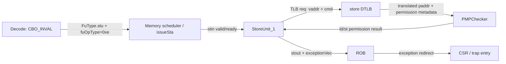

# XiangShan PR #4702：CBO.INVAL 权限检查类型错误分析

## 1. 摘要

本文分析香山昆明湖旧版代码中的一个 CBO 权限检查错误，以及 [OpenXiangShan/XiangShan#4702](https://github.com/OpenXiangShan/XiangShan/pull/4702/changes) 为什么能够修复它。

分析使用的旧版香山提交是 `92a95fb4d839f32c8094ce9e4520da9aaf771ffa`，PR #4702 的合入提交是 `0390f4d1ff47d20196e4bff642684de41836a80c`。后者的父提交正是前者，因此本文中的源码对比没有混入其他功能变更。

结论如下：

1. `CBO.INVAL` 在 Decode 阶段被标记为 `FuType.stu`，因此被分派到内存调度器中的 **Store Address execution unit（`StoreUnit` / `StaCfg`）**。本次波形中实际接收它的是 `inner_StoreUnit_1`。
2. 旧版 `StoreUnit` 无条件令 `io.tlb.req.bits.cmd := TlbCmd.write`。这个默认值适用于普通 store 和 `CBO.ZERO`，但不适用于 `CBO.INVAL/CLEAN/FLUSH` 的权限检查。
3. 测试把 `0xb0004000` 配成 PMP `R=1, W=0`。`CBO.INVAL` 应当通过 read/load 权限检查；旧版却按 write 检查，因 `W=0` 产生 `pmp.st=1`，最后错误上报 `store access fault`。
4. 本例中 S1 的 `storePageFault`、`storeAccessFault`、`storeGuestPageFault` 全部为 `0`；错误是在下一拍 S2 的 PMP 检查中产生的。这排除了页表异常、TLB miss 和旧异常位污染。
5. PR #4702 将 non-zero CBO 的请求命令改成 `read`，并把 TLB/PMP 返回的 load 类权限失败重新编码为 CBO 所要求的 store 类架构异常。它同时保留 `CBO.ZERO` 和普通 store 的 write 权限语义。

一句话根因是：

> **昆明湖的状态转移逻辑和 ISA 手册不符。** CBO.INVAL 虽然复用了 StoreUnit 和 store 类异常通路，但其页表/PMP 权限检查必须走 read/load 分支；旧版把“在哪个执行单元执行”错误地等同成了“按哪种权限访问”。

## 2. 分析范围与证据

| 项目 | 内容 |
|---|---|
| 旧版 XiangShan | `92a95fb4d839f32c8094ce9e4520da9aaf771ffa` |
| 修复提交 | `0390f4d1ff47d20196e4bff642684de41836a80c`，`fix(StoreUnit): cbo requires read permission (#4702)` |
| 测试源码 | [`bug-replay/main.c`](bug-replay/main.c) |
| 反汇编 | [`bug-replay/bug-replay-riscv64-xs.txt`](bug-replay/bug-replay-riscv64-xs.txt) |
| 旧版 emu 日志 | [`bug-replay/log.stdout`](bug-replay/log.stdout) |
| FST | `/nfs/home/yanyusong/XiangShanLab/tools/xiangshan-bugs-analyzer/xs-bug-replay-4702/xs-env/XiangShan/build/2026-08-24@11:39:43.fst` |
| 目标指令 | PC `0x80000304`，机器码 `0x0005200f`，`cbo.inval (a0)` |
| 目标地址 | `0xb0004000`，PMP `R=1, W=0` |
| 波形时钟 | `TOP.clock`，posedge 采样，相邻采样时间差为 2 |
| 动态 StoreUnit | `TOP.SimTop.l_soc.core_with_l2.core.memBlock.inner_StoreUnit_1` |

本文使用 `/nfs/home/yanyusong/XiangShanLab/tools/xiangshan-code-analyzer` 中的 `analyze-xiangshan-kunminghu` 技能追踪 Decode、StoreUnit、TLB、PMP、ROB 和异常通路；没有执行 weekly sync，源码始终保持在会触发问题的旧版提交。

本分析使用 wavekit 开源仓库中的 FstReader/VcdReader/FsdbReader 解析波形，并用 clock-sampled Waveform 数组按 cycle 查询信号值。实际使用的是 `/nfs/home/yanyusong/wavekit/.venv/bin/python` 中的 `wavekit.FstReader`，wavekit 提交为 `e0084194b73957fc1954e1e71788c5255a7b4a8b`。波形查询只读，没有重新运行仿真或修改 FST。

## 3. ISA 语义：权限类型与异常类型是两件事

### 3.1 CBO.INVAL 属于 cache-block management instruction

[Unprivileged ISA 的 CMO 章节 §19.1.2](https://docs.riscv.org/reference/isa/v20260120/unpriv/cmo.html) 将 CBO 指令分成不同类别：

- `CBO.INVAL`、`CBO.CLEAN`、`CBO.FLUSH` 属于 Zicbom 的 cache-block management instructions。
- `CBO.ZERO` 属于 Zicboz 的 cache-block zero instruction。

这个分类直接决定 PR #4702 为什么必须使用 `isCbo` 而不是 `isCboAll`：前三者使用 read/load 权限判定，`CBO.ZERO` 实际写零，仍使用 write 权限判定。

### 3.2 页表和 PMP 都把 management CBO 放在 read 权限组

[Supervisor-Level ISA §11.1.3.1](https://docs.riscv.org/reference/isa/v20260120/priv/supervisor.html) 规定：目标页没有 read permission 时，load、load-reserved 或 cache-block management instruction 会触发相应的 page fault。

[Machine-Level ISA 的 PMP 章节 §2.1.7.1](https://docs.riscv.org/reference/isa/v20260120/priv/machine.html) 同样规定：cache-block management instruction 访问没有 read permission 的 PMP 区域时会发生相应的 access fault。

因此，严谨表述是：

> `CBO.INVAL` 属于 cache-block management instruction；在页表和 PMP 权限检查适用时，它需要目标地址具备有效的 read/load 访问权限，否则会产生相应的访问异常。

这里的“需要读权限”只是权限检查语义，不表示指令会读取并返回数据，也不表示它还必须具备写权限。

CMO 章节还从“load 或 store 任一可访问即可”的角度描述 management CBO。两种表述在标准允许的权限编码内并不冲突：标准 PTE 和 PMP 都把 `W=1, R=0` 作为保留组合，而且 CMO 规范要求 PMP/PMA 在允许 write 时也允许 read。因而对于合法配置，按 read 权限检查完整覆盖了“load 或 store 可访问”的集合，同时正确接受 `R=1, W=0`。

### 3.3 内部按 load 检查，最终仍可报告 store 类异常

CMO 章节对 cache-block management instruction 另有架构异常分类规则：当访问不允许时，它报告 store page/access/guest-page fault。规范还说明实现通常按 store/AMO 类处理这些指令，因此使用 store/AMO exception 是合适的。

于是实现必须分开两个维度：

| 维度 | `CBO.INVAL/CLEAN/FLUSH` 的正确选择 |
|---|---|
| 页表/PMP 权限检查类型 | `read/load` |
| ROB/CSR 可见的架构异常类型 | `store page/access/guest-page fault` |

PR #4702 的核心不是简单地把所有 `store*Fault` 改成 `load*Fault`，而是先按 load 权限检查，再把内部 `.ld` 结果归一化到 CBO 的 `store*Fault` exception vector。这正是修复完整性的关键。

## 4. 最小测试程序如何暴露问题

### 4.1 构造一个只读 PMP 区域

测试程序在 S-mode 执行。Nexus-AM 的初始化代码把目标区间配置为只读：

```c
enable_pmp_TOR(5, 0xb0004000, 0x1000, 0, PMP_R); // r,!w
```

测试主体将计时器中断关闭，注册 store page fault 和 store access fault 处理器，然后执行：

```c
#define CBO_VA 0xb0004000UL

asm volatile(
    "mv a0, %0\n"
    ".word 0x0005200f\n"
    :
    : "r"(CBO_VA)
    : "a0", "memory");
```

异常处理器把 `permission_fault` 置为 1，跳过这条 32-bit CBO 指令并返回。最终 `_halt(permission_fault ? 1 : 0)` 将“错误地产生权限异常”转换成稳定的 BAD TRAP。

这段程序最小化了干扰因素：目标地址位于 cacheable 主存范围，地址自然对齐，TLB 命中且没有 page/guest-page fault，唯一刻意设置的条件就是 PMP `R=1, W=0`。

### 4.2 反汇编锚点

反汇编中的关键指令如下：

| PC | 指令 | 作用 |
|---:|---|---|
| `0x800002fc` | `lui a5,0x2c001` | 构造地址高位 |
| `0x80000300` | `slli a5,a5,0x2` | 得到 `0xb0004000` |
| `0x80000302` | `mv a0,a5` | 将目标地址放入 `a0` |
| `0x80000304` | `.word 0x0005200f` | `CBO.INVAL (a0)` |

### 4.3 正确与错误结果

不带 `.so` 的 standalone NEMU 执行结果为：

```text
HIT GOOD TRAP at pc = 0x0000000080000302
trap code:0
total guest instructions = 2216
NEMU exit with good state: 2, halt ret: 0
```

这说明参考设计没有为该 `CBO.INVAL` 误报权限异常。

旧版昆明湖 emu 的日志则为：

```text
Core  0's Commit SHA is: 92a95fb4d8, dirty: 0
unexpected premission fault pc = 0x80000304!
Core 0: HIT BAD TRAP at pc = 0x80000322
Core-0 instrCnt = 3,713, cycleCnt = 18,394, IPC = 0.201859
```

错误 PC 与反汇编完全一致。参考设计继续执行，DUT 却进入异常处理器；使用包含正确 CBO 语义的 reference model 做 difftest 时，两者会在 trap/CSR/下一提交 PC 上产生确定性差异。

## 5. CBO.INVAL 被分派到哪个执行单元

### 5.1 Decode 明确选择 FuType.stu

旧版 [`DecodeUnit.scala`](https://github.com/OpenXiangShan/XiangShan/blob/92a95fb4d839f32c8094ce9e4520da9aaf771ffa/src/main/scala/xiangshan/backend/decode/DecodeUnit.scala#L473-L482) 的 CBO decode table 是：

```scala
CBO_ZERO  -> XSDecode(..., FuType.stu, LSUOpType.cbo_zero , ...),
CBO_CLEAN -> XSDecode(..., FuType.stu, LSUOpType.cbo_clean, ...),
CBO_FLUSH -> XSDecode(..., FuType.stu, LSUOpType.cbo_flush, ...),
CBO_INVAL -> XSDecode(..., FuType.stu, LSUOpType.cbo_inval, ...)
```

`FuType.stu` 在 `FuConfig.StaCfg` 中对应名字为 `sta` 的 store-address execution unit，其架构异常输出包括 `storeAccessFault`、`storePageFault` 和 `storeGuestPageFault`。

### 5.2 MemBlock 实例化并连接 StoreUnit

[`MemBlock.scala`](https://github.com/OpenXiangShan/XiangShan/blob/92a95fb4d839f32c8094ce9e4520da9aaf771ffa/src/main/scala/xiangshan/mem/MemBlock.scala#L408-L412) 按 `StaCnt` 实例化 `StoreUnit`；随后把 `issueSta(i)`、store DTLB、PMP checker、LSQ 和 `writebackSta` 接到同一个单元。



动态波形进一步证明了实际路由：cycle `12101`，`inner_StoreUnit_1.io_stin_valid=1`、`ready=1`，`fuOpType=0xe`；同一请求携带 ROB index `140`，并发出地址 `0xb0004000`。`StoreUnit_0` 在该地址上没有有效请求。

所以问题的准确回答是：

> 这条 `CBO.INVAL` 被分派到 `FuType.stu` 对应的 Store Address execution unit；本次实例是 `MemBlock.inner_StoreUnit_1`。

## 6. 旧版为什么因默认 write 而出错

### 6.1 StoreUnit 把所有请求都编码成 write

旧版 [`StoreUnit.scala:205-219`](https://github.com/OpenXiangShan/XiangShan/blob/92a95fb4d839f32c8094ce9e4520da9aaf771ffa/src/main/scala/xiangshan/mem/pipeline/StoreUnit.scala#L205-L219) 中：

```scala
io.tlb.req.valid             := s0_valid
io.tlb.req.bits.vaddr        := s0_vaddr
io.tlb.req.bits.checkfullva  := s0_use_flow_rs || s0_use_flow_vec
io.tlb.req.bits.cmd          := TlbCmd.write
io.tlb.req.bits.memidx.is_ld := false.B
io.tlb.req.bits.memidx.is_st := true.B
```

`TlbCmd` 的编码为：

```scala
def read  = "b00".U
def write = "b01".U
def exec  = "b10".U
```

因此 `TlbCmd.write` 在 3-bit `cmd` 总线上是 `3'b001`。生成的 `SimTop.fir` 也明确保留了旧版语义：

```text
connect io.tlb.req.bits.cmd, UInt<1>(0h1) @[.../StoreUnit.scala 209:38]
```

StoreUnit 原本主要服务普通 store，默认 write 对普通 store 是合理的；`CBO.ZERO` 也确实需要写权限。错误发生在 management CBO 复用这条管线后，没有为它增加权限类型分支。

### 6.2 cmd 同时控制页表和 PMP 检查分支

[`TLB.scala:395-421`](https://github.com/OpenXiangShan/XiangShan/blob/92a95fb4d839f32c8094ce9e4520da9aaf771ffa/src/main/scala/xiangshan/cache/mmu/TLB.scala#L395-L421) 根据 `cmd` 选择权限：

```scala
val isLd = TlbCmd.isRead(cmd) && !TlbCmd.isAmo(cmd)
val isSt = TlbCmd.isWrite(cmd) || TlbCmd.isAmo(cmd)
val ldPermFail = !(modeCheck && Mux(hlvx, perm.x, perm.r || mxr(idx) && perm.x))
val stPermFail = !(modeCheck && perm.w)
val ldPf = (ldPermFail || pf) && isLd
val stPf = (stPermFail || pf) && isSt
```

同一个 `req_out(i).cmd` 还由 TLB 传给 PMP checker。[`PMP.scala:404-412`](https://github.com/OpenXiangShan/XiangShan/blob/92a95fb4d839f32c8094ce9e4520da9aaf771ffa/src/main/scala/xiangshan/backend/fu/PMP.scala#L404-L412) 中：

```scala
resp.ld := TlbCmd.isRead(cmd) && !TlbCmd.isAmo(cmd) && !cfg.r
resp.st := (TlbCmd.isWrite(cmd) || TlbCmd.isAmo(cmd)) && !cfg.w
```

于是测试中的 PMP `R=1, W=0` 会得到：

```text
cmd = write
isWrite(cmd) = 1
cfg.w = 0
pmp.st = 1
```

这个 `pmp.st` 并不表示 CBO 真正执行了 store；它只是错误的 `cmd` 选择了错误的权限判定分支。

### 6.3 错误沿 StoreUnit 的隐式状态生命周期传播

StoreUnit 没有一个为 CBO 单独命名的显式 FSM，本例的“状态转移”由 `s0/s1/s2/s3/sx` valid 寄存器和 exception vector 构成：

| 阶段 | 旧版动作 | 本例结果 |
|---|---|---|
| S0 | 形成 VA，发出 TLB 请求，`cmd=write` | `vaddr=0xb0004000` |
| S1 | 接收 TLB 结果，只读取 `.pf.st/.af.st/.gpf.st` | 三个异常位均为 0，TLB hit |
| S2 | 使用同一 write cmd 的 PMP 结果；`storeAccessFault := ... || s2_pmp.st` | `pmp.st=1`，置位 exception vector 7 |
| S3/SX | 保持异常元数据并写回 | `stout.exceptionVec[7]=1` |
| ROB/CSR | 选择最老异常，redirect 并进入 trap | `scause=7`，`sepc=0x80000304` |

正确状态转移本应是：S0 为 management CBO 选择 read；只读 PMP 上 `pmp.ld=0`；S2 不产生异常；指令继续完成。旧版则从“R-only 合法”错误跳转到“store access fault”，这就是“状态转移逻辑和 ISA 手册不符”的具体含义。

## 7. wavekit 波形证据

### 7.1 指令身份闭合

wavekit 在 cycle `12101` / time `24202` 观察到：

| 字段 | 值 |
|---|---:|
| StoreUnit 实例 | `inner_StoreUnit_1` |
| `io_stin_valid / ready` | `1 / 1` |
| `fuOpType` | `0xe`，即 `LSUOpType.cbo_inval` |
| ROB pointer | flag/value = `0 / 0x8c`，即 entry 140 |
| SQ index | `0x11` |
| FTQ pointer/offset | flag/value/offset = `1 / 0x34 / 4` |
| ROB debug PC | `0x80000304` |
| ROB debug instruction | `0x0005200f` |

因此反汇编 PC、机器码、StoreUnit 请求和后续 ROB 异常属于同一条动态指令，不是仅凭地址相同进行猜测。

### 7.2 用户指定的五类重点信号

Chisel 的点号字段在 FST 中被扁平化为下划线名字。`s1_out` 本身经过综合别名化，等价可观察点是 `s1_exception_new_vec_*` 和直接赋值自 `s1_out` 的 `io_lsq_bits_uop_exceptionVec_*`。

| 源码关注点 | FST 中的实际观察 | 周期和值 | 结论 |
|---|---|---|---|
| `io.tlb.req.bits.vaddr` | `inner_StoreUnit_1.io_tlb_req_bits_vaddr[49:0]` | cycle 12101: `0xb0004000`，`req.valid=1` | 请求地址与测试构造一致 |
| `io.tlb.req.bits.cmd` | StoreUnit 和 store-DTLB 层级均无动态 signal | 旧源码和 FIR 均为常量 `write=3'b001` | 端口被常量传播删除；不是“波形漏查到 read” |
| `s1_out.uop.exceptionVec(storePageFault)` | `s1_exception_new_vec_15` / `io_lsq_bits_uop_exceptionVec_15` | cycle 12102: `0` | 没有 store page fault |
| `s1_out.uop.exceptionVec(storeAccessFault)` | `s1_exception_new_vec_7` / `io_lsq_bits_uop_exceptionVec_7` | cycle 12102: `0` | S1 没有产生 access fault |
| `s1_out.uop.exceptionVec(storeGuestPageFault)` | `s1_exception_new_vec_23` / `io_lsq_bits_uop_exceptionVec_23` | cycle 12102: `0` | 没有 guest page fault |

对上述控制信号和数据字段查询 `load_unknown_mask`，目标窗口内均为 0，不存在 X/Z 被按 0 解释而导致的假结论。

### 7.3 从请求到 trap 的逐周期时间线

| cycle | time | 事件 | 波形证据 |
|---:|---:|---|---|
| 12101 | 24202 | CBO.INVAL 进入 StoreUnit_1 S0 | `stin.valid=ready=1`，`fuOpType=0xe`，`tlb.req.valid=1`，VA=`0xb0004000` |
| 12102 | 24204 | S1 得到 TLB hit | `resp.valid=1`，`miss=0`，PA=`0xb0004000`；S1 的 exceptionVec 7/15/23 全为 0 |
| 12103 | 24206 | S2 执行错误的 write PMP 检查 | `io_pmp_st=1`，`s2_out_uop_exceptionVec_7_REG=1`；page/guest-page 位仍为 0 |
| 12105 | 24210 | StoreUnit 写回错误异常 | `io_stout_valid=1`，ROB=`0x8c`，exceptionVec 7/15/23=`1/0/0` |
| 12106 | 24212 | ROB writeback port 19 接收 | valid=1，ROB=`0x8c`，exceptionVec[7]=1 |
| 12110 | 24220 | ROB 选择异常并 redirect | `io_exception_valid=1`，instr=`0x0005200f`，exceptionVec[7]=1，redirect ROB=`0x8c` |
| 12112 | 24224 | HS trap entry 生成 CSR 写入 | `scause=7`，`sepc=0x80000304`，`stval=0xb0004000` |
| 12113 | 24226 | CSR 状态可见 | `scause.reg=7`，`sepc.reg=0x80000304`，`stval.reg=0xb0004000` |

S0 接口没有 backpressure，TLB 也没有 miss/replay；从 S0 接收到 StoreUnit 写回为 4 cycles，到 ROB 产生异常 redirect 为 9 cycles。该错误不是由资源阻塞或重放引起，而是确定性的权限命令错误。

```waveform-draw
{
  "signal": [
    { "name": "clk", "wave": "p............" },
    { "name": "tlb.req.valid", "wave": "0100000000000" },
    { "name": "tlb.req.vaddr", "wave": "x=x..........", "data": ["0xb0004000"] },
    { "name": "tlb.req.cmd", "wave": "x=x..........", "data": ["write (const)"] },
    { "name": "s1.storePageFault", "wave": "0000000000000" },
    { "name": "s1.storeAccessFault", "wave": "0000000000000" },
    { "name": "s1.storeGuestPageFault", "wave": "0000000000000" },
    { "name": "s2.valid & pmp.st", "wave": "0001000000000" },
    { "name": "s3.valid & exceptionVec[7]", "wave": "0000100000000" },
    { "name": "stout.valid & exceptionVec[7]", "wave": "0000010000000" },
    { "name": "ROB.wb19.valid & exceptionVec[7]", "wave": "0000001000000" },
    { "name": "ROB.exception.valid & exceptionVec[7]", "wave": "0000000000100" },
    { "name": "HS trap scause.valid", "wave": "0000000000001" }
  ],
  "config": { "hscale": 1 }
}
```

上图从 cycle `12100` 开始，每格一个 `TOP.clock` posedge。`tlb.req.cmd` 是源码及生成 FIR 证明的常量语义，不是 FST 中可加载的动态 net。

## 8. PR #4702 如何修复并防止同类错误

PR #4702 只修改 `StoreUnit.scala`，但覆盖了权限请求和异常返回两条方向，因此不是只修复本测试表象。

### 8.1 精确区分 management CBO 与 CBO.ZERO

```scala
val s0_isCbo = s0_use_flow_rs && LSUOpType.isCboAll(s0_stin.uop.fuOpType)
val s0_isCbo_noZero = s0_use_flow_rs && LSUOpType.isCbo(s0_stin.uop.fuOpType)
```

[`LSUOpType.isCbo`](https://github.com/OpenXiangShan/XiangShan/blob/92a95fb4d839f32c8094ce9e4520da9aaf771ffa/src/main/scala/xiangshan/package.scala#L582-L596) 只匹配 `clean/flush/inval`；`isCboAll` 还包括 `zero`。这个分类与 ISA 的 Zicbom/Zicboz 分类一致。

### 8.2 在请求端选择正确权限命令

```diff
- io.tlb.req.bits.cmd := TlbCmd.write
+ io.tlb.req.bits.cmd := Mux(s0_isCbo_noZero, TlbCmd.read, TlbCmd.write)
```

效果是：

- `CBO.INVAL/CLEAN/FLUSH` 进入 TLB 和 PMP 的 read 分支。
- `CBO.ZERO` 仍进入 write 分支。
- 普通 scalar/vector store 的行为不变。

对于本测试，修复后 PMP 检查 `cfg.r=1`，所以 `pmp.ld=0`，不会再误置 `storeAccessFault`。

### 8.3 在返回端把 load 权限失败归一化为 store 类异常

TLB 现在会在 read command 下产生 `.pf.ld/.af.ld/.gpf.ld`。PR 将这些位并入 StoreUnit 的 store exception vector：

```scala
s1_out.uop.exceptionVec(storePageFault) :=
  (io.tlb.resp.bits.excp(0).pf.st || io.tlb.resp.bits.excp(0).pf.ld) && s1_vecActive
s1_out.uop.exceptionVec(storeAccessFault) :=
  (io.tlb.resp.bits.excp(0).af.st || io.tlb.resp.bits.excp(0).af.ld) && s1_vecActive
s1_out.uop.exceptionVec(storeGuestPageFault) :=
  (io.tlb.resp.bits.excp(0).gpf.st || io.tlb.resp.bits.excp(0).gpf.ld) && s1_vecActive
```

PMP 路径也增加了同样的归一化：

```scala
s2_out.uop.exceptionVec(storeAccessFault) :=
  (s2_in.uop.exceptionVec(storeAccessFault) ||
   s2_pmp.st ||
   s2_pmp.ld && s2_isCbo_noZero ||
   ...) && s2_vecActive
```

这里的 `&& s2_isCbo_noZero` 很重要：普通 StoreUnit 请求不能把一个无关的 `pmp.ld` 当成 store fault；只有 management CBO 才执行这种“read 权限结果 -> store 架构异常”的转换。

### 8.4 修复后的场景矩阵

| 场景 | 旧版行为 | PR #4702 后行为 | 正确性 |
|---|---|---|---|
| `CBO.INVAL`，PMP `R=1,W=0` | 按 write，误报 `pmp.st` | 按 read，允许执行 | 修复本 bug |
| `CBO.INVAL`，无 read 权限 | 可能按 W 得到错误结论 | `.ld` 失败并转换为 store access fault | 权限与异常类型均正确 |
| `CBO.INVAL`，R-only PTE | 误报 store page fault | read permission 通过 | 修复页表同类 bug |
| `CBO.INVAL`，无 read PTE/G-stage 权限 | 检查错误分支 | `.pf.ld/.gpf.ld` 转换成 store page/guest-page fault | 覆盖虚拟化路径 |
| `CBO.ZERO`，`R=1,W=0` | store fault | 仍为 store fault | 保留 Zicboz 写语义 |
| 普通 store，`R=1,W=0` | store fault | 仍为 store fault | 无回归 |

因此，PR 的保证来自三层闭环：**正确分类、正确请求命令、正确异常重编码**。只改第一层会让异常丢失，只改异常名称会继续误判 R-only 区域；三处修改共同实现了 ISA 语义。

## 9. Difftest 与架构可见差异

StoreUnit S1/S2 的信号是推测执行期微架构状态；当 ROB 在 cycle `12110` 选择 exception vector 7 并 redirect 后，差异变成架构可见状态：

| 状态 | 旧版 DUT | 正确参考设计 |
|---|---|---|
| CBO 是否陷入 | 是 | 否 |
| cause | `store access fault`，7 | 无异常 |
| `sepc` | `0x80000304` | 不写入该 trap 状态 |
| `stval` | `0xb0004000` | 不写入该 trap 状态 |
| 下一控制流 | trap handler | `0x80000308` 后续代码 |
| 测试结果 | BAD TRAP | GOOD TRAP |

所以使用带有正确 #4702 对应语义的 NEMU reference 时，difftest 可以在 trap event、CSR 状态或后续提交 PC 上发现差异。若使用过旧、同样错误或跳过该指令的 reference `.so`，可能只看到测试自身的 BAD TRAP 而没有立即打印 difftest mismatch；这不改变 DUT 的 ISA 错误，但说明回归环境必须固定 reference 版本。

## 10. 跨边界代码解析

本测试刻意不制造跨页、跨 cache line 或 MMIO/uncache 访问，以隔离权限检查：

| 边界 | 本测试情况 | 独立检查 | 结论 |
|---|---|---|---|
| 虚拟页 | 未跨页；TLB hit，VA/PA 均为 `0xb0004000` | `miss=0`，PF/GPF 均为 0 | 页表不是本次误报来源 |
| cache line | 地址位于 cache block 起始位置 | 无 split/replay 证据 | 不涉及跨行合并 |
| PMP | 地址正落入 `R=1,W=0` 的 TOR 区域 | read 与 write 权限必须分别判断 | 唯一被激活的权限边界 |
| MMIO/uncache | PMA 为 cacheable main memory | `mmio/nc=0` | 不涉及 uncache 异常 |

PR 仍需要对 page fault 和 guest page fault 做同样转换，因为这些是其他合法执行环境中可达的边界；这正是它同时合并 `.pf.ld` 和 `.gpf.ld` 的原因。

## 11. 验证特别注意

| Verification ID | 风险 / 不变量 | Directed stimulus | 期望观察 | Checker / coverage |
|---|---|---|---|---|
| `CBO_R_ONLY_PMP` | management CBO 不得要求 W | 在 PMP `R=1,W=0` 上分别执行 inval/clean/flush | `cmd=read`，`pmp.ld=0`，三个 store fault 位均为 0 | cmd scoreboard；PMP permission checker；三指令 cross coverage |
| `CBO_NO_READ_PMP` | 无 R 时必须拒绝，并使用 CBO 架构异常类型 | PMP `R=0,W=0` 上执行三种 management CBO | `pmp.ld=1`，最终仅 `storeAccessFault=1` | permission-to-exception mapping assertion |
| `CBO_R_ONLY_PTE` | 只读页不得误报 store page fault | S/U-mode R-only leaf PTE | TLB read permission 通过，`storePageFault=0` | PTE permission scoreboard |
| `CBO_NO_READ_PTE` | `.pf.ld` 不得在 StoreUnit 丢失 | 无 R 的合法 leaf/无访问页执行 CBO | `.pf.ld=1`，最终 `storePageFault=1` | S1 exception conversion assertion |
| `CBO_GUEST_PERMISSION` | G-stage `.gpf.ld` 必须转换 | VS/VU 下禁止 read 的 G-stage 映射 | 最终 `storeGuestPageFault=1`，正确 GPA/tval | virtualization exception scoreboard |
| `CBO_ZERO_WRITE` | 修复不得把 CBO.ZERO 改成 read | PMP/PTE `R=1,W=0` 上执行 CBO.ZERO | `cmd=write`，产生 store fault | `isCbo` 与 `isCboAll` classification coverage |
| `NORMAL_STORE_REGRESSION` | 普通 store 仍检查 W | SB/SH/SW/SD 覆盖 R-only、RW、no-access | `cmd=write`，结果与修复前一致 | store permission regression |
| `CMD_PIPE_ALIGNMENT` | S0 cmd、S1 TLB result、S2 CBO 类型必须属于同一 uop | 连续交错 CBO.ZERO、CBO.INVAL、普通 store，并施加 backpressure | ROB/SQ identity 不错位，异常只落到对应 uop | pipeline identity scoreboard；valid/ready hold assertion |
| `NO_X_ON_PERMISSION` | 权限决策不能依赖 X/Z | reset 后首个 CBO、TLB refill/redirect 同周期 | cmd、CBO 分类和 exception vector 均已知 | unknown-mask assertion |
| `REQ_AND_REDIRECT` | 被 kill 的 CBO 不得形成 trap/cache side effect | CBO 请求与更老 redirect 重叠 | 被 kill ROB 不提交、不报告异常、不发出可见 CBO 操作 | flush/replay checker |

建议把本文测试保留为 directed regression，并至少扩展为 `3 种 management CBO × 3 种权限来源（PTE/PMP/G-stage）× 允许/拒绝` 的交叉覆盖。仅测试普通 RW 页无法发现这个 bug，因为 read 与 write 两种错误分类都会通过。

## 12. 最终结论

这个 bug 的经典之处在于它不是 CBO cache 操作本身实现错了，而是执行通路复用时混淆了两个概念：

- `CBO.INVAL` 为了调度、顺序性和异常提交而进入 StoreUnit，并最终使用 store 类架构异常；
- 但它在页表和 PMP 中属于 read/load 权限检查语义。

旧版把 StoreUnit 的默认 `write` 命令直接继承给 CBO，导致只读区域错误地产生 `store access fault`。波形完整显示了 `S1 无异常 -> S2 pmp.st -> StoreUnit exceptionVec[7] -> ROB redirect -> scause=7` 的错误状态链。

PR #4702 用 `s0_isCbo_noZero` 选择 read command，再在 S1/S2 将 load 权限失败转换成 CBO 需要的 store 异常，同时排除 `CBO.ZERO`。因此它既修复了当前 R-only PMP 场景，也覆盖了未来的 PTE、PMP 和 guest-page 权限失败场景，并保持普通 store 与 `CBO.ZERO` 的行为不变。

## Q&A

以下回答中的路径和行号均对应本文分析所使用的旧版昆明湖源码。

### Q1. 为什么昆明湖会让 CBO 指令走 Store Unit？

**结论：这里的“Store Unit”特指 Store Address（STA）流水，也就是 `StoreUnit`，不是传递 store data 的 STD 流水。** 昆明湖把 CBO 放进这条路径，是因为 CBO 的微架构需求是“计算一个内存地址、完成地址翻译和权限检查、与 store/LSQ 保持顺序、在 ROB 提交时触发 cache-block 操作”，而不是“读取数据并写回整数寄存器”。STA 正好是这些功能的现成载体。

#### 1. 解码结果已经把 CBO 定义成 store-family 的地址操作

旧版 `DecodeUnit` 对四条 CBO 指令都使用同一个控制形状：一个整数源寄存器、S-type immediate、没有目的寄存器，并选择 `FuType.stu`：

```scala
// src/main/scala/xiangshan/backend/decode/DecodeUnit.scala:473-482
CBO_INVAL -> XSDecode(SrcType.reg, SrcType.DC, SrcType.X,
  FuType.stu, LSUOpType.cbo_inval, SelImm.IMM_S)
```

这表示 CBO 的输入本质上是 `rs1 + imm` 形成的虚拟地址。`FuType.stu` 只表示它属于 store/地址侧的执行族，并不表示该指令的页表或 PMP 检查一定需要写权限。实际的 STA/STD 划分由执行单元配置和 issue 参数完成：

- `src/main/scala/xiangshan/backend/fu/FuConfig.scala:415-459` 中，`StaCfg` 只有一个 `IntData` 地址源，不写回寄存器，并声明 `storeAccessFault`、`storePageFault`、`storeGuestPageFault` 等异常输出；
- 同一处的 `StdCfg` 是数据流水，只接收整数或浮点数据源，延迟为 0，不提供 TLB、PMP 或这些地址异常；
- `src/main/scala/xiangshan/mem/MemBlock.scala:407-412` 分别实例化 `storeUnits`（STA）和 `stdExeUnits`（STD），说明“store unit”在代码中已经被拆成地址和数据两个不同的微结构单元。

所以 CBO 选择的是“store address execution”，而不是“store data execution”。

#### 2. `StoreUnit` 已经包含 CBO 所需的完整地址侧流水

`StoreUnit` 对普通 store 和 CBO 共用地址生成和地址检查的前半段：

```scala
// src/main/scala/xiangshan/mem/pipeline/StoreUnit.scala:134-165
val s0_saddr = s0_stin.src(0) + SignExt(s0_stin.uop.imm(11,0), VAddrBits)
val s0_isCbo = s0_use_flow_rs && LSUOpType.isCboAll(s0_stin.uop.fuOpType)
val s0_addr_aligned = ... || s0_isCbo
```

这段代码给出了两个重要的设计事实：CBO 使用和 store 相同的 `rs1 + S-immediate` 地址形成器；同时 CBO 不受普通 store 数据宽度对齐判断的约束。之后的 S0/S1/S2 流水继续完成：

- `StoreUnit.scala:205-223` 发出 DTLB 请求并携带虚拟地址、ROB/PC 等身份信息；
- `StoreUnit.scala:285-324` 锁存 `s1_isCbo`、TLB 响应和 replay/violation 信息；
- `StoreUnit.scala:364-385` 把 TLB 结果转换为 store 类异常向量；
- `StoreUnit.scala:447-477` 接收 PMP 结果并生成 access fault；
- `StoreUnit.scala:510-522` 通过 `lsq_replenish` 把地址、异常和 CBO/uncache 标记交给 LSQ。

这些功能都是“地址侧的内存操作基础设施”。`MemBlock.scala:668-680` 还为 load 和 store address 配置了独立的 DTLB 请求端；`MemBlock.scala:1221-1241` 将 StoreUnit 同时连接到 DCache 的 STA 端、StoreQueue 的 `storeAddrIn`、store DTLB、PMP 和 redirect。新建一个 CBO 单元会重复这整套翻译、权限、replay、flush 和精确异常逻辑，没有微架构收益。

#### 3. CBO 必须进入 StoreQueue 的顺序和提交协议

CBO 的 cache-block 副作用不能在指令刚被发射时就对 cache 可见，它必须像 store 一样遵守 ROB/LSQ 顺序。代码把地址和数据明确分开：`LSQWrapper.scala:79-86` 将 `storeAddrIn` 接到 STA，将 `storeDataIn` 接到 STD。CBO 只需要前者，真正的 CMO 请求由 StoreQueue 在提交阶段处理：

- `StoreQueue.scala:811-819` 把 “Memory mapped IO / other uncached operations / CMO” 作为同一类需要延迟提交的操作；
- `StoreQueue.scala:872` 让 CBO 绕过普通 MMIO store request；
- `StoreQueue.scala:957-1006` 只有 ROB 头部的 CBO、并且 store buffer 已 flush 后，才发出 `cmoOpReq`；
- `StoreQueue.scala:1024-1060` 通过 `mmioStout`/`cboZeroStout` 完成 CMO 的 ROB 写回和流水 flush；
- `StoreQueue.scala:1394-1398` 以 `mmioStout.fire` 和 CBO opcode 产生 difftest 的 CBO 提交事件。

这解释了为什么 CBO 不能简单地放进 LoadUnit：它需要 store buffer drain、ROB-head gating、CMO response 和 StoreQueue writeback，这些状态机都已经存在于 store/uncache 侧。`CBO.ZERO` 也有 store-like 的特殊性，`StoreQueue.scala:583-610` 直接把它的数据定义为 `0.U`，但这仍然是在 StoreQueue 中完成的，并不要求 CBO 经过 STD 的普通数据生产路径。

#### 4. 为什么不是 Load Unit 或 STD？

- `LoadUnit.scala:380-400` 的地址请求默认使用 load/read 语义（`memidx.is_ld`、`is_st=false`），并围绕 load queue、load replay 和数据返回组织流水；`LoadUnit.scala:1750-1767` 的最终输出还包含 load 数据和整数寄存器写回。CBO 没有要返回的软件可见数据，也不应该产生 load writeback。
- `MemBlock.scala:81-87` 中 `Std` 的功能几乎只是把 `src(0)` 数据转发到输出；它没有地址生成、TLB、PMP、触发器或地址异常接口。CBO 解码的第二个源是 `SrcType.DC`，因此它没有需要送入 STD 的 store data。

从微架构分工看，STA 是“地址、权限、顺序和异常的载体”，STD 是“数据的载体”，LoadUnit 是“读数据并返回的载体”。CBO 只需要第一类能力，最终的 cache-block 副作用则由 StoreQueue 的 CMO 状态机完成。

#### 5. 复用 StoreUnit 的边界：执行载体不等于权限语义

旧版 `StoreUnit.scala:205-223` 为 TLB 请求设置了 store 的默认 command。这个默认值是实现复用留下的语义耦合：CBO 借用了 store 的地址流水，但 CBO 的页表/PMP权限检查并不因此变成“必须有写权限”。因此应当把两个问题分开：

1. **走哪条流水？** 走 STA/StoreUnit，以复用地址生成、TLB、PMP、LSQ、ROB 和精确异常基础设施；
2. **这次 TLB/PMP 请求检查什么权限？** 由具体 LSU opcode 决定。普通 store 需要写权限，management CBO 需要按 ISA 进行 read/load 权限检查，`CBO.ZERO` 仍保持其自身的 store-like 语义。

因此，“CBO 走 Store Unit”是一个合理的微架构复用选择；真正的问题是旧代码把“使用 StoreUnit”错误地等同成了“使用 write command”。这也正是该 bug 能够在地址和提交流程都正确的情况下，仍然产生错误 store exception 的根源。

### Q2. CBO 指令从解码到提交的完整执行路径是什么？

旧版源码可以把路径串成一条明确的链：

```text
DecodeUnit
  -> STA issue queue
  -> StoreUnit S0/S1/S2
  -> StoreQueue storeAddrIn
  -> ROB head / CMO state machine
  -> cmoOpReq / cmoOpResp
  -> mmioStout
  -> ROB commit / difftest
```

代码依据是：`DecodeUnit.scala:476-482` 将 CBO 解码为 `FuType.stu`；`NewDispatch.scala:49-52` 明确说明 STD IQ 不直接 dispatch；`Scheduler.scala:380-405` 将 memory issue queue 按 STA、LDU 和 STD 分开；`MemBlock.scala:1229-1241` 把 `issueSta` 接到 `StoreUnit`，并把它连接到 `StoreQueue.storeAddrIn` 和 store DTLB。StoreUnit 在 `StoreUnit.scala:134-164` 形成地址，在 `205-223` 发出 TLB/PMP 相关请求，在 `364-385` 产生地址异常，在 `447-522` 形成最终的地址侧结果。

真正的 CMO 副作用不在 StoreUnit 内直接发生。`StoreQueue.scala:811-820` 定义了 MMIO/uncached/CMO 的五阶段状态机，`957-1006` 在 ROB 头部、store buffer 已清空后发出 `cmoOpReq`，`1024-1041` 通过 `mmioStout` 写回，`1394-1398` 再产生 `cbo.inval` difftest 事件。因此 StoreUnit 是地址和异常入口，StoreQueue 才是有序的 CMO 提交者。

### Q3. CBO 为什么只需要 Store Address（STA），不需要 Store Data（STD）？

CBO 的唯一软件输入是目标地址。`DecodeUnit.scala:478-481` 对 CBO 使用 `SrcType.reg, SrcType.DC, SrcType.X`，其中第二个源是 `DC`，没有第二个数据寄存器，也没有目的寄存器。`StoreUnit.scala:135` 用 `src(0) + imm` 计算地址，而 `LSQWrapper.scala:79-86` 把 `storeAddrIn` 和 `storeDataIn` 设计成两个独立接口。

STD 的实现也证明它不是 CBO 的执行单元：`MemBlock.scala:81-87` 中的 `Std` 只把 `io.in.bits.data.src(0)` 转发为输出数据；`ExeUnit.scala:443-468` 的 `MemExeUnit` 只搬运数据、ROB index 和 SQ index，没有 TLB、PMP 或地址异常接口。源码中 STD IQ 会复制 STA IQ 的 uop（`Scheduler.scala:500-517`），这是为了普通 store 的数据就绪协议，并不意味着 management CBO 需要一个数据副作用。对于唯一真正需要“写零数据”的 `CBO.ZERO`，数据值由 `StoreQueue.scala:583-610` 特判为 `0.U`，仍然由 StoreQueue 管理，而不是由 CBO 读取一个软件数据源。

### Q4. `FuType.stu` 如何区分 STA 和 STD？

`FuType.stu` 本身并不能独立区分两个执行单元。`FuConfig.scala:108-112` 的 `fuSel` 只是比较 `uop.fuType === this.fuType.U`，而 `StaCfg` 与 `StdCfg` 在 `FuConfig.scala:434-459` 中都使用 `FuType.stu`。真正的区分来自配置名称和 issue topology：

- `ExeUnitParams.scala:269-281` 用配置名分别定义 `hasStoreAddrFu`（`name == "sta"`）和 `hasStdFu`（`name == "std"`）；
- `IssueBlockParams.scala:177-185` 分别统计 `StaCnt` 和 `StdCnt`；
- `Parameters.scala:469-496` 明确建立 `STA0/STA1` 与 `STD0/STD1` 两组不同的 issue block；
- `Scheduler.scala:383-396` 用 `StaCnt` 找地址 IQ，用 `StdCnt` 找数据 IQ。

因此准确的说法不是“CBO 由 `FuType.stu` 自动选择了唯一的 StoreUnit”，而是：CBO 被标记为 store family，memory scheduler 根据 STA 配置和地址源形状把它送入 Store Address 路径；STD 是与 STA 配对的数据通路。

### Q5. CBO 为什么必须经过 StoreQueue，而不能在 StoreUnit 中直接执行 cache 操作？

StoreUnit 处于乱序执行的地址流水中，而 CMO 副作用必须按程序顺序、在 ROB 提交边界发生。`StoreQueue.scala:811-820` 的注释直接把 CMO 放入“写回、等待 ROB head、请求、响应、写回 ROB、提交”的状态机。`StoreQueue.scala:960` 的 `deqCanDoCbo` 只在当前 `deqPtr` 对应的 SQ entry 已分配、地址有效且没有异常时成立；`StoreQueue.scala:996-1005` 还要求先完成 `flushSbuffer`，再发 `cmoOpReq`。

如果 StoreUnit 在发射时直接操作 cache，年轻 CBO 可能越过更老的 store 或异常指令，造成 cache 已经改变但 ROB 最终 flush 的不可恢复副作用。把操作交给 StoreQueue，才能利用已有的 store buffer drain、ROB-head gating、CMO response 和精确提交机制。

### Q6. CBO 指令什么时候分配 StoreQueue entry？

StoreQueue entry 在 dispatch/enqueue 阶段分配，而不是等 StoreUnit 计算完地址才分配。`StoreQueue.scala:260-277` 定义了 `allocated`、`addrvalid`、`datavalid`、`pending`、`hasException` 等状态；`StoreQueue.scala:366-417` 根据 `io.enq.req` 设置 `allocated(i) := true.B`，保存 `uop`，并把地址/数据有效位清零、`waitStoreS2` 置位。

随后 STA 地址结果通过 `storeAddrIn` 回填：`StoreQueue.scala:499-542` 保存 `paddr`、`vaddr`、mask、`uop` 和 `sqIdx`；S2 的补充结果在 `554-576` 更新 `pending/mmio/hasException`。这使 CBO 在地址翻译尚未完成时就已经拥有 SQ/ROB 身份，发生 TLB miss、redirect 或 exception 时可以精确地找到并回收同一条指令。

### Q7. 为什么 CBO 的 cache 副作用必须等到 ROB head 才能发生？

源码用“SQ 头指针 + ROB pending 信息”实现这个约束。`StoreQueue.scala:832-839` 只有在 `io.rob.pendingst`、当前 uop 的 ROB index 等于 `pendingPtr`、该 entry 的 `pending/datavalid/addrvalid` 都有效且没有异常时，才进入 uncache/CMO 状态机；对 CBO 而言，`StoreQueue.scala:960` 又以 `uop(deqPtr)` 为基础生成 `deqCanDoCbo`。

这不是人为增加的延迟，而是精确状态的必要条件：CBO 会使 cache 状态发生可见变化，必须保证所有更老的 store 已完成、所有更老的异常已经决定，并且不会被更老的 redirect 撤销。`StoreQueue.scala:1029` 还把 `deqCanDoCbo` 写入 `flushPipe`，显式要求 CMO 期间保持流水顺序。

### Q8. CBO.INVAL、CBO.CLEAN、CBO.FLUSH 在昆明湖内部有什么区别？

三条 management CBO 在解码时分别绑定不同的 `LSUOpType`（`DecodeUnit.scala:479-481`）。操作码编码和分类在 `package.scala:582-596`：`cbo_clean = 1100b`、`cbo_flush = 1101b`、`cbo_inval = 1110b`，`isCbo` 识别这三类，而 `isCboAll` 还额外包含 `cbo_zero`。

StoreQueue 在 ROB-head 阶段保存完整 uop（`StoreQueue.scala:832-838`），取出 `uncacheUop.fuOpType(1,0)` 作为 `cmoOpCode`（`StoreQueue.scala:823-828`），再由 `cmoOpReq.bits.opcode` 发送（`957-999`）。因此三条指令共用地址翻译、顺序和响应状态机，但通过 `fuOpType` 保留各自的 CMO 子操作。`cbo.inval` 还有专门的 difftest 事件条件（`StoreQueue.scala:1394-1398`）。

### Q9. CBO.ZERO 为什么不能和 INVAL/CLEAN/FLUSH 使用完全相同的权限命令？

源码已经把它们分成两类：`LSUOpType.isCboAll` 包含 ZERO，而 `LSUOpType.isCbo` 只包含 management CBO（`package.scala:592-596`）。StoreUnit 在 S2 同时保存 `s2_isCbo` 和 `s2_isCbo_noZero`（`StoreUnit.scala:465-466`），只有后者会进入 `lsq_replenish.mmio` 的 CMO/uncache 分支（`StoreUnit.scala:510-514`）。

ZERO 还会经过 StoreQueue 的特殊路径：`StoreQueue.scala:963-979` 记录它进入 store buffer 并等待 buffer flush，`StoreQueue.scala:1043-1060` 通过 `cboZeroStout` 写回；数据写入在 `StoreQueue.scala:594-599` 对 `cbo_zero` 强制使用 `0.U`。这表明 ZERO 具备实际写入零值的 store-like 语义，不能因为 management CBO 需要 read 权限，就把所有 CBO 无条件改成同一种命令。

### Q10. TLB request 的 `cmd` 是如何影响 PTE 权限检查的？

`MMUBundle.scala:382-396` 定义 `TlbCmd.read = 00b`、`write = 01b`，并由 `isRead/isWrite` 解释。旧版 StoreUnit 在 `StoreUnit.scala:205-215` 无条件设置：

```scala
io.tlb.req.bits.cmd          := TlbCmd.write
io.tlb.req.bits.memidx.is_ld := false.B
io.tlb.req.bits.memidx.is_st := true.B
```

TLB 的 `perm_check` 在 `TLB.scala:407-421` 依据命令得到 `isLd`/`isSt`，分别检查 `perm.r` 和 `perm.w`；stage-2 也在 `TLB.scala:426-435` 依据同一命令计算 guest load/store 权限。因此 command 并不是调试字段，而是决定 PTE/G-stage 选择哪一组权限位和哪一组异常位的控制信号。旧代码把 CBO 放进 StoreUnit 后仍使用 write command，正是本 bug 的直接入口。

### Q11. 为什么旧版产生的是 store exception，而不是 load exception？

旧版 StoreUnit 的异常向量映射完全读取 TLB 的 store 结果：`StoreUnit.scala:383-385` 分别执行

```scala
storePageFault       := resp.excp(0).pf.st
storeAccessFault     := resp.excp(0).af.st
storeGuestPageFault  := resp.excp(0).gpf.st
```

PMP 也把 write command 的失败放到 `st`：`PMP.scala:405-409` 中 `resp.st := (TlbCmd.isWrite(cmd) || TlbCmd.isAmo(cmd)) && !cfg.w`。S2 再把 `s2_pmp.st` OR 入 `storeAccessFault`（`StoreUnit.scala:470-477`），S3 输出时只保留 `StaCfg` 声明的异常（`StoreUnit.scala:632-635`）。所以旧波形中的 store exception 不是 CBO 本身规定了写异常，而是“StoreUnit 的 store command -> st 结果 -> StaCfg 异常向量”这条实现链的必然结果。

### Q12. PTE、PMP 和 G-stage 权限检查分别在哪一层完成？

PTE 和 G-stage 权限在 DTLB 内完成。`TLB.scala:407-421` 计算 stage-1 的 `pf.ld/pf.st`，`TLB.scala:426-435` 计算 stage-2 的 `gpf.ld/gpf.st`，并在 `TLB.scala:468-480` 将页故障和地址故障写入返回 bundle。StoreUnit 的 S1 在 `StoreUnit.scala:364-385` 把这些返回字段写进 STA exception vector。

PMP/PMA 则由独立的 PMP checker 完成。`PMP.scala:404-413` 将同一个 `cmd` 映射成 `resp.ld`、`resp.st`、`resp.instr`；StoreUnit 在 `StoreUnit.scala:447-477` 等待物理地址产生后读取 `io.pmp`，再生成最终 access fault。两层的共同点是都依赖 command，区别是 TLB 负责页表/G-stage 权限，PMP 负责物理地址区域权限。旧版只消费 `.st` 字段，因此即使将 command 改成 read，也还需要显式把 `.ld` 结果转换到 CBO 应报告的 STA 异常类别。

### Q13. CBO 的虚拟地址、物理地址和 cache-block 对齐约束分别在哪里处理？

虚拟地址在 StoreUnit S0 形成：`StoreUnit.scala:134-149` 计算 `rs1 + sign-extended imm`，并将该地址送入 TLB（`StoreUnit.scala:205-208`）。普通 store 的 byte/half/word/double 对齐判断在 `StoreUnit.scala:159-164`，但 `|| s0_isCbo` 明确让 CBO 不受普通 store 宽度对齐条件限制。

TLB 命中后，物理地址在 S1 保存到 `s1_paddr` 和 `s1_out.paddr`（`StoreUnit.scala:289-299、364-375`）。StoreQueue 在提交 CMO 前使用 `get_block_addr`（`StoreQueue.scala:957-960`）对物理地址取 cache block 基地址；该函数定义在 `L1Cache.scala:81-88`，实现为 `(addr >> blockOffBits) << blockOffBits`。因此“指令地址是否可翻译/可访问”和“CMO 最终操作哪个 cache block”是两个连续但不同的步骤。

### Q14. CBO 在 TLB miss、replay、redirect 或 backpressure 下如何保持指令身份？

StoreUnit 用流水寄存器和反馈携带同一个 uop 的身份。`StoreUnit.scala:279-299` 在 S1 锁存 `s0_out`、`s1_isCbo`、TLB 命中和物理地址；`StoreUnit.scala:307-313` 用 `robIdx.needFlush(io.redirect)` 或 TLB miss kill 当前阶段；`StoreUnit.scala:344-354` 的 `s1_feedback` 回传 `robIdx`、`sqIdx` 和 TLB miss 状态给 issue queue。

StoreQueue 侧也按 SQ/ROB 身份处理取消：`StoreQueue.scala:373-417` 用 `enqCancel := robIdx.needFlush(...)` 避免被 redirect 的 entry 分配，`StoreQueue.scala:538-542` 按 `uop.sqIdx` 写回地址和 uop。由于 CMO 请求只读取 `uop(deqPtr)`，并且 `mmioState` 通过 ready/fire 保持状态，backpressure 不会把一个 CBO 的地址、opcode 和异常状态与另一条指令混在一起。

### Q15. CBO 异常发生时，StoreQueue 中已经产生的状态如何回收？

StoreUnit 在 S2 把异常随地址结果送回 LSQ：`StoreUnit.scala:510-522` 设置 `lsq_replenish.af`、`hasException` 和 `updateAddrValid`。StoreQueue 在 `StoreQueue.scala:554-576` 将 `hasException` 写入对应 SQ entry，并再次送进 `StoreExceptionBuffer`；该 buffer 的端口定义在 `StoreQueue.scala:73-93`，专门接收 STA 产生的异常地址和 exception vector。

随后 `deqCanDoCbo` 要求 `!hasException(deqPtr)`（`StoreQueue.scala:957-961`），所以有异常的 CBO 不会发出 `cmoOpReq`。异常 entry 仍可沿 ROB 精确地触发 trap，完成后由 SQ 的正常 dequeue 逻辑清理 `allocated/completed`（`StoreQueue.scala:341-355`）。这保证了“异常可提交”与“cache 副作用不发生”同时成立。

### Q16. 为什么普通 store 的权限行为不能被 CBO 修复影响？

在旧版结构中，普通 store 和 CBO 共用 StoreUnit 的地址流水，但分类信号已经存在：`StoreUnit.scala:152` 用 `LSUOpType.isCboAll` 识别全部 CBO，`StoreUnit.scala:465-466` 又把 management CBO 和 ZERO 分开；普通 store 不满足这些条件，仍走普通 store 的对齐、DCache probe 和 store buffer 数据路径。

因此 command 选择必须以 opcode 为条件：普通 store 保持 `TlbCmd.write`；`CBO.INVAL/CLEAN/FLUSH` 使用其 ISA 所需的 read 检查；`CBO.ZERO` 依据自身的写零语义单独处理。`StoreQueue.scala:594-599` 对 ZERO 的数据特判和 `StoreQueue.scala:872` 对 management CBO 的 MMIO request 排除，都是不能把三类指令合并成一个无条件规则的源码证据。

### Q17. CBO 与普通 store、MMIO、uncache 操作在 StoreQueue 中如何区分？

它们共享“ROB head 后再产生外部副作用”的框架，但请求分支不同。`StoreQueue.scala:811-820` 统一描述了 MMIO、uncached 和 CMO 的状态机；普通 MMIO store 通过 `mmioReq`，请求命令在 `StoreQueue.scala:872-881` 为 `MemoryOpConstants.M_XWR`，数据来自 SQ。

management CBO 在 `StoreQueue.scala:872` 被显式排除出 `mmioReq`，之后由 `StoreQueue.scala:981-1000` 发出 `cmoOpReq`，opcode 来自 `fuOpType`，地址是 cache block 基地址。NC store 则走另一组 `ncReq`（`StoreQueue.scala:934-955`）。因此三者共用等待响应和 ROB 写回，但“写内存”“非 cacheable store”和“cache-block management”不会使用同一条外部请求语义。

### Q18. 这个 bug 应该用哪些断言和 directed tests 固化？

源码已经给出了可以直接转化为验证点的边界：

- `StoreUnit.scala:152-155` 有 `cbo_assert_flag`，可扩展为“CBO 必须从 RS 地址流进入 StoreUnit”的选择断言；
- `StoreUnit.scala:205-215` 的 TLB command、`TLB.scala:409-420` 的 PTE 权限分支和 `PMP.scala:405-409` 的 `ld/st` 分支，应组成 command-to-permission scoreboard；
- `StoreUnit.scala:383-385、474-477` 应验证 TLB/PMP 返回与最终 STA exception vector 的映射；
- `StoreQueue.scala:974` 已断言不能同时执行多个 CBO.ZERO，`MemBlock.scala:1338-1341` 已断言 `mmioStout` 与 `cboZeroStout` 不得同时有效。

测试矩阵至少应覆盖 management CBO 在 R-only、RW、无 R、无 W 的 PTE/PMP/G-stage 区域，另加 CBO.ZERO 和普通 store 回归；并交错注入 TLB miss、redirect、StoreQueue backpressure。只测试 RW 页无法区分旧版 write command 的错误行为。

### Q19. 多个连续 CBO，或 CBO 与普通 store 交错执行时，会不会发生顺序错误？

旧版 StoreQueue 的设计是串行化 CMO 状态机：只有一个 `mmioState`（`StoreQueue.scala:823-839`），只有 `deqPtr` 对应的 `deqCanDoCbo` 才能发起请求（`StoreQueue.scala:957-1000`），请求完成并 `mmioStout.fire` 后才推进后续状态（`StoreQueue.scala:1024-1041`）。CBO 发起前还必须等待 `flushSbuffer`（`StoreQueue.scala:1002-1006`），所以它不会越过尚未排空的老 store。

对于 ZERO，源码还用 `cboZeroValid/cboZeroWaitFlushSb` 管理独立写回，并用 `PopCount(isCboZeroToSbVec) > 1.U` 断言禁止同时执行多个 ZERO（`StoreQueue.scala:963-979`、`974`）。这说明当前实现优先选择保守的单操作序列化，以换取 cache 副作用和 ROB 顺序的清晰性。

### Q20. 这个 bug 暴露了昆明湖哪一种设计风险？

风险不是“不能复用 StoreUnit”，而是**执行载体的默认控制信号被误当成了指令语义**。代码链条非常直接：

1. `DecodeUnit.scala:478-481` 把 CBO 放入 `FuType.stu`；
2. `StoreUnit.scala:205-215` 因复用 store 地址流水而无条件发出 `TlbCmd.write`；
3. `TLB.scala:409-420、426-435` 因此选择 W/D 权限和 `.st/.gpf.st` 结果；
4. `PMP.scala:405-409` 将无 W 区域变成 `pmp.st`；
5. `StoreUnit.scala:474-477` 把 `pmp.st` 写入 `storeAccessFault`，再由 `StoreQueue`/ROB 精确提交。

这说明微架构复用必须分离两个维度：**哪条流水承载地址、顺序和异常**，以及**本条 opcode 对地址要求哪一种 ISA 权限**。前者可以共用 STA/StoreQueue，后者必须由 CBO 分类显式选择。否则即使地址翻译、SQ 分配、ROB 顺序和 CMO 提交全部正确，也会因为一个默认 command 产生架构可见的错误异常。

## 参考资料

- [XiangShan PR #4702: fix(StoreUnit): cbo requires read permission](https://github.com/OpenXiangShan/XiangShan/pull/4702/changes)
- [修复提交 `0390f4d1f`](https://github.com/OpenXiangShan/XiangShan/commit/0390f4d1ff47d20196e4bff642684de41836a80c)
- [RISC-V Unprivileged ISA, CMO §19.1](https://docs.riscv.org/reference/isa/v20260120/unpriv/cmo.html)
- [RISC-V Supervisor-Level ISA §11.1.3.1](https://docs.riscv.org/reference/isa/v20260120/priv/supervisor.html)
- [RISC-V Machine-Level ISA, PMP §2.1.7.1](https://docs.riscv.org/reference/isa/v20260120/priv/machine.html)
