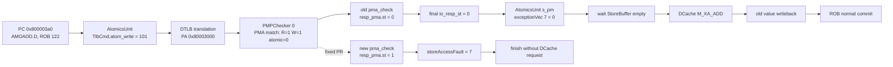

# Issue #4724：AMO 的 PMA 原子权限检查遗漏分析

## 1. 结论先行

本问题的根因可以概括为：

> **权限检查逻辑错误，导致实际执行时执行的权限检查和 ISA 手册定义的权限检查不一样。**

这里的“权限检查”不仅包括普通的读、写许可，也包括 PMA 描述的“该物理地址区域是否支持此类原子操作”。测试把 `0x80003000` 所在 PMA 区域配置成 `R=1, W=1, C=1, atomic=0`，故普通读写可以进行，但 `amoadd.d` 不应执行。正确结果应是精确触发 `Store/AMO access fault`（cause 7），不修改目的寄存器和内存。

旧版昆明湖代码却把该 AMO 的 `pma_check.resp.st` 错误算成 `0`。`AtomicsUnit` 因而认为物理访问合法，继续发出 DCache AMO 请求，返回旧值 `0x1122334455667788`，并把内存改成 `0x1122334455667798`。这不是性能问题，也不是异常稍晚到达，而是一次本应禁止的原子读改写真正产生了体系结构可见副作用。

[PR #4724](https://github.com/OpenXiangShan/XiangShan/pull/4724/changes) 把 AMO/SC 从普通写命令中显式分离，要求 `cfg.atomic && cfg.w` 同时成立；任一条件不满足都令 `resp.st=1`。因此，本测试的 `atomic=0` 会在进入 DCache 前转为 store/AMO access fault。

## 2. 分析对象、版本与证据边界

| 对象 | 本文采用的对象或版本 |
| --- | --- |
| 测试程序 | [main.c](/home/yanyusong/XiangShanLab/xiangshan-course/docs/6-xiangshan-debug/xiangshan-issue-4724/bug-replay/main.c:1) |
| 反汇编 | [amo-analysis-riscv64-xs.txt](/home/yanyusong/XiangShanLab/xiangshan-course/docs/6-xiangshan-debug/xiangshan-issue-4724/bug-replay/amo-analysis-riscv64-xs.txt:260) |
| 正确参考输出 | [correct-xs-log.stdout](/home/yanyusong/XiangShanLab/xiangshan-course/docs/6-xiangshan-debug/xiangshan-issue-4724/bug-replay/correct-xs-log.stdout:1) |
| 旧版错误输出 | [wrong-xs-log.stdout](/home/yanyusong/XiangShanLab/xiangshan-course/docs/6-xiangshan-debug/xiangshan-issue-4724/bug-replay/wrong-xs-log.stdout:1) |
| 旧版源码 | `/home/yanyusong/amo-analysis-env/XiangShan`，detached HEAD `e49444835601e0e24deb722ede18be04d9a56c5c` |
| 错误版波形 | [2026-08-26@16:44:32.fst](/home/yanyusong/amo-analysis-env/XiangShan/build/2026-08-26@16:44:32.fst) |
| 修复提交 | `10ff24df824cb67b3c9deef764041a2a26fb2a19`，旧版 HEAD 的直接子提交 |
| ISA 参考版本 | RISC-V Ratified Specifications Library `v20260120` |

本文用以下标签区分证据：

- **[程序]**：C 程序与反汇编直接给出的事实。
- **[日志]**：仿真 stdout 的软件可见结果。
- **[波形]**：用 WaveKit 从给定 FST 在 `TOP.clock` 上升沿采样所得。
- **[源码]**：旧提交或 PR 修复提交中的 Chisel 组合逻辑和连线。
- **[规范]**：RISC-V 官方手册要求。
- **[推导]**：由已经列出的源码逻辑得到、但没有第二份 fixed FST 直接观测的结论。

需要注意，两份 stdout 并非严格的单提交 A/B：correct 日志报告 SHA `222f993edf, dirty: 1`，wrong 日志报告 `e494448356, dirty: 0`，仿真 flash 配置也不同。因此，日志用来确认两种软件可见行为；“唯一因果改动”则由旧版 FST、旧版源码和以旧 HEAD 为唯一父提交的 PR diff 共同证明。本文没有把 correct stdout 当成 PR #4724 单提交仿真的充分证明。

指定的代理 `172.38.10.247:8970` 已实际用于访问 PR 页面，但代理返回 `Proxy CONNECT aborted`。因此 PR 内容由旧 checkout 本地已有的 Git 对象复核：提交标题是 `fix(PMA): sc / amo should report af when !atomic (#4724)`，diff 只涉及 `PMA.scala` 和 `MMUBundle.scala`。报告仍保留 PR 网页链接，方便网络恢复后核对。

## 3. 测试程序希望验证什么

### 3.1 PMA 区域刻意允许普通读写、禁止原子操作

[main.c:12-25](/home/yanyusong/XiangShanLab/xiangshan-course/docs/6-xiangshan-debug/xiangshan-issue-4724/bug-replay/main.c:12) 定义：

```c
#define PMA_R          (1UL << 0)
#define PMA_W          (1UL << 1)
#define PMA_A_NAPOT    (3UL << 3)
#define PMA_ATOMIC     (1UL << 5)
#define PMA_C          (1UL << 6)

#define PMA_ENTRY_CFG (PMA_C | PMA_A_NAPOT | PMA_W | PMA_R)
```

所以 `PMA_ENTRY_CFG=0x5b`，其中：

| 属性 | 值 | 意义 |
| --- | ---: | --- |
| `R` | 1 | 区域支持普通读 |
| `W` | 1 | 区域支持普通写 |
| `C` | 1 | 区域可缓存，不是本例的 MMIO 路径 |
| `A` | NAPOT | 以 NAPOT 表示 4 KiB 区间 |
| `atomic` | **0** | 区域不支持 AMO；这正是测试变量 |

[configure_pma_region()](/home/yanyusong/XiangShanLab/xiangshan-course/docs/6-xiangshan-debug/xiangshan-issue-4724/bug-replay/main.c:62) 将 PMA entry 0 配成 `[0x80003000, 0x80004000)`，随后回读并显式检查 atomic 位仍为 0。目标对象是 4 KiB 对齐数组的第一个 64 位元素，初值为 `0x1122334455667788`。

### 3.2 目标指令及其正常 AMO 语义

反汇编在 [0x800003a0](/home/yanyusong/XiangShanLab/xiangshan-course/docs/6-xiangshan-debug/xiangshan-issue-4724/bug-replay/amo-analysis-riscv64-xs.txt:316) 给出：

```text
80000392: ...                         # a2 <- 0xbad0bad0bad0bad0
8000039e: 47c1          li a5,16
800003a0: 00f4362f      amoadd.d a2,a5,(s0)
```

此前 [0x800002f8-0x800002fc](/home/yanyusong/XiangShanLab/xiangshan-course/docs/6-xiangshan-debug/xiangshan-issue-4724/bug-replay/amo-analysis-riscv64-xs.txt:273) 已令 `s0=0x80003000`。指令编码解码为：

- `rd=a2/x12`；
- `rs1=s0/x8=0x80003000`；
- `rs2=a5/x15=0x10`；
- 64 位 `AMOADD.D`；
- `aq=0, rl=0`，即不附加 acquire/release 排序约束，但这不会放松 PMA 检查。

如果区域允许该 AMO，其原子语义是：

```text
a2 <- old(M[0x80003000]) = 0x1122334455667788
M[0x80003000] <- old + 0x10 = 0x1122334455667798
```

如果区域不允许 AMO，则必须在该指令处报告访问故障，不能把上面这次读改写当作普通可执行操作。

### 3.3 测试如何观察“指令没有执行”

[main.c:104-139](/home/yanyusong/XiangShanLab/xiangshan-course/docs/6-xiangshan-debug/xiangshan-issue-4724/bug-replay/main.c:104) 在 AMO 前注册 cause 7 处理器。处理器递增 `access_fault_count`，打印 `scause/sepc/stval`，并把 `sepc` 加 4 跳过固定 32 位 AMO。`amo_old_value` 在执行前被初始化为哨兵 `0xbad0bad0bad0bad0`。

因此正确判据同时包括：

1. cause 7 处理器执行一次；
2. `sepc=0x800003a0`；
3. `stval=0x80003000`；
4. `a2` 对应的 C 变量仍为哨兵值；
5. 目标内存仍为初值。

## 4. correct 与 wrong 的行为对照

| 观察项 | correct XiangShan | 旧版 wrong XiangShan |
| --- | --- | --- |
| PMA 配置 | `[0x80003000,0x80004000), cfg=0x5b, atomic=0` | 相同 |
| AMO 前内存 | `0x1122334455667788` | 相同 |
| 访问故障 | `scause=7, sepc=0x800003a0, stval=0x80003000` | **没有进入处理器** |
| handler count | 1 | 0 |
| AMO 的 rd | 保持哨兵 `0xbad0bad0bad0bad0` | 得到旧内存值 `0x1122334455667788` |
| AMO 后内存 | 保持 `0x1122334455667788` | **变成 `0x1122334455667798`** |
| 结论 | AMO 被精确阻止并跳过 | 禁止的 AMO 被完整执行 |

correct 证据位于 [correct-xs-log.stdout:6-10](/home/yanyusong/XiangShanLab/xiangshan-course/docs/6-xiangshan-debug/xiangshan-issue-4724/bug-replay/correct-xs-log.stdout:6)：

```text
Before amoadd.d: address=0x80003000 value=0x1122334455667788 addend=0x10
[AccessFault] store/AMO access fault: scause=0x7, sepc=0x800003a0, stval=0x80003000
After amoadd.d: handler_count=1 old=0xbad0bad0bad0bad0 memory=0x1122334455667788
AMO was skipped after entering the AccessFault handler
```

错误行为位于 [wrong-xs-log.stdout:9-12](/home/yanyusong/XiangShanLab/xiangshan-course/docs/6-xiangshan-debug/xiangshan-issue-4724/bug-replay/wrong-xs-log.stdout:9)：

```text
Before amoadd.d: address=0x80003000 value=0x1122334455667788 addend=0x10
After amoadd.d: handler_count=0 old=0x1122334455667788 memory=0x1122334455667798
AMO completed without entering the AccessFault handler
```

wrong 日志最后仍显示 `HIT GOOD TRAP`，不能据此认为 PMA 行为正确；[main.c:133-139](/home/yanyusong/XiangShanLab/xiangshan-course/docs/6-xiangshan-debug/xiangshan-issue-4724/bug-replay/main.c:133) 只打印观察结果，随后无条件 `return 0`。所以这是“语义错误但测试进程仍返回成功”，不是崩溃、超时或 bad trap。

## 5. WaveKit 如何锁定这条 AMO

本文按 `analyze-xiangshan-wavekit` 的工作流，使用：

```text
PYTHONPATH=/home/yanyusong/wavekit/src \
  /home/yanyusong/wavekit/.venv/bin/python
```

读取给定 FST，并以 `TOP.clock` 上升沿采样。FST 含 `1,009,651` 个信号；目标核前缀是：

```text
TOP.SimTop.l_soc.core_with_l2.core
```

波形分析没有只凭 PC 在后端反复匹配，而是先在前端定位，再以 ROB identity 跟踪：

| 阶段 | cycle / FST time | lane | valid | ready | fire | PC / instr | ROB |
| --- | ---: | ---: | ---: | ---: | ---: | --- | ---: |
| Decode out | 37854 / 75708 | 4 | 1 | 1 | **1** | `0x800003a0 / 0x00f4362f` | 尚未分配 |
| Rename out | 37855 / 75710 | 4 | 1 | 1 | **1** | 同上 | **122**, flag 0 |
| Dispatch 首次出现 | 37856 / 75712 | 4 | 1 | 0 | 0 | 同上 | 122 |
| Dispatch 真正传输 | 38272 / 76544 | 4 | 1 | 1 | **1** | 同上 | 122 |
| AtomicsUnit input | 38276 / 76552 | - | 1 | 1 | **1** | `src0=0x80003000, fuOp=15` | 122 |

`fuOp=15` 与旧源码 [LSUOpType.amoadd_d](/home/yanyusong/amo-analysis-env/XiangShan/src/main/scala/xiangshan/package.scala:620) 的编码一致。Dispatch 中 `valid=1` 但 `ready=0` 的 416 个周期不是 fire；只有 cycle 38272 才真正传输。这也说明为什么不能从 valid 单独推断指令已经进入执行单元。

## 6. `pma_check.resp.st` 的完整链路

### 6.1 命令从 AtomicsUnit 进入 DTLB/PMPChecker

旧版 [AtomicsUnit.scala:455-466](/home/yanyusong/amo-analysis-env/XiangShan/src/main/scala/xiangshan/mem/pipeline/AtomicsUnit.scala:455) 把非 LR 原子指令的 TLB 命令设成：

```scala
io.dtlb.req.bits.cmd := Mux(isLr, TlbCmd.atom_read, TlbCmd.atom_write)
io.dtlb.req.bits.debug.pc := uop.pc
io.dtlb.req.bits.debug.robIdx := uop.robIdx
```

[MMUBundle.scala:382-397](/home/yanyusong/amo-analysis-env/XiangShan/src/main/scala/xiangshan/cache/mmu/MMUBundle.scala:382) 定义：

```scala
val write      = "b001".U
val atom_write = "b101".U // sc / amo

def isWrite(a: UInt) = a(1,0) === write
def isAmo(a: UInt) = a === atom_write
```

因此 `atom_write=101b` 同时满足：

```text
isWrite(atom_write) = 1   # 低两位都是 01
isAmo(atom_write)   = 1
```

[MemBlock.scala:776-789](/home/yanyusong/amo-analysis-env/XiangShan/src/main/scala/xiangshan/mem/MemBlock.scala:776) 为各 DTLB 端口建立 `PMPChecker`；AMO 临时占用 load-side TLB 0，并由 [MemBlock.scala:1768-1786](/home/yanyusong/amo-analysis-env/XiangShan/src/main/scala/xiangshan/mem/MemBlock.scala:1768) 直连：

```scala
atomicsUnit.io.pmpResp := pmp_check(0).resp
```

### 6.2 PMA 地址匹配与一拍对齐

[PMA.scala:225-265](/home/yanyusong/amo-analysis-env/XiangShan/src/main/scala/xiangshan/backend/fu/PMA.scala:225) 根据物理地址和访问尺寸计算 entry match/alignment，再用优先选择器得到 `cfg.r/w/x/atomic/c`。本实例的 `PMPChecker` 以 `leaveHitMux=true` 创建；选择结果在 [PMA.scala:260-264](/home/yanyusong/amo-analysis-env/XiangShan/src/main/scala/xiangshan/backend/fu/PMA.scala:260) 使用 `RegEnable`，所以请求进入 checker 后，目标 PMA 属性在下一采样拍才稳定到响应侧。

这点对读波形很重要：cycle 38278 的 `io_resp_atomic=1` 是前一请求留下的已选择属性，不能拿它判断目标 AMO；cycle 38279 才是 `addr=0x80003000, cmd=5` 对应的 PMA 结果。FST 没有导出“命中 entry 编号”，但程序回读 entry 0，加上波形中选出的 `R=W=1, atomic=0` 与其完全一致，二者共同支持目标命中了测试配置。

### 6.3 旧版错误公式为什么把 `resp.st` 算成 0

旧版 [PMA.scala:210-223](/home/yanyusong/amo-analysis-env/XiangShan/src/main/scala/xiangshan/backend/fu/PMA.scala:210) 是：

```scala
resp.ld := TlbCmd.isRead(cmd) && !TlbCmd.isAmo(cmd) && !cfg.r
resp.st := (TlbCmd.isWrite(cmd) || TlbCmd.isAmo(cmd) && cfg.atomic) && !cfg.w
resp.instr := TlbCmd.isExec(cmd) && !cfg.x
resp.atomic := cfg.atomic
```

注意 `resp.st` 是“store/AMO 被拒绝、应报告访问故障”的标志，不是“允许 store”的标志；其定义和逐字段 OR 见 [PMPRespBundle](/home/yanyusong/amo-analysis-env/XiangShan/src/main/scala/xiangshan/backend/fu/PMP.scala:386)。把本测试的值代入旧式：

```text
isWrite = 1
isAmo = 1
cfg.atomic = 0
cfg.w = 1

old resp.st
= (isWrite || (isAmo && cfg.atomic)) && !cfg.w
= (1 || (1 && 0)) && !1
= 0
```

错误有两个相互关联的方面：

1. deny 条件里用了正向 `cfg.atomic`，没有表达“`!cfg.atomic` 就应拒绝 AMO”；
2. `atom_write` 的低两位又让 `isWrite=1`，普通写分支直接支配 OR，进一步掩盖了 AMO 类型。

所以波形中同时出现 `atomic=0` 与 `resp.st=0`，正是旧逻辑的确定性结果，而不是随机竞争或丢拍。

### 6.4 最终响应如何送到 AMO 状态机

[PMP.scala:540-598](/home/yanyusong/amo-analysis-env/XiangShan/src/main/scala/xiangshan/backend/fu/PMP.scala:540) 分别计算 `resp_pmp`、`resp_pma`、`resp_keyid`，最终逐字段 OR：

```scala
val resp = resp_pmp | resp_pma | resp_keyid
io.resp := resp
```

因此完整 `st` 链是：

```text
PMA entry cfg.atomic/cfg.w
  -> pma_check(...).resp_pma.st
  -> resp_pmp.st | resp_pma.st | resp_keyid.st
  -> pmp_checkers_0.io_resp_st
  -> atomicsUnit.io_pmpResp_st
  -> exception_pa / exceptionVec(storeAccessFault)
  -> fault finish，或者错误地进入 DCache AMO 路径
```

本例最终 `io_resp_st=0`，而 `cfg.r=cfg.w=1`、KeyID 地址高位为 0，也没有其它检查分量把它补成 1。最关键的直接事实不是“其它分量为何为 0”的猜测，而是最终 checker 输出与 AtomicsUnit 输入均为 0。

### 6.5 AtomicsUnit 如何消费 `resp.st`

状态枚举见 [AtomicsUnit.scala:65-70](/home/yanyusong/amo-analysis-env/XiangShan/src/main/scala/xiangshan/mem/pipeline/AtomicsUnit.scala:65)。在 `s_pm` 中，[AtomicsUnit.scala:283-307](/home/yanyusong/amo-analysis-env/XiangShan/src/main/scala/xiangshan/mem/pipeline/AtomicsUnit.scala:283) 执行：

```scala
val exception_pa = pmp.st || pmp.ld || ...

when(exception_pa) {
  state := s_finish
  out_valid := true.B
}.otherwise {
  state := Mux(..., s_cache_req, s_wait_flush_sbuffer_resp)
}

exceptionVec(storeAccessFault) := exceptionVec(storeAccessFault) || pmp.st || ...
```

cause 编号由 [package.scala:824-856](/home/yanyusong/amo-analysis-env/XiangShan/src/main/scala/xiangshan/package.scala:824) 定义，其中 `storeAccessFault=7`。

所以：

- `resp.st=1`：设置异常位 7，转入完成/异常路径，不发 DCache AMO；
- `resp.st=0`：没有物理访问异常，等待 StoreBuffer 清空后进入 [DCache request 路径](/home/yanyusong/amo-analysis-env/XiangShan/src/main/scala/xiangshan/mem/pipeline/AtomicsUnit.scala:492)。

### 6.6 正确路径如何形成 `scause/sepc/stval`

若 `resp.st=1`，异常侧带还会继续沿后端传播：

1. [AtomicsUnit.scala:480-490](/home/yanyusong/amo-analysis-env/XiangShan/src/main/scala/xiangshan/mem/pipeline/AtomicsUnit.scala:480) 把 `exceptionVec`、`uop`、`paddr` 放入 MemExu 输出；[exceptionInfo](/home/yanyusong/amo-analysis-env/XiangShan/src/main/scala/xiangshan/mem/pipeline/AtomicsUnit.scala:437) 同时携带 fault vaddr。
2. [MemBlock.scala:1813-1855](/home/yanyusong/amo-analysis-env/XiangShan/src/main/scala/xiangshan/mem/MemBlock.scala:1813) 锁存 atomics exception 及其虚拟地址；[Backend.scala:613-617](/home/yanyusong/amo-analysis-env/XiangShan/src/main/scala/xiangshan/backend/Backend.scala:613) 把 ROB exception 和 memory exception address 送入 CSR。
3. [Backend.scala:670-703](/home/yanyusong/amo-analysis-env/XiangShan/src/main/scala/xiangshan/backend/Backend.scala:670) 保留 writeback 的 `robIdx` 与 `exceptionVec`；[CtrlBlock.scala:744-750](/home/yanyusong/amo-analysis-env/XiangShan/src/main/scala/xiangshan/backend/CtrlBlock.scala:744) 将未被 flush 的写回送入 ROB。
4. [Rob.scala:1014-1039](/home/yanyusong/amo-analysis-env/XiangShan/src/main/scala/xiangshan/backend/rob/Rob.scala:1014) 按 `robIdx` 合并写回；[Rob.scala:1195-1224](/home/yanyusong/amo-analysis-env/XiangShan/src/main/scala/xiangshan/backend/rob/Rob.scala:1195) 将 exception vector 交给 ExceptionGen/CSR 接口。
5. [CSR.scala:1305-1339](/home/yanyusong/amo-analysis-env/XiangShan/src/main/scala/xiangshan/backend/fu/CSR.scala:1305) 从 bit 7 得到 `hasStoreAccessFault` 和 cause 7；[CSR.scala:1361-1393](/home/yanyusong/amo-analysis-env/XiangShan/src/main/scala/xiangshan/backend/fu/CSR.scala:1361) 选择 memory exception address 写入 `tval`，[CSR.scala:1514-1520](/home/yanyusong/amo-analysis-env/XiangShan/src/main/scala/xiangshan/backend/fu/CSR.scala:1514) 写 `scause/sepc`。

这条链解释了 correct 日志中的 `scause=7, sepc=0x800003a0, stval=0x80003000`。错误 FST 中 `exceptionVec_7=0`、`exceptionInfo.valid=0`，所以该异常链从源头就没有启动；之后看到的 DCache request 和正常 ROB commit 不是异常恢复的一部分。

## 7. 旧版错误波形的周期级路径

下表中的 cycle 是 `TOP.clock` 上升沿编号，FST time 每拍增加 2。`MEM` 表示完整前缀：

```text
TOP.SimTop.l_soc.core_with_l2.core.memBlock
```

| cycle / time | 状态或握手 | PMA / `resp.st` | 后果 |
| --- | --- | --- | --- |
| 38276 / 76552 | `AtomicsUnit.io_in_valid=1`, `io_in_ready=1`，input fire；`ROB=122`, `src0=0x80003000`, `fuOp=15` | 尚未发目标 PMA 请求 | 锁存 AMO uop 与操作数 |
| 38277 / 76554 | state 1；`io_dtlb_req_valid=1`, `cmd=5`, addr `0x80003000` | PMA checker 尚未得到本请求的选中属性 | 发起 `atom_write` 翻译/检查 |
| 38278 / 76556 | state 1；DTLB resp valid，miss=0，paddr=`0x80003000`；checker req valid | `R=1,W=1,atomic=1,st=0`，其中 atomic 是 `leaveHitMux` 的上一拍结果 | 不能把这一拍的 atomic 当作目标属性 |
| **38279 / 76558** | **state 2 (`s_pm`)**；paddr=`0x80003000`；checker req addr/cmd=`0x80003000/5` | **`R=1,W=1,atomic=0`，但 checker `resp.st=0`；AtomicsUnit `io_pmpResp_st=0`；`exceptionVec_7=0`** | **错误判定发生点：没有 store/AMO access fault** |
| 38280 / 76560 | state 3，`io_flush_sbuffer_valid=1`, empty=0 | PMA 决策已经消费 | 等待 StoreBuffer 清空；这段等待不是 bug 根因 |
| 38317 / 76634 | state 3，`flush_sbuffer_empty=1` | - | 允许进入 cache request |
| 38318 / 76636 | state 4；DCache req valid=1、ready=1，**fire**；addr=`0x80003000`, cmd=8 | - | [源码映射](/home/yanyusong/amo-analysis-env/XiangShan/src/main/scala/xiangshan/mem/pipeline/AtomicsUnit.scala:500)将 `amoadd_d` 映射为 `M_XA_ADD=01000b`，禁止的 AMO 已到 DCache |
| 38323 / 76646 | DCache resp valid=1；data=`0x1122334455667788`，miss=0，replay=0 | - | 返回 AMO 的旧内存值 |
| 38325 / 76650 | state 7；Atomics out valid=1、ready=1，**fire**；data=`0x1122334455667788`, ROB=122 | exceptionInfo.valid=0，redirect=0 | AMO 作为正常结果写回 |
| 38327 / 76654 | ROB commit lane 0：commitValid=1，PC=`0x800003a0`，instr=`0x00f4362f` | 没有异常提交路径 | 错误 AMO 正常退休；下一拍 ROB entry 122 清除 |

关键 FST 信号如下，均在上述 `MEM` 前缀下：

| 作用 | 信号后缀 |
| --- | --- |
| AMO 输入握手/身份 | `inner_atomicsUnit.io_in_valid/ready`, `io_in_bits_uop_robIdx_value`, `io_in_bits_src_0`, `io_in_bits_uop_fuOpType` |
| DTLB 请求 | `inner_atomicsUnit.io_dtlb_req_valid`, `io_dtlb_req_bits_cmd`, `io_dtlb_req_bits_fullva` |
| PMA/PMP 请求 | `inner_pmp_checkers_0.io_req_valid`, `io_req_bits_addr`, `io_req_bits_cmd` |
| 选中 PMA 属性 | `inner_pmp_checkers_0.res_pma_cfg_r/w`, `io_resp_atomic` |
| `resp.st` 全链路 | `inner_pmp_checkers_0.io_resp_st` -> `inner_atomicsUnit.io_pmpResp_st` -> `inner_atomicsUnit.exceptionVec_7` |
| 错误 cache 路径 | `inner_atomicsUnit.io_dcache_req_valid/ready`, `io_dcache_req_bits_addr/cmd`, `io_dcache_resp_valid` |
| 正常写回 | `inner_atomicsUnit.io_out_valid/ready`, `io_out_bits_data`, `io_out_bits_uop_robIdx_value` |

`io_dtlb_req` 和 checker request 在该 FST 中没有可用的 `ready` 叶子，本文只报告其 valid 与后继 response，不把 valid 单独称作 fire；DCache 与 Atomics input/output 则都用 `valid && ready` 证明真正传输。

```wavedrom
{
  "signal": [
    {"name": "clk", "wave": "p........."},
    {"name": "cycle", "wave": "==========", "data": ["38276", "38277", "38278", "38279", "38280", "38317", "38318", "38323", "38325", "38327"]},
    {"name": "Atomics.state", "wave": "==========", "data": ["idle/in.fire", "tlb", "tlb", "s_pm", "waitSB", "waitSB", "cacheReq", "cacheResp", "finish/out", "ROB commit"]},
    {"name": "PMA selected", "wave": "x.==x.....", "data": ["atomic=1 (previous)", "atomic=0 R=W=1"]},
    {"name": "resp.st", "wave": "0........."},
    {"name": "exceptionVec[7]", "wave": "0........."},
    {"name": "DCache.req.fire", "wave": "0.....10.."},
    {"name": "Atomics.out.fire", "wave": "0.......10"},
    {"name": "ROB.commit", "wave": "0........1"}
  ],
  "config": {"hscale": 1}
}
```

上图是事件压缩图，cycle 38280 到 38317 的等待区间没有按真实长度展开。它强调的因果关系是：`s_pm` 中 `atomic=0` 却 `resp.st=0`，随后才出现 DCache request、正常 out 和 ROB commit。



## 8. PR #4724 为什么能修复

本地 Git 对象中的一跳 diff 与 [PR changes 页面](https://github.com/OpenXiangShan/XiangShan/pull/4724/changes) 一致。相对本地[旧版 PMA.scala](/home/yanyusong/amo-analysis-env/XiangShan/src/main/scala/xiangshan/backend/fu/PMA.scala:210)，提交 `10ff24df...` 改为：

```scala
resp.ld := TlbCmd.isRead(cmd) && !cfg.r
resp.st := Mux(
  TlbCmd.isAmo(cmd),
  !cfg.atomic || !cfg.w,
  Mux(TlbCmd.isWrite(cmd), !cfg.w, false.B)
)
resp.instr := TlbCmd.isExec(cmd) && !cfg.x
resp.mmio := !cfg.c && !(resp.ld || resp.st || resp.instr)
resp.atomic := cfg.atomic
```

也可直接查看固定提交中的 [PMA.scala 版本](https://github.com/OpenXiangShan/XiangShan/blob/10ff24df824cb67b3c9deef764041a2a26fb2a19/src/main/scala/xiangshan/backend/fu/PMA.scala#L210-L220)。

新旧逻辑的核心差异是：

| 命令 | 旧版拒绝条件 | 修复后拒绝条件 |
| --- | --- | --- |
| 普通 store | `!W` | `!W` |
| SC / AMO (`atom_write`) | 实际被 `isWrite` 分支支配，只剩 `!W` | **`!atomic || !W`** |

代入本测试：

```text
new resp.st = !cfg.atomic || !cfg.w
            = !0 || !1
            = 1
```

于是 [源码推导] 在 cycle 38279 对应的 `s_pm` 检查阶段，`exception_pa` 为真，`exceptionVec(storeAccessFault)` 置 1，状态直接走 `s_finish`；[AtomicsUnit.scala:492-539](/home/yanyusong/amo-analysis-env/XiangShan/src/main/scala/xiangshan/mem/pipeline/AtomicsUnit.scala:492) 的 DCache 请求条件不会成立。correct 日志中 cause 7、未改 rd、未改内存正是这一结果的端到端表现。

PR 还做了两项相关整理：

1. `resp.ld` 直接复用 `isRead && !R`，去掉 PMA 中手写的 AMO 排除条件；
2. `resp.mmio` 改为 `!C && !(ld || st || instr)`，从已经算出的 fault 结果派生，避免复制一套可能再次与权限逻辑不一致的表达式。

`MMUBundle.scala` 只删除未使用的 `isAtom(a)=a(2)` helper；真正改变本 bug 行为的是 `resp.st` 的显式 AMO 分支。PR 标题和代码针对 SC/AMO 的 `atom_write` 路径，本文不把它夸大为“已经完整修复 LR 的 reservability/atomic PMA 检查”。

## 9. RISC-V 手册要求 AMO 做哪些 PMA 检查

### 9.1 先明确 AMO 是什么访问

[RISC-V Unprivileged ISA v20260120, A/Zaamo](https://docs.riscv.org/reference/isa/v20260120/unpriv/a-st-ext.html) 规定，AMO 原子地：

1. 从 `rs1` 指向的地址加载旧值；
2. 把旧值写入 `rd`；
3. 对旧值和 `rs2` 执行指定运算；
4. 把结果写回原地址。

对齐的 AMO 在 RVWMO 中产生一个同时是 load 和 store 的单一内存操作，而不是可被观察到的“先普通 load、再普通 store”。这也是为什么硬件不能在发现“不支持原子操作”后仍让普通读改写落到 DCache。

### 9.2 PMA 层需要检查的项目

[RISC-V Privileged ISA v20260120, Physical Memory Attributes](https://docs.riscv.org/reference/isa/v20260120/priv/machine.html#_physical_memory_attributes) 说明，PMA 描述物理区域支持的访问类型、宽度、原子操作、内存/IO 分类、排序、缓存与一致性等属性；任何物理内存访问都应接受 PMA 检查。对本条 `amoadd.d`，至少要检查：

1. **地址和覆盖范围**：有效地址翻译后的物理地址是 `0x80003000`，访问字节区间为 `[0x80003000, 0x80003008)`；整次访问必须落在同一组允许该操作的物理属性中。
2. **宽度和普通访问能力**：[Supported Access Type PMAs](https://docs.riscv.org/reference/isa/v20260120/priv/machine.html#_supported_access_type_pmas) 要求底层区域支持该宽度。`AMOADD.D` 需要 8 字节读和写能力。本例 `R=W=1`，所以故意排除了普通宽度/读写不支持。
3. **AMO 类别能力**：[Atomicity PMAs / AMO PMA](https://docs.riscv.org/reference/isa/v20260120/priv/machine.html#_amo_pma) 把支持级别分为 `AMONone`、`AMOSwap`、`AMOLogical`、`AMOArithmetic` 等。`amoadd` 属于算术 AMO，区域必须达到 `AMOArithmetic` 支持。本实现用一个 `cfg.atomic` 布尔位把这一能力简化为“支持/不支持”；本例 `atomic=0` 等价于该区域没有所需 AMO 能力。
4. **自然对齐或 MAG PMA**：Zaamo 默认要求 `.D` 地址 8 字节自然对齐；若未对齐，只能在平台提供合适的 misaligned atomicity granule PMA 且整个访问落在同一 granule 时按规范放行。本例 `0x80003000 mod 8 = 0`，所以不是 misalignment bug。
5. **内存/IO 与排序属性**：PMA 还决定该地址属于 memory 还是 I/O 域，以及相应原子类型是否受支持。`aq/rl=0` 只表示不增加额外顺序约束，不会绕过 AMO capability、宽度或访问许可检查。本例 `C=1`，没有走 MMIO 分支。

PMP、页表权限与 PMA 是并行但不同的层次。PMP 的 R/W/X 是执行上下文相关的保护；PMA 的 atomic 是物理区域固有能力。RISC-V 手册把 AMO 的保护异常归为 store/AMO 类；PMP 对 AMO 需要 write permission。本测试已经令普通 `R/W` 均为 1，专门证明 PMA atomic capability 即使在普通写允许时也必须单独检查。

### 9.3 检查失败应报告什么

[RISC-V Privileged ISA v20260120 machine-level exception 说明](https://docs.riscv.org/reference/isa/v20260120/priv/machine.html) 明确区分：load/LR 产生 load 类异常，而 store/SC/AMO 产生 store/AMO 类异常。精确 PMA violation 应表现为 access-fault，而不是 page-fault；`Store/AMO access fault` 的 exception code 是 7。

因此本例的规范化决策过程是：

```text
PA=0x80003000，8B，自然对齐，完整落在 PMA 区域内
  -> 8B R/W 支持：通过
  -> AMOADD 所需 atomic/AMOArithmetic 支持：失败
  -> 精确 Store/AMO access fault，cause=7
  -> sepc=0x800003a0，stval=0x80003000
  -> 不向 DCache 发出该 AMO，不产生 rd/内存更新
```

correct 日志恰好满足这一序列；wrong 波形在第二行检查失败后却把 `resp.st` 留在 0，因而违背该序列。

## 10. 边界、跨区与本 bug 无关的条件

本次 `AMOADD.D` 访问 `[0x80003000,0x80003008)`：

- 起始地址 8 字节自然对齐；
- 完整落在 `[0x80003000,0x80004000)` PMA NAPOT 区域；
- 不跨 4 KiB 页或 PMA entry 边界；
- 没有地址翻译 miss、DTLB access fault、DCache miss 或 replay。

所以错误不能归因于 misaligned AMO、跨页拆分、跨 PMA entry、TLB miss、cache replay 或 flush/redirect。后续测试仍必须覆盖这些边界，因为原子访问不能被随意拆成跨越不同属性区域的普通子访问；若整个访问没有同一套允许属性，就应在任何可见内存副作用前报错。

## 11. 建议的回归验证矩阵

| 场景 | 配置/条件 | 修复后期望 |
| --- | --- | --- |
| 本 issue 最小用例 | AMOADD.D，`W=1, atomic=0` | `resp.st=1`，cause 7，无 DCache req，无 rd/内存更新 |
| 写权限也禁止 | AMOADD.D，`W=0, atomic=1` | `resp.st=1`，cause 7 |
| 完全允许 | AMOADD.D，`W=1, atomic=1` | `resp.st=0`；其它检查通过时正常原子读改写 |
| 普通 store 回归 | store，分别令 `W=0/1` | 仍分别 fault/pass，不受 AMO Mux 误伤 |
| SC 回归 | SC，`atomic=0`，无论 reservation 最终成功与否 | 必须先通过权限/PMA 检查；`resp.st=1` 报 store/AMO access fault |
| 对齐/跨界 | `.D` 未对齐，或 8B 覆盖两个属性区域 | 按 alignment/MAG/PMA 规则报错；不得拆分后产生部分副作用 |
| 握手和冲刷 | DTLB/DCache backpressure、redirect/flush 恰逢检查 | valid payload 保持稳定；被冲刷 uop 不得使用陈旧 PMA response |
| LR 范围检查 | LR 落在不支持 reservability 的区域 | 单独按 LR/reservability PMA 验证；不能仅以 #4724 的 SC/AMO 修复宣称覆盖 |

最关键的断言建议是：

```text
isAmo(cmd) && (!cfg.atomic || !cfg.w)  ->  resp.st
resp.st && instruction_is_target       ->  !dcache_req.fire
faulting_AMO                            ->  no architectural register/memory update
```

## 12. 最终因果链

把程序、日志、波形、源码和规范串在一起，完整原因如下：

1. 程序把目标 PMA 区域设成普通 R/W 可用、atomic 不可用。
2. `amoadd.d` 以 `atom_write=101` 进入 PMA checker。
3. 旧代码同时把 `101` 识别成 `isWrite` 和 `isAmo`，又没有用 `!cfg.atomic` 构造拒绝条件。
4. 因此目标配置虽为 `atomic=0`，旧版仍算出 `resp.st=0`。
5. 最终 `pmp_checkers_0.io_resp_st` 和 `AtomicsUnit.io_pmpResp_st` 都保持 0，异常位 7 没有置位。
6. AtomicsUnit 离开 `s_pm` 后等待 StoreBuffer 清空，向 DCache 发出 `M_XA_ADD`，返回旧值并正常提交 ROB 122。
7. 软件观察到 handler count 为 0、rd 得到旧值、内存增加 `0x10`。
8. PR #4724 把 AMO/SC 拒绝条件改成 `!atomic || !W`，恢复了 ISA 要求的独立原子能力检查，从而在 DCache 请求前产生 cause 7。

因此，这个 bug 不是“PMA 配置没有生效”，也不是“访问故障处理器有问题”；配置确实被选中，处理器也能正确处理 cause 7。真正的问题是 **PMA checker 把已选中的 `atomic=0` 错误翻译成了 `resp.st=0`**。
