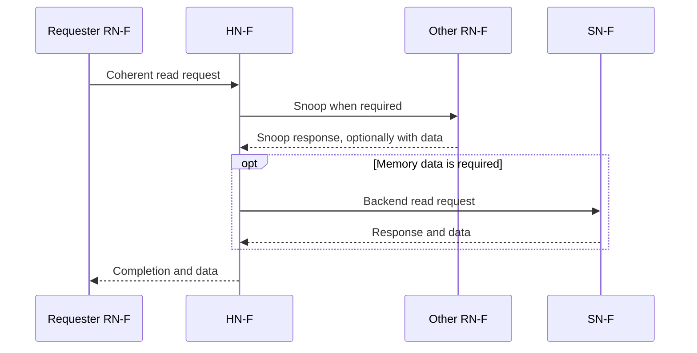
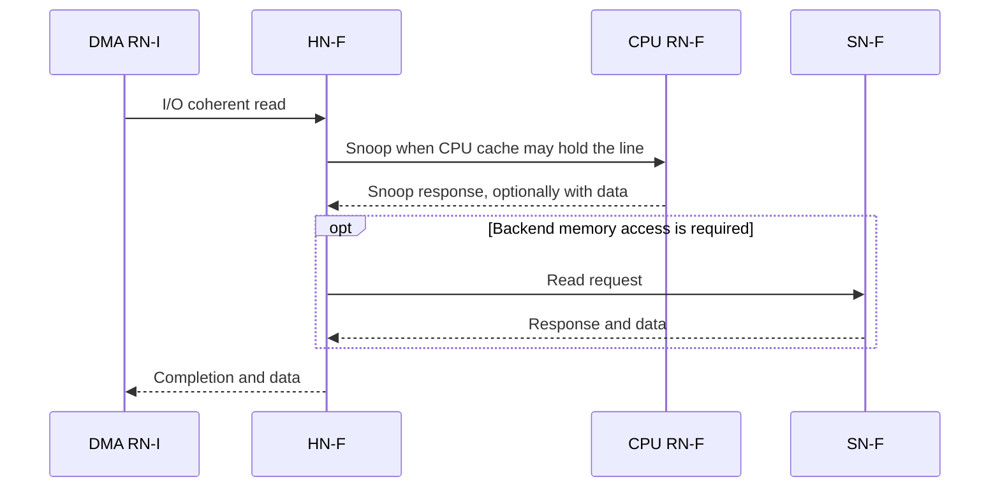

# CHI Node

CHI（Coherent Hub Interface）使用不同类型的 Node 描述互连中的协议参与者。Node 类型回答的不是“消息从哪一根线发送”，而是以下问题：

- 谁可以发起访问；
- 谁负责某段地址的一致性与顺序；
- 谁执行最终的存储或设备访问；
- 谁参与 DVM 等系统级操作。

本文先建立 `RN -> HN -> SN` 的整体关系，再区分 Node、Channel 与 Router，之后分别介绍 RN、HN、SN 和 MN，最后用两个典型流程把这些角色串起来。

> CHI 不同 Issue 会扩展消息类型、字段和可选能力。本文重点解释各类 Node 最稳定的协议职责，不作为某一 CHI Issue 的完整合法消息表。

## 1. 先看四类 Node 的关系

CHI 中最主要的访问路径由 RN、HN 和 SN 组成：

```text
发起请求                    协调请求                    执行后端访问
Request Node  ---------->  Home Node  ------------->  Slave Node
    RN                         HN                         SN
                               |
                               +---- Snoop 其他 RN-F
```

- **RN（Request Node）**发起读、写、权限或维护请求。
- **HN（Home Node）**负责目标地址，协调一致性、顺序、数据来源和后端访问。
- **SN（Slave Node）**执行最终的内存或设备访问。
- **MN（Miscellaneous Node）**不位于普通数据访问的主路径上，主要参与 DVM 等系统级管理操作。

一次访问不一定经过图中的全部步骤。例如，HN 的本地缓存能够提供数据时可以不访问 SN；目标地址不需要完整一致性管理时，也不需要 Snoop 其他 RN。上图表达的是各类 Node 的职责关系，不是一条固定消息序列。

## 2. Node、Channel 与 Router

理解 CHI Node 前，需要先区分 Node、Channel 和 Router。

### 2.1 Node 是协议功能角色

Node 是一类具有明确协议职责的功能实体。例如：

- RN 发起请求；
- HN 负责某段地址的一致性和事务协调；
- SN 执行后端存储或设备访问；
- MN 参与 DVM 等系统级管理操作。

一个 Node 通常需要保存事务状态，并根据收到的消息产生后续请求、响应或数据。Node 不一定等于一个独立的 RTL 模块，也不一定等于芯片中的一个物理单元；具体实现可以把多个协议角色集成在一个模块中，也可以把一个角色拆分到多个流水级和控制模块中。

### 2.2 Channel 承载协议消息

CHI 使用多个逻辑 Channel 传输不同类型的消息：

| Channel | 主要用途 | 常见方向 |
|---|---|---|
| `REQ` | 读、写、权限和维护请求 | Requester 向 Home 或 Slave |
| `RSP` | Completion、确认、重试和无数据 Snoop 响应 | Node 之间双向使用 |
| `DAT` | 读数据、写数据和带数据 Snoop 响应 | Node 之间双向使用 |
| `SNP` | 一致性查询、降级、失效或转发请求 | Home 向可被 Snoop 的 Requester |

在一个具体 Node 的接口上，还会用 `TXREQ`、`RXRSP` 等名称表示相对本 Node 的发送和接收方向。例如：

- `TXREQ`：本 Node 发送 REQ；
- `RXRSP`：本 Node 接收 RSP；
- `RXSNP`：本 Node 接收 SNP。

因此，`RN-F` 是 Node 类型，`RXSNP` 是该 Node 可能具有的接收通道，二者不是同一个层次的概念。

### 2.3 Router 负责网络传输

Router 根据目标 Node ID、网络拓扑和流控状态转发 flit。它主要解决“消息怎样到达目标”，而 Node 解决“收到消息后协议上应该做什么”。

可以把三者关系概括为：

```text
Node 产生协议消息
  -> Channel 定义消息类别和方向
    -> Router 在 NoC 中转发承载消息的 flit
      -> 目标 Node 解释并处理消息
```

## 3. CHI Node 的分类与命名

CHI Node 名称通常由基本角色和能力类别组成：

```text
RN-F
|  |
|  +-- 该类 Request Node 的一致性能力类别
+----- Request Node
```

基本角色如下：

| 缩写 | 全称 | 核心职责 |
|---|---|---|
| `RN` | Request Node | 发起读、写、权限或维护事务 |
| `HN` | Home Node | 负责地址范围的一致性、顺序和事务协调 |
| `SN` | Slave Node | 执行后端内存或设备访问 |
| `MN` | Miscellaneous Node | 参与 DVM 等系统级管理操作 |

常见完整类型包括：

| 基本角色 | Node 类型 |
|---|---|
| Request Node | `RN-F`、`RN-D`、`RN-I` |
| Home Node | `HN-F`、`HN-I` |
| Slave Node | `SN-F`、`SN-I` |
| Miscellaneous Node | `MN` |

后缀不能脱离基本角色机械解释。例如，`D` 只出现在 `RN-D` 中；`HN-F` 和 `SN-F` 中的 `F` 也分别描述它们在 Home 和 Slave 位置上支持的协议能力，而不是说三者具有完全相同的接口和行为。

本节只给出分类。每种 Node 的能力和相互区别在后续所属章节中解释，避免把后缀脱离角色单独记忆。

## 4. Request Node

Request Node 是事务的发起者。CPU、DMA、I/O 控制器和加速器都可能实现某种 RN，但它们是否缓存 coherent data、是否接收 Snoop、是否支持 DVM，取决于 RN 的具体类型。

### 4.1 RN-F

`RN-F` 是 Fully Coherent Request Node。它通常用于带有 coherent cache 的 CPU cluster 或加速器。

RN-F 既可以是请求发起者，也可能是其他事务所需数据的当前持有者。它通常具备以下能力：

- 发起一致性读请求；
- 请求共享或唯一访问权限；
- 在本地 Cache 中保存 coherent cache line；
- 接收 HN-F 发出的 Snoop；
- 根据本地 Cache 状态返回无数据或带数据的 Snoop Response；
- 根据 Snoop 要求保持、降级或失效本地副本；
- 必要时把最新数据返回给 Home 或直接转发给另一个 Requester。

例如，Core 0 的 Cache 持有某条 Modified cache line，而 Core 1 请求读取该地址。Core 0 所在 RN-F 可能收到 HN-F 发来的 Snoop，返回最新数据，并把本地权限降级。此时 RN-F 不只是“发请求的主设备”，还是一致性协议中的数据和权限持有者。

一句话概括：

> RN-F 是能够缓存 coherent data，并完整参与普通 cache-line Snoop 流程的 Request Node。

### 4.2 RN-D

`RN-D` 是支持 DVM 的 I/O coherent Request Node。它适合需要访问 coherent memory，同时又需要参与系统虚拟内存管理的 I/O 设备或加速器。

DVM（Distributed Virtual Memory）用于在系统组件之间传播与地址翻译有关的管理操作，例如 TLB invalidation 和相关同步操作。

RN-D 的核心特征是：

- 可以发起 I/O coherent 访问；
- 自身不作为 RN-F 那样的 coherent cache 保存者参与普通 cache-line Snoop；
- 支持接收和处理 DVM 操作；
- 可以向系统报告 DVM 操作已经完成。

RN-D 的访问仍然可以与 CPU Cache 保持一致，但这种一致性主要由 HN-F 查询目录、Snoop RN-F 并协调数据来实现，不要求 RN-D 自己成为可被普通 Snoop 管理的 Cache。

### 4.3 RN-I

`RN-I` 是不支持 DVM 的 I/O coherent Request Node。DMA、I/O master 或不带 coherent cache 的加速器可以采用这一角色。

RN-I 的核心特征是：

- 可以发起对 coherent memory 的访问；
- 自身不保存需要被普通 Snoop 管理的 coherent cache line；
- 不像 RN-F 那样接收普通 cache-line Snoop；
- 不具备 RN-D 的 DVM 参与能力。

“RN-I 自身不被普通 Snoop”不代表它的访问绕过一致性。例如，DMA 通过 RN-I 读取一段内存，而某个 CPU Cache 中持有该地址的最新脏数据时，HN-F 仍需要 Snoop 对应的 RN-F，取得最新数据后再完成 RN-I 的请求。

因此，I/O coherent 描述的是：

> RN-I 发起的访问能够观察到系统的一致性结果，但 RN-I 自己不作为一个 coherent cache 参与副本管理。

### 4.4 三种 RN 的区别

下表用于比较三种 RN 的核心差异，不替代具体 CHI Issue 的接口和 opcode 合法性表。

| 能力 | RN-F | RN-D | RN-I |
|---|---:|---:|---:|
| 发起内存访问 | 是 | 是 | 是 |
| 发起 I/O coherent 访问 | 是 | 是 | 是 |
| 保存需要一致性管理的 Cache 副本 | 是 | 否 | 否 |
| 接收普通 cache-line Snoop | 是 | 否 | 否 |
| 返回 Snoop Response/Data | 是 | 否 | 否 |
| 参与 DVM | 可按系统配置支持 | 是 | 否 |

判断一个设备应该使用哪种 RN，可以先问两个问题：

1. 它是否保存需要被系统 Snoop 的 coherent cache line？如果是，通常需要 RN-F。
2. 如果不是，它是否需要接收 DVM 操作？如果需要，使用 RN-D；否则可以使用 RN-I。

## 5. Home Node

Home Node 负责一个地址范围。Requester 根据地址把请求发送到相应 Home，Home 再决定如何满足请求。

Home 的关键意义不只是地址路由。对于 coherent 地址，Home 还需要协调目录、其他 Requester 和后端 Slave，保证数据来源、访问权限和事务顺序符合协议要求。

### 5.1 HN-F

`HN-F` 是 Fully Coherent Home Node，是 CHI 一致性流程的主要协调者。

HN-F 通常负责：

- 管理一个或多个地址范围；
- 查询和更新目录或 Snoop Filter；
- 判断哪些 RN-F 可能持有目标 cache line；
- 判断最新数据位于内存、Home Cache 还是某个 RN-F；
- 向相关 RN-F 发送 Snoop；
- 收集必要的 Snoop Response；
- 协调共享、唯一、脏数据等权限变化；
- 向 SN-F 发起后端内存访问；
- 向原 Requester 返回 Completion 和数据；
- 维护同一地址或存在顺序要求的事务关系。

HN-F 可以与 LLC、Directory 或 Snoop Filter 集成，但这些概念不能直接画等号：

- HN-F 是 CHI 协议角色；
- LLC 是缓存层级；
- Directory 是记录持有者和权限信息的数据结构；
- 一个实现可以把 HN-F、LLC 和 Directory 集成，也可以采用其他组织方式。

可以把 HN-F 概括为：

> RN 表示“谁要访问”，HN-F 表示“谁负责决定这次 coherent 访问如何完成”。

### 5.2 HN-I

`HN-I` 是 I/O Home Node。它用于不需要完整 cache coherence 管理的 Home 路径，负责接收请求、进行目标选择和协调后端访问，但不承担 HN-F 的完整目录与 Snoop 管理职责。

HN-I 的典型职责包括：

- 管理相应的地址范围；
- 接收允许发送到该 Home 的请求；
- 根据地址和系统映射选择目标 Slave；
- 协调请求、响应和数据传输；
- 维护该路径要求的事务顺序。

因此，HN-I 不能简单理解为“较小的 HN-F”。二者面向的协议路径不同：HN-F 的重点是 coherent cache-line 管理，HN-I 的重点是不需要完整 Snoop 流程的访问。

## 6. Slave Node

Slave Node 位于请求处理的后端，负责执行实际的内存或设备访问。Home 决定一致性和路由后，可以把访问发送给相应的 Slave。

Slave 和 Home 的职责应分开理解：

- Home 决定请求在协议上应该怎样完成；
- Slave 提供后端存储或设备服务。

### 6.1 SN-F

`SN-F` 是服务于 Fully Coherent 路径的 Slave Node。它通常位于 HN-F 后端，对接内存控制器或下一级存储系统。

SN-F 主要负责：

- 接收 HN-F 发来的后端请求；
- 执行实际读写；
- 返回响应或数据；
- 支持 HN-F 完成 coherent transaction 所需的后端消息流程。

SN-F 通常不负责追踪所有 RN-F 的 sharer/owner。哪些 Requester 持有副本、是否需要 Snoop，以及何时可以授予唯一权限，主要由 HN-F 负责。

### 6.2 SN-I

`SN-I` 是服务于 I/O 或非完整一致性路径的 Slave Node，常见目标包括外设、寄存器空间或相应的内存访问端口。

SN-I 主要负责：

- 接收相应路径上的请求；
- 执行设备寄存器或存储访问；
- 返回 Completion 或读取数据；
- 遵守该接口要求的顺序和错误响应规则。

SN-I 不参与 HN-F 面向 coherent cache line 的完整 sharer/owner 管理。

## 7. Miscellaneous Node

### 7.1 MN

`MN` 是 Miscellaneous Node。虽然名称中包含“Miscellaneous”，它并不是一个没有明确职责的“其他节点”，而是主要服务于 DVM 等系统级管理操作。

MN 的典型职责包括：

- 发起或协调 DVM 操作；
- 把 DVM 操作发送给需要参与的 RN；
- 收集各参与者的完成响应；
- 协助完成系统范围的地址翻译维护与同步。

普通 cache-line 读取通常沿 `RN -> HN -> SN` 路径完成；MN 更多出现在 TLB invalidation、地址翻译维护和 DVM 同步等控制流程中。

## 8. Node 之间如何协作

单独记住每种 Node 的定义还不够。下面通过两个场景观察这些角色如何共同完成访问。

### 8.1 RN-F 读缺失

假设 Requester RN-F 发生读缺失，另一个 RN-F 可能持有目标 cache line，内存由 SN-F 提供服务。



各 Node 的分工如下：

1. Requester RN-F 发起一致性读请求。
2. HN-F 查询目录或相关状态，确定是否需要 Snoop 其他 RN-F。
3. 其他 RN-F 根据本地 Cache 状态返回 Snoop Response，必要时提供最新数据并改变本地权限。
4. 如果还需要访问内存，HN-F 向 SN-F 发起后端读取。
5. HN-F 汇总一致性结果和数据，完成原 RN-F 的请求。

数据不一定同时来自“其他 RN-F”和“SN-F”。如果其他 RN-F 持有唯一的最新脏数据，旧的内存数据不能直接用于完成请求；如果内存拥有有效的最新数据，则可以由 SN-F 提供。选择正确数据来源是 HN-F 的职责之一。

### 8.2 RN-I 访问 coherent memory

假设一个 DMA 作为 RN-I 读取 coherent memory，而 CPU 所在 RN-F 可能缓存了该地址。



这个流程说明：

- RN-I 自己不接收普通 cache-line Snoop；
- RN-I 仍然可以访问 coherent memory；
- HN-F 负责 Snoop 可能持有副本的 RN-F；
- RN-I 最终观察到的是经过一致性协调后的数据。

“Requester 是否缓存 coherent data”和“Requester 的访问是否与系统 Cache 保持一致”是两个不同问题。RN-I 对前一个问题回答“否”，对后一个问题回答“是”。

## 9. 总结

CHI Node 可以先按四类理解：

| Node 类别 | 回答的问题 | 主要类型 |
|---|---|---|
| Request Node | 谁发起访问，是否缓存 coherent data，是否支持 DVM | RN-F、RN-D、RN-I |
| Home Node | 谁负责该地址的一致性、顺序和事务协调 | HN-F、HN-I |
| Slave Node | 谁执行最终的内存或设备访问 | SN-F、SN-I |
| Miscellaneous Node | 谁协调 DVM 等系统级管理操作 | MN |

最重要的区别是：

1. RN-F 保存 coherent cache line，并能接收和响应普通 Snoop。
2. RN-D 和 RN-I 可以发起 I/O coherent 访问，但自身不作为 coherent cache 接收普通 Snoop；二者的主要区别是 RN-D 支持 DVM。
3. HN-F 是 coherent transaction 的协调者，负责目录、Snoop、数据来源和权限变化。
4. SN 提供后端存储或设备服务，不等同于负责全系统一致性的 Home。
5. MN 主要参与 DVM 等系统控制流程。
6. Node 是协议角色，REQ/RSP/DAT/SNP 是消息通道，Router 是 NoC 中的传输组件，三者不能混为一谈。

理解 Node 解决的是“谁负责什么”。下一步分析 CHI Transaction 时，再沿着这些 Node 追踪一次 Read、Write、Snoop、Dataless 或 Retry 流程中实际出现的多条消息及其完成条件。
