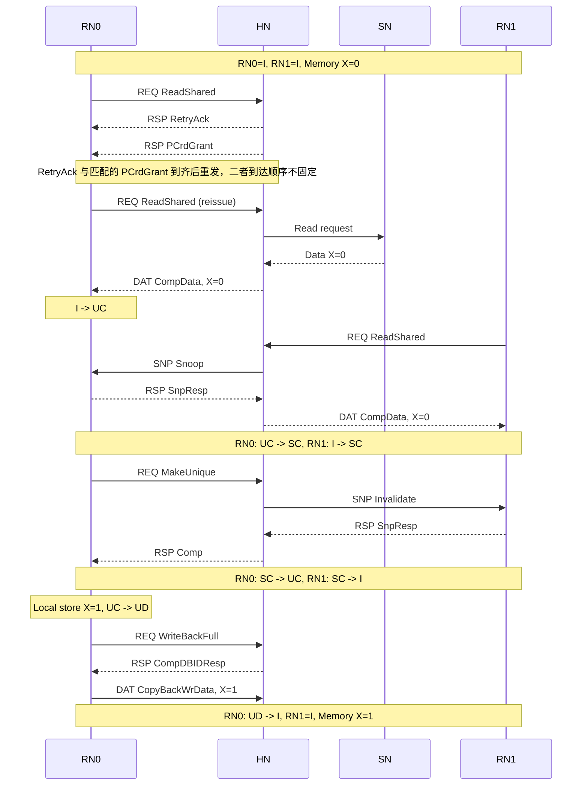

# CHI Transaction

CHI Transaction 是一次协议操作从请求发出到满足完成条件的完整过程。一个 Transaction 可以包含 `REQ`、`RSP`、`DAT` 和 `SNP` Channel 上的多条消息。

```text
Transaction：完整的协议操作
Message：Transaction 中的一条请求、响应、数据或 Snoop 消息
Flit：Message 在 CHI Link 上的传输单元
```

## 1. Read、Write、Snoop、Dataless 和 Retry

先区分这五个词在 Transaction 中所处的层次：

```text
RN 想做什么？
  Read：取得数据和读权限
  Write：把数据交给 Home

HN 为了完成请求还要做什么？
  Snoop：查询或改变其他 RN-F 的副本

该过程是否传输一整条 cache line data？
  Dataless：不传输

请求当前能否被目标接收？
  Retry：暂时不能，需要稍后重发
```

### 1.1 Read：Requester 取得数据

Read 从 RN 向 HN 发送 REQ 开始。RN 的目标是取得 `X` 的数据，以及该请求所要求的缓存状态，例如 `SC` 或 `UC`。

HN 决定数据来源：

- 没有其他 RN-F 持有 `X` 时，数据可以来自 HN 的本地缓存或后端 SN；
- 其他 RN-F 持有干净副本时，HN 可能只需要协调状态，数据仍可来自 HN 或 SN；
- 其他 RN-F 持有 `UD` 或负责最新数据的 `SD` 时，HN 必须从该 RN-F 取得最新数据，不能使用旧的 Memory 数据。

Read 的结果是：Requester 收到所需 Data 和 Completion，并获得相应的 cache state。发出 REQ 只是开始，不是 Read 已经完成。

### 1.2 Write：Requester 把数据交给 Home

Write 的目标是把数据写入 Home 管理的地址路径。它可能来自非 Snoop 写，也可能来自脏 cache line 的写回或驱逐。

CHI 把“请求写什么”和“实际写入的数据”分开：

```text
REQ：地址、Write opcode、事务属性
RSP：可能返回 DBID 或 Completion
DAT：cache line data
```

因此，Write REQ 被接收不表示数据已经到达。带数据的 Write 通常需要后续 DAT；对于需要 DBID 的流程，HN 先返回 DBID，Requester 再以该 DBID 发送数据。

### 1.3 Snoop：HN 协调其他 RN-F 的副本

Snoop 不是 CPU 或 DMA 的原始访问意图，而是 HN 为完成 Read、权限请求或维护操作，对其他 RN-F 发出的协调消息。

HN 使用 Snoop 做三类事：

- **查询**：目标 RN-F 是否持有该 cache line，数据是否最新；
- **改变状态**：要求目标 RN-F 降级或失效副本；
- **取得数据**：当目标 RN-F 持有 `UD` 或 `SD` 的最新数据时，要求其返回数据。

Snoop 的返回有两种基本形式：

```text
RSP: SnpResp       只返回状态或确认，不携带 cache line data
DAT: SnpRespData   返回状态和 cache line data
```

HN 收齐必要的 Snoop Response 后，才能继续完成原来的 Read、Dataless 或其他 Transaction。

### 1.4 Dataless：不传数据，只改变状态或权限

Dataless 描述的是一次 Transaction 是否传输 cache line data，而不是一种独立的访问发起者。

例如，RN0 和 RN1 都处于 `SC`，RN0 想写 `X`。RN0 已有 `X` 的完整数据，只缺唯一权限：

```text
RN0 -> HN：MakeUnique
HN  -> RN1：Invalidate Snoop
RN1 -> HN：SnpResp
HN  -> RN0：Comp
```

整个过程只改变状态：

```text
RN0: SC -> UC
RN1: SC -> I
```

没有任何 Node 需要传输 `X` 的数据，所以它是 Dataless；但它仍是一笔完整 Transaction，包含 REQ、SNP 和 RSP。

### 1.5 Retry：请求未被接受时的重发流程

Retry 发生在 HN 或其他目标暂时没有资源接收请求时。它不是“稍后返回数据”，而是明确表示当前 REQ 没有被接收。

```text
RN -> HN：REQ，且 AllowRetry=1
HN -> RN：RetryAck，携带或关联 PCrdType
HN -> RN：匹配的 PCrdGrant
RN -> HN：重新发送原 REQ
```

`RetryAck` 和匹配的 `PCrdGrant` 都到达后，RN 才能重发。两者在链路上的到达顺序不必固定。重发前 RN 必须保留原请求和 Retry 关联信息；`RetryAck` 本身不提供数据、权限或最终错误结果。

## 2. 场景与状态

场景中包含四个 Node：

| Node | 角色 |
|---|---|
| `RN0` | CPU 0 的 RN-F |
| `RN1` | CPU 1 的 RN-F |
| `HN` | 管理 `X` 所在地址范围的 HN-F |
| `SN` | HN 后端的 SN-F |

使用以下 CHI cache state：

| 状态 | 全称 | 含义 |
|---|---|---|
| `I` | Invalid | 本地没有有效副本 |
| `UC` | Unique Clean | 本地持有唯一的干净副本 |
| `SC` | Shared Clean | 本地持有共享的干净副本 |
| `UD` | Unique Dirty | 本地持有唯一的脏副本，数据比下层更新 |
| `SD` | Shared Dirty | 本地持有共享的脏副本，并承担最新数据责任 |

初始状态：

```text
RN0:    I
RN1:    I
Memory: X = 0，最新
```

主流程经历：

```text
RN0: I -> UC -> SC -> UC -> UD -> I
RN1: I ------> SC -> I
```

## 3. RN0 读取：Retry 与 Read

RN0 对 `X` 发起 `ReadShared`：

```text
RN0                     HN
 |-- REQ: ReadShared --->|
```

假设 HN 暂时没有事务资源，并且该请求允许 Retry：

```text
RN0                     HN
 |<-- RSP: RetryAck ------|
 |<-- RSP: PCrdGrant -----|  两者顺序不固定
 |-- REQ: ReadShared --->|  条件满足后重发
```

`RetryAck` 表示当前请求未被接受。RN0 必须保留原请求和 `PCrdType` 等 Retry 上下文，在 `RetryAck` 与匹配的 `PCrdGrant` 都已到达后重发。

重发请求被接受后，HN 确认没有其他 RN-F 持有 `X`，从 SN 取得数据：

```text
RN0                     HN                      SN
 |-- REQ: ReadShared --->|                       |
 |                       |-- Read request ------>|
 |                       |<-- Data: X=0 ---------|
 |<-- DAT: CompData -----|                       |
 |        X=0            |                       |
```

结果：

```text
RN0:    UC，X = 0
RN1:    I
Memory: X = 0
```

REQ 发出不代表 Read 完成。RN0 收到该请求要求的 Completion 和全部 Data 后，才能完成 Read Transaction。

## 4. RN1 读取：Snoop

RN1 也对 `X` 发起 `ReadShared`。HN 查到 RN0 为 `UC`，向 RN0 发送 Snoop，使其从唯一状态转为共享状态：

```text
RN1                     HN                     RN0
 |-- REQ: ReadShared --->|                      |
 |                       |-- SNP: Snoop ------->|
 |                       |<-- RSP: SnpResp ------|
 |<-- DAT: CompData -----|                      |
 |        X=0            |                      |
```

RN0 的数据与 Memory 相同，因此该场景只需返回无数据的 `SnpResp`。数据由 HN 或 SN 路径返回 RN1。

结果：

```text
RN0:    SC，X = 0
RN1:    SC，X = 0
Memory: X = 0
```

如果被 Snoop 的 RN-F 为 `UD`，或者为承担最新数据责任的 `SD`，Memory 中的数据可能已经过期。此时 RN-F 需要根据 Snoop 要求返回 `SnpRespData`，或把数据直接转发给原 Requester。

```text
无数据 Snoop Response：RSP，例如 SnpResp
带数据 Snoop Response：DAT，例如 SnpRespData
```

## 5. RN0 获取写权限：Dataless

RN0 当前为 `SC`，已经持有 `X=0`，但 RN1 也为 `SC`。RN0 必须先取得唯一权限，才能修改数据。

```text
RN0                     HN                     RN1
 |-- REQ: MakeUnique --->|                      |
 |                       |-- SNP: Invalidate -->|
 |                       |<-- RSP: SnpResp ------|
 |<-- RSP: Comp ---------|                      |
```

该事务不传输 cache line data：

- RN0 已有完整数据；
- RN1 的 `SC` 副本只需从 `SC` 转为 `I`；
- HN 收到失效响应后，向 RN0 授予 `UC`。

结果：

```text
RN0:    UC，X = 0
RN1:    I
Memory: X = 0
```

RN0 随后在本地修改数据：

```text
RN0:    UD，X = 1
RN1:    I
Memory: X = 0，过期
```

`MakeUnique` 在 RN0 从 `SC` 转为 `UC` 时完成。本地写入使 RN0 从 `UC` 转为 `UD`，但这次本地写入本身不需要发送 CHI Write Request。

## 6. RN0 驱逐脏行：Write

RN0 驱逐处于 `UD` 的 `X` 时，必须把最新数据交回 Home。下面使用 CopyBack Write 的典型流程：

```text
RN0                         HN
 |-- REQ: WriteBackFull --->|
 |<-- RSP: CompDBIDResp -----|
 |-- DAT: CopyBackWrData --->|
 |        X=1                |
```

1. `WriteBackFull` 指明写回地址和事务属性。
2. `CompDBIDResp` 同时返回 Completion 和 `DBID`。
3. RN0 使用该 `DBID` 发送 `CopyBackWrData`。
4. HN 接收数据并更新目录、Home Cache 或后端 Memory。

结果：

```text
RN0:    I
RN1:    I
Memory: X = 1，最新
```

Write Request 和 Write Data 位于不同 Channel：

- REQ 描述地址、操作和事务属性；
- DAT 携带 cache line data；
- `TxnID`、`DBID` 和 `DataID` 用于关联请求、响应和数据 beat。

本场景中的 Write 来自脏行驱逐，不与某条 CPU Store 一一对应。

## 7. 状态与消息汇总

| 步骤 | 关键消息 | 状态变化 |
|---|---|---|
| RN0 首次读取被拒绝 | `ReadShared`、`RetryAck`、`PCrdGrant` | 状态不变，原请求重发 |
| RN0 读取成功 | `ReadShared`、`CompData` | RN0：`I -> UC` |
| RN1 读取 | Read REQ、SNP、`SnpResp`、`CompData` | RN0：`UC -> SC`；RN1：`I -> SC` |
| RN0 获取唯一权限 | `MakeUnique`、失效 SNP、`SnpResp`、`Comp` | RN0：`SC -> UC`；RN1：`SC -> I` |
| RN0 本地写入 | 无 CHI 消息 | RN0：`UC -> UD` |
| RN0 写回驱逐 | `WriteBackFull`、`CompDBIDResp`、`CopyBackWrData` | RN0：`UD -> I`；Memory 更新为 `X=1` |

## 8. 全局事务时空图


