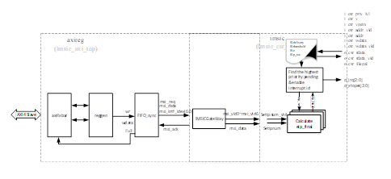

# 🧭集成指南（Integration Guide）

<!-- vim-markdown-toc GFM -->

* [概览（Overview）](#概览overview)
* [参数（Parameters）](#参数parameters)
  * [`IMSICParams`](#imsicparams)
* [实例化（Instantiation）](#实例化instantiation)
  * [关于hartIndex（About hartIndex）](#span-stylecolorred关于hartindexabout-hartindexspan)
* [示例（Examples）](#示例examples)
  * [简单的4核系统（A Simple 4-Hart System）](#简单的4核系统a-simple-4-hart-system)
  * [分组的4核系统（A Grouped 4-Hart System）](#分组的4核系统a-grouped-4-hart-system)

<!-- vim-markdown-toc -->

本指南介绍如何将ChiselAIA集成到RISC-V系统中。

This guide introduces the integration process of ChiselAIA into a RISC-V system.

## 概览（Overview）

集成涉及2个Scala文件，共4个Scala类：

* `IMSIC.scala`：
  * `IMSICParams`：用于配置IMSIC实例的参数类
  * `IMSIC`：IMSIC模块的核心逻辑
  * 每个处理器核心需要一个实例：
    * `TLIMSIC`：对`IMSIC`模块的Tilelink协议包装
    * `AXI4IMSIC`：对`IMSIC`模块的AXI4协议包装

## 参数（Parameters）

本节概述了APLIC和IMSIC的可配置参数。
虽然提供了默认值，但我们强烈建议根据具体的集成需求，自定义带有👉标记的参数。
其他参数要么是派生的，要么是硬编码的（详情参见`Params.scala`）。

This section outlines the configurable parameters for APLIC and IMSIC.
While defaul values are provided,
we strongly recommend customizing parameters marked with 👉 to suit your specific integration needs.
Other parameters are either derived or hard-coded, (see `Params.scala` for details).

命名约定：
* `Num`后缀：某实体的数量，
* `Width`后缀：某实体的位宽（通常是`log2(实体数量)`），
* `Addr`后缀：某实体的地址。

### `IMSICParams`

{{#include ./IMSIC_scala.md}}

## 实例化（Instantiation）

* `IMSICParams`：
  * 每个类一个实例，
  * 根据[参数](#参数parameters)部分的说明，实例化参数。
* `TLIMSIC`/`AXI4IMSIC`：
  * 每个核心一个实例，
  * 参数`params`：接收`IMSICParams`的实例，

### 关于hartIndex（About hartIndex）

根据AIA规范：
AIA的hart编号
可能与RISC-V特权架构分配给hart的唯一
hart标识符（“hart ID”）无关。
在ChiselAIA中，hartIndex编码为groupID拼接上memberID。

## 示例（Examples）

IMSIC对外集成接口，只有总线接口，支持AXI4或TileLink,如下

### 6.3	地址空间
AIA SPEC明确规定，多interrupt files场景下, Supervisor-level只能访问all Supervisor-level and guest interrupt files,不能访问Machine-level interrupt files. 因此，在地址排布上，所有的Machine-level interrupt file集中连续分配，Supervisor-level and guest interrupt files集中连续分配，这样仅用一个PMP table entry就能保证Supervisor-level没有S/VS interrupt files以外的访问权限。
当然，当系统使用chiplet技术，Harts被划分为多个group，每个group存在于单独的一颗芯片上，这时多颗芯片的地址空间交织在一起，就变得不再可行，这种场景下，每个group单独使用一个PMP table entry，来保证supervisor-level的访问全是非machine-level interrupt files. 这个在硬件设计上，体现的是interrupt file的基地址划分规则上。
以下，展示了非group场景下的整体排布示意图如下：
 
图 6 2 interrupt files地址空间分布示意图
M interrupt file访问地址：A+h×2C,A是M interrupt file的基地址，我们设置为0x61000000。
其中h是Hart index，c最小是12（满足interrupt file 4KB对齐要求，我们固定设置为12，使得中断文件之间紧凑排布），假设k = [log2(hmax + 1)], 则M interrupt file访问地址格式需要满足两个条件：
1.	基地址对齐方式：bit[(11+k):0]为0. 
2.	访问地址格式如下：
 
图 6 3 M interrupt file access format
说明：
低12bit表示MSI具体地址，目前0x000对应小端seteipnum_le，存储了中断号，bit[11+k:12]表示了该次传递的中断号是发往哪一个中断文件的。
一个hart对接一个imsic，每个imsic内默认有1个M中断文件，M中断文件的地址空间可在集成时进行配置。

S interrupt file访问地址：B+h × 2D , B是S interrupt file的基地址。
同样S interrupt file访问地址格式需要满足两个条件：
1.	基地址对齐方式：bit[11+ j + k:0]为0.  其中j= log2(intFilesNum-1)，intFilesNum：每个Hart支持的interrupt file总数，这里’-1’，表示抠除了M interrupt file.
2.	访问地址格式如下：
 
图 6 4 S/VS interrupt file access format
以intFilesNum=4为例，具体地址排布如下：

表 6 1 M interrupt file地址分布(intFilesNum=4)
BASE_ADDR_INTRF = BASE_ADDR_MINTRF 
region	start addr	end addr	addr size
Hart0 m	0x0	0xfff	4KB
Hart1 m	0x1000	0x1fff	4KB
Hart2 m	0x2000	0x2fff	4KB
Hart3 m	0x3000	0x3fff	4KB

表 6 2 S interrupt file地址分布(NR_HARTs=4, intFilesNum=7)
BASE_ADDR_INTRF = BASE_ADDR_SINTRF
region	start addr	end addr	addr size
Hart0 s	0x0	0xfff	4KB
Hart0 vs1	0x1000	0x1fff	4KB
Hart0 vs2	0x2000	0x2fff	4KB
…	…	…	…
Hart0 vs5	0x5000	0x5fff	4KB
Hart1 s	0x8000	0x8fff	4KB
Hart1 vs1	0x9000	0x9fff	4KB
Hart1 vs2	0xa000	0xafff	4KB
…	…	…	…
Hart1 vs5	0xd000	0xdfff	4KB
Hart2 s	0x10000	0x10fff	4KB
Hart2 vs1	0x11000	0x11fff	4KB
Hart2 vs2	0x12000	0x12fff	4KB
…	…	…	…
Hart2 vs5	0x15000	0x15fff	4KB
Hart3 s	0x18000	0x18fff	4KB
Hart3 vs1	0x19000	0x19fff	4KB
Hart3 vs2	0x1a000	0x1afff	4KB
…	…	…	…
Hart3 vs5	0x1d000	0x1dfff	4KB

