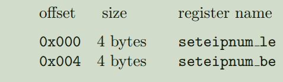

ChiselAIA的实现遵循[RISC-V高级中断架构（Advanced Interrupt Architecture, AIA）规范](https://github.com/riscv/riscv-aia)。
实现与规范之间的任何差异都应视为实现bug.
本次实现，是对AIASPEC的解读，IMSIC具体功能描述可见章节5.1，另外，
相对SPEC来讲，未实现feature如下：
eidelivery目前只有0和1两种情况，未实现0x40000000取值场景；
中断pending寄存器，目前只实现小端寄存器配置，对应偏移地址是0x000，未实
现seteipnum_be:

支持以下特性：
1.支持MSI中断的接收，处理，MSI接口为AXI4-Lite协议。
2.支持M,S,VS三种interruptfile，每个interruptfile是4KB对齐。
3.每个interruptfile都有各自的CSR来访问：*iselect,*ireg，*代表m,s,vs，另外vs
模式下操作的具体guestinterruptfile，由hstatus.VGEIN[5:0]指定。
4.分两组件交付，便于复杂系统集成下的时序收敛:imsic_axi_top,imsic_csr_top.集
成方式上，支持1对1，或1对多（非group场景）。
5.具有较高的规格拓展性，支持的中断总数，interruptfile总数，Hart总数，等参数
化定义；集成方式二选1（imsic_axi_top与imsic_csr_top集成方式为1对多场景
下，会进行Hartindex的解析）.
目前暂时按照中断总数最高512个,interruptfile总数7个(m+s+5vs)来验证：。
6.只支持小端配置MSIID方式，写入Setipnum_le,不支持大端配置方式.
7.eidelivery目前只有0和1两种情况，未实现0x40000000取值场景；
8.MSI访问存在反压，不支持outstanding，内置fifo，用来存储axitranscation，避
免setipnum产生到异步处理完成前被改写的场景，fifo深度参数化。
9.支持MSI地址非法访问错误上报，若写访问地址不在可分配的interruptfile范围
内，则给总线返回DECERR，读访问不支持错误上报。
10.遵循SPEC规范，支持CSR非法访问错误上报机制。
11.	提供了安全TEE访问模式和REE非安全访问模式，由cmode参数控制是否开启安全访问机制。
12.	实现了AXI4IMSIC以及TLIMSIC两个接口形式的顶层文件