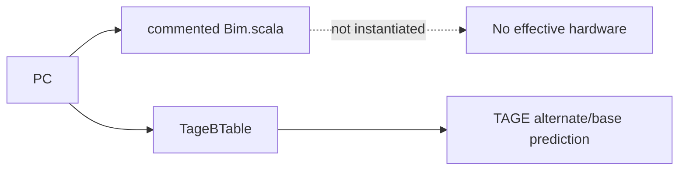

# Frontend Bim

## Scope

- Source: OpenXiangShan/XiangShan `kunminghu-v2`, commit `52262f303fc06daf84cdab7011d59b7df65ce7e8`.
- Relative source file: `src/main/scala/xiangshan/frontend/Bim.scala`.
- Effective status: not effective. The whole file is inside a block comment (`Bim.scala:16-124`), and default predictor construction does not instantiate it (`Parameters.scala:124-143`).

## What Exists in the File

The commented implementation describes a conventional bimodal table:

| Topic | Source lines | Core code | Meaning if enabled |
| --- | --- | --- | --- |
| Params | `Bim.scala:26-29` | `bimSize = 2048`, `bypassEntries = 4` | 2048-row direction table. |
| Table | `Bim.scala:31-35` | `SRAMTemplate(UInt(2.W), set=bimSize, way=numBr)` | Per-branch-slot 2-bit counters. |
| Reset | `Bim.scala:36-40`, `93-99` | reset rows to `2.U` | Weak-taken initialization. |
| Read index | `Bim.scala:41-50` | `bimAddr.getIdx(s0_pc_dup(0))` | PC-indexed lookup. |
| Update | `Bim.scala:63-99` | `satUpdate(oldCtrs, 2, taken)` | Saturating-counter training. |
| Bypass | `Bim.scala:73-85` | `WrBypass` | Same-index update forwarding. |

## Effective Current Replacement

The current effective TAGE implementation includes its own base bimodal table, `TageBTable`, instead of the old standalone `BIM` module. `TageBTable` uses 2-bit counters, banked SRAM, weak-taken reset, write bypass, and saturating update (`Tage.scala:143-270`). This is the direction baseline used by TAGE provider/alternate selection (`Tage.scala:825-837`).

## Algorithm Principle

Bimodal prediction is the classic PC-indexed two-bit saturating-counter method: counter MSB predicts taken/not-taken; update increments on taken and decrements on not-taken, saturating at both ends. MCP search did not return a precise Smith two-bit-counter paper entry; this file therefore states only the standard principle and relies on XiangShan source for code behavior.

## Algorithm Example Walkthrough

This example is non-effective for the analyzed commit because `Bim.scala` is entirely inside a block comment (`Bim.scala:16-124`) and the default predictor chain instantiates `Tage_SC`, not standalone `BIM` (`Parameters.scala:124-143`). The effective base bimodal behavior is inside `TageBTable` (`Tage.scala:143-270`).

Non-effective standalone BIM example:

1. Lookup input: PC `0x8000_6000` maps through `bimAddr.getIdx(s0_pc_dup(0))` (`Bim.scala:31-45`) to a 2048-row table index. If branch slot 0 counter is `2'b10`, `Bim.scala:54-61` would use counter MSB as taken metadata.
2. Update input: FTQ update says the branch resolved not-taken. `Bim.scala:63-71` would qualify the branch update and build `need_to_update` only for valid FTB branch slots before the first taken branch.
3. Bypass: if the same index was recently written, `Bim.scala:73-85` would use `WrBypass` data instead of stale metadata counters.
4. Saturating update: `Bim.scala:87-99` would compute `satUpdate(2'b10, 2, false) = 2'b01` and write only the updated branch way.

Current effective base-table example:

1. `TageBTable` receives the same PC, computes `bimAddr.getIdx(pc)`, bank mask, and bank index (`Tage.scala:155-205`).
2. It reads 2-bit counters, unshuffles physical branch index to logical branch slot (`Tage.scala:207-215`), and supplies `s1_basecnts` to TAGE provider/alternate selection (`Tage.scala:825-837`).
3. On update, it uses `WrBypass` for same-index RAW behavior (`Tage.scala:224-241`) and applies 2-bit saturating update (`Tage.scala:243-267`).

Downstream effect: standalone `BIM` has no hardware effect in this commit; `TageBTable` affects TAGE's alternate/base prediction through `s1_basecnts` and `s1_altUsed` (`Tage.scala:825-839`).

## Stage-by-Stage Algorithm

Standalone `BIM` has no effective stages in this commit because `Bim.scala` is commented out (`Bim.scala:16-124`) and is not instantiated by the default predictor chain (`Parameters.scala:124-143`). The effective bimodal/base behavior is `TageBTable`.

| Stage | Effective replacement | Algorithm and state | Ready/stall | Output | Source lines |
| --- | --- | --- | --- | --- | --- |
| S0 lookup | `TageBTable` | Compute PC index, bank mask, bank index; read selected SRAM bank. | `io.req.ready := !doing_reset`; bank write conflict marks response invalid. | Base-table read request. | `Tage.scala:155-205` |
| S1 response | `TageBTable` | Select bank response, unshuffle physical branch counter to logical slot. | `s1_resp_valid := !s1_resp_invalid_by_conflict`. | `s1_cnt` for TAGE alternate/base. | `Tage.scala:207-215` |
| Update | `TageBTable` | Compute update index/bank; use `WrBypass`; saturating-update 2-bit counters; write masked branch ways. | Single-port write can conflict with later read. | Updated base counters. | `Tage.scala:217-267` |
| Non-effective standalone BIM | Commented `Bim.scala` | Would have S0 PC index, S1 counter read, update with `WrBypass`. | Not elaborated. | No hardware output. | `Bim.scala:31-99` |

## Redirect Signal Generation

Standalone `BIM` generates no redirect because it is not effective. The effective `TageBTable` can influence redirect only through TAGE's S2 direction output.

| Redirect influence | Condition | Stage | BPU generation | Source lines |
| --- | --- | --- | --- | --- |
| Base prediction used by TAGE | No tagged provider, or provider is weak and use-alt-on-NA selects alternate. | TAGE S2 | If base direction differs from S1 upstream prediction, BPU asserts S2 redirect. | `Tage.scala:825-846`, `frontend/BPU.scala:620-705` |
| Base-table update | Resolved branch updates 2-bit counter. | Update | No immediate redirect; changes future TAGE alternate/base prediction. | `Tage.scala:217-267`, `999-1002` |
| Standalone BIM path | Commented out. | None | No redirect. | `Bim.scala:16-124` |

Example: `TageBTable` returns base counter `2'b11` and no tagged provider hits. TAGE uses base taken (`Tage.scala:825-837`) and writes S2 `br_taken_mask`. If FauFTB S1 had predicted not-taken, BPU S2 detects `takenDiff` and redirects.

## Predictor Relationship

The effective Kunminghu frontend predictor chain is not a set of independent predictors voting in parallel. `Parameters.scala:124-143` constructs `FauFTB`, `Tage_SC`, `FTB`, `ITTage`, and `RAS`, connects them as `resp_in -> uftb -> tage -> ftb -> ittage -> ras`, and returns `ras.io.out` as the final composed prediction. `Bim.scala` is not part of this chain in this commit; its effective role is replaced by the `TageBTable` base table inside `Tage.scala:143-270`.

| Component | Relationship to the chain | What it contributes | How disagreement is handled | Source lines |
| --- | --- | --- | --- | --- |
| `BPU` / `Predictor` | Owns the pipeline, history state, redirect generators, and FTQ response. It does not compute every prediction locally; it drives `Composer`. | Shared PC/history inputs, stage fire/ready, global-history/folded-history repair, and final `io.bpu_to_ftq.resp`. | Compares later-stage composed predictions against earlier predictions and emits S2/S3/backend redirects. | `frontend/BPU.scala:381-455`, `606-635`, `698-725`, `827-854`, `915-1050` |
| `Composer` | Broadcasts common inputs/control to every component and gathers the final response from the configured chain. | Shared `s0_pc`, folded history, global history, stage fires, redirect, control, update, and concatenated `last_stage_meta`. | All components see the same redirect/update event; `io.in.ready` is the AND of component readiness, so one blocked predictor stalls the chain. | `frontend/Composer.scala:22-77` |
| `FauFTB` / uFTB | First and fast predictor in the chain. Its output feeds `Tage_SC`, and its entry/hit information also feeds `FTB`. | Early target/fall-through/entry information for fast S1 prediction. | Later `FTB`/`Tage`/`ITTAGE`/`RAS` output can refine it; BPU turns the difference into S2/S3 redirect. | `Parameters.scala:127-139`, `frontend/Composer.scala:25-31`, `frontend/FauFTB.scala:76-128` |
| `Tage_SC` | Receives uFTB output, then updates conditional branch direction before FTB/ITTAGE/RAS see the prediction. | TAGE direction plus SC correction over the base table and tagged tables. | If direction or first-taken branch differs from the fast prediction, BPU S2 comparison observes `takenDiff`/`lastBrPosOHDiff`. | `Parameters.scala:128-140`, `frontend/Tage.scala:778-846`, `frontend/SC.scala:259-372` |
| `FTB` | Receives TAGE-refined prediction and uFTB cached entry/hit information. | Direct branch/JAL target entries, branch-slot metadata, fall-through, multi-hit detection. | Target, CFI slot, fall-through, or multi-hit differences become S2/S3 redirect causes. | `Parameters.scala:126-138`, `frontend/FTB.scala:683-811`, `frontend/BPU.scala:827-854` |
| `ITTAGE` | Receives FTB output and specializes the JALR/indirect target path. | Indirect target override and ITTAGE metadata for later training. | If the indirect target changes after earlier stages, BPU observes target/JALR target differences and redirects. | `Parameters.scala:130-141`, `frontend/ITTAGE.scala:418-470`, `frontend/BPU.scala:827-854` |
| `RAS` / `newRAS` | Last component in the chain and therefore the final returned response. | Return target prediction, speculative stack pointer/top metadata, cancel/recovery behavior. | RAS target or cancel effects are reflected in final S3 prediction; backend redirect repairs RAS/history state through shared redirect/update paths. | `Parameters.scala:129-143`, `frontend/newRAS.scala:696-706`, `frontend/Composer.scala:37-56` |

Metadata and training are also chained. `Composer` concatenates each component's `last_stage_meta` in chain order (`frontend/Composer.scala:58-70`), FTQ stores that combined metadata (`frontend/NewFtq.scala:637`), and update walks components in reverse order to split the metadata back to each predictor (`frontend/Composer.scala:72-77`). This means a single FTQ update can train TAGE counters, FTB entries, ITTAGE target entries, and RAS state with the metadata each component produced during prediction.

Cross-predictor example: suppose uFTB predicts fall-through for PC `0x8000_1000`, but TAGE later marks branch slot 0 taken and FTB supplies target `0x8000_1080`. The chain first carries the uFTB result into `Tage_SC` and `FTB` (`Parameters.scala:136-140`). BPU records the earlier S1 prediction, compares it with the richer S2 composed response, and detects direction/target/CFI-index differences (`frontend/BPU.scala:606-635`, `698-705`). It then registers the S2 target, folded history, and global-history pointer into the next-PC/history generators (`frontend/BPU.scala:707-725`). If an even later RAS or ITTAGE target differs in S3, the S3 comparison checks branch-taken mask, target, JALR target, fall-through error, and FTB multi-hit before generating `s3_redirect` (`frontend/BPU.scala:827-854`).

## Scenario Summary

| Scenario | Effective in current commit? | Explanation |
| --- | --- | --- |
| Standalone BIM lookup | No | `Bim.scala` is commented and not instantiated. |
| Standalone BIM update | No | Same reason. |
| Base bimodal fallback for TAGE | Yes | Implemented by `TageBTable`, source `Tage.scala:143-270`. |
| Two-bit counter conflict bypass | Yes, inside TAGE base table | `Tage.scala:224-241` forwards pending updates. |

## Diagram

